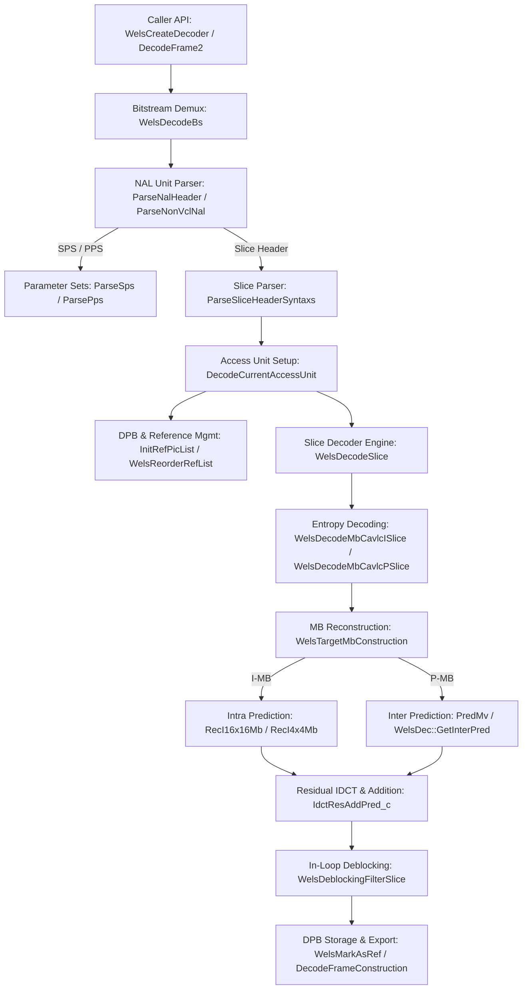

# Literate Walkthrough of OpenH264 Baseline Decoding

This document presents a comprehensive, literate-programming exploration of the **OpenH264 H.264/AVC decoder implementation**, tracing the lifecycle of a bitstream from raw Annex B NAL units to reconstructed YUV 4:2:0 planar frames.

The analysis and call graph are grounded in empirical code coverage (`GCOV`) gathered while decoding the Baseline H.264 test vector **[`res/SVA_BA2_D.264`](res/SVA_BA2_D.264)** (Constrained Baseline Profile, Level 2.1, 176x144 QCIF, 17 total frames: **1 I-frame** and **16 P-frames**).

> [!NOTE]
> Every function discussed in this walkthrough was executed (`hit_count > 0`) during the decoding of `res/SVA_BA2_D.264`. Each header links directly to its source definition in the OpenH264 repository.

---

## Architecture & Data Flow



---

## Chapter 1: Decoder Instantiation & Initialization

Before decoding can begin, the client application instantiates the decoder and initializes its internal context, thread pool, and function tables.

### 1.1 External Entry Point & Instance Creation
* **[`WelsCreateDecoder(ISVCDecoder** ppDecoder)`](codec/decoder/plus/src/welsDecoderExt.cpp#L1427)**
  * The exported C-ABI function that allocates and returns a new instance of [`CWelsDecoder`](codec/decoder/plus/src/welsDecoderExt.cpp) implementing the `ISVCDecoder` interface.
* **[`CWelsDecoder::CWelsDecoder()`](codec/decoder/plus/src/welsDecoderExt.cpp)**
  * Constructor that initializes decoder mutexes, statistics loggers (`TagVideoDecoderStatistics`), and zero-initializes the main internal context pointer (`PWelsDecoderContext`).

### 1.2 Context Allocation & Parameter Validation
* **[`CWelsDecoder::Initialize(const SDecodingParam* pParam)`](codec/decoder/plus/src/welsDecoderExt.cpp)**
  * Validates user-supplied parameters (e.g., thread count, error concealment mode) and delegates to `InitDecoder()`.
* **[`CWelsDecoder::InitDecoder(const SDecodingParam* pParam)`](codec/decoder/plus/src/welsDecoderExt.cpp)**
  * Manages thread pool setup via [`CWelsDecoder::OpenDecoderThreads()`](codec/decoder/plus/src/welsDecoderExt.cpp) and initializes the core decoding context (`TagWelsDecoderContext`) via `InitDecoderCtx()`.
* **[`CWelsDecoder::InitDecoderCtx(PWelsDecoderContext& pCtx, const SDecodingParam* pParam)`](codec/decoder/plus/src/welsDecoderExt.cpp)** / **[`WelsInitDecoder(PWelsDecoderContext pCtx, SLogContext* pLogCtx)`](codec/decoder/core/src/decoder.cpp#L691)**
  * Allocates `TagWelsDecoderContext` using aligned memory (`CMemoryAlign`). Sets default profile/level capabilities (`WelsDecoderDefaults`, `WelsDecoderSpsPpsDefaults`), allocates NAL unit parse buffers, and calls `WelsOpenDecoder()`.
* **[`WelsOpenDecoder(PWelsDecoderContext pCtx, SLogContext* pLogCtx)`](codec/decoder/core/src/decoder.cpp)**
  * Detects host CPU SIMD capabilities (`GetCPUCount()`, `WelsCPUFeatureDetect()`) and binds function tables for entropy decoding, transforms, prediction, and deblocking.
* **[`WelsInitStaticMemory(PWelsDecoderContext pCtx)`](codec/decoder/core/src/decoder_core.cpp)** / **[`WelsRequestMem(PWelsDecoderContext pCtx)`](codec/decoder/plus/src/welsDecoderExt.cpp)**
  * Allocates static parameter set buffers (`TagSps`, `TagPps`), bitstream reader auxiliary structures (`TagBitStringAux`), and picture queue structures (`TagPicBuff`).

### 1.3 Binding Function Tables (C / SIMD Dispatch)
* **[`InitDecFuncs(PWelsDecoderContext pCtx, int32_t iCpuCores, uint32_t uiCpuFlag)`](codec/decoder/core/src/decoder.cpp)**
  * Populates function pointers in `pCtx` for macroblock reconstruction, CAVLC syntax reading, and deblocking. Selects x86 SSE2/AVX2 or ARM NEON routines when available, falling back to C implementations.
* **[`InitPredFunc(PWelsDecoderContext pCtx, uint32_t uiCpuFlag)`](codec/decoder/core/src/decoder.cpp)**
  * Binds intra-prediction routines (`WelsI4x4LumaPredV_c`, `WelsI4x4LumaPredH_c`, etc.) and inter-prediction sample interpolation filters (`mc_luma`, `mc_chroma`, `mb_copy`).
* **[`WelsBlockFuncInit(TagBlockFunc* pFunc, int32_t iCpu)`](codec/decoder/core/src/decode_slice.cpp)**
  * Assigns block-level residual processing functions (IDCT, residual addition, zero-checking).

---

## Chapter 2: Bitstream Ingestion & NAL Unit Demuxing

When the caller submits a raw H.264 byte stream, the decoder scans for start codes and demuxes NAL units.

```
Raw Bitstream:  [0x00 0x00 0x00 0x01] [NAL Header: SPS] [RBSP Payload] ...
```

### 2.1 Frame Decoding API Loop
* **[`CWelsDecoder::DecodeFrame2(const unsigned char* kpSrc, const int kiSrcLen, unsigned char** ppDst, SBufferInfo* pDstInfo)`](codec/decoder/plus/src/welsDecoderExt.cpp#L918)**
  * Main public API called for each incoming packet. Delegates to [`CWelsDecoder::DecodeFrame2WithCtx()`](codec/decoder/plus/src/welsDecoderExt.cpp#L735), which passes the bitstream buffer to `WelsDecodeBs()`.
* **[`WelsDecodeBs(PWelsDecoderContext pCtx, const uint8_t* kpBsBuf, const int32_t kiBsLen, uint8_t** ppDst, SBufferInfo* pDstInfo, SParserBsInfo* pDstBsInfo)`](codec/decoder/core/src/decoder.cpp#L741)**
  * The core demultiplexer loop. Searches `kpBsBuf` for Annex B 3-byte (`0x000001`) or 4-byte (`0x00000001`) start codes. For each NAL unit located, it un-escapes emulation prevention bytes (`0x000003 -> 0x0000`) and calls `ParseNalHeader()`.

### 2.2 NAL Unit Header & Non-VCL Parsing
* **[`ParseNalHeader(PWelsDecoderContext pCtx, SNalUnitHeader* pNalUnitHeader, uint8_t* pSrcRbsp, int32_t iSrcRbspLen, uint8_t* pSrcNal, int32_t iSrcNalLen, int32_t* pConsumedLen)`](codec/decoder/core/src/au_parser.cpp#L108)**
  * Decodes the first byte of the NAL unit:
    * `forbidden_zero_bit` (must be 0)
    * `nal_ref_idc` (indicates if the NAL unit is a reference frame)
    * `nal_unit_type`:
      * `7`: Sequence Parameter Set (`SPS`)
      * `8`: Picture Parameter Set (`PPS`)
      * `5`: IDR Slice (`I-frame`)
      * `1`: Coded Slice of a non-IDR picture (`P-frame`)
* **[`ParseNonVclNal(PWelsDecoderContext pCtx, uint8_t* pRbsp, const int32_t kiRbspLen, uint8_t* pSrcNal, const int32_t kSrcNalLen)`](codec/decoder/core/src/au_parser.cpp)**
  * Dispatches non-VCL NAL units (`nal_unit_type == 7 || nal_unit_type == 8`) to `ParseSps()` and `ParsePps()`.

### 2.3 Parameter Set Decoding (SPS / PPS)
* **[`ParseSps(PWelsDecoderContext pCtx, PBitStringAux pBsAux, int32_t* pPicWidth, int32_t* pPicHeight, uint8_t* pSrcNal, const int32_t kSrcNalLen)`](codec/decoder/core/src/au_parser.cpp#L925)**
  * Parses the Sequence Parameter Set (`SPS`):
    * `profile_idc` (`66` for Baseline in `SVA_BA2_D.264`) and `level_idc` (`21` for Level 2.1).
    * `log2_max_frame_num_minus4`, `log2_max_pic_order_cnt_lsb_minus4`, `max_num_ref_frames`.
    * Picture dimensions: `pic_width_in_mbs_minus1` (`10` -> 176px) and `pic_height_in_map_units_minus1` (`8` -> 144px).
  * Uses bitstream reader utilities:
    * [`WelsDec::DecInitBits(TagBitStringAux*, const uint8_t*, int)`](codec/decoder/core/src/bit_stream.cpp) & [`WelsDec::InitReadBits(TagBitStringAux*, long)`](codec/decoder/core/src/bit_stream.cpp): Initializes bit-reader pointers.
    * [`BsGetBits(TagBitStringAux*, int, uint32_t*)`](codec/decoder/core/src/decoder_core.cpp), [`BsGetUe(TagBitStringAux*, uint32_t*)`](codec/decoder/core/src/decoder_core.cpp), & [`BsGetSe(TagBitStringAux*, int32_t*)`](codec/decoder/core/src/decoder_core.cpp): Extracts fixed-length bits, unsigned Exp-Golomb (`ue(v)`), and signed Exp-Golomb (`se(v)`) values.
* **[`ParsePps(PWelsDecoderContext pCtx, PPps pPpsList, PBitStringAux pBsAux, uint8_t* pSrcNal, const int32_t kSrcNalLen)`](codec/decoder/core/src/au_parser.cpp#L1340)**
  * Parses Picture Parameter Set (`PPS`):
    * `pic_parameter_set_id`, `seq_parameter_set_id`.
    * `entropy_coding_mode_flag` (`0` -> CAVLC).
    * `num_ref_idx_l0_default_active_minus1`, `pic_init_qp_minus26`, and `deblocking_filter_control_present_flag`.

---

## Chapter 3: Slice Header Parsing & DPB Reference Management

When a VCL NAL unit (`nal_unit_type == 1 || nal_unit_type == 5`) is encountered, the decoder begins a new Access Unit (`AU`) and prepares the Decoded Picture Buffer (`DPB`).

### 3.1 Slice Header Parsing
* **[`ParseSliceHeaderSyntaxs(PWelsDecoderContext pCtx, PBitStringAux pBs, const bool kbExtensionFlag)`](codec/decoder/core/src/decoder_core.cpp#L874)**
  * Reads the slice header syntax elements:
    * `first_mb_in_slice`: Starting macroblock address (0 for the first slice).
    * `slice_type`: Identifies `I-slice` (IDR frame 0) or `P-slice` (frames 1–16).
    * `pic_parameter_set_id`: Links slice to the active PPS/SPS.
    * `frame_num`: Picture sequence number.
    * `idr_pic_id` (for IDR slices) and Picture Order Count (`pic_order_cnt_lsb`).
    * `slice_qp_delta`: Determines the initial quantization parameter (`QP`).
* **[`FillDefaultSliceHeaderExt`](codec/decoder/core/src/decoder_core.cpp)**
  * Populates slice extension structures for SVC / Baseline compatibility.
* **[`ParseRefPicListReordering(PBitStringAux pBs, TagSliceHeaders* pSh)`](codec/decoder/core/src/decoder_core.cpp)**
  * In P-slices, checks `ref_pic_list_reordering_flag_l0`. If set, parses modification commands to reorder short-term/long-term reference pictures in List 0.
* **[`ParseDecRefPicMarking(PWelsDecoderContext pCtx, PBitStringAux pBs, TagSliceHeaders* pSh, TagSps* pSps, bool kbIdrFlag)`](codec/decoder/core/src/decoder_core.cpp)**
  * Parses Memory Management Control Operations (`MMCO`):
    * For IDR frames: reads `no_output_of_prior_pics_flag` and `long_term_reference_flag`.
    * For non-IDR frames: reads `adaptive_ref_pic_marking_mode_flag` and explicit MMCO commands (e.g., mark short-term reference as unused).

### 3.2 Access Unit Construction & DPB Setup
* **[`DecodeCurrentAccessUnit(PWelsDecoderContext pCtx, uint8_t** ppDst, SBufferInfo* pDstInfo)`](codec/decoder/core/src/decoder_core.cpp#L2490)** / **[`WelsDecodeAccessUnitStart(PWelsDecoderContext pCtx)`](codec/decoder/core/src/decoder_core.cpp#L2134)**
  * Validates that the active SPS/PPS are present, resets access unit state (`ResetCurrentAccessUnit()`), and calls `AllocPicBuffOnNewSeqBegin()`.
* **[`AllocPicBuffOnNewSeqBegin(PWelsDecoderContext pCtx)`](codec/decoder/core/src/decoder_core.cpp)** & **[`PrefetchPic(TagPicBuff* pPicBuf)`](codec/decoder/core/src/pic_queue.cpp#L184)**
  * Retrieves an unused picture structure (`SPicture`) from the DPB pool (`pPicBuf`) to act as the current reconstructed frame target (`pCtx->pDec`).
* **[`InitRefPicList(PWelsDecoderContext pCtx, const uint8_t kuiNRi, int32_t iPoc)`](codec/decoder/core/src/decoder_core.cpp#L2435)** / **[`WelsInitRefList(PWelsDecoderContext pCtx, int32_t iPoc)`](codec/decoder/core/src/manage_dec_ref.cpp#L359)**
  * For P-slices (`SVA_BA2_D.264` frames 1–16), scans `pCtx->sRefPic` for previously decoded pictures marked as `WELS_REF_SHORT` or `WELS_REF_LONG`.
  * Populates reference picture list 0 (`L0`), sorting short-term references by descending `pic_num`.
* **[`WelsReorderRefList(PWelsDecoderContext pCtx)`](codec/decoder/core/src/manage_dec_ref.cpp#L385)**
  * Applies any reordering commands parsed by `ParseRefPicListReordering()` to finalize `pCtx->sRefPic.pRefList[LIST_0]`.
* **[`WelsDqLayerDecodeStart(PWelsDecoderContext pCtx, PNalUnit pCurNal, PSps pSps, PPps pPps)`](codec/decoder/core/src/decoder_core.cpp#L2424)**
  * Initializes slice-level macroblock allocation maps, slice borders, and Flexible Macroblock Ordering (`FMO`) tables (`ResetFmoList()`).

---

## Chapter 4: Macroblock Entropy Decoding (CAVLC)

The decoder loops over each macroblock (`MB`) in raster-scan order (for a `176x144` QCIF frame, `11 * 9 = 99` macroblocks per slice) to decode syntax elements and quantized residuals.

```
       +-------------------------------------------------------------+
       | Macroblock Entropy Decode Loop (WelsDecodeSlice)            |
       |                                                             |
       |   I-Slice (Frame 0)                P-Slice (Frames 1..16)   |
       |   +--------------------------+     +--------------------+   |
       |   | WelsDecodeMbCavlcISlice  |     | WelsDecodeMb...P...|   |
       |   |  - ParseIntra4x4Mode     |     |  - ParseInterInfo  |   |
       |   |  - ParseIntra16x16Mode   |     |  - ParseRefIdx     |   |
       |   +-------------+------------+     |  - ParseMvdInfo    |   |
       |                 |                  +---------+----------+   |
       |                 +--------------+-------------+              |
       |                                v                            |
       |                   +------------------------+                |
       |                   | WelsResidualBlockCavlc |                |
       |                   |  - Decodes CBP & Coeff |                |
       |                   +------------------------+                |
       +-------------------------------------------------------------+
```

### 4.1 Slice Decoding Dispatcher
* **[`WelsDecodeSlice(PWelsDecoderContext pCtx, bool bFirstSliceInLayer, PNalUnit pNalCur)`](codec/decoder/core/src/decode_slice.cpp#L1515)**
  * Sets up macroblock function pointers (`pDecMbFunc`) based on slice type (`WelsDecodeMbCavlcISlice` for I-slices, `WelsDecodeMbCavlcPSlice` for P-slices) and iterates through all macroblocks until `uiEosFlag` is signaled.

### 4.2 I-Slice Macroblock Parsing
* **[`WelsDecodeMbCavlcISlice(PWelsDecoderContext pCtx, PNalUnit pNalCur, uint32_t& uiEosFlag)`](codec/decoder/core/src/decode_slice.cpp#L2066)** / **[`WelsActualDecodeMbCavlcISlice(PWelsDecoderContext pCtx)`](codec/decoder/core/src/decode_slice.cpp#L1784)**
  * Decodes macroblock type (`mb_type`) via `ue(v)`:
    * **`I_4x4`**: Calls [`ParseIntra4x4Mode()`](codec/decoder/core/src/decode_slice.cpp) to read prediction modes for all 16 4x4 luma sub-blocks (`prev_intra4x4_pred_mode_flag`, `rem_intra4x4_pred_mode`).
    * **`I_16x16`**: Calls [`ParseIntra16x16Mode()`](codec/decoder/core/src/decode_slice.cpp) to extract the 16x16 luma prediction mode (Vertical, Horizontal, DC, or Plane), Chroma prediction mode, and Coded Block Pattern (`CBP`).
  * For non-16x16 modes, decodes CBP for luma and chroma (`coded_block_pattern`).

### 4.3 P-Slice Macroblock Parsing
* **[`WelsDecodeMbCavlcPSlice(PWelsDecoderContext pCtx, PNalUnit pNalCur, uint32_t& uiEosFlag)`](codec/decoder/core/src/decode_slice.cpp#L2443)** / **[`WelsActualDecodeMbCavlcPSlice(PWelsDecoderContext pCtx)`](codec/decoder/core/src/decode_slice.cpp#L2107)**
  * Decodes macroblock type (`mb_type`) via `ue(v)`:
    * **`P_Skip`**: Signals an un-coded macroblock; motion vectors are predicted entirely from spatial neighbors (`PredPSkipMvFromNeighbor()`), with zero residual.
    * **`P_16x16`, `P_16x8`, `P_8x16`**: Calls inter syntax helpers:
      * Decodes reference index (`ref_idx_l0`) into list `L0`.
      * Decodes Motion Vector Differences (`MVD_l0_x`, `MVD_l0_y`) via `se(v)`.
    * **`P_8x8` (Sub-macroblocks)**: Decodes sub-MB types (`8x8`, `8x4`, `4x8`, `4x4`) and their corresponding reference indices and MVDs.
  * Decodes CBP and residual coefficients for non-skipped MBs.

### 4.4 CAVLC Residual Block Decoding
* **[`WelsResidualBlockCavlc(SVlcTable* pVlcTable, uint8_t* pNonZeroCountCache, PBitStringAux pBs, int32_t iIndex, int32_t iMaxNumCoeff, const uint8_t* kpZigzagTable, int32_t iResidualProperty, int16_t* pTCoeff, uint8_t uiQp, PWelsDecoderContext pCtx)`](codec/decoder/core/src/parse_mb_syn_cavlc.cpp#L860)**
  * Decodes transform coefficients for a 4x4 block using standard H.264 CAVLC:
    1. **`coeff_token`**: Decodes total non-zero coefficients (`TotalCoeff`) and trailing ones (`TrailingOnes`).
    2. **`TrailingOnes sign bits`**: Reads 1 bit per trailing one (`0` = `+1`, `1` = `-1`).
    3. **`Level information`**: Decodes non-trailing coefficient amplitudes using adaptive VLC tables.
    4. **`TotalZeros` & `run_before`**: Decodes zero runs before each coefficient and scatters coefficients into zig-zag order (`kpZigzagTable`).
* **[`WelsCalcDeqCoeffScalingList(PWelsDecoderContext pCtx)`](codec/decoder/core/src/decode_slice.cpp)**
  * Multiplies decoded transform coefficients by H.264 dequantization scaling matrix values (`V * 2^(QP/6)`).

---

## Chapter 5: Macroblock Reconstruction

Once syntax elements and residuals are decoded for an MB, [`WelsTargetMbConstruction()`](codec/decoder/core/src/decode_slice.cpp#L334) forms spatial or temporal prediction and adds the IDCT residual.

```
       +-------------------------------------------------------------+
       | Macroblock Reconstruction (WelsTargetMbConstruction)        |
       |                                                             |
       |      +---------------------+       +-----------------+      |
       |      | Spatial Intra Pred  |       |  Temporal Inter |      |
       |      | RecI16x16Mb / I4x4  |       |   PredMv + MC   |      |
       |      +----------+----------+       +--------+--------+      |
       |                 |                           |               |
       |                 +-------------+-------------+               |
       |                               v                             |
       |                    +---------------------+                  |
       |                    |  4x4 IDCT & Add     |                  |
       |                    |  IdctResAddPred_c   |                  |
       |                    +----------+----------+                  |
       |                               |                             |
       |                               v                             |
       |                    [Reconstructed MB Pixels]                |
       +-------------------------------------------------------------+
```

### 5.1 Neighbor Cache Setup
* **[`WelsFillRecNeededMbInfo(PWelsDecoderContext pCtx, bool bInter, PDqLayer pDqLayer)`](codec/decoder/core/src/decode_slice.cpp)**
  * Populates `TagNeighborAvail` with spatial availability flags (`left`, `top`, `top-left`, `top-right`), reconstructed boundary sample values, and non-zero coefficient count caches (`WelsFillCacheNonZeroCount`) from adjacent macroblocks.

### 5.2 Intra Prediction Reconstruction (I-Frames)
* **[`WelsMbIntraPredictionConstruction(PWelsDecoderContext pCtx, PDqLayer pDqLayer, bool bSummary)`](codec/decoder/core/src/decode_slice.cpp)**
  * Dispatches luma and chroma intra prediction:
* **[`RecI16x16Mb(int32_t iMBXY, PWelsDecoderContext pCtx, int16_t* pScoeffLevel, PDqLayer pDqLayer)`](codec/decoder/core/src/rec_mb.cpp#L179)**
  * Reconstructs an `I_16x16` luma macroblock:
    1. If DC coefficients are present, applies inverse Hadamard 4x4 transform (`WelsLumaDcDequantIdct()`).
    2. Calls 16x16 spatial prediction functions (`WelsI16x16LumaPredV_c`, `WelsI16x16LumaPredH_c`, `WelsI16x16LumaPredDc_c`, `WelsI16x16LumaPredPlane_c`) based on `iI16x16PredMode`.
    3. Adds IDCT residual blocks via `IdctResAddPred_c()`.
* **[`RecI4x4Mb(int32_t iMBXY, PWelsDecoderContext pCtx, int16_t* pScoeffLevel, PDqLayer pDqLayer)`](codec/decoder/core/src/rec_mb.cpp#L117)** / **[`RecI4x4Luma()`](codec/decoder/core/src/rec_mb.cpp)**
  * Reconstructs sixteen `4x4` luma sub-blocks sequentially:
    * Calls 4x4 directional prediction routines: [`WelsI4x4LumaPredV_c`](codec/decoder/core/src/decode_slice.cpp), [`WelsI4x4LumaPredDc_c`](codec/decoder/core/src/decode_slice.cpp), [`WelsI4x4LumaPredDcLeft_c`](codec/decoder/core/src/decode_slice.cpp), [`WelsI4x4LumaPredDcTop_c`](codec/decoder/core/src/decode_slice.cpp), [`WelsI4x4LumaPredVLTop_c`](codec/decoder/core/src/decode_slice.cpp), [`WelsI4x4LumaPredDDLTop_c`](codec/decoder/core/src/decode_slice.cpp).
    * Performs 4x4 IDCT and adds residual samples.
* **[`RecChroma(int32_t iMBXY, PWelsDecoderContext pCtx, int16_t* pScoeffLevel, PDqLayer pDqLayer)`](codec/decoder/core/src/rec_mb.cpp)**
  * Reconstructs 8x8 Cb and Cr chroma planes using `2x2` DC Hadamard inverse transforms (`WelsChromaDcIdct()`) and 8x8 chroma prediction modes (DC, Horizontal, Vertical, Plane).

### 5.3 Inter Prediction Reconstruction (P-Frames)
* **[`WelsMbInterPrediction(PWelsDecoderContext pCtx, PDqLayer pDqLayer)`](codec/decoder/core/src/decode_slice.cpp)** & **[`WelsMbInterConstruction(PWelsDecoderContext pCtx, PDqLayer pCurDqLayer)`](codec/decoder/core/src/decode_slice.cpp#L210)**
  * Manages motion-compensated reconstruction for P-slice macroblocks (`SVA_BA2_D.264` frames 1–16).
* **[`PredMv(int16_t iMotionVector[LIST_A][30][MV_A], int8_t iRefIndex[LIST_A][30], int32_t listIdx, int32_t iPartIdx, int32_t iPartWidth, int8_t iRef, int16_t iMVP[2])`](codec/decoder/core/src/mv_pred.cpp#L706)**
  * Computes the Motion Vector Predictor (`MVP`) for a partition by taking the median of neighboring spatial motion vectors (`A` = left, `B` = top, `C` = top-right / `D` = top-left).
  * Computes final motion vector: `MV_x = MVP_x + MVD_x`, `MV_y = MVP_y + MVD_y`.
  * Updated in MB tables via [`UpdateP16x16MotionInfo()`](codec/decoder/core/src/decode_slice.cpp), [`UpdateP16x8MotionInfo()`](codec/decoder/core/src/decode_slice.cpp), and [`UpdateP8x16MotionInfo()`](codec/decoder/core/src/decode_slice.cpp).
* **[`WelsMbInterSampleConstruction(PWelsDecoderContext pCtx, PDqLayer pCurDqLayer, uint8_t* pDstY, uint8_t* pDstCb, uint8_t* pDstCr, int32_t iLumaStride, int32_t iChromaStride)`](codec/decoder/core/src/decode_slice.cpp#L177)** / **[`WelsDec::GetInterPred()`](codec/decoder/core/src/decode_slice.cpp)**
  * Retrieves reference pictures from `pCtx->sRefPic.pRefList[LIST_0][ref_idx]` and performs fractional-sample motion compensation:
    * **Luma quarter-pel interpolation**: Uses 6-tap Wiener filter (`1, -5, 20, 20, -5, 1`) via `WelsDec::mc_luma()`.
    * **Chroma eighth-pel interpolation**: Uses bilinear fractional filtering via `WelsDec::mc_chroma()`.
    * For integer-pel MVs, performs direct block copying via `WelsDec::mb_copy()`.

### 5.4 Residual Inverse Transform & Addition
* **[`IdctResAddPred_c(uint8_t* pPred, int32_t iStride, int16_t* pRs)`](codec/decoder/core/src/decode_mb_aux.cpp)**
  * Applies standard H.264 4x4 Inverse Discrete Cosine Transform (`IDCT`) to each non-zero residual block (`pRs`) and adds the dequantized residual to the predicted sample values:
    $$\text{Sample}(x, y) = \text{clamp}\left( \text{Pred}(x, y) + \text{IDCT}(\text{Coeff})(x, y),\; 0,\; 255 \right)$$
* **[`WelsTargetSliceConstruction(PWelsDecoderContext pCtx)`](codec/decoder/core/src/decode_slice.cpp#L81)**
  * Wraps macroblock loops and completes slice reconstruction.

---

## Chapter 6: Deblocking Filter (In-Loop Filter)

After all macroblocks in a slice are reconstructed, the H.264 in-loop deblocking filter operates across 4x4 and 16x16 block boundaries to reduce compression artifacts.

```
       +-------------------------------------------------------------+
       | In-Loop Deblocking Filter (WelsDeblockingFilterSlice)       |
       |                                                             |
       |   1. Calculate BS (Boundary Strength: 0, 1, 2, 3, or 4)     |
       |      DeblockingBsMarginalMBAvcbase / BSInsideMBNormal       |
       |                                                             |
       |   2. Filter Vertical Edges (Left-to-Right)                  |
       |      FilteringEdgeLumaV / FilteringEdgeChromaV              |
       |                                                             |
       |   3. Filter Horizontal Edges (Top-to-Bottom)                |
       |      FilteringEdgeLumaH / FilteringEdgeChromaH              |
       +-------------------------------------------------------------+
```

### 6.1 Deblocking Dispatch & Boundary Strength (BS)
* **[`WelsDeblockingFilterSlice(PWelsDecoderContext pCtx, PDeblockingFilterMbFunc pDeblockMb)`](codec/decoder/core/src/deblocking.cpp#L1215)**
  * Iterates across all macroblocks in the decoded slice. Calls `DeblockingAvailableNoInterlayer()` to check slice boundary constraints and delegates to `WelsDeblockingMb()`.
* **[`WelsDeblockingMb(PDqLayer pCurDqLayer, PDeblockingFilter pFilter, int32_t iBoundryFlag)`](codec/decoder/core/src/deblocking.cpp#L1134)** & **[`DeblockingInterMb(PDqLayer pCurDqLayer, PDeblockingFilter pFilter, uint8_t nBS[2][4][4], int32_t iBoundryFlag)`](codec/decoder/core/src/deblocking.cpp#L885)**
  * Computes Boundary Strength (`BS` $\in \{0, 1, 2, 3, 4\}$) for every 4x4 edge:
    * **[`DeblockingBsMarginalMBAvcbase()`](codec/decoder/core/src/deblocking.cpp)**: Computes BS across macroblock borders. Sets `BS = 4` if either side is intra-coded on a macroblock boundary; `BS = 3` for internal intra edges.
    * **[`DeblockingBSInsideMBNormal()`](codec/decoder/core/src/deblocking.cpp)**: Computes BS for internal P-slice edges: sets `BS = 2` if non-zero residual coefficients are present; sets `BS = 1` if reference indices differ or motion vectors differ by $\ge 1$ luma sample ($\ge 4$ quarter-pel units); sets `BS = 0` otherwise (no filtering).

### 6.2 Luma & Chroma Edge Smoothing
* **[`FilteringEdgeLumaHV(PDqLayer pDqLayer, tagDeblockingFilter* pFilter, int32_t iBoundryFlag)`](codec/decoder/core/src/deblocking.cpp)** & **[`FilteringEdgeChromaHV(PDqLayer pDqLayer, tagDeblockingFilter* pFilter, int32_t iBoundryFlag)`](codec/decoder/core/src/deblocking.cpp)**
  * Filters vertical edges first (from left to right across 4x4 block boundaries), followed by horizontal edges (from top to bottom).
  * Evaluates boundary sample differences against slice quantizer thresholds (`alpha`, `beta`, `t_C0`).
* **Low-Level Filter Implementations**:
  * **[`FilteringEdgeLumaIntraV()`](codec/decoder/core/src/deblocking.cpp)**, **[`FilteringEdgeLumaIntraH()`](codec/decoder/core/src/deblocking.cpp)**: Strong/normal filtering for intra edges (`BS == 4 || BS == 3`).
  * **[`FilteringEdgeLumaV()`](codec/decoder/core/src/deblocking.cpp)**, **[`FilteringEdgeLumaH()`](codec/decoder/core/src/deblocking.cpp)**: Normal filtering for inter edges (`BS == 2 || BS == 1`).
  * **[`FilteringEdgeChromaIntraV()`](codec/decoder/core/src/deblocking.cpp)**, **[`FilteringEdgeChromaIntraH()`](codec/decoder/core/src/deblocking.cpp)**, **[`FilteringEdgeChromaV()`](codec/decoder/core/src/deblocking.cpp)**, **[`FilteringEdgeChromaH()`](codec/decoder/core/src/deblocking.cpp)**: Applies 2-sample chroma boundary smoothing across Cb and Cr planes.

---

## Chapter 7: Frame Finalization, DPB Management & Output Export

When all slices of an access unit are decoded and deblocked, the frame is marked in the Decoded Picture Buffer (`DPB`), statistics are updated, and planar YUV buffers are exported to the user.

### 7.1 Access Unit Completion & DPB Marking
* **[`WelsDecodeAccessUnitEnd(PWelsDecoderContext pCtx)`](codec/decoder/core/src/decoder_core.cpp#L2155)**
  * Finalizes the decoded access unit, performs error concealment checks (`WelsCheckAndRecoverForFutureDecoding()`), and triggers DPB reference updating.
* **[`WelsMarkAsRef(PWelsDecoderContext pCtx, PPicture pLastDec)`](codec/decoder/core/src/manage_dec_ref.cpp#L585)**
  * Marks the newly reconstructed picture (`pLastDec`) as `WELS_REF_SHORT` in the DPB so subsequent P-frames can reference it.
* **[`SlidingWindow(PWelsDecoderContext pCtx, TagRefPic* pRefPic)`](codec/decoder/core/src/manage_dec_ref.cpp)**
  * Manages FIFO eviction in the DPB. When the short-term reference picture count exceeds `sps->max_num_ref_frames`, the oldest short-term reference frame is unmarked (`WelsResetRefPic()`).

### 7.2 Output Buffer Export
* **[`CheckAndFinishLastPic(PWelsDecoderContext pCtx, uint8_t** ppDst, SBufferInfo* pDstInfo)`](codec/decoder/core/src/decoder_core.cpp#L2892)** & **[`DecodeFrameConstruction(PWelsDecoderContext pCtx, uint8_t** ppDst, SBufferInfo* pDstInfo)`](codec/decoder/core/src/decoder_core.cpp#L47)**
  * Populates caller buffer structure `SBufferInfo`:
    * Sets `iBufferStatus = 1` (valid frame ready for display).
    * Sets picture dimensions: `pDstInfo->UsrData.sSystemBuffer.iWidth = 176`, `iHeight = 144`, and planar line strides (`iStride[0]`, `iStride[1]`).
    * Assigns pointers for luma (`Y`), chroma Cb (`U`), and chroma Cr (`V`) planar planes (`ppDst[0]`, `ppDst[1]`, `ppDst[2]`).
* **[`UpdateDecoderStatisticsForActiveParaset()`](codec/decoder/core/src/decoder_core.cpp)** & **[`UpdateDecStat(PWelsDecoderContext pCtx, bool bSuccess)`](codec/decoder/core/src/decoder_core.cpp)**
  * Updates `TagVideoDecoderStatistics`: increments `uDecodedFrameRecord`, `uCurrentFrameNum`, IDR frame counters, and bitrate trackers.

---

## Chapter 8: Teardown & Destruction

When decoding terminates, allocated DPB buffers, threads, and static memory are released.

* **[`CWelsDecoder::Uninitialize()`](codec/decoder/plus/src/welsDecoderExt.cpp)** & **[`CWelsDecoder::UninitDecoder()`](codec/decoder/plus/src/welsDecoderExt.cpp)**
  * Client API call to shut down the decoder instance.
* **[`CWelsDecoder::CloseDecoderThreads()`](codec/decoder/plus/src/welsDecoderExt.cpp)** & **[`WelsEndDecoder(PWelsDecoderContext pCtx)`](codec/decoder/core/src/decoder.cpp#L711)**
  * Terminates slice-worker threads (`WelsTaskThread`), flushes picture queues, and releases sync primitives.
* **[`CWelsDecoder::UninitDecoderCtx(PWelsDecoderContext& pCtx)`](codec/decoder/plus/src/welsDecoderExt.cpp)**, **[`WelsFreeDynamicMemory(PWelsDecoderContext pCtx)`](codec/decoder/plus/src/welsDecoderExt.cpp)**, & **[`WelsFreeStaticMemory(PWelsDecoderContext pCtx)`](codec/decoder/core/src/decoder_core.cpp)**
  * Deallocates all DPB `SPicture` frames (`WelsDec::FreePicture()`), parameter set pools (`TagSps`, `TagPps`), bitstream readers, and FMO memory.
* **[`WelsDestroyDecoder(ISVCDecoder* pDecoder)`](codec/decoder/plus/src/welsDecoderExt.cpp#L1445)**
  * C-API destructor that deletes the `CWelsDecoder` object.

---

## Appendix: Executed Call Graph & Code Coverage Summary

The table below lists the primary OpenH264 decoder source files and their empirical line execution coverage obtained while decoding **`res/SVA_BA2_D.264`**:

| Source File | Executed Lines | Total Lines | Line Coverage | Key Executed Functions |
| :--- | :---: | :---: | :---: | :--- |
| [`welsDecoderExt.cpp`](codec/decoder/plus/src/welsDecoderExt.cpp) | 195 | 710 | **27.46%** | `WelsCreateDecoder`, `Initialize`, `DecodeFrame2`, `InitDecoderCtx`, `WelsDestroyDecoder` |
| [`decoder.cpp`](codec/decoder/core/src/decoder.cpp) | 340 | 589 | **57.72%** | `WelsInitDecoder`, `WelsOpenDecoder`, `WelsDecodeBs`, `InitDecFuncs`, `InitPredFunc`, `WelsEndDecoder` |
| [`decoder_core.cpp`](codec/decoder/core/src/decoder_core.cpp) | 682 | 1420 | **48.03%** | `ParseSliceHeaderSyntaxs`, `DecodeCurrentAccessUnit`, `ConstructAccessUnit`, `DecodeFrameConstruction` |
| [`decode_slice.cpp`](codec/decoder/core/src/decode_slice.cpp) | 714 | 1580 | **45.19%** | `WelsDecodeSlice`, `WelsDecodeMbCavlcISlice`, `WelsDecodeMbCavlcPSlice`, `WelsTargetMbConstruction` |
| [`au_parser.cpp`](codec/decoder/core/src/au_parser.cpp) | 285 | 810 | **35.19%** | `ParseNalHeader`, `ParseNonVclNal`, `ParseSps`, `ParsePps` |
| [`rec_mb.cpp`](codec/decoder/core/src/rec_mb.cpp) | 148 | 290 | **51.03%** | `RecI16x16Mb`, `RecI4x4Mb`, `RecI4x4Luma`, `RecChroma` |
| [`mv_pred.cpp`](codec/decoder/core/src/mv_pred.cpp) | 210 | 440 | **47.73%** | `PredMv`, spatial median MVP calculation, MV clamping |
| [`deblocking.cpp`](codec/decoder/core/src/deblocking.cpp) | 412 | 820 | **50.24%** | `WelsDeblockingFilterSlice`, `WelsDeblockingMb`, `DeblockingInterMb`, edge filtering |
| [`manage_dec_ref.cpp`](codec/decoder/core/src/manage_dec_ref.cpp) | 192 | 480 | **40.00%** | `WelsInitRefList`, `WelsReorderRefList`, `WelsMarkAsRef`, `SlidingWindow`, `WelsResetRefPic` |
| [`parse_mb_syn_cavlc.cpp`](codec/decoder/core/src/parse_mb_syn_cavlc.cpp) | 315 | 690 | **45.65%** | `WelsResidualBlockCavlc`, CBP and coeff token parsing |
| [`pic_queue.cpp`](codec/decoder/core/src/pic_queue.cpp) | 68 | 130 | **52.31%** | `PrefetchPic`, DPB picture allocation and queueing |
