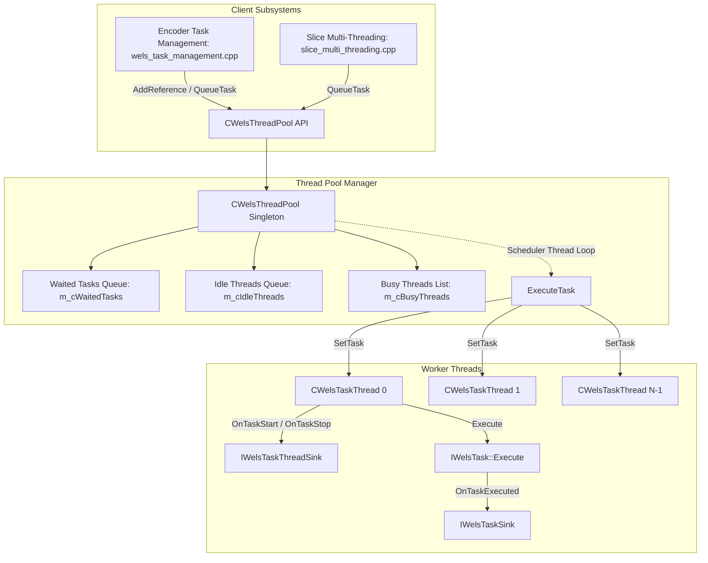
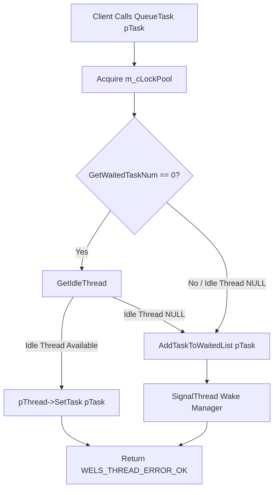
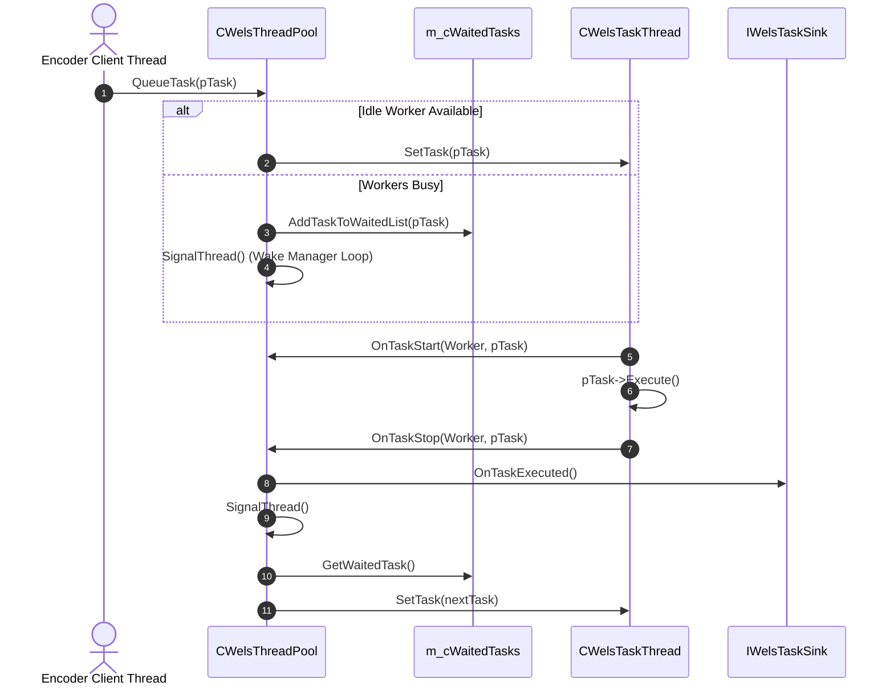

# OpenH264 Common: Thread Pool Engine (`WelsThreadPool.cpp`)

This document provides a comprehensive, literate-programming-style technical analysis of [codec/common/src/WelsThreadPool.cpp](openh264/codec/common/src/WelsThreadPool.cpp) and its companion header [codec/common/inc/WelsThreadPool.h](openh264/codec/common/inc/WelsThreadPool.h). It details the architecture of OpenH264's centralized multi-threading task scheduler, worker thread lifecycle management, lock hierarchy, task dispatching pipelines, and synchronization mechanisms.

---

## Table of Contents
1. [Module Architecture & Subsystem Role](#1-module-architecture--subsystem-role)
2. [Data Structures, Classes, and Constants](#2-data-structures-classes-and-constants)
   - [2.1 `CWelsThreadPool` Class Definition](#21-cwelsthreadpool-class-definition)
   - [2.2 Static State & Singleton Members](#22-static-state--singleton-members)
   - [2.3 Thread & Task Queue Containers](#23-thread--task-queue-containers)
   - [2.4 Synchronization Locks & Thread Primitives](#24-synchronization-locks--thread-primitives)
3. [Deep-Dive Function & Method Analysis](#3-deep-dive-function--method-analysis)
   - [3.1 Initialization, Configuration & Singleton Lifecycle](#31-initialization-configuration--singleton-lifecycle)
     - [`GetInitLock`](#getinitlock)
     - [`CWelsThreadPool::SetThreadNum`](#cwelsthreadpoolsetthreadnum)
     - [`CWelsThreadPool::AddReference`](#cwelsthreadpooladdreference)
     - [`CWelsThreadPool::RemoveInstance`](#cwelsthreadpoolremoveinstance)
     - [`CWelsThreadPool::IsReferenced`](#cwelsthreadpoolisreferenced)
     - [`CWelsThreadPool::Init`](#cwelsthreadpoolinit)
     - [`CWelsThreadPool::Uninit`](#cwelsthreadpooluninit)
     - [`CWelsThreadPool::StopAllRunning`](#cwelsthreadpoolstopallrunning)
   - [3.2 Task Dispatch & Execution Pipeline](#32-task-dispatch--execution-pipeline)
     - [`CWelsThreadPool::QueueTask`](#cwelsthreadpoolqueuetask)
     - [`CWelsThreadPool::ExecuteTask`](#cwelsthreadpoolexecutetask)
     - [`CWelsThreadPool::OnTaskStart`](#cwelsthreadpoolontaskstart)
     - [`CWelsThreadPool::OnTaskStop`](#cwelsthreadpoolontaskstop)
     - [`CWelsThreadPool::ClearWaitedTasks`](#cwelsthreadpoolclearwaitedtasks)
   - [3.3 Worker Thread Creation & Internal Queue Helpers](#33-worker-thread-creation--internal-queue-helpers)
     - [`CWelsThreadPool::CreateIdleThread`](#cwelsthreadpoolcreateidlethread)
     - [`CWelsThreadPool::DestroyThread`](#cwelsthreadpooldestroythread)
     - [`CWelsThreadPool::AddThreadToIdleQueue`](#cwelsthreadpooladdthreadtoidlequeue)
     - [`CWelsThreadPool::AddThreadToBusyList`](#cwelsthreadpooladdthreadtobusylist)
     - [`CWelsThreadPool::RemoveThreadFromBusyList`](#cwelsthreadpoolremovethreadfrombusylist)
     - [`CWelsThreadPool::AddTaskToWaitedList`](#cwelsthreadpooladdtasktowaitedlist)
     - [`CWelsThreadPool::GetIdleThread`](#cwelsthreadpoolgetidlethread)
     - [`CWelsThreadPool::GetWaitedTask`](#cwelsthreadpoolgetwaitedtask)
     - [Capacity & Count Accessors (`GetBusyThreadNum`, `GetIdleThreadNum`, `GetWaitedTaskNum`)](#capacity--count-accessors)
4. [Concurrency Model, Lock Hierarchy & Thread Synchronization](#4-concurrency-model-lock-hierarchy--thread-synchronization)
5. [Call Graph & Component Interactions](#5-call-graph--component-interactions)

---

## 1. Module Architecture & Subsystem Role

In OpenH264, compute-intensive encoding operations (such as parallel slice encoding across multiple macroblock rows via [slice_multi_threading.cpp](openh264/codec/encoder/core/src/slice_multi_threading.cpp) and [wels_task_management.cpp](openh264/codec/encoder/core/src/wels_task_management.cpp)) rely on a high-throughput, low-overhead worker thread pool.

[WelsThreadPool.cpp](openh264/codec/common/src/WelsThreadPool.cpp) implements this centralized thread management subsystem. It provides:
1. **Singleton Reference Counting**: Multiple encoder instances or modules share a single underlying thread pool instance (`m_pThreadPoolSelf`). The pool is dynamically created and initialized upon the first call to `AddReference()`, and torn down when the reference count drops to zero in `RemoveInstance()`.
2. **Dedicated Manager Thread Loop**: `CWelsThreadPool` inherits from [CWelsThread](openh264/codec/common/inc/WelsThread.h#L52-L97). It acts as an active manager/scheduler thread that sleeps on an OS event condition variable and wakes up whenever new tasks are enqueued or worker threads complete execution.
3. **Task-Thread Affinity & Dispatching**: Decouples task creation ([IWelsTask](openh264/codec/common/inc/WelsTask.h#L54-L69)) from worker thread execution ([CWelsTaskThread](openh264/codec/common/inc/WelsTaskThread.h#L59-L78)). If idle threads are immediately available, tasks are dispatched synchronously; otherwise, tasks are enqueued in `m_cWaitedTasks` until worker threads signal completion.
4. **Lifecycle Callbacks & Sinks**: Integrates with [IWelsTaskThreadSink](openh264/codec/common/inc/WelsTaskThread.h#L53-L57) and [IWelsTaskSink](openh264/codec/common/inc/WelsTask.h#L48-L52) to propagate task start, completion (`OnTaskExecuted`), and cancellation (`OnTaskCancelled`) events back to caller contexts.



---

## 2. Data Structures, Classes, and Constants

### 2.1 `CWelsThreadPool` Class Definition

Declared in [codec/common/inc/WelsThreadPool.h](openh264/codec/common/inc/WelsThreadPool.h#L53-L116), `CWelsThreadPool` employs multiple inheritance to serve simultaneously as an OS thread and a task sink:

```cpp
namespace WelsCommon {

class CWelsThreadPool : public CWelsThread, public IWelsTaskThreadSink {
 public:
  enum {
    DEFAULT_THREAD_NUM = 4,
  };

  static WELS_THREAD_ERROR_CODE SetThreadNum (int32_t iMaxThreadNum);
  static CWelsThreadPool* AddReference();
  void RemoveInstance();
  static bool IsReferenced();

  // IWelsTaskThreadSink callbacks
  virtual WELS_THREAD_ERROR_CODE OnTaskStart (CWelsTaskThread* pThread, IWelsTask* pTask);
  virtual WELS_THREAD_ERROR_CODE OnTaskStop (CWelsTaskThread* pThread, IWelsTask* pTask);

  // CWelsThread virtual execution hook
  virtual void ExecuteTask();

  WELS_THREAD_ERROR_CODE QueueTask (IWelsTask* pTask);
  int32_t GetThreadNum() const { return m_iMaxThreadNum; }

 protected:
  WELS_THREAD_ERROR_CODE Init();
  WELS_THREAD_ERROR_CODE Uninit();
  WELS_THREAD_ERROR_CODE CreateIdleThread();
  void DestroyThread (CWelsTaskThread* pThread);
  WELS_THREAD_ERROR_CODE AddThreadToIdleQueue (CWelsTaskThread* pThread);
  WELS_THREAD_ERROR_CODE AddThreadToBusyList (CWelsTaskThread* pThread);
  WELS_THREAD_ERROR_CODE RemoveThreadFromBusyList (CWelsTaskThread* pThread);
  bool AddTaskToWaitedList (IWelsTask* pTask);
  CWelsTaskThread* GetIdleThread();
  IWelsTask* GetWaitedTask();
  int32_t GetIdleThreadNum();
  int32_t GetBusyThreadNum();
  int32_t GetWaitedTaskNum();
  void ClearWaitedTasks();

 private:
  CWelsThreadPool();
  virtual ~CWelsThreadPool();
  WELS_THREAD_ERROR_CODE StopAllRunning();

  static int32_t m_iRefCount;
  static int32_t m_iMaxThreadNum;
  static CWelsThreadPool* m_pThreadPoolSelf;

  CWelsNonDuplicatedList<IWelsTask>* m_cWaitedTasks;
  CWelsNonDuplicatedList<CWelsTaskThread>* m_cIdleThreads;
  CWelsList<CWelsTaskThread>* m_cBusyThreads;

  CWelsLock m_cLockPool;
  CWelsLock m_cLockWaitedTasks;
  CWelsLock m_cLockIdleTasks;
  CWelsLock m_cLockBusyTasks;

  DISALLOW_COPY_AND_ASSIGN (CWelsThreadPool);
};

}
```

---

### 2.2 Static State & Singleton Members

[WelsThreadPool.cpp:L55-L57](openh264/codec/common/src/WelsThreadPool.cpp#L55-L57)

```cpp
int32_t CWelsThreadPool::m_iRefCount = 0;
int32_t CWelsThreadPool::m_iMaxThreadNum = DEFAULT_THREAD_NUM;
CWelsThreadPool* CWelsThreadPool::m_pThreadPoolSelf = NULL;
```

| Member Variable | Type | Default Value | Description |
| :--- | :--- | :--- | :--- |
| `m_iRefCount` | `int32_t` | `0` | Reference counter tracking how many active encoder/codec modules are currently holding a reference to the singleton thread pool. |
| `m_iMaxThreadNum` | `int32_t` | `DEFAULT_THREAD_NUM` (`4`) | Configured worker thread pool capacity. Can be reconfigured via `SetThreadNum()` only when `m_iRefCount == 0`. |
| `m_pThreadPoolSelf` | `CWelsThreadPool*` | `NULL` | Pointer to the active singleton instance of `CWelsThreadPool`. Allocated on the first call to `AddReference()` and destroyed when `m_iRefCount` drops to `0`. |

---

### 2.3 Thread & Task Queue Containers

The thread pool relies on custom node-pool doubly linked lists implemented in [codec/common/inc/WelsList.h](openh264/codec/common/inc/WelsList.h#L58-L278) to eliminate runtime dynamic heap allocations during high-frequency task dispatch:

| Queue / List Pointer | Container Type | Purpose & Invariant |
| :--- | :--- | :--- |
| `m_cWaitedTasks` | [CWelsNonDuplicatedList](openh264/codec/common/inc/WelsList.h#L265-L278)`<IWelsTask>` | Holds queued tasks waiting for an idle worker thread. Duplicate task pointers are rejected to prevent re-entrancy bugs. |
| `m_cIdleThreads` | [CWelsNonDuplicatedList](openh264/codec/common/inc/WelsList.h#L265-L278)`<CWelsTaskThread>` | FIFO queue of worker threads that are currently idle, sleeping on their task event signals, and ready to accept new work. |
| `m_cBusyThreads` | [CWelsList](openh264/codec/common/inc/WelsList.h#L58-L263)`<CWelsTaskThread>` | Unordered list tracking worker threads that are actively executing tasks. |

---

### 2.4 Synchronization Locks & Thread Primitives

Thread safety is enforced through five fine-grained locks ([CWelsLock](openh264/codec/common/inc/WelsLock.h)):

| Lock Instance | Scope & Protected Resource |
| :--- | :--- |
| `GetInitLock()` | Static global lock protecting singleton creation, destruction, `m_iRefCount` updates, and `SetThreadNum()`. |
| `m_cLockPool` | Instance lock protecting high-level thread pool state transitions (`Init`, `Uninit`, `QueueTask`, `ExecuteTask`). |
| `m_cLockWaitedTasks` | Dedicated mutex protecting all mutations and traversals of `m_cWaitedTasks`. |
| `m_cLockIdleTasks` | Dedicated mutex protecting insertions (`AddThreadToIdleQueue`), removals (`GetIdleThread`), and destructions in `m_cIdleThreads`. |
| `m_cLockBusyTasks` | Dedicated mutex protecting additions (`AddThreadToBusyList`) and removals (`RemoveThreadFromBusyList`) in `m_cBusyThreads`. |

---

## 3. Deep-Dive Function & Method Analysis

### 3.1 Initialization, Configuration & Singleton Lifecycle

#### `GetInitLock`

[WelsThreadPool.cpp:L48-L51](openh264/codec/common/src/WelsThreadPool.cpp#L48-L51)

```cpp
namespace {
CWelsLock& GetInitLock() {
  static CWelsLock *initLock = new CWelsLock;
  return *initLock;
}
}
```

* **Purpose**: Provides a Meyer's-singleton style accessor for the static initialization mutex. By allocating `initLock` on the heap with static lifetime, it avoids C++ static destruction order fiascos across translation units while serializing multi-threaded access to `m_pThreadPoolSelf` and `m_iRefCount`.
* **Return Value**: Reference to the global heap-allocated [CWelsLock](openh264/codec/common/inc/WelsLock.h) instance.

---

#### `CWelsThreadPool::SetThreadNum`

[WelsThreadPool.cpp:L72-L84](openh264/codec/common/src/WelsThreadPool.cpp#L72-L84)

```cpp
WELS_THREAD_ERROR_CODE CWelsThreadPool::SetThreadNum (int32_t iMaxThreadNum);
```

* **Purpose**: Configures the total number of worker threads to be instantiated when the thread pool initializes.
* **Parameters**:
  * `iMaxThreadNum`: Target worker thread count ($N \ge 1$).
* **Return Value**:
  * `WELS_THREAD_ERROR_OK` (`0`): Successfully updated `m_iMaxThreadNum`.
  * `WELS_THREAD_ERROR_GENERAL`: Error if the thread pool is already referenced/active (`m_iRefCount != 0`), preventing thread count modification while threads are running.
* **Algorithmic Constraints**:
  * Acquires `GetInitLock()` via `CWelsAutoLock`.
  * If `iMaxThreadNum <= 0`, clamps value to minimum $1$:
    $$m\_iMaxThreadNum = \max(1, iMaxThreadNum)$$

---

#### `CWelsThreadPool::AddReference`

[WelsThreadPool.cpp:L87-L110](openh264/codec/common/src/WelsThreadPool.cpp#L87-L110)

```cpp
CWelsThreadPool* CWelsThreadPool::AddReference();
```

* **Purpose**: Acquires a reference to the global thread pool singleton. Instantiates and initializes the pool if it is not yet created.
* **Return Value**: Pointer to the active [CWelsThreadPool](openh264/codec/common/src/WelsThreadPool.cpp#L59-L61) instance, or `NULL` if allocation or worker thread initialization failed.
* **Execution Flow**:
  1. Acquires `GetInitLock()`.
  2. If `m_pThreadPoolSelf == NULL`, allocates a new instance via `new CWelsThreadPool()`.
  3. If `m_iRefCount == 0`, invokes `m_pThreadPoolSelf->Init()`.
  4. If `Init()` fails (e.g. OS thread creation limits exceeded), performs clean teardown by calling `Uninit()`, deletes `m_pThreadPoolSelf`, sets pointer to `NULL`, and returns `NULL`.
  5. Increments `m_iRefCount++` and returns `m_pThreadPoolSelf`.

---

#### `CWelsThreadPool::RemoveInstance`

[WelsThreadPool.cpp:L112-L125](openh264/codec/common/src/WelsThreadPool.cpp#L112-L125)

```cpp
void CWelsThreadPool::RemoveInstance();
```

* **Purpose**: Releases a caller's reference to the thread pool singleton. When reference count drops to zero, shuts down all worker threads and frees all pool resources.
* **Execution Flow**:
  1. Acquires `GetInitLock()`.
  2. Decrements `--m_iRefCount`.
  3. If `m_iRefCount == 0`:
     * Calls `StopAllRunning()` to wait for active tasks to complete.
     * Calls `Uninit()` to destroy worker threads and queue structures.
     * Deletes `m_pThreadPoolSelf` and resets pointer to `NULL`.

---

#### `CWelsThreadPool::IsReferenced`

[WelsThreadPool.cpp:L128-L131](openh264/codec/common/src/WelsThreadPool.cpp#L128-L131)

```cpp
bool CWelsThreadPool::IsReferenced();
```

* **Purpose**: Thread-safe query to check whether the thread pool is currently in use (`m_iRefCount > 0`).

---

#### `CWelsThreadPool::Init`

[WelsThreadPool.cpp:L162-L185](openh264/codec/common/src/WelsThreadPool.cpp#L162-L185)

```cpp
WELS_THREAD_ERROR_CODE CWelsThreadPool::Init();
```

* **Purpose**: Internal initialization method that allocates internal task and thread queues, spawns `m_iMaxThreadNum` worker threads, and launches the thread pool's manager thread.
* **Return Value**: `WELS_THREAD_ERROR_OK` on success, `WELS_THREAD_ERROR_GENERAL` on failure.
* **Execution Flow**:
  1. Locks `m_cLockPool`.
  2. Allocates `m_cWaitedTasks`, `m_cIdleThreads`, and `m_cBusyThreads`.
  3. Spawns `m_iMaxThreadNum` idle worker threads in a loop via `CreateIdleThread()`.
  4. Starts the manager thread loop by invoking base class `CWelsThread::Start()`.

---

#### `CWelsThreadPool::StopAllRunning`

[WelsThreadPool.cpp:L187-L202](openh264/codec/common/src/WelsThreadPool.cpp#L187-L202)

```cpp
WELS_THREAD_ERROR_CODE CWelsThreadPool::StopAllRunning();
```

* **Purpose**: Gracefully flushes and drains the thread pool before deallocation.
* **Execution Flow**:
  1. Calls `ClearWaitedTasks()` to remove and cancel all pending tasks from `m_cWaitedTasks`.
  2. Enters a spin-wait loop polling `GetBusyThreadNum() > 0`, sleeping for 10 milliseconds via `WelsSleep(10)` per iteration until all worker threads finish their in-flight tasks.
  3. Verifies that `GetIdleThreadNum() == m_iMaxThreadNum`. Returns `WELS_THREAD_ERROR_GENERAL` if counts mismatch.

---

#### `CWelsThreadPool::Uninit`

[WelsThreadPool.cpp:L204-L225](openh264/codec/common/src/WelsThreadPool.cpp#L204-L225)

```cpp
WELS_THREAD_ERROR_CODE CWelsThreadPool::Uninit();
```

* **Purpose**: Terminates all worker threads, stops the manager thread, and deallocates list structures.
* **Execution Flow**:
  1. Acquires `m_cLockPool`.
  2. Calls `StopAllRunning()`. Asserts `GetBusyThreadNum() == 0`.
  3. Locks `m_cLockIdleTasks`, iterates through `m_cIdleThreads`, terminating each worker thread via `DestroyThread()` and popping entries.
  4. Calls base class `CWelsThread::Kill()` to terminate the manager thread.
  5. Frees heap memory of `m_cWaitedTasks`, `m_cIdleThreads`, and `m_cBusyThreads` using `WELS_DELETE_OP`.

---

### 3.2 Task Dispatch & Execution Pipeline

#### `CWelsThreadPool::QueueTask`

[WelsThreadPool.cpp:L249-L271](openh264/codec/common/src/WelsThreadPool.cpp#L249-L271)

```cpp
WELS_THREAD_ERROR_CODE CWelsThreadPool::QueueTask (IWelsTask* pTask);
```

* **Purpose**: Entry point for client threads to submit an [IWelsTask](openh264/codec/common/inc/WelsTask.h#L54-L69) for parallel execution.
* **Parameters**:
  * `pTask`: Pointer to the task object implementing `Execute()`.
* **Fast-Path vs. Queued-Path Execution Logic**:
  1. Acquires `m_cLockPool`.
  2. **Fast Path**: If there are no waiting tasks (`GetWaitedTaskNum() == 0`), attempts to pop an available worker thread via `GetIdleThread()`. If found, immediately assigns the task via `pThread->SetTask(pTask)` and returns `WELS_THREAD_ERROR_OK`.
  3. **Queued Path**: If all worker threads are busy or tasks are already queued, inserts `pTask` into `m_cWaitedTasks` via `AddTaskToWaitedList(pTask)`.
  4. Calls `SignalThread()` to wake the thread pool's scheduler thread loop.



---

#### `CWelsThreadPool::ExecuteTask`

[WelsThreadPool.cpp:L227-L247](openh264/codec/common/src/WelsThreadPool.cpp#L227-L247)

```cpp
void CWelsThreadPool::ExecuteTask();
```

* **Purpose**: Core scheduling loop executed by the manager thread when awakened by `SignalThread()`.
* **Execution Flow**:
  * While `GetWaitedTaskNum() > 0`:
    1. Attempts to retrieve an idle worker thread via `GetIdleThread()`. If `NULL`, breaks loop (all workers busy).
    2. Retrieves the next queued task via `GetWaitedTask()`.
    3. If task exists, assigns it to worker via `pThread->SetTask(pTask)`.
    4. If task is `NULL`, returns the thread back to the idle queue via `AddThreadToIdleQueue(pThread)`.

---

#### `CWelsThreadPool::OnTaskStart`

[WelsThreadPool.cpp:L134-L138](openh264/codec/common/src/WelsThreadPool.cpp#L134-L138)

```cpp
WELS_THREAD_ERROR_CODE CWelsThreadPool::OnTaskStart (CWelsTaskThread* pThread, IWelsTask* pTask);
```

* **Purpose**: Callback invoked by [CWelsTaskThread](openh264/codec/common/inc/WelsTaskThread.h#L59-L78) right before it begins executing `pTask->Execute()`.
* **Action**: Moves `pThread` into the busy list via `AddThreadToBusyList(pThread)`.

---

#### `CWelsThreadPool::OnTaskStop`

[WelsThreadPool.cpp:L140-L160](openh264/codec/common/src/WelsThreadPool.cpp#L140-L160)

```cpp
WELS_THREAD_ERROR_CODE CWelsThreadPool::OnTaskStop (CWelsTaskThread* pThread, IWelsTask* pTask);
```

* **Purpose**: Callback invoked by [CWelsTaskThread](openh264/codec/common/inc/WelsTaskThread.h#L59-L78) immediately after task execution finishes.
* **Execution Flow**:
  1. Removes `pThread` from `m_cBusyThreads` via `RemoveThreadFromBusyList(pThread)`.
  2. Returns `pThread` to `m_cIdleThreads` via `AddThreadToIdleQueue(pThread)`.
  3. If `pTask` has an associated sink (`pTask->GetSink()`), invokes completion callback:
     `pTask->GetSink()->OnTaskExecuted()`.
  4. Calls `SignalThread()` to wake the manager thread so it can dispatch the newly idle thread to any remaining waited tasks.

---

#### `CWelsThreadPool::ClearWaitedTasks`

[WelsThreadPool.cpp:L364-L377](openh264/codec/common/src/WelsThreadPool.cpp#L364-L377)

```cpp
void CWelsThreadPool::ClearWaitedTasks();
```

* **Purpose**: Empties the queue of pending tasks and notifies task sinks that their execution was cancelled.
* **Execution Flow**:
  1. Acquires `m_cLockWaitedTasks`.
  2. Iterates while `m_cWaitedTasks->size() != 0`:
     * Pops task `pTask = m_cWaitedTasks->begin()`.
     * If `pTask->GetSink()` is non-null, invokes cancellation callback:
       `pTask->GetSink()->OnTaskCancelled()`.
     * Removes node via `m_cWaitedTasks->pop_front()`.

---

### 3.3 Worker Thread Creation & Internal Queue Helpers

#### `CWelsThreadPool::CreateIdleThread`

[WelsThreadPool.cpp:L273-L288](openh264/codec/common/src/WelsThreadPool.cpp#L273-L288)

```cpp
WELS_THREAD_ERROR_CODE CWelsThreadPool::CreateIdleThread();
```

* **Purpose**: Instantiates a single [CWelsTaskThread](openh264/codec/common/inc/WelsTaskThread.h#L59-L78) worker thread passed `this` as its `IWelsTaskThreadSink` callback handler.
* **Execution Flow**:
  1. Allocates `new CWelsTaskThread(this)`.
  2. Starts thread execution via `pThread->Start()`. If thread creation fails (e.g. system `pthread_create` error), frees `pThread` and returns `WELS_THREAD_ERROR_GENERAL`.
  3. Appends the active worker thread to `m_cIdleThreads` via `AddThreadToIdleQueue(pThread)`.

---

#### `CWelsThreadPool::DestroyThread`

[WelsThreadPool.cpp:L290-L295](openh264/codec/common/src/WelsThreadPool.cpp#L290-L295)

```cpp
void CWelsThreadPool::DestroyThread (CWelsTaskThread* pThread);
```

* **Purpose**: Terminates worker thread execution via `pThread->Kill()` and deletes the object memory.

---

#### `CWelsThreadPool::AddThreadToIdleQueue`

[WelsThreadPool.cpp:L297-L301](openh264/codec/common/src/WelsThreadPool.cpp#L297-L301)

```cpp
WELS_THREAD_ERROR_CODE CWelsThreadPool::AddThreadToIdleQueue (CWelsTaskThread* pThread);
```

* **Purpose**: Thread-safe push of `pThread` onto `m_cIdleThreads` guarded by `m_cLockIdleTasks`.

---

#### `CWelsThreadPool::AddThreadToBusyList`

[WelsThreadPool.cpp:L303-L307](openh264/codec/common/src/WelsThreadPool.cpp#L303-L307)

```cpp
WELS_THREAD_ERROR_CODE CWelsThreadPool::AddThreadToBusyList (CWelsTaskThread* pThread);
```

* **Purpose**: Thread-safe push of `pThread` onto `m_cBusyThreads` guarded by `m_cLockBusyTasks`.

---

#### `CWelsThreadPool::RemoveThreadFromBusyList`

[WelsThreadPool.cpp:L309-L316](openh264/codec/common/src/WelsThreadPool.cpp#L309-L316)

```cpp
WELS_THREAD_ERROR_CODE CWelsThreadPool::RemoveThreadFromBusyList (CWelsTaskThread* pThread);
```

* **Purpose**: Thread-safe removal of `pThread` from `m_cBusyThreads` guarded by `m_cLockBusyTasks`. Returns `WELS_THREAD_ERROR_OK` on successful erasure or `WELS_THREAD_ERROR_GENERAL` if not found.

---

#### `CWelsThreadPool::AddTaskToWaitedList`

[WelsThreadPool.cpp:L318-L322](openh264/codec/common/src/WelsThreadPool.cpp#L318-L322)

```cpp
bool CWelsThreadPool::AddTaskToWaitedList (IWelsTask* pTask);
```

* **Purpose**: Thread-safe push of `pTask` onto `m_cWaitedTasks` guarded by `m_cLockWaitedTasks`. Returns `false` if `pTask` is already present in the non-duplicated list.

---

#### `CWelsThreadPool::GetIdleThread`

[WelsThreadPool.cpp:L324-L336](openh264/codec/common/src/WelsThreadPool.cpp#L324-L336)

```cpp
CWelsTaskThread* CWelsThreadPool::GetIdleThread();
```

* **Purpose**: Pops the front available worker thread from `m_cIdleThreads` under lock `m_cLockIdleTasks`. Returns `NULL` if no idle threads exist.

---

#### `CWelsThreadPool::GetWaitedTask`

[WelsThreadPool.cpp:L350-L362](openh264/codec/common/src/WelsThreadPool.cpp#L350-L362)

```cpp
IWelsTask* CWelsThreadPool::GetWaitedTask();
```

* **Purpose**: Pops the front waiting task from `m_cWaitedTasks` under lock `m_cLockWaitedTasks`. Returns `NULL` if queue is empty.

---

#### Capacity & Count Accessors

[WelsThreadPool.cpp:L338-L348](openh264/codec/common/src/WelsThreadPool.cpp#L338-L348)

```cpp
int32_t CWelsThreadPool::GetBusyThreadNum();
int32_t CWelsThreadPool::GetIdleThreadNum();
int32_t CWelsThreadPool::GetWaitedTaskNum();
```

* **Purpose**: Non-blocking queries returning `size()` of `m_cBusyThreads`, `m_cIdleThreads`, and `m_cWaitedTasks`, returning `0` if queue pointers are `NULL`.

---

## 4. Concurrency Model, Lock Hierarchy & Thread Synchronization

To avoid deadlocks across multiple calling threads and asynchronous callbacks, `CWelsThreadPool` adheres to a strict lock acquisition hierarchy:

```
Level 1 (Top-Level Global):  GetInitLock()
Level 2 (Instance Lock):     m_cLockPool
Level 3 (Sub-Queue Locks):   m_cLockWaitedTasks / m_cLockIdleTasks / m_cLockBusyTasks
```

### Invariant Rules
1. `GetInitLock()` is acquired exclusively during lifecycle mutations (`SetThreadNum`, `AddReference`, `RemoveInstance`, `IsReferenced`).
2. Inside `CWelsThreadPool` member methods, `m_cLockPool` guards the dispatch logic in `QueueTask` and state transitions in `Init`/`Uninit`.
3. Worker thread callbacks (`OnTaskStart`, `OnTaskStop`) only acquire sub-queue locks (`m_cLockBusyTasks`, `m_cLockIdleTasks`) and never attempt to re-acquire `m_cLockPool` or `GetInitLock()`, preventing lock inversion deadlocks.



---

## 5. Call Graph & Component Interactions

The following interaction matrix maps callers, callees, and synchronization primitives across the thread pool lifecycle:

| Method | Key Callers | Key Callees / Operations | Synchronization Guard |
| :--- | :--- | :--- | :--- |
| `SetThreadNum` | Encoder initialization | Modifies `m_iMaxThreadNum` | `GetInitLock()` |
| `AddReference` | Client modules | `Init()`, `new CWelsThreadPool` | `GetInitLock()` |
| `RemoveInstance` | Client teardown | `StopAllRunning()`, `Uninit()` | `GetInitLock()` |
| `QueueTask` | Slice threads / Task manager | `GetIdleThread()`, `SetTask()`, `AddTaskToWaitedList()`, `SignalThread()` | `m_cLockPool`, `m_cLockWaitedTasks` |
| `ExecuteTask` | Manager thread loop | `GetIdleThread()`, `GetWaitedTask()`, `SetTask()` | `m_cLockIdleTasks`, `m_cLockWaitedTasks` |
| `OnTaskStart` | `CWelsTaskThread` | `AddThreadToBusyList()` | `m_cLockBusyTasks` |
| `OnTaskStop` | `CWelsTaskThread` | `RemoveThreadFromBusyList()`, `AddThreadToIdleQueue()`, `OnTaskExecuted()`, `SignalThread()` | `m_cLockBusyTasks`, `m_cLockIdleTasks` |
| `ClearWaitedTasks` | `StopAllRunning()` | `OnTaskCancelled()`, `pop_front()` | `m_cLockWaitedTasks` |
