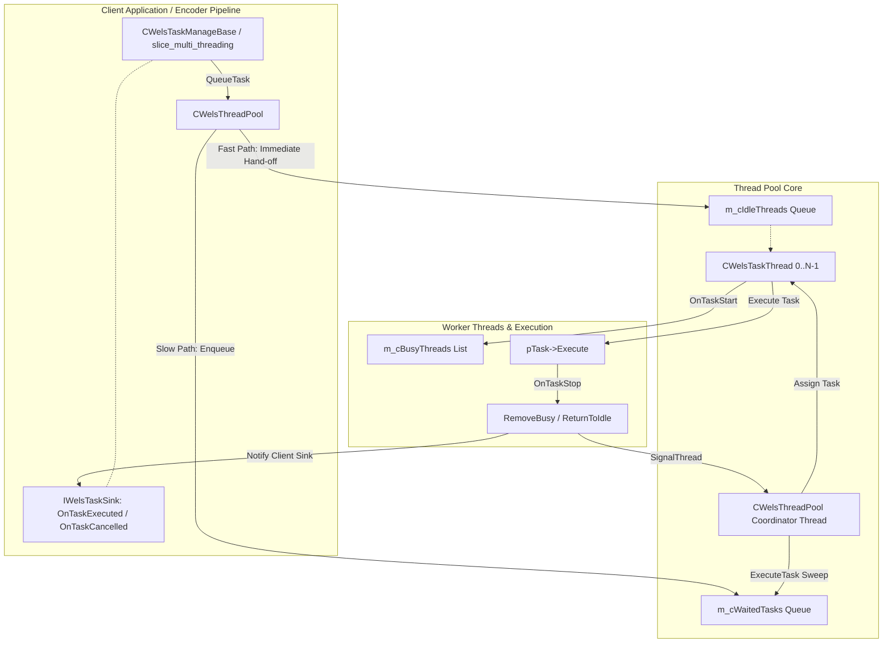
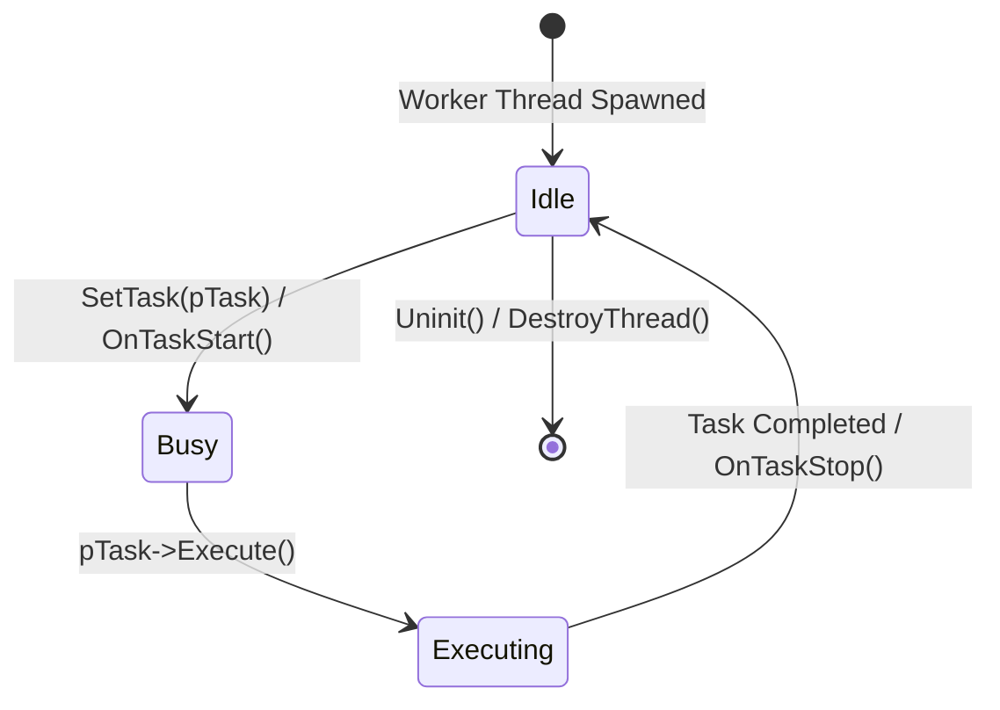
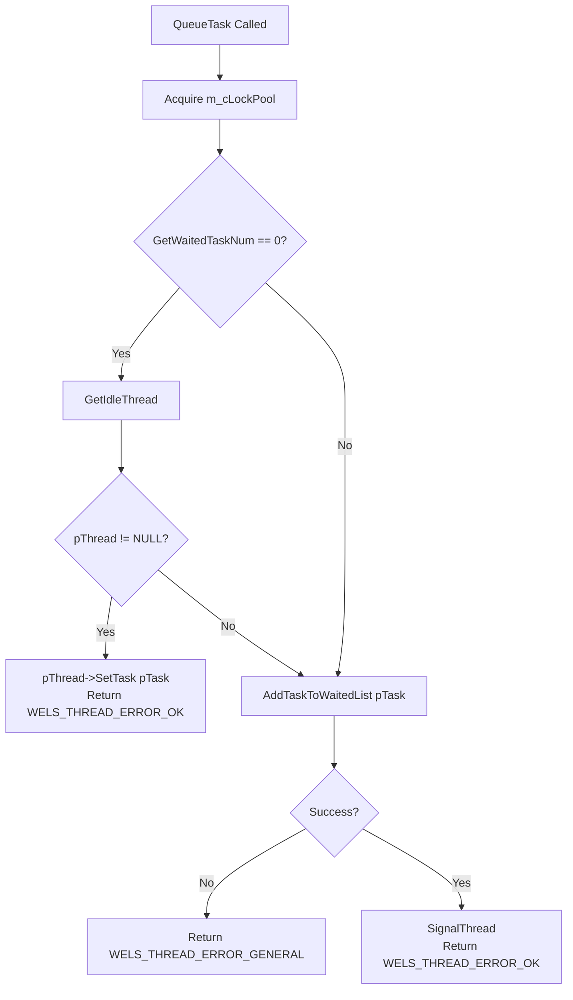
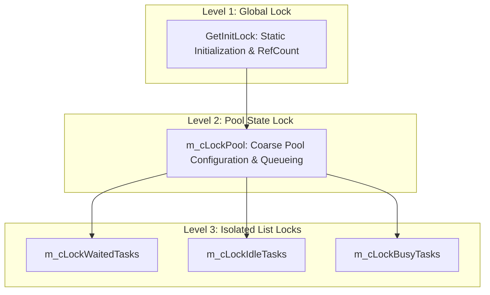
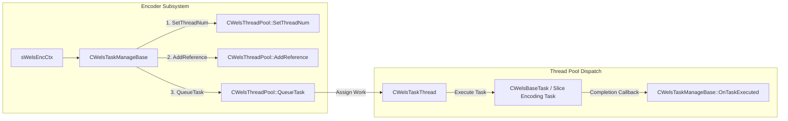

# OpenH264 Thread Pool Engine: `WelsThreadPool.h`

This document provides a comprehensive, literate-programming-style technical specification and architectural deep dive into the **Thread Pool Subsystem** declared in [codec/common/inc/WelsThreadPool.h](openh264/codec/common/inc/WelsThreadPool.h) and implemented in [codec/common/src/WelsThreadPool.cpp](openh264/codec/common/src/WelsThreadPool.cpp).

---

## Table of Contents
1. [Architectural Overview & Module Purpose](#1-architectural-overview--module-purpose)
2. [Threading & Task Scheduling Architecture](#2-threading--task-scheduling-architecture)
3. [Data Structures, Classes, Types, and Constants](#3-data-structures-classes-types-and-constants)
   - [3.1 Constant Enumeration: `DEFAULT_THREAD_NUM`](#31-constant-enumeration-default_thread_num)
   - [3.2 Class Declaration: `CWelsThreadPool`](#32-class-declaration-cwelsthreadpool)
   - [3.3 Static Members & Singleton Lifecycle Management](#33-static-members--singleton-lifecycle-management)
   - [3.4 Instance Member Fields & Synchronization Locks](#34-instance-member-fields--synchronization-locks)
4. [Deep Dive: Function & Method Implementations](#4-deep-dive-function--method-implementations)
   - [4.1 Singleton & Configuration Interface](#41-singleton--configuration-interface)
     - [`CWelsThreadPool::SetThreadNum`](#cwelsthreadpoolsetthreadnum)
     - [`CWelsThreadPool::AddReference`](#cwelsthreadpooladdreference)
     - [`CWelsThreadPool::RemoveInstance`](#cwelsthreadpoolremoveinstance)
     - [`CWelsThreadPool::IsReferenced`](#cwelsthreadpoolisreferenced)
   - [4.2 Task Scheduling & Dispatch Pipeline](#42-task-scheduling--dispatch-pipeline)
     - [`CWelsThreadPool::QueueTask`](#cwelsthreadpoolqueuetask)
     - [`CWelsThreadPool::ExecuteTask`](#cwelsthreadpoolexecutetask)
   - [4.3 Task Thread Sink Callbacks](#43-task-thread-sink-callbacks)
     - [`CWelsThreadPool::OnTaskStart`](#cwelsthreadpoolontaskstart)
     - [`CWelsThreadPool::OnTaskStop`](#cwelsthreadpoolontaskstop)
   - [4.4 Internal Pool Lifecycle & Thread Provisioning](#44-internal-pool-lifecycle--thread-provisioning)
     - [`CWelsThreadPool::Init`](#cwelsthreadpoolinit)
     - [`CWelsThreadPool::Uninit`](#cwelsthreadpooluninit)
     - [`CWelsThreadPool::StopAllRunning`](#cwelsthreadpoolstopallrunning)
     - [`CWelsThreadPool::CreateIdleThread`](#cwelsthreadpoolcreateidlethread)
     - [`CWelsThreadPool::DestroyThread`](#cwelsthreadpooldestroythread)
   - [4.5 Thread & Task Queue Management Helpers](#45-thread--task-queue-management-helpers)
5. [Synchronization Model & Deadlock Prevention](#5-synchronization-model--deadlock-prevention)
6. [Call Graph & Subsystem Integration](#6-call-graph--subsystem-integration)

---

## 1. Architectural Overview & Module Purpose

In real-time H.264 video encoding and decoding (such as slice-level multi-threading, parallel pre-analysis, motion estimation, and entropy coding), creating and destroying OS threads on a per-frame or per-slice basis incurs prohibitive kernel overhead, context switching latency, and thread handle exhaustion.

The OpenH264 common library provides [CWelsThreadPool](openh264/codec/common/inc/WelsThreadPool.h#L53-L116) as a centralized, high-performance, reference-counted worker thread pool. It implements:

1. **Persistent Worker Thread Management**: Spawns and maintains a pool of persistent worker threads ([CWelsTaskThread](openh264/codec/common/inc/WelsTaskThread.h#L59-L78)) waiting on condition variables, eliminating OS thread creation overhead during real-time encoding.
2. **Dual Fast-Path / Queued Work Dispatching**: Dispatches incoming tasks directly to available idle worker threads without coordinator thread latency, or falls back to an internal waiting queue ([CWelsNonDuplicatedList<IWelsTask>](openh264/codec/common/inc/WelsList.h#L265-L278)) processed by a dedicated pool event dispatcher.
3. **Reference-Counted Singleton Lifecycle**: Coordinates shared access across multiple encoder/decoder context instances via thread-safe reference counting (`m_iRefCount`), ensuring unified resource utilization and clean teardown.
4. **Asynchronous Sink Notifications**: Interfaces with worker threads through [IWelsTaskThreadSink](openh264/codec/common/inc/WelsTaskThread.h#L53-L57) and client tasks through [IWelsTaskSink](openh264/codec/common/inc/WelsTask.h#L48-L52) to propagate task start, completion (`OnTaskExecuted`), and cancellation (`OnTaskCancelled`) events.



---

## 2. Threading & Task Scheduling Architecture

The thread pool combines multiple design patterns to maximize throughput and minimize latency:

### Scheduling Mechanics & State Transitions
1. **Immediate Fast-Path Assignment**: When [CWelsThreadPool::QueueTask](openh264/codec/common/src/WelsThreadPool.cpp#L249-L271) is called and no tasks are currently waiting in the backlog (`GetWaitedTaskNum() == 0`), the pool attempts to pop an idle thread from `m_cIdleThreads`. If successful, the task is handed directly to the worker thread via [CWelsTaskThread::SetTask](openh264/codec/common/inc/WelsTaskThread.h#L64), bypassing the coordinator thread completely.
2. **Backlog Queuing & Coordinator Dispatch**: If all worker threads are busy or prior tasks remain queued, the task is appended to `m_cWaitedTasks` and the coordinator thread is signaled via [SignalThread()](openh264/codec/common/inc/WelsThread.h#L84-L86).
3. **Task Completion Feedback**: When a worker finishes executing [IWelsTask::Execute](openh264/codec/common/inc/WelsTask.h#L61), it invokes [CWelsThreadPool::OnTaskStop](openh264/codec/common/src/WelsThreadPool.cpp#L140-L160). This removes the worker from `m_cBusyThreads`, returns it to `m_cIdleThreads`, triggers the task sink callback [IWelsTaskSink::OnTaskExecuted](openh264/codec/common/inc/WelsTask.h#L50), and signals the coordinator thread to drain any remaining queued tasks.



---

## 3. Data Structures, Classes, Types, and Constants

### 3.1 Constant Enumeration: `DEFAULT_THREAD_NUM`

Declared in [WelsThreadPool.h:L55-L57](openh264/codec/common/inc/WelsThreadPool.h#L55-L57):

```cpp
enum {
  DEFAULT_THREAD_NUM = 4,
};
```

* **Value**: `4`.
* **Description**: Default number of worker threads allocated upon thread pool initialization if no custom thread count has been configured via [SetThreadNum](openh264/codec/common/inc/WelsThreadPool.h#L59).

---

### 3.2 Class Declaration: `CWelsThreadPool`

Declared in [WelsThreadPool.h:L53-L116](openh264/codec/common/inc/WelsThreadPool.h#L53-L116):

```cpp
class CWelsThreadPool : public CWelsThread, public IWelsTaskThreadSink
```

#### Inheritance Hierarchy

| Base Class / Interface | Access | Header File | Architectural Role |
| :--- | :--- | :--- | :--- |
| [CWelsThread](openh264/codec/common/inc/WelsThread.h#L52-L97) | `public` | [WelsThread.h](openh264/codec/common/inc/WelsThread.h) | Platform-independent thread base class. Provides thread lifecycle methods (`Start()`, `Kill()`), event condition signaling (`SignalThread()`), and virtual task loop entry point (`ExecuteTask()`). |
| [IWelsTaskThreadSink](openh264/codec/common/inc/WelsTaskThread.h#L53-L57) | `public` | [WelsTaskThread.h](openh264/codec/common/inc/WelsTaskThread.h) | Callback sink interface implemented by the pool to receive notifications from worker threads when tasks start (`OnTaskStart`) and stop (`OnTaskStop`). |

---

### 3.3 Static Members & Singleton Lifecycle Management

Declared in [WelsThreadPool.h:L102-L104](openh264/codec/common/inc/WelsThreadPool.h#L102-L104) and defined in [WelsThreadPool.cpp:L55-L57](openh264/codec/common/src/WelsThreadPool.cpp#L55-L57):

| Member Variable | Type | Initial Value | Description |
| :--- | :--- | :--- | :--- |
| `m_iRefCount` | `int32_t` | `0` | Reference counter tracking active client modules (e.g. encoder instances) sharing the thread pool. |
| `m_iMaxThreadNum` | `int32_t` | `DEFAULT_THREAD_NUM` (4) | Maximum number of worker threads to instantiate in [Init()](openh264/codec/common/src/WelsThreadPool.cpp#L162-L185). |
| `m_pThreadPoolSelf` | `CWelsThreadPool*` | `NULL` | Pointer to the active singleton instance of [CWelsThreadPool](openh264/codec/common/inc/WelsThreadPool.h#L53). |

#### Singleton Global Initialization Lock
In [WelsThreadPool.cpp:L48-L51](openh264/codec/common/src/WelsThreadPool.cpp#L48-L51), global singleton operations are synchronized via a dedicated static lock accessor:

```cpp
namespace {
CWelsLock& GetInitLock() {
  static CWelsLock *initLock = new CWelsLock;
  return *initLock;
}
}
```

This guarantees thread-safe initialization and reference counting across concurrent encoder/decoder threads.

---

### 3.4 Instance Member Fields & Synchronization Locks

Declared in [WelsThreadPool.h:L106-L115](openh264/codec/common/inc/WelsThreadPool.h#L106-L115):

```cpp
  CWelsNonDuplicatedList<IWelsTask>*       m_cWaitedTasks;
  CWelsNonDuplicatedList<CWelsTaskThread>* m_cIdleThreads;
  CWelsList<CWelsTaskThread>*              m_cBusyThreads;

  CWelsLock   m_cLockPool;
  CWelsLock   m_cLockWaitedTasks;
  CWelsLock   m_cLockIdleTasks;
  CWelsLock   m_cLockBusyTasks;

  DISALLOW_COPY_AND_ASSIGN (CWelsThreadPool);
```

#### Detailed Member Specifications

| Member Field | Type | Guarding Lock | Purpose & Lifecycle |
| :--- | :--- | :--- | :--- |
| `m_cWaitedTasks` | [CWelsNonDuplicatedList<IWelsTask>](openh264/codec/common/inc/WelsList.h#L265-L278)* | `m_cLockWaitedTasks` | FIFO queue holding pending tasks waiting for an available idle worker thread. Prevents duplicate task insertions. Allocated in `Init()`, deallocated in `Uninit()`. |
| `m_cIdleThreads` | [CWelsNonDuplicatedList<CWelsTaskThread>](openh264/codec/common/inc/WelsList.h#L265-L278)* | `m_cLockIdleTasks` | Queue of worker threads ready to accept work. Allocated in `Init()`, deallocated in `Uninit()`. |
| `m_cBusyThreads` | [CWelsList<CWelsTaskThread>](openh264/codec/common/inc/WelsList.h#L58-L263)* | `m_cLockBusyTasks` | Doubly-linked list tracking worker threads actively executing tasks. Allocated in `Init()`, deallocated in `Uninit()`. |
| `m_cLockPool` | [CWelsLock](openh264/codec/common/inc/WelsLock.h) | Self | Coarse-grained mutex protecting top-level pool state transitions (`Init`, `Uninit`, `QueueTask`). |
| `m_cLockWaitedTasks` | [CWelsLock](openh264/codec/common/inc/WelsLock.h) | Self | Fine-grained mutex protecting thread-safe additions, retrievals, and cancellations on `m_cWaitedTasks`. |
| `m_cLockIdleTasks` | [CWelsLock](openh264/codec/common/inc/WelsLock.h) | Self | Fine-grained mutex protecting thread-safe pushes and pops on `m_cIdleThreads`. |
| `m_cLockBusyTasks` | [CWelsLock](openh264/codec/common/inc/WelsLock.h) | Self | Fine-grained mutex protecting insertions and deletions on `m_cBusyThreads`. |

---

## 4. Deep Dive: Function & Method Implementations

### 4.1 Singleton & Configuration Interface

#### `CWelsThreadPool::SetThreadNum`

```cpp
static WELS_THREAD_ERROR_CODE SetThreadNum (int32_t iMaxThreadNum);
```

* **File Reference**: [WelsThreadPool.cpp:L72-L84](openh264/codec/common/src/WelsThreadPool.cpp#L72-L84)
* **Parameters**:
  * `iMaxThreadNum`: Desired maximum number of worker threads to spawn.
* **Return Value**:
  * `WELS_THREAD_ERROR_OK` (`0`): Configuration updated successfully.
  * `WELS_THREAD_ERROR_GENERAL`: Configuration rejected because the pool is already active and referenced (`m_iRefCount != 0`).
* **Algorithmic Logic**:
  1. Acquires `CWelsAutoLock cLock (GetInitLock())`.
  2. Validates that `m_iRefCount == 0`. Dynamic thread pool resizing while active references exist is disallowed.
  3. Enforces a lower bound on worker thread count:
     $$\text{m\_iMaxThreadNum} = \max(1, \text{iMaxThreadNum})$$
  4. Stores the result in `m_iMaxThreadNum`.

---

#### `CWelsThreadPool::AddReference`

```cpp
static CWelsThreadPool* AddReference();
```

* **File Reference**: [WelsThreadPool.cpp:L87-L110](openh264/codec/common/src/WelsThreadPool.cpp#L87-L110)
* **Parameters**: None.
* **Return Value**: Pointer to the shared singleton [CWelsThreadPool](openh264/codec/common/inc/WelsThreadPool.h#L53), or `NULL` if allocation or initialization fails.
* **Algorithmic Logic**:
  1. Acquires `CWelsAutoLock cLock (GetInitLock())`.
  2. If `m_pThreadPoolSelf == NULL`, dynamically allocates a new `CWelsThreadPool` instance.
  3. If `m_iRefCount == 0`, invokes `m_pThreadPoolSelf->Init()`. If `Init()` fails, rolls back allocation, destroys `m_pThreadPoolSelf`, and returns `NULL`.
  4. Increments the reference counter: `++m_iRefCount`.
  5. Returns `m_pThreadPoolSelf`.

---

#### `CWelsThreadPool::RemoveInstance`

```cpp
void RemoveInstance();
```

* **File Reference**: [WelsThreadPool.cpp:L112-L126](openh264/codec/common/src/WelsThreadPool.cpp#L112-L126)
* **Parameters**: None.
* **Return Value**: None (`void`).
* **Algorithmic Logic**:
  1. Acquires `CWelsAutoLock cLock (GetInitLock())`.
  2. Decrements `m_iRefCount`.
  3. If `m_iRefCount` reaches `0`:
     * Calls `StopAllRunning()` to wait for all currently busy worker threads to finish and clear pending tasks.
     * Calls `Uninit()` to destroy all idle threads and terminate the coordinator thread.
     * Deletes `m_pThreadPoolSelf` and resets `m_pThreadPoolSelf = NULL`.

---

#### `CWelsThreadPool::IsReferenced`

```cpp
static bool IsReferenced();
```

* **File Reference**: [WelsThreadPool.cpp:L128-L131](openh264/codec/common/src/WelsThreadPool.cpp#L128-L131)
* **Return Value**: `true` if `m_iRefCount > 0`, `false` otherwise.
* **Thread Safety**: Guarded by `GetInitLock()`.

---

### 4.2 Task Scheduling & Dispatch Pipeline

#### `CWelsThreadPool::QueueTask`

```cpp
WELS_THREAD_ERROR_CODE QueueTask (IWelsTask* pTask);
```

* **File Reference**: [WelsThreadPool.cpp:L249-L271](openh264/codec/common/src/WelsThreadPool.cpp#L249-L271)
* **Parameters**:
  * `pTask`: Pointer to the [IWelsTask](openh264/codec/common/inc/WelsTask.h#L54-L69) interface to be scheduled and executed.
* **Return Value**:
  * `WELS_THREAD_ERROR_OK` on successful dispatch or enqueuing.
  * `WELS_THREAD_ERROR_GENERAL` if adding to the waiting queue fails.
* **Algorithmic Workflow**:



---

#### `CWelsThreadPool::ExecuteTask`

```cpp
virtual void ExecuteTask();
```

* **File Reference**: [WelsThreadPool.cpp:L227-L247](openh264/codec/common/src/WelsThreadPool.cpp#L227-L247)
* **Role**: Overrides [CWelsThread::ExecuteTask()](openh264/codec/common/inc/WelsThread.h#L58). Acts as the main loop body of the pool coordinator thread, triggered whenever `SignalThread()` is called.
* **Dispatch Algorithm**:
  1. Loops while `GetWaitedTaskNum() > 0`.
  2. Queries `GetIdleThread()`. If no idle thread is available (`pThread == NULL`), breaks out of the loop and waits for future signals.
  3. Queries `GetWaitedTask()`.
  4. If a valid `pTask` is retrieved, assigns it to the worker thread via `pThread->SetTask(pTask)`.
  5. If `pTask` is `NULL` (due to concurrent cancellation or extraction), returns `pThread` to the idle queue via `AddThreadToIdleQueue(pThread)`.

---

### 4.3 Task Thread Sink Callbacks

#### `CWelsThreadPool::OnTaskStart`

```cpp
virtual WELS_THREAD_ERROR_CODE OnTaskStart (CWelsTaskThread* pThread, IWelsTask* pTask);
```

* **File Reference**: [WelsThreadPool.cpp:L134-L138](openh264/codec/common/src/WelsThreadPool.cpp#L134-L138)
* **Role**: Invoked by a [CWelsTaskThread](openh264/codec/common/inc/WelsTaskThread.h#L59) immediately before executing `pTask->Execute()`.
* **Operation**: Adds `pThread` to `m_cBusyThreads` via `AddThreadToBusyList(pThread)`.

---

#### `CWelsThreadPool::OnTaskStop`

```cpp
virtual WELS_THREAD_ERROR_CODE OnTaskStop (CWelsTaskThread* pThread, IWelsTask* pTask);
```

* **File Reference**: [WelsThreadPool.cpp:L140-L160](openh264/codec/common/src/WelsThreadPool.cpp#L140-L160)
* **Role**: Invoked by a [CWelsTaskThread](openh264/codec/common/inc/WelsTaskThread.h#L59) immediately after `pTask->Execute()` completes.
* **Operation Sequence**:
  1. Removes `pThread` from `m_cBusyThreads` via `RemoveThreadFromBusyList(pThread)`.
  2. Returns `pThread` to `m_cIdleThreads` via `AddThreadToIdleQueue(pThread)`.
  3. If `pTask` has an associated client sink (`pTask->GetSink()`), invokes [IWelsTaskSink::OnTaskExecuted()](openh264/codec/common/inc/WelsTask.h#L50).
  4. Calls `SignalThread()` to wake up the coordinator thread in case pending tasks in `m_cWaitedTasks` can now be dispatched to the newly freed worker thread.

---

### 4.4 Internal Pool Lifecycle & Thread Provisioning

#### `CWelsThreadPool::Init`

```cpp
WELS_THREAD_ERROR_CODE Init();
```

* **File Reference**: [WelsThreadPool.cpp:L162-L185](openh264/codec/common/src/WelsThreadPool.cpp#L162-L185)
* **Locking**: Acquires `CWelsAutoLock cLock (m_cLockPool)`.
* **Workflow**:
  1. Dynamically allocates the internal list structures:
     * `m_cWaitedTasks = new CWelsNonDuplicatedList<IWelsTask>()`
     * `m_cIdleThreads = new CWelsNonDuplicatedList<CWelsTaskThread>()`
     * `m_cBusyThreads = new CWelsList<CWelsTaskThread>()`
  2. Loops $i = 0 \dots \text{m\_iMaxThreadNum} - 1$, invoking `CreateIdleThread()` to spawn and start each worker thread.
  3. Starts the coordinator thread via `Start()` ([CWelsThread::Start](openh264/codec/common/inc/WelsThread.h#L59)).

---

#### `CWelsThreadPool::Uninit`

```cpp
WELS_THREAD_ERROR_CODE Uninit();
```

* **File Reference**: [WelsThreadPool.cpp:L204-L225](openh264/codec/common/src/WelsThreadPool.cpp#L204-L225)
* **Workflow**:
  1. Calls `StopAllRunning()` and asserts that `GetBusyThreadNum() == 0`.
  2. Acquires `m_cLockIdleTasks`. Drains `m_cIdleThreads` by calling `DestroyThread()` on each worker thread.
  3. Terminates the coordinator thread via `Kill()` ([CWelsThread::Kill](openh264/codec/common/inc/WelsThread.h#L60)).
  4. Deallocates all list objects (`m_cWaitedTasks`, `m_cIdleThreads`, `m_cBusyThreads`) using `WELS_DELETE_OP`.

---

#### `CWelsThreadPool::StopAllRunning`

```cpp
WELS_THREAD_ERROR_CODE StopAllRunning();
```

* **File Reference**: [WelsThreadPool.cpp:L187-L202](openh264/codec/common/src/WelsThreadPool.cpp#L187-L202)
* **Workflow**:
  1. Calls `ClearWaitedTasks()` to cancel all unexecuted tasks.
  2. Polling loop: while `GetBusyThreadNum() > 0`, sleeps for 10 ms via `WelsSleep(10)`.
  3. Verifies that `GetIdleThreadNum() == m_iMaxThreadNum`.

---

#### `CWelsThreadPool::CreateIdleThread` & `CWelsThreadPool::DestroyThread`

```cpp
WELS_THREAD_ERROR_CODE CreateIdleThread();
void DestroyThread (CWelsTaskThread* pThread);
```

* **File Reference**: [WelsThreadPool.cpp:L273-L295](openh264/codec/common/src/WelsThreadPool.cpp#L273-L295)
* **`CreateIdleThread`**: Allocates `new CWelsTaskThread(this)`, calls `pThread->Start()`, and queues it into `m_cIdleThreads` via `AddThreadToIdleQueue(pThread)`.
* **`DestroyThread`**: Stops the worker thread via `pThread->Kill()` and frees its memory via `WELS_DELETE_OP(pThread)`.

---

### 4.5 Thread & Task Queue Management Helpers

| Helper Method | Guarding Lock | Description |
| :--- | :--- | :--- |
| `AddThreadToIdleQueue(CWelsTaskThread*)` | `m_cLockIdleTasks` | Appends a worker thread to the idle queue `m_cIdleThreads`. |
| `AddThreadToBusyList(CWelsTaskThread*)` | `m_cLockBusyTasks` | Appends a worker thread to the active list `m_cBusyThreads`. |
| `RemoveThreadFromBusyList(CWelsTaskThread*)` | `m_cLockBusyTasks` | Erases a worker thread from `m_cBusyThreads`. Returns `WELS_THREAD_ERROR_OK` if found, `WELS_THREAD_ERROR_GENERAL` otherwise. |
| `AddTaskToWaitedList(IWelsTask*)` | `m_cLockWaitedTasks` | Appends a task to `m_cWaitedTasks`. |
| `GetIdleThread()` | `m_cLockIdleTasks` | Pops and returns the first available worker thread from `m_cIdleThreads`, or `NULL` if empty. |
| `GetWaitedTask()` | `m_cLockWaitedTasks` | Pops and returns the next task from `m_cWaitedTasks`, or `NULL` if empty. |
| `GetIdleThreadNum()` | Implicit / Read | Returns `m_cIdleThreads->size()`. |
| `GetBusyThreadNum()` | Implicit / Read | Returns `m_cBusyThreads->size()`. |
| `GetWaitedTaskNum()` | Implicit / Read | Returns `m_cWaitedTasks->size()`. |
| `ClearWaitedTasks()` | `m_cLockWaitedTasks` | Pops all tasks from `m_cWaitedTasks` and invokes [IWelsTaskSink::OnTaskCancelled()](openh264/codec/common/inc/WelsTask.h#L51) on each task's sink. |
| `GetThreadNum()` | None (const inline) | Returns `m_iMaxThreadNum`. |

---

## 5. Synchronization Model & Deadlock Prevention

The thread pool utilizes a layered, fine-grained locking strategy to avoid contention and eliminate deadlock vulnerabilities:



### Locking Rules & Invariants
1. **Strict Hierarchy**:
   - `GetInitLock()` is acquired at the outermost scope during singleton reference count modifications.
   - `m_cLockPool` is acquired for high-level pool actions.
   - `m_cLockWaitedTasks`, `m_cLockIdleTasks`, and `m_cLockBusyTasks` are fine-grained, independent leaf locks. They are never acquired nested within each other, guaranteeing deadlock-free operation across concurrent threads.
2. **RAII Scope Locking**: All locks are acquired via `CWelsAutoLock` stack-allocated guards, ensuring automatic unlocking even in the event of error returns or early exits.

---

## 6. Call Graph & Subsystem Integration



### Primary Callers & Clients
* [wels_task_management.cpp](openh264/codec/encoder/core/src/wels_task_management.cpp): Primary client within the OpenH264 encoder. Instantiates task lists for spatial layers, sets pool thread count (`SetThreadNum`), acquires the pool singleton (`AddReference`), and queues slice encoding tasks (`QueueTask`).
* [slice_multi_threading.cpp](openh264/codec/encoder/core/src/slice_multi_threading.cpp): Parallelizes slice encoding across multiple threads managed by the thread pool.
