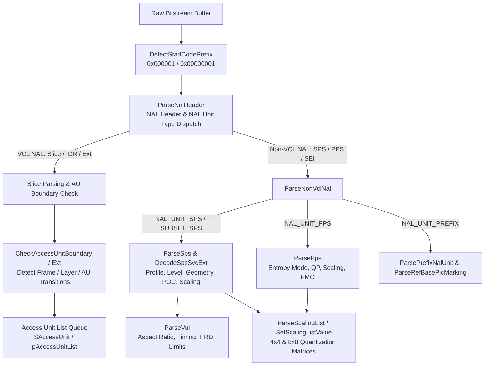
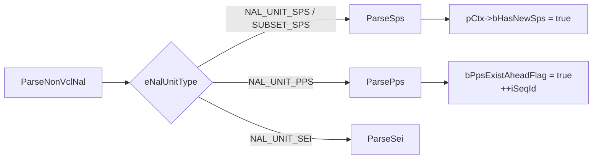
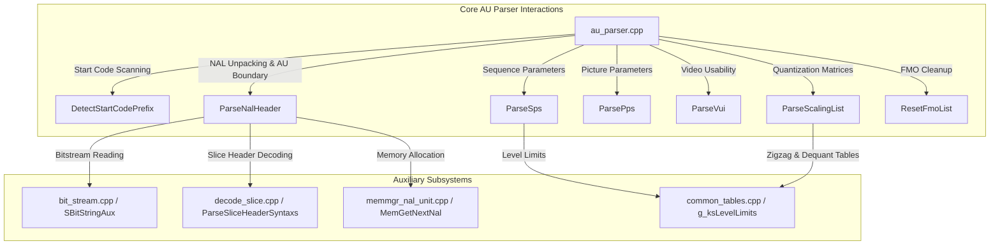

# Literate Programming Documentation: `au_parser.cpp`

**Source File:** [`codec/decoder/core/src/au_parser.cpp`](openh264/codec/decoder/core/src/au_parser.cpp)  
**Header File:** [`codec/decoder/core/inc/au_parser.h`](openh264/codec/decoder/core/inc/au_parser.h)  
**Subsystem:** OpenH264 H.264/SVC Video Decoder Core  
**Namespace:** `WelsDec`

---

## 1. Architectural Role & High-Level Overview

In the H.264/AVC and Scalable Video Coding (SVC) specification (ITU-T Rec. H.264 / ISO/IEC 14496-10), video bitstreams are organized into discrete **Network Abstraction Layer (NAL) units** formatted either as an Annex B byte stream or an RTP/packet stream. The primary responsibility of [`au_parser.cpp`](openh264/codec/decoder/core/src/au_parser.cpp) is to serve as the **front-end bitstream demuxer and syntactic parameter set decoder** for the entire OpenH264 decoding pipeline.



### Key Responsibilities:
1. **Start Code Detection**: Identifies Annex B byte stream sync words (`0x000001` or `0x00000001`) via [`DetectStartCodePrefix`](openh264/codec/decoder/core/src/au_parser.cpp#L66-L89).
2. **NAL Header Decoding**: Extracts `forbidden_zero_bit`, `nal_ref_idc` (reference priority), and `nal_unit_type`. For SVC streams, parses `SNalUnitHeaderExt` (`dependency_id`, `temporal_id`, `quality_id`).
3. **Parameter Set Extraction**: Decodes Sequence Parameter Sets ([`SSps`](openh264/codec/decoder/core/inc/parameter_sets.h#L49-L135)), Subset SPS ([`SSubsetSps`](openh264/codec/decoder/core/inc/parameter_sets.h#L137-L144)), Picture Parameter Sets ([`SPps`](openh264/codec/decoder/core/inc/parameter_sets.h#L157-L200)), and Video Usability Information ([`SVui`](openh264/codec/decoder/core/inc/parameter_sets.h#L24-L47)).
4. **Access Unit (AU) Boundary Detection**: Evaluates whether two adjacent slices belong to different pictures, temporal layers, spatial dependency layers, or frame boundaries according to H.264 Rec. Subclauses 7.4.1.2.4, 7.4.1.2.5, and G.7.4.1.2.4 via [`CheckAccessUnitBoundary`](openh264/codec/decoder/core/src/au_parser.cpp#L509-L563) and [`CheckAccessUnitBoundaryExt`](openh264/codec/decoder/core/src/au_parser.cpp#L451-L506).
5. **Inverse Quantization Scaling Matrix Parsing**: Extracts 4x4 and 8x8 frequency-weighting matrices with fallback to standard default matrices via [`ParseScalingList`](openh264/codec/decoder/core/src/au_parser.cpp#L1717-L1779) and [`SetScalingListValue`](openh264/codec/decoder/core/src/au_parser.cpp#L1690-L1715).
6. **Active Parameter Set Protection & Dynamic Overwriting**: Detects mid-stream SPS/PPS changes and buffers replacements to prevent memory corruption while the current AU is active.

---

## 2. Constants, Macros, and Compile-Time Limits

[`au_parser.cpp`](openh264/codec/decoder/core/src/au_parser.cpp) defines strict syntax element bounds to guarantee memory safety against corrupted or malicious bitstreams:

| Macro / Constant | Value | Purpose / Standard Reference |
| :--- | :---: | :--- |
| `_PARSE_NALHRD_VCLHRD_PARAMS_` | `1` | Enables parsing loop for VUI Hypothetical Reference Decoder (HRD) bitstream syntax. |
| `SUBSET_SPS_SEQ_SCALED_REF_LAYER_LEFT_OFFSET_MIN / MAX` | `[-32768, 32767]` | Min/max bounds for SVC scaled reference layer left offset. |
| `SUBSET_SPS_SEQ_SCALED_REF_LAYER_TOP_OFFSET_MIN / MAX` | `[-32768, 32767]` | Min/max bounds for scaled reference layer top offset. |
| `SUBSET_SPS_SEQ_SCALED_REF_LAYER_RIGHT_OFFSET_MIN / MAX` | `[-32768, 32767]` | Min/max bounds for scaled reference layer right offset. |
| `SUBSET_SPS_SEQ_SCALED_REF_LAYER_BOTTOM_OFFSET_MIN / MAX` | `[-32768, 32767]` | Min/max bounds for scaled reference layer bottom offset. |
| `SPS_LOG2_MAX_FRAME_NUM_MINUS4_MAX` | `12` | H.264 Sec. 7.4.3: maximum value for `log2_max_frame_num_minus4` ($0 \le \text{val} \le 12 \implies \text{MaxFrameNum} \le 2^{16}$). |
| `SPS_LOG2_MAX_PIC_ORDER_CNT_LSB_MINUS4_MAX` | `12` | H.264 Sec. 7.4.3: maximum value for `log2_max_pic_order_cnt_lsb_minus4` ($0 \le \text{val} \le 12$). |
| `SPS_NUM_REF_FRAMES_IN_PIC_ORDER_CNT_CYCLE_MAX` | `255` | Maximum number of reference frame offsets in POC type 1 cycle. |
| `SPS_MAX_NUM_REF_FRAMES_MAX` | `16` | Maximum DPB reference picture frame capacity. |
| `PPS_PIC_INIT_QP_QS_MIN / MAX` | `0` / `51` | Allowed QP initialization range: $0 \le (\text{pic\_init\_qp\_minus26} + 26) \le 51$. |
| `PPS_CHROMA_QP_INDEX_OFFSET_MIN / MAX` | `-12` / `12` | Clamping limit for Cb/Cr chroma QP offsets. |
| `SCALING_LIST_DELTA_SCALE_MIN / MAX` | `-128` / `127` | Signed delta scale limits for scaling list matrix decoding. |
| `VUI_MAX_CHROMA_LOG_TYPE_TOP_BOTTOM_FIELD_MAX` | `5` | Maximum chroma sample location type (0 to 5). |
| `VUI_NUM_UNITS_IN_TICK_MIN` | `1` | Lower warning limit for `num_units_in_tick`. |
| `VUI_TIME_SCALE_MIN` | `1` | Lower warning limit for `time_scale`. |
| `VUI_MAX_BYTES_PER_PIC_DENOM_MAX` | `16` | Maximum allowed value for `max_bytes_per_pic_denom`. |
| `VUI_MAX_BITS_PER_MB_DENOM_MAX` | `16` | Maximum allowed value for `max_bits_per_mb_denom`. |
| `VUI_LOG2_MAX_MV_LENGTH_HOR_MAX` | `16` | Maximum log2 horizontal motion vector length limit. |
| `VUI_LOG2_MAX_MV_LENGTH_VER_MAX` | `16` | Maximum log2 vertical motion vector length limit. |
| `VUI_MAX_DEC_FRAME_BUFFERING_MAX` | `16` | Max DPB frame buffering count in VUI restrictions. |

---

## 3. Data Structures & Typedefs Breakdown

The parser interacts heavily with key structures defined across the decoder subsystem headers:

### 3.1 [`SNalUnitHeader`](openh264/codec/decoder/core/inc/nalu.h#L70-L75) & [`SNalUnitHeaderExt`](openh264/codec/decoder/core/inc/nalu.h#L77-L88)

```cpp
typedef struct TagNalUnitHeader {
  uint8_t             uiForbiddenZeroBit; // Must be 0; bit 7 of the NAL header byte
  uint8_t             uiNalRefIdc;        // Reference priority (0 = non-ref, 1-3 = ref); bits 5..6
  EWelsNalUnitType    eNalUnitType;       // NAL Unit Type (0..31); bits 0..4
} SNalUnitHeader;

typedef struct TagNalUnitHeaderExt {
  SNalUnitHeader      sNalUnitHeader;     // Base 1-byte NAL header
  bool                bIdrFlag;           // True if IDR picture slice
  uint8_t             uiPriorityId;       // SVC priority identifier (6 bits)
  bool                bNoInterLayerPredFlag; // SVC inter-layer prediction disable flag
  uint8_t             uiDependencyId;     // Spatial layer dependency index D (0..7)
  uint8_t             uiQualityId;        // Quality layer index Q (0..15)
  uint8_t             uiTemporalId;       // Temporal layer index T (0..7)
  bool                bUseRefBasePicFlag; // Store/use reference base picture flag
  bool                bDiscardableFlag;   // Discardable NAL flag
  bool                bOutputFlag;        // Output picture display flag
  uint8_t             uiReservedThree2Bits;
} SNalUnitHeaderExt, *PNalUnitHeaderExt;
```

### 3.2 [`SSps`](openh264/codec/decoder/core/inc/parameter_sets.h#L49-L135) (Sequence Parameter Set)

Encapsulates sequence-level decoding parameters:
- `iSpsId`: SPS identifier index ($0 \le \text{id} < \text{MAX\_SPS\_COUNT} = 32$).
- `uiProfileIdc`: Standard profile (`PRO_BASELINE`, `PRO_MAIN`, `PRO_HIGH`, `PRO_SCALABLE_BASELINE`, etc.).
- `uiLevelIdc`: Level index (e.g. 10, 11, 20, 30, 31, 40, 51, 52).
- `pSLevelLimits`: Pointer to const [`SLevelLimits`](openh264/codec/common/inc/wels_common_defs.h#L51-L60) defining maximum macroblock processing rate (`uiMaxMBPS`), maximum frame size (`uiMaxFS`), maximum DPB macroblock capacity (`uiMaxDPBMbs`), and maximum vertical vector ranges (`iMinVmv`, `iMaxVmv`).
- `uiChromaFormatIdc` & `uiChromaArrayType`: Chroma sampling format (0 = Monochrome, 1 = 4:2:0).
- `uiBitDepthLuma`, `uiBitDepthChroma`: Bit-depths for samples (OpenH264 restricts to 8-bit).
- `uiLog2MaxFrameNum`: Calculated as $4 + \text{log2\_max\_frame\_num\_minus4}$.
- `uiPocType`: Picture Order Count decoding mode (0, 1, or 2).
- `iMbWidth`, `iMbHeight`, `uiTotalMbCount`: Frame dimensions expressed in 16x16 macroblock units.
- `sFrameCrop`: [`SPosOffset`](openh264/codec/decoder/core/inc/parameter_sets.h#L17-L22) containing left, right, top, bottom display cropping offsets.
- `sVui`: Embedded [`SVui`](openh264/codec/decoder/core/inc/parameter_sets.h#L24-L47) structure.
- `iScalingList4x4[6][16]` & `iScalingList8x8[6][64]`: Quantization frequency scaling matrices.

### 3.3 [`SPps`](openh264/codec/decoder/core/inc/parameter_sets.h#L157-L200) (Picture Parameter Set)

Encapsulates picture-level parameters:
- `iPpsId`: PPS ID ($0 \le \text{id} < \text{MAX\_PPS\_COUNT} = 256$).
- `iSpsId`: ID of the active SPS referenced by this PPS.
- `bEntropyCodingModeFlag`: `false` for CAVLC, `true` for CABAC.
- `bPicOrderPresentFlag`: Indicates presence of bottom field POC delta in slice headers.
- `uiNumSliceGroups`: Number of slice groups (Flexible Macroblock Ordering).
- `uiNumRefIdxL0Active`, `uiNumRefIdxL1Active`: Default active reference list capacities.
- `iPicInitQp`: Initial picture quantization parameter offset ($26 + \text{pic\_init\_qp\_minus26}$).
- `iChromaQpIndexOffset[2]`: QP offset adjustments for Cb and Cr planes.
- `bDeblockingFilterControlPresentFlag`, `bConstainedIntraPredFlag`, `bTransform8x8ModeFlag`.

---

## 4. Function-by-Function Implementation Deep Dive

---

### 4.1 `DetectStartCodePrefix`

```cpp
uint8_t* DetectStartCodePrefix (const uint8_t* kpBuf, int32_t* pOffset, int32_t iBufSize);
```

#### Purpose & Context
Searches the raw input byte buffer for an Annex B NAL unit start code prefix: either a 3-byte prefix (`0x000001`) or a 4-byte prefix (`0x00000001`).

#### Algorithmic Implementation
1. Loops through buffer bytes using pointer arithmetic.
2. Fast-skips non-zero bytes until a zero byte is detected.
3. Counts consecutive zero bytes followed by `0x01`.
4. If at least two `0x00` bytes precede the `0x01` byte (`iIdx >= 3`), computes the absolute byte offset from `kpBuf`:
   $$\text{*pOffset} = \text{uintptr\_t}(pBits) - \text{uintptr\_t}(kpBuf)$$
5. Returns pointer to the byte immediately following `0x01` (the NAL unit header byte).

---

### 4.2 `ParseNalHeader`

```cpp
uint8_t* ParseNalHeader (PWelsDecoderContext pCtx, SNalUnitHeader* pNalUnitHeader, uint8_t* pSrcRbsp,
                         int32_t iSrcRbspLen, uint8_t* pSrcNal, int32_t iSrcNalLen, int32_t* pConsumedBytes);
```

#### Parameters
- `pCtx`: Pointer to core decoder runtime context ([`SWelsDecoderContext`](openh264/codec/decoder/core/inc/decoder_context.h#L306-L455)).
- `pNalUnitHeader`: Output pointer to populated base NAL unit header.
- `pSrcRbsp`: Pointer to un-escaped Raw Byte Sequence Payload buffer.
- `iSrcRbspLen`: Total length in bytes of the RBSP buffer.
- `pSrcNal`: Pointer to original input NAL unit buffer (used for parse-only copy path).
- `iSrcNalLen`: Length of original input NAL unit buffer.
- `pConsumedBytes`: Output accumulator tracking total bytes consumed from input.

#### Detailed Execution Workflow
1. **Trailing Zero Removal**: Traverses backward from the end of `pSrcRbsp` to strip trailing zero padding bytes added by byte-stream framing.
2. **1-Byte Base NAL Header Unpacking**:
   $$\text{uiForbiddenZeroBit} = pNal[0] \gg 7$$
   $$\text{uiNalRefIdc} = (pNal[0] \gg 5) \ \& \ 0x03$$
   $$\text{eNalUnitType} = pNal[0] \ \& \ 0x1F$$
3. **Forbidden Bit Verification**: If $\text{uiForbiddenZeroBit} \neq 0$, sets `pCtx->iErrorCode |= dsBitstreamError` and aborts immediately.
4. **Parameter Set Existence Check**:
   - Ensures an SPS exists before decoding non-SPS/SEI/AUD NAL units (`pCtx->sSpsPpsCtx.bSpsExistAheadFlag`).
   - Ensures a PPS exists before decoding slice NAL units (`pCtx->sSpsPpsCtx.bPpsExistAheadFlag`).
5. **NAL Type Dispatch**:
   - **`NAL_UNIT_AU_DELIMITER` / `NAL_UNIT_SEI`**: Sets `pCtx->bAuReadyFlag = true` if there are already accumulated NAL units in `pCtx->pAccessUnitList`.
   - **`NAL_UNIT_PREFIX`**: Extracts SVC prefix header extension [`DecodeNalHeaderExt`](openh264/codec/decoder/core/inc/nalu.h). Verifies $\text{uiQualityId} == 0$ and $\text{bUseRefBasePicFlag} == 0$ (MGS quality layers not supported). Initializes bitstream reader [`DecInitBits`](openh264/codec/decoder/core/inc/dec_golomb.h) and invokes [`ParsePrefixNalUnit`](openh264/codec/decoder/core/src/au_parser.cpp#L702-L722).
   - **`NAL_UNIT_CODED_SLICE` / `NAL_UNIT_CODED_SLICE_IDR` / `NAL_UNIT_CODED_SLICE_EXT`**:
     - Allocates or fetches next NAL storage node via [`MemGetNextNal`](openh264/codec/decoder/core/inc/memmgr_nal_unit.h).
     - If `NAL_UNIT_CODED_SLICE_EXT`, parses 3-byte SVC header extension ([`DecodeNalHeaderExt`](openh264/codec/decoder/core/inc/nalu.h)).
     - If `bParseOnly` mode is active, copies formatted 4-byte start code (`0x00000001`) and NAL payload into `pCtx->sSavedData`.
     - Initializes bitstream reader (`DecInitBits`) and invokes [`ParseSliceHeaderSyntaxs`](openh264/codec/decoder/core/inc/decode_slice.h).
     - Performs Access Unit boundary analysis using [`CheckAccessUnitBoundary`](openh264/codec/decoder/core/src/au_parser.cpp#L509-L563) and [`CheckNextAuNewSeq`](openh264/codec/decoder/core/src/au_parser.cpp#L565-L574). If a boundary is crossed, sets `pCtx->bAuReadyFlag = true` to trigger picture reconstruction of the completed Access Unit.

---

### 4.3 `CheckAccessUnitBoundaryExt`

```cpp
bool CheckAccessUnitBoundaryExt (PNalUnitHeaderExt pLastNalHdrExt, PNalUnitHeaderExt pCurNalHeaderExt,
                                 PSliceHeader pLastSliceHeader, PSliceHeader pCurSliceHeader);
```

#### Standard Conformance Logic
Determines whether two consecutive VCL NAL units belong to different Access Units according to H.264 Subclause 7.4.1.2.4 & SVC Annex G Subclause G.7.4.1.2.4:

1. **Temporal ID (Subclause 7.1.4.1.1)**:
   $$\text{LastTemporalId} \neq \text{CurTemporalId} \implies \text{Boundary}$$
2. **Redundant Picture Count (Subclause 7.4.1.2.5)**:
   $$\text{LastRedundantPicCnt} > \text{CurRedundantPicCnt} \implies \text{Boundary}$$
3. **Layer Hierarchy (Subclause G.7.4.1.2.4)**:
   $$\text{LastDependencyId} > \text{CurDependencyId} \quad \lor \quad \text{LastQualityId} > \text{CurQualityId} \implies \text{Boundary}$$
4. **Frame Number & Parameter Set IDs**:
   $$\text{LastFrameNum} \neq \text{CurFrameNum} \quad \lor \quad \text{LastPpsId} \neq \text{CurPpsId} \quad \lor \quad \text{LastSpsId} \neq \text{CurSpsId} \implies \text{Boundary}$$
5. **Field/Frame Picture Flags**:
   $$\text{LastFieldPicFlag} \neq \text{CurFieldPicFlag} \quad \lor \quad \text{LastBottomFieldFlag} \neq \text{CurBottomFieldFlag} \implies \text{Boundary}$$
6. **Reference Priority & IDR Flags**:
   - Mismatch in whether `uiNalRefIdc == 0`.
   - Mismatch in `bIdrFlag`.
   - If IDR: mismatch in `uiIdrPicId`.
7. **Picture Order Count (POC)**:
   - POC Type 0: Mismatch in `iPicOrderCntLsb` or `iDeltaPicOrderCntBottom`.
   - POC Type 1: Mismatch in `iDeltaPicOrderCnt[0]` or `iDeltaPicOrderCnt[1]`.
8. **Parameter Set Binary Content**: Compares `sizeof(SPps)` and `sizeof(SSps)` via `memcmp`.

---

### 4.4 `CheckAccessUnitBoundary`

```cpp
bool CheckAccessUnitBoundary (PWelsDecoderContext pCtx, const PNalUnit kpCurNal, const PNalUnit kpLastNal,
                              const PSps kpSps);
```

#### Purpose
Wrapper that evaluates whether `kpCurNal` initiates a new Access Unit relative to `kpLastNal`. Additionally checks if the active layer SPS for `uiDependencyId` changed (`pCtx->sSpsPpsCtx.pActiveLayerSps[uiDependencyId] != kpSps`).

---

### 4.5 `CheckNextAuNewSeq`

```cpp
bool CheckNextAuNewSeq (PWelsDecoderContext pCtx, const PNalUnit kpCurNal, const PSps kpSps);
```

#### Purpose
Returns `true` if the current NAL begins a brand-new coded video sequence:
- The active SPS pointer for the dependency layer changed.
- Or `kpCurNal->sNalHeaderExt.bIdrFlag == true`.

---

### 4.6 `ParseNonVclNal`

```cpp
int32_t ParseNonVclNal (PWelsDecoderContext pCtx, uint8_t* pRbsp, const int32_t kiSrcLen, uint8_t* pSrcNal,
                        const int32_t kSrcNalLen);
```

#### Execution Routing
Dispatches Non-VCL NAL units to their respective syntax decoders:



---

### 4.7 `ParseRefBasePicMarking`

```cpp
int32_t ParseRefBasePicMarking (PBitStringAux pBs, PRefBasePicMarking pRefBasePicMarking);
```

#### Purpose & Mathematical Decoding
Parses reference base picture marking syntax elements for SVC temporal/spatial reference layers:
1. Reads 1 bit: `adaptive_ref_base_pic_marking_mode_flag`.
2. If true, iterates up to `MAX_MMCO_COUNT` decoding unsigned Exp-Golomb (`BsGetUe`) commands:
   - `MMCO_END` (`0`): Terminates MMCO loop.
   - `MMCO_SHORT2UNUSED` (`1`): Reads `difference_of_base_pic_nums_minus1` ($ue(v)$), computes:
     $$\text{uiDiffOfPicNums} = 1 + \text{uiCode}$$
   - `MMCO_LONG2UNUSED` (`2`): Reads `long_term_base_pic_num` ($ue(v)$).

---

### 4.8 `ParsePrefixNalUnit`

```cpp
int32_t ParsePrefixNalUnit (PWelsDecoderContext pCtx, PBitStringAux pBs);
```

#### Purpose
Parses prefix NAL units (NAL unit type 14) preceding base AVC VCL NALs:
- Reads `store_ref_base_pic_flag`.
- If `bUseRefBasePicFlag` or `bStoreRefBasePicFlag` is set and slice is not IDR, invokes [`ParseRefBasePicMarking`](openh264/codec/decoder/core/src/au_parser.cpp#L672-L700).
- Reads `additional_prefix_nal_unit_extension_flag` and extension data flags.

---

### 4.9 `DecodeSpsSvcExt`

```cpp
int32_t DecodeSpsSvcExt (PWelsDecoderContext pCtx, PSubsetSps pSpsExt, PBitStringAux pBs);
```

#### Purpose & SVC Syntax Elements
Decodes the SVC extension syntax block within a Subset SPS (`PSpsSvcExt`):
1. `inter_layer_deblocking_filter_control_present_flag` (1 bit).
2. `extended_spatial_scalability_idc` (2 bits): Validates $\le 2$. Values $>2$ return `ERR_INFO_INVALID_ESS`.
3. Chroma Phase alignment flags: `uiChromaPhaseXPlus1Flag`, `uiChromaPhaseYPlus1`.
4. If ESS == 1, parses **Scaled Reference Layer Offsets** ($se(v)$):
   - `iLeftOffset`, `iTopOffset`, `iRightOffset`, `iBottomOffset`.
   - Validates each offset against bounds $[-32768, 32767]$.
5. `seq_tcoeff_level_prediction_flag`, `adaptive_tcoeff_level_prediction_flag`, and `slice_header_restriction_flag`.

---

### 4.10 `GetLevelLimits`

```cpp
const SLevelLimits* GetLevelLimits (int32_t iLevelIdx, bool bConstraint3);
```

#### Purpose & Level Limit Mapping
Maps H.264 level indices to the static global lookup table [`g_ksLevelLimits`](openh264/codec/common/src/common_tables.cpp#L345):

| `iLevelIdx` | Level Name | `uiMaxMBPS` (MB/s) | `uiMaxFS` (MBs) | `uiMaxDPBMbs` | `uiMaxBR` (kbps) | `uiMaxCPB` |
| :---: | :---: | :---: | :---: | :---: | :---: | :---: |
| `9` | **Level 1b** | 1,485 | 99 | 396 | 128 | 350 |
| `10` | **Level 1.0** | 1,485 | 99 | 396 | 64 | 175 |
| `11` | **Level 1.1** (or 1b if `bConstraint3`) | 3,000 | 396 | 900 | 192 | 500 |
| `12` | **Level 1.2** | 6,000 | 396 | 891 | 384 | 1,000 |
| `13` | **Level 1.3** | 11,880 | 396 | 891 | 768 | 2,000 |
| `20` | **Level 2.0** | 11,880 | 396 | 891 | 2,000 | 2,000 |
| `21` | **Level 2.1** | 19,800 | 792 | 1,782 | 4,000 | 4,000 |
| `22` | **Level 2.2** | 20,250 | 1,620 | 3,037 | 4,000 | 4,000 |
| `30` | **Level 3.0** | 40,500 | 1,620 | 3,037 | 10,000 | 10,000 |
| `31` | **Level 3.1** | 108,000 | 3,600 | 6,750 | 14,000 | 14,000 |
| `32` | **Level 3.2** | 216,000 | 5,120 | 7,680 | 20,000 | 20,000 |
| `40` | **Level 4.0** | 245,760 | 8,192 | 12,288 | 20,000 | 25,000 |
| `41` | **Level 4.1** | 245,760 | 8,192 | 12,288 | 50,000 | 62,500 |
| `42` | **Level 4.2** | 522,240 | 8,704 | 13,056 | 50,000 | 62,500 |
| `50` | **Level 5.0** | 589,824 | 22,080 | 41,400 | 135,000 | 135,000 |
| `51` | **Level 5.1** | 983,040 | 36,864 | 69,120 | 240,000 | 240,000 |
| `52` | **Level 5.2** | 2,073,600 | 36,864 | 69,120 | 240,000 | 240,000 |

---

### 4.11 `CheckSpsActive`

```cpp
bool CheckSpsActive (PWelsDecoderContext pCtx, PSps pSps, bool bUseSubsetFlag);
```

#### Purpose
Inspects whether `pSps` is actively in use by any layer in `pActiveLayerSps[]` or referenced by pending NAL units in `pAccessUnitList`. Prevents in-place mutation of SPS buffers currently used for picture decoding.

---

### 4.12 `ParseSps`

```cpp
int32_t ParseSps (PWelsDecoderContext pCtx, PBitStringAux pBsAux, int32_t* pPicWidth, int32_t* pPicHeight,
                  uint8_t* pSrcNal, const int32_t kSrcNalLen);
```

#### Comprehensive Step-by-Step Breakdown

1. **Profile & Constraint Flags**:
   - Parses `profile_idc` (8 bits). Supports `PRO_BASELINE` (66), `PRO_MAIN` (77), `PRO_HIGH` (100), `PRO_SCALABLE_BASELINE` (83), and `PRO_SCALABLE_HIGH` (86).
   - Parses `constraint_set0_flag` through `constraint_set5_flag` (6 bits).
   - Parses `level_idc` (8 bits) and `seq_parameter_set_id` ($ue(v)$).
2. **Level Limits Validation**:
   - Queries `GetLevelLimits(uiLevelIdc, bConstraintSetFlags[3])`.
3. **High Profile & SVC Profile Syntax Extension**:
   - If profile $\in \{\text{High}, \text{Scalable High}, \dots\}$:
     - `chroma_format_idc` ($ue(v)$): Enforces $\le 1$ (4:0:0 or 4:2:0).
     - `bit_depth_luma_minus8`, `bit_depth_chroma_minus8`: Enforces 0 (8-bit only).
     - `qpprime_y_zero_transform_bypass_flag`.
     - `seq_scaling_matrix_present_flag`: If true, calls [`ParseScalingList`](openh264/codec/decoder/core/src/au_parser.cpp#L1717-L1779).
4. **Frame Number & POC Type Parsing**:
   - `log2_max_frame_num_minus4`: Validates $\le 12$. Sets:
     $$\text{uiLog2MaxFrameNum} = 4 + \text{uiCode}$$
   - `pic_order_cnt_type` ($ue(v)$):
     - **Type 0**: `log2_max_pic_order_cnt_lsb_minus4` ($\le 12$). Sets $\text{iLog2MaxPocLsb} = 4 + \text{uiCode}$.
     - **Type 1**: Reads `delta_pic_order_always_zero_flag`, `offset_for_non_ref_pic`, `offset_for_top_to_bottom_field`, `num_ref_frames_in_pic_order_cnt_cycle` ($\le 255$), and `offset_for_ref_frame[i]`.
5. **Frame Dimensions & DPB Constraints Calculation**:
   - `iMbWidth` = $1 + \text{BsGetUe(pic\_width\_in\_mbs\_minus1)}$.
   - `iMbHeight` = $1 + \text{BsGetUe(pic\_height\_in\_map\_units\_minus1)}$.
   - Validates total macroblocks against level limits:
     $$\text{uiTotalMbCount} = \text{iMbWidth} \times \text{iMbHeight} \le \text{pSLevelLimits->uiMaxFS}$$
   - Validates DPB frame capacity:
     $$\text{uiMaxDpbFrames} = \min\left(16, \left\lfloor \frac{\text{pSLevelLimits->uiMaxDPBMbs}}{\text{uiTotalMbCount}} \right\rfloor\right)$$
6. **Frame Cropping**:
   - `frame_cropping_flag`: If true, reads left, right, top, and bottom crop offsets ($ue(v)$) and validates that horizontal and vertical crop dimensions do not exceed frame boundaries.
7. **VUI Parameters**:
   - `vui_parameters_present_flag`: If true, invokes [`ParseVui`](openh264/codec/decoder/core/src/au_parser.cpp#L1505-L1658).
8. **Subset SPS SVC Extension**:
   - If Subset SPS, invokes [`DecodeSpsSvcExt`](openh264/codec/decoder/core/src/au_parser.cpp#L736-L805).
9. **Active SPS Overwrite Protection**:
   - If SPS ID matches an active SPS and parameters have changed, writes to temporary overflow buffer `sSpsBuffer[MAX_SPS_COUNT]` and sets `pCtx->sSpsPpsCtx.iOverwriteFlags |= OVERWRITE_SPS`.

---

### 4.13 `ParsePps`

```cpp
int32_t ParsePps (PWelsDecoderContext pCtx, PPps pPpsList, PBitStringAux pBsAux, uint8_t* pSrcNal,
                  const int32_t kSrcNalLen);
```

#### Step-by-Step Breakdown
1. Reads `pic_parameter_set_id` ($ue(v)$) and `seq_parameter_set_id` ($ue(v)$).
2. Reads `entropy_coding_mode_flag` (CAVLC vs CABAC) and `bottom_field_pic_order_in_frame_present_flag`.
3. Reads `num_slice_groups_minus1`. If $>0$ (Flexible Macroblock Ordering), parses `slice_group_map_type` (supports type 0 run-length groups).
4. Reads default active reference counts: `num_ref_idx_l0_default_active_minus1`, `num_ref_idx_l1_default_active_minus1`.
5. Reads `weighted_pred_flag`, `weighted_bipred_idc`.
6. Decodes initial QP values:
   $$\text{iPicInitQp} = 26 + \text{BsGetSe(pic\_init\_qp\_minus26)} \in [0, 51]$$
   $$\text{iPicInitQs} = 26 + \text{BsGetSe(pic\_init\_qs\_minus26)} \in [0, 51]$$
7. Decodes `chroma_qp_index_offset` ($se(v) \in [-12, 12]$).
8. Decodes `deblocking_filter_control_present_flag`, `constrained_intra_pred_flag`, `redundant_pic_cnt_present_flag`.
9. **RBSP Trailing Extensions**:
   - If more RBSP data remains: reads `transform_8x8_mode_flag`, `pic_scaling_matrix_present_flag` (calls [`ParseScalingList`](openh264/codec/decoder/core/src/au_parser.cpp#L1717-L1779)), and `second_chroma_qp_index_offset`.
10. Buffers PPS into `sSpsPpsCtx.sPpsBuffer[uiPpsId]`.

---

### 4.14 `ParseVui`

```cpp
int32_t ParseVui (PWelsDecoderContext pCtx, PSps pSps, PBitStringAux pBsAux);
```

#### Syntactic Breakdown of Video Usability Information
1. **Aspect Ratio Information**:
   - If `aspect_ratio_info_present_flag` is set: parses `aspect_ratio_idc` (8 bits).
   - If `aspect_ratio_idc < 17`, retrieves pixel SAR dimensions from lookup table `g_ksVuiSampleAspectRatio`:

| `aspect_ratio_idc` | Aspect Ratio | SAR Width : Height |
| :---: | :---: | :---: |
| `1` | 1:1 (Square) | 1 : 1 |
| `2` | 12:11 (4:3 PAL) | 12 : 11 |
| `3` | 10:11 (4:3 NTSC) | 10 : 11 |
| `4` | 16:11 (16:9 PAL) | 16 : 11 |
| `14` | 2:1 | 2 : 1 |
| `255` (`EXTENDED_SAR`) | Explicit 16-bit | `sar_width` : `sar_height` |

2. **Video Signal Type**:
   - Parses `video_format` (3 bits), `video_full_range_flag` (1 bit), and color description parameters (`colour_primaries`, `transfer_characteristics`, `matrix_coefficients`).
3. **Timing Information**:
   - Reads 32-bit `num_units_in_tick` and 32-bit `time_scale`.
4. **HRD Parameters**:
   - If `nal_hrd_parameters_present_flag` or `vcl_hrd_parameters_present_flag` is set, loops over `cpb_cnt_minus1` reading bit-rate and CPB size scale factors.
5. **Bitstream Restrictions**:
   - Reads `motion_vectors_over_pic_boundaries_flag`, `max_bytes_per_pic_denom`, `max_bits_per_mb_denom`, `log2_max_mv_length_horizontal`, `log2_max_mv_length_vertical`, `max_num_reorder_frames`, and `max_dec_frame_buffering`.

---

### 4.15 `ParseSei`

```cpp
int32_t ParseSei (void* pSei, PBitStringAux pBsAux);
```

#### Purpose
Reserved hook interface for Supplemental Enhancement Information (SEI) payload decoding.

---

### 4.16 `SetScalingListValue`

```cpp
int32_t SetScalingListValue (uint8_t* pScalingList, int iScalingListNum, bool* bUseDefaultScalingMatrixFlag,
                             PBitStringAux pBsAux);
```

#### Mathematical Formulation & Zigzag Scan Reordering
Decodes a sequence of delta scaling values into a frequency scaling list array:

$$iNextScale = (iLastScale + iDeltaScale + 256) \pmod{256}$$

For each matrix coefficient $j \in [0, \text{iScalingListNum}-1]$:
1. Reads signed Exp-Golomb delta scale $iDeltaScale \in [-128, 127]$.
2. If $j = 0$ and $iNextScale = 0$, sets `*bUseDefaultScalingMatrixFlag = true` and exits.
3. Maps coefficient index $j$ through the 2D zigzag scan lookup table:
   - For 4x4 matrix ($16$ elements): $iIdx = \text{g\_kuiZigzagScan}[j]$
   - For 8x8 matrix ($64$ elements): $iIdx = \text{g\_kuiZigzagScan8x8}[j]$
4. Assigns:
   $$pScalingList[iIdx] = \begin{cases} iLastScale & \text{if } iNextScale == 0 \\ iNextScale & \text{otherwise} \end{cases}$$
   $$iLastScale = pScalingList[iIdx]$$

---

### 4.17 `ParseScalingList`

```cpp
int32_t ParseScalingList (PSps pSps, PBitStringAux pBs, bool bPPS, const bool kbTrans8x8ModeFlag,
                          bool* pScalingListPresentFlag, uint8_t (*iScalingList4x4)[16], uint8_t (*iScalingList8x8)[64]);
```

#### Execution Logic
1. Computes total scaling lists to parse:
   - SPS: 8 lists (or 12 if 4:4:4).
   - PPS: 6 lists (plus 2 or 6 if `kbTrans8x8ModeFlag` is active).
2. Sets default fallback matrix pointers (`g_kuiDequantScaling4x4Default`, `g_kuiDequantScaling8x8Default`).
3. For each list $i$:
   - Reads 1-bit `scaling_list_present_flag[i]`.
   - If present: calls [`SetScalingListValue`](openh264/codec/decoder/core/src/au_parser.cpp#L1690-L1715). If default flag triggered, copies default fallback matrix.
   - If absent: inherits matrix from previous scaling list or default matrix.

---

### 4.18 `ResetFmoList`

```cpp
int32_t ResetFmoList (PWelsDecoderContext pCtx);
```

#### Purpose
Frees and deallocates any dynamically allocated Flexible Macroblock Ordering (FMO) context memory across all PPS slots (`sFmoList`) via [`UninitFmoList`](openh264/codec/decoder/core/inc/fmo.h) and resets `pCtx->iActiveFmoNum = 0`.

---

## 5. Summary Call Graph & Component Interactions


