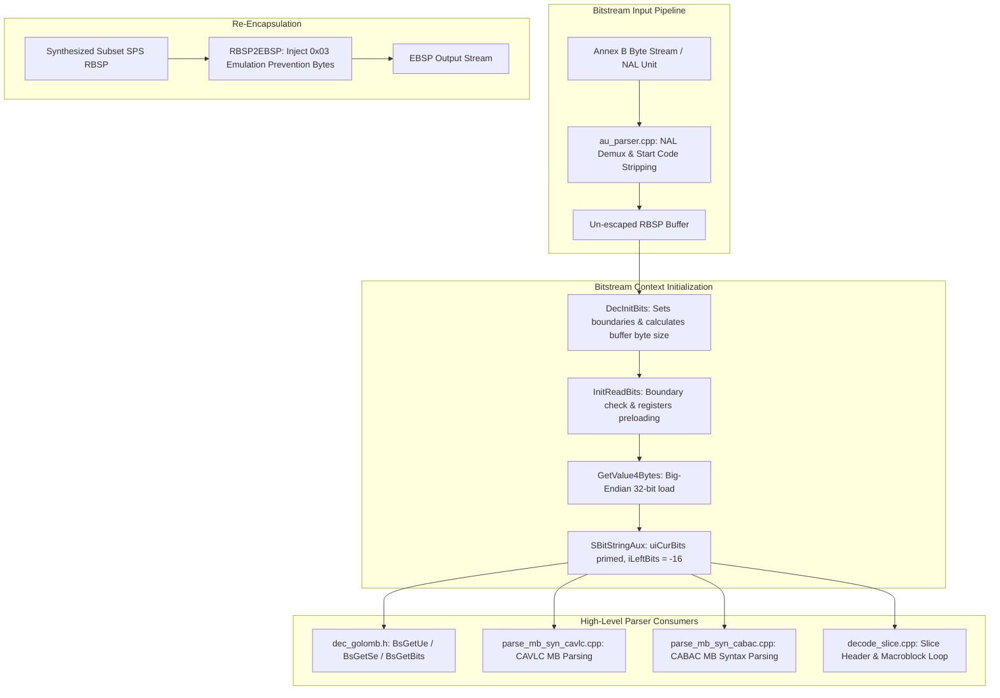
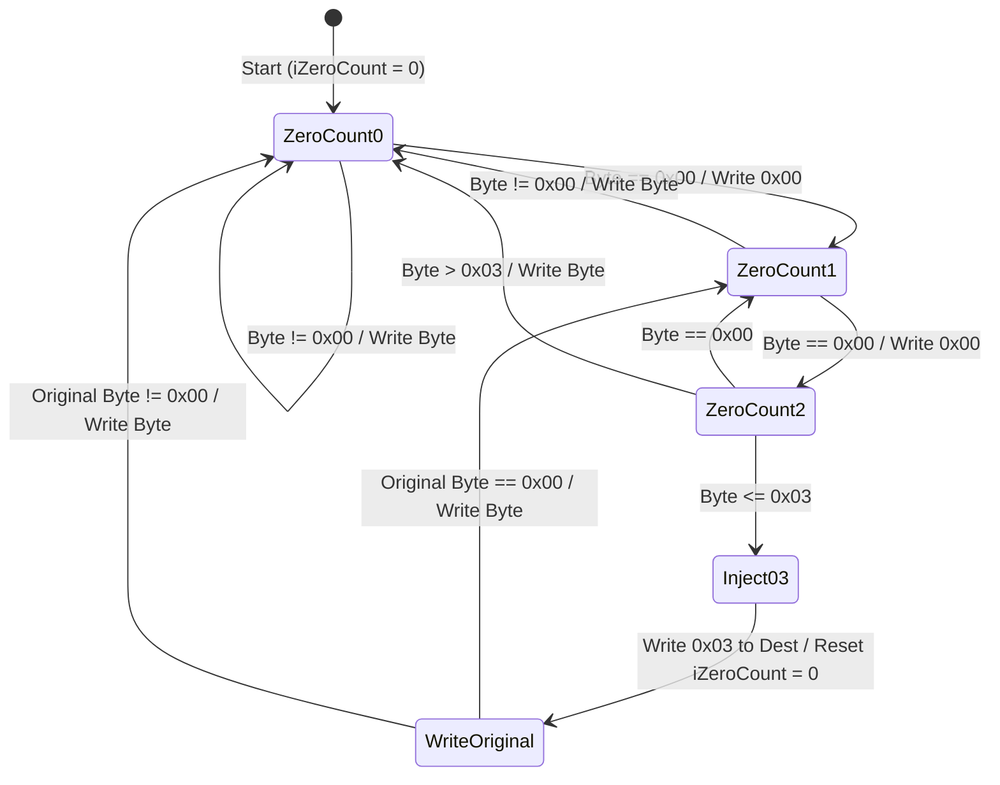

# Literate Programming: `bit_stream.cpp`

This document provides an exhaustive, literate-programming-style architectural and algorithmic breakdown of [`codec/decoder/core/src/bit_stream.cpp`](openh264/codec/decoder/core/src/bit_stream.cpp) and its companion header [`codec/decoder/core/inc/bit_stream.h`](openh264/codec/decoder/core/inc/bit_stream.h) in the Cisco OpenH264 video decoder engine.

---

## Table of Contents
1. [Architectural Role & System Purpose](#1-architectural-role--system-purpose)
2. [H.264 Bitstream Hierarchy & Emulation Prevention](#2-h264-bitstream-hierarchy--emulation-prevention)
3. [Data Structures & Bit-Reading Invariants](#3-data-structures--bit-reading-invariants)
   - [3.1 SBitStringAux (PBitStringAux)](#31-sbitstringaux-pbitstringaux)
   - [3.2 The 32-Bit Sliding Accumulator & 16-Bit Refill Engine](#32-the-32-bit-sliding-accumulator--16-bit-refill-engine)
   - [3.3 Error Return Codes](#33-error-return-codes)
4. [Deep Dive: Functions & Algorithmic Implementation](#4-deep-dive-functions--algorithmic-implementation)
   - [4.1 GetValue4Bytes](#41-getvalue4bytes)
   - [4.2 InitReadBits](#42-initreadbits)
   - [4.3 DecInitBits](#43-decinitbits)
   - [4.4 RBSP2EBSP](#44-rbsp2ebsp)
5. [Subsystem Interactions & Call Graph](#5-subsystem-interactions--call-graph)

---

## 1. Architectural Role & System Purpose

In the H.264 / AVC (and SVC) video coding standard, compressed video payloads are encapsulated within Network Abstraction Layer (NAL) units. Before syntax elements—such as Sequence Parameter Sets ([SSps](openh264/codec/decoder/core/inc/parameter_sets.h)), Picture Parameter Sets ([SPps](openh264/codec/decoder/core/inc/parameter_sets.h)), Slice Headers ([SSliceHeader](openh264/codec/decoder/core/inc/slice.h)), CAVLC residual tokens, CABAC symbols, or Exp-Golomb integers—can be parsed by the decoder, the underlying byte stream must be initialized into a high-performance bitstream reader.

[`bit_stream.cpp`](openh264/codec/decoder/core/src/bit_stream.cpp) implements the foundational primitives for:
1. **Bitstream Initialization & Sliding Window Preloading**: Setting up the auxiliary bit reader state ([SBitStringAux](openh264/codec/common/inc/wels_common_defs.h#L232-L242)) and loading the first 32-bit big-endian word into a hardware register accumulator (`uiCurBits`).
2. **Boundary Validation**: Ensuring subsequent bit extraction operations never exceed the validated buffer boundary.
3. **Annex B Emulation Prevention Injection (`RBSP2EBSP`)**: Converting un-escaped Raw Byte Sequence Payload (RBSP) data into Encapsulated Byte Sequence Payload (EBSP) format by injecting emulation prevention three bytes (`0x03`) when synthesizing or repackaging NAL units.



---

## 2. H.264 Bitstream Hierarchy & Emulation Prevention

To understand the mathematical and bit-level responsibilities of [`bit_stream.cpp`](openh264/codec/decoder/core/src/bit_stream.cpp), it is necessary to distinguish between the three payload layers defined by the H.264 specification (ITU-T H.264 / ISO/IEC 14496-10):

1. **SODB (String of Data Bits)**: The raw sequence of individual syntax bits produced by entropy coders or parameter set serializations.
2. **RBSP (Raw Byte Sequence Payload)**: The byte-aligned representation of SODB, formed by appending a trailing `1` bit (`rbsp_stop_one_bit`) followed by zero or more `0` bits (`rbsp_alignment_zero_bit`) until the total bit count is a multiple of 8.
3. **EBSP (Encapsulated Byte Sequence Payload)**: The transport-safe byte sequence where emulation prevention bytes (`0x03`) are injected to prevent false Annex B start code matches (`0x000001` or `0x00000001`).

$$\text{SODB} \xrightarrow{\text{byte alignment + stop bits}} \text{RBSP} \xrightarrow{\text{emulation prevention injection (RBSP2EBSP)}} \text{EBSP} \xrightarrow{+ \text{NAL header / start codes}} \text{Annex B NAL}$$

### The Emulation Prevention Rule
In Annex B bitstreams, a NAL start code prefix is formatted as `0x000001` (3 bytes) or `0x00000001` (4 bytes). If an uncompressed RBSP payload natively contains the sequence `0x00 0x00` followed by `0x00`, `0x01`, `0x02`, or `0x03`, a parser scanning for start codes would incorrectly detect a premature start code or misinterpret the sequence.

To prevent this, whenever two consecutive zero bytes (`0x00 0x00`) occur in the RBSP and are immediately followed by a byte $b \le 0x03$, the encoder/synthesizer must inject the byte `0x03` between them:

$$(0x00, 0x00, b) \quad \text{where } b \in \{0x00, 0x01, 0x02, 0x03\} \implies (0x00, 0x00, \mathbf{0x03}, b)$$

The decoder un-escapes these during NAL demuxing ([`au_parser.cpp`](openh264/codec/decoder/core/src/au_parser.cpp)). Conversely, [`RBSP2EBSP`](openh264/codec/decoder/core/src/bit_stream.cpp#L88-L107) implements this injection algorithm in the decoder when synthesizing or caching subset SPS parameter sets.

---

## 3. Data Structures & Bit-Reading Invariants

### 3.1 SBitStringAux (PBitStringAux)

The primary state structure used across all bitstream parsing in OpenH264 is [`SBitStringAux`](openh264/codec/common/inc/wels_common_defs.h#L232-L242) (aliased as `PBitStringAux` for pointer types):

```cpp
typedef struct TagBitStringAux {
  uint8_t* pStartBuf;   // Pointer to start of input RBSP buffer
  uint8_t* pEndBuf;     // Pointer to one byte past the end of the buffer
  int32_t  iBits;       // Total size of the input bitstream in bits

  intX_t   iIndex;      // Auxiliary tracking index (reserved for CAVLC usage)
  uint8_t* pCurBuf;     // Current byte reading cursor in the buffer
  uint32_t uiCurBits;   // 32-bit register accumulator holding buffered bitstream bits
  int32_t  iLeftBits;   // Bit consumption tracking accumulator / word refill trigger
} SBitStringAux, *PBitStringAux;
```

#### Detailed Field Specifications

| Field | Type | Alignment / Depth | Lifecycle & Semantic Invariant |
| :--- | :--- | :--- | :--- |
| `pStartBuf` | `uint8_t*` | Byte pointer | Set by [`DecInitBits`](openh264/codec/decoder/core/src/bit_stream.cpp#L70-L86) to point to the base address of the un-escaped RBSP byte buffer. Remains immutable during bit reading. |
| `pEndBuf` | `uint8_t*` | Byte pointer | Set to `pStartBuf + ((iBits + 7) >> 3)`. Represents the strict upper memory boundary for bitstream reading. Used by [`InitReadBits`](openh264/codec/decoder/core/src/bit_stream.cpp#L51-L59) to prevent buffer over-reads. |
| `iBits` | `int32_t` | 32-bit integer | Total length of the bitstream payload in bits ($N_{\text{bits}}$). |
| `iIndex` | `intX_t` | Architecture-native word (`int32_t` on x86, `int64_t` on x64) | Auxiliary cursor used by CAVLC coefficient parsing routines. |
| `pCurBuf` | `uint8_t*` | Byte pointer | Points to the next unread byte in the memory buffer. Advanced by 4 bytes during [`InitReadBits`](openh264/codec/decoder/core/src/bit_stream.cpp#L51-L59), and subsequently advanced by 2 bytes during 16-bit word refills (`GET_WORD`). |
| `uiCurBits` | `uint32_t` | 32-bit unsigned register | The active sliding window bit accumulator. The next bit to be extracted is always aligned at the Most Significant Bit (MSB, bit 31). |
| `iLeftBits` | `int32_t` | 32-bit signed integer | Tracks bit consumption and controls when the next 16-bit word refill is triggered. Initialized to **$-16$** by [`InitReadBits`](openh264/codec/decoder/core/src/bit_stream.cpp#L51-L59). |

---

### 3.2 The 32-Bit Sliding Accumulator & 16-Bit Refill Engine

OpenH264 uses a highly optimized 32-bit sliding window accumulator model implemented across [`bit_stream.cpp`](openh264/codec/decoder/core/src/bit_stream.cpp) and [`dec_golomb.h`](openh264/codec/decoder/core/inc/dec_golomb.h#L57-L85).

Instead of reading 1 byte or 1 bit from RAM on every syntax element query, the decoder loads 4 bytes (32 bits) into `uiCurBits` and refills 2 bytes (16 bits) whenever needed.

#### Why is `iLeftBits` initialized to `-16`?

Let us trace the mathematical mechanics of `uiCurBits`, `iLeftBits`, and the macro refill pipeline:

1. **Initialization ([`InitReadBits`](openh264/codec/decoder/core/src/bit_stream.cpp#L51-L59))**:
   - 4 bytes (32 bits) are read from memory into `uiCurBits`.
   - `pCurBuf` is advanced by 4 bytes.
   - `uiCurBits` currently contains 32 valid bits ready for extraction.
   - `iLeftBits` is initialized to **$-16$**.

2. **Bit Extraction & Dumping (`DUMP_BITS` in [`dec_golomb.h`](openh264/codec/decoder/core/inc/dec_golomb.h#L71-L75))**:
   When $k$ bits are read from the MSB of `uiCurBits`:
   $$\text{uiCurBits} \leftarrow \text{uiCurBits} \ll k$$
   $$\text{iLeftBits} \leftarrow \text{iLeftBits} + k$$

3. **Refill Trigger (`NEED_BITS` / `GET_WORD` in [`dec_golomb.h`](openh264/codec/decoder/core/inc/dec_golomb.h#L57-L69))**:
   - While fewer than 16 bits have been consumed since initialization or the last refill, $\text{iLeftBits} \le 0$. The accumulator still contains at least $32 - 16 = 16$ valid bits.
   - As soon as more than 16 bits have been consumed (i.e. $\text{iLeftBits} > 0$), `NEED_BITS` triggers `GET_WORD`:
     - Reads the next 16-bit big-endian word (2 bytes) from `pCurBuf`:
       $$W_{16} = (pCurBuf[0] \ll 8) \mid pCurBuf[1]$$
     - Merges $W_{16}$ into `uiCurBits` shifted left by `iLeftBits`:
       $$\text{uiCurBits} \leftarrow \text{uiCurBits} \mid (W_{16} \ll \text{iLeftBits})$$
     - Decrements `iLeftBits` by 16:
       $$\text{iLeftBits} \leftarrow \text{iLeftBits} - 16$$
     - Advances the byte cursor `pCurBuf` by 2 bytes:
       $$\text{pCurBuf} \leftarrow \text{pCurBuf} + 2$$

This design guarantees that `uiCurBits` **always maintains between 16 and 32 valid bits**, allowing any H.264 syntax element of up to 16 bits (or Exp-Golomb codeword) to be extracted in a single operation without branching on individual byte boundaries.

```
Initial State after InitReadBits():
+---------------------------------------------------------------+
| Byte 0 (MSB) |    Byte 1    |    Byte 2    |   Byte 3 (LSB)   |  <- uiCurBits (32 valid bits)
+---------------------------------------------------------------+
  iLeftBits = -16

After consuming 17 bits (iLeftBits = -16 + 17 = 1 > 0):
+---------------------------------------------------------------+
| Remaining 15 bits | (Empty 17 bits)                           |  <- uiCurBits shifted left by 17
+---------------------------------------------------------------+
GET_WORD fires (reads Byte 4 and Byte 5 = 16 bits):
uiCurBits |= ( (Byte 4 << 8) | Byte 5 ) << 1
+---------------------------------------------------------------+
| Remaining 15 bits | Byte 4          | Byte 5          | (1 b) |  <- uiCurBits (31 valid bits)
+---------------------------------------------------------------+
  iLeftBits = 1 - 16 = -15
```

---

### 3.3 Error Return Codes

The functions in [`bit_stream.cpp`](openh264/codec/decoder/core/src/bit_stream.cpp) return error status codes defined in [`error_code.h`](openh264/codec/decoder/core/inc/error_code.h):

| Error Constant | Value | Description |
| :--- | :--- | :--- |
| `ERR_NONE` | `0` | Bitstream operation completed successfully. |
| `ERR_INFO_INVALID_ACCESS` | `84` (`ERR_INFO_COMMON_BASE + 1`) | Attempted to read past the end of the bitstream buffer (`pCurBuf >= pEndBuf - iEndOffset`), or passed a `NULL` buffer pointer to [`DecInitBits`](openh264/codec/decoder/core/src/bit_stream.cpp#L70-L86). |

---

## 4. Deep Dive: Functions & Algorithmic Implementation

### 4.1 GetValue4Bytes

```cpp
inline uint32_t GetValue4Bytes (uint8_t* pDstNal)
```

[bit_stream.cpp:L45-L49](openh264/codec/decoder/core/src/bit_stream.cpp#L45-L49)

#### Signature & Parameters
- **Input**: `uint8_t* pDstNal` — Pointer to a contiguous block of at least 4 bytes in the input bitstream buffer.
- **Return Value**: `uint32_t` — 32-bit unsigned integer assembled in big-endian (network byte order).

#### Algorithmic Definition
The function extracts four consecutive 8-bit unsigned bytes from memory and constructs a 32-bit big-endian unsigned integer using bitwise shift and OR operations:

$$uiValue = (pDstNal[0] \ll 24) \lor (pDstNal[1] \ll 16) \lor (pDstNal[2] \ll 8) \lor (pDstNal[3])$$

```
Byte Offset:        0                1                2                3
Memory Byte:   [ pDstNal[0] ]   [ pDstNal[1] ]   [ pDstNal[2] ]   [ pDstNal[3] ]
                     |                |                |                |
Bitwise Shift:     << 24            << 16             << 8             << 0
                     \________________\________________/________________/
                                              |
Result (uint32_t): [ Byte 0 (bits 31..24) | Byte 1 (bits 23..16) | Byte 2 (bits 15..8) | Byte 3 (bits 7..0) ]
```

#### Design Rationale & Endianness
H.264 bitstream syntax is specified in big-endian bit order, where the earliest transmitted bit is the most significant bit (MSB) of the first byte. Because host CPU architectures (such as x86 and ARM little-endian modes) store multi-byte words with the least significant byte at the lowest address, direct 32-bit integer pointer dereferencing (`*(uint32_t*)pDstNal`) would yield reversed byte ordering on little-endian hardware. 

`GetValue4Bytes` guarantees architecture-independent big-endian byte assembly without relying on unaligned multi-byte memory loads that could trigger hardware alignment faults on strict architectures.

---

### 4.2 InitReadBits

```cpp
int32_t InitReadBits (PBitStringAux pBitString, intX_t iEndOffset)
```

[bit_stream.cpp:L51-L59](openh264/codec/decoder/core/src/bit_stream.cpp#L51-L59)

#### Signature & Parameters
- **Input / In-Out**: `PBitStringAux pBitString` — Pointer to the auxiliary bitstream context structure.
- **Input**: `intX_t iEndOffset` — Safety margin in bytes before the buffer end (`pEndBuf - iEndOffset`).
  - `iEndOffset = 0`: Standard offset used during slice decoding and general NAL unit initialization.
  - `iEndOffset = 1`: Margin offset passed by CABAC initialization in [`parse_mb_syn_cabac.cpp`](openh264/codec/decoder/core/src/parse_mb_syn_cabac.cpp#L1555) to reserve trailing byte boundaries.
- **Return Value**: `int32_t` — `ERR_NONE` (`0`) on success; `ERR_INFO_INVALID_ACCESS` (`84`) if the buffer cursor is at or beyond the allowed buffer boundary.

#### Step-by-Step Execution

1. **Boundary Validation**:
   Checks whether the current buffer read pointer `pCurBuf` has reached or exceeded the end boundary minus the requested safety margin:
   $$\text{if } (pBitString\to pCurBuf \ge pBitString\to pEndBuf - iEndOffset) \implies \text{return } ERR\_INFO\_INVALID\_ACCESS$$

2. **32-Bit Register Preloading**:
   Extracts the first 4 bytes starting at `pCurBuf` via [`GetValue4Bytes`](openh264/codec/decoder/core/src/bit_stream.cpp#L45-L49) and stores them into the accumulator:
   $$pBitString\to uiCurBits = GetValue4Bytes(pBitString\to pCurBuf)$$

3. **Buffer Cursor Advance**:
   Advances the byte read pointer past the 4 bytes loaded into `uiCurBits`:
   $$pBitString\to pCurBuf \leftarrow pBitString\to pCurBuf + 4$$

4. **Consumption State Reset**:
   Initializes the refill trigger offset to $-16$:
   $$pBitString\to iLeftBits = -16$$

5. **Return**: Returns `ERR_NONE`.

---

### 4.3 DecInitBits

```cpp
int32_t DecInitBits (PBitStringAux pBitString, const uint8_t* kpBuf, const int32_t kiSize)
```

[bit_stream.cpp:L70-L86](openh264/codec/decoder/core/src/bit_stream.cpp#L70-L86)

#### Signature & Parameters
- **In-Out**: `PBitStringAux pBitString` — Pointer to the bitstream auxiliary structure to initialize.
- **Input**: `const uint8_t* kpBuf` — Pointer to the raw un-escaped RBSP input buffer.
- **Input**: `const int32_t kiSize` — Total bitstream size in **bits**.
- **Return Value**: `int32_t` — `ERR_NONE` (`0`) on success; `ERR_INFO_INVALID_ACCESS` (`84`) on error.

#### Mathematical Calculation & Logic
1. **Byte Size Derivation**:
   Converts the bit count $kiSize$ to the total byte buffer size $kiSizeBuf$, rounding up to the next whole byte:
   $$kiSizeBuf = \left\lfloor \frac{kiSize + 7}{8} \right\rfloor = (kiSize + 7) \gg 3$$

2. **Null Pointer Check**:
   Verifies that `kpBuf` is non-null. If `kpBuf == NULL`, immediately returns `ERR_INFO_INVALID_ACCESS`.

3. **Buffer Boundary Setup**:
   - `pBitString->pStartBuf = (uint8_t*)kpBuf;` (base buffer pointer)
   - `pBitString->pEndBuf = (uint8_t*)kpBuf + kiSizeBuf;` (one past the last byte)
   - `pBitString->iBits = kiSize;` (total bit length)
   - `pBitString->pCurBuf = pBitString->pStartBuf;` (initialize reading cursor to start)

4. **Bit Buffer Priming**:
   Invokes [`InitReadBits(pBitString, 0)`](openh264/codec/decoder/core/src/bit_stream.cpp#L51-L59) to perform boundary validation and prime `uiCurBits`. If `InitReadBits` returns an error code, `DecInitBits` returns that error code; otherwise it returns `ERR_NONE`.

---

### 4.4 RBSP2EBSP

```cpp
void RBSP2EBSP (uint8_t* pDstBuf, uint8_t* pSrcBuf, const int32_t kiSize)
```

[bit_stream.cpp:L88-L107](openh264/codec/decoder/core/src/bit_stream.cpp#L88-L107)

#### Signature & Parameters
- **Output**: `uint8_t* pDstBuf` — Destination buffer where the encapsulated EBSP byte stream will be written. Must be allocated with sufficient capacity to accommodate injected emulation prevention bytes (up to $\lfloor \frac{4}{3} \cdot kiSize \rfloor + 4$ bytes in the worst case).
- **Input**: `uint8_t* pSrcBuf` — Source buffer containing the raw RBSP byte payload.
- **Input**: `const int32_t kiSize` — Number of RBSP bytes in `pSrcBuf`.
- **Return Value**: `void`.

#### Algorithmic State Machine & Byte Injection
The function scans the source RBSP buffer sequentially, tracking the count of consecutive zero bytes (`iZeroCount`).



#### Detailed Execution Walkthrough
```cpp
void RBSP2EBSP (uint8_t* pDstBuf, uint8_t* pSrcBuf, const int32_t kiSize) {
  uint8_t* pSrcPointer = pSrcBuf;
  uint8_t* pDstPointer = pDstBuf;
  uint8_t* pSrcEnd = pSrcBuf + kiSize;
  int32_t iZeroCount = 0;

  while (pSrcPointer < pSrcEnd) {
    if (iZeroCount == 2 && *pSrcPointer <= 3) {
      // Injects emulation prevention byte 0x03
      *pDstPointer++ = 3;
      iZeroCount = 0;
    }
    if (*pSrcPointer == 0) {
      ++ iZeroCount;
    } else {
      iZeroCount = 0;
    }
    *pDstPointer++ = *pSrcPointer++;
  }
}
```

1. Pointers are initialized: `pSrcPointer = pSrcBuf`, `pDstPointer = pDstBuf`, `pSrcEnd = pSrcBuf + kiSize`, and `iZeroCount = 0`.
2. For each byte in `pSrcBuf`:
   - If two consecutive zeros have been observed (`iZeroCount == 2`) **AND** the current source byte is $\le 3$ (`*pSrcPointer <= 3`):
     - The byte `0x03` is written to `*pDstPointer++`.
     - `iZeroCount` is reset to `0`.
   - The consecutive zero counter is updated:
     - If `*pSrcPointer == 0`: `++iZeroCount`.
     - Otherwise: `iZeroCount = 0`.
   - The source byte `*pSrcPointer++` is copied to `*pDstPointer++`.

---

## 5. Subsystem Interactions & Call Graph

The following table details the key call sites and consumer modules across the OpenH264 decoder that rely directly on [`bit_stream.cpp`](openh264/codec/decoder/core/src/bit_stream.cpp):

| Caller File | Calling Function | Target Function | Purpose / Interaction Context |
| :--- | :--- | :--- | :--- |
| [`au_parser.cpp`](openh264/codec/decoder/core/src/au_parser.cpp#L254) | `ParsePrefixNalUnit` | `DecInitBits` | Initializes bit reader to parse Prefix NAL unit extension syntax (`SNalUnitHeaderExt`). |
| [`au_parser.cpp`](openh264/codec/decoder/core/src/au_parser.cpp#L397) | `ParseSliceHeaderSyntax` | `DecInitBits` | Initializes bit reader to parse standard H.264 slice headers and reference list commands. |
| [`au_parser.cpp`](openh264/codec/decoder/core/src/au_parser.cpp#L608) | `ParseSps` | `DecInitBits` | Initializes bit reader to decode Sequence Parameter Sets (`SSps`). |
| [`au_parser.cpp`](openh264/codec/decoder/core/src/au_parser.cpp#L630) | `ParsePps` | `DecInitBits` | Initializes bit reader to decode Picture Parameter Sets (`SPps`). |
| [`au_parser.cpp`](openh264/codec/decoder/core/src/au_parser.cpp#L1250) | `DecodeSubsetSps` | `RBSP2EBSP` | Converts synthesized subset SPS RBSP payload to EBSP format by injecting `0x03` bytes. |
| [`decode_slice.cpp`](openh264/codec/decoder/core/src/decode_slice.cpp#L1874) | `WelsDecodeSlice` | `InitReadBits` | Re-initializes/resynchronizes the 32-bit register accumulator before starting CAVLC slice data parsing. |
| [`parse_mb_syn_cabac.cpp`](openh264/codec/decoder/core/src/parse_mb_syn_cabac.cpp#L1555) | `ParseSliceCabac` | `InitReadBits` | Primes bit reader state with `iEndOffset = 1` before initializing the CABAC arithmetic decoding engine (`SWelsCabacDecEngine`). |

---
