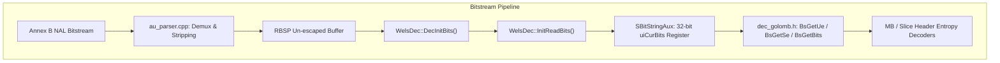
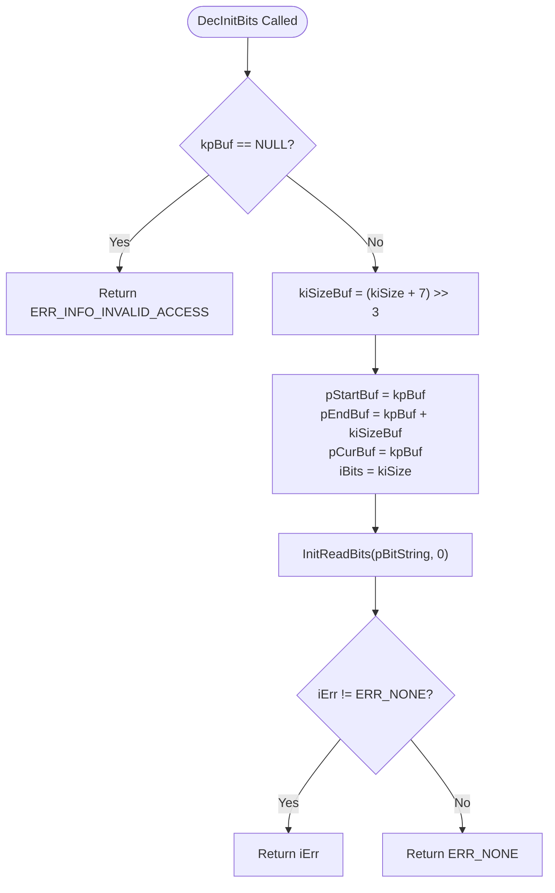
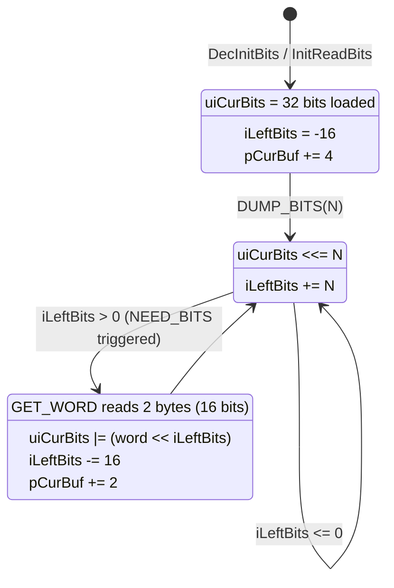
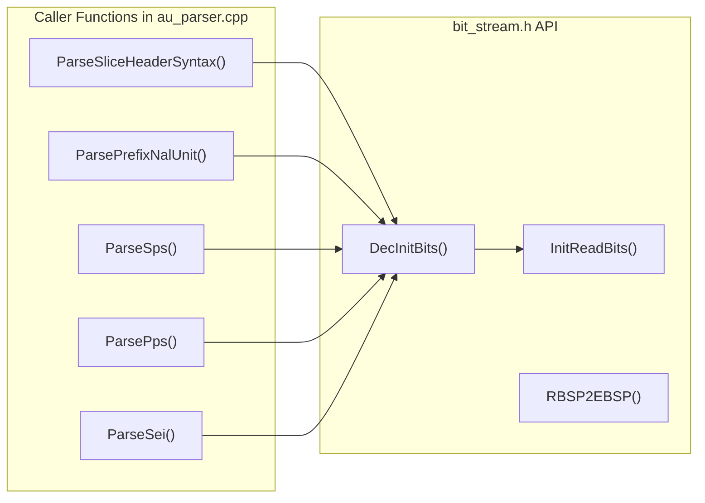

# OpenH264: `bit_stream.h` Literate Programming & Architectural Deep Dive

This document provides a comprehensive, literate-programming-style architectural breakdown and implementation analysis for [`codec/decoder/core/inc/bit_stream.h`](openh264/codec/decoder/core/inc/bit_stream.h) and its companion implementation file [`codec/decoder/core/src/bit_stream.cpp`](openh264/codec/decoder/core/src/bit_stream.cpp) within the Cisco OpenH264 video decoder subsystem.

---

## Table of Contents
1. [Module Overview & Architectural Context](#1-module-overview--architectural-context)
2. [Data Structures & Type Definitions](#2-data-structures--type-definitions)
   - [2.1 SBitStringAux / PBitStringAux (`TagBitStringAux`)](#21-sbitstringaux--pbitstringaux-tagbitstringaux)
   - [2.2 Memory Alignment, Lifecycles, and Bit Register Layout](#22-memory-alignment-lifecycles-and-bit-register-layout)
3. [Deep-Dive Function Specifications](#3-deep-dive-function-specifications)
   - [3.1 `DecInitBits`](#31-decinitbits)
   - [3.2 `InitReadBits` & `GetValue4Bytes`](#32-initreadbits--getvalue4bytes)
   - [3.3 `RBSP2EBSP`](#33-rbsp2ebsp)
4. [Mathematical Formulation of Bit Accumulation & Refill Window](#4-mathematical-formulation-of-bit-accumulation--refill-window)
5. [Emulation Prevention & Annex B Byte Serialization](#5-emulation-prevention--annex-b-byte-serialization)
6. [Call Graph & Subsystem Interactions](#6-call-graph--subsystem-interactions)

---

## 1. Module Overview & Architectural Context

In the ITU-T H.264 / ISO/IEC 14496-10 (AVC/SVC) video coding specification, video data is delivered as a series of Network Abstraction Layer (NAL) units containing Raw Byte Sequence Payloads (RBSP). Within the OpenH264 decoder core pipeline, [`bit_stream.h`](openh264/codec/decoder/core/inc/bit_stream.h) declares the fundamental bit-level streaming interfaces responsible for:

1. **Decoder Bit Buffer Ingestion & Initialization**: Initializing the auxiliary bitstream cursor structure ([`SBitStringAux`](openh264/codec/common/inc/wels_common_defs.h#L232-L242)) from un-escaped RBSP memory buffers.
2. **Fast 32-bit Big-Endian Register Priming**: Pre-loading initial 32-bit bitstream segments into CPU word registers to enable high-throughput Exp-Golomb and variable-length entropy decoding.
3. **Annex B Emulation Prevention Encapsulation (`RBSP2EBSP`)**: Converting raw byte sequence payloads into Encapsulated Byte Sequence Payloads (EBSP) by injecting `0x03` emulation prevention bytes after two consecutive `0x00` bytes.



### Namespace and Header Inclusions
- **Namespace**: `WelsDec` (with types sourced from `WelsCommon`)
- **Included Headers**:
  - [`typedefs.h`](openh264/codec/common/inc/typedefs.h): Platform integer definitions (`int32_t`, `uint8_t`, `uint32_t`, `intX_t`).
  - [`wels_common_defs.h`](openh264/codec/common/inc/wels_common_defs.h): Core structure definitions including [`SBitStringAux`](openh264/codec/common/inc/wels_common_defs.h#L232-L242).
  - [`golomb_common.h`](openh264/codec/common/inc/golomb_common.h): Common Exp-Golomb tables and bitstream serialization utilities.

---

## 2. Data Structures & Type Definitions

### 2.1 SBitStringAux / PBitStringAux (`TagBitStringAux`)

The primary data structure manipulated by the routines declared in [`bit_stream.h`](openh264/codec/decoder/core/inc/bit_stream.h) is [`SBitStringAux`](openh264/codec/common/inc/wels_common_defs.h#L232-L242) (defined in [`wels_common_defs.h`](openh264/codec/common/inc/wels_common_defs.h#L232-L242)).

```cpp
typedef struct TagBitStringAux {
  uint8_t* pStartBuf;   // Pointer to the start position of the RBSP buffer
  uint8_t* pEndBuf;     // Pointer to the end boundary (pStartBuf + buffer_byte_length)
  int32_t  iBits;       // Total count of bits in the bitstream payload

  intX_t   iIndex;      // CAVLC / VLC parsing index tracker
  uint8_t* pCurBuf;     // Current byte reading/writing position cursor
  uint32_t uiCurBits;   // 32-bit register accumulator holding unconsumed MSB-aligned bits
  int32_t  iLeftBits;   // Refill balance / available bit balance in the accumulator window
} SBitStringAux, *PBitStringAux;
```

#### Field-by-Field Breakdown

| Field Name | Type | Size / Bit-Depth | Description & Architectural Purpose |
| :--- | :--- | :--- | :--- |
| `pStartBuf` | `uint8_t*` | 32/64 bits (Pointer) | Anchors the base address of the un-escaped RBSP input buffer. Used for buffer bounds verification and computing relative byte offsets. |
| `pEndBuf` | `uint8_t*` | 32/64 bits (Pointer) | Points to the memory address immediately past the valid bitstream payload ($pStartBuf + \lceil \frac{kiSize}{8} \rceil$). |
| `iBits` | `int32_t` | 32 bits signed | Total length of the bitstream unit in **bits**. |
| `iIndex` | `intX_t` | Architecture-native word (`int32_t`/`int64_t`) | Auxiliary index cursor used in CAVLC (Context-Adaptive Variable-Length Coding) syntax parsing. |
| `pCurBuf` | `uint8_t*` | 32/64 bits (Pointer) | The active byte cursor pointer indicating where the next 16-bit or 32-bit word refill will be read from. |
| `uiCurBits` | `uint32_t` | 32 bits unsigned | The **bit accumulator register**. Maintains the active bitstream window aligned such that the next bit to be decoded resides at the most-significant bit (MSB, bit 31). |
| `iLeftBits` | `int32_t` | 32 bits signed | Controls the 16-bit refill trigger. In decoder mode, initialized to `-16` upon a 32-bit initial load. Each consumed bit increments `iLeftBits`. When `iLeftBits > 0`, a 16-bit refill is executed. |

---

### 2.2 Memory Alignment, Lifecycles, and Bit Register Layout

```
 31                                                  0
+-----------------------------------------------------+
|         Active High-Order Unparsed Bits             |  <-- uiCurBits (32-bit register)
+-----------------------------------------------------+
 ^
 |--- MSB (Extracted first by UBITS(uiCurBits, N))
```

- **Lifecycle**: An `SBitStringAux` instance is embedded inside the top-level decoder context ([`SWelsDecoderContext::sBs`](openh264/codec/decoder/core/inc/decoder_context.h#L313)). For each parsed NAL unit (SPS, PPS, SEI, Slice Header, Slice Data), [`DecInitBits`](openh264/codec/decoder/core/src/bit_stream.cpp#L70-L86) resets the pointers and loads the first 32-bit word into `uiCurBits`.
- **Memory Safety**: Buffer boundaries are checked via `pCurBuf` against `(pEndBuf - iEndOffset)` to prevent buffer overflows when malformed or truncated bitstreams are encountered.

---

## 3. Deep-Dive Function Specifications

### 3.1 `DecInitBits`

Declared in [`bit_stream.h`](openh264/codec/decoder/core/inc/bit_stream.h#L54) and implemented in [`bit_stream.cpp`](openh264/codec/decoder/core/src/bit_stream.cpp#L70-L86):

```cpp
int32_t DecInitBits (PBitStringAux pBitString, const uint8_t* kpBuf, const int32_t kiSize);
```

#### Purpose & Control Flow
Initializes the [`SBitStringAux`](openh264/codec/common/inc/wels_common_defs.h#L232-L242) bitstream reader structure with a pointer to the input RBSP buffer `kpBuf` and its total length in bits `kiSize`.



#### Parameters & Return Values
- **`pBitString`** (`PBitStringAux`): Pointer to the bitstring auxiliary state to be initialized.
- **`kpBuf`** (`const uint8_t*`): Pointer to the un-escaped RBSP byte stream.
- **`kiSize`** (`const int32_t`): Total bit length of the bitstream unit.
- **Return Value** (`int32_t`):
  - `ERR_NONE` (`0`): Successful initialization.
  - `ERR_INFO_INVALID_ACCESS` (`0x00000004`): Returned if `kpBuf == NULL` or if `InitReadBits` fails due to insufficient buffer size.

#### Mathematical Byte Calculation
The byte buffer capacity $\text{kiSizeBuf}$ is derived from bit length $\text{kiSize}$ via ceiling integer division:
$$\text{kiSizeBuf} = \left\lfloor \frac{\text{kiSize} + 7}{8} \right\rfloor = (\text{kiSize} + 7) \gg 3$$

---

### 3.2 `InitReadBits` & `GetValue4Bytes`

Declared in [`bit_stream.h`](openh264/codec/decoder/core/inc/bit_stream.h#L56) and implemented in [`bit_stream.cpp`](openh264/codec/decoder/core/src/bit_stream.cpp#L45-L59):

```cpp
inline uint32_t GetValue4Bytes (uint8_t* pDstNal);
int32_t InitReadBits (PBitStringAux pBitString, intX_t iEndOffset);
```

#### Code Implementation
```cpp
inline uint32_t GetValue4Bytes (uint8_t* pDstNal) {
  uint32_t uiValue = 0;
  uiValue = (pDstNal[0] << 24) | (pDstNal[1] << 16) | (pDstNal[2] << 8) | (pDstNal[3]);
  return uiValue;
}

int32_t InitReadBits (PBitStringAux pBitString, intX_t iEndOffset) {
  if (pBitString->pCurBuf >= (pBitString->pEndBuf - iEndOffset)) {
    return ERR_INFO_INVALID_ACCESS;
  }
  pBitString->uiCurBits  = GetValue4Bytes (pBitString->pCurBuf);
  pBitString->pCurBuf  += 4;
  pBitString->iLeftBits = -16;
  return ERR_NONE;
}
```

#### Detailed Algorithmic Mechanics
1. **Bounds Validation**: Checks if reading 4 bytes would violate buffer boundaries:
   $$\text{pCurBuf} \ge (\text{pEndBuf} - \text{iEndOffset})$$
2. **Big-Endian 32-Bit Ingestion**: [`GetValue4Bytes`](openh264/codec/decoder/core/src/bit_stream.cpp#L45-L49) packs 4 consecutive bytes into a big-endian 32-bit scalar:
   $$\text{uiCurBits} = (B_0 \ll 24) \mid (B_1 \ll 16) \mid (B_2 \ll 8) \mid B_3$$
3. **Cursor Update**: Advances `pCurBuf` by 4 bytes.
4. **State Machine Offset Calibration**: Sets `iLeftBits = -16`.

---

### 3.3 `RBSP2EBSP`

Declared in [`bit_stream.h`](openh264/codec/decoder/core/inc/bit_stream.h#L58) and implemented in [`bit_stream.cpp`](openh264/codec/decoder/core/src/bit_stream.cpp#L88-L107):

```cpp
void RBSP2EBSP (uint8_t* pDstBuf, uint8_t* pSrcBuf, const int32_t kiSize);
```

#### Algorithmic Logic & Emulation Prevention Rule
In H.264 Annex B streams, the 3-byte sequence `0x000001` or 4-byte sequence `0x00000001` represents a NAL unit start code prefix. To prevent accidental start code collisions inside RBSP payloads, H.264 standardizes **emulation prevention bytes**:

Whenever two consecutive zero bytes (`0x00 0x00`) are followed by a byte $X \le 3$, an emulation prevention byte `0x03` MUST be inserted between the second zero byte and $X$:

$$\text{Pattern: } [0x00, 0x00, X \le 3] \implies [0x00, 0x00, \mathbf{0x03}, X]$$

#### Implementation Breakdown
```cpp
void RBSP2EBSP (uint8_t* pDstBuf, uint8_t* pSrcBuf, const int32_t kiSize) {
  uint8_t* pSrcPointer = pSrcBuf;
  uint8_t* pDstPointer = pDstBuf;
  uint8_t* pSrcEnd = pSrcBuf + kiSize;
  int32_t iZeroCount = 0;

  while (pSrcPointer < pSrcEnd) {
    if (iZeroCount == 2 && *pSrcPointer <= 3) {
      // Add the emulation prevention code 0x03
      *pDstPointer++ = 3;
      iZeroCount = 0;
    }
    if (*pSrcPointer == 0) {
      ++ iZeroCount;
    } else {
      iZeroCount = 0;
    }
    *pDstPointer++ = *pSrcPointer++;
  }
}
```

---

## 4. Mathematical Formulation of Bit Accumulation & Refill Window

To achieve maximum decoding speed without reading from memory on every bit access, OpenH264 employs a **sliding 16-bit refill window inside a 32-bit register**.

### 4.1 Bit Consumption Macros in `dec_golomb.h`

The interaction between [`SBitStringAux`](openh264/codec/common/inc/wels_common_defs.h#L232-L242) and the decoder macros in [`codec/decoder/core/inc/dec_golomb.h`](openh264/codec/decoder/core/inc/dec_golomb.h#L57-L84) is governed by four core operations:

1. **Extracting $N$ MSB Bits (`UBITS`)**:
   $$\text{UBITS}(\text{uiCurBits}, N) = \text{uiCurBits} \gg (32 - N)$$

2. **Dumping $N$ Bits (`DUMP_BITS`)**:
   $$\begin{aligned}
   \text{uiCurBits} &\leftarrow \text{uiCurBits} \ll N \\
   \text{iLeftBits} &\leftarrow \text{iLeftBits} + N
   \end{aligned}$$

3. **Refill Condition (`NEED_BITS`)**:
   When $\text{iLeftBits} > 0$, the upper half of $\text{uiCurBits}$ has room for at least 16 new bits.

4. **16-Bit Word Refill (`GET_WORD`)**:
   $$\begin{aligned}
   \text{uiWord} &= (B_{\text{cur}}[0] \ll 8) \mid B_{\text{cur}}[1] \\
   \text{uiCurBits} &\leftarrow \text{uiCurBits} \mid (\text{uiWord} \ll \text{iLeftBits}) \\
   \text{iLeftBits} &\leftarrow \text{iLeftBits} - 16 \\
   pCurBuf &\leftarrow pCurBuf + 2
   \end{aligned}$$

### 4.2 State Transition Diagram



---

## 5. Emulation Prevention & Annex B Byte Serialization

The table below summarizes the transformation rules enforced by [`RBSP2EBSP`](openh264/codec/decoder/core/src/bit_stream.cpp#L88-L107) during byte encapsulation:

| RBSP Source Byte Sequence | Target EBSP Encapsulated Byte Sequence | Purpose in H.264 Specification |
| :--- | :--- | :--- |
| `0x00 0x00 0x00` | `0x00 0x00 0x03 0x00` | Prevents forming 4-byte start code prefix `0x00000001` |
| `0x00 0x00 0x01` | `0x00 0x00 0x03 0x01` | Prevents forming 3-byte start code prefix `0x000001` |
| `0x00 0x00 0x02` | `0x00 0x00 0x03 0x02` | Prevents forming reserved start code pattern `0x000002` |
| `0x00 0x00 0x03` | `0x00 0x00 0x03 0x03` | Escapes literal `0x03` to distinguish from injected emulation byte |

---

## 6. Call Graph & Subsystem Interactions

[`bit_stream.h`](openh264/codec/decoder/core/inc/bit_stream.h) functions are invoked across the parsing stages in [`au_parser.cpp`](openh264/codec/decoder/core/src/au_parser.cpp):



1. **[`ParsePrefixNalUnit`](openh264/codec/decoder/core/src/au_parser.cpp#L254)**: Invokes `DecInitBits` to parse SVC prefix NAL unit header extensions.
2. **[`ParseSliceHeaderSyntax`](openh264/codec/decoder/core/src/au_parser.cpp#L397)**: Invokes `DecInitBits` on the slice RBSP payload prior to parsing macroblock syntax.
3. **[`ParseSps`](openh264/codec/decoder/core/src/au_parser.cpp#L608)** & **[`ParsePps`](openh264/codec/decoder/core/src/au_parser.cpp#L630)**: Invokes `DecInitBits` to initialize bit-level readers for parameter set decoding.
