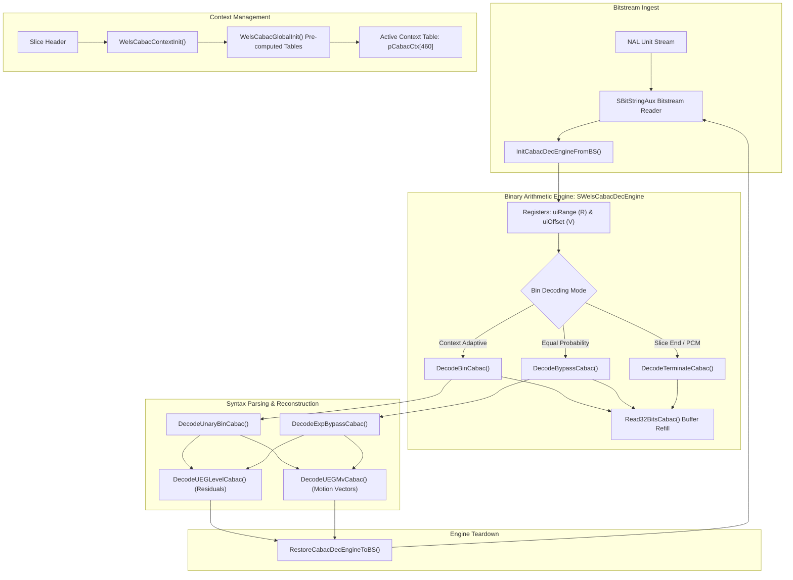
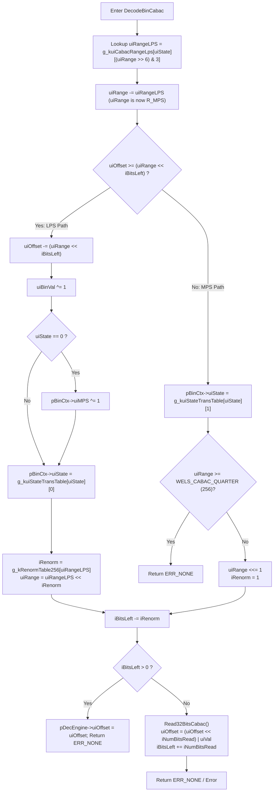

# OpenH264 CABAC Decoder Engine (`cabac_decoder.cpp`)

This document provides a comprehensive, literate-programming-style technical breakdown of the Context-Based Adaptive Binary Arithmetic Coding (CABAC) decoding engine implemented in [cabac_decoder.cpp](openh264/codec/decoder/core/src/cabac_decoder.cpp) and declared in [cabac_decoder.h](openh264/codec/decoder/core/inc/cabac_decoder.h).

---

## 1. Architectural & High-Level Module Purpose

In the H.264/AVC video coding standard (ITU-T Rec. H.264 / ISO/IEC 14496-10 Section 9.3), **CABAC (Context-Based Adaptive Binary Arithmetic Coding)** is the high-efficiency entropy coding scheme utilized in Main, High, and Scalable Baseline/High profiles. Compared to CAVLC (Context-Adaptive Variable-Length Coding), CABAC achieves a $10\%\text{--}15\%$ bit-rate reduction at equivalent video quality by employing:

1. **Binarization**: Non-binary syntax elements (e.g., transform coefficients, motion vector differences, macroblock prediction modes) are mapped to deterministic binary sequences ("bins").
2. **Context Modeling**: Adaptive probability state estimation where each bin is assigned a context model ($ctxIdx$) conditioned on neighboring macroblocks and previous bin values.
3. **Binary Arithmetic Decoding**: A multi-mode arithmetic decoding engine that splits the current probability interval into sub-intervals for the Most Probable Symbol (MPS) and Least Probable Symbol (LPS), decoding bits with high precision without floating-point arithmetic.



In OpenH264's decoder pipeline:
- [cabac_decoder.cpp](openh264/codec/decoder/core/src/cabac_decoder.cpp) encapsulates the core arithmetic state machine, lookup tables, bitstream refill mechanics, context model initialization, and multi-bin decoding routines.
- [parse_mb_syn_cabac.cpp](openh264/codec/decoder/core/src/parse_mb_syn_cabac.cpp) drives macroblock parsing by querying `DecodeBinCabac`, `DecodeBypassCabac`, and `DecodeUEGMvCabac` across all H.264 slice syntax elements.

---

## 2. Data Structures & Types

The CABAC engine relies on two primary data structures declared in [decoder_context.h](openh264/codec/decoder/core/inc/decoder_context.h#L69-L81):

### 2.1 `SWelsCabacCtx` / `PWelsCabacCtx`

Encapsulates the adaptive probability model for a single binary decision context.

```cpp
typedef struct SWels_Cabac_Element {
  uint8_t uiState;
  uint8_t uiMPS;
} SWelsCabacCtx, *PWelsCabacCtx;
```

#### Field Specifications

| Field | Type | Bit Depth / Range | Purpose & Lifecycle |
| :--- | :--- | :--- | :--- |
| `uiState` | `uint8_t` | $[0, 63]$ (6 bits) | Probability state index representing the estimated probability $p_{\text{LPS}}$ of the Least Probable Symbol. Updated after every regular bin decoding step via `g_kuiStateTransTable`. |
| `uiMPS` | `uint8_t` | $\{0, 1\}$ (1 bit) | Most Probable Symbol value for this context. Inverted when the state transitions from $0$ following an LPS decoding event. |

- **Storage & Allocation**: Stored in a flat array of size `WELS_CONTEXT_COUNT` ($460$) entries per slice context in `pCtx->pCabacCtx`.
- **Precomputed Context Cache**: Preserved in `pCtx->sWelsCabacContexts[4][52][460]` across all 4 initialization models, 52 quantization parameters ($0 \le \text{QP} \le 51$), and 460 context indices.

---

### 2.2 `SWelsCabacDecEngine` / `PWelsCabacDecEngine`

Represents the active state of the binary arithmetic decoding engine and its bit-sliding window register.

```cpp
typedef struct {
  uint64_t uiRange;
  uint64_t uiOffset;
  int32_t iBitsLeft;
  uint8_t* pBuffStart;
  uint8_t* pBuffCurr;
  uint8_t* pBuffEnd;
} SWelsCabacDecEngine, *PWelsCabacDecEngine;
```

#### Field Specifications

| Field | Type | Alignment / Bits | Description & Algorithmic Role |
| :--- | :--- | :--- | :--- |
| `uiRange` | `uint64_t` | Register (9-bit active) | Current range sub-interval $R$. Scaled such that $256 \le R \le 510$ (`WELS_CABAC_QUARTER` to `WELS_CABAC_HALF`) during active decoding. |
| `uiOffset` | `uint64_t` | 64-bit Bit Register | Current bitstream value register $V$. Maintained as a left-aligned or shifted accumulator containing bits consumed from the bitstream. |
| `iBitsLeft` | `int32_t` | Signed 32-bit integer | Number of unconsumed bit positions remaining in the current bit register sliding window. When `iBitsLeft <= 0`, new 32-bit/24-bit/16-bit words are read from `pBuffCurr`. |
| `pBuffStart` | `uint8_t*` | Pointer | Pointer to the beginning of the Raw Byte Sequence Payload (RBSP) buffer. |
| `pBuffCurr` | `uint8_t*` | Pointer | Current byte read pointer in the bitstream buffer. |
| `pBuffEnd` | `uint8_t*` | Pointer | End boundary pointer of the bitstream buffer, preventing buffer overruns. |

---

## 3. Constants and Global Lookup Tables

### 3.1 Constants Defined in Header & Source

```cpp
#define WELS_CABAC_HALF    0x01FE  // 510: Initial range R at slice start
#define WELS_CABAC_QUARTER 0x0100  // 256: Renormalization threshold (2^8)
#define WELS_CONTEXT_COUNT 460     // Total context models per model/QP
#define WELS_QP_MAX        51      // Maximum valid H.264 quantization parameter
```

### 3.2 Static Lookup Tables

#### `g_kMvdBinPos2Ctx`
[cabac_decoder.cpp#L35](openh264/codec/decoder/core/src/cabac_decoder.cpp#L35):
```cpp
static const int16_t g_kMvdBinPos2Ctx [8] = {0, 1, 2, 3, 3, 3, 3, 3};
```
- **Purpose**: Maps motion vector difference (MVD) bin index/position ($0 \dots 7$) to context model offsets relative to the base context index. Bins beyond index 3 reuse context offset 3.

#### `g_kRenormTable256`
[cabac_decoder.h#L46-L79](openh264/codec/decoder/core/inc/cabac_decoder.h#L46-L79):
- **Size**: 256 bytes (`uint8_t[256]`).
- **Mathematical Definition**: For any 8-bit range $R \in [0, 255]$, returns the exact number of left bit-shifts required to restore $R \ge 256$:
  $$\text{g\_kRenormTable256}[R] = \max(0, 8 - \lfloor \log_2(R) \rfloor)$$

#### External Global Tables Referenced

1. `g_kiCabacGlobalContextIdx[460][4][2]`: Defined in [common_tables.cpp](openh264/codec/common/src/common_tables.cpp). Stores the linear context initialization slope $m$ (index 0) and intercept $n$ (index 1) for all 460 contexts across 4 initialization models.
2. `g_kuiCabacRangeLps[64][4]`: Defined in [wels_common_defs.h](openh264/codec/common/inc/wels_common_defs.h). Standard H.264 Table 9-44 ($R_{\text{LPS}}$ matrix), indexed by probability state $0 \dots 63$ and quantized range index $(R \gg 6) \ \& \ 3$.
3. `g_kuiStateTransTable[64][2]`: Defined in [wels_common_defs.h](openh264/codec/common/inc/wels_common_defs.h). Standard H.264 Table 9-45 state transition matrix. Index 0 defines state transition upon LPS; index 1 defines state transition upon MPS.

---

## 4. Deep-Dive Function Breakdown

---

### 4.1 `WelsCabacGlobalInit`

[cabac_decoder.cpp#L37-L58](openh264/codec/decoder/core/src/cabac_decoder.cpp#L37-L58)

```cpp
void WelsCabacGlobalInit (PWelsDecoderContext pCtx);
```

#### Purpose
Pre-calculates and caches the entire 3D context model matrix `pCtx->sWelsCabacContexts[iModel][iQp][iIdx]` during decoder initialization. This ensures runtime slice initialization is a fast memory copy (`memcpy`) rather than executing repeated linear equations.

#### Mathematical Algorithm
For each initialization model $iModel \in [0, 3]$, Quantization Parameter $QP \in [0, 51]$, and context index $iIdx \in [0, 459]$:

1. Retrieve linear model parameters $m$ and $n$ from `g_kiCabacGlobalContextIdx[iIdx][iModel]`.
2. Compute the pre-clamped context state index:
   $$\text{preCtxState} = \text{clip3}\left( \left\lfloor \frac{m \cdot QP}{16} \right\rfloor + n, \, 1, \, 126 \right)$$
3. Derive initial probability state $\sigma$ (`uiState`) and Most Probable Symbol $\varpi$ (`uiMPS`):
   $$\sigma = \begin{cases} 63 - \text{preCtxState}, & \text{if } \text{preCtxState} \le 63 \\ \text{preCtxState} - 64, & \text{if } \text{preCtxState} > 63 \end{cases}$$
   $$\varpi = \begin{cases} 0, & \text{if } \text{preCtxState} \le 63 \\ 1, & \text{if } \text{preCtxState} > 63 \end{cases}$$
4. Store derived `uiState` and `uiMPS` into `pCtx->sWelsCabacContexts[iModel][iQp][iIdx]`.
5. Set `pCtx->bCabacInited = true`.

---

### 4.2 `WelsCabacContextInit`

[cabac_decoder.cpp#L61-L68](openh264/codec/decoder/core/src/cabac_decoder.cpp#L61-L68)

```cpp
void WelsCabacContextInit (PWelsDecoderContext pCtx, uint8_t eSliceType, int32_t iCabacInitIdc, int32_t iQp);
```

#### Parameters
- `pCtx`: Pointer to the master decoder context structure ([SWelsDecoderContext](openh264/codec/decoder/core/inc/decoder_context.h#L306)).
- `eSliceType`: Slice coding type (`I_SLICE`, `P_SLICE`, `B_SLICE`).
- `iCabacInitIdc`: Slice header syntax element `cabac_init_idc` $\in [0, 2]$.
- `iQp`: Current slice initial quantization parameter $QP_Y \in [0, 51]$.

#### Logic Flow
1. Computes context model table index $iIdx$:
   $$iIdx = \begin{cases} 0, & \text{if } eSliceType == \text{I\_SLICE} \\ iCabacInitIdc + 1, & \text{otherwise} \end{cases}$$
2. If `pCtx->bCabacInited` is false, invokes [WelsCabacGlobalInit](openh264/codec/decoder/core/src/cabac_decoder.cpp#L37-L58).
3. Executes a block memory copy:
   ```cpp
   memcpy (pCtx->pCabacCtx, pCtx->sWelsCabacContexts[iIdx][iQp],
           WELS_CONTEXT_COUNT * sizeof (SWelsCabacCtx));
   ```

---

### 4.3 `InitCabacDecEngineFromBS`

[cabac_decoder.cpp#L71-L91](openh264/codec/decoder/core/src/cabac_decoder.cpp#L71-L91)

```cpp
int32_t InitCabacDecEngineFromBS (PWelsCabacDecEngine pDecEngine, PBitStringAux pBsAux);
```

#### Purpose
Initializes the arithmetic decoding engine registers from an active auxiliary bitstream reader (`SBitStringAux`), loading the initial 40 bits of bitstream data to seed the arithmetic offset register.

#### Step-by-Step Mechanics
1. **Bitstream Alignment Calculation**:
   Retrieves unread bits from `pBsAux->iLeftBits` (which is negative in unread states). Derives the remaining byte offset:
   $$iRemainingBytes = \left( \frac{-pBsAux->iLeftBits}{8} \right) + 2$$
2. **Buffer Overrun Guard**:
   Checks if `pCurr >= (pBsAux->pEndBuf - 1)`. If true, aborts with `ERR_INFO_INVALID_ACCESS`.
3. **Seeding `uiOffset` ($V$)**:
   Packs the first 5 bytes from `pCurr` into a big-endian 40-bit integer in `pDecEngine->uiOffset`:
   $$V = (pCurr[0] \ll 32) \mid (pCurr[1] \ll 24) \mid (pCurr[2] \ll 16) \mid (pCurr[3] \ll 8) \mid pCurr[4]$$
4. **Register Initialization**:
   - `pDecEngine->iBitsLeft = 31`
   - `pDecEngine->uiRange = WELS_CABAC_HALF` ($0\text{x}01\text{FE} = 510$)
   - `pDecEngine->pBuffCurr = pCurr + 5`
   - `pBsAux->iLeftBits = 0`

---

### 4.4 `RestoreCabacDecEngineToBS`

[cabac_decoder.cpp#L93-L102](openh264/codec/decoder/core/src/cabac_decoder.cpp#L93-L102)

```cpp
void RestoreCabacDecEngineToBS (PWelsCabacDecEngine pDecEngine, PBitStringAux pBsAux);
```

#### Purpose
Synchronizes bitstream pointers and bit accumulators back to the general `SBitStringAux` bitstream reader upon slice completion, CABAC termination, or when encountering raw byte sequences (such as `pcm_alignment_zero_bit` and IPCM macroblocks).

#### Operations
1. Adjusts `pDecEngine->pBuffCurr` backwards by the unconsumed bytes remaining in `iBitsLeft`:
   ```cpp
   pDecEngine->pBuffCurr -= (pDecEngine->iBitsLeft >> 3);
   ```
2. Resets `pDecEngine->iBitsLeft = 0` and transfers the synchronized buffer pointer back to `pBsAux->pCurBuf`.

---

### 4.5 `Read32BitsCabac`

[cabac_decoder.cpp#L105-L136](openh264/codec/decoder/core/src/cabac_decoder.cpp#L105-L136)

```cpp
int32_t Read32BitsCabac (PWelsCabacDecEngine pDecEngine, uint32_t& uiValue, int32_t& iNumBitsRead);
```

#### Purpose
Refills the arithmetic sliding bit window from the bitstream buffer by loading up to 4 bytes (32 bits) in big-endian order.

#### Multi-Byte Boundary Handling
Evaluates remaining bytes $iLeftBytes = \text{pBuffEnd} - \text{pBuffCurr}$:
- **$iLeftBytes \le 0$**: Returns `ERR_CABAC_NO_BS_TO_READ`.
- **$iLeftBytes == 3$**: Reads 24 bits (`pCurr[0]<<16 | pCurr[1]<<8 | pCurr[2]`), advances pointer by 3, sets `iNumBitsRead = 24`.
- **$iLeftBytes == 2$**: Reads 16 bits (`pCurr[0]<<8 | pCurr[1]`), advances pointer by 2, sets `iNumBitsRead = 16`.
- **$iLeftBytes == 1$**: Reads 8 bits (`pCurr[0]`), advances pointer by 1, sets `iNumBitsRead = 8`.
- **$iLeftBytes \ge 4$**: Reads full 32-bit big-endian word, advances pointer by 4, sets `iNumBitsRead = 32`.

---

### 4.6 `DecodeBinCabac`

[cabac_decoder.cpp#L138-L181](openh264/codec/decoder/core/src/cabac_decoder.cpp#L138-L181)

```cpp
int32_t DecodeBinCabac (PWelsCabacDecEngine pDecEngine, PWelsCabacCtx pBinCtx, uint32_t& uiBinVal);
```

#### Core Arithmetic Decoding Routine (H.264 Section 9.3.3.2.1)



#### Mathematical Step-by-Step
1. **LPS Sub-interval Derivation**:
   $$qRangeIdx = (R \gg 6) \ \& \ 3$$
   $$R_{\text{LPS}} = \text{g\_kuiCabacRangeLps}[\sigma][qRangeIdx]$$
   $$R_{\text{MPS}} = R - R_{\text{LPS}}$$
2. **Branch Decision**:
   Scaled threshold comparison: $V \ge (R_{\text{MPS}} \ll iBitsLeft)$.
   - **Case A: Least Probable Symbol (LPS)**
     - $V \leftarrow V - (R_{\text{MPS}} \ll iBitsLeft)$
     - $uiBinVal = \varpi \oplus 1$
     - If $\sigma == 0$, flip $\varpi \leftarrow \varpi \oplus 1$.
     - Transition state: $\sigma \leftarrow \text{g\_kuiStateTransTable}[\sigma][0]$.
     - Renormalize: $iRenorm = \text{g\_kRenormTable256}[R_{\text{LPS}}]$, $R \leftarrow R_{\text{LPS}} \ll iRenorm$.
   - **Case B: Most Probable Symbol (MPS)**
     - $uiBinVal = \varpi$
     - Transition state: $\sigma \leftarrow \text{g\_kuiStateTransTable}[\sigma][1]$.
     - If $R_{\text{MPS}} \ge 256$, update $R \leftarrow R_{\text{MPS}}$ and return immediately (fast path).
     - Otherwise, shift $R \leftarrow R_{\text{MPS}} \ll 1$, $iRenorm = 1$.
3. **Renormalization & Register Refill**:
   - $iBitsLeft \leftarrow iBitsLeft - iRenorm$
   - When $iBitsLeft \le 0$, invoke [Read32BitsCabac](openh264/codec/decoder/core/src/cabac_decoder.cpp#L105-L136) to replenish $V$ and increment $iBitsLeft$ by the number of bits read.

---

### 4.7 `DecodeBypassCabac`

[cabac_decoder.cpp#L183-L212](openh264/codec/decoder/core/src/cabac_decoder.cpp#L183-L212)

```cpp
int32_t DecodeBypassCabac (PWelsCabacDecEngine pDecEngine, uint32_t& uiBinVal);
```

#### Purpose
Decodes symbols generated in bypass mode where symbols are assumed to have equal probability distribution ($p_0 = p_1 = 0.5$). Bypasses context state lookups and table transitions completely for maximum throughput.

#### Algorithm (H.264 Section 9.3.3.2.3)
1. If $iBitsLeft \le 0$, refills bitstream register via [Read32BitsCabac](openh264/codec/decoder/core/src/cabac_decoder.cpp#L105-L136).
2. Decrement $iBitsLeft \leftarrow iBitsLeft - 1$.
3. Compute threshold:
   $$uiRangeValue = R \ll iBitsLeft$$
4. Test bitstream register:
   $$uiBinVal = \begin{cases} 1, & \text{if } V \ge uiRangeValue \quad (\text{and update } V \leftarrow V - uiRangeValue) \\ 0, & \text{if } V < uiRangeValue \end{cases}$$

---

### 4.8 `DecodeTerminateCabac`

[cabac_decoder.cpp#L214-L245](openh264/codec/decoder/core/src/cabac_decoder.cpp#L214-L245)

```cpp
int32_t DecodeTerminateCabac (PWelsCabacDecEngine pDecEngine, uint32_t& uiBinVal);
```

#### Purpose
Decodes special termination bins: `end_of_slice_flag` (signaling the end of a slice NAL unit) and macroblock 24 (signaling `mb_type == I_PCM`).

#### Algorithm (H.264 Section 9.3.3.2.4)
1. Split sub-interval using fixed $R_{\text{LPS}} = 2$:
   $$R_{\text{MPS}} = R - 2$$
2. Check termination threshold: $V \ge (R_{\text{MPS}} \ll iBitsLeft)$:
   - **If True**: $uiBinVal = 1$ (Slice termination symbol decoded).
   - **If False**: $uiBinVal = 0$. Renormalize $R_{\text{MPS}}$: if $R_{\text{MPS}} < 256$, left-shift $R$ by `g_kRenormTable256[R]` and refill bitstream register if $iBitsLeft < 0$.

---

### 4.9 `DecodeUnaryBinCabac`

[cabac_decoder.cpp#L247-L263](openh264/codec/decoder/core/src/cabac_decoder.cpp#L247-L263)

```cpp
int32_t DecodeUnaryBinCabac (PWelsCabacDecEngine pDecEngine, PWelsCabacCtx pBinCtx, int32_t iCtxOffset,
                             uint32_t& uiSymVal);
```

#### Purpose
Decodes syntax elements encoded with Unary (U) or Truncated Unary (TU) binarization using adaptive context models.

#### Operational Flow
1. Decodes the initial leading bin using `pBinCtx`.
2. If the leading bin is `0`, returns `uiSymVal = 0`.
3. If the leading bin is `1`, offsets context pointer `pBinCtx += iCtxOffset` and iterates in a loop:
   - Decodes successive bins `uiCode` with `DecodeBinCabac`.
   - Increments `uiSymVal++` until `uiCode == 0`.

---

### 4.10 `DecodeExpBypassCabac`

[cabac_decoder.cpp#L265-L289](openh264/codec/decoder/core/src/cabac_decoder.cpp#L265-L289)

```cpp
int32_t DecodeExpBypassCabac (PWelsCabacDecEngine pDecEngine, int32_t iCount, uint32_t& uiSymVal);
```

#### Purpose
Decodes $k$-th order Exp-Golomb binarized suffix/escape codes in bypass mode ($EGk$).

#### Algorithmic Stages
1. **Unary Prefix Stage**:
   Decodes bypass bins `uiCode` in a loop until a zero bin is encountered or `iCount == 16`. Accumulates intermediate value $iSymTmp$:
   $$iSymTmp \leftarrow iSymTmp + 2^{iCount}, \quad iCount \leftarrow iCount + 1$$
   If `iCount == 16`, aborts with `ERR_CABAC_UNEXPECTED_VALUE`.
2. **Fixed-Length Suffix Stage**:
   Reads `iCount` bypass bits, accumulating into bitmask $iSymTmp2$:
   $$iSymTmp2 \mid= (1 \ll iCount) \quad \text{for each bit where } uiCode == 1$$
3. Computes final decoded symbol:
   $$uiSymVal = iSymTmp + iSymTmp2$$

---

### 4.11 `DecodeUEGLevelCabac`

[cabac_decoder.cpp#L291-L312](openh264/codec/decoder/core/src/cabac_decoder.cpp#L291-L312)

```cpp
uint32_t DecodeUEGLevelCabac (PWelsCabacDecEngine pDecEngine, PWelsCabacCtx pBinCtx, uint32_t& uiCode);
```

#### Purpose
Decodes residual transform coefficient absolute levels (`coeff_abs_level_minus1`) encoded using a 0-th order Unary / Exp-Golomb combination ($UEG0$).

#### Binarization Handling
1. Evaluates bin 0 with context model `pBinCtx`. If 0, returns `uiCode = 0`.
2. Decodes up to 13 unary bins with `DecodeBinCabac`.
3. If magnitude reaches the escape threshold (14th bin $\ne 0$), switches to 0-th order Exp-Golomb bypass decoding via [DecodeExpBypassCabac](openh264/codec/decoder/core/src/cabac_decoder.cpp#L265-L289) with $k=0$:
   $$uiCode \leftarrow uiCode + uiTmp + 1$$

---

### 4.12 `DecodeUEGMvCabac`

[cabac_decoder.cpp#L314-L332](openh264/codec/decoder/core/src/cabac_decoder.cpp#L314-L332)

```cpp
int32_t DecodeUEGMvCabac (PWelsCabacDecEngine pDecEngine, PWelsCabacCtx pBinCtx, uint32_t iMaxBin,  uint32_t& uiCode);
```

#### Purpose
Decodes motion vector difference absolute values ($|MVD_x|$ and $|MVD_y|$) using mapped context indices for the prefix and 3rd-order Exp-Golomb ($EG3$) bypass decoding for large motion vector escape values.

#### Binarization Breakdown
1. **Bin 0**: Evaluated using context offset `g_kMvdBinPos2Ctx[0]`. If 0, returns `uiCode = 0`.
2. **Bins 1 to 8**: Evaluated using context offsets mapped by `g_kMvdBinPos2Ctx[uiCount]`.
3. **Escape Suffix**: If bin 8 is non-zero (i.e. $|MVD| \ge 9$), decodes 3rd-order Exp-Golomb bypass suffix via `DecodeExpBypassCabac(pDecEngine, 3, uiTmp)`:
   $$uiCode \leftarrow uiCode + uiTmp + 1$$

---

## 5. Summary Table of Functions in `cabac_decoder.cpp`

| Function Name | Signature & Target Symbols | Key Operations | Callers / Upstream Modules |
| :--- | :--- | :--- | :--- |
| [WelsCabacGlobalInit](openh264/codec/decoder/core/src/cabac_decoder.cpp#L37-L58) | `(PWelsDecoderContext pCtx)` | Computes $4\times 52\times 460$ pre-computed context state matrix for all models and QPs. | `WelsCabacContextInit`, decoder core startup. |
| [WelsCabacContextInit](openh264/codec/decoder/core/src/cabac_decoder.cpp#L61-L68) | `(PWelsDecoderContext pCtx, uint8_t eSliceType, int32_t iCabacInitIdc, int32_t iQp)` | Copies 460 active contexts into `pCtx->pCabacCtx` via fast `memcpy`. | [decode_slice.cpp](openh264/codec/decoder/core/src/decode_slice.cpp). |
| [InitCabacDecEngineFromBS](openh264/codec/decoder/core/src/cabac_decoder.cpp#L71-L91) | `(PWelsCabacDecEngine pDecEngine, PBitStringAux pBsAux)` | Seeds 40-bit bitstream accumulator $V$, sets $R = 510$, and initializes engine registers. | [decode_slice.cpp](openh264/codec/decoder/core/src/decode_slice.cpp). |
| [RestoreCabacDecEngineToBS](openh264/codec/decoder/core/src/cabac_decoder.cpp#L93-L102) | `(PWelsCabacDecEngine pDecEngine, PBitStringAux pBsAux)` | Restores bitstream byte alignment and unconsumed bit counts back to `SBitStringAux`. | [decode_slice.cpp](openh264/codec/decoder/core/src/decode_slice.cpp), IPCM decoding. |
| [Read32BitsCabac](openh264/codec/decoder/core/src/cabac_decoder.cpp#L105-L136) | `(PWelsCabacDecEngine pDecEngine, uint32_t& uiValue, int32_t& iNumBitsRead)` | Big-endian byte refilling (1 to 4 bytes) into sliding bit window register. | `DecodeBinCabac`, `DecodeBypassCabac`, `DecodeTerminateCabac`. |
| [DecodeBinCabac](openh264/codec/decoder/core/src/cabac_decoder.cpp#L138-L181) | `(PWelsCabacDecEngine pDecEngine, PWelsCabacCtx pBinCtx, uint32_t& uiBinVal)` | Regular context-adaptive binary arithmetic decoding, range renormalization, and state transition. | [parse_mb_syn_cabac.cpp](openh264/codec/decoder/core/src/parse_mb_syn_cabac.cpp). |
| [DecodeBypassCabac](openh264/codec/decoder/core/src/cabac_decoder.cpp#L183-L212) | `(PWelsCabacDecEngine pDecEngine, uint32_t& uiBinVal)` | $O(1)$ fast arithmetic bypass decoding for equi-probable symbols ($p = 0.5$). | `DecodeExpBypassCabac`, sign flag decoding. |
| [DecodeTerminateCabac](openh264/codec/decoder/core/src/cabac_decoder.cpp#L214-L245) | `(PWelsCabacDecEngine pDecEngine, uint32_t& uiBinVal)` | Fixed $R_{\text{LPS}} = 2$ arithmetic decoding for `end_of_slice_flag` and IPCM signals. | [parse_mb_syn_cabac.cpp](openh264/codec/decoder/core/src/parse_mb_syn_cabac.cpp). |
| [DecodeUnaryBinCabac](openh264/codec/decoder/core/src/cabac_decoder.cpp#L247-L263) | `(PWelsCabacDecEngine pDecEngine, PWelsCabacCtx pBinCtx, int32_t iCtxOffset, uint32_t& uiSymVal)` | Multi-bin unary parsing with context model offsets. | [parse_mb_syn_cabac.cpp](openh264/codec/decoder/core/src/parse_mb_syn_cabac.cpp). |
| [DecodeExpBypassCabac](openh264/codec/decoder/core/src/cabac_decoder.cpp#L265-L289) | `(PWelsCabacDecEngine pDecEngine, int32_t iCount, uint32_t& uiSymVal)` | $k$-th order Exp-Golomb suffix bypass decoding. | `DecodeUEGLevelCabac`, `DecodeUEGMvCabac`. |
| [DecodeUEGLevelCabac](openh264/codec/decoder/core/src/cabac_decoder.cpp#L291-L312) | `(PWelsCabacDecEngine pDecEngine, PWelsCabacCtx pBinCtx, uint32_t& uiCode)` | Residual coefficient absolute level decoding ($UEG0$). | [parse_mb_syn_cabac.cpp](openh264/codec/decoder/core/src/parse_mb_syn_cabac.cpp). |
| [DecodeUEGMvCabac](openh264/codec/decoder/core/src/cabac_decoder.cpp#L314-L332) | `(PWelsCabacDecEngine pDecEngine, PWelsCabacCtx pBinCtx, uint32_t iMaxBin, uint32_t& uiCode)` | Motion vector difference magnitude decoding ($UEG3$). | [parse_mb_syn_cabac.cpp](openh264/codec/decoder/core/src/parse_mb_syn_cabac.cpp). |
