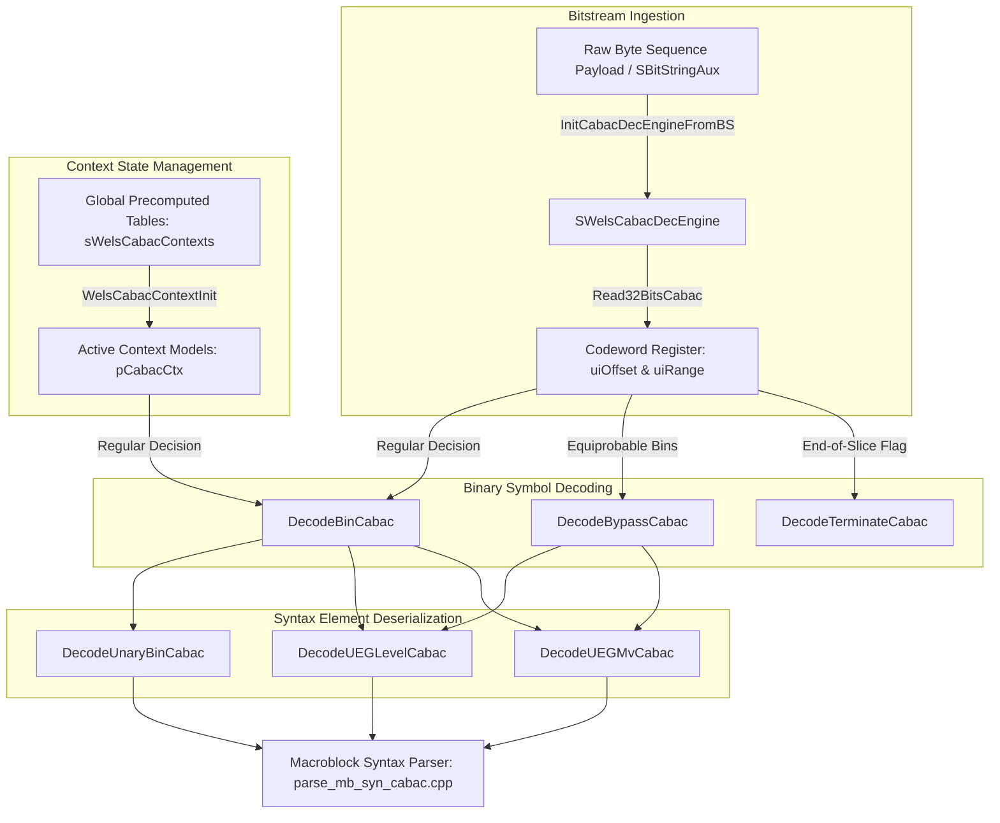
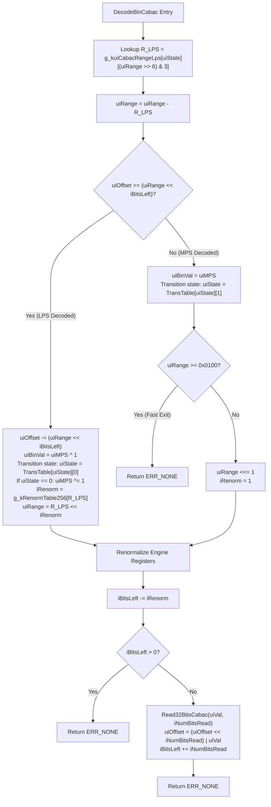
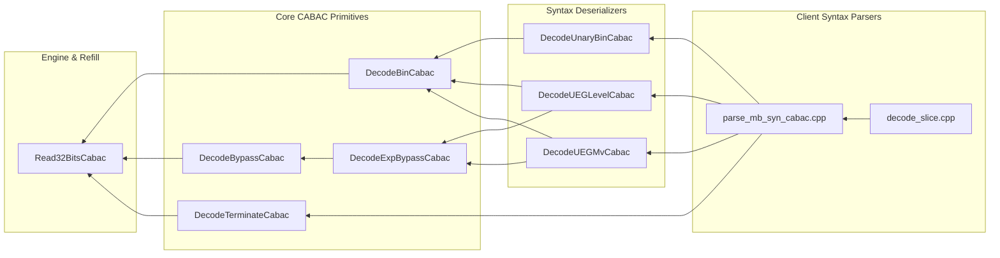

# OpenH264 CABAC Decoder Engine: `cabac_decoder.h`

This document provides a comprehensive, literate-programming-style technical specification and architectural deep dive into the **Context-Adaptive Binary Arithmetic Coding (CABAC) Decoder Engine** declared in [`codec/decoder/core/inc/cabac_decoder.h`](openh264/codec/decoder/core/inc/cabac_decoder.h) and implemented in [`codec/decoder/core/src/cabac_decoder.cpp`](openh264/codec/decoder/core/src/cabac_decoder.cpp).

---

## Table of Contents
1. [Architectural Overview & Module Purpose](#1-architectural-overview--module-purpose)
2. [H.264 CABAC Arithmetic Engine Fundamentals](#2-h264-cabac-arithmetic-engine-fundamentals)
3. [Data Structures, Types, and Global Constants](#3-data-structures-types-and-global-constants)
   - [3.1 Renormalization Table: `g_kRenormTable256`](#31-renormalization-table-g_krenormtable256)
   - [3.2 CABAC Context Model: `SWelsCabacCtx` / `SWels_Cabac_Element`](#32-cabac-context-model-swelscabacctx--swels_cabac_element)
   - [3.3 Binary Arithmetic Decoding Engine: `SWelsCabacDecEngine`](#33-binary-arithmetic-decoding-engine-swelscabacdecengine)
   - [3.4 Core Engine Macros and Limits](#34-core-engine-macros-and-limits)
4. [Deep Dive: Function & Method Implementations](#4-deep-dive-function--method-implementations)
   - [4.1 Context Initialization: `WelsCabacGlobalInit` & `WelsCabacContextInit`](#41-context-initialization-welscabacglobalinit--welscabaccontextinit)
   - [4.2 Engine Lifecycle: `InitCabacDecEngineFromBS` & `RestoreCabacDecEngineToBS`](#42-engine-lifecycle-initcabacdecenginefrombs--restorecabacdecenginetobs)
   - [4.3 Bitstream Ingestion: `Read32BitsCabac`](#43-bitstream-ingestion-read32bitscabac)
   - [4.4 Core Binary Arithmetic Decoding: `DecodeBinCabac`](#44-core-binary-arithmetic-decoding-decodebincabac)
   - [4.5 Fast Bypass & Termination: `DecodeBypassCabac` & `DecodeTerminateCabac`](#45-fast-bypass--termination-decodebypasscabac--decodeterminatecabac)
   - [4.6 Syntax Element Deserializers: `DecodeUnaryBinCabac`, `DecodeExpBypassCabac`, `DecodeUEGLevelCabac`, `DecodeUEGMvCabac`](#46-syntax-element-deserializers-decodeunarybincabac-decodeexpbypasscabac-decodeueglevelcabac-decodeuegmvcabac)
5. [Call Graph & Decoder Pipeline Integration](#5-call-graph--decoder-pipeline-integration)

---

## 1. Architectural Overview & Module Purpose

In the H.264 / AVC video coding standard (ITU-T Recommendation H.264 / ISO/IEC 14496-10, Section 9.3), **Context-Adaptive Binary Arithmetic Coding (CABAC)** is the advanced entropy coding scheme designed to provide significantly superior compression efficiency (typically 10% to 15% bitrate reduction) compared to Context-Adaptive Variable-Length Coding (CAVLC).

The header file [`cabac_decoder.h`](openh264/codec/decoder/core/inc/cabac_decoder.h) declares the core C++ interface and state machines for:
1. **Context Model Table Precomputation & Slice Context Initialization**: Deriving 6-bit probability state indices and Most Probable Symbol (MPS) flags across all H.264 slice types ($I$, $P$, $B$) and quantization parameters ($QP \in [0, 51]$).
2. **Binary Arithmetic Decoding Core Engine**: Managing the 9-bit current interval range register $R$ (`uiRange`), the 32-bit codeword offset register $V$ (`uiOffset`), and bitstream refill buffers (`iBitsLeft`).
3. **Adaptive Binary Symbol Parsing**: Regular bin decoding with dynamic probability state transitions (`DecodeBinCabac`), equiprobable bypass decoding (`DecodeBypassCabac`), and end-of-slice termination decoding (`DecodeTerminateCabac`).
4. **Binarization Symbol Deserializers**: Truncated Unary (TU) and Exp-Golomb ($k$-th order EGk) decoding routines for macroblock types, intra prediction modes, motion vector differences (MVD), and transform coefficient residual levels.



---

## 2. H.264 CABAC Arithmetic Engine Fundamentals

The binary arithmetic decoder maintains a sub-interval $[0, R)$ representing the current probability state space, alongside a value $V$ representing the fractional bitstream offset inside that range.

### Mathematical Principles of Interval Sub-Division

1. **Range Sub-Division**:
   Given the current range $R \in [256, 510]$ and a context model with probability state index $\sigma \in [0, 62]$, the range is partitioned into the Least Probable Symbol interval $R_{\text{LPS}}$ and Most Probable Symbol interval $R_{\text{MPS}}$:
   $$R_{\text{LPS}} = \text{g\_kuiCabacRangeLps}[\sigma][(R \gg 6) \ \& \ 3]$$
   $$R_{\text{MPS}} = R - R_{\text{LPS}}$$

2. **Symbol Decision**:
   The offset register $V$ (scaled relative to buffered bits) is tested against $R_{\text{MPS}}$:
   $$\text{Decoded Bin } b = \begin{cases} \text{uiMPS}, & \text{if } V < (R_{\text{MPS}} \ll \text{iBitsLeft}) \\ \text{uiMPS} \oplus 1, & \text{if } V \ge (R_{\text{MPS}} \ll \text{iBitsLeft}) \end{cases}$$

3. **Probability State Adaptation**:
   When symbol $b$ is decoded, the context state $\sigma$ transitions via standard state tables:
   $$\sigma_{\text{next}} = \begin{cases} \text{g\_kuiStateTransTable}[\sigma][1], & \text{if } b = \text{uiMPS} \\ \text{g\_kuiStateTransTable}[\sigma][0], & \text{if } b \ne \text{uiMPS} \end{cases}$$
   If an LPS is decoded when $\sigma = 0$, the Most Probable Symbol is inverted: $\text{uiMPS} \leftarrow \text{uiMPS} \oplus 1$.

4. **Interval Renormalization**:
   Whenever the interval range drops below the quarter threshold $R < 256$ ($0\text{x}0100$), both $R$ and $V$ are left-shifted by $k$ bits (determined via [`g_kRenormTable256`](openh264/codec/decoder/core/inc/cabac_decoder.h#L46-L79)) until $R \in [256, 510]$, consuming new bits from the bitstream buffer.

---

## 3. Data Structures, Types, and Global Constants

### 3.1 Renormalization Table: `g_kRenormTable256`

Declared in [`cabac_decoder.h:L46-L79`](openh264/codec/decoder/core/inc/cabac_decoder.h#L46-L79):

```cpp
static const uint8_t g_kRenormTable256[256];
```

* **Type**: `const uint8_t[256]` (256-byte static array).
* **Role**: Computes the exact left-shift count $k$ needed to renormalize an 8-bit LPS range value $R_{\text{LPS}} \in [0, 255]$ into the valid 9-bit CABAC interval $[256, 510]$ ($[0\text{x}0100, 0\text{x}01FE]$).
* **Mapping Logic**:
  $$k = \text{g\_kRenormTable256}[R_{\text{LPS}}] = 8 - \lfloor \log_2(R_{\text{LPS}}) \rfloor$$
  * Values $[0 \dots 7]$: return `6` ($R_{\text{LPS}} \ll 6$).
  * Values $[8 \dots 15]$: return `5` ($R_{\text{LPS}} \ll 5$).
  * Values $[16 \dots 31]$: return `4` ($R_{\text{LPS}} \ll 4$).
  * Values $[32 \dots 63]$: return `3` ($R_{\text{LPS}} \ll 3$).
  * Values $[64 \dots 127]$: return `2` ($R_{\text{LPS}} \ll 2$).
  * Values $[128 \dots 255]$: return `1` ($R_{\text{LPS}} \ll 1$).

---

### 3.2 CABAC Context Model: `SWelsCabacCtx` / `SWels_Cabac_Element`

Defined in [`codec/decoder/core/inc/decoder_context.h:L69-L72`](openh264/codec/decoder/core/inc/decoder_context.h#L69-L72):

```cpp
typedef struct SWels_Cabac_Element {
  uint8_t uiState;
  uint8_t uiMPS;
} SWelsCabacCtx, *PWelsCabacCtx;
```

#### Field Specifications

| Field | Type | Size | Valid Range | Architectural Description |
| :--- | :--- | :--- | :--- | :--- |
| `uiState` | `uint8_t` | 1 Byte | $0 \dots 62$ | 6-bit probability state index estimating $p_{\text{LPS}}$. Indexed into transition and range tables. |
| `uiMPS` | `uint8_t` | 1 Byte | `0` or `1` | Most Probable Symbol bit value expected for this syntax context. |

* **Total Structure Size**: 2 Bytes (aligned naturally).
* **Context Count (`WELS_CONTEXT_COUNT`)**: 460 distinct context models per slice covering syntax elements (macroblock type, MVD, CBP, CBF, significant coeff map, last coeff flag, absolute levels).
* **Storage in Decoder Context**:
  * `sWelsCabacContexts[4][52][460]`: Precomputed static tables indexed by `[iModel][iQp][iContextIdx]`. Total footprint: $4 \times 52 \times 460 \times 2 = 191,360$ bytes ($\approx 186.87 \text{ KB}$).
  * `pCabacCtx`: Pointer to the active slice context array ($460 \times 2 = 920$ bytes).

---

### 3.3 Binary Arithmetic Decoding Engine: `SWelsCabacDecEngine`

Defined in [`codec/decoder/core/inc/decoder_context.h:L74-L81`](openh264/codec/decoder/core/inc/decoder_context.h#L74-L81):

```cpp
typedef struct {
  uint64_t uiRange;
  uint64_t uiOffset;
  int32_t iBitsLeft;
  uint8_t* pBuffStart;
  uint8_t* pBuffCurr;
  uint8_t* pBuffEnd;
} SWelsCabacDecEngine, *PWelsCabacDecEngine;
```

#### Field Specifications

| Field | Type | Size | Description |
| :--- | :--- | :--- | :--- |
| `uiRange` | `uint64_t` | 8 Bytes | Current interval range register $R$. Normalized to $[256, 510]$ (`0x0100` to `0x01FE`). |
| `uiOffset` | `uint64_t` | 8 Bytes | Arithmetic codeword register $V$. Stores shifted bitstream input data. |
| `iBitsLeft` | `int32_t` | 4 Bytes | Number of valid buffered bits remaining in the `uiOffset` register. |
| `pBuffStart` | `uint8_t*` | Pointer | Pointer to the beginning of the RBSP bitstream buffer. |
| `pBuffCurr` | `uint8_t*` | Pointer | Pointer to the current unread byte in the bitstream buffer. |
| `pBuffEnd` | `uint8_t*` | Pointer | Pointer to the termination boundary of the RBSP bitstream buffer. |

---

### 3.4 Core Engine Macros and Limits

Declared in [`cabac_decoder.h:L104-L109`](openh264/codec/decoder/core/inc/cabac_decoder.h#L104-L109):

```cpp
#define WELS_CABAC_HALF    0x01FE
#define WELS_CABAC_QUARTER 0x0100
#define WELS_CABAC_FALSE_RETURN(iErrorInfo) \
if(iErrorInfo) { \
  return iErrorInfo; \
}
```

* **`WELS_CABAC_HALF` (`0x01FE` = 510)**: Upper bound for the CABAC range interval. Assigned to `uiRange` upon engine initialization.
* **`WELS_CABAC_QUARTER` (`0x0100` = 256)**: Lower bound threshold for interval range. When $R < 256$, renormalization is triggered.
* **`WELS_CABAC_FALSE_RETURN(iErrorInfo)`**: Guard macro for bubbling up bitstream parsing errors (`ERR_INFO_INVALID_ACCESS`, `ERR_CABAC_NO_BS_TO_READ`).

---

## 4. Deep Dive: Function & Method Implementations

### 4.1 Context Initialization: `WelsCabacGlobalInit` & `WelsCabacContextInit`

```cpp
void WelsCabacGlobalInit (PWelsDecoderContext pCabacCtx);
void WelsCabacContextInit (PWelsDecoderContext pCtx, uint8_t eSliceType, int32_t iCabacInitIdc, int32_t iQp);
```

#### A. `WelsCabacGlobalInit`
* **File Reference**: [cabac_decoder.cpp:L37-L58](openh264/codec/decoder/core/src/cabac_decoder.cpp#L37-L58)
* **Purpose**: One-time global precomputation of CABAC context models for all 4 initialization models (`iModel` $\in [0, 3]$), 52 QP values (`iQp` $\in [0, 51]$), and 460 context indices (`iIdx` $\in [0, 459]$).
* **Mathematical Formula**:
  For each context index `iIdx`, slope $m = \text{g\_kiCabacGlobalContextIdx}[iIdx][iModel][0]$ and intercept $n = \text{g\_kiCabacGlobalContextIdx}[iIdx][iModel][1]$:
  $$\text{iPreCtxState} = \text{clip3}\left(1, 126, \left(\frac{m \cdot \text{iQp}}{16}\right) + n\right)$$
  $$\text{uiState} = \begin{cases} 63 - \text{iPreCtxState}, & \text{if } \text{iPreCtxState} \le 63 \implies \text{uiMPS} = 0 \\ \text{iPreCtxState} - 64, & \text{if } \text{iPreCtxState} > 63 \implies \text{uiMPS} = 1 \end{cases}$$

#### B. `WelsCabacContextInit`
* **File Reference**: [cabac_decoder.cpp:L61-L68](openh264/codec/decoder/core/src/cabac_decoder.cpp#L61-L68)
* **Purpose**: Initializes the active slice context array `pCtx->pCabacCtx` at the start of each slice.
* **Model Selection**:
  $$iIdx = \begin{cases} 0, & \text{if } \text{eSliceType} = \text{I\_SLICE} \\ \text{iCabacInitIdc} + 1, & \text{otherwise} \end{cases}$$
* **Operation**: Executes `memcpy(pCtx->pCabacCtx, pCtx->sWelsCabacContexts[iIdx][iQp], 460 * sizeof(SWelsCabacCtx))`.

---

### 4.2 Engine Lifecycle: `InitCabacDecEngineFromBS` & `RestoreCabacDecEngineToBS`

```cpp
int32_t InitCabacDecEngineFromBS (PWelsCabacDecEngine pDecEngine, SBitStringAux* pBsAux);
void RestoreCabacDecEngineToBS (PWelsCabacDecEngine pDecEngine, SBitStringAux* pBsAux);
```

#### A. `InitCabacDecEngineFromBS`
* **File Reference**: [cabac_decoder.cpp:L71-L91](openh264/codec/decoder/core/src/cabac_decoder.cpp#L71-L91)
* **Parameters**:
  * `pDecEngine`: Target binary arithmetic decoding engine structure.
  * `pBsAux`: Active bitstream reader structure ([`SBitStringAux`](openh264/codec/decoder/core/inc/bit_stream.h)).
* **Initialization Workflow**:
  1. Computes remaining unread bytes from `pBsAux`:
     $$\text{iRemainingBytes} = \left(\frac{-\text{pBsAux}\to\text{iLeftBits}}{8}\right) + 2$$
  2. Sets read pointer $p_{\text{curr}} = \text{pBsAux}\to\text{pCurBuf} - \text{iRemainingBytes}$.
  3. Verifies pointer boundary $p_{\text{curr}} < (\text{pBsAux}\to\text{pEndBuf} - 1)$. Returns `ERR_INFO_INVALID_ACCESS` on overflow.
  4. Ingests initial 5 bytes (40 bits) in big-endian order into `uiOffset`:
     $$\text{uiOffset} = (p_0 \ll 24) \mid (p_1 \ll 16) \mid (p_2 \ll 8) \mid p_3 \quad (\text{shifted by } 8 \text{ bits with } p_4)$$
  5. Sets `iBitsLeft = 31`, `uiRange = WELS_CABAC_HALF` ($0\text{x}01FE$), and resets `pBsAux->iLeftBits = 0`.

#### B. `RestoreCabacDecEngineToBS`
* **File Reference**: [cabac_decoder.cpp:L93-L102](openh264/codec/decoder/core/src/cabac_decoder.cpp#L93-L102)
* **Purpose**: Restores bitstream state from CABAC engine back into `SBitStringAux` when switching parsing modes or reaching slice termination.
* **Operation**: Rewinds `pBuffCurr` by unread buffered bytes $(\text{iBitsLeft} \gg 3)$ and synchronizes buffer pointers.

---

### 4.3 Bitstream Ingestion: `Read32BitsCabac`

```cpp
int32_t Read32BitsCabac (PWelsCabacDecEngine pDecEngine, uint32_t& uiValue, int32_t& iNumBitsRead);
```

* **File Reference**: [cabac_decoder.cpp:L105-L136](openh264/codec/decoder/core/src/cabac_decoder.cpp#L105-L136)
* **Purpose**: Reads up to 4 consecutive bytes from `pBuffCurr` in big-endian order, returning the integer word and number of bits successfully ingested.
* **Boundary Conditions**:
  * $\ge 4$ bytes remaining: Ingests 4 bytes, `iNumBitsRead = 32`.
  * 3 bytes remaining: `uiValue = (p_0 \ll 16) | (p_1 \ll 8) | p_2`, `iNumBitsRead = 24`.
  * 2 bytes remaining: `uiValue = (p_0 \ll 8) | p_1`, `iNumBitsRead = 16`.
  * 1 byte remaining: `uiValue = p_0`, `iNumBitsRead = 8`.
  * $\le 0$ bytes remaining: Returns `ERR_CABAC_NO_BS_TO_READ`.

---

### 4.4 Core Binary Arithmetic Decoding: `DecodeBinCabac`

```cpp
int32_t DecodeBinCabac (PWelsCabacDecEngine pDecEngine, PWelsCabacCtx pBinCtx, uint32_t& uiBit);
```

* **File Reference**: [cabac_decoder.cpp:L138-L181](openh264/codec/decoder/core/src/cabac_decoder.cpp#L138-L181)
* **Algorithm Walkthrough**:



---

### 4.5 Fast Bypass & Termination: `DecodeBypassCabac` & `DecodeTerminateCabac`

```cpp
int32_t DecodeBypassCabac (PWelsCabacDecEngine pDecEngine, uint32_t& uiBinVal);
int32_t DecodeTerminateCabac (PWelsCabacDecEngine pDecEngine, uint32_t& uiBinVal);
```

#### A. `DecodeBypassCabac`
* **File Reference**: [cabac_decoder.cpp:L183-L212](openh264/codec/decoder/core/src/cabac_decoder.cpp#L183-L212)
* **Purpose**: Decodes equiprobable bins ($p = 0.5$) used for sign bits and Exp-Golomb suffix codes without context table lookup or state updating.
* **Mechanism**: Compares `uiOffset` directly against `uiRange << (iBitsLeft - 1)`. If $V \ge \text{scaled range}$, sets $\text{uiBinVal} = 1$ and subtracts the scaled range; otherwise sets $\text{uiBinVal} = 0$.

#### B. `DecodeTerminateCabac`
* **File Reference**: [cabac_decoder.cpp:L214-L245](openh264/codec/decoder/core/src/cabac_decoder.cpp#L214-L245)
* **Purpose**: Decodes `end_of_slice_flag` or IPCM macroblock indicators where $R_{\text{LPS}} = 2$.
* **Mechanism**: Sets sub-range to $R - 2$. If $V \ge (R - 2) \ll \text{iBitsLeft}$, decoded symbol is `1` (slice termination). Otherwise symbol is `0` and range $R - 2$ is renormalized if $< 256$.

---

### 4.6 Syntax Element Deserializers

```cpp
int32_t DecodeUnaryBinCabac (PWelsCabacDecEngine pDecEngine, PWelsCabacCtx pBinCtx, int32_t iCtxOffset, uint32_t& uiSymVal);
int32_t DecodeExpBypassCabac (PWelsCabacDecEngine pDecEngine, int32_t iCount, uint32_t& uiSymVal);
uint32_t DecodeUEGLevelCabac (PWelsCabacDecEngine pDecEngine, PWelsCabacCtx pBinCtx, uint32_t& uiBinVal);
int32_t DecodeUEGMvCabac (PWelsCabacDecEngine pDecEngine, PWelsCabacCtx pBinCtx, uint32_t iMaxC, uint32_t& uiCode);
```

#### Summary of Deserializer Behaviors

| Function | Syntax Elements Parsed | Binarization Scheme | Algorithmic Structure |
| :--- | :--- | :--- | :--- |
| `DecodeUnaryBinCabac` | `mb_type`, `intra_chroma_pred_mode`, `ref_idx` | Truncated Unary (TU) | Loops `DecodeBinCabac` with context offset increment until a zero bin is parsed. |
| `DecodeExpBypassCabac` | Suffix bits for high MVDs and large residual levels | $k$-th order Exp-Golomb (EGk) | Reads leading 1s via `DecodeBypassCabac`, then parses the binary suffix value. |
| `DecodeUEGLevelCabac` | Transform coefficient absolute values ($|coeff| - 1$) | UEG0 (Truncated Unary + 0-th order Exp-Golomb) | Decodes up to 13 regular context bins; if suffix required, invokes `DecodeExpBypassCabac(pDecEngine, 0, ...)`. |
| `DecodeUEGMvCabac` | Motion Vector Differences ($|MVD|$) | UEG3 (Truncated Unary + 3rd order Exp-Golomb) | Maps bin positions $0 \dots 7$ via `g_kMvdBinPos2Ctx`; invokes `DecodeExpBypassCabac(pDecEngine, 3, ...)`. |

---

## 5. Call Graph & Decoder Pipeline Integration



### Direct Callers
* [`parse_mb_syn_cabac.cpp`](openh264/codec/decoder/core/src/parse_mb_syn_cabac.cpp): Invokes CABAC engine functions to parse macroblock headers, sub-MB modes, MVDs, reference indices, CBP/CBF, and residual transform blocks.
* [`decode_slice.cpp`](openh264/codec/decoder/core/src/decode_slice.cpp): Coordinates slice-level initialization (`WelsCabacContextInit`, `InitCabacDecEngineFromBS`) and restoration (`RestoreCabacDecEngineToBS`).
