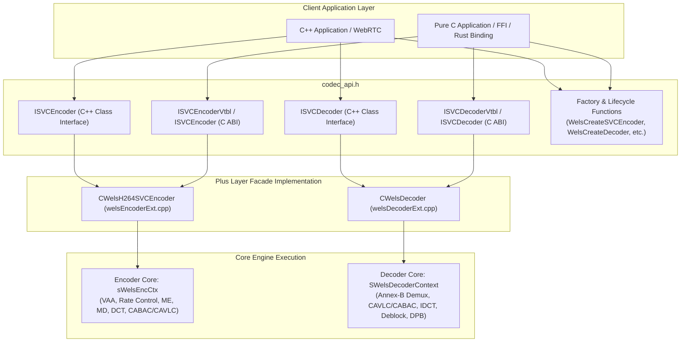
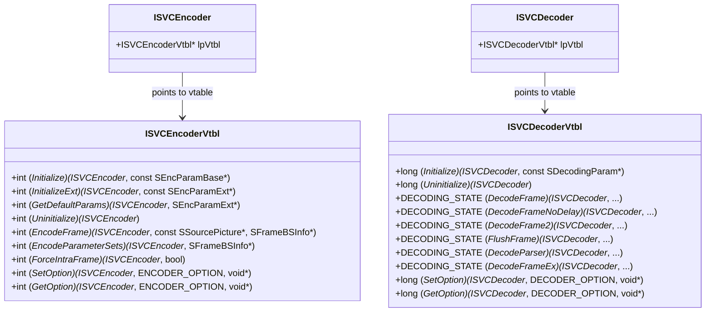

# OpenH264 Public C/C++ API Architecture (`codec_api.h`)

This document provides a comprehensive, literate-programming-style technical specification of [codec_api.h](openh264/codec/api/wels/codec_api.h). As detailed in the [System Architectural Overview](openh264/rust/docs/overview.md), [codec_api.h](openh264/codec/api/wels/codec_api.h) serves as the primary public API surface and Application Binary Interface (ABI) gateway for Cisco OpenH264. It defines the abstract interface classes, C-compatible vtables, dynamic library export bindings, versioning query structures, and factory lifecycles used by external multimedia frameworks (such as WebRTC, FFmpeg plugins, GStreamer, and Firefox Gecko Media Plugins) to interact with the underlying video encoding and decoding engines.

---

## Table of Contents
1. [Architectural Role & Header Design](#1-architectural-role--header-design)
2. [Preprocessor Definitions, Types & Calling Conventions](#2-preprocessor-definitions-types--calling-conventions)
3. [C++ Abstract Interface: ISVCEncoder](#3-c-abstract-interface-isvcencoder)
4. [C++ Abstract Interface: ISVCDecoder](#4-c-abstract-interface-isvcdecoder)
5. [Pure C Virtual Function Tables (Vtbl ABI Bindings)](#5-pure-c-virtual-function-tables-vtbl-abi-bindings)
6. [Global Factory & Codec Lifecycle Management Functions](#6-global-factory--codec-lifecycle-management-functions)
7. [Mathematical Models & Data Layout Equations](#7-mathematical-models--data-layout-equations)
8. [Complete Symbol Cross-Reference](#8-complete-symbol-cross-reference)

---

## 1. Architectural Role & Header Design

The OpenH264 codec architecture cleanly decouples application-facing API facades from high-performance core C/assembly engines. The header [codec_api.h](openh264/codec/api/wels/codec_api.h) is the topmost contract in this hierarchy.



### Core Design Principles
1. **Dual Language Dual ABI Support**: Provides modern abstract C++ classes (`ISVCEncoder`, `ISVCDecoder`) with pure virtual methods under `#ifdef __cplusplus`, while exposing explicit struct-based function pointer vtables (`ISVCEncoderVtbl`, `ISVCDecoderVtbl`) when compiled in pure C (`#else`). This guarantees binary interoperability across compilers, language runtimes (C, C++, Rust, Python FFI), and shared object boundaries.
2. **Encapsulated State**: The public header strictly forbids direct exposure of internal memory layout structs (such as `sWelsEncCtx` or `SWelsDecoderContext`). All state is manipulated through opaque object pointers managed behind factory creation and destruction calls.
3. **Annex-B and SVC Stream Alignment**: The API supports standard single-layer AVC (Advanced Video Coding, Constrained Baseline Profile) bitstreams as well as multi-layer Scalable Video Coding (SVC) streams with spatial, temporal, and quality scalability layers.

---

## 2. Preprocessor Definitions, Types & Calling Conventions

### 2.1 Header Guard & C99 Boolean Polyfill
The header file employs include guards and ensures compatibility across older C compilers (such as Microsoft Visual C++ before MSVC 2013 / MSVC version `< 1800`):

```cpp
#ifndef WELS_VIDEO_CODEC_SVC_API_H__
#define WELS_VIDEO_CODEC_SVC_API_H__

#ifndef __cplusplus
#if defined(_MSC_VER) && (_MSC_VER < 1800)
typedef unsigned char bool;
#else
#include <stdbool.h>
#endif
#endif
```

* **Header Guard**: `WELS_VIDEO_CODEC_SVC_API_H__` prevents multiple inclusion.
* **Boolean Emulation**: Under pure C compilation on legacy MSVC compilers (`_MSC_VER < 1800`), `bool` is defined as `unsigned char` (1 byte). On standard C99/C11 compilers, `<stdbool.h>` is imported to supply standard `bool`, `true`, and `false`.

### 2.2 Included Dependent Headers
The file includes two fundamental type definition headers from the OpenH264 API suite:
* [codec_app_def.h](openh264/codec/api/wels/codec_app_def.h): Declares application-level parameters, bitrate configurations, spatial layer parameters ([SEncParamBase](openh264/codec/api/wels/codec_app_def.h), [SEncParamExt](openh264/codec/api/wels/codec_app_def.h)), decoding parameter structures ([SDecodingParam](openh264/codec/api/wels/codec_app_def.h)), output frame buffers ([SBufferInfo](openh264/codec/api/wels/codec_app_def.h)), parse info ([SParserBsInfo](openh264/codec/api/wels/codec_app_def.h)), version descriptors ([OpenH264Version](openh264/codec/api/wels/codec_app_def.h#L67-L72)), and capability records ([SDecoderCapability](openh264/codec/api/wels/codec_app_def.h#L717-L727)).
* [codec_def.h](openh264/codec/api/wels/codec_def.h): Declares low-level codec return constants, enumeration flags (`ENCODER_OPTION`, `DECODER_OPTION`), and decoding state bitmasks (`DECODING_STATE`).

### 2.3 Calling Convention Macro: `EXTAPI`
```cpp
#if defined(_WIN32) || defined(__cdecl)
#define EXTAPI __cdecl
#else
#define EXTAPI
#endif
```

* **Purpose**: Explicitly forces the `__cdecl` calling convention on Windows / 32-bit x86 architectures. This ensures that the caller cleans the stack, maintaining a consistent binary interface when OpenH264 is compiled into a dynamic link library (`openh264.dll` / `libopenh264.so` / `libopenh264.dylib`) and invoked by foreign runtimes or executables built with different default calling conventions (e.g., `__stdcall` or `__fastcall`).
* **Non-Windows / POSIX Platforms**: Evaluates to an empty token, following the standard System V AMD64 or ARM AAPCS ABI.

---

## 3. C++ Abstract Interface: ISVCEncoder

The C++ class [ISVCEncoder](openh264/codec/api/wels/codec_api.h#L272-L339) defines the pure virtual interface for the H.264 / SVC video encoder engine.

```cpp
class ISVCEncoder {
 public:
  virtual int EXTAPI Initialize (const SEncParamBase* pParam) = 0;
  virtual int EXTAPI InitializeExt (const SEncParamExt* pParam) = 0;
  virtual int EXTAPI GetDefaultParams (SEncParamExt* pParam) = 0;
  virtual int EXTAPI Uninitialize() = 0;
  virtual int EXTAPI EncodeFrame (const SSourcePicture* kpSrcPic, SFrameBSInfo* pBsInfo) = 0;
  virtual int EXTAPI EncodeParameterSets (SFrameBSInfo* pBsInfo) = 0;
  virtual int EXTAPI ForceIntraFrame (bool bIDR, int iLayerId = -1) = 0;
  virtual int EXTAPI SetOption (ENCODER_OPTION eOptionId, void* pOption) = 0;
  virtual int EXTAPI GetOption (ENCODER_OPTION eOptionId, void* pOption) = 0;
  virtual ~ISVCEncoder() {}
};
```

### Method Deep-Dive

#### 1. `Initialize`
```cpp
virtual int EXTAPI Initialize (const SEncParamBase* pParam) = 0;
```
* **Description**: Initializes the encoder instance using a simplified base configuration structure ([SEncParamBase](openh264/codec/api/wels/codec_app_def.h)).
* **Parameters**:
  * `pParam`: Pointer to a valid `SEncParamBase` struct containing:
    * `iUsageType`: Application scenario (`CAMERA_VIDEO_REAL_TIME`, `SCREEN_CONTENT_REAL_TIME`).
    * `iPicWidth`, `iPicHeight`: Input frame dimensions in pixels.
    * `iTargetBitrate`: Target bit rate constraint in bits per second (bps).
    * `iRCMode`: Rate control mode (`RC_QUALITY_MODE`, `RC_BITRATE_MODE`, `RC_BUFFERBASED_MODE`, `RC_OFF_MODE`).
    * `fMaxFrameRate`: Maximum input frame rate (fps).
* **Return Value**: `int` (`0` / `cmResultSuccess` on success; non-zero error code on invalid parameters or memory allocation failure).
* **Implementation Flow**: Implemented in [CWelsH264SVCEncoder::Initialize](openh264/codec/encoder/plus/src/welsEncoderExt.cpp). Converts `SEncParamBase` into a comprehensive internal `SEncParamExt` configuration, allocates frame reconstruction buffers, initializes rate control state machines, sets up spatial layer 0, and constructs worker thread pools if multi-threading is enabled.

#### 2. `InitializeExt`
```cpp
virtual int EXTAPI InitializeExt (const SEncParamExt* pParam) = 0;
```
* **Description**: Initializes the encoder with advanced Scalable Video Coding (SVC) parameters, fine-grained rate control options, multi-threading configurations, slice partitioning strategies, Long-Term Reference (LTR) parameters, and multi-layer spatial structures.
* **Parameters**:
  * `pParam`: Pointer to a fully populated [SEncParamExt](openh264/codec/api/wels/codec_app_def.h) structure specifying spatial layer counts (`iSpatialLayerNum`), individual layer resolutions (`sSpatialLayers[i].iVideoWidth/iVideoHeight`), slice modes (`uiSliceMode`), slice size constraints (`uiSliceSizeConstraint`), and temporal layer hierarchies.
* **Return Value**: `int` (`0` on success; non-zero error code otherwise).

#### 3. `GetDefaultParams`
```cpp
virtual int EXTAPI GetDefaultParams (SEncParamExt* pParam) = 0;
```
* **Description**: Fills the target `SEncParamExt` memory block with recommended baseline default parameters. Applications typically call `GetDefaultParams(&param)` first, modify specific fields (such as frame dimensions, target bitrate, or slicing mode), and subsequently pass the struct to `InitializeExt(&param)`.
* **Parameters**:
  * `pParam`: Destination pointer to an allocated `SEncParamExt` struct.
* **Return Value**: `int` (`0` on success; `1` / `cmInitParaError` if `pParam` is null).

#### 4. `Uninitialize`
```cpp
virtual int EXTAPI Uninitialize() = 0;
```
* **Description**: Tears down the active encoding session. Flushes pending frame queues, terminates background slice encoding worker threads, releases aligned pixel memory buffers (`CMemoryAlign`), and resets the internal encoder context to uninitialized status.
* **Return Value**: `int` (`0` on success).

#### 5. `EncodeFrame`
```cpp
virtual int EXTAPI EncodeFrame (const SSourcePicture* kpSrcPic, SFrameBSInfo* pBsInfo) = 0;
```
* **Description**: Primary encoding execution entry point. Compresses a single uncompressed raw video frame into an H.264 / SVC Annex-B compliant bitstream.
* **Parameters**:
  * `kpSrcPic`: Pointer to the input [SSourcePicture](openh264/codec/api/wels/codec_app_def.h) struct containing planar pixel pointers (`pData[0]` for Luma $Y$, `pData[1]` for Chroma $U/Cb$, `pData[2]` for Chroma $V/Cr$), planar strides (`iStride[0..2]`), input color format (`iColorFormat`), and picture dimensions.
  * `pBsInfo`: Output pointer to [SFrameBSInfo](openh264/codec/api/wels/codec_app_def.h). Receives the compressed NAL units, layer counts, frame type (`videoFrameTypeIDR`, `videoFrameTypeI`, `videoFrameTypeP`, `videoFrameTypeSkip`), and slice byte lengths.
* **Return Value**: `int` (`0` / `cmResultSuccess` on success; non-zero on error).

#### 6. `EncodeParameterSets`
```cpp
virtual int EXTAPI EncodeParameterSets (SFrameBSInfo* pBsInfo) = 0;
```
* **Description**: Forces generation and serialization of out-of-band Sequence Parameter Set (SPS), Picture Parameter Set (PPS), and SVC Subset SPS NAL units without encoding a pixel payload. Essential for Session Description Protocol (SDP) negotiation or container header initialization (MP4 / MKV muxing).
* **Parameters**:
  * `pBsInfo`: Destination bitstream information buffer to hold the generated parameter set NAL units.
* **Return Value**: `int` (`0` on success).

#### 7. `ForceIntraFrame`
```cpp
virtual int EXTAPI ForceIntraFrame (bool bIDR, int iLayerId = -1) = 0;
```
* **Description**: Asynchronously signals the encoder to encode the next submitted frame (or a specific spatial layer `iLayerId`) as an Instantaneous Decoder Refresh (IDR) keyframe or intra-coded frame.
* **Parameters**:
  * `bIDR`: `true` forces an IDR keyframe; `false` cancels or acts as a no-op returning `1`.
  * `iLayerId`: Spatial dependency layer index to force. Defaults to `-1` (forces IDR across all configured spatial layers).
* **Return Value**: `int` (`0` on success; `1` if `bIDR` is false or parameter is invalid).

#### 8. `SetOption` / `GetOption`
```cpp
virtual int EXTAPI SetOption (ENCODER_OPTION eOptionId, void* pOption) = 0;
virtual int EXTAPI GetOption (ENCODER_OPTION eOptionId, void* pOption) = 0;
```
* **Description**: Dynamically configures or queries runtime encoder parameters on the fly without re-initializing the entire codec pipeline.
* **Supported Option IDs (`ENCODER_OPTION`)**:
  * `ENCODER_OPTION_DATAFORMAT`: Modifies input color format (e.g. `videoFormatI420`).
  * `ENCODER_OPTION_IDR_INTERVAL`: Updates IDR period / GOP size.
  * `ENCODER_OPTION_SVC_ENCODE_PARAM_BASE` / `EXT`: Runtime bitrate or resolution updates.
  * `ENCODER_OPTION_FRAME_RATE`: Updates dynamic target framerate.
  * `ENCODER_OPTION_BITRATE` / `ENCODER_OPTION_MAX_BITRATE`: Modifies rate control bit budgets.
  * `ENCODER_OPTION_TRACE_CALLBACK` / `ENCODER_OPTION_TRACE_LEVEL`: Attaches custom logging callbacks.
* **Return Value**: `int` (`0` on success; non-zero error code if option ID is unsupported or payload pointer is invalid).

---

## 4. C++ Abstract Interface: ISVCDecoder

The C++ class [ISVCDecoder](openh264/codec/api/wels/codec_api.h#L346-L468) defines the pure virtual interface for the H.264 / SVC video decoder and bitstream parser engine.

```cpp
class ISVCDecoder {
 public:
  virtual long EXTAPI Initialize (const SDecodingParam* pParam) = 0;
  virtual long EXTAPI Uninitialize() = 0;

  virtual DECODING_STATE EXTAPI DecodeFrame (const unsigned char* pSrc,
      const int iSrcLen,
      unsigned char** ppDst,
      int* pStride,
      int& iWidth,
      int& iHeight) = 0;

  virtual DECODING_STATE EXTAPI DecodeFrameNoDelay (const unsigned char* pSrc,
      const int iSrcLen,
      unsigned char** ppDst,
      SBufferInfo* pDstInfo) = 0;

  virtual DECODING_STATE EXTAPI DecodeFrame2 (const unsigned char* pSrc,
      const int iSrcLen,
      unsigned char** ppDst,
      SBufferInfo* pDstInfo) = 0;

  virtual DECODING_STATE EXTAPI FlushFrame (unsigned char** ppDst,
      SBufferInfo* pDstInfo) = 0;

  virtual DECODING_STATE EXTAPI DecodeParser (const unsigned char* pSrc,
      const int iSrcLen,
      SParserBsInfo* pDstInfo) = 0;

  virtual DECODING_STATE EXTAPI DecodeFrameEx (const unsigned char* pSrc,
      const int iSrcLen,
      unsigned char* pDst,
      int iDstStride,
      int& iDstLen,
      int& iWidth,
      int& iHeight,
      int& iColorFormat) = 0;

  virtual long EXTAPI SetOption (DECODER_OPTION eOptionId, void* pOption) = 0;
  virtual long EXTAPI GetOption (DECODER_OPTION eOptionId, void* pOption) = 0;
  virtual ~ISVCDecoder() {}
};
```

### Method Deep-Dive

#### 1. `Initialize`
```cpp
virtual long EXTAPI Initialize (const SDecodingParam* pParam) = 0;
```
* **Description**: Initializes the internal decoder context ([SWelsDecoderContext](openh264/codec/decoder/core/inc/decoder_context.h)), initializes parameter set tables (SPS/PPS), allocates Decoded Picture Buffer (DPB) memory queues, and configures error concealment schemes.
* **Parameters**:
  * `pParam`: Pointer to [SDecodingParam](openh264/codec/api/wels/codec_app_def.h) configuring parsing mode (`bParseOnly`), target error concealment method (`eEcActiveIdc`), and bitstream type.
* **Return Value**: `long` (`ERR_NONE` / `0` on success; `ERR_INVALID_PARAMETERS` or `ERR_MALLOC_FAILED` on failure).

#### 2. `DecodeFrameNoDelay` (Recommended Decoder API)
```cpp
virtual DECODING_STATE EXTAPI DecodeFrameNoDelay (const unsigned char* pSrc,
    const int iSrcLen,
    unsigned char** ppDst,
    SBufferInfo* pDstInfo) = 0;
```
* **Description**: High-performance, zero-latency decoding entry point for real-time interactive communications (e.g. WebRTC). Parses the input Annex-B bitstream chunk immediately and reconstructs complete output frames without introducing reference buffer delay.
* **Parameters**:
  * `pSrc`: Byte pointer to the input H.264 bitstream buffer containing 3-byte (`0x000001`) or 4-byte (`0x00000001`) Annex-B start codes.
  * `iSrcLen`: Byte length of the input bitstream buffer.
  * `ppDst`: Pointer to a 3-element pointer array `unsigned char* ppDst[3]` which receives the output pointers for the reconstructed planar YUV 4:2:0 planes:
    * `ppDst[0]`: Luminance plane ($Y$)
    * `ppDst[1]`: Chrominance Blue plane ($U / Cb$)
    * `ppDst[2]`: Chrominance Red plane ($V / Cr$)
  * `pDstInfo`: Pointer to [SBufferInfo](openh264/codec/api/wels/codec_app_def.h) structure. The reconstructed frame is only ready for display/rendering when `pDstInfo->iBufferStatus == 1`.
* **Return Value**: `DECODING_STATE` bitmask (e.g., `dsErrorFree = 0x00`, `dsFramePending = 0x01`, `dsRefLost = 0x02`, `dsBitstreamError = 0x04`).

#### 3. `DecodeFrame2`
```cpp
virtual DECODING_STATE EXTAPI DecodeFrame2 (const unsigned char* pSrc,
    const int iSrcLen,
    unsigned char** ppDst,
    SBufferInfo* pDstInfo) = 0;
```
* **Description**: Multi-slice frame assembly decoding entry point. Allows feeding individual slice NAL units sequentially across multiple invocations.
* **Behavior**: In multi-slice streams, `pDstInfo->iBufferStatus` remains `0` until the final slice completing the entire frame is decoded, at which point `iBufferStatus` transitions to `1` and `ppDst` points to the decoded picture. Passing `pSrc = NULL` and `iSrcLen = 0` forces immediate reconstruction of buffered slices.

#### 4. `FlushFrame`
```cpp
virtual DECODING_STATE EXTAPI FlushFrame (unsigned char** ppDst, SBufferInfo* pDstInfo) = 0;
```
* **Description**: Flushes remaining decoded reference frames held in the internal DPB after the end of the input bitstream has been reached (applicable for streams with picture reordering where `profile_idc != 66`).
* **Parameters**: Output pointers `ppDst` and `pDstInfo`.
* **Return Value**: `DECODING_STATE` (`dsErrorFree` on successful flush).

#### 5. `DecodeParser`
```cpp
virtual DECODING_STATE EXTAPI DecodeParser (const unsigned char* pSrc,
    const int iSrcLen,
    SParserBsInfo* pDstInfo) = 0;
```
* **Description**: Lightweight parsing-only routine. Parses the H.264/SVC bitstream syntax headers without executing pixel reconstruction, inverse DCT, motion compensation, or deblocking. Converts SVC NAL units into standard AVC-compliant NAL units for hardware-accelerated decoder offloading.
* **Parameters**:
  * `pDstInfo`: Pointer to [SParserBsInfo](openh264/codec/api/wels/codec_app_def.h#L732-L735) which receives the extracted NAL count (`iNalNum`), individual NAL lengths (`pNalLenInByte`), and rewritten bitstream buffer (`pDstBuff`).

#### 6. `DecodeFrameEx` (Reserved Future Format API)
```cpp
virtual DECODING_STATE EXTAPI DecodeFrameEx (const unsigned char* pSrc,
    const int iSrcLen,
    unsigned char* pDst,
    int iDstStride,
    int& iDstLen,
    int& iWidth,
    int& iHeight,
    int& iColorFormat) = 0;
```
* **Description**: Reserved interface designed for future arbitrary packed/planar non-I420 color format output decoding (e.g., NV12, RGB24, RGBA).

#### 7. `SetOption` / `GetOption`
```cpp
virtual long EXTAPI SetOption (DECODER_OPTION eOptionId, void* pOption) = 0;
virtual long EXTAPI GetOption (DECODER_OPTION eOptionId, void* pOption) = 0;
```
* **Description**: Configures or queries decoder properties at runtime.
* **Key Options (`DECODER_OPTION`)**:
  * `DECODER_OPTION_DATAFORMAT`: Configures target decoded output pixel format.
  * `DECODER_OPTION_END_OF_STREAM`: Signals end of bitstream.
  * `DECODER_OPTION_ERROR_CON_IDC`: Configures active error concealment mode.
  * `DECODER_OPTION_NUM_OF_FRAMES_REMAINING_IN_BUFFER`: Queries count of frames remaining in DPB.

---

## 5. Pure C Virtual Function Tables (Vtbl ABI Bindings)

When [codec_api.h](openh264/codec/api/wels/codec_api.h) is included by a pure C compiler (i.e. without `__cplusplus` defined), it exposes C-compatible function pointer tables (`ISVCEncoderVtbl`, `ISVCDecoderVtbl`).



### C Vtable Struct Definitions

```c
typedef struct ISVCEncoderVtbl ISVCEncoderVtbl;
typedef const ISVCEncoderVtbl* ISVCEncoder;
struct ISVCEncoderVtbl {
  int (*Initialize) (ISVCEncoder*, const SEncParamBase* pParam);
  int (*InitializeExt) (ISVCEncoder*, const SEncParamExt* pParam);
  int (*GetDefaultParams) (ISVCEncoder*, SEncParamExt* pParam);
  int (*Uninitialize) (ISVCEncoder*);
  int (*EncodeFrame) (ISVCEncoder*, const SSourcePicture* kpSrcPic, SFrameBSInfo* pBsInfo);
  int (*EncodeParameterSets) (ISVCEncoder*, SFrameBSInfo* pBsInfo);
  int (*ForceIntraFrame) (ISVCEncoder*, bool bIDR);
  int (*SetOption) (ISVCEncoder*, ENCODER_OPTION eOptionId, void* pOption);
  int (*GetOption) (ISVCEncoder*, ENCODER_OPTION eOptionId, void* pOption);
};

typedef struct ISVCDecoderVtbl ISVCDecoderVtbl;
typedef const ISVCDecoderVtbl* ISVCDecoder;
struct ISVCDecoderVtbl {
  long (*Initialize) (ISVCDecoder*, const SDecodingParam* pParam);
  long (*Uninitialize) (ISVCDecoder*);
  DECODING_STATE (*DecodeFrame) (ISVCDecoder*, const unsigned char* pSrc,
                                 const int iSrcLen, unsigned char** ppDst,
                                 int* pStride, int* iWidth, int* iHeight);
  DECODING_STATE (*DecodeFrameNoDelay) (ISVCDecoder*, const unsigned char* pSrc,
                                        const int iSrcLen, unsigned char** ppDst,
                                        SBufferInfo* pDstInfo);
  DECODING_STATE (*DecodeFrame2) (ISVCDecoder*, const unsigned char* pSrc,
                                  const int iSrcLen, unsigned char** ppDst,
                                  SBufferInfo* pDstInfo);
  DECODING_STATE (*FlushFrame) (ISVCDecoder*, unsigned char** ppDst,
                                SBufferInfo* pDstInfo);
  DECODING_STATE (*DecodeParser) (ISVCDecoder*, const unsigned char* pSrc,
                                  const int iSrcLen, SParserBsInfo* pDstInfo);
  DECODING_STATE (*DecodeFrameEx) (ISVCDecoder*, const unsigned char* pSrc,
                                   const int iSrcLen, unsigned char* pDst,
                                   int iDstStride, int* iDstLen,
                                   int* iWidth, int* iHeight, int* iColorFormat);
  long (*SetOption) (ISVCDecoder*, DECODER_OPTION eOptionId, void* pOption);
  long (*GetOption) (ISVCDecoder*, DECODER_OPTION eOptionId, void* pOption);
};
```

* **Binary Layout Equivalence**: Because modern C++ compilers lay out virtual method tables with pointers matching the exact order of pure virtual declarations, calling `pEncoder->Initialize(pEncoder, &param)` via the C function pointer table executes the exact same underlying binary entry point as `pEncoder->Initialize(&param)` in C++.

---

## 6. Global Factory & Codec Lifecycle Management Functions

All global API functions are exported with C linkage (`extern "C"`) to prevent C++ name mangling and permit direct dynamic symbol resolution (`dlsym` / `GetProcAddress`).

### 1. `WelsCreateSVCEncoder`
```cpp
int WelsCreateSVCEncoder (ISVCEncoder** ppEncoder);
```
* **Description**: Allocates and constructs a new instance of the C++ encoder facade [CWelsH264SVCEncoder](openh264/codec/encoder/plus/src/welsEncoderExt.cpp#L1376-L1382).
* **Parameters**:
  * `ppEncoder`: Double pointer receiving the address of the newly instantiated `ISVCEncoder` object.
* **Return Value**: `0` on success; `1` on memory allocation failure.

### 2. `WelsDestroySVCEncoder`
```cpp
void WelsDestroySVCEncoder (ISVCEncoder* pEncoder);
```
* **Description**: Safely destroys an encoder instance by casting to `CWelsH264SVCEncoder*` and invoking `delete`, which cleans up all internal core context heap structures.
* **Parameters**:
  * `pEncoder`: Pointer to the `ISVCEncoder` instance to destroy. Safe to call with `NULL`.

### 3. `WelsCreateDecoder`
```cpp
long WelsCreateDecoder (ISVCDecoder** ppDecoder);
```
* **Description**: Allocates and constructs a new instance of the C++ decoder facade [CWelsDecoder](openh264/codec/decoder/plus/src/welsDecoderExt.cpp#L1427-L1440).
* **Parameters**:
  * `ppDecoder`: Double pointer receiving the address of the newly instantiated `ISVCDecoder` object.
* **Return Value**: `0` (`ERR_NONE`) on success; `ERR_INVALID_PARAMETERS` if `ppDecoder == NULL`; `ERR_MALLOC_FAILED` on allocation failure.

### 4. `WelsDestroyDecoder`
```cpp
void WelsDestroyDecoder (ISVCDecoder* pDecoder);
```
* **Description**: Safely destroys a decoder instance by casting to `CWelsDecoder*` and deleting the object.
* **Parameters**:
  * `pDecoder`: Pointer to the `ISVCDecoder` instance to destroy.

### 5. `WelsGetDecoderCapability`
```cpp
int WelsGetDecoderCapability (SDecoderCapability* pDecCapability);
```
* **Description**: Fills the provided [SDecoderCapability](openh264/codec/api/wels/codec_app_def.h#L717-L727) struct with the decoder's static decoding capabilities for SDP (Session Description Protocol) negotiation.
* **Populated Values**:
  * `iProfileIdc = 66` (H.264 Baseline Profile)
  * `iProfileIop = 0xE0` (Binary `11100000b`, indicating constraint set flags 0, 1, 2)
  * `iLevelIdc = 32` (H.264 Level 3.2 specification)
  * `iMaxMbps = 216000` (Max macroblocks per second for Level 3.2)
  * `iMaxFs = 5120` (Max frame size in macroblocks: $5120 \times 256 = 1,310,720$ pixels)
  * `iMaxCpb = 20000` (Max Coded Picture Buffer size in kbits: $20\text{ Mbps}$)
  * `iMaxDpb = 20480` (Max Decoded Picture Buffer size in bytes)
  * `iMaxBr = 20000` (Max video bitrate in kbps)
  * `bRedPicCap = false` (Redundant slice picture capability disabled)
* **Return Value**: `0` (`ERR_NONE`) on success.

### 6. `WelsGetCodecVersion` & `WelsGetCodecVersionEx`
```cpp
OpenH264Version WelsGetCodecVersion (void);
void WelsGetCodecVersionEx (OpenH264Version* pVersion);
```
* **Description**: Returns or writes the linked OpenH264 version metadata struct [OpenH264Version](openh264/codec/api/wels/codec_app_def.h#L67-L72).
* **Version Information**:
  * `uMajor = 2`
  * `uMinor = 6`
  * `uRevision = 0`
  * `uReserved = 2502`
* **ABI Note**: `WelsGetCodecVersionEx` passes `pVersion` by pointer to circumvent historical Mingw GCC `< 4.7` struct-return ABI incompatibilities with MSVC builds.

### 7. `WelsTraceCallback`
```cpp
typedef void (*WelsTraceCallback) (void* ctx, int level, const char* string);
```
* **Description**: Function pointer type for logging and debug trace interception. Users register this callback via `SetOption(ENCODER_OPTION_TRACE_CALLBACK, ...)` or `SetOption(DECODER_OPTION_TRACE_CALLBACK, ...)` to route internal codec log messages directly to host application logging frameworks.

---

## 7. Mathematical Models & Data Layout Equations

### 7.1 Planar YUV 4:2:0 Pixel Buffer Memory Offsets
For an input picture buffer passed to `ISVCEncoder::EncodeFrame` via `SSourcePicture` or decoded via `ISVCDecoder::DecodeFrameNoDelay`:

Given width $W$ and height $H$:
* Total Luma samples ($Y$ plane):
  $$N_Y = W \times H$$
* Total Chroma samples per plane ($U$ and $V$ planes in 4:2:0 subsampling):
  $$N_U = N_V = \left(\frac{W}{2}\right) \times \left(\frac{H}{2}\right) = \frac{W \times H}{4}$$
* Total frame byte size $S_{\text{I420}}$:
  $$S_{\text{I420}} = N_Y + N_U + N_V = W \cdot H \cdot \left(1 + \frac{1}{4} + \frac{1}{4}\right) = \frac{3}{2} W H$$
* Chroma plane base pointer offsets from start pointer `pData[0]`:
  $$\text{CbData} = \text{pData}[0] + (W \times H)$$
  $$\text{CrData} = \text{CbData} + \frac{W \times H}{4} = \text{pData}[0] + \frac{5}{4} (W \times H)$$

### 7.2 Decoder Level 3.2 Maximum Processing Bounds
The capability query `WelsGetDecoderCapability` enforces standard H.264 Level 3.2 operational constraints:
* Macroblock processing rate constraint:
  $$\text{MBPS} = \frac{W_{\text{MB}} \times H_{\text{MB}}}{T_{\text{frame}}} \le 216,000 \text{ macroblocks/sec}$$
* Frame size limit in macroblocks:
  $$\text{FS}_{\text{MB}} = \left\lceil \frac{W}{16} \right\rceil \times \left\lceil \frac{H}{16} \right\rceil \le 5,120 \text{ macroblocks}$$
  which corresponds to a maximum supported 1080p frame size:
  $$\text{FS}_{\text{1080p}} = \frac{1920}{16} \times \frac{1080}{16} = 120 \times 68 = 8,160 \text{ MBs} \implies \text{Requires Level } \ge 4.0$$
  $$\text{FS}_{\text{720p}} = \frac{1280}{16} \times \frac{720}{16} = 80 \times 45 = 3,600 \text{ MBs} \le 5,120 \implies \text{Supported in Level 3.2}$$

---

## 8. Complete Symbol Cross-Reference

| Symbol Name | Kind | C/C++ Binding | Declaration Line Range | Primary Implementation |
| :--- | :--- | :--- | :--- | :--- |
| `EXTAPI` | Macro | Preprocessor | [codec_api.h:L49-L53](openh264/codec/api/wels/codec_api.h#L49-L53) | Calling convention definition |
| `ISVCEncoder` | Class / Typedef | C++ Class / C Typedef | [codec_api.h:L272-L339](openh264/codec/api/wels/codec_api.h#L272-L339) | [CWelsH264SVCEncoder](openh264/codec/encoder/plus/src/welsEncoderExt.cpp) |
| `ISVCDecoder` | Class / Typedef | C++ Class / C Typedef | [codec_api.h:L346-L468](openh264/codec/api/wels/codec_api.h#L346-L468) | [CWelsDecoder](openh264/codec/decoder/plus/src/welsDecoderExt.cpp) |
| `ISVCEncoderVtbl` | Struct | C Virtual Table | [codec_api.h:L477-L493](openh264/codec/api/wels/codec_api.h#L477-L493) | C ABI function pointer table |
| `ISVCDecoderVtbl` | Struct | C Virtual Table | [codec_api.h:L497-L536](openh264/codec/api/wels/codec_api.h#L497-L536) | C ABI function pointer table |
| `WelsTraceCallback` | Typedef | C Function Pointer | [codec_api.h:L539](openh264/codec/api/wels/codec_api.h#L539) | Logger callback prototype |
| `WelsCreateSVCEncoder` | Function | C Linkage (`extern "C"`) | [codec_api.h:L545](openh264/codec/api/wels/codec_api.h#L545) | [welsEncoderExt.cpp:L1376](openh264/codec/encoder/plus/src/welsEncoderExt.cpp#L1376) |
| `WelsDestroySVCEncoder` | Function | C Linkage (`extern "C"`) | [codec_api.h:L552](openh264/codec/api/wels/codec_api.h#L552) | [welsEncoderExt.cpp:L1384](openh264/codec/encoder/plus/src/welsEncoderExt.cpp#L1384) |
| `WelsGetDecoderCapability` | Function | C Linkage (`extern "C"`) | [codec_api.h:L559](openh264/codec/api/wels/codec_api.h#L559) | [welsDecoderExt.cpp:L1408](openh264/codec/decoder/plus/src/welsDecoderExt.cpp#L1408) |
| `WelsCreateDecoder` | Function | C Linkage (`extern "C"`) | [codec_api.h:L566](openh264/codec/api/wels/codec_api.h#L566) | [welsDecoderExt.cpp:L1427](openh264/codec/decoder/plus/src/welsDecoderExt.cpp#L1427) |
| `WelsDestroyDecoder` | Function | C Linkage (`extern "C"`) | [codec_api.h:L573](openh264/codec/api/wels/codec_api.h#L573) | [welsDecoderExt.cpp:L1445](openh264/codec/decoder/plus/src/welsDecoderExt.cpp#L1445) |
| `WelsGetCodecVersion` | Function | C Linkage (`extern "C"`) | [codec_api.h:L581](openh264/codec/api/wels/codec_api.h#L581) | [welsEncoderExt.cpp:L1393](openh264/codec/encoder/plus/src/welsEncoderExt.cpp#L1393) |
| `WelsGetCodecVersionEx` | Function | C Linkage (`extern "C"`) | [codec_api.h:L586](openh264/codec/api/wels/codec_api.h#L586) | [welsEncoderExt.cpp:L1397](openh264/codec/encoder/plus/src/welsEncoderExt.cpp#L1397) |
