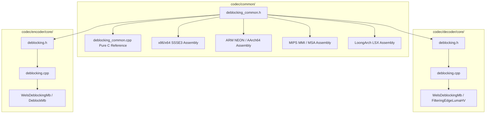
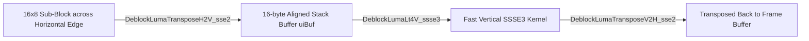
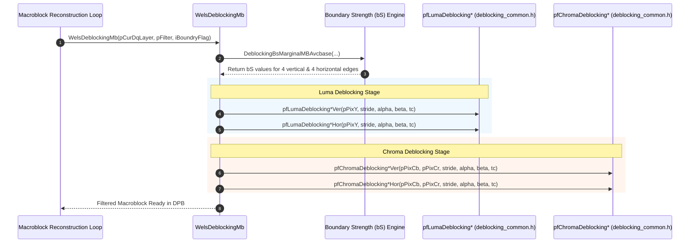

# OpenH264 Shared In-Loop Deblocking Kernels: `deblocking_common.h`

This document provides a comprehensive, literate-programming-style technical and architectural breakdown of the shared H.264 / AVC in-loop deblocking filter primitives declared in [`codec/common/inc/deblocking_common.h`](openh264/codec/common/inc/deblocking_common.h) and implemented across [`codec/common/src/deblocking_common.cpp`](openh264/codec/common/src/deblocking_common.cpp), [`codec/decoder/core/src/deblocking.cpp`](openh264/codec/decoder/core/src/deblocking.cpp), [`codec/encoder/core/src/deblocking.cpp`](openh264/codec/encoder/core/src/deblocking.cpp), and platform-specific SIMD assembly modules (x86/x64 SSE2/SSSE3, ARM NEON/AArch64, MIPS MMI/MSA, and LoongArch LSX).

---

## Table of Contents
1. [Architectural Role & Module Overview](#1-architectural-role--module-overview)
2. [H.264 / AVC In-Loop Deblocking Mathematical Foundations](#2-h264--avc-in-loop-deblocking-mathematical-foundations)
   - [2.1 Sample Boundary Coordinate System](#21-sample-boundary-coordinate-system)
   - [2.2 Boundary Strength ($bS$) Regimes](#22-boundary-strength-bs-regimes)
   - [2.3 Content-Adaptive Gradient Thresholds ($\alpha, \beta$)](#23-content-adaptive-gradient-thresholds-alpha-beta)
   - [2.4 Normal/Weak Deblocking Filtering ($bS < 4$)](#24-normalweak-deblocking-filtering-bs--4)
   - [2.5 Strong Intra Macroblock Deblocking Filtering ($bS = 4$)](#25-strong-intra-macroblock-deblocking-filtering-bs--4)
3. [Header File Organization & Symbol Breakdown](#3-header-file-organization--symbol-breakdown)
4. [Deep Dive into Pure C Reference Kernels](#4-deep-dive-into-pure-c-reference-kernels)
   - [4.1 Luma Filtering Kernels (`DeblockLuma*`)](#41-luma-filtering-kernels-deblockluma)
   - [4.2 Planar Chroma Filtering Kernels (`DeblockChroma*`)](#42-planar-chroma-filtering-kernels-deblockchroma)
   - [4.3 Interleaved/Single-Pointer Chroma Filtering Kernels (`DeblockChroma*2_c`)](#43-interleavedsingle-pointer-chroma-filtering-kernels-deblockchroma2_c)
   - [4.4 Residual Count Binarization Helper (`WelsNonZeroCount_c`)](#44-residual-count-binarization-helper-welsnonzerocount_c)
5. [SIMD Multi-Architecture Assembly Acceleration](#5-simd-multi-architecture-assembly-acceleration)
   - [5.1 The Stack-Aligned Transpose Paradigm for Horizontal Filtering](#51-the-stack-aligned-transpose-paradigm-for-horizontal-filtering)
   - [5.2 Target Architectures & Instruction Set Extensions](#52-target-architectures--instruction-set-extensions)
6. [Dispatch Table Integration & Runtime Wiring](#6-dispatch-table-integration--runtime-wiring)
7. [Call Graph & Data Flow Diagrams](#7-call-graph--data-flow-diagrams)

---

## 1. Architectural Role & Module Overview

In the H.264 / MPEG-4 AVC standard (ISO/IEC 14496-10 / ITU-T Rec. H.264), block-based spatial transform coding ($4 \times 4$ integer DCT) and motion-compensated prediction introduce high-frequency blocking artifacts along $4 \times 4$ and $8 \times 8$ grid edges. To eliminate these visual artifacts while preserving real image edges, H.264 defines a normative **In-Loop Adaptive Deblocking Filter**.

The header [`deblocking_common.h`](openh264/codec/common/inc/deblocking_common.h) serves as the shared, cross-cutting interface declaring the low-level pixel filtering routines consumed by both the **Video Decoder** ([`codec/decoder/core/`](openh264/codec/decoder/core/)) and the **Video Encoder** ([`codec/encoder/core/`](openh264/codec/encoder/core/)).



### Key Architectural Characteristics
1. **Shared Normative Core**: The pixel-level mathematics of the H.264 deblocking filter are identical for both decoding and local reconstruction in encoding. By centralizing the kernel signatures in [`deblocking_common.h`](openh264/codec/common/inc/deblocking_common.h), OpenH264 eliminates code duplication across decoder and encoder subsystems.
2. **Abstract Dispatch via Function Pointer Tables**: The core decoding and encoding loops do not call the low-level pixel filters directly. Instead, runtime initialization functions ([`DeblockingInit`](openh264/codec/decoder/core/src/deblocking.cpp#L1338-L1435)) query CPU capability flags (e.g., `WELS_CPU_SSSE3`, `WELS_CPU_NEON`) and populate function pointer structures (`SDeblockingFunc` / `DeblockingFunc`).
3. **C Fallback Integrity**: For platforms lacking SIMD extensions or for debug validation against the ISO/IEC reference model, [`deblocking_common.cpp`](openh264/codec/common/src/deblocking_common.cpp) provides clean, un-rolled C implementations (`_c` suffix).

---

## 2. H.264 / AVC In-Loop Deblocking Mathematical Foundations

### 2.1 Sample Boundary Coordinate System

Deblocking filtering is applied across $4 \times 4$ block boundaries. The filter processes **vertical edges first** (filtering horizontally adjacent pixels), followed by **horizontal edges** (filtering vertically adjacent pixels).

For any given 1D pixel cross-section perpendicular to a boundary edge, 8 consecutive pixel samples are identified:

$$\mathbf{p} = [p_3, p_2, p_1, p_0] \quad \Big| \quad \mathbf{q} = [q_0, q_1, q_2, q_3]$$

```
          Block p (Left / Above)           |        Block q (Right / Below)
  -----------------------------------------+-----------------------------------------
  ...   p3        p2        p1        p0   |   q0        q1        q2        q3   ...
  -----------------------------------------+-----------------------------------------
                                     Boundary Edge
```

* Samples $p_0, p_1, p_2, p_3$ belong to the block on the left (for vertical edges) or above (for horizontal edges).
* Samples $q_0, q_1, q_2, q_3$ belong to the block on the right (for vertical edges) or below (for horizontal edges).

---

### 2.2 Boundary Strength ($bS$) Regimes

For each $4 \times 4$ edge segment, a Boundary Strength integer $bS \in \{0, 1, 2, 3, 4\}$ is evaluated:

| Boundary Strength ($bS$) | Coding Condition | Filtering Strategy |
| :---: | :--- | :--- |
| **$bS = 4$** | Macroblock edge AND either block $p$ or $q$ is Intra-coded. | **Strong Filtering** (`Deblock*Eq4*`) |
| **$bS = 3$** | Interior block edge AND either block $p$ or $q$ is Intra-coded. | **Normal / Weak Filtering** (`Deblock*Lt4*`) |
| **$bS = 2$** | Neither block is Intra-coded, AND at least one block has non-zero transform coefficients ($nnz > 0$). | **Normal / Weak Filtering** (`Deblock*Lt4*`) |
| **$bS = 1$** | Inter-coded, $nnz = 0$, but different reference frames OR motion vector difference $|\Delta MV_x| \ge 4$ or $|\Delta MV_y| \ge 4$ (in quarter-pel units). | **Normal / Weak Filtering** (`Deblock*Lt4*`) |
| **$bS = 0$** | Same reference frame, $|\Delta MV| < 4$, and $nnz = 0$. | **Bypassed** (No filtering applied) |

Thus, the pixel filtering functions in [`deblocking_common.h`](openh264/codec/common/inc/deblocking_common.h) are partitioned into two core filtering modes:
1. **`Lt4` ($bS < 4$)**: Handles $bS \in \{1, 2, 3\}$.
2. **`Eq4` ($bS = 4$)**: Handles $bS = 4$.

---

### 2.3 Content-Adaptive Gradient Thresholds ($\alpha, \beta$)

Filtering is applied across the boundary if and only if sample gradients across the edge do not exceed threshold limits $\alpha$ and $\beta$. This ensures true image edges (e.g. sharp object outlines) are not blurred:

$$\text{filterSampleFlag} = \Big(|p_0 - q_0| < \alpha\Big) \;\land\; \Big(|p_1 - p_0| < \beta\Big) \;\land\; \Big(|q_1 - q_0| < \beta\Big)$$

The thresholds $\alpha(\text{IndexA})$ and $\beta(\text{IndexB})$ are derived from the average quantization parameter ($qP_{\text{avg}}$) and slice header offsets:

$$\text{IndexA} = \text{Clip3}\left(0, 51, qP_{\text{avg}} + \text{SliceAlphaC0Offset}\right)$$
$$\text{IndexB} = \text{Clip3}\left(0, 51, qP_{\text{avg}} + \text{SliceBetaOffset}\right)$$
$$qP_{\text{avg}} = \frac{qP_p + qP_q + 1}{2}$$

---

### 2.4 Normal/Weak Deblocking Filtering ($bS < 4$)

When $bS \in \{1, 2, 3\}$ and $\text{filterSampleFlag}$ is true:

1. **Clipping Parameter Derivation**:
   An initial clipping parameter $t_{c0}$ is looked up from precomputed tables based on $\text{IndexA}$ and $bS$. An accumulated clipping limit $t_c$ is initialized:
   $$t_c = t_{c0}$$

2. **Outer Sample Evaluation ($p_1$ and $q_1$)**:
   - If $|p_2 - p_0| < \beta$ (luma only):
     $$p_1' = p_1 + \text{Clip3}\left(-t_{c0}, t_{c0}, \frac{p_2 + \left\lfloor \frac{p_0 + q_0 + 1}{2} \right\rfloor - 2 p_1}{2}\right)$$
     $$t_c \leftarrow t_c + 1$$
   - If $|q_2 - q_0| < \beta$ (luma only):
     $$q_1' = q_1 + \text{Clip3}\left(-t_{c0}, t_{c0}, \frac{q_2 + \left\lfloor \frac{p_0 + q_0 + 1}{2} \right\rfloor - 2 q_1}{2}\right)$$
     $$t_c \leftarrow t_c + 1$$

3. **Inner Boundary Sample Filtering ($p_0$ and $q_0$)**:
   $$\Delta = \text{Clip3}\left(-t_c, t_c, \frac{4(q_0 - p_0) + (p_1 - q_1) + 4}{8}\right)$$
   $$p_0' = \text{Clip1}(p_0 + \Delta), \qquad q_0' = \text{Clip1}(q_0 - \Delta)$$
   where $\text{Clip1}(x) = \text{Clip3}(0, 255, x)$.

---

### 2.5 Strong Intra Macroblock Deblocking Filtering ($bS = 4$)

When $bS = 4$, filtering is applied across macroblock boundaries between Intra blocks.

If $|p_0 - q_0| < \left(\lfloor \frac{\alpha}{4} \rfloor + 2\right)$:

1. **$p$-side filtering**:
   - If $|p_2 - p_0| < \beta$ (flat region on $p$-side):
     $$p_0' = \frac{p_2 + 2 p_1 + 2 p_0 + 2 q_0 + q_1 + 4}{8}$$
     $$p_1' = \frac{p_2 + p_1 + p_0 + q_0 + 2}{4}$$
     $$p_2' = \frac{2 p_3 + 3 p_2 + p_1 + p_0 + q_0 + 4}{8}$$
   - Otherwise (non-flat $p$-side):
     $$p_0' = \frac{2 p_1 + p_0 + q_1 + 2}{4}$$

2. **$q$-side filtering**:
   - If $|q_2 - q_0| < \beta$ (flat region on $q$-side):
     $$q_0' = \frac{p_1 + 2 p_0 + 2 q_0 + 2 q_1 + q_2 + 4}{8}$$
     $$q_1' = \frac{p_0 + q_0 + q_1 + q_2 + 2}{4}$$
     $$q_2' = \frac{2 q_3 + 3 q_2 + q_1 + q_0 + p_0 + 4}{8}$$
   - Otherwise (non-flat $q$-side):
     $$q_0' = \frac{2 q_1 + q_0 + p_1 + 2}{4}$$

Else (when $|p_0 - q_0| \ge \lfloor \frac{\alpha}{4} \rfloor + 2$):
$$p_0' = \frac{2 p_1 + p_0 + q_1 + 2}{4}, \qquad q_0' = \frac{2 q_1 + q_0 + p_1 + 2}{4}$$

For chroma planes ($Cb, Cr$), only $p_0$ and $q_0$ are modified under $bS = 4$:
$$p_0' = \frac{2 p_1 + p_0 + q_1 + 2}{4}, \qquad q_0' = \frac{2 q_1 + q_0 + p_1 + 2}{4}$$

---

## 3. Header File Organization & Symbol Breakdown

The complete declaration layout in [`deblocking_common.h`](openh264/codec/common/inc/deblocking_common.h) is organized as follows:

```cpp
#ifndef WELS_DEBLOCKING_COMMON_H__
#define WELS_DEBLOCKING_COMMON_H__
#include "typedefs.h"

// -------------------------------------------------------------
// 1. Pure C Fallback Function Prototypes
// -------------------------------------------------------------
void DeblockLumaLt4V_c (uint8_t* pPixY, int32_t iStride, int32_t iAlpha, int32_t iBeta, int8_t* pTc);
void DeblockLumaEq4V_c (uint8_t* pPixY, int32_t iStride, int32_t iAlpha, int32_t iBeta);

void DeblockLumaLt4H_c (uint8_t* pPixY, int32_t iStride, int32_t iAlpha, int32_t iBeta, int8_t* pTc);
void DeblockLumaEq4H_c (uint8_t* pPixY, int32_t iStride, int32_t iAlpha, int32_t iBeta);

void DeblockChromaLt4V_c (uint8_t* pPixCb, uint8_t* pPixCr, int32_t iStride, int32_t iAlpha, int32_t iBeta, int8_t* pTc);
void DeblockChromaEq4V_c (uint8_t* pPixCb, uint8_t* pPixCr, int32_t iStride, int32_t iAlpha, int32_t iBeta);

void DeblockChromaLt4H_c (uint8_t* pPixCb, uint8_t* pPixCr, int32_t iStride, int32_t iAlpha, int32_t iBeta, int8_t* pTc);
void DeblockChromaEq4H_c (uint8_t* pPixCb, uint8_t* pPixCr, int32_t iStride, int32_t iAlpha, int32_t iBeta);

void DeblockChromaLt4V2_c (uint8_t* pPixCbCr, int32_t iStride, int32_t iAlpha, int32_t iBeta, int8_t* pTc);
void DeblockChromaEq4V2_c (uint8_t* pPixCbCr, int32_t iStride, int32_t iAlpha, int32_t iBeta);

void DeblockChromaLt4H2_c (uint8_t* pPixCbCr, int32_t iStride, int32_t iAlpha, int32_t iBeta, int8_t* pTc);
void DeblockChromaEq4H2_c (uint8_t* pPixCbCr, int32_t iStride, int32_t iAlpha, int32_t iBeta);

void WelsNonZeroCount_c (int8_t* pNonZeroCount);

#if defined(__cplusplus)
extern "C" {
#endif

// -------------------------------------------------------------
// 2. Platform-Specific SIMD Assembly Prototypes
// -------------------------------------------------------------
#ifdef X86_ASM
// x86 / x86_64 SSE2 & SSSE3 kernels
#endif

#if defined(HAVE_NEON)
// ARM 32-bit NEON kernels
#endif

#if defined(HAVE_NEON_AARCH64) && defined(__aarch64__)
// ARM 64-bit AArch64 NEON kernels
#endif

#if defined(HAVE_MMI)
// MIPS MMI kernels
#endif

#if defined(HAVE_MSA)
// MIPS SIMD Architecture (MSA) kernels
#endif

#if defined(HAVE_LSX)
// LoongArch LSX kernels
#endif

#if defined(__cplusplus)
}
#endif

#endif // WELS_DEBLOCKING_COMMON_H__
```

---

## 4. Deep Dive into Pure C Reference Kernels

All reference C implementations reside in [`codec/common/src/deblocking_common.cpp`](openh264/codec/common/src/deblocking_common.cpp).

### 4.1 Luma Filtering Kernels (`DeblockLuma*`)

#### Core Helper: `DeblockLumaLt4_c`
```cpp
void DeblockLumaLt4_c (uint8_t* pPix, int32_t iStrideX, int32_t iStrideY, int32_t iAlpha, int32_t iBeta, int8_t* pTc);
```
* **Parameters**:
  * `pPix`: Pointer to sample $q_0$ of the first line along the 16-sample edge.
  * `iStrideX`: Offset between adjacent samples perpendicular to the edge ($+1$ for horizontal edge filtering across rows; `iStride` for vertical edge filtering across columns).
  * `iStrideY`: Step to advance to the next line along the edge (`iStride` for vertical lines; $+1$ for horizontal lines).
  * `iAlpha`, `iBeta`: Content-adaptive gradient thresholds $\alpha$ and $\beta$.
  * `pTc`: Pointer to an array of 4 clipping thresholds $t_{c0}$ (one per $4 \times 4$ block boundary segment).
* **Processing Loop**:
  Iterates $i = 0 \dots 15$ across the 16 lines of the macroblock luma boundary:
  ```cpp
  int32_t iTc0 = pTc[i >> 2]; // 4 lines per 4x4 block share the same tc0
  if (iTc0 >= 0) {
    int32_t p0 = pPix[-iStrideX], p1 = pPix[-2 * iStrideX], p2 = pPix[-3 * iStrideX];
    int32_t q0 = pPix[0],         q1 = pPix[iStrideX],     q2 = pPix[2 * iStrideX];
    bool bDetaP0Q0 = WELS_ABS(p0 - q0) < iAlpha;
    bool bDetaP1P0 = WELS_ABS(p1 - p0) < iBeta;
    bool bDetaQ1Q0 = WELS_ABS(q1 - q0) < iBeta;
    if (bDetaP0Q0 && bDetaP1P0 && bDetaQ1Q0) {
      // Conditionally filter p1 and q1, adjust iTc, then filter p0 and q0
    }
  }
  pPix += iStrideY;
  ```

#### Core Helper: `DeblockLumaEq4_c`
```cpp
void DeblockLumaEq4_c (uint8_t* pPix, int32_t iStrideX, int32_t iStrideY, int32_t iAlpha, int32_t iBeta);
```
* **Parameters**: Identical to `DeblockLumaLt4_c`, but omits `pTc` because $bS = 4$ filtering does not use $t_c$ clipping.
* **Algorithmic Path**:
  Evaluates the strong flatness condition:
  $$\text{iDetaP0Q0} < \left(\frac{\text{iAlpha}}{4} + 2\right)$$
  If true and $|p_2 - p_0| < \text{iBeta}$, samples $p_0, p_1, p_2$ are filtered using 8-tap and 4-tap symmetric smoothing filters.

#### Directional Wrappers:
* [`DeblockLumaLt4V_c`](openh264/codec/common/src/deblocking_common.cpp#L81-L83): Invokes `DeblockLumaLt4_c(pPix, iStride, 1, iAlpha, iBeta, tc)`
* [`DeblockLumaLt4H_c`](openh264/codec/common/src/deblocking_common.cpp#L84-L86): Invokes `DeblockLumaLt4_c(pPix, 1, iStride, iAlpha, iBeta, tc)`
* [`DeblockLumaEq4V_c`](openh264/codec/common/src/deblocking_common.cpp#L87-L89): Invokes `DeblockLumaEq4_c(pPix, iStride, 1, iAlpha, iBeta)`
* [`DeblockLumaEq4H_c`](openh264/codec/common/src/deblocking_common.cpp#L90-L92): Invokes `DeblockLumaEq4_c(pPix, 1, iStride, iAlpha, iBeta)`

---

### 4.2 Planar Chroma Filtering Kernels (`DeblockChroma*`)

In YUV 4:2:0 planar format, chroma macroblocks consist of an $8 \times 8$ Cb block and an $8 \times 8$ Cr block. Deblocking operates on 8 lines per edge.

```cpp
void DeblockChromaLt4V_c (uint8_t* pPixCb, uint8_t* pPixCr, int32_t iStride, int32_t iAlpha, int32_t iBeta, int8_t* tc);
void DeblockChromaEq4V_c (uint8_t* pPixCb, uint8_t* pPixCr, int32_t iStride, int32_t iAlpha, int32_t iBeta);
void DeblockChromaLt4H_c (uint8_t* pPixCb, uint8_t* pPixCr, int32_t iStride, int32_t iAlpha, int32_t iBeta, int8_t* tc);
void DeblockChromaEq4H_c (uint8_t* pPixCb, uint8_t* pPixCr, int32_t iStride, int32_t iAlpha, int32_t iBeta);
```

* **Parameters**:
  * `pPixCb`, `pPixCr`: Pointers to the start of the Cb and Cr boundary edges.
  * `iStride`: Plane byte stride.
  * `iAlpha`, `iBeta`: Chroma gradient thresholds.
  * `tc`: Pointer to clipping threshold array (indexed by `i >> 1` for 8 lines, representing two $4 \times 4$ chroma sub-blocks).
* **Characteristics**:
  Unlike Luma, Chroma deblocking **never filters outer samples** ($p_1, q_1$). Only $p_0$ and $q_0$ are modified.

---

### 4.3 Interleaved/Single-Pointer Chroma Filtering Kernels (`DeblockChroma*2_c`)

For codecs or buffers where Cb and Cr are processed through a single pointer (or single plane sequentially):

```cpp
void DeblockChromaLt4V2_c (uint8_t* pPixCbCr, int32_t iStride, int32_t iAlpha, int32_t iBeta, int8_t* tc);
void DeblockChromaEq4V2_c (uint8_t* pPixCbCr, int32_t iStride, int32_t iAlpha, int32_t iBeta);
void DeblockChromaLt4H2_c (uint8_t* pPixCbCr, int32_t iStride, int32_t iAlpha, int32_t iBeta, int8_t* tc);
void DeblockChromaEq4H2_c (uint8_t* pPixCbCr, int32_t iStride, int32_t iAlpha, int32_t iBeta);
```
* Applies identical mathematical filtering as `DeblockChroma*` but operates on a single pixel buffer `pPixCbCr` across 8 lines.

---

### 4.4 Residual Count Binarization Helper (`WelsNonZeroCount_c`)

```cpp
void WelsNonZeroCount_c (int8_t* pNonZeroCount);
```

#### Function Purpose & Mathematical Operation
In H.264, boundary strength calculation requires checking whether adjacent $4 \times 4$ blocks contain non-zero transform coefficients ($nnz > 0$).
`WelsNonZeroCount_c` normalizes the 24-element non-zero count array `pNonZeroCount[24]` (16 luma blocks + 4 Cb blocks + 4 Cr blocks) into boolean $0$ or $1$ indicators:

$$pNonZeroCount[i] \leftarrow \begin{cases} 1 & \text{if } pNonZeroCount[i] \neq 0 \\ 0 & \text{if } pNonZeroCount[i] = 0 \end{cases} \qquad \forall i \in [0, 23]$$

```cpp
void WelsNonZeroCount_c (int8_t* pNonZeroCount) {
  for (int32_t i = 0; i < 24; i++) {
    pNonZeroCount[i] = !!pNonZeroCount[i];
  }
}
```

This normalization allows subsequent boundary strength calculation kernels (such as [`DeblockingBsMarginalMBAvcbase`](openh264/codec/decoder/core/src/deblocking.cpp#L487-L612)) to use bitwise OR operations (`pCurNzc[idx] | pNeighNzc[idx]`) directly.

---

## 5. SIMD Multi-Architecture Assembly Acceleration

### 5.1 The Stack-Aligned Transpose Paradigm for Horizontal Filtering

In SIMD architectures (x86 SSE2/SSSE3, MIPS MMI), vector registers load contiguous bytes in memory.
* **Vertical edge filtering (`V`)** naturally processes contiguous horizontal pixel rows ($p_1, p_0, q_0, q_1$), which aligns directly with vector loads (`movdqu` / `movdqa` / `ld.d`).
* **Horizontal edge filtering (`H`)** requires accessing vertical columns across rows, causing strided, non-contiguous memory access patterns.

To achieve maximum SIMD throughput on horizontal edges without writing complex strided SIMD assembly kernels, OpenH264 employs a **Stack-Aligned Transpose Strategy**:



As implemented in [`codec/common/src/deblocking_common.cpp`](openh264/codec/common/src/deblocking_common.cpp#L257-L273):

```cpp
#ifdef X86_ASM
extern "C" {
  void DeblockLumaLt4H_ssse3 (uint8_t* pPixY, int32_t iStride, int32_t iAlpha, int32_t iBeta, int8_t* pTc) {
    ENFORCE_STACK_ALIGN_1D (uint8_t, uiBuf, 16 * 8, 16);

    DeblockLumaTransposeH2V_sse2 (pPixY - 4, iStride, &uiBuf[0]);
    DeblockLumaLt4V_ssse3 (&uiBuf[4 * 16], 16, iAlpha, iBeta, pTc);
    DeblockLumaTransposeV2H_sse2 (pPixY - 4, iStride, &uiBuf[0]);
  }
}
#endif
```

1. **`DeblockLumaTransposeH2V_sse2`**: Transposes an $8 \times 16$ pixel region around `pPixY - 4` into a 16-byte aligned stack buffer `uiBuf[128]`.
2. **`DeblockLumaLt4V_ssse3`**: Executes the high-speed vertical vector deblocking kernel on the transposed buffer.
3. **`DeblockLumaTransposeV2H_sse2`**: Transposes the filtered result back to the original image plane stride.

---

### 5.2 Target Architectures & Instruction Set Extensions

The table below maps all architecture-specific assembly function prototypes declared in [`deblocking_common.h`](openh264/codec/common/inc/deblocking_common.h):

| Platform / ISA | Preprocessor Guard | Key Assembly Functions Declared |
| :--- | :--- | :--- |
| **x86 / x86_64 SSSE3** | `#ifdef X86_ASM` | `DeblockLumaLt4V_ssse3`, `DeblockLumaEq4V_ssse3`, `DeblockLumaTransposeH2V_sse2`, `DeblockLumaTransposeV2H_sse2`, `DeblockLumaLt4H_ssse3`, `DeblockLumaEq4H_ssse3`, `DeblockChromaEq4V_ssse3`, `DeblockChromaLt4V_ssse3`, `DeblockChromaEq4H_ssse3`, `DeblockChromaLt4H_ssse3`, `WelsNonZeroCount_sse2` |
| **ARMv7 NEON (32-bit)** | `#if defined(HAVE_NEON)` | `DeblockLumaLt4V_neon`, `DeblockLumaEq4V_neon`, `DeblockLumaLt4H_neon`, `DeblockLumaEq4H_neon`, `DeblockChromaLt4V_neon`, `DeblockChromaEq4V_neon`, `DeblockChromaLt4H_neon`, `DeblockChromaEq4H_neon`, `WelsNonZeroCount_neon` |
| **AArch64 NEON (64-bit)** | `#if defined(HAVE_NEON_AARCH64) && defined(__aarch64__)` | `DeblockLumaLt4V_AArch64_neon`, `DeblockLumaEq4V_AArch64_neon`, `DeblockLumaLt4H_AArch64_neon`, `DeblockLumaEq4H_AArch64_neon`, `DeblockChromaLt4V_AArch64_neon`, `DeblockChromaEq4V_AArch64_neon`, `DeblockChromaLt4H_AArch64_neon`, `DeblockChromaEq4H_AArch64_neon`, `WelsNonZeroCount_AArch64_neon` |
| **MIPS MMI** | `#if defined(HAVE_MMI)` | `DeblockLumaLt4V_mmi`, `DeblockLumaEq4V_mmi`, `DeblockLumaTransposeH2V_mmi`, `DeblockLumaTransposeV2H_mmi`, `DeblockLumaLt4H_mmi`, `DeblockLumaEq4H_mmi`, `DeblockChromaEq4V_mmi`, `DeblockChromaLt4V_mmi`, `DeblockChromaEq4H_mmi`, `DeblockChromaLt4H_mmi`, `WelsNonZeroCount_mmi` |
| **MIPS MSA** | `#if defined(HAVE_MSA)` | `DeblockLumaLt4V_msa`, `DeblockLumaEq4V_msa`, `DeblockLumaLt4H_msa`, `DeblockLumaEq4H_msa`, `DeblockChromaEq4V_msa`, `DeblockChromaLt4V_msa`, `DeblockChromaEq4H_msa`, `DeblockChromaLt4H_msa`, `WelsNonZeroCount_msa` |
| **LoongArch LSX** | `#if defined(HAVE_LSX)` | `DeblockLumaLt4V_lsx`, `DeblockLumaLt4H_lsx`, `DeblockLumaEq4V_lsx`, `DeblockLumaEq4H_lsx`, `DeblockChromaEq4H_lsx`, `DeblockChromaLt4V_lsx`, `DeblockChromaLt4H_lsx` |

---

## 6. Dispatch Table Integration & Runtime Wiring

During codec initialization, [`DeblockingInit`](openh264/codec/decoder/core/src/deblocking.cpp#L1338-L1435) binds the function pointers inside `SDeblockingFunc` based on CPU detection flags:

```cpp
void DeblockingInit (SDeblockingFunc* pFunc, int32_t iCpu) {
  // 1. Initialize with pure C reference implementations
  pFunc->pfLumaDeblockingLT4Ver    = DeblockLumaLt4V_c;
  pFunc->pfLumaDeblockingEQ4Ver    = DeblockLumaEq4V_c;
  pFunc->pfLumaDeblockingLT4Hor    = DeblockLumaLt4H_c;
  pFunc->pfLumaDeblockingEQ4Hor    = DeblockLumaEq4H_c;

  pFunc->pfChromaDeblockingLT4Ver  = DeblockChromaLt4V_c;
  pFunc->pfChromaDeblockingEQ4Ver  = DeblockChromaEq4V_c;
  pFunc->pfChromaDeblockingLT4Hor  = DeblockChromaLt4H_c;
  pFunc->pfChromaDeblockingEQ4Hor  = DeblockChromaEq4H_c;

  pFunc->pfChromaDeblockingLT4Ver2 = DeblockChromaLt4V2_c;
  pFunc->pfChromaDeblockingEQ4Ver2 = DeblockChromaEq4V2_c;
  pFunc->pfChromaDeblockingLT4Hor2 = DeblockChromaLt4H2_c;
  pFunc->pfChromaDeblockingEQ4Hor2 = DeblockChromaEq4H2_c;

  // 2. Override with SSSE3 on x86/x64
#ifdef X86_ASM
  if (iCpu & WELS_CPU_SSSE3) {
    pFunc->pfLumaDeblockingLT4Ver   = DeblockLumaLt4V_ssse3;
    pFunc->pfLumaDeblockingEQ4Ver   = DeblockLumaEq4V_ssse3;
    pFunc->pfLumaDeblockingLT4Hor   = DeblockLumaLt4H_ssse3;
    pFunc->pfLumaDeblockingEQ4Hor   = DeblockLumaEq4H_ssse3;
    pFunc->pfChromaDeblockingLT4Ver = DeblockChromaLt4V_ssse3;
    pFunc->pfChromaDeblockingEQ4Ver = DeblockChromaEq4V_ssse3;
    pFunc->pfChromaDeblockingLT4Hor = DeblockChromaLt4H_ssse3;
    pFunc->pfChromaDeblockingEQ4Hor = DeblockChromaEq4H_ssse3;
  }
#endif

  // 3. Override with NEON on ARM / AArch64
#if defined(HAVE_NEON_AARCH64) && defined(__aarch64__)
  if (iCpu & WELS_CPU_NEON) {
    pFunc->pfLumaDeblockingLT4Ver   = DeblockLumaLt4V_AArch64_neon;
    pFunc->pfLumaDeblockingEQ4Ver   = DeblockLumaEq4V_AArch64_neon;
    pFunc->pfLumaDeblockingLT4Hor   = DeblockLumaLt4H_AArch64_neon;
    pFunc->pfLumaDeblockingEQ4Hor   = DeblockLumaEq4H_AArch64_neon;
    pFunc->pfChromaDeblockingLT4Ver = DeblockChromaLt4V_AArch64_neon;
    pFunc->pfChromaDeblockingEQ4Ver = DeblockChromaEq4V_AArch64_neon;
    pFunc->pfChromaDeblockingLT4Hor = DeblockChromaLt4H_AArch64_neon;
    pFunc->pfChromaDeblockingEQ4Hor = DeblockChromaEq4H_AArch64_neon;
  }
#endif
}
```

---

## 7. Call Graph & Data Flow Diagrams

The following diagram illustrates how the shared deblocking kernels declared in [`deblocking_common.h`](openh264/codec/common/inc/deblocking_common.h) are called during macroblock deblocking:



---

## Summary of Symbol References

* Header Declaration: [`codec/common/inc/deblocking_common.h`](openh264/codec/common/inc/deblocking_common.h)
* Pure C Reference Implementation: [`codec/common/src/deblocking_common.cpp`](openh264/codec/common/src/deblocking_common.cpp)
* Decoder In-Loop Deblocking Engine: [`codec/decoder/core/inc/deblocking.h`](openh264/codec/decoder/core/inc/deblocking.h) & [`codec/decoder/core/src/deblocking.cpp`](openh264/codec/decoder/core/src/deblocking.cpp)
* Encoder In-Loop Deblocking Engine: [`codec/encoder/core/inc/deblocking.h`](openh264/codec/encoder/core/inc/deblocking.h) & [`codec/encoder/core/src/deblocking.cpp`](openh264/codec/encoder/core/src/deblocking.cpp)
* Unit Tests: [`test/decoder/DecUT_DeblockCommon.cpp`](openh264/test/decoder/DecUT_DeblockCommon.cpp)
