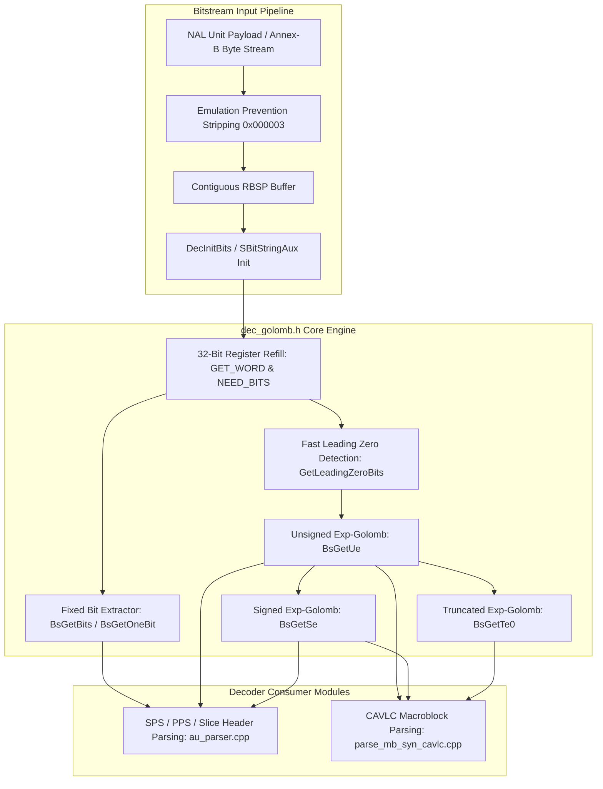
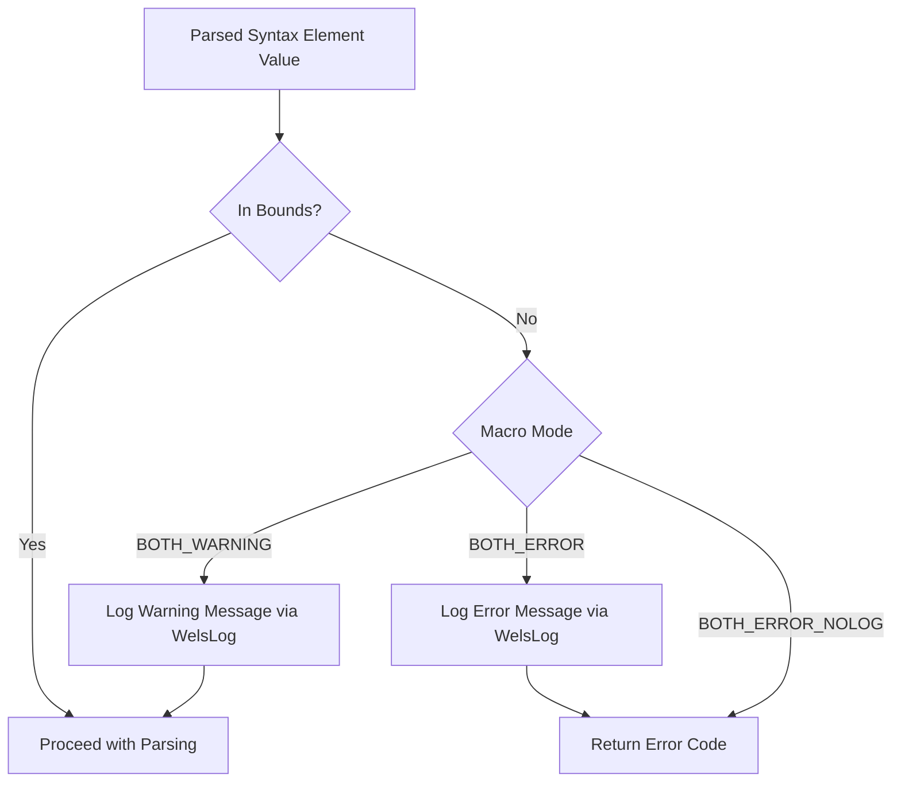
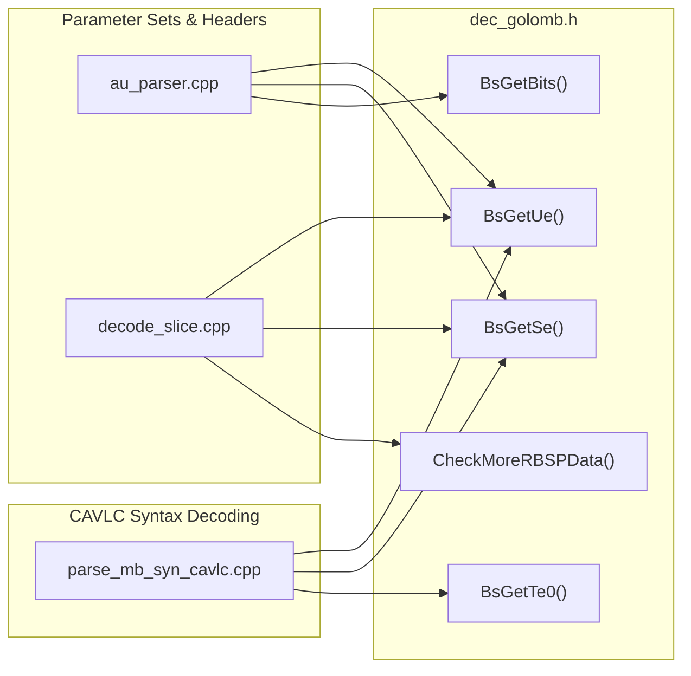

# OpenH264 Core Architecture: Exponential-Golomb & Bitstream Parsing (`dec_golomb.h`)

This document provides a comprehensive, literate-programming-style technical breakdown of [`dec_golomb.h`](openh264/codec/decoder/core/inc/dec_golomb.h), the core Exponential-Golomb entropy decoding and bitstream consumption engine within the OpenH264 video decoder subsystem.

---

## 1. High-Level Architectural Purpose

In the ITU-T H.264 / ISO/IEC 14496-10 (AVC) video coding standard, variable-length coding is used extensively to compress header parameters and syntax elements. Unlike fixed-length integer representations, **Exponential-Golomb (Exp-Golomb)** codes map non-negative integers to bit patterns whose length grows logarithmically with the magnitude of the encoded value.

[`dec_golomb.h`](openh264/codec/decoder/core/inc/dec_golomb.h) provides inline, high-performance C++ routines and macros that decode:
1. **Arbitrary Bitfields (`u(v)`)**: Extracted directly via bitstream register shifts.
2. **Unsigned Exponential-Golomb Codes (`ue(v)`)**: General non-negative integers (e.g., parameter set IDs, frame numbers, macroblock types).
3. **Signed Exponential-Golomb Codes (`se(v)`)**: Signed integers interleaved into positive and negative ranges (e.g., motion vector differences `mvd`, slice QP deltas, quantization matrix adjustments).
4. **Truncated Exponential-Golomb Codes (`te(v)`)**: Values constrained by a known maximum range $R$ (e.g., macroblock sub-partition modes, reference picture indices).
5. **RBSP Navigation & End-of-Stream Detection (`more_rbsp_data`)**: Determining whether unparsed syntax elements remain before the `rbsp_trailing_bits()` stop bit.



---

## 2. Bitstream Reading & Verification Macros

[`dec_golomb.h`](openh264/codec/decoder/core/inc/dec_golomb.h#L52-L75) defines five fundamental macros that manage the 32-bit internal shift register (`uiCurBits`) and bit counter (`iLeftBits`) stored within the bitstream state object [`SBitStringAux`](openh264/codec/common/inc/wels_common_defs.h#L232-L242).

### 2.1 `WELS_READ_VERIFY`
```cpp
#define WELS_READ_VERIFY(uiRet) do{ \
  uint32_t uiRetTmp = (uint32_t)uiRet; \
  if( uiRetTmp != ERR_NONE ) \
    return uiRetTmp; \
}while(0)
```
* **Purpose**: Evaluates the return value of a child bitstream decoding call. If `uiRet` is anything other than `ERR_NONE` (0), execution immediately returns `uiRetTmp` to the caller, propagating the bitstream syntax or memory overflow error up the call stack.

### 2.2 `GET_WORD`
```cpp
#define GET_WORD(iCurBits, pBufPtr, iLeftBits, iAllowedBytes, iReadBytes) { \
  if (iReadBytes > iAllowedBytes+1) { \
    return ERR_INFO_READ_OVERFLOW; \
  } \
  iCurBits |= ((uint32_t)((pBufPtr[0] << 8) | pBufPtr[1])) << (iLeftBits); \
  pBufPtr +=2; \
}
```
* **Purpose**: Refills the 32-bit register `iCurBits` with 16 bits (2 bytes) fetched from the big-endian bitstream pointer `pBufPtr`.
* **Memory Safety Check**: Compares `iReadBytes` against `iAllowedBytes + 1`. If the pointer exceeds the allocated buffer bounds, it aborts parsing and returns `ERR_INFO_READ_OVERFLOW` (`0x80000000 | 0x0002`).
* **Bit Insertion Mechanism**:
  1. Combines two consecutive big-endian bytes into a 16-bit word: `(pBufPtr[0] << 8) | pBufPtr[1]`.
  2. Shifts the 16-bit word left by `iLeftBits` (the remaining unused bit-slots in the 32-bit register) and ORs it into `iCurBits`.
  3. Subtracts 16 from `iLeftBits` and advances the pointer `pBufPtr += 2`.

### 2.3 `NEED_BITS`
```cpp
#define NEED_BITS(iCurBits, pBufPtr, iLeftBits, iAllowedBytes, iReadBytes) { \
  if (iLeftBits > 0) { \
    GET_WORD(iCurBits, pBufPtr, iLeftBits, iAllowedBytes, iReadBytes); \
  } \
}
```
* **Purpose**: Inspects the shift register occupancy. If `iLeftBits > 0` (meaning there is space for at least 16 bits in the 32-bit word), it triggers [`GET_WORD`](openh264/codec/decoder/core/inc/dec_golomb.h#L57-L64) to refill the bit buffer.

### 2.4 `UBITS`
```cpp
#define UBITS(iCurBits, iNumBits) (iCurBits>>(32-(iNumBits)))
```
* **Purpose**: Extracts (peeks) the most significant `iNumBits` from the high-order bits of `iCurBits` without modifying the register or advancing the bit pointer.
* **Mathematical Operation**:
  $$\text{UBITS}(X, N) = X \gg (32 - N)$$

### 2.5 `DUMP_BITS`
```cpp
#define DUMP_BITS(iCurBits, pBufPtr, iLeftBits, iNumBits, iAllowedBytes, iReadBytes) { \
  iCurBits <<= (iNumBits); \
  iLeftBits += (iNumBits); \
  NEED_BITS(iCurBits, pBufPtr, iLeftBits, iAllowedBytes, iReadBytes); \
}
```
* **Purpose**: Consumes and discards `iNumBits` from the bit register:
  1. Shifts `iCurBits` left by `iNumBits`, moving new bits into the MSB position.
  2. Increments `iLeftBits` by `iNumBits` (reflecting newly vacated bit slots).
  3. Invokes [`NEED_BITS`](openh264/codec/decoder/core/inc/dec_golomb.h#L65-L69) to automatically trigger a 16-bit word refill if `iLeftBits > 0`.

---

## 3. Data Structures & Lookup Tables

### 3.1 Auxiliary Bitstream Context (`SBitStringAux`)

The bitstream reader state is defined in [`wels_common_defs.h`](openh264/codec/common/inc/wels_common_defs.h#L232-L242):

```cpp
typedef struct TagBitStringAux {
  uint8_t* pStartBuf;   // Pointer to start of contiguous RBSP buffer
  uint8_t* pEndBuf;     // Pointer to byte immediately after end of buffer (pStartBuf + length)
  int32_t  iBits;       // Total bit count of overall bitstream payload

  intX_t   iIndex;      // Macroblock / context index (for CAVLC coefficient tracking)
  uint8_t* pCurBuf;     // Current reading byte position in memory
  uint32_t uiCurBits;   // 32-bit big-endian bitshift register
  int32_t  iLeftBits;   // Count of vacated bit slots in uiCurBits ([0..32])
} SBitStringAux, *PBitStringAux;
```

| Member Field | Type | Alignment / Sizing | Description & Lifecycle |
| :--- | :--- | :--- | :--- |
| `pStartBuf` | `uint8_t*` | Pointer | Base address of the un-escaped RBSP NAL payload. Set during [`DecInitBits`](openh264/codec/decoder/core/inc/bit_stream.h#L54). |
| `pEndBuf` | `uint8_t*` | Pointer | Upper boundary pointer (`pStartBuf + kiSize`). Used to verify memory boundaries and prevent buffer overrun. |
| `iBits` | `int32_t` | 32-bit signed int | Total bits available in the current NAL unit payload. |
| `iIndex` | `intX_t` | Platform word (`int32_t`/`int64_t`) | Index offset used by CAVLC MB syntax parsing routines. |
| `pCurBuf` | `uint8_t*` | Pointer | Current byte read pointer. Incremented by 2 bytes on each [`GET_WORD`](openh264/codec/decoder/core/inc/dec_golomb.h#L57-L64) invocation. |
| `uiCurBits` | `uint32_t` | 32-bit unsigned int | Top-aligned bit accumulator holding the upcoming bitstream bits. Shifted left as bits are consumed. |
| `iLeftBits` | `int32_t` | 32-bit signed int | Number of available empty bit slots in `uiCurBits`. Decreased by 16 on word load; increased by $N$ on [`DUMP_BITS`](openh264/codec/decoder/core/inc/dec_golomb.h#L71-L75). |

---

### 3.2 Lookup Tables

To eliminate branching and bit-by-bit looping during entropy decoding, [`dec_golomb.h`](openh264/codec/decoder/core/inc/dec_golomb.h#L91-L100) declares several constant lookup tables:

#### A. `g_kuiLeadingZeroTable[256]`
Defined in [`decoder_data_tables.cpp`](openh264/codec/decoder/core/src/decoder_data_tables.cpp#L152-L165). Maps any 8-bit unsigned byte ($0 \dots 255$) to the number of leading zero bits preceding its first set bit (`1`):
* `0x00` $\to 8$ leading zeros
* `0x01` $\to 7$ leading zeros (`00000001_2`)
* `0x02..0x03` $\to 6$ leading zeros (`0000001x_2`)
* `0x04..0x07` $\to 5$ leading zeros (`000001xx_2`)
* `0x08..0x0F` $\to 4$ leading zeros (`00001xxx_2`)
* `0x10..0x1F` $\to 3$ leading zeros (`0001xxxx_2`)
* `0x20..0x3F` $\to 2$ leading zeros (`001xxxxx_2`)
* `0x40..0x7F` $\to 1$ leading zero (`01xxxxxx_2`)
* `0x80..0xFF` $\to 0$ leading zeros (`1xxxxxxx_2`)

#### B. `g_kuiPrefix8BitsTable[16]`
A 16-entry table mapping 4-bit nibbles ($0 \dots 15$) to bit counts:
```cpp
static const uint32_t g_kuiPrefix8BitsTable[16] = {
  0, 0, 1, 1, 2, 2, 2, 2, 3, 3, 3, 3, 3, 3, 3, 3
};
```

#### C. Coded Block Pattern (CBP) Tables
* [`g_kuiIntra4x4CbpTable[48]`](openh264/codec/decoder/core/inc/dec_golomb.h#L91): Decodes CAVLC Coded Block Pattern for Intra 4x4 macroblocks across luma and chroma 4:2:0 blocks.
* [`g_kuiIntra4x4CbpTable400[16]`](openh264/codec/decoder/core/inc/dec_golomb.h#L92): Decodes CAVLC CBP for monochrome (4:0:0) Intra 4x4 macroblocks.
* [`g_kuiInterCbpTable[48]`](openh264/codec/decoder/core/inc/dec_golomb.h#L93): Decodes CAVLC CBP for Inter P/B macroblocks.
* [`g_kuiInterCbpTable400[16]`](openh264/codec/decoder/core/inc/dec_golomb.h#L94): Decodes CAVLC CBP for monochrome Inter macroblocks.

---

### 3.3 Syntax Element Offsets & Sizing Constants

[`dec_golomb.h`](openh264/codec/decoder/core/inc/dec_golomb.h#L305-L341) defines standard H.264 syntax element base offsets used when parsing Exp-Golomb values:

| Macro Constant | Value | H.264 Syntax Element Target | Formula / Usage |
| :--- | :---: | :--- | :--- |
| `BIT_DEPTH_LUMA_OFFSET` | `8` | `bit_depth_luma_minus8` | $\text{BitDepth}_Y = 8 + \text{val}$ |
| `BIT_DEPTH_CHROMA_OFFSET` | `8` | `bit_depth_chroma_minus8` | $\text{BitDepth}_C = 8 + \text{val}$ |
| `LOG2_MAX_FRAME_NUM_OFFSET` | `4` | `log2_max_frame_num_minus4` | $\text{MaxFrameNum} = 2^{4 + \text{val}}$ |
| `LOG2_MAX_PIC_ORDER_CNT_LSB_OFFSET` | `4` | `log2_max_pic_order_cnt_lsb_minus4` | $\text{MaxPicOrderCntLsb} = 2^{4 + \text{val}}$ |
| `PIC_WIDTH_IN_MBS_OFFSET` | `1` | `pic_width_in_mbs_minus1` | $\text{PicWidthInMbs} = 1 + \text{val}$ |
| `PIC_HEIGHT_IN_MAP_UNITS_OFFSET` | `1` | `pic_height_in_map_units_minus1` | $\text{PicHeightInMapUnits} = 1 + \text{val}$ |
| `BIT_DEPTH_AUX_OFFSET` | `8` | `bit_depth_aux_minus8` | $\text{BitDepth}_{\text{Aux}} = 8 + \text{val}$ |
| `NUM_SLICE_GROUPS_OFFSET` | `1` | `num_slice_groups_minus1` | $\text{NumSliceGroups} = 1 + \text{val}$ |
| `RUN_LENGTH_OFFSET` | `1` | `run_length_minus1` | $\text{RunLength} = 1 + \text{val}$ |
| `SLICE_GROUP_CHANGE_RATE_OFFSET` | `1` | `slice_group_change_rate_minus1` | $\text{SliceGroupChangeRate} = 1 + \text{val}$ |
| `PIC_SIZE_IN_MAP_UNITS_OFFSET` | `1` | `pic_size_in_map_units_minus1` | $\text{PicSizeInMapUnits} = 1 + \text{val}$ |
| `NUM_REF_IDX_L0_DEFAULT_ACTIVE_OFFSET` | `1` | `num_ref_idx_l0_default_active_minus1` | $\text{NumRefL0Active} = 1 + \text{val}$ |
| `NUM_REF_IDX_L1_DEFAULT_ACTIVE_OFFSET` | `1` | `num_ref_idx_l1_default_active_minus1` | $\text{NumRefL1Active} = 1 + \text{val}$ |
| `PIC_INIT_QP_OFFSET` | `26` | `pic_init_qp_minus26` | $\text{InitialQP} = 26 + \text{val}$ |
| `PIC_INIT_QS_OFFSET` | `26` | `pic_init_qs_minus26` | $\text{InitialQS} = 26 + \text{val}$ |
| `NUM_REF_IDX_L0_ACTIVE_OFFSET` | `1` | `num_ref_idx_l0_active_minus1` | $\text{SliceNumRefL0Active} = 1 + \text{val}$ |
| `NUM_REF_IDX_L1_ACTIVE_OFFSET` | `1` | `num_ref_idx_l1_active_minus1` | $\text{SliceNumRefL1Active} = 1 + \text{val}$ |
| `MAX_MB_SIZE` | `36864` | Level 5.2 Maximum Picture Size | $36864 \text{ MBs}$ ($4096 \times 2304$ 4K resolution) |
| `EXTENDED_SAR` | `255` | `aspect_ratio_idc` | Extended Sample Aspect Ratio sentinel flag |

---

## 4. Syntax Element Validation Macros

[`dec_golomb.h`](openh264/codec/decoder/core/inc/dec_golomb.h#L248-L304) provides compile-time parameterized guard macros to validate parsed syntax elements against H.264 profile/level limits:



### 4.1 Fatal Error Checking (With Logging)
* `WELS_CHECK_SE_BOTH_ERROR(val, lower_bound, upper_bound, syntax_name, ret_code)`: Asserts $\text{lower\_bound} \le \text{val} \le \text{upper\_bound}$. Logs an error string `"invalid syntax <syntax_name> %d"` via `WelsLog` and returns `ret_code`.
* `WELS_CHECK_SE_LOWER_ERROR(val, lower_bound, syntax_name, ret_code)`: Asserts $\text{val} \ge \text{lower\_bound}$.
* `WELS_CHECK_SE_UPPER_ERROR(val, upper_bound, syntax_name, ret_code)`: Asserts $\text{val} \le \text{upper\_bound}$.

### 4.2 Fatal Error Checking (Without Logging / Fast Path)
* `WELS_CHECK_SE_BOTH_ERROR_NOLOG(val, lower_bound, upper_bound, syntax_name, ret_code)`
* `WELS_CHECK_SE_LOWER_ERROR_NOLOG(val, lower_bound, syntax_name, ret_code)`
* `WELS_CHECK_SE_UPPER_ERROR_NOLOG(val, upper_bound, syntax_name, ret_code)`

### 4.3 Soft Warning Checking (Non-Fatal)
* `WELS_CHECK_SE_BOTH_WARNING(val, lower_bound, upper_bound, syntax_name)`
* `WELS_CHECK_SE_LOWER_WARNING(val, lower_bound, syntax_name)`
* `WELS_CHECK_SE_UPPER_WARNING(val, upper_bound, syntax_name)`

---

## 5. In-Depth Function Breakdown & Mathematical Algorithms

### 5.1 `BsGetBits`
```cpp
static inline int32_t BsGetBits (PBitStringAux pBs, int32_t iNumBits, uint32_t* pCode)
```
* **File Reference**: [`dec_golomb.h:77-84`](openh264/codec/decoder/core/inc/dec_golomb.h#L77-L84)
* **Signature**: Reads an arbitrary unsigned integer of length `iNumBits` ($1 \le \text{iNumBits} \le 32$) from the bitstream.
* **Input Parameters**:
  * `pBs`: Pointer to the active [`SBitStringAux`](openh264/codec/common/inc/wels_common_defs.h#L232-L242) bitstream context.
  * `iNumBits`: Number of bits to read ($1 \le N \le 32$).
  * `pCode`: Destination pointer to store the decoded 32-bit unsigned integer.
* **Return Value**: `ERR_NONE` (0) on success, or bitstream error code (e.g. `ERR_INFO_READ_OVERFLOW`).
* **Implementation Algorithm**:
  ```cpp
  intX_t iRc = UBITS (pBs->uiCurBits, iNumBits);
  intX_t iAllowedBytes = pBs->pEndBuf - pBs->pStartBuf;
  intX_t iReadBytes = pBs->pCurBuf - pBs->pStartBuf;
  DUMP_BITS (pBs->uiCurBits, pBs->pCurBuf, pBs->iLeftBits, iNumBits, iAllowedBytes, iReadBytes);
  *pCode = (uint32_t)iRc;
  return ERR_NONE;
  ```

---

### 5.2 `BsGetOneBit`
```cpp
static inline uint32_t BsGetOneBit (PBitStringAux pBs, uint32_t* pCode)
```
* **File Reference**: [`dec_golomb.h:127-129`](openh264/codec/decoder/core/inc/dec_golomb.h#L127-L129)
* **Purpose**: Helper wrapper for reading a single bit (`1` or `0`). Delegates directly to `BsGetBits(pBs, 1, pCode)`.

---

### 5.3 `GetLeadingZeroBits`
```cpp
static inline int32_t GetLeadingZeroBits (uint32_t iCurBits)
```
* **File Reference**: [`dec_golomb.h:131-155`](openh264/codec/decoder/core/inc/dec_golomb.h#L131-L155)
* **Purpose**: Fast lookup-table-based determination of the number of leading zero bits present in the high-order bits of `iCurBits`.
* **Input Parameters**: `iCurBits`: 32-bit unsigned bit register.
* **Return Value**: Count of leading zero bits ($0 \dots 31$), or `-1` if all 32 bits are zero.
* **Algorithmic Walkthrough**:
  Processes the 32-bit register in 8-bit chunks from MSB to LSB using [`g_kuiLeadingZeroTable`](openh264/codec/decoder/core/inc/dec_golomb.h#L96):
  1. **Top 8 bits** (`UBITS(iCurBits, 8)`): If non-zero, returns `g_kuiLeadingZeroTable[uiValue]`.
  2. **Top 16 bits** (`UBITS(iCurBits, 16)`): If non-zero, returns `g_kuiLeadingZeroTable[uiValue] + 8`.
  3. **Top 24 bits** (`UBITS(iCurBits, 24)`): If non-zero, returns `g_kuiLeadingZeroTable[uiValue] + 16`.
  4. **All 32 bits** (`iCurBits`): If non-zero, returns `g_kuiLeadingZeroTable[uiValue] + 24`.
  5. If `iCurBits == 0`, returns `-1` (corrupted bitstream or EOF).

---

### 5.4 `BsGetUe` (Unsigned Exp-Golomb Decoder)
```cpp
static inline uint32_t BsGetUe (PBitStringAux pBs, uint32_t* pCode)
```
* **File Reference**: [`dec_golomb.h:157-184`](openh264/codec/decoder/core/inc/dec_golomb.h#L157-L184)
* **Purpose**: Decodes an unsigned Exponential-Golomb (`ue(v)`) code number from the bitstream.

#### Mathematical Foundation
An Exp-Golomb code of order 0 consists of $M$ leading zero bits, a separator bit `1`, and an $M$-bit binary suffix $\text{INFO}$:

$$\text{Bitstream Layout: } \underbrace{00\dots0}_{M \text{ leading zeros}} \, \mathbf{1} \, \underbrace{b_{M-1} b_{M-2} \dots b_0}_{\text{INFO } (M \text{ bits})}$$

The decoded value $\text{codeNum}$ is computed as:

$$\text{codeNum} = 2^M - 1 + \text{INFO}$$

| Leading Zeros ($M$) | Separator & INFO | Decoded $\text{codeNum}$ Range | Examples |
| :---: | :---: | :---: | :--- |
| $0$ | `1` | $0$ | `1` $\to 0$ |
| $1$ | `0 1 x` | $1 \dots 2$ | `010` $\to 1$, `011` $\to 2$ |
| $2$ | `00 1 xx` | $3 \dots 6$ | `00100` $\to 3$, `00111` $\to 6$ |
| $3$ | `000 1 xxx` | $7 \dots 14$ | `0001000` $\to 7$, `0001111` $\to 14$ |

#### Algorithmic Flow in OpenH264:
```cpp
int32_t iLeadingZeroBits = GetLeadingZeroBits (pBs->uiCurBits);
if (iLeadingZeroBits == -1) {
  return ERR_INFO_READ_LEADING_ZERO; // Bitstream error
} else if (iLeadingZeroBits > 16) {
  // Prevent 16-bit word overflow by performing a two-step bit dump
  DUMP_BITS (pBs->uiCurBits, pBs->pCurBuf, pBs->iLeftBits, 16, iAllowedBytes, iReadBytes);
  DUMP_BITS (pBs->uiCurBits, pBs->pCurBuf, pBs->iLeftBits, iLeadingZeroBits + 1 - 16, iAllowedBytes, iReadBytes);
} else {
  DUMP_BITS (pBs->uiCurBits, pBs->pCurBuf, pBs->iLeftBits, iLeadingZeroBits + 1, iAllowedBytes, iReadBytes);
}

if (iLeadingZeroBits) {
  iValue = UBITS (pBs->uiCurBits, iLeadingZeroBits);
  DUMP_BITS (pBs->uiCurBits, pBs->pCurBuf, pBs->iLeftBits, iLeadingZeroBits, iAllowedBytes, iReadBytes);
}

*pCode = ((1u << iLeadingZeroBits) - 1 + iValue);
return ERR_NONE;
```

---

### 5.5 `BsGetSe` (Signed Exp-Golomb Decoder)
```cpp
static inline int32_t BsGetSe (PBitStringAux pBs, int32_t* pCode)
```
* **File Reference**: [`dec_golomb.h:190-201`](openh264/codec/decoder/core/inc/dec_golomb.h#L190-L201)
* **Purpose**: Decodes a signed Exponential-Golomb (`se(v)`) code number from the bitstream.

#### Mathematical Mapping
H.264 maps unsigned Exp-Golomb integers $k = \text{codeNum}$ to signed values $s$ using a zigzag interleaving:

$$s = (-1)^{k + 1} \cdot \left\lceil \frac{k}{2} \right\rceil = \begin{cases}
\frac{k + 1}{2} & \text{if } k \text{ is odd} \\
-\frac{k}{2} & \text{if } k \text{ is even}
\end{cases}$$

| Unsigned $k$ (`uiCodeNum`) | Bit Pattern | Signed Output $s$ (`*pCode`) |
| :---: | :--- | :---: |
| $0$ | `1` | $0$ |
| $1$ | `010` | $+1$ |
| $2$ | `011` | $-1$ |
| $3$ | `00100` | $+2$ |
| $4$ | `00101` | $-2$ |
| $5$ | `00110` | $+3$ |
| $6$ | `00111` | $-3$ |

#### Implementation:
```cpp
uint32_t uiCodeNum;
WELS_READ_VERIFY (BsGetUe (pBs, &uiCodeNum));

if (uiCodeNum & 0x01) {
  *pCode = (int32_t) ((uiCodeNum + 1) >> 1);
} else {
  *pCode = NEG_NUM ((int32_t) (uiCodeNum >> 1));
}
return ERR_NONE;
```

---

### 5.6 `BsGetTe0` (Truncated Exp-Golomb Decoder)
```cpp
static inline int32_t BsGetTe0 (PBitStringAux pBs, int32_t iRange, uint32_t* pCode)
```
* **File Reference**: [`dec_golomb.h:206-216`](openh264/codec/decoder/core/inc/dec_golomb.h#L206-L216)
* **Purpose**: Decodes a truncated Exponential-Golomb (`te(v)`) code number constrained by an upper bound range parameter `iRange`.

#### Mathematical Rules
* **Case 1 ($iRange = 1$)**: The syntax element can only take the value 0. No bits are read from the stream:
  $$*pCode = 0$$
* **Case 2 ($iRange = 2$)**: Exactly 1 bit is read from the stream (`b`). The decoded value is the bitwise complement:
  $$*pCode = b \oplus 1$$
  *(i.e., bit `1` $\to 0$, bit `0` $\to 1$)*.
* **Case 3 ($iRange > 2$)**: Parsed identically to standard unsigned Exp-Golomb `BsGetUe(pBs, pCode)`.

---

### 5.7 `BsGetTrailingBits`
```cpp
static inline int32_t BsGetTrailingBits (uint8_t* pBuf)
```
* **File Reference**: [`dec_golomb.h:221-234`](openh264/codec/decoder/core/inc/dec_golomb.h#L221-L234)
* **Purpose**: Scans a byte `pBuf` from LSB upward to count the number of trailing zero bits following the `rbsp_stop_one_bit`.

---

### 5.8 `CheckMoreRBSPData`
```cpp
static inline bool CheckMoreRBSPData (PBitStringAux pBsAux)
```
* **File Reference**: [`dec_golomb.h:239-245`](openh264/codec/decoder/core/inc/dec_golomb.h#L239-L245)
* **Purpose**: Evaluates the H.264 standard function `more_rbsp_data()`. Determines if additional unparsed syntax elements remain in the current slice NAL before reaching `rbsp_trailing_bits()`.
* **Formula**:
  $$\text{BitsRemaining} = \text{iBits} - \left( (\text{pCurBuf} - \text{pStartBuf} - 2) \ll 3 \right) - \text{iLeftBits}$$
  Returns `true` if $\text{BitsRemaining} > 1$, otherwise `false`.

---

## 6. Call Graph & Code Interactions



1. **Parameter Set Extraction ([`au_parser.cpp`](openh264/codec/decoder/core/src/au_parser.cpp))**:
   * Uses `BsGetUe()` to parse `seq_parameter_set_id`, `pic_parameter_set_id`, `profile_idc`, `level_idc`, `pic_width_in_mbs_minus1`, and `pic_height_in_map_units_minus1`.
   * Uses `BsGetSe()` to parse `pic_init_qp_minus26`, `chroma_qp_index_offset`, and cropping offsets.
2. **Slice Header Parsing ([`decode_slice.cpp`](openh264/codec/decoder/core/src/decode_slice.cpp))**:
   * Uses `BsGetUe()` to decode `first_mb_in_slice`, `slice_type`, and `frame_num`.
   * Uses `BsGetSe()` to decode `slice_qp_delta`.
   * Uses `CheckMoreRBSPData()` to terminate the slice macroblock decoding loop.
3. **CAVLC Macroblock Parsing ([`parse_mb_syn_cavlc.cpp`](openh264/codec/decoder/core/src/parse_mb_syn_cavlc.cpp))**:
   * Uses `BsGetUe()` for `mb_type`, `coded_block_pattern` (via CBP tables), and `intra_chroma_pred_mode`.
   * Uses `BsGetSe()` for motion vector differences (`mvd_l0`, `mvd_l1`).
   * Uses `BsGetTe0()` for `ref_idx_l0` and `sub_mb_type`.
