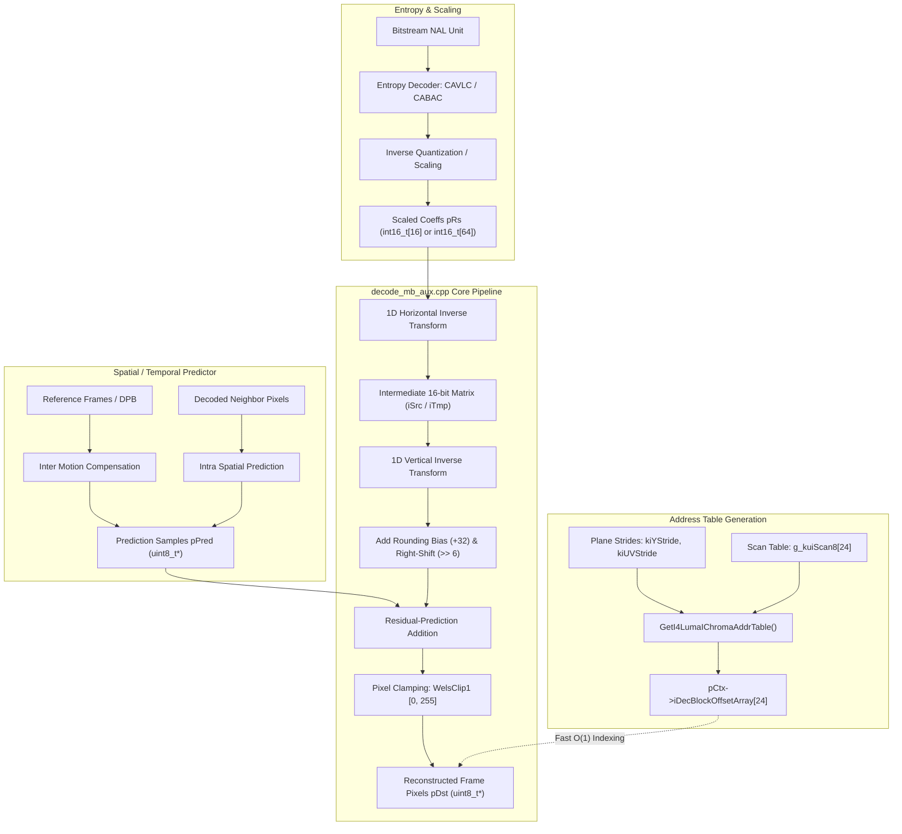
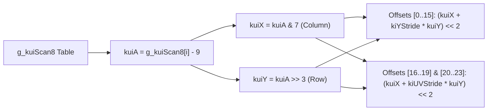
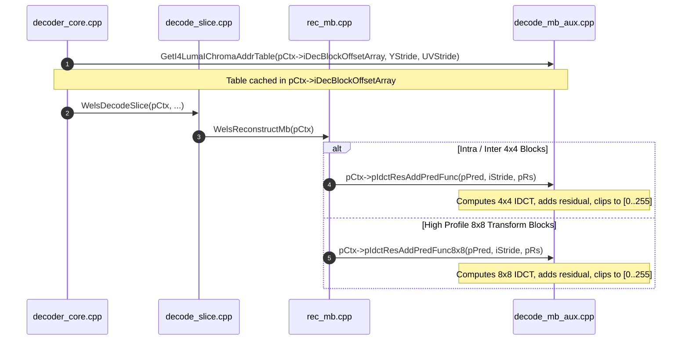

# OpenH264 Decoder: Inverse Transform & Macroblock Auxiliary Reconstruction (`decode_mb_aux.cpp`)

This document provides a comprehensive, literate-programming-style technical deep dive into the inverse transform, residual reconstruction, and macroblock address precomputation subsystem implemented in [`codec/decoder/core/src/decode_mb_aux.cpp`](openh264/codec/decoder/core/src/decode_mb_aux.cpp) and declared in [`codec/decoder/core/inc/decode_mb_aux.h`](openh264/codec/decoder/core/inc/decode_mb_aux.h).

---

## 1. High-Level Architectural Purpose

In the H.264 / MPEG-4 AVC video decoding pipeline, after entropy decoding (via CAVLC or CABAC) extracts quantized transform coefficients and inverse quantization (dequantization) rescales them into the integer coefficient matrix $W'$ (`pRs`), the decoder must:

1. **Compute the 2D Inverse Core Transform (IDCT)**: Transform frequency-domain residual coefficients back into the spatial pixel domain residual samples ($R$).
2. **Synthesize Prediction and Residual**: Add the spatial pixel residual samples ($R$) to the spatial intra-predicted or motion-compensated inter-predicted pixel samples ($P$).
3. **Saturate Output Pixels**: Clamp the reconstructed pixel values to the valid unsigned 8-bit dynamic range $[0, 255]$ via $\text{Clip1}_Y(\cdot)$ and write the final samples back to the frame reconstruction buffer in-place.
4. **Precompute Sub-Block Buffer Addresses**: Precalculate linear byte memory offsets for all 16 $4 \times 4$ luma sub-blocks and 8 $4 \times 4$ chroma sub-blocks ($4 \text{ Cb} + 4 \text{ Cr}$) within a macroblock to avoid repeated multiplication during slice reconstruction loops.



---

## 2. File & Symbol Inventory

### 2.1 File Location Reference

| Category | Path | Description |
| :--- | :--- | :--- |
| **C++ Implementation** | [`codec/decoder/core/src/decode_mb_aux.cpp`](openh264/codec/decoder/core/src/decode_mb_aux.cpp) | Reference C/C++ implementations of 4x4 IDCT, 8x8 IDCT, and address table generator. |
| **C++ Header** | [`codec/decoder/core/inc/decode_mb_aux.h`](openh264/codec/decoder/core/inc/decode_mb_aux.h) | Function prototypes and SIMD architecture-specific assembly function declarations. |
| **Common Macros** | [`codec/common/inc/macros.h`](openh264/codec/common/inc/macros.h) | Pixel clipping function [`WelsClip1`](openh264/codec/common/inc/macros.h#L186-L188). |
| **Common Tables** | [`codec/decoder/core/inc/wels_common_basis.h`](openh264/codec/decoder/core/inc/wels_common_basis.h) | Declaration of scan lookup table [`g_kuiScan8`](openh264/codec/decoder/core/src/decoder_data_tables.cpp#L107-L116). |
| **Context Integration** | [`codec/decoder/core/inc/decoder_context.h`](openh264/codec/decoder/core/inc/decoder_context.h) | Function pointer typedef [`PIdctResAddPredFunc`](openh264/codec/decoder/core/inc/decoder_context.h#L141) and context members. |

### 2.2 Exported Symbols in `decode_mb_aux.cpp`

```cpp
namespace WelsDec {

void IdctResAddPred_c (uint8_t* pPred, const int32_t kiStride, int16_t* pRs);
void IdctResAddPred8x8_c (uint8_t* pPred, const int32_t kiStride, int16_t* pRs);
void GetI4LumaIChromaAddrTable (int32_t* pBlockOffset, const int32_t kiYStride, const int32_t kiUVStride);

} // namespace WelsDec
```

---

## 3. Data Types, Constants, and Memory Layouts

### 3.1 Function Pointer Types

Defined in [`codec/decoder/core/inc/decoder_context.h`](openh264/codec/decoder/core/inc/decoder_context.h#L141):

```cpp
typedef void (*PIdctResAddPredFunc) (uint8_t* pPred, const int32_t kiStride, int16_t* pRs);
```

#### Fields & Context Usage:
- `pCtx->pIdctResAddPredFunc`: Function pointer invoked during $4 \times 4$ sub-block reconstruction (e.g. in [`rec_mb.cpp`](openh264/codec/decoder/core/src/rec_mb.cpp#L136-L152)). Dynamically initialized during decoder creation to point to `IdctResAddPred_c` or optimized SIMD routines (`IdctResAddPred_sse2`, `IdctResAddPred_avx2`, `IdctResAddPred_neon`, etc.).
- `pCtx->pIdctResAddPredFunc8x8`: Function pointer invoked during $8 \times 8$ High Profile transform block reconstruction (e.g. in [`rec_mb.cpp`](openh264/codec/decoder/core/src/rec_mb.cpp#L82-L110)). Dynamically initialized to `IdctResAddPred8x8_c` or `IdctResAddPred8x8_lsx`.

### 3.2 Global Lookup Table: `g_kuiScan8`

Defined in [`codec/decoder/core/src/decoder_data_tables.cpp`](openh264/codec/decoder/core/src/decoder_data_tables.cpp#L107-L116) and declared in [`wels_common_basis.h`](openh264/codec/decoder/core/inc/wels_common_basis.h#L47):

```cpp
const uint8_t g_kuiScan8[24] = {        // [16 luma + 4 Cb + 4 Cr]
  9,  10, 17, 18,        // 1+1*8, 2+1*8, 1+2*8, 2+2*8  (Luma 4x4 Block 0..3)
  11, 12, 19, 20,        // 3+1*8, 4+1*8, 3+2*8, 4+2*8  (Luma 4x4 Block 4..7)
  25, 26, 33, 34,        // 1+3*8, 2+3*8, 1+4*8, 2+4*8  (Luma 4x4 Block 8..11)
  27, 28, 35, 36,        // 3+3*8, 4+3*8, 3+4*8, 4+4*8  (Luma 4x4 Block 12..15)
  14, 15,                // 6+1*8, 7+1*8                 (Chroma Cb/Cr Block 0..1)
  22, 23,                // 6+2*8, 7+2*8                 (Chroma Cb/Cr Block 2..3)
  38, 39,                // 6+4*8, 7+4*8
  46, 47,                // 6+5*8, 7+5*8
};
```

#### Memory Alignment & Layout:
- **Element Type**: `uint8_t` (8-bit unsigned integer).
- **Total Entries**: 24.
- **Coordinate Grid**: Represents linear indices in an $8 \times 8$ internal macroblock cache layout. Each coordinate index $k = x + 8y$ specifies sub-block position $(x, y)$.
- **Base Offset**: `kuiScan0 = g_kuiScan8[0] = 9` (corresponding to cache position $x=1, y=1$).

### 3.3 Pixel Saturation Helper: `WelsClip1`

Defined in [`codec/common/inc/macros.h`](openh264/codec/common/inc/macros.h#L186-L188):

```cpp
static inline uint8_t WelsClip1 (int32_t iX) {
  return ((iX & ~255) ? (-iX >> 31) & 255 : iX);
}
```

#### Mathematical Definition:
$$\text{WelsClip1}(x) = \begin{cases} 0 & \text{if } x < 0 \\ 255 & \text{if } x > 255 \\ x & \text{if } 0 \le x \le 255 \end{cases}$$

This branchless bitwise implementation checks if any bits outside $[0, 255]$ are set (`iX & ~255`). If non-zero, it extracts the sign bit (`-iX >> 31`) to yield `0` for negative values or `255` for values exceeding 255.

---

## 4. Deep Dive into Functions & Methods

---

### 4.1 `IdctResAddPred_c`

```cpp
void IdctResAddPred_c (uint8_t* pPred, const int32_t kiStride, int16_t* pRs);
```

#### 4.1.1 Architectural & Algorithmic Role
Reconstructs one $4 \times 4$ pixel block by computing the 2D Inverse Discrete Cosine Transform (IDCT) on 16 scaled dequantized transform coefficients (`pRs`), adding the resulting residuals to the prediction samples (`pPred`), and clamping the output pixels to $[0, 255]$.

> [!IMPORTANT]
> **Preservation of `pRs`**: The input coefficient array `pRs` must **not** be modified in-place during IDCT calculation. Modifying `pRs` causes mismatches with the JSVM (Joint Scalable Video Model) reference decoder. Therefore, an auxiliary 16-element stack buffer `int16_t iSrc[16]` is allocated to store the intermediate 1D horizontal transform results.

#### 4.1.2 Parameter Specification

| Parameter | Type | Direction | Description |
| :--- | :--- | :--- | :--- |
| `pPred` | `uint8_t*` | In / Out | Pointer to the top-left pixel of the $4 \times 4$ prediction block in frame memory. Reconstructed pixel samples overwrite `pPred` in-place. |
| `kiStride` | `const int32_t` | In | Line stride (in bytes) of the destination frame picture buffer. |
| `pRs` | `int16_t*` | In | Pointer to the array of 16 scaled dequantized DCT coefficients in row-major order ($4 \times 4$). |

#### 4.1.3 Mathematical Formulation & Derivation

The H.264 $4 \times 4$ integer inverse transform is defined by the separable matrix multiplication:
$$R = C_i^T \cdot W' \cdot C_i$$
where $W'$ is the $4 \times 4$ matrix of scaled coefficients, and $C_i$ is the integer inverse transform matrix:
$$C_i = \begin{pmatrix} 1 & 1 & 1 & 1/2 \\ 1 & 1/2 & -1 & -1 \\ 1 & -1/2 & -1 & 1 \\ 1 & -1 & 1 & -1/2 \end{pmatrix}$$

##### Stage 1: Horizontal 1D IDCT Across 4 Rows
For each row $i \in \{0, 1, 2, 3\}$, with row index offset $kiY = 4i$:

$$\begin{aligned}
kiT_0 &= pRs[kiY + 0] + pRs[kiY + 2] \\
kiT_1 &= pRs[kiY + 0] - pRs[kiY + 2] \\
kiT_2 &= (pRs[kiY + 1] \gg 1) - pRs[kiY + 3] \\
kiT_3 &= pRs[kiY + 1] + (pRs[kiY + 3] \gg 1)
\end{aligned}$$

The intermediate 1D row results stored in `iSrc` are:

$$\begin{aligned}
iSrc[kiY + 0] &= kiT_0 + kiT_3 \\
iSrc[kiY + 1] &= kiT_1 + kiT_2 \\
iSrc[kiY + 2] &= kiT_1 - kiT_2 \\
iSrc[kiY + 3] &= kiT_0 - kiT_3
\end{aligned}$$

##### Stage 2: Vertical 1D IDCT Across 4 Columns + Scaling + Prediction Addition
For each column $i \in \{0, 1, 2, 3\}$:

$$\begin{aligned}
kT_1 &= iSrc[i] + iSrc[i + 8] \\
kT_2 &= iSrc[i + 4] + (iSrc[i + 12] \gg 1) \\
kT_3 &= (32 + kT_1 + kT_2) \gg 6 \\
kT_4 &= (32 + kT_1 - kT_2) \gg 6
\end{aligned}$$

$$\begin{aligned}
pDst[i + 0 \cdot kiStride] &= \text{WelsClip1}(kT_3 + pPred[i + 0 \cdot kiStride]) \\
pDst[i + 3 \cdot kiStride] &= \text{WelsClip1}(kT_4 + pPred[i + 3 \cdot kiStride])
\end{aligned}$$

Next, for the second pair of rows (rows 1 and 2):

$$\begin{aligned}
kT_1' &= iSrc[i] - iSrc[i + 8] \\
kT_2' &= (iSrc[i + 4] \gg 1) - iSrc[i + 12] \\
pDst[i + 1 \cdot kiStride] &= \text{WelsClip1}\left( ((32 + kT_1' + kT_2') \gg 6) + pDst[i + 1 \cdot kiStride] \right) \\
pDst[i + 2 \cdot kiStride] &= \text{WelsClip1}\left( ((32 + kT_1' - kT_2') \gg 6) + pDst[i + 2 \cdot kiStride] \right)
\end{aligned}$$

> [!NOTE]
> **Why Shift by 6 ($2^6 = 64$)?**
> The forward 2D integer DCT and inverse 2D integer DCT together introduce a scaling factor of 64 ($2^6$). A rounding bias of $+32$ ($2^5$) is added prior to right-shifting by 6 to ensure symmetric arithmetic rounding without DC accumulation drift.

#### 4.1.4 C++ Reference Code Implementation

```cpp
void IdctResAddPred_c (uint8_t* pPred, const int32_t kiStride, int16_t* pRs) {
  int16_t iSrc[16];

  uint8_t* pDst           = pPred;
  const int32_t kiStride2 = kiStride << 1;
  const int32_t kiStride3 = kiStride + kiStride2;
  int32_t i;

  for (i = 0; i < 4; i++) {
    const int32_t kiY  = i << 2;
    const int32_t kiT0 = pRs[kiY] + pRs[kiY + 2];
    const int32_t kiT1 = pRs[kiY] - pRs[kiY + 2];
    const int32_t kiT2 = (pRs[kiY + 1] >> 1) - pRs[kiY + 3];
    const int32_t kiT3 = pRs[kiY + 1] + (pRs[kiY + 3] >> 1);

    iSrc[kiY]     = kiT0 + kiT3;
    iSrc[kiY + 1] = kiT1 + kiT2;
    iSrc[kiY + 2] = kiT1 - kiT2;
    iSrc[kiY + 3] = kiT0 - kiT3;
  }

  for (i = 0; i < 4; i++) {
    int32_t kT1 = iSrc[i]     +  iSrc[i + 8];
    int32_t kT2 = iSrc[i + 4] + (iSrc[i + 12] >> 1);
    int32_t kT3 = (32 + kT1 + kT2) >> 6;
    int32_t kT4 = (32 + kT1 - kT2) >> 6;

    pDst[i]             = WelsClip1 (kT3 + pPred[i]);
    pDst[i + kiStride3] = WelsClip1 (kT4 + pPred[i + kiStride3]);

    kT1 = iSrc[i]           - iSrc[i + 8];
    kT2 = (iSrc[i + 4] >> 1) - iSrc[i + 12];
    pDst[i + kiStride]  = WelsClip1 (((32 + kT1 + kT2) >> 6) + pDst[i + kiStride]);
    pDst[i + kiStride2] = WelsClip1 (((32 + kT1 - kT2) >> 6) + pDst[i + kiStride2]);
  }
}
```

---

### 4.2 `IdctResAddPred8x8_c`

```cpp
void IdctResAddPred8x8_c (uint8_t* pPred, const int32_t kiStride, int16_t* pRs);
```

#### 4.2.1 Architectural & Algorithmic Role
Performs 8x8 Inverse Integer DCT reconstruction for H.264 High Profile (FRExt) $8 \times 8$ transform blocks. Transforms 64 scaled coefficients (`pRs`), adds the resulting $8 \times 8$ residual matrix to `pPred`, and saturates pixel values to $[0, 255]$.

#### 4.2.2 Parameter Specification

| Parameter | Type | Direction | Description |
| :--- | :--- | :--- | :--- |
| `pPred` | `uint8_t*` | In / Out | Pointer to the top-left pixel of the $8 \times 8$ prediction block in frame memory. |
| `kiStride` | `const int32_t` | In | Line stride (in bytes) of the destination frame buffer. |
| `pRs` | `int16_t*` | In | Array of 64 scaled dequantized DCT coefficients in row-major order ($8 \times 8$). |

#### 4.2.3 Mathematical Formulation & Butterfly Structure

The 8-point 1D inverse transform decomposes an 8-element vector $p[0..7]$ into even-symmetric and odd-antisymmetric butterflies:

##### Even Sub-transform ($a_0 \dots a_3 \to b_0, b_2, b_4, b_6$):
$$\begin{aligned}
a_0 &= p[0] + p[4] \\
a_1 &= p[0] - p[4] \\
a_2 &= p[6] - (p[2] \gg 1) \\
a_3 &= p[2] + (p[6] \gg 1) \\
b_0 &= a_0 + a_3, \quad b_2 = a_1 - a_2, \quad b_4 = a_1 + a_2, \quad b_6 = a_0 - a_3
\end{aligned}$$

##### Odd Sub-transform ($a_0' \dots a_3' \to b_1, b_3, b_5, b_7$):
$$\begin{aligned}
a_0' &= -p[3] + p[5] - p[7] - (p[7] \gg 1) \\
a_1' &= p[1] + p[7] - p[3] - (p[3] \gg 1) \\
a_2' &= -p[1] + p[7] + p[5] + (p[5] \gg 1) \\
a_3' &= p[3] + p[5] + p[1] + (p[1] \gg 1) \\
b_1 &= a_0' + (a_3' \gg 2) \\
b_3 &= a_1' + (a_2' \gg 2) \\
b_5 &= a_2' - (a_1' \gg 2) \\
b_7 &= a_3' - (a_0' \gg 2)
\end{aligned}$$

##### Combining Even and Odd Outputs:
$$\begin{aligned}
\text{Out}[0] &= b_0 + b_7, \quad \text{Out}[1] = b_2 - b_5 \\
\text{Out}[2] &= b_4 + b_3, \quad \text{Out}[3] = b_6 + b_1 \\
\text{Out}[4] &= b_6 - b_1, \quad \text{Out}[5] = b_4 - b_3 \\
\text{Out}[6] &= b_2 + b_5, \quad \text{Out}[7] = b_0 - b_7
\end{aligned}$$

The 2D transform applies this 8-point butterfly across all 8 rows (writing to `iTmp[64]`), then across all 8 columns (writing to `iRes[64]`). Finally, for every pixel $(i, j) \in [0..7] \times [0..7]$:

$$pDst[i \cdot kiStride + j] = \text{WelsClip1}\left( \left( (32 + iRes[8i + j]) \gg 6 \right) + pDst[i \cdot kiStride + j] \right)$$

---

### 4.3 `GetI4LumaIChromaAddrTable`

```cpp
void GetI4LumaIChromaAddrTable (int32_t* pBlockOffset, const int32_t kiYStride, const int32_t kiUVStride);
```

#### 4.3.1 Architectural & Algorithmic Role
Precomputes a 24-element address offset table (`pBlockOffset`, mapped to `pCtx->iDecBlockOffsetArray`) representing the byte offsets from the macroblock start pointer to each $4 \times 4$ sub-block.

#### 4.3.2 Parameter Specification

| Parameter | Type | Direction | Description |
| :--- | :--- | :--- | :--- |
| `pBlockOffset` | `int32_t*` | Out | Pointer to an array of at least 24 `int32_t` elements to receive the calculated byte offsets. |
| `kiYStride` | `const int32_t` | In | Line stride (in bytes) of the luma (Y) picture buffer. |
| `kiUVStride` | `const int32_t` | In | Line stride (in bytes) of the chroma (Cb/Cr) picture buffer. |

#### 4.3.3 Algorithmic Derivation & Offset Mapping



##### 1. Luma Sub-Blocks ($i \in [0, 15]$):
For each of the 16 $4 \times 4$ luma sub-blocks:
$$kuiA = g\_kuiScan8[i] - 9$$
$$kuiX = kuiA \ \& \ 0x07 \quad (\text{horizontal column block index } \in [0..3])$$
$$kuiY = kuiA \gg 3 \quad (\text{vertical row block index } \in [0..3])$$

$$\text{pBlockOffset}[i] = (kuiX + kiYStride \cdot kuiY) \ll 2 = (4 \cdot kuiX) + (4 \cdot kuiY) \cdot kiYStride$$

##### 2. Chroma Sub-Blocks ($i \in [0, 3]$):
Chroma blocks use the first 4 scan entries to address the $2 \times 2$ grid of $4 \times 4$ sub-blocks for Cb and Cr:
$$\text{pBlockOffset}[16 + i] = \text{pBlockOffset}[20 + i] = ((kuiA \ \& \ 0x07) + kiUVStride \cdot (kuiA \gg 3)) \ll 2$$

#### 4.3.4 C++ Source Code

```cpp
void GetI4LumaIChromaAddrTable (int32_t* pBlockOffset, const int32_t kiYStride, const int32_t kiUVStride) {
  int32_t* pOffset = pBlockOffset;
  int32_t i;
  const uint8_t kuiScan0 = g_kuiScan8[0];

  for (i = 0; i < 16; i++) {
    const uint32_t kuiA = g_kuiScan8[i] - kuiScan0;
    const uint32_t kuiX = kuiA & 0x07;
    const uint32_t kuiY = kuiA >> 3;

    pOffset[i] = (kuiX + kiYStride * kuiY) << 2;
  }

  for (i = 0; i < 4; i++) {
    const uint32_t kuiA = g_kuiScan8[i] - kuiScan0;

    pOffset[16 + i] =
      pOffset[20 + i] = ((kuiA & 0x07) + (kiUVStride) * (kuiA >> 3)) << 2;
  }
}
```

---

## 5. SIMD Hardware Acceleration & Assembly Fallback Matrix

OpenH264 dynamically dispatches `PIdctResAddPredFunc` to optimized assembly implementations based on runtime CPU feature detection flags (`uiCpuFlag`):

| Architecture / ISA | 4x4 IDCT Function Symbol | 8x8 IDCT Function Symbol | Source File Path |
| :--- | :--- | :--- | :--- |
| **C / C++ Reference** | `IdctResAddPred_c` | `IdctResAddPred8x8_c` | [`decode_mb_aux.cpp`](openh264/codec/decoder/core/src/decode_mb_aux.cpp) |
| **x86 / x64 MMX** | `IdctResAddPred_mmx` | — | `codec/decoder/core/x86/dct.asm` |
| **x86 / x64 SSE2** | `IdctResAddPred_sse2` | — | `codec/decoder/core/x86/dct.asm` |
| **x86 / x64 AVX2** | `IdctResAddPred_avx2`<br>`IdctFourResAddPred_avx2` | — | `codec/decoder/core/x86/dct.asm` |
| **ARMv7 NEON** | `IdctResAddPred_neon` | — | [`codec/decoder/core/arm/block_add_neon.S`](openh264/codec/decoder/core/arm/block_add_neon.S#L68) |
| **AArch64 NEON** | `IdctResAddPred_AArch64_neon` | — | [`codec/decoder/core/arm64/block_add_aarch64_neon.S`](openh264/codec/decoder/core/arm64/block_add_aarch64_neon.S#L70) |
| **MIPS MMI** | `IdctResAddPred_mmi` | — | [`codec/decoder/core/mips/dct_mmi.c`](openh264/codec/decoder/core/mips/dct_mmi.c#L67) |
| **LoongArch LSX** | `IdctResAddPred_lsx` | `IdctResAddPred8x8_lsx` | [`codec/decoder/core/loongarch/mb_aux_lsx.c`](openh264/codec/decoder/core/loongarch/mb_aux_lsx.c#L101) |

---

## 6. Call Graph & System Interactions



---

## 7. Performance & Thread-Safety Analysis

1. **Reentrancy & Thread Safety**: All functions in [`decode_mb_aux.cpp`](openh264/codec/decoder/core/src/decode_mb_aux.cpp) are pure, reentrant functions without static mutable state. They operate strictly on caller-provided stack/heap buffers (`pPred`, `pRs`, `pBlockOffset`).
2. **Cache Locality**: `GetI4LumaIChromaAddrTable` is invoked once per layer/slice initialization (in [`decoder_core.cpp:L2610`](openh264/codec/decoder/core/src/decoder_core.cpp#L2610)), storing the precalculated 24 offsets in the L1-cache friendly array `pCtx->iDecBlockOffsetArray`. Subsequent macroblock decoding loops access these offsets with zero integer multiplication overhead.
