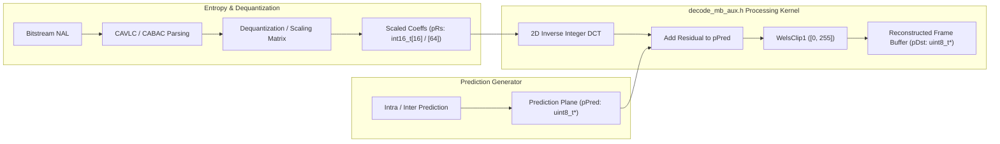
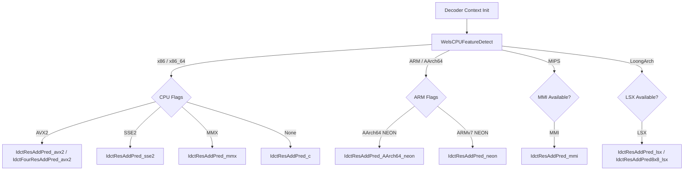
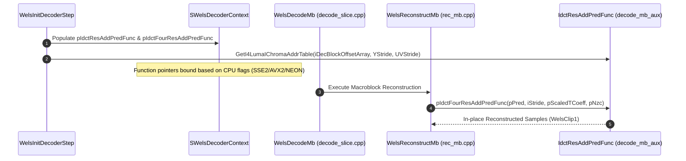

# OpenH264 Decoder: Inverse Discrete Cosine Transform & Residual Reconstruction (`decode_mb_aux.h`)

This document provides a comprehensive, literate-programming-style technical reference for [`decode_mb_aux.h`](openh264/codec/decoder/core/inc/decode_mb_aux.h), the core header file in the OpenH264 video decoder responsible for **Inverse Integer Discrete Cosine Transform (IDCT)**, **residual-prediction summation**, **sample saturation/clamping**, and **macroblock sub-block address lookup table generation**.

---

## Table of Contents
1. [Module & Architectural Purpose](#1-module--architectural-purpose)
2. [Data Structures, Types, and Memory Layouts](#2-data-structures-types-and-memory-layouts)
3. [Algorithmic & Mathematical Specifications](#3-algorithmic--mathematical-specifications)
   - [3.1 4x4 Inverse Integer DCT (`IdctResAddPred_c`)](#31-4x4-inverse-integer-dct-idctresaddpred_c)
   - [3.2 8x8 Inverse Integer DCT (`IdctResAddPred8x8_c`)](#32-8x8-inverse-integer-dct-idctresaddpred8x8_c)
   - [3.3 Batch 4-Block Processing & NZC Optimization (`IdctFourResAddPred`)](#33-batch-4-block-processing--nzc-optimization-idctfourresaddpred)
   - [3.4 Sub-Block Coordinate Mapping (`GetI4LumaIChromaAddrTable`)](#34-sub-block-coordinate-mapping-geti4lumachromaaddrtable)
4. [Hardware SIMD Acceleration & Multi-Architecture Fallbacks](#4-hardware-simd-acceleration--multi-architecture-fallbacks)
5. [Function & Method Reference](#5-function--method-reference)
6. [Call Graph & Decoder System Integration](#6-call-graph--decoder-system-integration)

---

## 1. Module & Architectural Purpose

In the H.264 / MPEG-4 AVC decoding pipeline ([overview.md](openh264/rust/docs/overview.md#26-inverse-quantization--inverse-transform-idct)), the macroblock reconstruction stage combines **predicted samples** (generated via spatial intra prediction or motion-compensated inter prediction) with the **decoded residual error samples**.

Header file [`decode_mb_aux.h`](openh264/codec/decoder/core/inc/decode_mb_aux.h) defines the functions that compute the 2D Inverse Integer Discrete Cosine Transform on dequantized transform coefficient blocks ($4 \times 4$ and $8 \times 8$), sum the resulting spatial residuals with the corresponding prediction pixels, and clamp (saturate) the reconstructed samples to the valid 8-bit unsigned pixel range $[0, 255]$.



### Key Responsibilities
1. **Separable 2D Inverse Core Transform**: Performs 1D horizontal and 1D vertical integer butterfly transformations without floating-point arithmetic.
2. **Fused Residual Addition & Sample Clamping**: Directly adds the transformed residual signals to the prediction pixel memory buffer in-place (`pDst = pPred`) with branch-free byte clipping.
3. **Macroblock Sub-Block Addressing**: Computes 2D memory stride address offsets for all 16 Luma 4x4 sub-blocks and 8 Chroma 4x4 sub-blocks (4 Cb + 4 Cr) to maximize L1 data cache locality.
4. **Dynamic SIMD Dispatch**: Exposes standardized C-linkage entry points for x86 (MMX, SSE2, AVX2), ARM (NEON 32-bit, AArch64 NEON), MIPS (MMI), and LoongArch (LSX) architectures.

---

## 2. Data Structures, Types, and Memory Layouts

### Data Types & Alignment Constraints

The routines in [`decode_mb_aux.h`](openh264/codec/decoder/core/inc/decode_mb_aux.h) operate across three fundamental memory domains:

| Buffer Pointer / Variable | C/C++ Type | Bit-Depth / Range | Memory Alignment | Description |
| :--- | :--- | :--- | :--- | :--- |
| `pPred` / `pDst` | `uint8_t*` | 8-bit unsigned $[0, 255]$ | 16-byte or 32-byte aligned | Pointer to the prediction / destination reconstructed picture plane. Modified in-place. |
| `kiStride` / `iStride` | `const int32_t` | Signed 32-bit integer | N/A | Memory pitch / line stride (bytes between consecutive vertical pixel rows). |
| `pRs` / `rs` | `int16_t*` | 16-bit signed $[-2048, 2047]$ | 16-byte aligned | Array of dequantized / scaled transform coefficients ($16$ elements for 4x4 IDCT, $64$ elements for 8x8 IDCT). |
| `pNzc` | `const int8_t*` | 8-bit signed $[0, 16]$ | Byte-aligned | Non-Zero Count cache array indicating the number of non-zero coefficients per sub-block. |
| `pBlockOffset` | `int32_t*` | Signed 32-bit integer | Array of 24 elements | Memory byte offsets from the macroblock origin for each 4x4 sub-block. |

### Memory Organization of Macroblock Sub-Blocks

H.264 macroblocks ($16 \times 16$ luma pixels and two $8 \times 8$ chroma planes) are partitioned into $4 \times 4$ sub-blocks indexed according to the standard raster/zigzag scan order defined in [`g_kuiScan8`](openh264/codec/decoder/core/inc/wels_common_basis.h#L47):

```
       Luma (16x16)                  Chroma Cb (8x8)           Chroma Cr (8x8)
 ┌──────┬──────┬──────┬──────┐        ┌──────┬──────┐          ┌──────┬──────┐
 │  0   │  1   │  4   │  5   │        │  16  │  17  │          │  20  │  21  │
 ├──────┼──────┼──────┼──────┤        ├──────┼──────┤          ├──────┼──────┤
 │  2   │  3   │  6   │  7   │        │  18  │  19  │          │  22  │  23  │
 ├──────┼──────┼──────┼──────┤        └──────┴──────┘          └──────┴──────┘
 │  8   │  9   │  12  │  13  │
 ├──────┼──────┼──────┼──────┤
 │  10  │  11  │  14  │  15  │
 └──────┴──────┴──────┴──────┘
```

---

## 3. Algorithmic & Mathematical Specifications

### 3.1 4x4 Inverse Integer DCT (`IdctResAddPred_c`)

The H.264 4x4 inverse integer transform is an exact integer approximation of the 4-point inverse Discrete Cosine Transform. Given an input $4 \times 4$ matrix of dequantized coefficients $\mathbf{W}'$ (`pRs`), the 2D transform is computed separably.

#### Step 1: 1D Horizontal Inverse Transform
For each row $i \in \{0, 1, 2, 3\}$, with row coefficients $[r_0, r_1, r_2, r_3] = [pRs[4i], pRs[4i+1], pRs[4i+2], pRs[4i+3]]$:

$$T_0 = r_0 + r_2$$

$$T_1 = r_0 - r_2$$

$$T_2 = (r_1 \gg 1) - r_3$$

$$T_3 = r_1 + (r_3 \gg 1)$$

The intermediate row outputs $[s_0, s_1, s_2, s_3]$ stored in `iSrc[4i .. 4i+3]` are:

$$s_0 = T_0 + T_3$$

$$s_1 = T_1 + T_2$$

$$s_2 = T_1 - T_2$$

$$s_3 = T_0 - T_3$$

#### Step 2: 1D Vertical Inverse Transform, Rounding & Clamping
For each column $i \in \{0, 1, 2, 3\}$, with column intermediate values from `iSrc`:

$$kT_1 = iSrc[i] + iSrc[i + 8]$$

$$kT_2 = iSrc[i + 4] + (iSrc[i + 12] \gg 1)$$

$$kT'_1 = iSrc[i] - iSrc[i + 8]$$

$$kT'_2 = (iSrc[i + 4] \gg 1) - iSrc[i + 12]$$

The residual spatial sample contributions are scaled with a rounding offset of $32$ and right-shifted by $6$ (equivalent to dividing by $64$):

$$\Delta_{0, i} = (32 + kT_1 + kT_2) \gg 6$$

$$\Delta_{1, i} = (32 + kT'_1 + kT'_2) \gg 6$$

$$\Delta_{2, i} = (32 + kT'_1 - kT'_2) \gg 6$$

$$\Delta_{3, i} = (32 + kT_1 - kT_2) \gg 6$$

#### Step 3: Residual Addition and Saturation
The residual samples are added to the prediction buffer `pPred` and clamped to $[0, 255]$ using [`WelsClip1`](openh264/codec/common/inc/macros.h):

$$pDst[i + 0 \cdot \text{kiStride}] = \text{Clip1}\left(\Delta_{0, i} + pPred[i + 0 \cdot \text{kiStride}]\right)$$

$$pDst[i + 1 \cdot \text{kiStride}] = \text{Clip1}\left(\Delta_{1, i} + pDst[i + 1 \cdot \text{kiStride}]\right)$$

$$pDst[i + 2 \cdot \text{kiStride}] = \text{Clip1}\left(\Delta_{2, i} + pDst[i + 2 \cdot \text{kiStride}]\right)$$

$$pDst[i + 3 \cdot \text{kiStride}] = \text{Clip1}\left(\Delta_{3, i} + pPred[i + 3 \cdot \text{kiStride}]\right)$$

---

### 3.2 8x8 Inverse Integer DCT (`IdctResAddPred8x8_c`)

For H.264 High Profile streams utilizing the $8 \times 8$ transform, [`IdctResAddPred8x8_c`](openh264/codec/decoder/core/src/decode_mb_aux.cpp#L79-L167) evaluates an $8 \times 8$ block of coefficients `pRs[0..63]`.

#### 8-Point 1D Butterfly Factorization
For each 8-element vector $p[0..7]$:

1. **Even Stage Decomposition**:
   $$a_0 = p_0 + p_4, \quad a_1 = p_0 - p_4$$
   $$a_2 = p_6 - (p_2 \gg 1), \quad a_3 = p_2 + (p_6 \gg 1)$$
   $$b_0 = a_0 + a_3, \quad b_2 = a_1 - a_2, \quad b_4 = a_1 + a_2, \quad b_6 = a_0 - a_3$$

2. **Odd Stage Decomposition**:
   $$a_0 = -p_3 + p_5 - p_7 - (p_7 \gg 1)$$
   $$a_1 = p_1 + p_7 - p_3 - (p_3 \gg 1)$$
   $$a_2 = -p_1 + p_7 + p_5 + (p_5 \gg 1)$$
   $$a_3 = p_3 + p_5 + p_1 + (p_1 \gg 1)$$
   $$b_1 = a_0 + (a_3 \gg 2), \quad b_3 = a_1 + (a_2 \gg 2), \quad b_5 = a_2 - (a_1 \gg 2), \quad b_7 = a_3 - (a_0 \gg 2)$$

3. **Output Combination**:
   $$\text{Out}_0 = b_0 + b_7, \quad \text{Out}_1 = b_2 - b_5, \quad \text{Out}_2 = b_4 + b_3, \quad \text{Out}_3 = b_6 + b_1$$
   $$\text{Out}_4 = b_6 - b_1, \quad \text{Out}_5 = b_4 - b_3, \quad \text{Out}_6 = b_2 + b_5, \quad \text{Out}_7 = b_0 - b_7$$

After horizontal and vertical passes, the output is rounded with $(32 + iRes) \gg 6$, added to `pDst`, and clamped with `WelsClip1`.

---

### 3.3 Batch 4-Block Processing & NZC Optimization (`IdctFourResAddPred`)

In macroblock decoding loops ([`decode_slice.cpp`](openh264/codec/decoder/core/src/decode_slice.cpp#L195-L206) and [`rec_mb.cpp`](openh264/codec/decoder/core/src/rec_mb.cpp#L193-L203)), IDCT is executed across groups of four 4x4 blocks. 

OpenH264 utilizes the Non-Zero Count cache (`pNzc`) to conditionally bypass blocks that contain zero transform coefficients:

```cpp
template<void pfIdctResAddPred (uint8_t* pPred, int32_t iStride, int16_t* pRs)>
static inline void IdctFourResAddPred_ (uint8_t* pPred, int32_t iStride, int16_t* pRs, const int8_t* pNzc) {
  if (pNzc[0])
    pfIdctResAddPred (pPred + 0 * iStride + 0, iStride, pRs + 0 * 16);
  if (pNzc[1])
    pfIdctResAddPred (pPred + 0 * iStride + 4, iStride, pRs + 1 * 16);
  if (pNzc[4]) // row stride in pNzc cache
    pfIdctResAddPred (pPred + 4 * iStride + 0, iStride, pRs + 2 * 16);
  if (pNzc[5])
    pfIdctResAddPred (pPred + 4 * iStride + 4, iStride, pRs + 3 * 16);
}
```

---

### 3.4 Sub-Block Coordinate Mapping (`GetI4LumaIChromaAddrTable`)

[`GetI4LumaIChromaAddrTable`](openh264/codec/decoder/core/src/decode_mb_aux.cpp#L169-L188) precomputes the byte offset array `pBlockOffset[24]` used by the decoder to access any 4x4 sub-block in a macroblock:

1. **Luma 4x4 Offsets (`i = 0 .. 15`)**:
   $$\text{kuiA} = g\_kuiScan8[i] - g\_kuiScan8[0]$$
   $$\text{kuiX} = \text{kuiA} \ \& \ 0x07, \quad \text{kuiY} = \text{kuiA} \gg 3$$
   $$pBlockOffset[i] = (\text{kuiX} + \text{kiYStride} \cdot \text{kuiY}) \ll 2$$

2. **Chroma 4x4 Offsets (`i = 0 .. 3` for Cb and Cr)**:
   $$\text{kuiA} = g\_kuiScan8[i] - g\_kuiScan8[0]$$
   $$pBlockOffset[16 + i] = pBlockOffset[20 + i] = ((\text{kuiA} \ \& \ 0x07) + \text{kiUVStride} \cdot (\text{kuiA} \gg 3)) \ll 2$$

---

## 4. Hardware SIMD Acceleration & Multi-Architecture Fallbacks

OpenH264 provides highly optimized assembly implementations for [`IdctResAddPred`](openh264/codec/decoder/core/inc/decode_mb_aux.h) across major CPU architectures:



### ISA Implementation Summary

| Function Symbol | Target ISA | Source Location | Vector Registers Used | Key Optimization Techniques |
| :--- | :--- | :--- | :--- | :--- |
| [`IdctResAddPred_c`](openh264/codec/decoder/core/src/decode_mb_aux.cpp#L42-L77) | Portable C++ | [decode_mb_aux.cpp](openh264/codec/decoder/core/src/decode_mb_aux.cpp) | General Purpose Registers | Reference butterfly calculation with integer shifts. |
| [`IdctResAddPred8x8_c`](openh264/codec/decoder/core/src/decode_mb_aux.cpp#L79-L167) | Portable C++ | [decode_mb_aux.cpp](openh264/codec/decoder/core/src/decode_mb_aux.cpp) | General Purpose Registers | 8x8 2D IDCT reference transform for High Profile. |
| [`IdctResAddPred_mmx`](openh264/codec/common/x86/dct.asm#L218) | x86 MMX | [dct.asm](openh264/codec/common/x86/dct.asm) | `mm0`–`mm7` (64-bit) | 4x4 matrix transposition (`MMX_Trans4x4W`) and IDCT butterfly in 64-bit MMX registers. |
| [`IdctResAddPred_sse2`](openh264/codec/common/x86/dct.asm#L599) | x86 SSE2 | [dct.asm](openh264/codec/common/x86/dct.asm) | `xmm0`–`xmm7` (128-bit) | 128-bit packed 16-bit integer butterflies and vector saturation. |
| [`IdctResAddPred_avx2`](openh264/codec/common/x86/dct.asm#L1005) | x86 AVX2 | [dct.asm](openh264/codec/common/x86/dct.asm) | `ymm0`–`ymm5` (256-bit) | AVX2 vector broadcast and 256-bit SIMD matrix transposition. |
| [`IdctFourResAddPred_avx2`](openh264/codec/decoder/core/inc/decode_mb_aux.h#L53) | x86 AVX2 | [dct.asm](openh264/codec/common/x86/dct.asm) | `ymm0`–`ymm7` (256-bit) | Concurrently transforms and reconstructs four 4x4 blocks in 256-bit registers. |
| [`IdctResAddPred_neon`](openh264/codec/decoder/core/arm/block_add_neon.S) | ARMv7 NEON | [block_add_neon.S](openh264/codec/decoder/core/arm/block_add_neon.S) | `d0`–`d7`, `q0`–`q3` | Uses `vadd.s16`, `vsub.s16`, and `vqadd.u8` saturation instructions. |
| [`IdctResAddPred_AArch64_neon`](openh264/codec/decoder/core/arm64/block_add_aarch64_neon.S#L33) | ARM64 NEON | [block_add_aarch64_neon.S](openh264/codec/decoder/core/arm64/block_add_aarch64_neon.S) | `v0.4s`–`v7.4s` (128-bit) | 64-bit to 32-bit widening arithmetic (`saddl`, `ssubl`) and vector shift/store. |
| [`IdctResAddPred_mmi`](openh264/codec/decoder/core/mips/dct_mmi.c) | MIPS MMI | [dct_mmi.c](openh264/codec/decoder/core/mips/dct_mmi.c) | MIPS SIMD vector registers | SIMD integer butterfly and clamping for Loongson/MIPS architectures. |
| [`IdctResAddPred_lsx`](openh264/codec/decoder/core/loongarch/mb_aux_lsx.c) | LoongArch LSX | [mb_aux_lsx.c](openh264/codec/decoder/core/loongarch/mb_aux_lsx.c) | 128-bit LSX vector registers | Vectorized 4x4 IDCT and saturation addition. |
| [`IdctResAddPred8x8_lsx`](openh264/codec/decoder/core/loongarch/mb_aux_lsx.c) | LoongArch LSX | [mb_aux_lsx.c](openh264/codec/decoder/core/loongarch/mb_aux_lsx.c) | 128-bit LSX vector registers | Vectorized 8x8 IDCT and saturation addition. |

---

## 5. Function & Method Reference

### `IdctResAddPred_c`

```cpp
void IdctResAddPred_c (uint8_t* pPred, const int32_t kiStride, int16_t* pRs);
```

* **Purpose**: Performs a 2D $4 \times 4$ Inverse Integer Discrete Cosine Transform on scaled coefficients `pRs`, adds the transformed residual samples to the prediction pixels `pPred`, clamps the results to $[0, 255]$, and writes them in-place to `pPred`.
* **Parameters**:
  * `pPred` (`uint8_t*`): Pointer to the top-left sample of the $4 \times 4$ prediction block in the frame buffer. Modified in-place with the reconstructed pixel values.
  * `kiStride` (`const int32_t`): Row stride (in bytes) of the frame buffer plane.
  * `pRs` (`int16_t*`): Pointer to the 16 contiguous dequantized 16-bit integer transform coefficients.
* **Return Value**: `void`.

---

### `IdctResAddPred8x8_c`

```cpp
void IdctResAddPred8x8_c (uint8_t* pPred, const int32_t kiStride, int16_t* pRs);
```

* **Purpose**: Performs a 2D $8 \times 8$ Inverse Integer Discrete Cosine Transform on scaled coefficients `pRs` (H.264 High Profile), adds the residual to the $8 \times 8$ prediction block at `pPred`, and saturates the reconstructed samples to $[0, 255]$.
* **Parameters**:
  * `pPred` (`uint8_t*`): Pointer to the top-left sample of the $8 \times 8$ prediction block.
  * `kiStride` (`const int32_t`): Frame buffer pitch / line stride.
  * `pRs` (`int16_t*`): Pointer to the 64 contiguous dequantized 16-bit integer transform coefficients.
* **Return Value**: `void`.

---

### `GetI4LumaIChromaAddrTable`

```cpp
void GetI4LumaIChromaAddrTable (int32_t* pBlockOffset, const int32_t kiYStride, const int32_t kiUVStride);
```

* **Purpose**: Computes the byte offset lookup table `pBlockOffset` (24 elements) from the top-left corner of a macroblock to each of its $4 \times 4$ sub-blocks.
* **Parameters**:
  * `pBlockOffset` (`int32_t*`): Destination array of 24 integer byte offsets:
    * `pBlockOffset[0..15]`: Byte offsets for the 16 Luma $4 \times 4$ sub-blocks using `kiYStride`.
    * `pBlockOffset[16..19]`: Byte offsets for the 4 Cb Chroma $4 \times 4$ sub-blocks using `kiUVStride`.
    * `pBlockOffset[20..23]`: Byte offsets for the 4 Cr Chroma $4 \times 4$ sub-blocks using `kiUVStride`.
  * `kiYStride` (`const int32_t`): Line stride of the Luma ($Y$) plane.
  * `kiUVStride` (`const int32_t`): Line stride of the Chroma ($U/V$) planes.
* **Return Value**: `void`.

---

## 6. Call Graph & Decoder System Integration

The functions declared in [`decode_mb_aux.h`](openh264/codec/decoder/core/inc/decode_mb_aux.h) are integrated into the decoder context ([`SWelsDecoderContext`](openh264/codec/decoder/core/inc/decoder_context.h)) function pointer table during initialization:



### Key Calling Files
* **[decoder_core.cpp](openh264/codec/decoder/core/src/decoder_core.cpp#L2610)**: Calls `GetI4LumaIChromaAddrTable` during picture buffer initialization to initialize `pCtx->iDecBlockOffsetArray`.
* **[decoder.cpp](openh264/codec/decoder/core/src/decoder.cpp#L1053-L1178)**: Dispatches `pCtx->pIdctResAddPredFunc`, `pCtx->pIdctFourResAddPredFunc`, and `pCtx->pIdctResAddPredFunc8x8` based on `WelsCPUFeatureDetect`.
* **[decode_slice.cpp](openh264/codec/decoder/core/src/decode_slice.cpp#L188-L206)** & **[rec_mb.cpp](openh264/codec/decoder/core/src/rec_mb.cpp#L82-L203)**: Invokes the IDCT function pointers during intra and inter macroblock reconstruction loops.
