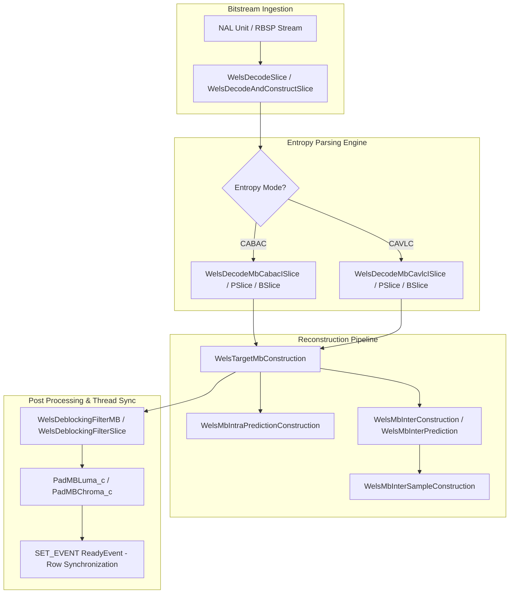
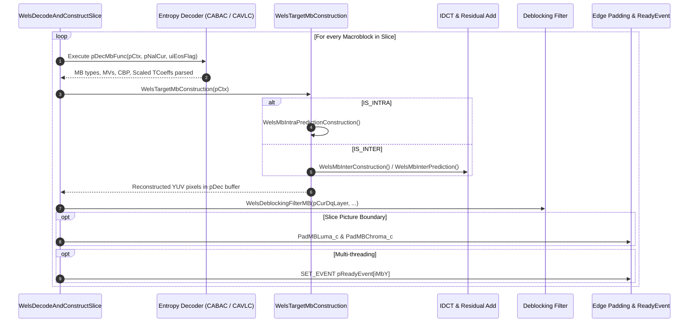
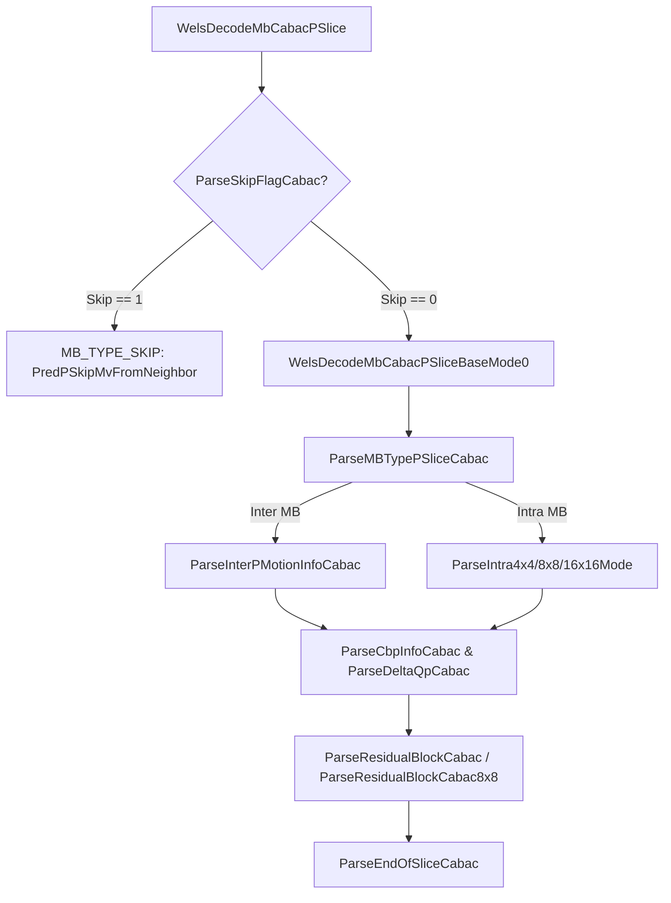
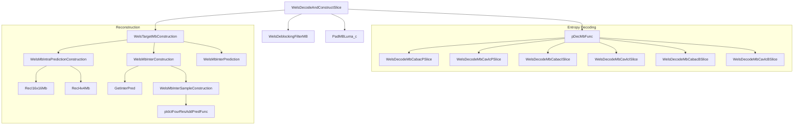

# Literate Programming Documentation: `decode_slice.cpp`

* **Source File**: [`codec/decoder/core/src/decode_slice.cpp`](openh264/codec/decoder/core/src/decode_slice.cpp)
* **Header File**: [`codec/decoder/core/inc/decode_slice.h`](openh264/codec/decoder/core/inc/decode_slice.h)
* **Module**: OpenH264 Video Decoder Core — Slice & Macroblock Decoding and Reconstruction Engine
* **Namespace**: `WelsDec`

---

## Table of Contents

1. [Architectural Overview & Module Purpose](#1-architectural-overview--module-purpose)
2. [Data Structures, Enums, Typedefs & Lookups](#2-data-structures-enums-typedefs--lookups)
3. [Control & Data Flow Architecture](#3-control--data-flow-architecture)
4. [Detailed Function & Method Analysis](#4-detailed-function--method-analysis)
   - [4.1 Reference Validation & Scaling Utilities](#41-reference-validation--scaling-utilities)
   - [4.2 Inverse DC Transform & Dequantization Kernels](#42-inverse-dc-transform--dequantization-kernels)
   - [4.3 Neighbor Availability & Intra Prediction Mode Parsing](#43-neighbor-availability--intra-prediction-mode-parsing)
   - [4.4 CABAC Slice & Macroblock Decoding Pipeline](#44-cabac-slice--macroblock-decoding-pipeline)
   - [4.5 CAVLC Slice & Macroblock Decoding Pipeline](#45-cavlc-slice--macroblock-decoding-pipeline)
   - [4.6 Macroblock & Slice Reconstruction Engines](#46-macroblock--slice-reconstruction-engines)
   - [4.7 Memory Zeroing & CPU Feature Initialization](#47-memory-zeroing--cpu-feature-initialization)
5. [SIMD & Assembly Optimization Architecture](#5-simd--assembly-optimization-architecture)
6. [Call Graph & Execution Dynamics](#6-call-graph--execution-dynamics)
7. [Error Handling & Resiliency Model](#7-error-handling--resiliency-model)

---

## 1. Architectural Overview & Module Purpose

The source file [`decode_slice.cpp`](openh264/codec/decoder/core/src/decode_slice.cpp) forms the central execution pipeline of the OpenH264 decoding engine. It bridges bitstream entropy parsing (CAVLC / CABAC) with spatial intra prediction, motion-compensated inter prediction, inverse quantization/IDCT reconstruction, in-loop deblocking filtering, edge sample padding, and multithreading synchronization.



### Key Responsibilities:
1. **Entropy Syntax Decoding**: Parses macroblock types (`uiMbType`), sub-macroblock partitions, motion vector differences (`MVD`), reference picture indices (`ref_idx`), intra prediction modes (Luma 4x4, 8x8, 16x16, Chroma), Coded Block Patterns (`CBP`), quantization parameter deltas (`mb_qp_delta`), and residual transform coefficient blocks.
2. **Dual Pipeline Support**:
   - **Two-Pass Pipeline** ([`WelsDecodeSlice`](openh264/codec/decoder/core/src/decode_slice.cpp#L1515-L1618) followed by [`WelsTargetSliceConstruction`](openh264/codec/decoder/core/src/decode_slice.cpp#L81-L175)): Parses entire slice syntax before reconstructing pixel samples.
   - **Unified Single-Pass Pipeline** ([`WelsDecodeAndConstructSlice`](openh264/codec/decoder/core/src/decode_slice.cpp#L1620-L1782)): Interweaves entropy parsing, pixel reconstruction, deblocking filtering, frame boundary padding, and line-based multithreading ready event triggering on a per-macroblock basis.
3. **Hardware Acceleration Bridge**: Connects CPU architecture dispatchers ([`WelsBlockFuncInit`](openh264/codec/decoder/core/src/decode_slice.cpp#L2990-L3019)) to assembly kernels written in x86 SSE2, ARM NEON, and AArch64 NEON.

---

## 2. Data Structures, Enums, Typedefs & Lookups

### 2.1 Function Pointer Typedefs

* **[`PWelsDecMbFunc`](openh264/codec/decoder/core/inc/decode_slice.h#L49)**
  ```cpp
  typedef int32_t (*PWelsDecMbFunc) (PWelsDecoderContext pCtx, PNalUnit pNalCur, uint32_t& uiEosFlag);
  ```
  * **Role**: Dynamic macroblock decoder function pointer. Bound per slice depending on the active entropy coding mode (`bEntropyCodingModeFlag`: CAVLC vs CABAC) and slice type (`I_SLICE`, `P_SLICE`, `B_SLICE`).

### 2.2 Core Context Pointers & Composite Structures

| Structure / Type | Source Location | Description |
| :--- | :--- | :--- |
| **[`SWelsDecoderContext`](openh264/codec/decoder/core/inc/decoder_context.h)** (`PWelsDecoderContext`) | [`decoder_context.h`](openh264/codec/decoder/core/inc/decoder_context.h) | Master runtime decoder state holding DPB, reference picture lists (`sRefPic`), CABAC decoder engine (`pCabacDecEngine`), scaling lists, and function tables. |
| **[`SDqLayer`](openh264/codec/decoder/core/inc/decoder_core.h)** (`PDqLayer`) | [`decoder_core.h`](openh264/codec/decoder/core/inc/decoder_core.h) | Active spatial dependency layer representation containing MB raster coordinates (`iMbX`, `iMbY`, `iMbXyIndex`), residual coefficient buffers (`pScaledTCoeff`), non-zero coefficient counts (`pNzc`), and slice headers. |
| **[`SSlice`](openh264/codec/decoder/core/inc/slice.h)** (`PSlice`) | [`slice.h`](openh264/codec/decoder/core/inc/slice.h) | Slice runtime descriptor containing total MB counts (`iTotalMbInCurSlice`), last QP state (`iLastMbQp`, `iLastDeltaQp`), and skip run counter (`iMbSkipRun`). |
| **[`SWelsNeighAvail`](openh264/codec/decoder/core/inc/decoder_context.h)** (`PWelsNeighAvail`) | [`decoder_context.h`](openh264/codec/decoder/core/inc/decoder_context.h) | Neighboring macroblock availability mask for spatial prediction (`iLeftAvail`, `iTopAvail`, `iLeftTopAvail`, `iRightTopAvail`). |
| **[`SBitStringAux`](openh264/codec/decoder/core/inc/bit_stream.h)** (`PBitStringAux`) | [`bit_stream.h`](openh264/codec/decoder/core/inc/bit_stream.h) | Bitstream reader tracking buffer pointers (`pStartBuf`, `pCurBuf`, `pEndBuf`), cached bit values, and remaining bit counts (`iLeftBits`). |

### 2.3 Internal Lookups and Scan Orders

The module utilizes precomputed scanning and mapping tables:
* **`g_kuiMbCountScan4Idx`**: Maps 4x4 sub-block raster indices to internal 4x4 cache scanning positions.
* **`g_kuiZigzagScan` & `g_kuiZigzagScan8x8`**: Standard H.264 4x4 and 8x8 zigzag transform scan order tables.
* **`g_kuiLumaDcZigzagScan` & `g_kuiChromaDcScan`**: Zigzag scan orders for Intra 16x16 luma DC (4x4) and chroma DC (2x2) matrices.
* **`g_kuiI16CbpTable`**: Look-up table mapping Intra 16x16 macroblock mode indices $(0 \dots 23)$ to their corresponding coded block patterns ($0$, $15$, $31$, $47$).
* **`g_kuiChromaQpTable`**: Standard H.264 chroma quantization parameter lookup mapping $QP_{\text{luma}} \in [0, 51]$ to $QP_{\text{chroma}} \in [0, 39]$.

---

## 3. Control & Data Flow Architecture

The decoding execution path switches between single-pass interleaved decoding/construction and two-pass decoupled parsing/construction:



---

## 4. Detailed Function & Method Analysis

### 4.1 Reference Validation & Scaling Utilities

#### [`CheckRefPics`](openh264/codec/decoder/core/src/decode_slice.cpp#L59-L79)
```cpp
static bool CheckRefPics (const PWelsDecoderContext& pCtx);
```
* **Purpose**: Verifies that all referenced picture slots within active reference picture lists (`LIST_0`, and `LIST_1` if decoding a `B_SLICE`) are non-null and valid before performing inter-frame motion compensation.
* **Algorithm**:
  1. Sets `listCount = 1` for `P_SLICE` or `2` for `B_SLICE`.
  2. Iterates over each active list:
     - Checks `pCtx->sRefPic.pShortRefList[list][0 ... uiShortRefCount-1]`.
     - Checks `pCtx->sRefPic.pLongRefList[list][0 ... uiLongRefCount-1]`.
  3. Returns `false` immediately if any active reference picture pointer is `NULL`; returns `true` otherwise.

#### [`ComputeColocatedTemporalScaling`](openh264/codec/decoder/core/src/decode_slice.cpp#L3041-L3066)
```cpp
bool ComputeColocatedTemporalScaling (PWelsDecoderContext pCtx);
```
* **Purpose**: Precalculates the temporal direct motion vector scaling factors `iMvScale[LIST_0][i]` for B-slices as defined in **ITU-T H.264 Clause 8.4.1.2.3**.
* **Mathematical Formulation**:
  Let $POC_{\text{curr}}$ be the picture order count of the current frame, $POC_{L0}$ be the POC of the List 0 reference picture, and $POC_{L1}$ be the POC of the List 1 collocated reference picture:
  $$tb = \text{Clip3}\left(-128, 127, POC_{\text{curr}} - POC_{L0}\right)$$
  $$td = \text{Clip3}\left(-128, 127, POC_{L1} - POC_{L0}\right)$$
  If $td = 0$, direct scaling defaults to $256$ ($1 \ll 8$). Otherwise:
  $$tx = \frac{16384 + (|td| \gg 1)}{td}$$
  $$\text{ScaleFactor} = \text{Clip3}\left(-1024, 1023, (tb \cdot tx + 32) \gg 6\right)$$
* **Return Value**: Returns `true`.

#### [`WelsCalcDeqCoeffScalingList`](openh264/codec/decoder/core/src/decode_slice.cpp#L1486-L1513)
```cpp
int32_t WelsCalcDeqCoeffScalingList (PWelsDecoderContext pCtx);
```
* **Purpose**: Generates and caches dequantization coefficient tables (`pDequant_coeff4x4` and `pDequant_coeff8x8`) when custom sequence or picture scaling matrices are enabled (`bSeqScalingMatrixPresentFlag` or `bPicScalingMatrixPresentFlag`).

---

### 4.2 Inverse DC Transform & Dequantization Kernels

#### [`WelsLumaDcDequantIdct`](openh264/codec/decoder/core/src/decode_slice.cpp#L246-L286)
```cpp
void WelsLumaDcDequantIdct (int16_t* pBlock, int32_t iQp, PWelsDecoderContext pCtx);
```
* **Purpose**: Computes dequantization followed by a 4x4 Inverse Hadamard Transform on the 16 DC coefficients of an `Intra_16x16` luma macroblock.
* **Mathematical Implementation**:
  Given dequantization scaling multiplier $Q_{\text{mul}}$:
  $$Q_{\text{mul}} = \begin{cases} \text{pCtx->pDequant\_coeff4x4}[0][QP][0], & \text{if } bUseScalingList \\ g\_kuiDequantCoeff[QP][0] \ll 4, & \text{otherwise} \end{cases}$$

  1. **Horizontal 1D Butterfly**:
     For each row $i \in [0, 3]$:
     $$Z_0 = \text{pBlk}[0] + \text{pBlk}[2], \quad Z_1 = \text{pBlk}[0] - \text{pBlk}[2]$$
     $$Z_2 = \text{pBlk}[1] - \text{pBlk}[3], \quad Z_3 = \text{pBlk}[1] + \text{pBlk}[3]$$
     $$iTemp[4i + 0] = Z_0 + Z_3, \quad iTemp[4i + 1] = Z_1 + Z_2$$
     $$iTemp[4i + 2] = Z_1 - Z_2, \quad iTemp[4i + 3] = Z_0 - Z_3$$

  2. **Vertical 1D Butterfly with Dequantization Scaling**:
     For each column $j \in [0, 3]$:
     $$Z_0 = iTemp[j] + iTemp[4 + j], \quad Z_1 = iTemp[j] - iTemp[4 + j]$$
     $$Z_2 = iTemp[8 + j] - iTemp[12 + j], \quad Z_3 = iTemp[8 + j] + iTemp[12 + j]$$
     $$\text{pBlk}[\text{offset}_k] = \left( (Z_{\text{comb}} \cdot Q_{\text{mul}} + 32) \gg 6 \right)$$

#### [`WelsChromaDcIdct`](openh264/codec/decoder/core/src/decode_slice.cpp#L359-L380)
```cpp
void WelsChromaDcIdct (int16_t* pBlock);
```
* **Purpose**: Performs a 2x2 Inverse Hadamard Transform on chroma DC coefficients ($Cb$ or $Cr$).
* **Mathematical Implementation**:
  Given inputs $A = p[0], B = p[16], C = p[32], D = p[48]$:
  $$E = A - B, \quad A' = A + B, \quad B' = C - D, \quad C' = C + D$$
  $$p[0] = A' + C', \quad p[16] = E + B', \quad p[32] = A' - C', \quad p[48] = E - B'$$

---

### 4.3 Neighbor Availability & Intra Prediction Mode Parsing

#### Neighbor Availability Mappers
* **[`WelsMapNxNNeighToSampleNormal`](openh264/codec/decoder/core/src/decode_slice.cpp#L382-L401)** & **[`WelsMapNxNNeighToSampleConstrain1`](openh264/codec/decoder/core/src/decode_slice.cpp#L403-L422)**:
  Populate the sample availability matrix `pSampleAvail[30]` for 4x4 / 8x8 intra prediction. In `Constrain1` mode (`bConstainedIntraPredFlag = 1`), neighbor blocks coded with inter prediction (`IS_INTER`) are marked unavailable to prevent error propagation from inter frames into intra-coded regions.
* **[`WelsMap16x16NeighToSampleNormal`](openh264/codec/decoder/core/src/decode_slice.cpp#L423-L433)** & **[`WelsMap16x16NeighToSampleConstrain1`](openh264/codec/decoder/core/src/decode_slice.cpp#L435-L445)**:
  Pack neighbor availability flags for `Intra_16x16` into bitmask `uiNeighAvail` ($\text{bit}_2 = \text{Left}, \text{bit}_1 = \text{Top-Left}, \text{bit}_0 = \text{Top}$).

#### Intra Mode Parsers
* **[`ParseIntra4x4Mode`](openh264/codec/decoder/core/src/decode_slice.cpp#L447-L523)**: Decodes 16 luma prediction modes using predicted mode $\text{PredMode} = \min(A, B)$. Decodes `prev_intra4x4_pred_mode_flag` and `rem_intra4x4_pred_mode`, validating against sample availability via [`CheckIntraNxNPredMode`](openh264/codec/decoder/core/inc/get_intra_predictor.h). Parses chroma prediction mode.
* **[`ParseIntra8x8Mode`](openh264/codec/decoder/core/src/decode_slice.cpp#L525-L608)**: Decodes 4 luma 8x8 modes, assigns them across 4x4 sub-block arrays, and parses chroma prediction mode.
* **[`ParseIntra16x16Mode`](openh264/codec/decoder/core/src/decode_slice.cpp#L610-L644)**: Validates `Intra_16x16` prediction mode availability via [`CheckIntra16x16PredMode`](openh264/codec/decoder/core/inc/get_intra_predictor.h) and parses chroma mode.

---

### 4.4 CABAC Slice & Macroblock Decoding Pipeline



* **[`WelsDecodeMbCabacISlice`](openh264/codec/decoder/core/src/decode_slice.cpp#L853-L856)** & **[`WelsDecodeMbCabacISliceBaseMode0`](openh264/codec/decoder/core/src/decode_slice.cpp#L646-L851)**:
  Parses I-slice macroblocks encoded with CABAC. Decodes `mb_type` (`ParseMBTypeISliceCabac`). Supports `I_PCM` (reading raw uncompressed byte payloads), `Intra_4x4`, `Intra_8x8`, and `Intra_16x16`. Decodes CABAC residual blocks for Luma DC, Luma AC, Chroma DC, and Chroma AC.
* **[`WelsDecodeMbCabacPSlice`](openh264/codec/decoder/core/src/decode_slice.cpp#L1337-L1399)** & **[`WelsDecodeMbCabacPSliceBaseMode0`](openh264/codec/decoder/core/src/decode_slice.cpp#L858-L1093)**:
  Decodes P-slice macroblocks. Reads CABAC skip flag via `ParseSkipFlagCabac`. For non-skip MBs, parses P-slice macroblock type (`ParseMBTypePSliceCabac`), motion vector info (`ParseInterPMotionInfoCabac`), or falls back to intra mode parsing.
* **[`WelsDecodeMbCabacBSlice`](openh264/codec/decoder/core/src/decode_slice.cpp#L1402-L1483)** & **[`WelsDecodeMbCabacBSliceBaseMode0`](openh264/codec/decoder/core/src/decode_slice.cpp#L1095-L1334)**:
  Decodes B-slice macroblocks. For skip MBs, marks `MB_TYPE_SKIP | MB_TYPE_DIRECT` and evaluates Spatial Direct (`PredMvBDirectSpatial`) or Temporal Direct (`PredBDirectTemporal`) prediction. For non-skip MBs, decodes B-slice inter motion info (`ParseInterBMotionInfoCabac`).

---

### 4.5 CAVLC Slice & Macroblock Decoding Pipeline

* **[`WelsActualDecodeMbCavlcISlice`](openh264/codec/decoder/core/src/decode_slice.cpp#L1784-L2064)** & **[`WelsDecodeMbCavlcISlice`](openh264/codec/decoder/core/src/decode_slice.cpp#L2066-L2105)**:
  Parses CAVLC I-slice macroblocks using Exp-Golomb bitstream routines (`BsGetUe`, `BsGetSe`, `BsGetBits`). Ingests raw byte streams for `I_PCM`, maps CBP tables (`g_kuiIntra4x4CbpTable`), and decodes residual coefficient tokens via [`WelsResidualBlockCavlc`](openh264/codec/decoder/core/inc/parse_mb_syn_cavlc.h).
* **[`WelsActualDecodeMbCavlcPSlice`](openh264/codec/decoder/core/src/decode_slice.cpp#L2107-L2441)** & **[`WelsDecodeMbCavlcPSlice`](openh264/codec/decoder/core/src/decode_slice.cpp#L2443-L2535)**:
  Handles CAVLC `mb_skip_run` tracking. For skipped macroblocks, derives predicted motion vectors via [`PredPSkipMvFromNeighbor`](openh264/codec/decoder/core/inc/mv_pred.h). For non-skip macroblocks, parses inter motion vectors and reference indices via [`ParseInterInfo`](openh264/codec/decoder/core/inc/parse_mb_syn_cavlc.h).
* **[`WelsActualDecodeMbCavlcBSlice`](openh264/codec/decoder/core/src/decode_slice.cpp#L2654-L2988)** & **[`WelsDecodeMbCavlcBSlice`](openh264/codec/decoder/core/src/decode_slice.cpp#L2537-L2652)**:
  Parses B-slice CAVLC macroblocks, supporting bidirectional inter prediction (`ParseInterBInfo`) and direct temporal/spatial skip derivation.

---

### 4.6 Macroblock & Slice Reconstruction Engines

#### [`WelsMbInterSampleConstruction`](openh264/codec/decoder/core/src/decode_slice.cpp#L177-L209)
```cpp
int32_t WelsMbInterSampleConstruction (PWelsDecoderContext pCtx, PDqLayer pCurDqLayer,
                                       uint8_t* pDstY, uint8_t* pDstU, uint8_t* pDstV,
                                       int32_t iStrideL, int32_t iStrideC);
```
* **Purpose**: Adds inverse-quantized/IDCT residual transform coefficient blocks (`pScaledTCoeff`) onto the motion-compensated prediction samples in destination frame buffers `pDstY`, `pDstU`, `pDstV`.
* **Transform Paths**:
  - **8x8 Transform** (`pTransformSize8x8Flag = true`): Evaluates non-zero coefficient counts for four 8x8 blocks, invoking `pCtx->pIdctResAddPredFunc8x8`.
  - **4x4 Transform**: Invokes `pCtx->pIdctFourResAddPredFunc` for the four 4x4 luma blocks, followed by Cb and Cr chroma planes.

#### [`WelsMbInterConstruction`](openh264/codec/decoder/core/src/decode_slice.cpp#L210-L244) & [`WelsMbInterPrediction`](openh264/codec/decoder/core/src/decode_slice.cpp#L304-L332)
* **Purpose**: Coordinates motion compensation and sample reconstruction.
* **Algorithm**:
  1. Computes destination plane base addresses:
     $$pDstY = \text{pData}[0] + ((iMbY \cdot iLumaStride + iMbX) \ll 4)$$
     $$pDstCb = \text{pData}[1] + ((iMbY \cdot iChromaStride + iMbX) \ll 3)$$
     $$pDstCr = \text{pData}[2] + ((iMbY \cdot iChromaStride + iMbX) \ll 3)$$
  2. Dispatches motion compensation:
     - If `P_SLICE`: Calls [`GetInterPred`](openh264/codec/decoder/core/inc/rec_mb.h).
     - If `B_SLICE`: Calls [`GetInterBPred`](openh264/codec/decoder/core/inc/rec_mb.h) using temporary frame allocation `pTempDec`.
  3. `WelsMbInterConstruction` adds residual IDCT samples via `WelsMbInterSampleConstruction`.

#### [`WelsTargetMbConstruction`](openh264/codec/decoder/core/src/decode_slice.cpp#L334-L357)
```cpp
int32_t WelsTargetMbConstruction (PWelsDecoderContext pCtx);
```
* **Purpose**: Master macroblock reconstruction router.
* **Dispatch Table**:
  - `MB_TYPE_INTRA_PCM`: No-op (raw samples copied during parsing).
  - `IS_INTRA(...)`: Invokes [`WelsMbIntraPredictionConstruction`](openh264/codec/decoder/core/src/decode_slice.cpp#L288-L302).
  - `IS_INTER(...)`: If `uiCbp == 0`, verifies reference pictures via `CheckRefPics` and calls `WelsMbInterPrediction`; otherwise calls `WelsMbInterConstruction`.

#### [`WelsDecodeAndConstructSlice`](openh264/codec/decoder/core/src/decode_slice.cpp#L1620-L1782)
```cpp
int32_t WelsDecodeAndConstructSlice (PWelsDecoderContext pCtx);
```
* **Purpose**: High-throughput unified slice decoder combining entropy parsing, sample reconstruction, macroblock deblocking filtering, frame edge sample padding, and multithreading synchronization.

---

### 4.7 Memory Zeroing & CPU Feature Initialization

#### [`WelsBlockFuncInit`](openh264/codec/decoder/core/src/decode_slice.cpp#L2990-L3019)
```cpp
void WelsBlockFuncInit (SBlockFunc* pFunc, int32_t iCpu);
```
* **Purpose**: Dynamically binds memory zeroing and non-zero coefficient counting function pointers based on hardware SIMD capabilities (`iCpu`).

| Function Pointer | C Reference Implementation | x86 SSE2 Kernel | ARM NEON Kernel | AArch64 NEON Kernel |
| :--- | :--- | :--- | :--- | :--- |
| `pWelsSetNonZeroCountFunc` | `WelsNonZeroCount_c` | `WelsNonZeroCount_sse2` | `WelsNonZeroCount_neon` | `WelsNonZeroCount_AArch64_neon` |
| `pWelsBlockZero16x16Func` | [`WelsBlockZero16x16_c`](openh264/codec/decoder/core/src/decode_slice.cpp#L3030-L3032) | `WelsBlockZero16x16_sse2` | `WelsBlockZero16x16_neon` | `WelsBlockZero16x16_AArch64_neon` |
| `pWelsBlockZero8x8Func` | [`WelsBlockZero8x8_c`](openh264/codec/decoder/core/src/decode_slice.cpp#L3034-L3036) | `WelsBlockZero8x8_sse2` | `WelsBlockZero8x8_neon` | `WelsBlockZero8x8_AArch64_neon` |

---

## 5. SIMD & Assembly Optimization Architecture

The compute-heavy inner loops invoked throughout [`decode_slice.cpp`](openh264/codec/decoder/core/src/decode_slice.cpp) utilize SIMD assembly vector instructions:

1. **4x4 IDCT & Add Prediction** (`pIdctFourResAddPredFunc`):
   - Computes four 4x4 IDCT transforms concurrently inside 128-bit XMM / NEON vector registers.
   - Adds residual values to $8$-bit unsigned prediction pixel bytes with saturated arithmetic (`paddsw`, `packuswb` on x86; `vqadd`, `vqmovun` on ARM).
2. **Block Zeroing**:
   - `WelsBlockZero16x16_sse2`: Uses `pxor` / `movdqa` instructions to zero 512 bytes (16x16 `int16_t` block) in 32 vector stores.
3. **Non-Zero Count Bitmask Vectorization**:
   - Compares 16 non-zero count coefficients against zero in parallel using SIMD byte masks (`pcmpeqb`), reducing branch mispredictions in deblocking filter strength derivation.

---

## 6. Call Graph & Execution Dynamics



---

## 7. Error Handling & Resiliency Model

`decode_slice.cpp` implements robust error detection to protect against corrupt bitstreams and out-of-bounds network NAL packets:

1. **Bitstream Underflow & Incompleteness**:
   Monitors consumed bits ($iUsedBits$) against available bitstream size (`pBs->iBits`). If incomplete, returns `ERR_INFO_BS_INCOMPLETE`.
2. **Invalid Parameter Sets & Ranges**:
   - Macroblock types (`uiMbType > 25`): returns `ERR_INFO_INVALID_MB_TYPE`.
   - Quantization Parameter Delta out-of-bounds ($iQpDelta \notin [-26, 25]$): returns `ERR_INFO_INVALID_QP`.
   - Invalid Intra prediction modes: returns `ERR_INFO_INVALID_I4x4_PRED_MODE` or `ERR_INFO_INVALID_I16x16_PRED_MODE`.
   - Out-of-bounds Coded Block Pattern (`uiCbp > 47`): returns `ERR_INFO_INVALID_CBP`.
3. **Reference Picture Loss Concealment**:
   Tracks missing reference pictures (`bMbRefConcealed`). If reference frames are lost or corrupted, marks macroblock concealment flags (`pMbRefConcealedFlag`), increments concealment counters (`iMbEcedPropNum`), and coordinates with spatial/temporal error concealment handlers in [`error_concealment.cpp`](openh264/codec/decoder/core/src/error_concealment.cpp).
