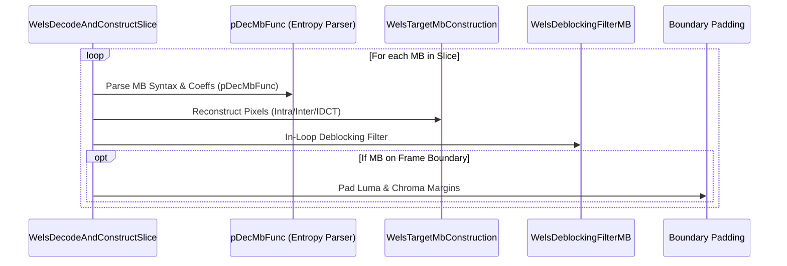
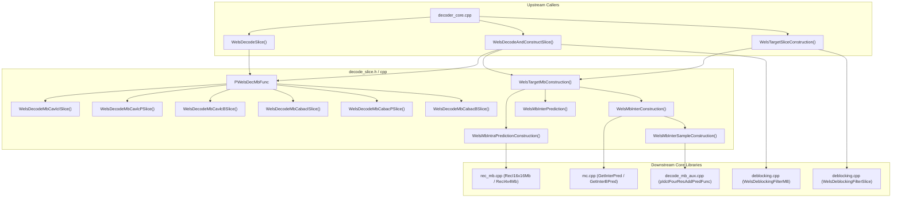

# OpenH264 Decoder: Slice Decoding & Macroblock Reconstruction Pipeline (`decode_slice.h`)

This document provides a comprehensive, literate-programming-style technical breakdown of the slice decoding and macroblock reconstruction pipeline declared in [decode_slice.h](openh264/codec/decoder/core/inc/decode_slice.h) and implemented in [decode_slice.cpp](openh264/codec/decoder/core/src/decode_slice.cpp).

---

## Table of Contents
1. [Module Overview & Architectural Purpose](#1-module-overview--architectural-purpose)
2. [Data Types & Function Pointer Signatures](#2-data-types--function-pointer-signatures)
3. [Slice Decoding & Construction Orchestration](#3-slice-decoding--construction-orchestration)
4. [Entropy Macroblock Decoding (CAVLC & CABAC)](#4-entropy-macroblock-decoding-cavlc--cabac)
5. [Macroblock Reconstruction & Transform Primitives](#5-macroblock-reconstruction--transform-primitives)
6. [Mathematical Formulations](#6-mathematical-formulations)
7. [SIMD Optimization & Block Zeroing Functions](#7-simd-optimization--block-zeroing-functions)
8. [Call Graph & Subsystem Interactions](#8-call-graph--subsystem-interactions)

---

## 1. Module Overview & Architectural Purpose

In the H.264/AVC and SVC decoding pipeline of OpenH264, [decode_slice.h](openh264/codec/decoder/core/inc/decode_slice.h) acts as the **central operational nexus** between bitstream entropy parsing and physical pixel reconstruction.

```mermaid
flowchart TD
    subgraph Bitstream Input
        NAL[NAL Unit Stream / SNalUnit] --> SliceHeader[Slice Header Parsing]
    end

    subgraph Slice Decoding Pipeline
        SliceHeader --> SliceLoop{Slice Decoding Dispatch}
        SliceLoop -->|Decoupled Parsing| WelsDecodeSlice["WelsDecodeSlice()"]
        SliceLoop -->|Unified Pass| WelsDecodeAndConstructSlice["WelsDecodeAndConstructSlice()"]
        SliceLoop -->|Separate Construction| WelsTargetSliceConstruction["WelsTargetSliceConstruction()"]
    end

    subgraph Macroblock Entropy Parsing
        WelsDecodeSlice --> MBFunc[PWelsDecMbFunc]
        WelsDecodeAndConstructSlice --> MBFunc
        MBFunc -->|CAVLC I/P/B| CAVLC["WelsDecodeMbCavlc[I|P|B]Slice()"]
        MBFunc -->|CABAC I/P/B| CABAC["WelsDecodeMbCabac[I|P|B]Slice()"]
    end

    subgraph Macroblock Reconstruction
        WelsTargetSliceConstruction --> TargetMB["WelsTargetMbConstruction()"]
        WelsDecodeAndConstructSlice --> TargetMB
        TargetMB -->|Intra MB| RecIntra["WelsMbIntraPredictionConstruction()"]
        TargetMB -->|Inter MB (CBP > 0)| RecInter["WelsMbInterConstruction()"]
        TargetMB -->|Inter MB (CBP == 0)| PredInter["WelsMbInterPrediction()"]
        RecInter --> AddResidual["WelsMbInterSampleConstruction()"]
    end

    subgraph Filtering & DPB Output
        RecIntra --> Deblock[WelsDeblockingFilterMB / Slice]
        RecInter --> Deblock
        PredInter --> Deblock
        Deblock --> PicBuff[Decoded Picture Buffer / DPB]
    end
```

### Architectural Responsibilities
1. **Slice-Level Decoding Control**: Iterates over macroblocks (MBs) in raster-scan order or according to Flexible Macroblock Ordering (FMO) slice group maps.
2. **Entropy Parsing Dispatch**: Dynamically assigns macroblock decoding function pointers ([PWelsDecMbFunc](openh264/codec/decoder/core/inc/decode_slice.h#L49)) based on the active slice type (`I_SLICE`, `P_SLICE`, `B_SLICE`) and entropy coding mode (`bEntropyCodingModeFlag`: CAVLC vs CABAC).
3. **Macroblock Pixel Reconstruction**: Orchestrates spatial intra prediction, inter-frame motion compensation, inverse quantization, and inverse transforms (4x4 IDCT, 8x8 IDCT, 4x4 Luma DC Hadamard, 2x2 Chroma DC Hadamard).
4. **Deblocking & Frame Boundary Padding**: Applies in-loop deblocking filtering ([WelsDeblockingFilterMB](openh264/codec/decoder/core/inc/deblocking.h)) and edge padding for reference picture motion compensation.

---

## 2. Data Types & Function Pointer Signatures

### 2.1 The Macroblock Decoder Function Pointer: `PWelsDecMbFunc`

```cpp
typedef int32_t (*PWelsDecMbFunc) (PWelsDecoderContext pCtx, PNalUnit pNalCur, uint32_t& uiEosFlag);
```

Declared at [decode_slice.h:L49](openh264/codec/decoder/core/inc/decode_slice.h#L49), `PWelsDecMbFunc` provides polymorphic dispatch for macroblock bitstream parsing.

| Parameter | Type | Description |
| :--- | :--- | :--- |
| `pCtx` | `PWelsDecoderContext` | Pointer to the active decoder context ([SWelsDecoderContext](openh264/codec/decoder/core/inc/decoder_context.h#L306-L455)). Contains the current dependency layer context (`pCurDqLayer`), active parameter sets (`pSps`, `pPps`), reference lists (`sRefPic`), and bitstream reader (`pBitStringAux`). |
| `pNalCur` | `PNalUnit` | Pointer to the current NAL unit descriptor ([SNalUnit](openh264/codec/decoder/core/inc/nalu.h)). |
| `uiEosFlag` | `uint32_t&` | **Output reference flag**. Set to `1` when the end of the current slice is reached (either via bitstream exhaustion or explicit `end_of_slice_flag` in CABAC). |

**Return Value**: `ERR_NONE` (`0`) on success, or a bitmask error code (e.g. `ERR_INFO_INVALID_MB_TYPE`, `ERR_INFO_BS_INCOMPLETE`).

#### Concrete Function Assignments

| Slice Type | CAVLC Mode (`bEntropyCodingModeFlag == 0`) | CABAC Mode (`bEntropyCodingModeFlag == 1`) |
| :--- | :--- | :--- |
| **I Slice** | [WelsDecodeMbCavlcISlice](openh264/codec/decoder/core/inc/decode_slice.h#L41) | [WelsDecodeMbCabacISlice](openh264/codec/decoder/core/inc/decode_slice.h#L51) |
| **P Slice** | [WelsDecodeMbCavlcPSlice](openh264/codec/decoder/core/inc/decode_slice.h#L44) | [WelsDecodeMbCabacPSlice](openh264/codec/decoder/core/inc/decode_slice.h#L52) |
| **B Slice** | [WelsDecodeMbCavlcBSlice](openh264/codec/decoder/core/inc/decode_slice.h#L47) | [WelsDecodeMbCabacBSlice](openh264/codec/decoder/core/inc/decode_slice.h#L53) |

---

### 2.2 Block Initialization Structure: `SBlockFunc`

Defined in [decoder_context.h:L213-L217](openh264/codec/decoder/core/inc/decoder_context.h#L213-L217) and initialized via [WelsBlockFuncInit](openh264/codec/decoder/core/inc/decode_slice.h#L96):

```cpp
typedef void (*PWelsNonZeroCountFunc) (int8_t* pNonZeroCount);
typedef void (*PWelsBlockZeroFunc) (int16_t* block, int32_t stride);

typedef struct TagBlockFunc {
  PWelsNonZeroCountFunc pWelsSetNonZeroCountFunc;
  PWelsBlockZeroFunc    pWelsBlockZero16x16Func;
  PWelsBlockZeroFunc    pWelsBlockZero8x8Func;
} SBlockFunc;
```

* **`pWelsSetNonZeroCountFunc`**: Normalizes non-zero coefficient counts (`pNzc`) across all 4x4 sub-blocks to boolean flags (`0` or `1`) for fast deblocking boundary strength determination.
* **`pWelsBlockZero16x16Func`**: Clears a 16x16 matrix of 16-bit transform coefficients (`int16_t[256]`) to zero with SIMD optimization.
* **`pWelsBlockZero8x8Func`**: Clears an 8x8 matrix of 16-bit transform coefficients (`int16_t[64]`) to zero.

---

## 3. Slice Decoding & Construction Orchestration

### 3.1 `WelsDecodeSlice`
[decode_slice.h:L60](openh264/codec/decoder/core/inc/decode_slice.h#L60) | [decode_slice.cpp:L1515-L1618](openh264/codec/decoder/core/src/decode_slice.cpp#L1515-L1618)

```cpp
int32_t WelsDecodeSlice (PWelsDecoderContext pCtx, bool bFirstSliceInLayer, PNalUnit pNalCur);
```

#### Pipeline Steps
1. **Entropy Engine Selection**: Reads `pPps->bEntropyCodingModeFlag`. If CABAC is enabled, verifies that adaptive inter-layer prediction flags are disabled (unsupported in baseline CABAC) and initializes the arithmetic decoding state registers via `InitCabacDecEngineFromBS`.
2. **Neighbor Availability Configuration**: Configures constrained intra prediction tables:
   * If `bConstainedIntraPredFlag == 1`, installs [WelsMapNxNNeighToSampleConstrain1](openh264/codec/decoder/core/src/decode_slice.cpp#L403) and [WelsFillCacheConstrain1IntraNxN](openh264/codec/decoder/core/src/rec_mb.cpp) (intra prediction cannot reference inter-coded neighbors).
   * Otherwise, installs normal unconstrained mapping functions.
3. **Scaling Lists & Dequantization**: Invokes `WelsCalcDeqCoeffScalingList(pCtx)` to prepare dequantization factor tables.
4. **Macroblock Parsing Loop**: Iterates through macroblock indices `iNextMbXyIndex` starting at `pSliceHeader->iFirstMbInSlice`. Invokes `pDecMbFunc` for each MB until `uiEosFlag != 0` or the slice boundary is reached.

---

### 3.2 `WelsDecodeAndConstructSlice`
[decode_slice.h:L61](openh264/codec/decoder/core/inc/decode_slice.h#L61) | [decode_slice.cpp:L1620-L1782](openh264/codec/decoder/core/src/decode_slice.cpp#L1620-L1782)

```cpp
int32_t WelsDecodeAndConstructSlice (PWelsDecoderContext pCtx);
```

Unified single-pass slice pipeline that decodes syntax and immediately reconstructs pixels macroblock by macroblock:



---

### 3.3 `WelsTargetSliceConstruction`
[decode_slice.h:L58](openh264/codec/decoder/core/inc/decode_slice.h#L58) | [decode_slice.cpp:L81-L175](openh264/codec/decoder/core/src/decode_slice.cpp#L81-L175)

```cpp
int32_t WelsTargetSliceConstruction (PWelsDecoderContext pCtx);
```

Constructs all macroblocks in a decoded slice from previously parsed syntax and transform coefficients. Used when parsing and reconstruction are decoupled (such as in multithreaded slice decoding).
* Iterates across macroblocks in the slice, calling [WelsTargetMbConstruction](openh264/codec/decoder/core/inc/decode_slice.h#L63).
* Updates decoded MB tracking flags (`pMbCorrectlyDecodedFlag`, `iTotalNumMbRec`).
* Executes slice-level deblocking filtering via `WelsDeblockingFilterSlice(pCtx, pDeblockMb)`.

---

## 4. Entropy Macroblock Decoding (CAVLC & CABAC)

### 4.1 CAVLC Decoding Functions

```cpp
int32_t WelsActualDecodeMbCavlcISlice (PWelsDecoderContext pCtx);
int32_t WelsDecodeMbCavlcISlice (PWelsDecoderContext pCtx, PNalUnit pNalCur, uint32_t& uiEosFlag);

int32_t WelsActualDecodeMbCavlcPSlice (PWelsDecoderContext pCtx);
int32_t WelsDecodeMbCavlcPSlice (PWelsDecoderContext pCtx, PNalUnit pNalCur, uint32_t& uiEosFlag);

int32_t WelsActualDecodeMbCavlcBSlice (PWelsDecoderContext pCtx);
int32_t WelsDecodeMbCavlcBSlice (PWelsDecoderContext pCtx, PNalUnit pNalCur, uint32_t& uiEosFlag);
```

* **`WelsDecodeMbCavlc[I|P|B]Slice`**: Top-level wrappers.
  1. Checks `bAdaptiveBaseModeFlag` (returns `ERR_INFO_UNSUPPORTED_ILP` if inter-layer prediction is requested).
  2. Invokes `WelsActualDecodeMbCavlc[I|P|B]Slice(pCtx)`.
  3. Calculates total bitstream bits consumed:
     $$\text{UsedBits} = \left( (pBs\text{->}pCurBuf - pBs\text{->}pStartBuf) \ll 3 \right) - (16 - pBs\text{->}iLeftBits)$$
  4. If $\text{UsedBits} == pBs\text{->}iBits - 1$, sets `uiEosFlag = 1` (slice boundary). If $\text{UsedBits} > pBs\text{->}iBits - 1$, returns `ERR_INFO_BS_INCOMPLETE`.

* **`WelsActualDecodeMbCavlcISlice`**: Decodes Intra macroblock syntax (`mb_type`, `I_PCM`, `Intra4x4PredMode`, `Intra16x16PredMode`, chroma prediction mode, CBP, and residual transform blocks).
* **`WelsActualDecodeMbCavlcPSlice`**: Decodes P-slice macroblocks including `mb_skip_run`, motion vector differences (`mvd_l0`), reference frame indices (`ref_idx_l0`), and fallback intra modes.
* **`WelsActualDecodeMbCavlcBSlice`**: Decodes B-slice macroblocks including B-skip, B-direct (spatial/temporal), forward (List 0) and backward (List 1) reference indices and motion vectors.

---

### 4.2 CABAC Decoding Functions

```cpp
int32_t WelsDecodeMbCabacISlice (PWelsDecoderContext pCtx, PNalUnit pNalCur, uint32_t& uiEosFlag);
int32_t WelsDecodeMbCabacPSlice (PWelsDecoderContext pCtx, PNalUnit pNalCur, uint32_t& uiEosFlag);
int32_t WelsDecodeMbCabacBSlice (PWelsDecoderContext pCtx, PNalUnit pNalCur, uint32_t& uiEosFlag);

int32_t WelsDecodeMbCabacISliceBaseMode0 (PWelsDecoderContext pCtx, uint32_t& uiEosFlag);
int32_t WelsDecodeMbCabacPSliceBaseMode0 (PWelsDecoderContext pCtx, PWelsNeighAvail pNeighAvail, uint32_t& uiEosFlag);
int32_t WelsDecodeMbCabacBSliceBaseMode0 (PWelsDecoderContext pCtx, PWelsNeighAvail pNeighAvail, uint32_t& uiEosFlag);
```

* Interacts directly with the CABAC arithmetic engine [SWelsCabacDecEngine](openh264/codec/decoder/core/inc/decoder_context.h#L74-L81).
* Decodes macroblock syntax with context-adaptive binary arithmetic models:
  * `mb_skip_flag`
  * `mb_type` (via `ParseMBTypeISliceCabac`, `ParseMBTypePSliceCabac`, `ParseMBTypeBSliceCabac`)
  * `sub_mb_type`
  * `ref_idx_l0` / `ref_idx_l1`
  * `mvd_l0` / `mvd_l1`
  * `coded_block_pattern` (CBP)
  * `mb_qp_delta`
  * Residual coefficient blocks (`ParseResidualBlockCabac`)
  * Evaluates `end_of_slice_flag` via `ParseEndOfSliceCabac(pCtx, uiEosFlag)`.

---

## 5. Macroblock Reconstruction & Transform Primitives

### 5.1 `WelsTargetMbConstruction`
[decode_slice.h:L63](openh264/codec/decoder/core/inc/decode_slice.h#L63) | [decode_slice.cpp:L334-L357](openh264/codec/decoder/core/src/decode_slice.cpp#L334-L357)

```cpp
int32_t WelsTargetMbConstruction (PWelsDecoderContext pCtx);
```

Dispatches pixel reconstruction for the current macroblock based on its decoded macroblock type:

```cpp
if (MB_TYPE_INTRA_PCM == pCurDqLayer->pDec->pMbType[iMbXy]) {
    return ERR_NONE; // Already reconstructed during bitstream parsing
} else if (IS_INTRA (pCurDqLayer->pDec->pMbType[iMbXy])) {
    WelsMbIntraPredictionConstruction (pCtx, pCurDqLayer, 1);
} else if (IS_INTER (pCurDqLayer->pDec->pMbType[iMbXy])) {
    if (0 == pCurDqLayer->pCbp[iMbXy]) { // Skip or zero residual
        if (!CheckRefPics (pCtx)) return ERR_INFO_MB_RECON_FAIL;
        return WelsMbInterPrediction (pCtx, pCurDqLayer);
    } else {
        WelsMbInterConstruction (pCtx, pCurDqLayer);
    }
}
```

---

### 5.2 `WelsMbIntraPredictionConstruction`
[decode_slice.h:L65](openh264/codec/decoder/core/inc/decode_slice.h#L65) | [decode_slice.cpp:L288-L302](openh264/codec/decoder/core/src/decode_slice.cpp#L288-L302)

```cpp
int32_t WelsMbIntraPredictionConstruction (PWelsDecoderContext pCtx, PDqLayer pCurDqLayer, bool bOutput);
```

Reconstructs an Intra macroblock:
1. Calls `WelsFillRecNeededMbInfo` to populate neighboring reference samples.
2. Dispatches to spatial intra reconstruction routines:
   * **Intra 16x16**: Calls [RecI16x16Mb](openh264/codec/decoder/core/inc/rec_mb.h) (Vertical, Horizontal, DC, Plane).
   * **Intra 8x8**: Calls [RecI8x8Mb](openh264/codec/decoder/core/inc/rec_mb.h).
   * **Intra 4x4**: Calls [RecI4x4Mb](openh264/codec/decoder/core/inc/rec_mb.h) (9 directional prediction modes).

---

### 5.3 `WelsMbInterConstruction` & `WelsMbInterSampleConstruction`
[decode_slice.h:L66-L68](openh264/codec/decoder/core/inc/decode_slice.h#L66-L68) | [decode_slice.cpp:L177-L244](openh264/codec/decoder/core/src/decode_slice.cpp#L177-L244)

```cpp
int32_t WelsMbInterConstruction (PWelsDecoderContext pCtx, PDqLayer pCurDqLayer);
int32_t WelsMbInterSampleConstruction (PWelsDecoderContext pCtx, PDqLayer pCurDqLayer,
                                       uint8_t* pDstY, uint8_t* pDstU, uint8_t* pDstV,
                                       int32_t iStrideL, int32_t iStrideC);
```

* **`WelsMbInterConstruction`**:
  1. Computes destination frame pointers for luma ($Y$) and chroma ($Cb, Cr$).
  2. Executes motion compensation to populate prediction samples:
     * For `P_SLICE`: calls `GetInterPred(pDstY, pDstCb, pDstCr, pCtx)`.
     * For `B_SLICE`: calls `GetInterBPred(pDstYCbCr, pTempDstYCbCr, pCtx)`.
  3. Calls `WelsMbInterSampleConstruction` to perform inverse DCT and add residual samples to the prediction samples.
* **`WelsMbInterSampleConstruction`**:
  * For 8x8 Transform (`pTransformSize8x8Flag == true`): loops over four 8x8 blocks using `pCtx->pIdctResAddPredFunc8x8`.
  * For 4x4 Transform: adds four 4x4 luma residual blocks at a time via `pCtx->pIdctFourResAddPredFunc` for luma, Cb, and Cr planes.

---

### 5.4 `WelsMbInterPrediction`
[decode_slice.h:L70](openh264/codec/decoder/core/inc/decode_slice.h#L70) | [decode_slice.cpp:L304-L332](openh264/codec/decoder/core/src/decode_slice.cpp#L304-L332)

```cpp
int32_t WelsMbInterPrediction (PWelsDecoderContext pCtx, PDqLayer pCurDqLayer);
```

Handles Inter macroblocks when `CBP == 0` (no residual coefficients present, including Skip MBs). Motion compensation writes predicted pixel samples directly into the destination picture buffers.

---

## 6. Mathematical Formulations

### 6.1 Luma 4x4 DC Inverse Hadamard Transform (`WelsLumaDcDequantIdct`)
[decode_slice.h:L69](openh264/codec/decoder/core/inc/decode_slice.h#L69) | [decode_slice.cpp:L246-L286](openh264/codec/decoder/core/src/decode_slice.cpp#L246-L286)

Used in Intra 16x16 macroblocks to invert the 4x4 Hadamard transform applied to the 16 DC coefficients of the luma transform blocks.

Given the 4x4 input DC coefficient matrix $W_{DC}$, the 1D inverse transform butterfly computes:

$$\begin{aligned}
Z_0 &= W_{0,j} + W_{2,j} \\
Z_1 &= W_{0,j} - W_{2,j} \\
Z_2 &= W_{1,j} - W_{3,j} \\
Z_3 &= W_{1,j} + W_{3,j}
\end{aligned}$$

Intermediate horizontal transform outputs:
$$\begin{aligned}
T_{0,j} &= Z_0 + Z_3 \\
T_{1,j} &= Z_1 + Z_2 \\
T_{2,j} &= Z_1 - Z_2 \\
T_{3,j} &= Z_0 - Z_3
\end{aligned}$$

The vertical butterfly is applied identically to $T$, followed by scaling with the dequantization multiplier $Q_{\text{mul}}$ derived from the quantization parameter $QP$:

$$W'_{i,j} = \left( (Z'_{i,j} \cdot Q_{\text{mul}}) + 32 \right) \gg 6$$

---

### 6.2 Chroma 2x2 DC Inverse Transform (`WelsChromaDcIdct`)
[decode_slice.h:L71](openh264/codec/decoder/core/inc/decode_slice.h#L71) | [decode_slice.cpp:L359-L380](openh264/codec/decoder/core/src/decode_slice.cpp#L359-L380)

Transforms the $2 \times 2$ DC coefficients of the chroma planes ($Cb$ and $Cr$):

$$\begin{pmatrix} Y_0 & Y_1 \\ Y_2 & Y_3 \end{pmatrix} = \begin{pmatrix} 1 & 1 \\ 1 & -1 \end{pmatrix} \begin{pmatrix} X_0 & X_1 \\ X_2 & X_3 \end{pmatrix} \begin{pmatrix} 1 & 1 \\ 1 & -1 \end{pmatrix}$$

Expressed algebraically:
$$\begin{aligned}
A &= X_0 + X_1, \quad E = X_0 - X_1 \\
B &= X_2 - X_3, \quad C = X_2 + X_3 \\
Y_0 &= A + C \\
Y_1 &= E + B \\
Y_2 &= A - C \\
Y_3 &= E - B
\end{aligned}$$

---

### 6.3 Temporal Direct Motion Vector Scaling (`ComputeColocatedTemporalScaling`)
[decode_slice.h:L72](openh264/codec/decoder/core/inc/decode_slice.h#L72) | [decode_slice.cpp:L3041-L3066](openh264/codec/decoder/core/src/decode_slice.cpp#L3041-L3066)

Calculates the temporal-direct motion vector scaling factors for B-slices as specified in **ITU-T H.264 Clause 8.4.1.2.3**:

Given Picture Order Counts:
* $\text{POC}_{\text{curr}}$: Picture Order Count of the current picture
* $\text{POC}_{\text{L0}}$: Picture Order Count of the List 0 reference picture
* $\text{POC}_{\text{L1}}$: Picture Order Count of the List 1 reference picture

The temporal distances are:
$$td = \text{Clip3}\left(-128, 127, \text{POC}_{\text{L1}} - \text{POC}_{\text{L0}}\right)$$
$$tb = \text{Clip3}\left(-128, 127, \text{POC}_{\text{curr}} - \text{POC}_{\text{L0}}\right)$$

If $td == 0$, the scale factor defaults to $256$ ($1 \ll 8$). Otherwise:
$$tx = \frac{16384 + (|td| \gg 1)}{td}$$
$$\text{DistScaleFactor} = \text{Clip3}\left(-1024, 1023, (tb \cdot tx + 32) \gg 6\right)$$

The resulting `DistScaleFactor` is stored in `pCurSlice->iMvScale[LIST_0][i]` and used to scale temporal co-located motion vectors.

---

## 7. SIMD Optimization & Block Zeroing Functions

High-throughput zeroing of 16-bit transform coefficient blocks is accelerated via architecture-specific SIMD routines:

```cpp
#if defined(X86_ASM)
void WelsBlockZero16x16_sse2 (int16_t* block, int32_t stride);
void WelsBlockZero8x8_sse2 (int16_t* block, int32_t stride);
#endif

#if defined(HAVE_NEON)
void WelsBlockZero16x16_neon (int16_t* block, int32_t stride);
void WelsBlockZero8x8_neon (int16_t* block, int32_t stride);
#endif

#if defined(HAVE_NEON_AARCH64) && defined(__aarch64__)
void WelsBlockZero16x16_AArch64_neon (int16_t* block, int32_t stride);
void WelsBlockZero8x8_AArch64_neon (int16_t* block, int32_t stride);
#endif

void WelsBlockZero16x16_c (int16_t* block, int32_t stride);
void WelsBlockZero8x8_c (int16_t* block, int32_t stride);
```

### CPU Architecture Dispatch in `WelsBlockFuncInit`
[decode_slice.cpp:L2990-L3019](openh264/codec/decoder/core/src/decode_slice.cpp#L2990-L3019)

```cpp
void WelsBlockFuncInit (SBlockFunc* pFunc, int32_t iCpu) {
  pFunc->pWelsBlockZero16x16Func = WelsBlockZero16x16_c;
  pFunc->pWelsBlockZero8x8Func   = WelsBlockZero8x8_c;

#if defined(HAVE_NEON)
  if (iCpu & WELS_CPU_NEON) {
    pFunc->pWelsBlockZero16x16Func = WelsBlockZero16x16_neon;
    pFunc->pWelsBlockZero8x8Func   = WelsBlockZero8x8_neon;
  }
#endif

#if defined(HAVE_NEON_AARCH64)
  if (iCpu & WELS_CPU_NEON) {
    pFunc->pWelsBlockZero16x16Func = WelsBlockZero16x16_AArch64_neon;
    pFunc->pWelsBlockZero8x8Func   = WelsBlockZero8x8_AArch64_neon;
  }
#endif

#if defined(X86_ASM)
  if (iCpu & WELS_CPU_SSE2) {
    pFunc->pWelsBlockZero16x16Func = WelsBlockZero16x16_sse2;
    pFunc->pWelsBlockZero8x8Func   = WelsBlockZero8x8_sse2;
  }
#endif
}
```

---

## 8. Call Graph & Subsystem Interactions



---

## Summary File Reference Table

| Symbol | Kind | Location | Primary Purpose |
| :--- | :--- | :--- | :--- |
| [`PWelsDecMbFunc`](openh264/codec/decoder/core/inc/decode_slice.h#L49) | Typedef | [decode_slice.h:L49](openh264/codec/decoder/core/inc/decode_slice.h#L49) | Function pointer signature for macroblock entropy parsers |
| [`WelsDecodeSlice`](openh264/codec/decoder/core/inc/decode_slice.h#L60) | Function | [decode_slice.cpp:L1515](openh264/codec/decoder/core/src/decode_slice.cpp#L1515) | Decodes all macroblocks in a slice without immediate reconstruction |
| [`WelsDecodeAndConstructSlice`](openh264/codec/decoder/core/inc/decode_slice.h#L61) | Function | [decode_slice.cpp:L1620](openh264/codec/decoder/core/src/decode_slice.cpp#L1620) | Unified single-pass slice parsing, reconstruction, and deblocking |
| [`WelsTargetSliceConstruction`](openh264/codec/decoder/core/inc/decode_slice.h#L58) | Function | [decode_slice.cpp:L81](openh264/codec/decoder/core/src/decode_slice.cpp#L81) | Reconstructs decoded slice macroblocks and applies slice deblocking |
| [`WelsTargetMbConstruction`](openh264/codec/decoder/core/inc/decode_slice.h#L63) | Function | [decode_slice.cpp:L334](openh264/codec/decoder/core/src/decode_slice.cpp#L334) | Dispatches MB reconstruction for Intra, Inter (CBP > 0), and Inter Skip |
| [`WelsMbIntraPredictionConstruction`](openh264/codec/decoder/core/inc/decode_slice.h#L65) | Function | [decode_slice.cpp:L288](openh264/codec/decoder/core/src/decode_slice.cpp#L288) | Intra spatial prediction and IDCT residual addition |
| [`WelsMbInterConstruction`](openh264/codec/decoder/core/inc/decode_slice.h#L68) | Function | [decode_slice.cpp:L210](openh264/codec/decoder/core/src/decode_slice.cpp#L210) | Motion compensation + IDCT residual addition for Inter MBs |
| [`WelsMbInterPrediction`](openh264/codec/decoder/core/inc/decode_slice.h#L70) | Function | [decode_slice.cpp:L304](openh264/codec/decoder/core/src/decode_slice.cpp#L304) | Motion compensation only (for CBP == 0 / Skip MBs) |
| [`WelsLumaDcDequantIdct`](openh264/codec/decoder/core/inc/decode_slice.h#L69) | Function | [decode_slice.cpp:L246](openh264/codec/decoder/core/src/decode_slice.cpp#L246) | 4x4 Luma DC inverse Hadamard transform & dequantization |
| [`WelsChromaDcIdct`](openh264/codec/decoder/core/inc/decode_slice.h#L71) | Function | [decode_slice.cpp:L359](openh264/codec/decoder/core/src/decode_slice.cpp#L359) | 2x2 Chroma DC inverse Hadamard transform |
| [`ComputeColocatedTemporalScaling`](openh264/codec/decoder/core/inc/decode_slice.h#L72) | Function | [decode_slice.cpp:L3041](openh264/codec/decoder/core/src/decode_slice.cpp#L3041) | Computes B-slice temporal direct mode scaling factors |
| [`WelsBlockFuncInit`](openh264/codec/decoder/core/inc/decode_slice.h#L96) | Function | [decode_slice.cpp:L2990](openh264/codec/decoder/core/src/decode_slice.cpp#L2990) | Configures SIMD block zeroing function pointers |
