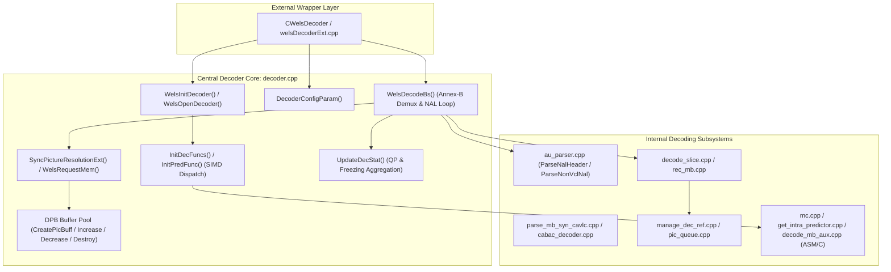
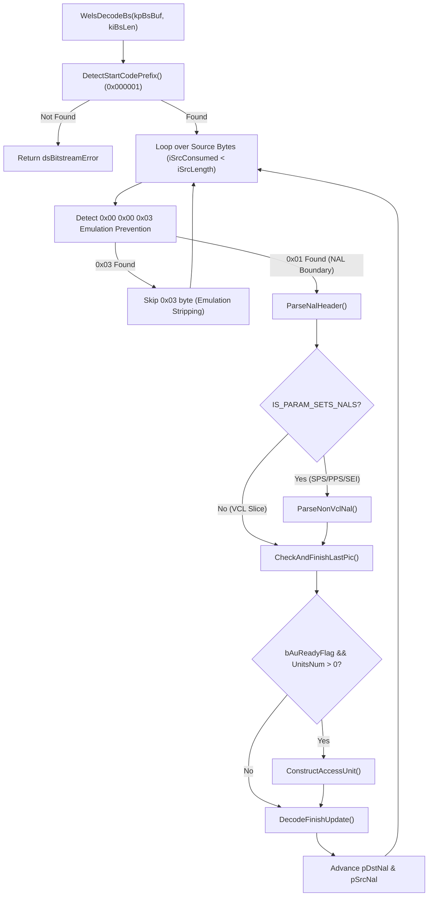

# OpenH264 Decoder Core Architecture & Implementation: `decoder.cpp`

This document provides a comprehensive, literate-programming-style deep dive into [`decoder.cpp`](openh264/codec/decoder/core/src/decoder.cpp). It covers the high-level architectural role, data structure memory layouts, pointer lifecycles, bitstream parsing algorithms, SIMD function pointer dispatch tables, and runtime statistics aggregation within the OpenH264 AVC/SVC video decoding pipeline.

---

## 1. High-Level Module & Architectural Purpose

The source file [`decoder.cpp`](openh264/codec/decoder/core/src/decoder.cpp) serves as the **central orchestration engine** of the OpenH264 decoder core (`codec/decoder/core/`). It sits directly below the public C++ API wrapper ([`welsDecoderExt.cpp`](openh264/codec/decoder/plus/src/welsDecoderExt.cpp)) and sits above the specialized low-level decoding subsystems (entropy parsing, macroblock reconstruction, motion compensation, spatial intra prediction, deblocking filter, and decoded picture buffer management).



### Core Responsibilities of `decoder.cpp`
1. **Decoder Lifecycle & Context Initialization**:
   - Initializing default parameter structures ([`WelsDecoderDefaults`](openh264/codec/decoder/core/src/decoder.cpp#L315-L368), [`WelsDecoderSpsPpsDefaults`](openh264/codec/decoder/core/src/decoder.cpp#L373-L389), [`WelsDecoderLastDecPicInfoDefaults`](openh264/codec/decoder/core/src/decoder.cpp#L393-L400)).
   - Allocating static and dynamic memory pools via [`WelsOpenDecoder`](openh264/codec/decoder/core/src/decoder.cpp#L600-L627) and [`WelsInitDecoder`](openh264/codec/decoder/core/src/decoder.cpp#L691-L698).
   - Releasing heap memory, picture queues, and layer contexts safely upon shutdown via [`WelsCloseDecoder`](openh264/codec/decoder/core/src/decoder.cpp#L632-L645) and [`WelsFreeDynamicMemory`](openh264/codec/decoder/core/src/decoder.cpp#L551-L596).
2. **Decoded Picture Buffer (DPB) Memory Pool Management**:
   - Creating, expanding, shrinking, and destroying the picture buffer pool (`SPicBuff`) with zero-padding alignment to handle dynamic GOP structures, reference list resizing, and multi-threading DPB requirements ([`CreatePicBuff`](openh264/codec/decoder/core/src/decoder.cpp#L63-L105), [`IncreasePicBuff`](openh264/codec/decoder/core/src/decoder.cpp#L107-L168), [`DecreasePicBuff`](openh264/codec/decoder/core/src/decoder.cpp#L170-L258), [`DestroyPicBuff`](openh264/codec/decoder/core/src/decoder.cpp#L260-L291)).
3. **Annex-B Bitstream Demuxing & NAL Extraction Pipeline**:
   - In [`WelsDecodeBs`](openh264/codec/decoder/core/src/decoder.cpp#L741-L937), scanning incoming byte streams for Annex-B start code prefixes (`0x000001` or `0x00000001`), stripping H.264 emulation prevention bytes (`0x000003` $\to$ `0x0000`), routing Non-VCL NAL units (SPS, PPS, Subset SPS) to parameter set storage, and driving Access Unit reconstruction for VCL slices.
4. **Resolution Dynamic Re-Allocation**:
   - In [`SyncPictureResolutionExt`](openh264/codec/decoder/core/src/decoder.cpp#L948-L980) and [`WelsRequestMem`](openh264/codec/decoder/core/src/decoder.cpp#L464-L546), detecting resolution switches (e.g. 720p $\to$ 1080p or downscaling), reallocating aligned macroblock dependency layer buffers (`SDqLayer`), temporary decoding picture frames (`pTempDec`), and CABAC decoding engines (`SWelsCabacDecEngine`).
5. **Multi-Architecture SIMD Function Pointer Binding**:
   - In [`InitDecFuncs`](openh264/codec/decoder/core/src/decoder.cpp#L982-L988) and [`InitPredFunc`](openh264/codec/decoder/core/src/decoder.cpp#L1006-L1181), querying CPU capability flags (`WelsCPUFeatureDetect`) to dynamically assign assembly-optimized SIMD function pointers for Intra 16x16, Intra 4x4, Intra 8x8, Chroma prediction, and 4x4 Inverse Discrete Cosine Transform (IDCT) across x86 (MMX, SSE2, AVX2), ARM (NEON, AArch64 NEON), MIPS (MMI), and Loongson (LSX).
6. **Runtime Decoder Statistics & Error Tracking**:
   - In [`UpdateDecStat`](openh264/codec/decoder/core/src/decoder.cpp#L1252-L1257), computing running average Luma QP values across correctly decoded macroblocks, tracking error-concealed IDR frames, and monitoring freezing states during packet loss.

---

## 2. Core Data Structures, Enums & Type Definitions

The module [`decoder.cpp`](openh264/codec/decoder/core/src/decoder.cpp) interacts with key internal structures defined in [`decoder_context.h`](openh264/codec/decoder/core/inc/decoder_context.h), [`pic_queue.h`](openh264/codec/decoder/core/inc/pic_queue.h), and [`picture.h`](openh264/codec/decoder/core/inc/picture.h).

```
+------------------------------------------------------------------------------------+
|                               SWelsDecoderContext                                  |
|                                                                                    |
|  +-------------------+  +--------------------+  +-------------------------------+  |
|  |   CMemoryAlign*   |  |   SDecodingParam   |  |     SWelsDecoderSpsPpsCTX     |  |
|  |    (pMemAlign)    |  |       (pParam)     |  |          (sSpsPpsCtx)         |  |
|  +-------------------+  +--------------------+  +-------------------------------+  |
|                                                                                    |
|  +---------------------------------------+  +-----------------------------------+  |
|  |           PPicBuff (pPicBuff)         |  |         SWelsLastDecPicInfo       |  |
|  |  - iCapacity: int32_t                 |  |       (pLastDecPicInfo)           |  |
|  |  - iCurrentIdx: int32_t               |  |  - iPrevPicOrderCntMsb/Lsb: int32 |  |
|  |  - ppPic: PPicture*                   |  |  - pPreviousDecodedPictureInDpb   |  |
|  |    [PPicture 0] [PPicture 1] ...      |  |  - bLastHasMmco5: bool            |  |
|  +---------------------------------------+  +-----------------------------------+  |
|                                                                                    |
|  +---------------------------------------+  +-----------------------------------+  |
|  |       SDqLayer* (pCurDqLayer)         |  |       SWelsCabacDecEngine*        |  |
|  |  - iMbWidth, iMbHeight                |  |        (pCabacDecEngine)          |  |
|  |  - pLumaQp, pMbCorrectlyDecodedFlag   |  |  - uiRange: uint32_t              |  |
|  |  - sLayerInfo: NAL header metadata    |  |  - uiOffset: uint32_t             |  |
|  +---------------------------------------+  +-----------------------------------+  |
+------------------------------------------------------------------------------------+
```

### 2.1 Struct & Class Inventory

| Structure / Type | Source Header | Role & Ownership in `decoder.cpp` |
| :--- | :--- | :--- |
| [`SWelsDecoderContext`](openh264/codec/decoder/core/inc/decoder_context.h#L306-L455) (`PWelsDecoderContext`) | [`decoder_context.h`](openh264/codec/decoder/core/inc/decoder_context.h) | Central decoder runtime state. Owns the picture buffer pool (`pPicBuff`), bitstream buffers (`sRawData`), CABAC engine (`pCabacDecEngine`), SPS/PPS context (`sSpsPpsCtx`), and SIMD dispatch function pointers. |
| [`SPicBuff`](openh264/codec/decoder/core/inc/pic_queue.h#L52-L58) (`PPicBuff`) | [`pic_queue.h`](openh264/codec/decoder/core/inc/pic_queue.h) | Reconstructed picture buffer pool. Encapsulates an array of picture pointers (`ppPic`), active pool capacity (`iCapacity`), and the current decoding index (`iCurrentIdx`). |
| [`Picture`](openh264/codec/decoder/core/inc/picture.h#L51-L97) (`PPicture`) | [`picture.h`](openh264/codec/decoder/core/inc/picture.h) | Individual frame buffer representation. Contains planar pixel pointers (`pData[3]`), strides (`iLinesize[3]`), reference flags (`bUsedAsRef`, `bIsLongRef`), DPB reference lists (`pRefPic[2][16]`), and completion state (`bIsComplete`). |
| [`CMemoryAlign`](openh264/codec/common/inc/memory_align.h#L49-L78) | [`memory_align.h`](openh264/codec/common/inc/memory_align.h) | Utility class managing 16-byte or 32-byte cache-aligned memory allocations (`WelsMallocz`, `WelsFree`) to prevent SIMD faults. |
| [`SPictReoderingStatus`](openh264/codec/decoder/core/inc/decoder_context.h#L240-L248) (`PPictReoderingStatus`) | [`decoder_context.h`](openh264/codec/decoder/core/inc/decoder_context.h) | Picture reordering state machine tracking Picture Order Count (POC) progression (`iMinPOC`, `iLastWrittenPOC`, `bHasBSlice`). |
| [`SPictInfo`](openh264/codec/decoder/core/inc/decoder_context.h#L250-L255) (`PPictInfo`) | [`decoder_context.h`](openh264/codec/decoder/core/inc/decoder_context.h) | Per-picture metadata tracking entry in the reordering array (`iPOC`, `iPicBuffIdx`, `sBufferInfo`). |
| [`SWelsDecoderSpsPpsCTX`](openh264/codec/decoder/core/inc/decoder_context.h#L112-L130) | [`decoder_context.h`](openh264/codec/decoder/core/inc/decoder_context.h) | Context tracking active SPS (`sSpsBuffer`), PPS (`sPpsBuffer`), active layer SPS bindings (`pActiveLayerSps`), and parameter set error counts. |
| [`SWelsLastDecPicInfo`](openh264/codec/decoder/core/inc/decoder_context.h#L132-L140) | [`decoder_context.h`](openh264/codec/decoder/core/inc/decoder_context.h) | Tracks POC derivation parameters (`iPrevPicOrderCntMsb`, `iPrevPicOrderCntLsb`), MMCO 5 resets, and DPB previous decoded picture pointers. |
| [`SDecoderStatistics`](openh264/codec/decoder/core/inc/decoder_context.h#L274-L290) | [`decoder_context.h`](openh264/codec/decoder/core/inc/decoder_context.h) | Performance and quality statistics container tracking `uiDecodedFrameCount`, `iAvgLumaQp`, `uiFreezingIDRNum`, `uiIDRCorrectNum`, and `uiEcIDRNum`. |

---

## 3. Function & Method Deep Dive

---

### 3.1 Decoded Picture Buffer (DPB) Memory Management

#### `CreatePicBuff`
```cpp
static int32_t CreatePicBuff (PWelsDecoderContext pCtx, PPicBuff* ppPicBuf, const int32_t kiSize,
                              const int32_t kiPicWidth, const int32_t kiPicHeight)
```
* **Location**: [`decoder.cpp:L63-L105`](openh264/codec/decoder/core/src/decoder.cpp#L63-L105)
* **Purpose**: Allocates a brand-new picture buffer pool (`SPicBuff`) and populates it with `kiSize` individual [`Picture`](openh264/codec/decoder/core/inc/picture.h) instances dimensioned to `kiPicWidth x kiPicHeight`.
* **Input Parameters**:
  - `pCtx`: Pointer to the root decoder context ([`PWelsDecoderContext`](openh264/codec/decoder/core/inc/decoder_context.h#L306)).
  - `ppPicBuf`: Double pointer to receive the allocated `SPicBuff` handle.
  - `kiSize`: Number of frame buffers to allocate in the DPB pool.
  - `kiPicWidth`: Target frame width in pixels (must be a positive multiple of 16).
  - `kiPicHeight`: Target frame height in pixels (must be a positive multiple of 16).
* **Return Value**: `ERR_NONE` (0) on success; `ERR_INFO_INVALID_PARAM` if dimensions/size are $\le 0$; `ERR_INFO_OUT_OF_MEMORY` if heap allocation fails.
* **Algorithmic Flow**:
  1. Validates `kiSize > 0`, `kiPicWidth > 0`, `kiPicHeight > 0`.
  2. Allocates `SPicBuff` via `pMa->WelsMallocz(sizeof(SPicBuff), "PPicBuff")`.
  3. Allocates pointer array `pPicBuf->ppPic` with capacity for `kiSize` picture pointers.
  4. Iterates $i = 0 \dots \text{kiSize}-1$, invoking `AllocPicture(pCtx, kiPicWidth, kiPicHeight)`.
  5. If any allocation fails midway, sets `pPicBuf->iCapacity = iPicIdx`, invokes [`DestroyPicBuff`](openh264/codec/decoder/core/src/decoder.cpp#L260-L291) to free partially allocated pictures, and returns `ERR_INFO_OUT_OF_MEMORY`.
  6. On success, initializes `pPicBuf->iCapacity = kiSize` and `pPicBuf->iCurrentIdx = 0`.

---

#### `IncreasePicBuff`
```cpp
static int32_t IncreasePicBuff (PWelsDecoderContext pCtx, PPicBuff* ppPicBuf, const int32_t kiOldSize,
                                const int32_t kiPicWidth, const int32_t kiPicHeight, const int32_t kiNewSize)
```
* **Location**: [`decoder.cpp:L107-L168`](openh264/codec/decoder/core/src/decoder.cpp#L107-L168)
* **Purpose**: Resizes an existing picture buffer pool upward when the required DPB capacity increases (e.g. incoming SPS requires more reference frames or multi-threading is enabled).
* **Key Steps**:
  1. Allocates a new `SPicBuff` container (`pPicNewBuf`) and new pointer array `pPicNewBuf->ppPic` of size `kiNewSize * sizeof(PPicture)`.
  2. Allocates `kiNewSize - kiOldSize` brand new `Picture` structures via `AllocPicture` for slots `[kiOldSize ... kiNewSize - 1]`.
  3. Copies the existing `kiOldSize` picture pointers from `pPicOldBuf->ppPic` into `pPicNewBuf->ppPic` using `memcpy`.
  4. Clears reference flags (`bUsedAsRef = false`, `bIsLongRef = false`, `iRefCount = 0`, `pSetUnRef = NULL`, `bIsComplete = false`) across all pictures in the new queue.
  5. Frees the old pointer array `pPicOldBuf->ppPic` and the old `SPicBuff` header without deallocating the underlying `Picture` instances that were migrated to `pPicNewBuf`.

---

#### `DecreasePicBuff`
```cpp
static int32_t DecreasePicBuff (PWelsDecoderContext pCtx, PPicBuff* ppPicBuf, const int32_t kiOldSize,
                                const int32_t kiPicWidth, const int32_t kiPicHeight, const int32_t kiNewSize)
```
* **Location**: [`decoder.cpp:L170-L258`](openh264/codec/decoder/core/src/decoder.cpp#L170-L258)
* **Purpose**: Resizes an existing picture buffer pool downward when the required DPB capacity decreases, ensuring active DPB references are preserved.
* **Safety & Reference Migration Logic**:
  - Resets reordering buffers via [`ResetReorderingPictureBuffers`](openh264/codec/decoder/core/src/decoder.cpp#L294-L310).
  - Scans `pPicOldBuf` for `pCtx->pLastDecPicInfo->pPreviousDecodedPictureInDpb`.
  - If the previous decoded picture index `iPrevPicIdx` lies outside the new size limit (`iPrevPicIdx >= kiNewSize`), it places `pPreviousDecodedPictureInDpb` explicitly into slot 0 of `pPicNewBuf->ppPic[0]` and copies the remaining `kiNewSize - 1` pictures.
  - Clears all reference cross-pointers (`pRefPic[LIST_0...LIST_A][j] = NULL`) to prevent dangling pointers (mitigating OSS-Fuzz 14423).
  - Deallocates unneeded `Picture` structures from the truncated tail (`[iDelIdx ... kiOldSize - 1]`) via `FreePicture`.

---

#### `DestroyPicBuff`
```cpp
void DestroyPicBuff (PWelsDecoderContext pCtx, PPicBuff* ppPicBuf, CMemoryAlign* pMa)
```
* **Location**: [`decoder.cpp:L260-L291`](openh264/codec/decoder/core/src/decoder.cpp#L260-L291)
* **Purpose**: Completely releases the `SPicBuff` structure, all child `Picture` instances, and internal aligned pixel planes.
* **Operation**:
  1. Invokes [`ResetReorderingPictureBuffers`](openh264/codec/decoder/core/src/decoder.cpp#L294-L310).
  2. Loops over `iPicIdx = 0 ... pPicBuf->iCapacity - 1`, invoking `FreePicture(pPic, pMa)` on non-null picture pointers.
  3. Frees pointer table `pPicBuf->ppPic`.
  4. Frees `pPicBuf` container and zeroes `*ppPicBuf = NULL`.

---

#### `ResetReorderingPictureBuffers`
```cpp
void ResetReorderingPictureBuffers (PPictReoderingStatus pPictReoderingStatus, PPictInfo pPictInfo,
                                    const bool& fullReset)
```
* **Location**: [`decoder.cpp:L294-L310`](openh264/codec/decoder/core/src/decoder.cpp#L294-L310)
* **Purpose**: Resets the picture reordering queue metadata to default sentinel values.
* **Fields Modified**:
  - `iPictInfoIndex = 0`
  - `iMinPOC = IMinInt32` ($-2^{31}$)
  - `iNumOfPicts = 0`
  - `iLastWrittenPOC = IMinInt32`
  - `iLargestBufferedPicIndex = 0`
  - Iterates over picture info slots, setting `pPictInfo[i].iPOC = IMinInt32` and `pPictInfo[i].iPicBuffIdx = -1` (deterministic invalid sentinel ensuring error-path decoding does not read heap garbage).
  - `bHasBSlice = false`.

---

### 3.2 Decoder Initialization, Configuration & Parameter Defaults

#### `WelsDecoderDefaults`
```cpp
void WelsDecoderDefaults (PWelsDecoderContext pCtx, SLogContext* pLogCtx)
```
* **Location**: [`decoder.cpp:L315-L368`](openh264/codec/decoder/core/src/decoder.cpp#L315-L368)
* **Purpose**: Sets initial zero/default values for the entire decoder context `pCtx`.
* **State Initialized**:
  - Logging context: `pCtx->sLogCtx = *pLogCtx`.
  - CPU Detection: `pCtx->uiCpuFlag = WelsCPUFeatureDetect(&iCpuCores)`.
  - Picture dimensions: `iImgWidthInPixel = 0`, `iImgHeightInPixel = 0`, `bFreezeOutput = true`.
  - Frame sequence tracking: `iFrameNum = -1`, `pLastDecPicInfo->iPrevFrameNum = -1`, `iErrorCode = ERR_NONE`.
  - Reference list reset: `WelsResetRefPic(pCtx)`.
  - Statistics intervals: `pDecoderStatistics->iAvgLumaQp = -1`, `iStatisticsLogInterval = 1000`.

---

#### `WelsDecoderSpsPpsDefaults`
```cpp
void WelsDecoderSpsPpsDefaults (SWelsDecoderSpsPpsCTX& sSpsPpsCtx)
```
* **Location**: [`decoder.cpp:L373-L389`](openh264/codec/decoder/core/src/decoder.cpp#L373-L389)
* **Purpose**: Initializes parameter set flags in `sSpsPpsCtx`:
  - `bSpsExistAheadFlag = false`, `bSubspsExistAheadFlag = false`, `bPpsExistAheadFlag = false`.
  - `bAvcBasedFlag = true`.
  - Zeroes error counters (`iSpsErrorIgnored`, `iSubSpsErrorIgnored`, `iPpsErrorIgnored`, `iPPSInvalidNum`, `iSPSInvalidNum`, `iSubSPSInvalidNum`).
  - Sets invalid ID sentinels `iPPSLastInvalidId = -1`, `iSPSLastInvalidId = -1`, `iSubSPSLastInvalidId = -1`, `iSeqId = -1`.

---

#### `WelsDecoderLastDecPicInfoDefaults`
```cpp
void WelsDecoderLastDecPicInfoDefaults (SWelsLastDecPicInfo& sLastDecPicInfo)
```
* **Location**: [`decoder.cpp:L393-L400`](openh264/codec/decoder/core/src/decoder.cpp#L393-L400)
* **Purpose**: Resets POC tracking variables:
  - `iPrevPicOrderCntMsb = 0`, `iPrevPicOrderCntLsb = 0`.
  - `pPreviousDecodedPictureInDpb = NULL`.
  - `iPrevFrameNum = -1`, `bLastHasMmco5 = false`, `uiDecodingTimeStamp = 0`.

---

#### `DecoderConfigParam`
```cpp
int32_t DecoderConfigParam (PWelsDecoderContext pCtx, const SDecodingParam* kpParam)
```
* **Location**: [`decoder.cpp:L649-L677`](openh264/codec/decoder/core/src/decoder.cpp#L649-L677)
* **Purpose**: Configures runtime decoding parameters from the user application.
* **Logic**:
  - Copies `kpParam` into `pCtx->pParam`.
  - Validates error concealment method (`eEcActiveIdc`). If out of range (`< ERROR_CON_DISABLE` or `> ERROR_CON_SLICE_MV_COPY_CROSS_IDR_FREEZE_RES_CHANGE`), clamps to `ERROR_CON_SLICE_MV_COPY_CROSS_IDR_FREEZE_RES_CHANGE`.
  - If `bParseOnly` is enabled, forces `eEcActiveIdc = ERROR_CON_DISABLE`.
  - Calls `InitErrorCon(pCtx)`.
  - Maps `sVideoProperty.eVideoBsType` to `pCtx->eVideoType`.

---

#### `WelsOpenDecoder` & `WelsCloseDecoder`
* **`WelsOpenDecoder`** ([`decoder.cpp:L600-L627`](openh264/codec/decoder/core/src/decoder.cpp#L600-L627)):
  - Calls [`InitDecFuncs`](openh264/codec/decoder/core/src/decoder.cpp#L982) to bind CPU-specific SIMD function pointers.
  - Calls `InitVlcTable` to set up CAVLC Exp-Golomb lookup tables.
  - Calls `WelsInitStaticMemory(pCtx)` to allocate fixed context memory.
  - Sets `bNewSeqBegin = true`, `bFrameFinish = true`, `iSeqNum = 0`.
* **`WelsCloseDecoder`** ([`decoder.cpp:L632-L645`](openh264/codec/decoder/core/src/decoder.cpp#L632-L645)):
  - Calls [`WelsFreeDynamicMemory`](openh264/codec/decoder/core/src/decoder.cpp#L551) to release picture queues and CABAC engine memory.
  - Calls `WelsFreeStaticMemory(pCtx)` to release static context allocations.

---

### 3.3 Dynamic Memory Allocation & Resolution Synchronization

#### `GetTargetRefListSize`
```cpp
static inline int32_t GetTargetRefListSize (PWelsDecoderContext pCtx)
```
* **Location**: [`decoder.cpp:L437-L459`](openh264/codec/decoder/core/src/decoder.cpp#L437-L459)
* **Formula / Logic**:
  $$N_{\text{ref\_list}} = \begin{cases} \text{MAX\_REF\_PIC\_COUNT} + 2 = 18 & \text{if } pCtx == \text{NULL} \lor pCtx->pSps == \text{NULL} \\ pSps->iNumRefFrames + 2 & \text{if single-threaded} \\ \text{MAX\_DPB\_COUNT} + N_{\text{threads}} & \text{if } N_{\text{threads}} > 1 \end{cases}$$
  - The $+2$ padding accounts for Error Concealment Motion Vector Copy buffer exchange.
  - If `LONG_TERM_REF` is defined, ensures $N_{\text{ref\_list}} \ge 2$.

---

#### `WelsRequestMem`
```cpp
int32_t WelsRequestMem (PWelsDecoderContext pCtx, const int32_t kiMbWidth, const int32_t kiMbHeight,
                        bool& bReallocFlag)
```
* **Location**: [`decoder.cpp:L464-L546`](openh264/codec/decoder/core/src/decoder.cpp#L464-L546)
* **Purpose**: Verifies whether current picture buffer capacity and pixel dimensions match incoming frame requirements; reallocates picture buffer pools if dimensions or ref list sizes change.
* **Resolution Check Matrix**:
  ```mermaid
  flowchart TD
      Start["WelsRequestMem(kiMbWidth, kiMbHeight)"] --> CalcDim["kiPicWidth = kiMbWidth << 4<br/>kiPicHeight = kiMbHeight << 4"]
      CalcDim --> CheckSame{"Resolution Match &<br/>Capacity Match?"}
      CheckSame -- Yes --> NoOp["Return ERR_NONE"]
      CheckSame -- Same Res, New Ref Size --> ResizePool{"New Cap > Old Cap?"}
      ResizePool -- Yes --> Inc["IncreasePicBuff()"]
      ResizePool -- No --> Dec["DecreasePicBuff()"]
      CheckSame -- New Resolution --> FullRealloc["DestroyPicBuff()<br/>CreatePicBuff()"]
      Inc --> AllocCABAC["Allocate CABAC Engine if NULL"]
      Dec --> AllocCABAC
      FullRealloc --> AllocCABAC
      AllocCABAC --> Done["Set bReallocFlag = true<br/>Return ERR_NONE"]
  ```

---

#### `SyncPictureResolutionExt`
```cpp
int32_t SyncPictureResolutionExt (PWelsDecoderContext pCtx, const int32_t kiMbWidth, const int32_t kiMbHeight)
```
* **Location**: [`decoder.cpp:L948-L980`](openh264/codec/decoder/core/src/decoder.cpp#L948-L980)
* **Purpose**: Synchronizes picture resolution across memory allocations, temporary decoded picture structures (`pTempDec`), and dependency layer contexts (`InitialDqLayersContext`).
* **Steps**:
  1. If `pTempDec` exists but its resolution differs from `kiPicWidth x kiPicHeight`, frees `pTempDec` and reallocates it via `AllocPicture`.
  2. Invokes [`WelsRequestMem(pCtx, kiMbWidth, kiMbHeight, bReallocFlag)`](openh264/codec/decoder/core/src/decoder.cpp#L464).
  3. Re-initializes spatial dependency layer buffers via `InitialDqLayersContext(pCtx, kiPicWidth, kiPicHeight)`.

---

#### `WelsFreeDynamicMemory`
```cpp
void WelsFreeDynamicMemory (PWelsDecoderContext pCtx)
```
* **Location**: [`decoder.cpp:L551-L596`](openh264/codec/decoder/core/src/decoder.cpp#L551-L596)
* **Purpose**: Deallocates all dynamically allocated decoding structures in clean reverse order:
  1. `UninitialDqLayersContext(pCtx)` (frees spatial layer coefficient and MV buffers).
  2. `ResetFmoList(pCtx)` (frees Flexible Macroblock Ordering maps).
  3. `WelsResetRefPic(pCtx)` (clears active reference picture lists).
  4. [`DestroyPicBuff(pCtx, &pCtx->pPicBuff, pMa)`](openh264/codec/decoder/core/src/decoder.cpp#L260).
  5. Multi-threading safety: If thread count $> 1$, zeroes `pPicBuff` across all thread worker contexts (`pThreadCtx[i].pCtx->pPicBuff = NULL`) to prevent double-free crashes.
  6. Frees temporary picture `pTempDec`.
  7. Frees CABAC decoding engine `pCabacDecEngine`.

---

### 3.4 Multi-Threading Synchronization & Feedback

#### `CopySpsPps`
```cpp
void CopySpsPps (PWelsDecoderContext pFromCtx, PWelsDecoderContext pToCtx)
```
* **Location**: [`decoder.cpp:L405-L428`](openh264/codec/decoder/core/src/decoder.cpp#L405-L428)
* **Purpose**: Clones parameter set state (`sSpsPpsCtx`) from the main decoding context (`pFromCtx`) to a slice/worker thread decoding context (`pToCtx`).
* **Pointer Fix-Up Logic**:
  - Performs struct copy `pToCtx->sSpsPpsCtx = pFromCtx->sSpsPpsCtx`.
  - Iterates across all active NAL units in the current Access Unit (`pAccessUnitList`).
  - For each dependency layer ID (`uiDid`), matches the source SPS pointer against `pFromCtx->sSpsPpsCtx.sSpsBuffer[j]`.
  - Re-binds `pToCtx->sSpsPpsCtx.pActiveLayerSps[uiDid]` to point to the matching buffer in `pToCtx->sSpsPpsCtx.sSpsBuffer[j]`, eliminating cross-thread pointer aliasing.

---

#### `GetVclNalTemporalId`
```cpp
void GetVclNalTemporalId (PWelsDecoderContext pCtx)
```
* **Location**: [`decoder.cpp:L716-L723`](openh264/codec/decoder/core/src/decoder.cpp#L716-L723)
* **Purpose**: Extracts temporal layer ID and reference priority from the first VCL NAL unit in the current Access Unit for encoder/network feedback:
  - `iFeedbackVclNalInAu = FEEDBACK_VCL_NAL`
  - `iFeedbackTidInAu = pNalUnitsList[idx]->sNalHeaderExt.uiTemporalId`
  - `iFeedbackNalRefIdc = pNalUnitsList[idx]->sNalHeaderExt.sNalUnitHeader.uiNalRefIdc`

---

### 3.5 Bitstream Parsing, Annex-B Demuxing & Decoding Loop

#### `WelsDecodeBs`
```cpp
int32_t WelsDecodeBs (PWelsDecoderContext pCtx, const uint8_t* kpBsBuf, const int32_t kiBsLen,
                      uint8_t** ppDst, SBufferInfo* pDstBufInfo, SParserBsInfo* pDstBsInfo)
```
* **Location**: [`decoder.cpp:L741-L937`](openh264/codec/decoder/core/src/decoder.cpp#L741-L937)
* **Purpose**: The primary entrance to the core decoding pipeline for an incoming byte-stream chunk.
* **Detailed Processing Pipeline**:



* **Emulation Prevention Stripping State Machine**:
  H.264 specifies that whenever `0x000003` occurs in the payload, the `0x03` byte is an emulation prevention byte inserted to avoid accidental start codes (`0x000001`).
  - When the 16-bit word `LD16(pSrcNal + iSrcIdx) == 0x0000` is detected:
    - If `pSrcNal[2 + iSrcIdx] == 0x03`: Skips the `0x03` byte and advances `iSrcIdx += 3`, `iSrcConsumed += 3`.
    - If `pSrcNal[2 + iSrcIdx] == 0x01`: Marks the completion of a NAL unit. Writes 4 zero padding bytes and invokes `ParseNalHeader`.

---

### 3.6 SIMD Function Pointer Binding & Dispatch

#### `InitDecFuncs` & `InitPredFunc`
* **Locations**: [`InitDecFuncs` (L982-L988)](openh264/codec/decoder/core/src/decoder.cpp#L982-L988), [`InitPredFunc` (L1006-L1181)](openh264/codec/decoder/core/src/decoder.cpp#L1006-L1181)
* **Purpose**: Dynamically populates function pointer tables in `pCtx` based on detected CPU capability flags (`uiCpuFlag`).

#### `IdctFourResAddPred_` Template
```cpp
template<void pfIdctResAddPred (uint8_t* pPred, int32_t iStride, int16_t* pRs)>
void IdctFourResAddPred_ (uint8_t* pPred, int32_t iStride, int16_t* pRs, const int8_t* pNzc) {
  if (pNzc[0] || pRs[0 * 16])
    pfIdctResAddPred (pPred + 0 * iStride + 0, iStride, pRs + 0 * 16);
  if (pNzc[1] || pRs[1 * 16])
    pfIdctResAddPred (pPred + 0 * iStride + 4, iStride, pRs + 1 * 16);
  if (pNzc[4] || pRs[2 * 16])
    pfIdctResAddPred (pPred + 4 * iStride + 0, iStride, pRs + 2 * 16);
  if (pNzc[5] || pRs[3 * 16])
    pfIdctResAddPred (pPred + 4 * iStride + 4, iStride, pRs + 3 * 16);
}
```
* **Location**: [`decoder.cpp:L992-L1002`](openh264/codec/decoder/core/src/decoder.cpp#L992-L1002)
* **Optimization Rationale**: Conditionally executes 4x4 Inverse DCT residual addition only for sub-blocks where non-zero count `pNzc[k]` is non-zero OR the DC transform coefficient `pRs[k * 16]` is non-zero, bypassing IDCT calculations for completely zero residual blocks.

#### Multi-Architecture SIMD Binding Matrix

| Architecture / Feature Flag | Intra 16x16 Prediction | Intra 4x4 Prediction | Chroma Prediction | 4x4 IDCT Residual Add |
| :--- | :--- | :--- | :--- | :--- |
| **C / C++ Reference** (Default) | `WelsI16x16LumaPred*_c` | `WelsI4x4LumaPred*_c` | `WelsIChromaPred*_c` | `IdctResAddPred_c` |
| **ARM NEON** (`WELS_CPU_NEON`) | `WelsDecoderI16x16LumaPred*_neon` | `WelsDecoderI4x4LumaPred*_neon` | `WelsDecoderIChromaPred*_neon` | `IdctResAddPred_neon` |
| **AArch64 NEON** (`WELS_CPU_NEON` on aarch64) | `WelsDecoderI16x16LumaPred*_AArch64_neon` | `WelsDecoderI4x4LumaPred*_AArch64_neon` | `WelsDecoderIChromaPred*_AArch64_neon` | `IdctResAddPred_AArch64_neon` |
| **x86 MMXEXT** (`WELS_CPU_MMXEXT`) | *(C Fallback)* | `WelsDecoderI4x4LumaPred*_mmx` | `WelsDecoderIChromaPred*_mmx` | `IdctResAddPred_mmx` |
| **x86 SSE2** (`WELS_CPU_SSE2`) | `WelsDecoderI16x16LumaPred*_sse2` | `WelsDecoderI4x4LumaPredH_sse2` | `WelsDecoderIChromaPred*_sse2` | `IdctResAddPred_sse2` |
| **x86 AVX2** (`WELS_CPU_AVX2`) | *(SSE2 / C)* | *(SSE2 / C)* | *(SSE2 / C)* | `IdctResAddPred_avx2` |
| **MIPS MMI** (`WELS_CPU_MMI`) | `WelsDecoderI16x16LumaPred*_mmi` | `WelsDecoderI4x4LumaPredH_mmi` | `WelsDecoderIChromaPred*_mmi` | `IdctResAddPred_mmi` |
| **Loongson LSX** (`WELS_CPU_LSX`) | *(C Fallback)* | *(C Fallback)* | *(C Fallback)* | `IdctResAddPred_lsx` |

---

### 3.7 Runtime Decoder Statistics & Quality Tracking

#### Average Luma QP Calculation
Implemented in [`UpdateDecStatNoFreezingInfo`](openh264/codec/decoder/core/src/decoder.cpp#L1209-L1249):

1. **Per-Frame Macroblock Average QP**:
   - If error concealment is disabled (`eEcActiveIdc == ERROR_CON_DISABLE`):
     $$\overline{QP}_{\text{frame}} = \frac{1}{N_{\text{MB}}} \sum_{i=0}^{N_{\text{MB}}-1} \text{pLumaQp}[i]$$
   - If error concealment is active:
     $$\overline{QP}_{\text{frame}} = \frac{\sum_{i=0}^{N_{\text{MB}}-1} \text{pLumaQp}[i] \cdot \text{pMbCorrectlyDecodedFlag}[i]}{\sum_{i=0}^{N_{\text{MB}}-1} \text{pMbCorrectlyDecodedFlag}[i]}$$
2. **Cumulative Stream Running Average QP**:
   $$\overline{QP}_{\text{stream}}^{(N+1)} = \frac{\overline{QP}_{\text{stream}}^{(N)} \cdot N_{\text{decoded}} + \overline{QP}_{\text{frame}}}{N_{\text{decoded}} + 1}$$

#### Functions:
* **`ResetDecStatNums`** ([`decoder.cpp:L1184-L1198`](openh264/codec/decoder/core/src/decoder.cpp#L1184-L1198)): Zeroes counters in `SDecoderStatistics` while preserving configuration fields (`uiWidth`, `uiHeight`, `iAvgLumaQp`, `iStatisticsLogInterval`, `uiProfile`, `uiLevel`).
* **`UpdateDecStatFreezingInfo`** ([`decoder.cpp:L1201-L1206`](openh264/codec/decoder/core/src/decoder.cpp#L1201-L1206)): Increments `uiFreezingIDRNum` or `uiFreezingNonIDRNum` when frame output is frozen.
* **`UpdateDecStatNoFreezingInfo`** ([`decoder.cpp:L1209-L1249`](openh264/codec/decoder/core/src/decoder.cpp#L1209-L1249)): Updates running average Luma QP, `uiIDRCorrectNum`, and `uiEcIDRNum`.
* **`UpdateDecStat`** ([`decoder.cpp:L1252-L1257`](openh264/codec/decoder/core/src/decoder.cpp#L1252-L1257)): Top-level dispatcher routing to freezing vs non-freezing statistics handlers.

---

## 4. Key References & Related Files

* **Source Implementation**: [`codec/decoder/core/src/decoder.cpp`](openh264/codec/decoder/core/src/decoder.cpp)
* **Core Header**: [`codec/decoder/core/inc/decoder.h`](openh264/codec/decoder/core/inc/decoder.h)
* **Context Definition**: [`codec/decoder/core/inc/decoder_context.h`](openh264/codec/decoder/core/inc/decoder_context.h)
* **Picture Buffer Queue**: [`codec/decoder/core/inc/pic_queue.h`](openh264/codec/decoder/core/inc/pic_queue.h) & [`pic_queue.cpp`](openh264/codec/decoder/core/src/pic_queue.cpp)
* **Annex-B Demux & Parser**: [`codec/decoder/core/src/au_parser.cpp`](openh264/codec/decoder/core/src/au_parser.cpp)
* **System Overview Documentation**: [`rust/docs/overview.md`](openh264/rust/docs/overview.md)
