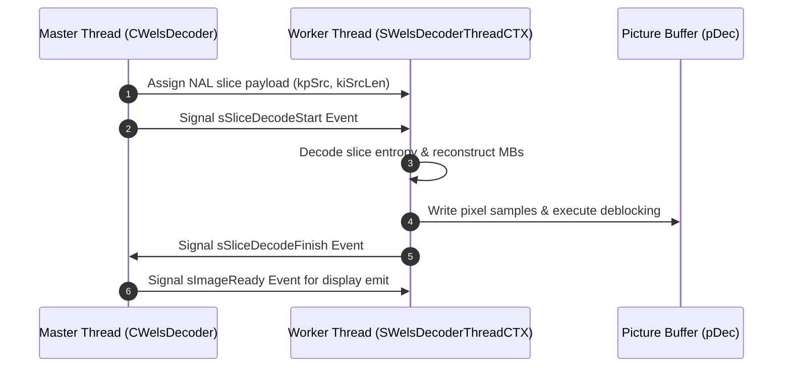

# OpenH264 Decoder Architecture: `decoder_context.h` Deep Dive

This document provides a comprehensive, literate-programming-style breakdown of [decoder_context.h](openh264/codec/decoder/core/inc/decoder_context.h). This header file defines the central execution context, data structures, function pointer dispatch tables, macroblock parameter caches, and multithreading synchronization primitives for the Cisco OpenH264 video decoder core.

---

## Table of Contents
1. [Module Overview & Architectural Purpose](#1-module-overview--architectural-purpose)
2. [Constants, Macros, and Enumerations](#2-constants-macros-and-enumerations)
   - [2.1 Prediction Mode & QP Bounds](#21-prediction-mode--qp-bounds)
   - [2.2 CABAC Context Model Offsets (Table 9-34)](#22-cabac-context-model-offsets-table-9-34)
   - [2.3 Bitstream Buffer Limits & Overwrite Bitmasks](#23-bitstream-buffer-limits--overwrite-bitmasks)
3. [Function Pointer Dispatch Types](#3-function-pointer-dispatch-types)
   - [3.1 Intra Prediction & IDCT Kernels](#31-intra-prediction--idct-kernels)
   - [3.2 In-Loop Deblocking Filter Kernels](#32-in-loop-deblocking-filter-kernels)
   - [3.3 Macroblock Cache & Neighbor Mapping Callbacks](#33-macroblock-cache--neighbor-mapping-callbacks)
4. [Auxiliary Data Structures](#4-auxiliary-data-structures)
   - [4.1 CABAC Engine & Context Models](#41-cabac-engine--context-models)
   - [4.2 Bitstream Buffering & SPS/PPS Parse-Only Caches](#42-bitstream-buffering--spspps-parse-only-caches)
   - [4.3 Reference Picture DPB Tracking (`SRefPic`)](#43-reference-picture-dpb-tracking-srefpic)
   - [4.4 Parameter Set Global Context (`SWelsDecoderSpsPpsCTX`)](#44-parameter-set-global-context-swelsdecoderspsppsctx)
   - [4.5 Picture History & Reordering Management](#45-picture-history--reordering-management)
5. [The Master Decoder Context: `SWelsDecoderContext`](#5-the-master-decoder-context-swelsdecodercontext)
   - [5.1 Context Architectural Map](#51-context-architectural-map)
   - [5.2 Complete Member Field Breakdown](#52-complete-member-field-breakdown)
   - [5.3 Macroblock Cache Architecture (`sMb`)](#53-macroblock-cache-architecture-smb)
   - [5.4 Dequantization Scaling List Tables](#54-dequantization-scaling-list-tables)
6. [Multithreaded Frame Decoding Subsystem](#6-multithreaded-frame-decoding-subsystem)
   - [6.1 Thread Control Block (`SWelsDecThreadInfo`)](#61-thread-control-block-swelsdecthreadinfo)
   - [6.2 Thread Execution Context (`SWelsDecoderThreadCTX`)](#62-thread-execution-context-swelsdecoderthreadctx)
7. [Inline Helper Methods & Algorithmic Analysis](#7-inline-helper-methods--algorithmic-analysis)
   - [7.1 `ResetActiveSPSForEachLayer`](#71-resetactivespsforeachlayer)
   - [7.2 `GetThreadCount`](#72-getthreadcount)
   - [7.3 `GetPrevFrameNum`](#73-getprevframenum)

---

## 1. Module Overview & Architectural Purpose

In the OpenH264 decoding pipeline, [decoder_context.h](openh264/codec/decoder/core/inc/decoder_context.h) serves as the **master state coordinator**. The entire state of a running decoder instance is encapsulated in the [SWelsDecoderContext](openh264/codec/decoder/core/inc/decoder_context.h#L306-L520) structure (conventionally passed via the pointer `pCtx`).

```mermaid
flowchart TB
    subgraph Top-Level Interface
        API[ISVCDecoder / CWelsDecoder] --> DecCtx[SWelsDecoderContext (pCtx)]
    end

    subgraph Bitstream & Entropy
        DecCtx --> RawBS[SDataBuffer: Raw / Saved RBSP]
        DecCtx --> BitAux[SBitStringAux: Exp-Golomb Reader]
        DecCtx --> CabacEng[SWelsCabacDecEngine & SWelsCabacCtx]
    end

    subgraph Parameter Sets & Syntax
        DecCtx --> SpsPps[SWelsDecoderSpsPpsCTX: SPS / PPS / Subset SPS]
        DecCtx --> DqLayer[SDqLayer: Spatial Scalability Layers]
        DecCtx --> MbCache[sMb: Multi-Layer Macroblock Cache]
    end

    subgraph Reconstruction & Filtering
        DecCtx --> SIMD[SIMD Dispatch Tables: Intra / IDCT / MC]
        DecCtx --> Deblock[SDeblockingFilter & SDeblockingFunc]
        DecCtx --> DPB[PPicBuff / SRefPic: Decoded Picture Buffer]
    end

    subgraph Concurrency & Output
        DecCtx --> ThreadPool[SWelsDecoderThreadCTX: Frame-Level Multithreading]
        DecCtx --> Reorder[SPictReoderingStatus: POC Reordering Queue]
    end
```

### Key Responsibilities
1. **Bitstream Buffering & NAL Parsing**: Manages memory boundaries for incoming Annex-B NAL units, un-escaped RBSP payloads, and bitstream parsing engines.
2. **Entropy Decoding State**: Holds context models and arithmetic decoding registers for Context-Adaptive Binary Arithmetic Coding (CABAC) as well as lookup structures for Context-Adaptive Variable-Length Coding (CAVLC).
3. **Macroblock Cache Allocation**: Coordinates contiguous 2D/3D scratchpad memory for macroblock types, motion vectors ($MV_x, MV_y$), reference picture indices, transform coefficients, and intra prediction modes across multiple spatial layers.
4. **Hardware SIMD Abstraction**: Hosts dynamically populated function pointer tables that dispatch intra prediction, IDCT, motion compensation, and deblocking routines to x86 (MMX/SSE2/AVX2) or ARM (NEON/AArch64) assembly kernels with scalar C/C++ fallbacks.
5. **Decoded Picture Buffer (DPB) Management**: Tracks short-term and long-term reference frame lists, Picture Order Count (POC) sorting queues, and memory management control operations (MMCO).
6. **Thread Synchronization**: Orchestrates multi-threaded slice and frame decoding using persistent worker threads, mutexes, condition events, and semaphores.

---

## 2. Constants, Macros, and Enumerations

### 2.1 Prediction Mode & QP Bounds

```cpp
#define MAX_PRED_MODE_ID_I16x16  3
#define MAX_PRED_MODE_ID_CHROMA  3
#define MAX_PRED_MODE_ID_I4x4    8
#define WELS_QP_MAX              51
#define LONG_TERM_REF
#define IMinInt32                -0x7FFFFFFF
```

* **`MAX_PRED_MODE_ID_I16x16` (3)**: Maximum allowable mode index for Intra $16 \times 16$ luma prediction (0: Vertical, 1: Horizontal, 2: DC, 3: Plane).
* **`MAX_PRED_MODE_ID_CHROMA` (3)**: Maximum allowable mode index for Intra $8 \times 8$ chroma prediction (0: DC, 1: Horizontal, 2: Vertical, 3: Plane).
* **`MAX_PRED_MODE_ID_I4x4` (8)**: Maximum allowable mode index for Intra $4 \times 4$ luma prediction (0: Vertical, 1: Horizontal, 2: DC, 3: Diagonal Down-Left, 4: Diagonal Down-Right, 5: Vertical-Right, 6: Horizontal-Down, 7: Vertical-Left, 8: Horizontal-Up).
* **`WELS_QP_MAX` (51)**: Maximum standard H.264 Quantization Parameter ($QP \in [0, 51]$).
* **`IMinInt32` (`-0x7FFFFFFF`)**: Sentinel negative minimum value used for POC initialization and unassigned reference indices.

---

### 2.2 CABAC Context Model Offsets (Table 9-34)

In H.264 / AVC CABAC entropy decoding (ITU-T H.264 Section 9.3.3.1), context index increments (`ctxIdx`) are grouped by syntax element types. OpenH264 pre-calculates the base offset for each syntax category in `decoder_context.h`:

| Macro Constant | Base Offset Index | Syntax Element Description | Standard Reference |
| :--- | :--- | :--- | :--- |
| `NEW_CTX_OFFSET_MB_TYPE_I` | `3` | Intra Macroblock Type (`mb_type`) | Table 9-34 |
| `NEW_CTX_OFFSET_SKIP` | `11` | `mb_skip_flag` context models | Table 9-34 |
| `NEW_CTX_OFFSET_SUBMB_TYPE` | `21` | P-Slice Sub-Macroblock Type | Table 9-34 |
| `NEW_CTX_OFFSET_B_SUBMB_TYPE` | `36` | B-Slice Sub-Macroblock Type | Table 9-34 |
| `NEW_CTX_OFFSET_MVD` | `40` | Motion Vector Difference (`mvd_l0`, `mvd_l1`) | Table 9-34 |
| `NEW_CTX_OFFSET_REF_NO` | `54` | Reference Picture Index (`ref_idx_l0`, `ref_idx_l1`) | Table 9-34 |
| `NEW_CTX_OFFSET_DELTA_QP` | `60` | Macroblock Delta QP (`mb_qp_delta`) | Table 9-34 |
| `NEW_CTX_OFFSET_IPR` | `68` | Intra Prediction Mode (`prev_intra4x4_pred_mode_flag`) | Table 9-34 |
| `NEW_CTX_OFFSET_CIPR` | `64` | Chroma Intra Prediction Mode (`intra_chroma_pred_mode`) | Table 9-34 |
| `NEW_CTX_OFFSET_CBP` | `73` | Coded Block Pattern (`coded_block_pattern`) | Table 9-34 |
| `NEW_CTX_OFFSET_CBF` | `85` | Coded Block Flag (`coded_block_flag`) | Table 9-34 |
| `NEW_CTX_OFFSET_MAP` | `105` | Significant Coefficient Map (`significant_coeff_flag`) | Table 9-34 |
| `NEW_CTX_OFFSET_LAST` | `166` | Last Significant Coefficient Flag (`last_significant_coeff_flag`) | Table 9-34 |
| `NEW_CTX_OFFSET_ONE` | `227` | Coefficient Magnitude $> 1$ Flag (`coeff_abs_level_greater_one`) | Table 9-34 |
| `NEW_CTX_OFFSET_ABS` | `232` | Coefficient Magnitude $> 2$ Flag (`coeff_abs_level_greater_two`) | Table 9-34 |
| `NEW_CTX_OFFSET_TRANSFORM_SIZE_8X8_FLAG` | `399` | Adaptive $8 \times 8$ Transform Flag | High Profile Ext. |
| `NEW_CTX_OFFSET_MAP_8x8` | `402` | Significant Coeff Map for $8 \times 8$ Transform | High Profile Ext. |
| `NEW_CTX_OFFSET_LAST_8x8` | `417` | Last Significant Coeff Flag for $8 \times 8$ Transform | High Profile Ext. |
| `NEW_CTX_OFFSET_ONE_8x8` | `426` | Coeff Level $> 1$ for $8 \times 8$ Transform | High Profile Ext. |
| `NEW_CTX_OFFSET_ABS_8x8` | `431` | Coeff Level $> 2$ for $8 \times 8$ Transform | High Profile Ext. |

---

### 2.3 Bitstream Buffer Limits & Overwrite Bitmasks

```cpp
#define SPS_PPS_BS_SIZE 128

enum {
  OVERWRITE_NONE      = 0,
  OVERWRITE_PPS       = 1,
  OVERWRITE_SPS       = 1 << 1,
  OVERWRITE_SUBSETSPS = 1 << 2
};
```

* **`SPS_PPS_BS_SIZE` (128 bytes)**: Fixed static buffer size allocated to store Raw Byte Sequence Payloads (RBSP) for incoming Sequence Parameter Sets (`SSpsBsInfo`) and Picture Parameter Sets (`SPpsBsInfo`) during parse-only inspection mode.
* **Overwrite Bitmask Enum**: Bit flags tracked in `sSpsPpsCtx.iOverwriteFlags` to record whether a new parameter set received in the stream replaces a previously active SPS, PPS, or Subset SPS with identical ID.

---

## 3. Function Pointer Dispatch Types

To maximize decoding throughput, OpenH264 avoids branching inside inner pixel loops by dispatching performance-critical operations through function pointer tables populated during initialization.

### 3.1 Intra Prediction & IDCT Kernels

```cpp
typedef void (*PGetIntraPredFunc) (uint8_t* pPred, const int32_t kiLumaStride);
typedef void (*PGetIntraPred8x8Func) (uint8_t* pPred, const int32_t kiLumaStride, bool bTLAvail, bool bTRAvail);
typedef void (*PIdctResAddPredFunc) (uint8_t* pPred, const int32_t kiStride, int16_t* pRs);
typedef void (*PIdctFourResAddPredFunc) (uint8_t* pPred, int32_t iStride, int16_t* pRs, const int8_t* pNzc);
typedef void (*PExpandPictureFunc) (uint8_t* pDst, const int32_t kiStride, const int32_t kiPicWidth, const int32_t kiPicHeight);
typedef void (*PCopyFunc) (uint8_t* pDst, int32_t iStrideD, uint8_t* pSrc, int32_t iStrideS);
```

* **[PGetIntraPredFunc](openh264/codec/decoder/core/inc/decoder_context.h#L140)**: Computes spatial prediction for Intra $4 \times 4$, Intra $16 \times 16$, and Chroma $8 \times 8$ blocks from reconstructed boundary samples into buffer `pPred`.
* **[PGetIntraPred8x8Func](openh264/codec/decoder/core/inc/decoder_context.h#L146)**: Computes Intra $8 \times 8$ luma predictions with explicit boundary availability flags (`bTLAvail` for Top-Left, `bTRAvail` for Top-Right).
* **[PIdctResAddPredFunc](openh264/codec/decoder/core/inc/decoder_context.h#L141)**: Computes the $4 \times 4$ Inverse Integer DCT on residual coefficients `pRs`, adds the result to prediction samples in `pPred`, clamps the pixel values to $[0, 255]$, and writes them back in-place:
  $$\text{Dst}_{i,j} = \text{Clip1}_{255} \left( \text{Pred}_{i,j} + \left( C_i^T \cdot W' \cdot C_i + 32 \right) \gg 6 \right)$$
* **[PIdctFourResAddPredFunc](openh264/codec/decoder/core/inc/decoder_context.h#L142)**: Concurrently computes IDCT and reconstruction for four $4 \times 4$ residual blocks when non-zero count entries in `pNzc` indicate non-empty coefficient data.
* **[PExpandPictureFunc](openh264/codec/decoder/core/inc/decoder_context.h#L143-L144)**: Expands the borders of a reconstructed reference picture by padding outer sample boundaries (typically 32 pixels for luma, 16 pixels for chroma) to support out-of-boundary motion vector indexing without branching.

---

### 3.2 In-Loop Deblocking Filter Kernels

```cpp
typedef void (*PDeblockingFilterMbFunc) (PDqLayer pCurDqLayer, PDeblockingFilter filter, int32_t boundry_flag);
typedef void (*PLumaDeblockingLT4Func)  (uint8_t* iSampleY, int32_t iStride, int32_t iAlpha, int32_t iBeta, int8_t* iTc);
typedef void (*PLumaDeblockingEQ4Func)  (uint8_t* iSampleY, int32_t iStride, int32_t iAlpha, int32_t iBeta);
typedef void (*PChromaDeblockingLT4Func) (uint8_t* iSampleCb, uint8_t* iSampleCr, int32_t iStride, int32_t iAlpha, int32_t iBeta, int8_t* iTc);
typedef void (*PChromaDeblockingEQ4Func) (uint8_t* iSampleCb, uint8_t* iSampleCr, int32_t iStride, int32_t iAlpha, int32_t iBeta);
typedef void (*PChromaDeblockingLT4Func2)(uint8_t* iSampleCbr, int32_t iStride, int32_t iAlpha, int32_t iBeta, int8_t* iTc);
typedef void (*PChromaDeblockingEQ4Func2)(uint8_t* iSampleCbr, int32_t iStride, int32_t iAlpha, int32_t iBeta);
```

* **`LT4` vs `EQ4` Filtering**:
  * **`LT4` Kernels ($bS \in \{1, 2, 3\}$)**: Applied to normal block boundaries. The sample modification threshold is bounded by clipping parameter $t_c$:
    $$\Delta = \text{Clip3}(-t_c, t_c, ((((q_0 - p_0) \ll 2) + (p_1 - q_1) + 4) \gg 3))$$
  * **`EQ4` Kernels ($bS = 4$)**: Applied to strong intra-macroblock boundaries. Invokes stronger 3-tap or 4-tap spatial smoothing filtering across $p_0, p_1, p_2$ and $q_0, q_1, q_2$.
* **`Func2` Suffix**: Specialized SIMD/C kernels for interleaved chroma formats (`iSampleCbr` containing interleaved Cb/Cr samples) versus separate planar Cb and Cr pointers.

---

### 3.3 Macroblock Cache & Neighbor Mapping Callbacks

```cpp
typedef void (*PWelsNonZeroCountFunc) (int8_t* pNonZeroCount);
typedef void (*PWelsBlockZeroFunc) (int16_t* block, int32_t stride);
typedef void (*PWelsFillNeighborMbInfoIntra4x4Func) (PWelsNeighAvail pNeighAvail, uint8_t* pNonZeroCount, int8_t* pIntraPredMode, PDqLayer pCurDqLayer);
typedef void (*PWelsMapNeighToSample) (PWelsNeighAvail pNeighAvail, int32_t* pSampleAvail);
typedef void (*PWelsMap16NeighToSample) (PWelsNeighAvail pNeighAvail, uint8_t* pSampleAvail);
typedef int32_t (*PWelsParseIntra4x4ModeFunc) (PWelsNeighAvail pNeighAvail, int8_t* pIntraPredMode, PBitStringAux pBs, PDqLayer pCurDqLayer);
typedef int32_t (*PWelsParseIntra16x16ModeFunc) (PWelsNeighAvail pNeighAvail, PBitStringAux pBs, PDqLayer pCurDqLayer);
```

* **[PWelsFillNeighborMbInfoIntra4x4Func](openh264/codec/decoder/core/inc/decoder_context.h#L219-L220)**: Fills spatial neighbor availability flags (Left, Top, Top-Left, Top-Right) for the current macroblock based on slice boundaries, FMO slice groups, and picture edges.
* **[PWelsParseIntra4x4ModeFunc](openh264/codec/decoder/core/inc/decoder_context.h#L223-L224)**: Decodes the Intra $4 \times 4$ prediction mode for each of the 16 sub-blocks from the Exp-Golomb bitstream (`pBs`) using spatial most probable mode derivation ($\min(\text{mode}_A, \text{mode}_B)$).

---

## 4. Auxiliary Data Structures

### 4.1 CABAC Engine & Context Models

```cpp
typedef struct SWels_Cabac_Element {
  uint8_t uiState;
  uint8_t uiMPS;
} SWelsCabacCtx, *PWelsCabacCtx;

typedef struct {
  uint64_t uiRange;
  uint64_t uiOffset;
  int32_t  iBitsLeft;
  uint8_t* pBuffStart;
  uint8_t* pBuffCurr;
  uint8_t* pBuffEnd;
} SWelsCabacDecEngine, *PWelsCabacDecEngine;
```

#### [SWelsCabacCtx](openh264/codec/decoder/core/inc/decoder_context.h#L69-L72)
Represents the adaptive probability state for a single CABAC context model:
* `uiState`: 6-bit probability state index ($pStateIdx \in [0, 63]$), corresponding to the estimated probability of the Least Probable Symbol (LPS).
* `uiMPS`: Value of the Most Probable Symbol (0 or 1).

#### [SWelsCabacDecEngine](openh264/codec/decoder/core/inc/decoder_context.h#L74-L81)
The core arithmetic decoding engine maintaining the binary interval state:
* `uiRange`: Current code interval range ($R$), maintained in 64-bit precision for high-speed SIMD shifts.
* `uiOffset`: Current binary value offset ($V$) read from the bitstream.
* `iBitsLeft`: Number of unconsumed bits remaining in the internal bit buffer before refilling from `pBuffCurr`.
* `pBuffStart`, `pBuffCurr`, `pBuffEnd`: Memory pointers demarcating the raw NAL payload buffer boundaries.

---

### 4.2 Bitstream Buffering & SPS/PPS Parse-Only Caches

```cpp
typedef struct TagDataBuffer {
  uint8_t* pHead;
  uint8_t* pEnd;
  uint8_t* pStartPos;
  uint8_t* pCurPos;
} SDataBuffer;

typedef struct TagSpsBsInfo {
  uint8_t  pSpsBsBuf[SPS_PPS_BS_SIZE];
  int32_t  iSpsId;
  uint16_t uiSpsBsLen;
} SSpsBsInfo;

typedef struct TagPpsBsInfo {
  uint8_t  pPpsBsBuf[SPS_PPS_BS_SIZE];
  int32_t  iPpsId;
  uint16_t uiPpsBsLen;
} SPpsBsInfo;
```

* **[SDataBuffer](openh264/codec/decoder/core/inc/decoder_context.h#L108-L114)**: Linear bitstream scratch buffer used by `sRawData` and `sSavedData` to store un-escaped NAL RBSP payloads.
* **[SSpsBsInfo](openh264/codec/decoder/core/inc/decoder_context.h#L118-L122)** / **[SPpsBsInfo](openh264/codec/decoder/core/inc/decoder_context.h#L124-L128)**: Dedicated parameter set backup records that retain raw bitstream bytes for inspection in `PARSE_ONLY` decoder mode.

---

### 4.3 Reference Picture DPB Tracking (`SRefPic`)

```cpp
typedef struct TagRefPic {
  PPicture  pRefList[LIST_A][MAX_DPB_COUNT];
  PPicture  pShortRefList[LIST_A][MAX_DPB_COUNT];
  PPicture  pLongRefList[LIST_A][MAX_DPB_COUNT];
  uint8_t   uiRefCount[LIST_A];
  uint8_t   uiShortRefCount[LIST_A];
  uint8_t   uiLongRefCount[LIST_A];
  int32_t   iMaxLongTermFrameIdx;
} SRefPic, *PRefPic;
```

* **`pRefList[LIST_A][MAX_DPB_COUNT]`**: Active reference list for inter-prediction (`LIST_0` and `LIST_1`), constructed per slice by reordering short-term and long-term references.
* **`pShortRefList`**: Short-term reference frames sorted by descending Picture Order Count (POC) or Frame Number.
* **`pLongRefList`**: Long-term reference frames indexed by `LongTermFrameIdx`.
* **`uiRefCount` / `uiShortRefCount` / `uiLongRefCount`**: Count of valid picture entries currently stored in each respective list.
* **`iMaxLongTermFrameIdx`**: Maximum allowable long-term frame index assigned by MMCO commands (or `-1` if no long-term references exist).

---

### 4.4 Parameter Set Global Context (`SWelsDecoderSpsPpsCTX`)

```cpp
typedef struct tagWelsWelsDecoderSpsPpsCTX {
  SPosOffset    sFrameCrop;
  SSps          sSpsBuffer[MAX_SPS_COUNT + 1];
  SPps          sPpsBuffer[MAX_PPS_COUNT + 1];
  SSubsetSps    sSubsetSpsBuffer[MAX_SPS_COUNT + 1];
  SNalUnit      sPrefixNal;
  PSps          pActiveLayerSps[MAX_LAYER_NUM];
  bool          bAvcBasedFlag;
  bool          bSpsExistAheadFlag;
  bool          bSubspsExistAheadFlag;
  bool          bPpsExistAheadFlag;
  int32_t       iSpsErrorIgnored;
  int32_t       iSubSpsErrorIgnored;
  int32_t       iPpsErrorIgnored;
  bool          bSpsAvailFlags[MAX_SPS_COUNT];
  bool          bSubspsAvailFlags[MAX_SPS_COUNT];
  bool          bPpsAvailFlags[MAX_PPS_COUNT];
  int32_t       iPPSLastInvalidId;
  int32_t       iPPSInvalidNum;
  int32_t       iSPSLastInvalidId;
  int32_t       iSPSInvalidNum;
  int32_t       iSubSPSLastInvalidId;
  int32_t       iSubSPSInvalidNum;
  int32_t       iSeqId;
  int           iOverwriteFlags;
} SWelsDecoderSpsPpsCTX, *PWelsDecoderSpsPpsCTX;
```

Maintains global storage for all parsed sequence and picture parameter sets:
* **`sSpsBuffer` / `sPpsBuffer` / `sSubsetSpsBuffer`**: Permanent buffers indexed by `seq_parameter_set_id` and `pic_parameter_set_id`.
* **`pActiveLayerSps[MAX_LAYER_NUM]`**: Array of active SPS pointers mapped to each spatial dependency layer ($iDid \in [0, \text{MAX\_LAYER\_NUM}-1]$).
* **`bSpsAvailFlags` / `bPpsAvailFlags`**: Boolean bitmasks indicating which parameter set IDs have been successfully parsed and are valid for reference.
* **`iOverwriteFlags`**: Tracks whether newly parsed parameter sets overwrite existing configurations using the `OVERWRITE_*` bitmask enum.

---

### 4.5 Picture History & Reordering Management

```cpp
typedef struct tagSWelsLastDecPicInfo {
  SNalUnitHeaderExt sLastNalHdrExt;
  SSliceHeader      sLastSliceHeader;
  int32_t           iPrevPicOrderCntMsb;
  int32_t           iPrevPicOrderCntLsb;
  PPicture          pPreviousDecodedPictureInDpb;
  int32_t           iPrevFrameNum;
  bool              bLastHasMmco5;
  uint32_t          uiDecodingTimeStamp;
} SWelsLastDecPicInfo, *PWelsLastDecPicInfo;

typedef struct tagPictInfo {
  SBufferInfo sBufferInfo;
  int32_t     iPOC;
  int32_t     iPicBuffIdx;
  uint32_t    uiDecodingTimeStamp;
  int32_t     iSeqNum;
} SPictInfo, *PPictInfo;

typedef struct tagPictReoderingStatus {
  int32_t iPictInfoIndex;
  int32_t iMinSeqNum;
  int32_t iMinPOC;
  int32_t iNumOfPicts;
  int32_t iLastWrittenSeqNum;
  int32_t iLastWrittenPOC;
  int32_t iLargestBufferedPicIndex;
  bool    bHasBSlice;
} SPictReoderingStatus, *PPictReoderingStatus;
```

* **[SWelsLastDecPicInfo](openh264/codec/decoder/core/inc/decoder_context.h#L271-L281)**: Retains metadata from the immediately preceding decoded picture to evaluate POC wrap-around MSB/LSB values ($POC_{\text{msb}}, POC_{\text{lsb}}$) and handle MMCO command 5 (which resets all frame numbers and POC to zero).
* **[SPictInfo](openh264/codec/decoder/core/inc/decoder_context.h#L283-L289)** & **[SPictReoderingStatus](openh264/codec/decoder/core/inc/decoder_context.h#L291-L300)**: Implements the display picture reordering queue. When B-slices are present (`bHasBSlice == true`), decoded frames arrive in decoding order but must be emitted in ascending POC display order.

---

## 5. The Master Decoder Context: `SWelsDecoderContext`

The [SWelsDecoderContext](openh264/codec/decoder/core/inc/decoder_context.h#L306-L520) structure is the central monolith containing all runtime state for an OpenH264 decoder instance.

### 5.1 Context Architectural Map

```
SWelsDecoderContext
├── Logging & Debugging (sLogCtx, pTraceHandle, pDecoderStatistics)
├── Input Bitstream Buffers (sRawData, sSavedData, sBs)
├── Active Syntax & Parameter Sets (sSpsPpsCtx, pSps, pPps, pSliceHeader, sCurNalHead)
├── Scalable Layer Representations (pCurDqLayer, pDqLayersList[LAYER_NUM_EXCHANGEABLE])
├── Macroblock Parameter Cache (sMb: Multi-layer arrays for MV, QP, Coeffs, Modes)
├── Reconstruction & Temporary Buffers (pDec, pTempDec, pPicBuff)
├── Reference Lists (sRefPic, sTmpRefPic)
├── Assembly & SIMD Function Dispatch (Intra, IDCT, MC, Deblocking, Block)
├── CABAC Context Storage (sWelsCabacContexts, pCabacDecEngine)
├── Dequantization Scaling Matrices (pDequant_coeff4x4, pDequant_coeff8x8)
└── Concurrency & Synchronization (pThreadCtx, pCsDecoder, pPictReoderingStatus)
```

---

### 5.2 Complete Member Field Breakdown

Below is the complete structural breakdown of all member fields in [SWelsDecoderContext](openh264/codec/decoder/core/inc/decoder_context.h#L306-L520):

#### A. Logging & Input Buffers
* `SLogContext sLogCtx`: Core logging callback and log level context.
* `void* pArgDec`: Structured external decoder arguments, reserved for future extensions.
* `SDataBuffer sRawData`: Input raw NAL bitstream data buffer.
* `SDataBuffer sSavedData`: Auxiliary bitstream data buffer for parse-only modes.

#### B. Configuration & Frame Dimensions
* `SDecodingParam* pParam`: Active user decoding configuration parameters.
* `uint32_t uiCpuFlag`: Runtime detected CPU capabilities (e.g. SSE2, SSSE3, SSE4.1, AVX2, NEON).
* `VIDEO_BITSTREAM_TYPE eVideoType`: Bitstream type identifier used to enable/disable QP delta error checks.
* `bool bHaveGotMemory`: Set to `true` once global pixel and context scratchpad memories are allocated.
* `int32_t iImgWidthInPixel`, `iImgHeightInPixel`: Target reconstructed picture dimensions in pixels.
* `int32_t iLastImgWidthInPixel`, `iLastImgHeightInPixel`: Dimensions of the last successfully decoded picture.
* `bool bFreezeOutput`: Set to `true` during error concealment when the output frame is frozen.

#### C. Slice & NAL Syntax Parsing
* `SNalUnitHeader sCurNalHead`: Header syntax elements of the current NAL unit being decoded.
* `EWelsSliceType eSliceType`: Current slice coding type (`I_SLICE`, `P_SLICE`, `B_SLICE`).
* `bool bUsedAsRef`: True if `nal_ref_idc > 0` (picture is marked as reference).
* `int32_t iFrameNum`: Current slice `frame_num` syntax element.
* `int32_t iErrorCode`: Error status bitmask returned by decoding routines.
* `SFmo sFmoList[MAX_PPS_COUNT]`: Flexible Macroblock Ordering slice group maps.
* `PFmo pFmo`: Pointer to active FMO context for current slice.
* `int32_t iActiveFmoNum`: Number of active FMO slice groups.
* `int32_t iDecBlockOffsetArray[24]`: Pre-calculated memory stride address table for the 24 sub-blocks ($16 \text{ luma} + 4 \text{ Cb} + 4 \text{ Cr}$) in a macroblock.

---

### 5.3 Macroblock Cache Architecture (`sMb`)

The nested anonymous `struct sMb` holds contiguous 2D and 3D pointer arrays allocated across `LAYER_NUM_EXCHANGEABLE` spatial dependency layers:

```cpp
struct {
  uint32_t*  pMbType[LAYER_NUM_EXCHANGEABLE];
  int16_t (*pMv[LAYER_NUM_EXCHANGEABLE][LIST_A])[MB_BLOCK4x4_NUM][MV_A];
  int8_t (*pRefIndex[LAYER_NUM_EXCHANGEABLE][LIST_A])[MB_BLOCK4x4_NUM];
  int8_t (*pDirect[LAYER_NUM_EXCHANGEABLE])[MB_BLOCK4x4_NUM];
  bool*   pNoSubMbPartSizeLessThan8x8Flag[LAYER_NUM_EXCHANGEABLE];
  bool*   pTransformSize8x8Flag[LAYER_NUM_EXCHANGEABLE];
  int8_t* pLumaQp[LAYER_NUM_EXCHANGEABLE];
  int8_t (*pChromaQp[LAYER_NUM_EXCHANGEABLE])[2];
  int16_t (*pMvd[LAYER_NUM_EXCHANGEABLE][LIST_A])[MB_BLOCK4x4_NUM][MV_A];
  uint16_t* pCbfDc[LAYER_NUM_EXCHANGEABLE];
  int8_t (*pNzc[LAYER_NUM_EXCHANGEABLE])[24];
  int8_t (*pNzcRs[LAYER_NUM_EXCHANGEABLE])[24];
  int16_t (*pScaledTCoeff[LAYER_NUM_EXCHANGEABLE])[MB_COEFF_LIST_SIZE];
  int8_t (*pIntraPredMode[LAYER_NUM_EXCHANGEABLE])[8];
  int8_t (*pIntra4x4FinalMode[LAYER_NUM_EXCHANGEABLE])[MB_BLOCK4x4_NUM];
  uint8_t* pIntraNxNAvailFlag[LAYER_NUM_EXCHANGEABLE];
  int8_t*  pChromaPredMode[LAYER_NUM_EXCHANGEABLE];
  int8_t*  pCbp[LAYER_NUM_EXCHANGEABLE];
  uint8_t (*pMotionPredFlag[LAYER_NUM_EXCHANGEABLE][LIST_A])[MB_PARTITION_SIZE];
  uint32_t (*pSubMbType[LAYER_NUM_EXCHANGEABLE])[MB_SUB_PARTITION_SIZE];
  int32_t* pSliceIdc[LAYER_NUM_EXCHANGEABLE];
  int8_t*  pResidualPredFlag[LAYER_NUM_EXCHANGEABLE];
  int8_t*  pInterPredictionDoneFlag[LAYER_NUM_EXCHANGEABLE];
  bool*    pMbCorrectlyDecodedFlag[LAYER_NUM_EXCHANGEABLE];
  bool*    pMbRefConcealedFlag[LAYER_NUM_EXCHANGEABLE];
  uint32_t iMbWidth;
  uint32_t iMbHeight;
} sMb;
```

#### Detailed Explanation of Cache Elements
1. **`pMbType[layer]`**: Macroblock classification types (`MB_TYPE_INTRA4x4`, `MB_TYPE_16x16`, `MB_TYPE_SKIP`, `MB_TYPE_16x8`, etc.).
2. **`pMv[layer][list][mb_idx][sub_4x4_idx][xy]`**: Motion vector cache holding horizontal ($x$) and vertical ($y$) motion vectors in quarter-pixel units for every $4 \times 4$ sub-block.
3. **`pRefIndex[layer][list][mb_idx][sub_4x4_idx]`**: Reference picture index in `LIST_0` or `LIST_1` associated with each $4 \times 4$ sub-block.
4. **`pLumaQp[layer]` / `pChromaQp[layer][mb_idx][cb_cr]`**: Active quantization parameters per macroblock ($QP_Y \in [0, 51]$, $QP_{Cb}, QP_{Cr}$).
5. **`pNzc[layer][mb_idx][24]`**: Non-zero transform coefficient count for each sub-block (16 luma, 4 Cb, 4 Cr). Crucial for CAVLC context derivation:
   $$nC = \begin{cases} (n_A + n_B + 1) \gg 1 & \text{if both } A \text{ and } B \text{ available} \\ n_A \text{ or } n_B & \text{if only one neighbor available} \\ 0 & \text{if neither available} \end{cases}$$
6. **`pScaledTCoeff[layer][mb_idx][MB_COEFF_LIST_SIZE]`**: Aligned 16-bit buffer storing inverse-quantized transform coefficient blocks before IDCT calculation.

---

### 5.4 Dequantization Scaling List Tables

To support H.264 High Profile custom frequency scaling matrices, `SWelsDecoderContext` maintains pre-calculated dequantization multiplier tables:

```cpp
uint16_t  pDequant_coeff_buffer4x4[6][52][16];
uint16_t  pDequant_coeff_buffer8x8[6][52][64];
uint16_t (*pDequant_coeff4x4[6])[16];
uint16_t (*pDequant_coeff8x8[6])[64];
int       iDequantCoeffPpsid;
bool      bDequantCoeff4x4Init;
bool      bUseScalingList;
```

#### Mathematical Formulation
The dequantization coefficient matrix $V'_{i,j}$ for quantization parameter $QP$ and scaling list matrix $S_{i,j}$ is computed as:
$$V'_{i,j}(QP) = S_{i,j} \cdot v_{(QP \pmod 6), i, j} \ll \lfloor QP / 6 \rfloor$$
where $v_{(QP \pmod 6), i, j}$ represents the base H.264 dequantization norm scaling factors.

---

## 6. Multithreaded Frame Decoding Subsystem

OpenH264 supports frame-level and slice-level concurrent decoding. `decoder_context.h` defines the thread control blocks and worker execution contexts.

### 6.1 Thread Control Block (`SWelsDecThreadInfo`)

```cpp
typedef struct tagSWelsDecThread {
  SWelsDecSemphore* sIsBusy;
  SWelsDecSemphore  sIsActivated;
  SWelsDecSemphore  sIsIdle;
  SWelsDecThread    sThrHandle;
  uint32_t          uiCommand;
  uint32_t          uiThrNum;
  uint32_t          uiThrMaxNum;
  uint32_t          uiThrStackSize;
  DECLARE_PROCTHREAD_PTR (pThrProcMain);
} SWelsDecThreadInfo, *PWelsDecThreadInfo;
```

* **`sIsBusy` / `sIsActivated` / `sIsIdle`**: Thread synchronization semaphores that transition worker threads between idle wait, active slice decoding, and task completion.
* **`uiCommand`**: Command code sent from the master thread (`WELS_DEC_THREAD_COMMAND_RUN` to start decoding, `WELS_DEC_THREAD_COMMAND_ABORT` to terminate).
* **`pThrProcMain`**: Entry point function pointer executed by the worker thread.

---

### 6.2 Thread Execution Context (`SWelsDecoderThreadCTX`)

```cpp
typedef struct tagSWelsDecThreadCtx {
  SWelsDecThreadInfo  sThreadInfo;
  PWelsDecoderContext pCtx;
  void*               threadCtxOwner;
  uint8_t*            kpSrc;
  int32_t             kiSrcLen;
  uint8_t**           ppDst;
  SBufferInfo         sDstInfo;
  PPicture            pDec;
  SWelsDecEvent       sImageReady;
  SWelsDecEvent       sSliceDecodeStart;
  SWelsDecEvent       sSliceDecodeFinish;
  int32_t             iPicBuffIdx;
} SWelsDecoderThreadCTX, *PWelsDecoderThreadCTX;
```



---

## 7. Inline Helper Methods & Algorithmic Analysis

`decoder_context.h` provides three inline static helper functions for managing layer parameter sets and thread synchronization.

### 7.1 `ResetActiveSPSForEachLayer`

```cpp
static inline void ResetActiveSPSForEachLayer (PWelsDecoderContext pCtx) {
  if (pCtx->iTotalNumMbRec == 0) {
    for (int i = 0; i < MAX_LAYER_NUM; i++) {
      pCtx->sSpsPpsCtx.pActiveLayerSps[i] = NULL;
    }
  }
}
```

* **Mathematical Condition**: Checks if the total decoded macroblock count is zero ($N_{\text{MB}} = 0$), indicating the very beginning of a new picture or sequence boundary before any slices have been processed.
* **Action**: Clears active SPS pointers for all spatial scalability layers ($i \in [0, \text{MAX\_LAYER\_NUM}-1]$), forcing the decoder to re-bind each layer to its validated SPS upon parsing the next slice header.

---

### 7.2 `GetThreadCount`

```cpp
static inline int32_t GetThreadCount (PWelsDecoderContext pCtx) {
  int32_t iThreadCount = 0;
  if (pCtx->pThreadCtx != NULL) {
    PWelsDecoderThreadCTX pThreadCtx = (PWelsDecoderThreadCTX)pCtx->pThreadCtx;
    iThreadCount = pThreadCtx->sThreadInfo.uiThrMaxNum;
  }
  return iThreadCount;
}
```

* **Purpose**: Returns the total number of configured worker threads ($N_{\text{threads}}$) by inspecting `sThreadInfo.uiThrMaxNum`.
* **Return Value**: Integer thread count $\ge 1$, or `0` if single-threaded non-worker mode is active.

---

### 7.3 `GetPrevFrameNum`

```cpp
static inline int32_t GetPrevFrameNum (PWelsDecoderContext pCtx) {
  if (pCtx->uiDecodingTimeStamp > 0) {
    PWelsDecoderThreadCTX pThreadCtx = (PWelsDecoderThreadCTX)pCtx->pThreadCtx;
    int32_t iThreadCount = int32_t (pThreadCtx->sThreadInfo.uiThrMaxNum);
    int32_t  uiThrNum = int32_t (pThreadCtx->sThreadInfo.uiThrNum);
    for (int32_t i = 0; i < iThreadCount; ++i) {
      int32_t id = i - uiThrNum;
      if (id != 0 && pThreadCtx[id].pCtx->uiDecodingTimeStamp == pCtx->uiDecodingTimeStamp - 1) {
        if (pThreadCtx[id].pCtx->pDec != NULL) {
          int32_t iFrameNum = pThreadCtx[id].pCtx->pDec->iFrameNum;
          if (iFrameNum >= 0) return iFrameNum;
        }
        return pThreadCtx[id].pCtx->iFrameNum;
      }
    }
  }
  return pCtx->pLastDecPicInfo->iPrevFrameNum;
}
```

#### Algorithmic Logic
When multiple threads decode frames concurrently, frame numbers ($frame\_num$) cannot be derived purely sequentially from a single global variable. `GetPrevFrameNum` resolves the immediate predecessor frame number as follows:

1. **Relative Timestamp Search**: Iterates through all worker thread contexts ($i \in [0, N_{\text{threads}}-1]$).
2. **Predecessor Match**: Searches for the worker thread whose relative decoding timestamp exactly equals $T_{\text{curr}} - 1$:
   $$T_{\text{worker}} = T_{\text{curr}} - 1$$
3. **Picture Frame Number Extraction**: If found, extracts `iFrameNum` from the predecessor thread's reconstructed picture buffer (`pDec->iFrameNum`) or context (`pCtx->iFrameNum`).
4. **Fallback**: If uninitialized or running in single-threaded mode, falls back to `pLastDecPicInfo->iPrevFrameNum`.
