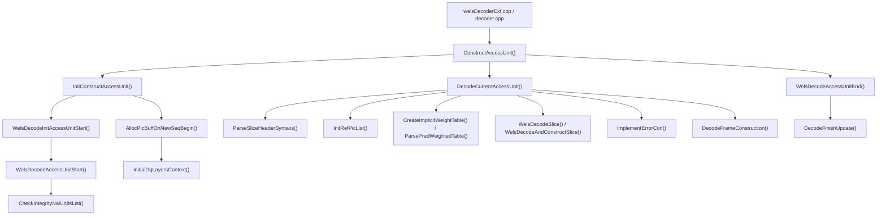
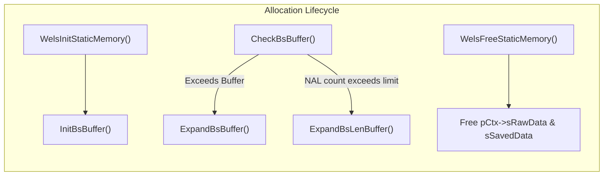
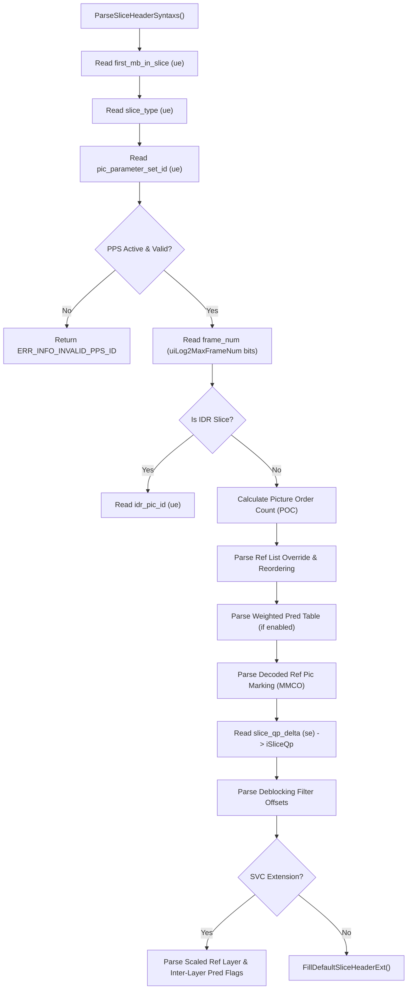
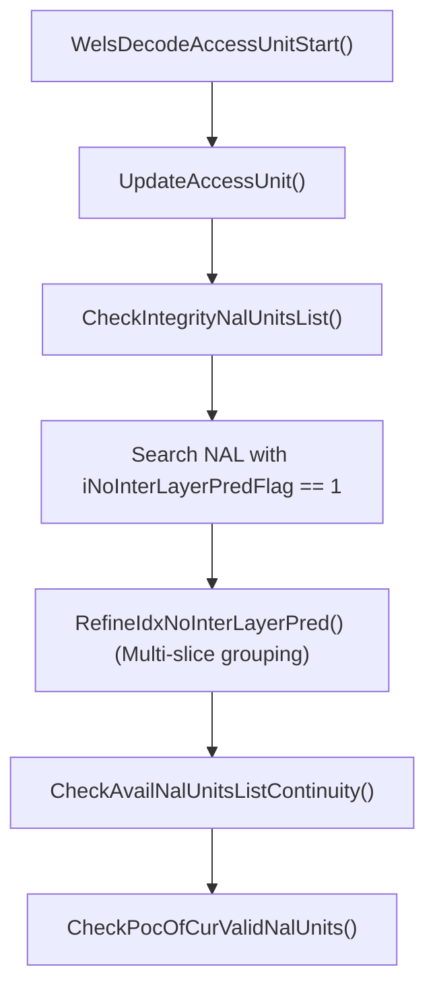
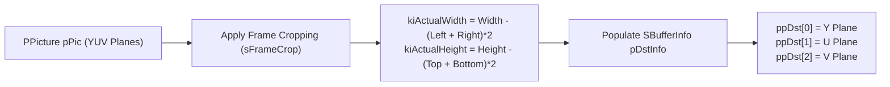

# OpenH264 Decoder Core Engine: `decoder_core.cpp`

This document provides an exhaustive, literate-programming-style technical analysis of [decoder_core.cpp](openh264/codec/decoder/core/src/decoder_core.cpp) and its associated header [decoder_core.h](openh264/codec/decoder/core/inc/decoder_core.h).

---

## Table of Contents
1. [Module Overview & Architectural Role](#1-module-overview--architectural-role)
2. [Data Structures, Type Definitions, and Constants](#2-data-structures-type-definitions-and-constants)
3. [Memory Allocation & Buffer Management Pipeline](#3-memory-allocation--buffer-management-pipeline)
4. [Bitstream Syntax Parsing & Validation](#4-bitstream-syntax-parsing--validation)
5. [Access Unit (AU) Assembly & Integrity Checking](#5-access-unit-au-assembly--integrity-checking)
6. [Reference Picture List Construction & Weighted Prediction](#6-reference-picture-list-construction--weighted-prediction)
7. [Frame Construction & Output Formatting](#7-frame-construction--output-formatting)
8. [Comprehensive Function Reference & Deep Dive](#8-comprehensive-function-reference--deep-dive)
9. [Error Handling, Error Concealment, and Edge Cases](#9-error-handling-error-concealment-and-edge-cases)

---

## 1. Module Overview & Architectural Role

The file [decoder_core.cpp](openh264/codec/decoder/core/src/decoder_core.cpp) serves as the **central nervous system and execution coordinator** of the OpenH264 video decoding engine. While specialized modules handle individual phases of H.264 decoding (such as Exp-Golomb NAL demuxing in [au_parser.cpp](openh264/codec/decoder/core/src/au_parser.cpp), CAVLC/CABAC entropy parsing in [parse_mb_syn_cavlc.cpp](openh264/codec/decoder/core/src/parse_mb_syn_cavlc.cpp) / [parse_mb_syn_cabac.cpp](openh264/codec/decoder/core/src/parse_mb_syn_cabac.cpp), macroblock reconstruction in [rec_mb.cpp](openh264/codec/decoder/core/src/rec_mb.cpp), and deblocking in [deblocking.cpp](openh264/codec/decoder/core/src/deblocking.cpp)), `decoder_core.cpp` bridges high-level API entry points ([decoder.cpp](openh264/codec/decoder/core/src/decoder.cpp)) with the underlying decoding pipelines.



### Core Responsibilities
1. **Dynamic Memory & Buffer Management**:
   - Manages bitstream buffer capacity (`sRawData`, `sSavedData`) and expands buffers dynamically (`ExpandBsBuffer()`, `ExpandBsLenBuffer()`).
   - Allocates and deallocates macroblock-level data buffers across spatial Dependency-Quality (DQ) layers (`InitialDqLayersContext()`, `UninitialDqLayersContext()`).
2. **Slice Header Parsing & Verification**:
   - Parses AVC slice headers and SVC extension headers (`ParseSliceHeaderSyntaxs()`, `DecodeNalHeaderExt()`).
   - Validates all syntax parameters (first MB in slice, slice type, PPS ID, SPS ID, frame num, POC LSB/MSB, reference index overrides, deblocking filter parameters).
3. **Access Unit (AU) Verification & Multi-Layer Continuity**:
   - Analyzes NAL unit chains in an Access Unit to confirm interlayer prediction dependency continuity (`CheckIntegrityNalUnitsList()`, `CheckAvailNalUnitsListContinuity()`, `RefineIdxNoInterLayerPred()`).
4. **Reference Picture Management & Weighted Prediction**:
   - Constructs List 0 (`LIST_0`) and List 1 (`LIST_1`) reference lists (`InitRefPicList()`).
   - Parses explicit weighted prediction tables (`ParsePredWeightedTable()`) and derives implicit weighted biprediction scaling factors (`CreateImplicitWeightTable()`).
5. **Frame Output Construction & Cropping**:
   - Maps reconstructed picture planes ($Y, U, V$) to user-facing `SBufferInfo` structs (`DecodeFrameConstruction()`), applying frame cropping offsets (`SPosOffset`).
6. **Error Resiliency & Concealment Coordination**:
   - Interacts with the error concealment subsystem (`ImplementErrorCon()`, `MarkECFrameAsRef()`, `CheckAndFinishLastPic()`) when packet loss or bitstream corruption occurs.

---

## 2. Data Structures, Type Definitions, and Constants

### 2.1 Numeric Constants

Defined in [decoder_core.cpp](openh264/codec/decoder/core/src/decoder_core.cpp#L861-L869) and core headers:

| Constant | Value | Description |
| :--- | :--- | :--- |
| `SLICE_HEADER_IDR_PIC_ID_MAX` | `65535` ($2^{16}-1$) | Maximum permitted value for `idr_pic_id` according to ITU-T H.264 Section 7.4.3. |
| `SLICE_HEADER_REDUNDANT_PIC_CNT_MAX` | `127` | Maximum value for `redundant_pic_cnt`. OpenH264 rejects values $>0$. |
| `SLICE_HEADER_ALPHAC0_BETA_OFFSET_MIN` | `-12` | Lower bound for deblocking filter offsets `slice_alpha_c0_offset_div2 * 2` and `slice_beta_offset_div2 * 2`. |
| `SLICE_HEADER_ALPHAC0_BETA_OFFSET_MAX` | `12` | Upper bound for deblocking filter offsets. |
| `SLICE_HEADER_INTER_LAYER_ALPHAC0_BETA_OFFSET_MIN` | `-12` | Lower bound for SVC inter-layer deblocking filter offsets. |
| `SLICE_HEADER_INTER_LAYER_ALPHAC0_BETA_OFFSET_MAX` | `12` | Upper bound for SVC inter-layer deblocking filter offsets. |
| `MAX_NUM_REF_IDX_L0_ACTIVE_MINUS1` | `15` | Maximum index override for active List 0 references ($16$ references max). |
| `MAX_NUM_REF_IDX_L1_ACTIVE_MINUS1` | `15` | Maximum index override for active List 1 references. |
| `SLICE_HEADER_CABAC_INIT_IDC_MAX` | `2` | Maximum index for CABAC context initialization table (`cabac_init_idc` $\in [0, 2]$). |
| `LAYER_NUM_EXCHANGEABLE` | `4` | Number of interchangeable spatial DQ layers allocated in macroblock buffer cache. |
| `MIN_ACCESS_UNIT_CAPACITY` | Context-dependent | Base allocation unit for AU raw bitstream buffers. |
| `MAX_ACCESS_UNIT_CAPACITY` | Context-dependent | Upper memory guard limit for reconstructed AU byte stream. |

---

### 2.2 Core Data Structures Managed by `decoder_core.cpp`

#### 1. Spatial Dependency Layer (`SDqLayer` / `PDqLayer`)
Declared in [decoder_context.h](openh264/codec/decoder/core/inc/decoder_context.h#L182-L225). Represents an individual spatial layer or slice context in the SVC hierarchy.

```cpp
typedef struct TagDqLayer {
  SLayerInfo            sLayerInfo;                      // Layer NAL & slice header metadata
  PBitStringAux         pBitStringAux;                   // Bitstream reader for current layer
  PPicture              pDec;                            // Target reconstructed picture buffer
  int32_t               iMbWidth;                        // Picture width in 16x16 macroblocks
  int32_t               iMbHeight;                       // Picture height in 16x16 macroblocks
  int32_t               iSliceIdcBackup;                 // Unique slice identifier backup
  uint8_t               uiPpsId;                         // Active PPS identifier
  uint8_t               uiDisableInterLayerDeblockingFilterIdc; // Inter-layer deblocking control
  int32_t               iInterLayerSliceAlphaC0Offset;   // Inter-layer deblocking alpha offset
  int32_t               iInterLayerSliceBetaOffset;      // Inter-layer deblocking beta offset
  int32_t               iSliceGroupChangeCycle;          // FMO slice group change cycle
  bool                  bStoreRefBasePicFlag;            // SVC base picture storage flag
  bool                  bTCoeffLevelPredFlag;            // Transform coefficient prediction flag
  bool                  bConstrainedIntraResamplingFlag; // SVC constrained intra resampling
  uint8_t               uiRefLayerDqId;                  // Reference layer DQ ID
  uint8_t               uiRefLayerChromaPhaseXPlus1Flag; // Chroma phase shift X
  uint8_t               uiRefLayerChromaPhaseYPlus1;     // Chroma phase shift Y
  bool                  bUseWeightPredictionFlag;        // P-slice explicit weighted prediction flag
  bool                  bUseWeightedBiPredIdc;           // B-slice weighted biprediction flag
  PPredWeightTable      pPredWeightTable;                // Pointer to prediction weight table
  PRefPicListReorderSyn pRefPicListReordering;           // Reference picture list reordering syntax
  PRefPicMarking        pRefPicMarking;                  // Decoded reference picture marking (MMCO)
  PRefBasePicMarking    pRefPicBaseMarking;              // SVC base reference picture marking
  uint8_t               uiLayerDqId;                     // Combined (uiDependencyId << 4) | uiQualityId
  bool                  bUseRefBasePicFlag;              // Reference base picture usage flag

  // Pointers to macroblock data arrays allocated in SWelsDecoderContext.sMb:
  uint32_t*             pMbType;                         // Macroblock types (Intra4x4, Intra16x16, Inter16x16, etc.)
  int32_t*              pSliceIdc;                       // Slice index to which each MB belongs
  int16_t             (*pMv[LIST_A])[16][2];             // Motion vectors for List 0 and List 1 (4x4 sub-blocks)
  int8_t              (*pRefIndex[LIST_A])[MB_BLOCK4x4_NUM]; // Reference frame indices per 4x4 block
  int8_t              (*pDirect)[MB_BLOCK4x4_NUM];       // B-slice direct mode flags per sub-block
  int8_t*               pLumaQp;                         // Luma quantization parameter per MB
  int8_t              (*pChromaQp)[2];                   // Chroma Cb and Cr quantization parameters per MB
  int16_t             (*pMvd[LIST_A])[16][2];            // Motion vector differences for List 0 / List 1
  uint16_t*             pCbfDc;                          // Coded block flags for DC transform blocks
  int8_t              (*pNzc)[24];                       // Non-zero coefficient counts (CAVLC context)
  int8_t              (*pNzcRs)[24];                     // Non-zero coefficient counts for residual
  int16_t             (*pScaledTCoeff)[MB_COEFF_LIST_SIZE]; // Dequantized transform coefficients
  int8_t              (*pIntraPredMode)[8];              // Intra prediction modes
  int8_t              (*pIntra4x4FinalMode)[MB_BLOCK4x4_NUM]; // Final Intra 4x4 prediction mode per sub-block
  uint8_t*              pIntraNxNAvailFlag;              // Neighbor availability flags for intra prediction
  int8_t*               pChromaPredMode;                 // Chroma intra prediction mode
  int8_t*               pCbp;                            // Coded Block Pattern (CBP)
  uint32_t            (*pSubMbType)[MB_PARTITION_SIZE];  // Sub-macroblock partition types
  int8_t*               pInterPredictionDoneFlag;        // Inter prediction completion flags
  int8_t*               pResidualPredFlag;               // Residual prediction flags (SVC)
  bool*                 pMbCorrectlyDecodedFlag;         // Macroblock decoding success flag (for Error Concealment)
  bool*                 pMbRefConcealedFlag;             // Macroblock reference concealed flag
} SDqLayer, *PDqLayer;
```

---

#### 2. Macroblock Layer Storage (`sMbCache` / `sMb`)
Allocated inside `InitialDqLayersContext()` in [decoder_core.cpp:1490-1633](openh264/codec/decoder/core/src/decoder_core.cpp#L1490-L1633). All arrays are indexed by `[iLayerIdx]` where `iLayerIdx < LAYER_NUM_EXCHANGEABLE` (4). Each array is sized to hold $N_{\text{MB}} = \text{iMbWidth} \times \text{iMbHeight}$ elements.

| Field in `pCtx->sMb` | Element Type | Dimensions / Size per MB | Purpose |
| :--- | :--- | :--- | :--- |
| `pMbType[i]` | `uint32_t*` | $1 \times \text{uint32_t}$ | Macroblock coding type (`MB_TYPE_INTRA4x4`, `MB_TYPE_16x16`, `MB_TYPE_SKIP`, etc.) |
| `pMv[i][list]` | `int16_t (*)[16][2]` | $16 \text{ blocks} \times 2 \text{ coords } (x,y)$ | Quarter-pel motion vectors for List 0 (`LIST_0`) and List 1 (`LIST_1`) |
| `pRefIndex[i][list]` | `int8_t (*)[16]` | $16 \text{ blocks} \times 1 \text{ byte}$ | Reference frame indices for motion compensation |
| `pDirect[i]` | `int8_t (*)[16]` | $16 \text{ blocks} \times 1 \text{ byte}$ | Direct spatial/temporal prediction flags for B-slices |
| `pLumaQp[i]` | `int8_t*` | $1 \times \text{int8_t}$ | Luma QP ($0 \dots 51$) |
| `pChromaQp[i]` | `int8_t (*)[2]` | $2 \text{ components } (Cb, Cr)$ | Chroma QP values |
| `pMvd[i][list]` | `int16_t (*)[16][2]` | $16 \text{ blocks} \times 2 \text{ coords}$ | Decoded motion vector differences |
| `pCbfDc[i]` | `uint16_t*` | $1 \times \text{uint16_t}$ | Bitmask flags for non-zero DC coefficients in luma and chroma |
| `pNzc[i]` | `int8_t (*)[24]` | $24 \text{ blocks} \times 1 \text{ byte}$ | Count of non-zero coefficients per 4x4 block (16 Luma + 4 Cb + 4 Cr) |
| `pScaledTCoeff[i]` | `int16_t (*)[384]` | $384 \times \text{int16_t}$ | Scaled residual transform coefficients |
| `pIntraPredMode[i]` | `int8_t (*)[8]` | $8 \times \text{int8_t}$ | Intra prediction mode indices |
| `pIntra4x4FinalMode[i]`| `int8_t (*)[16]` | $16 \times \text{int8_t}$ | Resolved 4x4 intra prediction mode per block |
| `pSliceIdc[i]` | `int32_t*` | $1 \times \text{int32_t}$ | Slice identifier mapping for FMO and boundary checking |

---

## 3. Memory Allocation & Buffer Management Pipeline

Bitstream parsing requires resilient memory structures that adapt to varying Access Unit (AU) sizes and NAL unit counts.



### Buffer Allocation Math & Equations

1. **Initial Bitstream Buffer Size**:
   $$\text{iMaxBsBufferSizeInByte} = \text{MIN\_ACCESS\_UNIT\_CAPACITY} \times \text{MAX\_BUFFERED\_NUM}$$
2. **Dynamic Bitstream Expansion (`ExpandBsBuffer`)**:
   When an incoming Access Unit length $L_{\text{src}}$ exceeds $\frac{\text{iMaxBsBufferSizeInByte}}{\text{MAX\_BUFFERED\_NUM}}$, the buffer is resized:
   $$\text{iNewBuffLen} = \max\left( L_{\text{src}} \times \text{MAX\_BUFFERED\_NUM},\; \text{iMaxBsBufferSizeInByte} \ll 1 \right)$$
   Pointers inside the active NAL unit bitstream readers (`PBitStringAux`) are updated via pointer delta translation:
   $$\Delta_{\text{ptr}} = p_{\text{NewBsBuff}} - p_{\text{RawData.pHead}}$$
   $$p_{\text{StartBuf}} \gets p_{\text{StartBuf}} + \Delta_{\text{ptr}}, \quad p_{\text{CurBuf}} \gets p_{\text{CurBuf}} + \Delta_{\text{ptr}}, \quad p_{\text{EndBuf}} \gets p_{\text{EndBuf}} + \Delta_{\text{ptr}}$$

3. **NAL Length Buffer Expansion (`ExpandBsLenBuffer`)**:
   When the number of NAL units $N_{\text{nal}}$ exceeds `iMaxNalNum`, the length array buffer expands:
   $$\text{iNewLen} = \min\left( N_{\text{curr}} \ll 1,\; \text{MAX\_MB\_SIZE} + 2 \right)$$

---

## 4. Bitstream Syntax Parsing & Validation

Slice header parsing is implemented in `ParseSliceHeaderSyntaxs()` ([decoder_core.cpp:874-1387](openh264/codec/decoder/core/src/decoder_core.cpp#L874-L1387)). It extracts parameters from the Exp-Golomb bitstream (`PBitStringAux`) and validates every field against H.264 standard specifications.



### Key Syntax Elements Parsed & Checked

1. **Slice Type Normalization**:
   $$eSliceType = \begin{cases} uiSliceType - 5 & \text{if } uiSliceType > 4 \\ uiSliceType & \text{otherwise} \end{cases}$$
   Allowed types: `I_SLICE` (2, 7), `P_SLICE` (0, 5), `B_SLICE` (1, 6), `SI_SLICE` (4, 9), `SP_SLICE` (3, 8).
2. **Picture Order Count (POC) Derivation (Type 0)**:
   Given `pic_order_cnt_lsb` ($POC_{\text{lsb}}$) and `MaxPicOrderCntLsb` ($MaxPOC_{\text{lsb}} = 2^{\text{iLog2MaxPocLsb}}$):
   $$\Delta POC = POC_{\text{lsb}} - PrevPOC_{\text{lsb}}$$
   $$POC_{\text{msb}} = \begin{cases} 
   PrevPOC_{\text{msb}} + MaxPOC_{\text{lsb}} & \text{if } (POC_{\text{lsb}} < PrevPOC_{\text{lsb}}) \land (PrevPOC_{\text{lsb}} - POC_{\text{lsb}} \ge \frac{MaxPOC_{\text{lsb}}}{2}) \\
   PrevPOC_{\text{msb}} - MaxPOC_{\text{lsb}} & \text{if } (POC_{\text{lsb}} > PrevPOC_{\text{lsb}}) \land (POC_{\text{lsb}} - PrevPOC_{\text{lsb}} > \frac{MaxPOC_{\text{lsb}}}{2}) \\
   PrevPOC_{\text{msb}} & \text{otherwise}
   \end{cases}$$
   $$\text{iPicOrderCntLsb} = POC_{\text{msb}} + POC_{\text{lsb}}$$

3. **Macroblock Quantization Parameter ($QP_Y$)**:
   $$\text{iSliceQp} = \text{iPicInitQp} + \text{iSliceQpDelta}, \quad \text{where } \text{iSliceQp} \in [0, 51]$$

---

## 5. Access Unit (AU) Assembly & Integrity Checking

In H.264 / SVC bitstreams, an Access Unit can contain multiple NAL units belonging to different spatial layers, temporal layers, or slices.



### Multi-Slice Continuity and Inter-Layer Validation
- `CheckIntegrityNalUnitsList()` scans backwards from `uiEndPos` to find the base reference NAL unit (`iNoInterLayerPredFlag == 1`).
- `RefineIdxNoInterLayerPred()` ensures that multi-slice frames belonging to the same layer, temporal ID, frame number, and POC are preserved and decoded as a single cohesive unit.
- `CheckAvailNalUnitsListContinuity()` verifies that the spatial dependency chain $D_0 \to D_1 \dots \to D_N$ is unbroken. If a quality layer ($Q > 0$) lacks its corresponding base layer ($Q = 0$), decoding terminates at the last intact layer.

---

## 6. Reference Picture List Construction & Weighted Prediction

### 6.1 Reference Picture List Initialization & Reordering
Implemented in `InitRefPicList()` ([decoder_core.cpp:2435-2452](openh264/codec/decoder/core/src/decoder_core.cpp#L2435-L2452)):
- For P-slices: Calls `WelsInitRefList(pCtx, iPoc)`.
- For B-slices: Calls `WelsInitBSliceRefList(pCtx, iPoc)` and builds implicit weight scaling tables.
- List reordering syntax (`ParseRefPicListReordering()`) supports:
  - `uiReorderingOfPicNumsIdc == 0`: Subtract difference from predicted picture number.
  - `uiReorderingOfPicNumsIdc == 1`: Add difference to predicted picture number.
  - `uiReorderingOfPicNumsIdc == 2`: Assign long-term picture number.
  - `uiReorderingOfPicNumsIdc == 3`: End reordering loop.

---

### 6.2 Explicit vs. Implicit Weighted Prediction

#### Explicit Weighted Prediction (`ParsePredWeightedTable`)
When `pPps->bWeightedPredFlag` is active (for P-slices) or `pPps->uiWeightedBipredIdc == 1` (for B-slices), weights and offsets are read directly from the bitstream:
- Luma log2 denominator $W_{\text{denom}, Y}$ and Chroma log2 denominator $W_{\text{denom}, C}$.
- Sample prediction formula:
  $$P(x,y) = \text{Clip1}_Y\left( \left( P_0(x,y) \cdot w_0 + 2^{W_{\text{denom}}-1} \right) \gg W_{\text{denom}} + o_0 \right)$$

#### Implicit Weighted Biprediction (`CreateImplicitWeightTable`)
When `pPps->uiWeightedBipredIdc == 2`, prediction weights are derived implicitly from temporal picture order count distances:

$$iTb = \text{Clip3}\left(-128, 127, POC - POC_0\right)$$
$$iTd = \text{Clip3}\left(-128, 127, POC_1 - POC_0\right)$$
$$iTx = \frac{16384 + (|iTd| \gg 1)}{iTd}$$
$$\text{DistScaleFactor} = (iTb \cdot iTx + 32) \gg 8$$

If $\text{DistScaleFactor} \in [-64, 128]$, the implicit weight for reference pair $(iRef0, iRef1)$ is:
$$W_1 = 64 - \text{DistScaleFactor}, \quad W_0 = \text{DistScaleFactor}$$
Otherwise, default symmetric weights ($W_0 = 32, W_1 = 32$) are applied.

---

## 7. Frame Construction & Output Formatting

Reconstructed YUV 4:2:0 frames are formatted for user consumption in `DecodeFrameConstruction()` ([decoder_core.cpp:47-283](openh264/codec/decoder/core/src/decoder_core.cpp#L47-L283)).



### Cropping Offsets & Plane Alignment Math
Given luma macroblock dimensions $W_{\text{MB}} = \text{iMbWidth} \times 16$ and $H_{\text{MB}} = \text{iMbHeight} \times 16$:
$$\text{Width}_{\text{actual}} = W_{\text{MB}} - 2 \cdot (\text{iLeftOffset} + \text{iRightOffset})$$
$$\text{Height}_{\text{actual}} = H_{\text{MB}} - 2 \cdot (\text{iTopOffset} + \text{iBottomOffset})$$

Plane buffer pointer offsets:
$$\text{Dst}_Y = \text{pData}[0] + 2 \cdot \text{iTopOffset} \cdot \text{iLinesize}[0] + 2 \cdot \text{iLeftOffset}$$
$$\text{Dst}_U = \text{pData}[1] + \text{iTopOffset} \cdot \text{iLinesize}[1] + \text{iLeftOffset}$$
$$\text{Dst}_V = \text{pData}[2] + \text{iTopOffset} \cdot \text{iLinesize}[1] + \text{iLeftOffset}$$

---

## 8. Comprehensive Function Reference & Deep Dive

Below is the complete function-by-function reference for all 49 routines in [decoder_core.cpp](openh264/codec/decoder/core/src/decoder_core.cpp).

---

### 1. `DecodeFrameConstruction`
[decoder_core.cpp:47-283](openh264/codec/decoder/core/src/decoder_core.cpp#L47-L283)

```cpp
static inline int32_t DecodeFrameConstruction (PWelsDecoderContext pCtx, uint8_t** ppDst, SBufferInfo* pDstInfo);
```
- **Purpose**: Assembles the completed decoded picture, calculates display cropping dimensions, fills the output user buffer structure `SBufferInfo`, handles parse-only bitstream copyback, and checks for resolution changes.
- **Parameters**:
  - `pCtx`: Pointer to decoder context ([SWelsDecoderContext](openh264/codec/decoder/core/inc/decoder_context.h)).
  - `ppDst`: Output pointers for planar Y, U, and V frame data.
  - `pDstInfo`: Structure filled with frame metadata (dimensions, strides, format, buffer status).
- **Return Value**: `ERR_NONE` on success; `ERR_INFO_MB_NUM_INADEQUATE`, `ERR_INFO_OUT_OF_MEMORY`, or `ERR_INFO_PARSEONLY_ERROR` on failure.

---

### 2. `CheckSliceNeedReconstruct`
[decoder_core.cpp:285-287](openh264/codec/decoder/core/src/decoder_core.cpp#L285-L287)

```cpp
inline bool CheckSliceNeedReconstruct (uint8_t uiLayerDqId, uint8_t uiTargetDqId);
```
- **Purpose**: Evaluates whether the current spatial dependency slice layer (`uiLayerDqId`) matches the requested target layer (`uiTargetDqId`).
- **Return Value**: `true` if slice must undergo reconstruction; `false` otherwise.

---

### 3. `GetTargetDqId`
[decoder_core.cpp:289-293](openh264/codec/decoder/core/src/decoder_core.cpp#L289-L293)

```cpp
inline uint8_t GetTargetDqId (uint8_t uiTargetDqId, SDecodingParam* psParam);
```
- **Purpose**: Derives the effective target DQ ID by taking the minimum of the stream's target DQ ID and the user's requested `uiTargetDqLayer`.

---

### 4. `HandleReferenceLostL0` & 5. `HandleReferenceLost`
[decoder_core.cpp:296-308](openh264/codec/decoder/core/src/decoder_core.cpp#L296-L308)

```cpp
inline void HandleReferenceLostL0 (PWelsDecoderContext pCtx, PNalUnit pCurNal);
inline void HandleReferenceLost (PWelsDecoderContext pCtx, PNalUnit pCurNal);
```
- **Purpose**: Sets error flags (`bReferenceLostAtT0Flag`, `dsBitstreamError`, `dsRefLost`) when reference frames are missing in temporal base layers (`uiTemporalId == 0` or `1`).

---

### 6. `WelsDecodeConstructSlice`
[decoder_core.cpp:310-318](openh264/codec/decoder/core/src/decoder_core.cpp#L310-L318)

```cpp
inline int32_t WelsDecodeConstructSlice (PWelsDecoderContext pCtx, PNalUnit pCurNal);
```
- **Purpose**: Wrapper that invokes `WelsTargetSliceConstruction(pCtx)` and triggers `HandleReferenceLostL0` if slice reconstruction fails.

---

### 7. `ParsePredWeightedTable`
[decoder_core.cpp:320-395](openh264/codec/decoder/core/src/decoder_core.cpp#L320-L395)

```cpp
int32_t ParsePredWeightedTable (PBitStringAux pBs, PSliceHeader pSh);
```
- **Purpose**: Parses explicit weighted prediction tables from the slice header bitstream for luma and chroma across `LIST_0` and `LIST_1`.
- **Validation**: Bounds-checks log2 weight denominators $\in [0, 7]$ and weight/offset values $\in [-128, 127]$.

---

### 8. `CreateImplicitWeightTable`
[decoder_core.cpp:397-442](openh264/codec/decoder/core/src/decoder_core.cpp#L397-L442)

```cpp
void CreateImplicitWeightTable (PWelsDecoderContext pCtx);
```
- **Purpose**: Computes implicit biprediction weights ($W_0, W_1$) for B-slices based on temporal POC distances between the current picture and reference frames in `LIST_0` and `LIST_1`.

---

### 9. `ParseRefPicListReordering`
[decoder_core.cpp:447-499](openh264/codec/decoder/core/src/decoder_core.cpp#L447-L499)

```cpp
int32_t ParseRefPicListReordering (PBitStringAux pBs, PSliceHeader pSh);
```
- **Purpose**: Parses reference picture list modification syntax elements (`modification_of_pic_nums_idc`, `abs_diff_pic_num_minus1`, `long_term_pic_num`) for P and B slices.

---

### 10. `ParseDecRefPicMarking`
[decoder_core.cpp:501-569](openh264/codec/decoder/core/src/decoder_core.cpp#L501-L569)

```cpp
int32_t ParseDecRefPicMarking (PWelsDecoderContext pCtx, PBitStringAux pBs, PSliceHeader pSh, PSps pSps, const bool kbIdrFlag);
```
- **Purpose**: Parses memory management control operations (MMCO 1 to 6) or IDR reference marking flags (`no_output_of_prior_pics_flag`, `long_term_reference_flag`).

---

### 11. `FillDefaultSliceHeaderExt`
[decoder_core.cpp:571-603](openh264/codec/decoder/core/src/decoder_core.cpp#L571-L603)

```cpp
bool FillDefaultSliceHeaderExt (PSliceHeaderExt pShExt, PNalUnitHeaderExt pNalExt);
```
- **Purpose**: Initializes default SVC extension parameters when decoding baseline AVC streams without SVC NAL extension headers.

---

### 12. `InitBsBuffer`
[decoder_core.cpp:605-646](openh264/codec/decoder/core/src/decoder_core.cpp#L605-L646)

```cpp
int32_t InitBsBuffer (PWelsDecoderContext pCtx);
```
- **Purpose**: Allocates initial raw bitstream memory buffers (`sRawData`) and parse-only buffers (`pParserBsInfo`, `sSavedData`) using `CMemoryAlign`.

---

### 13. `ExpandBsBuffer` & 14. `ExpandBsLenBuffer` & 15. `CheckBsBuffer`
[decoder_core.cpp:648-748](openh264/codec/decoder/core/src/decoder_core.cpp#L648-L748)

```cpp
int32_t ExpandBsBuffer (PWelsDecoderContext pCtx, const int kiSrcLen);
int32_t ExpandBsLenBuffer (PWelsDecoderContext pCtx, const int kiCurrLen);
int32_t CheckBsBuffer (PWelsDecoderContext pCtx, const int32_t kiSrcLen);
```
- **Purpose**: Checks bitstream capacity and reallocates memory buffers dynamically when AU size or NAL unit count exceeds existing allocations.

---

### 16. `WelsInitStaticMemory` & 17. `WelsFreeStaticMemory`
[decoder_core.cpp:758-823](openh264/codec/decoder/core/src/decoder_core.cpp#L758-L823)

```cpp
int32_t WelsInitStaticMemory (PWelsDecoderContext pCtx);
void WelsFreeStaticMemory (PWelsDecoderContext pCtx);
```
- **Purpose**: Top-level static initialization and teardown of AU NAL unit lists (`pAccessUnitList`) and bitstream buffers at decoder creation and destruction.

---

### 18. `DecodeNalHeaderExt`
[decoder_core.cpp:831-849](openh264/codec/decoder/core/src/decoder_core.cpp#L831-L849)

```cpp
void DecodeNalHeaderExt (PNalUnit pNal, uint8_t* pSrc);
```
- **Purpose**: Parses 3-byte SVC NAL unit header extension extracting `idr_flag`, `priority_id`, `no_inter_layer_pred_flag`, `dependency_id`, `quality_id`, and `temporal_id`.

---

### 19. `UpdateDecoderStatisticsForActiveParaset`
[decoder_core.cpp:852-859](openh264/codec/decoder/core/src/decoder_core.cpp#L852-L859)

```cpp
void UpdateDecoderStatisticsForActiveParaset (SDecoderStatistics* pDecoderStatistics, PSps pSps, PPps pPps);
```
- **Purpose**: Records active SPS ID, PPS ID, profile IDC, and level IDC in `SDecoderStatistics`.

---

### 20. `ParseSliceHeaderSyntaxs`
[decoder_core.cpp:874-1387](openh264/codec/decoder/core/src/decoder_core.cpp#L874-L1387)

```cpp
int32_t ParseSliceHeaderSyntaxs (PWelsDecoderContext pCtx, PBitStringAux pBs, const bool kbExtensionFlag);
```
- **Purpose**: Comprehensive parser for AVC and SVC slice headers. Parses macroblock addresses, slice types, parameter set IDs, frame numbers, POC, reference picture lists, weighted prediction tables, MMCO commands, quantization parameters, and deblocking filter offsets.

---

### 21. `PrefetchNalHeaderExtSyntax`
[decoder_core.cpp:1394-1438](openh264/codec/decoder/core/src/decoder_core.cpp#L1394-L1438)

```cpp
bool PrefetchNalHeaderExtSyntax (PWelsDecoderContext pCtx, PNalUnit const kppDst, PNalUnit const kpSrc);
```
- **Purpose**: Propagates SVC prefix NAL header metadata (`SNalUnitHeaderExt`, `SRefBasePicMarking`) to the succeeding VCL NAL unit.

---

### 22. `UpdateAccessUnit`
[decoder_core.cpp:1442-1488](openh264/codec/decoder/core/src/decoder_core.cpp#L1442-L1488)

```cpp
int32_t UpdateAccessUnit (PWelsDecoderContext pCtx);
```
- **Purpose**: Updates target DQ ID for current AU, verifies presence of IDR keyframes upon sequence start or reference loss, and flags mosaic avoidance errors.

---

### 23. `InitialDqLayersContext` & 24. `UninitialDqLayersContext`
[decoder_core.cpp:1490-1804](openh264/codec/decoder/core/src/decoder_core.cpp#L1490-L1804)

```cpp
int32_t InitialDqLayersContext (PWelsDecoderContext pCtx, const int32_t kiMaxWidth, const int32_t kiMaxHeight);
void UninitialDqLayersContext (PWelsDecoderContext pCtx);
```
- **Purpose**: Allocates and frees the full suite of macroblock-level arrays (`pMbType`, `pMv`, `pRefIndex`, `pDirect`, `pLumaQp`, `pChromaQp`, `pNzc`, `pScaledTCoeff`, etc.) for all interchangeable spatial layers.

---

### 25. `ResetCurrentAccessUnit`, 26. `ForceResetCurrentAccessUnit`, 27. `ForceClearCurrentNal`, 28. `ForceResetParaSetStatusAndAUList`
[decoder_core.cpp:1806-1875](openh264/codec/decoder/core/src/decoder_core.cpp#L1806-L1875)

```cpp
void ResetCurrentAccessUnit (PWelsDecoderContext pCtx);
void ForceResetCurrentAccessUnit (PAccessUnit pAu);
void ForceClearCurrentNal (PAccessUnit pAu);
void ForceResetParaSetStatusAndAUList (PWelsDecoderContext pCtx);
```
- **Purpose**: Housekeeping routines for AU list pointers and NAL unit queues during normal transitions and error recovery rollbacks.

---

### 29. `CheckAvailNalUnitsListContinuity`, 30. `RefineIdxNoInterLayerPred`, 31. `CheckPocOfCurValidNalUnits`, 32. `CheckIntegrityNalUnitsList`, 33. `CheckOnlyOneLayerInAu`
[decoder_core.cpp:1877-2132](openh264/codec/decoder/core/src/decoder_core.cpp#L1877-L2132)

```cpp
void CheckAvailNalUnitsListContinuity (PWelsDecoderContext pCtx, int32_t iStartIdx, int32_t iEndIdx);
void RefineIdxNoInterLayerPred (PAccessUnit pCurAu, int32_t* pIdxNoInterLayerPred);
bool CheckPocOfCurValidNalUnits (PAccessUnit pCurAu, int32_t pIdxNoInterLayerPred);
bool CheckIntegrityNalUnitsList (PWelsDecoderContext pCtx);
void CheckOnlyOneLayerInAu (PWelsDecoderContext pCtx);
```
- **Purpose**: AU validation suite ensuring all NAL units in an Access Unit belong to the same picture boundary, possess valid POC values, maintain inter-layer continuity, and support single-layer vs. multi-layer deblocking paths.

---

### 34. `WelsDecodeAccessUnitStart` & 35. `WelsDecodeAccessUnitEnd`
[decoder_core.cpp:2134-2164](openh264/codec/decoder/core/src/decoder_core.cpp#L2134-L2164)

```cpp
int32_t WelsDecodeAccessUnitStart (PWelsDecoderContext pCtx);
void WelsDecodeAccessUnitEnd (PWelsDecoderContext pCtx);
```
- **Purpose**: Entry and exit demarcations for Access Unit decoding. Handles integrity checks, copies last decoded NAL/slice header metadata, and resets AU list state.

---

### 36. `CheckNewSeqBeginAndUpdateActiveLayerSps`, 37. `WriteBackActiveParameters`, 38. `DecodeFinishUpdate`
[decoder_core.cpp:2170-2248](openh264/codec/decoder/core/src/decoder_core.cpp#L2170-L2248)

```cpp
static bool CheckNewSeqBeginAndUpdateActiveLayerSps (PWelsDecoderContext pCtx);
static void WriteBackActiveParameters (PWelsDecoderContext pCtx);
void DecodeFinishUpdate (PWelsDecoderContext pCtx);
```
- **Purpose**: Sequence boundary detection and parameter set activation. Overwrites buffered SPS/PPS into active storage upon sequence changes.

---

### 39. `WelsDecodeInitAccessUnitStart`, 40. `AllocPicBuffOnNewSeqBegin`, 41. `InitConstructAccessUnit`, 42. `ConstructAccessUnit`
[decoder_core.cpp:2258-2376](openh264/codec/decoder/core/src/decoder_core.cpp#L2258-L2376)

```cpp
int32_t WelsDecodeInitAccessUnitStart (PWelsDecoderContext pCtx, SBufferInfo* pDstInfo);
int32_t AllocPicBuffOnNewSeqBegin (PWelsDecoderContext pCtx);
int32_t InitConstructAccessUnit (PWelsDecoderContext pCtx, SBufferInfo* pDstInfo);
int32_t ConstructAccessUnit (PWelsDecoderContext pCtx, uint8_t** ppDst, SBufferInfo* pDstInfo);
```
- **Purpose**: Top-level orchestration functions for Access Unit construction. Allocates decoded picture buffers (`PPicBuff`) on new sequence boundaries and invokes `DecodeCurrentAccessUnit()`.

---

### 43. `InitDqLayerInfo`, 44. `WelsDqLayerDecodeStart`, 45. `InitRefPicList`, 46. `InitCurDqLayerData`
[decoder_core.cpp:2378-2484](openh264/codec/decoder/core/src/decoder_core.cpp#L2378-L2484)

```cpp
static inline void InitDqLayerInfo (PDqLayer pDqLayer, PLayerInfo pLayerInfo, PNalUnit pNalUnit, PPicture pPicDec);
void WelsDqLayerDecodeStart (PWelsDecoderContext pCtx, PNalUnit pCurNal, PSps pSps, PPps pPps);
int32_t InitRefPicList (PWelsDecoderContext pCtx, const uint8_t kuiNRi, int32_t iPoc);
void InitCurDqLayerData (PWelsDecoderContext pCtx, PDqLayer pCurDq);
```
- **Purpose**: Prepares spatial layer contexts, binds macroblock data buffer pointers to `pCurDqLayer`, and initializes reference picture lists before slice decoding begins.

---

### 47. `DecodeCurrentAccessUnit`
[decoder_core.cpp:2490-2890](openh264/codec/decoder/core/src/decoder_core.cpp#L2490-L2890)

```cpp
int32_t DecodeCurrentAccessUnit (PWelsDecoderContext pCtx, uint8_t** ppDst, SBufferInfo* pDstInfo);
```
- **Purpose**: The main slice decoding loop. Coordinates multithreaded slice decoding (`WelsDecodeAndConstructSlice()`) or single-threaded slice decoding (`WelsDecodeSlice()`), invokes Error Concealment (`ImplementErrorCon()`), performs reference picture expansion (`ExpandReferencingPicture()`), marks references (`WelsMarkAsRef()`), and constructs the final output picture (`DecodeFrameConstruction()`).

---

### 48. `CheckAndFinishLastPic` & 49. `CheckRefPicturesComplete`
[decoder_core.cpp:2892-3006](openh264/codec/decoder/core/src/decoder_core.cpp#L2892-L3006)

```cpp
bool CheckAndFinishLastPic (PWelsDecoderContext pCtx, uint8_t** ppDst, SBufferInfo* pDstInfo);
bool CheckRefPicturesComplete (PWelsDecoderContext pCtx);
```
- **Purpose**: Detects AU boundaries on non-VCL NAL arrival, finishes incomplete frames via Error Concealment, and verifies completion of all referenced pictures in `LIST_0`.

---

## 9. Error Handling, Error Concealment, and Edge Cases

[decoder_core.cpp](openh264/codec/decoder/core/src/decoder_core.cpp) integrates robust error recovery mechanisms designed for real-time video transmission over lossy packet networks:

1. **Parameter Set Loss Tracking**:
   - Missing SPS or PPS sets `pCtx->iErrorCode |= dsNoParamSets`.
   - Error counts are tracked in `pCtx->pDecoderStatistics->iPpsReportErrorNum` and `iSpsReportErrorNum`.
2. **Frame Gap Detection (Subclause 8.2.5.2)**:
   - Evaluates gaps between `iPrevFrameNum` and current `iFrameNum`. If frame numbers are discontinuous and gaps are disallowed, flags reference loss (`dsRefLost`).
3. **Error Concealment Triggers (`NeedErrorCon`)**:
   - If macroblocks are missing or corrupted (`iTotalNumMbRec < kiTotalNumMbInCurLayer`), the decoder triggers spatial or temporal error concealment (`ImplementErrorCon()`), provided `eEcActiveIdc != ERROR_CON_DISABLE`.
   - Successfully concealed frames are marked in the DPB (`MarkECFrameAsRef()`) to maintain decodability for subsequent P-frames.
