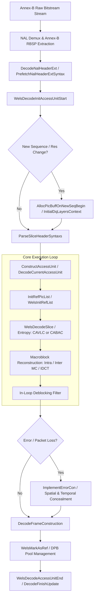
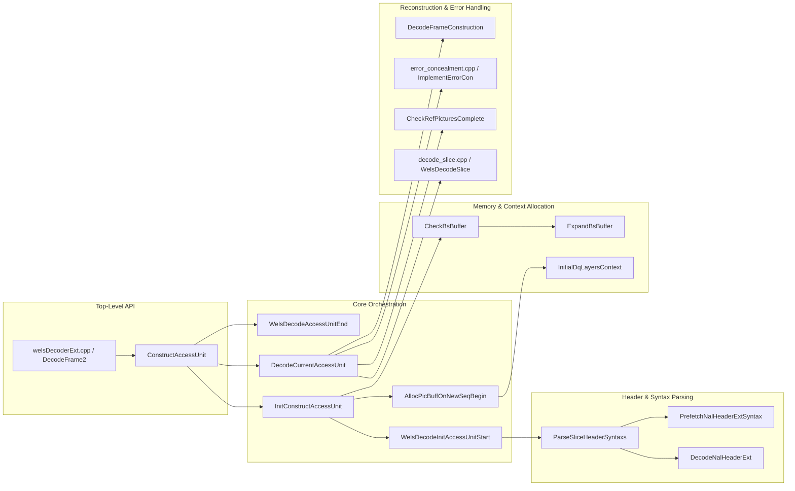

# OpenH264 Decoder Core Architecture & Interface Specification: `decoder_core.h`

This document provides an exhaustive, literate-programming-style technical specification for [`codec/decoder/core/inc/decoder_core.h`](openh264/codec/decoder/core/inc/decoder_core.h). It details the core execution pipelines, bitstream parsing routines, memory layout models, mathematical formulas, error concealment mechanics, and lifecycle management functions that drive the OpenH264 H.264/SVC video decoding engine.

---

## Table of Contents
1. [Module Architecture & Role](#1-module-architecture--role)
2. [Data Structure & Memory Model Breakdown](#2-data-structure--memory-model-breakdown)
   - [2.1 Decoder Context (`SWelsDecoderContext`)](#21-decoder-context-swelsdecodercontext)
   - [2.2 Dependency & Quality Layer Representation (`SDqLayer`)](#22-dependency--quality-layer-representation-sdqlayer)
   - [2.3 Access Unit & NAL Unit Structures (`SAccessUnit`, `SNalUnit`)](#23-access-unit--nal-unit-structures-saccessunit-snalunit)
   - [2.4 Bitstream Buffer & Parser Info Structures (`SDataBuffer`, `SParserBsInfo`)](#24-bitstream-buffer--parser-info-structures-sdatabuffer-sparserbsinfo)
3. [Deep-Dive Function Specifications](#3-deep-dive-function-specifications)
   - [3.1 Bitstream & Dynamic Memory Management](#31-bitstream--dynamic-memory-management)
     - [`InitBsBuffer`](#initbsbuffer)
     - [`ExpandBsBuffer`](#expandbsbuffer)
     - [`ExpandBsLenBuffer`](#expandbslenbuffer)
     - [`CheckBsBuffer`](#checkbsbuffer)
     - [`WelsInitStaticMemory`](#welsinitstaticmemory)
     - [`WelsFreeStaticMemory`](#welsfreestaticmemory)
     - [`InitialDqLayersContext`](#initialdqlayerscontext)
     - [`UninitialDqLayersContext`](#uninitialdqlayerscontext)
   - [3.2 NAL & Slice Header Syntax Parsing](#32-nal--slice-header-syntax-parsing)
     - [`DecodeNalHeaderExt`](#decodenalheaderext)
     - [`ParseSliceHeaderSyntaxs`](#parsesliceheadersyntaxs)
     - [`PrefetchNalHeaderExtSyntax`](#prefetchnalheaderextsyntax)
   - [3.3 Access Unit Pipeline & Macroblock Decoding](#33-access-unit-pipeline--macroblock-decoding)
     - [`WelsDecodeInitAccessUnitStart`](#welsdecodeinitaccessunitstart)
     - [`AllocPicBuffOnNewSeqBegin`](#allocpicbuffonnewseqbegin)
     - [`InitConstructAccessUnit`](#initconstructaccessunit)
     - [`ConstructAccessUnit`](#constructaccessunit)
     - [`DecodeCurrentAccessUnit`](#decodecurrentaccessunit)
     - [`CheckAndFinishLastPic`](#checkandfinishlastpic)
     - [`WelsDqLayerDecodeStart`](#welsdqlayerdecodestart)
     - [`WelsDecodeAccessUnitStart`](#welsdecodeaccessunitstart)
     - [`WelsDecodeAccessUnitEnd`](#welsdecodeaccessunitend)
     - [`DecodeFinishUpdate`](#decodefinishupdate)
   - [3.4 Error Recovery & Integrity Validation](#34-error-recovery--integrity-validation)
     - [`ForceResetCurrentAccessUnit`](#forceresetcurrentaccessunit)
     - [`ForceClearCurrentNal`](#forceclearcurrentnal)
     - [`CheckRefPicturesComplete`](#checkrefpicturescomplete)
     - [`ForceResetParaSetStatusAndAUList`](#forceresetparasetstatusandaulist)
4. [Call Graph & Interaction Matrix](#4-call-graph--interaction-matrix)

---

## 1. Module Architecture & Role

The header [`decoder_core.h`](openh264/codec/decoder/core/inc/decoder_core.h) serves as the primary internal interface for the OpenH264 decoding subsystem. It bridges raw Annex-B NAL bitstream demuxing, slice header extraction, spatial dependency layer context allocation, reference frame management, macroblock reconstruction, and in-loop error concealment.



### Key Architectural Tenets:
1. **Scalable Dependency Hierarchy**: OpenH264 structures decoding state using spatial dependency layers (`uiDependencyId`) and quality layers (`uiQualityId`). Single-layer AVC baseline streams are decoded as a single dependency layer (`uiDependencyId = 0`, `uiQualityId = 0`).
2. **Dynamic Buffer Resizing**: When incoming bitstreams or slice counts exceed initial allocations, internal buffers (`sRawData`, `sSavedData`, `pNalLenInByte`) automatically expand without losing bitstream parse offsets.
3. **Resilient Error Concealment (EC)**: If frame loss, slice corruption, or reference picture gaps are encountered, the decoder coordinates with [`error_concealment.h`](openh264/codec/decoder/core/inc/error_concealment.h) to perform spatial extrapolation or temporal collocated motion vector copy before writing to the output frame buffer.

---

## 2. Data Structure & Memory Model Breakdown

The routines declared in [`decoder_core.h`](openh264/codec/decoder/core/inc/decoder_core.h) operate directly on several foundational C++ structures defined across the decoder subsystem.

### 2.1 Decoder Context ([`SWelsDecoderContext`](openh264/codec/decoder/core/inc/decoder_context.h#L306-L455))
Type alias: `PWelsDecoderContext = SWelsDecoderContext*`

[`SWelsDecoderContext`](openh264/codec/decoder/core/inc/decoder_context.h#L306-L455) encapsulates the complete runtime state of an instantiated decoder engine:

| Field | Type | Description | Lifecycle / Scope |
| :--- | :--- | :--- | :--- |
| `pMemAlign` | [`CMemoryAlign*`](openh264/codec/common/inc/memory_align.h) | SIMD-aligned 16/32-byte memory manager | Lifetime of decoder context |
| `sRawData` | [`SDataBuffer`](openh264/codec/decoder/core/inc/decoder_context.h#L108-L114) | Active bitstream storage buffer | Dynamically expanded via [`ExpandBsBuffer`](openh264/codec/decoder/core/src/decoder_core.cpp#L648) |
| `sSavedData` | [`SDataBuffer`](openh264/codec/decoder/core/inc/decoder_context.h#L108-L114) | Backup bitstream buffer for `bParseOnly` mode | Allocated when `bParseOnly == true` |
| `pAccessUnitList` | [`PAccessUnit`](openh264/codec/decoder/core/inc/nalu.h) | Pre-allocated circular list of parsed NAL units | Initialized in [`WelsInitStaticMemory`](openh264/codec/decoder/core/src/decoder_core.cpp#L758) |
| `pCurDqLayer` | [`PDqLayer`](openh264/codec/decoder/core/inc/dec_frame.h#L50-L132) | Active spatial/quality layer context | Points to `pDqLayersList[0]` |
| `sMb` | [`SMbCache`](openh264/codec/decoder/core/inc/decoder_context.h#L240-L280) | Flattened arrays for macroblock modes, MVs, QPs, coefficients | Allocated in [`InitialDqLayersContext`](openh264/codec/decoder/core/src/decoder_core.cpp#L1490) |
| `pDec` | [`PPicture`](openh264/codec/decoder/core/inc/picture.h) | Target reconstructed picture for the current AU | Fetched from `pPicBuff` per frame |
| `sSpsPpsCtx` | [`SSpsPpsCtx`](openh264/codec/decoder/core/inc/decoder_context.h) | Global storage and lookup tables for active SPS/PPS | Persists across AU boundaries |

---

### 2.2 Dependency & Quality Layer Representation ([`SDqLayer`](openh264/codec/decoder/core/inc/dec_frame.h#L61-L132))
Type alias: `PDqLayer = SDqLayer*`

Represents the macroblock data structures and slice parameters for a specific spatial layer ($D$) and quality layer ($Q$):

```
SDqLayer Structure Memory Layout:
├── sLayerInfo (SLayerInfo)
│   ├── sNalHeaderExt (SNalUnitHeaderExt)
│   ├── sSliceInLayer (SSlice)
│   └── pSps, pPps, pSubsetSps
├── pBitStringAux (Bitstream Reader Pointer)
├── Macroblock Parameter Pointers (pMbType, pSliceIdc, pLumaQp, pChromaQp, pCbp)
├── Motion Vector & Reference Buffers (pMv[2], pMvd[2], pRefIndex[2], pDirect)
├── Transform Coefficient Matrices (pScaledTCoeff, pCbfDc, pNzc, pNzcRs)
└── Spatial Predictor Mode Arrays (pIntraPredMode, pIntra4x4FinalMode, pIntraNxNAvailFlag)
```

---

### 2.3 Access Unit & NAL Unit Structures ([`SAccessUnit`](openh264/codec/decoder/core/inc/nalu.h), [`SNalUnit`](openh264/codec/decoder/core/inc/nalu.h))
Type aliases: `PAccessUnit = SAccessUnit*`, `PNalUnit = SNalUnit*`

* **[`SAccessUnit`](openh264/codec/decoder/core/inc/nalu.h)**: Represents an entire H.264 Access Unit (one complete coded picture).
  * `pNalUnitsList`: Array of pointers to parsed NAL units (`PNalUnit[MAX_NAL_UNIT_NUM_IN_AU]`).
  * `uiAvailUnitsNum`: Total NAL units extracted by Annex-B parser.
  * `uiActualUnitsNum`: Total NAL units belonging to the validated AU.
  * `uiStartPos`, `uiEndPos`: Slice index range `[uiStartPos, uiEndPos]` for the target layer.
  * `bCompletedAuFlag`: Boolean indicating AU bitstream boundary completion.

* **[`SNalUnit`](openh264/codec/decoder/core/inc/nalu.h)**: Represents a single Network Abstraction Layer unit.
  * `sNalHeaderExt`: Parsed SVC / AVC NAL unit header extension ([`SNalUnitHeaderExt`](openh264/codec/decoder/core/inc/nalu.h)).
  * `sNalData.sVclNal`: Contains `sSliceHeaderExt` and auxiliary bitstream reader `sSliceBitsRead` ([`SBitStringAux`](openh264/codec/decoder/core/inc/bit_stream.h)).

---

### 2.4 Bitstream Buffer & Parser Info Structures

* **[`SDataBuffer`](openh264/codec/decoder/core/inc/decoder_context.h#L108-L114)**:
  Manages continuous byte stream buffers:
  ```cpp
  typedef struct TagDataBuffer {
    uint8_t* pHead;      // Start address of allocated memory
    uint8_t* pEnd;       // End boundary (pHead + capacity)
    uint8_t* pStartPos;  // Start of current valid AU payload
    uint8_t* pCurPos;    // Current read/write cursor
  } SDataBuffer;
  ```

* **[`SParserBsInfo`](openh264/codec/decoder/core/inc/decoder_context.h)**:
  Used exclusively in `bParseOnly` mode to output demuxed NAL byte streams:
  * `pDstBuff`: Destination buffer storing SPS/PPS and RBSP payloads.
  * `pNalLenInByte`: Integer array storing byte length of each parsed NAL unit.
  * `iNalNum`: Total number of parsed NAL units stored in `pNalLenInByte`.

---

## 3. Deep-Dive Function Specifications

Below is the complete function-by-function analysis of all 25 routines declared in [`decoder_core.h`](openh264/codec/decoder/core/inc/decoder_core.h) and implemented in [`decoder_core.cpp`](openh264/codec/decoder/core/src/decoder_core.cpp).

---

### 3.1 Bitstream & Dynamic Memory Management

#### `InitBsBuffer`
[decoder_core.cpp#L605-L646](openh264/codec/decoder/core/src/decoder_core.cpp#L605-L646)

```cpp
int32_t InitBsBuffer (PWelsDecoderContext pCtx);
```

* **Purpose**: Allocates initial contiguous bitstream memory for `sRawData` (and `sSavedData` / `SParserBsInfo` in `bParseOnly` mode).
* **Input Parameters**:
  * `pCtx`: Pointer to the root [`SWelsDecoderContext`](openh264/codec/decoder/core/inc/decoder_context.h). Must not be `NULL`.
* **Return Value**:
  * `ERR_NONE` (`0`): Allocation succeeded.
  * `ERR_INFO_INVALID_PTR`: `pCtx` is `NULL`.
  * `ERR_INFO_OUT_OF_MEMORY`: System memory allocation failed.
* **Mathematical / Buffer Sizing Model**:
  $$\text{iMaxBsBufferSizeInByte} = \text{MIN\_ACCESS\_UNIT\_CAPACITY} \times \text{MAX\_BUFFERED\_NUM} = 262144 \times 8 = 2{,}097{,}152 \text{ bytes (2 MB)}$$
* **Algorithm**:
  1. Requests $2\text{ MB}$ from `pCtx->pMemAlign->WelsMallocz`.
  2. Sets `sRawData.pHead`, `sRawData.pStartPos`, `sRawData.pCurPos`, and `sRawData.pEnd`.
  3. If `pCtx->pParam->bParseOnly` is enabled:
     * Allocates `pCtx->pParserBsInfo` (`sizeof(SParserBsInfo)`).
     * Allocates `pDstBuff` with size $\text{MAX\_ACCESS\_UNIT\_CAPACITY} = 4{,}194{,}304 \text{ bytes (4 MB)}$.
     * Allocates `sSavedData` ($2\text{ MB}$).
     * Allocates `pNalLenInByte` array of length $\text{iMaxNalNum} = \text{MAX\_NAL\_UNITS\_IN\_LAYER} + 2 = 1026$.

---

#### `ExpandBsBuffer`
[decoder_core.cpp#L648-L700](openh264/codec/decoder/core/src/decoder_core.cpp#L648-L700)

```cpp
int32_t ExpandBsBuffer (PWelsDecoderContext pCtx, const int32_t kiSrcLen);
```

* **Purpose**: Dynamically reallocates and expands the raw bitstream buffer when incoming NAL/AU payload size `kiSrcLen` threatens buffer overflow.
* **Input Parameters**:
  * `pCtx`: Pointer to decoder context.
  * `kiSrcLen`: Size in bytes of the incoming bitstream chunk.
* **Return Value**: `ERR_NONE` (`0`) on success, `ERR_INFO_OUT_OF_MEMORY` or `ERR_INFO_INVALID_PTR` on failure.
* **Algorithmic Sizing Formula**:
  $$\text{iNewBuffLen} = \max\left(\text{kiSrcLen} \times \text{MAX\_BUFFERED\_NUM},\; \text{iMaxBsBufferSizeInByte} \ll 1\right)$$
* **Pointer Fixup Arithmetic**:
  When `sRawData.pHead` is reallocated to `pNewBsBuff`, all internal pointers across active NAL bit readers in `pAccessUnitList` are offset:
  $$p_{\text{new}} = p_{\text{old}} - p_{\text{oldHead}} + p_{\text{newHead}}$$
  Applied to:
  * `pSliceBitsRead->pStartBuf`
  * `pSliceBitsRead->pEndBuf`
  * `pSliceBitsRead->pCurBuf`
  * `pCtx->sRawData.pStartPos`, `pCtx->sRawData.pCurPos`

---

#### `ExpandBsLenBuffer`
[decoder_core.cpp#L702-L731](openh264/codec/decoder/core/src/decoder_core.cpp#L702-L731)

```cpp
int32_t ExpandBsLenBuffer (PWelsDecoderContext pCtx, const int32_t kiCurrLen);
```

* **Purpose**: Expands the NAL unit length array `pNalLenInByte` in `SParserBsInfo` when slice count per frame exceeds initial limits.
* **Algorithm**:
  1. Checks if `kiCurrLen >= MAX_MB_SIZE + 2` ($36864 + 2 = 36866$). If exceeded, logs warning and returns `ERR_INFO_OUT_OF_MEMORY`.
  2. Computes new capacity:
     $$\text{iNewLen} = \min\left(\text{kiCurrLen} \ll 1,\; \text{MAX\_MB\_SIZE} + 2\right)$$
  3. Reallocates `pNalLenInByte`, copies previous length records using `memcpy`, frees old buffer, and updates `pCtx->iMaxNalNum = iNewLen`.

---

#### `CheckBsBuffer`
[decoder_core.cpp#L733-L748](openh264/codec/decoder/core/src/decoder_core.cpp#L733-L748)

```cpp
int32_t CheckBsBuffer (PWelsDecoderContext pCtx, const int32_t kiSrcLen);
```

* **Purpose**: Pre-validation guard before parsing incoming NAL bitstream data.
* **Logic**:
  * If $\text{kiSrcLen} > \text{MAX\_ACCESS\_UNIT\_CAPACITY}$ ($4\text{ MB}$), sets `pCtx->iErrorCode |= dsBitstreamError` and returns `ERR_INFO_INVALID_ACCESS`.
  * If $\text{kiSrcLen} > \frac{\text{iMaxBsBufferSizeInByte}}{\text{MAX\_BUFFERED\_NUM}}$, invokes `ExpandBsBuffer(pCtx, kiSrcLen)`.

---

#### `WelsInitStaticMemory`
[decoder_core.cpp#L758-L773](openh264/codec/decoder/core/src/decoder_core.cpp#L758-L773)

```cpp
int32_t WelsInitStaticMemory (PWelsDecoderContext pCtx);
```

* **Purpose**: Top-level static initialization routine invoked when a decoder instance is created.
* **Operations**:
  1. Calls [`MemInitNalList`](openh264/codec/decoder/core/src/memmgr_nal_unit.cpp) to pre-allocate `MAX_NAL_UNIT_NUM_IN_AU` ($1024$) `SNalUnit` structures into `pCtx->pAccessUnitList`.
  2. Invokes `InitBsBuffer(pCtx)`.
  3. Sets defaults: `uiTargetDqId = (uint8_t)-1`, `bEndOfStreamFlag = false`.

---

#### `WelsFreeStaticMemory`
[decoder_core.cpp#L780-L823](openh264/codec/decoder/core/src/decoder_core.cpp#L780-L823)

```cpp
void WelsFreeStaticMemory (PWelsDecoderContext pCtx);
```

* **Purpose**: Deallocates static bitstream memory and NAL unit lists on decoder destruction.
* **Operations**: Calls `MemFreeNalList(&pCtx->pAccessUnitList, pMa)`, frees `sRawData.pHead`, `sSavedData.pHead`, `pParserBsInfo`, and `pCtx->pParam`.

---

#### `InitialDqLayersContext`
[decoder_core.cpp#L1490-L1633](openh264/codec/decoder/core/src/decoder_core.cpp#L1490-L1633)

```cpp
int32_t InitialDqLayersContext (PWelsDecoderContext pCtx, const int32_t kiMaxWidth, const int32_t kiMaxHeight);
```

* **Purpose**: Allocates all macroblock-level decoding cache tables and `SDqLayer` structures once target picture dimensions are known.
* **Macroblock Dimensions**:
  $$iMbWidth = \frac{\text{kiMaxWidth} + 15}{16} = (\text{kiMaxWidth} + 15) \gg 4$$
  $$iMbHeight = \frac{\text{kiMaxHeight} + 15}{16} = (\text{kiMaxHeight} + 15) \gg 4$$
  $$N_{\text{MB}} = iMbWidth \times iMbHeight$$
* **Allocated Buffers per Dependency Layer**:

| Member Buffer in `pCtx->sMb` | Element Type | Dimensions / Sizing | Purpose |
| :--- | :--- | :--- | :--- |
| `pMbType[i]` | `uint32_t*` | $N_{\text{MB}} \times 4\text{ B}$ | Macroblock prediction types |
| `pMv[i][LIST_0/1]` | `int16_t (*)[16][2]` | $N_{\text{MB}} \times 16 \times 2 \times 2\text{ B}$ | Motion vector cache (quarter-pel) |
| `pRefIndex[i][LIST_0/1]` | `int8_t (*)[16]` | $N_{\text{MB}} \times 16 \times 1\text{ B}$ | 4x4 sub-block reference list indices |
| `pDirect[i]` | `int8_t (*)[16]` | $N_{\text{MB}} \times 16 \times 1\text{ B}$ | Direct prediction mode flags |
| `pLumaQp[i]`, `pChromaQp[i]` | `int8_t*`, `int8_t(*)[2]` | $N_{\text{MB}} \times 1\text{ B}$, $N_{\text{MB}} \times 2\text{ B}$ | Luma and Chroma QP tables |
| `pNzc[i]`, `pNzcRs[i]` | `int8_t (*)[24]` | $N_{\text{MB}} \times 24 \times 1\text{ B}$ | Non-zero coefficient counts (16 Y + 4 Cb + 4 Cr) |
| `pScaledTCoeff[i]` | `int16_t (*)[256]` | $N_{\text{MB}} \times 256 \times 2\text{ B}$ | Dequantized transform coefficients |
| `pIntraPredMode[i]` | `int8_t (*)[8]` | $N_{\text{MB}} \times 8 \times 1\text{ B}$ | Top/left neighboring intra modes |

---

#### `UninitialDqLayersContext`
[decoder_core.cpp#L1637-L1804](openh264/codec/decoder/core/src/decoder_core.cpp#L1637-L1804)

```cpp
void UninitialDqLayersContext (PWelsDecoderContext pCtx);
```

* **Purpose**: Frees all per-MB cache buffers and `SDqLayer` contexts. Resets `bInitialDqLayersMem = false`, `iPicWidthReq = 0`, `iPicHeightReq = 0`.

---

### 3.2 NAL & Slice Header Syntax Parsing

#### `DecodeNalHeaderExt`
[decoder_core.cpp#L831-L849](openh264/codec/decoder/core/src/decoder_core.cpp#L831-L849)

```cpp
void DecodeNalHeaderExt (PNalUnit pNal, uint8_t* pSrc);
```

* **Purpose**: Parses the 3-byte SVC NAL Unit Header Extension (Annex G subclause G.7.3.1.1) triggered when `eNalUnitType == NAL_UNIT_PREFIX` (14) or `NAL_UNIT_CODED_SLICE_EXT` (20).
* **Bit Extraction Logic**:
  ```
  Byte 0: [ reserved_one_bit (1b) | idr_flag (1b) | priority_id (6b) ]
  Byte 1: [ no_inter_layer_pred_flag (1b) | dependency_id (3b) | quality_id (4b) ]
  Byte 2: [ temporal_id (3b) | use_ref_base_pic_flag (1b) | discardable_flag (1b) | output_flag (1b) | reserved_three_2bits (2b) ]
  ```
* **Composite DQ Identifier**:
  $$\text{uiLayerDqId} = (\text{uiDependencyId} \ll 4) \mid \text{uiQualityId}$$

---

#### `ParseSliceHeaderSyntaxs`
[decoder_core.cpp#L874-L1387](openh264/codec/decoder/core/src/decoder_core.cpp#L874-L1387)

```cpp
int32_t ParseSliceHeaderSyntaxs (PWelsDecoderContext pCtx, PBitStringAux pBs, const bool kbExtensionFlag);
```

* **Purpose**: Full syntax parser for AVC and SVC slice headers.
* **Extracted Syntax Elements**:
  1. `first_mb_in_slice` ($ue(v)$): Macroblock raster address where the slice starts.
  2. `slice_type` ($ue(v)$): Modulo mapped to `P_SLICE` (0), `B_SLICE` (1), `I_SLICE` (2), `SP_SLICE` (3), `SI_SLICE` (4).
  3. `pic_parameter_set_id` ($ue(v)$): Binds the slice to active `SPps` and `SSps`.
  4. `frame_num` ($u(v)$): Parsed using $v = \text{uiLog2MaxFrameNum}$ bits.
  5. `idr_pic_id` ($ue(v)$): IDR frame identifier in range $[0, 65535]$.
  6. **Picture Order Count (POC)**:
     * If `uiPocType == 0`: Reads `pic_order_cnt_lsb` ($u(v)$) with bit length `iLog2MaxPocLsb`. Computes POC MSB wrapping:
       $$\text{pocMsb} = \begin{cases} \text{prevMsb} + \text{MaxPocLsb} & \text{if } \text{lsb} < \text{prevLsb} \text{ and } \text{prevLsb} - \text{lsb} \ge \frac{\text{MaxPocLsb}}{2} \\ \text{prevMsb} - \text{MaxPocLsb} & \text{if } \text{lsb} > \text{prevLsb} \text{ and } \text{lsb} - \text{prevLsb} > \frac{\text{MaxPocLsb}}{2} \\ \text{prevMsb} & \text{otherwise} \end{cases}$$
       $$\text{POC} = \text{pocMsb} + \text{pic\_order\_cnt\_lsb}$$
  7. **Slice Quantization Parameter**:
     $$SliceQP = PicInitQP + \text{slice\_qp\_delta} \quad \text{where } SliceQP \in [0, 51]$$
  8. **Deblocking Filter Overrides**:
     * `disable_deblocking_filter_idc` $\in [0, 6]$
     * `slice_alpha_c0_offset_div2`, `slice_beta_offset_div2` $\in [-6, +6]$ (scaled by 2 to yield $[-12, +12]$)

---

#### `PrefetchNalHeaderExtSyntax`
[decoder_core.cpp#L1394-L1438](openh264/codec/decoder/core/src/decoder_core.cpp#L1394-L1438)

```cpp
bool PrefetchNalHeaderExtSyntax (PWelsDecoderContext pCtx, PNalUnit const kpDst, PNalUnit const kpSrc);
```

* **Purpose**: Propagates SVC NAL header extension parameters and reference base marking commands (`SRefBasePicMarking`) from a prefix NAL unit (`kpSrc`, `NAL_UNIT_PREFIX`) to the succeeding AVC VCL slice NAL unit (`kpDst`).

---

### 3.3 Access Unit Pipeline & Macroblock Decoding

#### `WelsDecodeInitAccessUnitStart`
[decoder_core.cpp#L2258-L2291](openh264/codec/decoder/core/src/decoder_core.cpp#L2258-L2291)

```cpp
int32_t WelsDecodeInitAccessUnitStart (PWelsDecoderContext pCtx, SBufferInfo* pDstInfo);
```

* **Purpose**: Verifies new sequence boundaries (`CheckNewSeqBeginAndUpdateActiveLayerSps`), increments sequence counter `iSeqNum`, initiates AU start (`WelsDecodeAccessUnitStart`), and extracts target `pSps` and `pPps` references.

---

#### `AllocPicBuffOnNewSeqBegin`
[decoder_core.cpp#L2299-L2312](openh264/codec/decoder/core/src/decoder_core.cpp#L2299-L2312)

```cpp
int32_t AllocPicBuffOnNewSeqBegin (PWelsDecoderContext pCtx);
```

* **Purpose**: Allocates or resizes Decoded Picture Buffer (DPB) memory when a new sequence begins.
* **Workflow**:
  1. Calls `WelsResetRefPic(pCtx)` to flush DPB references on sequence start.
  2. Invokes [`SyncPictureResolutionExt`](openh264/codec/decoder/core/src/decoder.cpp) with width `pSps->iMbWidth << 4` and height `pSps->iMbHeight << 4`.

---

#### `InitConstructAccessUnit`
[decoder_core.cpp#L2323-L2338](openh264/codec/decoder/core/src/decoder_core.cpp#L2323-L2338)

```cpp
int32_t InitConstructAccessUnit (PWelsDecoderContext pCtx, SBufferInfo* pDstInfo);
```

* **Purpose**: Orchestrates initialization steps prior to decoding an AU: calls `WelsDecodeInitAccessUnitStart` followed by `AllocPicBuffOnNewSeqBegin` if `bNewSeqBegin == true`.

---

#### `ConstructAccessUnit`
[decoder_core.cpp#L2352-L2376](openh264/codec/decoder/core/src/decoder_core.cpp#L2352-L2376)

```cpp
int32_t ConstructAccessUnit (PWelsDecoderContext pCtx, uint8_t** ppDst, SBufferInfo* pDstInfo);
```

* **Purpose**: Top-level coordinator for decoding an entire access unit.
* **Workflow**:
  ```cpp
  InitConstructAccessUnit (pCtx, pDstInfo);
  // Ensure CABAC engine is allocated
  if (pCtx->pCabacDecEngine == NULL) {
    pCtx->pCabacDecEngine = WelsMallocz(sizeof(SWelsCabacDecEngine));
  }
  iErr = DecodeCurrentAccessUnit (pCtx, ppDst, pDstInfo);
  WelsDecodeAccessUnitEnd (pCtx);
  ```

---

#### `DecodeCurrentAccessUnit`
[decoder_core.cpp#L2490-L2890](openh264/codec/decoder/core/src/decoder_core.cpp#L2490-L2890)

```cpp
int32_t DecodeCurrentAccessUnit (PWelsDecoderContext pCtx, uint8_t** ppDst, SBufferInfo* pDstInfo);
```

* **Purpose**: The central decoding engine of OpenH264. Iterates through all VCL NAL units in `pAccessUnitList` for the active AU, manages reference picture lists, decodes slices, executes error concealment if corruption is detected, and formats the output picture.
* **Algorithmic Pipeline**:
  1. **Reconstruction Target Acquisition**: Calls `PrefetchPic(pCtx->pPicBuff)` to retrieve a free `PPicture` buffer.
  2. **Reference Picture List Construction**: Calls `InitRefPicList(pCtx, uiNalRefIdc, iPoc)`:
     * P-slices: Builds `pRefList[LIST_0]` via `WelsInitRefList` and applies reordering via `WelsReorderRefList`.
     * B-slices: Builds `LIST_0` and `LIST_1` via `WelsInitBSliceRefList` and calculates implicit weighting tables.
  3. **Slice Reconstruction**: Calls [`WelsDecodeSlice`](openh264/codec/decoder/core/src/decode_slice.cpp) / [`WelsDecodeConstructSlice`](openh264/codec/decoder/core/src/decoder_core.cpp#L310).
  4. **Error Concealment**: If `NeedErrorCon(pCtx)` returns `true`, invokes `ImplementErrorCon(pCtx)` to perform spatial/temporal concealment.
  5. **Frame Construction & Cropping**: Calls `DecodeFrameConstruction(pCtx, ppDst, pDstInfo)` to write Y, U, and V plane pointers into `ppDst` and configure `sSystemBuffer`.
  6. **DPB Reference Marking**: If `uiNalRefIdc > 0`, invokes `WelsMarkAsRef(pCtx)` and SIMD picture border expansion via `ExpandReferencingPicture`.

---

#### `CheckAndFinishLastPic`
[decoder_core.cpp#L2892-L2955](openh264/codec/decoder/core/src/decoder_core.cpp#L2892-L2955)

```cpp
bool CheckAndFinishLastPic (PWelsDecoderContext pCtx, uint8_t** ppDst, SBufferInfo* pDstInfo);
```

* **Purpose**: Evaluates whether an unclosed picture is pending when a non-VCL NAL (SPS, PPS, AUD, SEI) or AU boundary arrives. If pending macroblocks remain (`iTotalNumMbRec != 0`), it triggers `ImplementErrorCon` and `DecodeFrameConstruction` to output the concealed picture.

---

#### `WelsDqLayerDecodeStart`
[decoder_core.cpp#L2424-L2433](openh264/codec/decoder/core/src/decoder_core.cpp#L2424-L2433)

```cpp
void WelsDqLayerDecodeStart (PWelsDecoderContext pCtx, PNalUnit pCurNal, PSps pSps, PPps pPps);
```

* **Purpose**: Binds slice type, slice header pointer, and frame number to `pCtx`, and updates decoder statistics (`UpdateDecoderStatisticsForActiveParaset`).

---

#### `WelsDecodeAccessUnitStart`
[decoder_core.cpp#L2134-L2153](openh264/codec/decoder/core/src/decoder_core.cpp#L2134-L2153)

```cpp
int32_t WelsDecodeAccessUnitStart (PWelsDecoderContext pCtx);
```

* **Purpose**: Validates AU integrity via `UpdateAccessUnit`, verifies NAL continuity via `CheckIntegrityNalUnitsList`, and checks single-layer status via `CheckOnlyOneLayerInAu`.

---

#### `WelsDecodeAccessUnitEnd`
[decoder_core.cpp#L2155-L2164](openh264/codec/decoder/core/src/decoder_core.cpp#L2155-L2164)

```cpp
void WelsDecodeAccessUnitEnd (PWelsDecoderContext pCtx);
```

* **Purpose**: Saves `sLastNalHdrExt` and `sLastSliceHeader` into `pCtx->pLastDecPicInfo` and resets the AU NAL unit list via `ResetCurrentAccessUnit(pCtx)`.

---

#### `DecodeFinishUpdate`
[decoder_core.cpp#L2240-L2248](openh264/codec/decoder/core/src/decoder_core.cpp#L2240-L2248)

```cpp
void DecodeFinishUpdate (PWelsDecoderContext pCtx);
```

* **Purpose**: Commits overwritten active SPS/PPS parameter set buffers (`WriteBackActiveParameters`), updates `bNewSeqBegin`, and resets active layer SPS tracking.

---

### 3.4 Error Recovery & Integrity Validation

#### `ForceResetCurrentAccessUnit`
[decoder_core.cpp#L1834-L1856](openh264/codec/decoder/core/src/decoder_core.cpp#L1834-L1856)

```cpp
void ForceResetCurrentAccessUnit (PAccessUnit pAu);
```

* **Purpose**: Purges corrupted NAL units in the active AU by shifting succeeding AU NAL units to the front of `pNalUnitsList` and resetting index bounds (`uiStartPos = 0`, `uiEndPos = 0`, `bCompletedAuFlag = false`).

---

#### `ForceClearCurrentNal`
[decoder_core.cpp#L1859-L1862](openh264/codec/decoder/core/src/decoder_core.cpp#L1859-L1862)

```cpp
void ForceClearCurrentNal (PAccessUnit pAu);
```

* **Purpose**: Decrements `pAu->uiAvailUnitsNum` by 1 to discard the current malformed NAL unit.

---

#### `CheckRefPicturesComplete`
[decoder_core.cpp#L2957-L3006](openh264/codec/decoder/core/src/decoder_core.cpp#L2957-L3006)

```cpp
bool CheckRefPicturesComplete (PWelsDecoderContext pCtx);
```

* **Purpose**: Verifies whether all reference macroblocks referenced by inter prediction modes (`MB_TYPE_SKIP`, `MB_TYPE_16x16`, `MB_TYPE_16x8`, `MB_TYPE_8x16`, `MB_TYPE_8x8`) in `pRefList[LIST_0]` originate from completely decoded, non-concealed reference pictures (`bIsComplete == true`).

---

#### `ForceResetParaSetStatusAndAUList`
[decoder_core.cpp#L1864-L1875](openh264/codec/decoder/core/src/decoder_core.cpp#L1864-L1875)

```cpp
void ForceResetParaSetStatusAndAUList (PWelsDecoderContext pCtx);
```

* **Purpose**: Clears parameter set ahead flags (`bSpsExistAheadFlag`, `bPpsExistAheadFlag`) and completely flushes the Access Unit list.

---

## 4. Call Graph & Interaction Matrix

The matrix below illustrates the call dependencies between functions declared in [`decoder_core.h`](openh264/codec/decoder/core/inc/decoder_core.h) and external decoding modules:


