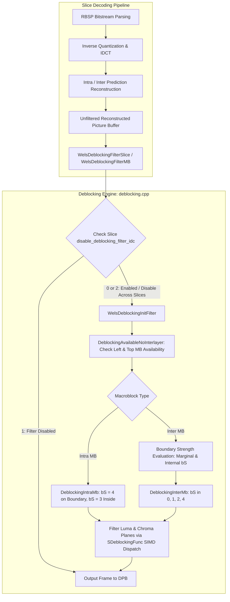

# OpenH264 Video Decoder: In-Loop Deblocking Filter (`deblocking.cpp`)

This document provides a comprehensive, literate-programming-style technical breakdown of the OpenH264 in-loop adaptive deblocking filter implementation in [`codec/decoder/core/src/deblocking.cpp`](openh264/codec/decoder/core/src/deblocking.cpp).

---

## Table of Contents
1. [Module & Architectural Overview](#1-module--architectural-overview)
2. [H.264 Deblocking Mathematics & Standards Specification](#2-h264-deblocking-mathematics--standards-specification)
   - [2.1 Boundary Strength ($bS$) Derivation](#21-boundary-strength-bs-derivation)
   - [2.2 Index Derivation & Threshold Tables ($\alpha, \beta, tc_0$)](#22-index-derivation--threshold-tables-alpha-beta-tc_0)
   - [2.3 Normal Edge Filtering ($bS \in \{1, 2, 3\}$)](#23-normal-edge-filtering-bs-in-1-2-3)
   - [2.4 Strong Edge Filtering for Intra Boundaries ($bS = 4$)](#24-strong-edge-filtering-for-intra-boundaries-bs--4)
3. [Preprocessor Definitions, Macros & Global Lookup Tables](#3-preprocessor-definitions-macros--global-lookup-tables)
   - [3.1 Control Constants & Neighbor Availability Masks](#31-control-constants--neighbor-availability-masks)
   - [3.2 Boundary Strength Evaluation Macros](#32-boundary-strength-evaluation-macros)
   - [3.3 Global Static Tables](#33-global-static-tables)
4. [Associated Data Structures & Type Definitions](#4-associated-data-structures--type-definitions)
   - [4.1 `SDeblockingFilter` / `PDeblockingFilter`](#41-sdeblockingfilter--pdeblockingfilter)
   - [4.2 `SDeblockingFunc` / `PDeblockingFunc`](#42-sdeblockingfunc--pdeblockingfunc)
   - [4.3 Deblocking Function Pointer Typedefs](#43-deblocking-function-pointer-typedefs)
5. [Comprehensive Function-by-Function Walkthrough](#5-comprehensive-function-by-function-walkthrough)
   - [5.1 `DeblockingBSInsideMBAvsbase`](#51-deblockingbsinsidembavsbase)
   - [5.2 `DeblockingBSInsideMBAvsbase8x8`](#52-deblockingbsinsidembavsbase8x8)
   - [5.3 `DeblockingBSInsideMBNormal`](#53-deblockingbsinsidembnormal)
   - [5.4 `DeblockingBSliceBSInsideMBNormal`](#54-deblockingbslicebsinsidembnormal)
   - [5.5 `DeblockingBsMarginalMBAvcbase`](#55-deblockingbsmarginalmbavcbase)
   - [5.6 `DeblockingBSliceBsMarginalMBAvcbase`](#56-deblockingbslicebsmarginalmbavcbase)
   - [5.7 `DeblockingAvailableNoInterlayer`](#57-deblockingavailablenointerlayer)
   - [5.8 `FilteringEdgeLumaH` & `FilteringEdgeLumaV`](#58-filteringedgelumah--filteringedgelumav)
   - [5.9 `FilteringEdgeLumaIntraH` & `FilteringEdgeLumaIntraV`](#59-filteringedgelumaintrah--filteringedgelumaintrav)
   - [5.10 `FilteringEdgeChromaH` & `FilteringEdgeChromaV`](#510-filteringedgechromah--filteringedgechromav)
   - [5.11 `FilteringEdgeChromaIntraH` & `FilteringEdgeChromaIntraV`](#511-filteringedgechromaintrah--filteringedgechromaintrav)
   - [5.12 `DeblockingInterMb`](#512-deblockingintermb)
   - [5.13 `FilteringEdgeLumaHV` & `FilteringEdgeChromaHV`](#513-filteringedgelumahv--filteringedgechromahv)
   - [5.14 `DeblockingIntraMb`](#514-deblockingintramb)
   - [5.15 `WelsDeblockingMb`](#515-welsdeblockingmb)
   - [5.16 `WelsDeblockingFilterSlice`](#516-welsdeblockingfilterslice)
   - [5.17 `WelsDeblockingInitFilter`](#517-welsdeblockinginitfilter)
   - [5.18 `WelsDeblockingFilterMB`](#518-welsdeblockingfiltermb)
   - [5.19 `DeblockingInit`](#519-deblockinginit)
6. [Hardware Acceleration & SIMD Dispatch Architecture](#6-hardware-acceleration--simd-dispatch-architecture)

---

## 1. Module & Architectural Overview

The in-loop deblocking filter in H.264/AVC (specified in **ITU-T Recommendation H.264 / ISO/IEC 14496-10, Section 8.7**) is a mandatory processing stage applied to reconstructed macroblocks within the decoding loop prior to placing reconstructed frames into the Decoded Picture Buffer (DPB).

Block-based transform coding and motion-compensated prediction introduce high-frequency blocking artifacts along 4x4 and 8x8 block boundaries. The adaptive deblocking filter smooths block edges while preserving true image details and sharp edges.



### Architectural Key Characteristics in OpenH264
1. **Separation of Boundary Strength ($bS$) Derivation & Kernel Execution**:
   - $bS$ determination relies on macroblock coding modes, non-zero transform coefficients (NNZ), reference picture pointers (`pRefPics`), and motion vector differences.
   - Low-level pixel modification kernels operate on 4-sample or 16-sample blocks using SIMD assembly (SSSE3, NEON, MMI, MSA, LSX) or reference C fallbacks.
2. **Transform Size Adaptivity (4x4 vs 8x8 Transform)**:
   - Evaluates `pCurDqLayer->pTransformSize8x8Flag[iMbXy]`. When 8x8 integer transform is active (High Profile / SVC), internal 4x4 grid edges 1 and 3 are skipped, filtering only 8x8 block grid edges 0 and 2.
3. **Flexible Macroblock Ordering (FMO) Support**:
   - Iterates through macroblocks using raster scanning or arbitrary slice group traversal via `FmoNextMb(pFmo, iMbXyIndex)`.

---

## 2. H.264 Deblocking Mathematics & Standards Specification

### 2.1 Boundary Strength ($bS$) Derivation

For every 4-sample edge segment between block $p$ (left or above) and block $q$ (right or below), a Boundary Strength value $bS \in \{0, 1, 2, 3, 4\}$ is assigned according to the following decision hierarchy:

```
                          ┌───────────────────────────┐
                          │ Is p or q Intra-coded?    │
                          └─────────────┬─────────────┘
                                        │
                         YES ───────────┴─────────── NO
                          │                          │
              ┌───────────┴───────────┐              │
              │ Is the edge on a MB   │              │
              │ boundary?             │              │
              └─────┬───────────┬─────┘              │
                YES │           │ NO                 │
                    ▼           ▼                    │
                 bS = 4      bS = 3                  │
                                                     │
       ┌─────────────────────────────────────────────┘
       │
       ▼
┌──────────────────────────────────────────────┐
│ Does p or q contain non-zero transform       │
│ coefficients (NNZ > 0)?                      │
└──────────────────────┬───────────────────────┘
                       │
        YES ───────────┴─────────── NO
         │                          │
         ▼                          ▼
      bS = 2         ┌──────────────────────────────────────────────┐
                     │ Do p and q reference different pictures, or  │
                     │ is |MV_px - MV_qx| >= 4 (1 luma sample) or   │
                     │    |MV_py - MV_qy| >= 4 (1 luma sample)?     │
                     └──────────────────────┬───────────────────────┘
                                            │
                             YES ───────────┴─────────── NO
                              │                          │
                              ▼                          ▼
                           bS = 1                     bS = 0 (No filter)
```

$$\text{Boundary Strength } bS =
\begin{cases}
4, & \text{Edge is MB boundary and } (p \text{ is Intra} \lor q \text{ is Intra}) \\
3, & \text{Edge is inside MB and } (p \text{ is Intra} \lor q \text{ is Intra}) \\
2, & p \text{ or } q \text{ has non-zero transform coefficients } (\text{NNZ} > 0) \\
1, & \text{RefPic}_p \neq \text{RefPic}_q \lor |\text{MV}_{p,x} - \text{MV}_{q,x}| \ge 4 \lor |\text{MV}_{p,y} - \text{MV}_{q,y}| \ge 4 \\
0, & \text{Otherwise (filtering bypassed)}
\end{cases}$$

### 2.2 Index Derivation & Threshold Tables ($\alpha, \beta, tc_0$)

Let $QP_p$ and $QP_q$ be the quantization parameters of blocks $p$ and $q$. The average quantization parameter $QP_{\text{av}}$ is:

$$QP_{\text{av}} = \frac{QP_p + QP_q + 1}{2}$$

The index parameters $\text{IndexA}$ and $\text{IndexB}$ are calculated using slice header offsets $\alpha_{\text{offset}}$ (`iSliceAlphaC0Offset`) and $\beta_{\text{offset}}$ (`iSliceBetaOffset`):

$$\text{IndexA} = \text{Clip3}(0, 51, QP_{\text{av}} + \alpha_{\text{offset}})$$

$$\text{IndexB} = \text{Clip3}(0, 51, QP_{\text{av}} + \beta_{\text{offset}})$$

The filtering thresholds $\alpha(\text{IndexA})$ and $\beta(\text{IndexB})$ are retrieved from global lookup tables [`g_kuiAlphaTable`](openh264/codec/decoder/core/src/deblocking.cpp#L144) and [`g_kiBetaTable`](openh264/codec/decoder/core/src/deblocking.cpp#L155).

Filtering is activated across boundary samples $(p_1, p_0, q_0, q_1)$ if and only if all three conditions hold:

$$|p_0 - q_0| < \alpha(\text{IndexA}) \quad \land \quad |p_1 - p_0| < \beta(\text{IndexB}) \quad \land \quad |q_1 - q_0| < \beta(\text{IndexB})$$

### 2.3 Normal Edge Filtering ($bS \in \{1, 2, 3\}$)

When $bS \in \{1, 2, 3\}$, the clipping threshold $tc_0$ is retrieved from table [`g_kiTc0Table`](openh264/codec/decoder/core/src/deblocking.cpp#L166). The effective clipping bound $tc$ is:

$$tc = tc_0 + \mathbf{1}_{(|p_2 - p_0| < \beta)} + \mathbf{1}_{(|q_2 - q_0| < \beta)}$$

The filtered boundary pixel values $p_0'$ and $q_0'$ are updated via:

$$\Delta = \text{Clip3}\left(-tc, tc, \left(\left((q_0 - p_0) \ll 2\right) + (p_1 - q_1) + 4\right) \gg 3\right)$$

$$p_0' = \text{Clip1}_{Y}(p_0 + \Delta), \qquad q_0' = \text{Clip1}_{Y}(q_0 - \Delta)$$

If $|p_2 - p_0| < \beta$, sample $p_1$ is filtered:

$$p_1' = p_1 + \text{Clip3}\left(-tc_0, tc_0, (p_2 + ((p_0 + q_0 + 1) \gg 1) - (p_1 \ll 1)) \gg 1\right)$$

Similarly, if $|q_2 - q_0| < \beta$, sample $q_1$ is filtered:

$$q_1' = q_1 + \text{Clip3}\left(-tc_0, tc_0, (q_2 + ((p_0 + q_0 + 1) \gg 1) - (q_1 \ll 1)) \gg 1\right)$$

### 2.4 Strong Edge Filtering for Intra Boundaries ($bS = 4$)

When $bS = 4$ (intra-coded macroblock boundary), if $|p_2 - p_0| < \beta$ and $|p_0 - q_0| < ((\alpha \gg 2) + 2)$, a 3-tap or 4-tap smoothing filter is applied:

$$p_0' = (p_2 + 2p_1 + 2p_0 + 2q_0 + q_1 + 4) \gg 3$$
$$p_1' = (p_2 + p_1 + p_0 + q_0 + 2) \gg 2$$
$$p_2' = (2p_3 + 3p_2 + p_1 + p_0 + q_0 + 4) \gg 3$$

Otherwise, weak filtering is applied:

$$p_0' = (2p_1 + p_0 + q_1 + 2) \gg 2$$

---

## 3. Preprocessor Definitions, Macros & Global Lookup Tables

### 3.1 Control Constants & Neighbor Availability Masks

Defined at [`deblocking.cpp:L47-L56`](openh264/codec/decoder/core/src/deblocking.cpp#L47-L56):

```cpp
#define NO_SUPPORTED_FILTER_IDX     (-1)
#define LEFT_FLAG_BIT  0
#define TOP_FLAG_BIT   1
#define LEFT_FLAG_MASK 0x01
#define TOP_FLAG_MASK  0x02

#define SAME_MB_DIFF_REFIDX
#define g_kuiAlphaTable(x) g_kuiAlphaTable[(x)+12]
#define g_kiBetaTable(x)  g_kiBetaTable[(x)+12]
#define g_kiTc0Table(x)   g_kiTc0Table[(x)+12]
```

* **`LEFT_FLAG_MASK` (0x01)** & **`TOP_FLAG_MASK` (0x02)**: Bitmask returned by [`DeblockingAvailableNoInterlayer`](openh264/codec/decoder/core/src/deblocking.cpp#L671) indicating whether the left neighbor macroblock and top neighbor macroblock are available for deblocking.
* **Table Indexing Offset `(+12)`**: H.264 allows $\text{IndexA}$ and $\text{IndexB}$ to be negative before clipping (due to negative slice alpha/beta offsets). OpenH264 pads table arrays by 12 leading zeros, allowing direct indexing via `(x) + 12` without explicit branch clipping at the lower boundary.

---

### 3.2 Boundary Strength Evaluation Macros

#### A. `MB_BS_MV`
Defined at [`deblocking.cpp:L58-L63`](openh264/codec/decoder/core/src/deblocking.cpp#L58-L63):
```cpp
#define MB_BS_MV(pRefPic0, pRefPic1, iMotionVector, iMbXy, iMbBn, iIndex, iNeighIndex) \
(\
    ( pRefPic0 != pRefPic1) ||\
    ( WELS_ABS( iMotionVector[iMbXy][iIndex][0] - iMotionVector[iMbBn][iNeighIndex][0] ) >= 4 ) ||\
    ( WELS_ABS( iMotionVector[iMbXy][iIndex][1] - iMotionVector[iMbBn][iNeighIndex][1] ) >= 4 )\
)
```
Evaluates whether two blocks across macroblocks `iMbXy` and `iMbBn` have different reference picture pointers or horizontal/vertical motion vector difference $\ge 4$ quarter-pel units ($1$ integer luma pixel).

#### B. `ON_MB_BS` (B-Slice Macroblock Edge Boundary Strength)
Defined at [`deblocking.cpp:L79-L87`](openh264/codec/decoder/core/src/deblocking.cpp#L79-L87):
Evaluates bi-prediction reference picture matching and motion vector differences across macroblock boundaries for B-slices:
- Checks if reference pictures in List 0 and List 1 match directly ($ref_{p0} == ref_{q0} \land ref_{p1} == ref_{q1}$) or cross-match ($ref_{p0} == ref_{q1} \land ref_{p1} == ref_{q0}$).
- If references match, tests if motion vector components differ by $\ge 4$ units.

#### C. `SMB_EDGE_MV` & `BS_EDGE`
Defined at [`deblocking.cpp:L89-L131`](openh264/codec/decoder/core/src/deblocking.cpp#L89-L131):
```cpp
#define SMB_EDGE_MV(pRefPics, iMotionVector, iIndex, iNeighIndex) \
(\
    ( pRefPics[iIndex] != pRefPics[iNeighIndex] )||(\
    ( WELS_ABS( iMotionVector[iIndex][0] - iMotionVector[iNeighIndex][0] ) &(~3) ) |\
    ( WELS_ABS( iMotionVector[iIndex][1] - iMotionVector[iNeighIndex][1] ) &(~3) ))\
)

#define BS_EDGE(bsx1, pRefPics, iMotionVector, iIndex, iNeighIndex) \
( (bsx1|SMB_EDGE_MV(pRefPics, iMotionVector, iIndex, iNeighIndex))<<((uint8_t)(!!bsx1)))
```
* Bitwise `& (~3)` efficiently evaluates whether $|MV_1 - MV_2| \ge 4$ in 2's complement arithmetic without explicit branching.
* `BS_EDGE` evaluates to $2$ if non-zero transform coefficients exist (`bsx1 != 0`), or $1$ if reference/MV conditions trigger `SMB_EDGE_MV`, or $0$ otherwise.

#### D. `GET_ALPHA_BETA_FROM_QP` & `TC0_TBL_LOOKUP`
Defined at [`deblocking.cpp:L137-L213`](openh264/codec/decoder/core/src/deblocking.cpp#L137-L213):
```cpp
#define GET_ALPHA_BETA_FROM_QP(iQp, iAlphaOffset, iBetaOffset, iIndex, iAlpha, iBeta) \
{\
  iIndex = (iQp + iAlphaOffset);\
  iAlpha = g_kuiAlphaTable(iIndex);\
  iBeta  = g_kiBetaTable((iQp + iBetaOffset));\
}

#define TC0_TBL_LOOKUP(tc, iIndexA, pBS, bChroma) \
{\
  tc[0] = g_kiTc0Table(iIndexA)[pBS[0] & 3] + bChroma;\
  tc[1] = g_kiTc0Table(iIndexA)[pBS[1] & 3] + bChroma;\
  tc[2] = g_kiTc0Table(iIndexA)[pBS[2] & 3] + bChroma;\
  tc[3] = g_kiTc0Table(iIndexA)[pBS[3] & 3] + bChroma;\
}
```

---

### 3.3 Global Static Tables

| Table Symbol | Size | Standard Reference | Purpose / Description |
| :--- | :--- | :--- | :--- |
| [`g_kuiAlphaTable`](openh264/codec/decoder/core/src/deblocking.cpp#L144-L153) | `uint8_t[76]` | Table 8-16 | $\alpha(\text{IndexA})$ threshold values for $QP \in [0, 51]$, with 12 padded negative entries. |
| [`g_kiBetaTable`](openh264/codec/decoder/core/src/deblocking.cpp#L155-L164) | `int8_t[76]` | Table 8-16 | $\beta(\text{IndexB})$ threshold values for $QP \in [0, 51]$, padded with 12 negative entries. |
| [`g_kiTc0Table`](openh264/codec/decoder/core/src/deblocking.cpp#L166-L180) | `int8_t[76][4]` | Table 8-17 | Clipping parameters $tc_0$ indexed by $\text{IndexA}$ and $bS \in \{0, 1, 2, 3\}$. |
| [`g_kuiTableBIdx`](openh264/codec/decoder/core/src/deblocking.cpp#L182-L192) | `uint8_t[2][8]` | Internal Scan | 4x4 block raster scan indices for vertical (`[0]`) and horizontal (`[1]`) MB boundary edges. |
| [`g_kuiTableB8x8Idx`](openh264/codec/decoder/core/src/deblocking.cpp#L194-L205) | `uint8_t[2][16]`| Internal Scan | 8x8 block transform boundary raster scan index mapping. |

---

## 4. Associated Data Structures & Type Definitions

### 4.1 `SDeblockingFilter` / `PDeblockingFilter`
Defined in [`codec/decoder/core/inc/decoder_context.h:L168-L178`](openh264/codec/decoder/core/inc/decoder_context.h#L168-L178):

```cpp
typedef struct tagDeblockingFilter {
  uint8_t*                  pCsData[3];          // Reconstructed Y, Cb, Cr plane base pointers
  int32_t                   iCsStride[2];        // Stride: [0] for Luma, [1] for Chroma (UV)
  EWelsSliceType            eSliceType;          // Slice type (I_SLICE, P_SLICE, B_SLICE)
  int8_t                    iSliceAlphaC0Offset; // Slice alpha & c0 offset div 2
  int8_t                    iSliceBetaOffset;    // Slice beta offset div 2
  int8_t                    iChromaQP[2];        // Chroma QPs: [0] for Cb, [1] for Cr
  int8_t                    iLumaQP;             // Luma QP
  struct TagDeblockingFunc* pLoopf;              // Active SIMD/C function dispatch table
  PPicture*                 pRefPics[LIST_A];    // Active reference picture lists
} SDeblockingFilter, *PDeblockingFilter;
```

---

### 4.2 `SDeblockingFunc` / `PDeblockingFunc`
Defined in [`codec/decoder/core/inc/decoder_context.h:L193-L209`](openh264/codec/decoder/core/inc/decoder_context.h#L193-L209):

```cpp
typedef struct TagDeblockingFunc {
  PLumaDeblockingLT4Func    pfLumaDeblockingLT4Ver;    // Luma vertical edge filter (bS < 4)
  PLumaDeblockingEQ4Func    pfLumaDeblockingEQ4Ver;    // Luma vertical edge filter (bS == 4)
  PLumaDeblockingLT4Func    pfLumaDeblockingLT4Hor;    // Luma horizontal edge filter (bS < 4)
  PLumaDeblockingEQ4Func    pfLumaDeblockingEQ4Hor;    // Luma horizontal edge filter (bS == 4)

  PChromaDeblockingLT4Func  pfChromaDeblockingLT4Ver;  // Chroma vertical edge filter (equal Cb/Cr QP, bS < 4)
  PChromaDeblockingEQ4Func  pfChromaDeblockingEQ4Ver;  // Chroma vertical edge filter (equal Cb/Cr QP, bS == 4)
  PChromaDeblockingLT4Func  pfChromaDeblockingLT4Hor;  // Chroma horizontal edge filter (equal Cb/Cr QP, bS < 4)
  PChromaDeblockingEQ4Func  pfChromaDeblockingEQ4Hor;  // Chroma horizontal edge filter (equal Cb/Cr QP, bS == 4)

  PChromaDeblockingLT4Func2 pfChromaDeblockingLT4Ver2; // Chroma vertical filter (independent Cb/Cr QP, bS < 4)
  PChromaDeblockingEQ4Func2 pfChromaDeblockingEQ4Ver2; // Chroma vertical filter (independent Cb/Cr QP, bS == 4)
  PChromaDeblockingLT4Func2 pfChromaDeblockingLT4Hor2; // Chroma horizontal filter (independent Cb/Cr QP, bS < 4)
  PChromaDeblockingEQ4Func2 pfChromaDeblockingEQ4Hor2; // Chroma horizontal filter (independent Cb/Cr QP, bS == 4)
} SDeblockingFunc, *PDeblockingFunc;
```

---

### 4.3 Deblocking Function Pointer Typedefs

```cpp
typedef void (*PDeblockingFilterMbFunc) (PDqLayer pCurDqLayer, PDeblockingFilter filter, int32_t boundry_flag);
typedef void (*PLumaDeblockingLT4Func) (uint8_t* iSampleY, int32_t iStride, int32_t iAlpha, int32_t iBeta, int8_t* iTc);
typedef void (*PLumaDeblockingEQ4Func) (uint8_t* iSampleY, int32_t iStride, int32_t iAlpha, int32_t iBeta);
typedef void (*PChromaDeblockingLT4Func) (uint8_t* iSampleCb, uint8_t* iSampleCr, int32_t iStride, int32_t iAlpha, int32_t iBeta, int8_t* iTc);
typedef void (*PChromaDeblockingEQ4Func) (uint8_t* iSampleCb, uint8_t* iSampleCr, int32_t iStride, int32_t iAlpha, int32_t iBeta);
```

---

## 5. Comprehensive Function-by-Function Walkthrough

### 5.1 `DeblockingBSInsideMBAvsbase`
[deblocking.cpp:L215-L241](openh264/codec/decoder/core/src/deblocking.cpp#L215-L241)

```cpp
void inline DeblockingBSInsideMBAvsbase(int8_t* pNnzTab, uint8_t nBS[2][4][4], int32_t iLShiftFactor);
```

* **Purpose**: Calculates internal boundary strength ($bS$) values across internal 4x4 block edges within an Intra-16x16 or Inter-16x16 macroblock where motion vectors and reference pictures are homogeneous across the entire MB.
* **Input Parameters**:
  - `pNnzTab`: Pointer to 16-byte array containing non-zero transform coefficient counts for each 4x4 block in the MB.
  - `nBS[2][4][4]`: 3D output tensor storing boundary strengths: `nBS[direction][edge_index][sample_segment]`, where `direction = 0` is vertical edges and `direction = 1` is horizontal edges.
  - `iLShiftFactor`: Shift factor (typically `1`), scaling non-zero count existence bit to $bS = 2$.
* **Algorithm**:
  - Loads 32-bit words containing 4 non-zero counts simultaneously (`uiNnz32b0` .. `uiNnz32b3`).
  - Bitwise ORs neighboring block counts across vertical internal edges (1, 2, 3) and horizontal internal edges (1, 2, 3).
  - Multiplies/shifts non-zero flags to generate $bS = 2$ for blocks with coefficients, or $bS = 0$ if both neighboring blocks have zero residual.

---

### 5.2 `DeblockingBSInsideMBAvsbase8x8`
[deblocking.cpp:L243-L257](openh264/codec/decoder/core/src/deblocking.cpp#L243-L257)

```cpp
void inline DeblockingBSInsideMBAvsbase8x8(int8_t* pNnzTab, uint8_t nBS[2][4][4], int32_t iLShiftFactor);
```

* **Purpose**: Computes internal boundary strength for macroblocks utilizing 8x8 integer transform.
* **Algorithm**:
  - Aggregates 4x4 non-zero counts into four 8x8 block non-zero counts `i8x8NnzTab[0..3]`:
    $$i8x8NnzTab[i] = \bigvee_{k=0}^{3} pNnzTab[\text{Scan4Idx}(4i + k)]$$
  - Sets $bS$ only on the middle 8x8 grid boundary (`edge_index = 2`), while leaving odd edges (1 and 3) unassigned (filtered boundaries are bypassed for 8x8 transform).

---

### 5.3 `DeblockingBSInsideMBNormal`
[deblocking.cpp:L259-L344](openh264/codec/decoder/core/src/deblocking.cpp#L259-L344)

```cpp
void static inline DeblockingBSInsideMBNormal(PDeblockingFilter pFilter, PDqLayer pCurDqLayer,
                                             uint8_t nBS[2][4][4], int8_t* pNnzTab, int32_t iMbXy);
```

* **Purpose**: Derives internal boundary strength for standard P-slice / Inter macroblocks with arbitrary sub-partitions (16x8, 8x16, 8x8, 4x4).
* **Algorithm**:
  1. Resolves reference picture pointers for all sixteen 4x4 sub-blocks:
     ```cpp
     for (i = 0; i < MB_BLOCK4x4_NUM; i++) {
       iRefs[i] = (iRefIdx[i] > REF_NOT_IN_LIST) ? pFilter->pRefPics[LIST_0][iRefIdx[i]] : NULL;
     }
     ```
  2. If 8x8 transform is active (`pTransformSize8x8Flag[iMbXy]`), evaluates `BS_EDGE` on 8x8 block boundaries (`edge 2`).
  3. If 4x4 transform is active, evaluates `BS_EDGE` across all internal edges (1, 2, 3) for both vertical and horizontal directions using `pNnzTab`, `iRefs`, and `pCurDqLayer->pDec->pMv[LIST_0][iMbXy]`.

---

### 5.4 `DeblockingBSliceBSInsideMBNormal`
[deblocking.cpp:L346-L448](openh264/codec/decoder/core/src/deblocking.cpp#L346-L448)

```cpp
void static inline DeblockingBSliceBSInsideMBNormal(PDeblockingFilter pFilter, PDqLayer pCurDqLayer,
                                                   uint8_t nBS[2][4][4], int8_t* pNnzTab, int32_t iMbXy);
```

* **Purpose**: Computes internal boundary strength for B-slice macroblocks.
* **Algorithm**:
  - Resolves reference pictures across both List 0 and List 1 (`iRefs[LIST_A][16]`).
  - Employs macro [`IN_BS_EDGE`](openh264/codec/decoder/core/src/deblocking.cpp#L134) and [`IN_SMB_EDGE_MV`](openh264/codec/decoder/core/src/deblocking.cpp#L104) to cross-compare reference lists and motion vectors for List 0 and List 1.

---

### 5.5 `DeblockingBsMarginalMBAvcbase`
[deblocking.cpp:L451-L543](openh264/codec/decoder/core/src/deblocking.cpp#L451-L543)

```cpp
uint32_t DeblockingBsMarginalMBAvcbase(PDeblockingFilter pFilter, PDqLayer pCurDqLayer,
                                       int32_t iEdge, int32_t iNeighMb, int32_t iMbXy);
```

* **Purpose**: Calculates the 4-byte boundary strength vector for marginal macroblock boundaries (external left edge `iEdge = 0` or external top edge `iEdge = 1`) for P-slices.
* **Return Value**: 32-bit unsigned integer `uiBSx4` containing 4 packed bytes (`pBS[0..3]`), where each byte represents the $bS \in \{0, 1, 2\}$ value for each 4-pixel segment along the MB edge.
* **Handling Mixed 8x8 / 4x4 Transform Boundaries**:
  - If both current and neighbor MBs use 8x8 transform: Pairs of 4x4 segments are grouped into 8x8 edge evaluations.
  - If only one MB uses 8x8 transform: Tests non-zero transform coefficients and motion vectors according to the mixed partition scan tables [`g_kuiTableBIdx`](openh264/codec/decoder/core/src/deblocking.cpp#L182) and [`g_kuiTableB8x8Idx`](openh264/codec/decoder/core/src/deblocking.cpp#L194).

---

### 5.6 `DeblockingBSliceBsMarginalMBAvcbase`
[deblocking.cpp:L544-L670](openh264/codec/decoder/core/src/deblocking.cpp#L544-L670)

```cpp
uint32_t DeblockingBSliceBsMarginalMBAvcbase(PDeblockingFilter pFilter, PDqLayer pCurDqLayer,
                                             int32_t iEdge, int32_t iNeighMb, int32_t iMbXy);
```

* **Purpose**: Computes marginal boundary strength for B-slices across external left (`iEdge = 0`) or top (`iEdge = 1`) macroblock boundaries.
* **Algorithm**:
  - Retrieves List 0 and List 1 reference picture pointers for current block (`ref_p0`, `ref_p1`) and neighbor block (`ref_q0`, `ref_q1`).
  - Sets $bS = 2$ if non-zero residual coefficients exist.
  - If residual coefficients are zero, evaluates `ON_MB_BS`:
    - Checks whether $(ref_{p0} == ref_{q0} \land ref_{p1} == ref_{q1})$ or $(ref_{p0} == ref_{q1} \land ref_{p1} == ref_{q0})$.
    - If reference picture pairings match, checks whether motion vector difference magnitudes $\ge 4$ quarter-pel units.

---

### 5.7 `DeblockingAvailableNoInterlayer`
[deblocking.cpp:L671-L686](openh264/codec/decoder/core/src/deblocking.cpp#L671-L686)

```cpp
int32_t DeblockingAvailableNoInterlayer(PDqLayer pCurDqLayer, int32_t iFilterIdc);
```

* **Purpose**: Evaluates spatial availability of left and top macroblock neighbors based on frame boundaries and slice filtering rules (`disable_deblocking_filter_idc`).
* **Input Parameters**:
  - `pCurDqLayer`: Pointer to current spatial dependency layer context.
  - `iFilterIdc`: Slice header syntax element `uiDisableDeblockingFilterIdc`:
    - `0`: Filter across slice boundaries (all spatial neighbors inside the frame picture buffer are available).
    - `2`: Disable filtering across slice boundaries (neighbor is available only if `pSliceIdc[iMbXy] == pSliceIdc[iNeighMb]`).
* **Return Value**: Bitmask combining `(bLeftFlag << LEFT_FLAG_BIT) | (bTopFlag << TOP_FLAG_BIT)`.

---

### 5.8 `FilteringEdgeLumaH` & `FilteringEdgeLumaV`
[deblocking.cpp:L688-L719](openh264/codec/decoder/core/src/deblocking.cpp#L688-L719)

```cpp
void FilteringEdgeLumaH(SDeblockingFilter* pFilter, uint8_t* pPix, int32_t iStride, uint8_t* pBS);
void FilteringEdgeLumaV(SDeblockingFilter* pFilter, uint8_t* pPix, int32_t iStride, uint8_t* pBS);
```

* **Purpose**: Dispatches luma edge deblocking filtering for normal inter boundaries where $bS < 4$.
* **Processing Steps**:
  1. Computes $\text{IndexA}, \alpha, \beta$ from `pFilter->iLumaQP`, `iSliceAlphaC0Offset`, and `iSliceBetaOffset` via `GET_ALPHA_BETA_FROM_QP`.
  2. If $\alpha \neq 0$ or $\beta \neq 0$, retrieves 4-element clipping array `tc` via `TC0_TBL_LOOKUP(tc, iIndexA, pBS, 0)`.
  3. Invokes the active SIMD/C function pointer `pFilter->pLoopf->pfLumaDeblockingLT4Ver` or `pfLumaDeblockingLT4Hor`.

---

### 5.9 `FilteringEdgeLumaIntraH` & `FilteringEdgeLumaIntraV`
[deblocking.cpp:L722-L748](openh264/codec/decoder/core/src/deblocking.cpp#L722-L748)

```cpp
void FilteringEdgeLumaIntraH(SDeblockingFilter* pFilter, uint8_t* pPix, int32_t iStride, uint8_t* pBS);
void FilteringEdgeLumaIntraV(SDeblockingFilter* pFilter, uint8_t* pPix, int32_t iStride, uint8_t* pBS);
```

* **Purpose**: Performs strong deblocking filtering for Intra macroblock boundaries where $bS = 4$.
* **Algorithm**: Computes $\alpha$ and $\beta$, then invokes `pFilter->pLoopf->pfLumaDeblockingEQ4Ver` or `pfLumaDeblockingEQ4Hor`.

---

### 5.10 `FilteringEdgeChromaH` & `FilteringEdgeChromaV`
[deblocking.cpp:L749-L820](openh264/codec/decoder/core/src/deblocking.cpp#L749-L820)

```cpp
void FilteringEdgeChromaH(SDeblockingFilter* pFilter, uint8_t* pPixCb, uint8_t* pPixCr, int32_t iStride, uint8_t* pBS);
void FilteringEdgeChromaV(SDeblockingFilter* pFilter, uint8_t* pPixCb, uint8_t* pPixCr, int32_t iStride, uint8_t* pBS);
```

* **Purpose**: Filters chroma (Cb and Cr) plane edges where $bS < 4$.
* **Dual QP Handling**:
  - If $QP_{Cb} == QP_{Cr}$ (`pFilter->iChromaQP[0] == pFilter->iChromaQP[1]`): Dispatches joint dual-plane kernel `pfChromaDeblockingLT4Ver` / `pfChromaDeblockingLT4Hor`.
  - If $QP_{Cb} \neq QP_{Cr}$: Loops over $i \in \{0, 1\}$, computing individual $\alpha_i, \beta_i, tc_i$ for each chroma plane and dispatching single-plane kernels `pfChromaDeblockingLT4Ver2` / `pfChromaDeblockingLT4Hor2`.

---

### 5.11 `FilteringEdgeChromaIntraH` & `FilteringEdgeChromaIntraV`
[deblocking.cpp:L822-L882](openh264/codec/decoder/core/src/deblocking.cpp#L822-L882)

```cpp
void FilteringEdgeChromaIntraH(SDeblockingFilter* pFilter, uint8_t* pPixCb, uint8_t* pPixCr, int32_t iStride, uint8_t* pBS);
void FilteringEdgeChromaIntraV(SDeblockingFilter* pFilter, uint8_t* pPixCb, uint8_t* pPixCr, int32_t iStride, uint8_t* pBS);
```

* **Purpose**: Performs strong chroma filtering for Intra edges ($bS = 4$) with support for both equal and independent Cb/Cr quantization parameters.

---

### 5.12 `DeblockingInterMb`
[deblocking.cpp:L885-L972](openh264/codec/decoder/core/src/deblocking.cpp#L885-L972)

```cpp
static void DeblockingInterMb(PDqLayer pCurDqLayer, PDeblockingFilter pFilter,
                              uint8_t nBS[2][4][4], int32_t iBoundryFlag);
```

* **Purpose**: Complete deblocking filtering sequence for an Inter-coded macroblock.
* **Execution Flow**:
  1. Computes pixel base pointers for the current macroblock:
     ```cpp
     pDestY  = pFilter->pCsData[0] + ((iMbY * iLineSize + iMbX) << 4);
     pDestCb = pFilter->pCsData[1] + ((iMbY * iLineSizeUV + iMbX) << 3);
     pDestCr = pFilter->pCsData[2] + ((iMbY * iLineSizeUV + iMbX) << 3);
     ```
  2. **Vertical Edge Filtering**:
     - If `iBoundryFlag & LEFT_FLAG_MASK`: Averages QP with left neighbor macroblock ($QP_{\text{av}} = (QP_{\text{cur}} + QP_{\text{left}} + 1) \gg 1$). Filters left MB boundary (Intra $bS = 4$ or normal $bS < 4$).
     - Filters internal vertical edges 1, 2, and 3. (If 8x8 transform is active, edges 1 and 3 are bypassed).
  3. **Horizontal Edge Filtering**:
     - If `iBoundryFlag & TOP_FLAG_MASK`: Averages QP with top neighbor macroblock ($QP_{\text{av}} = (QP_{\text{cur}} + QP_{\text{top}} + 1) \gg 1$). Filters top MB boundary.
     - Filters internal horizontal edges 1, 2, and 3.

---

### 5.13 `FilteringEdgeLumaHV` & `FilteringEdgeChromaHV`
[deblocking.cpp:L974-L1126](openh264/codec/decoder/core/src/deblocking.cpp#L974-L1126)

```cpp
void FilteringEdgeLumaHV(PDqLayer pCurDqLayer, PDeblockingFilter pFilter, int32_t iBoundryFlag);
void FilteringEdgeChromaHV(PDqLayer pCurDqLayer, PDeblockingFilter pFilter, int32_t iBoundryFlag);
```

* **Purpose**: Highly optimized deblocking filter pipeline specialized for Intra macroblocks.
* **Rationale**: For Intra macroblocks, internal edges always have $bS = 3$ (`uiBSx4 = 0x03030303`), while external MB boundaries have $bS = 4$. Combining horizontal and vertical edge processing avoids re-fetching tables and eliminates runtime $bS$ evaluation overhead.

---

### 5.14 `DeblockingIntraMb`
[deblocking.cpp:L1129-L1132](openh264/codec/decoder/core/src/deblocking.cpp#L1129-L1132)

```cpp
static void DeblockingIntraMb(PDqLayer pCurDqLayer, PDeblockingFilter pFilter, int32_t iBoundryFlag) {
  FilteringEdgeLumaHV(pCurDqLayer, pFilter, iBoundryFlag);
  FilteringEdgeChromaHV(pCurDqLayer, pFilter, iBoundryFlag);
}
```

* **Purpose**: Top-level dispatcher for Intra macroblocks.

---

### 5.15 `WelsDeblockingMb`
[deblocking.cpp:L1134-L1206](openh264/codec/decoder/core/src/deblocking.cpp#L1134-L1206)

```cpp
void WelsDeblockingMb(PDqLayer pCurDqLayer, PDeblockingFilter pFilter, int32_t iBoundryFlag);
```

* **Purpose**: Primary per-macroblock entry point for in-loop deblocking.
* **Macroblock Mode Dispatch**:
  - `MB_TYPE_INTRA4x4`, `MB_TYPE_INTRA8x8`, `MB_TYPE_INTRA16x16`, `MB_TYPE_INTRA_PCM`: Calls [`DeblockingIntraMb`](openh264/codec/decoder/core/src/deblocking.cpp#L1129).
  - Inter MBs: Evaluates marginal boundary strengths for left and top edges via [`DeblockingBsMarginalMBAvcbase`](openh264/codec/decoder/core/src/deblocking.cpp#L451) or [`DeblockingBSliceBsMarginalMBAvcbase`](openh264/codec/decoder/core/src/deblocking.cpp#L544). Evaluates internal boundary strengths, then calls [`DeblockingInterMb`](openh264/codec/decoder/core/src/deblocking.cpp#L885).

---

### 5.16 `WelsDeblockingFilterSlice`
[deblocking.cpp:L1215-L1278](openh264/codec/decoder/core/src/deblocking.cpp#L1215-L1278)

```cpp
void WelsDeblockingFilterSlice(PWelsDecoderContext pCtx, PDeblockingFilterMbFunc pDeblockMb);
```

* **Purpose**: Slice-level deblocking iteration loop.
* **Execution Flow**:
  1. Populates local `SDeblockingFilter` structure with frame pointers and slice parameters.
  2. If `iFilterIdc == 0` or `iFilterIdc == 2`:
     - Initializes starting macroblock coordinate `iNextMbXyIndex = pSliceHeaderExt->sSliceHeader.iFirstMbInSlice`.
     - Traverses all macroblocks in the slice:
       - Evaluates neighbor availability via [`DeblockingAvailableNoInterlayer`](openh264/codec/decoder/core/src/deblocking.cpp#L671).
       - Invokes `pDeblockMb(pCurDqLayer, &pFilter, iBoundryFlag)`.
       - Advances to next macroblock via `FmoNextMb` (for FMO multi-slice groups) or `++iNextMbXyIndex` (raster scan).

---

### 5.17 `WelsDeblockingInitFilter`
[deblocking.cpp:L1288-L1312](openh264/codec/decoder/core/src/deblocking.cpp#L1288-L1312)

```cpp
void WelsDeblockingInitFilter(PWelsDecoderContext pCtx, SDeblockingFilter& pFilter, int32_t& iFilterIdc);
```

* **Purpose**: Initializes `SDeblockingFilter` structure and extracts `iFilterIdc` for single-macroblock deblocking workflows.

---

### 5.18 `WelsDeblockingFilterMB`
[deblocking.cpp:L1321-L1328](openh264/codec/decoder/core/src/deblocking.cpp#L1321-L1328)

```cpp
void WelsDeblockingFilterMB(PDqLayer pCurDqLayer, SDeblockingFilter& pFilter,
                            int32_t& iFilterIdc, PDeblockingFilterMbFunc pDeblockMb);
```

* **Purpose**: Helper function for single-MB deblocking invocations. Checks `iFilterIdc` and invokes `pDeblockMb`.

---

### 5.19 `DeblockingInit`
[deblocking.cpp:L1338-L1432](openh264/codec/decoder/core/src/deblocking.cpp#L1338-L1432)

```cpp
void DeblockingInit(SDeblockingFunc* pFunc, int32_t iCpu);
```

* **Purpose**: Dynamically populates the function pointer table `SDeblockingFunc` based on detected CPU instruction set extensions (`iCpu`).
* **Dispatch Priority**:
  1. Default: C/C++ fallback implementations (`DeblockLumaLt4V_c`, `DeblockLumaEq4V_c`, etc., declared in [`deblocking_common.h`](openh264/codec/common/inc/deblocking_common.h)).
  2. `WELS_CPU_SSSE3` (x86 / x86_64): Overrides with SSSE3 assembly routines.
  3. `WELS_CPU_NEON` (ARMv7 / AArch64): Overrides with NEON SIMD routines.
  4. `WELS_CPU_MMI` / `WELS_CPU_MSA` (MIPS): Overrides with MMI / MSA vector routines.
  5. `WELS_CPU_LSX` (Loongson): Overrides with LSX vector routines.

---

## 6. Hardware Acceleration & SIMD Dispatch Architecture

The table below summarizes the SIMD implementations bound by [`DeblockingInit`](openh264/codec/decoder/core/src/deblocking.cpp#L1338) across different target architectures:

| `SDeblockingFunc` Member | C/C++ Fallback | x86 / x86_64 (SSSE3) | ARM NEON / AArch64 | MIPS (MMI / MSA) | Loongson (LSX) |
| :--- | :--- | :--- | :--- | :--- | :--- |
| `pfLumaDeblockingLT4Ver` | `DeblockLumaLt4V_c` | `DeblockLumaLt4V_ssse3` | `DeblockLumaLt4V_neon` / `_AArch64_neon` | `DeblockLumaLt4V_mmi` / `_msa` | `DeblockLumaLt4V_lsx` |
| `pfLumaDeblockingEQ4Ver` | `DeblockLumaEq4V_c` | `DeblockLumaEq4V_ssse3` | `DeblockLumaEq4V_neon` / `_AArch64_neon` | `DeblockLumaEq4V_mmi` / `_msa` | `DeblockLumaEq4V_lsx` |
| `pfLumaDeblockingLT4Hor` | `DeblockLumaLt4H_c` | `DeblockLumaLt4H_ssse3` | `DeblockLumaLt4H_neon` / `_AArch64_neon` | `DeblockLumaLt4H_mmi` / `_msa` | `DeblockLumaLt4H_lsx` |
| `pfLumaDeblockingEQ4Hor` | `DeblockLumaEq4H_c` | `DeblockLumaEq4H_ssse3` | `DeblockLumaEq4H_neon` / `_AArch64_neon` | `DeblockLumaEq4H_mmi` / `_msa` | `DeblockLumaEq4H_lsx` |
| `pfChromaDeblockingLT4Ver`| `DeblockChromaLt4V_c`| `DeblockChromaLt4V_ssse3`| `DeblockChromaLt4V_neon` / `_AArch64_neon`| `DeblockChromaLt4V_mmi` / `_msa`| `DeblockChromaLt4V_lsx`|
| `pfChromaDeblockingEQ4Ver`| `DeblockChromaEq4V_c`| `DeblockChromaEq4V_ssse3`| `DeblockChromaEq4V_neon` / `_AArch64_neon`| `DeblockChromaEq4V_mmi` / `_msa`| - |
| `pfChromaDeblockingLT4Hor`| `DeblockChromaLt4H_c`| `DeblockChromaLt4H_ssse3`| `DeblockChromaLt4H_neon` / `_AArch64_neon`| `DeblockChromaLt4H_mmi` / `_msa`| `DeblockChromaLt4H_lsx`|
| `pfChromaDeblockingEQ4Hor`| `DeblockChromaEq4H_c`| `DeblockChromaEq4H_ssse3`| `DeblockChromaEq4H_neon` / `_AArch64_neon`| `DeblockChromaEq4H_mmi` / `_msa`| `DeblockChromaEq4H_lsx`|
| `pfChromaDeblockingLT4Ver2`| `DeblockChromaLt4V2_c`| - | - | - | - |
| `pfChromaDeblockingEQ4Ver2`| `DeblockChromaEq4V2_c`| - | - | - | - |
| `pfChromaDeblockingLT4Hor2`| `DeblockChromaLt4H2_c`| - | - | - | - |
| `pfChromaDeblockingEQ4Hor2`| `DeblockChromaEq4H2_c`| - | - | - | - |
