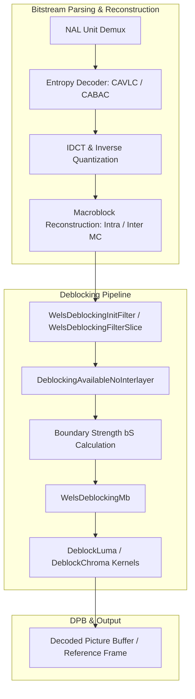
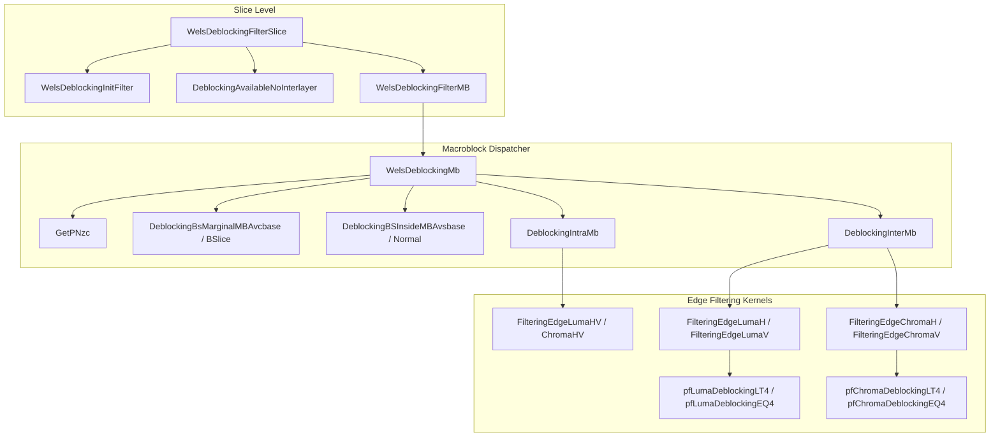

# OpenH264 In-Loop Deblocking Filter: `deblocking.h`

This document provides a comprehensive, literate-programming-style architectural and technical breakdown of the OpenH264 Video Decoder in-loop deblocking filter interface defined in [`codec/decoder/core/inc/deblocking.h`](openh264/codec/decoder/core/inc/deblocking.h) and implemented across [`codec/decoder/core/src/deblocking.cpp`](openh264/codec/decoder/core/src/deblocking.cpp) and [`codec/common/inc/deblocking_common.h`](openh264/codec/common/inc/deblocking_common.h).

---

## Table of Contents
1. [Module Overview & Architectural Role](#1-module-overview--architectural-role)
2. [H.264 / AVC Deblocking Filter Fundamentals](#2-h264--avc-deblocking-filter-fundamentals)
3. [Data Structures, Typedefs, and Function Tables](#3-data-structures-typedefs-and-function-tables)
   - [3.1 Structure `SDeblockingFilter` (`PDeblockingFilter`)](#31-structure-sdeblockingfilter-pdeblockingfilter)
   - [3.2 Structure `SDeblockingFunc` (`PDeblockingFunc`)](#32-structure-sdeblockingfunc-pdeblockingfunc)
   - [3.3 Function Pointer Type Definitions](#33-function-pointer-type-definitions)
   - [3.4 Tables & Precomputed Constants](#34-tables--precomputed-constants)
4. [Deep Dive into Functions and Methods](#4-deep-dive-into-functions-and-methods)
   - [4.1 `DeblockingInit`](#41-deblockinginit)
   - [4.2 `WelsDeblockingFilterSlice`](#42-welsdeblockingfilterslice)
   - [4.3 `WelsDeblockingInitFilter`](#43-welsdeblockinginitfilter)
   - [4.4 `WelsDeblockingFilterMB`](#44-welsdeblockingfiltermb)
   - [4.5 `DeblockingBsMarginalMBAvcbase`](#45-deblockingbsmarginalmbavcbase)
   - [4.6 `DeblockingBSliceBsMarginalMBAvcbase`](#46-deblockingbslicebsmarginalmbavcbase)
   - [4.7 `DeblockingAvailableNoInterlayer`](#47-deblockingavailablenointerlayer)
   - [4.8 `WelsDeblockingMb`](#48-welsdeblockingmb)
   - [4.9 `GetPNzc`](#49-getpnzc)
   - [4.10 Internal Deblocking Kernels & Subroutines](#410-internal-deblocking-kernels--subroutines)
5. [SIMD & Multi-Architecture Optimization Paths](#5-simd--multi-architecture-optimization-paths)
6. [Call Graph & Data Flow Diagrams](#6-call-graph--data-flow-diagrams)

---

## 1. Module Overview & Architectural Role

In H.264 / MPEG-4 AVC (and its Scalable Video Coding extension ITU-T H.264 Annex G), the **In-Loop Adaptive Deblocking Filter** is a mandatory normative decoding stage executed after macroblock residual inverse transformation (IDCT) and spatial/temporal motion reconstruction. Block-based transform coding and motion-compensated prediction introduce high-frequency blocking artifacts along $4 \times 4$ and $8 \times 8$ block boundaries.

The in-loop deblocking filter in OpenH264 operates directly inside the decoding reconstruction loop before reconstructed frames are stored into the Decoded Picture Buffer ([`PPicBuff`](openh264/codec/decoder/core/inc/pic_queue.h)) or presented for display. Consequently, filtered pixels serve as reference samples for subsequent inter-predicted frames.



The header file [`deblocking.h`](openh264/codec/decoder/core/inc/deblocking.h) defines the decoder-specific C++ interfaces, initialization hooks, and macroblock-level boundary strength calculation routines.

---

## 2. H.264 / AVC Deblocking Filter Fundamentals

The H.264 deblocking filter operates on **vertical edges first** (filtering horizontally adjacent pixels across column boundaries), followed by **horizontal edges** (filtering vertically adjacent pixels across row boundaries). Filtering is performed independently for luma ($Y$) and chroma ($Cb, Cr$) components.

### 2.1 Boundary Strength ($bS$) Derivation

For every $4 \times 4$ block boundary edge between two adjacent sample sets $p$ (left or above) and $q$ (right or below), a Boundary Strength value $bS \in \{0, 1, 2, 3, 4\}$ is derived:

| Boundary Strength ($bS$) | Condition | Filtering Intensity |
| :---: | :--- | :--- |
| **$bS = 4$** | Boundary is a macroblock edge AND either block $p$ or $q$ is **Intra-coded**. | Strongest Intra Filtering |
| **$bS = 3$** | Boundary is an interior block edge AND either block $p$ or $q$ is **Intra-coded**. | Standard Intra Filtering |
| **$bS = 2$** | Neither block is Intra-coded, AND at least one block has non-zero transform coefficients ($nnz > 0$). | Standard Inter Filtering |
| **$bS = 1$** | Neither block is Intra, no residual coefficients ($nnz = 0$), but blocks have **different reference pictures** OR motion vector difference $|MV_x(p) - MV_x(q)| \ge 4$ (in quarter-pel units, i.e., $\ge 1$ integer pixel) OR $|MV_y(p) - MV_y(q)| \ge 4$. | Weak Inter Filtering |
| **$bS = 0$** | Same reference frame, motion vectors differ by $< 4$ quarter-pels, and no residual coefficients. | Filter Bypassed |

### 2.2 Threshold Equations: $\alpha$, $\beta$, and Clipping Parameter $t_c$

Filtering is only applied to pixel samples $(p_2, p_1, p_0 \mid q_0, q_1, q_2)$ across a boundary if local sample gradients do not exceed content-adaptive thresholds $\alpha$ and $\beta$:

$$\text{IndexA} = \text{Clip3}\left(0, 51, qP_{\text{avg}} + \text{SliceAlphaC0Offset}\right)$$
$$\text{IndexB} = \text{Clip3}\left(0, 51, qP_{\text{avg}} + \text{SliceBetaOffset}\right)$$

where:
$$qP_{\text{avg}} = \frac{qP_p + qP_q + 1}{2}$$

A sample boundary is filtered if and only if:
$$bS > 0 \quad \land \quad |p_0 - q_0| < \alpha(\text{IndexA}) \quad \land \quad |p_1 - p_0| < \beta(\text{IndexB}) \quad \land \quad |q_1 - q_0| < \beta(\text{IndexB})$$

For $bS \in \{1, 2, 3\}$, the filtered boundary samples $p_0'$ and $q_0'$ are adjusted by:
$$\Delta = \text{Clip3}\left(-t_c, t_c, \frac{(q_0 - p_0) \ll 2 + (p_1 - q_1) + 4}{8}\right)$$
$$p_0' = \text{Clip3}(0, 255, p_0 + \Delta), \quad q_0' = \text{Clip3}(0, 255, q_0 - \Delta)$$

---

## 3. Data Structures, Typedefs, and Function Tables

### 3.1 Structure `SDeblockingFilter` (`PDeblockingFilter`)

Declared in [`decoder_context.h`](openh264/codec/decoder/core/inc/decoder_context.h#L168-L178) and consumed throughout [`deblocking.h`](openh264/codec/decoder/core/inc/deblocking.h):

```cpp
typedef struct tagDeblockingFilter {
  uint8_t*                  pCsData[3];           // Pointers to reconstructed frame planes: [0]=Y, [1]=Cb, [2]=Cr
  int32_t                   iCsStride[2];         // Plane strides: [0]=Luma stride, [1]=Chroma stride
  EWelsSliceType            eSliceType;           // Current slice type (P_SLICE, B_SLICE, I_SLICE)
  int8_t                    iSliceAlphaC0Offset;  // User/slice alpha offset (alpha_c0_offset_div2 << 1)
  int8_t                    iSliceBetaOffset;     // User/slice beta offset (beta_offset_div2 << 1)
  int8_t                    iChromaQP[2];         // Active quantization parameters for Cb and Cr
  int8_t                    iLumaQP;              // Active quantization parameter for Luma
  struct TagDeblockingFunc* pLoopf;               // Function table dispatching SIMD/C filter kernels
  PPicture*                 pRefPics[LIST_A];     // DPB reference picture list arrays (LIST_0 and LIST_1)
} SDeblockingFilter, *PDeblockingFilter;
```

#### Field Details
* `pCsData[3]`: Array of three 8-bit unsigned pointers directing filter operations to the decoded picture's Y, Cb, and Cr reconstruction buffers.
* `iCsStride[2]`: Byte strides for the reconstructed image buffer (`iCsStride[0]` for luma plane, `iCsStride[1]` for chroma planes).
* `eSliceType`: Slice type enumeration ([`EWelsSliceType`](openh264/codec/decoder/core/inc/decoder_core.h)). Affects motion vector reference list evaluations.
* `iSliceAlphaC0Offset` / `iSliceBetaOffset`: Range $[-12, +12]$, decoded from slice header syntax elements `slice_alpha_c0_offset_div2 * 2` and `slice_beta_offset_div2 * 2`.
* `iLumaQP` / `iChromaQP[2]`: Effective average quantization parameters used during threshold table lookups.
* `pLoopf`: Pointer to active [`SDeblockingFunc`](openh264/codec/decoder/core/inc/decoder_context.h#L193-L209) function table.
* `pRefPics[LIST_A]`: Pointers to reference picture lists for forward (`LIST_0`) and backward (`LIST_1`) motion compensation frames.

---

### 3.2 Structure `SDeblockingFunc` (`PDeblockingFunc`)

Declared in [`decoder_context.h`](openh264/codec/decoder/core/inc/decoder_context.h#L193-L209):

```cpp
typedef struct TagDeblockingFunc {
  PLumaDeblockingLT4Func     pfLumaDeblockingLT4Ver;    // Luma vertical edge filtering (bS < 4)
  PLumaDeblockingEQ4Func     pfLumaDeblockingEQ4Ver;    // Luma vertical edge filtering (bS == 4)
  PLumaDeblockingLT4Func     pfLumaDeblockingLT4Hor;    // Luma horizontal edge filtering (bS < 4)
  PLumaDeblockingEQ4Func     pfLumaDeblockingEQ4Hor;    // Luma horizontal edge filtering (bS == 4)

  PChromaDeblockingLT4Func   pfChromaDeblockingLT4Ver;  // Chroma Cb+Cr dual vertical filtering (bS < 4)
  PChromaDeblockingEQ4Func   pfChromaDeblockingEQ4Ver;  // Chroma Cb+Cr dual vertical filtering (bS == 4)
  PChromaDeblockingLT4Func   pfChromaDeblockingLT4Hor;  // Chroma Cb+Cr dual horizontal filtering (bS < 4)
  PChromaDeblockingEQ4Func   pfChromaDeblockingEQ4Hor;  // Chroma Cb+Cr dual horizontal filtering (bS == 4)

  PChromaDeblockingLT4Func2  pfChromaDeblockingLT4Ver2; // Chroma single plane vertical filtering (bS < 4)
  PChromaDeblockingEQ4Func2  pfChromaDeblockingEQ4Ver2; // Chroma single plane vertical filtering (bS == 4)
  PChromaDeblockingLT4Func2  pfChromaDeblockingLT4Hor2; // Chroma single plane horizontal filtering (bS < 4)
  PChromaDeblockingEQ4Func2  pfChromaDeblockingEQ4Hor2; // Chroma single plane horizontal filtering (bS == 4)
} SDeblockingFunc, *PDeblockingFunc;
```

---

### 3.3 Function Pointer Type Definitions

```cpp
typedef void (*PDeblockingFilterMbFunc) (PDqLayer pCurDqLayer, PDeblockingFilter filter, int32_t boundry_flag);

typedef void (*PLumaDeblockingLT4Func) (uint8_t* iSampleY, int32_t iStride, int32_t iAlpha, int32_t iBeta, int8_t* iTc);
typedef void (*PLumaDeblockingEQ4Func) (uint8_t* iSampleY, int32_t iStride, int32_t iAlpha, int32_t iBeta);

typedef void (*PChromaDeblockingLT4Func) (uint8_t* iSampleCb, uint8_t* iSampleCr, int32_t iStride, int32_t iAlpha, int32_t iBeta, int8_t* iTc);
typedef void (*PChromaDeblockingEQ4Func) (uint8_t* iSampleCb, uint8_t* iSampleCr, int32_t iStride, int32_t iAlpha, int32_t iBeta);

typedef void (*PChromaDeblockingLT4Func2) (uint8_t* iSampleCbr, int32_t iStride, int32_t iAlpha, int32_t iBeta, int8_t* iTc);
typedef void (*PChromaDeblockingEQ4Func2) (uint8_t* iSampleCbr, int32_t iStride, int32_t iAlpha, int32_t iBeta);
```

---

### 3.4 Tables & Precomputed Constants

Defined in [`deblocking.cpp`](openh264/codec/decoder/core/src/deblocking.cpp#L48-L205):

#### Boundary Mask Constants
* `LEFT_FLAG_BIT` = 0, `TOP_FLAG_BIT` = 1
* `LEFT_FLAG_MASK` = `0x01` (macroblock left neighbor available and within slice boundary)
* `TOP_FLAG_MASK` = `0x02` (macroblock top neighbor available and within slice boundary)

#### Tables
* `g_kuiAlphaTable[76]`: Precomputed H.264 Table 8-16 $\alpha(\text{IndexA})$ lookup values indexed with $+12$ offset to handle negative clipped indices $[-12, 63]$.
* `g_kiBetaTable[76]`: Precomputed H.264 Table 8-16 $\beta(\text{IndexB})$ lookup values.
* `g_kiTc0Table[76][4]`: Precomputed H.264 Table 8-17 $t_{c0}(\text{IndexA}, bS)$ clipping thresholds for $bS \in \{1, 2, 3\}$.
* `g_kuiTableBIdx[2][8]`: 4x4 block index mappings for edge deblocking comparisons.
* `g_kuiTableB8x8Idx[2][16]`: 8x8 transform block sub-index raster scan mappings.

---

## 4. Deep Dive into Functions and Methods

### 4.1 `DeblockingInit`

```cpp
void DeblockingInit (PDeblockingFunc pDeblockingFunc, int32_t iCpu);
```

[deblocking.h:L57](openh264/codec/decoder/core/inc/deblocking.h#L57), implemented in [deblocking.cpp:L1338-L1432](openh264/codec/decoder/core/src/deblocking.cpp#L1338-L1432).

#### Description
Initializes the deblocking function pointer table `pDeblockingFunc` (`SDeblockingFunc`) with ANSI C baseline implementations, then inspects CPU capability bitflags (`iCpu`) to bind SIMD assembly implementations at runtime.

#### Parameters
* `pDeblockingFunc` (`PDeblockingFunc`): Target structure containing function pointers to be populated.
* `iCpu` (`int32_t`): Bitmask of detected CPU SIMD instruction extensions (e.g. `WELS_CPU_SSSE3`, `WELS_CPU_NEON`, `WELS_CPU_MMI`, `WELS_CPU_MSA`, `WELS_CPU_LSX`).

#### Fallback and Binding Hierarchy
1. **C Reference Baseline**:
   - `pfLumaDeblockingLT4Ver` $\leftarrow$ `DeblockLumaLt4V_c`
   - `pfLumaDeblockingEQ4Ver` $\leftarrow$ `DeblockLumaEq4V_c`
   - `pfLumaDeblockingLT4Hor` $\leftarrow$ `DeblockLumaLt4H_c`
   - `pfLumaDeblockingEQ4Hor` $\leftarrow$ `DeblockLumaEq4H_c`
   - `pfChromaDeblockingLT4Ver` $\leftarrow$ `DeblockChromaLt4V_c`
   - `pfChromaDeblockingEQ4Ver` $\leftarrow$ `DeblockChromaEq4V_c`
   - `pfChromaDeblockingLT4Hor` $\leftarrow$ `DeblockChromaLt4H_c`
   - `pfChromaDeblockingEQ4Hor` $\leftarrow$ `DeblockChromaEq4H_c`
   - `pfChromaDeblockingLT4Ver2` $\leftarrow$ `DeblockChromaLt4V2_c`
   - `pfChromaDeblockingEQ4Ver2` $\leftarrow$ `DeblockChromaEq4V2_c`
   - `pfChromaDeblockingLT4Hor2` $\leftarrow$ `DeblockChromaLt4H2_c`
   - `pfChromaDeblockingEQ4Hor2` $\leftarrow$ `DeblockChromaEq4H2_c`
2. **x86 / x86_64 SSSE3 Overrides** (`if (iCpu & WELS_CPU_SSSE3)`):
   - Replaces vertical/horizontal luma and chroma kernels with SSSE3 assembly routines (`DeblockLumaLt4V_ssse3`, `DeblockLumaEq4V_ssse3`, `DeblockLumaLt4H_ssse3`, `DeblockLumaEq4H_ssse3`, `DeblockChromaLt4V_ssse3`, etc.).
3. **ARM NEON / AArch64 Overrides** (`if (iCpu & WELS_CPU_NEON)`):
   - Binds vector NEON instructions operating on 64-bit and 128-bit Q registers (`DeblockLumaLt4V_neon`, `DeblockLumaLt4V_AArch64_neon`, etc.).
4. **MIPS / Loongson Overrides** (`WELS_CPU_MMI`, `WELS_CPU_MSA`, `WELS_CPU_LSX`).

---

### 4.2 `WelsDeblockingFilterSlice`

```cpp
void WelsDeblockingFilterSlice (PWelsDecoderContext pCtx, PDeblockingFilterMbFunc pDeblockMb);
```

[deblocking.h:L67](openh264/codec/decoder/core/inc/deblocking.h#L67), implemented in [deblocking.cpp:L1215-L1278](openh264/codec/decoder/core/src/deblocking.cpp#L1215-L1278).

#### Description
Coordinates slice-level in-loop deblocking filter iteration over all macroblocks belonging to the active slice.

#### Algorithm Steps
1. **Parameter Initialization**:
   Populates a local `SDeblockingFilter` structure:
   - `pCsData[0..2]` $\leftarrow$ `pCtx->pDec->pData[0..2]`
   - `iCsStride[0..1]` $\leftarrow$ `pCtx->pDec->iLinesize[0..1]`
   - `iSliceAlphaC0Offset` and `iSliceBetaOffset` $\leftarrow$ extracted from `sSliceHeaderExt.sSliceHeader`.
   - `iFilterIdc` $\leftarrow$ `uiDisableDeblockingFilterIdc` (0 = Filter all edges, 1 = Disable deblocking, 2 = Disable deblocking across slice boundaries).
2. **Filtering Loop**:
   If `iFilterIdc == 0` or `iFilterIdc == 2`:
   - Sets initial macroblock index `iNextMbXyIndex = iFirstMbInSlice`.
   - In a `do...while` loop:
     1. Evaluates macroblock left and top availability via `DeblockingAvailableNoInterlayer(pCurDqLayer, iFilterIdc)`.
     2. Calls `pDeblockMb(pCurDqLayer, &pFilter, iBoundryFlag)`.
     3. Advances to next macroblock index (using `FmoNextMb(pFmo, iNextMbXyIndex)` if Flexible Macroblock Ordering slice groups are active, or `++iNextMbXyIndex` for raster order).
     4. Terminates when all macroblocks in the slice (`iTotalMbInCurSlice`) or frame boundary are processed.

---

### 4.3 `WelsDeblockingInitFilter`

```cpp
void WelsDeblockingInitFilter (PWelsDecoderContext pCtx, SDeblockingFilter& pFilter, int32_t& iFilterIdc);
```

[deblocking.h:L77](openh264/codec/decoder/core/inc/deblocking.h#L77), implemented in [deblocking.cpp:L1288-L1312](openh264/codec/decoder/core/src/deblocking.cpp#L1288-L1312).

#### Description
Helper subroutine to initialize an `SDeblockingFilter` parameter container and extract `iFilterIdc` before single macroblock deblocking executions.

---

### 4.4 `WelsDeblockingFilterMB`

```cpp
void WelsDeblockingFilterMB (PDqLayer pCurDqLayer, SDeblockingFilter& pFilter, int32_t& iFilterIdc,
                             PDeblockingFilterMbFunc pDeblockMb);
```

[deblocking.h:L86-L87](openh264/codec/decoder/core/inc/deblocking.h#L86-L87), implemented in [deblocking.cpp:L1321-L1328](openh264/codec/decoder/core/src/deblocking.cpp#L1321-L1328).

#### Description
Executes deblocking filtering on a single target macroblock within `pCurDqLayer`. If `iFilterIdc == 0` or `iFilterIdc == 2`, computes `iBoundryFlag` via `DeblockingAvailableNoInterlayer` and executes the callback `pDeblockMb`.

---

### 4.5 `DeblockingBsMarginalMBAvcbase`

```cpp
uint32_t DeblockingBsMarginalMBAvcbase (PDeblockingFilter pFilter, PDqLayer pCurDqLayer, int32_t iEdge,
                                        int32_t iNeighMb, int32_t iMbXy);
```

[deblocking.h:L100-L101](openh264/codec/decoder/core/inc/deblocking.h#L100-L101), implemented in [deblocking.cpp:L451-L543](openh264/codec/decoder/core/src/deblocking.cpp#L451-L543).

#### Description
Calculates the 4 packed Boundary Strength bytes (`uint8_t pBS[4]`, returned as packed `uint32_t uiBSx4`) along the external boundary edge (`iEdge`: 0 = Vertical left edge, 1 = Horizontal top edge) between current macroblock `iMbXy` and its neighbor `iNeighMb` for P-slices / single reference AVC base layers.

#### Decision Logic
1. **Transform 8x8 vs 4x4 Checks**: Checks `pCurDqLayer->pTransformSize8x8Flag[iMbXy]` and `pCurDqLayer->pTransformSize8x8Flag[iNeighMb]`.
2. **Residual Coefficients ($bS = 2$)**:
   If either block has non-zero transform coefficients ($nnz > 0$ via `GetPNzc`):
   $$bS = 2$$
3. **Reference Frame & Motion Vector Check ($bS = 1$ vs $bS = 0$)**:
   If $nnz = 0$, compares reference pictures and motion vectors using `MB_BS_MV`:
   $$bS = \begin{cases} 1 & \text{if } \text{ref}_0 \ne \text{ref}_1 \lor |MV_x(p) - MV_x(q)| \ge 4 \lor |MV_y(p) - MV_y(q)| \ge 4 \\ 0 & \text{otherwise} \end{cases}$$

---

### 4.6 `DeblockingBSliceBsMarginalMBAvcbase`

```cpp
uint32_t DeblockingBSliceBsMarginalMBAvcbase (PDqLayer pCurDqLayer, int32_t iEdge, int32_t iNeighMb, int32_t iMbXy);
```

[deblocking.h:L102](openh264/codec/decoder/core/inc/deblocking.h#L102), implemented in [deblocking.cpp:L544-L670](openh264/codec/decoder/core/src/deblocking.cpp#L544-L670).

#### Description
Computes the 4 packed boundary strength bytes for external macroblock boundaries in **B-slices** with bi-directional prediction (evaluating both `LIST_0` and `LIST_1` reference picture indices and motion vectors).

#### Decision Conditions
* Evaluates non-zero transform coefficients ($nnz$).
* If $nnz = 0$, evaluates whether reference picture pairings match across lists and whether motion vector differentials between forward and backward directions exceed the 4 quarter-pel threshold (`ON_MB_BS` macro).

---

### 4.7 `DeblockingAvailableNoInterlayer`

```cpp
int32_t DeblockingAvailableNoInterlayer (PDqLayer pCurDqLayer, int32_t iFilterIdc);
```

[deblocking.h:L104](openh264/codec/decoder/core/inc/deblocking.h#L104), implemented in [deblocking.cpp:L671-L686](openh264/codec/decoder/core/src/deblocking.cpp#L671-L686).

#### Description
Computes the boundary availability bitmask for the current macroblock.

```cpp
int32_t iMbY = pCurDqLayer->iMbY;
int32_t iMbX = pCurDqLayer->iMbX;
int32_t iMbXy = pCurDqLayer->iMbXyIndex;
bool bLeftFlag = false;
bool bTopFlag  = false;

if (2 == iFilterIdc) {
  // Deblocking disabled across slice boundaries
  bLeftFlag = (iMbX > 0) && (pCurDqLayer->pSliceIdc[iMbXy] == pCurDqLayer->pSliceIdc[iMbXy - 1]);
  bTopFlag  = (iMbY > 0) && (pCurDqLayer->pSliceIdc[iMbXy] == pCurDqLayer->pSliceIdc[iMbXy - pCurDqLayer->iMbWidth]);
} else {
  // iFilterIdc == 0: Deblocking across slice boundaries enabled
  bLeftFlag = (iMbX > 0);
  bTopFlag  = (iMbY > 0);
}
return (bLeftFlag << LEFT_FLAG_BIT) | (bTopFlag << TOP_FLAG_BIT);
```

---

### 4.8 `WelsDeblockingMb`

```cpp
void WelsDeblockingMb (PDqLayer pCurDqLayer, PDeblockingFilter pFilter, int32_t iBoundryFlag);
```

[deblocking.h:L106](openh264/codec/decoder/core/inc/deblocking.h#L106), implemented in [deblocking.cpp:L1134-L1206](openh264/codec/decoder/core/src/deblocking.cpp#L1134-L1206).

#### Description
The core macroblock deblocking dispatcher. Evaluates macroblock prediction mode and executes appropriate intra/inter deblocking routines:

1. **Intra-Coded Macroblocks** (`MB_TYPE_INTRA4x4`, `MB_TYPE_INTRA8x8`, `MB_TYPE_INTRA16x16`, `MB_TYPE_INTRA_PCM`):
   - Calls `DeblockingIntraMb(pCurDqLayer, pFilter, iBoundryFlag)`.
   - External macroblock boundaries ($bS = 4$) and internal boundaries ($bS = 3$) are filtered using strong intra kernels (`pfLumaDeblockingEQ4Ver`, `pfLumaDeblockingLT4Hor`, etc.).
2. **Inter-Coded Macroblocks**:
   - Calculates external boundary strength `nBS[0][0]` (vertical left edge) and `nBS[1][0]` (horizontal top edge).
   - If `IS_SKIP(iCurMbType)`, internal edges have $bS = 0$ (no filtering needed internally).
   - Otherwise, computes internal edge boundary strength matrix `nBS[2][4][4]` using `DeblockingBSInsideMBAvsbase`, `DeblockingBSInsideMBAvsbase8x8`, or `DeblockingBSInsideMBNormal`.
   - Dispatches macroblock filtering via `DeblockingInterMb(pCurDqLayer, pFilter, nBS, iBoundryFlag)`.

---

### 4.9 `GetPNzc`

```cpp
inline int8_t* GetPNzc (PDqLayer pCurDqLayer, int32_t iMbXy);
```

[deblocking.h:L108-L113](openh264/codec/decoder/core/inc/deblocking.h#L108-L113).

#### Implementation
```cpp
inline int8_t* GetPNzc (PDqLayer pCurDqLayer, int32_t iMbXy) {
  if (pCurDqLayer->pDec != NULL && pCurDqLayer->pDec->pNzc != NULL) {
    return pCurDqLayer->pDec->pNzc[iMbXy];
  }
  return pCurDqLayer->pNzc[iMbXy];
}
```

#### Purpose
Retrieves the array of non-zero transform coefficient counts (`pNzc`) for the macroblock at raster index `iMbXy`. Preferentially reads from the decoded picture buffer structure `pCurDqLayer->pDec->pNzc` if allocated, falling back to the layer buffer `pCurDqLayer->pNzc`.

---

### 4.10 Internal Deblocking Kernels & Subroutines

Implemented in [`deblocking.cpp`](openh264/codec/decoder/core/src/deblocking.cpp):

* `DeblockingBSInsideMBAvsbase`: Computes internal $bS$ matrix for 4x4 transform inter macroblocks by bitwise OR of adjacent block $nnz$ values.
* `DeblockingBSInsideMBAvsbase8x8`: Computes internal $bS$ matrix for 8x8 transform inter macroblocks.
* `DeblockingBSInsideMBNormal`: Evaluates reference picture pointers and motion vector differences for internal 4x4/8x8 edges in P-slices.
* `DeblockingBSliceBSInsideMBNormal`: Evaluates dual reference lists (`LIST_0`, `LIST_1`) and bi-predictive motion vectors for internal edges in B-slices.
* `FilteringEdgeLumaH` / `FilteringEdgeLumaV`: Filters 4 horizontal or vertical luma edges with $bS < 4$.
* `FilteringEdgeLumaIntraH` / `FilteringEdgeLumaIntraV`: Filters strong intra luma edges with $bS = 4$.
* `FilteringEdgeChromaH` / `FilteringEdgeChromaV`: Filters chroma Cb and Cr planes.

---

## 5. SIMD & Multi-Architecture Optimization Paths

OpenH264 achieves real-time 1080p/4K decoding throughput by vectorizing deblocking filter operations across multiple processor architectures:

```
codec/common/src/
├── x86/ / x86_64/
│   └── deblock.asm          # SSSE3 & SSE2 SIMD implementations
├── arm/ / arm64/
│   └── deblock_neon.S       # ARMv7 NEON & AArch64 vector assembly
└── mips/ / loongson/        # MMI, MSA, and LSX assembly kernels
```

### SIMD Acceleration Highlights
1. **Parallel Boundary Comparisons**: 16 luma boundary pixels (across four 4x4 blocks) are evaluated simultaneously using 128-bit SIMD registers (`pabsb`, `pcmpgtb`).
2. **Matrix Transposition for Horizontal Filtering**: Horizontal edge filtering requires accessing non-contiguous row pixels. Fast SIMD matrix transpose primitives (`DeblockLumaTransposeH2V_sse2` and `DeblockLumaTransposeV2H_sse2`) transpose $16 \times 4$ pixel blocks in registers, apply vertical filter kernels, and transpose back.
3. **Branchless Clipping**: Conditional adjustments ($\text{Clip3}$) are executed using vector minimum/maximum operations (`pminub`, `pmaxub`, `vminq_u8`, `vmaxq_u8`).

---

## 6. Call Graph & Data Flow Diagrams



---

## Summary Reference Table

| Function / Symbol | Defined in | Role |
| :--- | :--- | :--- |
| [`DeblockingInit`](openh264/codec/decoder/core/inc/deblocking.h#L57) | [`deblocking.cpp`](openh264/codec/decoder/core/src/deblocking.cpp#L1338) | Initializes `SDeblockingFunc` table with C/SIMD kernels based on CPU capabilities. |
| [`WelsDeblockingFilterSlice`](openh264/codec/decoder/core/inc/deblocking.h#L67) | [`deblocking.cpp`](openh264/codec/decoder/core/src/deblocking.cpp#L1215) | Iterates over all macroblocks in a slice and applies in-loop deblocking. |
| [`WelsDeblockingInitFilter`](openh264/codec/decoder/core/inc/deblocking.h#L77) | [`deblocking.cpp`](openh264/codec/decoder/core/src/deblocking.cpp#L1288) | Configures `SDeblockingFilter` structure from slice header parameters. |
| [`WelsDeblockingFilterMB`](openh264/codec/decoder/core/inc/deblocking.h#L86) | [`deblocking.cpp`](openh264/codec/decoder/core/src/deblocking.cpp#L1321) | Filters a single macroblock if deblocking is enabled. |
| [`DeblockingBsMarginalMBAvcbase`](openh264/codec/decoder/core/inc/deblocking.h#L100) | [`deblocking.cpp`](openh264/codec/decoder/core/src/deblocking.cpp#L451) | Calculates boundary strength $bS$ for external boundaries in P-slices. |
| [`DeblockingBSliceBsMarginalMBAvcbase`](openh264/codec/decoder/core/inc/deblocking.h#L102) | [`deblocking.cpp`](openh264/codec/decoder/core/src/deblocking.cpp#L544) | Calculates boundary strength $bS$ for external boundaries in B-slices. |
| [`DeblockingAvailableNoInterlayer`](openh264/codec/decoder/core/inc/deblocking.h#L104) | [`deblocking.cpp`](openh264/codec/decoder/core/src/deblocking.cpp#L671) | Computes left/top boundary neighbor availability bitmask. |
| [`WelsDeblockingMb`](openh264/codec/decoder/core/inc/deblocking.h#L106) | [`deblocking.cpp`](openh264/codec/decoder/core/src/deblocking.cpp#L1134) | Central macroblock intra/inter deblocking filter routine. |
| [`GetPNzc`](openh264/codec/decoder/core/inc/deblocking.h#L108) | [`deblocking.h`](openh264/codec/decoder/core/inc/deblocking.h#L108) | Inline accessor for macroblock non-zero transform coefficient counts (`pNzc`). |
