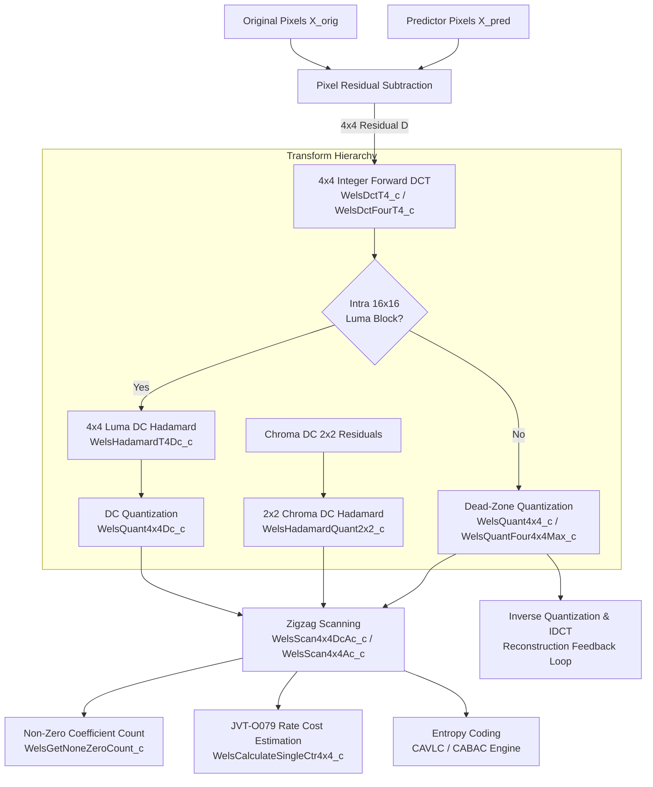
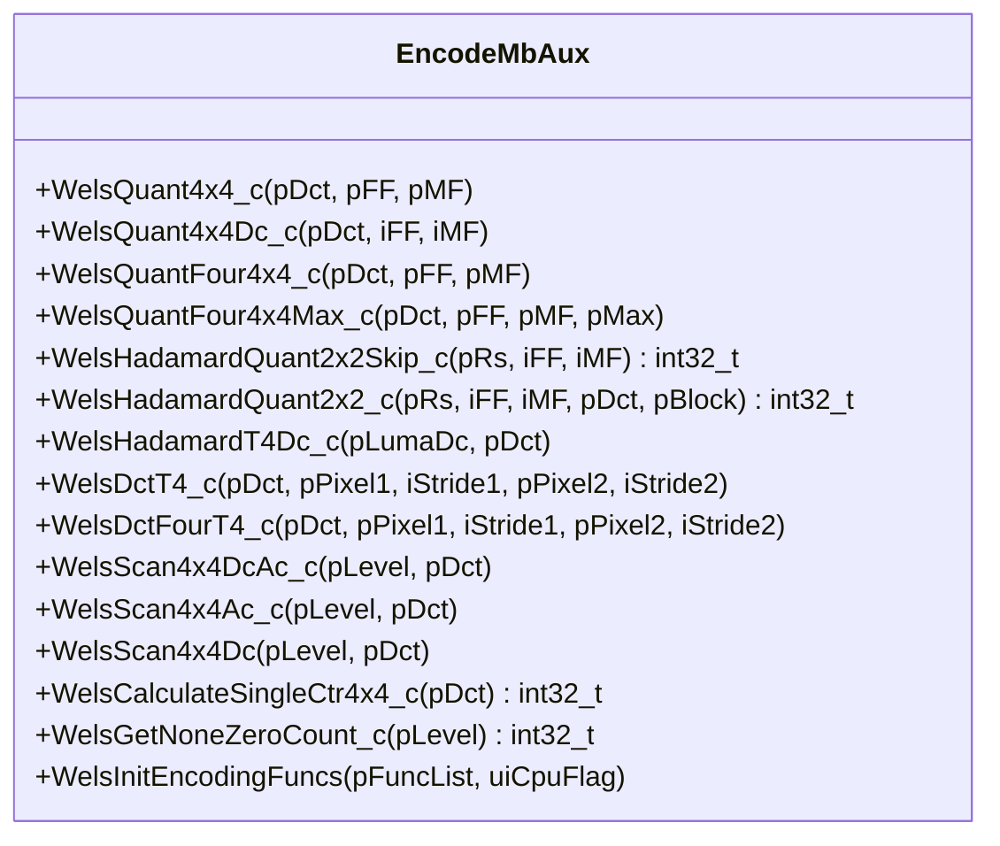

# OpenH264 Encoder Core: Forward DCT, Hadamard Transform, Quantization & Scan Routines

* **Source File**: [encode_mb_aux.cpp](openh264/codec/encoder/core/src/encode_mb_aux.cpp)
* **Header File**: [encode_mb_aux.h](openh264/codec/encoder/core/inc/encode_mb_aux.h)
* **Subsystem**: Video Encoder Core Engine (`codec/encoder/core/`)
* **Namespace**: `WelsEnc`

---

## 1. Module Overview & Architectural Role

The source file [encode_mb_aux.cpp](openh264/codec/encoder/core/src/encode_mb_aux.cpp) implements the computational core of the **H.264 / AVC (and SVC) forward transform, quantization, coefficient scanning, and rate-distortion cost estimation pipeline** within OpenH264's encoder.

During macroblock encoding, once spatial intra prediction or motion-compensated inter prediction produces a predictor block $X_{\text{pred}}$, the residual difference $D = X_{\text{orig}} - X_{\text{pred}}$ must be transformed from the spatial pixel domain into frequency-domain transform coefficients, quantized according to the slice Quantization Parameter ($QP$), ordered via zigzag scanning for entropy coding, and evaluated for rate-distortion mode decisions.



### Key Responsibilities
1. **Forward 4x4 Integer DCT ([WelsDctT4_c](openh264/codec/encoder/core/src/encode_mb_aux.cpp#L313-L356), [WelsDctFourT4_c](openh264/codec/encoder/core/src/encode_mb_aux.cpp#L358-L366))**: Computes the exact 16-bit integer approximation of the 2D Discrete Cosine Transform directly on spatial residual pixel differences ($pPixel1 - pPixel2$).
2. **Hadamard Transforms ([WelsHadamardT4Dc_c](openh264/codec/encoder/core/src/encode_mb_aux.cpp#L280-L308), [WelsHadamardQuant2x2_c](openh264/codec/encoder/core/src/encode_mb_aux.cpp#L244-L277))**: 4x4 Hadamard transform on Luma DC coefficients for Intra 16x16 macroblocks, and combined 2x2 Hadamard transform + quantization for Chroma DC coefficients.
3. **Dead-Zone Forward Quantization ([WelsQuant4x4_c](openh264/codec/encoder/core/src/encode_mb_aux.cpp#L164-L177), [WelsQuantFour4x4Max_c](openh264/codec/encoder/core/src/encode_mb_aux.cpp#L209-L224))**: Fixed-point dead-zone rounding and scalar quantization scaled by $2^{16}$ Multiplication Factors ($MF$) and Rounding Offsets ($f$), supporting fast maximum-level tracking (`pMax`) for early skip decisions.
4. **Zigzag Coefficient Reordering ([WelsScan4x4DcAc_c](openh264/codec/encoder/core/src/encode_mb_aux.cpp#L371-L384), [WelsScan4x4Ac_c](openh264/codec/encoder/core/src/encode_mb_aux.cpp#L386-L400))**: Reorders 2D $4\times 4$ matrices into 1D coefficient arrays optimized for run-length entropy coding.
5. **Rate-Distortion Cost Estimation ([WelsCalculateSingleCtr4x4_c](openh264/codec/encoder/core/src/encode_mb_aux.cpp#L418-L435))**: Fast bit-cost proxy based on JVT-O079 zero-run length penalties.
6. **SIMD Hardware Acceleration Dispatch ([WelsInitEncodingFuncs](openh264/codec/encoder/core/src/encode_mb_aux.cpp#L464-L642))**: Dynamically populates the encoder's global function pointer table ([SWelsFuncPtrList](openh264/codec/encoder/core/inc/wels_func_ptr_def.h#L235-L296)) based on CPU instruction set capabilities detected at runtime (x86 MMX/SSE2/SSSE3/SSE4.2/AVX2, ARM NEON/AArch64 NEON, MIPS MMI/MSA, Loongson LSX/LASX).

---

## 2. Global Constants, Lookup Tables, and Macros

### 2.1 Quantization Lookup Tables

```c
ALIGNED_DECLARE (const int16_t, g_kiQuantInterFF[58][8], 16);
ALIGNED_DECLARE (const int16_t, g_kiQuantMF[52][8], 16);
```

#### `g_kiQuantInterFF[58][8]`
* **Type**: `const int16_t[58][8]` (16-byte cache-aligned)
* **Purpose**: Pre-computed dead-zone rounding offset factors ($f$) for forward quantization of Inter-coded macroblocks across quantization parameter indices $QP \in [0, 57]$.
* **Intra Offset Macro**:
  ```c
  #define g_iQuantIntraFF (g_kiQuantInterFF + 6)
  ```
  In H.264 quantization, the nominal rounding offset $f$ is:
  $$f_{\text{Intra}} \approx \frac{1}{3} \cdot 2^{qbits}, \quad f_{\text{Inter}} \approx \frac{1}{6} \cdot 2^{qbits}$$
  Because $f_{\text{Intra}} = 2 \cdot f_{\text{Inter}}$, and in H.264 every increment of $6$ in $QP$ doubles the quantization step size ($Q_{\text{step}}(QP+6) = 2 \cdot Q_{\text{step}}(QP)$), the table index shift `+ 6` exactly doubles the rounding offset values. Thus `g_kiQuantInterFF[QP + 6]` perfectly serves as the Intra rounding factor $f_{\text{Intra}}$ without needing a separate table.
* **Row Symmetry Structure**:
  Each row contains 8 entries indexed by `j = i & 0x07` ($i \pmod 8$). In a $4\times 4$ block where linear index $i = 4r + c$:
  - Positions $(0,0), (0,2), (2,0), (2,2)$ map to table columns $0$ and $2$.
  - Positions $(1,1), (1,3), (3,1), (3,3)$ map to table columns $5$ and $7$.
  - Mixed positions map to columns $1, 3, 4, 6$.
  This repeating 8-element periodicity exploits the symmetry of 2D transform position scaling.

#### `g_kiQuantMF[52][8]`
* **Type**: `const int16_t[52][8]` (16-byte cache-aligned)
* **Purpose**: Multiplication Factor ($MF$) table for forward quantization across all 52 standard H.264 $QP$ values ($QP \in [0, 51]$).
* **Derivation**: In standard H.264 integer quantization, division by $Q_{\text{step}}$ is computed via multiplication by $MF$ followed by a bitshift:
  $$MF = \left\lfloor \frac{2^{15 + \lfloor QP/6 \rfloor}}{Q_{\text{step}}(QP \pmod 6, \text{pos})} \right\rfloor \cdot 2^{-\lfloor QP/6 \rfloor}$$
  OpenH264 normalizes $MF$ into 16-bit integers such that a fixed right-shift by 16 (`>> 16`) is used universally across all $QP$ values, avoiding variable runtime bitshifts.

---

### 2.2 Branchless Bitwise Macros

[encode_mb_aux.cpp](openh264/codec/encoder/core/src/encode_mb_aux.cpp#L161-L163) defines optimized branchless arithmetic macros that eliminate branch misprediction penalties during coefficient processing:

| Macro | Definition | Mathematical Function |
| :--- | :--- | :--- |
| `WELS_SIGN(iX)` | `((int32_t)(iX) >> 31)` | Returns arithmetic sign mask: `0x00000000` ($0$) if $iX \ge 0$, and `0xFFFFFFFF` ($-1$) if $iX < 0$. |
| `WELS_ABS(iX)` | `((WELS_SIGN(iX) ^ (int32_t)(iX)) - WELS_SIGN(iX))` | Branchless absolute value $|iX|$ in two's complement arithmetic. |
| `WELS_ABS_LC(a)` | `((iSign ^ (int32_t)(a)) - iSign)` | Reusable sign toggle. When `iSign = WELS_SIGN(orig)`, `WELS_ABS_LC(orig)` extracts magnitude $|orig|$. When applied to positive magnitude $Z$, `WELS_ABS_LC(Z)` restores original sign $\operatorname{sgn}(orig) \cdot Z$. |
| `NEW_QUANT(pDct, iFF, iMF)` | `(((iFF) + WELS_ABS_LC(pDct)) * (iMF)) >> 16` | Computes quantized magnitude: $|Z| = \lfloor (|W| + f) \cdot MF / 2^{16} \rfloor$. |
| `WELS_NEW_QUANT(pDct, iFF, iMF)` | `WELS_ABS_LC(NEW_QUANT(pDct, iFF, iMF))` | Computes signed quantized level: $Z = \operatorname{sgn}(W) \cdot \lfloor (|W| + f) \cdot MF / 2^{16} \rfloor$. |

---

## 3. Function Reference & Implementation Deep Dive



---

### 3.1 `WelsQuant4x4_c`

```cpp
void WelsQuant4x4_c (int16_t* pDct, const int16_t* pFF, const int16_t* pMF);
```
[encode_mb_aux.cpp#L164-L177](openh264/codec/encoder/core/src/encode_mb_aux.cpp#L164-L177)

* **Purpose**: Performs in-place dead-zone forward quantization on a single $4\times 4$ block of 16 integer DCT coefficients.
* **Parameters**:
  * `pDct` (`int16_t*`): In-out pointer to 16 contiguous DCT coefficients. Overwritten with quantized levels.
  * `pFF` (`const int16_t*`): Pointer to the 8-element rounding offset row `g_kiQuantInterFF[QP]` or `g_iQuantIntraFF[QP]`.
  * `pMF` (`const int16_t*`): Pointer to the 8-element multiplication factor row `g_kiQuantMF[QP]`.
* **Mathematical Formula**:
  $$Z_{ij} = \operatorname{sgn}(W_{ij}) \cdot \left\lfloor \frac{(|W_{ij}| + f_j) \cdot MF_j}{2^{16}} \right\rfloor \quad \text{where } j = (4r + c) \pmod 8$$
* **Algorithm Walkthrough**:
  1. Loops over 16 elements in unrolled 4-element steps (`i = 0, 4, 8, 12`).
  2. For each element, derives `j = i & 0x07`.
  3. Extracts sign bit mask via `iSign = WELS_SIGN(pDct[i])`.
  4. Applies `WELS_NEW_QUANT` to quantize magnitude and restore the sign without conditional branches.
* **SIMD Equivalents**: `WelsQuant4x4_sse2`, `WelsQuant4x4_avx2`, `WelsQuant4x4_neon`, `WelsQuant4x4_AArch64_neon`, `WelsQuant4x4_mmi`.

---

### 3.2 `WelsQuant4x4Dc_c`

```cpp
void WelsQuant4x4Dc_c (int16_t* pDct, int16_t iFF, int16_t iMF);
```
[encode_mb_aux.cpp#L179-L191](openh264/codec/encoder/core/src/encode_mb_aux.cpp#L179-L191)

* **Purpose**: Performs in-place dead-zone forward quantization on the $4\times 4$ Luma DC Hadamard transform block of an Intra 16x16 macroblock.
* **Parameters**:
  * `pDct` (`int16_t*`): Pointer to 16 Hadamard-transformed DC coefficients.
  * `iFF` (`int16_t`): Scalar rounding offset parameter $f_0$.
  * `iMF` (`int16_t`): Scalar multiplication factor $MF_0$.
* **Rationale**: Because all 16 coefficients in a Hadamard DC block share identical frequency weighting (DC position $(0,0)$), scalar `iFF` and `iMF` are passed rather than 8-element arrays.
* **SIMD Equivalents**: `WelsQuant4x4Dc_sse2`, `WelsQuant4x4Dc_avx2`, `WelsQuant4x4Dc_neon`, `WelsQuant4x4Dc_AArch64_neon`, `WelsQuant4x4Dc_mmi`.

---

### 3.3 `WelsQuantFour4x4_c`

```cpp
void WelsQuantFour4x4_c (int16_t* pDct, const int16_t* pFF, const int16_t* pMF);
```
[encode_mb_aux.cpp#L193-L207](openh264/codec/encoder/core/src/encode_mb_aux.cpp#L193-L207)

* **Purpose**: Quantizes four consecutive $4\times 4$ DCT blocks (total 64 `int16_t` coefficients), typically representing an $8\times 8$ sub-partition or a chroma channel.
* **Parameters**:
  * `pDct` (`int16_t*`): Pointer to 64 consecutive DCT coefficients.
  * `pFF`, `pMF` (`const int16_t*`): 8-element rounding offset and multiplication factor tables.
* **Algorithm Walkthrough**:
  Loops `i = 0` to `63` in steps of 4, applying `WELS_NEW_QUANT` using `j = i & 0x07`.
* **SIMD Equivalents**: `WelsQuantFour4x4_sse2`, `WelsQuantFour4x4_avx2`, `WelsQuantFour4x4_neon`, `WelsQuantFour4x4_AArch64_neon`, `WelsQuantFour4x4_mmi`, `WelsQuantFour4x4_lsx`.

---

### 3.4 `WelsQuantFour4x4Max_c`

```cpp
void WelsQuantFour4x4Max_c (int16_t* pDct, const int16_t* pFF, const int16_t* pMF, int16_t* pMax);
```
[encode_mb_aux.cpp#L209-L224](openh264/codec/encoder/core/src/encode_mb_aux.cpp#L209-L224)

* **Purpose**: Quantizes four consecutive $4\times 4$ DCT blocks while simultaneously calculating and returning the maximum absolute quantized coefficient magnitude `pMax[k]` for each $4\times 4$ block $k \in \{0, 1, 2, 3\}$.
* **Parameters**:
  * `pDct` (`int16_t*`): In-out pointer to 64 DCT coefficients.
  * `pFF`, `pMF` (`const int16_t*`): Rounding offset and MF tables.
  * `pMax` (`int16_t*`): Output array of 4 `int16_t` elements receiving $\max_{i \in [0,15]} |Z_{k, i}|$.
* **Significance for Fast Mode Decision**:
  If `pMax[k] == 0`, the encoder immediately knows all 16 quantized coefficients in block $k$ are zero. It can bypass subsequent zigzag scanning, non-zero coefficient counting, CAVLC table lookups, and inverse quantization loops.
* **Algorithm Walkthrough**:
  ```cpp
  for (k = 0; k < 4; k++) {
    iMaxAbs = 0;
    for (i = 0; i < 16; i++) {
      j = i & 0x07;
      iSign = WELS_SIGN (pDct[i]);
      pDct[i] = NEW_QUANT (pDct[i], pFF[j], pMF[j]); // absolute quantized magnitude
      if (iMaxAbs < pDct[i]) iMaxAbs = pDct[i];
      pDct[i] = WELS_ABS_LC (pDct[i]);               // restore sign
    }
    pDct += 16;
    pMax[k] = iMaxAbs;
  }
  ```
* **SIMD Equivalents**: `WelsQuantFour4x4Max_sse2`, `WelsQuantFour4x4Max_avx2`, `WelsQuantFour4x4Max_neon`, `WelsQuantFour4x4Max_AArch64_neon`, `WelsQuantFour4x4Max_mmi`, `WelsQuantFour4x4Max_lsx`.

---

### 3.5 `WelsHadamardQuant2x2Skip_c`

```cpp
int32_t WelsHadamardQuant2x2Skip_c (int16_t* pRs, int16_t iFF, int16_t iMF);
```
[encode_mb_aux.cpp#L226-L242](openh264/codec/encoder/core/src/encode_mb_aux.cpp#L226-L242)

* **Purpose**: Fast early-termination skip check for the $2\times 2$ Chroma DC Hadamard transform and quantization. Determines whether *any* of the 4 quantized Chroma DC coefficients will be non-zero without modifying memory or performing arithmetic division inside the transform loop.
* **Parameters**:
  * `pRs` (`int16_t*`): Pointer to the four Chroma DC residual coefficients located at offsets `pRs[0]`, `pRs[16]`, `pRs[32]`, `pRs[48]` (stride 16 elements between $4\times 4$ sub-blocks).
  * `iFF` (`int16_t`): Rounding offset parameter $f$.
  * `iMF` (`int16_t`): Multiplication factor $MF$.
* **Mathematical Derivation of `iThreshold`**:
  A transformed coefficient $D$ quantizes to a non-zero level ($|Z| > 0$) if and only if:
  $$\lfloor (|D| + iFF) \cdot iMF / 2^{16} \rfloor > 0 \iff (|D| + iFF) \cdot iMF \ge 2^{16}$$
  $$\iff |D| > \left\lfloor \frac{2^{16} - 1}{iMF} \right\rfloor - iFF$$
  OpenH264 computes `iThreshold = ((1 << 16) - 1) / iMF - iFF`.
* **2D $2\times 2$ Hadamard Butterfly**:
  $$\begin{aligned}
  s_0 &= pRs[0] + pRs[32], \quad s_1 = pRs[0] - pRs[32] \\
  s_2 &= pRs[16] + pRs[48], \quad s_3 = pRs[16] - pRs[48] \\
  D_0 &= s_0 + s_2, \quad D_1 = s_0 - s_2, \quad D_2 = s_1 + s_3, \quad D_3 = s_1 - s_3
  \end{aligned}$$
* **Return Value**: Non-zero (`1`) if $\max(|D_0|, |D_1|, |D_2|, |D_3|) > \text{iThreshold}$; otherwise `0`.

---

### 3.6 `WelsHadamardQuant2x2_c`

```cpp
int32_t WelsHadamardQuant2x2_c (int16_t* pRs, const int16_t iFF, int16_t iMF, int16_t* pDct, int16_t* pBlock);
```
[encode_mb_aux.cpp#L244-L277](openh264/codec/encoder/core/src/encode_mb_aux.cpp#L244-L277)

* **Purpose**: Performs full $2\times 2$ Hadamard transformation and quantization on Chroma DC coefficients, clears the original DC positions in the residual arrays (`pRs[0] = pRs[16] = pRs[32] = pRs[48] = 0`), stores the 4 quantized coefficients (64-bit store) into `pBlock`, and returns the non-zero coefficient count (`iDcNzc`).
* **Parameters**:
  * `pRs` (`int16_t*`): In-out residual array. DC entries at offsets 0, 16, 32, 48 are cleared to 0.
  * `iFF`, `iMF` (`int16_t`): Rounding offset and multiplication factor.
  * `pDct` (`int16_t*`): Temporary 4-element buffer for transformed/quantized coefficients.
  * `pBlock` (`int16_t*`): Output buffer receiving 4 quantized 16-bit DC coefficients.
* **Return Value**: Integer count of non-zero quantized DC coefficients ($0 \le iDcNzc \le 4$).

---

### 3.7 `WelsHadamardT4Dc_c`

```cpp
void WelsHadamardT4Dc_c (int16_t* pLumaDc, int16_t* pDct);
```
[encode_mb_aux.cpp#L280-L308](openh264/codec/encoder/core/src/encode_mb_aux.cpp#L280-L308)

* **Purpose**: Performs the $4\times 4$ Forward Hadamard Transform on the 16 Luma DC coefficients of an Intra 16x16 macroblock.
* **Parameters**:
  * `pLumaDc` (`int16_t*`): Destination array of 16 transformed DC coefficients.
  * `pDct` (`int16_t*`): Source macroblock coefficient buffer containing the 16 $4\times 4$ blocks.
* **Hadamard Matrix Formulation**:
  $$H_4 = \begin{pmatrix} 1 & 1 & 1 & 1 \\ 1 & 1 & -1 & -1 \\ 1 & -1 & -1 & 1 \\ 1 & -1 & 1 & -1 \end{pmatrix}$$
  The 2D transform is computed as:
  $$Y = \left( H_4 \cdot D_{\text{DC}} \cdot H_4^T + 1 \right) \gg 1$$
  Clipped to signed 16-bit integer bounds $[-32768, 32767]$ via `WELS_CLIP3`.

---

### 3.8 `WelsDctT4_c`

```cpp
void WelsDctT4_c (int16_t* pDct, uint8_t* pPixel1, int32_t iStride1, uint8_t* pPixel2, int32_t iStride2);
```
[encode_mb_aux.cpp#L313-L356](openh264/codec/encoder/core/src/encode_mb_aux.cpp#L313-L356)

* **Purpose**: Computes pixel-domain residual subtraction ($pPixel1 - pPixel2$) and 2D forward $4\times 4$ integer DCT.
* **Parameters**:
  * `pDct` (`int16_t*`): Destination 16-element array receiving transform coefficients.
  * `pPixel1` (`uint8_t*`), `iStride1` (`int32_t`): Original pixel plane buffer and row stride.
  * `pPixel2` (`uint8_t*`), `iStride2` (`int32_t`): Prediction pixel plane buffer and row stride.
* **Mathematical Algorithm**:
  1. **Residual Difference**:
     $$d_{r, c} = pPixel1[r \cdot iStride1 + c] - pPixel2[r \cdot iStride2 + c] \quad (r, c \in [0, 3])$$
  2. **1D Horizontal Transform**:
     $$\begin{aligned}
     s_0 &= d_{r,0} + d_{r,3}, \quad s_3 = d_{r,0} - d_{r,3} \\
     s_1 &= d_{r,1} + d_{r,2}, \quad s_2 = d_{r,1} - d_{r,2} \\
     h_{r,0} &= s_0 + s_1 \\
     h_{r,1} &= (s_3 \ll 1) + s_2 \\
     h_{r,2} &= s_0 - s_1 \\
     h_{r,3} &= s_3 - (s_2 \ll 1)
     \end{aligned}$$
  3. **1D Vertical Transform**:
     $$\begin{aligned}
     s_0 &= h_{0,c} + h_{3,c}, \quad s_3 = h_{0,c} - h_{3,c} \\
     s_1 &= h_{1,c} + h_{2,c}, \quad s_2 = h_{1,c} - h_{2,c} \\
     pDct[4 \cdot 0 + c] &= s_0 + s_1 \\
     pDct[4 \cdot 1 + c] &= (s_3 \ll 1) + s_2 \\
     pDct[4 \cdot 2 + c] &= s_0 - s_1 \\
     pDct[4 \cdot 3 + c] &= s_3 - (s_2 \ll 1)
     \end{aligned}$$
* **SIMD Equivalents**: `WelsDctT4_mmx`, `WelsDctT4_sse2`, `WelsDctT4_avx2`, `WelsDctT4_neon`, `WelsDctT4_AArch64_neon`, `WelsDctT4_mmi`, `WelsDctT4_lasx`.

---

### 3.9 `WelsDctFourT4_c`

```cpp
void WelsDctFourT4_c (int16_t* pDct, uint8_t* pPixel1, int32_t iStride1, uint8_t* pPixel2, int32_t iStride2);
```
[encode_mb_aux.cpp#L358-L366](openh264/codec/encoder/core/src/encode_mb_aux.cpp#L358-L366)

* **Purpose**: Performs forward $4\times 4$ integer DCT on four $4\times 4$ blocks forming an $8\times 8$ partition quadrant layout.
* **Sub-block Offsets**:
  * Block 0 (Top-Left): `pDct + 0`, `pPixel1[0]`, `pPixel2[0]`
  * Block 1 (Top-Right): `pDct + 16`, `pPixel1[4]`, `pPixel2[4]`
  * Block 2 (Bottom-Left): `pDct + 32`, `pPixel1[4 * iStride1]`, `pPixel2[4 * iStride2]`
  * Block 3 (Bottom-Right): `pDct + 48`, `pPixel1[4 * iStride1 + 4]`, `pPixel2[4 * iStride2 + 4]`

---

### 3.10 Zigzag Scanning Functions

```cpp
void WelsScan4x4DcAc_c (int16_t* pLevel, int16_t* pDct);
void WelsScan4x4Ac_c   (int16_t* pLevel, int16_t* pDct);
void WelsScan4x4Dc     (int16_t* pLevel, int16_t* pDct);
```
[encode_mb_aux.cpp#L371-L415](openh264/codec/encoder/core/src/encode_mb_aux.cpp#L371-L415)

* **`WelsScan4x4DcAc_c`**: Reorders all 16 coefficients of a $4\times 4$ block `pDct` into 1D zigzag scan order in `pLevel`. Utilizes `LD32`/`ST32` 32-bit load/store instructions to move adjacent coefficient pairs in single operations.
  * **H.264 $4\times 4$ Zigzag Order**:
    $$\begin{pmatrix}
    0 & 1 & 5 & 6 \\
    2 & 4 & 7 & 12 \\
    3 & 8 & 11 & 13 \\
    9 & 10 & 14 & 15
    \end{pmatrix}$$
* **`WelsScan4x4Ac_c`**: Reorders the 15 AC coefficients into `pLevel[0..14]` (omitting DC at `pDct[0]`) and sets `pLevel[15] = 0`. Used when the DC coefficient is coded separately via Luma DC Hadamard.
* **`WelsScan4x4Dc`**: Zigzag reordering routine for $4\times 4$ DC Hadamard blocks.

---

### 3.11 `WelsCalculateSingleCtr4x4_c`

```cpp
int32_t WelsCalculateSingleCtr4x4_c (int16_t* pDct);
```
[encode_mb_aux.cpp#L418-L435](openh264/codec/encoder/core/src/encode_mb_aux.cpp#L418-L435)

* **Purpose**: Computes an ultra-fast rate-distortion entropy bit-cost estimate for a $4\times 4$ coefficient block based on the **JVT-O079** standard contribution.
* **Lookup Table**:
  ```cpp
  static const int32_t kiTRunTable[16] = { 3, 2, 2, 1, 1, 1, 0, 0, 0, 0, 0, 0, 0, 0, 0, 0 };
  ```
* **Algorithm Walkthrough**:
  1. Finds the highest non-zero coefficient index `iIdx` from 15 down to 0.
  2. Iteratively calculates the consecutive zero-run length `iRun` between non-zero coefficients.
  3. Accumulates bit-cost penalties: `iSingleCtr += kiTRunTable[iRun]`.
* **Return Value**: Accumulated rate cost estimator integer (`iSingleCtr`).

---

### 3.12 `WelsGetNoneZeroCount_c`

```cpp
int32_t WelsGetNoneZeroCount_c (int16_t* pLevel);
```
[encode_mb_aux.cpp#L437-L450](openh264/codec/encoder/core/src/encode_mb_aux.cpp#L437-L450)

* **Purpose**: Counts the number of non-zero coefficients in a 16-element array `pLevel`.
* **Implementation**:
  Accumulates zero counts across 4 unrolled blocks:
  ```cpp
  iCnt += (pLevel[iIdx] == 0) + (pLevel[1 + iIdx] == 0) + (pLevel[2 + iIdx] == 0) + (pLevel[3 + iIdx] == 0);
  return (16 - iCnt);
  ```
* **SIMD Equivalents**: `WelsGetNoneZeroCount_sse2`, `WelsGetNoneZeroCount_sse42`, `WelsGetNoneZeroCount_neon`, `WelsGetNoneZeroCount_AArch64_neon`, `WelsGetNoneZeroCount_mmi`.

---

### 3.13 `WelsInitEncodingFuncs`

```cpp
void WelsInitEncodingFuncs (SWelsFuncPtrList* pFuncList, uint32_t uiCpuFlag);
```
[encode_mb_aux.cpp#L464-L642](openh264/codec/encoder/core/src/encode_mb_aux.cpp#L464-L642)

* **Purpose**: Initializes the encoder function pointer table ([SWelsFuncPtrList](openh264/codec/encoder/core/inc/wels_func_ptr_def.h#L235-L296)) dynamically at encoder initialization time, selecting optimal assembly kernels based on the host CPU flags `uiCpuFlag`.

---

## 4. CPU Dispatch Matrix & SIMD Architecture Map

The table below maps all encoding primitives initialized in [WelsInitEncodingFuncs](openh264/codec/encoder/core/src/encode_mb_aux.cpp#L464-L642) to their corresponding C/C++ fallback and ISA-specific assembly implementations:

| Function Pointer | C/C++ Default | x86 (MMX / SSE2 / SSSE3 / SSE4.2 / AVX2) | ARM NEON (32-bit / AArch64) | MIPS (MMI / MSA) | Loongson (LSX / LASX) |
| :--- | :--- | :--- | :--- | :--- | :--- |
| `pfQuantization4x4` | [WelsQuant4x4_c](openh264/codec/encoder/core/src/encode_mb_aux.cpp#L164-L177) | `_sse2`, `_avx2` | `_neon`, `_AArch64_neon` | `_mmi` | — |
| `pfQuantizationDc4x4` | [WelsQuant4x4Dc_c](openh264/codec/encoder/core/src/encode_mb_aux.cpp#L179-L191) | `_sse2`, `_avx2` | `_neon`, `_AArch64_neon` | `_mmi` | — |
| `pfQuantizationFour4x4` | [WelsQuantFour4x4_c](openh264/codec/encoder/core/src/encode_mb_aux.cpp#L193-L207) | `_sse2`, `_avx2` | `_neon`, `_AArch64_neon` | `_mmi` | `_lsx` |
| `pfQuantizationFour4x4Max` | [WelsQuantFour4x4Max_c](openh264/codec/encoder/core/src/encode_mb_aux.cpp#L209-L224) | `_sse2`, `_avx2` | `_neon`, `_AArch64_neon` | `_mmi` | `_lsx` |
| `pfQuantizationHadamard2x2` | [WelsHadamardQuant2x2_c](openh264/codec/encoder/core/src/encode_mb_aux.cpp#L244-L277) | `_mmx` | `_neon`, `_AArch64_neon` | — | — |
| `pfQuantizationHadamard2x2Skip`| [WelsHadamardQuant2x2Skip_c](openh264/codec/encoder/core/src/encode_mb_aux.cpp#L226-L242) | `_mmx` | `_neon`, `_AArch64_neon` | — | — |
| `pfTransformHadamard4x4Dc` | [WelsHadamardT4Dc_c](openh264/codec/encoder/core/src/encode_mb_aux.cpp#L280-L308) | `_sse2` | `_neon`, `_AArch64_neon` | `_mmi` | — |
| `pfDctT4` | [WelsDctT4_c](openh264/codec/encoder/core/src/encode_mb_aux.cpp#L313-L356) | `_mmx`, `_sse2`, `_avx2` | `_neon`, `_AArch64_neon` | `_mmi` | `_lasx` |
| `pfDctFourT4` | [WelsDctFourT4_c](openh264/codec/encoder/core/src/encode_mb_aux.cpp#L358-L366) | `_sse2`, `_avx2` | `_neon`, `_AArch64_neon` | `_mmi` | `_lasx` |
| `pfScan4x4` | [WelsScan4x4DcAc_c](openh264/codec/encoder/core/src/encode_mb_aux.cpp#L371-L384) | `_sse2`, `_ssse3` | — | `_mmi` | — |
| `pfScan4x4Ac` | [WelsScan4x4Ac_c](openh264/codec/encoder/core/src/encode_mb_aux.cpp#L386-L400) | `_sse2` | — | `_mmi` | — |
| `pfCalculateSingleCtr4x4` | [WelsCalculateSingleCtr4x4_c](openh264/codec/encoder/core/src/encode_mb_aux.cpp#L418-L435) | `_sse2` | — | `_mmi` | — |
| `pfGetNoneZeroCount` | [WelsGetNoneZeroCount_c](openh264/codec/encoder/core/src/encode_mb_aux.cpp#L437-L450) | `_sse2`, `_sse42` | `_neon`, `_AArch64_neon` | `_mmi` | — |
| `pfCopy8x8Aligned` | `WelsCopy8x8_c` | `_mmx` | `_neon`, `_AArch64_neon` | `_mmi`, `_msa` | `_lsx` |
| `pfCopy16x16Aligned` | `WelsCopy16x16_c` | `_sse2` | `_neon`, `_AArch64_neon` | `_mmi`, `_msa` | `_lsx` |
| `pfCopy16x16NotAligned` | `WelsCopy16x16_c` | `_sse2` | `_neon`, `_AArch64_neon` | `_mmi`, `_msa` | `_lsx` |
| `pfCopy16x8NotAligned` | `WelsCopy16x8_c` | `_sse2` | `_neon`, `_AArch64_neon` | `_mmi`, `_msa` | — |
| `pfCopy8x16Aligned` | `WelsCopy8x16_c` | `_mmx` | `_neon`, `_AArch64_neon` | `_mmi`, `_msa` | — |
