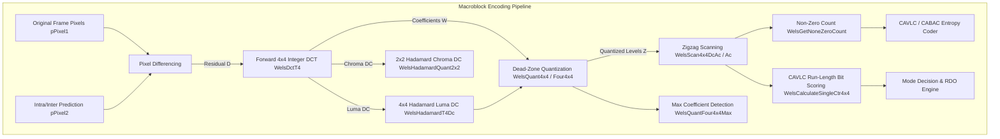
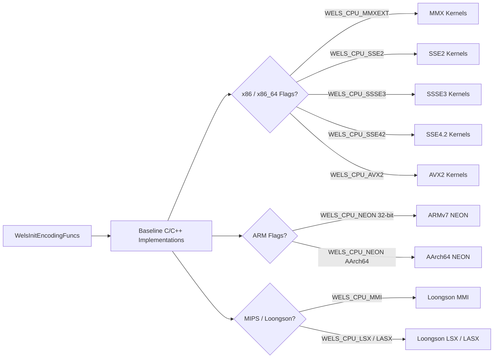
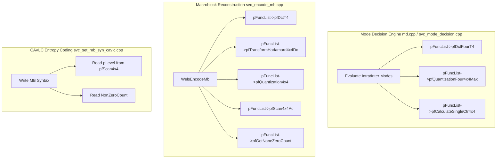

# Literate Programming: Macroblock Auxiliary Encoding Kernels (`encode_mb_aux.h`)

This document provides an exhaustive, literate-programming-style technical breakdown of [`encode_mb_aux.h`](openh264/codec/encoder/core/inc/encode_mb_aux.h) and its companion implementation [`encode_mb_aux.cpp`](openh264/codec/encoder/core/src/encode_mb_aux.cpp) within the OpenH264 video encoder core.

---

## Table of Contents
1. [Module Overview & Architectural Role](#1-module-overview--architectural-role)
2. [Data Structures, Quantization Tables & Constants](#2-data-structures-quantization-tables--constants)
   - [2.1 Inter and Intra Quantization Offset Tables (`g_kiQuantInterFF`, `g_iQuantIntraFF`)](#21-inter-and-intra-quantization-offset-tables-g_kiquantinterff-g_iquantintraff)
   - [2.2 Quantization Multiplication Factor Table (`g_kiQuantMF`)](#22-quantization-multiplication-factor-table-g_kiquantmf)
   - [2.3 Arithmetic & Quantization Transformation Macros](#23-arithmetic--quantization-transformation-macros)
3. [Function Dispatch & CPU Capability Matrix (`WelsInitEncodingFuncs`)](#3-function-dispatch--cpu-capability-matrix-welsinitencodingfuncs)
4. [Deep-Dive Function Breakdown](#4-deep-dive-function-breakdown)
   - [4.1 Forward Integer Discrete Cosine Transform (FDCT)](#41-forward-integer-discrete-cosine-transform-fdct)
     - [`WelsDctT4_c`](#welsdctt4_c)
     - [`WelsDctFourT4_c`](#welsdctfourt4_c)
   - [4.2 Forward Hadamard Transforms](#42-forward-hadamard-transforms)
     - [`WelsHadamardT4Dc_c`](#welshadamardt4dc_c)
     - [`WelsHadamardQuant2x2_c`](#welshadamardquant2x2_c)
     - [`WelsHadamardQuant2x2Skip_c`](#welshadamardquant2x2skip_c)
   - [4.3 Forward Quantization Kernels](#43-forward-quantization-kernels)
     - [`WelsQuant4x4_c`](#welsquant4x4_c)
     - [`WelsQuant4x4Dc_c`](#welsquant4x4dc_c)
     - [`WelsQuantFour4x4_c`](#welsquantfour4x4_c)
     - [`WelsQuantFour4x4Max_c`](#welsquantfour4x4max_c)
   - [4.4 Zigzag Coefficient Scanning](#44-zigzag-coefficient-scanning)
     - [`WelsScan4x4DcAc_c`](#welsscan4x4dcac_c)
     - [`WelsScan4x4Ac_c`](#welsscan4x4ac_c)
     - [`WelsScan4x4Dc`](#welsscan4x4dc)
   - [4.5 Non-Zero Count & CAVLC Bit Scoring](#45-non-zero-count--cavlc-bit-scoring)
     - [`WelsGetNoneZeroCount_c`](#welsgetnonezerocount_c)
     - [`WelsCalculateSingleCtr4x4_c`](#welscalculatesinglectr4x4_c)
5. [Subsystem Interactions & Call Graph](#5-subsystem-interactions--call-graph)

---

## 1. Module Overview & Architectural Role

The header [`encode_mb_aux.h`](openh264/codec/encoder/core/inc/encode_mb_aux.h) defines the low-level mathematical kernels responsible for **spatial frequency transformation, quantization, coefficient reordering (zigzag scan), non-zero count evaluation, and CAVLC bit estimation** for macroblock encoding in OpenH264.

In the H.264 / AVC (ITU-T H.264 | ISO/IEC 14496-10) video coding standard, these operations represent the critical forward transformation and lossy quantization step in the macroblock compression pipeline:



### Architectural Responsibilities
1. **Residual Frequency Transform**: Transforms spatial prediction residuals ($D = P_{\text{orig}} - P_{\text{pred}}$) into 16-bit integer transform coefficients using the $4 \times 4$ H.264 integer forward DCT approximation.
2. **DC Block Concentration (Hadamard Transforms)**: Concentrates low-frequency energy of DC coefficients for Intra-16x16 luma blocks ($4 \times 4$ Hadamard) and chroma blocks ($2 \times 2$ Hadamard).
3. **Dead-Zone Forward Quantization**: Maps continuous integer transform coefficients into discrete quantized transform levels ($Z$) using quantization scaling factors ($MF$) and dead-zone rounding offsets ($f$) derived from the slice/macroblock Quantization Parameter ($QP$).
4. **Zigzag Reordering**: Serializes 2D $4 \times 4$ transform coefficient blocks into 1D frequency-sorted arrays (DC, low AC, high AC) to optimize run-length entropy coding efficiency.
5. **Rate-Distortion Assessment**: Computes fast non-zero coefficient counts (`nnz`) and CAVLC bit-cost approximations to guide the Mode Decision (MD) engine during Intra vs. Inter Partition selection.

---

## 2. Data Structures, Quantization Tables & Constants

[`encode_mb_aux.h`](openh264/codec/encoder/core/inc/encode_mb_aux.h) and [`encode_mb_aux.cpp`](openh264/codec/encoder/core/src/encode_mb_aux.cpp) maintain static lookup tables aligned to 16-byte boundaries (`ALIGNED_DECLARE`) to guarantee optimal cache line loading and 128-bit vector access in SSE2, AVX2, and NEON assembly routines.

```
+-----------------------------------------------------------------------------------+
|                            Quantization Table Alignment                           |
+-----------------------------------------------------------------------------------+
|  g_kiQuantInterFF[58][8]  (16-byte aligned)                                       |
|  ├── Rows [0..51]:  Inter MB rounding offset f (f ≈ 1/6 * 2^(15 + QP/6))           |
|  └── Rows [6..57]:  Intra MB rounding offset f (via g_iQuantIntraFF offset macro) |
|                                                                                   |
|  g_kiQuantMF[52][8]       (16-byte aligned)                                       |
|  └── Rows [0..51]:  Multiplication Factor MF for H.264 integer forward DCT        |
+-----------------------------------------------------------------------------------+
```

### 2.1 Inter and Intra Quantization Offset Tables (`g_kiQuantInterFF`, `g_iQuantIntraFF`)

```cpp
ALIGNED_DECLARE (extern const int16_t, g_kiQuantInterFF[58][8], 16);
#define g_iQuantIntraFF (g_kiQuantInterFF + 6)
```

* **Data Type**: `const int16_t[58][8]` (total 464 entries, 928 bytes).
* **Alignment**: 16-byte memory boundary (`ALIGN(16)`).
* **Mathematical Purpose**: In H.264 dead-zone quantization, transform coefficients $|W|$ are shifted and biased by a rounding offset $f$:
  $$Z = \text{sign}(W) \cdot \left\lfloor \frac{|W| \cdot MF + f}{2^{qbits}} \right\rfloor$$
  where $qbits = 15 + \lfloor QP / 6 \rfloor$.
* **Inter vs. Intra Bias Strategy**:
  - **Inter Mode (`g_kiQuantInterFF`)**: Rounding offset $f \approx \frac{1}{6} \cdot 2^{15 + \lfloor QP/6 \rfloor}$. Using a smaller offset preserves high frequency detail only when strong energy is present, pruning low-energy noise to conserve bit budget.
  - **Intra Mode (`g_iQuantIntraFF`)**: Rounding offset $f \approx \frac{1}{3} \cdot 2^{15 + \lfloor QP/6 \rfloor}$. OpenH264 achieves this without duplicating tables by offsetting the pointer index by $+6$ rows (`g_kiQuantInterFF + 6`). Because $QP$ scaling doubles every 6 steps ($2^{\frac{QP+6}{6}} = 2 \cdot 2^{\frac{QP}{6}}$), indexing row $QP+6$ provides approximately double the rounding threshold $f$, matching the $\approx 2 \times (\frac{1}{6} \to \frac{1}{3})$ Intra bias.

---

### 2.2 Quantization Multiplication Factor Table (`g_kiQuantMF`)

```cpp
ALIGNED_DECLARE (extern const int16_t, g_kiQuantMF[52][8], 16);
```

* **Data Type**: `const int16_t[52][8]` (total 416 entries, 832 bytes).
* **Alignment**: 16-byte boundary.
* **Mathematical Derivation**: The H.264 $4 \times 4$ forward DCT scales rows and columns by integer approximation factors $(a=1/2, b=\sqrt{2/5})$. To avoid floating-point operations, the scaling factor $a^2, b^2, ab$ is folded directly into the quantization multiplier $MF$:
  $$MF(q_m, QP \pmod 6) = \text{round}\left( \frac{2^{15 + \lfloor QP/6 \rfloor}}{Q_{\text{step}}(QP)} \cdot S_{ij} \right)$$
  Each row contains 8 values matching the diagonal/cross symmetric positions in the $4 \times 4$ DCT matrix indexed by `j = i & 0x07`:
  - `j = 0, 2, 4, 6`: Corner and center positions $(0,0), (0,2), (2,0), (2,2)$ scaled by factor $a^2$.
  - `j = 5, 7`: Corner-adjacent odd positions $(1,1), (1,3), (3,1), (3,3)$ scaled by factor $b^2/4$.
  - `j = 1, 3`: Mixed even-odd positions $(0,1), (1,0), (2,3), \dots$ scaled by factor $ab/2$.

---

### 2.3 Arithmetic & Quantization Transformation Macros

In [`encode_mb_aux.cpp`](openh264/codec/encoder/core/src/encode_mb_aux.cpp#L161-L163), three fundamental arithmetic macros define the branchless integer forward quantization pipeline:

```cpp
#define WELS_ABS_LC(a)               ((iSign ^ (int32_t)(a)) - iSign)
#define NEW_QUANT(pDct, iFF, iMF)    (((iFF) + WELS_ABS_LC(pDct)) * (iMF)) >> 16
#define WELS_NEW_QUANT(pDct,iFF,iMF) WELS_ABS_LC(NEW_QUANT(pDct, iFF, iMF))
```

1. **`WELS_ABS_LC(a)`**: Branchless absolute value and sign restoration.
   - If `iSign = 0` (non-negative): `(0 ^ a) - 0 = a`.
   - If `iSign = -1` (`0xFFFFFFFF`, negative): `(~a) - (-1) = -a`.
2. **`NEW_QUANT(pDct, iFF, iMF)`**: Computes the quantized magnitude:
   $$\text{Level}_{\text{mag}} = \left( (|W| + f) \cdot MF \right) \gg 16$$
3. **`WELS_NEW_QUANT(pDct, iFF, iMF)`**: Reapplies the original sign bit `iSign` to the quantized level magnitude without branching.

---

## 3. Function Dispatch & CPU Capability Matrix (`WelsInitEncodingFuncs`)

```cpp
void WelsInitEncodingFuncs (SWelsFuncPtrList* pFuncList, uint32_t uiCpuFlag);
```

[`WelsInitEncodingFuncs`](openh264/codec/encoder/core/src/encode_mb_aux.cpp#L464-L642) dynamically configures the encoder's function pointer table [`SWelsFuncPtrList`](openh264/codec/encoder/core/inc/wels_func_ptr_def.h#L198-L296) at runtime based on CPU instruction set feature flags (`uiCpuFlag`).



### Dynamic Dispatch Mapping Table

| Function Pointer Slot in `SWelsFuncPtrList` | C/C++ Baseline (`_c`) | x86 Assembly (MMX/SSE2/SSSE3/AVX2) | ARM NEON (32-bit / AArch64) | Loongson / MIPS (MMI/LSX/LASX) |
| :--- | :--- | :--- | :--- | :--- |
| `pfDctT4` | `WelsDctT4_c` | `_mmx`, `_sse2`, `_avx2` | `_neon`, `_AArch64_neon` | `_mmi`, `_lasx` |
| `pfDctFourT4` | `WelsDctFourT4_c` | `_sse2`, `_avx2` | `_neon`, `_AArch64_neon` | `_mmi`, `_lasx` |
| `pfTransformHadamard4x4Dc` | `WelsHadamardT4Dc_c` | `_sse2` | `_neon`, `_AArch64_neon` | `_mmi` |
| `pfQuantizationHadamard2x2` | `WelsHadamardQuant2x2_c` | `_mmx` | `_neon`, `_AArch64_neon` | — |
| `pfQuantizationHadamard2x2Skip` | `WelsHadamardQuant2x2Skip_c` | `_mmx` | `_neon`, `_AArch64_neon` | — |
| `pfQuantization4x4` | `WelsQuant4x4_c` | `_sse2`, `_avx2` | `_neon`, `_AArch64_neon` | `_mmi` |
| `pfQuantizationDc4x4` | `WelsQuant4x4Dc_c` | `_sse2`, `_avx2` | `_neon`, `_AArch64_neon` | `_mmi` |
| `pfQuantizationFour4x4` | `WelsQuantFour4x4_c` | `_sse2`, `_avx2` | `_neon`, `_AArch64_neon` | `_mmi`, `_lsx` |
| `pfQuantizationFour4x4Max` | `WelsQuantFour4x4Max_c` | `_sse2`, `_avx2` | `_neon`, `_AArch64_neon` | `_mmi`, `_lsx` |
| `pfScan4x4` | `WelsScan4x4DcAc_c` | `_sse2`, `_ssse3` | — | `_mmi` |
| `pfScan4x4Ac` | `WelsScan4x4Ac_c` | `_sse2` | — | `_mmi` |
| `pfCalculateSingleCtr4x4` | `WelsCalculateSingleCtr4x4_c` | `_sse2` | — | `_mmi` |
| `pfGetNoneZeroCount` | `WelsGetNoneZeroCount_c` | `_sse2`, `_sse42` | `_neon`, `_AArch64_neon` | `_mmi` |

---

## 4. Deep-Dive Function Breakdown

### 4.1 Forward Integer Discrete Cosine Transform (FDCT)

#### `WelsDctT4_c`
```cpp
void WelsDctT4_c (int16_t* pDct, uint8_t* pPixel1, int32_t iStride1, uint8_t* pPixel2, int32_t iStride2);
```

* **Purpose**: Computes pixel residual differencing followed by the 2D $4 \times 4$ Forward Integer DCT for a single $4 \times 4$ block.
* **Parameters**:
  * `pDct` (`int16_t*`): Output buffer for 16 transform coefficients ($4 \times 4$). Must be allocated with 16 elements.
  * `pPixel1` (`uint8_t*`): Pointer to source input pixel samples ($P_{\text{orig}}$).
  * `iStride1` (`int32_t`): Row stride in bytes for `pPixel1`.
  * `pPixel2` (`uint8_t*`): Pointer to predicted reference pixel samples ($P_{\text{pred}}$).
  * `iStride2` (`int32_t`): Row stride in bytes for `pPixel2`.
* **Mathematical Formulation**:
  1. **Residual Differencing**:
     $$D(y, x) = P_{\text{orig}}(y, x) - P_{\text{pred}}(y, x), \quad 0 \le x, y < 4$$
  2. **2D Integer DCT Matrix Transformation**:
     $$W = C_f \cdot D \cdot C_f^T$$
     where the H.264 forward integer core transform matrix $C_f$ is:
     $$C_f = \begin{pmatrix} 1 & 1 & 1 & 1 \\ 2 & 1 & -1 & -2 \\ 1 & -1 & -1 & 1 \\ 1 & -2 & 2 & -1 \end{pmatrix}$$
* **Butterfly Implementation**:
  Executed separably as a 1D Horizontal pass followed by a 1D Vertical pass:
  $$\begin{aligned}
  s_0 &= d_0 + d_3, \quad s_3 = d_0 - d_3 \\
  s_1 &= d_1 + d_2, \quad s_2 = d_1 - d_2 \\
  w_0 &= s_0 + s_1 \\
  w_2 &= s_0 - s_1 \\
  w_1 &= 2 s_3 + s_2 \\
  w_3 &= s_3 - 2 s_2
  \end{aligned}$$
* **SIMD Optimizations**:
  - `WelsDctT4_sse2`: Uses `movq` to load 4 bytes from `pPixel1` and `pPixel2`, `punpcklbw` to unpack to 16-bit words, `psubw` to compute differences, and `paddw`/`psubw`/`psllw` for vector butterfly operations.
  - `WelsDctT4_avx2`: Computes two or more $4 \times 4$ FDCT operations concurrently in 256-bit YMM registers.

---

#### `WelsDctFourT4_c`
```cpp
void WelsDctFourT4_c (int16_t* pDct, uint8_t* pPixel1, int32_t iStride1, uint8_t* pPixel2, int32_t iStride2);
```

* **Purpose**: Performs FDCT on four adjacent $4 \times 4$ blocks forming an $8 \times 8$ quadrant.
* **Layout**:
  - Block 0: Offset $(0, 0)$ $\to$ `pDct[0..15]`
  - Block 1: Offset $(4, 0)$ $\to$ `pDct[16..31]`
  - Block 2: Offset $(0, 4)$ $\to$ `pDct[32..47]`
  - Block 3: Offset $(4, 4)$ $\to$ `pDct[48..63]`

---

### 4.2 Forward Hadamard Transforms

#### `WelsHadamardT4Dc_c`
```cpp
void WelsHadamardT4Dc_c (int16_t* pLumaDc, int16_t* pDct);
```

* **Purpose**: Extracts the 16 DC coefficients from all 16 $4 \times 4$ blocks of an Intra-16x16 macroblock and applies the $4 \times 4$ Forward Hadamard Transform.
* **Parameters**:
  * `pLumaDc` (`int16_t*`): Output buffer of 16 transformed and clipped DC coefficients.
  * `pDct` (`int16_t*`): Input buffer containing 256 coefficients of the 16 $4 \times 4$ DCT blocks (DC coefficient located at stride intervals of 16: `pDct[0]`, `pDct[16]`, `pDct[32]`, $\dots$).
* **Mathematical Equation**:
  $$Y_{\text{DC}} = \left( (H_4 \cdot D_{\text{DC}} \cdot H_4^T) + 1 \right) \gg 1$$
  where the Hadamard matrix $H_4$ is:
  $$H_4 = \begin{pmatrix} 1 & 1 & 1 & 1 \\ 1 & 1 & -1 & -1 \\ 1 & -1 & -1 & 1 \\ 1 & -1 & 1 & -1 \end{pmatrix}$$
* **Clipping**: Each transformed coefficient is rounded and saturated to a signed 16-bit range via `WELS_CLIP3((val + 1) >> 1, -32768, 32767)`.

---

#### `WelsHadamardQuant2x2_c`
```cpp
int32_t WelsHadamardQuant2x2_c (int16_t* pRes, const int16_t kiFF, int16_t iMF, int16_t* pDct, int16_t* pBlock);
```

* **Purpose**: Computes $2 \times 2$ Forward Hadamard Transform and quantization on the 4 DC coefficients of a Chroma (Cb or Cr) component.
* **Parameters**:
  * `pRes` (`int16_t*`): Input Chroma residual coefficient buffer. The 4 DC values reside at `pRes[0]`, `pRes[16]`, `pRes[32]`, `pRes[48]`. These entries are cleared to 0 upon completion.
  * `kiFF` (`int16_t`): Quantization rounding offset $f$.
  * `iMF` (`int16_t`): Quantization multiplication factor $MF$.
  * `pDct` (`int16_t*`): Temporary $2 \times 2$ Hadamard buffer.
  * `pBlock` (`int16_t*`): Output buffer receiving 4 quantized Chroma DC levels.
* **Return Value**: Count of non-zero quantized DC coefficients (`iDcNzc` $\in [0, 4]$).
* **Mathematical Formulation**:
  $$H_2 = \begin{pmatrix} 1 & 1 \\ 1 & -1 \end{pmatrix}$$
  $$\begin{pmatrix} d_0 & d_1 \\ d_2 & d_3 \end{pmatrix} = H_2 \begin{pmatrix} r_0 & r_{32} \\ r_{16} & r_{48} \end{pmatrix} H_2^T$$
  Quantized levels:
  $$Z_i = \text{sign}(d_i) \cdot \left( (|d_i| + f) \cdot MF \right) \gg 16$$

---

#### `WelsHadamardQuant2x2Skip_c`
```cpp
int32_t WelsHadamardQuant2x2Skip_c (int16_t* pRes, int16_t iFF, int16_t iMF);
```

* **Purpose**: High-speed early-termination test that determines if all 4 Chroma DC coefficients would quantize to zero **without** executing full quantization or memory writes.
* **Algorithm**:
  Derives the absolute zero-quantization threshold:
  $$\text{Threshold} = \left\lfloor \frac{2^{16} - 1}{iMF} \right\rfloor - iFF$$
  Computes the 4 Hadamard sums $d_0, d_1, d_2, d_3$. Returns `1` if any $|d_i| > \text{Threshold}$, otherwise `0` (all coefficients are guaranteed to quantize to zero, allowing the encoder to skip Chroma DC coding).

---

### 4.3 Forward Quantization Kernels

#### `WelsQuant4x4_c`
```cpp
void WelsQuant4x4_c (int16_t* pDct, const int16_t* pFF, const int16_t* pMF);
```

* **Purpose**: In-place forward dead-zone quantization of one $4 \times 4$ DCT block (16 coefficients).
* **Formula**:
  For each coefficient index $i \in [0, 15]$ and lookup index $j = i \& 7$:
  $$pDct[i] = \text{sign}(pDct[i]) \cdot \left( \left( |pDct[i]| + pFF[j] \right) \cdot pMF[j] \right) \gg 16$$

---

#### `WelsQuant4x4Dc_c`
```cpp
void WelsQuant4x4Dc_c (int16_t* pDct, int16_t iFF, int16_t iMF);
```

* **Purpose**: In-place forward quantization of 16 Hadamard-transformed Luma DC coefficients using scalar quantization parameters `iFF` and `iMF`.

---

#### `WelsQuantFour4x4_c`
```cpp
void WelsQuantFour4x4_c (int16_t* pDct, const int16_t* pFF, const int16_t* pMF);
```

* **Purpose**: In-place forward quantization of 64 coefficients spanning four consecutive $4 \times 4$ blocks ($8 \times 8$ region).

---

#### `WelsQuantFour4x4Max_c`
```cpp
void WelsQuantFour4x4Max_c (int16_t* pDct, const int16_t* pFF, const int16_t* pMF, int16_t* pMax);
```

* **Purpose**: Performs forward quantization across 4 blocks (64 coefficients) while simultaneously calculating and returning the maximum absolute quantized coefficient magnitude `pMax[k]` for each block $k \in [0, 3]$.
* **Optimization Role**: If `pMax[k] == 0`, the entire $4 \times 4$ block $k$ is all-zero (CBP bit = 0), allowing CAVLC coefficient scanning to be entirely bypassed.

---

### 4.4 Zigzag Coefficient Scanning

H.264 groups 2D matrix coefficients into 1D arrays according to increasing spatial frequency:

```
+----+----+----+----+
|  0 |  1 |  5 |  6 |
+----+----+----+----+
|  2 |  4 |  7 | 12 |
+----+----+----+----+
|  3 |  8 | 11 | 13 |
+----+----+----+----+
|  9 | 10 | 14 | 15 |
+----+----+----+----+
```

#### `WelsScan4x4DcAc_c`
```cpp
void WelsScan4x4DcAc_c (int16_t* pLevel, int16_t* pDct);
```
* **Purpose**: Reorders all 16 transform coefficients (including DC index 0) from 2D raster order in `pDct` into 1D zigzag scan order in `pLevel`. Uses 32-bit loads (`LD32`) and stores (`ST32`) to copy 2 adjacent 16-bit coefficients concurrently.

#### `WelsScan4x4Ac_c`
```cpp
void WelsScan4x4Ac_c (int16_t* pLevel, int16_t* pDct);
```
* **Purpose**: Reorders the 15 AC coefficients of a $4 \times 4$ block into zigzag order (skipping DC index `pDct[0]`). Sets trailing element `pLevel[15] = 0`.

#### `WelsScan4x4Dc`
```cpp
void WelsScan4x4Dc (int16_t* pLevel, int16_t* pDct);
```
* **Purpose**: Full 16-coefficient zigzag scan reordering.

---

### 4.5 Non-Zero Count & CAVLC Bit Scoring

#### `WelsGetNoneZeroCount_c`
```cpp
int32_t WelsGetNoneZeroCount_c (int16_t* pLevel);
```

* **Purpose**: Counts the number of non-zero quantized coefficients in a 16-element array.
* **Algorithm**:
  Loop-unrolled comparison testing 4 elements per iteration:
  $$iCnt = \sum_{i=0}^{15} (pLevel[i] == 0) \implies \text{NonZeroCount} = 16 - iCnt$$
* **SIMD Variants**:
  - `WelsGetNoneZeroCount_sse2`: Uses `pcmpeqw` to compare 8 words against zero vector `_mm_setzero_si128()`, `packsswb` to combine masks, and `pmovmskb` to extract bitmask for non-zero counting.
  - `WelsGetNoneZeroCount_sse42`: Uses `pcmpistri` / POPCNT hardware instructions.

---

#### `WelsCalculateSingleCtr4x4_c`
```cpp
int32_t WelsCalculateSingleCtr4x4_c (int16_t* pDct);
```

* **Purpose**: Fast CAVLC bit-cost approximation for a $4 \times 4$ block based on JVT-O079 table metrics.
* **Table Lookup**:
  `kiTRunTable[16] = { 3, 2, 2, 1, 1, 1, 0, 0, 0, 0, 0, 0, 0, 0, 0, 0 }`
* **Algorithm**:
  Scans backward from high-frequency coefficients to compute consecutive zero-runs preceding non-zero coefficients and accumulates the estimated CAVLC bit cost. Used by Mode Decision (MD) for low-complexity RDO cost evaluation.

---

## 5. Subsystem Interactions & Call Graph

The auxiliary encoding functions declared in [`encode_mb_aux.h`](openh264/codec/encoder/core/inc/encode_mb_aux.h) are called throughout the OpenH264 encoder core:



### Key Calling Locations in Codebase
1. **[`svc_encode_mb.cpp`](openh264/codec/encoder/core/src/svc_encode_mb.cpp)**: Calls `pfDctT4`, `pfQuantization4x4`, `pfTransformHadamard4x4Dc`, `pfScan4x4Ac`, and `pfGetNoneZeroCount` to encode and reconstruct luma/chroma residuals.
2. **[`md.cpp`](openh264/codec/encoder/core/src/md.cpp)**: Uses `pfDctFourT4`, `pfQuantizationFour4x4Max`, and `pfCalculateSingleCtr4x4` during fast mode decision cost calculations.
3. **[`EncUT_EncoderMbAux.cpp`](openh264/test/encoder/EncUT_EncoderMbAux.cpp)**: GoogleTest unit test suite validating mathematical correctness and SIMD equivalence across all supported architectures.
