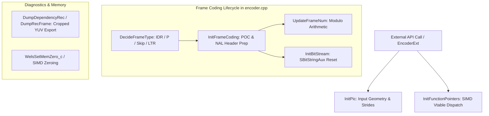
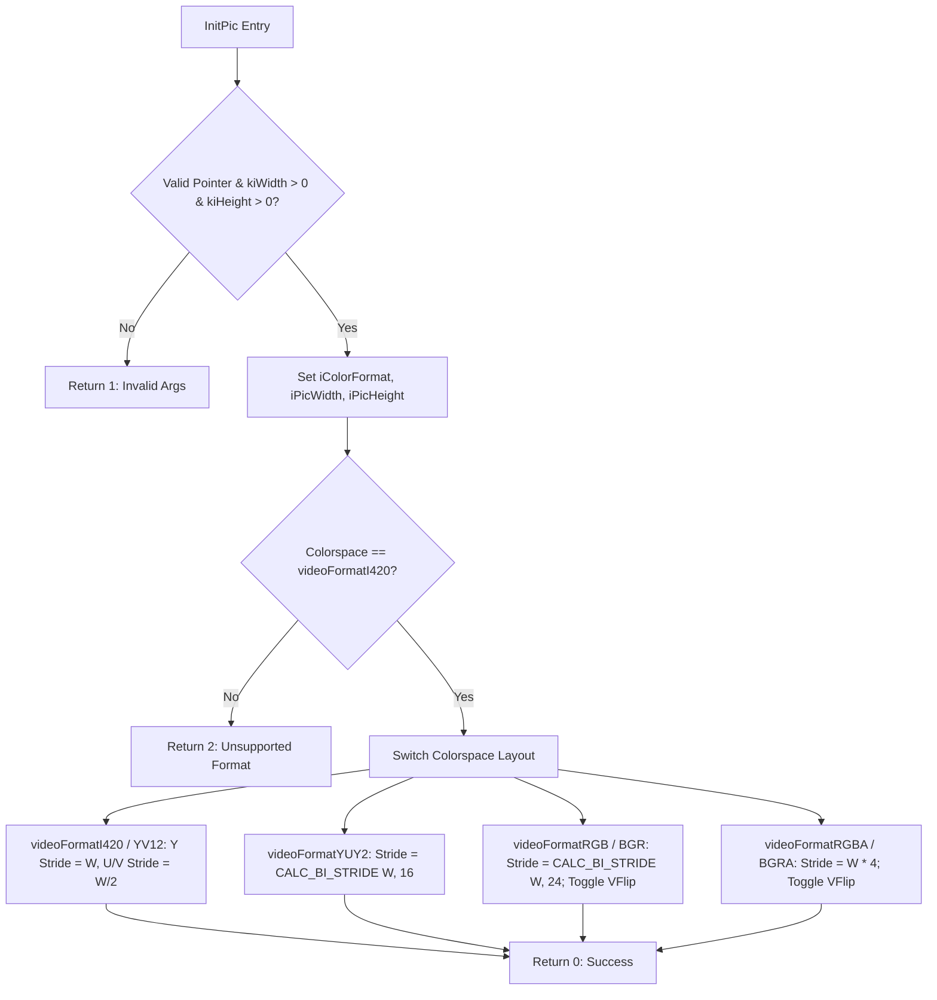
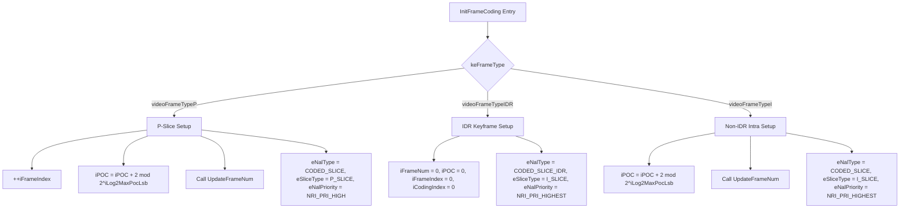
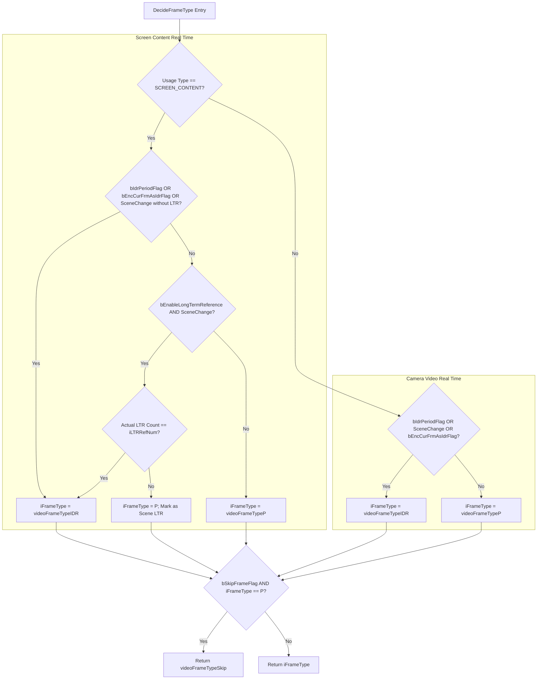
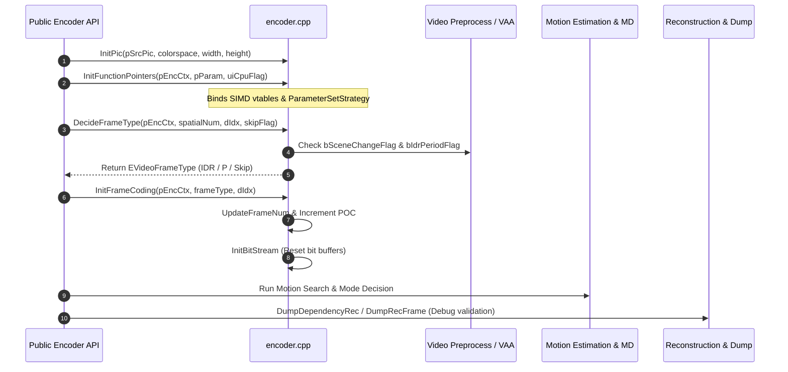

# OpenH264 Core Encoder: `encoder.cpp` Technical Documentation

This document provides an exhaustive, literate-programming-style breakdown of [encoder.cpp](openh264/codec/encoder/core/src/encoder.cpp), the foundational initialization and lifecycle management module of the Cisco OpenH264 video encoder core.

---

## Table of Contents
1. [High-Level Module & Architectural Purpose](#1-high-level-module--architectural-purpose)
2. [Data Structures, Types, Enums & Constants](#2-data-structures-types-enums--constants)
   - [2.1 Enums & Color Formats](#21-enums--color-formats)
   - [2.2 Core Structures & Classes](#22-core-structures--classes)
   - [2.3 Key Constants & Utility Macros](#23-key-constants--utility-macros)
3. [Deep-Dive Function & Method Reference](#3-deep-dive-function--method-reference)
   - [3.1 `InitPic`](#31-initpic)
   - [3.2 `WelsInitBGDFunc`](#32-welsinitbgdfunc)
   - [3.3 `InitFunctionPointers`](#33-initfunctionpointers)
   - [3.4 `UpdateFrameNum`](#34-updateframenum)
   - [3.5 `LoadBackFrameNum`](#35-loadbackframenum)
   - [3.6 `InitBitStream`](#36-initbitstream)
   - [3.7 `InitFrameCoding`](#37-initframecoding)
   - [3.8 `DecideFrameType`](#38-decideframetype)
   - [3.9 `DumpDependencyRec`](#39-dumpdependencyrec)
   - [3.10 `DumpRecFrame`](#310-dumprecframe)
   - [3.11 `WelsSetMemZero_c`](#311-welssetmemzero_c)
4. [Hardware Acceleration & SIMD Dispatch Map](#4-hardware-acceleration--simd-dispatch-map)
5. [Interaction & Control Flow Graph](#5-interaction--control-flow-graph)

---

## 1. High-Level Module & Architectural Purpose

In the OpenH264 encoding pipeline, [encoder.cpp](openh264/codec/encoder/core/src/encoder.cpp) serves as the **operational backbone and state initialization engine** for the core C++ layer. While higher-level facade classes (such as [CWelsH264SVCEncoder](openh264/codec/encoder/plus/src/welsEncoderExt.cpp)) handle external API contracts and memory allocations, [encoder.cpp](openh264/codec/encoder/core/src/encoder.cpp) directly manages:

1. **Source Picture Geometry & Color Space Conditioning**: Sanitizing input image parameters, configuring color plane strides, and handling 2D bitmap flip transforms for planar YUV (I420/YV12) and packed RGB/YUV formats.
2. **SIMD & Architectural Vtable Dispatch**: Dynamically probing host CPU capabilities (x86 MMX/SSE2/SSE4.1/AVX2, ARM NEON, AArch64 NEON) and binding SIMD-optimized assembly routines or portable C/C++ fallbacks to the encoder's master function pointer table ([SWelsFuncPtrList](openh264/codec/encoder/core/inc/wels_func_ptr_def.h)).
3. **Frame Coding Lifecycle & Sequence State Control**: Maintaining Picture Order Count (POC), frame index counters, and H.264 `frame_num` modulo arithmetic ($0 \le \text{frame\_num} < 2^{\text{uiLog2MaxFrameNum}}$) across spatial dependency layers.
4. **Adaptive Frame Type Decision Engine**: Evaluating multi-factor inputs—such as Video Analysis and Assessment (VAA) scene change metrics, IDR periodicity, rate control virtual buffer constraints, Long-Term Reference (LTR) availability, and screen content vs. camera video profiles—to classify each frame as `videoFrameTypeIDR`, `videoFrameTypeI`, `videoFrameTypeP`, or `videoFrameTypeSkip`.
5. **Bitstream Subsystem Resetting**: Re-initializing auxiliary bitstream serializers ([SBitStringAux](openh264/codec/decoder/core/inc/bit_stream.h)) and NAL unit index buffers before encoding passes.
6. **Reconstructed Picture Diagnostics & Verification**: Providing YUV 4:2:0 layer-by-layer raw frame dump routines with full H.264 frame cropping rectangle support.



---

## 2. Data Structures, Types, Enums & Constants

### 2.1 Enums & Color Formats

The module utilizes enumerated types defined in [codec_def.h](openh264/codec/api/wels/codec_def.h) and [codec_app_def.h](openh264/codec/api/wels/codec_app_def.h):

#### `EVideoFormatType`
Defines pixel color space configurations and memory layouts:
* `videoFormatRGBA` ($2$), `videoFormatBGR` ($5$), `videoFormatBGRA` ($6$), `videoFormatABGR` ($7$), `videoFormatARGB` ($8$): Packed RGB/BGR formats (24-bit or 32-bit).
* `videoFormatYUY2` ($20$), `videoFormatYVYU` ($21$), `videoFormatUYVY` ($22$): Packed YUV 4:2:2 formats (16 bits per pixel).
* `videoFormatI420` ($23$): Planar YUV 4:2:0 (Y plane followed by U and V planes sub-sampled $2 \times 2$).
* `videoFormatYV12` ($24$): Planar YUV 4:2:0 with swapped chroma plane order (Y, V, U).
* `videoFormatVFlip` ($0x80000000$): Most significant bit mask indicating vertical inversion (bottom-up scan).

#### `EVideoFrameType`
Defines the output frame coding category:
* `videoFrameTypeInvalid` ($0$): Uninitialized state or invalid parameters.
* `videoFrameTypeIDR` ($1$): Instantaneous Decoder Refresh keyframe (clears DPB references).
* `videoFrameTypeI` ($2$): Non-IDR Intra-coded frame.
* `videoFrameTypeP` ($3$): Inter-predicted frame referencing past frames.
* `videoFrameTypeSkip` ($4$): Skipped frame (no coded slice NAL output).
* `videoFrameTypeIPMixed` ($5$): Mixed slice type frame.

#### `EWelsNalRefIdc`
Defines NAL unit reference priority (`nal_ref_idc`):
* `NRI_PRI_LOWEST` ($0$): Non-reference picture (disposable frame).
* `NRI_PRI_LOW` ($1$): Low priority reference.
* `NRI_PRI_HIGH` ($2$): Standard P-frame reference.
* `NRI_PRI_HIGHEST` ($3$): IDR / Keyframe reference.

---

### 2.2 Core Structures & Classes

#### `SSourcePicture`
Defines the raw input frame passed into the encoder:
```cpp
typedef struct TagSourcePicture {
  int32_t       iColorFormat; // EVideoFormatType bitmask
  int32_t       iPicWidth;    // Picture width in pixels
  int32_t       iPicHeight;   // Picture height in pixels
  uint8_t*      pData[4];     // Pointers to image color planes
  int32_t       iStride[4];   // Line byte stride for each plane
} SSourcePicture;
```

#### `sWelsEncCtx`
The master encoder runtime state structure ([encoder_context.h](openh264/codec/encoder/core/inc/encoder_context.h)). Fields accessed or updated in [encoder.cpp](openh264/codec/encoder/core/src/encoder.cpp) include:
* `pSvcParam`: Pointer to configuration settings ([SWelsSvcCodingParam](openh264/codec/encoder/core/inc/param_svc.h)).
* `pFuncList`: Master function pointer table ([SWelsFuncPtrList](openh264/codec/encoder/core/inc/wels_func_ptr_def.h)).
* `pSps`: Active Sequence Parameter Set ([SWelsSPS](openh264/codec/encoder/core/inc/param_svc.h)) containing `uiLog2MaxFrameNum` and `iLog2MaxPocLsb`.
* `pVaa`: Video Assessment and Analysis engine ([SWelsVaa](openh264/codec/encoder/core/inc/wels_preprocess.h)), supplying `bSceneChangeFlag`, `bIdrPeriodFlag`, and `eSceneChangeIdc`.
* `eLastNalPriority[MAX_DEPENDENCY_LAYER]`: Tracks the `nal_ref_idc` of the preceding frame to determine if `iFrameNum` should increment.
* `eNalType`, `eSliceType`, `eNalPriority`: Current frame header attributes.
* `bCurFrameMarkedAsSceneLtr`: Flag indicating if the current P-frame should be marked as a Long-Term Reference for scene transitions.
* `pOut`: Output bitstream buffer wrapper holding `sBsWrite`, `pBsBuffer`, `iNalIndex`, and `iLayerBsIndex`.

#### `SSpatialLayerInternal`
Internal state structure ([param_svc.h](openh264/codec/encoder/core/inc/param_svc.h)) tracked per dependency layer:
* `iFrameNum`: H.264 syntax element `frame_num`.
* `iPOC`: Picture Order Count.
* `iFrameIndex`: Cumulative frame counter.
* `iCodingIndex`: GOP-relative coding order index.
* `bEncCurFrmAsIdrFlag`: Explicit trigger flag requesting an IDR frame.

---

### 2.3 Key Constants & Utility Macros

* **`CALC_BI_STRIDE(width, bitcount)`**: Calculates 4-byte (32-bit DWORD) aligned row stride for bitmap image buffers:
  $$\text{Stride} = \left( \left( \text{width} \times \text{bitcount} + 31 \right) \ \& \ \sim 31 \right) \gg 3$$
* **`VGOP_SIZE`**: Virtual Group of Pictures size ($8$).
* **`MAX_DEPENDENCY_LAYER`**: Maximum supported spatial layers ($4$).
* **`I420_PLANES`**: Number of color planes in YUV 4:2:0 ($3$: Y, U, V).
* **`BASE_DEPENDENCY_ID`**: ID of the base spatial dependency layer ($0$).

---

## 3. Deep-Dive Function & Method Reference

### 3.1 `InitPic`

```cpp
int32_t InitPic (const void* kpSrc, const int32_t kiColorspace, const int32_t kiWidth, const int32_t kiHeight);
```

[InitPic](openh264/codec/encoder/core/src/encoder.cpp#L72-L139) configures the plane pointers, dimensional attributes, line strides, and orientation flags of an [SSourcePicture](openh264/codec/api/wels/codec_app_def.h) instance.



#### Parameters
* `kpSrc`: Pointer to input `SSourcePicture` struct.
* `kiColorspace`: Color format identifier (`EVideoFormatType`), optionally combined with `videoFormatVFlip`.
* `kiWidth`: Picture width in pixels.
* `kiHeight`: Picture height in pixels.

#### Return Value
* `0`: Success.
* `1`: Parameter validation failure (`kpSrc == NULL`, `kiWidth == 0`, or `kiHeight == 0`).
* `2`: Unsupported color format.

#### Mathematical Stride Formulation
1. **Planar YUV 4:2:0 (`videoFormatI420`, `videoFormatYV12`)**:
   $$\text{Stride}_Y = \text{kiWidth}, \quad \text{Stride}_U = \text{Stride}_V = \lfloor \text{kiWidth} / 2 \rfloor, \quad \text{Stride}_3 = 0$$
2. **Packed YUV 4:2:2 (`videoFormatYUY2`, `videoFormatUYVY`)**:
   $$\text{Stride}_0 = \left( (16 \cdot \text{kiWidth} + 31) \ \& \ \sim 31 \right) \gg 3$$
3. **Packed RGB 24-bit (`videoFormatRGB`, `videoFormatBGR`)**:
   $$\text{Stride}_0 = \left( (24 \cdot \text{kiWidth} + 31) \ \& \ \sim 31 \right) \gg 3$$
4. **Packed RGBA 32-bit (`videoFormatRGBA`, `videoFormatBGRA`)**:
   $$\text{Stride}_0 = \text{kiWidth} \ll 2 = 4 \cdot \text{kiWidth}$$

---

### 3.2 `WelsInitBGDFunc`

```cpp
void WelsInitBGDFunc (SWelsFuncPtrList* pFuncList, const bool kbEnableBackgroundDetection);
```

[WelsInitBGDFunc](openh264/codec/encoder/core/src/encoder.cpp#L142-L150) wires the background detection function pointers in `pFuncList`:

* When `kbEnableBackgroundDetection` is `true`:
  * `pfInterMdBackgroundDecision = WelsMdInterJudgeBGDPskip`: Evaluates whether stationary macroblocks qualify as P-skip candidates based on background SAD and variance thresholds.
  * `pfMdBackgroundInfoUpdate = WelsMdUpdateBGDInfo`: Accumulates background statistics across consecutive frames.
* When `false`:
  * `pfInterMdBackgroundDecision = WelsMdInterJudgeBGDPskipFalse`: Dummy stub that returns `false`.
  * `pfMdBackgroundInfoUpdate = WelsMdUpdateBGDInfoNULL`: No-op function stub.

---

### 3.3 `InitFunctionPointers`

```cpp
int32_t InitFunctionPointers (sWelsEncCtx* pEncCtx, SWelsSvcCodingParam* pParam, uint32_t uiCpuFlag);
```

[InitFunctionPointers](openh264/codec/encoder/core/src/encoder.cpp#L157-L232) is the master initialization hub for all encoder compute kernels. It links platform-specific SIMD assembly or C/C++ fallback routines into `pEncCtx->pFuncList`.

#### Detailed Subsystem Initialization Steps:
1. **Memory Clear (`pfSetMemZero*`)**:
   * Defaults to [WelsSetMemZero_c](openh264/codec/encoder/core/src/encoder.cpp#L550-L552).
   * Under `X86_ASM`:
     * If `uiCpuFlag & WELS_CPU_MMXEXT`: binds `WelsSetMemZeroSize8_mmx` and `WelsSetMemZeroSize64_mmx`.
     * If `uiCpuFlag & WELS_CPU_SSE2`: binds `WelsSetMemZeroAligned64_sse2`.
   * Under ARM (`HAVE_NEON` / `HAVE_NEON_AARCH64`):
     * If `uiCpuFlag & WELS_CPU_NEON`: binds `WelsSetMemZero_neon` or `WelsSetMemZero_AArch64_neon`.
2. **Picture Expansion**: Calls `InitExpandPictureFunc(&(pFuncList->sExpandPicFunc), uiCpuFlag)` for padding reconstructed reference frame boundaries.
3. **Spatial Intra Prediction**: Calls `WelsInitIntraPredFuncs(pFuncList, uiCpuFlag)` for Intra 4x4, Intra 16x16, and Chroma 8x8 modes.
4. **Motion Estimation**: Calls `WelsInitMeFunc(pFuncList, uiCpuFlag, bScreenContent)` to initialize diamond search, cross search, and sub-pixel refinement.
5. **Sample Distortion**: Calls `WelsInitSampleSadFunc(pFuncList, uiCpuFlag)` for SAD, SATD, and 4SAD kernels.
6. **Screen Content & Background**: Calls `WelsInitBGDFunc` and `WelsInitSCDPskipFunc`.
7. **Motion Compensation**: Calls `InitMcFunc(&pFuncList->sMcFuncs, uiCpuFlag)` for half-pel Wiener interpolation and quarter-pel averaging.
8. **Transform & Quantization**: Calls `WelsInitEncodingFuncs` (forward DCT) and `WelsInitReconstructionFuncs` (IDCT).
9. **In-Loop Deblocking**: Calls `DeblockingInit(&pFuncList->pfDeblocking, uiCpuFlag)`.
10. **Parameter Set Strategy**: Allocates parameter set strategy via `IWelsParametersetStrategy::CreateParametersetStrategy`.

---

### 3.4 `UpdateFrameNum`

```cpp
void UpdateFrameNum (sWelsEncCtx* pEncCtx, const int32_t kiDidx);
```

[UpdateFrameNum](openh264/codec/encoder/core/src/encoder.cpp#L234-L250) increments the H.264 slice header syntax element `frame_num` for spatial layer `kiDidx` when the preceding encoded frame had reference priority ($nal\_ref\_idc \neq 0$).

#### Mathematical Specification
$$\text{iFrameNum}_{t+1} = \begin{cases} (\text{iFrameNum}_t + 1) \pmod{2^{\text{uiLog2MaxFrameNum}}}, & \text{if } eLastNalPriority[kiDidx] \neq \text{NRI\_PRI\_LOWEST} \\ \text{iFrameNum}_t, & \text{otherwise} \end{cases}$$

After evaluation, `pEncCtx->eLastNalPriority[kiDidx]` is reset to `NRI_PRI_LOWEST`.

---

### 3.5 `LoadBackFrameNum`

```cpp
void LoadBackFrameNum (sWelsEncCtx* pEncCtx, const int32_t kiDidx);
```

[LoadBackFrameNum](openh264/codec/encoder/core/src/encoder.cpp#L253-L268) rolls back the `iFrameNum` counter if a reference frame encoding attempt fails, is aborted, or is dropped:

$$\text{iFrameNum}_{t-1} = \begin{cases} (\text{iFrameNum}_t - 1 + 2^{\text{uiLog2MaxFrameNum}}) \pmod{2^{\text{uiLog2MaxFrameNum}}}, & \text{if } eLastNalPriority[kiDidx] \neq \text{NRI\_PRI\_LOWEST} \\ \text{iFrameNum}_t, & \text{otherwise} \end{cases}$$

---

### 3.6 `InitBitStream`

```cpp
void InitBitStream (sWelsEncCtx* pEncCtx);
```

[InitBitStream](openh264/codec/encoder/core/src/encoder.cpp#L270-L277) zeroes the bitstream write offsets and resets the auxiliary bitstream writer:
* `pEncCtx->iPosBsBuffer = 0;`
* `pEncCtx->pOut->iNalIndex = 0;`
* `pEncCtx->pOut->iLayerBsIndex = 0;`
* `InitBits(&pEncCtx->pOut->sBsWrite, pEncCtx->pOut->pBsBuffer, pEncCtx->pOut->uiSize);`

---

### 3.7 `InitFrameCoding`

```cpp
void InitFrameCoding (sWelsEncCtx* pEncCtx, const EVideoFrameType keFrameType, const int32_t kiDidx);
```

[InitFrameCoding](openh264/codec/encoder/core/src/encoder.cpp#L281-L333) establishes the NAL unit headers, slice types, and Picture Order Count (POC) for the frame to be encoded.



#### State Transition Table

| Frame Type | `iFrameNum` | `iPOC` Progression | `eNalType` | `eSliceType` | `eNalPriority` |
| :--- | :--- | :--- | :--- | :--- | :--- |
| **`videoFrameTypeP`** | Incremented via `UpdateFrameNum` | $\text{iPOC} = (\text{iPOC} + 2) \pmod{2^{\text{iLog2MaxPocLsb}}}$ | `NAL_UNIT_CODED_SLICE` | `P_SLICE` | `NRI_PRI_HIGH` |
| **`videoFrameTypeIDR`** | Reset to $0$ | Reset to $0$ | `NAL_UNIT_CODED_SLICE_IDR` | `I_SLICE` | `NRI_PRI_HIGHEST` |
| **`videoFrameTypeI`** | Incremented via `UpdateFrameNum` | $\text{iPOC} = (\text{iPOC} + 2) \pmod{2^{\text{iLog2MaxPocLsb}}}$ | `NAL_UNIT_CODED_SLICE` | `I_SLICE` | `NRI_PRI_HIGHEST` |

---

### 3.8 `DecideFrameType`

```cpp
EVideoFrameType DecideFrameType (sWelsEncCtx* pEncCtx, const int8_t kiSpatialNum, const int32_t kiDidx, bool bSkipFrameFlag);
```

[DecideFrameType](openh264/codec/encoder/core/src/encoder.cpp#L335-L407) determines whether the upcoming frame should be coded as an IDR keyframe, P-frame, Long-Term Reference (LTR) scene anchor, or skipped frame.

#### Decision Logic Flowchart



---

### 3.9 `DumpDependencyRec`

```cpp
extern "C" void DumpDependencyRec (SPicture* pCurPicture, const char* kpFileName, const int8_t kiDid, bool bAppend,
                                   SDqLayer* pDqLayer, bool bSimulCastAVC);
```

[DumpDependencyRec](openh264/codec/encoder/core/src/encoder.cpp#L413-L478) exports reconstructed YUV 4:2:0 frames for a spatial layer (`kiDid`) to disk, accounting for frame cropping parameters.

#### Cropping Arithmetic
When `pSpsTmp->bFrameCroppingFlag` is set:
$$\text{LumaWidth} = \text{iWidthInPixel} - 2 \cdot (\text{iCropLeft} + \text{iCropRight})$$
$$\text{LumaHeight} = \text{iHeightInPixel} - 2 \cdot (\text{iCropTop} + \text{iCropBottom})$$
$$\text{LumaOffset} = \text{pData}[0] + \text{iStride}_Y \cdot (2 \cdot \text{iCropTop}) + (2 \cdot \text{iCropLeft})$$
$$\text{ChromaWidth} = \lfloor \text{LumaWidth} / 2 \rfloor, \quad \text{ChromaHeight} = \lfloor \text{LumaHeight} / 2 \rfloor$$
$$\text{ChromaOffset}_i = \text{pData}[i] + \text{iStride}_{UV} \cdot \text{iCropTop} + \text{iCropLeft} \quad (i \in \{1, 2\})$$

---

### 3.10 `DumpRecFrame`

```cpp
void DumpRecFrame (SPicture* pCurPicture, const char* kpFileName, const int8_t kiDid, bool bAppend, SDqLayer* pDqLayer);
```

[DumpRecFrame](openh264/codec/encoder/core/src/encoder.cpp#L484-L545) provides reconstructed frame dumping defaulting to `"rec.yuv"` when `kpFileName` is empty.

---

### 3.11 `WelsSetMemZero_c`

```cpp
void WelsSetMemZero_c (void* pDst, int32_t iSize);
```

[WelsSetMemZero_c](openh264/codec/encoder/core/src/encoder.cpp#L550-L552) is the portable C/C++ fallback for memory clearing:
```cpp
void WelsSetMemZero_c (void* pDst, int32_t iSize) {
  memset (pDst, 0, iSize);
}
```

---

## 4. Hardware Acceleration & SIMD Dispatch Map

The table below summarizes the CPU feature dispatch managed in [InitFunctionPointers](openh264/codec/encoder/core/src/encoder.cpp#L157-L232):

| Function Pointer | Portable C/C++ Fallback | x86 MMX / SSE2 Assembly | ARM NEON / AArch64 Assembly |
| :--- | :--- | :--- | :--- |
| `pfSetMemZeroSize8` | `WelsSetMemZero_c` | `WelsSetMemZeroSize8_mmx` | `WelsSetMemZero_neon` / `WelsSetMemZero_AArch64_neon` |
| `pfSetMemZeroSize64Aligned16` | `WelsSetMemZero_c` | `WelsSetMemZeroAligned64_sse2` | `WelsSetMemZero_neon` / `WelsSetMemZero_AArch64_neon` |
| `pfSetMemZeroSize64` | `WelsSetMemZero_c` | `WelsSetMemZeroSize64_mmx` | `WelsSetMemZero_neon` / `WelsSetMemZero_AArch64_neon` |
| `sExpandPicFunc` | `ExpandReferencingBorder_c` | SSE2 Assembly | NEON Assembly |
| `pfIntra4x4Combined3Satd` | `WelsIntra4x4Combined3Satd_c` | SSE2 / SSSE3 / AVX2 | NEON Assembly |
| `sMcFuncs` | `McHorizVer20_c`, `McChroma_c` | MMX / SSE2 Assembly | NEON Assembly |
| `pfDeblocking` | `DeblockingFilterFrameAvcbase_c` | SSE2 / SSSE3 Assembly | NEON Assembly |

---

## 5. Interaction & Control Flow Graph


