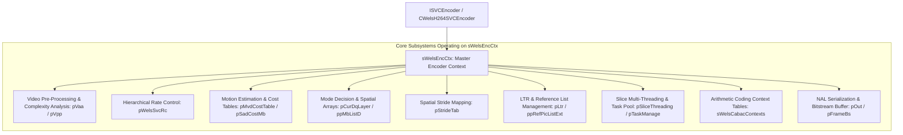
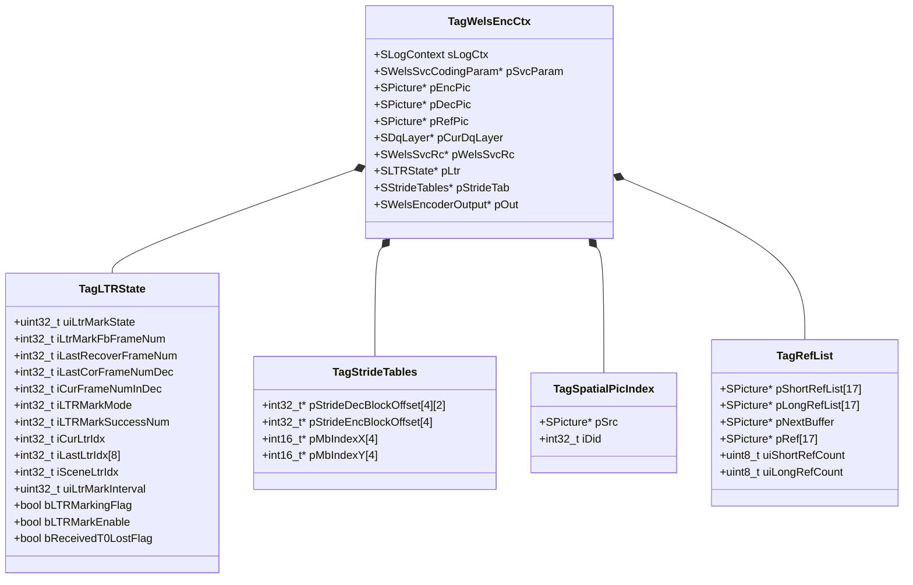
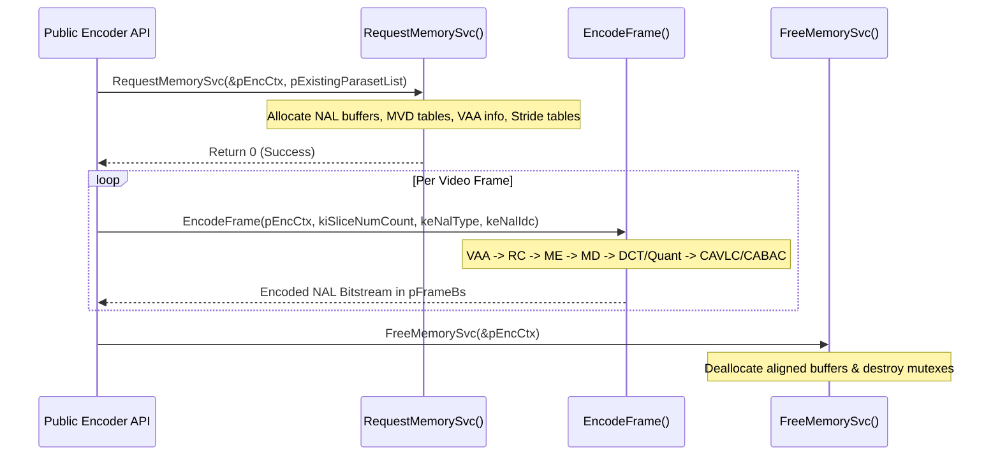
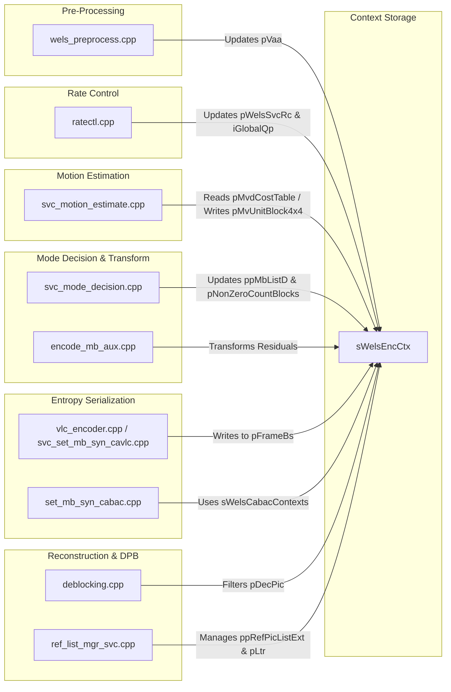

# OpenH264 Video Encoder Core Context: `encoder_context.h`

This document provides a comprehensive, literate-programming-style breakdown of [encoder_context.h](openh264/codec/encoder/core/inc/encoder_context.h). The header declares the central runtime state machine of the Cisco OpenH264 video encoder, encapsulating macroblock tracking buffers, spatial dependency layer hierarchies, rate control state, long-term reference (LTR) state machines, multithreaded slice execution contexts, video pre-processing/analysis (VAA) buffers, and entropy coding state tables.

---

## 1. High-Level Module & Architectural Role

In the OpenH264 video encoder pipeline, [sWelsEncCtx](openh264/codec/encoder/core/inc/encoder_context.h#L116-L238) (aliased from `TagWelsEncCtx`) acts as the master runtime context. It serves as the single unified repository passed across every encoding stage:



### Architectural Principles
1. **Unified Multi-Layer Runtime**: Even when encoding single-layer AVC (Advanced Video Coding, Constrained Baseline Profile), OpenH264 executes through a scalable architecture where spatial dependency layers ($D$) and temporal layers ($T$) are represented via structured arrays indexed by `uiDependencyId` and `uiTemporalId`.
2. **Cache-Aligned Memory Architecture**: Critical pixel buffers, motion vector difference tables, and coefficient scratchpads are allocated via [CMemoryAlign](openh264/codec/common/inc/memory_align.h) to ensure 16-byte (SSE2/NEON) and 32-byte (AVX2) alignment.
3. **Decoupled Concurrency**: The context coordinates thread pools via [IWelsTaskManage](openh264/codec/encoder/core/inc/wels_task_management.h) and slice multithreading via [SSliceThreading](openh264/codec/encoder/core/inc/slice_multi_threading.h), maintaining per-thread dynamic bitstream outputs (`pDynamicBsBuffer`) to eliminate synchronization contention.

---

## 2. Data Structure Deep-Dive

[encoder_context.h](openh264/codec/encoder/core/inc/encoder_context.h) defines four primary data structures and the master context structure within namespace `WelsEnc`.



---

### 2.1 Forward Declarations & Strategy Interfaces

```cpp
namespace WelsEnc {
class IWelsTaskManage;
class IWelsReferenceStrategy;
```

* [IWelsTaskManage](openh264/codec/encoder/core/inc/wels_task_management.h): Abstract interface managing multithreaded slice encoding jobs, thread synchronization, and CPU core load-balancing.
* [IWelsReferenceStrategy](openh264/codec/encoder/core/inc/ref_list_mgr_svc.h): Strategy pattern interface defining reference picture list construction, long-term reference selection, and reference marking rules depending on usage type (`CAMERA_VIDEO_REAL_TIME` vs `SCREEN_CONTENT_REAL_TIME`).

---

### 2.2 Reference Picture List: `SRefList` (`TagRefList`)

[SRefList](openh264/codec/encoder/core/inc/encoder_context.h#L71-L78) encapsulates the active reference picture lists for a specific spatial quality layer in SVC/AVC encoding.

```cpp
typedef struct TagRefList {
  SPicture*     pShortRefList[1 + MAX_SHORT_REF_COUNT]; // reference list 0 - int16_t
  SPicture*     pLongRefList[1 + MAX_REF_PIC_COUNT];    // reference list 1 - int32_t
  SPicture*     pNextBuffer;
  SPicture*     pRef[1 + MAX_REF_PIC_COUNT];            // plus 1 for swap intend
  uint8_t       uiShortRefCount;
  uint8_t       uiLongRefCount;                         // dependend on pRef pic module
} SRefList;
```

| Member Field | Type | Array Dimension | Purpose & Lifecycle |
| :--- | :--- | :--- | :--- |
| `pShortRefList` | [SPicture](openh264/codec/encoder/core/inc/picture.h)* | `1 + MAX_SHORT_REF_COUNT` (17) | List 0 short-term reference pictures ordered by descending Picture Order Count (POC) / Frame Number. |
| `pLongRefList` | [SPicture](openh264/codec/encoder/core/inc/picture.h)* | `1 + MAX_REF_PIC_COUNT` (17) | List 1 long-term reference pictures indexed by `LongTermFrameIdx`. |
| `pNextBuffer` | [SPicture](openh264/codec/encoder/core/inc/picture.h)* | Scalar | Pointer to next uncompressed/scratch picture buffer allocated in the pool. |
| `pRef` | [SPicture](openh264/codec/encoder/core/inc/picture.h)* | `1 + MAX_REF_PIC_COUNT` (17) | Working reference picture array with $+1$ sentinel element for buffer pointer rotation during reconstruction. |
| `uiShortRefCount` | `uint8_t` | 8-bit unsigned | Count of active short-term reference pictures ($\le 16$). |
| `uiLongRefCount` | `uint8_t` | 8-bit unsigned | Count of active long-term reference pictures ($\le 16$). |

---

### 2.3 Long-Term Reference State Machine: `SLTRState` (`TagLTRState`)

[SLTRState](openh264/codec/encoder/core/inc/encoder_context.h#L80-L102) manages Long-Term Reference (LTR) marking, feedback processing from decoders over RTCP/feedback channels, and error-recovery reference selection.

```cpp
typedef struct TagLTRState {
  // LTR mark feedback
  uint32_t      uiLtrMarkState;
  int32_t       iLtrMarkFbFrameNum;

  // LTR used as recovery reference
  int32_t       iLastRecoverFrameNum;
  int32_t       iLastCorFrameNumDec;
  int32_t       iCurFrameNumInDec;

  // LTR mark
  int32_t       iLTRMarkMode;
  int32_t       iLTRMarkSuccessNum;
  int32_t       iCurLtrIdx;
  int32_t       iLastLtrIdx[MAX_TEMPORAL_LAYER_NUM];
  int32_t       iSceneLtrIdx;

  uint32_t      uiLtrMarkInterval;

  bool          bLTRMarkingFlag;
  bool          bLTRMarkEnable;
  bool          bReceivedT0LostFlag;
} SLTRState;
```

#### Detailed Field Specifications

1. **LTR Feedback Tracking**:
   * `uiLtrMarkState`: State indicator specifying whether an LTR marking acknowledgment feedback is currently unresolved or pending from the receiver.
   * `iLtrMarkFbFrameNum`: The frame number (`iFrameNum`) of the unresolved LTR mark confirmed by the receiver feedback.
2. **Recovery Reference Control**:
   * `iLastRecoverFrameNum`: Preserves the frame number of the most recent recovery frame (either LTR-based recovery or full IDR refresh).
   * `iLastCorFrameNumDec`: Records the last known correct frame number decoded without errors at the receiver. Used to decide whether a marked LTR is valid for referencing.
   * `iCurFrameNumInDec`: Tracks the current estimated frame number position at the decoder side.
3. **Marking Policies & Modes**:
   * `iLTRMarkMode`: Specifies the marking strategy (`DIRECT_MARK` where the frame is immediately marked upon encoding vs `DELAY_MARK` where marking is postponed until acknowledgment).
   * `iLTRMarkSuccessNum`: Monotonically increasing count of successfully acknowledged LTR frames, used for dynamic mode switching.
   * `iCurLtrIdx`: Active long-term reference slot index currently targeted for marking.
   * `iLastLtrIdx[MAX_TEMPORAL_LAYER_NUM]`: Array of last marked LTR indices per temporal layer level ($T_0 \dots T_7$).
   * `iSceneLtrIdx`: Dedicated LTR reference index reserved for static background/screen content scenes.
   * `uiLtrMarkInterval`: Frame counter measuring the interval elapsed since the last LTR frame marking.
   * `bLTRMarkingFlag`: Boolean flag signaling that the current frame being encoded must emit LTR marking MMCO commands in its slice header.
   * `bLTRMarkEnable`: Boolean gate confirming that LTR marking is enabled and the elapsed interval $\ge$ marking interval constraint.
   * `bReceivedT0LostFlag`: Flag raised when the receiver signals that a Temporal Layer 0 ($T_0$) reference frame was lost, forcing the encoder to switch reference lists to a verified LTR frame.

---

### 2.4 Spatial Picture Mapping: `SSpatialPicIndex` (`TagSpatialPicIndex`)

[SSpatialPicIndex](openh264/codec/encoder/core/inc/encoder_context.h#L104-L107) pairs a converted planar YUV 4:2:0 source frame with its spatial dependency layer index:

```cpp
typedef struct TagSpatialPicIndex {
  SPicture*     pSrc;   // I420 based and after color space converted
  int32_t       iDid;   // dependency id
} SSpatialPicIndex;
```

* `pSrc`: Pointer to the [SPicture](openh264/codec/encoder/core/inc/picture.h) holding pre-processed YUV 4:2:0 pixel planes.
* `iDid`: Spatial dependency layer identifier ($0 \le iDid < \text{MAX\_DEPENDENCY\_LAYER}$).

---

### 2.5 Stride & Coordinate Lookup Tables: `SStrideTables` (`TagStrideTables`)

[SStrideTables](openh264/codec/encoder/core/inc/encoder_context.h#L109-L114) precalculates sub-block memory offsets and 2D macroblock coordinates across spatial layers to eliminate multiplications during mode decision and motion compensation inner loops.

```cpp
typedef struct TagStrideTables {
  int32_t*      pStrideDecBlockOffset[MAX_DEPENDENCY_LAYER][2]; // [iDid][tid==0][24 x 4]
  int32_t*      pStrideEncBlockOffset[MAX_DEPENDENCY_LAYER];    // [iDid][24 x 4]
  int16_t*      pMbIndexX[MAX_DEPENDENCY_LAYER];                // [iDid][iMbX]
  int16_t*      pMbIndexY[MAX_DEPENDENCY_LAYER];                // [iDid][iMbY]
} SStrideTables;
```

* `pStrideDecBlockOffset[iDid][is_t0][24 * 4]`: Byte offsets for 24 sub-blocks ($16 \text{ Luma } 4\times 4 + 4 \text{ Cb } 4\times 4 + 4 \text{ Cr } 4\times 4$) inside decoded reconstruction frames.
* `pStrideEncBlockOffset[iDid][24 * 4]`: Byte offsets for 24 sub-blocks inside encoding source frames.
* `pMbIndexX[iDid][iMbX]`: Precalculated horizontal pixel/macroblock index lookup table for layer `iDid`.
* `pMbIndexY[iDid][iMbY]`: Precalculated vertical pixel/macroblock index lookup table for layer `iDid`.

---

### 2.6 The Master Encoder Context: `sWelsEncCtx` (`TagWelsEncCtx`)

[sWelsEncCtx](openh264/codec/encoder/core/inc/encoder_context.h#L116-L238) contains all state variables, memory buffers, and subsystem instances required by the video encoder.

```cpp
typedef struct TagWelsEncCtx {
  SLogContext sLogCtx;
  SWelsSvcCodingParam* pSvcParam;
  int32_t*          pSadCostMb;
  int32_t           iMvRange;
  uint16_t*         pMvdCostTable;
  int32_t           iMvdCostTableSize;
  int32_t           iMvdCostTableStride;
  SMVUnitXY*        pMvUnitBlock4x4;
  int8_t*           pRefIndexBlock4x4;
  int8_t*           pNonZeroCountBlocks;
  int8_t*           pIntra4x4PredModeBlocks;
  SMB**             ppMbListD;
  SStrideTables*    pStrideTab;
  SWelsFuncPtrList* pFuncList;
  SSliceThreading*  pSliceThreading;
  IWelsTaskManage*  pTaskManage;
  IWelsReferenceStrategy* pReferenceStrategy;
  SPicture*         pEncPic;
  SPicture*         pDecPic;
  SPicture*         pRefPic;
  SDqLayer*         pCurDqLayer;
  SDqLayer**        ppDqLayerList;
  SRefList**        ppRefPicListExt;
  SPicture*         pRefList0[16];
  SLTRState*        pLtr;
  bool              bCurFrameMarkedAsSceneLtr;
  EWelsSliceType    eSliceType;
  EWelsNalUnitType  eNalType;
  EWelsNalRefIdc    eNalPriority;
  EWelsNalRefIdc    eLastNalPriority[MAX_DEPENDENCY_LAYER];
  uint8_t           iNumRef0;
  uint8_t           uiDependencyId;
  uint8_t           uiTemporalId;
  bool              bNeedPrefixNalFlag;
  SWelsSvcRc*       pWelsSvcRc;
  bool              bCheckWindowStatusRefreshFlag;
  int64_t           iCheckWindowStartTs;
  int64_t           iCheckWindowCurrentTs;
  int32_t           iCheckWindowInterval;
  int32_t           iCheckWindowIntervalShift;
  bool              bCheckWindowShiftResetFlag;
  int32_t           iGlobalQp;
  SVAAFrameInfo*    pVaa;
  CWelsPreProcess*  pVpp;
  SWelsSPS*         pSpsArray;
  SWelsSPS*         pSps;
  SWelsPPS*         pPPSArray;
  SWelsPPS*         pPps;
  SSubsetSps*       pSubsetArray;
  SSubsetSps*       pSubsetSps;
  int32_t           iSpsNum;
  int32_t           iSubsetSpsNum;
  int32_t           iPpsNum;
  SWelsEncoderOutput* pOut;
  uint8_t*          pFrameBs;
  int32_t           iFrameBsSize;
  int32_t           iPosBsBuffer;
  SSpatialPicIndex  sSpatialIndexMap[MAX_DEPENDENCY_LAYER];
  int32_t           iSliceBufferSize[MAX_DEPENDENCY_LAYER];
  bool              bRefOfCurTidIsLtr[MAX_DEPENDENCY_LAYER][MAX_TEMPORAL_LEVEL];
  int32_t           iMaxSliceCount;
  int16_t           iActiveThreadsNum;
  SDqIdc*           pDqIdcMap;
  SParaSetOffset    sPSOVector;
  SParaSetOffset*   pPSOVector;
  CMemoryAlign*     pMemAlign;
#if defined(STAT_OUTPUT)
  SStatData         sStatData[MAX_DEPENDENCY_LAYER][MAX_QUALITY_LEVEL];
  SStatSliceInfo    sPerInfo;
#endif
  int64_t            uiStartTimestamp;
  SEncoderStatistics sEncoderStatistics[MAX_DEPENDENCY_LAYER];
  int32_t            iStatisticsLogInterval;
  int64_t            iLastStatisticsLogTs;
  int32_t            iEncoderError;
  WELS_MUTEX         mutexEncoderError;
  bool               bDeliveryFlag;
  SStateCtx          sWelsCabacContexts[4][WELS_QP_MAX + 1][WELS_CONTEXT_COUNT];
#ifdef ENABLE_FRAME_DUMP
  bool               bDependencyRecFlag[MAX_DEPENDENCY_LAYER];
#endif
  int64_t            uiLastTimestamp;
  uint8_t*           pDynamicBsBuffer[MAX_THREADS_NUM];
} sWelsEncCtx;
```

#### Member Breakdown by Subsystem

| Subsystem Group | Field Name | Type | Description |
| :--- | :--- | :--- | :--- |
| **Logging & Config** | `sLogCtx` | `SLogContext` | Logging callback, trace level filter, and context handle. |
| | `pSvcParam` | [SWelsSvcCodingParam](openh264/codec/encoder/core/inc/param_svc.h)* | Encoder configuration parameters (bitrates, frame rates, slice modes, scalability settings). |
| **Motion Estimation** | `pSadCostMb` | `int32_t*` | Macroblock SAD cost array allocated for all MBs ($N_{\text{MB}}$). |
| | `iMvRange` | `int32_t` | Maximum motion vector search range in integer pel units. |
| | `pMvdCostTable` | `uint16_t*` | Motion Vector Difference (MVD) bit-cost lookup table indexed by $[QP][MVD]$. |
| | `iMvdCostTableSize` | `int32_t` | Size in elements of the MVD cost table. |
| | `iMvdCostTableStride` | `int32_t` | Stride offset in bytes between QP rows in `pMvdCostTable`. |
| **MB Data Buffers** | `pMvUnitBlock4x4` | `SMVUnitXY*` | 4x4 block motion vector array ($2 \times 16$ blocks per MB). |
| | `pRefIndexBlock4x4` | `int8_t*` | 4x4 block reference picture index array ($2 \times 4$ blocks per MB). |
| | `pNonZeroCountBlocks`| `int8_t*` | Non-zero transform coefficient count per 4x4 block ($24$ blocks per MB). |
| | `pIntra4x4PredModeBlocks` | `int8_t*` | Intra 4x4 prediction mode array per block. |
| | `ppMbListD` | `SMB**` | Array of macroblock structure lists per spatial layer `[MAX_DEPENDENCY_LAYER]`. |
| | `pStrideTab` | `SStrideTables*` | Precomputed stride and 2D coordinate lookup tables. |
| | `pFuncList` | [SWelsFuncPtrList](openh264/codec/encoder/core/inc/wels_func_ptr_def.h)* | Function pointer table for SIMD (SSE2/AVX2/NEON) and C fallback kernels. |
| **Concurrency** | `pSliceThreading` | [SSliceThreading](openh264/codec/encoder/core/inc/slice_multi_threading.h)* | Multithreaded slice distribution state and mutexes. |
| | `pTaskManage` | [IWelsTaskManage](openh264/codec/encoder/core/inc/wels_task_management.h)* | Thread pool task scheduler interface. |
| | `pReferenceStrategy`| [IWelsReferenceStrategy](openh264/codec/encoder/core/inc/ref_list_mgr_svc.h)* | Reference picture management strategy instance. |
| **Picture Buffers** | `pEncPic` | [SPicture](openh264/codec/encoder/core/inc/picture.h)* | Source input frame currently being encoded. |
| | `pDecPic` | [SPicture](openh264/codec/encoder/core/inc/picture.h)* | Local reconstruction frame currently being decoded/stored in DPB. |
| | `pRefPic` | [SPicture](openh264/codec/encoder/core/inc/picture.h)* | Active reference picture used for inter-prediction. |
| | `pCurDqLayer` | [SDqLayer](openh264/codec/encoder/core/inc/dq_map.h)* | Current spatial DQ layer context being processed. |
| | `ppDqLayerList` | `SDqLayer**` | Array of all spatial DQ layer contexts. |
| | `ppRefPicListExt` | `SRefList**` | Reference picture list array per spatial layer. |
| | `pLtr` | `SLTRState*` | Array of LTR state machines per dependency layer. |
| **Slice & NAL State** | `eSliceType` | `EWelsSliceType` | Active slice coding type (`P_SLICE`, `I_SLICE`, `B_SLICE`). |
| | `eNalType` | `EWelsNalUnitType` | Active NAL unit type (`NAL_UNIT_CODED_SLICE`, `NAL_UNIT_CODED_SLICE_IDR`, etc.). |
| | `eNalPriority` | `EWelsNalRefIdc` | Active NAL reference priority (`NRI_PRI_HIGHEST` to `NRI_PRI_LOWEST`). |
| | `uiDependencyId` | `uint8_t` | Active spatial layer dependency ID ($D$). |
| | `uiTemporalId` | `uint8_t` | Active temporal layer ID ($T$). |
| **Rate Control** | `pWelsSvcRc` | [SWelsSvcRc](openh264/codec/encoder/core/inc/rc.h)* | Rate control state machine array per dependency layer. |
| | `iGlobalQp` | `int32_t` | Global quantization parameter (default $= 26$). |
| **Video Analysis** | `pVaa` | [SVAAFrameInfo](openh264/codec/encoder/core/inc/wels_preprocess.h)* | Frame complexity statistics, 8x8 SAD, 16x16 SSD, and background detection. |
| | `pVpp` | [CWelsPreProcess](openh264/codec/encoder/core/inc/wels_preprocess.h)* | Pre-processor for color conversion and spatial downsampling. |
| **Parameter Sets** | `pSpsArray` / `pSps` | `SWelsSPS*` | Buffer array and active pointer for Sequence Parameter Sets. |
| | `pPPSArray` / `pPps` | `SWelsPPS*` | Buffer array and active pointer for Picture Parameter Sets. |
| | `pSubsetArray` | `SSubsetSps*` | Buffer array for SVC Subset Sequence Parameter Sets. |
| **Bitstream Assembly**| `pOut` | `SWelsEncoderOutput*` | NAL unit list and length descriptor structure. |
| | `pFrameBs` | `uint8_t*` | Contiguous frame bitstream memory buffer. |
| | `pDynamicBsBuffer` | `uint8_t*[4]` | Thread-local dynamic slice bitstream buffers for parallel encoding. |
| **Arithmetic Context**| `sWelsCabacContexts`| `SStateCtx[4][52][460]`| Pre-initialized CABAC probability state context tables. |
| **Thread Safety** | `mutexEncoderError`| `WELS_MUTEX` | Mutex protecting asynchronous error code updates. |

---

## 3. Core Lifecycle Methods & Mathematical Formulations

The functions declared in [encoder.h](openh264/codec/encoder/core/inc/encoder.h) operate directly on `sWelsEncCtx`:



---

### 3.1 Memory Allocation: `RequestMemorySvc()`

Defined in [encoder_ext.cpp](openh264/codec/encoder/core/src/encoder_ext.cpp#L1533-L1796):

```cpp
int32_t RequestMemorySvc (sWelsEncCtx** ppCtx, SExistingParasetList* pExistingParasetList);
```

#### Mathematical Sizing Equations

1. **Per-Layer Bitstream Buffer Sizing**:
   For each spatial layer $i \in [0, N_{\text{layers}}-1]$ with width $W_i$ and height $H_i$:
   $$B_{\text{layer}}(i) = \text{round}\left( \frac{3 \cdot W_i \cdot H_i}{2} \cdot \rho_{\text{thr}} \right) + 2 \cdot S_{\text{MB\_MAX}}$$
   where $\rho_{\text{thr}} = 1.0$ (`COMPRESS_RATIO_THR`) and $S_{\text{MB\_MAX}} = 400 \text{ bytes}$ (`MAX_MACROBLOCK_SIZE_IN_BYTE`).

2. **Total Bitstream Buffer Size**:
   $$B_{\text{total}} = S_{\text{SEI}} + N_{\text{SPS}} \cdot S_{\text{SPS}} + N_{\text{PPS}} \cdot S_{\text{PPS}} + \sum_{i=0}^{N_{\text{layers}}-1} B_{\text{layer}}(i)$$
   where $S_{\text{SEI}} = 128 \text{ bytes}$, $S_{\text{SPS}} = 32 \text{ bytes}$, and $S_{\text{PPS}} = 16 \text{ bytes}$.

3. **Motion Vector Difference (MVD) Cost Table Initialization**:
   The table is sized adaptively based on the quarter-pel search range $R_{\text{qpel}} = 4 \cdot R_{\text{mv}}$:
   $$\text{Stride}_{\text{MVD}} = 1 + 2 \cdot R_{\text{qpel}}$$
   $$\text{Size}_{\text{MVD}} = 52 \cdot \text{Stride}_{\text{MVD}} \cdot \text{sizeof}(\text{uint16\_t})$$
   Each table entry stores the motion-cost weighted Exp-Golomb bit length:
   $$\text{Cost}_{\text{MVD}}(mvd, \text{QP}) = \lambda_{\text{motion}}(\text{QP}) \cdot \left( 2 \cdot \lfloor \log_2(|mvd| + 1) \rfloor + 1 \right)$$

---

### 3.2 Context Deallocation: `FreeMemorySvc()`

Defined in [encoder_ext.cpp](openh264/codec/encoder/core/src/encoder_ext.cpp#L1804-L1890):

```cpp
void FreeMemorySvc (sWelsEncCtx** ppCtx);
```

Performs systematic deallocation in reverse order of creation:
1. Frees stride lookup arrays (`pStrideTab->pStrideDecBlockOffset`, `pStrideTab`).
2. Deallocates NAL bitstream output structures (`pOut->pBsBuffer`, `pOut->sNalList`, `pOut->pNalLen`, `pOut`).
3. Releases multithreading slice resources (`ReleaseMtResource`) and reference strategy instances.
4. Frees frame bitstream buffer (`pFrameBs`) and thread-local slice buffers (`pDynamicBsBuffer[i]`).
5. Frees parameter sets (`pSpsArray`, `pPPSArray`, `pSubsetArray`).
6. Deallocates macroblock tracking caches (`pIntra4x4PredModeBlocks`, `pNonZeroCountBlocks`, `pMvUnitBlock4x4`, `pRefIndexBlock4x4`, `pSadCostMb`).
7. Frees rate control contexts (`pWelsSvcRc`), VAA structures (`pVaa`), DQ layer contexts (`ppDqLayerList`), and reference lists (`ppRefPicListExt`).

---

### 3.3 Frame Encoding Pipeline: `EncodeFrame()`

Declared in [encoder.h](openh264/codec/encoder/core/inc/encoder.h#L113-L117):

```cpp
int32_t EncodeFrame (sWelsEncCtx* pEncCtx,
                     const int32_t kiSliceNumCount,
                     const EWelsNalUnitType keNalType,
                     const EWelsNalRefIdc keNalIdc);
```

#### Execution Steps
1. **Pre-Processing (VAA)**: Executes color conversion and calculates frame SAD/variance to detect scene changes.
2. **Rate Control Allocation**: [SWelsSvcRc](openh264/codec/encoder/core/inc/rc.h) calculates frame bit budget and target QP based on temporal level $T$:
   $$Q_{\text{step}} = f(\text{BitBudget}, \text{SAD}_{\text{VAA}})$$
3. **Macroblock Mode Decision Loop**: Evaluates Inter ($16\times 16, 16\times 8, 8\times 16, 8\times 8, \text{SKIP}$) and Intra ($4\times 4, 16\times 16$) modes using Rate-Distortion Optimization (RDO):
   $$J_{\text{mode}} = \text{SAD} + \lambda_{\text{mode}} \cdot R_{\text{bits}}$$
4. **Transform & Quantization**: Computes forward 4x4 integer DCT and dead-zone quantization.
5. **Entropy Coding**: Serializes slice header and macroblock syntax into bitstream using CAVLC or CABAC.
6. **In-Loop Reconstruction & Deblocking**: Reconstructs local pixels, applies in-loop edge deblocking filter, and inserts the decoded frame into the reference picture list (`ppRefPicListExt`).

---

## 4. Hardware Acceleration & SIMD Memory Optimization

Fast memory zeroing functions declared in [encoder.h](openh264/codec/encoder/core/inc/encoder.h#L122-L137) optimize the frequent zeroing of macroblock coefficient buffers and probability tables:

```cpp
void WelsSetMemZero_c (void* pDst, int32_t iSize);
```

| Architecture | Optimized Assembly Entry Point | Instruction Set / Mechanism |
| :--- | :--- | :--- |
| **C / C++ Fallback** | `WelsSetMemZero_c` | Standard `memset(pDst, 0, iSize)` |
| **x86 / x86_64** | `WelsSetMemZeroAligned64_sse2` | 128-bit `pxor` + `movdqa` (64-byte aligned blocks) |
| **x86 / x86_64** | `WelsSetMemZeroSize64_mmx` | 64-bit `pxor` + `movq` |
| **ARMv7-A** | `WelsSetMemZero_neon` | 128-bit `vmov.i8 q0, #0` + `vst1.64` |
| **AArch64** | `WelsSetMemZero_AArch64_neon` | 128-bit `movi v0.16b, #0` + `stp q0, q0` |

---

## 5. Subsystem Interaction Map

The diagram below illustrates how [sWelsEncCtx](openh264/codec/encoder/core/inc/encoder_context.h#L116-L238) coordinates data across all OpenH264 encoder source modules:



---

## 6. Summary

[encoder_context.h](openh264/codec/encoder/core/inc/encoder_context.h) defines the foundational state machine for OpenH264 encoding. By combining cache-aligned buffers, precalculated stride tables, flexible LTR feedback mechanisms, and multithreaded slice management into [sWelsEncCtx](openh264/codec/encoder/core/inc/encoder_context.h#L116-L238), OpenH264 achieves real-time, low-latency video compression across mobile, desktop, and server architectures.
