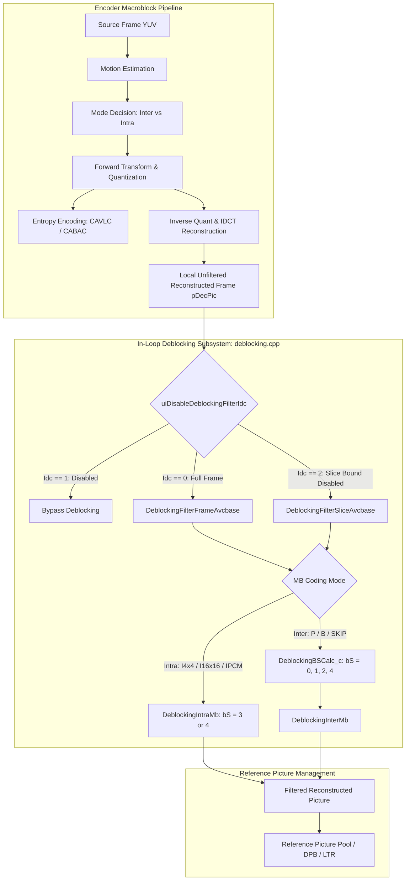
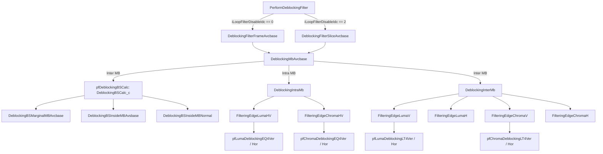

# OpenH264 Encoder: In-Loop Deblocking Filter Engine (`encoder/core/src/deblocking.cpp`)

This document provides a comprehensive, literate-programming-style technical deep-dive into the OpenH264 Video Encoder In-Loop Deblocking Filter implementation located at [codec/encoder/core/src/deblocking.cpp](openh264/codec/encoder/core/src/deblocking.cpp) and its associated header [codec/encoder/core/inc/deblocking.h](openh264/codec/encoder/core/inc/deblocking.h).

---

## Table of Contents
1. [Module Architecture & Pipeline Role](#1-module-architecture--pipeline-role)
2. [Data Structures, Types, and Constants](#2-data-structures-types-and-constants)
   - [2.1 `SDeblockingFilter` (`TagDeblockingFilter`)](#21-sdeblockingfilter-tagdeblockingfilter)
   - [2.2 `DeblockingFunc` (`tagDeblockingFunc`)](#22-deblockingfunc-tagdeblockingfunc)
   - [2.3 Boundary Strength & Alpha/Beta Lookup Tables](#23-boundary-strength--alphabeta-lookup-tables)
   - [2.4 Bitwise Edge & Threshold Helper Macros](#24-bitwise-edge--threshold-helper-macros)
3. [Deep-Dive Function & Algorithmic Analysis](#3-deep-dive-function--algorithmic-analysis)
   - [3.1 Boundary Strength ($bS$) Derivation](#31-boundary-strength-bs-derivation)
     - [`DeblockingBSInsideMBAvsbase`](#deblockingbsinsidembavsbase)
     - [`DeblockingBSInsideMBNormal`](#deblockingbsinsidembnormal)
     - [`DeblockingBSMarginalMBAvcbase`](#deblockingbsmarginalmbavcbase)
     - [`DeblockingBSCalc_c`](#deblockingbscalc_c)
     - [`DeblockingBSCalc_neon` & `DeblockingBSCalc_AArch64_neon`](#deblockingbscalc_neon--deblockingbscalc_aarch64_neon)
   - [3.2 Edge Filtering Primitives](#32-edge-filtering-primitives)
     - [`FilteringEdgeLumaH` & `FilteringEdgeLumaV`](#filteringedgelumah--filteringedgelumav)
     - [`FilteringEdgeLumaIntraH` & `FilteringEdgeLumaIntraV`](#filteringedgelumaintrah--filteringedgelumaintrav)
     - [`FilteringEdgeChromaH` & `FilteringEdgeChromaV`](#filteringedgechromah--filteringedgechromav)
     - [`FilteringEdgeChromaIntraH` & `FilteringEdgeChromaIntraV`](#filteringedgechromaintrah--filteringedgechromaintrav)
   - [3.3 Macroblock-Level Filtering Dispatchers](#33-macroblock-level-filtering-dispatchers)
     - [`DeblockingInterMb`](#deblockingintermb)
     - [`FilteringEdgeLumaHV` & `FilteringEdgeChromaHV`](#filteringedgelumahv--filteringedgechromahv)
     - [`DeblockingIntraMb`](#deblockingintramb)
     - [`DeblockingMbAvcbase`](#deblockingmbavcbase)
   - [3.4 Frame & Slice Level Traversal Engines](#34-frame--slice-level-traversal-engines)
     - [`DeblockingFilterFrameAvcbase`](#deblockingfilterframeavcbase)
     - [`DeblockingFilterSliceAvcbase`](#deblockingfiltersliceavcbase)
     - [`DeblockingFilterSliceAvcbaseNull`](#deblockingfiltersliceavcbasenull)
     - [`PerformDeblockingFilter`](#performdeblockingfilter)
   - [3.5 SIMD Dispatch & Architecture Initialization](#35-simd-dispatch--architecture-initialization)
     - [`WelsBlockFuncInit`](#welsblockfuncinit)
     - [`DeblockingInit`](#deblockinginit)
4. [Call Graph & Subsystem Interactions](#4-call-graph--subsystem-interactions)

---

## 1. Module Architecture & Pipeline Role

In H.264 / AVC video encoding, the discrete cosine transform (integer DCT) and motion-compensated block partitioning operate on $4 \times 4$ and $8 \times 8$ sample grids. This grid-based processing introduces high-frequency discontinuities across block edges known as **blocking artifacts**. 

The in-loop deblocking filter in [deblocking.cpp](openh264/codec/encoder/core/src/deblocking.cpp) is an integral component of the local macroblock reconstruction loop in the OpenH264 encoder ([sWelsEncCtx](openh264/codec/encoder/core/inc/encoder_context.h#L116-L238)). It executes on the locally decoded picture buffer (`pDecPic`) after forward transform, quantization, entropy coding, and inverse reconstruction have completed for the frame/slice, but **before** the reconstructed picture is stored in the reference picture list or used for future inter-frame prediction.



### Key Deblocking Modes (`uiDisableDeblockingFilterIdc`)
1. **Mode 0 (`0`)**: Standard H.264 deblocking enabled across all macroblock edges, including edges crossing slice boundaries.
2. **Mode 1 (`1`)**: Deblocking filter completely disabled across the slice/frame.
3. **Mode 2 (`2`)**: Deblocking enabled within the slice, but disabled across slice boundaries to prevent inter-slice processing dependencies.

---

## 2. Data Structures, Types, and Constants

### 2.1 `SDeblockingFilter` (`TagDeblockingFilter`)

Defined in [codec/encoder/core/inc/deblocking.h](openh264/codec/encoder/core/inc/deblocking.h#L52-L62), `SDeblockingFilter` encapsulates the state parameters, reconstructed picture plane pointers, strides, and slice-level offset thresholds passed to edge filtering routines.

```cpp
typedef struct TagDeblockingFilter {
  uint8_t*    pCsData[3];          // Pointers to active reconstructed planes (Y, Cb, Cr)
  int32_t     iCsStride[3];        // Strides in bytes per line for (Y, Cb, Cr)
  int16_t     iMbStride;           // Macroblock pitch (number of MBs per row)
  int8_t      iSliceAlphaC0Offset; // Slice alpha offset alpha_c0_offset in [-12, 12]
  int8_t      iSliceBetaOffset;    // Slice beta offset beta_offset in [-12, 12]
  uint8_t     uiLumaQP;            // Average QP applied for Luma edge deblocking
  uint8_t     uiChromaQP;          // Average QP applied for Chroma edge deblocking
  uint8_t     uiFilterIdc;         // Filter boundary control flag (0 = cross-slice, 1 = within-slice)
  uint8_t     uiReserved;          // Alignment padding byte
} SDeblockingFilter;
```

#### Detailed Member Breakdown
| Field | Type | Description & Constraints |
| :--- | :--- | :--- |
| `pCsData[3]` | `uint8_t*` | Base pointers to current macroblock top-left pixel samples for Luma ($Y$), Chroma Blue ($Cb$), and Chroma Red ($Cr$). |
| `iCsStride[3]` | `int32_t` | Frame buffer line strides in bytes. `iCsStride[0]` for luma plane ($16 \times \text{MB}$ width with padding), `iCsStride[1]` and `iCsStride[2]` for chroma planes. |
| `iMbStride` | `int16_t` | Width of the spatial dependency layer in macroblock units (`iMbWidth`). Used to index top neighboring macroblocks via `pCurMb - iMbStride`. |
| `iSliceAlphaC0Offset` | `int8_t` | Alpha offset $\alpha_{\text{offset}} = 2 \times \text{slice\_alpha\_c0\_offset\_div2}$. Adjusts clipping thresholds $\alpha$ and $t_{C0}$. |
| `iSliceBetaOffset` | `int8_t` | Beta offset $\beta_{\text{offset}} = 2 \times \text{slice\_beta\_offset\_div2}$. Adjusts edge activity threshold $\beta$. |
| `uiLumaQP` | `uint8_t` | Effective Luma Quantization Parameter $QP_Y$ used for table index derivation: $QP_{avg} = (QP_{cur} + QP_{neigh} + 1) \gg 1$. |
| `uiChromaQP` | `uint8_t` | Effective Chroma Quantization Parameter $QP_C$ used for chroma edge table lookups. |
| `uiFilterIdc` | `uint8_t` | Boolean indicator derived from `(uiDisableDeblockingFilterIdc != 0)`. When non-zero, prevents filtering across slice boundaries. |
| `uiReserved` | `uint8_t` | Padding byte for 32-bit/64-bit struct memory alignment. |

---

### 2.2 `DeblockingFunc` (`tagDeblockingFunc`)

Defined in [codec/encoder/core/inc/wels_func_ptr_def.h](openh264/codec/encoder/core/inc/wels_func_ptr_def.h#L88-L102), this function-pointer table dispatches low-level SIMD-accelerated or C-fallback assembly routines for 4-sample edge filtering and boundary strength calculation.

```cpp
typedef struct tagDeblockingFunc {
  PLumaDeblockingLT4Func    pfLumaDeblockingLT4Ver;   // Luma vertical edge filter (bS < 4)
  PLumaDeblockingEQ4Func    pfLumaDeblockingEQ4Ver;   // Luma vertical edge filter (bS == 4)
  PLumaDeblockingLT4Func    pfLumaDeblockingLT4Hor;   // Luma horizontal edge filter (bS < 4)
  PLumaDeblockingEQ4Func    pfLumaDeblockingEQ4Hor;   // Luma horizontal edge filter (bS == 4)

  PChromaDeblockingLT4Func  pfChromaDeblockingLT4Ver; // Chroma vertical edge filter (bS < 4)
  PChromaDeblockingEQ4Func  pfChromaDeblockingEQ4Ver; // Chroma vertical edge filter (bS == 4)
  PChromaDeblockingLT4Func  pfChromaDeblockingLT4Hor; // Chroma horizontal edge filter (bS < 4)
  PChromaDeblockingEQ4Func  pfChromaDeblockingEQ4Hor; // Chroma horizontal edge filter (bS == 4)

  PDeblockingBSCalc         pfDeblockingBSCalc;       // Boundary Strength matrix calculator
  PDeblockingFilterSlice    pfDeblockingFilterSlice;  // Slice-level deblocking dispatcher
} DeblockingFunc;
```

---

### 2.3 Boundary Strength & Alpha/Beta Lookup Tables

[deblocking.cpp:L72-L116](openh264/codec/encoder/core/src/deblocking.cpp#L72-L116) declares three standard H.264 lookup tables padded by 12 extra elements to prevent out-of-bounds reads when index offsets exceed 51:

```cpp
static const uint8_t g_kuiAlphaTable[52 + 12];
static const int8_t  g_kiBetaTable[52 + 12];
static const int8_t  g_kiTc0Table[52 + 12][4];
static const uint8_t g_kuiTableBIdx[2][8];
```

1. **`g_kuiAlphaTable[64]`**: Implements H.264 Table 8-16 ($\alpha$ threshold table). Indexed by $\text{IndexA} = \text{Clip3}(0, 51, QP_{avg} + \alpha_{\text{offset}})$.
2. **`g_kiBetaTable[64]`**: Implements H.264 Table 8-16 ($\beta$ threshold table). Indexed by $\text{IndexB} = \text{Clip3}(0, 51, QP_{avg} + \beta_{\text{offset}})$.
3. **`g_kiTc0Table[64][4]`**: Implements H.264 Table 8-17 ($t_{C0}$ clipping parameter matrix). Indexed by $\text{IndexA}$ and boundary strength $bS \in \{0, 1, 2, 3\}$.
4. **`g_kuiTableBIdx[2][8]`**: Sub-block index mapping table for marginal boundary edges between the current macroblock and its spatial neighbors:
   * **Vertical Edge (`[0]`)**: Current MB left column sub-blocks `{0, 4, 8, 12}` vs Left neighbor MB right column sub-blocks `{3, 7, 11, 15}`.
   * **Horizontal Edge (`[1]`)**: Current MB top row sub-blocks `{0, 1, 2, 3}` vs Top neighbor MB bottom row sub-blocks `{12, 13, 14, 15}`.

---

### 2.4 Bitwise Edge & Threshold Helper Macros

[deblocking.cpp:L50-L124](openh264/codec/encoder/core/src/deblocking.cpp#L50-L124) defines performance-critical macros for threshold retrieval and motion vector delta comparison:

#### A. Motion Vector Difference Test (`MB_BS_MV`)
```cpp
#define MB_BS_MV(sCurMv, sNeighMv, uiBIdx, uiBnIdx) \
  (\
  ( WELS_ABS( sCurMv[uiBIdx].iMvX - sNeighMv[uiBnIdx].iMvX ) >= 4 ) ||\
  ( WELS_ABS( sCurMv[uiBIdx].iMvY - sNeighMv[uiBnIdx].iMvY ) >= 4 )\
  )
```
Evaluates if motion vectors between two sub-blocks differ by $\ge 4$ quarter-pel units ($1.0$ full luma sample). If true, $bS$ must be set to 1.

#### B. Internal Sub-block Fast MV Test (`SMB_EDGE_MV`)
```cpp
#define SMB_EDGE_MV(uiRefIndex, sMotionVector, uiBIdx, uiBnIdx) \
  (\
  !!((WELS_ABS(sMotionVector[uiBIdx].iMvX - sMotionVector[uiBnIdx].iMvX) &(~3)) | \
     (WELS_ABS(sMotionVector[uiBIdx].iMvY - sMotionVector[uiBnIdx].iMvY) &(~3)))\
  )
```
Uses fast bitwise masking `& (~3)` to test for integer or sub-pixel differences $\ge 4$ without branching.

#### C. Internal Boundary Strength Combination (`BS_EDGE`)
```cpp
#define BS_EDGE(bsx1, uiRefIndex, sMotionVector, uiBIdx, uiBnIdx) \
  ( (bsx1 | SMB_EDGE_MV(uiRefIndex, sMotionVector, uiBIdx, uiBnIdx)) << (bsx1 ? 1 : 0) )
```
* If `bsx1` (non-zero transform coefficient count flag $NNZ_{cur} | NNZ_{neigh}$) is $1$, it shifts left by 1, yielding $bS = 2$.
* If `bsx1` is $0$, it shifts by 0, yielding $bS = 1$ if motion vector difference $\ge 4$, or $bS = 0$ otherwise.

#### D. Alpha & Beta Index Clipping (`GET_ALPHA_BETA_FROM_QP`)
```cpp
#define GET_ALPHA_BETA_FROM_QP(QP, iAlphaOffset, iBetaOffset, iIdexA, iAlpha, iBeta) \
{\
  iIdexA = (QP + iAlphaOffset);\
  iIdexA = CLIP3_QP_0_51(iIdexA);\
  iAlpha = g_kuiAlphaTable(iIdexA);\
  iBeta  = g_kiBetaTable((CLIP3_QP_0_51(QP + iBetaOffset)));\
}
```

---

## 3. Deep-Dive Function & Algorithmic Analysis

### 3.1 Boundary Strength ($bS$) Derivation

The Boundary Strength $bS$ is a 3-dimensional array `uiBS[dir][edge][block]` of size $[2][4][4]$:
* `dir = 0`: Vertical edges (filtering horizontally).
* `dir = 1`: Horizontal edges (filtering vertically).
* `edge = 0..3`: Edge index across the $16 \times 16$ macroblock (edge 0 is the external marginal boundary, edges 1..3 are internal $4 \times 4$ boundaries).
* `block = 0..3`: Sub-block index ($4$ samples along the 16-sample edge length).

```
   Vertical Edges (dir = 0)              Horizontal Edges (dir = 1)
   Edge 0   Edge 1  Edge 2  Edge 3
     |        |       |       |          +-------+-------+-------+-------+
     |  B0    |  B1   |  B2   |  B3      |       |       |       |       |  Edge 0 (Marginal)
     |        |       |       |          +-------+-------+-------+-------+
     |  B4    |  B5   |  B6   |  B7      |       |       |       |       |  Edge 1 (Internal)
     |        |       |       |          +-------+-------+-------+-------+
     |  B8    |  B9   |  B10  |  B11     |       |       |       |       |  Edge 2 (Internal)
     |        |       |       |          +-------+-------+-------+-------+
     |  B12   |  B13  |  B14  |  B15     |       |       |       |       |  Edge 3 (Internal)
                                         +-------+-------+-------+-------+
```

---

#### `DeblockingBSInsideMBAvsbase`
[deblocking.cpp:L126-L153](openh264/codec/encoder/core/src/deblocking.cpp#L126-L153)

```cpp
void inline DeblockingBSInsideMBAvsbase (int8_t* pNnzTab, uint8_t uiBS[2][4][4], int32_t iLShiftFactor);
```

#### Algorithmic Purpose
Calculates internal edge boundary strengths for `MB_TYPE_16x16` Inter macroblocks. In `16x16` Inter mode, all sixteen $4 \times 4$ sub-blocks share identical motion vectors and reference frame indices. Therefore, internal motion vector difference is identically zero ($\Delta MV = 0$). Internal boundary strength is determined purely by non-zero transform coefficient counts (`pNnzTab`):
$$bS = (NNZ_p \mid NNZ_q) \ll iLShiftFactor$$
For $iLShiftFactor = 1$, any block with non-zero residual coefficients produces $bS = 2$; otherwise $bS = 0$.

#### 32-Bit Parallel Computation
The function loads 4 non-zero count bytes at once into 32-bit registers (`uiNnz32b0..3`) to compute 4 internal edge strengths concurrently in a single CPU cycle:
```cpp
* (uint32_t*)uiBS[1][1] = (uiNnz32b0 | uiNnz32b1) << iLShiftFactor;
* (uint32_t*)uiBS[1][2] = (uiNnz32b1 | uiNnz32b2) << iLShiftFactor;
* (uint32_t*)uiBS[1][3] = (uiNnz32b2 | uiNnz32b3) << iLShiftFactor;
```

---

#### `DeblockingBSInsideMBNormal`
[deblocking.cpp:L155-L206](openh264/codec/encoder/core/src/deblocking.cpp#L155-L206)

```cpp
void inline DeblockingBSInsideMBNormal (SMB* pCurMb, uint8_t uiBS[2][4][4], int8_t* pNnzTab);
```

#### Algorithmic Purpose
Calculates internal edge boundary strengths for partitioned Inter macroblocks (`16x8`, `8x16`, `8x8`, `8x4`, `4x8`, `4x4`) where neighboring sub-blocks within the macroblock may possess distinct motion vectors or reference frame indices.

#### Process
1. Evaluates non-zero coefficient flags across internal vertical edges ($1, 2, 3$).
2. Calls `BS_EDGE` to combine non-zero residual flags with `SMB_EDGE_MV` motion vector delta checks.
3. Computes horizontal internal edges ($1, 2, 3$) using 32-bit bitwise OR across rows (`uiNnz32b0 | uiNnz32b1`, etc.).

---

#### `DeblockingBSMarginalMBAvcbase`
[deblocking.cpp:L208-L230](openh264/codec/encoder/core/src/deblocking.cpp#L208-L230)

```cpp
uint32_t DeblockingBSMarginalMBAvcbase (SMB* pCurMb, SMB* pNeighMb, int32_t iEdge);
```

#### Algorithmic Purpose
Computes the 4-byte boundary strength vector for marginal boundaries (edge 0: vertical boundary with Left MB if `iEdge = 0`, or horizontal boundary with Top MB if `iEdge = 1`) when neither the current nor neighboring macroblock is Intra-coded.

#### Decision Hierarchy (H.264 Section 8.7.2.1)
For each of the 4 sub-blocks along the marginal boundary:
1. **$bS = 2$**: If current block or neighbor block has non-zero transform coefficients:
   $$pNonZeroCount[B_{idx}] \mid pNeighMb\to pNonZeroCount[Bn_{idx}] \neq 0 \implies bS = 2$$
2. **$bS = 1$**: If transform coefficients are zero, but either:
   * Reference picture indices differ: $RefIdx_{cur} \neq RefIdx_{neigh}$.
   * Motion vector components differ by $\ge 4$ quarter-pel units ($|MV_{x1} - MV_{x2}| \ge 4$ or $|MV_{y1} - MV_{y2}| \ge 4$).
3. **$bS = 0$**: If transform coefficients are zero, reference indices match, and $|dMV| < 4$.

Returns the packed 32-bit integer `uiBSx4` containing the four 8-bit $bS$ values.

---

#### `DeblockingBSCalc_c`
[deblocking.cpp:L599-L627](openh264/codec/encoder/core/src/deblocking.cpp#L599-L627)

```cpp
void DeblockingBSCalc_c (SWelsFuncPtrList* pFunc, SMB* pCurMb, uint8_t uiBS[2][4][4], Mb_Type uiCurMbType,
                         int32_t iMbStride, int32_t iLeftFlag, int32_t iTopFlag);
```

#### Algorithmic Purpose
Constructs the full $2 \times 4 \times 4$ boundary strength matrix `uiBS` for an Inter macroblock:
1. **Left Boundary (`uiBS[0][0]`)**:
   * If `iLeftFlag` is false: Set to `0` (no filtering across boundary).
   * If Left MB is Intra (`IS_INTRA`): Set to `0x04040404` ($bS = 4$ for all 4 sub-blocks).
   * Otherwise: Computes via `DeblockingBSMarginalMBAvcbase(pCurMb, pCurMb - 1, 0)`.
2. **Top Boundary (`uiBS[1][0]`)**:
   * If `iTopFlag` is false: Set to `0`.
   * If Top MB is Intra: Set to `0x04040404` ($bS = 4$).
   * Otherwise: Computes via `DeblockingBSMarginalMBAvcbase(pCurMb, pCurMb - iMbStride, 1)`.
3. **Internal Boundaries (`uiBS[dir][1..3]`)**:
   * If `uiCurMbType == MB_TYPE_SKIP`: Zeroes all internal edges (`uiBS = 0`).
   * Otherwise: Calls `pFunc->pfSetNZCZero` to normalize `pNonZeroCount`, then dispatches to `DeblockingBSInsideMBAvsbase` (`MB_TYPE_16x16`) or `DeblockingBSInsideMBNormal`.

---

#### `DeblockingBSCalc_neon` & `DeblockingBSCalc_AArch64_neon`
[deblocking.cpp:L555-L597](openh264/codec/encoder/core/src/deblocking.cpp#L555-L597)

Accelerated ARM NEON / AArch64 implementations of boundary strength calculation. Invokes `DeblockingBSCalcEnc_neon` assembly kernel and patches marginal edges to `0x04040404` if neighboring macroblocks are Intra-coded.

---

### 3.2 Edge Filtering Primitives

H.264 edge filtering evaluates boundary pixel samples $(p_2, p_1, p_0 \mid q_0, q_1, q_2)$. Samples are filtered only if the boundary discontinuity conditions are satisfied:
$$|p_0 - q_0| < \alpha(\text{IndexA}) \quad \text{and} \quad |p_1 - p_0| < \beta(\text{IndexB}) \quad \text{and} \quad |q_1 - q_0| < \beta(\text{IndexB})$$

```
                   p2     p1     p0  |  q0     q1     q2
                [block p samples]    |    [block q samples]
                                 Boundary Edge
```

---

#### `FilteringEdgeLumaH` & `FilteringEdgeLumaV`
[deblocking.cpp:L232-L263](openh264/codec/encoder/core/src/deblocking.cpp#L232-L263)

```cpp
void FilteringEdgeLumaH (DeblockingFunc* pfDeblocking, SDeblockingFilter* pFilter, uint8_t* pPix, int32_t iStride, uint8_t* pBS);
void FilteringEdgeLumaV (DeblockingFunc* pfDeblocking, SDeblockingFilter* pFilter, uint8_t* pPix, int32_t iStride, uint8_t* pBS);
```

#### Parameters
* `pfDeblocking`: Deblocking assembly function pointer table.
* `pFilter`: Active `SDeblockingFilter` parameter context.
* `pPix`: Top-left pointer to first boundary sample in the picture buffer.
* `iStride`: Luma plane row byte stride (`iCsStride[0]`).
* `pBS`: 4-byte boundary strength array for the 4 sub-blocks along this edge.

#### Execution Logic
1. Computes `iAlpha` and `iBeta` from `pFilter->uiLumaQP` using `GET_ALPHA_BETA_FROM_QP`.
2. If `(iAlpha | iBeta) != 0`:
   * Looks up the clipping threshold array `iTc[0..3]` using `TC0_TBL_LOOKUP(iTc, iIdexA, pBS, 0)`.
   * Dispatches to SIMD/C kernel `pfLumaDeblockingLT4Ver` (for horizontal filtering across vertical edge) or `pfLumaDeblockingLT4Hor`.

---

#### `FilteringEdgeLumaIntraH` & `FilteringEdgeLumaIntraV`
[deblocking.cpp:L265-L293](openh264/codec/encoder/core/src/deblocking.cpp#L265-L293)

Filters Luma edges with boundary strength $bS = 4$ (Intra macroblock boundaries). Employs strong 3-tap/5-tap spatial smoothing filters (`pfLumaDeblockingEQ4Ver` / `pfLumaDeblockingEQ4Hor`).

---

#### `FilteringEdgeChromaH` & `FilteringEdgeChromaV`
[deblocking.cpp:L294-L325](openh264/codec/encoder/core/src/deblocking.cpp#L294-L325)

Filters Chroma $Cb$ (`pPixCb`) and $Cr$ (`pPixCr`) planes for $bS < 4$. Notice that `TC0_TBL_LOOKUP(iTc, iIdexA, pBS, 1)` is called with `bchroma = 1`, which adds $+1$ to $t_{C0}$ per H.264 standard specifications.

---

#### `FilteringEdgeChromaIntraH` & `FilteringEdgeChromaIntraV`
[deblocking.cpp:L327-L355](openh264/codec/encoder/core/src/deblocking.cpp#L327-L355)

Filters Chroma $Cb$ and $Cr$ planes for Intra macroblock boundaries ($bS = 4$) via `pfChromaDeblockingEQ4Ver` and `pfChromaDeblockingEQ4Hor`.

---

### 3.3 Macroblock-Level Filtering Dispatchers

#### `DeblockingInterMb`
[deblocking.cpp:L357-L440](openh264/codec/encoder/core/src/deblocking.cpp#L357-L440)

```cpp
void DeblockingInterMb (DeblockingFunc* pfDeblocking, SMB* pCurMb, SDeblockingFilter* pFilter, uint8_t uiBS[2][4][4]);
```

Filters all vertical and horizontal edges of an Inter-coded macroblock:
1. **Left Boundary Validation**:
   ```cpp
   bool bLeftBsValid[2] = { (iMbX > 0), ((iMbX > 0) && (pCurMb->uiSliceIdc == (pCurMb - 1)->uiSliceIdc)) };
   int32_t iLeftFlag = bLeftBsValid[pFilter->uiFilterIdc];
   ```
   If valid, computes average QP with left neighbor $QP_{avg} = (QP_{cur} + QP_{left} + 1) \gg 1$ and filters edge 0.
2. **Internal Vertical Edges ($1, 2, 3$)**:
   Filters vertical edges at offsets $+4$, $+8$, and $+12$ pixels if `uiBS[0][edge]` is non-zero. Note that chroma has only 2 internal $4 \times 4$ blocks, so chroma vertical filtering is executed only at edge index 2 (`+4` chroma pixels).
3. **Top Boundary Validation & Horizontal Edges**:
   Validates top neighbor, computes $QP_{avg} = (QP_{cur} + QP_{top} + 1) \gg 1$, filters horizontal edge 0, then filters internal horizontal edges 1, 2, 3.

---

#### `FilteringEdgeLumaHV` & `FilteringEdgeChromaHV`
[deblocking.cpp:L442-L547](openh264/codec/encoder/core/src/deblocking.cpp#L442-L547)

Highly optimized filtering routines specifically for Intra macroblocks:
* Internal edges within an Intra macroblock always have boundary strength $bS = 3$.
* The function hardcodes internal $bS$ to `0x03030303` (`* (uint32_t*)uiBSx4 = 0x03030303;`), eliminating the overhead of evaluating motion vectors or non-zero coefficient counts.
* Filters left/top boundaries (using $bS = 4$ Intra filters if neighbor available) and internal edges 1, 2, 3 (using $bS = 3$ filters) in a streamlined sequence.

---

#### `DeblockingIntraMb`
[deblocking.cpp:L550-L553](openh264/codec/encoder/core/src/deblocking.cpp#L550-L553)

```cpp
void DeblockingIntraMb (DeblockingFunc* pfDeblocking, SMB* pCurMb, SDeblockingFilter* pFilter) {
  FilteringEdgeLumaHV (pfDeblocking, pCurMb, pFilter);
  FilteringEdgeChromaHV (pfDeblocking, pCurMb, pFilter);
}
```

---

#### `DeblockingMbAvcbase`
[deblocking.cpp:L628-L654](openh264/codec/encoder/core/src/deblocking.cpp#L628-L654)

```cpp
void DeblockingMbAvcbase (SWelsFuncPtrList* pFunc, SMB* pCurMb, SDeblockingFilter* pFilter);
```

The primary macroblock-level switch:
* **Intra Modes (`MB_TYPE_INTRA4x4`, `MB_TYPE_INTRA16x16`, `MB_TYPE_INTRA_PCM`)**: Dispatches directly to `DeblockingIntraMb`.
* **Inter Modes (`MB_TYPE_16x16`, `MB_TYPE_16x8`, `MB_TYPE_8x16`, `MB_TYPE_8x8`, `MB_TYPE_SKIP`)**: Computes boundary strength matrix `uiBS` via `pfDeblockingBSCalc`, then dispatches to `DeblockingInterMb`.

---

### 3.4 Frame & Slice Level Traversal Engines

#### `DeblockingFilterFrameAvcbase`
[deblocking.cpp:L656-L691](openh264/codec/encoder/core/src/deblocking.cpp#L656-L691)

```cpp
void DeblockingFilterFrameAvcbase (SDqLayer* pCurDq, SWelsFuncPtrList* pFunc);
```

Filters an entire spatial dependency layer (`SDqLayer`) in raster scan order:
1. Checks if `uiDisableDeblockingFilterIdc == 1`; if so, returns immediately.
2. Initializes `SDeblockingFilter pFilter` with buffer strides, slice alpha/beta offsets, and picture pointers.
3. Nested 2D loop across macroblock rows ($j = 0..\text{MbHeight}-1$) and columns ($i = 0..\text{MbWidth}-1$):
   * Advances pixel sample pointers `pCsData[0]` ($+16$ bytes), `pCsData[1]` ($+8$ bytes), `pCsData[2]` ($+8$ bytes).
   * Calls `DeblockingMbAvcbase` for each macroblock in succession.

---

#### `DeblockingFilterSliceAvcbase`
[deblocking.cpp:L693-L739](openh264/codec/encoder/core/src/deblocking.cpp#L693-L739)

```cpp
void DeblockingFilterSliceAvcbase (SDqLayer* pCurDq, SWelsFuncPtrList* pFunc, SSlice* pSlice);
```

Used when `iLoopFilterDisableIdc == 2` (filtering enabled within slices, but disabled across slice boundaries). Traverses macroblocks belonging to a specific slice using [WelsGetNextMbOfSlice](openh264/codec/encoder/core/src/svc_encode_slice.cpp).

---

#### `PerformDeblockingFilter`
[deblocking.cpp:L744-L762](openh264/codec/encoder/core/src/deblocking.cpp#L744-L762)

```cpp
void PerformDeblockingFilter (sWelsEncCtx* pEnc);
```

Top-level entry point invoked by the encoder frame pipeline:
* If `pCurLayer->iLoopFilterDisableIdc == 0`: Invokes `DeblockingFilterFrameAvcbase`.
* If `pCurLayer->iLoopFilterDisableIdc == 2`: Loops through all slices (`ppSliceInLayer[0..iSliceCount-1]`) and invokes `DeblockingFilterSliceAvcbase`.
* If `pCurLayer->iLoopFilterDisableIdc == 1`: Deblocking is bypassed.

---

### 3.5 SIMD Dispatch & Architecture Initialization

#### `WelsBlockFuncInit`
[deblocking.cpp:L764-L791](openh264/codec/encoder/core/src/deblocking.cpp#L764-L791)

Initializes the non-zero count normalization function pointer `pfSetNZCZero`:
* **C Fallback**: `WelsNonZeroCount_c`
* **x86 SSE2**: `WelsNonZeroCount_sse2`
* **ARM NEON**: `WelsNonZeroCount_neon`
* **ARM64 AArch64**: `WelsNonZeroCount_AArch64_neon`
* **MIPS MMI / MSA**: `WelsNonZeroCount_mmi` / `WelsNonZeroCount_msa`

---

#### `DeblockingInit`
[deblocking.cpp:L793-L893](openh264/codec/encoder/core/src/deblocking.cpp#L793-L893)

```cpp
void DeblockingInit (DeblockingFunc* pFunc, int32_t iCpu);
```

Populates the `DeblockingFunc` structure with the optimal SIMD routines based on CPU feature flags:

| Target Architecture | CPU Flag | Luma LT4 / EQ4 Functions | Chroma LT4 / EQ4 Functions | BS Calc Function |
| :--- | :--- | :--- | :--- | :--- |
| **C / C++ Reference** | Default | `DeblockLumaLt4V_c`<br>`DeblockLumaEq4V_c`<br>`DeblockLumaLt4H_c`<br>`DeblockLumaEq4H_c` | `DeblockChromaLt4V_c`<br>`DeblockChromaEq4V_c`<br>`DeblockChromaLt4H_c`<br>`DeblockChromaEq4H_c` | `DeblockingBSCalc_c` |
| **x86 / x86_64 SSSE3** | `WELS_CPU_SSSE3` | `DeblockLumaLt4V_ssse3`<br>`DeblockLumaEq4V_ssse3`<br>`DeblockLumaLt4H_ssse3`<br>`DeblockLumaEq4H_ssse3` | `DeblockChromaLt4V_ssse3`<br>`DeblockChromaEq4V_ssse3`<br>`DeblockChromaLt4H_ssse3`<br>`DeblockChromaEq4H_ssse3` | `DeblockingBSCalc_c` |
| **ARMv7 NEON** | `WELS_CPU_NEON` | `DeblockLumaLt4V_neon`<br>`DeblockLumaEq4V_neon`<br>`DeblockLumaLt4H_neon`<br>`DeblockLumaEq4H_neon` | `DeblockChromaLt4V_neon`<br>`DeblockChromaEq4V_neon`<br>`DeblockChromaLt4H_neon`<br>`DeblockChromaEq4H_neon` | `DeblockingBSCalc_neon` |
| **AArch64 NEON** | `WELS_CPU_NEON` | `DeblockLumaLt4V_AArch64_neon`<br>`DeblockLumaEq4V_AArch64_neon`<br>`DeblockLumaLt4H_AArch64_neon`<br>`DeblockLumaEq4H_AArch64_neon` | `DeblockChromaLt4V_AArch64_neon`<br>`DeblockChromaEq4V_AArch64_neon`<br>`DeblockChromaLt4H_AArch64_neon`<br>`DeblockChromaEq4H_AArch64_neon` | `DeblockingBSCalc_AArch64_neon` |
| **MIPS MMI / MSA** | `WELS_CPU_MMI` / `MSA` | `..._mmi` / `..._msa` | `..._mmi` / `..._msa` | `DeblockingBSCalc_c` |
| **Loongson LSX** | `WELS_CPU_LSX` | `..._lsx` | `..._lsx` | `DeblockingBSCalc_c` |

---

## 4. Call Graph & Subsystem Interactions



---

## File and Symbol Reference Links

* **Implementation Source**: [codec/encoder/core/src/deblocking.cpp](openh264/codec/encoder/core/src/deblocking.cpp)
* **Encoder Deblocking Header**: [codec/encoder/core/inc/deblocking.h](openh264/codec/encoder/core/inc/deblocking.h)
* **Common Deblocking Header**: [codec/common/inc/deblocking_common.h](openh264/codec/common/inc/deblocking_common.h)
* **Function Pointer Definitions**: [codec/encoder/core/inc/wels_func_ptr_def.h](openh264/codec/encoder/core/inc/wels_func_ptr_def.h)
* **Architecture Overview**: [overview.md](openh264/rust/docs/overview.md)
