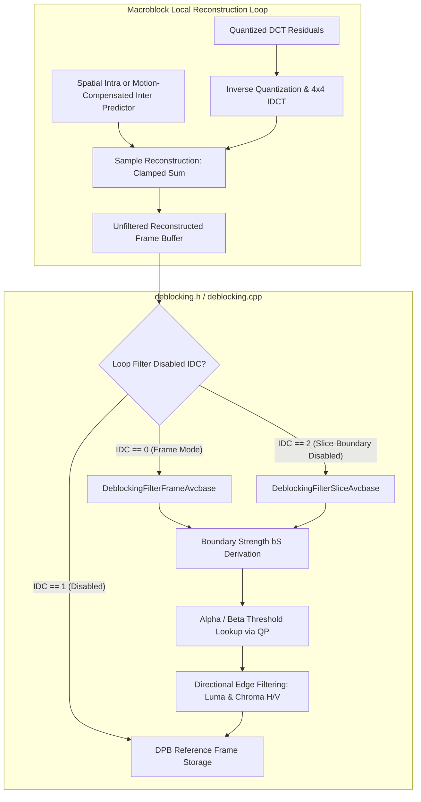
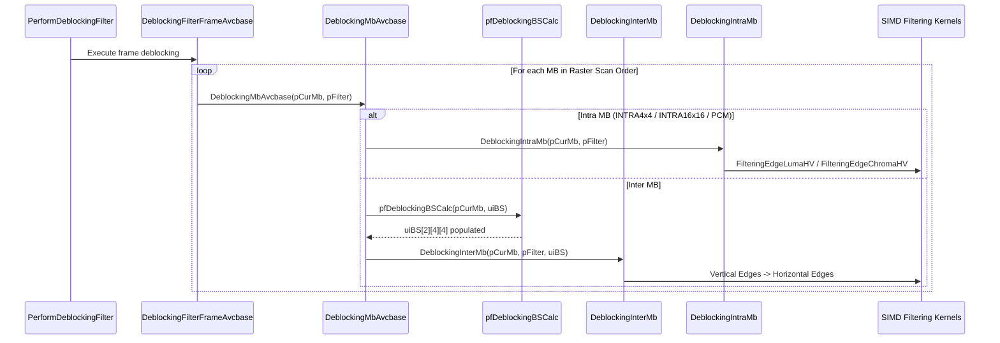

# OpenH264 Encoder In-Loop Deblocking Filter: Architectural & Code Analysis

**Source File:** [`codec/encoder/core/inc/deblocking.h`](openh264/codec/encoder/core/inc/deblocking.h)  
**Implementation File:** [`codec/encoder/core/src/deblocking.cpp`](openh264/codec/encoder/core/src/deblocking.cpp)  
**Common Subsystem:** [`codec/common/inc/deblocking_common.h`](openh264/codec/common/inc/deblocking_common.h)  
**Namespace:** `WelsEnc`

---

## 1. High-Level Architectural Role

In the H.264 / AVC video coding standard (ISO/IEC 14496-10 / ITU-T H.264), block-based transform coding ($4 \times 4$ integer DCT) and block-based motion compensation introduce visible grid discontinuities along block boundaries known as **blocking artifacts**. 

The **In-Loop Adaptive Deblocking Filter** operates directly within the macroblock reconstruction loop of the encoder. Reconstructed frames are filtered *prior* to being stored in the Decoded Picture Buffer (DPB) and used as reference pictures for motion-compensated prediction of subsequent frames. This ensures that the encoder and decoder maintain perfectly synchronized reference picture states, eliminating encoder-decoder drift.



### Core Design Principles in OpenH264 Deblocking
1. **Conditional Adaptation**: Filtering strength adapts dynamically on a $4\times4$ block boundary basis according to the computed **Boundary Strength ($bS \in \{0, 1, 2, 3, 4\}$)**, local Quantization Parameters ($QP_Y$, $QP_C$), and sample gradient thresholds ($\alpha, \beta$).
2. **SIMD Vectorization Abstraction**: Function pointers within [`SWelsFuncPtrList`](openh264/codec/encoder/core/inc/wels_func_ptr_def.h#L198-L296) decouple core filtering algorithms from target hardware ISAs. The encoder dynamically binds optimized kernels for x86 SSSE3, ARM NEON, ARM64 NEON, MIPS MMI/MSA, and Loongson LSX at runtime.
3. **Cache-Friendly In-Place Filtering**: Edge filtering directly modifies reconstructed luminance ($Y$) and chrominance ($Cb, Cr$) samples in place, minimizing memory bus traffic and cache misses.

---

## 2. Data Structure Breakdown

The header defines the primary runtime context struct used to pass slice-level and macroblock-level deblocking parameters into pixel filtering kernels.

### 2.1 `SDeblockingFilter` (`struct TagDeblockingFilter`)

Defined in [`codec/encoder/core/inc/deblocking.h`](openh264/codec/encoder/core/inc/deblocking.h#L52-L62):

```cpp
typedef struct TagDeblockingFilter {
  uint8_t*    pCsData[3];          // Pointer to reconstructed picture plane data (Y, Cb, Cr)
  int32_t     iCsStride[3];        // Reconstruction buffer row strides in bytes
  int16_t     iMbStride;           // Picture width in macroblocks
  int8_t      iSliceAlphaC0Offset; // Slice Alpha (alpha_c0) offset div 2 [-6, +6]
  int8_t      iSliceBetaOffset;    // Slice Beta offset div 2 [-6, +6]
  uint8_t     uiLumaQP;            // Quantization Parameter for Luma edge filtering
  uint8_t     uiChromaQP;          // Quantization Parameter for Chroma edge filtering
  uint8_t     uiFilterIdc;         // 0: Filter across slice boundaries; 1: Disable across boundaries
  uint8_t     uiReserved;          // 1-byte padding for memory alignment
} SDeblockingFilter;
```

#### Field-Level Specification

| Field Name | Type | Alignment / Size | Description & Algorithmic Role |
| :--- | :--- | :--- | :--- |
| `pCsData[3]` | `uint8_t* [3]` | $3 \times 8$ bytes (64-bit) | Pointers to the top-left reconstructed pixel samples of the current macroblock for each color plane: `pCsData[0]` for Luma ($Y$), `pCsData[1]` for Chroma Cb ($U$), and `pCsData[2]` for Chroma Cr ($V$). Updated per MB during raster scanning. |
| `iCsStride[3]` | `int32_t [3]` | $3 \times 4 = 12$ bytes | Memory pitch (stride in bytes) for the reconstructed picture buffers. `iCsStride[0]` represents the luma line pitch; `iCsStride[1]` and `iCsStride[2]` represent the chroma line pitch. |
| `iMbStride` | `int16_t` | 2 bytes | Frame width measured in macroblock units ($W_{\text{MB}} = \frac{\text{Width}}{16}$). Used for neighbor MB index arithmetic (e.g., accessing the top neighbor at `pCurMb - iMbStride`). |
| `iSliceAlphaC0Offset` | `int8_t` | 1 byte | Deblocking alpha offset parameter parsed from the slice header (`slice_alpha_c0_offset_div2`), scaled by 2 in index calculations. Range: $[-6, +6]$, shifting threshold index by $[-12, +12]$. |
| `iSliceBetaOffset` | `int8_t` | 1 byte | Deblocking beta offset parameter parsed from the slice header (`slice_beta_offset_div2`), scaled by 2 in index calculations. Range: $[-6, +6]$, shifting threshold index by $[-12, +12]$. |
| `uiLumaQP` | `uint8_t` | 1 byte | Active quantization parameter used to index alpha/beta threshold tables for Luma filtering. For internal MB edges, $QP = QP_{\text{cur}}$. For boundary edges, $QP = \lfloor (QP_{\text{cur}} + QP_{\text{neighbor}} + 1) / 2 \rfloor$. |
| `uiChromaQP` | `uint8_t` | 1 byte | Active quantization parameter used for Chroma edge filtering, derived from chroma QP mapping tables and averaged across MB boundaries. |
| `uiFilterIdc` | `uint8_t` | 1 byte | Deblocking boundary mode flag: `0` enables filtering across slice boundaries; `1` disables filtering across slice boundaries (derived from `uiDisableDeblockingFilterIdc != 0`). |
| `uiReserved` | `uint8_t` | 1 byte | Explicit padding byte ensuring 32-bit/64-bit alignment across compilers. |

---

## 3. Function Pointer Interface & Typedefs

Function pointers for deblocking operations are encapsulated within [`DeblockingFunc`](openh264/codec/encoder/core/inc/wels_func_ptr_def.h#L88-L102) and [`PSetNoneZeroCountZeroFunc`](openh264/codec/encoder/core/inc/wels_func_ptr_def.h#L104):

```cpp
typedef void (*PLumaDeblockingLT4Func) (uint8_t* iSampleY, int32_t iStride, int32_t iAlpha, int32_t iBeta, int8_t* iTc);
typedef void (*PLumaDeblockingEQ4Func) (uint8_t* iSampleY, int32_t iStride, int32_t iAlpha, int32_t iBeta);
typedef void (*PChromaDeblockingLT4Func) (uint8_t* iSampleCb, uint8_t* iSampleCr, int32_t iStride, int32_t iAlpha, int32_t iBeta, int8_t* iTc);
typedef void (*PChromaDeblockingEQ4Func) (uint8_t* iSampleCb, uint8_t* iSampleCr, int32_t iStride, int32_t iAlpha, int32_t iBeta);
typedef void (*PDeblockingBSCalc) (SWelsFuncPtrList* pFunc, SMB* pCurMb, uint8_t uiBS[2][4][4], Mb_Type uiCurMbType, int32_t iMbStride, int32_t iLeftFlag, int32_t iTopFlag);
typedef void (*PDeblockingFilterSlice) (SDqLayer* pCurDq, SWelsFuncPtrList* pFunc, SSlice* pSlice);

typedef struct tagDeblockingFunc {
  PLumaDeblockingLT4Func    pfLumaDeblockingLT4Ver;   // Luma vertical edge filtering (bS < 4)
  PLumaDeblockingEQ4Func    pfLumaDeblockingEQ4Ver;   // Luma vertical edge filtering (bS == 4)
  PLumaDeblockingLT4Func    pfLumaDeblockingLT4Hor;   // Luma horizontal edge filtering (bS < 4)
  PLumaDeblockingEQ4Func    pfLumaDeblockingEQ4Hor;   // Luma horizontal edge filtering (bS == 4)

  PChromaDeblockingLT4Func  pfChromaDeblockingLT4Ver; // Chroma vertical edge filtering (bS < 4)
  PChromaDeblockingEQ4Func  pfChromaDeblockingEQ4Ver; // Chroma vertical edge filtering (bS == 4)
  PChromaDeblockingLT4Func  pfChromaDeblockingLT4Hor; // Chroma horizontal edge filtering (bS < 4)
  PChromaDeblockingEQ4Func  pfChromaDeblockingEQ4Hor; // Chroma horizontal edge filtering (bS == 4)

  PDeblockingBSCalc         pfDeblockingBSCalc;       // Boundary Strength calculation routine
  PDeblockingFilterSlice    pfDeblockingFilterSlice;  // Slice-level deblocking entry routine
} DeblockingFunc;
```

---

## 4. Mathematical Foundations of H.264 Deblocking

### 4.1 Boundary Strength ($bS$) Decision Rules

For every $4 \times 4$ block boundary edge between two adjacent pixel blocks $p$ (left or above) and $q$ (right or below), a Boundary Strength integer $bS \in [0, 4]$ is derived according to H.264 standard section 8.7.2.1:

$$
bS = \begin{cases}
4 & \text{if edge is a macroblock boundary AND } (\text{Block } p \text{ is Intra} \lor \text{Block } q \text{ is Intra}) \\
3 & \text{if edge is inside a macroblock AND } (\text{Block } p \text{ is Intra} \lor \text{Block } q \text{ is Intra}) \\
2 & \text{if neither block is Intra AND } (\text{NonZeroCoeff}(p) \neq 0 \lor \text{NonZeroCoeff}(q) \neq 0) \\
1 & \text{if } \text{RefPic}(p) \neq \text{RefPic}(q) \lor |MV_{p,x} - MV_{q,x}| \ge 4 \lor |MV_{p,y} - MV_{q,y}| \ge 4 \\
0 & \text{otherwise (no filtering needed)}
\end{cases}
$$

where motion vector differences are evaluated in quarter-pixel units ($4 \text{ units} = 1.0 \text{ integer pixel}$).

```mermaid
graph TD
    A[Evaluate 4x4 Block Edge p | q] --> B{Either block Intra-coded?}
    B -- Yes --> C{Is it an MB Boundary Edge?}
    C -- Yes --> D["bS = 4 (Strong Intra Filtering)"]
    C -- No --> E["bS = 3 (Standard Intra Filtering)"]
    B -- No --> F{Non-Zero Transform Coeffs?}
    F -- Yes --> G["bS = 2 (Inter Residual Filtering)"]
    F -- No --> H{Different Ref Frames OR |dMV| >= 4?}
    H -- Yes --> I["bS = 1 (Motion Boundary Filtering)"]
    H -- No --> J["bS = 0 (Filter Bypassed)"]
```

### 4.2 Alpha ($\alpha$) and Beta ($\beta$) Threshold Tables

The boundary sample line across an edge is denoted:
$$p_3, \quad p_2, \quad p_1, \quad p_0 \quad \Big| \quad q_0, \quad q_1, \quad q_2, \quad q_3$$

Filtering is enabled for a sample line if and only if all three gradient conditions hold:
$$|p_0 - q_0| < \alpha(\text{Index}_A) \quad \land \quad |p_1 - p_0| < \beta(\text{Index}_B) \quad \land \quad |q_1 - q_0| < \beta(\text{Index}_B)$$

The threshold indices are derived from the average Quantization Parameter ($QP$) and slice offsets:
$$\text{Index}_A = \text{clip3}\left(0, 51, QP + 2 \cdot \text{iSliceAlphaC0Offset}\right)$$
$$\text{Index}_B = \text{clip3}\left(0, 51, QP + 2 \cdot \text{iSliceBetaOffset}\right)$$

### 4.3 Weak Edge Filtering Algorithm ($bS \in \{1, 2, 3\}$)

When $bS < 4$, sample clipping parameter $t_C$ is derived from the clipping lookup table $t_{C0}(\text{Index}_A, bS)$:
$$t_C = t_{C0} + \left( |p_2 - p_0| < \beta \ ? \ 1 : 0 \right) + \left( |q_2 - q_0| < \beta \ ? \ 1 : 0 \right)$$

The filtered luminance sample adjustment $\Delta$ is calculated as:
$$\Delta = \text{clip3}\left(-t_C, \ t_C, \ \left(((q_0 - p_0) \ll 2) + (p_1 - q_1) + 4\right) \gg 3 \right)$$
$$p_0' = \text{clip1}(p_0 + \Delta), \qquad q_0' = \text{clip1}(q_0 - \Delta)$$

If $|p_2 - p_0| < \beta$, the inner sample $p_1$ is also filtered:
$$p_1' = p_1 + \text{clip3}\left(-t_{C0}, \ t_{C0}, \ (p_2 + ((p_0 + q_0 + 1) \gg 1) - (p_1 \ll 1)) \gg 1 \right)$$

### 4.4 Strong Edge Filtering Algorithm ($bS = 4$)

For macroblock boundary edges adjacent to Intra-coded blocks ($bS = 4$), if the condition $|p_2 - p_0| < \beta \land |p_0 - q_0| < ((\alpha \gg 2) + 2)$ holds, strong 3-tap/4-tap spatial smoothing filters are applied:
$$p_0' = (p_2 + 2p_1 + 2p_0 + 2q_0 + q_1 + 4) \gg 3$$
$$p_1' = (p_2 + p_1 + p_0 + q_0 + 2) \gg 2$$
$$p_2' = (2p_3 + 3p_2 + p_1 + p_0 + q_0 + 4) \gg 3$$

Otherwise, a lighter 2-tap boundary filter is applied:
$$p_0' = (2p_1 + p_0 + q_1 + 2) \gg 2$$

---

## 5. Detailed Method & Function Reference

The functions declared in [`deblocking.h`](openh264/codec/encoder/core/inc/deblocking.h) govern boundary strength derivation, edge filtering, and frame/slice traversal.

### 5.1 `PerformDeblockingFilter`

```cpp
void PerformDeblockingFilter (sWelsEncCtx* pEnc);
```

* **Purpose**: Top-level driver for encoder in-loop deblocking filtering. Dispatches frame-level or slice-level filtering based on the active spatial layer configuration.
* **Parameters**:
  * `pEnc`: Pointer to top-level encoder context ([`sWelsEncCtx`](openh264/codec/encoder/core/inc/encoder_context.h#L116-L238)).
* **Implementation Details**:
  * Extracts current spatial dependency layer pointer `pCurLayer = pEnc->pCurDqLayer`.
  * Evaluates `pCurLayer->iLoopFilterDisableIdc`:
    1. **`0` (Enabled Across Entire Frame)**: Invokes `DeblockingFilterFrameAvcbase(pCurLayer, pEnc->pFuncList)`.
    2. **`2` (Enabled Within Slices, Disabled Across Slice Boundaries)**: Queries the total slice count via `GetCurrentSliceNum(pCurLayer)` and iterates through slices `ppSliceInLayer[iSliceIdx]`, calling `DeblockingFilterSliceAvcbase(pCurLayer, pEnc->pFuncList, pSlice)` for each slice.
    3. **`1` (Disabled Completely)**: Returns immediately without performing filtering.

---

### 5.2 `DeblockingFilterFrameAvcbase`

```cpp
void DeblockingFilterFrameAvcbase (SDqLayer* pCurDq, SWelsFuncPtrList* pFunc);
```

* **Purpose**: Performs raster-scan macroblock traversal across an entire spatial layer frame when deblocking across slice boundaries is permitted (`iLoopFilterDisableIdc == 0`).
* **Parameters**:
  * `pCurDq`: Pointer to the active dependency layer context ([`SDqLayer`](openh264/codec/encoder/core/inc/svc_enc_slice_segment.h)).
  * `pFunc`: Pointer to the function pointer list ([`SWelsFuncPtrList`](openh264/codec/encoder/core/inc/wels_func_ptr_def.h#L198-L296)).
* **Algorithmic Flow**:
  1. Checks `sSliceHeaderExt->sSliceHeader.uiDisableDeblockingFilterIdc == 1`; returns immediately if filtering is disabled.
  2. Populates a local [`SDeblockingFilter`](openh264/codec/encoder/core/inc/deblocking.h#L52-L62) structure:
     * `iCsStride[0..2]` configured from reconstructed picture strides `pCurDq->pDecPic->iLineSize[0..2]`.
     * `iSliceAlphaC0Offset` and `iSliceBetaOffset` set from slice header syntax.
     * `iMbStride` set to `pCurDq->iMbWidth`.
  3. Iterates through rows $j \in [0, \text{iMbHeight}-1]$ and columns $i \in [0, \text{iMbWidth}-1]$:
     * Sets `pFilter.pCsData[0..2]` to the macroblock's top-left luma/chroma samples.
     * Invokes `DeblockingMbAvcbase(pFunc, pCurrentMbBlock, &pFilter)`.
     * Increments `pCurrentMbBlock` and advances `pCsData[0]` by `16` bytes (`MB_WIDTH_LUMA`) and `pCsData[1..2]` by `8` bytes (`MB_WIDTH_CHROMA`).

---

### 5.3 `DeblockingFilterSliceAvcbase`

```cpp
void DeblockingFilterSliceAvcbase (SDqLayer* pCurDq, SWelsFuncPtrList* pFunc, SSlice* pSlice);
```

* **Purpose**: Performs deblocking filtering bounded specifically to macroblocks belonging to a single slice `pSlice`. Used when `iLoopFilterDisableIdc == 2` to prevent filtering across slice boundaries.
* **Parameters**:
  * `pCurDq`: Current spatial dependency layer context pointer.
  * `pFunc`: Function pointer list.
  * `pSlice`: Current slice context pointer ([`SSlice`](openh264/codec/encoder/core/inc/slice.h)).
* **Algorithmic Flow**:
  1. Checks slice-level `uiDisableDeblockingFilterIdc == 1`; early returns if disabled.
  2. Initializes [`SDeblockingFilter`](openh264/codec/encoder/core/inc/deblocking.h#L52-L62) context.
  3. Starts macroblock traversal at `iCurMbIdx = sSliceHeaderExt->sSliceHeader.iFirstMbInSlice`.
  4. Calculates pointer offsets for each macroblock based on its spatial coordinates $(iMbX, iMbY)$:
     $$\text{Luma Offset} = (iMbX \cdot 16) + (iMbY \cdot 16 \cdot iCsStride[0])$$
     $$\text{Chroma Offset} = (iMbX \cdot 8) + (iMbY \cdot 8 \cdot iCsStride[1])$$
  5. Executes `DeblockingMbAvcbase(pFunc, pCurrentMbBlock, &pFilter)`.
  6. Advances to the next macroblock index in the slice via `WelsGetNextMbOfSlice(pCurDq, iCurMbIdx)` until end-of-slice (`-1`) or frame boundary is reached.

---

### 5.4 `DeblockingFilterSliceAvcbaseNull`

```cpp
void DeblockingFilterSliceAvcbaseNull (SDqLayer* pCurDq, SWelsFuncPtrList* pFunc, SSlice* pSlice);
```

* **Purpose**: Empty placeholder function (no-op stub). Bound to `pfDeblockingFilterSlice` when slice filtering is bypassed or disabled, eliminating branching checks inside inner execution loops.

---

### 5.5 `DeblockingInit`

```cpp
void DeblockingInit (DeblockingFunc* pFunc, int32_t iCpu);
```

* **Purpose**: Initializes and binds function pointers within the [`DeblockingFunc`](openh264/codec/encoder/core/inc/wels_func_ptr_def.h#L88-L102) dispatch table based on CPU SIMD capability flags.
* **Parameters**:
  * `pFunc`: Pointer to the `DeblockingFunc` structure to populate.
  * `iCpu`: CPU capability bitmask flags (e.g., `WELS_CPU_SSSE3`, `WELS_CPU_NEON`).
* **Dispatch Table Hierarchy**:

| Function Pointer | C Reference Implementation | x86 SSSE3 (`WELS_CPU_SSSE3`) | ARM NEON (`WELS_CPU_NEON`) | ARM64 NEON (`__aarch64__`) |
| :--- | :--- | :--- | :--- | :--- |
| `pfLumaDeblockingLT4Ver` | `DeblockLumaLt4V_c` | `DeblockLumaLt4V_ssse3` | `DeblockLumaLt4V_neon` | `DeblockLumaLt4V_AArch64_neon` |
| `pfLumaDeblockingEQ4Ver` | `DeblockLumaEq4V_c` | `DeblockLumaEq4V_ssse3` | `DeblockLumaEq4V_neon` | `DeblockLumaEq4V_AArch64_neon` |
| `pfLumaDeblockingLT4Hor` | `DeblockLumaLt4H_c` | `DeblockLumaLt4H_ssse3` | `DeblockLumaLt4H_neon` | `DeblockLumaLt4H_AArch64_neon` |
| `pfLumaDeblockingEQ4Hor` | `DeblockLumaEq4H_c` | `DeblockLumaEq4H_ssse3` | `DeblockLumaEq4H_neon` | `DeblockLumaEq4H_AArch64_neon` |
| `pfChromaDeblockingLT4Ver` | `DeblockChromaLt4V_c` | `DeblockChromaLt4V_ssse3` | `DeblockChromaLt4V_neon` | `DeblockChromaLt4V_AArch64_neon` |
| `pfChromaDeblockingEQ4Ver` | `DeblockChromaEq4V_c` | `DeblockChromaEq4V_ssse3` | `DeblockChromaEq4V_neon` | `DeblockChromaEq4V_AArch64_neon` |
| `pfChromaDeblockingLT4Hor` | `DeblockChromaLt4H_c` | `DeblockChromaLt4H_ssse3` | `DeblockChromaLt4H_neon` | `DeblockChromaLt4H_AArch64_neon` |
| `pfChromaDeblockingEQ4Hor` | `DeblockChromaEq4H_c` | `DeblockChromaEq4H_ssse3` | `DeblockChromaEq4H_neon` | `DeblockChromaEq4H_AArch64_neon` |
| `pfDeblockingBSCalc` | `DeblockingBSCalc_c` | `DeblockingBSCalc_c` | `DeblockingBSCalc_neon` | `DeblockingBSCalc_AArch64_neon` |

---

### 5.6 `WelsBlockFuncInit`

```cpp
void WelsBlockFuncInit (PSetNoneZeroCountZeroFunc* pfSetNZCZero, int32_t iCpu);
```

* **Purpose**: Binds the function pointer for converting actual residual transform coefficient counts (`pNonZeroCount` array of 24 entries per MB) into binary non-zero flags ($0$ or $1$) used for high-speed SIMD boundary strength evaluation.
* **Dispatch Targets**:
  * Default C: `WelsNonZeroCount_c`
  * x86 SSE2: `WelsNonZeroCount_sse2`
  * ARM NEON: `WelsNonZeroCount_neon`
  * ARM64 NEON: `WelsNonZeroCount_AArch64_neon`
  * MIPS MMI / MSA: `WelsNonZeroCount_mmi` / `WelsNonZeroCount_msa`

---

### 5.7 Assembly & SIMD Extern Functions

Declared under `extern "C"` blocks in [`deblocking.h`](openh264/codec/encoder/core/inc/deblocking.h#L67-L74):

#### `DeblockingBSCalcEnc_neon`
```cpp
void DeblockingBSCalcEnc_neon (int8_t* pNzc, SMVUnitXY* pMv, int32_t iBoundryFlag, int32_t iMbStride, uint8_t (*pBS)[4][4]);
```
* **Architecture**: 32-bit ARM (ARMv7 NEON).
* **Purpose**: Computes boundary strength ($bS$) values for all 16 internal and boundary vertical/horizontal edges of a macroblock concurrently using 128-bit NEON vector registers.
* **Parameters**:
  * `pNzc`: Non-zero coefficient count table pointer.
  * `pMv`: Motion vector array pointer for the macroblock partitions.
  * `iBoundryFlag`: Bitmask indicating valid neighboring macroblocks (`LEFT_MB_POS = 0x02`, `TOP_MB_POS = 0x01`).
  * `iMbStride`: Frame width in macroblocks.
  * `pBS`: Pointer to $2 \times 4 \times 4$ output array receiving computed $bS$ values.

#### `DeblockingBSCalcEnc_AArch64_neon`
```cpp
void DeblockingBSCalcEnc_AArch64_neon (int8_t* pNzc, SMVUnitXY* pMv, int32_t iBoundryFlag, int32_t iMbStride, uint8_t (*pBS)[4][4]);
```
* **Architecture**: 64-bit ARM (AArch64 NEON).
* **Purpose**: 64-bit vector-optimized boundary strength calculator utilizing 64-bit/128-bit NEON registers `v0`–`v31`.

---

## 6. Internal Deblocking Processing Pipeline

Within [`codec/encoder/core/src/deblocking.cpp`](openh264/codec/encoder/core/src/deblocking.cpp), macroblock deblocking follows a strict execution pipeline:



### 6.1 Edge Filtering Order
H.264 specifies a deterministic edge filtering sequence to ensure reproducible reconstruction:
1. **Vertical Luma Edges**: Filtered from left to right across the 4 vertical edges of the $16 \times 16$ luma block (horizontal filtering direction).
2. **Horizontal Luma Edges**: Filtered from top to bottom across the 4 horizontal edges of the $16 \times 16$ luma block (vertical filtering direction).
3. **Vertical Chroma Edges**: Filtered for $Cb$ and $Cr$ along the 2 vertical edges of the $8 \times 8$ chroma blocks.
4. **Horizontal Chroma Edges**: Filtered for $Cb$ and $Cr$ along the 2 horizontal edges of the $8 \times 8$ chroma blocks.

---

## 7. Related Symbols & Cross-Reference Map

* **Encoder Context**: [`sWelsEncCtx`](openh264/codec/encoder/core/inc/encoder_context.h#L116-L238)
* **Function Pointer List**: [`SWelsFuncPtrList`](openh264/codec/encoder/core/inc/wels_func_ptr_def.h#L198-L296)
* **Shared Common Deblocking Primitives**: [`codec/common/inc/deblocking_common.h`](openh264/codec/common/inc/deblocking_common.h)
* **Encoder Deblocking Implementation**: [`codec/encoder/core/src/deblocking.cpp`](openh264/codec/encoder/core/src/deblocking.cpp)
* **Decoder Deblocking Implementation**: [`codec/decoder/core/src/deblocking.cpp`](openh264/codec/decoder/core/src/deblocking.cpp)
