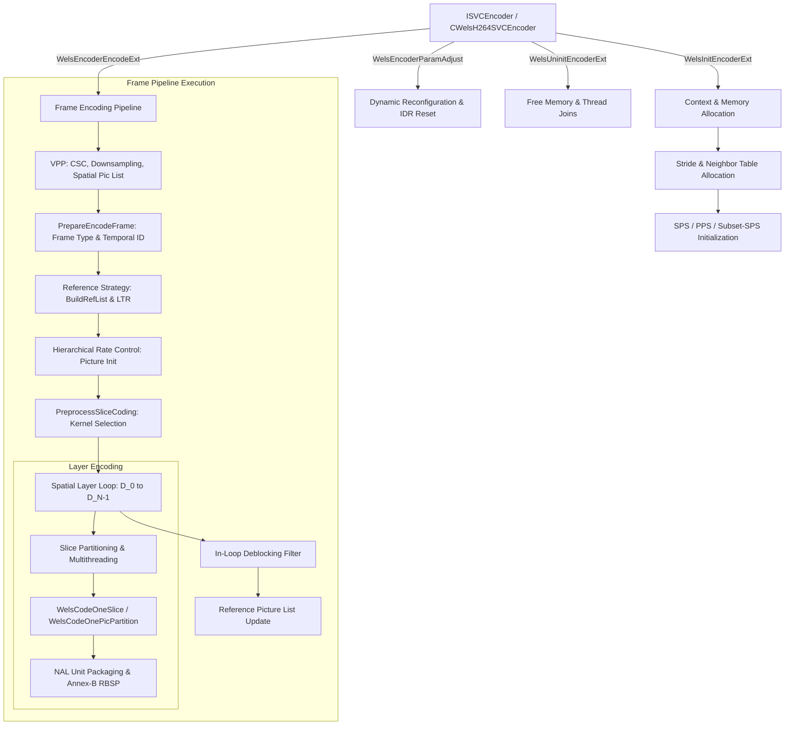

# OpenH264 Core Encoder: `encoder_ext.cpp` Implementation & Architectural Reference

This document delivers an in-depth, literate-programming-style technical analysis of [encoder_ext.cpp](openh264/codec/encoder/core/src/encoder_ext.cpp). It covers the high-level architectural role, data structure definitions, memory allocation and cache alignment, parameter validation algorithms, and the complete frame encoding execution pipeline for the OpenH264 Video Encoder.

---

## Table of Contents
1. [High-Level Module & Architectural Role](#1-high-level-module--architectural-role)
2. [Data Structures, Memory Layouts, & Enums](#2-data-structures-memory-layouts--enums)
3. [Comprehensive Function & Method Breakdown](#3-comprehensive-function--method-breakdown)
   - [3.1 Parameter Validation, Rate Control Bounds & Verification](#31-parameter-validation-rate-control-bounds--verification)
   - [3.2 Dynamic Parameter & Bitrate / Framerate / LTR Adjustment](#32-dynamic-parameter--bitrate--framerate--ltr-adjustment)
   - [3.3 Memory Lifecycle Management & Cache-Aligned Allocation](#33-memory-lifecycle-management--cache-aligned-allocation)
   - [3.4 Encoder Core Initialization & Teardown](#34-encoder-core-initialization--teardown)
   - [3.5 Spatial Layer, Slice Context & Neighbor Topology Setup](#35-spatial-layer-slice-context--neighbor-topology-setup)
   - [3.6 Function Pointer Dispatch, Screen Content & Preprocessing](#36-function-pointer-dispatch-screen-content--preprocessing)
   - [3.7 Parameter Sets, NAL Packaging & Header Generation](#37-parameter-sets-nal-packaging--header-generation)
   - [3.8 Frame-Level Encoding Execution Pipeline & Error Recovery](#38-frame-level-encoding-execution-pipeline--error-recovery)
4. [Algorithmic Formulas & Mathematical Models](#4-algorithmic-formulas--mathematical-models)

---

## 1. High-Level Module & Architectural Role

[encoder_ext.cpp](openh264/codec/encoder/core/src/encoder_ext.cpp) serves as the **central orchestrator and execution engine** of the OpenH264 encoder core (`codec/encoder/core/`). Positioned directly beneath the public C++ API wrapper ([welsEncoderExt.cpp](openh264/codec/encoder/plus/src/welsEncoderExt.cpp)), it acts as the bridge connecting high-level configuration parameters with low-level motion estimation, mode decision, entropy encoding, reconstruction, and hardware SIMD kernels.



### Core Responsibilities
1. **Configuration Validation & Sanitization**: Validates user configuration parameters ([SWelsSvcCodingParam](openh264/codec/encoder/core/inc/param_svc.h)), checking bitrate constraints, H.264 profile/level limits, spatial layer resolutions, slice modes, and multithreading compatibility.
2. **Aligned Memory Allocation & Pool Management**: Dynamically provisions SIMD-aligned pixel buffers, macroblock metadata pools, bitstream output buffers, and stride lookup tables via [CMemoryAlign](openh264/codec/common/inc/memory_align.h).
3. **Multi-Layer Spatial & Temporal Coordination**: Drives Scalable Video Coding (SVC) spatial dependency layers ($D_0 \dots D_{N-1}$) and hierarchical temporal layers ($T_0 \dots T_{M-1}$), supporting both SVC layered coding and Simulcast AVC.
4. **Slice Slicing & Multithreading Strategy**: Configures slice boundaries for `SM_SINGLE_SLICE`, `SM_FIXEDSLCNUM_SLICE`, `SM_RASTER_SLICE`, and `SM_SIZELIMITED_SLICE` (dynamic MTU size-limited slicing), managing task dispatch across worker threads.
5. **Bitstream Packaging & NAL Serialization**: Encapsulates Raw Byte Sequence Payloads (RBSP) into Annex B NAL units (SPS, PPS, Subset-SPS, IDR slices, non-IDR slices, Prefix NALs, and Filler Data padding).
6. **Error Concealment & Dynamic Recovery**: Manages IDR keyframe forcing ([ForceCodingIDR](openh264/codec/encoder/core/src/encoder_ext.cpp#L3046)), reference list repair, dynamic slice buffer reallocation ([DynSliceRealloc](openh264/codec/encoder/core/src/encoder_ext.cpp#L4525)), and state rollback upon frame dropping ([StackBackEncoderStatus](openh264/codec/encoder/core/src/encoder_ext.cpp#L3341)).

---

## 2. Data Structures, Memory Layouts, & Enums

[encoder_ext.cpp](openh264/codec/encoder/core/src/encoder_ext.cpp) allocates and manages the state of several core encoder data structures:

### 2.1 [sWelsEncCtx](openh264/codec/encoder/core/inc/encoder_context.h#L116) (Encoder Context)
The primary state container representing an OpenH264 encoder instance.

| Field Name | Type | Description |
| :--- | :--- | :--- |
| `pSvcParam` | [SWelsSvcCodingParam*](openh264/codec/encoder/core/inc/param_svc.h#L274) | Pointer to active SVC coding parameter configuration. |
| `pMemAlign` | [CMemoryAlign*](openh264/codec/common/inc/memory_align.h) | Aligned memory allocator (16-byte or 32-byte cache line alignment). |
| `ppDqLayerList` | [SDqLayer**](openh264/codec/encoder/core/inc/encoder_context.h#L104) | Array of spatial dependency layer contexts (`MAX_DEPENDENCY_LAYER`). |
| `pCurDqLayer` | [SDqLayer*](openh264/codec/encoder/core/inc/encoder_context.h#L104) | Pointer to the active spatial dependency layer being encoded. |
| `ppRefPicListExt`| [SRefList**](openh264/codec/encoder/core/inc/picture.h) | Reference picture pool arrays per dependency layer. |
| `pStrideTab` | [SStrideTables*](openh264/codec/encoder/core/inc/encoder_context.h) | Cache-aligned stride and macroblock XY coordinate lookup tables. |
| `pOut` | [SWelsEncoderOutput*](openh264/codec/encoder/core/inc/encoder_context.h) | Bitstream output writer, raw NAL lists, and NAL length arrays. |
| `pFrameBs` | `uint8_t*` | Continuous memory buffer storing encoded Annex-B frame bitstream. |
| `pDynamicBsBuffer`| `uint8_t*[MAX_THREADS_NUM]` | Temporary slice bitstream buffers for dynamic slicing with CABAC. |
| `pFuncList` | [SWelsFuncPtrList*](openh264/codec/encoder/core/inc/encoder_context.h) | Dynamically populated table of C/SIMD function pointers. |
| `pWelsSvcRc` | [SWelsSvcRc*](openh264/codec/encoder/core/inc/rc.h) | Array of Rate Control state machines per spatial layer. |
| `pVpp` | [CWelsPreProcess*](openh264/codec/encoder/core/inc/wels_preprocess.h) | Video pre-processing module (color space conversion, spatial scaling). |
| `pVaa` | [SVAAFrameInfo*](openh264/codec/encoder/core/inc/wels_preprocess.h) | Video Adaptive Analysis frame statistics (SAD, SSD, background flags). |
| `pLtr` | [SLTRState*](openh264/codec/encoder/core/inc/encoder_context.h#L80) | Long-Term Reference state machines per dependency layer. |
| `pReferenceStrategy`| [IWelsReferenceStrategy*](openh264/codec/encoder/core/inc/ref_list_mgr_svc.h) | Reference frame list construction and marking strategy engine. |

---

### 2.2 [SDqLayer](openh264/codec/encoder/core/inc/encoder_context.h#L104) (Dependency Quality Layer)
Encapsulates all macroblock records, slice contexts, and parameters for a single spatial layer.

- **Macroblock Array (`sMbDataP`)**: Array of [SMB](openh264/codec/encoder/core/inc/mb_cache.h) structures representing macroblocks in raster scan order ($W_{\text{mb}} \times H_{\text{mb}}$).
- **Motion Vector & Ref Block Pools**:
  - `pLayerMvUnitBlock4x4`: Inter-prediction motion vectors for all 4x4 sub-blocks ($16 \text{ blocks/MB} \times 2 \text{ lists}$).
  - `pLayerRefIndexBlock8x8`: Reference indices for 8x8 partitions ($4 \text{ blocks/MB}$).
  - `pSadCostMb`: Minimum SAD distortion cost per macroblock.
  - `pIntra4x4PredModeBlocks`: Array of intra 4x4 prediction mode indices ($16 \text{ modes/MB}$).
  - `pNonZeroCountBlocks`: Non-zero transform coefficient counts per 4x4 block ($24 \text{ blocks/MB}$ for YUV 4:2:0).
- **Slice Execution Context (`sSliceEncCtx`)**: Manages slice splitting boundaries, partition boundaries (`FirstMbIdxOfPartition`, `EndMbIdxOfPartition`), and macroblock-to-slice map (`pOverallMbMap`).

---

### 2.3 [SStrideTables](openh264/codec/encoder/core/inc/encoder_context.h) (Stride and Coordinate Lookup)
To eliminate runtime multiplications and modulo arithmetic during macroblock raster loops, [AllocStrideTables](openh264/codec/encoder/core/src/encoder_ext.cpp#L1224) allocates contiguous lookup tables:

- `pMbIndexX[iSpatialIdx]`: Array mapping MB index $i \mapsto X_{\text{mb}}$ coordinate ($0 \le X_{\text{mb}} < W_{\text{mb}}$).
- `pMbIndexY[iSpatialIdx]`: Array mapping MB index $i \mapsto Y_{\text{mb}}$ coordinate ($0 \le Y_{\text{mb}} < H_{\text{mb}}$).
- `pStrideEncBlockOffset[iSpatialIdx]`: 24-entry array containing planar memory byte offsets for the 16 luma 4x4 blocks, 4 Cb 4x4 blocks, and 4 Cr 4x4 blocks.
- `pStrideDecBlockOffset[iSpatialIdx][bBaseTemporal]`: Planar memory byte offsets for decoded reconstruction blocks.

---

## 3. Comprehensive Function & Method Breakdown

### 3.1 Parameter Validation, Rate Control Bounds & Verification

#### [WelsBitRateVerification](openh264/codec/encoder/core/src/encoder_ext.cpp#L73-L124)
```cpp
int32_t WelsBitRateVerification (SLogContext* pLogCtx, SSpatialLayerConfig* pLayerParam, int32_t iLayerId);
```
- **Purpose**: Verifies and adjusts target bitrate (`iSpatialBitrate`) and maximum bitrate (`iMaxSpatialBitrate`) against H.264 level limits ([g_ksLevelLimits](openh264/codec/encoder/core/inc/param_svc.h)).
- **Algorithmic Logic**:
  1. Checks that `iSpatialBitrate > 0` and $\text{iSpatialBitrate} \ge \text{fFrameRate}$.
  2. Queries level limits for `uiLevelIdc` to compute maximum allowable bit-rate:
     $$\text{iLevelMaxBitrate} = \text{uiMaxBR} \times \text{CpbBrNalFactor}$$
  3. If `iMaxSpatialBitrate` exceeds level limits, invokes [WelsAdjustLevel](openh264/codec/encoder/core/inc/param_svc.h) to promote `uiLevelIdc`.
  4. Ensures `iMaxSpatialBitrate >= iSpatialBitrate`.

---

#### [CheckProfileSetting](openh264/codec/encoder/core/src/encoder_ext.cpp#L126-L150)
```cpp
void CheckProfileSetting (SLogContext* pLogCtx, SWelsSvcCodingParam* pParam, int32_t iLayer, EProfileIdc uiProfileIdc);
```
- **Purpose**: Validates profile IDC settings per layer. In AVC simulcast or base layer ($D_0$), verifies compatibility with `PRO_BASELINE`, `PRO_MAIN`, or `PRO_HIGH`. For SVC enhancement layers ($D > 0$), constrains profiles to `PRO_SCALABLE_BASELINE` or `PRO_SCALABLE_HIGH`.

---

#### [CheckLevelSetting](openh264/codec/encoder/core/src/encoder_ext.cpp#L151-L162)
```cpp
void CheckLevelSetting (SLogContext* pLogCtx, SWelsSvcCodingParam* pParam, int32_t iLayer, ELevelIdc uiLevelIdc);
```
- **Purpose**: Verifies that the requested level IDC exists in [g_ksLevelLimits](openh264/codec/encoder/core/inc/param_svc.h). If not recognized, resets to `LEVEL_UNKNOWN`.

---

#### [CheckReferenceNumSetting](openh264/codec/encoder/core/src/encoder_ext.cpp#L163-L172)
```cpp
void CheckReferenceNumSetting (SLogContext* pLogCtx, SWelsSvcCodingParam* pParam, int32_t iNumRef);
```
- **Purpose**: Clamps the reference picture count between `MIN_REF_PIC_COUNT` (1) and `MAX_REFERENCE_PICTURE_COUNT_NUM_CAMERA` (16) or `MAX_REFERENCE_PICTURE_COUNT_NUM_SCREEN` (4). Falls back to `AUTO_REF_PIC_COUNT` if invalid.

---

#### [SliceArgumentValidationFixedSliceMode](openh264/codec/encoder/core/src/encoder_ext.cpp#L174-L256)
```cpp
int32_t SliceArgumentValidationFixedSliceMode (SLogContext* pLogCtx, SSliceArgument* pSliceArgument,
                                              const RC_MODES kiRCMode, const int32_t kiPicWidth,
                                              const int32_t kiPicHeight);
```
- **Purpose**: Validates slice configuration for `SM_FIXEDSLCNUM_SLICE` mode.
- **Key Logic**:
  - Automatically queries CPU core count via [WelsCPUFeatureDetect](openh264/codec/common/inc/cpu.h) if `uiSliceNum == 0`.
  - If total frame macroblocks $N_{\text{mb}} \le \text{MIN\_NUM\_MB\_PER\_SLICE}$ (8), falls back to `SM_SINGLE_SLICE`.
  - Validates slice counts and macroblock counts per slice against Group of Macroblocks (GOM) rate control constraints via [GomValidCheckSliceNum](openh264/codec/encoder/core/inc/rc.h) and [GomValidCheckSliceMbNum](openh264/codec/encoder/core/inc/rc.h).

---

#### [ParamValidation](openh264/codec/encoder/core/src/encoder_ext.cpp#L264-L400) & [ParamValidationExt](openh264/codec/encoder/core/src/encoder_ext.cpp#L403-L669)
```cpp
int32_t ParamValidation (SLogContext* pLogCtx, SWelsSvcCodingParam* pCfg);
int32_t ParamValidationExt (SLogContext* pLogCtx, SWelsSvcCodingParam* pCodingParam);
```
- **Purpose**: Comprehensive validation barrier for all encoder parameters before memory allocation or execution begins.
- **Validation Checks**:
  1. **Content Type**: Verifies `iUsageType` is `CAMERA_VIDEO_REAL_TIME` or `SCREEN_CONTENT_REAL_TIME`.
  2. **Layer Resolution Hierarchies**: Ensures spatial layer dimensions are monotonically non-decreasing ($W_{i} \le W_{i+1}$, $H_{i} \le H_{i+1}$) and integer multiples of 16 (macroblock aligned).
  3. **Temporal & GOP Constraints**: Verifies $1 \le \text{iTemporalLayerNum} \le \text{MAX\_TEMPORAL\_LEVEL}$ and $\text{uiIntraPeriod}$ is a multiple of $\text{uiGopSize}$ (or $-1$).
  4. **Framerate Validation**: Confirms output framerates satisfy $f_{\text{out}} / f_{\text{in}} = 2^{-n}$ powers of 2.
  5. **Slice Mode Parameters**:
     - `SM_SIZELIMITED_SLICE`: Verifies `uiSliceSizeConstraint` $> \text{MAX\_MACROBLOCK\_SIZE\_IN\_BYTE}$ (600 bytes) and accounts for NAL header overhead (`NAL_HEADER_ADD_0X30BYTES`).
     - `SM_RASTER_SLICE`: Validates macroblock count assignments per raster slice row.
  6. **Entropy Coding & Profile Consistency**: Forces `iEntropyCodingModeFlag = 0` (CAVLC) if profile is `PRO_BASELINE` or `PRO_SCALABLE_BASELINE`. Sets profile to `PRO_HIGH` if CABAC is enabled on AVC base layer.

---

### 3.2 Dynamic Parameter & Bitrate / Framerate / LTR Adjustment

#### [WelsEncoderApplyFrameRate](openh264/codec/encoder/core/src/encoder_ext.cpp#L672-L697)
```cpp
void WelsEncoderApplyFrameRate (SWelsSvcCodingParam* pParam);
```
- **Purpose**: Dynamically adjusts input and output frame rates across all spatial dependency layers when the top-level `fMaxFrameRate` is updated at runtime.

---

#### [WelsEncoderApplyBitRate](openh264/codec/encoder/core/src/encoder_ext.cpp#L699-L725)
```cpp
int32_t WelsEncoderApplyBitRate (SLogContext* pLogCtx, SWelsSvcCodingParam* pParam, int iLayer);
```
- **Purpose**: Re-proportions layer bitrates when `iTargetBitrate` changes. If `iLayer == SPATIAL_LAYER_ALL`, scales each spatial layer's bitrate proportionally to its previous share:
  $$\text{Ratio}_i = \frac{\text{iSpatialBitrate}_i}{\sum_k \text{iSpatialBitrate}_k}, \quad \text{iSpatialBitrate}_i' = \lfloor \text{iTargetBitrate} \times \text{Ratio}_i \rfloor$$

---

#### [WelsEncoderApplyLTR](openh264/codec/encoder/core/src/encoder_ext.cpp#L4479-L4523)
```cpp
int32_t WelsEncoderApplyLTR (SLogContext* pLogCtx, sWelsEncCtx** ppCtx, SLTRConfig* pLTRValue);
```
- **Purpose**: Configures Long-Term Reference (LTR) parameters dynamically. Adjusts `iLTRRefNum`, computes required DPB reference capacity $N_{\text{ref}}$, and invokes [WelsEncoderParamAdjust](openh264/codec/encoder/core/src/encoder_ext.cpp#L4182).

---

#### [WelsEncoderParamAdjust](openh264/codec/encoder/core/src/encoder_ext.cpp#L4182-L4477)
```cpp
int32_t WelsEncoderParamAdjust (sWelsEncCtx** ppCtx, SWelsSvcCodingParam* pNewParam);
```
- **Purpose**: Evaluates runtime configuration updates. Distinguishes between **minor parameter updates** (which can be applied in-place without reallocating memory) and **major parameter changes** (which require full context reset and IDR refresh).
- **Reset Trigger Conditions (`bNeedReset = true`)**:
  - Changes in `bSimulcastAVC`, `iSpatialLayerNum`, frame resolutions ($W, H$), slice modes/counts, LTR enabled status, threading count (`iMultipleThreadIdc`), adaptive quantization, background detection, or SPS/PPS ID strategies.
- **State Preservation Across Reset**: Preserves existing SPS/PPS structures via [SExistingParasetList](openh264/codec/encoder/core/inc/param_svc.h), preserves IDR picture counts (`uiIdrPicId`), and preserves running encoder statistics ([SEncoderStatistics](openh264/codec/api/wels/codec_app_def.h)).

---

### 3.3 Memory Lifecycle Management & Cache-Aligned Allocation

#### [AcquireLayersNals](openh264/codec/encoder/core/src/encoder_ext.cpp#L749-L833)
```cpp
int32_t AcquireLayersNals (sWelsEncCtx** ppCtx, SWelsSvcCodingParam* pParam, int32_t* pCountLayers, int32_t* pCountNals);
```
- **Purpose**: Computes exact upper bounds for the total number of NAL units and layers required across an access unit.
- **Calculations**:
  - Accounts for VCL slice NALs per spatial layer, Prefix NALs for SVC enhancement layers, parameter set NALs (SPS, PPS, Subset-SPS), and SEI buffers.

---

#### [InitMbInfo](openh264/codec/encoder/core/src/encoder_ext.cpp#L835-L904) & [InitMbListD](openh264/codec/encoder/core/src/encoder_ext.cpp#L907-L940)
```cpp
static void InitMbInfo (sWelsEncCtx* pEnc, SMB* pList, SDqLayer* pLayer, const int32_t kiDlayerId, const int32_t kiMaxMbNum);
int32_t InitMbListD (sWelsEncCtx** ppCtx);
```
- **Purpose**: Allocates and initializes the macroblock metadata arrays (`SMB`) for each spatial dependency layer.
- **Topology Pre-Calculation**:
  - Computes spatial neighbor availability bitmasks (`uiNeighborAvail`) for every macroblock in the frame:
    $$\text{uiNeighborAvail} = (\text{LEFT\_MB\_POS}) \mid (\text{TOP\_MB\_POS}) \mid (\text{TOPLEFT\_MB\_POS}) \mid (\text{TOPRIGHT\_MB\_POS})$$
  - Binds macroblock pointer members to pre-allocated SIMD buffer pools (`sMv`, `pRefIndex`, `pSadCost`, `pIntra4x4PredMode`, `pNonZeroCount`).

---

#### [AllocStrideTables](openh264/codec/encoder/core/src/encoder_ext.cpp#L1224-L1477)
```cpp
int32_t AllocStrideTables (sWelsEncCtx** ppCtx, const int32_t kiNumSpatialLayers);
```
- **Purpose**: Allocates and populates aligned 2D macroblock index tables (`pMbIndexX`, `pMbIndexY`) and 4x4 block pixel stride offset tables (`pStrideEncBlockOffset`, `pStrideDecBlockOffset`).
- **SIMD Optimization**: Populates the $Y$-index tables using 64-bit vector stores (`LD64` / `ST64`) to eliminate coordinate calculation overhead during macroblock encoding loops.

---

#### [RequestMemorySvc](openh264/codec/encoder/core/src/encoder_ext.cpp#L1533-L1796) & [FreeMemorySvc](openh264/codec/encoder/core/src/encoder_ext.cpp#L1804-L2016)
```cpp
int32_t RequestMemorySvc (sWelsEncCtx** ppCtx, SExistingParasetList* pExistingParasetList);
void FreeMemorySvc (sWelsEncCtx** ppCtx);
```
- **Purpose**: Central memory allocator and deallocator for the SVC encoder core.
- **Allocated Subsystems**:
  1. Output bitstream buffers (`pBsBuffer`, `pFrameBs`, `sNalList`, `pNalLen`).
  2. Multi-thread slice buffers and dynamic CABAC buffers (`pDynamicBsBuffer`).
  3. Motion estimation vector arrays (`pMvUnitBlock4x4`) and MVD cost lookup table (`pMvdCostTable`).
  4. Video Adaptive Analysis buffers (`pVaa`, `sad8x8`, `pSsd16x16`, `pSum16x16`).
  5. Rate control module context (`pWelsSvcRc`).
  6. Spatial dependency layers (`ppDqLayerList`) and reference picture pools (`ppRefPicListExt`).

---

### 3.4 Encoder Core Initialization & Teardown

#### [WelsInitEncoderExt](openh264/codec/encoder/core/src/encoder_ext.cpp#L2290-L2389)
```cpp
int32_t WelsInitEncoderExt (sWelsEncCtx** ppCtx, SWelsSvcCodingParam* pCodingParam, SLogContext* pLogCtx,
                            SExistingParasetList* pExistingParasetList);
```
- **Purpose**: Top-level C core entry point to instantiate and initialize the entire OpenH264 encoder engine.
- **Execution Flow**:
  1. Validates coding parameters via [ParamValidationExt](openh264/codec/encoder/core/src/encoder_ext.cpp#L403).
  2. Resolves temporal scalability hierarchy via `DetermineTemporalSettings()`.
  3. Detects CPU capabilities via [GetMultipleThreadIdc](openh264/codec/encoder/core/src/encoder_ext.cpp#L2199).
  4. Instantiates [CMemoryAlign](openh264/codec/common/inc/memory_align.h) and allocates [sWelsEncCtx](openh264/codec/encoder/core/inc/encoder_context.h).
  5. Dynamically binds SIMD and C function pointers via `InitFunctionPointers()`.
  6. Allocates internal memory pools via [RequestMemorySvc](openh264/codec/encoder/core/src/encoder_ext.cpp#L1533).
  7. Initializes CABAC engine ([WelsCabacInit](openh264/codec/encoder/core/inc/set_mb_syn_cabac.h)), Rate Control ([WelsRcInitModule](openh264/codec/encoder/core/inc/rc.h)), and Pre-processing ([CWelsPreProcess](openh264/codec/encoder/core/inc/wels_preprocess.h)).

---

#### [WelsUninitEncoderExt](openh264/codec/encoder/core/src/encoder_ext.cpp#L2246-L2283)
```cpp
void WelsUninitEncoderExt (sWelsEncCtx** ppCtx);
```
- **Purpose**: Gracefully shuts down the encoder instance. Joins and terminates all slice worker threads (`WelsThreadJoin`), releases pre-processing picture buffers, deallocates all memory pools via [FreeMemorySvc](openh264/codec/encoder/core/src/encoder_ext.cpp#L1804), and frees the context pointer.

---

### 3.5 Spatial Layer, Slice Context & Neighbor Topology Setup

#### [WelsInitCurrentLayer](openh264/codec/encoder/core/src/encoder_ext.cpp#L2534-L2621)
```cpp
void WelsInitCurrentLayer (sWelsEncCtx* pCtx, const int32_t kiWidth, const int32_t kiHeight);
```
- **Purpose**: Prepares the active spatial dependency layer (`pCurDqLayer`) prior to encoding the current picture.
- **Key Operations**:
  - Binds active SPS and PPS structures (`pSpsP`, `pPpsP`, `pSubsetSpsP`).
  - Initializes NAL header extension parameters (`uiDependencyId`, `uiTemporalId`, `bIdrFlag`, `uiNalRefIdc`).
  - Sets source pixel plane pointers (`pEncData[0..2]`, `iEncStride[0..2]`) and reconstruction plane pointers (`pCsData[0..2]`, `iCsStride[0..2]`).

---

#### [UpdateSlicepEncCtxWithPartition](openh264/codec/encoder/core/src/encoder_ext.cpp#L2430-L2480)
```cpp
void UpdateSlicepEncCtxWithPartition (SDqLayer* pCurDq, int32_t iPartitionNum);
```
- **Purpose**: Subdivides frame macroblocks into $N$ balanced partitions for dynamic size-limited slicing (`SM_SIZELIMITED_SLICE`), setting `FirstMbIdxOfPartition` and `EndMbIdxOfPartition` per partition thread.

---

### 3.6 Function Pointer Dispatch, Screen Content & Preprocessing

#### [PreprocessSliceCoding](openh264/codec/encoder/core/src/encoder_ext.cpp#L2665-L2791)
```cpp
void PreprocessSliceCoding (sWelsEncCtx* pCtx);
```
- **Purpose**: Dynamically configures the function pointer table ([SWelsFuncPtrList](openh264/codec/encoder/core/inc/encoder_context.h)) for the current frame slice based on content type, slice type, and complexity mode.
- **Kernel Dispatch Matrix**:
  - **Fast Mode (`LOW_COMPLEXITY`)**: Selects SAD-based mode decision ([SetFastCodingFunc](openh264/codec/encoder/core/src/encoder_ext.cpp#L2623)), bypassing SATD calculation.
  - **Normal Mode**: Selects SATD/Hadamard distortion transforms ([SetNormalCodingFunc](openh264/codec/encoder/core/src/encoder_ext.cpp#L2629)).
  - **Screen Content (`SCREEN_CONTENT_REAL_TIME`)**: Enables scroll motion detection, static block detection (`WelsMotionEstimateSearchStatic`), and Feature-based Fast Motion Estimation (`ME_DIA_CROSS_FME`).

---

### 3.7 Parameter Sets, NAL Packaging & Header Generation

#### [WelsWriteParameterSets](openh264/codec/encoder/core/src/encoder_ext.cpp#L2874-L2952)
```cpp
int32_t WelsWriteParameterSets (sWelsEncCtx* pCtx, int32_t* pNalLen, int32_t* pNumNal, int32_t* pTotalLength);
```
- **Purpose**: Serializes all active Sequence Parameter Sets (SPS), Subset Sequence Parameter Sets (Subset-SPS for SVC), and Picture Parameter Sets (PPS) into the output bitstream buffer.

---

#### [AddPrefixNal](openh264/codec/encoder/core/src/encoder_ext.cpp#L2954-L3001)
```cpp
static inline int32_t AddPrefixNal (sWelsEncCtx* pCtx, SLayerBSInfo* pLayerBsInfo, int32_t* pNalLen,
                                    int32_t* pNalIdxInLayer, const EWelsNalUnitType keNalType,
                                    const EWelsNalRefIdc keNalRefIdc, int32_t& iPayloadSize);
```
- **Purpose**: Injects SVC Prefix NAL units (`NAL_UNIT_PREFIX`, type 14) before base layer slices to convey SVC scalability extension header metadata (`dependency_id`, `temporal_id`, `quality_id`, `idr_flag`) to downstream decoders.

---

#### [WritePadding](openh264/codec/encoder/core/src/encoder_ext.cpp#L3003-L3041)
```cpp
int32_t WritePadding (sWelsEncCtx* pCtx, int32_t iLen, int32_t& iSize);
```
- **Purpose**: Generates H.264 Filler Data NAL units (`NAL_UNIT_FILLER_DATA`, type 12) containing `0xFF` payload bytes to satisfy minimum CBR bitrate padding requirements specified by Rate Control.

---

### 3.8 Frame-Level Encoding Execution Pipeline & Error Recovery

#### [WelsEncoderEncodeExt](openh264/codec/encoder/core/src/encoder_ext.cpp#L3448-L4176)
```cpp
int32_t WelsEncoderEncodeExt (sWelsEncCtx* pCtx, SFrameBSInfo* pFbi, const SSourcePicture* pSrcPic);
```
- **Purpose**: The **primary per-frame execution entry point** of the OpenH264 video encoder core.
- **Complete Execution Walkthrough**:
  1. **Pre-processing (VPP)**: Calls [BuildSpatialPicList](openh264/codec/encoder/core/inc/wels_preprocess.h) to perform color space conversion (e.g. RGB/YUY2 to YUV420P) and spatial downsampling to populate input picture buffers across all dependency layers.
  2. **Frame Decision**: Invokes [PrepareEncodeFrame](openh264/codec/encoder/core/src/encoder_ext.cpp#L3387) to check rate control buffer fullness and assign frame type (`videoFrameTypeIDR`, `videoFrameTypeP`, or `videoFrameTypeSkip`).
  3. **Spatial Layer Loop**: Iterates through each active spatial layer ($i_{\text{spatial}} = 0 \dots N-1$):
     - Analyzes spatial picture complexity via VAA ([AnalyzeSpatialPic](openh264/codec/encoder/core/inc/wels_preprocess.h)).
     - Builds reference picture lists (`BuildRefList()`).
     - Initializes Rate Control frame budget (`pfWelsRcPictureInit()`).
     - Selects encoding kernels via [PreprocessSliceCoding](openh264/codec/encoder/core/src/encoder_ext.cpp#L2665).
     - **Slice Execution**:
       - *Single Slice*: Encodes the layer with [WelsCodeOneSlice](openh264/codec/encoder/core/inc/svc_encode_slice.h).
       - *Dynamic Size-Limited Slice (Single Thread)*: Invokes [WelsCodeOnePicPartition](openh264/codec/encoder/core/src/encoder_ext.cpp#L4543).
       - *Multi-Threaded Slicing*: Dispatches slice encoding jobs to worker threads via [WelsThreadPool](openh264/codec/common/inc/WelsThreadPool.h) / [pTaskManage->ExecuteTasks()](openh264/codec/encoder/core/inc/wels_task_management.h).
     - **Post-Frame Rate Control & Skipping**: If the frame exceeds bit budget limits, triggers post-frame skip rollback via [StackBackEncoderStatus](openh264/codec/encoder/core/src/encoder_ext.cpp#L3341).
     - **Deblocking Filter**: Executes [PerformDeblockingFilter](openh264/codec/encoder/core/inc/deblocking.h) to filter reconstructed reference pictures.
     - **Reference Update**: Updates DPB reference picture marking via `UpdateRefList()`.
     - **PSNR Calculation**: Computes optional luma/chroma PSNR values ([WelsCalcPsnr](openh264/codec/encoder/core/src/encoder_ext.cpp#L3928)).

---

#### [ForceCodingIDR](openh264/codec/encoder/core/src/encoder_ext.cpp#L3046-L3079)
```cpp
int32_t ForceCodingIDR (sWelsEncCtx* pCtx, int32_t iLayerId);
```
- **Purpose**: Forces the next incoming frame to be encoded as an IDR keyframe (intra refresh). Resets `iCodingIndex`, `iFrameIndex`, `iFrameNum`, and `iPOC` to 0, and sets `bEncCurFrmAsIdrFlag = true`.

---

#### [StackBackEncoderStatus](openh264/codec/encoder/core/src/encoder_ext.cpp#L3341-L3374)
```cpp
void StackBackEncoderStatus (sWelsEncCtx* pEncCtx, EVideoFrameType keFrameType);
```
- **Purpose**: Rolls back encoder internal sequence state when Rate Control decides to drop/skip a frame post-encoding. Reverts `iFrameIndex`, decrements `iPOC` by 2, and restores frame number counters via [LoadBackFrameNum](openh264/codec/encoder/core/inc/ref_list_mgr_svc.h).

---

## 4. Algorithmic Formulas & Mathematical Models

### 4.1 Layer Buffer Size Estimation
To guarantee that bitstream buffers never overflow during worst-case intra-frame coding, [RequestMemorySvc](openh264/codec/encoder/core/src/encoder_ext.cpp#L1533) calculates maximum layer buffer bounds:

$$\text{LayerBsSize} = \text{ALIGN}_4 \left( \left\lfloor \left( \frac{3 \cdot W \cdot H}{2} \right) \cdot \text{COMPRESS\_RATIO\_THR} \right\rfloor + \text{MAX\_MACROBLOCK\_SIZE\_IN\_BYTE\_x2} \right)$$

where $\text{COMPRESS\_RATIO\_THR} = 0.5$, and $\text{MAX\_MACROBLOCK\_SIZE\_IN\_BYTE\_x2} = 1200\text{ bytes}$.

---

### 4.2 Temporal Level Calculation
Temporal layer identification ($T_{\text{id}}$) is derived from the GOP coding index:

$$\text{CodingIdx} = \text{FrameNum} \pmod{\text{GopSize}}$$
$$\text{TemporalId} = \text{uiCodingIdx2TemporalId}[\text{CodingIdx}]$$

---

### 4.3 Peak Signal-to-Noise Ratio (PSNR)
Reconstruction distortion is measured against original input planes via [WelsCalcPsnr](openh264/codec/encoder/core/src/encoder_ext.cpp#L3928):

$$\text{MSE} = \frac{1}{W \cdot H} \sum_{x=0}^{W-1} \sum_{y=0}^{H-1} \left( I_{\text{rec}}(x,y) - I_{\text{orig}}(x,y) \right)^2$$

$$\text{PSNR (dB)} = 10 \cdot \log_{10} \left( \frac{255^2}{\text{MSE}} \right)$$

---

## Summary of Key File Dependencies

- Core Context: [encoder_context.h](openh264/codec/encoder/core/inc/encoder_context.h)
- Configuration: [param_svc.h](openh264/codec/encoder/core/inc/param_svc.h)
- Public C++ Wrapper: [welsEncoderExt.cpp](openh264/codec/encoder/plus/src/welsEncoderExt.cpp)
- Slice Encoding: [svc_encode_slice.cpp](openh264/codec/encoder/core/src/svc_encode_slice.cpp)
- Preprocessing: [wels_preprocess.cpp](openh264/codec/encoder/core/src/wels_preprocess.cpp)
- Rate Control: [ratectl.cpp](openh264/codec/encoder/core/src/ratectl.cpp)
