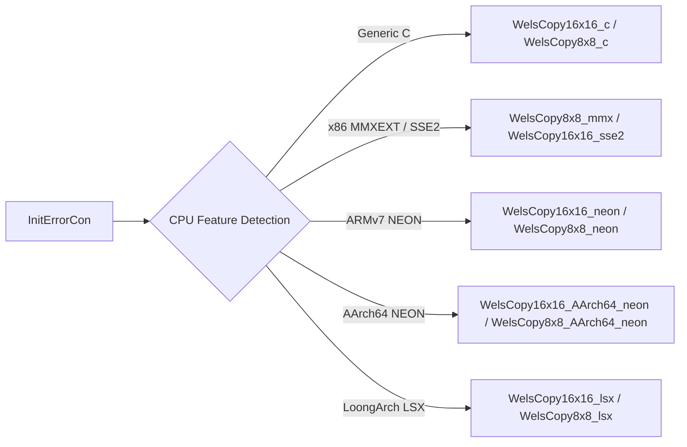
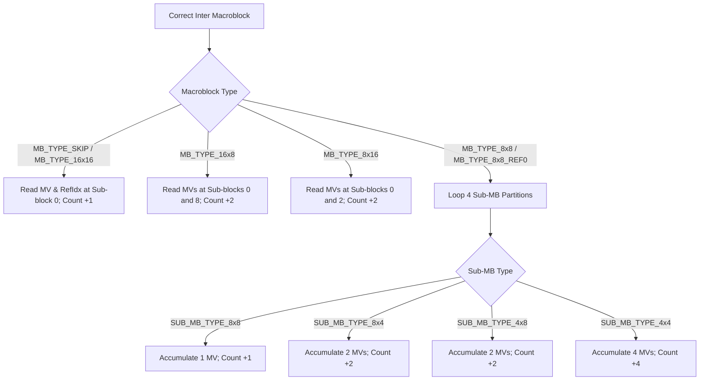
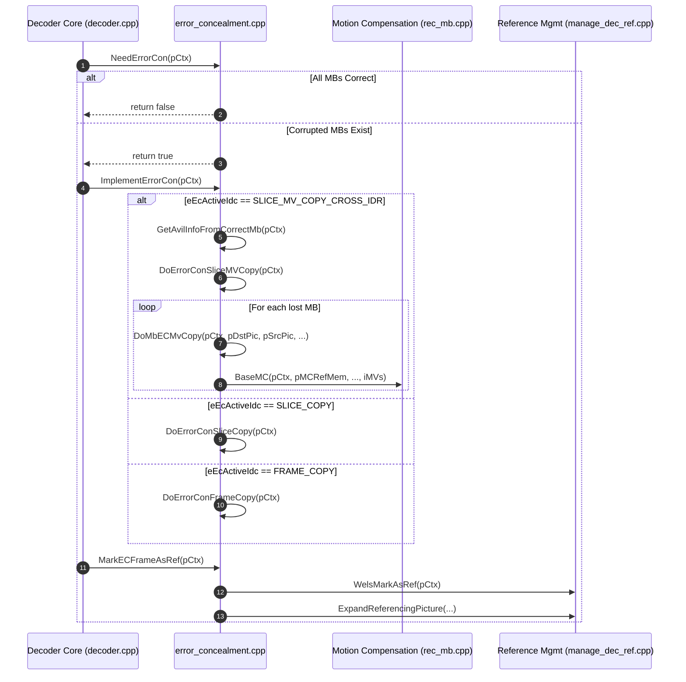

# OpenH264 Decoder: Error Concealment Engine (`error_concealment.cpp`)

This document provides an exhaustive, literate-programming-style technical breakdown of the error concealment and resilience subsystem implemented in [`codec/decoder/core/src/error_concealment.cpp`](openh264/codec/decoder/core/src/error_concealment.cpp) and declared in [`codec/decoder/core/inc/error_concealment.h`](openh264/codec/decoder/core/inc/error_concealment.h).

---

## Table of Contents
1. [Architectural Overview & Module Purpose](#1-architectural-overview--module-purpose)
2. [Data Structures, Enums, and Context State](#2-data-structures-enums-and-context-state)
3. [SIMD Copy Function Dispatch & Hardware Acceleration](#3-simd-copy-function-dispatch--hardware-acceleration)
4. [Detailed Function & Algorithm Analysis](#4-detailed-function--algorithm-analysis)
   - [4.1 `InitErrorCon`](#41-initerrorcon)
   - [4.2 `NeedErrorCon`](#42-neederrorcon)
   - [4.3 `DoErrorConFrameCopy`](#43-doerrorconframecopy)
   - [4.4 `DoErrorConSliceCopy`](#44-doerrorconslicecopy)
   - [4.5 `GetAvilInfoFromCorrectMb`](#45-getavilinfofromcorrectmb)
   - [4.6 `DoMbECMvCopy`](#46-dombecmvcopy)
   - [4.7 `DoErrorConSliceMVCopy`](#47-doerrorconslicemvcopy)
   - [4.8 `MarkECFrameAsRef`](#48-markecframeasref)
   - [4.9 `ImplementErrorCon`](#49-implementerrorcon)
5. [Data Flow, Call Graph & Execution Hierarchy](#5-data-flow-call-graph--execution-hierarchy)
6. [Mathematical Formulations](#6-mathematical-formulations)
7. [Edge Cases, Error Handling & Memory Safety](#7-edge-cases-error-handling--memory-safety)

---

## 1. Architectural Overview & Module Purpose

In real-time video transmission (such as WebRTC or RTSP video streaming), network packet loss, bit corruption, or transmission jitter frequently result in lost or incomplete NAL units and damaged macroblock slices. The primary responsibility of [`error_concealment.cpp`](openh264/codec/decoder/core/src/error_concealment.cpp) is to provide **spatial and temporal error concealment** to mask visual artifacts, prevent decoder crashes, and maintain decodability of subsequent P-frames without requiring an immediate Intra (IDR) refresh.

```mermaid
flowchart TD
    A[Damaged Bitstream / Slice Loss Detected] --> B{NeedErrorCon}
    B -- No Error (All MBs Decoded) --> C[Proceed to In-Loop Deblocking & DPB]
    B -- Corrupted MBs Found --> D[ImplementErrorCon]
    
    D --> E{eEcActiveIdc Mode Selection}
    
    E -- ERROR_CON_DISABLE --> F[Flag dsBitstreamError & Abort]
    E -- FRAME_COPY / CROSS_IDR --> G[DoErrorConFrameCopy]
    E -- SLICE_COPY / CROSS_IDR --> H[DoErrorConSliceCopy]
    E -- SLICE_MV_COPY_CROSS_IDR --> I[GetAvilInfoFromCorrectMb]
    I --> J[DoErrorConSliceMVCopy]
    
    G --> K[MarkECFrameAsRef]
    H --> K
    J --> K
    K --> L[ExpandReferencingPicture]
    L --> M[Update Decoded Picture Buffer (DPB)]
```

### Core Concealment Strategies Supported

1. **Frame Copy (`ERROR_CON_FRAME_COPY` / `ERROR_CON_FRAME_COPY_CROSS_IDR`)**:
   Entire-frame replacement where all luma ($Y$) and chroma ($U, V$) planes are copied verbatim from the most recent valid reference frame in the Decoded Picture Buffer (DPB). If no reference picture is available (e.g., first IDR lost without cross-IDR reference), the destination planes are initialized to neutral gray ($Y=U=V=128$).

2. **Slice-Level Pixel Copy (`ERROR_CON_SLICE_COPY` / `ERROR_CON_SLICE_COPY_CROSS_IDR`)**:
   Fine-grained macroblock-by-macroblock spatial replacement. Only the macroblocks that failed decoding (`!pMbCorrectlyDecodedFlag[iMbXy]`) are replaced with collocated $16\times 16$ luma and $8\times 8$ chroma pixel blocks from the previous reference picture. Correctly decoded macroblocks remain untouched.

3. **Slice-Level Motion-Compensated Vector Extrapolation (`ERROR_CON_SLICE_MV_COPY_CROSS_IDR`)**:
   Advanced temporal concealment for inter frames. Correctly decoded macroblocks in the current frame are scanned to derive an average motion vector per reference frame index. Lost macroblocks then undergo sub-pixel motion compensation (`BaseMC`) using the extrapolated motion vector scaled by the Picture Order Count ($\text{POC}$) temporal distance.

---

## 2. Data Structures, Enums, and Context State

### 2.1 Concealment Control Enum (`ERROR_CON_IDC`)

Defined in [`codec/api/wels/codec_app_def.h`](openh264/codec/api/wels/codec_app_def.h#L178-L186):

```cpp
typedef enum {
  ERROR_CON_DISABLE = 0,                               ///< Disable error concealment
  ERROR_CON_FRAME_COPY,                                ///< Frame-level copy from previous reference
  ERROR_CON_SLICE_COPY,                                ///< MB-level collocated pixel copy
  ERROR_CON_FRAME_COPY_CROSS_IDR,                      ///< Frame copy across IDR boundaries
  ERROR_CON_SLICE_COPY_CROSS_IDR,                      ///< Slice MB pixel copy across IDR boundaries
  ERROR_CON_SLICE_COPY_CROSS_IDR_FREEZE_RES_CHANGE,    ///< Slice copy across IDR with resolution freeze
  ERROR_CON_SLICE_MV_COPY_CROSS_IDR,                   ///< Motion vector extrapolation across IDR
  ERROR_CON_SLICE_MV_COPY_CROSS_IDR_FREEZE_RES_CHANGE  ///< MV extrapolation with resolution freeze
} ERROR_CON_IDC;
```

### 2.2 Motion Compensation Reference Member (`sMCRefMember`)

Defined in [`codec/decoder/core/inc/rec_mb.h`](openh264/codec/decoder/core/inc/rec_mb.h#L58-L75):

Encapsulates plane buffer pointers and line strides required by motion compensation routines (`BaseMC`) during temporal error concealment.

| Field | Type | Description |
| :--- | :--- | :--- |
| `pDstY` | `uint8_t*` | Pointer to target macroblock luma plane destination buffer |
| `pDstU` | `uint8_t*` | Pointer to target macroblock chroma Cb ($U$) destination buffer |
| `pDstV` | `uint8_t*` | Pointer to target macroblock chroma Cr ($V$) destination buffer |
| `pSrcY` | `uint8_t*` | Pointer to source reference picture luma plane buffer |
| `pSrcU` | `uint8_t*` | Pointer to source reference picture chroma Cb buffer |
| `pSrcV` | `uint8_t*` | Pointer to source reference picture chroma Cr buffer |
| `iSrcLineLuma` | `int32_t` | Byte stride (pitch) of source reference luma plane |
| `iSrcLineChroma` | `int32_t` | Byte stride of source reference chroma planes |
| `iDstLineLuma` | `int32_t` | Byte stride of target destination luma plane |
| `iDstLineChroma` | `int32_t` | Byte stride of target destination chroma planes |
| `iPicWidth` | `int32_t` | Frame width in pixels ($W = \text{iMbWidth} \times 16$) |
| `iPicHeight` | `int32_t` | Frame height in pixels ($H = \text{iMbHeight} \times 16$) |

### 2.3 Context State Variables (`SWelsDecoderContext`)

The decoder context (`PWelsDecoderContext` / [`SWelsDecoderContext`](openh264/codec/decoder/core/inc/decoder_context.h#L490-L520)) maintains internal state used by error concealment:

* `pCurDqLayer->pMbCorrectlyDecodedFlag`: Dynamic boolean array (`bool*`) indexed by macroblock raster address `iMbXyIndex = iMbY * iMbWidth + iMbX`. A value of `true` indicates the macroblock was successfully parsed and reconstructed; `false` marks it as damaged/missing.
* `pDec->iMbEcedNum`: Running accumulator tracking the total count of error-concealed macroblocks in the current frame.
* `iECMVs[16][2]`: Table of extrapolated average motion vectors per reference picture index (16 reference indices $\times$ 2 components $[MV_x, MV_y]$).
* `pECRefPic[16]`: Pointers to reference picture objects ([`PPicture`](openh264/codec/decoder/core/inc/picture.h)) associated with each active reference list index.
* `sCopyFunc`: Copy function pointer table (`pCopyLumaFunc`, `pCopyChromaFunc`) populated by SIMD initialization.
* `bFreezeOutput`: Boolean flag preventing corrupt or partially concealed frames from being output to display during resolution transitions.

---

## 3. SIMD Copy Function Dispatch & Hardware Acceleration

The decoder optimizes macroblock block memory transfers by populating function pointers inside `pCtx->sCopyFunc` during [`InitErrorCon`](#41-initerrorcon). These routines copy contiguous $16\times 16$ (luma) and $8\times 8$ (chroma) blocks between frame buffers with specific pitch strides.



### SIMD Dispatch Table

| Architecture | CPU Flag | Luma Function ($16\times 16$) | Chroma Function ($8\times 8$) | Header / Implementation |
| :--- | :--- | :--- | :--- | :--- |
| **Generic C/C++** | Default Fallback | [`WelsCopy16x16_c`](openh264/codec/common/src/copy_mb.cpp) | [`WelsCopy8x8_c`](openh264/codec/common/src/copy_mb.cpp) | [`copy_mb.h`](openh264/codec/common/inc/copy_mb.h#L41-L47) |
| **x86 / x86_64** | `WELS_CPU_MMXEXT` | *Unmodified* | `WelsCopy8x8_mmx` | Assembly (MMXEXT) |
| **x86 / x86_64** | `WELS_CPU_SSE2` | `WelsCopy16x16_sse2` | *Unmodified* | Assembly (SSE2) |
| **ARMv7** | `WELS_CPU_NEON` | `WelsCopy16x16_neon` | `WelsCopy8x8_neon` | Assembly (NEON) |
| **AArch64** | `WELS_CPU_NEON` | `WelsCopy16x16_AArch64_neon` | `WelsCopy8x8_AArch64_neon` | Assembly (AArch64 NEON) |
| **LoongArch** | `WELS_CPU_LSX` | `WelsCopy16x16_lsx` | `WelsCopy8x8_lsx` | C Intrinsics (LSX) |

---

## 4. Detailed Function & Algorithm Analysis

### 4.1 `InitErrorCon`

```cpp
void InitErrorCon (PWelsDecoderContext pCtx);
```

#### Purpose
Initializes error concealment function pointers and resets output freeze state flags based on the configured error concealment mode (`eEcActiveIdc`) and host CPU SIMD capabilities.

#### Implementation Breakdown
1. **Mode Evaluation**: Verifies whether `eEcActiveIdc` is any of the slice copy or motion vector copy modes (`ERROR_CON_SLICE_COPY`, `ERROR_CON_SLICE_COPY_CROSS_IDR`, `ERROR_CON_SLICE_MV_COPY_CROSS_IDR`, etc.).
2. **Freeze Flag Reset**: If the mode does not mandate freezing across resolution changes (`!= ERROR_CON_SLICE_MV_COPY_CROSS_IDR_FREEZE_RES_CHANGE` and `!= ERROR_CON_SLICE_COPY_CROSS_IDR_FREEZE_RES_CHANGE`), it clears `pCtx->bFreezeOutput = false`.
3. **C Baseline Assignment**:
   * `pCtx->sCopyFunc.pCopyLumaFunc = WelsCopy16x16_c;`
   * `pCtx->sCopyFunc.pCopyChromaFunc = WelsCopy8x8_c;`
4. **SIMD Override**: Inspects `pCtx->uiCpuFlag` bitmask and rebinds function pointers to SIMD-optimized assembly routines (SSE2, NEON, AArch64, or LSX).

---

### 4.2 `NeedErrorCon`

```cpp
bool NeedErrorCon (PWelsDecoderContext pCtx);
```

#### Purpose
Determines whether any macroblock in the current frame failed decoding and requires error concealment.

#### Parameters & Returns
* **Input**: `pCtx` — Active decoder context pointer.
* **Return Value**: `bool` — `true` if at least one macroblock has `pMbCorrectlyDecodedFlag == false`; `false` if all macroblocks decoded successfully.

#### Algorithm
1. Calculates total macroblocks in frame:
   $$N_{\text{MB}} = \text{iMbWidth} \times \text{iMbHeight}$$
2. Iterates linearly over `i` from $0$ to $N_{\text{MB}} - 1$:
   ```cpp
   for (int32_t i = 0; i < iMbNum; ++i) {
     if (!pCtx->pCurDqLayer->pMbCorrectlyDecodedFlag[i]) {
       bNeedEC = true;
       break;
     }
   }
   ```
3. Short-circuits immediately upon discovering the first corrupted macroblock.

---

### 4.3 `DoErrorConFrameCopy`

```cpp
void DoErrorConFrameCopy (PWelsDecoderContext pCtx);
```

#### Purpose
Performs full-frame replacement by copying the entire Y, U, and V pixel planes from the previous decoded picture in the DPB to the current picture destination buffer.

#### Detailed Logic
1. **Target and Source Resolution**:
   * `pDstPic = pCtx->pDec`
   * `pSrcPic = pCtx->pLastDecPicInfo->pPreviousDecodedPictureInDpb`
2. **Concealed Macroblock Counter**:
   * Sets `pDstPic->iMbEcedNum = pSps->iMbWidth * pSps->iMbHeight` (all MBs marked concealed).
3. **Cross-IDR Guard**:
   * If `eEcActiveIdc == ERROR_CON_FRAME_COPY` (non-cross-IDR) and current frame is an IDR slice (`bIdrFlag == true`), sets `pSrcPic = NULL`.
4. **Neutral Gray Fallback (`pSrcPic == NULL`)**:
   Fills destination plane buffers with constant luma and chroma value $128$:
   * Luma Plane: `memset(pDstPic->pData[0], 128, uiHeightInPixelY * iStrideY)`
   * Chroma Cb Plane: `memset(pDstPic->pData[1], 128, (uiHeightInPixelY >> 1) * iStrideUV)`
   * Chroma Cr Plane: `memset(pDstPic->pData[2], 128, (uiHeightInPixelY >> 1) * iStrideUV)`
5. **Memory Overlap Guard**:
   * If `pSrcPic == pDstPic`, logs a warning (`"DoErrorConFrameCopy()::EC memcpy overlap."`) and aborts copy to avoid undefined behavior.
6. **Plane Memory Copy**:
   ```cpp
   memcpy(pDstPic->pData[0], pSrcPic->pData[0], uiHeightInPixelY * iStrideY);
   memcpy(pDstPic->pData[1], pSrcPic->pData[1], (uiHeightInPixelY >> 1) * iStrideUV);
   memcpy(pDstPic->pData[2], pSrcPic->pData[2], (uiHeightInPixelY >> 1) * iStrideUV);
   ```

---

### 4.4 `DoErrorConSliceCopy`

```cpp
void DoErrorConSliceCopy (PWelsDecoderContext pCtx);
```

#### Purpose
Executes selective macroblock-level pixel concealment. Scans all macroblocks in raster order; undamaged macroblocks are left intact, while damaged macroblocks are copied from the previous reference frame using SIMD-accelerated copy kernels.

#### Detailed Logic & Coordinate Math
1. Scans macroblock rows $iMbY \in [0, \text{iMbHeight}-1]$ and columns $iMbX \in [0, \text{iMbWidth}-1]$.
2. Retrieves macroblock index $iMbXy = iMbY \times \text{iMbWidth} + iMbX$.
3. Checks `!pMbCorrectlyDecodedFlag[iMbXy]`:
   * Increments `pDec->iMbEcedNum++`.
   * When `pSrcPic != NULL`:
     * **Luma Block Destination & Source Offsets**:
       $$\text{offset}_{Y, \text{dst}} = iMbY \cdot 16 \cdot iDstStride + iMbX \cdot 16$$
       $$\text{offset}_{Y, \text{src}} = iMbY \cdot 16 \cdot iSrcStride + iMbX \cdot 16$$
       Calls `pCopyLumaFunc(pDstData, iDstStride, pSrcData, iSrcStride)` for $16\times 16$ block copy.
     * **Chroma Cb ($U$) & Cr ($V$) Offsets**:
       $$\text{offset}_{UV, \text{dst}} = iMbY \cdot 8 \cdot \frac{iDstStride}{2} + iMbX \cdot 8$$
       $$\text{offset}_{UV, \text{src}} = iMbY \cdot 8 \cdot \frac{iSrcStride}{2} + iMbX \cdot 8$$
       Calls `pCopyChromaFunc(pDstData, iDstStride / 2, pSrcData, iSrcStride / 2)` for $8\times 8$ chroma copy.
   * When `pSrcPic == NULL`:
     * Fills the $16\times 16$ luma block row-by-row with $128$ (`memset(pDstData, 128, 16)` over 16 lines).
     * Fills the $8\times 8$ chroma blocks row-by-row with $128$ (`memset(pDstData, 128, 8)` over 8 lines).

---

### 4.5 `GetAvilInfoFromCorrectMb`

```cpp
void GetAvilInfoFromCorrectMb (PWelsDecoderContext pCtx);
```

#### Purpose
Parses all successfully decoded inter-coded macroblocks in the current frame to compute the **average motion vector** ($\text{iECMVs}[r]$) and identify the reference frame pointer ($\text{pECRefPic}[r]$) for each reference index $r \in [0, 15]$.

#### Accumulation Logic Across Partition Types



1. **State Zeroing**:
   * `memset(pCtx->iECMVs, 0, sizeof(int32_t) * 32)`
   * `memset(pCtx->pECRefPic, 0, sizeof(PPicture) * 16)`
   * `memset(iInterMbCorrectNum, 0, sizeof(int32_t) * 16)`
2. **MB Scan Loop**:
   For each MB where `pMbCorrectlyDecodedFlag[iMbXyIndex] == true` and `IS_INTER(pMbType)`:
   * **`MB_TYPE_SKIP` & `MB_TYPE_16x16`**:
     * `iRefIdx = pRefIndex[0][iMbXyIndex][0]`
     * Accumulates $MV_x$ and $MV_y$ from `pMv[0][iMbXyIndex][0]` into `iECMVs[iRefIdx]`.
     * Records reference picture: `pECRefPic[iRefIdx] = pRefList[LIST_0][iRefIdx]`.
     * Increments `iInterMbCorrectNum[iRefIdx]++`.
   * **`MB_TYPE_16x8`**:
     * Processes two partitions at sub-block indices `0` (top) and `8` (bottom).
   * **`MB_TYPE_8x16`**:
     * Processes two partitions at sub-block indices `0` (left) and `2` (right).
   * **`MB_TYPE_8x8` / `MB_TYPE_8x8_REF0`**:
     * Iterates over 4 sub-macroblocks $i \in [0, 3]$. Computes index:
       $$iIIdx = \left(\left(i \gg 1\right) \ll 3\right) + \left(\left(i \& 1\right) \ll 1\right)$$
     * Based on `iSubMBType` (`SUB_MB_TYPE_8x8`, `8x4`, `4x8`, `4x4`), accumulates all internal motion vectors into `iECMVs[iRefIdx]` and updates `iInterMbCorrectNum[iRefIdx]`.
3. **Vector Averaging**:
   For each reference index $i \in [0, 15]$, if $N_i = \text{iInterMbCorrectNum}[i] > 0$:
   $$\text{iECMVs}[i][0] = \left\lfloor \frac{\text{iECMVs}[i][0]}{N_i} \right\rfloor, \quad \text{iECMVs}[i][1] = \left\lfloor \frac{\text{iECMVs}[i][1]}{N_i} \right\rfloor$$

---

### 4.6 `DoMbECMvCopy`

```cpp
void DoMbECMvCopy (PWelsDecoderContext pCtx, PPicture pDec, PPicture pRef, int32_t iMbXy, int32_t iMbX, int32_t iMbY,
                   sMCRefMember* pMCRefMem);
```

#### Purpose
Applies motion-compensated temporal error concealment for a single lost macroblock at grid position $(iMbX, iMbY)$.

#### Mathematical Derivation & Processing Steps

1. **Self-Reference Protection**:
   If `pDec == pRef`, returns immediately to prevent corrupting memory with overlapping reads/writes.

2. **Pixel Address Calculation**:
   $$\text{iMbXInPix} = iMbX \ll 4, \quad \text{iMbYInPix} = iMbY \ll 4$$
   $$\text{pDst}[0] = pDec \to pData[0] + \text{iMbXInPix} + \text{iMbYInPix} \cdot \text{iDstLineLuma}$$
   $$\text{pDst}[1] = pDec \to pData[1] + (\text{iMbXInPix} \gg 1) + (\text{iMbYInPix} \gg 1) \cdot \text{iDstLineChroma}$$
   $$\text{pDst}[2] = pDec \to pData[2] + (\text{iMbXInPix} \gg 1) + (\text{iMbYInPix} \gg 1) \cdot \text{iDstLineChroma}$$

3. **Fallback Direct Copy**:
   If `pDec->bIdrFlag == true` or `pCtx->pECRefPic[0] == NULL`, no motion vector extrapolation is possible. Copies collocated $16\times 16$ luma and $8\times 8$ chroma blocks directly from `pMCRefMem->pSrcY/U/V` via `pCopyLumaFunc` and `pCopyChromaFunc`.

4. **Temporal POC Motion Vector Scaling**:
   When `pCtx->pECRefPic[0]` is present:
   * If `pCtx->pECRefPic[0] == pRef`:
     $$\text{iMVs}[0] = \text{iECMVs}[0][0], \quad \text{iMVs}[1] = \text{iECMVs}[0][1]$$
   * If `pCtx->pECRefPic[0] \neq pRef`, scales motion vectors proportional to Picture Order Count temporal distance:
     $$\text{iScale0} = \text{POC}(\text{pECRefPic}[0]) - \text{POC}_{\text{curr}}$$
     $$\text{iScale1} = \text{POC}(\text{pRef}) - \text{POC}_{\text{curr}}$$
     $$\text{iMVs}[k] = \begin{cases} 0, & \text{if } \text{iScale0} = 0 \\ \frac{\text{iECMVs}[0][k] \cdot \text{iScale1}}{\text{iScale0}}, & \text{otherwise} \end{cases}$$

5. **Quarter-Pixel Coordinate Clamping**:
   Computes absolute quarter-pixel target coordinates:
   $$\text{iFullMVx} = (\text{iMbXInPix} \ll 2) + \text{iMVs}[0]$$
   $$\text{iFullMVy} = (\text{iMbYInPix} \ll 2) + \text{iMVs}[1]$$
   Clamps `iFullMVx` and `iFullMVy` against picture boundaries and frame cropping offsets (`sFrameCrop`) so that the sub-pixel interpolation filter never reads unallocated memory outside the reference picture margin.

6. **Motion Compensation Invocation**:
   Derives relative clamped quarter-pixel motion vector:
   $$\text{iMVs}[0] = \text{iFullMVx} - (\text{iMbXInPix} \ll 2)$$
   $$\text{iMVs}[1] = \text{iFullMVy} - (\text{iMbYInPix} \ll 2)$$
   Calls [`BaseMC`](openh264/codec/decoder/core/src/rec_mb.cpp#L244) to reconstruct the $16\times 16$ block via fractional Wiener / bilinear interpolation:
   ```cpp
   BaseMC (pCtx, pMCRefMem, -1, -1, iMbXInPix, iMbYInPix, &pCtx->sMcFunc, 16, 16, iMVs);
   ```

---

### 4.7 `DoErrorConSliceMVCopy`

```cpp
void DoErrorConSliceMVCopy (PWelsDecoderContext pCtx);
```

#### Purpose
Iterates across the entire frame macroblock raster grid, invoking [`DoMbECMvCopy`](#46-dombecmvcopy) for each corrupted macroblock.

#### Detailed Logic
1. Populates `sMCRefMember sMCRefMem` with source buffer pointers (`pSrcPic->pData[0..2]`), line strides (`iLinesize[0..1]`), and picture dimensions (`iWidthInPixel`, `iHeightInPixel`).
2. Guards against identical source and destination pointers (`pDstPic == pSrcPic`).
3. Loops $iMbY \in [0, \text{iMbHeight}-1]$ and $iMbX \in [0, \text{iMbWidth}-1]$:
   * If `!pMbCorrectlyDecodedFlag[iMbXyIndex]`:
     * Increments `pDec->iMbEcedNum++`.
     * If `pSrcPic != NULL`: calls `DoMbECMvCopy(pCtx, pDstPic, pSrcPic, iMbXyIndex, iMbX, iMbY, &sMCRefMem)`.
     * If `pSrcPic == NULL`: fills the $16\times 16$ luma and $8\times 8$ chroma blocks line-by-line with neutral gray ($128$).

---

### 4.8 `MarkECFrameAsRef`

```cpp
int32_t MarkECFrameAsRef (PWelsDecoderContext pCtx);
```

#### Purpose
Inserts the error-concealed frame into the Decoded Picture Buffer (DPB) as a valid reference frame so that subsequent P-frames can reference it, and expands boundary padding pixels.

#### Processing Steps
1. **Reference List Marking**:
   Calls [`WelsMarkAsRef(pCtx)`](openh264/codec/decoder/core/src/manage_dec_ref.cpp).
   * If `WelsMarkAsRef` returns an error code other than `ERR_NONE`, returns immediately with that error code.
2. **Picture Boundary Padding (`ExpandReferencingPicture`)**:
   Calls [`ExpandReferencingPicture`](openh264/codec/decoder/core/inc/expand_pic.h) to replicate border pixels outward into the picture buffer's padding margins (e.g., 32-pixel padding). This ensures that subsequent inter-frame motion vectors pointing outside the visible picture frame can be read safely by SIMD motion compensation routines without causing page faults.

---

### 4.9 `ImplementErrorCon`

```cpp
void ImplementErrorCon (PWelsDecoderContext pCtx);
```

#### Purpose
Top-level dispatcher and entry point for error concealment in the OpenH264 decoder pipeline.

#### Control Flow & Error Flags
```cpp
void ImplementErrorCon (PWelsDecoderContext pCtx) {
  if (ERROR_CON_DISABLE == pCtx->pParam->eEcActiveIdc) {
    pCtx->iErrorCode |= dsBitstreamError;
    return;
  } else if ((ERROR_CON_FRAME_COPY == pCtx->pParam->eEcActiveIdc)
             || (ERROR_CON_FRAME_COPY_CROSS_IDR == pCtx->pParam->eEcActiveIdc)) {
    DoErrorConFrameCopy (pCtx);
  } else if ((ERROR_CON_SLICE_COPY == pCtx->pParam->eEcActiveIdc)
             || (ERROR_CON_SLICE_COPY_CROSS_IDR == pCtx->pParam->eEcActiveIdc)
             || (ERROR_CON_SLICE_COPY_CROSS_IDR_FREEZE_RES_CHANGE == pCtx->pParam->eEcActiveIdc)) {
    DoErrorConSliceCopy (pCtx);
  } else if ((ERROR_CON_SLICE_MV_COPY_CROSS_IDR == pCtx->pParam->eEcActiveIdc)
             || (ERROR_CON_SLICE_MV_COPY_CROSS_IDR_FREEZE_RES_CHANGE == pCtx->pParam->eEcActiveIdc)) {
    GetAvilInfoFromCorrectMb (pCtx);
    DoErrorConSliceMVCopy (pCtx);
  }
  pCtx->iErrorCode |= dsDataErrorConcealed;
  pCtx->pDec->bIsComplete = false; // Set complete flag to false after do EC.
}
```

1. **Disabled Mode**: If `ERROR_CON_DISABLE`, bitwise-ORs `pCtx->iErrorCode |= dsBitstreamError` and returns without altering picture buffers.
2. **Frame Copy Modes**: Calls [`DoErrorConFrameCopy`](#43-doerrorconframecopy).
3. **Slice Copy Modes**: Calls [`DoErrorConSliceCopy`](#44-doerrorconslicecopy).
4. **Motion Vector Copy Modes**: Calls [`GetAvilInfoFromCorrectMb`](#45-getavilinfofromcorrectmb) to aggregate motion vectors, then calls [`DoErrorConSliceMVCopy`](#47-doerrorconslicemvcopy).
5. **State Flag Updates**:
   * Bitwise-ORs `pCtx->iErrorCode |= dsDataErrorConcealed` to signal to the caller that the frame was reconstructed with concealed data.
   * Sets `pCtx->pDec->bIsComplete = false` to indicate the frame was incomplete.

---

## 5. Data Flow, Call Graph & Execution Hierarchy

The following sequence diagram illustrates the entire error concealment execution lifecycle inside the decoder core:



---

## 6. Mathematical Formulations

### 6.1 Average Motion Vector Extrapolation

For a given reference picture index $r \in [0, 15]$, let $\mathcal{M}_r$ denote the set of all correctly decoded motion vector partitions in the current frame referencing index $r$. The extrapolated average motion vector $\mathbf{v}_{\text{avg}}(r) = (MV_{x}, MV_{y})$ is given by:

$$\mathbf{v}_{\text{avg}}(r) = \left\lfloor \frac{1}{|\mathcal{M}_r|} \sum_{m \in \mathcal{M}_r} \mathbf{v}_m \right\rfloor = \left( \left\lfloor \frac{\sum MV_{x, m}}{|\mathcal{M}_r|} \right\rfloor, \left\lfloor \frac{\sum MV_{y, m}}{|\mathcal{M}_r|} \right\rfloor \right)$$

### 6.2 Temporal POC Motion Vector Scaling

When the extrapolated reference picture $\text{ECRefPic}[0]$ has a different Picture Order Count ($\text{POC}$) from the target reference picture $pRef$, the motion vector is scaled linearly by temporal distance:

$$\Delta \text{POC}_0 = \text{POC}(\text{ECRefPic}[0]) - \text{POC}_{\text{curr}}$$

$$\Delta \text{POC}_1 = \text{POC}(pRef) - \text{POC}_{\text{curr}}$$

$$\mathbf{v}_{\text{scaled}} = \begin{cases} (0, 0), & \text{if } \Delta \text{POC}_0 = 0 \\ \left\lfloor \frac{\mathbf{v}_{\text{avg}}(0) \cdot \Delta \text{POC}_1}{\Delta \text{POC}_0} \right\rfloor, & \text{if } \Delta \text{POC}_0 \neq 0 \end{cases}$$

### 6.3 Quarter-Pixel Coordinate Clamping

Let $(x_{\text{MB}}, y_{\text{MB}})$ be the pixel coordinates of the macroblock top-left corner ($x_{\text{MB}} = 16 \cdot iMbX$, $y_{\text{MB}} = 16 \cdot iMbY$). In quarter-pixel units ($1/4$ pel):

$$X_{\text{full}} = 4 \cdot x_{\text{MB}} + v_{x, \text{scaled}}, \quad Y_{\text{full}} = 4 \cdot y_{\text{MB}} + v_{y, \text{scaled}}$$

Let $[X_{\min}, X_{\max}]$ and $[Y_{\min}, Y_{\max}]$ be the picture boundaries adjusted for frame cropping offsets ($\text{Crop}_{\text{left}}, \text{Crop}_{\text{right}}, \text{Crop}_{\text{top}}, \text{Crop}_{\text{bottom}}$):

$$X_{\min} = 4 \cdot (2 \cdot \text{Crop}_{\text{left}} + 2), \quad X_{\max} = 4 \cdot (W - 2 \cdot \text{Crop}_{\text{right}} - 18)$$

$$Y_{\min} = 4 \cdot (2 \cdot \text{Crop}_{\text{top}} + 2), \quad Y_{\max} = 4 \cdot (H - 2 \cdot \text{Crop}_{\text{top}} - 18)$$

The clamped quarter-pixel target coordinates are:

$$X_{\text{clamped}} = \min\left(\max(X_{\text{full}}, X_{\min}), X_{\max}\right)$$

$$Y_{\text{clamped}} = \min\left(\max(Y_{\text{full}}, Y_{\min}), Y_{\max}\right)$$

The final relative motion vector supplied to [`BaseMC`](openh264/codec/decoder/core/src/rec_mb.cpp#L244) is:

$$\mathbf{v}_{\text{final}} = \left( X_{\text{clamped}} - 4 \cdot x_{\text{MB}}, \; Y_{\text{clamped}} - 4 \cdot y_{\text{MB}} \right)$$

---

## 7. Edge Cases, Error Handling & Memory Safety

1. **Division by Zero Protection**:
   In [`DoMbECMvCopy`](#46-dombecmvcopy), when scaling motion vectors temporally, if $\Delta \text{POC}_0 = \text{POC}(\text{ECRefPic}[0]) - \text{POC}_{\text{curr}} == 0$, the scaling denominator is zero. The code explicitly checks `iScale0 == 0` and sets `iMVs = 0` to prevent division-by-zero crashes.

2. **Self-Copy Overlap Prevention**:
   If the source reference picture pointer matches the destination picture pointer (`pSrcPic == pDstPic`), copying memory would cause undefined behavior or infinite self-referencing. Both [`DoErrorConFrameCopy`](#43-doerrorconframecopy) and [`DoErrorConSliceCopy`](#44-doerrorconslicecopy) check `pSrcPic == pDstPic`, log a warning via `WelsLog`, and bypass the copy operation.

3. **Out-of-Bounds Motion Vector Clamping**:
   Motion vectors extrapolated from surrounding macroblocks could potentially point outside the allocated picture buffer margins. [`DoMbECMvCopy`](#46-dombecmvcopy) calculates explicit quarter-pixel clamping limits based on the frame dimensions and cropping offsets, guaranteeing that all motion compensation memory accesses remain strictly within buffer limits.

4. **Reference Picture Expansion for Future Frames**:
   After error concealment is applied, [`MarkECFrameAsRef`](#48-markecframeasref) calls [`ExpandReferencingPicture`](openh264/codec/decoder/core/inc/expand_pic.h) to pad the frame boundaries outward (e.g. 32 pixels in each direction). This ensures subsequent P-frames can decode motion vectors referencing near-border pixels without causing buffer overreads.
