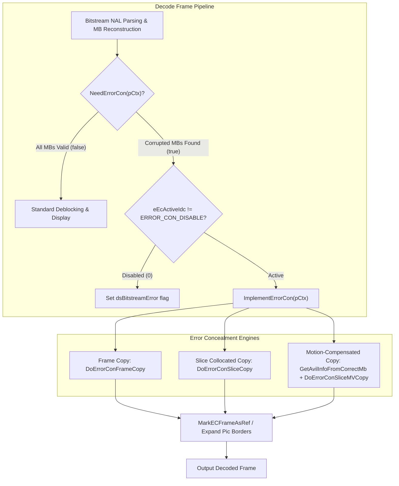
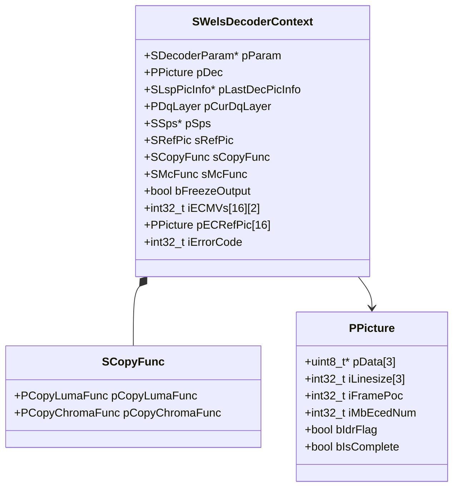
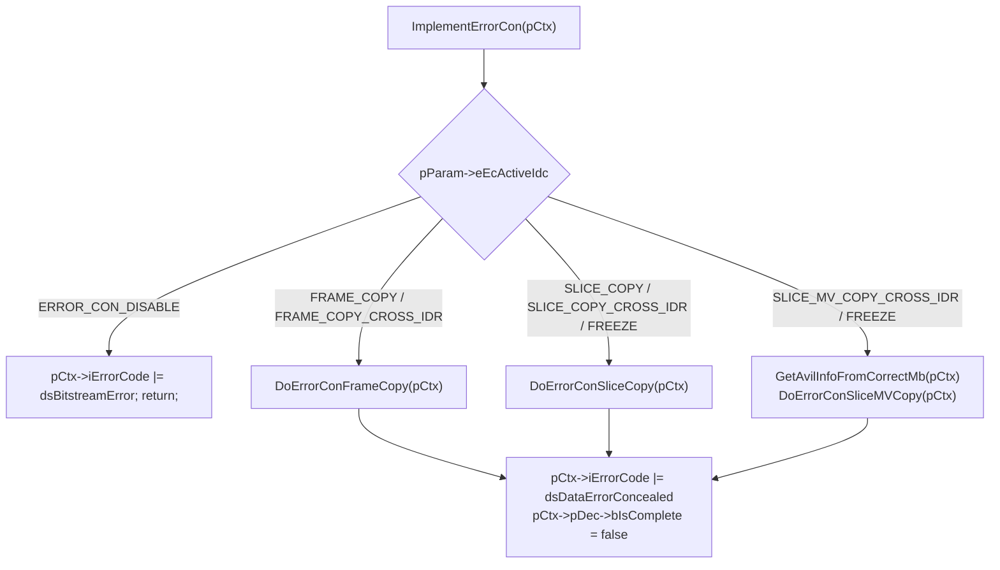
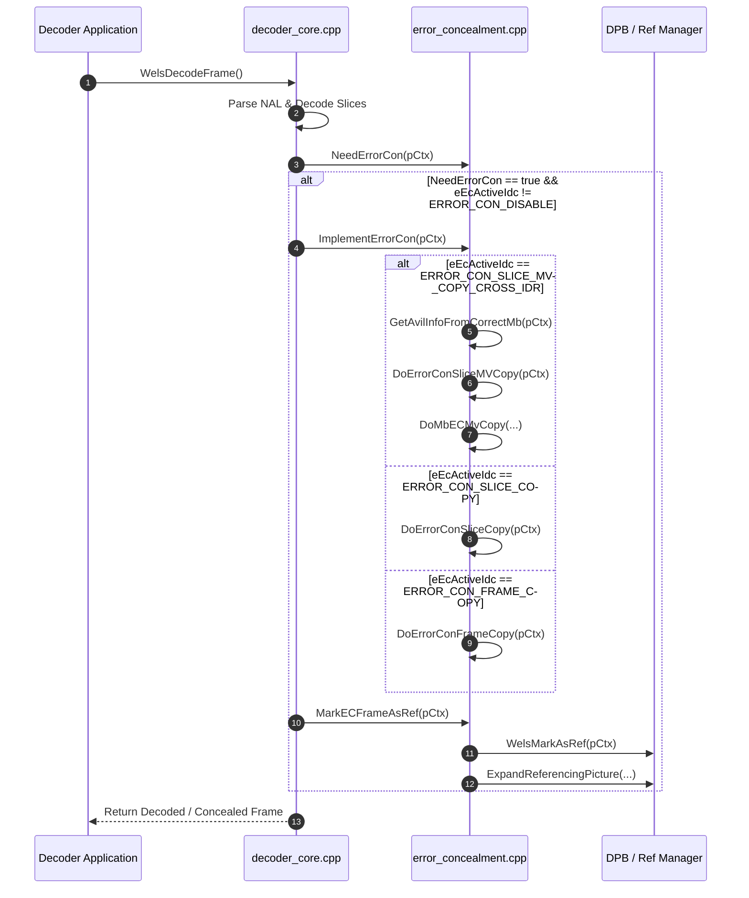

# OpenH264: Error Concealment Subsystem (`error_concealment.h`)

This document provides a comprehensive, literate-programming-style technical specification for the OpenH264 Error Concealment (EC) subsystem declared in [`codec/decoder/core/inc/error_concealment.h`](openh264/codec/decoder/core/inc/error_concealment.h) and implemented in [`codec/decoder/core/src/error_concealment.cpp`](openh264/codec/decoder/core/src/error_concealment.cpp).

---

## Table of Contents
1. [Architectural Overview & Purpose](#1-architectural-overview--purpose)
2. [Error Concealment Strategy Enumeration (`ERROR_CON_IDC`)](#2-error-concealment-strategy-enumeration-error_con_idc)
3. [Data Structures, Context Fields, and Memory Layout](#3-data-structures-context-fields-and-memory-layout)
4. [Function & Method Deep Dive](#4-function--method-deep-dive)
   - [4.1 `InitErrorCon`](#41-initerrorcon)
   - [4.2 `NeedErrorCon`](#42-neederrorcon)
   - [4.3 `ImplementErrorCon`](#43-implementerrorcon)
   - [4.4 `DoErrorConFrameCopy`](#44-doerrorconframecopy)
   - [4.5 `DoErrorConSliceCopy`](#45-doerrorconslicecopy)
   - [4.6 `GetAvilInfoFromCorrectMb`](#46-getavilinfofromcorrectmb)
   - [4.7 `DoMbECMvCopy`](#47-dombecmvcopy)
   - [4.8 `DoErrorConSliceMVCopy`](#48-doerrorconslicemvcopy)
   - [4.9 `MarkECFrameAsRef`](#49-markecframeasref)
5. [SIMD Acceleration & Architecture Optimization](#5-simd-acceleration--architecture-optimization)
6. [Call Graph & Decoder Lifecycle Integration](#6-call-graph--decoder-lifecycle-integration)

---

## 1. Architectural Overview & Purpose

In real-time video communications (such as WebRTC, VoIP, and video conferencing over RTP/UDP), network transmission loss, packet jitter, and bitstream corruption are inevitable. When a packet containing H.264 NAL units (Network Abstraction Layer) is dropped or corrupted, the decoder receives incomplete slice data or missing macroblocks. Without error concealment, missing macroblocks cause severe visual artifacts (e.g., green blocks, tearing) or decoder crashes.

The **Error Concealment Subsystem** in OpenH264 restores stream decodability and visual continuity by synthesizing missing macroblocks ($16 \times 16$ luma and two $8 \times 8$ chroma blocks) from previously decoded reference frames stored in the Decoded Picture Buffer (DPB).



### Key Architectural Tenets
1. **Granular Macroblock Tracking**: Every spatial layer context tracks macroblock decoding status in real time via the boolean bitmask array [`pCurDqLayer->pMbCorrectlyDecodedFlag`](openh264/codec/decoder/core/inc/decoder_core.h).
2. **Multi-Tiered Recovery Modes**: OpenH264 provides a progression of concealment algorithms ranging from fast whole-frame replacement to intra-frame spatial fill, collocated block copy, and temporal motion-vector estimation with Picture Order Count (POC) scaling.
3. **Hardware-Accelerated Memory Copy**: Fast $16 \times 16$ luma and $8 \times 8$ chroma block copy routines utilize vectorized CPU instructions (SSE2, MMX, ARM NEON, AArch64 NEON, and Loongson LSX).
4. **DPB Reference Integrity**: Concealed frames can be inserted into the DPB via [`MarkECFrameAsRef`](openh264/codec/decoder/core/inc/error_concealment.h#L58) and expanded via [`ExpandReferencingPicture`](openh264/codec/decoder/core/inc/expand_pic.h) so subsequent P-frames can maintain inter prediction without decoder pipeline stalls.

---

## 2. Error Concealment Strategy Enumeration (`ERROR_CON_IDC`)

The concealment behavior is configured by the user via the `ERROR_CON_IDC` enumeration defined in [`codec/api/wels/codec_app_def.h`](openh264/codec/api/wels/codec_app_def.h#L178-L186):

```cpp
typedef enum {
  ERROR_CON_DISABLE = 0,
  ERROR_CON_FRAME_COPY,
  ERROR_CON_SLICE_COPY,
  ERROR_CON_FRAME_COPY_CROSS_IDR,
  ERROR_CON_SLICE_COPY_CROSS_IDR,
  ERROR_CON_SLICE_COPY_CROSS_IDR_FREEZE_RES_CHANGE,
  ERROR_CON_SLICE_MV_COPY_CROSS_IDR,
  ERROR_CON_SLICE_MV_COPY_CROSS_IDR_FREEZE_RES_CHANGE
} ERROR_CON_IDC;
```

### Enumeration Value Semantics

| Enum Identifier | Value | Cross-IDR Allowed | Freeze on Res Change | Description |
| :--- | :---: | :---: | :---: | :--- |
| `ERROR_CON_DISABLE` | `0` | No | No | Error concealment is deactivated. If corruption is detected, the decoder logs the error and tags `pCtx->iErrorCode |= dsBitstreamError`. |
| `ERROR_CON_FRAME_COPY` | `1` | No | No | Copies the entire previous frame buffer (`pPreviousDecodedPictureInDpb`) into the current destination frame (`pDec`). If current frame is an IDR slice, replaces frame with neutral gray ($Y=128, U=128, V=128$). |
| `ERROR_CON_SLICE_COPY` | `2` | No | No | Selectively copies only the corrupted/missing macroblocks from the collocated spatial locations of the previous frame. If IDR, fills corrupted MBs with neutral gray ($128$). |
| `ERROR_CON_FRAME_COPY_CROSS_IDR` | `3` | **Yes** | No | Similar to `ERROR_CON_FRAME_COPY`, but allows copying from the pre-IDR reference frame even if the current corrupted frame is an IDR frame. |
| `ERROR_CON_SLICE_COPY_CROSS_IDR` | `4` | **Yes** | No | Similar to `ERROR_CON_SLICE_COPY`, but allows copying collocated macroblocks from the previous reference frame even when decoding an IDR frame. |
| `ERROR_CON_SLICE_COPY_CROSS_IDR_FREEZE_RES_CHANGE` | `5` | **Yes** | **Yes** | Same concealment as `ERROR_CON_SLICE_COPY_CROSS_IDR`, but retains output picture freeze (`pCtx->bFreezeOutput = true`) across dynamic resolution changes until a clean IDR is decoded. |
| `ERROR_CON_SLICE_MV_COPY_CROSS_IDR` | `6` | **Yes** | No | Advanced motion-compensated error concealment. Gathers motion vectors from correctly decoded inter MBs, scales them by POC difference, and performs fractional-pixel motion compensation (`BaseMC`). |
| `ERROR_CON_SLICE_MV_COPY_CROSS_IDR_FREEZE_RES_CHANGE` | `7` | **Yes** | **Yes** | Motion-compensated concealment (`ERROR_CON_SLICE_MV_COPY_CROSS_IDR`) with output freeze preservation during spatial resolution changes. |

---

## 3. Data Structures, Context Fields, and Memory Layout

The error concealment subsystem operates primarily on the decoder context [`SWelsDecoderContext`](openh264/codec/decoder/core/inc/decoder_context.h) and the motion compensation helper structure [`sMCRefMember`](openh264/codec/decoder/core/inc/rec_mb.h#L58-L75).

### 3.1 `sMCRefMember` (from `rec_mb.h`)

Encapsulates plane pointers, buffer strides, and picture dimension boundaries required during motion-compensated macroblock reconstruction:

```cpp
typedef struct TagMCRefMember {
  uint8_t* pDstY;          // Pointer to destination top-left luma block (Y)
  uint8_t* pDstU;          // Pointer to destination top-left chroma Cb block (U)
  uint8_t* pDstV;          // Pointer to destination top-left chroma Cr block (V)

  uint8_t* pSrcY;          // Pointer to reference picture luma plane base
  uint8_t* pSrcU;          // Pointer to reference picture chroma Cb plane base
  uint8_t* pSrcV;          // Pointer to reference picture chroma Cr plane base

  int32_t iSrcLineLuma;    // Stride (bytes per row) of reference luma plane
  int32_t iSrcLineChroma;  // Stride (bytes per row) of reference chroma planes

  int32_t iDstLineLuma;    // Stride (bytes per row) of destination luma plane
  int32_t iDstLineChroma;  // Stride (bytes per row) of destination chroma planes

  int32_t iPicWidth;       // Picture width in luma pixels (iMbWidth << 4)
  int32_t iPicHeight;      // Picture height in luma pixels (iMbHeight << 4)
} sMCRefMember;
```

### 3.2 Key Fields in [`SWelsDecoderContext`](openh264/codec/decoder/core/inc/decoder_context.h)

The following members of `SWelsDecoderContext` (`pCtx`) directly drive error concealment execution:



* **`pParam->eEcActiveIdc`**: Active concealment mode selector (`ERROR_CON_IDC`).
* **`bFreezeOutput`**: Boolean flag set to `false` in [`InitErrorCon`](openh264/codec/decoder/core/src/error_concealment.cpp#L43-L88) unless a freeze-mode flag is active.
* **`sCopyFunc`**: Structure containing function pointers for optimized block memory copies:
  * `pCopyLumaFunc`: Copies a $16 \times 16$ pixel luma block (`WelsCopy16x16_c` or SIMD variant).
  * `pCopyChromaFunc`: Copies an $8 \times 8$ pixel chroma block (`WelsCopy8x8_c` or SIMD variant).
* **`iECMVs[16][2]`**: Accumulated motion vector sums ($MV_x, MV_y$) for up to 16 reference picture indices in `LIST_0`. Used in [`GetAvilInfoFromCorrectMb`](openh264/codec/decoder/core/src/error_concealment.cpp#L260-L376) to calculate the mean motion vector for each reference frame.
* **`pECRefPic[16]`**: Cached array of `PPicture` reference frame pointers corresponding to the 16 reference picture indices.
* **`pCurDqLayer->pMbCorrectlyDecodedFlag`**: Dynamic boolean array of size $N_{\text{MB}} = \text{iMbWidth} \times \text{iMbHeight}$. Set to `true` when a macroblock is parsed and reconstructed without syntax or entropy errors, or `false` if corrupted/missing.
* **`pDec->iMbEcedNum`**: Metric incremented by EC routines to record the total count of error-concealed macroblocks in the current reconstructed picture.

---

## 4. Function & Method Deep Dive

All function declarations reside in namespace `WelsDec` within [`codec/decoder/core/inc/error_concealment.h`](openh264/codec/decoder/core/inc/error_concealment.h).

---

### 4.1 `InitErrorCon`

```cpp
void InitErrorCon (PWelsDecoderContext pCtx);
```
* **Declaration**: [`error_concealment.h:L47`](openh264/codec/decoder/core/inc/error_concealment.h#L47)
* **Definition**: [`error_concealment.cpp:L43-L88`](openh264/codec/decoder/core/src/error_concealment.cpp#L43-L88)

#### Purpose & Description
Initializes the function pointer table `pCtx->sCopyFunc` with the appropriate CPU-optimized memory copy routines for $16 \times 16$ luma and $8 \times 8$ chroma macroblock transfers based on CPU feature flags detected at runtime.

#### Input Parameters
* `pCtx`: Pointer to the current [`SWelsDecoderContext`](openh264/codec/decoder/core/inc/decoder_context.h) structure.

#### Algorithmic Logic
1. Tests if `pCtx->pParam->eEcActiveIdc` requires slice-level or MV-level copy.
2. Resets `pCtx->bFreezeOutput = false` unless one of the freeze-mode flags (`ERROR_CON_SLICE_MV_COPY_CROSS_IDR_FREEZE_RES_CHANGE` or `ERROR_CON_SLICE_COPY_CROSS_IDR_FREEZE_RES_CHANGE`) is active.
3. Sets default C function pointers:
   $$\text{pCopyLumaFunc} \leftarrow \text{WelsCopy16x16\_c}, \quad \text{pCopyChromaFunc} \leftarrow \text{WelsCopy8x8\_c}$$
4. Checks `pCtx->uiCpuFlag` to override C functions with SIMD routines:
   * **x86 / x86-64**:
     * `WELS_CPU_MMXEXT` $\implies$ `pCopyChromaFunc = WelsCopy8x8_mmx`
     * `WELS_CPU_SSE2` $\implies$ `pCopyLumaFunc = WelsCopy16x16_sse2`
   * **ARM 32-bit NEON**:
     * `WELS_CPU_NEON` $\implies$ `WelsCopy16x16_neon`, `WelsCopy8x8_neon`
   * **ARM 64-bit (AArch64) NEON**:
     * `WELS_CPU_NEON` $\implies$ `WelsCopy16x16_AArch64_neon`, `WelsCopy8x8_AArch64_neon`
   * **LoongArch LSX**:
     * `WELS_CPU_LSX` $\implies$ `WelsCopy16x16_lsx`, `WelsCopy8x8_lsx`

---

### 4.2 `NeedErrorCon`

```cpp
bool NeedErrorCon (PWelsDecoderContext pCtx);
```
* **Declaration**: [`error_concealment.h:L60`](openh264/codec/decoder/core/inc/error_concealment.h#L60)
* **Definition**: [`error_concealment.cpp:L453-L463`](openh264/codec/decoder/core/src/error_concealment.cpp#L453-L463)

#### Purpose & Description
Inspects the macroblock decoding bitmask array `pMbCorrectlyDecodedFlag` to evaluate if any macroblock within the current frame failed to decode correctly.

#### Input Parameters & Return Value
* **Input**: `pCtx` — Decoder context.
* **Return Value**: `true` if at least one macroblock in the frame has `pMbCorrectlyDecodedFlag[i] == false`; otherwise returns `false`.

#### Mathematical Formulation
$$N_{\text{MB}} = \text{iMbWidth} \times \text{iMbHeight}$$
$$\text{NeedErrorCon} = \bigvee_{i=0}^{N_{\text{MB}}-1} \neg \left( \text{pMbCorrectlyDecodedFlag}[i] \right)$$

---

### 4.3 `ImplementErrorCon`

```cpp
void ImplementErrorCon (PWelsDecoderContext pCtx);
```
* **Declaration**: [`error_concealment.h:L63`](openh264/codec/decoder/core/inc/error_concealment.h#L63)
* **Definition**: [`error_concealment.cpp:L467-L485`](openh264/codec/decoder/core/src/error_concealment.cpp#L467-L485)

#### Purpose & Description
The master dispatcher routine for error concealment. Invoked by the decoder core when frame decoding finishes or an Access Unit (AU) boundary is reached with missing macroblocks.

#### Control Flow


#### Error Handling & State Updates
1. Sets decoder error status bit: `pCtx->iErrorCode |= dsDataErrorConcealed`.
2. Marks the picture completeness flag: `pCtx->pDec->bIsComplete = false`.

---

### 4.4 `DoErrorConFrameCopy`

```cpp
void DoErrorConFrameCopy (PWelsDecoderContext pCtx);
```
* **Declaration**: [`error_concealment.h:L49`](openh264/codec/decoder/core/inc/error_concealment.h#L49)
* **Definition**: [`error_concealment.cpp:L91-L111`](openh264/codec/decoder/core/src/error_concealment.cpp#L91-L111)

#### Purpose & Description
Performs full-frame error concealment by replacing the entire destination picture (`pDstPic = pCtx->pDec`) with pixel data copied from the previous decoded picture in the DPB (`pSrcPic = pCtx->pLastDecPicInfo->pPreviousDecodedPictureInDpb`).

#### Buffer Arithmetic & Memory Operations

Let $H_Y = \text{iMbHeight} \times 16$, $S_Y = \text{iLinesize}[0]$, and $S_{UV} = \text{iLinesize}[1]$:

1. **Total Concealed Macroblock Count**:
   $$\text{iMbEcedNum} = \text{iMbWidth} \times \text{iMbHeight}$$
2. **IDR Restriction**: If `eEcActiveIdc == ERROR_CON_FRAME_COPY` (without cross-IDR) and current frame is an IDR slice (`bIdrFlag == true`), `pSrcPic` is forced to `NULL`.
3. **No Reference Fallback (Neutral Gray Fill)**: If `pSrcPic == NULL`:
   * $\text{memset}(\text{pData}[0], 128, H_Y \cdot S_Y)$ (Luma Y plane)
   * $\text{memset}(\text{pData}[1], 128, \frac{H_Y}{2} \cdot S_{UV})$ (Chroma Cb plane)
   * $\text{memset}(\text{pData}[2], 128, \frac{H_Y}{2} \cdot S_{UV})$ (Chroma Cr plane)
4. **Valid Reference Picture Copy**: If `pSrcPic != NULL` and `pSrcPic != pDstPic`:
   * $\text{memcpy}(\text{pDstPic->pData}[0], \text{pSrcPic->pData}[0], H_Y \cdot S_Y)$
   * $\text{memcpy}(\text{pDstPic->pData}[1], \text{pSrcPic->pData}[1], \frac{H_Y}{2} \cdot S_{UV})$
   * $\text{memcpy}(\text{pDstPic->pData}[2], \text{pSrcPic->pData}[2], \frac{H_Y}{2} \cdot S_{UV})$

---

### 4.5 `DoErrorConSliceCopy`

```cpp
void DoErrorConSliceCopy (PWelsDecoderContext pCtx);
```
* **Declaration**: [`error_concealment.h:L51`](openh264/codec/decoder/core/inc/error_concealment.h#L51)
* **Definition**: [`error_concealment.cpp:L115-L176`](openh264/codec/decoder/core/src/error_concealment.cpp#L115-L176)

#### Purpose & Description
Performs selective collocated macroblock copy. Traverses the frame in macroblock raster scan order ($0 \le iMbY < H_{\text{mb}}, 0 \le iMbX < W_{\text{mb}}$). If `!pMbCorrectlyDecodedFlag[iMbXyIndex]`, only that corrupted macroblock is replaced from the collocated position in `pSrcPic`.

#### Macroblock Offset Calculations

For a macroblock at coordinate $(iMbX, iMbY)$:

* **Luma (Y Plane) Offset**:
  $$\text{Offset}_Y = iMbY \times 16 \times S_{Y} + iMbX \times 16$$
* **Chroma (U / V Planes) Offset**:
  $$\text{Offset}_{UV} = iMbY \times 8 \times S_{UV} + iMbX \times 8$$

#### Branching Logic
* If `pSrcPic != NULL`:
  * Invokes `pCtx->sCopyFunc.pCopyLumaFunc(pDstY, S_Y, pSrcY, S_{Y,src})` to copy the $16 \times 16$ luma block.
  * Invokes `pCtx->sCopyFunc.pCopyChromaFunc(pDstU, S_{UV}, pSrcU, S_{UV,src})` for Cb.
  * Invokes `pCtx->sCopyFunc.pCopyChromaFunc(pDstV, S_{UV}, pSrcV, S_{UV,src})` for Cr.
* If `pSrcPic == NULL`:
  * Sets the 16 lines of $16 \times 1$ luma bytes to `128` using `memset`.
  * Sets the 8 lines of $8 \times 1$ chroma bytes to `128` for both U and V planes.

---

### 4.6 `GetAvilInfoFromCorrectMb`

```cpp
void GetAvilInfoFromCorrectMb (PWelsDecoderContext pCtx);
```
* **Declaration**: [`error_concealment.h:L55`](openh264/codec/decoder/core/inc/error_concealment.h#L55)
* **Definition**: [`error_concealment.cpp:L260-L376`](openh264/codec/decoder/core/src/error_concealment.cpp#L260-L376)

#### Purpose & Description
Gathers motion vector statistics from all successfully decoded inter-coded macroblocks in the current frame to build a temporal motion model for missing macroblocks.

#### Macroblock Partition Parsing & MV Accumulation

The function scans every macroblock $iMbXyIndex = iMbY \cdot W_{mb} + iMbX$. If `pMbCorrectlyDecodedFlag[iMbXyIndex] == true` and `IS_INTER(pMbType)`:

1. **`MB_TYPE_SKIP` / `MB_TYPE_16x16`**:
   * Reads single reference index: $iRefIdx = \text{pRefIndex}[0][iMbXyIndex][0]$.
   * Accumulates motion vector:
     $$\text{iECMVs}[iRefIdx][0] += \text{pMv}[0][iMbXyIndex][0][0]$$
     $$\text{iECMVs}[iRefIdx][1] += \text{pMv}[0][iMbXyIndex][0][1]$$
   * Increments partition counter: $\text{iInterMbCorrectNum}[iRefIdx] += 1$.

2. **`MB_TYPE_16x8`**:
   * Reads partition 0 ($iRefIdx_0$ at index `0`) and partition 1 ($iRefIdx_1$ at index `8`).
   * Accumulates both MVs and increments $\text{iInterMbCorrectNum}$ for each reference index.

3. **`MB_TYPE_8x16`**:
   * Reads partition 0 ($iRefIdx_0$ at index `0`) and partition 1 ($iRefIdx_1$ at index `2`).
   * Accumulates both MVs and increments $\text{iInterMbCorrectNum}$.

4. **`MB_TYPE_8x8` / `MB_TYPE_8x8_REF0`**:
   * Iterates through the 4 sub-macroblock partitions ($i \in [0, 3]$).
   * Depending on sub-MB type (`SUB_MB_TYPE_8x8`, `SUB_MB_TYPE_8x4`, `SUB_MB_TYPE_4x8`, `SUB_MB_TYPE_4x4`), gathers sub-block motion vectors and updates $\text{iInterMbCorrectNum}[iRefIdx]$ by $+1, +2,$ or $+4$.

#### Mean Motion Vector Calculation
After accumulating across the entire frame, the average motion vector for each reference picture index $i \in [0, 15]$ is computed by integer division:

$$\text{iECMVs}[i][0] = \frac{\text{iECMVs}[i][0]}{\text{iInterMbCorrectNum}[i]}, \quad \text{iECMVs}[i][1] = \frac{\text{iECMVs}[i][1]}{\text{iInterMbCorrectNum}[i]}$$

---

### 4.7 `DoMbECMvCopy`

```cpp
void DoMbECMvCopy (PWelsDecoderContext pCtx, PPicture pDec, PPicture pRef, int32_t iMbXy, int32_t iMbX, int32_t iMbY,
                   sMCRefMember* pMCRefMem, int32_t iCurrPoc);
```
* **Declaration**: [`error_concealment.h:L53-L54`](openh264/codec/decoder/core/inc/error_concealment.h#L53-L54)
* **Definition**: [`error_concealment.cpp:L179-L258`](openh264/codec/decoder/core/src/error_concealment.cpp#L179-L258)

#### Purpose & Description
Performs motion-compensated error concealment for a single corrupted macroblock $(iMbX, iMbY)$ using the estimated motion vector and temporal POC scaling.

#### Algorithmic & Mathematical Steps

1. **IDR / Missing Reference Check**:
   If $pDec\text{->bIdrFlag} == \text{true}$ or $pCtx\text{->pECRefPic}[0] == \text{NULL}$, falls back to direct collocated pixel copy using `pCopyLumaFunc` and `pCopyChromaFunc`.

2. **POC-Based Temporal Scaling**:
   If the estimated reference picture differs from the target reference picture $pRef$, the motion vector is scaled proportionally to temporal distance:
   $$\Delta \text{POC}_0 = \text{POC}(pCtx\text{->pECRefPic}[0]) - \text{POC}_{\text{curr}}$$
   $$\Delta \text{POC}_1 = \text{POC}(pRef) - \text{POC}_{\text{curr}}$$
   $$MV_{x,\text{scaled}} = \begin{cases} \text{iECMVs}[0][0] \cdot \frac{\Delta \text{POC}_1}{\Delta \text{POC}_0} & \text{if } \Delta \text{POC}_0 \ne 0 \\ 0 & \text{if } \Delta \text{POC}_0 = 0 \end{cases}$$
   $$MV_{y,\text{scaled}} = \begin{cases} \text{iECMVs}[0][1] \cdot \frac{\Delta \text{POC}_1}{\Delta \text{POC}_0} & \text{if } \Delta \text{POC}_0 \ne 0 \\ 0 & \text{if } \Delta \text{POC}_0 = 0 \end{cases}$$

3. **Quarter-Pixel Full Motion Vector Conversion**:
   $$FullMV_x = (iMbX \cdot 16 \cdot 4) + MV_{x,\text{scaled}}$$
   $$FullMV_y = (iMbY \cdot 16 \cdot 4) + MV_{y,\text{scaled}}$$

4. **Frame Cropping & Picture Boundary Clamping**:
   To prevent reading outside valid reference frame memory, $FullMV_x$ and $FullMV_y$ are clamped against frame crop limits:
   $$\text{MinLeft} = (\text{LeftOffset} \cdot 2 + 2) \cdot 4$$
   $$\text{MaxRight} = (\text{PicWidth} - \text{RightOffset} \cdot 2 - 18) \cdot 4$$
   $$\text{MinTop} = (\text{TopOffset} \cdot 2 + 2) \cdot 4$$
   $$\text{MaxBottom} = (\text{PicHeight} - \text{TopOffset} \cdot 2 - 18) \cdot 4$$
   $$FullMV_x = \max\left(\text{MinLeft}, \, \min\left((\text{MaxRight} - 16 \cdot 4), \, FullMV_x\right)\right)$$
   $$FullMV_y = \max\left(\text{MinTop}, \, \min\left((\text{MaxBottom} - 16 \cdot 4), \, FullMV_y\right)\right)$$

5. **Motion Compensation Execution**:
   Re-derives the final macroblock-relative quarter-pixel motion vector:
   $$MV_{\text{final}, x} = FullMV_x - (iMbX \cdot 16 \cdot 4)$$
   $$MV_{\text{final}, y} = FullMV_y - (iMbY \cdot 16 \cdot 4)$$
   Invokes [`BaseMC`](openh264/codec/decoder/core/inc/rec_mb.h#L77-L79):
   $$\text{BaseMC}(pCtx, pMCRefMem, -1, -1, iMbX \cdot 16, iMbY \cdot 16, \&pCtx\text{->sMcFunc}, 16, 16, MV_{\text{final}})$$

---

### 4.8 `DoErrorConSliceMVCopy`

```cpp
void DoErrorConSliceMVCopy (PWelsDecoderContext pCtx);
```
* **Declaration**: [`error_concealment.h:L56`](openh264/codec/decoder/core/inc/error_concealment.h#L56)
* **Definition**: [`error_concealment.cpp:L378-L437`](openh264/codec/decoder/core/src/error_concealment.cpp#L378-L437)

#### Purpose & Description
High-level driver for motion-compensated slice error concealment. Initializes the `sMCRefMember` descriptor structure and iterates through all macroblocks in the frame, invoking `DoMbECMvCopy` for every corrupted macroblock.

---

### 4.9 `MarkECFrameAsRef`

```cpp
int32_t MarkECFrameAsRef (PWelsDecoderContext pCtx);
```
* **Declaration**: [`error_concealment.h:L58`](openh264/codec/decoder/core/inc/error_concealment.h#L58)
* **Definition**: [`error_concealment.cpp:L440-L451`](openh264/codec/decoder/core/src/error_concealment.cpp#L440-L451)

#### Purpose & Description
Ensures that an error-concealed frame is correctly registered into the Decoded Picture Buffer (DPB) as a valid reference picture for subsequent P-frames.

#### Execution Sequence
1. Invokes [`WelsMarkAsRef(pCtx)`](openh264/codec/decoder/core/inc/manage_dec_ref.h) to mark the frame buffer in the reference list.
2. If `WelsMarkAsRef` returns `ERR_NONE`, calls [`ExpandReferencingPicture`](openh264/codec/decoder/core/inc/expand_pic.h) to pad the frame boundaries (typically 32 pixels horizontally and vertically) using `pfExpandLumaPicture` and `pfExpandChromaPicture`. This allows out-of-bounds motion vector compensation in future frames without illegal memory accesses.

---

## 5. SIMD Acceleration & Architecture Optimization

During error concealment, copying $16 \times 16$ luma and $8 \times 8$ chroma pixel blocks is the most compute-intensive memory bottleneck. OpenH264 dynamically dispatches block copying to assembly kernels:

| ISA Architecture | Luma ($16 \times 16$) Kernel | Chroma ($8 \times 8$) Kernel | Memory Alignment Requirements |
| :--- | :--- | :--- | :--- |
| **C / C++ Fallback** | `WelsCopy16x16_c` | `WelsCopy8x8_c` | Byte-aligned (unrestricted) |
| **x86 MMX** | `WelsCopy16x16_c` | `WelsCopy8x8_mmx` | 8-byte aligned |
| **x86 SSE2** | `WelsCopy16x16_sse2` | `WelsCopy8x8_mmx` | 16-byte aligned |
| **ARMv7 NEON** | `WelsCopy16x16_neon` | `WelsCopy8x8_neon` | 16-byte aligned |
| **AArch64 NEON** | `WelsCopy16x16_AArch64_neon` | `WelsCopy8x8_AArch64_neon` | 16-byte aligned |
| **LoongArch LSX** | `WelsCopy16x16_lsx` | `WelsCopy8x8_lsx` | 16-byte aligned |

---

## 6. Call Graph & Decoder Lifecycle Integration



---

## 7. Complete Source File Cross-Reference

* **Header File**: [`codec/decoder/core/inc/error_concealment.h`](openh264/codec/decoder/core/inc/error_concealment.h)
* **Implementation File**: [`codec/decoder/core/src/error_concealment.cpp`](openh264/codec/decoder/core/src/error_concealment.cpp)
* **Decoder Context Definition**: [`codec/decoder/core/inc/decoder_context.h`](openh264/codec/decoder/core/inc/decoder_context.h)
* **Macroblock Motion Compensation**: [`codec/decoder/core/inc/rec_mb.h`](openh264/codec/decoder/core/inc/rec_mb.h)
* **Reference Frame Management**: [`codec/decoder/core/inc/manage_dec_ref.h`](openh264/codec/decoder/core/inc/manage_dec_ref.h)
* **Picture Buffer Expansion**: [`codec/decoder/core/inc/expand_pic.h`](openh264/codec/decoder/core/inc/expand_pic.h)
