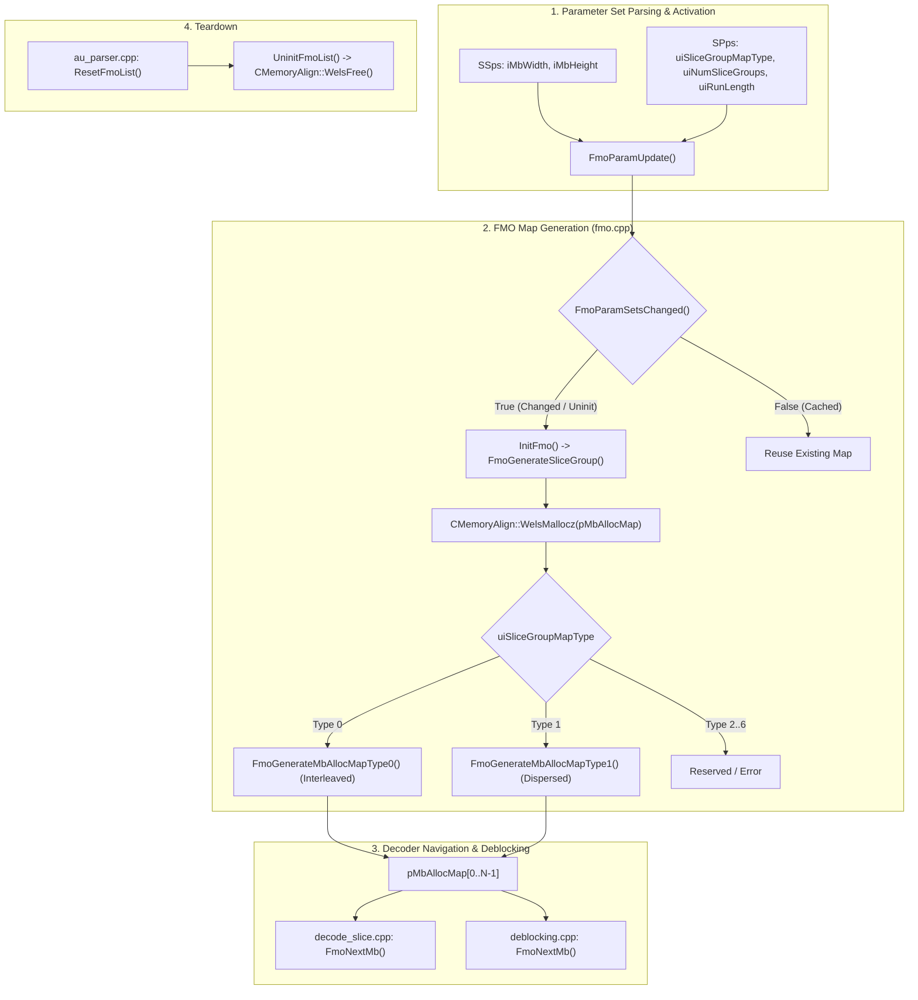
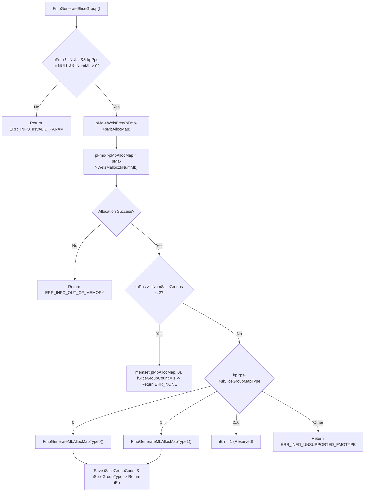
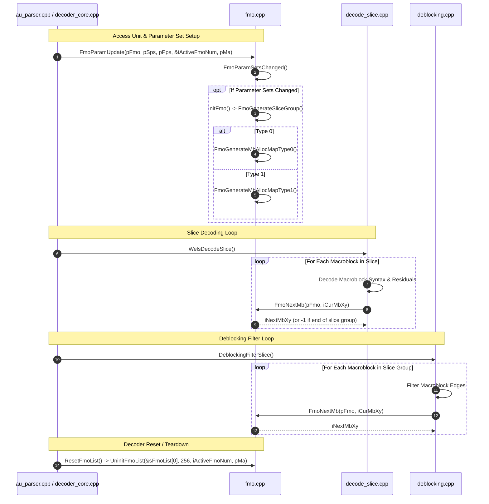

# Literate Programming: Flexible Macroblock Ordering (`fmo.cpp`)

This document presents a comprehensive, literate-programming-style deep dive into the implementation of **Flexible Macroblock Ordering (FMO)** in OpenH264's decoder core, located at [codec/decoder/core/src/fmo.cpp](openh264/codec/decoder/core/src/fmo.cpp) with its header definitions in [codec/decoder/core/inc/fmo.h](openh264/codec/decoder/core/inc/fmo.h).

---

## Table of Contents
1. [Architectural Overview & Module Purpose](#1-architectural-overview--module-purpose)
2. [Data Structures & Constants](#2-data-structures--constants)
   - [2.1 `SFmo` / `TagFmo` Context](#21-sfmo--tagfmo-context)
   - [2.2 Associated Types, Constants & Error Codes](#22-associated-types-constants--error-codes)
3. [Algorithmic Foundations of H.264 FMO](#3-algorithmic-foundations-of-h264-fmo)
   - [3.1 Interleaved Slice Groups (Type 0)](#31-interleaved-slice-groups-type-0)
   - [3.2 Dispersed Slice Groups (Type 1)](#32-dispersed-slice-groups-type-1)
4. [Method Deep-Dive & Function Walkthrough](#4-method-deep-dive--function-walkthrough)
   - [4.1 `FmoGenerateMbAllocMapType0`](#41-fmogeneratemballocmaptype0)
   - [4.2 `FmoGenerateMbAllocMapType1`](#42-fmogeneratemballocmaptype1)
   - [4.3 `FmoGenerateSliceGroup`](#43-fmogenerateslicegroup)
   - [4.4 `InitFmo`](#44-initfmo)
   - [4.5 `UninitFmoList`](#45-uninitfmolist)
   - [4.6 `FmoParamSetsChanged`](#46-fmoparamsetschanged)
   - [4.7 `FmoParamUpdate`](#47-fmoparamupdate)
   - [4.8 `FmoMbToSliceGroup`](#48-fmombtoslicegroup)
   - [4.9 `FmoNextMb`](#49-fmonextmb)
5. [Decoder Call Graph & Integration Lifecycle](#5-decoder-call-graph--integration-lifecycle)

---

## 1. Architectural Overview & Module Purpose

In standard H.264 / AVC video decoding, macroblocks (MBs) are typically traversed in strict **raster-scan order** from left to right, top to bottom:

$$(0, 0), (1, 0), \dots, (W_{\text{mb}}-1, 0), (0, 1), \dots, (W_{\text{mb}}-1, H_{\text{mb}}-1)$$

However, the H.264 / AVC standard (ITU-T H.264 / ISO/IEC 14496-10 Section 8.2.2 & Annex A) introduces **Flexible Macroblock Ordering (FMO)**. FMO decouples the transmission order of macroblocks from their spatial geometry by partitioning the picture into one or more **Slice Groups** ($0 \le \text{group} < K \le 8$). 

A slice is constrained to contain macroblocks belonging to a single slice group. By dispersing adjacent macroblocks into different slice groups (and thus different NAL units transmitted over separate network packets), packet loss during transmission does not destroy large contiguous regions of the video frame. Instead, lost macroblocks are surrounded by correctly received macroblocks from other slice groups, enabling spatial and temporal error concealment to reconstruct missing pixels with high visual fidelity.



In OpenH264, [codec/decoder/core/src/fmo.cpp](openh264/codec/decoder/core/src/fmo.cpp) provides the complete algorithmic implementation for:
1. Allocating and caching the **Macroblock Allocation Map** (`pMbAllocMap`).
2. Synthesizing slice group assignments for **Interleaved** (Type 0) and **Dispersed** (Type 1) slice group configurations.
3. Providing efficient $O(1)$ lookups ([FmoMbToSliceGroup](openh264/codec/decoder/core/src/fmo.cpp#L284-L293)) and forward iterator queries ([FmoNextMb](openh264/codec/decoder/core/src/fmo.cpp#L302-L324)) to advance through macroblocks belonging to the active slice group during slice decoding and in-loop deblocking.

---

## 2. Data Structures & Constants

### 2.1 `SFmo` / `TagFmo` Context

The runtime state of an FMO instance is captured in the [`SFmo`](openh264/codec/decoder/core/inc/fmo.h#L57-L64) structure:

```cpp
typedef struct TagFmo {
  uint8_t*        pMbAllocMap;
  int32_t         iCountMbNum;
  int32_t         iSliceGroupCount;
  int32_t         iSliceGroupType;
  bool            bActiveFlag;
  uint8_t         uiReserved[3];          // reserved padding bytes
} SFmo, *PFmo;
```

#### Field Specifications

| Field Name | Type | Size / Alignment | Description & Lifecycle |
| :--- | :--- | :--- | :--- |
| `pMbAllocMap` | `uint8_t*` | 8 bytes (64-bit ptr) | Dynamically allocated array of size `iCountMbNum * sizeof(uint8_t)`. For every macroblock index $i \in [0, N-1]$, `pMbAllocMap[i]` holds the 0-based Slice Group ID assigned to that macroblock. Allocated via [`CMemoryAlign::WelsMallocz`](openh264/codec/common/inc/memory_align.h) and released via `CMemoryAlign::WelsFree`. |
| `iCountMbNum` | `int32_t` | 4 bytes | Total number of macroblocks in the current picture: $N = W_{\text{mb}} \times H_{\text{mb}}$. Derived from the active Sequence Parameter Set ([`SSps::iMbWidth`](openh264/codec/decoder/core/inc/parameter_sets.h) $\times$ [`SSps::iMbHeight`](openh264/codec/decoder/core/inc/parameter_sets.h)). |
| `iSliceGroupCount` | `int32_t` | 4 bytes | Total number of active slice groups ($1 \le K \le \text{MAX\_SLICEGROUP\_IDS} = 8$). Populated from [`SPps::uiNumSliceGroups`](openh264/codec/decoder/core/inc/parameter_sets.h). Defaults to `1` when FMO is not enabled. |
| `iSliceGroupType` | `int32_t` | 4 bytes | Slice Group Map Type ($0 \le \text{type} \le 6$). Populated from [`SPps::uiSliceGroupMapType`](openh264/codec/decoder/core/inc/parameter_sets.h). Initialized to `-1` when inactive. |
| `bActiveFlag` | `bool` | 1 byte | Status flag indicating whether this FMO structure is active and holds allocated memory within the decoder's [`SWelsDecoderContext::sFmoList`](openh264/codec/decoder/core/inc/decoder_context.h#L337) array. |
| `uiReserved[3]` | `uint8_t[3]` | 3 bytes | Explicit alignment padding bytes ensuring that structure size and field offsets remain 4-byte/8-byte aligned across different compilers. |

---

### 2.2 Associated Types, Constants & Error Codes

* **`MB_XY_T`** ([fmo.h:51](openh264/codec/decoder/core/inc/fmo.h#L51)):
  ```cpp
  #ifndef MB_XY_T
  #define MB_XY_T int32_t
  #endif
  ```
  Represents the 0-based linear macroblock raster-scan index $i = y \cdot W_{\text{mb}} + x$.

* **`MAX_SLICEGROUP_IDS`** ([wels_const.h:53](openh264/codec/decoder/core/inc/wels_const.h#L53)):
  ```cpp
  #define MAX_SLICEGROUP_IDS 8
  ```
  The maximum number of slice groups allowed by the H.264 specification in any Picture Parameter Set.

* **`MAX_PPS_COUNT`** ([wels_const.h](openh264/codec/decoder/core/inc/wels_const.h)):
  Maximum number of Picture Parameter Sets stored in the decoder (`256`). The decoder context maintains a parallel array `sFmoList[MAX_PPS_COUNT]` so each PPS ID has its own FMO allocation context.

* **Error Return Codes** ([error_code.h](openh264/codec/decoder/core/inc/error_code.h)):
  * `ERR_NONE = 0`: Successful execution.
  * `ERR_INFO_INVALID_PARAM`: Null pointer passed or parameter out of allowable range ($N \le 0$, $K > 8$, etc.).
  * `ERR_INFO_OUT_OF_MEMORY`: Dynamic memory allocation for `pMbAllocMap` failed.
  * `ERR_INFO_UNSUPPORTED_FMOTYPE`: Unsupported slice group map type requested ($> 6$).

---

## 3. Algorithmic Foundations of H.264 FMO

OpenH264 decoder supports the two most critical FMO slice group types defined in the H.264 specification:

### 3.1 Interleaved Slice Groups (Type 0)

In **Type 0**, macroblocks are assigned to slice groups in continuous runs. The Picture Parameter Set defines a run-length array $\text{uiRunLength}[g]$ for each slice group $g \in [0, K-1]$.

The assignment proceeds cyclically across slice groups:
1. Slice Group $0$ is assigned $\text{uiRunLength}[0]$ consecutive macroblocks.
2. Slice Group $1$ is assigned $\text{uiRunLength}[1]$ consecutive macroblocks.
3. $\dots$
4. Slice Group $K-1$ is assigned $\text{uiRunLength}[K-1]$ consecutive macroblocks.
5. The cycle repeats from Group $0$ until all $N$ macroblocks in the picture are mapped.

$$\text{Run Sequence: } \underbrace{0, 0, \dots, 0}_{\text{Length}[0]}, \underbrace{1, 1, \dots, 1}_{\text{Length}[1]}, \dots, \underbrace{K-1, \dots, K-1}_{\text{Length}[K-1]}, \underbrace{0, 0, \dots, 0}_{\text{Length}[0]}, \dots$$

---

### 3.2 Dispersed Slice Groups (Type 1)

In **Type 1**, macroblocks are mapped using a 2D checkerboard/lattice dispersion formula. For any macroblock index $i \in [0, N-1]$ in a picture of width $W_{\text{mb}}$ macroblocks and $K$ slice groups:

$$\text{Group}(i) = \left( (i \bmod W_{\text{mb}}) + \left\lfloor \frac{\lfloor i / W_{\text{mb}} \rfloor \cdot K}{2} \right\rfloor \right) \bmod K$$

Where:
* $i \bmod W_{\text{mb}}$ is the macroblock's horizontal column coordinate $x$.
* $\lfloor i / W_{\text{mb}} \rfloor$ is the macroblock's vertical row coordinate $y$.
* The vertical shift factor $\lfloor (y \cdot K) / 2 \rfloor$ staggers adjacent rows by half the slice group period, creating diagonal dispersal patterns across the 2D grid.

In C++ integer arithmetic ([fmo.cpp:103](openh264/codec/decoder/core/src/fmo.cpp#L103)):
```cpp
pFmo->pMbAllocMap[i] = (uint8_t) (((i % kiMbWidth) + (((i / kiMbWidth) * uiNumSliceGroups) >> 1)) % uiNumSliceGroups);
```

---

## 4. Method Deep-Dive & Function Walkthrough

All functions in `fmo.cpp` reside in the `WelsDec` namespace.

```cpp
namespace WelsDec {
  // Function Implementations
}
```

---

### 4.1 `FmoGenerateMbAllocMapType0`

Generates the macroblock allocation map for **Interleaved Slice Groups** (Type 0).

* **Source Location**: [codec/decoder/core/src/fmo.cpp#L55-L81](openh264/codec/decoder/core/src/fmo.cpp#L55-L81)
* **Signature**:
  ```cpp
  static inline int32_t FmoGenerateMbAllocMapType0 (PFmo pFmo, PPps pPps);
  ```

#### Parameters
* `pFmo` (`PFmo`): Pointer to the target FMO context structure.
* `pPps` (`PPps`): Pointer to the active Picture Parameter Set containing `uiNumSliceGroups` and `uiRunLength[]`.

#### Algorithm & Implementation Details

```cpp
static inline int32_t FmoGenerateMbAllocMapType0 (PFmo pFmo, PPps pPps) {
  uint32_t uiNumSliceGroups = 0;
  int32_t iMbNum = 0;
  int32_t i = 0;

  WELS_VERIFY_RETURN_IF (ERR_INFO_INVALID_PARAM, (NULL == pFmo || NULL == pPps))
  uiNumSliceGroups = pPps->uiNumSliceGroups;
  iMbNum = pFmo->iCountMbNum;
  WELS_VERIFY_RETURN_IF (ERR_INFO_INVALID_PARAM, (NULL == pFmo->pMbAllocMap || iMbNum <= 0
                         || uiNumSliceGroups > MAX_SLICEGROUP_IDS))

  do {
    uint8_t uiGroup = 0;
    do {
      const int32_t kiRunIdx = pPps->uiRunLength[uiGroup];
      int32_t j = 0;
      do {
        pFmo->pMbAllocMap[i + j] = uiGroup;
        ++ j;
      } while (j < kiRunIdx && i + j < iMbNum);
      i += kiRunIdx;
      ++ uiGroup;
    } while (uiGroup < uiNumSliceGroups && i < iMbNum);
  } while (i < iMbNum);

  return ERR_NONE;
}
```

1. **Parameter Validation**: Verifies non-null pointers, $iMbNum > 0$, valid allocation buffer `pMbAllocMap != NULL`, and $uiNumSliceGroups \le 8$.
2. **Triply-Nested Assignment Loop**:
   * **Outer Loop**: Runs until all $iMbNum$ macroblocks have been assigned ($i \ge iMbNum$).
   * **Middle Loop**: Cycles through slice group indices `uiGroup` from $0$ up to $uiNumSliceGroups - 1$.
   * **Inner Loop**: Assigns `pMbAllocMap[i + j] = uiGroup` for $j \in [0, \text{kiRunIdx}-1]$, clamping immediately if the picture boundary ($i + j == iMbNum$) is reached.
3. **Complexity**: Exact $O(N)$ operations where $N = iMbNum$.
4. **Return Value**: `ERR_NONE` (0) on success, or `ERR_INFO_INVALID_PARAM` on validation failure.

---

### 4.2 `FmoGenerateMbAllocMapType1`

Generates the macroblock allocation map for **Dispersed Slice Groups** (Type 1).

* **Source Location**: [codec/decoder/core/src/fmo.cpp#L92-L108](openh264/codec/decoder/core/src/fmo.cpp#L92-L108)
* **Signature**:
  ```cpp
  static inline int32_t FmoGenerateMbAllocMapType1 (PFmo pFmo, PPps pPps, const int32_t kiMbWidth);
  ```

#### Parameters
* `pFmo` (`PFmo`): Target FMO context pointer.
* `pPps` (`PPps`): Active Picture Parameter Set pointer.
* `kiMbWidth` (`const int32_t`): Picture width measured in macroblocks ($W_{\text{mb}}$).

#### Algorithm & Implementation Details

```cpp
static inline int32_t FmoGenerateMbAllocMapType1 (PFmo pFmo, PPps pPps, const int32_t kiMbWidth) {
  uint32_t uiNumSliceGroups = 0;
  int32_t iMbNum = 0;
  int32_t i = 0;
  WELS_VERIFY_RETURN_IF (ERR_INFO_INVALID_PARAM, (NULL == pFmo || NULL == pPps))
  uiNumSliceGroups = pPps->uiNumSliceGroups;
  iMbNum = pFmo->iCountMbNum;
  WELS_VERIFY_RETURN_IF (ERR_INFO_INVALID_PARAM, (NULL == pFmo->pMbAllocMap || iMbNum <= 0 || kiMbWidth == 0
                         || uiNumSliceGroups > MAX_SLICEGROUP_IDS))

  do {
    pFmo->pMbAllocMap[i] = (uint8_t) (((i % kiMbWidth) + (((i / kiMbWidth) * uiNumSliceGroups) >> 1)) % uiNumSliceGroups);
    ++ i;
  } while (i < iMbNum);

  return ERR_NONE;
}
```

1. **Parameter Validation**: Guarantees `pFmo`, `pPps`, `pMbAllocMap` are non-null, $iMbNum > 0$, $kiMbWidth > 0$, and $uiNumSliceGroups \le 8$.
2. **Formula Computation**: Iterates $i$ from $0$ to $iMbNum - 1$. Calculates:
   $$\text{group} = \left( (i \bmod W_{\text{mb}}) + \left( \lfloor i / W_{\text{mb}} \rfloor \cdot K \right) \gg 1 \right) \bmod K$$
   and stores the resulting byte into `pFmo->pMbAllocMap[i]`.
3. **Complexity**: $O(N)$ operations for $N$ macroblocks.
4. **Return Value**: `ERR_NONE` (0) on success, or `ERR_INFO_INVALID_PARAM` on failure.

---

### 4.3 `FmoGenerateSliceGroup`

Internal master dispatcher for allocating `pMbAllocMap` memory and delegating slice group map generation based on PPS parameters.

* **Source Location**: [codec/decoder/core/src/fmo.cpp#L120-L176](openh264/codec/decoder/core/src/fmo.cpp#L120-L176)
* **Signature**:
  ```cpp
  static inline int32_t FmoGenerateSliceGroup (PFmo pFmo, const PPps kpPps, const int32_t kiMbWidth,
      const int32_t kiMbHeight, CMemoryAlign* pMa);
  ```

#### Workflow & Allocation Logic



1. **Re-Allocation Guarantee**: Always frees prior allocation `pFmo->pMbAllocMap` via `pMa->WelsFree` before allocating freshly zero-initialized memory `pMa->WelsMallocz(iNumMb * sizeof(uint8_t))`.
2. **Single Slice Group Fast-Path**: If `kpPps->uiNumSliceGroups < 2`, FMO is functionally disabled. The buffer is set to `0` via `memset`, `iSliceGroupCount` is set to `1`, and the function returns `ERR_NONE` immediately without running complex map generation loops.
3. **Map Type Switch**:
   * Type 0 $\rightarrow$ [`FmoGenerateMbAllocMapType0`](#41-fmogeneratemballocmaptype0)
   * Type 1 $\rightarrow$ [`FmoGenerateMbAllocMapType1`](#42-fmogeneratemballocmaptype1)
   * Types 2 to 6 $\rightarrow$ Flagged as reserved (`iErr = 1`)
   * Default $\rightarrow$ Returns `ERR_INFO_UNSUPPORTED_FMOTYPE`
4. **State Recording**: When `iErr == 0`, updates `pFmo->iSliceGroupCount = kpPps->uiNumSliceGroups` and `pFmo->iSliceGroupType = kpPps->uiSliceGroupMapType`.

---

### 4.4 `InitFmo`

Initializes an FMO context for a given Picture Parameter Set and picture dimensions.

* **Source Location**: [codec/decoder/core/src/fmo.cpp#L188-L190](openh264/codec/decoder/core/src/fmo.cpp#L188-L190)
* **Signature**:
  ```cpp
  int32_t InitFmo (PFmo pFmo, PPps pPps, const int32_t kiMbWidth, const int32_t kiMbHeight, CMemoryAlign* pMa);
  ```

#### Implementation
```cpp
int32_t InitFmo (PFmo pFmo, PPps pPps, const int32_t kiMbWidth, const int32_t kiMbHeight, CMemoryAlign* pMa) {
  return FmoGenerateSliceGroup (pFmo, pPps, kiMbWidth, kiMbHeight, pMa);
}
```
Direct pass-through wrapper invoking [`FmoGenerateSliceGroup`](#43-fmogenerateslicegroup).

---

### 4.5 `UninitFmoList`

Frees all dynamically allocated macroblock allocation maps across the decoder's FMO context array `sFmoList`.

* **Source Location**: [codec/decoder/core/src/fmo.cpp#L202-L228](openh264/codec/decoder/core/src/fmo.cpp#L202-L228)
* **Signature**:
  ```cpp
  void UninitFmoList (PFmo pFmo, const int32_t kiCnt, const int32_t kiAvail, CMemoryAlign* pMa);
  ```

#### Parameters
* `pFmo` (`PFmo`): Base pointer to the FMO array (`&pCtx->sFmoList[0]`).
* `kiCnt` (`const int32_t`): Maximum capacity of the FMO list array (`MAX_PPS_COUNT` = 256).
* `kiAvail` (`const int32_t`): Total count of active/allocated FMO contexts currently tracked in `pCtx->iActiveFmoNum`.
* `pMa` (`CMemoryAlign*`): Pointer to the decoder memory allocator.

#### Algorithm & Early Termination Optimization
```cpp
void UninitFmoList (PFmo pFmo, const int32_t kiCnt, const int32_t kiAvail, CMemoryAlign* pMa) {
  PFmo pIter = pFmo;
  int32_t i = 0;
  int32_t iFreeNodes = 0;

  if (NULL == pIter || kiAvail <= 0 || kiCnt < kiAvail)
    return;

  while (i < kiCnt) {
    if (pIter != NULL && pIter->bActiveFlag) {
      if (NULL != pIter->pMbAllocMap) {
        pMa->WelsFree (pIter->pMbAllocMap, "pIter->pMbAllocMap");
        pIter->pMbAllocMap = NULL;
      }
      pIter->iSliceGroupCount   = 0;
      pIter->iSliceGroupType    = -1;
      pIter->iCountMbNum        = 0;
      pIter->bActiveFlag        = false;
      ++ iFreeNodes;
      if (iFreeNodes >= kiAvail)
        break;
    }
    ++ pIter;
    ++ i;
  }
}
```
* Iterates through the list of `SFmo` contexts.
* When an active node (`pIter->bActiveFlag == true`) is encountered:
  1. Calls `pMa->WelsFree(pIter->pMbAllocMap)` and sets pointer to `NULL`.
  2. Resets all metadata fields (`iSliceGroupCount = 0`, `iSliceGroupType = -1`, `iCountMbNum = 0`, `bActiveFlag = false`).
  3. Increments `iFreeNodes`.
  4. **Early Termination**: As soon as `iFreeNodes >= kiAvail`, breaks out of the loop early, avoiding unnecessary traversal over the remaining inactive entries of `sFmoList`.

---

### 4.6 `FmoParamSetsChanged`

Determines whether the incoming SPS/PPS configuration differs from the existing cached FMO state.

* **Source Location**: [codec/decoder/core/src/fmo.cpp#L240-L248](openh264/codec/decoder/core/src/fmo.cpp#L240-L248)
* **Signature**:
  ```cpp
  bool FmoParamSetsChanged (PFmo pFmo, const int32_t kiCountNumMb, const int32_t kiSliceGroupType,
                            const int32_t kiSliceGroupCount);
  ```

#### Return Value & Change Detection Conditions
Returns `true` (requiring map regeneration) if **any** of the following conditions hold:
1. `pFmo == NULL`
2. `!pFmo->bActiveFlag` (FMO context is not yet active/initialized)
3. `kiCountNumMb != pFmo->iCountMbNum` (Picture resolution changed)
4. `kiSliceGroupType != pFmo->iSliceGroupType` (Slice group map type changed)
5. `kiSliceGroupCount != pFmo->iSliceGroupCount` (Number of slice groups changed)

Otherwise, returns `false`, allowing the decoder to reuse the existing `pMbAllocMap` without redundant reallocations.

---

### 4.7 `FmoParamUpdate`

Synchronizes the FMO context state with active SPS and PPS parameter sets before decoding access units.

* **Source Location**: [codec/decoder/core/src/fmo.cpp#L260-L274](openh264/codec/decoder/core/src/fmo.cpp#L260-L274)
* **Signature**:
  ```cpp
  int32_t FmoParamUpdate (PFmo pFmo, PSps pSps, PPps pPps, int32_t* pActiveFmoNum, CMemoryAlign* pMa);
  ```

#### Parameters
* `pFmo` (`PFmo`): Target FMO context (`&pCtx->sFmoList[iPpsId]`).
* `pSps` (`PSps`): Active Sequence Parameter Set pointer.
* `pPps` (`PPps`): Active Picture Parameter Set pointer.
* `pActiveFmoNum` (`int32_t*` [in/out]): Pointer to `pCtx->iActiveFmoNum` tracking the count of initialized FMO instances.
* `pMa` (`CMemoryAlign*`): Pointer to memory allocator.

#### Implementation
```cpp
int32_t FmoParamUpdate (PFmo pFmo, PSps pSps, PPps pPps, int32_t* pActiveFmoNum, CMemoryAlign* pMa) {
  const uint32_t kuiMbWidth = pSps->iMbWidth;
  const uint32_t kuiMbHeight = pSps->iMbHeight;
  int32_t iRet = ERR_NONE;
  if (FmoParamSetsChanged (pFmo, kuiMbWidth * kuiMbHeight, pPps->uiSliceGroupMapType, pPps->uiNumSliceGroups)) {
    iRet = InitFmo (pFmo, pPps, kuiMbWidth, kuiMbHeight, pMa);
    WELS_VERIFY_RETURN_IF (iRet, iRet);

    if (!pFmo->bActiveFlag && *pActiveFmoNum < MAX_PPS_COUNT) {
      ++ (*pActiveFmoNum);
      pFmo->bActiveFlag = true;
    }
  }
  return iRet;
}
```
If parameters have changed, `InitFmo` regenerates the map. Upon successful initialization, if the entry was not previously active, `*pActiveFmoNum` is incremented and `pFmo->bActiveFlag` is set to `true`.

---

### 4.8 `FmoMbToSliceGroup`

Performs an $O(1)$ query mapping a linear macroblock index (`kiMbXy`) to its assigned Slice Group ID.

* **Source Location**: [codec/decoder/core/src/fmo.cpp#L284-L293](openh264/codec/decoder/core/src/fmo.cpp#L284-L293)
* **Signature**:
  ```cpp
  int32_t FmoMbToSliceGroup (PFmo pFmo, const MB_XY_T kiMbXy);
  ```

#### Logic & Bounds Checking
```cpp
int32_t FmoMbToSliceGroup (PFmo pFmo, const MB_XY_T kiMbXy) {
  const int32_t kiMbNum  = pFmo->iCountMbNum;
  const uint8_t* kpMbMap = pFmo->pMbAllocMap;

  if (kiMbXy < 0 || kiMbXy >= kiMbNum || kpMbMap == NULL)
    return -1;

  return kpMbMap[ kiMbXy ];
}
```
* Returns `-1` if `kiMbXy < 0`, `kiMbXy >= kiMbNum`, or `kpMbMap == NULL`.
* Returns the slice group index `kpMbMap[kiMbXy]` $\in [0, K-1]$.

---

### 4.9 `FmoNextMb`

Finds the next successive macroblock in raster-scan order that belongs to the **same slice group** as the given macroblock index (`kiMbXy`).

* **Source Location**: [codec/decoder/core/src/fmo.cpp#L302-L324](openh264/codec/decoder/core/src/fmo.cpp#L302-L324)
* **Signature**:
  ```cpp
  MB_XY_T FmoNextMb (PFmo pFmo, const MB_XY_T kiMbXy);
  ```

#### Algorithm & Implementation Details

```cpp
MB_XY_T FmoNextMb (PFmo pFmo, const MB_XY_T kiMbXy) {
  const int32_t kiTotalMb               = pFmo->iCountMbNum;
  const uint8_t* kpMbMap                = pFmo->pMbAllocMap;
  MB_XY_T iNextMb                       = kiMbXy;
  const uint8_t kuiSliceGroupIdc        = (uint8_t)FmoMbToSliceGroup (pFmo, kiMbXy);

  if (kuiSliceGroupIdc == (uint8_t) (-1))
    return -1;

  do {
    ++ iNextMb;
    if (iNextMb >= kiTotalMb) {
      iNextMb = -1;
      break;
    }
    if (kpMbMap[iNextMb] == kuiSliceGroupIdc) {
      break;
    }
  } while (1);

  // -1: No further MB in this slice (could be end of picture)
  return iNextMb;
}
```

1. **Group Identification**: Calls `FmoMbToSliceGroup(pFmo, kiMbXy)` to determine the target slice group `kuiSliceGroupIdc`. If invalid, returns `-1`.
2. **Linear Search Loop**:
   * Increments `iNextMb`.
   * If `iNextMb >= kiTotalMb`, no further macroblocks remain in this slice group for the entire frame; returns `-1`.
   * If `kpMbMap[iNextMb] == kuiSliceGroupIdc`, the matching macroblock is found; breaks and returns `iNextMb`.
3. **Usage in Decoder**:
   * **Slice Parsing**: Used in [codec/decoder/core/src/decode_slice.cpp](openh264/codec/decoder/core/src/decode_slice.cpp#L145) to advance `iNextMbXyIndex` after decoding each macroblock.
   * **Deblocking Filter**: Used in [codec/decoder/core/src/deblocking.cpp](openh264/codec/decoder/core/src/deblocking.cpp#L1265) to apply boundary filtering in macroblock allocation order.

---

## 5. Decoder Call Graph & Integration Lifecycle

The following interaction diagram illustrates how the functions in `fmo.cpp` interface with the rest of OpenH264's decoding pipeline:



---

## 6. Summary of Key Files Referenced

* **Source File**: [`codec/decoder/core/src/fmo.cpp`](openh264/codec/decoder/core/src/fmo.cpp)
* **Header File**: [`codec/decoder/core/inc/fmo.h`](openh264/codec/decoder/core/inc/fmo.h)
* **Decoder Context**: [`codec/decoder/core/inc/decoder_context.h`](openh264/codec/decoder/core/inc/decoder_context.h)
* **Parameter Sets**: [`codec/decoder/core/inc/parameter_sets.h`](openh264/codec/decoder/core/inc/parameter_sets.h)
* **Memory Management**: [`codec/common/inc/memory_align.h`](openh264/codec/common/inc/memory_align.h)
* **Slice Decoding**: [`codec/decoder/core/src/decode_slice.cpp`](openh264/codec/decoder/core/src/decode_slice.cpp)
* **Deblocking Filter**: [`codec/decoder/core/src/deblocking.cpp`](openh264/codec/decoder/core/src/deblocking.cpp)
