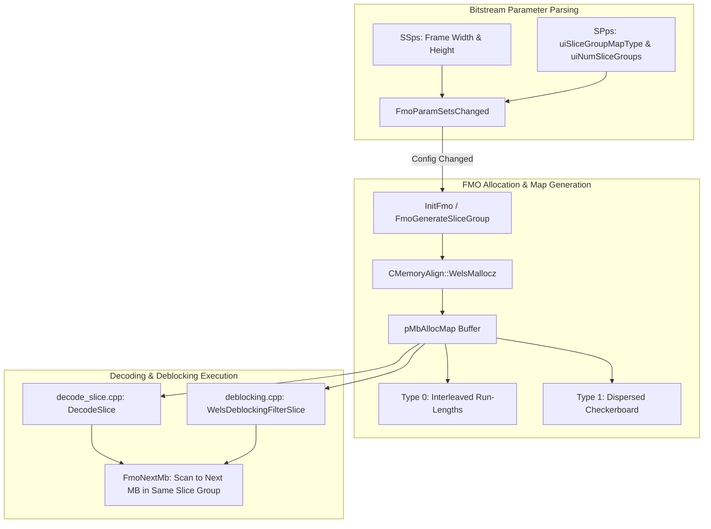
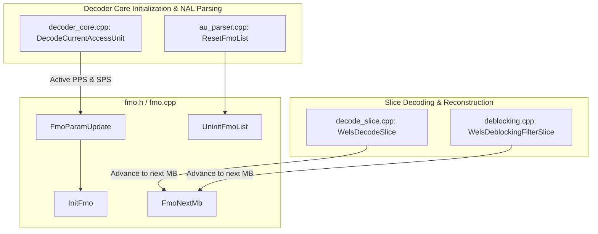

# OpenH264 Core Architecture: Flexible Macroblock Ordering (`fmo.h`)

This document provides an exhaustive, literate-programming-style technical specification for the **Flexible Macroblock Ordering (FMO)** subsystem in OpenH264 decoder core, declared in [`codec/decoder/core/inc/fmo.h`](openh264/codec/decoder/core/inc/fmo.h) and implemented in [`codec/decoder/core/src/fmo.cpp`](openh264/codec/decoder/core/src/fmo.cpp).

---

## Table of Contents
1. [Architectural Overview & Purpose](#1-architectural-overview--purpose)
2. [Data Types & Structures](#2-data-types--structures)
   - [2.1 Macroblock Identifier Typedef (`MB_XY_T`)](#21-macroblock-identifier-typedef-mb_xy_t)
   - [2.2 FMO Context Structure (`TagFmo` / `SFmo` / `PFmo`)](#22-fmo-context-structure-tagfmo--sfmo--pfmo)
3. [Algorithmic & Mathematical Specifications](#3-algorithmic--mathematical-specifications)
   - [3.1 Slice Group Map Type 0: Interleaved](#31-slice-group-map-type-0-interleaved)
   - [3.2 Slice Group Map Type 1: Dispersed (Checkerboard)](#32-slice-group-map-type-1-dispersed-checkerboard)
   - [3.3 Slice Group Map Types 2 to 6](#33-slice-group-map-types-2-to-6)
   - [3.4 Sequential Macroblock Traversal (`FmoNextMb`)](#34-sequential-macroblock-traversal-fmonextmb)
4. [Detailed Function & Method Specifications](#4-detailed-function--method-specifications)
   - [4.1 `InitFmo`](#41-initfmo)
   - [4.2 `UninitFmoList`](#42-uninitfmolist)
   - [4.3 `FmoParamUpdate`](#43-fmoparamupdate)
   - [4.4 `FmoNextMb`](#44-fmonextmb)
   - [4.5 Supporting Internal Functions (`fmo.cpp`)](#45-supporting-internal-functions-fmocpp)
5. [Subsystem Integration & Call Graph](#5-subsystem-integration--call-graph)
6. [Memory Management & Safety Invariants](#6-memory-management--safety-invariants)

---

## 1. Architectural Overview & Purpose

In standard H.264 / AVC (ITU-T H.264 / ISO/IEC 14496-10) decoding, macroblocks (MBs) are processed in sequential raster-scan order from the top-left corner $(0,0)$ to the bottom-right corner $(W-1, H-1)$. However, in wireless transmission and packet-switched streaming environments subject to packet loss, losing a contiguous slice in raster order creates large missing rectangular bands of pixels.

**Flexible Macroblock Ordering (FMO)** is an advanced error-resilience and spatial partitioning feature specified in **H.264 / AVC Recommendation Section 8.2.2** (*"Decoding process for macroblock to slice group map"*) and **Section 7.4.2.2** (*"Picture parameter set RBSP semantics"*).



### Core Responsibilities of `fmo.h`
1. **Slice Group Mapping**: Partitions the macroblock raster grid of dimensions $\text{iMbWidth} \times \text{iMbHeight}$ into up to $\text{MAX\_SLICEGROUP\_IDS} = 8$ distinct slice groups.
2. **Dynamic Map Allocation**: Allocates and caches a 1-byte-per-macroblock lookup map (`pMbAllocMap`) that indexes the slice group ID $g \in [0, N-1]$ for every macroblock location $i \in [0, \text{iCountMbNum}-1]$.
3. **Non-Raster MB Iteration**: Provides fast lookup via [`FmoNextMb`](#44-fmonextmb) so that macroblock decoding loops in [`decode_slice.cpp`](openh264/codec/decoder/core/src/decode_slice.cpp) and loop deblocking filters in [`deblocking.cpp`](openh264/codec/decoder/core/src/deblocking.cpp) can iterate contiguously through macroblocks assigned to the active slice.
4. **Lifecycle & PPS State Synchronization**: Maintains a table of up to `MAX_PPS_COUNT` (256) FMO state structures (`sFmoList`) inside [`SWelsDecoderContext`](openh264/codec/decoder/core/inc/decoder_context.h), ensuring that changes to active Picture Parameter Sets (PPS) or picture dimensions correctly trigger map reallocation and state invalidation.

---

## 2. Data Types & Structures

### 2.1 Macroblock Identifier Typedef (`MB_XY_T`)

Defined in [`fmo.h`](openh264/codec/decoder/core/inc/fmo.h#L50-L52):

```cpp
#ifndef MB_XY_T
#define MB_XY_T int32_t
#endif // MB_XY_T
```

* **Underlying Type**: Signed 32-bit integer (`int32_t`).
* **Semantic Meaning**: Represents the linear 1D raster index of a macroblock $i$, defined by:
  $$i = y \cdot \text{iMbWidth} + x$$
  where $x \in [0, \text{iMbWidth}-1]$ and $y \in [0, \text{iMbHeight}-1]$.
* **Special Sentinel Values**:
  * `-1`: Indicates an invalid macroblock index or the termination of macroblocks within the current slice group.

---

### 2.2 FMO Context Structure (`TagFmo` / `SFmo` / `PFmo`)

Defined in [`fmo.h`](openh264/codec/decoder/core/inc/fmo.h#L57-L64):

```cpp
typedef struct TagFmo {
  uint8_t*        pMbAllocMap;
  int32_t         iCountMbNum;
  int32_t         iSliceGroupCount;
  int32_t         iSliceGroupType;
  bool            bActiveFlag;
  uint8_t         uiReserved[3];          // reserved padding bytes
} SFmo, *PFmo;
```

#### Field-Level Technical Breakdown

| Field Name | Type | Size / Alignment | Description & Invariants |
| :--- | :--- | :--- | :--- |
| `pMbAllocMap` | `uint8_t*` | 8 bytes (64-bit ptr) | Heap-allocated array of size `iCountMbNum` bytes allocated via [`CMemoryAlign::WelsMallocz`](openh264/codec/common/inc/memory_align.h). Entry `pMbAllocMap[i]` stores the slice group ID $g \in [0, \text{iSliceGroupCount}-1]$ for macroblock index $i$. `NULL` when uninitialized. |
| `iCountMbNum` | `int32_t` | 4 bytes / 4-byte align | Total number of macroblocks in the active picture ($N_{\text{MB}} = \text{iMbWidth} \times \text{iMbHeight}$). Must be $\ge 0$. |
| `iSliceGroupCount` | `int32_t` | 4 bytes / 4-byte align | Number of slice groups configured for this FMO context ($N \in [1, 8]$). Default is $1$ (single slice group / standard raster). |
| `iSliceGroupType` | `int32_t` | 4 bytes / 4-byte align | H.264 slice group map type (`0` = Interleaved, `1` = Dispersed, `2`..`6` = Reserved/Unsupported). Reset value is `-1`. |
| `bActiveFlag` | `bool` | 1 byte / 1-byte align | `true` if this FMO context instance in `sFmoList` has been successfully initialized and contains valid memory; `false` otherwise. |
| `uiReserved[3]` | `uint8_t[3]` | 3 bytes / 1-byte align | Explicit padding bytes to ensure the structure payload size is a multiple of 4/8 bytes and maintain 32-bit data alignment across compilers. |

#### Memory Layout Diagram

```
+-------------------------------------------------------+
| Byte Offset | Field               | Size & Alignment  |
+-------------+---------------------+-------------------+
| 0x00 - 0x07 | pMbAllocMap         | 8 bytes (pointer) |
| 0x08 - 0x0B | iCountMbNum         | 4 bytes (int32_t) |
| 0x0C - 0x0F | iSliceGroupCount    | 4 bytes (int32_t) |
| 0x10 - 0x13 | iSliceGroupType     | 4 bytes (int32_t) |
| 0x14        | bActiveFlag         | 1 byte  (bool)    |
| 0x15 - 0x17 | uiReserved[0..2]    | 3 bytes (padding) |
+-------------------------------------------------------+
Total Struct Size: 24 bytes (on 64-bit architectures)
```

---

## 3. Algorithmic & Mathematical Specifications

### 3.1 Slice Group Map Type 0: Interleaved

Implemented in [`FmoGenerateMbAllocMapType0`](openh264/codec/decoder/core/src/fmo.cpp#L55-L81).

In Type 0, macroblocks are assigned to slice groups in contiguous runs defined by `uiRunLength[uiGroup]` in the Picture Parameter Set ([`SPps`](openh264/codec/decoder/core/inc/parameter_sets.h)). The assignment cycles cyclically through all slice groups $0, 1, \dots, N-1$ until all $N_{\text{MB}}$ macroblocks have been assigned.

```
       Run Group 0 (L0)       Run Group 1 (L1)       Run Group 0 (L0)
    +----------------------+----------------------+----------------------+
MB: | 0 | 1 | 2 | ... | L0 | L0+1 | ... | L0+L1   | L0+L1+1 | ...        |
    +----------------------+----------------------+----------------------+
Grp:|          0           |          1           |          0           |
```

#### Algorithmic Formulation

Let $N = \text{uiNumSliceGroups}$, $M = \text{iCountMbNum}$, and $L_g = \text{uiRunLength}[g]$:

$$\text{Initialize } i = 0$$
$$\text{Repeat until } i \ge M:$$
$$\quad \text{For each slice group } g \in [0, N-1] \text{ while } i < M:$$
$$\quad\quad \text{For } j = 0 \text{ to } L_g - 1 \text{ while } i + j < M:$$
$$\quad\quad\quad \text{pMbAllocMap}[i + j] = g$$
$$\quad\quad i \leftarrow i + L_g$$

---

### 3.2 Slice Group Map Type 1: Dispersed (Checkerboard)

Implemented in [`FmoGenerateMbAllocMapType1`](openh264/codec/decoder/core/src/fmo.cpp#L92-L108).

Type 1 mapping scatters macroblocks across slice groups in a 2D checkerboard dispersion pattern. This guarantees that spatial 4-neighbors (top, bottom, left, right) of any macroblock belong to different slice groups, maximizing error concealment effectiveness if a slice is lost.

#### Mathematical Equation

For a macroblock at linear index $i \in [0, N_{\text{MB}}-1]$ in a picture with macroblock width $W = \text{kiMbWidth}$ and slice group count $N = \text{uiNumSliceGroups}$:

$$\text{pMbAllocMap}[i] = \left( (i \bmod W) + \left\lfloor \frac{\lfloor i / W \rfloor \cdot N}{2} \right\rfloor \right) \bmod N$$

In integer C/C++ bitwise arithmetic as implemented in OpenH264:

```cpp
pFmo->pMbAllocMap[i] = (uint8_t)(((i % kiMbWidth) + (((i / kiMbWidth) * uiNumSliceGroups) >> 1)) % uiNumSliceGroups);
```

#### Visual Example ($W=4, H=4, N=2$)

| $(x,y)$ | $i = y \cdot 4 + x$ | $i \bmod 4$ | $y = \lfloor i/4 \rfloor$ | $(y \cdot 2) \gg 1$ | Calculation | Slice Group ID |
| :---: | :---: | :---: | :---: | :---: | :---: | :---: |
| $(0,0)$ | 0 | 0 | 0 | 0 | $(0 + 0) \bmod 2$ | **0** |
| $(1,0)$ | 1 | 1 | 0 | 0 | $(1 + 0) \bmod 2$ | **1** |
| $(2,0)$ | 2 | 2 | 0 | 0 | $(2 + 0) \bmod 2$ | **0** |
| $(3,0)$ | 3 | 3 | 0 | 0 | $(3 + 0) \bmod 2$ | **1** |
| $(0,1)$ | 4 | 0 | 1 | 1 | $(0 + 1) \bmod 2$ | **1** |
| $(1,1)$ | 5 | 1 | 1 | 1 | $(1 + 1) \bmod 2$ | **0** |
| $(2,1)$ | 6 | 2 | 1 | 1 | $(2 + 1) \bmod 2$ | **1** |
| $(3,1)$ | 7 | 3 | 1 | 1 | $(3 + 1) \bmod 2$ | **0** |

The resulting macroblock allocation grid forms an alternating checkerboard pattern:
```
Row 0: [0] [1] [0] [1]
Row 1: [1] [0] [1] [0]
Row 2: [0] [1] [0] [1]
Row 3: [1] [0] [1] [0]
```

---

### 3.3 Slice Group Map Types 2 to 6

* **Type 2 (Foreground / Background Boxes)**: Configured via bounding coordinates (`uiTopLeft` / `uiBottomRight`). Reserved in OpenH264 decoder.
* **Types 3 to 5 (Wipe Patterns)**: Box-out, raster wipe, and wipe patterns. Reserved in OpenH264 decoder.
* **Type 6 (Explicit Map)**: Explicit macroblock-by-macroblock assignment table signaled in PPS. Reserved in OpenH264 decoder.
* If a bitstream requests types 2–6 or an out-of-range type, [`FmoGenerateSliceGroup`](openh264/codec/decoder/core/src/fmo.cpp#L120-L176) returns `ERR_INFO_UNSUPPORTED_FMOTYPE` or a non-zero error code.

---

### 3.4 Sequential Macroblock Traversal (`FmoNextMb`)

Given current macroblock index $i_{\text{curr}}$, [`FmoNextMb`](openh264/codec/decoder/core/src/fmo.cpp#L302-L324) determines the next macroblock index $i_{\text{next}} > i_{\text{curr}}$ such that:

$$\text{pMbAllocMap}[i_{\text{next}}] = \text{pMbAllocMap}[i_{\text{curr}}]$$

If no subsequent macroblock belongs to the same slice group (or if $i_{\text{curr}}$ is the last macroblock in that group for the picture), the function returns $-1$.

---

## 4. Detailed Function & Method Specifications

### 4.1 `InitFmo`

```cpp
int32_t InitFmo (PFmo pFmo, PPps pPps, const int32_t kiMbWidth, const int32_t kiMbHeight, CMemoryAlign* pMa);
```

Declared in [`fmo.h:L77`](openh264/codec/decoder/core/inc/fmo.h#L77) and implemented in [`fmo.cpp:L188-L190`](openh264/codec/decoder/core/src/fmo.cpp#L188-L190).

* **Purpose**: Top-level initialization entry point for an FMO context. Dispatches to internal static routine `FmoGenerateSliceGroup`.
* **Parameters**:
  * `pFmo` (`PFmo`): Pointer to the [`SFmo`](#22-fmo-context-structure-tagfmo--sfmo--pfmo) context to initialize.
  * `pPps` (`PPps`): Pointer to the active Picture Parameter Set ([`SPps`](openh264/codec/decoder/core/inc/parameter_sets.h)).
  * `kiMbWidth` (`const int32_t`): Picture width measured in macroblocks ($W = \lceil \text{width} / 16 \rceil$).
  * `kiMbHeight` (`const int32_t`): Picture height measured in macroblocks ($H = \lceil \text{height} / 16 \rceil$).
  * `pMa` (`CMemoryAlign*`): Pointer to the aligned memory allocator instance.
* **Return Value**:
  * `ERR_NONE` (`0`): Successful initialization.
  * `ERR_INFO_INVALID_PARAM` (`1`): Invalid input pointers or null dimensions ($W \times H \le 0$).
  * `ERR_INFO_OUT_OF_MEMORY` (`2`): Failed heap allocation for `pMbAllocMap`.
  * `ERR_INFO_UNSUPPORTED_FMOTYPE`: Slice group map type is outside supported range ($> 1$).

---

### 4.2 `UninitFmoList`

```cpp
void UninitFmoList (PFmo pFmo, const int32_t kiCnt, const int32_t kiAvail, CMemoryAlign* pMa);
```

Declared in [`fmo.h:L88`](openh264/codec/decoder/core/inc/fmo.h#L88) and implemented in [`fmo.cpp:L202-L228`](openh264/codec/decoder/core/src/fmo.cpp#L202-L228).

* **Purpose**: Frees all dynamically allocated memory across the FMO table `sFmoList` in the decoder context and resets each entry to its uninitialized state.
* **Parameters**:
  * `pFmo` (`PFmo`): Pointer to the base of the `SFmo` array (typically `&pCtx->sFmoList[0]`).
  * `kiCnt` (`const int32_t`): Total capacity of the FMO array (`MAX_PPS_COUNT` = 256).
  * `kiAvail` (`const int32_t`): Current number of active/allocated FMO contexts (`pCtx->iActiveFmoNum`).
  * `pMa` (`CMemoryAlign*`): Memory allocator instance used to release `pMbAllocMap`.
* **Execution Logic**:
  1. Validates that `pFmo != NULL`, `kiAvail > 0`, and `kiCnt >= kiAvail`.
  2. Iterates through array elements $0 \le i < \text{kiCnt}$.
  3. If `pIter->bActiveFlag == true`:
     - Calls `pMa->WelsFree(pIter->pMbAllocMap, "pIter->pMbAllocMap")`.
     - Resets `pIter->pMbAllocMap = NULL`.
     - Resets `iSliceGroupCount = 0`, `iSliceGroupType = -1`, `iCountMbNum = 0`, `bActiveFlag = false`.
     - Increments `iFreeNodes`. Once `iFreeNodes >= kiAvail`, early-terminates the scan loop.

---

### 4.3 `FmoParamUpdate`

```cpp
int32_t FmoParamUpdate (PFmo pFmo, PSps pSps, PPps pPps, int32_t* pActiveFmoNum, CMemoryAlign* pMa);
```

Declared in [`fmo.h:L100`](openh264/codec/decoder/core/inc/fmo.h#L100) and implemented in [`fmo.cpp:L260-L274`](openh264/codec/decoder/core/src/fmo.cpp#L260-L274).

* **Purpose**: Verifies whether the FMO parameter state needs to be updated or reallocated for the current access unit. If parameters changed, it reallocates and recomputes the slice group map.
* **Parameters**:
  * `pFmo` (`PFmo`): Target FMO context pointer for the active PPS (`&pCtx->sFmoList[iPpsId]`).
  * `pSps` (`PSps`): Active Sequence Parameter Set ([`SSps`](openh264/codec/decoder/core/inc/parameter_sets.h)), providing `iMbWidth` and `iMbHeight`.
  * `pPps` (`PPps`): Active Picture Parameter Set ([`SPps`](openh264/codec/decoder/core/inc/parameter_sets.h)), providing `uiSliceGroupMapType` and `uiNumSliceGroups`.
  * `pActiveFmoNum` (`int32_t*`): In/out pointer tracking the total count of active FMO structures in the decoder context.
  * `pMa` (`CMemoryAlign*`): Aligned memory allocator instance.
* **Return Value**: `ERR_NONE` (`0`) on success, or error code returned by `InitFmo`.
* **State Machine Invariant**:
  ```cpp
  if (FmoParamSetsChanged(pFmo, kuiMbWidth * kuiMbHeight, pPps->uiSliceGroupMapType, pPps->uiNumSliceGroups)) {
    iRet = InitFmo(pFmo, pPps, kuiMbWidth, kuiMbHeight, pMa);
    if (iRet == ERR_NONE && !pFmo->bActiveFlag && *pActiveFmoNum < MAX_PPS_COUNT) {
      ++(*pActiveFmoNum);
      pFmo->bActiveFlag = true;
    }
  }
  ```

---

### 4.4 `FmoNextMb`

```cpp
MB_XY_T FmoNextMb (PFmo pFmo, const MB_XY_T kiMbXy);
```

Declared in [`fmo.h:L110`](openh264/codec/decoder/core/inc/fmo.h#L110) and implemented in [`fmo.cpp:L302-L324`](openh264/codec/decoder/core/src/fmo.cpp#L302-L324).

* **Purpose**: Returns the next macroblock index in raster sequence that belongs to the same slice group as `kiMbXy`.
* **Parameters**:
  * `pFmo` (`PFmo`): FMO context pointer.
  * `kiMbXy` (`const MB_XY_T`): Current macroblock linear index ($0 \le \text{kiMbXy} < N_{\text{MB}}$).
* **Return Value**:
  * Next macroblock raster index $i_{\text{next}} \in [0, N_{\text{MB}}-1]$ belonging to the same slice group.
  * `-1`: If `kiMbXy` is out of bounds, `pMbAllocMap` is `NULL`, or no further macroblocks in the picture belong to this slice group.
* **Control Flow**:
  ```mermaid
  flowchart TD
      Start([FmoNextMb pFmo, kiMbXy]) --> GetGroup[FmoMbToSliceGroup: Get Group ID of kiMbXy]
      GetGroup --> CheckValid{GroupID == -1 ?}
      CheckValid -- Yes --> RetNeg1([Return -1])
      CheckValid -- No --> Loop[++iNextMb]
      Loop --> CheckBound{iNextMb >= iCountMbNum ?}
      CheckBound -- Yes --> RetNeg1
      CheckBound -- No --> CheckMatch{pMbAllocMap[iNextMb] == GroupID ?}
      CheckMatch -- Yes --> RetNext([Return iNextMb])
      CheckMatch -- No --> Loop
  ```

---

### 4.5 Supporting Internal Functions (`fmo.cpp`)

The following internal static functions in [`fmo.cpp`](openh264/codec/decoder/core/src/fmo.cpp) support the public interface:

#### 1. `FmoGenerateSliceGroup`
```cpp
static inline int32_t FmoGenerateSliceGroup (PFmo pFmo, const PPps kpPps, const int32_t kiMbWidth,
                                             const int32_t kiMbHeight, CMemoryAlign* pMa);
```
* Frees previous `pFmo->pMbAllocMap` buffer if present.
* Allocates new `pMbAllocMap` of size $N_{\text{MB}} = \text{kiMbWidth} \times \text{kiMbHeight}$ using `pMa->WelsMallocz`.
* If `kpPps->uiNumSliceGroups < 2`, fills `pMbAllocMap` with `0` (single slice group mode) and sets `iSliceGroupCount = 1`.
* Otherwise, dispatches to `FmoGenerateMbAllocMapType0` (for Type 0) or `FmoGenerateMbAllocMapType1` (for Type 1).

#### 2. `FmoParamSetsChanged`
```cpp
bool FmoParamSetsChanged (PFmo pFmo, const int32_t kiCountNumMb, const int32_t kiSliceGroupType,
                          const int32_t kiSliceGroupCount);
```
* Returns `true` if `pFmo` is inactive (`!pFmo->bActiveFlag`) or if any dimension/configuration changed ($N_{\text{MB}} \ne \text{iCountMbNum}$, $\text{Type} \ne \text{iSliceGroupType}$, or $\text{Count} \ne \text{iSliceGroupCount}$).

#### 3. `FmoMbToSliceGroup`
```cpp
int32_t FmoMbToSliceGroup (PFmo pFmo, const MB_XY_T kiMbXy);
```
* Performs bounds check $0 \le \text{kiMbXy} < \text{pFmo->iCountMbNum}$ and returns `pFmo->pMbAllocMap[kiMbXy]`, or `-1` on out-of-bounds.

---

## 5. Subsystem Integration & Call Graph

FMO interacts directly with several core decoder subsystems:



### Call Sites in Decoder Subsystem
1. **[`decoder_core.cpp`](openh264/codec/decoder/core/src/decoder_core.cpp#L2651-L2655)**:
   Selects the active FMO context `pCtx->pFmo = &pCtx->sFmoList[iPpsId]` and calls `FmoParamUpdate` before slice parsing begins.
2. **[`decode_slice.cpp`](openh264/codec/decoder/core/src/decode_slice.cpp#L145)**:
   In `WelsDecodeSlice`, after completing reconstruction of macroblock `iMbXy`, calls `iNextMbXyIndex = FmoNextMb(pFmo, iNextMbXyIndex)` to locate the next macroblock index in the current slice group.
3. **[`deblocking.cpp`](openh264/codec/decoder/core/src/deblocking.cpp#L1265)**:
   During in-loop deblocking filter application, iterates over macroblocks belonging to the slice group via `FmoNextMb(pFmo, iNextMbXyIndex)`.
4. **[`au_parser.cpp`](openh264/codec/decoder/core/src/au_parser.cpp#L1790-L1796)**:
   Calls `ResetFmoList`, invoking `UninitFmoList` to clean up all allocated FMO maps upon decoder reset, parameter set flushing, or decoder destruction.

---

## 6. Memory Management & Safety Invariants

1. **Zero-Initialization**:
   All allocations use [`CMemoryAlign::WelsMallocz`](openh264/codec/common/inc/memory_align.h), ensuring all entries in `pMbAllocMap` default to `0` (Slice Group 0) prior to map generation.
2. **Reallocation Safety**:
   `FmoGenerateSliceGroup` safely frees existing allocations before requesting new heap buffers:
   ```cpp
   pMa->WelsFree(pFmo->pMbAllocMap, "_fmo->pMbAllocMap");
   pFmo->pMbAllocMap = (uint8_t*)pMa->WelsMallocz(iNumMb * sizeof(uint8_t), "_fmo->pMbAllocMap");
   ```
3. **Bounds Verification**:
   Both `FmoMbToSliceGroup` and `FmoNextMb` validate that input macroblock indices lie strictly within $[0, \text{iCountMbNum}-1]$ to prevent out-of-bounds buffer reads.
4. **Array Capacity Limits**:
   The number of slice groups is checked against `MAX_SLICEGROUP_IDS` (8), and the number of active FMO context instances is bounded by `MAX_PPS_COUNT` (256).
