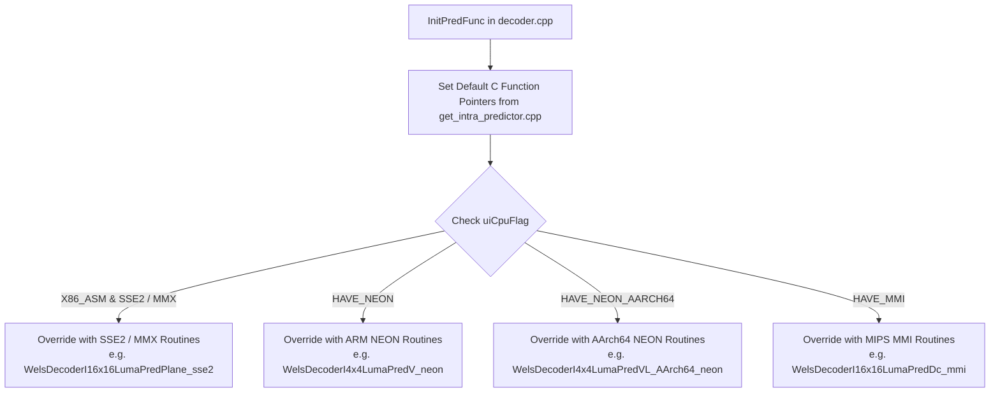
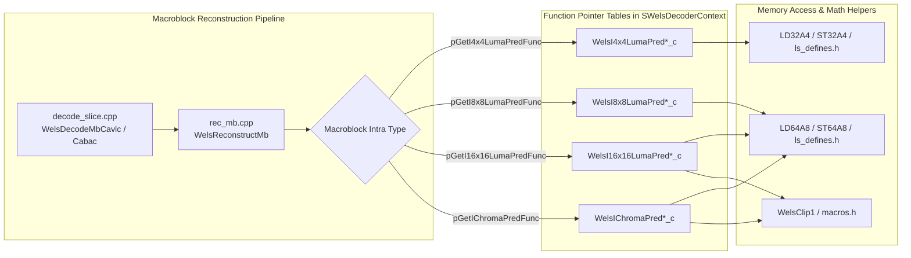

# OpenH264 Decoder: Intra Prediction Engine (`get_intra_predictor.cpp`)

This document provides a comprehensive, literate-programming-style technical analysis of [get_intra_predictor.cpp](openh264/codec/decoder/core/src/get_intra_predictor.cpp) and its associated header [get_intra_predictor.h](openh264/codec/decoder/core/inc/get_intra_predictor.h). It details the mathematical foundations, spatial pixel-domain reconstruction algorithms, memory layout models, SIMD dispatch architecture, and C++ fallback implementations for all Intra Prediction modes defined in the H.264 / AVC (ISO/IEC 14496-10 / ITU-T Rec. H.264) video decoding standard.

---

## Table of Contents
1. [Architectural Role & Pipeline Overview](#1-architectural-role--pipeline-overview)
2. [Data Types, Macros, Constants & Enums](#2-data-types-macros-constants--enums)
   - [2.1 Sizing Constants](#21-sizing-constants)
   - [2.2 Load/Store Memory Access Macros](#22-loadstore-memory-access-macros)
   - [2.3 Mathematical Helper Functions & Macros](#23-mathematical-helper-functions--macros)
   - [2.4 Intra Prediction Mode Constants & Enumerations](#24-intra-prediction-mode-constants--enumerations)
3. [Intra 4x4 Luma Prediction Functions](#3-intra-4x4-luma-prediction-functions)
   - [3.1 Directional & DC Modes (V, H, DC, DC Variants)](#31-directional--dc-modes-v-h-dc-dc-variants)
   - [3.2 Diagonal & Angular Modes (DDL, DDR, VL, VR, HU, HD & Top Fallbacks)](#32-diagonal--angular-modes-ddl-ddr-vl-vr-hu-hd--top-fallbacks)
4. [Intra 8x8 Luma Prediction Functions](#4-intra-8x8-luma-prediction-functions)
   - [4.1 High-Profile 8x8 Reference Smoothing Filter](#41-high-profile-8x8-reference-smoothing-filter)
   - [4.2 Directional & DC 8x8 Predictions](#42-directional--dc-8x8-predictions)
   - [4.3 Diagonal & Slanted 8x8 Predictions](#43-diagonal--slanted-8x8-predictions)
5. [Intra 8x8 Chroma Prediction Functions](#5-intra-8x8-chroma-prediction-functions)
   - [5.1 Chroma Vertical & Horizontal Modes](#51-chroma-vertical--horizontal-modes)
   - [5.2 Chroma Plane Prediction](#52-chroma-plane-prediction)
   - [5.3 Chroma 4-Sub-block DC Prediction & Fallbacks](#53-chroma-4-sub-block-dc-prediction--fallbacks)
6. [Intra 16x16 Luma Prediction Functions](#6-intra-16x16-luma-prediction-functions)
   - [6.1 16x16 Vertical & Horizontal Modes](#61-16x16-vertical--horizontal-modes)
   - [6.2 16x16 Plane Prediction Mode](#62-16x16-plane-prediction-mode)
   - [6.3 16x16 DC Prediction & Fallback Variants](#63-16x16-dc-prediction--fallback-variants)
7. [SIMD Hardware Acceleration & Dynamic Dispatching](#7-simd-hardware-acceleration--dynamic-dispatching)
8. [Call Graph & Interaction Matrix](#8-call-graph--interaction-matrix)

---

## 1. Architectural Role & Pipeline Overview

In the H.264 / AVC video decoding pipeline, **Intra-frame Prediction** exploits spatial correlation within a video frame by predicting target pixel blocks from previously decoded and reconstructed adjacent boundary pixels (top, left, top-left, and top-right neighbors).

```mermaid
flowchart TD
    subgraph Macroblock Decoding Loop in rec_mb.cpp / decode_slice.cpp
        MBType[Macroblock Type: Intra 4x4 / 8x8 / 16x16 / Chroma] --> PredSel[Select Prediction Mode Function Pointer]
        PredSel --> PredExec[Execute Intra Predictor Kernel<br/>(get_intra_predictor.cpp or SIMD)]
        PredExec --> PredBuf[Destination Pixel Plane: pPred]
        Residual[Inverse Quantized & IDCT Residuals: pRs] --> IDCTAdd[pCtx->pIdctResAddPredFunc]
        PredBuf --> IDCTAdd
        IDCTAdd --> ReconMB[Reconstructed Pixel Plane in Decoded Picture Buffer]
    end
```

### Key Characteristics of `get_intra_predictor.cpp`:
1. **Direct In-Place Buffer Writing**: Unlike reference software models that calculate intermediate prediction blocks in separate temporary scratch buffers, OpenH264 intra predictors write spatial predictions directly into the target macroblock buffer pointed to by `uint8_t* pPred` using a stride `kiStride`.
2. **Boundary-Sample Indexing Convention**: Neighboring boundary samples are accessed relative to the top-left sample of the current block `pPred[0]`:
   - **Top neighbors**: `pPred[-kiStride + x]` where $x \ge 0$.
   - **Left neighbors**: `pPred[-1 + y * kiStride]` where $y \ge 0$.
   - **Top-Left corner neighbor**: `pPred[-kiStride - 1]`.
   - **Top-Right neighbors**: `pPred[-kiStride + x]` where $x \ge 4$ (for 4x4) or $x \ge 8$ (for 8x8).
3. **C-Level Optimization via Word Replication & Aligned Access**: The implementations replace byte-by-byte loops and generic standard library calls (`memcpy`, `memset`) with fast 32-bit (`uint32_t`) and 64-bit (`uint64_t`) word loads and stores (`LD32A4`, `ST32A4`, `LD64A8`, `ST64A8`).

---

## 2. Data Types, Macros, Constants & Enums

### 2.1 Sizing Constants

Defined in [get_intra_predictor.cpp](openh264/codec/decoder/core/src/get_intra_predictor.cpp#L50-L52):

```cpp
#define I4x4_COUNT 4
#define I8x8_COUNT 8
#define I16x16_COUNT 16
```

| Constant | Value | Purpose |
| :--- | :--- | :--- |
| `I4x4_COUNT` | `4` | Number of horizontal/vertical samples in a $4 \times 4$ sub-block. |
| `I8x8_COUNT` | `8` | Dimension of an $8 \times 8$ luma or chroma block. |
| `I16x16_COUNT` | `16` | Dimension of a full $16 \times 16$ macroblock luma plane. |

---

### 2.2 Load/Store Memory Access Macros

Defined in [ls_defines.h](openh264/codec/common/inc/ls_defines.h#L33-L130):

```cpp
#define LD32(a)       (((struct tagUnaligned_32 *) (a))->l)
#define LD64(a)       (((struct tagUnaligned_64 *) (a))->l)
#define LD32A4(a)     (((struct tagUnaligned_32_4 *) (a))->l)
#define LD64A8(a)     (((struct tagUnaligned_64_8 *) (a))->l)
#define ST32A4(a, b)  (((struct tagUnaligned_32_4 *) (a))->l) = (b)
#define ST64A8(a, b)  (((struct tagUnaligned_64_8 *) (a))->l) = (b)
```

* **`LD32A4(p)` / `ST32A4(p, v)`**: Read/write a 32-bit unsigned integer (`uint32_t`, 4 bytes) from/to a memory address guaranteed to have at least **4-byte alignment**. Used for high-speed 4-pixel row operations.
* **`LD64A8(p)` / `ST64A8(p, v)`**: Read/write a 64-bit unsigned integer (`uint64_t`, 8 bytes) from/to a memory address with **8-byte alignment**. Used for 8-pixel row operations in 8x8 luma/chroma and 16x16 macroblock prediction.
* **Word Multiplication for Byte Broadcast**:
  - `0x01010101U * byte_val`: Broadcasts an 8-bit sample across all 4 bytes of a 32-bit word.
  - `0x0101010101010101ULL * byte_val`: Broadcasts an 8-bit sample across all 8 bytes of a 64-bit word.

---

### 2.3 Mathematical Helper Functions & Macros

Defined in [macros.h](openh264/codec/common/inc/macros.h#L186-L189):

```cpp
static inline uint8_t WelsClip1 (int32_t iX) {
  uint8_t uiTmp = (uint8_t) (((iX) & ~255) ? (- (iX) >> 31) : (iX));
  return uiTmp;
}
```

* **`WelsClip1(iX)`**: Fast branchless clamping of integer values to the 8-bit pixel range $[0, 255]$:
  $$\text{WelsClip1}(x) = \begin{cases} 0 & x < 0 \\ 255 & x > 255 \\ x & 0 \le x \le 255 \end{cases}$$

---

### 2.4 Intra Prediction Mode Constants & Enumerations

Defined in [wels_common_defs.h](openh264/codec/common/inc/wels_common_defs.h#L330-L373):

#### Intra 4x4 and Intra 8x8 Luma Modes (`I4_PRED_*`)

| Mode Macro | Index | Name / Direction | Description |
| :--- | :--- | :--- | :--- |
| `I4_PRED_V` | `0` | Vertical | Extrapolates vertically from top row. |
| `I4_PRED_H` | `1` | Horizontal | Extrapolates horizontally from left column. |
| `I4_PRED_DC` | `2` | DC (Both Available) | Averages available top and left neighbor samples. |
| `I4_PRED_DDL` | `3` | Diagonal Down-Left | Angular prediction at $45^\circ$ down-left. |
| `I4_PRED_DDR` | `4` | Diagonal Down-Right | Angular prediction at $45^\circ$ down-right. |
| `I4_PRED_VR` | `5` | Vertical-Right | Slanted angular prediction at $\approx 26.6^\circ$ right of vertical. |
| `I4_PRED_HD` | `6` | Horizontal-Down | Slanted angular prediction at $\approx 26.6^\circ$ below horizontal. |
| `I4_PRED_VL` | `7` | Vertical-Left | Slanted angular prediction at $\approx 26.6^\circ$ left of vertical. |
| `I4_PRED_HU` | `8` | Horizontal-Up | Slanted angular prediction at $\approx 26.6^\circ$ above horizontal. |
| `I4_PRED_DC_L` | `9` | DC (Left Available Only) | Fallback DC when top boundary is unavailable. |
| `I4_PRED_DC_T` | `10` | DC (Top Available Only) | Fallback DC when left boundary is unavailable. |
| `I4_PRED_DC_128` | `11` | DC (Neither Available) | Fallback constant $128$ for isolated blocks. |
| `I4_PRED_DDL_TOP` | `12` | Diagonal Down-Left (Top Only) | DDL fallback when top-right neighbors are missing. |
| `I4_PRED_VL_TOP` | `13` | Vertical-Left (Top Only) | VL fallback when top-right neighbors are missing. |

#### Intra 16x16 Luma Modes (`I16_PRED_*`) and Chroma 8x8 Modes (`C_PRED_*`)

| Macro | Index | Name | Mathematical Model |
| :--- | :--- | :--- | :--- |
| `I16_PRED_V` / `C_PRED_V` | `0` / `2` | Vertical | Broadcasts top boundary row across all lines. |
| `I16_PRED_H` / `C_PRED_H` | `1` / `1` | Horizontal | Broadcasts left boundary column across each row. |
| `I16_PRED_DC` / `C_PRED_DC` | `2` / `0` | DC | Averages available top and left boundary pixels. |
| `I16_PRED_P` / `C_PRED_P` | `3` / `3` | Plane | 2D linear spatial gradient surface fitting. |
| `I16_PRED_DC_L` / `C_PRED_DC_L` | `4` / `4` | DC Left Only | DC fallback using only left boundary column. |
| `I16_PRED_DC_T` / `C_PRED_DC_T` | `5` / `5` | DC Top Only | DC fallback using only top boundary row. |
| `I16_PRED_DC_128` / `C_PRED_DC_128`| `6` / `6` | DC Constant 128 | DC fallback returning uniform $128$. |

---

## 3. Intra 4x4 Luma Prediction Functions

All $4 \times 4$ luma prediction functions take the block pointer `uint8_t* pPred` and row stride `const int32_t kiStride`.

```
Neighboring Pixel Layout for 4x4 Intra Prediction:
(pPred - kiStride - 1)  [TL] [T0] [T1] [T2] [T3] [T4] [T5] [T6] [T7]
(pPred - 1)             [L0] (0,0) (1,0) (2,0) (3,0)
(pPred + kiStride - 1)  [L1] (0,1) (1,1) (2,1) (3,1)
(pPred + 2*kiStride - 1)[L2] (0,2) (1,2) (2,2) (3,2)
(pPred + 3*kiStride - 1)[L3] (0,3) (1,3) (2,3) (3,3)
```

---

### 3.1 Directional & DC Modes (V, H, DC, DC Variants)

#### [WelsI4x4LumaPredV_c](openh264/codec/decoder/core/src/get_intra_predictor.cpp#L54-L61)
- **Signature**: `void WelsI4x4LumaPredV_c (uint8_t* pPred, const int32_t kiStride)`
- **H.264 Model**: $pred4x4[x, y] = p[x, -1], \quad x, y \in \{0, 1, 2, 3\}$.
- **Implementation**:
  ```cpp
  const uint32_t kuiVal = LD32A4 (pPred - kiStride);
  ST32A4 (pPred, kuiVal);
  ST32A4 (pPred + kiStride, kuiVal);
  ST32A4 (pPred + (kiStride << 1), kuiVal);
  ST32A4 (pPred + (kiStride << 1) + kiStride, kuiVal);
  ```
  Loads all 4 top neighbor bytes in one 32-bit load `LD32A4` and replicates the word to all 4 destination rows.

#### [WelsI4x4LumaPredH_c](openh264/codec/decoder/core/src/get_intra_predictor.cpp#L63-L75)
- **Signature**: `void WelsI4x4LumaPredH_c (uint8_t* pPred, const int32_t kiStride)`
- **H.264 Model**: $pred4x4[x, y] = p[-1, y], \quad x, y \in \{0, 1, 2, 3\}$.
- **Implementation**: Multiplies each left pixel $L_y$ by `0x01010101U` to form 32-bit row words:
  $$kuiL_y = 0x01010101\text{U} \times p[-1 + y \cdot kiStride]$$

#### [WelsI4x4LumaPredDc_c](openh264/codec/decoder/core/src/get_intra_predictor.cpp#L77-L88)
- **Signature**: `void WelsI4x4LumaPredDc_c (uint8_t* pPred, const int32_t kiStride)`
- **H.264 Model**:
  $$\text{Mean} = \left( \sum_{x=0}^3 p[x, -1] + \sum_{y=0}^3 p[-1, y] + 4 \right) \gg 3$$
- **Implementation**: Sums 8 available neighbors, adds 4 for rounding, bitshifts right by 3, broadcasts to a 32-bit word, and stores across all 4 rows.

#### [WelsI4x4LumaPredDcLeft_c](openh264/codec/decoder/core/src/get_intra_predictor.cpp#L90-L100) & [WelsI4x4LumaPredDcTop_c](openh264/codec/decoder/core/src/get_intra_predictor.cpp#L102-L113)
- **Left Only**: $\text{Mean} = \left( \sum_{y=0}^3 p[-1, y] + 2 \right) \gg 2$.
- **Top Only**: $\text{Mean} = \left( \sum_{x=0}^3 p[x, -1] + 2 \right) \gg 2$.

#### [WelsI4x4LumaPredDcNA_c](openh264/codec/decoder/core/src/get_intra_predictor.cpp#L115-L122)
- **Neither Available**: Fills all rows with uniform value $128$ (`0x80808080U`).

---

### 3.2 Diagonal & Angular Modes (DDL, DDR, VL, VR, HU, HD & Top Fallbacks)

#### [WelsI4x4LumaPredDDL_c](openh264/codec/decoder/core/src/get_intra_predictor.cpp#L125-L151) (Diagonal Down-Left, Mode 3)
- **H.264 Model**: 3-tap lowpass filtering across top samples $T_0 \dots T_7$:
  $$DDL_k = (T_k + 2 T_{k+1} + T_{k+2} + 2) \gg 2, \quad k \in [0, 5]$$
  $$DDL_6 = (T_6 + 3 T_7 + 2) \gg 2$$
- **Fast Table-Lookup Array**: OpenH264 packs $DDL_0 \dots DDL_6$ into `kuiList[8]`. Each row $y$ is written via `ST32A4(pPred + y*kiStride, LD32(kuiList + y))`.

#### [WelsI4x4LumaPredDDLTop_c](openh264/codec/decoder/core/src/get_intra_predictor.cpp#L154-L177) (DDL Fallback)
- Used when top-right block is unavailable. Top-right samples $T_4..T_7$ are substituted by repeating $T_3$.

#### [WelsI4x4LumaPredDDR_c](openh264/codec/decoder/core/src/get_intra_predictor.cpp#L181-L217) (Diagonal Down-Right, Mode 4)
- Integrates Top-Left ($LT$), Left ($L_0..L_3$), and Top ($T_0..T_3$) samples:
  $$DDR_0 = (TL_0 + LT_0) \gg 2, \quad DDR_1 = (LT_0 + T_{01}) \gg 2, \quad \dots$$
  where $TL_0 = 1 + LT + L_0$, $LT_0 = 1 + LT + T_0$, $T_{ab} = 1 + T_a + T_b$, $L_{ab} = 1 + L_a + L_b$.

#### [WelsI4x4LumaPredVL_c](openh264/codec/decoder/core/src/get_intra_predictor.cpp#L221-L255) & [WelsI4x4LumaPredVR_c](openh264/codec/decoder/core/src/get_intra_predictor.cpp#L289-L317)
- **Vertical-Left (VL)**: Alternates 2-tap averaging $(T_a + T_b + 1) \gg 1$ and 3-tap filtering $(T_a + 2T_b + T_c + 2) \gg 2$.
- **Vertical-Right (VR)**: Computes slanted vertical predictions with rightward shift based on $(2x - y)$.

#### [WelsI4x4LumaPredHU_c](openh264/codec/decoder/core/src/get_intra_predictor.cpp#L320-L343) & [WelsI4x4LumaPredHD_c](openh264/codec/decoder/core/src/get_intra_predictor.cpp#L346-L381)
- **Horizontal-Up (HU)**: Evaluates horizontal slant $(x + 2y)$, clamping bottom boundary values to $L_3$.
- **Horizontal-Down (HD)**: Evaluates horizontal slant $(2y - x)$ combining left and top-left reference samples.

---

## 4. Intra 8x8 Luma Prediction Functions

Intra 8x8 prediction (used in H.264 High Profile) operates on $8 \times 8$ luma blocks and includes explicit reference smoothing and boundary availability flags `bool bTLAvail` (Top-Left available) and `bool bTRAvail` (Top-Right available).

### 4.1 High-Profile 8x8 Reference Smoothing Filter

Before intra 8x8 prediction is performed, reference samples along the top row $p[x, -1]$ and left column $p[-1, y]$ are passed through a 3-tap lowpass smoothing filter:

$$p'[x, -1] = (p[x-1, -1] + 2 p[x, -1] + p[x+1, -1] + 2) \gg 2$$

Boundary sample adaptations in [get_intra_predictor.cpp](openh264/codec/decoder/core/src/get_intra_predictor.cpp#L393-L400):
- If `bTLAvail` is **true**: $p'[-1, -1] = p[-1, -1]$ is used as the left edge for $x=0$.
- If `bTLAvail` is **false**: $p'[0, -1] = (3 \cdot p[0, -1] + p[1, -1] + 2) \gg 2$.
- If `bTRAvail` is **true**: $p[8, -1]$ is included in the filter for $x=7$.
- If `bTRAvail` is **false**: $p'[7, -1] = (p[6, -1] + 3 \cdot p[7, -1] + 2) \gg 2$.

---

### 4.2 Directional & DC 8x8 Predictions

#### [WelsI8x8LumaPredV_c](openh264/codec/decoder/core/src/get_intra_predictor.cpp#L383-L409)
1. Filters 8 top reference samples into `uiPixelFilterT[8]`.
2. Packs the 8 bytes into a single 64-bit unsigned integer `uiTop`:
   $$\text{uiTop} = \sum_{i=0}^7 \text{uiPixelFilterT}[i] \ll (8 \cdot i)$$
3. Writes `uiTop` to all 8 rows using `ST64A8 (pPred + kiStride * i, uiTop)`.

#### [WelsI8x8LumaPredH_c](openh264/codec/decoder/core/src/get_intra_predictor.cpp#L411-L434)
1. Filters 8 left reference samples into `uiPixelFilterL[8]`.
2. For each row $i \in [0, 7]$, broadcasts the filtered byte across 64 bits:
   $$\text{uiLeft} = 0x0101010101010101\text{ULL} \times \text{uiPixelFilterL}[i]$$
3. Stores `uiLeft` to row $i$ via `ST64A8`.

#### [WelsI8x8LumaPredDc_c](openh264/codec/decoder/core/src/get_intra_predictor.cpp#L436-L472)
1. Filters both left and top boundary samples.
2. Accumulates 16 filtered samples into `uiTotal`.
3. Computes 8-bit mean:
   $$\text{kuiMean} = (\text{uiTotal} + 8) \gg 4$$
4. Broadcasts to 64-bit integer `kuiMean64 = 0x0101010101010101ULL * kuiMean` and stores across 8 rows.

---

### 4.3 Diagonal & Slanted 8x8 Predictions

The remaining 8x8 modes implement the H.264 Section 8.3.2.2 prediction formulas:
- **[WelsI8x8LumaPredDDL_c](openh264/codec/decoder/core/src/get_intra_predictor.cpp#L550-L576)** / **[DDLTop](openh264/codec/decoder/core/src/get_intra_predictor.cpp#L579-L609)**: Diagonal down-left over 16 top samples.
- **[WelsI8x8LumaPredDDR_c](openh264/codec/decoder/core/src/get_intra_predictor.cpp#L612-L659)**: Diagonal down-right indexing $(x - y)$.
- **[WelsI8x8LumaPredVL_c](openh264/codec/decoder/core/src/get_intra_predictor.cpp#L662-L691)** / **[VLTop](openh264/codec/decoder/core/src/get_intra_predictor.cpp#L694-L727)**: Vertical-left indexing $(x + (y \gg 1))$.
- **[WelsI8x8LumaPredVR_c](openh264/codec/decoder/core/src/get_intra_predictor.cpp#L730-L785)**: Vertical-right indexing $izVR = 2x - y$.
- **[WelsI8x8LumaPredHU_c](openh264/codec/decoder/core/src/get_intra_predictor.cpp#L788-L823)**: Horizontal-up indexing $izHU = x + 2y$.
- **[WelsI8x8LumaPredHD_c](openh264/codec/decoder/core/src/get_intra_predictor.cpp#L826-L881)**: Horizontal-down indexing $izHD = 2y - x$.

---

## 5. Intra 8x8 Chroma Prediction Functions

Intra Chroma prediction applies to both Cb and Cr chroma planes ($8 \times 8$ blocks for 4:2:0 sampling).

### 5.1 Chroma Vertical & Horizontal Modes

#### [WelsIChromaPredV_c](openh264/codec/decoder/core/src/get_intra_predictor.cpp#L884-L897)
Loads top 8 chroma samples via `LD64A8 (&pPred[-kiStride])` and stores the 64-bit word to all 8 rows via `ST64A8`.

#### [WelsIChromaPredH_c](openh264/codec/decoder/core/src/get_intra_predictor.cpp#L899-L911)
Iterates backwards from row 7 to row 0, broadcasting each left neighbor `pPred[iTmp - 1]` to 64 bits (`0x0101010101010101ULL * kuiVal8`) and storing via `ST64A8`.

---

### 5.2 Chroma Plane Prediction

#### [WelsIChromaPredPlane_c](openh264/codec/decoder/core/src/get_intra_predictor.cpp#L914-L937)

Implements H.264 Section 8.3.4.4 linear spatial plane fitting:

```
Top samples:  pTop[0..7]  at pPred[-kiStride + x]
Left samples: pLeft[0..7] at pPred[-1 + y * kiStride]
```

1. **Horizontal and Vertical Gradient Accumulation**:
   $$H = \sum_{i=0}^3 (i + 1) \cdot \left( pTop[4 + i] - pTop[2 - i] \right)$$
   $$V = \sum_{i=0}^3 (i + 1) \cdot \left( pLeft[(4 + i) \cdot kiStride] - pLeft[(2 - i) \cdot kiStride] \right)$$

2. **Plane Parameters ($a, b, c$)**:
   $$a = 16 \cdot (pLeft[7 \cdot kiStride] + pTop[7])$$
   $$b = (17 \cdot H + 16) \gg 5$$
   $$c = (17 \cdot V + 16) \gg 5$$

3. **Pixel Evaluation & Clamping**:
   $$pred[x, y] = \text{WelsClip1}\left( (a + b \cdot (x - 3) + c \cdot (y - 3) + 16) \gg 5 \right)$$

---

### 5.3 Chroma 4-Sub-block DC Prediction & Fallbacks

#### [WelsIChromaPredDc_c](openh264/codec/decoder/core/src/get_intra_predictor.cpp#L940-L969)

Unlike luma DC modes which use a single uniform mean for the entire block, H.264 Chroma DC prediction divides the $8 \times 8$ chroma block into **four $4 \times 4$ quadrants**:

```
+-------------------+-------------------+
| Quadrant 0 (M1)   | Quadrant 1 (M2)   |
| (Top-Left 4x4)    | (Top-Right 4x4)   |
+-------------------+-------------------+
| Quadrant 2 (M3)   | Quadrant 3 (M4)   |
| (Bottom-Left 4x4) | (Bottom-Right 4x4)|
+-------------------+-------------------+
```

Mathematical definitions for the 4 quadrant means:
- **$M_1$ (Top-Left 4x4)**:
  $$M_1 = \left( \sum_{x=0}^3 pTop[x] + \sum_{y=0}^3 pLeft[y \cdot kiStride] + 4 \right) \gg 3$$
- **$M_2$ (Top-Right 4x4)**:
  $$M_2 = \left( \sum_{x=4}^7 pTop[x] + 2 \right) \gg 2$$
- **$M_3$ (Bottom-Left 4x4)**:
  $$M_3 = \left( \sum_{y=4}^7 pLeft[y \cdot kiStride] + 2 \right) \gg 2$$
- **$M_4$ (Bottom-Right 4x4)**:
  $$M_4 = \left( \sum_{x=4}^7 pTop[x] + \sum_{y=4}^7 pLeft[y \cdot kiStride] + 4 \right) \gg 3$$

**Storage Strategy**:
- Upper 4 rows are written with `kuiUP64` = `[M1, M1, M1, M1, M2, M2, M2, M2]`.
- Lower 4 rows are written with `kuiDN64` = `[M3, M3, M3, M3, M4, M4, M4, M4]`.

---

## 6. Intra 16x16 Luma Prediction Functions

Intra 16x16 prediction is selected for smooth, low-detail macroblock regions.

### 6.1 16x16 Vertical & Horizontal Modes

#### [WelsI16x16LumaPredV_c](openh264/codec/decoder/core/src/get_intra_predictor.cpp#L1024-L1036)
Loads two 64-bit words for the 16 top samples:
```cpp
const uint64_t kuiTop1 = LD64A8 (pPred - kiStride);
const uint64_t kuiTop2 = LD64A8 (pPred - kiStride + 8);
```
Writes `kuiTop1` to offset `+0` and `kuiTop2` to offset `+8` for each of the 16 rows.

#### [WelsI16x16LumaPredH_c](openh264/codec/decoder/core/src/get_intra_predictor.cpp#L1038-L1051)
Replicates each left neighbor byte $p[-1, y]$ across a 64-bit integer `kuiVal64`, storing `kuiVal64` twice per row (covering all 16 columns).

---

### 6.2 16x16 Plane Prediction Mode

#### [WelsI16x16LumaPredPlane_c](openh264/codec/decoder/core/src/get_intra_predictor.cpp#L1053-L1076)

Implements H.264 Section 8.3.3.4 16x16 plane prediction:

1. **Gradients $H$ and $V$**:
   $$H = \sum_{i=0}^7 (i + 1) \cdot \left( pTop[8 + i] - pTop[6 - i] \right)$$
   $$V = \sum_{i=0}^7 (i + 1) \cdot \left( pLeft[(8 + i) \cdot kiStride] - pLeft[(6 - i) \cdot kiStride] \right)$$

2. **Plane Equation Coefficients**:
   $$a = 16 \cdot (pLeft[15 \cdot kiStride] + pTop[15])$$
   $$b = (5 \cdot H + 32) \gg 6$$
   $$c = (5 \cdot V + 32) \gg 6$$

3. **Surface Sample Generation**:
   $$pred[x, y] = \text{WelsClip1}\left( (a + b \cdot (x - 7) + c \cdot (y - 7) + 16) \gg 5 \right)$$

---

### 6.3 16x16 DC Prediction & Fallback Variants

- **[WelsI16x16LumaPredDc_c](openh264/codec/decoder/core/src/get_intra_predictor.cpp#L1078-L1097)**: Sums all 16 left and 16 top boundary samples ($32 \text{ samples}$ total):
  $$\text{uiMean} = \left( 16 + \sum_{y=0}^{15} p[-1, y] + \sum_{x=0}^{15} p[x, -1] \right) \gg 5$$
  Fills each 16-byte row using `memset(&pPred[iTmp], uiMean, 16)`.
- **[WelsI16x16LumaPredDcTop_c](openh264/codec/decoder/core/src/get_intra_predictor.cpp#L1100-L1117)**: $\text{uiMean} = \left( 8 + \sum_{x=0}^{15} p[x, -1] \right) \gg 4$.
- **[WelsI16x16LumaPredDcLeft_c](openh264/codec/decoder/core/src/get_intra_predictor.cpp#L1119-L1142)**: $\text{uiMean} = \left( 8 + \sum_{y=0}^{15} p[-1, y] \right) \gg 4$. Replicates `uiMean` across 64 bits and stores via `ST64A8`.
- **[WelsI16x16LumaPredDcNA_c](openh264/codec/decoder/core/src/get_intra_predictor.cpp#L1144-L1155)**: Stores constant `0x8080808080808080ULL` ($128$) across all 16 rows.

---

## 7. SIMD Hardware Acceleration & Dynamic Dispatching

During decoder initialization in [decoder.cpp](openh264/codec/decoder/core/src/decoder.cpp#L1006-L1145), the function pointers in `SWelsDecoderContext` are initially populated with the C routines in [get_intra_predictor.cpp](openh264/codec/decoder/core/src/get_intra_predictor.cpp). When CPU feature detection flags (`uiCpuFlag`) indicate SIMD extensions are present, high-performance assembly routines dynamically override the C defaults:



### SIMD Function Pointer Mapping Table

| Prediction Mode | C Fallback Routine | x86 (SSE2 / MMX) Assembly | ARM AArch64 NEON Assembly |
| :--- | :--- | :--- | :--- |
| **I4x4 Vertical** | `WelsI4x4LumaPredV_c` | *(Inlined or C)* | `WelsDecoderI4x4LumaPredV_neon` |
| **I4x4 Horizontal** | `WelsI4x4LumaPredH_c` | `WelsDecoderI4x4LumaPredH_sse2` | `WelsDecoderI4x4LumaPredH_AArch64_neon` |
| **I4x4 DDL** | `WelsI4x4LumaPredDDL_c` | `WelsDecoderI4x4LumaPredDDL_mmx` | `WelsDecoderI4x4LumaPredDDL_AArch64_neon` |
| **I4x4 DDR** | `WelsI4x4LumaPredDDR_c` | `WelsDecoderI4x4LumaPredDDR_mmx` | `WelsDecoderI4x4LumaPredDDR_neon` |
| **I4x4 VL** | `WelsI4x4LumaPredVL_c` | `WelsDecoderI4x4LumaPredVL_mmx` | `WelsDecoderI4x4LumaPredVL_AArch64_neon` |
| **I4x4 VR** | `WelsI4x4LumaPredVR_c` | `WelsDecoderI4x4LumaPredVR_mmx` | `WelsDecoderI4x4LumaPredVR_AArch64_neon` |
| **I4x4 HU** | `WelsI4x4LumaPredHU_c` | `WelsDecoderI4x4LumaPredHU_mmx` | `WelsDecoderI4x4LumaPredHU_AArch64_neon` |
| **I4x4 HD** | `WelsI4x4LumaPredHD_c` | `WelsDecoderI4x4LumaPredHD_mmx` | `WelsDecoderI4x4LumaPredHD_AArch64_neon` |
| **I16x16 Vertical** | `WelsI16x16LumaPredV_c` | `WelsDecoderI16x16LumaPredV_sse2` | `WelsDecoderI16x16LumaPredV_AArch64_neon` |
| **I16x16 Horizontal** | `WelsI16x16LumaPredH_c` | `WelsDecoderI16x16LumaPredH_sse2` | `WelsDecoderI16x16LumaPredH_AArch64_neon` |
| **I16x16 DC** | `WelsI16x16LumaPredDc_c` | `WelsDecoderI16x16LumaPredDc_sse2` | `WelsDecoderI16x16LumaPredDc_AArch64_neon` |
| **I16x16 Plane** | `WelsI16x16LumaPredPlane_c` | `WelsDecoderI16x16LumaPredPlane_sse2` | `WelsDecoderI16x16LumaPredPlane_AArch64_neon` |
| **Chroma Plane** | `WelsIChromaPredPlane_c` | `WelsDecoderIChromaPredPlane_sse2` | `WelsDecoderIChromaPredPlane_AArch64_neon` |
| **Chroma DC** | `WelsIChromaPredDc_c` | `WelsDecoderIChromaPredDc_sse2` | `WelsDecoderIChromaPredDc_AArch64_neon` |

---

## 8. Call Graph & Interaction Matrix



### Complete Summary of Exported C Functions in `get_intra_predictor.cpp`

| Category | Function Name | Line Range | Primary Behavior |
| :--- | :--- | :--- | :--- |
| **Intra 4x4** | `WelsI4x4LumaPredV_c` | [L54-L61](openh264/codec/decoder/core/src/get_intra_predictor.cpp#L54-L61) | Replicates top 4 bytes to 4 rows. |
| **Intra 4x4** | `WelsI4x4LumaPredH_c` | [L63-L75](openh264/codec/decoder/core/src/get_intra_predictor.cpp#L63-L75) | Replicates left 4 bytes across each row. |
| **Intra 4x4** | `WelsI4x4LumaPredDc_c` | [L77-L88](openh264/codec/decoder/core/src/get_intra_predictor.cpp#L77-L88) | 8-neighbor average DC. |
| **Intra 4x4** | `WelsI4x4LumaPredDcLeft_c` | [L90-L100](openh264/codec/decoder/core/src/get_intra_predictor.cpp#L90-L100) | 4-left-neighbor average DC. |
| **Intra 4x4** | `WelsI4x4LumaPredDcTop_c` | [L102-L113](openh264/codec/decoder/core/src/get_intra_predictor.cpp#L102-L113) | 4-top-neighbor average DC. |
| **Intra 4x4** | `WelsI4x4LumaPredDcNA_c` | [L115-L122](openh264/codec/decoder/core/src/get_intra_predictor.cpp#L115-L122) | Constant 128 fill. |
| **Intra 4x4** | `WelsI4x4LumaPredDDL_c` | [L125-L151](openh264/codec/decoder/core/src/get_intra_predictor.cpp#L125-L151) | Diagonal down-left 3-tap filter. |
| **Intra 4x4** | `WelsI4x4LumaPredDDLTop_c` | [L154-L177](openh264/codec/decoder/core/src/get_intra_predictor.cpp#L154-L177) | DDL fallback for missing top-right. |
| **Intra 4x4** | `WelsI4x4LumaPredDDR_c` | [L181-L217](openh264/codec/decoder/core/src/get_intra_predictor.cpp#L181-L217) | Diagonal down-right 3-tap filter. |
| **Intra 4x4** | `WelsI4x4LumaPredVL_c` | [L221-L255](openh264/codec/decoder/core/src/get_intra_predictor.cpp#L221-L255) | Vertical-left slanted filter. |
| **Intra 4x4** | `WelsI4x4LumaPredVLTop_c` | [L258-L285](openh264/codec/decoder/core/src/get_intra_predictor.cpp#L258-L285) | VL fallback for missing top-right. |
| **Intra 4x4** | `WelsI4x4LumaPredVR_c` | [L289-L317](openh264/codec/decoder/core/src/get_intra_predictor.cpp#L289-L317) | Vertical-right slanted filter. |
| **Intra 4x4** | `WelsI4x4LumaPredHU_c` | [L320-L343](openh264/codec/decoder/core/src/get_intra_predictor.cpp#L320-L343) | Horizontal-up slanted filter. |
| **Intra 4x4** | `WelsI4x4LumaPredHD_c` | [L346-L381](openh264/codec/decoder/core/src/get_intra_predictor.cpp#L346-L381) | Horizontal-down slanted filter. |
| **Intra 8x8** | `WelsI8x8LumaPredV_c` | [L383-L409](openh264/codec/decoder/core/src/get_intra_predictor.cpp#L383-L409) | 8x8 smoothed vertical prediction. |
| **Intra 8x8** | `WelsI8x8LumaPredH_c` | [L411-L434](openh264/codec/decoder/core/src/get_intra_predictor.cpp#L411-L434) | 8x8 smoothed horizontal prediction. |
| **Intra 8x8** | `WelsI8x8LumaPredDc_c` | [L436-L472](openh264/codec/decoder/core/src/get_intra_predictor.cpp#L436-L472) | 8x8 smoothed 16-sample DC. |
| **Intra 8x8** | `WelsI8x8LumaPredDcLeft_c` | [L474-L503](openh264/codec/decoder/core/src/get_intra_predictor.cpp#L474-L503) | 8x8 smoothed 8-left DC. |
| **Intra 8x8** | `WelsI8x8LumaPredDcTop_c` | [L505-L534](openh264/codec/decoder/core/src/get_intra_predictor.cpp#L505-L534) | 8x8 smoothed 8-top DC. |
| **Intra 8x8** | `WelsI8x8LumaPredDcNA_c` | [L536-L547](openh264/codec/decoder/core/src/get_intra_predictor.cpp#L536-L547) | 8x8 constant 128 fill. |
| **Intra 8x8** | `WelsI8x8LumaPredDDL_c` | [L550-L576](openh264/codec/decoder/core/src/get_intra_predictor.cpp#L550-L576) | 8x8 diagonal down-left. |
| **Intra 8x8** | `WelsI8x8LumaPredDDLTop_c` | [L579-L609](openh264/codec/decoder/core/src/get_intra_predictor.cpp#L579-L609) | 8x8 DDL fallback. |
| **Intra 8x8** | `WelsI8x8LumaPredDDR_c` | [L612-L659](openh264/codec/decoder/core/src/get_intra_predictor.cpp#L612-L659) | 8x8 diagonal down-right. |
| **Intra 8x8** | `WelsI8x8LumaPredVL_c` | [L662-L691](openh264/codec/decoder/core/src/get_intra_predictor.cpp#L662-L691) | 8x8 vertical-left. |
| **Intra 8x8** | `WelsI8x8LumaPredVLTop_c` | [L694-L727](openh264/codec/decoder/core/src/get_intra_predictor.cpp#L694-L727) | 8x8 VL fallback. |
| **Intra 8x8** | `WelsI8x8LumaPredVR_c` | [L730-L785](openh264/codec/decoder/core/src/get_intra_predictor.cpp#L730-L785) | 8x8 vertical-right. |
| **Intra 8x8** | `WelsI8x8LumaPredHU_c` | [L788-L823](openh264/codec/decoder/core/src/get_intra_predictor.cpp#L788-L823) | 8x8 horizontal-up. |
| **Intra 8x8** | `WelsI8x8LumaPredHD_c` | [L826-L881](openh264/codec/decoder/core/src/get_intra_predictor.cpp#L826-L881) | 8x8 horizontal-down. |
| **Chroma 8x8** | `WelsIChromaPredV_c` | [L884-L897](openh264/codec/decoder/core/src/get_intra_predictor.cpp#L884-L897) | 8x8 chroma vertical. |
| **Chroma 8x8** | `WelsIChromaPredH_c` | [L899-L911](openh264/codec/decoder/core/src/get_intra_predictor.cpp#L899-L911) | 8x8 chroma horizontal. |
| **Chroma 8x8** | `WelsIChromaPredPlane_c` | [L914-L937](openh264/codec/decoder/core/src/get_intra_predictor.cpp#L914-L937) | 8x8 chroma linear plane gradient. |
| **Chroma 8x8** | `WelsIChromaPredDc_c` | [L940-L969](openh264/codec/decoder/core/src/get_intra_predictor.cpp#L940-L969) | 8x8 chroma 4-quadrant DC. |
| **Chroma 8x8** | `WelsIChromaPredDcLeft_c` | [L971-L993](openh264/codec/decoder/core/src/get_intra_predictor.cpp#L971-L993) | 8x8 chroma left-only DC. |
| **Chroma 8x8** | `WelsIChromaPredDcTop_c` | [L995-L1010](openh264/codec/decoder/core/src/get_intra_predictor.cpp#L995-L1010) | 8x8 chroma top-only DC. |
| **Chroma 8x8** | `WelsIChromaPredDcNA_c` | [L1012-L1022](openh264/codec/decoder/core/src/get_intra_predictor.cpp#L1012-L1022) | 8x8 chroma constant 128 fill. |
| **Intra 16x16** | `WelsI16x16LumaPredV_c` | [L1024-L1036](openh264/codec/decoder/core/src/get_intra_predictor.cpp#L1024-L1036) | 16x16 vertical prediction. |
| **Intra 16x16** | `WelsI16x16LumaPredH_c` | [L1038-L1051](openh264/codec/decoder/core/src/get_intra_predictor.cpp#L1038-L1051) | 16x16 horizontal prediction. |
| **Intra 16x16** | `WelsI16x16LumaPredPlane_c` | [L1053-L1076](openh264/codec/decoder/core/src/get_intra_predictor.cpp#L1053-L1076) | 16x16 linear plane gradient. |
| **Intra 16x16** | `WelsI16x16LumaPredDc_c` | [L1078-L1097](openh264/codec/decoder/core/src/get_intra_predictor.cpp#L1078-L1097) | 16x16 32-sample DC prediction. |
| **Intra 16x16** | `WelsI16x16LumaPredDcTop_c` | [L1100-L1117](openh264/codec/decoder/core/src/get_intra_predictor.cpp#L1100-L1117) | 16x16 16-top DC prediction. |
| **Intra 16x16** | `WelsI16x16LumaPredDcLeft_c` | [L1119-L1142](openh264/codec/decoder/core/src/get_intra_predictor.cpp#L1119-L1142) | 16x16 16-left DC prediction. |
| **Intra 16x16** | `WelsI16x16LumaPredDcNA_c` | [L1144-L1155](openh264/codec/decoder/core/src/get_intra_predictor.cpp#L1144-L1155) | 16x16 constant 128 fill. |
