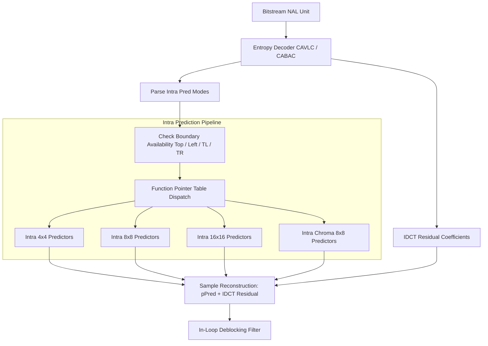
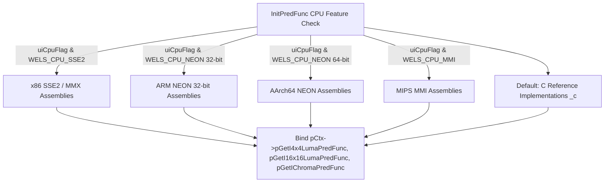

# OpenH264 Decoder Core: Intra Prediction Engine (`get_intra_predictor.h`)

This document provides a comprehensive, literate-programming-style technical reference for [get_intra_predictor.h](openh264/codec/decoder/core/inc/get_intra_predictor.h) and its implementation in [get_intra_predictor.cpp](openh264/codec/decoder/core/src/get_intra_predictor.cpp). It covers the spatial intra prediction subsystem of the H.264/AVC (ITU-T H.264 / ISO/IEC 14496-10) video decoder in Cisco OpenH264.

---

## Table of Contents
1. [High-Level Module & Architectural Purpose](#1-high-level-module--architectural-purpose)
2. [Data Types, Function Pointer Definitions, and Constants](#2-data-types-function-pointer-definitions-and-constants)
3. [Memory Layout & Neighbor Sample Access Conventions](#3-memory-layout--neighbor-sample-access-conventions)
4. [Intra 4x4 Luma Prediction Functions](#4-intra-4x4-luma-prediction-functions)
5. [Intra 8x8 Luma Prediction Functions (High Profile)](#5-intra-8x8-luma-prediction-functions-high-profile)
6. [Intra Chroma 8x8 Prediction Functions](#6-intra-chroma-8x8-prediction-functions)
7. [Intra 16x16 Luma Prediction Functions](#7-intra-16x16-luma-prediction-functions)
8. [SIMD & Hardware-Accelerated Architecture Variants](#8-simd--hardware-accelerated-architecture-variants)
9. [Integration & Call Graph Interaction](#9-integration--call-graph-interaction)

---

## 1. High-Level Module & Architectural Purpose

In H.264/AVC video coding, **Intra-frame Prediction** exploits spatial redundancy within the current decoded picture. Instead of transmitting raw pixel blocks, the encoder predicts the pixel values of the current macroblock (or sub-block) from previously reconstructed adjacent boundary samples located immediately above (Top), above-right (Top-Right), above-left (Top-Left), and to the left (Left) of the target block. The decoder executes the identical spatial prediction algorithm and adds the decoded inverse-quantized/inverse-transformed (IDCT) residual to the predicted samples to reconstruct the output image.



### Key Responsibilities of `get_intra_predictor.h`
1. **Interface Declarations**: Declares the full suite of C/C++ reference intra prediction functions for $4 \times 4$ Luma, $8 \times 8$ Luma (High Profile), $8 \times 8$ Chroma ($Cb$ and $Cr$), and $16 \times 16$ Luma partitions.
2. **Hardware Acceleration Facade**: Declares platform-optimized SIMD routines written in handwritten assembly for **x86/x86_64** (MMX, SSE2), **ARMv7 NEON**, **AArch64 NEON**, and **MIPS MMI**.
3. **In-Place Buffer Prediction**: Functions write predicted samples directly to destination memory buffers (`pPred`) pointed to by the macroblock reconstruction engine, using stride arithmetic (`kiStride`) without requiring heap allocation.

---

## 2. Data Types, Function Pointer Definitions, and Constants

All C++ function prototypes in [get_intra_predictor.h](openh264/codec/decoder/core/inc/get_intra_predictor.h) reside within the namespace `WelsDec`.

### 2.1 Function Pointer Typedefs

The decoder context ([SWelsDecoderContext](openh264/codec/decoder/core/inc/decoder_context.h#L306-L455)) binds prediction functions via two function pointer signatures defined in [decoder_context.h](openh264/codec/decoder/core/inc/decoder_context.h#L140-L146):

```cpp
typedef void (*PGetIntraPredFunc) (uint8_t* pPred, const int32_t kiLumaStride);
typedef void (*PGetIntraPred8x8Func) (uint8_t* pPred, const int32_t kiLumaStride, bool bTLAvail, bool bTRAvail);
```

| Type | Signature | Used For |
| :--- | :--- | :--- |
| `PGetIntraPredFunc` | `void (*)(uint8_t* pPred, const int32_t kiStride)` | Intra 4x4 Luma, Intra 16x16 Luma, Intra 8x8 Chroma |
| `PGetIntraPred8x8Func` | `void (*)(uint8_t* pPred, const int32_t kiStride, bool bTLAvail, bool bTRAvail)` | Intra 8x8 Luma (High Profile 8x8 transform) |

### 2.2 Intra Prediction Mode Constants

Prediction mode indices are defined in [wels_common_defs.h](openh264/codec/common/inc/wels_common_defs.h#L330-L372):

#### Intra 4x4 / 8x8 Luma Mode Enums (`I4_PRED_*`)
| Macro Name | Value | H.264 Spec Mode | Description |
| :--- | :---: | :---: | :--- |
| `I4_PRED_V` | 0 | Mode 0 | Vertical Prediction |
| `I4_PRED_H` | 1 | Mode 1 | Horizontal Prediction |
| `I4_PRED_DC` | 2 | Mode 2 | DC Prediction (Both Top and Left available) |
| `I4_PRED_DDL` | 3 | Mode 3 | Diagonal Down-Left (Top & Top-Right available) |
| `I4_PRED_DDR` | 4 | Mode 4 | Diagonal Down-Right (Top, Left, Top-Left available) |
| `I4_PRED_VR` | 5 | Mode 5 | Vertical-Right |
| `I4_PRED_HD` | 6 | Mode 6 | Horizontal-Down |
| `I4_PRED_VL` | 7 | Mode 7 | Vertical-Left (Top & Top-Right available) |
| `I4_PRED_HU` | 8 | Mode 8 | Horizontal-Up |
| `I4_PRED_DC_L` | 9 | Mode 2 Variant | DC Prediction (Only Left available) |
| `I4_PRED_DC_T` | 10 | Mode 2 Variant | DC Prediction (Only Top available) |
| `I4_PRED_DC_128` | 11 | Mode 2 Variant | DC Prediction (Neither Top nor Left available $\to 128$) |
| `I4_PRED_DDL_TOP` | 12 | Mode 3 Variant | Diagonal Down-Left (Top-Right unavailable, rightmost sample replicated) |
| `I4_PRED_VL_TOP` | 13 | Mode 7 Variant | Vertical-Left (Top-Right unavailable, rightmost sample replicated) |

#### Intra 16x16 Luma Mode Enums (`I16_PRED_*`)
| Macro Name | Value | H.264 Spec Mode | Description |
| :--- | :---: | :---: | :--- |
| `I16_PRED_V` | 0 | Mode 0 | Vertical 16x16 Prediction |
| `I16_PRED_H` | 1 | Mode 1 | Horizontal 16x16 Prediction |
| `I16_PRED_DC` | 2 | Mode 2 | DC 16x16 (Both Top and Left available) |
| `I16_PRED_P` | 3 | Mode 3 | Plane 16x16 Linear Gradient Interpolation |
| `I16_PRED_DC_L` | 4 | Mode 2 Variant | DC 16x16 (Only Left available) |
| `I16_PRED_DC_T` | 5 | Mode 2 Variant | DC 16x16 (Only Top available) |
| `I16_PRED_DC_128`| 6 | Mode 2 Variant | DC 16x16 (Neither available $\to 128$) |

#### Intra Chroma 8x8 Mode Enums (`C_PRED_*`)
| Macro Name | Value | H.264 Spec Mode | Description |
| :--- | :---: | :---: | :--- |
| `C_PRED_DC` | 0 | Mode 0 | DC Chroma (Split 4x4 sub-block DC calculations) |
| `C_PRED_H` | 1 | Mode 1 | Horizontal Chroma Prediction |
| `C_PRED_V` | 2 | Mode 2 | Vertical Chroma Prediction |
| `C_PRED_P` | 3 | Mode 3 | Plane Chroma Linear Gradient Interpolation |
| `C_PRED_DC_L` | 4 | Mode 0 Variant | DC Chroma (Only Left available) |
| `C_PRED_DC_T` | 5 | Mode 0 Variant | DC Chroma (Only Top available) |
| `C_PRED_DC_128` | 6 | Mode 0 Variant | DC Chroma (Neither available $\to 128$) |

---

## 3. Memory Layout & Neighbor Sample Access Conventions

All prediction routines receive a pointer `uint8_t* pPred` pointing to the upper-left sample $(0,0)$ of the current target block in the reconstructed frame buffer, and `kiStride` representing the pitch (stride in bytes) between consecutive vertical rows.

```
Buffer Memory Offsets Relative to pPred:

  [-kiStride - 1]  [-kiStride + 0]  [-kiStride + 1]  [-kiStride + 2]  [-kiStride + 3]  [-kiStride + 4 .. 7]
  (Top-Left: TL)       (Top: T0)        (Top: T1)        (Top: T2)        (Top: T3)       (Top-Right: T4..T7)
  ---------------+----------------+----------------+----------------+----------------+-------------------
  [-1] (Left: L0)| pPred[0, 0]     | pPred[1, 0]    | pPred[2, 0]    | pPred[3, 0]    |
  [kiStride - 1] | pPred[0, 1]     | pPred[1, 1]    | pPred[2, 1]    | pPred[3, 1]    |
  [2*kiStride-1] | pPred[0, 2]     | pPred[1, 2]    | pPred[2, 2]    | pPred[3, 2]    |
  [3*kiStride-1] | pPred[0, 3]     | pPred[1, 3]    | pPred[2, 3]    | pPred[3, 3]    |
```

### Memory Access Macros
The implementation heavily utilizes 32-bit and 64-bit aligned load/store helper macros (from [ls_defines.h](openh264/codec/common/inc/ls_defines.h)):
- `LD32A4(ptr)` / `ST32A4(dst, val)`: Load / Store 32-bit unsigned integers (4 bytes packed) with 4-byte alignment.
- `LD64A8(ptr)` / `ST64A8(dst, val)`: Load / Store 64-bit unsigned integers (8 bytes packed) with 8-byte alignment.
- Bit replication constants:
  - `0x01010101U * val8`: Broadcasts an 8-bit value across 4 bytes in a 32-bit register.
  - `0x0101010101010101ULL * val8`: Broadcasts an 8-bit value across 8 bytes in a 64-bit register.
  - `0x80808080U` / `0x8080808080808080ULL`: Broadcasts the default mid-level gray value ($128$) across 4 or 8 bytes.

---

## 4. Intra 4x4 Luma Prediction Functions

The 14 Intra 4x4 prediction routines compute predictions for a $4 \times 4$ pixel block.

### 4.1 Vertical & Horizontal Modes

#### [WelsI4x4LumaPredV_c](openh264/codec/decoder/core/inc/get_intra_predictor.h#L48)
- **Signature**: `void WelsI4x4LumaPredV_c (uint8_t* pPred, const int32_t kiStride)`
- **Algorithm**: Copies the 4 boundary pixels immediately above the block (`pPred[-kiStride + x]`, $x \in [0..3]$) down into all 4 rows:
  $$\text{pred}[x, y] = p[x, -1], \quad \forall x, y \in [0..3]$$
- **Optimization**: Loads the 4 top pixels in a single 32-bit load `LD32A4(pPred - kiStride)` and writes 4 rows using `ST32A4`.

#### [WelsI4x4LumaPredH_c](openh264/codec/decoder/core/inc/get_intra_predictor.h#L49)
- **Signature**: `void WelsI4x4LumaPredH_c (uint8_t* pPred, const int32_t kiStride)`
- **Algorithm**: Copies the left boundary pixel of each row horizontally across all 4 columns:
  $$\text{pred}[x, y] = p[-1, y], \quad \forall x, y \in [0..3]$$
- **Optimization**: Computes `0x01010101U * pPred[-1 + y * kiStride]` and stores to each row with `ST32A4`.

---

### 4.2 DC Prediction Modes

#### [WelsI4x4LumaPredDc_c](openh264/codec/decoder/core/inc/get_intra_predictor.h#L50)
- **Condition**: Both Top and Left neighboring samples are available.
- **Formula**:
  $$\text{DC} = \left( \sum_{x=0}^{3} p[x, -1] + \sum_{y=0}^{3} p[-1, y] + 4 \right) \gg 3$$
  $$\text{pred}[x, y] = \text{DC}, \quad \forall x, y \in [0..3]$$

#### [WelsI4x4LumaPredDcLeft_c](openh264/codec/decoder/core/inc/get_intra_predictor.h#L51)
- **Condition**: Only Left neighboring samples are available (Top unavailable/out-of-slice).
- **Formula**:
  $$\text{DC} = \left( \sum_{y=0}^{3} p[-1, y] + 2 \right) \gg 2$$

#### [WelsI4x4LumaPredDcTop_c](openh264/codec/decoder/core/inc/get_intra_predictor.h#L52)
- **Condition**: Only Top neighboring samples are available (Left unavailable).
- **Formula**:
  $$\text{DC} = \left( \sum_{x=0}^{3} p[x, -1] + 2 \right) \gg 2$$

#### [WelsI4x4LumaPredDcNA_c](openh264/codec/decoder/core/inc/get_intra_predictor.h#L53)
- **Condition**: Neither Top nor Left neighbors are available (e.g. top-left corner of frame/slice).
- **Formula**:
  $$\text{pred}[x, y] = 128 \quad (0\text{x}80808080\text{U})$$

---

### 4.3 Diagonal & Directional Modes

#### [WelsI4x4LumaPredDDL_c](openh264/codec/decoder/core/inc/get_intra_predictor.h#L54) (Diagonal Down-Left)
- **Condition**: Top and Top-Right samples ($T_0 \dots T_7$) available.
- **Equations**:
  $$\text{DDL}_k = \begin{cases} (T_k + 2 T_{k+1} + T_{k+2} + 2) \gg 2 & 0 \le k < 6 \\ (T_6 + 3 T_7 + 2) \gg 2 & k = 6 \end{cases}$$
  $$\text{pred}[x, y] = \text{DDL}_{x+y}$$

#### [WelsI4x4LumaPredDDLTop_c](openh264/codec/decoder/core/inc/get_intra_predictor.h#L55) (Diagonal Down-Left, Top-Right Unavailable)
- **Algorithm**: When Top-Right samples $T_4 \dots T_7$ are unavailable, the rightmost top sample $T_3$ is replicated for all $T_4 \dots T_7$.

#### [WelsI4x4LumaPredDDR_c](openh264/codec/decoder/core/inc/get_intra_predictor.h#L56) (Diagonal Down-Right)
- **Condition**: Top-Left ($TL$), Top ($T_0 \dots T_3$), and Left ($L_0 \dots L_3$) samples available.
- **Equations**:
  $$\text{pred}[x, y] = \begin{cases}
  (L_{y-x-2} + 2 L_{y-x-1} + L_{y-x} + 2) \gg 2 & x < y - 1 \\
  (L_0 + 2 TL + T_0 + 2) \gg 2 & x = y \\
  (T_{x-y-2} + 2 T_{x-y-1} + T_{x-y} + 2) \gg 2 & x > y + 1
  \end{cases}$$

#### [WelsI4x4LumaPredVR_c](openh264/codec/decoder/core/inc/get_intra_predictor.h#L59) & [WelsI4x4LumaPredVL_c](openh264/codec/decoder/core/inc/get_intra_predictor.h#L57) (Vertical-Right & Vertical-Left)
- Interpolate diagonally at an angle of $\approx 26.6^\circ$ to the vertical axis.

#### [WelsI4x4LumaPredHD_c](openh264/codec/decoder/core/inc/get_intra_predictor.h#L61) & [WelsI4x4LumaPredHU_c](openh264/codec/decoder/core/inc/get_intra_predictor.h#L60) (Horizontal-Down & Horizontal-Up)
- Interpolate diagonally at an angle of $\approx 26.6^\circ$ to the horizontal axis.

---

## 5. Intra 8x8 Luma Prediction Functions (High Profile)

The Intra 8x8 luma prediction modes apply to $8 \times 8$ blocks in H.264 High Profile streams. A critical distinguishing feature specified in Section 8.3.2 of the H.264 standard is the mandatory **3-tap lowpass boundary sample filtering** before computing the prediction matrix.

```cpp
void WelsI8x8LumaPredV_c     (uint8_t* pPred, const int32_t kiStride, bool bTLAvail, bool bTRAvail);
void WelsI8x8LumaPredH_c     (uint8_t* pPred, const int32_t kiStride, bool bTLAvail, bool bTRAvail);
void WelsI8x8LumaPredDc_c    (uint8_t* pPred, const int32_t kiStride, bool bTLAvail, bool bTRAvail);
void WelsI8x8LumaPredDcLeft_c(uint8_t* pPred, const int32_t kiStride, bool bTLAvail, bool bTRAvail);
void WelsI8x8LumaPredDcTop_c (uint8_t* pPred, const int32_t kiStride, bool bTLAvail, bool bTRAvail);
void WelsI8x8LumaPredDcNA_c  (uint8_t* pPred, const int32_t kiStride, bool bTLAvail, bool bTRAvail);
void WelsI8x8LumaPredDDL_c   (uint8_t* pPred, const int32_t kiStride, bool bTLAvail, bool bTRAvail);
void WelsI8x8LumaPredDDLTop_c(uint8_t* pPred, const int32_t kiStride, bool bTLAvail, bool bTRAvail);
void WelsI8x8LumaPredDDR_c   (uint8_t* pPred, const int32_t kiStride, bool bTLAvail, bool bTRAvail);
void WelsI8x8LumaPredVL_c    (uint8_t* pPred, const int32_t kiStride, bool bTLAvail, bool bTRAvail);
void WelsI8x8LumaPredVLTop_c (uint8_t* pPred, const int32_t kiStride, bool bTLAvail, bool bTRAvail);
void WelsI8x8LumaPredVR_c    (uint8_t* pPred, const int32_t kiStride, bool bTLAvail, bool bTRAvail);
void WelsI8x8LumaPredHU_c    (uint8_t* pPred, const int32_t kiStride, bool bTLAvail, bool bTRAvail);
void WelsI8x8LumaPredHD_c    (uint8_t* pPred, const int32_t kiStride, bool bTLAvail, bool bTRAvail);
```

### 5.1 Lowpass Boundary Filtering Kernel
Before constructing the 8x8 prediction block, top reference samples $p[x, -1]$ and left reference samples $p[-1, y]$ are smoothed via 3-tap filtering:
$$p'_{\text{filtered}}[x] = \frac{p[x-1] + 2 \cdot p[x] + p[x+1] + 2}{4}$$

- **Edge Handling**:
  - If `bTLAvail` is `true`, corner sample $p[-1, -1]$ is included in the filter for $x=0$. If `false`, $p[0, -1]$ is replicated ($3 \cdot p[0, -1] + p[1, -1] + 2) \gg 2$.
  - If `bTRAvail` is `true`, sample $p[8, -1]$ is included for $x=7$. If `false`, $p[7, -1]$ is replicated.

---

## 6. Intra Chroma 8x8 Prediction Functions

Intra Chroma prediction handles both $8 \times 8$ chroma planes ($Cb$ and $Cr$) for 4:2:0 YUV video.

```cpp
void WelsIChromaPredV_c     (uint8_t* pPred, const int32_t kiStride);
void WelsIChromaPredH_c     (uint8_t* pPred, const int32_t kiStride);
void WelsIChromaPredPlane_c (uint8_t* pPred, const int32_t kiStride);
void WelsIChromaPredDc_c    (uint8_t* pPred, const int32_t kiStride);
void WelsIChromaPredDcLeft_c(uint8_t* pPred, const int32_t kiStride);
void WelsIChromaPredDcTop_c (uint8_t* pPred, const int32_t kiStride);
void WelsIChromaPredDcNA_c  (uint8_t* pPred, const int32_t kiStride);
```

### 6.1 Chroma DC Sub-Block Partitioning ([WelsIChromaPredDc_c](openh264/codec/decoder/core/inc/get_intra_predictor.h#L81))
Unlike Luma DC prediction, Chroma 8x8 DC prediction divides the $8 \times 8$ block into four $4 \times 4$ quadrants ($Q_0, Q_1, Q_2, Q_3$), each evaluated independently using 4-sample top and left sub-averages:

```
  +--------+--------+
  |  Q0    |  Q1    |   Q0: Top[0..3] + Left[0..3]
  +--------+--------+   Q1: Top[4..7]
  |  Q2    |  Q3    |   Q2: Left[4..7]
  +--------+--------+   Q3: Top[4..7] + Left[4..7]
```

$$\text{Mean}_0 = \left(\sum_{x=0}^3 p[x, -1] + \sum_{y=0}^3 p[-1, y] + 4\right) \gg 3$$
$$\text{Mean}_1 = \left(\sum_{x=4}^7 p[x, -1] + 2\right) \gg 2$$
$$\text{Mean}_2 = \left(\sum_{y=4}^7 p[-1, y] + 2\right) \gg 2$$
$$\text{Mean}_3 = \left(\sum_{x=4}^7 p[x, -1] + \sum_{y=4}^7 p[-1, y] + 4\right) \gg 3$$

### 6.2 Chroma Plane Prediction ([WelsIChromaPredPlane_c](openh264/codec/decoder/core/inc/get_intra_predictor.h#L80))
Plane prediction fits a 2D spatial linear gradient plane across the block:

$$H = \sum_{x=0}^3 (x+1) \cdot (p[4+x, -1] - p[2-x, -1])$$
$$V = \sum_{y=0}^3 (y+1) \cdot (p[-1, 4+y] - p[-1, 2-y])$$
$$a = 16 \cdot (p[-1, 7] + p[7, -1])$$
$$b = (17 \cdot H + 16) \gg 5, \quad c = (17 \cdot V + 16) \gg 5$$
$$\text{pred}[x, y] = \text{Clip1}\left( (a + b \cdot (x - 3) + c \cdot (y - 3) + 16) \gg 5 \right)$$

where $\text{Clip1}(v) = \max(0, \min(255, v))$.

---

## 7. Intra 16x16 Luma Prediction Functions

Intra 16x16 luma prediction predicts the entire $16 \times 16$ macroblock in one pass.

```cpp
void WelsI16x16LumaPredV_c     (uint8_t* pPred, const int32_t kiStride);
void WelsI16x16LumaPredH_c     (uint8_t* pPred, const int32_t kiStride);
void WelsI16x16LumaPredPlane_c (uint8_t* pPred, const int32_t kiStride);
void WelsI16x16LumaPredDc_c    (uint8_t* pPred, const int32_t kiStride);
void WelsI16x16LumaPredDcTop_c (uint8_t* pPred, const int32_t kiStride);
void WelsI16x16LumaPredDcLeft_c(uint8_t* pPred, const int32_t kiStride);
void WelsI16x16LumaPredDcNA_c  (uint8_t* pPred, const int32_t kiStride);
```

### 7.1 Mathematical Formulations

- **Vertical Mode** ([WelsI16x16LumaPredV_c](openh264/codec/decoder/core/inc/get_intra_predictor.h#L86)):
  $$\text{pred}[x, y] = p[x, -1], \quad \forall x, y \in [0..15]$$
  Loads 16 top bytes via two 64-bit loads (`LD64A8`) and stores them across 16 rows.

- **Horizontal Mode** ([WelsI16x16LumaPredH_c](openh264/codec/decoder/core/inc/get_intra_predictor.h#L87)):
  $$\text{pred}[x, y] = p[-1, y], \quad \forall x, y \in [0..15]$$
  Broadcasts each left boundary byte `pPred[-1 + y * kiStride]` across 16 columns using two 64-bit stores (`ST64A8`).

- **DC Mode** ([WelsI16x16LumaPredDc_c](openh264/codec/decoder/core/inc/get_intra_predictor.h#L89)):
  $$\text{Mean} = \left( \sum_{x=0}^{15} p[x, -1] + \sum_{y=0}^{15} p[-1, y] + 16 \right) \gg 5$$

- **Plane Mode** ([WelsI16x16LumaPredPlane_c](openh264/codec/decoder/core/inc/get_intra_predictor.h#L88)):
  $$H = \sum_{x=0}^7 (x+1) \cdot (p[8+x, -1] - p[6-x, -1])$$
  $$V = \sum_{y=0}^7 (y+1) \cdot (p[-1, 8+y] - p[-1, 6-y])$$
  $$a = 16 \cdot (p[-1, 15] + p[15, -1])$$
  $$b = (5 \cdot H + 32) \gg 6, \quad c = (5 \cdot V + 32) \gg 6$$
  $$\text{pred}[x, y] = \text{Clip1}\left( (a + b \cdot (x - 7) + c \cdot (y - 7) + 16) \gg 5 \right)$$

---

## 8. SIMD & Hardware-Accelerated Architecture Variants

OpenH264 dynamically populates the decoder function pointer table during initialization ([InitPredFunc](openh264/codec/decoder/core/src/decoder.cpp#L1006-L1180)) based on detected CPU instruction set extensions:

| Architecture | Instruction Set | Assembly Source Files | Speedup Focus |
| :--- | :--- | :--- | :--- |
| **x86 / x86_64** | `SSE2`, `MMX` | `codec/common/x86/intra_pred_com.asm` | 128-bit XMM / 64-bit MMX vector registers, parallel byte unpacking and shuffle |
| **ARMv7** | `NEON` (32-bit) | `codec/common/arm/intra_pred_neon.S` | 16-way 8-bit NEON vector operations (`vdup.8`, `vaddl.u8`, `vrshr.u16`) |
| **AArch64** | `NEON` (64-bit) | `codec/common/arm64/intra_pred_aarch64_neon.S` | 32 128-bit vector registers (`v0.16b`), fused multiply-accumulate |
| **MIPS** | `MMI` | `codec/common/mips/intra_pred_mmi.c` | MIPS SIMD multimedia instructions |

### CPU Dispatch Table Mapping



---

## 9. Integration & Call Graph Interaction

The functions declared in [get_intra_predictor.h](openh264/codec/decoder/core/inc/get_intra_predictor.h) are called during the macroblock reconstruction phase in [rec_mb.cpp](openh264/codec/decoder/core/src/rec_mb.cpp):

1. **Intra 4x4 Macroblocks** (`WelsReconstructMb` in `rec_mb.cpp`):
   Iterates through each of the 16 $4 \times 4$ sub-blocks. For sub-block index `iIdx`, queries parsed mode `uiMode`, invokes `pCtx->pGetI4x4LumaPredFunc[uiMode](pPredBlock, iStride)`, and subsequently invokes `pCtx->pIdctResAddPredFunc` to add the residual IDCT coefficients.
2. **Intra 16x16 Macroblocks**:
   Calls `pCtx->pGetI16x16LumaPredFunc[uiMode](pPredMb, iStride)` once for the entire $16 \times 16$ luma block, then adds the DC Hadamard and AC IDCT residuals.
3. **Chroma Planes ($Cb$, $Cr$)**:
   Invokes `pCtx->pGetIChromaPredFunc[uiChromaMode](pPredChroma, iChromaStride)` separately for both chroma planes.
