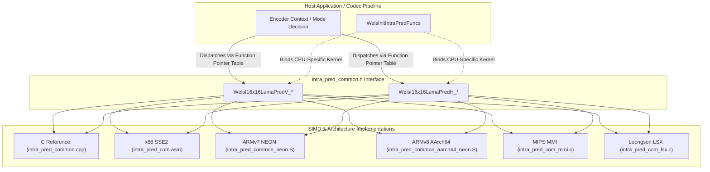

# Literate Programming Documentation: `intra_pred_common.h`

The header file [`codec/common/inc/intra_pred_common.h`](openh264/codec/common/inc/intra_pred_common.h) defines the shared C and SIMD-accelerated function prototypes for $16 \times 16$ luma intra-frame prediction in the OpenH264 codec. These primitives are fundamental to H.264 / AVC spatial prediction, providing fast, vector-optimized algorithms to populate a $16 \times 16$ pixel macroblock buffer from surrounding reconstructed boundary pixels.

---

## 1. High-Level Architectural Role & Overview

In the H.264/AVC video coding standard (ITU-T Rec. H.264 / ISO/IEC 14496-10, Section 8.3.3), spatial intra prediction reduces spatial redundancy within a picture by extrapolating previously decoded boundary pixels from neighboring macroblocks into the current macroblock before transform and residual coding.

For $16 \times 16$ Luma macroblocks, H.264 defines four primary prediction modes:
* **Mode 0 (`I16_PRED_V`)**: Vertical Prediction
* **Mode 1 (`I16_PRED_H`)**: Horizontal Prediction
* **Mode 2 (`I16_PRED_DC`)**: DC Prediction (mean of available neighbors)
* **Mode 3 (`I16_PRED_P`)**: Plane Prediction (linear spatial gradient)

[`intra_pred_common.h`](openh264/codec/common/inc/intra_pred_common.h) specifically declares the common vertical and horizontal $16 \times 16$ intra prediction routines shared across the encoder and common subsystems. These functions take an explicit destination prediction buffer (`pPred`), a source reference picture pointer (`pRef`), and the reference buffer stride (`kiStride`).



---

## 2. Spatial Geometry and Mathematical Formulations

Let $p[x, y]$ denote the predicted luma sample at coordinate $(x, y)$ inside the $16 \times 16$ macroblock, where $x \in [0, 15]$ (column index) and $y \in [0, 15]$ (row index).

Let $p'[x', y']$ denote the reconstructed neighboring reference samples surrounding the macroblock:
* **Top boundary reference row**: $p'[x, -1]$ for $x \in [0, 15]$, located in memory at address `pRef[-kiStride + x]`.
* **Left boundary reference column**: $p'[-1, y]$ for $y \in [0, 15]$, located in memory at address `pRef[y * kiStride - 1]`.

```
                Top Reference Samples: p'[x, -1] = pRef[-kiStride + x]
                (x = 0, 1, 2, ..., 15)
              +---+---+---+---+---+---+---+---+---+---+---+---+---+---+---+---+
              | 0 | 1 | 2 | 3 | 4 | 5 | 6 | 7 | 8 | 9 | 10| 11| 12| 13| 14| 15|
              +---+---+---+---+---+---+---+---+---+---+---+---+---+---+---+---+
Left Reference
Samples:      +---------------------------------------------------------------+
p'[-1, 0]  -> | p[0,0]                                                 p[15,0]|
p'[-1, 1]  -> | p[0,1]                                                 p[15,1]|
p'[-1, 2]  -> | .                                                           . |
    .         | .               16 x 16 Predicted Block                     . |
    .         | .                      (pPred)                              . |
p'[-1, 15] -> | p[0,15]                                               p[15,15]|
              +---------------------------------------------------------------+
```

### 2.1 Mode 0: Intra $16 \times 16$ Vertical Prediction (`WelsI16x16LumaPredV`)

In Vertical prediction mode, the top row of 16 reconstructed neighbor samples $p'[x, -1]$ is projected downwards to fill every row of the predicted macroblock:

$$p[x, y] = p'[x, -1] = \text{pRef}[-\text{kiStride} + x], \quad \forall x \in [0, 15], \; y \in [0, 15]$$

All 16 rows of the destination block `pPred` are identical copies of the 16-byte vector at `pRef - kiStride`.

### 2.2 Mode 1: Intra $16 \times 16$ Horizontal Prediction (`WelsI16x16LumaPredH`)

In Horizontal prediction mode, each row $y$ of the predicted macroblock is filled with the reconstructed left neighbor sample $p'[-1, y]$ for that row:

$$p[x, y] = p'[-1, y] = \text{pRef}[y \cdot \text{kiStride} - 1], \quad \forall x \in [0, 15], \; y \in [0, 15]$$

For row $y$, the single byte at `pRef[y * kiStride - 1]` is broadcast across all 16 horizontal columns of `pPred[y * 16 + x]`.

---

## 3. Data Types, Alignments, and Macro Dependencies

The header includes [`typedefs.h`](openh264/codec/common/inc/typedefs.h) which defines standard fixed-width integer types:

| Type | Underlying Primitive | Usage in `intra_pred_common.h` |
| :--- | :--- | :--- |
| `uint8_t` | `unsigned char` (8-bit unsigned) | Pixel sample pointers (`pPred`, `pRef`) |
| `int32_t` | `int` (32-bit signed) | Line stride pitch (`kiStride`) |

### Memory Alignment & Buffer Lifecycle
* **Destination Buffer (`pPred`)**: Pointer to a 256-byte contiguous block ($16 \text{ rows} \times 16 \text{ bytes/row}$). It is required to be 16-byte aligned to allow aligned 128-bit SIMD stores (`movdqa`, `vst1.8`, `st1`, `gssqc1`, `__lsx_vst`).
* **Reference Buffer (`pRef`)**: Pointer to the origin $(0, 0)$ of the current macroblock in the reconstructed frame buffer.
* **Stride (`kiStride`)**: Signed byte distance between successive vertical rows in the reference frame.

---

## 4. Comprehensive Function Reference

### 4.1 C Baseline Reference Functions

Defined in [`codec/common/src/intra_pred_common.cpp`](openh264/codec/common/src/intra_pred_common.cpp).

#### `WelsI16x16LumaPredV_c`
```cpp
void WelsI16x16LumaPredV_c (uint8_t* pPred, uint8_t* pRef, const int32_t kiStride);
```
* **Parameters**:
  * `pPred`: Pointer to destination prediction block (contiguous 16-byte row stride).
  * `pRef`: Pointer to current macroblock origin in reference picture.
  * `kiStride`: Reference picture buffer stride (in bytes).
* **Implementation Mechanism**:
  1. Computes the address of the top boundary row: `kpSrc = (int8_t*)&pRef[-kiStride]`.
  2. Loads the 16 bytes as two 64-bit unsigned integers: `kuiT1 = LD64(kpSrc)` and `kuiT2 = LD64(kpSrc + 8)`.
  3. Executes a loop of 16 iterations ($i = 15 \dots 0$), storing `kuiT1` and `kuiT2` via `ST64` into successive 16-byte rows of `pPred`.

#### `WelsI16x16LumaPredH_c`
```cpp
void WelsI16x16LumaPredH_c (uint8_t* pPred, uint8_t* pRef, const int32_t kiStride);
```
* **Parameters**: Same as above.
* **Implementation Mechanism**:
  1. Sets up strided index counters: `iStridex15 = 15 * kiStride` and `iPredStridex15 = 240` ($15 \times 16$).
  2. Iterates backwards from row 15 down to 0:
     - Fetches the left reference byte: `kuiSrc8 = pRef[iStridex15 - 1]`.
     - Multiplies by `0x0101010101010101ULL` to broadcast the 8-bit value into all 8 byte positions of a 64-bit word (`kuiV64`).
     - Stores `kuiV64` twice via `ST64` to fill the 16 bytes of row `iPredStridex15`.
     - Decrements `iStridex15` by `kiStride` and `iPredStridex15` by 16.

---

### 4.2 x86 / x86_64 SSE2 Accelerated Functions (`X86_ASM`)

Defined in [`codec/common/x86/intra_pred_com.asm`](openh264/codec/common/x86/intra_pred_com.asm).

#### `WelsI16x16LumaPredV_sse2`
```cpp
void WelsI16x16LumaPredV_sse2 (uint8_t* pPred, uint8_t* pRef, const int32_t kiStride);
```
* **Assembly Algorithm**:
  ```nasm
  sub     r1, r2              ; r1 = pRef - kiStride (address of top reference row)
  movdqa  xmm0, [r1]          ; Load all 16 reference bytes in one 128-bit aligned read
  movdqa  [r0], xmm0          ; Store row 0 (pPred + 0x00)
  movdqa  [r0+10h], xmm0      ; Store row 1 (pPred + 0x10)
  ...
  movdqa  [r0+240], xmm0      ; Store row 15 (pPred + 0xF0)
  ```
* **Performance Characteristic**: Fully unrolled 16 aligned 128-bit stores without branching.

#### `WelsI16x16LumaPredH_sse2`
```cpp
void WelsI16x16LumaPredH_sse2 (uint8_t* pPred, uint8_t* pRef, const int32_t kiStride);
```
* **Assembly Algorithm**:
  * For each row:
    1. `movzx r3, byte [r1]`: Read left reference pixel byte.
    2. `SSE2_Copy16Times xmm0, r3d`: Broadcasts the lower byte across all 16 byte lanes of `xmm0` using unpack and shuffle instructions.
    3. `movdqa [r0], xmm0`: Aligned 128-bit store to the prediction row.
    4. Advances `r1 += kiStride` and `r0 += 16`.

---

### 4.3 ARMv7 NEON Accelerated Functions (`HAVE_NEON`)

Defined in [`codec/common/arm/intra_pred_common_neon.S`](openh264/codec/common/arm/intra_pred_common_neon.S).

#### `WelsI16x16LumaPredV_neon`
```cpp
void WelsI16x16LumaPredV_neon (uint8_t* pPred, uint8_t* pRef, const int32_t kiStride);
```
* **Vector Registers**: Top line loaded into NEON registers `{d0, d1}` (representing 128-bit quad-register `q0`).
* **Storage Loop**: Uses `vst1.8 {d0, d1}, [r0]!` in a 4-iteration unrolled loop (writing 4 lines per iteration) with post-increment addressing.

#### `WelsI16x16LumaPredH_neon`
```cpp
void WelsI16x16LumaPredH_neon (uint8_t* pPred, uint8_t* pRef, const int32_t kiStride);
```
* **Vector Registers**: Uses `vld1.8 {d0[], d1[]}, [r1], r2` to load 1 byte and duplicate it across all 16 lanes of `{d0, d1}` in a single instruction, then stores via `vst1.8 {d0, d1}, [r0]!`.

---

### 4.4 ARMv8 / AArch64 NEON Accelerated Functions (`HAVE_NEON_AARCH64`)

Defined in [`codec/common/arm64/intra_pred_common_aarch64_neon.S`](openh264/codec/common/arm64/intra_pred_common_aarch64_neon.S).

#### `WelsI16x16LumaPredV_AArch64_neon`
```cpp
void WelsI16x16LumaPredV_AArch64_neon (uint8_t* pPred, uint8_t* pRef, const int32_t kiStride);
```
* **Instruction Stream**:
  ```assembly
  sub     x3, x1, x2          ; x3 = pRef - kiStride
  ld1     {v0.16b}, [x3]      ; Load 16 bytes into 128-bit vector register v0
  .rept 16
  st1     {v0.16b}, [x0], 16  ; Store v0 and post-increment destination pointer by 16
  .endr
  ```

#### `WelsI16x16LumaPredH_AArch64_neon`
```cpp
void WelsI16x16LumaPredH_AArch64_neon (uint8_t* pPred, uint8_t* pRef, const int32_t kiStride);
```
* **Instruction Stream**:
  Uses AArch64 load-and-replicate instruction `ld1r {v0.16b}, [x3], x2` to fetch the left pixel and duplicate it across all 16 byte elements of `v0.16b`, followed by `st1 {v0.16b}, [x0], 16`.

---

### 4.5 MIPS MMI Accelerated Functions (`HAVE_MMI`)

Defined in [`codec/common/mips/intra_pred_com_mmi.c`](openh264/codec/common/mips/intra_pred_com_mmi.c).

* **`WelsI16x16LumaPredV_mmi`**: Loads 128-bit quadword from top line into registers `$f2, $f0` using Loongson inline assembly `gslqc1`, and stores 16 lines sequentially using `gssqc1`.
* **`WelsI16x16LumaPredH_mmi`**: Loads left byte, expands to 16 bytes using `MMI_Copy16Times`, and stores via `gssqc1`.

---

### 4.6 Loongson LSX Accelerated Functions (`HAVE_LSX`)

Defined in [`codec/common/loongarch/intra_pred_com_lsx.c`](openh264/codec/common/loongarch/intra_pred_com_lsx.c).

* **`WelsI16x16LumaPredV_lsx`**: Uses Loongson LSX 128-bit vector intrinsics `__lsx_vreplgr2vr_d` and `__lsx_vpackev_d` to construct the 128-bit top row vector and stores via `__lsx_vstx`.
* **`WelsI16x16LumaPredH_lsx`**: Uses `__lsx_vreplgr2vr_b(kuiSrc8)` to broadcast the left byte into a 128-bit vector and stores via `__lsx_vstx`.

---

## 5. Summary Table of Implementations

| Architecture Target | Macro Guard | Vertical Function (`Mode 0`) | Horizontal Function (`Mode 1`) | Implementation Source |
| :--- | :--- | :--- | :--- | :--- |
| **C / C++ Fallback** | *(None / Standard)* | [`WelsI16x16LumaPredV_c`](openh264/codec/common/src/intra_pred_common.cpp#L47-L59) | [`WelsI16x16LumaPredH_c`](openh264/codec/common/src/intra_pred_common.cpp#L61-L76) | [`intra_pred_common.cpp`](openh264/codec/common/src/intra_pred_common.cpp) |
| **x86 / x86_64 (SSE2)** | `X86_ASM` | `WelsI16x16LumaPredV_sse2` | `WelsI16x16LumaPredH_sse2` | [`intra_pred_com.asm`](openh264/codec/common/x86/intra_pred_com.asm) |
| **ARMv7 (NEON)** | `HAVE_NEON` | `WelsI16x16LumaPredV_neon` | `WelsI16x16LumaPredH_neon` | [`intra_pred_common_neon.S`](openh264/codec/common/arm/intra_pred_common_neon.S) |
| **AArch64 (NEON)** | `HAVE_NEON_AARCH64` | `WelsI16x16LumaPredV_AArch64_neon` | `WelsI16x16LumaPredH_AArch64_neon` | [`intra_pred_common_aarch64_neon.S`](openh264/codec/common/arm64/intra_pred_common_aarch64_neon.S) |
| **MIPS (MMI)** | `HAVE_MMI` | `WelsI16x16LumaPredV_mmi` | `WelsI16x16LumaPredH_mmi` | [`intra_pred_com_mmi.c`](openh264/codec/common/mips/intra_pred_com_mmi.c) |
| **LoongArch (LSX)** | `HAVE_LSX` | `WelsI16x16LumaPredV_lsx` | `WelsI16x16LumaPredH_lsx` | [`intra_pred_com_lsx.c`](openh264/codec/common/loongarch/intra_pred_com_lsx.c) |
