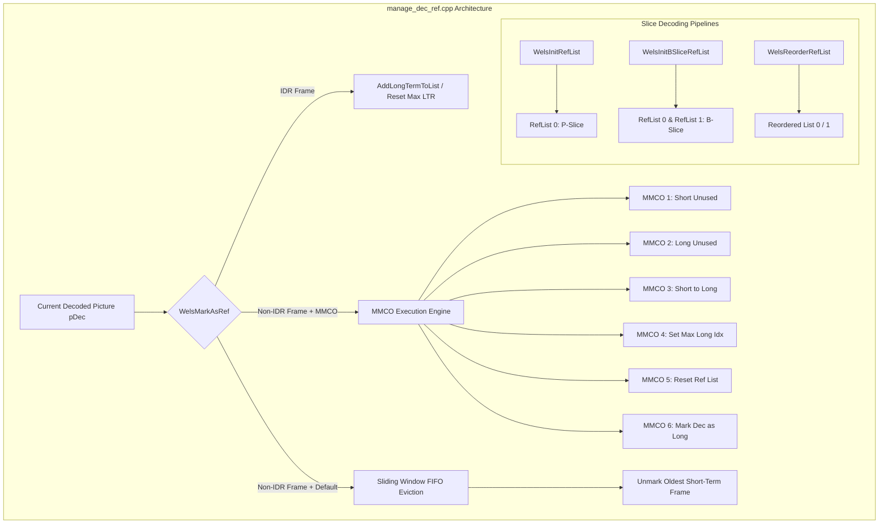
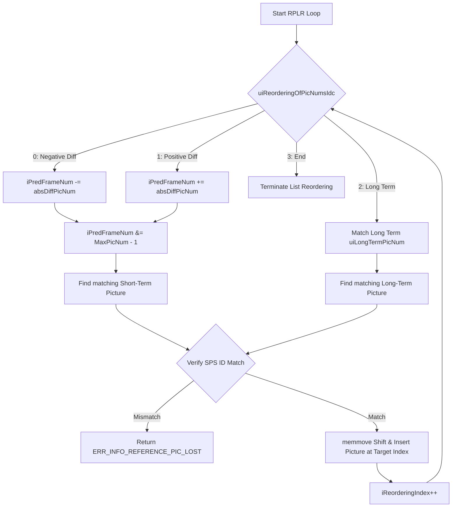

# Literate Programming: Reference Picture Management (`manage_dec_ref.cpp`)

The source file [`manage_dec_ref.cpp`](openh264/codec/decoder/core/src/manage_dec_ref.cpp) is the core reference picture buffer controller for the OpenH264 video decoder subsystem. It implements reference picture list construction, Picture Order Count (POC) sorting, short-term frame number wrapping, reference picture list reordering (RPLR), adaptive Memory Management Control Operations (MMCO), sliding window eviction, Long-Term Reference (LTR) marking, and error concealment buffer reservation for the Decoded Picture Buffer (DPB).

---

## Table of Contents
1. [Architectural Role & DPB Subsystem](#1-architectural-role--dpb-subsystem)
2. [Data Structures & Enumerations](#2-data-structures--enumerations)
3. [Memory Management & Picture Lifecycle](#3-memory-management--picture-lifecycle)
4. [Reference List Initialization & Sorting](#4-reference-list-initialization--sorting)
5. [Reference Picture List Reordering (RPLR)](#5-reference-picture-list-reordering-rplr)
6. [Marking, MMCO & Sliding Window Engine](#6-marking-mmco--sliding-window-engine)
7. [Error Concealment Resilience (EC)](#7-error-concealment-resilience-ec)
8. [Comprehensive Function Reference](#8-comprehensive-function-reference)

---

## 1. Architectural Role & DPB Subsystem

In H.264 / AVC (ITU-T H.264 / ISO/IEC 14496-10), inter-predicted macroblocks (P-slices and B-slices) derive motion vectors and prediction blocks from previously decoded reference pictures stored in the **Decoded Picture Buffer (DPB)**. The reference management engine maintains two distinct categories of reference frames:
- **Short-Term Reference Pictures (STR)**: Identified by their frame number (`iFrameNum` / `iFrameWrapNum`) and Picture Order Count (`iFramePoc`).
- **Long-Term Reference Pictures (LTR)**: Identified by an assigned long-term frame index (`iLongTermFrameIdx` / `uiLongTermPicNum`), retained across longer temporal spans to provide robust error recovery anchors.



---

## 2. Data Structures & Enumerations

### 2.1 Enumerations & Constants

| Constant / Enum Identifier | Value | Category | Description |
| :--- | :--- | :--- | :--- |
| `LIST_0` | `0` | Ref List Index | Primary forward reference picture list index. |
| `LIST_1` | `1` | Ref List Index | Backward/bidirectional reference picture list index (B-slices). |
| `LIST_A` | `2` | Bound Constant | Maximum number of reference picture lists ($2$: `LIST_0` and `LIST_1`). |
| `MAX_DPB_COUNT` | `16` | DPB Bound | Maximum capacity of the Decoded Picture Buffer. |
| `MAX_REF_PIC_COUNT` | `16` | Active Ref Bound | Maximum number of active reference pictures per slice list. |
| `MAX_MMCO_COUNT` | `66` | Syntax Limit | Maximum number of MMCO commands parsed per slice header. |
| `MMCO_END` | `0` | [`EMmcoCode`](openh264/codec/common/inc/wels_common_defs.h#L209) | End of Memory Management Control Operation syntax loop. |
| `MMCO_SHORT2UNUSED` | `1` | [`EMmcoCode`](openh264/codec/common/inc/wels_common_defs.h#L210) | Marks a short-term picture as "unused for reference". |
| `MMCO_LONG2UNUSED` | `2` | [`EMmcoCode`](openh264/codec/common/inc/wels_common_defs.h#L211) | Marks a long-term picture as "unused for reference". |
| `MMCO_SHORT2LONG` | `3` | [`EMmcoCode`](openh264/codec/common/inc/wels_common_defs.h#L212) | Converts a short-term reference picture into a long-term reference. |
| `MMCO_SET_MAX_LONG` | `4` | [`EMmcoCode`](openh264/codec/common/inc/wels_common_defs.h#L213) | Sets `iMaxLongTermFrameIdx` and unmarks LTRs exceeding this index. |
| `MMCO_RESET` | `5` | [`EMmcoCode`](openh264/codec/common/inc/wels_common_defs.h#L214) | Flushes the entire reference list (marks all references unused). |
| `MMCO_LONG` | `6` | [`EMmcoCode`](openh264/codec/common/inc/wels_common_defs.h#L215) | Marks current decoded picture as a long-term reference picture. |

---

### 2.2 Core Struct Definitions

#### A. [`SRefPic`](openh264/codec/decoder/core/inc/decoder_context.h#L149-L157) (`PRefPic`)
Encapsulates active reference lists and DPB count state in the decoder context:

```cpp
typedef struct TagRefPic {
  PPicture  pRefList[LIST_A][MAX_DPB_COUNT];       // Active reference picture list (LIST_0 / LIST_1)
  PPicture  pShortRefList[LIST_A][MAX_DPB_COUNT];  // Short-term reference picture list
  PPicture  pLongRefList[LIST_A][MAX_DPB_COUNT];   // Long-term reference picture list
  uint8_t   uiRefCount[LIST_A];                   // Count of active reference frames in pRefList
  uint8_t   uiShortRefCount[LIST_A];              // Count of short-term reference frames
  uint8_t   uiLongRefCount[LIST_A];               // Count of long-term reference frames
  int32_t   iMaxLongTermFrameIdx;                 // Maximum valid long-term frame index (-1 if none)
} SRefPic, *PRefPic;
```

#### B. [`SPicture`](openh264/codec/decoder/core/inc/picture.h#L51-L108) (`PPicture`)
The reconstructed frame buffer structure containing pixel planes and reference tracking fields:
- `bUsedAsRef`: Boolean flag indicating if this picture is currently used as a reference frame.
- `bIsLongRef`: Flag indicating if this reference picture is long-term (`true`) or short-term (`false`).
- `iRefCount`: Dynamic reference counter. When decremented to $\le 0$, `SetUnRef()` clears all state flags.
- `pSetUnRef`: Function pointer callback to `SetUnRef(PPicture pRef)`.
- `iFrameNum`: The standard slice header syntax frame number $0 \le \text{iFrameNum} < 2^{\text{uiLog2MaxFrameNum}}$.
- `iFrameWrapNum`: Unwrapped/wrapped frame number computed for short-term list sorting.
- `iFramePoc`: Picture Order Count (POC) used for temporal distance weighting and B-slice list construction.
- `iLongTermFrameIdx`: Assigned long-term reference index.
- `uiLongTermPicNum`: Derived long-term picture number syntax element.
- `pRefPic[LIST_A][17]`: Nested reference picture arrays stored for direct mode spatial/temporal derivation.

#### C. [`SRefPicMarking`](openh264/codec/decoder/core/inc/slice.h#L75-L88) (`PRefPicMarking`)
Parsed from the slice header syntax elements:
- `bAdaptiveRefPicMarkingModeFlag`: If `true`, MMCO commands are executed; if `false`, sliding window eviction is performed.
- `bLongTermRefFlag`: Flag indicating if an IDR frame is marked as long-term.
- `sMmcoRef[MAX_MMCO_COUNT]`: Array of parsed MMCO operations containing `uiMmcoType`, `iShortFrameNum`, `iDiffOfPicNum`, `uiLongTermPicNum`, `iLongTermFrameIdx`, and `iMaxLongTermFrameIdx`.

---

## 3. Memory Management & Picture Lifecycle

### `SetUnRef`
```cpp
static void SetUnRef (PPicture pRef);
```
- **Purpose**: Marks a reconstructed picture as unused for reference and clears all associated reference metadata once its reference counter reaches zero.
- **Algorithm**:
  1. Checks if `pRef == NULL`. If null, returns immediately.
  2. If `pRef->iRefCount <= 0`:
     - Resets reference flags: `bUsedAsRef = false`, `bIsLongRef = false`.
     - Resets picture identifiers: `iFrameNum = -1`, `iFrameWrapNum = -1`, `iLongTermFrameIdx = -1`, `uiLongTermPicNum = 0`.
     - Resets layer identifiers: `uiQualityId = -1`, `uiTemporalId = -1`, `uiSpatialId = -1`, `iSpsId = -1`.
     - Resets completion status: `bIsComplete = false`, `iRefCount = 0`, `pSetUnRef = NULL`.
     - For non-`I_SLICE` pictures (`P_SLICE` or `B_SLICE`), sets nested reference pointers `pRef->pRefPic[list][i] = NULL` for all $i \in [0, \text{MAX\_DPB\_COUNT}-1]$ to break cyclic reference structures.
  3. If `pRef->iRefCount > 0`, assigns `pRef->pSetUnRef = SetUnRef` so the callback triggers when reference count drops to zero later.

---

### `WelsResetRefPic` & `WelsResetRefPicWithoutUnRef`
```cpp
void WelsResetRefPic (PWelsDecoderContext pCtx);
void WelsResetRefPicWithoutUnRef (PWelsDecoderContext pCtx);
```
- **Purpose**: Resets the reference picture lists upon new sequence initialization (e.g. SPS activation), upon decoding an IDR Access Unit, or when handling an explicit `MMCO_RESET` command.
- **Differences**:
  - [`WelsResetRefPic`](openh264/codec/decoder/core/src/manage_dec_ref.cpp#L106-L129): Iterates through `pShortRefList[LIST_0]` and `pLongRefList[LIST_0]`, calls `SetUnRef()` on each active picture entry, and clears list pointers to `NULL`.
  - [`WelsResetRefPicWithoutUnRef`](openh264/codec/decoder/core/src/manage_dec_ref.cpp#L131-L148): Clears the array pointers to `NULL` and zeroes reference counts without invoking `SetUnRef()` on the picture objects.

---

## 4. Reference List Initialization & Sorting

### 4.1 Short Reference Picture Number Wrapping (`WrapShortRefPicNum`)

H.264 Section 8.2.4.1 specifies that frame numbers must wrap around modulo $\text{MaxPicNum} = 2^{\text{uiLog2MaxFrameNum}}$.
For every short-term reference picture $i$ in `pShortRefList[LIST_0]`:

$$\text{iFrameWrapNum}_i = \begin{cases} \text{iFrameNum}_i - \text{MaxPicNum}, & \text{if } \text{iFrameNum}_i > \text{iFrameNum}_{\text{curr}} \\ \text{iFrameNum}_i, & \text{otherwise} \end{cases}$$

```cpp
static void WrapShortRefPicNum (PWelsDecoderContext pCtx);
```

---

### 4.2 P-Slice Reference List Initialization (`WelsInitRefList`)

```cpp
int32_t WelsInitRefList (PWelsDecoderContext pCtx, int32_t iPoc);
```
- **Purpose**: Populates the default `pRefList[LIST_0]` for P-slices.
- **Workflow**:
  1. Invokes `WelsCheckAndRecoverForFutureDecoding(pCtx)` to detect and conceal missing reference pictures.
  2. Wraps short-term frame numbers via `WrapShortRefPicNum(pCtx)`.
  3. Clears `pRefList[LIST_0]` buffer memory to `0`.
  4. Appends all short-term reference pictures from `pShortRefList[LIST_0]` up to `MAX_REF_PIC_COUNT`.
  5. Appends all long-term reference pictures from `pLongRefList[LIST_0]` up to `MAX_REF_PIC_COUNT`.
  6. Stores the total count in `pRefPic->uiRefCount[LIST_0]`.

---

### 4.3 B-Slice Reference List Initialization (`WelsInitBSliceRefList`)

```cpp
int32_t WelsInitBSliceRefList (PWelsDecoderContext pCtx, int32_t iPoc);
```
- **Purpose**: Constructs dual reference lists (`pRefList[LIST_0]` and `pRefList[LIST_1]`) for B-slices based on temporal distances (Picture Order Count / POC).
- **Mathematical Sorting Logic**:
  1. **Partition Short-Term References**:
     - $\mathcal{S}_{\text{past}} = \{ P \in \text{pShortRefList} \mid P.\text{iFramePoc} < \text{iPoc} \}$
     - $\mathcal{S}_{\text{future}} = \{ P \in \text{pShortRefList} \mid P.\text{iFramePoc} > \text{iPoc} \}$
  2. **Sort Long-Term References**:
     - Long-term references in `ppLongRefList` are sorted in **increasing** POC order:
       $$P_i.\text{iFramePoc} \le P_j.\text{iFramePoc} \quad \forall i < j$$
  3. **Construct LIST 0**:
     - Short-term past list ($\mathcal{S}_{\text{past}}$) sorted in **descending** POC order (most recent past frames first).
     - Short-term future list ($\mathcal{S}_{\text{future}}$) sorted in **ascending** POC order (closest future frames first).
     - Append sorted long-term reference list.
  4. **Construct LIST 1**:
     - Short-term future list ($\mathcal{S}_{\text{future}}$) sorted in **ascending** POC order.
     - Short-term past list ($\mathcal{S}_{\text{past}}$) sorted in **descending** POC order.
     - Append sorted long-term reference list.

---

## 5. Reference Picture List Reordering (RPLR)

Implemented in [`WelsReorderRefList`](openh264/codec/decoder/core/src/manage_dec_ref.cpp#L385-L478) (and test variant [`WelsReorderRefList2`](openh264/codec/decoder/core/src/manage_dec_ref.cpp#L481-L583)).

### Reordering Algorithm

When `pRefPicListReorderSyn->bRefPicListReorderingFlag[listIdx]` is set, the default initial order of `pRefList[listIdx]` is explicitly modified based on slice header syntax:



1. **Short-Term Reordering** (`uiReorderingOfPicNumsIdc == 0` or `1`):
   $$\text{iAbsDiffPicNum} = \text{uiAbsDiffPicNumMinus1} + 1$$
   $$\text{iPredFrameNum} = \begin{cases} (\text{iPredFrameNum} - \text{iAbsDiffPicNum}) \pmod{\text{MaxPicNum}}, & \text{Idc} = 0 \\ (\text{iPredFrameNum} + \text{iAbsDiffPicNum}) \pmod{\text{MaxPicNum}}, & \text{Idc} = 1 \end{cases}$$
2. **SPS Boundary Protection**:
   Verifies that `pSliceHeader->iSpsId == ppRefList[i]->iSpsId`. If a cross-IDR parameter set mismatch occurs, logging warning is generated and `ERR_INFO_REFERENCE_PIC_LOST` is returned to trigger IDR refresh request.
3. **List Displacement**:
   Uses `memmove()` to shift existing entries rightward and place the selected picture at `ppRefList[iReorderingIndex]`.

---

## 6. Marking, MMCO & Sliding Window Engine

### 6.1 `WelsMarkAsRef`
```cpp
int32_t WelsMarkAsRef (PWelsDecoderContext pCtx, PPicture pLastDec = NULL);
```
- **Purpose**: Top-level function executed after macroblock reconstruction to commit the decoded frame into the reference picture buffer.
- **Workflow**:
  1. Identifies active target frame (`pDec = pLastDec ? pLastDec : pCtx->pDec`).
  2. Updates metadata fields on `pDec`: `uiQualityId`, `uiTemporalId`, `iSpsId`, `iPpsId`.
  3. Detects if the current Access Unit is an **IDR AU**:
     - If `bLongTermRefFlag` is enabled: marks picture as LTR at index 0 via `AddLongTermToList(pRefPic, pDec, 0, 0)`.
     - Else: resets `pRefPic->iMaxLongTermFrameIdx = -1`.
  4. If **Non-IDR AU**:
     - If `bAdaptiveRefPicMarkingModeFlag == true`: executes explicit MMCO commands via `MMCO(pCtx, pRefPic, pRefPicMarking)`.
     - If `bAdaptiveRefPicMarkingModeFlag == false`: executes implicit sliding window eviction via `SlidingWindow(pCtx, pRefPic)`.
  5. If `!pDec->bIsLongRef`:
     - Checks DPB capacity against `pCtx->pSps->iNumRefFrames`.
     - Inserts the newly decoded picture into short-term list via `AddShortTermToList(pRefPic, pDec)`.

---

### 6.2 MMCO Command Execution Matrix

Executed inside [`MMCOProcess`](openh264/codec/decoder/core/src/manage_dec_ref.cpp#L690-L761):

| MMCO Opcode | Parameter Extraction | Action & Invoked Functions |
| :--- | :--- | :--- |
| `MMCO_SHORT2UNUSED` (1) | `iShortFrameNum = (iFrameNum - iDiffOfPicNum) & (MaxPicNum - 1)` | Deletes matching short-term picture from `pShortRefList` via `WelsDelShortFromListSetUnref()`. |
| `MMCO_LONG2UNUSED` (2) | `uiLongTermPicNum` | Deletes matching long-term picture from `pLongRefList` via `WelsDelLongFromListSetUnref()`. |
| `MMCO_SHORT2LONG` (3) | `iShortFrameNum`, `iLongTermFrameIdx`, `uiLongTermPicNum` | Verifies $iLongTermFrameIdx \le iMaxLongTermFrameIdx$. Converts short-term frame to long-term via `MarkAsLongTerm()`. |
| `MMCO_SET_MAX_LONG` (4) | `iMaxLongTermFrameIdx` | Updates `pRefPic->iMaxLongTermFrameIdx`. Iterates over `pLongRefList` and evicts any LTR with $iLongTermFrameIdx > iMaxLongTermFrameIdx$. |
| `MMCO_RESET` (5) | None | Calls `WelsResetRefPic(pCtx)` to mark all references unused. Sets `pCtx->pLastDecPicInfo->bLastHasMmco5 = true`. |
| `MMCO_LONG` (6) | `iLongTermFrameIdx`, `uiLongTermPicNum` | Evicts existing LTR at index if present, checks DPB capacity, and adds `pCtx->pDec` as long-term via `AddLongTermToList()`. |

---

### 6.3 Sliding Window Management (`SlidingWindow`)

```cpp
static int32_t SlidingWindow (PWelsDecoderContext pCtx, PRefPic pRefPic);
```
When total active references reach the maximum allocated capacity:

$$\text{uiShortRefCount} + \text{uiLongRefCount} \ge \text{pSps->iNumRefFrames}$$

1. Checks if `uiShortRefCount[LIST_0] == 0`. If no short-term reference exists to evict, returns `ERR_INFO_INVALID_MMCO_REF_NUM_NOT_ENOUGH`.
2. Locates the oldest short-term reference picture at index `uiShortRefCount[LIST_0] - 1`.
3. Removes it from `pShortRefList[LIST_0]` via `WelsDelShortFromList()` and releases it via `SetUnRef(pPic)`.

---

## 7. Error Concealment Resilience (EC)

### 7.1 IDR Recovery (`WelsCheckAndRecoverForFutureDecoding`)

```cpp
static int32_t WelsCheckAndRecoverForFutureDecoding (PWelsDecoderContext pCtx);
```
- **Trigger**: When an inter-frame (P/B slice) is received but `uiShortRefCount + uiLongRefCount == 0` (indicating the preceding IDR keyframe packet was lost in transmission).
- **Concealment Procedure**:
  1. Prefetches an empty picture buffer from DPB pool `PrefetchPic(pCtx->pPicBuff)`.
  2. Sets error state flag: `pCtx->iErrorCode |= dsDataErrorConcealed`.
  3. Checks if frame copying across IDR is supported (`bCopyPrevious`):
     - If true and dimensions match `pPreviousDecodedPictureInDpb`, copies YUV pixel data from the previous picture.
     - Otherwise, fills luma ($Y$) with `128` (neutral mid-gray) and chroma ($U, V$) planes with `128`.
  4. Calls `ExpandReferencingPicture()` to pad picture borders for motion compensation filtering.
  5. Inserts the synthetic concealed frame into the short-term reference list via `AddShortTermToList()`.

---

### 7.2 DPB Buffer Reservation (`RemainOneBufferInDpbForEC`)

```cpp
static int32_t RemainOneBufferInDpbForEC (PWelsDecoderContext pCtx, PRefPic pRefPic);
```
Guarantees at least 1 free slot in the DPB for error concealment operations:
- If short-term references exist, evicts via `SlidingWindow()`.
- If only long-term references exist, searches for the lowest `iLongTermFrameIdx` (excluding the active AU's marked LTR) and evicts it via `WelsDelLongFromListSetUnref()`.

---

## 8. Comprehensive Function Reference

### Internal Helper Primitives

#### `WelsDelShortFromList`
```cpp
static PPicture WelsDelShortFromList (PRefPic pRefPic, int32_t iFrameNum);
```
- **Parameters**:
  - `pRefPic`: Pointer to decoder reference picture structure.
  - `iFrameNum`: Frame number of the short-term picture to delete.
- **Returns**: Pointer to the removed `PPicture`, or `NULL` if not found.
- **Mechanism**: Linear scan of `pShortRefList[LIST_0]`. Upon match, shifts trailing elements left using `memmove()` and decrements `uiShortRefCount[LIST_0]`.

#### `WelsDelLongFromList`
```cpp
static PPicture WelsDelLongFromList (PRefPic pRefPic, uint32_t uiLongTermFrameIdx);
```
- **Parameters**:
  - `pRefPic`: Pointer to decoder reference picture structure.
  - `uiLongTermFrameIdx`: Long-term frame index of the picture to delete.
- **Returns**: Pointer to the removed `PPicture`, or `NULL` if not found.
- **Mechanism**: Scans `pLongRefList[LIST_0]`, unlinks the matching entry, shifts remaining array pointers left with `memmove()`, and decrements `uiLongRefCount[LIST_0]`.

#### `AddShortTermToList`
```cpp
static int32_t AddShortTermToList (PRefPic pRefPic, PPicture pPic);
```
- **Parameters**:
  - `pRefPic`: Pointer to reference picture structure.
  - `pPic`: Pointer to the decoded picture to insert.
- **Returns**: `ERR_NONE` (0) on success, or error code (`ERR_INFO_DUPLICATE_FRAME_NUM`, `ERR_INFO_INVALID_PTR`).
- **Mechanism**: Checks for duplicate `iFrameNum` (replaces if found). Otherwise shifts existing elements right by 1 position using `memmove()` and inserts `pPic` at index `0`.

#### `AddLongTermToList`
```cpp
static int32_t AddLongTermToList (PRefPic pRefPic, PPicture pPic, int32_t iLongTermFrameIdx, uint32_t uiLongTermPicNum);
```
- **Parameters**:
  - `pRefPic`: Pointer to reference picture structure.
  - `pPic`: Target picture to add.
  - `iLongTermFrameIdx`: Long-term frame index.
  - `uiLongTermPicNum`: Derived long-term picture number.
- **Returns**: `ERR_NONE` (0) on success.
- **Mechanism**: Maintains `pLongRefList[LIST_0]` sorted in **ascending** order of `iLongTermFrameIdx`. Inserts `pPic` at the sorted position via `memmove()`.

---

## 9. Key Header & Source Links

- [`manage_dec_ref.cpp`](openh264/codec/decoder/core/src/manage_dec_ref.cpp)
- [`manage_dec_ref.h`](openh264/codec/decoder/core/inc/manage_dec_ref.h)
- [`picture.h`](openh264/codec/decoder/core/inc/picture.h)
- [`slice.h`](openh264/codec/decoder/core/inc/slice.h)
- [`decoder_context.h`](openh264/codec/decoder/core/inc/decoder_context.h)
