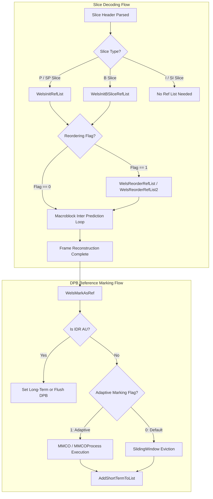
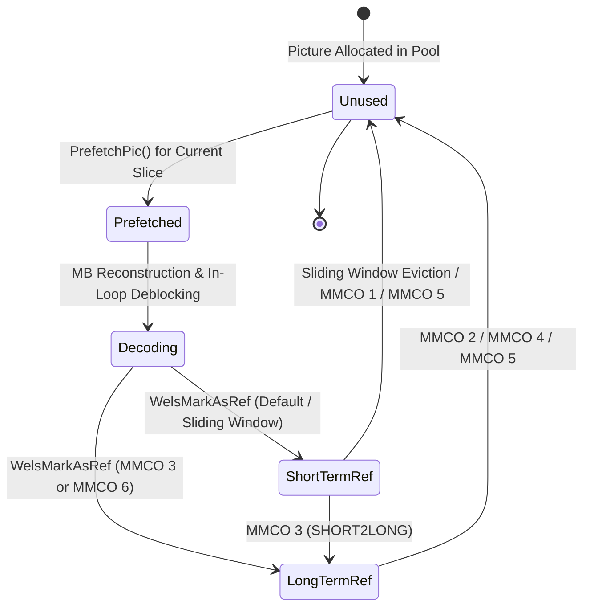
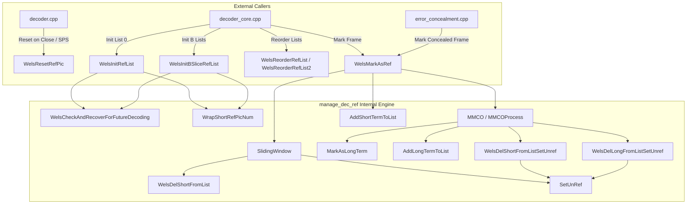

# OpenH264: Reference Picture Management (`manage_dec_ref.h`)

This document provides a comprehensive, literate-programming-style technical specification of the reference picture management module in OpenH264's H.264/AVC & SVC decoder core. It covers the public declarations in [`codec/decoder/core/inc/manage_dec_ref.h`](openh264/codec/decoder/core/inc/manage_dec_ref.h) and their implementation in [`codec/decoder/core/src/manage_dec_ref.cpp`](openh264/codec/decoder/core/src/manage_dec_ref.cpp).

---

## Table of Contents
1. [Module Overview & Architectural Role](#1-module-overview--architectural-role)
2. [Data Structures & Type Definitions](#2-data-structures--type-definitions)
   - [2.1 SRefPic / PRefPic](#21-srefpic--prefpic)
   - [2.2 SRefPicListReorderSyn / PRefPicListReorderSyn](#22-srefpiclistreordersyn--prefpiclistreordersyn)
   - [2.3 SRefPicMarking / PRefPicMarking](#23-srefpicmarking--prefpicmarking)
   - [2.4 SPicture / PPicture (Reference Management Fields)](#24-spicture--ppicture-reference-management-fields)
   - [2.5 Enums, Constants, and Error Codes](#25-enums-constants-and-error-codes)
3. [Algorithmic Architecture & State Machine](#3-algorithmic-architecture--state-machine)
   - [3.1 Decoded Picture Buffer (DPB) Lifecycle](#31-decoded-picture-buffer-dpb-lifecycle)
   - [3.2 Reference Picture List Initialization](#32-reference-picture-list-initialization)
   - [3.3 Reference Picture List Reordering (RPLR)](#33-reference-picture-list-reordering-rplr)
   - [3.4 Decoded Reference Picture Marking (Sliding Window & MMCO)](#34-decoded-reference-picture-marking-sliding-window--mmco)
   - [3.5 Error Concealment & Recovery Integration](#35-error-concealment--recovery-integration)
4. [Public API Function Reference](#4-public-api-function-reference)
   - [4.1 WelsResetRefPic](#41-welsresetrefpic)
   - [4.2 WelsResetRefPicWithoutUnRef](#42-welsresetrefpicwithoutunref)
   - [4.3 WelsInitRefList](#43-welsinitreflist)
   - [4.4 WelsInitBSliceRefList](#44-welsinitbslicereflist)
   - [4.5 WelsReorderRefList](#45-welsreorderreflist)
   - [4.6 WelsReorderRefList2](#46-welsreorderreflist2)
   - [4.7 WelsMarkAsRef](#47-welsmarkasref)
5. [Internal Helper Function Deep Dive](#5-internal-helper-function-deep-dive)
   - [5.1 SetUnRef](#51-setunref)
   - [5.2 WelsCheckAndRecoverForFutureDecoding](#52-welscheckandrecoverforfuturedecoding)
   - [5.3 WrapShortRefPicNum](#53-wrapshortrefpicnum)
   - [5.4 SlidingWindow](#54-slidingwindow)
   - [5.5 MMCO & MMCOProcess](#55-mmco--mmcoprocess)
   - [5.6 List Mutation Primitives: Add & Delete Operations](#56-list-mutation-primitives-add--delete-operations)
   - [5.7 RemainOneBufferInDpbForEC & GetLTRFrameIndex](#57-remainonebufferindpbforec--getltrframeindex)
6. [Call Graph & Interaction Matrix](#6-call-graph--interaction-matrix)

---

## 1. Module Overview & Architectural Role

In the H.264/AVC (ITU-T H.264 / ISO/IEC 14496-10) and SVC video coding standards, inter-prediction relies on previously reconstructed pictures stored in the **Decoded Picture Buffer (DPB)**. The reference picture management module encapsulates all operations required to maintain DPB state, construct active reference lists (`List 0` and `List 1`) for P and B slices, apply slice-level Reference Picture List Reordering (RPLR), and execute memory management control operations (MMCO) or sliding-window eviction.



### Primary Responsibilities
1. **Reference Picture List Initialization**: Populates active reference arrays (`pRefList[0]` and `pRefList[1]`) from the DPB short-term (`pShortRefList`) and long-term (`pLongRefList`) queues prior to macroblock reconstruction.
2. **Reference Picture List Reordering (RPLR)**: Dynamically adjusts default reference picture index order based on explicit slice header commands (`ref_pic_list_modification`).
3. **Decoded Reference Picture Marking**: Executes either default **Sliding Window FIFO** replacement or explicit **Memory Management Control Operations (MMCO 1–6)** to mark pictures as unused for reference or promote short-term pictures to long-term references.
4. **Error Concealment Synchronization**: Interfaces with [`error_concealment.h`](openh264/codec/decoder/core/inc/error_concealment.h) to inject synthetic reference frames (neutral gray $Y=128, U=128, V=128$ or frame/slice copies) when packet loss causes IDR reference frames to be dropped.

---

## 2. Data Structures & Type Definitions

### 2.1 SRefPic / PRefPic

The reference picture list state machine is encapsulated in `SRefPic` (defined in [`decoder_context.h`](openh264/codec/decoder/core/inc/decoder_context.h#L149-L157)):

```cpp
typedef struct TagRefPic {
  PPicture      pRefList[LIST_A][MAX_DPB_COUNT];     // Active reference picture lists (List 0 & List 1)
  PPicture      pShortRefList[LIST_A][MAX_DPB_COUNT];// Short-term reference picture queue
  PPicture      pLongRefList[LIST_A][MAX_DPB_COUNT]; // Long-term reference picture queue
  uint8_t       uiRefCount[LIST_A];                  // Active count in pRefList
  uint8_t       uiShortRefCount[LIST_A];             // Number of valid short-term reference pictures
  uint8_t       uiLongRefCount[LIST_A];              // Number of valid long-term reference pictures
  int32_t       iMaxLongTermFrameIdx;                // Maximum allowed long-term frame index (-1 if none)
} SRefPic, *PRefPic;
```

#### Field Specifications:
| Field Name | Type | Description |
| :--- | :--- | :--- |
| `pRefList[LIST_A][MAX_DPB_COUNT]` | `PPicture[2][17]` | Active reference picture pointers for `LIST_0` and `LIST_1`. These pointers are indexed directly by macroblock reference index syntax elements (`ref_idx_l0`, `ref_idx_l1`). |
| `pShortRefList[LIST_A][MAX_DPB_COUNT]` | `PPicture[2][17]` | Queue storing short-term reference pictures in the DPB. |
| `pLongRefList[LIST_A][MAX_DPB_COUNT]` | `PPicture[2][17]` | Queue storing long-term reference pictures in the DPB, ordered by `iLongTermFrameIdx`. |
| `uiRefCount[LIST_A]` | `uint8_t[2]` | Number of active entries in `pRefList[0]` and `pRefList[1]`. |
| `uiShortRefCount[LIST_A]` | `uint8_t[2]` | Number of active short-term references currently in the DPB. |
| `uiLongRefCount[LIST_A]` | `uint8_t[2]` | Number of active long-term references currently in the DPB. |
| `iMaxLongTermFrameIdx` | `int32_t` | The maximum long-term frame index value permitted. Set to `-1` if long-term references are disabled, or configured via MMCO opcode 4. |

---

### 2.2 SRefPicListReorderSyn / PRefPicListReorderSyn

Encapsulates parsed syntax elements for slice-level reference picture list reordering (defined in [`slice.h`](openh264/codec/decoder/core/inc/slice.h#L48-L55)):

```cpp
typedef struct TagRefPicListReorderSyntax {
  struct {
    uint32_t    uiAbsDiffPicNumMinus1;    // abs_diff_pic_num_minus1
    uint16_t    uiLongTermPicNum;         // long_term_pic_num
    uint16_t    uiReorderingOfPicNumsIdc; // reordering_of_pic_nums_idc (0, 1, 2, 3)
  } sReorderingSyn[LIST_A][MAX_REF_PIC_COUNT + 1];
  bool          bRefPicListReorderingFlag[LIST_A]; // ref_pic_list_modification_flag_l0 / l1
} SRefPicListReorderSyn, *PRefPicListReorderSyn;
```

---

### 2.3 SRefPicMarking / PRefPicMarking

Encapsulates decoded reference picture marking syntax parsed from the slice header (defined in [`slice.h`](openh264/codec/decoder/core/inc/slice.h#L75-L88)):

```cpp
typedef struct TagRefPicMarking {
  struct {
    uint32_t    uiMmcoType;               // memory_management_control_operation (0-6)
    int32_t     iShortFrameNum;           // Derived short-term frame number
    int32_t     iDiffOfPicNum;            // difference_of_pic_nums_minus1 + 1
    uint32_t    uiLongTermPicNum;         // long_term_pic_num
    int32_t     iLongTermFrameIdx;        // long_term_frame_idx
    int32_t     iMaxLongTermFrameIdx;     // max_long_term_frame_idx_plus1 - 1
  } sMmcoRef[MAX_MMCO_COUNT];

  bool          bNoOutputOfPriorPicsFlag; // no_output_of_prior_pics_flag
  bool          bLongTermRefFlag;         // long_term_reference_flag (for IDR)
  bool          bAdaptiveRefPicMarkingModeFlag; // adaptive_ref_pic_marking_mode_flag
} SRefPicMarking, *PRefPicMarking;
```

---

### 2.4 SPicture / PPicture (Reference Management Fields)

The [`SPicture`](openh264/codec/decoder/core/inc/picture.h#L51-L108) struct tracks picture-level reference flags and identifiers:

```cpp
struct SPicture {
  uint8_t*        pBuffer[4];             // Base buffer allocation pointers
  uint8_t*        pData[4];               // Plane pointers (Y, U, V)
  int32_t         iLinesize[4];           // Plane strides in bytes
  
  bool            bUsedAsRef;             // True if picture is currently used as reference
  bool            bIsLongRef;             // True if marked as long-term reference
  int8_t          iRefCount;              // Internal reference usage counter
  void            (*pSetUnRef)(SPicture*);// Callback pointer to unreferencing function
  
  int32_t         iFrameNum;              // frame_num parsed from slice header
  int32_t         iFrameWrapNum;          // Wrapped frame number for list reordering
  int32_t         iFramePoc;              // Picture Order Count (POC)
  int32_t         iLongTermFrameIdx;      // Assigned long-term frame index
  uint32_t        uiLongTermPicNum;       // Assigned long-term picture number
  
  int32_t         iSpsId;                 // Active SPS ID when picture was decoded
  int32_t         iPpsId;                 // Active PPS ID when picture was decoded
  uint8_t         uiTemporalId;           // SVC temporal layer ID
  uint8_t         uiQualityId;            // SVC quality layer ID
  bool            bIsComplete;            // Integrity flag (false if recovered/incomplete)
};
```

---

### 2.5 Enums, Constants, and Error Codes

| Constant / Identifier | Value | Architectural Meaning |
| :--- | :--- | :--- |
| `MAX_DPB_COUNT` | `17` | Total capacity of the decoded picture buffer array pool. |
| `MAX_REF_PIC_COUNT` | `16` | Maximum number of active reference pictures allowed by H.264 profile/level limits. |
| `MAX_MMCO_COUNT` | `66` | Maximum number of MMCO commands processed in a single slice header. |
| `LIST_0` | `0` | Reference picture List 0 identifier (forward prediction). |
| `LIST_1` | `1` | Reference picture List 1 identifier (backward/bidirectional prediction). |
| `LIST_A` | `2` | Dimension multiplier for dual-list structures (`LIST_0` and `LIST_1`). |
| `MMCO_END` | `0` | End of MMCO command loop. |
| `MMCO_SHORT2UNUSED` | `1` | Mark short-term reference picture as unused for reference. |
| `MMCO_LONG2UNUSED` | `2` | Mark long-term reference picture as unused for reference. |
| `MMCO_SHORT2LONG` | `3` | Assign long-term frame index to a short-term reference picture. |
| `MMCO_SET_MAX_LONG` | `4` | Set `max_long_term_frame_idx` and evict long-term pictures exceeding it. |
| `MMCO_RESET` | `5` | Mark all reference pictures as unused and reset picture numbers / POC. |
| `MMCO_LONG` | `6` | Mark current decoded picture as a long-term reference picture. |

---

## 3. Algorithmic Architecture & State Machine

### 3.1 Decoded Picture Buffer (DPB) Lifecycle

The DPB lifecycle transitions between picture decoding, reference list binding, reference marking, and unreferencing:



---

### 3.2 Reference Picture List Initialization

#### A. P / SP Slices ([`WelsInitRefList`](#43-welsinitreflist))
For standard P-slices, `pRefList[0]` is initialized by linearly concatenating:
1. All active short-term reference pictures from `pShortRefList[0]` (ordered from newest to oldest `iFrameNum`).
2. All active long-term reference pictures from `pLongRefList[0]` (ordered by ascending `iLongTermFrameIdx`).

$$\text{RefList0} = [ \text{ShortRef}[0], \dots, \text{ShortRef}[N_s - 1], \text{LongRef}[0], \dots, \text{LongRef}[N_l - 1] ]$$

#### B. B Slices ([`WelsInitBSliceRefList`](#44-welsinitbslicereflist))
For B-slices, short-term reference pictures are partitioned into two sets relative to the current picture's Picture Order Count ($\text{POC}_{\text{curr}}$):
- **Past Short-Term Set** ($L_{\text{past}}$): Reference pictures with $\text{POC} < \text{POC}_{\text{curr}}$.
- **Future Short-Term Set** ($L_{\text{future}}$): Reference pictures with $\text{POC} > \text{POC}_{\text{curr}}$.

The default list ordering is constructed as follows:
- **`LIST_0` Short-Term Ordering**: $L_{\text{past}}$ sorted by **descending POC**, followed by $L_{\text{future}}$ sorted by **ascending POC**.
- **`LIST_1` Short-Term Ordering**: $L_{\text{future}}$ sorted by **ascending POC**, followed by $L_{\text{past}}$ sorted by **descending POC**.
- **Long-Term References**: Appended at the end of both `LIST_0` and `LIST_1` in ascending order of `iLongTermFrameIdx`.

---

### 3.3 Reference Picture List Reordering (RPLR)

When `bRefPicListReorderingFlag[listIdx]` is set, the default initial reference list is iteratively modified using the parsed `sReorderingSyn` commands:

1. **Short-Term Reordering** (`uiReorderingOfPicNumsIdc` $\in \{0, 1\}$):
   - Computes target picture number $\text{PicNum}_{\text{target}}$:
     $$\text{PicNum}_{\text{target}} = \begin{cases} (\text{PredFrameNum} - \text{AbsDiffPicNum}) \bmod \text{MaxPicNum}, & \text{if } \text{Idc} = 0 \\ (\text{PredFrameNum} + \text{AbsDiffPicNum}) \bmod \text{MaxPicNum}, & \text{if } \text{Idc} = 1 \end{cases}$$
   - Updates prediction base: $\text{PredFrameNum} = \text{PicNum}_{\text{target}}$.
   - Finds matching picture in `pRefList` with `iFrameNum == PicNum_target` and moves it to position `iReorderingIndex`, shifting subsequent entries rightward.

2. **Long-Term Reordering** (`uiReorderingOfPicNumsIdc == 2`):
   - Targets the long-term reference picture where `iLongTermFrameIdx == uiLongTermPicNum`.
   - Shifts existing reference entries and places the matching long-term picture at `iReorderingIndex`.

3. **Termination** (`uiReorderingOfPicNumsIdc == 3`):
   - Terminates the reordering loop for the current list.

---

### 3.4 Decoded Reference Picture Marking (Sliding Window & MMCO)

#### A. Sliding Window Marking
If `bAdaptiveRefPicMarkingModeFlag == 0`, the decoder operates in FIFO sliding window mode:
- If the total reference count satisfies:
  $$N_{\text{short}} + N_{\text{long}} \ge \text{num\_ref\_frames}$$
- The oldest short-term reference picture (smallest `iFrameNum` in `pShortRefList[0]`) is evicted and unreferenced via [`SetUnRef`](#51-setunref).

#### B. Adaptive Marking via MMCO
If `bAdaptiveRefPicMarkingModeFlag == 1`, commands from `sMmcoRef` are processed sequentially:
- **MMCO 1**: Evicts short-term reference frame with matching `iShortFrameNum`.
- **MMCO 2**: Evicts long-term reference frame with matching `uiLongTermPicNum`.
- **MMCO 3**: Re-assigns short-term frame `iShortFrameNum` as long-term frame `iLongTermFrameIdx`.
- **MMCO 4**: Evicts all long-term reference frames with `iLongTermFrameIdx > iMaxLongTermFrameIdx`.
- **MMCO 5**: Flushes entire DPB (`WelsResetRefPic`), sets `bLastHasMmco5 = true`, and resets `iFrameNum` and `iFramePoc` to 0.
- **MMCO 6**: Marks the currently decoded picture directly as a long-term reference with index `iLongTermFrameIdx`.

---

### 3.5 Error Concealment & Recovery Integration

When network packet loss causes missing reference frames:
- [`WelsCheckAndRecoverForFutureDecoding`](#52-welscheckandrecoverforfuturedecoding) detects when a P/B slice arrives with no available reference frames ($N_{\text{short}} + N_{\text{long}} = 0$).
- If error concealment is enabled (`eEcActiveIdc != ERROR_CON_DISABLE`), it allocates a picture buffer via `PrefetchPic` and fills it with:
  - Neutral gray pixel data ($Y=128, U=128, V=128$) if no previous decoded picture exists.
  - Pixel copy from `pPreviousDecodedPictureInDpb` if dimensions match.
- The synthetic frame is added to `pShortRefList` with `iFrameNum = 0` to enable downstream inter-prediction to continue decoding without crashing.

---

## 4. Public API Function Reference

The following functions are declared in [`manage_dec_ref.h`](openh264/codec/decoder/core/inc/manage_dec_ref.h#L50-L56):

```cpp
namespace WelsDec {
  void    WelsResetRefPic (PWelsDecoderContext pCtx);
  void    WelsResetRefPicWithoutUnRef (PWelsDecoderContext pCtx);
  int32_t WelsInitRefList (PWelsDecoderContext pCtx, int32_t iPoc);
  int32_t WelsInitBSliceRefList (PWelsDecoderContext pCtx, int32_t iPoc);
  int32_t WelsReorderRefList (PWelsDecoderContext pCtx);
  int32_t WelsReorderRefList2 (PWelsDecoderContext pCtx);
  int32_t WelsMarkAsRef (PWelsDecoderContext pCtx, PPicture pLastDec = NULL);
}
```

---

### 4.1 WelsResetRefPic

#### C++ Prototype
```cpp
void WelsResetRefPic (PWelsDecoderContext pCtx);
```

#### Purpose & Architectural Role
Flushes all reference pictures from both short-term (`pShortRefList`) and long-term (`pLongRefList`) queues and invokes [`SetUnRef`](#51-setunref) on each picture to release DPB buffer locks. Called during:
1. New sequence boundaries (SPS activation).
2. IDR slice / Access Unit parsing.
3. Execution of MMCO opcode 5 (`MMCO_RESET`).

#### Implementation Walkthrough
```cpp
void WelsResetRefPic (PWelsDecoderContext pCtx) {
  int32_t i = 0;
  PRefPic pRefPic = &pCtx->sRefPic;
  pCtx->sRefPic.uiLongRefCount[LIST_0] = pCtx->sRefPic.uiShortRefCount[LIST_0] = 0;

  pRefPic->uiRefCount[LIST_0] = 0;
  pRefPic->uiRefCount[LIST_1] = 0;

  for (i = 0; i < MAX_DPB_COUNT; i++) {
    if (pRefPic->pShortRefList[LIST_0][i] != NULL) {
      SetUnRef (pRefPic->pShortRefList[LIST_0][i]);
      pRefPic->pShortRefList[LIST_0][i] = NULL;
    }
  }
  pRefPic->uiShortRefCount[LIST_0] = 0;

  for (i = 0; i < MAX_DPB_COUNT; i++) {
    if (pRefPic->pLongRefList[LIST_0][i] != NULL) {
      SetUnRef (pRefPic->pLongRefList[LIST_0][i]);
      pRefPic->pLongRefList[LIST_0][i] = NULL;
    }
  }
  pRefPic->uiLongRefCount[LIST_0] = 0;
}
```

---

### 4.2 WelsResetRefPicWithoutUnRef

#### C++ Prototype
```cpp
void WelsResetRefPicWithoutUnRef (PWelsDecoderContext pCtx);
```

#### Purpose & Architectural Role
Clears all pointers in `pShortRefList` and `pLongRefList` and resets reference counters to 0 **without** calling [`SetUnRef`](#51-setunref). This is used in multi-threaded decoding contexts or when picture ownership is preserved across thread boundaries.

---

### 4.3 WelsInitRefList

#### C++ Prototype
```cpp
int32_t WelsInitRefList (PWelsDecoderContext pCtx, int32_t iPoc);
```

#### Parameters
* `pCtx` (`PWelsDecoderContext`): Pointer to the core decoder runtime context.
* `iPoc` (`int32_t`): Picture Order Count of the current picture being decoded.

#### Return Value
* `ERR_NONE` (`0`): Successful initialization of `pRefList[0]`.
* `ERR_INFO_REF_COUNT_OVERFLOW`: Out of memory during error concealment buffer prefetch.

#### Algorithmic Logic
1. Invokes [`WelsCheckAndRecoverForFutureDecoding`](#52-welscheckandrecoverforfuturedecoding) to ensure at least one valid reference picture exists if decoding a non-intra slice.
2. Invokes [`WrapShortRefPicNum`](#53-wrapshortrefpicnum) to calculate `iFrameWrapNum` for all short-term reference pictures.
3. Zeroes `pRefList[0]`.
4. Appends all pictures from `pShortRefList[0]` up to `MAX_REF_PIC_COUNT`.
5. Appends all pictures from `pLongRefList[0]` up to `MAX_REF_PIC_COUNT`.
6. Sets `uiRefCount[LIST_0] = iCount`.

---

### 4.4 WelsInitBSliceRefList

#### C++ Prototype
```cpp
int32_t WelsInitBSliceRefList (PWelsDecoderContext pCtx, int32_t iPoc);
```

#### Purpose & Algorithmic Logic
Constructs both `LIST_0` and `LIST_1` for B-slices based on Picture Order Count ($iPoc$):

1. **Short-Term Partitioning**:
   - Loops over `pShortRefList[0]`:
     - If `ppShoreRefList[i]->iFramePoc < iPoc`: Appends to `pLSCurrPocList0` (past frames, count `iLSCurrPocCount`).
     - If `ppShoreRefList[i]->iFramePoc > iPoc`: Appends to `pLTCurrPocList0` (future frames, count `iLTCurrPocCount`).
2. **Long-Term Sorting**:
   - Sorts `pLongRefList[0]` in increasing order of `iFramePoc`.
3. **`LIST_0` Assembly**:
   - Inserts `pLSCurrPocList0` entries sorted by **decreasing POC**.
   - Inserts `pLTCurrPocList0` entries sorted by **increasing POC**.
   - Appends all `pLongRefList[0]` entries.
4. **`LIST_1` Assembly**:
   - Inserts `pLTCurrPocList0` entries sorted by **increasing POC**.
   - Inserts `pLSCurrPocList0` entries sorted by **decreasing POC**.
   - Appends all `pLongRefList[0]` entries.

---

### 4.5 WelsReorderRefList

#### C++ Prototype
```cpp
int32_t WelsReorderRefList (PWelsDecoderContext pCtx);
```

#### Return Values
* `ERR_NONE` (`0`): Successful reference list reordering.
* `ERR_INFO_REFERENCE_PIC_LOST`: Reference picture specified in RPLR command was not found in the DPB, or cross-IDR SPS mismatch occurred.

#### Algorithmic Logic
Processes parsed `sReorderingSyn` commands for each list (`listIdx = 0` for P-slices, `listIdx \in {0, 1}` for B-slices):

```cpp
if (uiReorderingOfPicNumsIdc < 2) {
  iAbsDiffPicNum = pRefPicListReorderSyn->sReorderingSyn[listIdx][iReorderingIndex].uiAbsDiffPicNumMinus1 + 1;
  if (uiReorderingOfPicNumsIdc == 0)
    iPredFrameNum -= iAbsDiffPicNum;
  else
    iPredFrameNum += iAbsDiffPicNum;
  iPredFrameNum &= iMaxPicNum - 1;

  // Search ppRefList for matching short-term reference
  for (i = iMaxRefIdx - 1; i >= 0; i--) {
    if (ppRefList[i] != NULL && ppRefList[i]->iFrameNum == iPredFrameNum && !ppRefList[i]->bIsLongRef)
      break;
  }
} else if (uiReorderingOfPicNumsIdc == 2) {
  // Search ppRefList for matching long-term reference
  for (i = iMaxRefIdx - 1; i >= 0; i--) {
    if (ppRefList[i] != NULL && ppRefList[i]->bIsLongRef && ppRefList[i]->iLongTermFrameIdx == uiLongTermPicNum)
      break;
  }
}
```
Upon locating the matching reference picture at index `i`, it shifts entries in `ppRefList` via `memmove` and inserts the picture at `iReorderingIndex`.

> [!WARNING]
> If a reference picture is matched across a different Sequence Parameter Set (`pSliceHeader->iSpsId != ppRefList[i]->iSpsId`), `WelsReorderRefList` emits a warning log, flags `pCtx->iErrorCode = dsNoParamSets`, and returns `ERR_INFO_REFERENCE_PIC_LOST` to prevent visual mosaic corruption.

---

### 4.6 WelsReorderRefList2

#### C++ Prototype
```cpp
int32_t WelsReorderRefList2 (PWelsDecoderContext pCtx);
```

#### Purpose
Alternative/experimental implementation of reference list reordering. Uses wrapped frame numbers (`iFrameWrapNum`) and iterative sliding insertions to reorder `ppRefList`.

---

### 4.7 WelsMarkAsRef

#### C++ Prototype
```cpp
int32_t WelsMarkAsRef (PWelsDecoderContext pCtx, PPicture pLastDec = NULL);
```

#### Parameters
* `pCtx` (`PWelsDecoderContext`): Decoder runtime context.
* `pLastDec` (`PPicture`, default `NULL`): Pointer to the reconstructed picture to mark. If `NULL`, uses `pCtx->pDec`.

#### Algorithmic Sequence
1. **Context Resolution**: Directs reference operations to `sTmpRefPic` if running in a worker thread context, or `sRefPic` otherwise.
2. **Layer Metadata Binding**: Sets `uiQualityId`, `uiTemporalId`, `iSpsId`, and `iPpsId` on `pDec`.
3. **IDR AU Detection**: Scans NAL units in the current Access Unit (`pAccessUnitList`).
   - If IDR: Checks `bLongTermRefFlag`. If true, marks `pDec` as long-term reference with `iLongTermFrameIdx = 0`. Otherwise, disables long-term references (`iMaxLongTermFrameIdx = -1`).
4. **Non-IDR AU Marking**:
   - If `bAdaptiveRefPicMarkingModeFlag` is set: Calls [`MMCO`](#55-mmco--mmcoprocess).
   - Otherwise: Calls [`SlidingWindow`](#54-slidingwindow).
5. **Short-Term Insertion**: If `!pDec->bIsLongRef`, invokes [`AddShortTermToList`](#56-list-mutation-primitives-add--delete-operations) to insert `pDec` at the head of `pShortRefList[0]`.

---

## 5. Internal Helper Function Deep Dive

### 5.1 SetUnRef

```cpp
static void SetUnRef (PPicture pRef);
```

#### Implementation & Mechanics
Safely unmarks a picture buffer from reference usage:
```cpp
static void SetUnRef (PPicture pRef) {
  if (pRef == NULL) return;

  if (pRef->iRefCount <= 0) {
    pRef->bUsedAsRef = false;
    pRef->bIsLongRef = false;
    pRef->iFrameNum = -1;
    pRef->iFrameWrapNum = -1;
    pRef->iLongTermFrameIdx = -1;
    pRef->uiLongTermPicNum = 0;
    pRef->uiQualityId = -1;
    pRef->uiTemporalId = -1;
    pRef->uiSpatialId = -1;
    pRef->iSpsId = -1;
    pRef->bIsComplete = false;
    pRef->iRefCount = 0;
    pRef->pSetUnRef = NULL;

    if (pRef->eSliceType == I_SLICE) return;

    int32_t lists = pRef->eSliceType == P_SLICE ? 1 : 2;
    for (int32_t i = 0; i < MAX_DPB_COUNT; ++i) {
      for (int32_t list = 0; list < lists; ++list) {
        pRef->pRefPic[list][i] = NULL;
      }
    }
  } else {
    pRef->pSetUnRef = SetUnRef;
  }
}
```
If `iRefCount > 0` (e.g. picture is currently queued for display output or referenced by an active worker thread), `SetUnRef` stores itself in `pRef->pSetUnRef` as a deferred release callback.

---

### 5.2 WelsCheckAndRecoverForFutureDecoding

```cpp
static int32_t WelsCheckAndRecoverForFutureDecoding (PWelsDecoderContext pCtx);
```

#### Purpose
Detects reference list starvation ($N_{\text{short}} + N_{\text{long}} \le 0$) on non-intra slices (`eSliceType != I_SLICE && eSliceType != SI_SLICE`). If error concealment is enabled:
1. Prefetches a new buffer `pRef = PrefetchPic(pCtx->pPicBuff)`.
2. Fills luma and chroma planes:
   - If frame copying across IDR is enabled and dimensions match:
     ```cpp
     memcpy(pRef->pData[0], pCtx->pLastDecPicInfo->pPreviousDecodedPictureInDpb->pData[0], lumaSize);
     memcpy(pRef->pData[1], pCtx->pLastDecPicInfo->pPreviousDecodedPictureInDpb->pData[1], chromaSize);
     memcpy(pRef->pData[2], pCtx->pLastDecPicInfo->pPreviousDecodedPictureInDpb->pData[2], chromaSize);
     ```
   - Otherwise fills with constant gray ($128$):
     ```cpp
     memset(pRef->pData[0], 128, lumaSize);
     memset(pRef->pData[1], 128, chromaSize);
     memset(pRef->pData[2], 128, chromaSize);
     ```
3. Expands picture borders via `ExpandReferencingPicture` and inserts into `pShortRefList[0]`.

---

### 5.3 WrapShortRefPicNum

```cpp
static void WrapShortRefPicNum (PWelsDecoderContext pCtx);
```

#### Mathematical Formulation
Calculates wrapped frame numbers for short-term reference pictures to handle `frame_num` overflow modulo $\text{MaxPicNum} = 2^{\text{log2\_max\_frame\_num\_minus4} + 4}$:

$$\text{iFrameWrapNum} = \begin{cases} \text{iFrameNum} - \text{MaxPicNum}, & \text{if } \text{iFrameNum} > \text{SliceHeader.iFrameNum} \\ \text{iFrameNum}, & \text{otherwise} \end{cases}$$

---

### 5.4 SlidingWindow

```cpp
static int32_t SlidingWindow (PWelsDecoderContext pCtx, PRefPic pRefPic);
```

#### Eviction Condition
Evaluates DPB capacity against SPS maximum reference frame count:
$$\text{uiShortRefCount}[0] + \text{uiLongRefCount}[0] \ge \text{pSps}->\text{iNumRefFrames}$$

If the condition holds, it scans `pShortRefList[0]` in reverse (oldest first) and removes the first valid short-term reference via `WelsDelShortFromList` followed by `SetUnRef`.

---

### 5.5 MMCO & MMCOProcess

```cpp
static int32_t MMCO (PWelsDecoderContext pCtx, PRefPic pRefPic, PRefPicMarking pRefPicMarking);
static int32_t MMCOProcess (PWelsDecoderContext pCtx, PRefPic pRefPic, uint32_t uiMmcoType,
                            int32_t iShortFrameNum, uint32_t uiLongTermPicNum,
                            int32_t iLongTermFrameIdx, int32_t iMaxLongTermFrameIdx);
```

#### MMCO Opcode Execution Matrix

| Opcode (`uiMmcoType`) | Action Executed in `MMCOProcess` | Helper Functions Invoked |
| :--- | :--- | :--- |
| `MMCO_SHORT2UNUSED` (`1`) | Evicts short-term reference picture with `iFrameNum == iShortFrameNum`. | `WelsDelShortFromListSetUnref` |
| `MMCO_LONG2UNUSED` (`2`) | Evicts long-term reference picture with `uiLongTermPicNum`. | `WelsDelLongFromListSetUnref` |
| `MMCO_SHORT2LONG` (`3`) | Removes short-term picture and re-inserts as long-term picture with index `iLongTermFrameIdx`. | `WelsDelShortFromList`, `WelsDelLongFromListSetUnref`, `MarkAsLongTerm` |
| `MMCO_SET_MAX_LONG` (`4`) | Updates `pRefPic->iMaxLongTermFrameIdx`. Evicts any long-term references exceeding new maximum. | `WelsDelLongFromListSetUnref` |
| `MMCO_RESET` (`5`) | Flushes all references and marks `bLastHasMmco5 = true`. | [`WelsResetRefPic`](#41-welsresetrefpic) |
| `MMCO_LONG` (`6`) | Inserts current decoded picture (`pCtx->pDec`) into long-term list at `iLongTermFrameIdx`. | `WelsDelLongFromListSetUnref`, `AddLongTermToList` |

---

### 5.6 List Mutation Primitives: Add & Delete Operations

#### A. AddShortTermToList
```cpp
static int32_t AddShortTermToList (PRefPic pRefPic, PPicture pPic);
```
- Inserts `pPic` at `pShortRefList[0][0]`.
- Shifts existing entries rightward by 1 using `memmove`.
- Increments `uiShortRefCount[0]`.
- Checks for duplicate `iFrameNum` and replaces the existing entry if found, returning `ERR_INFO_DUPLICATE_FRAME_NUM`.

#### B. AddLongTermToList
```cpp
static int32_t AddLongTermToList (PRefPic pRefPic, PPicture pPic, int32_t iLongTermFrameIdx, uint32_t uiLongTermPicNum);
```
- Maintains `pLongRefList[0]` sorted in ascending order of `iLongTermFrameIdx`.
- Locates insertion index `i`, shifts subsequent entries rightward via `memmove`, and increments `uiLongRefCount[0]`.

#### C. Deletion Functions
- `WelsDelShortFromList`: Removes picture with matching `iFrameNum` from `pShortRefList[0]` and shifts remaining entries leftward.
- `WelsDelLongFromList`: Removes picture with matching `iLongTermFrameIdx` from `pLongRefList[0]` and shifts remaining entries leftward.
- `WelsDelShortFromListSetUnref` / `WelsDelLongFromListSetUnref`: Wrappers that immediately invoke [`SetUnRef`](#51-setunref) on the deleted picture.

---

### 5.7 RemainOneBufferInDpbForEC & GetLTRFrameIndex

```cpp
static int32_t RemainOneBufferInDpbForEC (PWelsDecoderContext pCtx, PRefPic pRefPic);
#ifdef LONG_TERM_REF
int32_t GetLTRFrameIndex (PRefPic pRefPic, int32_t iAncLTRFrameNum);
#endif
```

#### Functionality
Ensures that at least one free slot remains in the DPB when error concealment is active:
1. If short-term references exist (`uiShortRefCount[0] > 0`), executes [`SlidingWindow`](#54-slidingwindow).
2. If all reference frames are long-term, evicts the long-term frame with the smallest `iLongTermFrameIdx` (excluding the current LTR marked frame).

---

## 6. Call Graph & Interaction Matrix



---

## Related Files & Links
* Header: [`codec/decoder/core/inc/manage_dec_ref.h`](openh264/codec/decoder/core/inc/manage_dec_ref.h)
* Implementation: [`codec/decoder/core/src/manage_dec_ref.cpp`](openh264/codec/decoder/core/src/manage_dec_ref.cpp)
* Decoder Context: [`codec/decoder/core/inc/decoder_context.h`](openh264/codec/decoder/core/inc/decoder_context.h)
* Picture Buffer: [`codec/decoder/core/inc/picture.h`](openh264/codec/decoder/core/inc/picture.h)
* Slice Syntax: [`codec/decoder/core/inc/slice.h`](openh264/codec/decoder/core/inc/slice.h)
