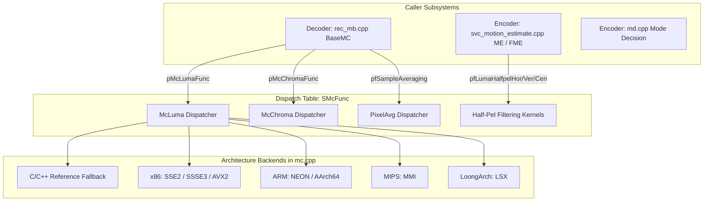
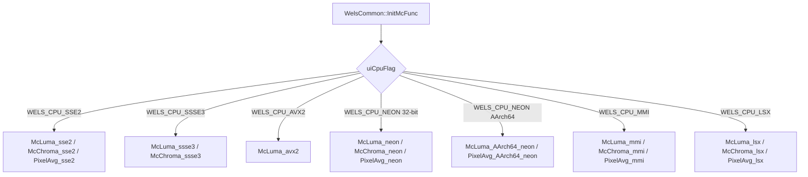
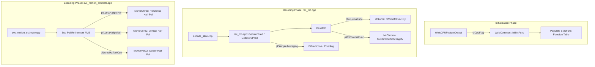

# OpenH264 Common: Motion Compensation Engine (`mc.cpp`)

This document provides a comprehensive, literate-programming-style technical analysis of [codec/common/src/mc.cpp](openh264/codec/common/src/mc.cpp) and its associated interface header [codec/common/inc/mc.h](openh264/codec/common/inc/mc.h). It details the core motion compensation (MC) subsystem shared across both the OpenH264 **Decoder** and **Encoder**, covering quarter-pixel ($\frac{1}{4}$-pel) luma 6-tap FIR Wiener interpolation, eighth-pixel ($\frac{1}{8}$-pel) chroma bilinear interpolation, pixel sample averaging, memory copying, and multi-architecture SIMD acceleration dispatching (x86 SSE2/SSSE3/AVX2, ARM NEON/AArch64, MIPS MMI, and Loongson LSX).

---

## Table of Contents
1. [Module Architecture & Subsystem Role](#1-module-architecture--subsystem-role)
2. [Mathematical Foundations & H.264 Interpolation Algorithms](#2-mathematical-foundations--h264-interpolation-algorithms)
   - [2.1 Luma Sub-Pixel Interpolation ($\frac{1}{4}$-Pel Grid)](#21-luma-sub-pixel-interpolation-frac14-pel-grid)
   - [2.2 Chroma Sub-Pixel Interpolation ($\frac{1}{8}$-Pel Grid)](#22-chroma-sub-pixel-interpolation-frac18-pel-grid)
   - [2.3 Pixel Sample Averaging](#23-pixel-sample-averaging)
3. [Data Structures, Function Pointers, and Constants](#3-data-structures-function-pointers-and-constants)
   - [3.1 Structure `SMcFunc` (`TagMcFunc`)](#31-structure-smcfunc-tagmcfunc)
   - [3.2 Function Pointer Typedefs](#32-function-pointer-typedefs)
   - [3.3 Chroma Weight Lookup Table `g_kuiABCD`](#33-chroma-weight-lookup-table-g_kuiabcd)
4. [Deep-Dive Function Analysis](#4-deep-dive-function-analysis)
   - [4.1 Block Memory Copy Routines (`McCopy`)](#41-block-memory-copy-routines-mccopy)
   - [4.2 1D 6-Tap FIR Filtering Kernels](#42-1d-6-tap-fir-filtering-kernels)
   - [4.3 Half-Pixel Luma Interpolation (`McHorVer20_c`, `McHorVer02_c`, `McHorVer22_c`)](#43-half-pixel-luma-interpolation-mchorver20_c-mchorver02_c-mchorver22_c)
   - [4.4 Quarter-Pixel Luma Grid Matrix (`McHorVer01_c` .. `McHorVer33_c`)](#44-quarter-pixel-luma-grid-matrix-mchorver01_c--mchorver33_c)
   - [4.5 Top-Level Luma Motion Compensation Dispatcher (`McLuma_c`)](#45-top-level-luma-motion-compensation-dispatcher-mcluma_c)
   - [4.6 Chroma Motion Compensation Engine (`McChroma_c`, `McChromaWithFragMv_c`)](#46-chroma-motion-compensation-engine-mcchroma_c-mcchromawithfragmv_c)
   - [4.7 Sample Averaging Kernel (`PixelAvg_c`)](#47-sample-averaging-kernel-pixelavg_c)
5. [Hardware Acceleration & SIMD Implementations](#5-hardware-acceleration--simd-implementations)
   - [5.1 x86 / x86_64 Implementations (SSE2, SSSE3, AVX2)](#51-x86--x86_64-implementations-sse2-ssse3-avx2)
   - [5.2 ARM Architecture Implementations (NEON & AArch64)](#52-arm-architecture-implementations-neon--aarch64)
   - [5.3 MIPS MMI Inline Assembly Implementations](#53-mips-mmi-inline-assembly-implementations)
   - [5.4 LoongArch LSX Implementations](#54-loongarch-lsx-implementations)
6. [Dynamic CPU Feature Dispatching (`WelsCommon::InitMcFunc`)](#6-dynamic-cpu-feature-dispatching-welscommoninitmcfunc)
7. [Call Graph & Subsystem Integration](#7-call-graph--subsystem-integration)

---

## 1. Module Architecture & Subsystem Role

Motion Compensation (MC) is the core computational bottleneck in inter-frame video prediction. When macroblocks in P-slices or B-slices reference previously decoded frames stored in the Decoded Picture Buffer (DPB), physical objects often move by non-integer pixel displacements between video frames. To represent sub-pixel motion accurately, the H.264/AVC standard defines sub-pixel sample interpolation:

- **Luma Plane ($Y$)**: Motion vectors have quarter-pixel ($\frac{1}{4}$-pel) precision. Intermediate samples at half-pixel locations are derived using a 6-tap symmetric Finite Impulse Response (FIR) Wiener filter, while quarter-pixel locations are derived using linear/bilinear averaging.
- **Chroma Planes ($Cb$, $Cr$)**: Under 4:2:0 planar chroma subsampling, a quarter-pel luma displacement corresponds to an eighth-pixel ($\frac{1}{8}$-pel) chroma displacement. Chroma samples are synthesized via 2D bilinear interpolation using 4 weighted neighboring integer-pel samples.



[mc.cpp](openh264/codec/common/src/mc.cpp) serves as the unified implementation and dispatch hub for all motion compensation operations in OpenH264. It is shared across both the decoder ([codec/decoder/core/src/rec_mb.cpp](openh264/codec/decoder/core/src/rec_mb.cpp)) and encoder ([codec/encoder/core/src/svc_motion_estimate.cpp](openh264/codec/encoder/core/src/svc_motion_estimate.cpp)).

---

## 2. Mathematical Foundations & H.264 Interpolation Algorithms

### 2.1 Luma Sub-Pixel Interpolation ($\frac{1}{4}$-Pel Grid)

According to ITU-T H.264 Specification Section 8.4.2.2.1, the fractional luma positions are indexed on a $4 \times 4$ grid:

```
  A   a   b   c   B
  d   e   f   g
  h   i   j   k   m
  n   p   q   r
  C               D
```

Where:
- Uppercase letters ($A, B, C, D$) represent integer-pixel samples.
- Lowercase letters ($b, h, j$) represent half-pixel ($\frac{1}{2}$-pel) samples.
- Lowercase letters ($a, c, d, e, f, g, i, k, m, n, p, q, r$) represent quarter-pixel ($\frac{1}{4}$-pel) samples.


#### 1. Half-Pixel Interpolation (6-Tap Symmetric FIR Filter)
The half-pixel samples are calculated using a 6-tap FIR filter with impulse response coefficients $\left( \frac{1}{32}, -\frac{5}{32}, \frac{20}{32}, \frac{20}{32}, -\frac{5}{32}, \frac{1}{32} \right)$:

1. **Horizontal Half-Pixel $b$ (Location $(2, 0)$)**:
   $$b_1 = E - 5F + 20G + 20H - 5I + J$$
   $$b = \text{Clip1}\left( (b_1 + 16) \gg 5 \right)$$
   where $E, F, G, H, I, J$ are the 6 consecutive horizontal integer samples surrounding $b$.

2. **Vertical Half-Pixel $h$ (Location $(0, 2)$)**:
   $$h_1 = A - 5B + 20C + 20D - 5E + F$$
   $$h = \text{Clip1}\left( (h_1 + 16) \gg 5 \right)$$
   where $A, B, C, D, E, F$ are the 6 consecutive vertical integer samples surrounding $h$.

3. **Center Half-Pixel $j$ (Location $(2, 2)$)**:
   The center half-pixel sample $j$ is obtained by applying the 6-tap filter in both directions. First, intermediate unclipped 16-bit values $aa_1, bb_1, cc_1, dd_1, ee_1, ff_1$ are computed vertically for each of the 6 surrounding columns. Then the horizontal 6-tap filter is applied across the 16-bit intermediate samples:
   $$j_1 = aa_1 - 5 \cdot bb_1 + 20 \cdot cc_1 + 20 \cdot dd_1 - 5 \cdot ee_1 + ff_1$$
   $$j = \text{Clip1}\left( (j_1 + 512) \gg 10 \right)$$

#### 2. Quarter-Pixel Interpolation (Bilinear Averaging)
Quarter-pixel samples are computed by averaging neighboring integer and half-pixel samples with rounding:
- Horizontal/Vertical adjacent to integer:
  $$a = (A + b + 1) \gg 1, \quad c = (B + b + 1) \gg 1$$
  $$d = (A + h + 1) \gg 1, \quad n = (C + h + 1) \gg 1$$
- Diagonal / Compound quarter-pixel samples:
  $$e = (b + h + 1) \gg 1, \quad g = (b + m + 1) \gg 1$$
  $$p = (h + q + 1) \gg 1, \quad f = (b + j + 1) \gg 1, \quad i = (h + j + 1) \gg 1$$

---

### 2.2 Chroma Sub-Pixel Interpolation ($\frac{1}{8}$-Pel Grid)

Under 4:2:0 chroma subsampling, chroma motion vectors $(iMvX_c, iMvY_c)$ have $\frac{1}{8}$-pel precision:
$$dx = iMvX_c \pmod 8, \quad dy = iMvY_c \pmod 8 \quad (0 \le dx, dy \le 7)$$

The 2D bilinear interpolation weights $(A, B, C, D)$ are computed as:
$$A = (8 - dx) \cdot (8 - dy)$$
$$B = dx \cdot (8 - dy)$$
$$C = (8 - dx) \cdot dy$$
$$D = dx \cdot dy$$

Note that $A + B + C + D = 64$.

For an integer chroma grid position $(x, y)$, the interpolated chroma sample $\text{Dst}(x, y)$ is given by:
$$\text{Dst}(x,y) = \left( A \cdot \text{Src}(x,y) + B \cdot \text{Src}(x+1,y) + C \cdot \text{Src}(x,y+1) + D \cdot \text{Src}(x+1,y+1) + 32 \right) \gg 6$$

If $dx = 0$ and $dy = 0$, the formula simplifies to an exact integer pixel copy ($\text{Dst} = \text{Src}$).

---

### 2.3 Pixel Sample Averaging

For bi-directional prediction (B-frames) and quarter-pel interpolation stages, two pixel sample blocks $\text{SrcA}$ and $\text{SrcB}$ are blended:
$$\text{Dst}(x,y) = \left( \text{SrcA}(x,y) + \text{SrcB}(x,y) + 1 \right) \gg 1$$

---

## 3. Data Structures, Function Pointers, and Constants

### 3.1 Structure `SMcFunc` (`TagMcFunc`)

Defined in [codec/common/inc/mc.h](openh264/codec/common/inc/mc.h#L46-L54), `SMcFunc` is the central function dispatch table storing pointers to active motion compensation routines for the current CPU runtime environment.

```cpp
typedef struct TagMcFunc {
  PWelsLumaHalfpelMcFunc      pfLumaHalfpelHor;   // 6-tap horizontal half-pel filter (2,0)
  PWelsLumaHalfpelMcFunc      pfLumaHalfpelVer;   // 6-tap vertical half-pel filter (0,2)
  PWelsLumaHalfpelMcFunc      pfLumaHalfpelCen;   // 2D 6-tap center half-pel filter (2,2)
  PWelsMcFunc                 pMcChromaFunc;      // Top-level 1/8-pel chroma MC dispatcher
  PWelsMcFunc                 pMcLumaFunc;        // Top-level 1/4-pel luma MC dispatcher
  PWelsSampleAveragingFunc    pfSampleAveraging;  // Rounded pixel block averaging routine
} SMcFunc;
```

#### Field Details & Lifecycle
| Member Field | Type | Description | Target Usage |
| :--- | :--- | :--- | :--- |
| `pfLumaHalfpelHor` | `PWelsLumaHalfpelMcFunc` | Filters horizontal half-pel samples ($b$). | Encoder FME & Decoder Sub-pel synthesis. |
| `pfLumaHalfpelVer` | `PWelsLumaHalfpelMcFunc` | Filters vertical half-pel samples ($h$). | Encoder FME & Decoder Sub-pel synthesis. |
| `pfLumaHalfpelCen` | `PWelsLumaHalfpelMcFunc` | Filters 2D center half-pel samples ($j$). | Encoder FME & Decoder Sub-pel synthesis. |
| `pMcChromaFunc` | `PWelsMcFunc` | Full 1/8-pel bilinear chroma interpolation. | Macroblock reconstruction (`rec_mb.cpp`). |
| `pMcLumaFunc` | `PWelsMcFunc` | Full 1/4-pel luma motion compensation. | Macroblock reconstruction (`rec_mb.cpp`). |
| `pfSampleAveraging` | `PWelsSampleAveragingFunc`| Blends two pixel buffers with rounding. | B-slice bi-prediction & quarter-pel blending. |

---

### 3.2 Function Pointer Typedefs

```cpp
// General motion compensation entry signature (Luma and Chroma)
typedef void (*PWelsMcFunc) (const uint8_t* pSrc, int32_t iSrcStride,
                             uint8_t* pDst, int32_t iDstStride,
                             int16_t iMvX, int16_t iMvY,
                             int32_t iWidth, int32_t iHeight);

// Luma half-pel standalone filter signature
typedef void (*PWelsLumaHalfpelMcFunc) (const uint8_t* pSrc, int32_t iSrcStride,
                                        uint8_t* pDst, int32_t iDstStride,
                                        int32_t iWidth, int32_t iHeight);

// Pixel sample block averaging signature
typedef void (*PWelsSampleAveragingFunc) (uint8_t* pDst, int32_t iDstStride,
                                          const uint8_t* pSrcA, int32_t iSrcAStride,
                                          const uint8_t* pSrcB, int32_t iSrcBStride,
                                          int32_t iWidth, int32_t iHeight);
```

Internal helper typedefs in [mc.cpp](openh264/codec/common/src/mc.cpp#L50-L55):
```cpp
typedef void (*PMcChromaWidthExtFunc) (const uint8_t* pSrc, int32_t iSrcStride,
                                       uint8_t* pDst, int32_t iDstStride,
                                       const uint8_t* kpABCD, int32_t iHeight);

typedef void (*PWelsSampleWidthAveragingFunc) (uint8_t* pDst, int32_t iDstStride,
                                               const uint8_t* pSrcA, int32_t iSrcAStride,
                                               const uint8_t* pSrcB, int32_t iSrcBStride,
                                               int32_t iHeight);

typedef void (*PWelsMcWidthHeightFunc) (const uint8_t* pSrc, int32_t iSrcStride,
                                        uint8_t* pDst, int32_t iDstStride,
                                        int32_t iWidth, int32_t iHeight);
```

---

### 3.3 Chroma Weight Lookup Table `g_kuiABCD`

Defined in [mc.cpp:L62-L95](openh264/codec/common/src/mc.cpp#L62-L95), `g_kuiABCD[8][8][4]` precomputes the four interpolation weights $\{A, B, C, D\}$ for all 64 combinations of $(dy, dx) \in [0..7]^2$:

```cpp
static const uint8_t g_kuiABCD[8][8][4] = {
  // dy = 0: dx from 0 to 7
  { {64, 0, 0, 0}, {56, 8, 0, 0}, {48, 16, 0, 0}, {40, 24, 0, 0},
    {32, 32, 0, 0}, {24, 40, 0, 0}, {16, 48, 0, 0}, {8, 56, 0, 0} },
  // dy = 1: dx from 0 to 7
  { {56, 0, 8, 0}, {49, 7, 7, 1}, {42, 14, 6, 2}, {35, 21, 5, 3},
    {28, 28, 4, 4}, {21, 35, 3, 5}, {14, 42, 2, 6}, {7, 49, 1, 7} },
  // dy = 2..7 ...
};
```

---

## 4. Deep-Dive Function Analysis

### 4.1 Block Memory Copy Routines (`McCopy`)

[mc.cpp:L100-L139](openh264/codec/common/src/mc.cpp#L100-L139)

When motion vectors are aligned to integer boundaries ($(iMvX \& 3) == 0$ and $(iMvY \& 3) == 0$), no interpolation is needed. Block pixels are copied directly row-by-row using width-specialized inline routines:

- **`McCopyWidthEq2_c`**: Copies 2 bytes per row via 16-bit loads/stores (`LD16`, `ST16A2`). Used exclusively for chroma sub-blocks.
- **`McCopyWidthEq4_c`**: Copies 4 bytes per row via 32-bit loads/stores (`LD32`, `ST32A4`).
- **`McCopyWidthEq8_c`**: Copies 8 bytes per row via 64-bit loads/stores (`LD64`, `ST64A8`).
- **`McCopyWidthEq16_c`**: Copies 16 bytes per row via two 64-bit loads/stores (`LD64`, `ST64A8`).

```cpp
static inline void McCopy_c (const uint8_t* pSrc, int32_t iSrcStride,
                             uint8_t* pDst, int32_t iDstStride,
                             int32_t iWidth, int32_t iHeight) {
  if (iWidth == 16)
    McCopyWidthEq16_c (pSrc, iSrcStride, pDst, iDstStride, iHeight);
  else if (iWidth == 8)
    McCopyWidthEq8_c (pSrc, iSrcStride, pDst, iDstStride, iHeight);
  else if (iWidth == 4)
    McCopyWidthEq4_c (pSrc, iSrcStride, pDst, iDstStride, iHeight);
  else
    McCopyWidthEq2_c (pSrc, iSrcStride, pDst, iDstStride, iHeight);
}
```

---

### 4.2 1D 6-Tap FIR Filtering Kernels

#### `FilterInput8bitWithStride_c`
[mc.cpp:L151-L160](openh264/codec/common/src/mc.cpp#L151-L160)

```cpp
static inline int32_t FilterInput8bitWithStride_c (const uint8_t* pSrc, const int32_t kiOffset) {
  const int32_t kiOffset1 = kiOffset;
  const int32_t kiOffset2 = (kiOffset << 1);
  const int32_t kiOffset3 = kiOffset + kiOffset2;
  const uint32_t kuiPix05 = *(pSrc - kiOffset2) + *(pSrc + kiOffset3);
  const uint32_t kuiPix14 = *(pSrc - kiOffset1) + *(pSrc + kiOffset2);
  const uint32_t kuiPix23 = *(pSrc)             + *(pSrc + kiOffset1);

  return (kuiPix05 - ((kuiPix14 << 2) + kuiPix14) + (kuiPix23 << 4) + (kuiPix23 << 2));
}
```

- **Parameters**: `pSrc` points to the current center pixel. `kiOffset` is `1` for horizontal filtering, or `iSrcStride` for vertical filtering.
- **Mathematical Optimization**: Multiplications by $5$ and $20$ are evaluated with shift-adds:
  $$5 \cdot x = (x \ll 2) + x$$
  $$20 \cdot y = (y \ll 4) + (y \ll 2)$$
- **Return Value**: Unclipped, unrounded 32-bit integer FIR filter sum:
  $$\text{Result} = \text{Pix}_{05} - 5 \cdot \text{Pix}_{14} + 20 \cdot \text{Pix}_{23}$$

#### `HorFilterInput16bit_c`
[mc.cpp:L143-L149](openh264/codec/common/src/mc.cpp#L143-L149)

Applies the 1D 6-tap filter across intermediate signed 16-bit integer array `pSrc`:
```cpp
static inline int32_t HorFilterInput16bit_c (const int16_t* pSrc) {
  int32_t iPix05 = pSrc[0] + pSrc[5];
  int32_t iPix14 = pSrc[1] + pSrc[4];
  int32_t iPix23 = pSrc[2] + pSrc[3];

  return (iPix05 - (iPix14 * 5) + (iPix23 * 20));
}
```

---

### 4.3 Half-Pixel Luma Interpolation (`McHorVer20_c`, `McHorVer02_c`, `McHorVer22_c`)

#### `McHorVer20_c` (Horizontal Half-Pel $(2, 0)$)
[mc.cpp:L187-L198](openh264/codec/common/src/mc.cpp#L187-L198)

Filters along the horizontal axis with `kiOffset = 1`, adds rounding offset $16$, shifts right by $5$, and clamps to $[0, 255]$ with `WelsClip1`:
$$\text{pDst}[j] = \text{WelsClip1}\left( (\text{FilterInput8bitWithStride\_c}(pSrc + j, 1) + 16) \gg 5 \right)$$

#### `McHorVer02_c` (Vertical Half-Pel $(0, 2)$)
[mc.cpp:L201-L212](openh264/codec/common/src/mc.cpp#L201-L212)

Filters along the vertical axis with `kiOffset = iSrcStride`, adds $16$, shifts right by $5$, and clamps to $[0, 255]$:
$$\text{pDst}[j] = \text{WelsClip1}\left( (\text{FilterInput8bitWithStride\_c}(pSrc + j, iSrcStride) + 16) \gg 5 \right)$$

#### `McHorVer22_c` (Center 2D Half-Pel $(2, 2)$)
[mc.cpp:L215-L231](openh264/codec/common/src/mc.cpp#L215-L231)

1. First filters $(iWidth + 5)$ vertical columns into intermediate stack array `int16_t iTmp[17 + 5]` without rounding or clamping.
2. Applies `HorFilterInput16bit_c` horizontally across the 16-bit intermediate buffer, adds rounding offset $512$, shifts right by $10$, and clamps to $[0, 255]$:
$$\text{pDst}[k] = \text{WelsClip1}\left( (\text{HorFilterInput16bit\_c}(\&iTmp[k]) + 512) \gg 10 \right)$$

---

### 4.4 Quarter-Pixel Luma Grid Matrix (`McHorVer01_c` .. `McHorVer33_c`)

[mc.cpp:L234-L333](openh264/codec/common/src/mc.cpp#L234-L333)

The 16 sub-pixel interpolation functions are structured systematically:

| Function Name | Grid Coordinate $(x, y)$ | Primary Source 1 | Primary Source 2 | Blending Operation |
| :--- | :--- | :--- | :--- | :--- |
| `McCopy_c` | $(0, 0)$ | Integer $pSrc$ | — | Direct Memory Copy |
| `McHorVer01_c` | $(0, 1)$ | Integer $pSrc$ | Vertical $\frac{1}{2}$-pel $(0,2)$ | `PixelAvg_c(pDst, pSrc, uiTmp)` |
| `McHorVer02_c` | $(0, 2)$ | Vertical $\frac{1}{2}$-pel | — | 6-Tap Vertical Filter |
| `McHorVer03_c` | $(0, 3)$ | Integer $pSrc + iSrcStride$ | Vertical $\frac{1}{2}$-pel $(0,2)$ | `PixelAvg_c(pDst, pSrc+Stride, uiTmp)` |
| `McHorVer10_c` | $(1, 0)$ | Integer $pSrc$ | Horizontal $\frac{1}{2}$-pel $(2,0)$ | `PixelAvg_c(pDst, pSrc, uiTmp)` |
| `McHorVer11_c` | $(1, 1)$ | Horiz $\frac{1}{2}$-pel $(2,0)$ | Vertical $\frac{1}{2}$-pel $(0,2)$ | `PixelAvg_c(pDst, uiHorTmp, uiVerTmp)` |
| `McHorVer12_c` | $(1, 2)$ | Vertical $\frac{1}{2}$-pel $(0,2)$ | Center $\frac{1}{2}$-pel $(2,2)$ | `PixelAvg_c(pDst, uiVerTmp, uiCtrTmp)` |
| `McHorVer13_c` | $(1, 3)$ | Horiz $\frac{1}{2}$-pel $pSrc+Stride$ | Vertical $\frac{1}{2}$-pel $(0,2)$ | `PixelAvg_c(pDst, uiHorTmp, uiVerTmp)` |
| `McHorVer20_c` | $(2, 0)$ | Horizontal $\frac{1}{2}$-pel | — | 6-Tap Horizontal Filter |
| `McHorVer21_c` | $(2, 1)$ | Horiz $\frac{1}{2}$-pel $(2,0)$ | Center $\frac{1}{2}$-pel $(2,2)$ | `PixelAvg_c(pDst, uiHorTmp, uiCtrTmp)` |
| `McHorVer22_c` | $(2, 2)$ | Center $\frac{1}{2}$-pel | — | 2D 6-Tap Filter (Vert + Horiz) |
| `McHorVer23_c` | $(2, 3)$ | Horiz $\frac{1}{2}$-pel $pSrc+Stride$ | Center $\frac{1}{2}$-pel $(2,2)$ | `PixelAvg_c(pDst, uiHorTmp, uiCtrTmp)` |
| `McHorVer30_c` | $(3, 0)$ | Integer $pSrc + 1$ | Horizontal $\frac{1}{2}$-pel $(2,0)$ | `PixelAvg_c(pDst, pSrc+1, uiHorTmp)` |
| `McHorVer31_c` | $(3, 1)$ | Horiz $\frac{1}{2}$-pel $(2,0)$ | Vertical $\frac{1}{2}$-pel $pSrc+1$ | `PixelAvg_c(pDst, uiHorTmp, uiVerTmp)` |
| `McHorVer32_c` | $(3, 2)$ | Vertical $\frac{1}{2}$-pel $pSrc+1$ | Center $\frac{1}{2}$-pel $(2,2)$ | `PixelAvg_c(pDst, uiVerTmp, uiCtrTmp)` |
| `McHorVer33_c` | $(3, 3)$ | Horiz $\frac{1}{2}$-pel $pSrc+Stride$ | Vertical $\frac{1}{2}$-pel $pSrc+1$ | `PixelAvg_c(pDst, uiHorTmp, uiVerTmp)` |

---

### 4.5 Top-Level Luma Motion Compensation Dispatcher (`McLuma_c`)

[mc.cpp:L335-L347](openh264/codec/common/src/mc.cpp#L335-L347)

```cpp
void McLuma_c (const uint8_t* pSrc, int32_t iSrcStride, uint8_t* pDst, int32_t iDstStride,
               int16_t iMvX, int16_t iMvY, int32_t iWidth, int32_t iHeight) {
  static const PWelsMcWidthHeightFunc pWelsMcFunc[4][4] = {
    {McCopy_c,      McHorVer01_c, McHorVer02_c, McHorVer03_c},
    {McHorVer10_c,  McHorVer11_c, McHorVer12_c, McHorVer13_c},
    {McHorVer20_c,  McHorVer21_c, McHorVer22_c, McHorVer23_c},
    {McHorVer30_c,  McHorVer31_c, McHorVer32_c, McHorVer33_c},
  };

  pWelsMcFunc[iMvX & 0x03][iMvY & 0x03] (pSrc, iSrcStride, pDst, iDstStride, iWidth, iHeight);
}
```

The function extracts the fractional quarter-pel offsets using bitwise AND (`iMvX & 0x03`, `iMvY & 0x03`) and directly calls the corresponding entry in the $4 \times 4$ function pointer matrix.

---

### 4.6 Chroma Motion Compensation Engine (`McChroma_c`, `McChromaWithFragMv_c`)

[mc.cpp:L349-L379](openh264/codec/common/src/mc.cpp#L349-L379)

#### `McChromaWithFragMv_c`
Performs 2D bilinear interpolation using the precomputed weights $A, B, C, D$ from `g_kuiABCD`:

```cpp
static inline void McChromaWithFragMv_c (const uint8_t* pSrc, int32_t iSrcStride,
                                        uint8_t* pDst, int32_t iDstStride,
                                        int16_t iMvX, int16_t iMvY,
                                        int32_t iWidth, int32_t iHeight) {
  int32_t i, j;
  int32_t iA, iB, iC, iD;
  const uint8_t* pSrcNext = pSrc + iSrcStride;
  const uint8_t* pABCD = g_kuiABCD[iMvY & 0x07][iMvX & 0x07];
  iA = pABCD[0]; iB = pABCD[1]; iC = pABCD[2]; iD = pABCD[3];

  for (i = 0; i < iHeight; i++) {
    for (j = 0; j < iWidth; j++) {
      pDst[j] = (iA * pSrc[j] + iB * pSrc[j + 1] + iC * pSrcNext[j] + iD * pSrcNext[j + 1] + 32) >> 6;
    }
    pDst     += iDstStride;
    pSrc      = pSrcNext;
    pSrcNext += iSrcStride;
  }
}
```

#### `McChroma_c`
Checks if both fractional offsets are zero:
- If `(iMvX & 7) == 0` and `(iMvY & 7) == 0`: Executes `McCopy_c` (fast path).
- Otherwise: Invokes `McChromaWithFragMv_c`.

---

### 4.7 Sample Averaging Kernel (`PixelAvg_c`)

[mc.cpp:L162-L173](openh264/codec/common/src/mc.cpp#L162-L173)

```cpp
static inline void PixelAvg_c (uint8_t* pDst, int32_t iDstStride,
                               const uint8_t* pSrcA, int32_t iSrcAStride,
                               const uint8_t* pSrcB, int32_t iSrcBStride,
                               int32_t iWidth, int32_t iHeight) {
  int32_t i, j;
  for (i = 0; i < iHeight; i++) {
    for (j = 0; j < iWidth; j++) {
      pDst[j] = (pSrcA[j] + pSrcB[j] + 1) >> 1;
    }
    pDst  += iDstStride;
    pSrcA += iSrcAStride;
    pSrcB += iSrcBStride;
  }
}
```

---

## 5. Hardware Acceleration & SIMD Implementations

`mc.cpp` contains extensive hardware-accelerated kernels and wrapper functions for various processor architectures:



### 5.1 x86 / x86_64 Implementations (SSE2, SSSE3, AVX2)

Conditioned under `#if defined(X86_ASM)`:

1. **SSE2 Vectorization** ([mc.cpp:L381-L713](openh264/codec/common/src/mc.cpp#L381-L713)):
   - Vectorizes 16-byte aligned luma/chroma copying (`McCopyWidthEq16_sse2`), sample averaging (`PixelAvgWidthEq16_sse2`), and horizontal/vertical half-pel filtering.
   - `McLuma_sse2` maintains a $4 \times 4$ function table populated with SSE2 wrappers (`McHorVer01_sse2` .. `McHorVer33_sse2`).
   - Uses `ENFORCE_STACK_ALIGN_1D` and `ENFORCE_STACK_ALIGN_2D` to ensure 16-byte alignment of intermediate stack buffers `pTmp`, `pHorTmp`, `pVerTmp`, and `pCtrTmp`.

2. **SSSE3 Vectorization** ([mc.cpp:L715-L908](openh264/codec/common/src/mc.cpp#L715-L908)):
   - Exploits SSSE3 byte shuffling instructions (`pshufb`) and byte-to-word expansion routines (`McHorVer20Width8U8ToS16_ssse3`).
   - Replaces SSE2 wrappers with faster SSSE3 kernels (`McLuma_ssse3`, `McChroma_ssse3`).

3. **AVX2 Vectorization** ([mc.cpp:L913-L1070](openh264/codec/common/src/mc.cpp#L913-L1070)):
   - Processes 256-bit vector registers simultaneously (32 bytes per instruction).
   - Replaces luma table routines with `McLuma_avx2` and `McHorVer22Width5Or9Or17_avx2`.

---

### 5.2 ARM Architecture Implementations (NEON & AArch64)

1. **ARMv7 32-bit NEON** ([mc.cpp:L1085-L1371](openh264/codec/common/src/mc.cpp#L1085-L1371)):
   - Utilizes ARM NEON 128-bit vector instructions (`vld1.8`, `vst1.8`, `vhadd.u8`, `vmull.u8`, `vmlal.u8`).
   - Dispatches via `McLuma_neon`, `McChroma_neon`, and `PixelAvg_neon`.

2. **ARMv8 AArch64 NEON** ([mc.cpp:L1373-L1661](openh264/codec/common/src/mc.cpp#L1373-L1661)):
   - Tailored for 64-bit ARM registers (`AArch64`).
   - Dispatches via `McLuma_AArch64_neon`, `McChroma_AArch64_neon`, and `PixelAvg_AArch64_neon`.

---

### 5.3 MIPS MMI Inline Assembly Implementations

[mc.cpp:L1663-L4197](openh264/codec/common/src/mc.cpp#L1663-L4197)

For MIPS architectures supporting Loongson SIMD Multimedia Instructions (MMI), `mc.cpp` embeds inline assembly blocks:
- **`MMI_LOAD_8P`**: Loads 8 unaligned packed bytes using `gsldlc1` / `gsldrc1` and unpacks them into 16-bit halves via `punpcklbh` / `punpckhbh`.
- **`FILTER_HV_W4` & `FILTER_HV_W8`**: Evaluates parallel 6-tap FIR arithmetic in MIPS floating-point/vector registers using `paddh`, `psubh`, `psllh`, and `psrah`.
- Dispatches through `McLuma_mmi`, `McChroma_mmi`, and `PixelAvg_mmi`.

---

### 5.4 LoongArch LSX Implementations

[mc.cpp:L4199-L4525](openh264/codec/common/src/mc.cpp#L4199-L4525)

Optimized for the Loongson LoongArch SIMD extension (LSX), dispatching through `McLuma_lsx`, `McChroma_lsx`, and `PixelAvg_lsx`.

---

## 6. Dynamic CPU Feature Dispatching (`WelsCommon::InitMcFunc`)

[mc.cpp:L4528-L4605](openh264/codec/common/src/mc.cpp#L4528-L4605)

The global initialization function `WelsCommon::InitMcFunc` dynamically configures the `SMcFunc` dispatch table based on runtime CPU feature flags (`uiCpuFlag`):

```cpp
void WelsCommon::InitMcFunc (SMcFunc* pMcFuncs, uint32_t uiCpuFlag) {
  // Step 1: Initialize all function pointers to default C implementations
  pMcFuncs->pfLumaHalfpelHor  = McHorVer20_c;
  pMcFuncs->pfLumaHalfpelVer  = McHorVer02_c;
  pMcFuncs->pfLumaHalfpelCen  = McHorVer22_c;
  pMcFuncs->pfSampleAveraging = PixelAvg_c;
  pMcFuncs->pMcChromaFunc     = McChroma_c;
  pMcFuncs->pMcLumaFunc       = McLuma_c;

  // Step 2: Override with x86 SIMD if available
#if defined (X86_ASM)
  if (uiCpuFlag & WELS_CPU_SSE2) {
    pMcFuncs->pfLumaHalfpelHor  = McHorVer20Width5Or9Or17_sse2;
    pMcFuncs->pfLumaHalfpelVer  = McHorVer02Height5Or9Or17_sse2;
    pMcFuncs->pfLumaHalfpelCen  = McHorVer22Width5Or9Or17Height5Or9Or17_sse2;
    pMcFuncs->pfSampleAveraging = PixelAvg_sse2;
    pMcFuncs->pMcChromaFunc     = McChroma_sse2;
    pMcFuncs->pMcLumaFunc       = McLuma_sse2;
  }

  if (uiCpuFlag & WELS_CPU_SSSE3) {
    pMcFuncs->pfLumaHalfpelHor  = McHorVer20Width5Or9Or17_ssse3;
    pMcFuncs->pfLumaHalfpelVer  = McHorVer02_ssse3;
    pMcFuncs->pfLumaHalfpelCen  = McHorVer22Width5Or9Or17_ssse3;
    pMcFuncs->pMcChromaFunc     = McChroma_ssse3;
    pMcFuncs->pMcLumaFunc       = McLuma_ssse3;
  }
#ifdef HAVE_AVX2
  if (uiCpuFlag & WELS_CPU_AVX2) {
    pMcFuncs->pfLumaHalfpelHor  = McHorVer20Width5Or9Or17_avx2;
    pMcFuncs->pfLumaHalfpelVer  = McHorVer02_avx2;
    pMcFuncs->pfLumaHalfpelCen  = McHorVer22Width5Or9Or17_avx2;
    pMcFuncs->pMcLumaFunc       = McLuma_avx2;
  }
#endif
#endif // X86_ASM

  // Step 3: Override with ARM NEON if available
#if defined(HAVE_NEON)
  if (uiCpuFlag & WELS_CPU_NEON) {
    pMcFuncs->pMcLumaFunc       = McLuma_neon;
    pMcFuncs->pMcChromaFunc     = McChroma_neon;
    pMcFuncs->pfSampleAveraging = PixelAvg_neon;
    pMcFuncs->pfLumaHalfpelHor  = McHorVer20Width5Or9Or17_neon;
    pMcFuncs->pfLumaHalfpelVer  = McHorVer02Height5Or9Or17_neon;
    pMcFuncs->pfLumaHalfpelCen  = McHorVer22Width5Or9Or17Height5Or9Or17_neon;
  }
#endif
#if defined(HAVE_NEON_AARCH64) && defined(__aarch64__)
  if (uiCpuFlag & WELS_CPU_NEON) {
    pMcFuncs->pMcLumaFunc       = McLuma_AArch64_neon;
    pMcFuncs->pMcChromaFunc     = McChroma_AArch64_neon;
    pMcFuncs->pfSampleAveraging = PixelAvg_AArch64_neon;
    pMcFuncs->pfLumaHalfpelHor  = McHorVer20Width5Or9Or17_AArch64_neon;
    pMcFuncs->pfLumaHalfpelVer  = McHorVer02Height5Or9Or17_AArch64_neon;
    pMcFuncs->pfLumaHalfpelCen  = McHorVer22Width5Or9Or17Height5Or9Or17_AArch64_neon;
  }
#endif

  // Step 4: Override with MIPS MMI if available
#if defined(HAVE_MMI)
  if (uiCpuFlag & WELS_CPU_MMI) {
    pMcFuncs->pfLumaHalfpelHor  = McHorVer20Width5Or9Or17_mmi;
    pMcFuncs->pfLumaHalfpelVer  = McHorVer02Height5Or9Or17_mmi;
    pMcFuncs->pfLumaHalfpelCen  = McHorVer22Width5Or9Or17Height5Or9Or17_mmi;
    pMcFuncs->pfSampleAveraging = PixelAvg_mmi;
    pMcFuncs->pMcChromaFunc     = McChroma_mmi;
    pMcFuncs->pMcLumaFunc       = McLuma_mmi;
  }
#endif

  // Step 5: Override with LoongArch LSX if available
#if defined(HAVE_LSX)
  if (uiCpuFlag & WELS_CPU_LSX) {
    pMcFuncs->pMcChromaFunc     = McChroma_lsx;
    pMcFuncs->pfSampleAveraging = PixelAvg_lsx;
    pMcFuncs->pMcLumaFunc       = McLuma_lsx;
    pMcFuncs->pfLumaHalfpelVer  = McHorVer02_lsx;
    pMcFuncs->pfLumaHalfpelHor  = McHorVer20Width5Or9Or17_lsx;
    pMcFuncs->pfLumaHalfpelCen  = McHorVer22Width5Or9Or17_lsx;
  }
#endif
}
```

---

## 7. Call Graph & Subsystem Integration


