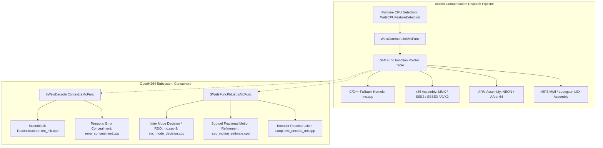

# Motion Compensation Subsystem Interface: `mc.h`

This document provides an exhaustive, literate-programming-style analysis of the shared Motion Compensation (MC) header file [mc.h](openh264/codec/common/inc/mc.h#L1-L408) in OpenH264. It covers the architectural role of motion compensation in the H.264 / AVC video coding pipeline, data structures, function pointer tables, mathematical interpolation algorithms, hardware-accelerated SIMD function prototypes, and dispatch mechanics.

---

## Table of Contents
1. [Architectural Overview & Module Purpose](#1-architectural-overview--module-purpose)
2. [H.264 Fractional Sample Interpolation Theory](#2-h264-fractional-sample-interpolation-theory)
   - [2.1 Luma Quarter-Pixel ($\frac{1}{4}$-pel) Interpolation](#21-luma-quarter-pixel-frac14-pel-interpolation)
   - [2.2 Chroma Eighth-Pixel ($\frac{1}{8}$-pel) Interpolation](#22-chroma-eighth-pixel-frac18-pel-interpolation)
   - [2.3 Pixel Sample Averaging](#23-pixel-sample-averaging)
3. [Data Structures & Type Definitions](#3-data-structures--type-definitions)
   - [3.1 Function Pointer Typedefs](#31-function-pointer-typedefs)
   - [3.2 The `SMcFunc` Dispatch Structure](#32-the-smcfunc-dispatch-structure)
4. [Hardware SIMD Acceleration & Function Prototypes](#4-hardware-simd-acceleration--function-prototypes)
   - [4.1 ARM NEON (32-bit ARMv7)](#41-arm-neon-32-bit-armv7)
   - [4.2 ARM NEON AArch64 (64-bit ARMv8)](#42-arm-neon-aarch64-64-bit-armv8)
   - [4.3 x86 / x86_64 ISA (MMX, SSE2, SSE3, SSSE3, AVX2)](#43-x86--x86_64-isa-mmx-sse2-sse3-ssse3-avx2)
   - [4.4 Loongson Simd eXtension (LSX)](#44-loongson-simd-extension-lsx)
5. [Kernel Initialization & Runtime CPU Dispatch](#5-kernel-initialization--runtime-cpu-dispatch)
6. [Call Graph & Code Integration](#6-call-graph--code-integration)

---

## 1. Architectural Overview & Module Purpose

In the H.264 / MPEG-4 AVC standard (ITU-T Rec. H.264 / ISO/IEC 14496-10, Section 8.4.2 *"Fractional sample interpolation process"*), Inter-picture prediction uses motion vectors (MVs) to locate prediction blocks within previously decoded reference frames. Because physical motion is continuous, motion vectors operate at fractional-pel precision:
- **Luma ($Y$) channel**: $\frac{1}{4}$-pixel (quarter-pel) accuracy.
- **Chroma ($Cb, Cr$) channels**: $\frac{1}{8}$-pixel (eighth-pel) accuracy for standard 4:2:0 planar sampling.

The header file [mc.h](openh264/codec/common/inc/mc.h#L1-L408) defines the core C/C++ interface, function pointer types, and assembly function prototypes for the shared motion compensation engine of OpenH264. It is shared across both the **Video Decoder** ([codec/decoder/](openh264/codec/decoder/)) and **Video Encoder** ([codec/encoder/](openh264/codec/encoder/)).



> [!NOTE]
> Motion compensation is one of the most computationally demanding routines in video processing. In OpenH264, all time-critical sub-pixel filtering routines are hand-optimized in vector assembly (x86 SSE2/SSSE3/AVX2, ARM NEON, LoongArch LSX, and MIPS MMI) while [mc.cpp](openh264/codec/common/src/mc.cpp#L1-L4606) provides clean, bit-exact C/C++ reference implementations.

---

## 2. H.264 Fractional Sample Interpolation Theory

### 2.1 Luma Quarter-Pixel ($\frac{1}{4}$-pel) Interpolation

Luma motion compensation requires constructing prediction samples at quarter-pel positions from integer sample positions. The fractional displacement vector is defined as $(dx, dy) = (iMvX \pmod 4, iMvY \pmod 4)$, where $dx, dy \in \{0, 1, 2, 3\}$.

```
Integer & Sub-Pixel Luma Grid Layout:

   (0,0)            (1,0)            (2,0)            (3,0)            (0,0)
    G --------------- a --------------- b --------------- c --------------- H
    |                 |                 |                 |                 |
(0,1) d               e                 f                 g                 |
    |                 |                 |                 |                 |
(0,2) h               i                 j                 k                 |
    |                 |                 |                 |                 |
(0,3) n               p                 q                 r                 |
    |                 |                 |                 |                 |
   (0,0) M ---------------------------------------------------------------- N
```

Where:
- Uppercase letters ($G, H, M, N$) represent **integer-pel samples**.
- Lowercase letters ($b, h$) represent **half-pel samples** along axes $(dx=2, dy=0)$ and $(dx=0, dy=2)$.
- Lowercase letter ($j$) represents the **central diagonal half-pel sample** $(dx=2, dy=2)$.
- Lowercase letters ($a, c, d, e, f, g, i, k, n, p, q, r$) represent **quarter-pel samples**.

#### A. Half-Pel Filtering (6-Tap Symmetric FIR Wiener Filter)

Half-pel samples are generated using a 6-tap symmetric Finite Impulse Response (FIR) Wiener filter with integer coefficients:
$$w = [1, \; -5, \; 20, \; 20, \; -5, \; 1]$$

1. **Horizontal Half-Pel Sample $b$ at $(dx=2, dy=0)$** ([McHorVer20_c](openh264/codec/common/src/mc.cpp#L187-L198)):
   $$b_1 = P(x-2, y) - 5 \cdot P(x-1, y) + 20 \cdot P(x, y) + 20 \cdot P(x+1, y) - 5 \cdot P(x+2, y) + P(x+3, y)$$
   $$b = \text{Clip1}\left( (b_1 + 16) \gg 5 \right)$$

2. **Vertical Half-Pel Sample $h$ at $(dx=0, dy=2)$** ([McHorVer02_c](openh264/codec/common/src/mc.cpp#L201-L212)):
   $$h_1 = P(x, y-2) - 5 \cdot P(x, y-1) + 20 \cdot P(x, y) + 20 \cdot P(x, y+1) - 5 \cdot P(x, y+2) + P(x, y+3)$$
   $$h = \text{Clip1}\left( (h_1 + 16) \gg 5 \right)$$

3. **Center Diagonal Half-Pel Sample $j$ at $(dx=2, dy=2)$** ([McHorVer22_c](openh264/codec/common/src/mc.cpp#L215-L231)):
   First, 16-bit intermediate horizontal filtered values $b_1(y+k)$ for $k \in \{-2, -1, 0, 1, 2, 3\}$ are computed without clipping or scaling. Then, the vertical 6-tap filter is applied across these 16-bit values:
   $$j_1 = b_1(x, y-2) - 5 \cdot b_1(x, y-1) + 20 \cdot b_1(x, y) + 20 \cdot b_1(x, y+1) - 5 \cdot b_1(x, y+2) + b_1(x, y+3)$$
   $$j = \text{Clip1}\left( (j_1 + 512) \gg 10 \right)$$

> [!IMPORTANT]
> In center half-pel interpolation ($j$), intermediate results must retain 16-bit signed precision. Rounding occurs only once at the end with $+512$ before bit-shifting right by 10 ($\gg 10$), followed by clipping to $[0, 255]$ via `WelsClip1`.

#### B. Quarter-Pel Bilinear Interpolation

Quarter-pel samples are computed by taking the arithmetic average of the two nearest integer or half-pel samples with rounding offset $+1$:
$$\text{avg}(X, Y) = (X + Y + 1) \gg 1$$

| Sub-Pel Phase $(dx, dy)$ | Code Symbol | Formula / Sources | C Implementation Function |
| :---: | :---: | :--- | :--- |
| **$(0, 0)$** | $G$ | Direct Integer Sample Copy | [McCopy_c](openh264/codec/common/src/mc.cpp#L174-L184) |
| **$(1, 0)$** | $a$ | $\text{avg}(G, b)$ | [McHorVer10_c](openh264/codec/common/src/mc.cpp#L248-L254) |
| **$(2, 0)$** | $b$ | Horizontal 6-tap filter on integer samples | [McHorVer20_c](openh264/codec/common/src/mc.cpp#L187-L198) |
| **$(3, 0)$** | $c$ | $\text{avg}(H, b)$ | [McHorVer30_c](openh264/codec/common/src/mc.cpp#L300-L306) |
| **$(0, 1)$** | $d$ | $\text{avg}(G, h)$ | [McHorVer01_c](openh264/codec/common/src/mc.cpp#L234-L240) |
| **$(1, 1)$** | $e$ | $\text{avg}(b, h)$ | [McHorVer11_c](openh264/codec/common/src/mc.cpp#L255-L263) |
| **$(2, 1)$** | $f$ | $\text{avg}(b, j)$ | [McHorVer21_c](openh264/codec/common/src/mc.cpp#L282-L290) |
| **$(3, 1)$** | $g$ | $\text{avg}(b, h')$ (where $h'$ is at $(x+1, y)$) | [McHorVer31_c](openh264/codec/common/src/mc.cpp#L307-L315) |
| **$(0, 2)$** | $h$ | Vertical 6-tap filter on integer samples | [McHorVer02_c](openh264/codec/common/src/mc.cpp#L201-L212) |
| **$(1, 2)$** | $i$ | $\text{avg}(h, j)$ | [McHorVer12_c](openh264/codec/common/src/mc.cpp#L264-L272) |
| **$(2, 2)$** | $j$ | 2D separable 6-tap horizontal + vertical filter | [McHorVer22_c](openh264/codec/common/src/mc.cpp#L215-L231) |
| **$(3, 2)$** | $k$ | $\text{avg}(h', j)$ | [McHorVer32_c](openh264/codec/common/src/mc.cpp#L316-L324) |
| **$(0, 3)$** | $n$ | $\text{avg}(M, h)$ | [McHorVer03_c](openh264/codec/common/src/mc.cpp#L241-L247) |
| **$(1, 3)$** | $p$ | $\text{avg}(b', h)$ (where $b'$ is at $(x, y+1)$) | [McHorVer13_c](openh264/codec/common/src/mc.cpp#L273-L281) |
| **$(2, 3)$** | $q$ | $\text{avg}(b', j)$ | [McHorVer23_c](openh264/codec/common/src/mc.cpp#L291-L299) |
| **$(3, 3)$** | $r$ | $\text{avg}(b', h')$ | [McHorVer33_c](openh264/codec/common/src/mc.cpp#L325-L333) |

---

### 2.2 Chroma Eighth-Pixel ($\frac{1}{8}$-pel) Interpolation

For 4:2:0 chroma planes, the horizontal and vertical motion vector components are scaled to $\frac{1}{8}$-pixel accuracy:
$$dx_c = iMvX \pmod 8, \quad dy_c = iMvY \pmod 8 \quad (dx_c, dy_c \in [0..7])$$

Chroma interpolation uses a 2D bilinear weighting of the 4 neighboring integer chroma pixels:
$$P_{\text{chroma}}(x, y) = \left( A \cdot P(x, y) + B \cdot P(x+1, y) + C \cdot P(x, y+1) + D \cdot P(x+1, y+1) + 32 \right) \gg 6$$

Where the weighting coefficients $A, B, C, D$ are defined as:
$$\begin{aligned}
A &= (8 - dx_c) \cdot (8 - dy_c) \\
B &= dx_c \cdot (8 - dy_c) \\
C &= (8 - dx_c) \cdot dy_c \\
D &= dx_c \cdot dy_c
\end{aligned}$$

Note that $A + B + C + D = 64$. These weights are precalculated in OpenH264's constant lookup table `g_kuiABCD[8][8][4]` in [mc.cpp](openh264/codec/common/src/mc.cpp#L62-L95).

---

### 2.3 Pixel Sample Averaging

Sample averaging computes the component-wise average of two 8-bit image sample matrices:
$$P_{\text{dst}}[x, y] = (P_{\text{srcA}}[x, y] + P_{\text{srcB}}[x, y] + 1) \gg 1$$

It is implemented by [PixelAvg_c](openh264/codec/common/src/mc.cpp#L162-L173) and accelerated in vector registers by packed unsigned byte averaging instructions (e.g. `PAVGB` in x86 SSE2, `VRHADD.U8` in ARM NEON).

---

## 3. Data Structures & Type Definitions

The type declarations in [mc.h](openh264/codec/common/inc/mc.h#L38-L54) establish the function pointer contracts used by the OpenH264 runtime.

```c
typedef void (*PWelsMcFunc) (const uint8_t* pSrc, int32_t iSrcStride, uint8_t* pDst, int32_t iDstStride,
                             int16_t iMvX, int16_t iMvY, int32_t iWidth, int32_t iHeight);

typedef void (*PWelsLumaHalfpelMcFunc) (const uint8_t* pSrc, int32_t iSrcStride, uint8_t* pDst, int32_t iDstStride,
                                        int32_t iWidth, int32_t iHeight);

typedef void (*PWelsSampleAveragingFunc) (uint8_t* pDst, int32_t iDstStride,
                                         const uint8_t* pSrcA, int32_t iSrcAStride,
                                         const uint8_t* pSrcB, int32_t iSrcBStride,
                                         int32_t iWidth, int32_t iHeight);
```

### 3.1 Function Pointer Typedefs

#### [PWelsMcFunc](openh264/codec/common/inc/mc.h#L38-L39)
The top-level function pointer type for full motion compensation (used for both luma quarter-pel and chroma eighth-pel prediction).

* **Signature**:
  ```c
  void (*PWelsMcFunc)(const uint8_t* pSrc, int32_t iSrcStride,
                      uint8_t* pDst, int32_t iDstStride,
                      int16_t iMvX, int16_t iMvY,
                      int32_t iWidth, int32_t iHeight);
  ```
* **Parameters**:
  - `pSrc`: `const uint8_t*` — Base pointer to the reference frame pixel buffer, already offset by the integer motion vector component:
    $$pSrc = pRefBase + (MV_y \gg 2) \cdot iSrcStride + (MV_x \gg 2)$$
  - `iSrcStride`: `int32_t` — Line pitch / stride (in bytes) of the source reference picture buffer.
  - `pDst`: `uint8_t*` — Destination buffer where reconstructed / predicted pixel blocks will be written.
  - `iDstStride`: `int32_t` — Line pitch / stride (in bytes) of the destination buffer.
  - `iMvX`: `int16_t` — Horizontal motion vector component. For luma, the lower 2 bits (`iMvX & 3`) define the quarter-pel phase. For chroma, the lower 3 bits (`iMvX & 7`) define the eighth-pel phase.
  - `iMvY`: `int16_t` — Vertical motion vector component. For luma, the lower 2 bits (`iMvY & 3`) define the quarter-pel phase. For chroma, the lower 3 bits (`iMvY & 7`) define the eighth-pel phase.
  - `iWidth`: `int32_t` — Prediction block width in pixels ($16, 8, 4,$ or $2$).
  - `iHeight`: `int32_t` — Prediction block height in pixels ($16, 8, 4,$ or $2$).

---

#### [PWelsLumaHalfpelMcFunc](openh264/codec/common/inc/mc.h#L41-L42)
Dedicated function pointer type for direct luma half-pel FIR filtering.

* **Signature**:
  ```c
  void (*PWelsLumaHalfpelMcFunc)(const uint8_t* pSrc, int32_t iSrcStride,
                                uint8_t* pDst, int32_t iDstStride,
                                int32_t iWidth, int32_t iHeight);
  ```
* **Parameters**:
  - `pSrc`: `const uint8_t*` — Pointer to integer source samples.
  - `iSrcStride`: `int32_t` — Source buffer line stride.
  - `pDst`: `uint8_t*` — Target buffer for filtered half-pel output samples.
  - `iDstStride`: `int32_t` — Destination buffer line stride.
  - `iWidth`: `int32_t` — Block width ($16, 8,$ or $4$).
  - `iHeight`: `int32_t` — Block height ($16, 8,$ or $4$).

---

#### [PWelsSampleAveragingFunc](openh264/codec/common/inc/mc.h#L43-L44)
Function pointer type for blending two source image patches element-wise.

* **Signature**:
  ```c
  void (*PWelsSampleAveragingFunc)(uint8_t* pDst, int32_t iDstStride,
                                  const uint8_t* pSrcA, int32_t iSrcAStride,
                                  const uint8_t* pSrcB, int32_t iSrcBStride,
                                  int32_t iWidth, int32_t iHeight);
  ```

---

### 3.2 The `SMcFunc` Dispatch Structure

The [SMcFunc](openh264/codec/common/inc/mc.h#L46-L54) structure (aliased from `TagMcFunc`) bundles all runtime-selected motion compensation function pointers:

```c
typedef struct TagMcFunc {
  PWelsLumaHalfpelMcFunc      pfLumaHalfpelHor;
  PWelsLumaHalfpelMcFunc      pfLumaHalfpelVer;
  PWelsLumaHalfpelMcFunc      pfLumaHalfpelCen;
  PWelsMcFunc                 pMcChromaFunc;

  PWelsMcFunc                 pMcLumaFunc;
  PWelsSampleAveragingFunc    pfSampleAveraging;
} SMcFunc;
```

| Member Field | Type | Sub-Pel Target | Description & Purpose |
| :--- | :--- | :---: | :--- |
| `pfLumaHalfpelHor` | [PWelsLumaHalfpelMcFunc](openh264/codec/common/inc/mc.h#L41-L42) | $(2, 0)$ | Horizontal 6-tap Wiener filter kernel ($b$ sample interpolation). |
| `pfLumaHalfpelVer` | [PWelsLumaHalfpelMcFunc](openh264/codec/common/inc/mc.h#L41-L42) | $(0, 2)$ | Vertical 6-tap Wiener filter kernel ($h$ sample interpolation). |
| `pfLumaHalfpelCen` | [PWelsLumaHalfpelMcFunc](openh264/codec/common/inc/mc.h#L41-L42) | $(2, 2)$ | 2D diagonal 6-tap horizontal + vertical filter kernel ($j$ sample interpolation). |
| `pMcChromaFunc` | [PWelsMcFunc](openh264/codec/common/inc/mc.h#L38-L39) | $(dx_c, dy_c)$ | Chroma $\frac{1}{8}$-pel bilinear interpolation dispatcher for $Cb$ and $Cr$ planes. |
| `pMcLumaFunc` | [PWelsMcFunc](openh264/codec/common/inc/mc.h#L38-L39) | $(dx, dy)$ | Top-level Luma $\frac{1}{4}$-pel motion compensation dispatcher (handles all 16 sub-pel phases). |
| `pfSampleAveraging`| [PWelsSampleAveragingFunc](openh264/codec/common/inc/mc.h#L43-L44) | N/A | Two-source pixel block rounding average kernel: $(A + B + 1) \gg 1$. |

---

## 4. Hardware SIMD Acceleration & Function Prototypes

[mc.h](openh264/codec/common/inc/mc.h#L67-L401) declares C-linkage (`extern "C"`) assembly function prototypes across all supported CPU architectures.

### 4.1 ARM NEON (32-bit ARMv7)

Defined under `#if defined(HAVE_NEON)` ([mc.h:L67-L159](openh264/codec/common/inc/mc.h#L67-L159)):

- **Integer Block Copies**:
  - `McCopyWidthEq4_neon`, `McCopyWidthEq8_neon`, `McCopyWidthEq16_neon`: Copies $4\times H$, $8\times H$, or $16\times H$ blocks using `VLD1` / `VST1` NEON vector instructions.
- **Chroma Bilinear Interpolation**:
  - `McChromaWidthEq4_neon`, `McChromaWidthEq8_neon`: Interpolates chroma blocks using vectorized multiply-accumulate `VMULL.U8` / `VMLAL.U8` with weight vectors `pWeights`.
- **Pixel Sample Averaging**:
  - `PixelAvgWidthEq4_neon`, `PixelAvgWidthEq8_neon`, `PixelAvgWidthEq16_neon`: Fast vector averaging via `VRHADD.U8`.
- **Quarter-Pel Phase Kernels**:
  - `McHorVer01WidthEq{4,8,16}_neon`, `McHorVer03WidthEq{4,8,16}_neon`, `McHorVer10WidthEq{4,8,16}_neon`, `McHorVer30WidthEq{4,8,16}_neon`.
- **Half-Pel Wiener Filtering**:
  - `McHorVer20WidthEq{4,8,16}_neon`: Horizontal 6-tap filtering.
  - `McHorVer02WidthEq{4,8,16}_neon`: Vertical 6-tap filtering.
  - `McHorVer22WidthEq{4,8,16}_neon`: 2D Center diagonal 6-tap filtering.
  - Extended boundary routines for intermediate padding: `McHorVer20Width{5,9,17}_neon`, `McHorVer02Height{5,9,17}_neon`, `McHorVer22Width{5,9,17}_neon`.

---

### 4.2 ARM NEON AArch64 (64-bit ARMv8)

Defined under `#if defined(HAVE_NEON_AARCH64) && defined(__aarch64__)` ([mc.h:L161-L245](openh264/codec/common/inc/mc.h#L161-L245)):

- Leverages 64-bit ARMv8 NEON registers (`v0`–`v31`) to double register throughput over 32-bit ARMv7.
- Full parity with ARMv7 function declarations, suffixed with `_AArch64_neon`:
  - `McCopyWidthEq{4,8,16}_AArch64_neon`
  - `McChromaWidthEq{4,8}_AArch64_neon`
  - `PixelAvgWidthEq{4,8,16}_AArch64_neon`
  - `McHorVer01WidthEq{4,8,16}_AArch64_neon`, `McHorVer03WidthEq{4,8,16}_AArch64_neon`, `McHorVer10WidthEq{4,8,16}_AArch64_neon`, `McHorVer30WidthEq{4,8,16}_AArch64_neon`
  - `McHorVer20WidthEq{4,8,16}_AArch64_neon`, `McHorVer02WidthEq{4,8,16}_AArch64_neon`, `McHorVer22WidthEq{4,8,16}_AArch64_neon`
  - `McHorVer20Width{5,9,17}_AArch64_neon`, `McHorVer02Height{5,9,17}_AArch64_neon`, `McHorVer22Width{5,9,17}_AArch64_neon`

---

### 4.3 x86 / x86_64 ISA (MMX, SSE2, SSE3, SSSE3, AVX2)

Defined under `#if defined(X86_ASM)` ([mc.h:L247-L357](openh264/codec/common/inc/mc.h#L247-L357)):

#### MMX & SSE2
- **MMX Extensions**: `McHorVer20WidthEq4_mmx`, `McChromaWidthEq4_mmx`, `McCopyWidthEq8_mmx`, `PixelAvgWidthEq4_mmx`, `PixelAvgWidthEq8_mmx`.
- **SSE2 Kernels**:
  - `McCopyWidthEq16_sse2`, `PixelAvgWidthEq16_sse2` (using `movdqa` and `pavgb`).
  - `McChromaWidthEq8_sse2`: Processes 8 chroma pixels per SIMD register using packed 16-bit multiplications (`pmullw`).
  - `McHorVer20WidthEq{8,16}_sse2`, `McHorVer02WidthEq8_sse2`.
  - Multi-pass Center Half-Pel Filters: `McHorVer22Width8HorFirst_sse2`, `McHorVer22Width8VerLastAlign_sse2`, `McHorVer22Width8VerLastUnAlign_sse2`.
  - Extended Width/Height Variants: `McHorVer20Width9Or17_sse2`, `McHorVer20Width5_sse2`, `McHorVer02Height9Or17_sse2`, `McHorVer02Height5_sse2`.

#### SSSE3 & AVX2
- **SSSE3**: Utilizes `pshufb` (byte shuffle) and `pmaddubsw` (multiply and add packed unsigned and signed bytes) for single-instruction 6-tap FIR multiplications:
  - `McChromaWidthEq8_ssse3`
  - `McHorVer02_ssse3`, `McHorVer20_ssse3`, `McHorVer22_ssse3`
  - Intermediate 16-bit to 8-bit conversions: `McHorVer02Width4S16ToU8_ssse3`, `McHorVer02Width5S16ToU8_ssse3`, `McHorVer02WidthGe8S16ToU8_ssse3`, `McHorVer20Width4U8ToS16_ssse3`, `McHorVer20Width8U8ToS16_ssse3`.
- **AVX2** (`#ifdef HAVE_AVX2`): Expands processing from 128-bit XMM to 256-bit YMM registers:
  - `McHorVer02_avx2`, `McHorVer20_avx2`
  - `McHorVer02Width{4,5,8,9,16Or17}S16ToU8_avx2`
  - `McHorVer20Width{4,8,16,17}U8ToS16_avx2`

---

### 4.4 Loongson Simd eXtension (LSX)

Defined under `#if defined(HAVE_LSX)` ([mc.h:L362-L401](openh264/codec/common/inc/mc.h#L362-L401)):
Optimized for Loongson 128-bit LSX vector execution:
- `McCopyWidthEq{4,8,16}_lsx`
- `McChromaWidthEq{4,8}_lsx`
- `PixelAvgWidthEq{4,8,16}_lsx`
- `McHorVer02WidthEq{8,16}_lsx`, `McHorVer20WidthEq{4,5,8,9,16,17}_lsx`, `McHorVer22WidthEq{5,8,9,17}_lsx`

---

## 5. Kernel Initialization & Runtime CPU Dispatch

The function [WelsCommon::InitMcFunc](openh264/codec/common/inc/mc.h#L58) dynamically populates the [SMcFunc](openh264/codec/common/inc/mc.h#L46-L54) structure based on runtime CPU feature flags (`uiCpuFlag`):

```cpp
namespace WelsCommon {
  void InitMcFunc (SMcFunc* pMcFunc, uint32_t iCpu);
}
```

### Dispatch Cascade in [mc.cpp](openh264/codec/common/src/mc.cpp#L4528-L4605)

```cpp
void WelsCommon::InitMcFunc (SMcFunc* pMcFuncs, uint32_t uiCpuFlag) {
  // Step 1: Initialize with baseline C/C++ fallback implementations
  pMcFuncs->pfLumaHalfpelHor  = McHorVer20_c;
  pMcFuncs->pfLumaHalfpelVer  = McHorVer02_c;
  pMcFuncs->pfLumaHalfpelCen  = McHorVer22_c;
  pMcFuncs->pfSampleAveraging = PixelAvg_c;
  pMcFuncs->pMcChromaFunc     = McChroma_c;
  pMcFuncs->pMcLumaFunc       = McLuma_c;

#if defined (X86_ASM)
  // Step 2: Override with SSE2 if supported
  if (uiCpuFlag & WELS_CPU_SSE2) {
    pMcFuncs->pfLumaHalfpelHor  = McHorVer20Width5Or9Or17_sse2;
    pMcFuncs->pfLumaHalfpelVer  = McHorVer02Height5Or9Or17_sse2;
    pMcFuncs->pfLumaHalfpelCen  = McHorVer22Width5Or9Or17Height5Or9Or17_sse2;
    pMcFuncs->pfSampleAveraging = PixelAvg_sse2;
    pMcFuncs->pMcChromaFunc     = McChroma_sse2;
    pMcFuncs->pMcLumaFunc       = McLuma_sse2;
  }

  // Step 3: Override with SSSE3 if supported
  if (uiCpuFlag & WELS_CPU_SSSE3) {
    pMcFuncs->pfLumaHalfpelHor  = McHorVer20Width5Or9Or17_ssse3;
    pMcFuncs->pfLumaHalfpelVer  = McHorVer02_ssse3;
    pMcFuncs->pfLumaHalfpelCen  = McHorVer22Width5Or9Or17_ssse3;
    pMcFuncs->pMcChromaFunc     = McChroma_ssse3;
    pMcFuncs->pMcLumaFunc       = McLuma_ssse3;
  }
#ifdef HAVE_AVX2
  // Step 4: Override with AVX2 if supported
  if (uiCpuFlag & WELS_CPU_AVX2) {
    pMcFuncs->pfLumaHalfpelHor  = McHorVer20Width5Or9Or17_avx2;
    pMcFuncs->pfLumaHalfpelVer  = McHorVer02_avx2;
    pMcFuncs->pfLumaHalfpelCen  = McHorVer22Width5Or9Or17_avx2;
    pMcFuncs->pMcLumaFunc       = McLuma_avx2;
  }
#endif
#endif // X86_ASM

#if defined(HAVE_NEON)
  if (uiCpuFlag & WELS_CPU_NEON) {
    pMcFuncs->pMcLumaFunc       = McLuma_neon;
    pMcFuncs->pMcChromaFunc     = McChroma_neon;
    pMcFuncs->pfSampleAveraging = PixelAvg_neon;
    pMcFuncs->pfLumaHalfpelHor  = McHorVer20Width5Or9Or17_neon;
    pMcFuncs->pfLumaHalfpelVer  = McHorVer02Height5Or9Or17_neon;
    pMcFuncs->pfLumaHalfpelCen  = McHorVer22Width5Or9Or17Height5Or9Or17_neon;
  }
#endif
}
```

---

## 6. Call Graph & Code Integration

The `SMcFunc` dispatch table is consumed extensively across the OpenH264 codebase:

### 1. Decoder Subsystem
- **Initialization**: [decoder.cpp](openh264/codec/decoder/core/src/decoder.cpp) calls `WelsCommon::InitMcFunc(&pCtx->sMcFunc, pCtx->uiCpuFlag)`.
- **Inter Macroblock Reconstruction**: [rec_mb.cpp:L289](openh264/codec/decoder/core/src/rec_mb.cpp#L289) invokes:
  ```cpp
  pMCFunc->pMcLumaFunc (pSrcY, pMCRefMem->iSrcLineLuma, pDstY, pMCRefMem->iDstLineLuma,
                        iFullMVx, iFullMVy, iBlkWidth, iBlkHeight);
  pMCFunc->pMcChromaFunc (pSrcCb, pMCRefMem->iSrcLineChroma, pDstCb, pMCRefMem->iDstLineChroma,
                          iFullMVx, iFullMVy, iChromaBlkWidth, iChromaBlkHeight);
  ```
- **Temporal Error Concealment**: [error_concealment.cpp](openh264/codec/decoder/core/src/error_concealment.cpp) copies reference blocks using `pMcLumaFunc` and `pMcChromaFunc` when packets are lost.

### 2. Encoder Subsystem
- **Initialization**: [encoder.cpp](openh264/codec/encoder/core/src/encoder.cpp) invokes `WelsCommon::InitMcFunc(&pFuncList->sMcFunc, pEncCtx->uiCpuFlag)`.
- **Mode Decision & RDO Evaluation**: [svc_mode_decision.cpp:L418](openh264/codec/encoder/core/src/svc_mode_decision.cpp#L418) and [svc_base_layer_md.cpp:L1467](openh264/codec/encoder/core/src/svc_base_layer_md.cpp#L1467) generate candidate prediction blocks to compute rate-distortion costs.
- **Local Reconstruction Loop**: [svc_encode_mb.cpp](openh264/codec/encoder/core/src/svc_encode_mb.cpp) reconstructs local reference frames for subsequent frame prediction.
