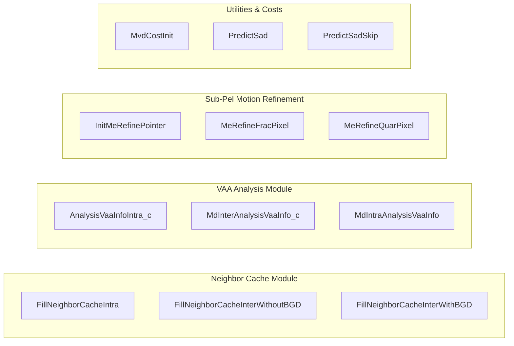

# Literate Programming: Macroblock Mode Decision & Sub-Pixel Refinement Engine (`md.cpp`)

## 1. High-Level Architectural Purpose & Module Role

The source file [`codec/encoder/core/src/md.cpp`](openh264/codec/encoder/core/src/md.cpp) serves as the core algorithmic backbone for **Macroblock Mode Decision (MD)**, **Sub-Pixel Motion Estimation Refinement (Fractional ME)**, **Video Architecture Analysis (VAA)** texture characterization, and **Spatial Neighbor Context Cache Management** in the OpenH264 encoder.


### Key Responsibilities
1. **Spatial Neighbor Cache Population**:
   Maintains spatial context across macroblock boundaries. Extracts non-zero transform coefficient counts (`iNonZeroCoeffCount`), intra prediction modes (`iIntraPredMode`), motion vectors (`sMotionVectorCache`), reference frame indices (`iRefIndexCache`), and skip statuses (`bMbTypeSkip`) from the Left ($A$), Top ($B$), Top-Left ($D$), and Top-Right ($C$) neighbor macroblocks.
2. **Sub-Pixel Fractional Motion Estimation (Half-Pel & Quarter-Pel Refinement)**:
   Performs fine-grained motion compensation refinement around the integer motion estimation (IME) candidate vector. Implements a 2-stage hierarchical search:
   - **Stage 1 (Half-Pel)**: Evaluates 4 half-pixel directions (Top, Bottom, Left, Right) using 6-tap symmetric FIR Wiener interpolation filters.
   - **Stage 2 (Quarter-Pel)**: Evaluates 4 quarter-pixel directions around the best integer or half-pixel position using bilinear sample averaging.
3. **Video Architecture Analysis (VAA) Feature Extraction**:
   - **Intra Variance**: Computes the spatial pixel variance across $4 \times 4$ sub-blocks to classify macroblock texture complexity.
   - **Inter Variance & Direction Signature**: Evaluates the variance of $8 \times 8$ block SAD costs to categorize motion patterns (flat, horizontal, vertical, complex).
4. **Motion Vector Difference (MVD) Cost Precomputation**:
   Initializes 2D lookup tables mapping $(\text{QP}, \text{MVD})$ pairs to their Lagrangian rate-distortion bit costs ($\lambda \cdot R(\text{MVD})$) using Signed Exponential-Golomb code lengths.
5. **Macroblock SAD Prediction**:
   Predicts the expected SAD cost for the current macroblock based on spatial neighbors (Left, Top, Top-Right/Top-Left) using median filtering and an empirical scaling factor ($\approx 0.90625$).

---

## 2. Constants, Macros, and Data Structures

### 2.1 Preprocessor Macros & Thresholds

| Macro / Constant | Value | Description |
| :--- | :--- | :--- |
| `INTRA_VARIANCE_SAD_THRESHOLD` | `150` | Minimum luma spatial variance required to classify a macroblock as highly textured during intra VAA analysis ([md.cpp:L47](openh264/codec/encoder/core/src/md.cpp#L47)). |
| `INTER_VARIANCE_SAD_THRESHOLD` | `20` | Threshold below which the SAD distribution across four $8 \times 8$ partitions is considered uniform/flat ([md.cpp:L48](openh264/codec/encoder/core/src/md.cpp#L48)). |
| `ME_REFINE_BUF_STRIDE` | `32` | Line stride in bytes for the intermediate sub-pixel prediction work buffers ([md.h:L49](openh264/codec/encoder/core/inc/md.h#L49)). |
| `SWITCH_BEST_TMP_BUF(prev, curr)` | Macro | Swaps the temporary scratch buffer pointer with the best candidate buffer pointer and updates `iBestCost` ([md.cpp:L524-L529](openh264/codec/encoder/core/src/md.cpp#L524-L529)). |
| `CALC_COST(me_buf, lm)` | Macro | Computes the total Lagrangian motion cost: $\text{SAD}(\text{Orig}, \text{me\_buf}) + \text{lm}$ ([md.cpp:L530](openh264/codec/encoder/core/src/md.cpp#L530)). |
| `REPLACE_SAD_MULTIPLY(x)` | `(x) - (x>>3) + (x>>5)` | Fast integer multiplier computing $x \cdot (1 - \frac{1}{8} + \frac{1}{32}) = x \cdot \frac{29}{32} = 0.90625 \cdot x$ ([md.cpp:L863](openh264/codec/encoder/core/src/md.cpp#L863)). |

### 2.2 Sub-Pixel Search Offset Constants

Defined in [`codec/encoder/core/inc/md.h`](openh264/codec/encoder/core/inc/md.h#L55-L68):

```cpp
#define REFINE_ME_NO_BEST_HALF_PIXEL 0 // ( 0,  0)
#define REFINE_ME_HALF_PIXEL_TOP     1 // ( 0, -2) [in 1/4-pel units: dy = -2]
#define REFINE_ME_HALF_PIXEL_BOTTOM  2 // ( 0,  2) [in 1/4-pel units: dy = +2]
#define REFINE_ME_HALF_PIXEL_LEFT    3 // (-2,  0) [in 1/4-pel units: dx = -2]
#define REFINE_ME_HALF_PIXEL_RIGHT   4 // ( 2,  0) [in 1/4-pel units: dx = +2]

#define ME_NO_BEST_QUAR_PIXEL        1 // ( 0,  0)
#define ME_QUAR_PIXEL_LEFT           2 // (-1,  0) [in 1/4-pel units: dx = -1]
#define ME_QUAR_PIXEL_RIGHT          3 // ( 1,  0) [in 1/4-pel units: dx = +1]
#define ME_QUAR_PIXEL_TOP            4 // ( 0, -1) [in 1/4-pel units: dy = -1]
#define ME_QUAR_PIXEL_BOTTOM         5 // ( 0,  1) [in 1/4-pel units: dy = +1]
```

### 2.3 Key Data Structures

#### `SQuarRefineParams` / `TagQuarParams`
Internal stack structure defined at [md.cpp:L512-L522](openh264/codec/encoder/core/src/md.cpp#L512-L522) to encapsulate parameters for quarter-pixel search evaluation:

```cpp
typedef struct TagQuarParams {
  int32_t  iBestCost;       // Current best motion estimation cost
  int32_t  iBestHalfPix;    // Best half-pixel index (0..4)
  int32_t  iStrideA;        // Stride for primary interpolation source buffer
  int32_t  iStrideB;        // Stride for secondary interpolation source buffer
  uint8_t* pRef;            // Base reference picture pixel pointer
  uint8_t* pSrcB[4];        // Array of 4 secondary source buffer pointers for (Top, Bottom, Left, Right)
  uint8_t* pSrcA[4];        // Array of 4 primary source buffer pointers for (Top, Bottom, Left, Right)
  int32_t  iLms[4];         // Precomputed MVD bit costs for 4 quarter-pel candidate vectors
  int32_t  iBestQuarPix;    // Resulting best quarter-pixel index (1..5)
} SQuarRefineParams;
```

#### `SMeRefinePointer` / `TagMeRefinePointer`
Declared in [`codec/encoder/core/inc/md.h`](openh264/codec/encoder/core/inc/md.h#L120-L129) to manage pointers into the preallocated fractional-pixel scratch buffers:

```cpp
typedef struct TagMeRefinePointer {
  uint8_t* pHalfPixH;          // Horizontal half-pel filtered scratch buffer (+iStride)
  uint8_t* pHalfPixV;          // Vertical half-pel filtered scratch buffer (+640+iStride)
  uint8_t* pHalfPixHV;         // 2D diagonal half-pel filtered scratch buffer (aliases pHalfPixV or pHalfPixH)
  uint8_t* pQuarPixBest;       // Pointer to best quarter-pel prediction buffer (+1280+iStride)
  uint8_t* pQuarPixTmp;        // Pointer to temporary quarter-pel prediction buffer (+1920+iStride)
  PCopyFunc pfCopyBlockByMode; // Function pointer for copying the final prediction block
} SMeRefinePointer;
```

#### `SWelsMD` / `TagWelsMD`
Main macroblock mode decision state structure declared in [`codec/encoder/core/inc/md.h`](openh264/codec/encoder/core/inc/md.h#L86-L118). Contains motion estimation contexts for all partition configurations (`sMe16x16`, `sMe8x8[4]`, `sMe16x8[2]`, `sMe8x16[2]`, `sMe4x4[4][4]`, `sMe8x4[4][2]`, `sMe4x8[4][2]`), target reference index `uiRef`, skip costs, and luma/chroma mode costs.

---

## 3. Deep Dive into Functions and Algorithms



---

### 3.1 Spatial Neighbor Cache Population

#### `FillNeighborCacheIntra`
* **File Location**: [md.cpp:L51-L130](openh264/codec/encoder/core/src/md.cpp#L51-L130)
* **Signature**:
  ```cpp
  void FillNeighborCacheIntra(SMbCache* pMbCache, SMB* pCurMb, int32_t iMbWidth)
  ```
* **Parameters**:
  - `pMbCache`: Pointer to the slice macroblock cache ([`SMbCache`](openh264/codec/encoder/core/inc/mb_cache.h#L72-L137)).
  - `pCurMb`: Pointer to the current macroblock metadata structure (`SMB`).
  - `iMbWidth`: Width of the frame in macroblock units.
* **Functional Logic**:
  1. **Left Neighbor Evaluation (`LEFT_MB_POS = 0x01`)**:
     - If available in `pCurMb->uiNeighborAvail`, retrieves the non-zero coefficient counts from `pCurMb->pNonZeroCount - MB_LUMA_CHROMA_BLOCK4x4_NUM` (-24 offset) for rightmost boundary sub-blocks (indices 3, 7, 11, 15 for luma; 17, 21 for Cb; 19, 23 for Cr).
     - If the left macroblock was coded in `Intra_4x4` mode, copies its intra prediction modes into cache slots 8, 16, 24, 32. Otherwise, sets them to default `DC` mode (mode `2`).
     - If unavailable, writes sentinel value `-1` (`0xFF`).
  2. **Top Neighbor Evaluation (`TOP_MB_POS = 0x02`)**:
     - Accesses `pTopMb = pCurMb - iMbWidth`.
     - Utilizes fast 32-bit and 16-bit unaligned memory load/store macros (`LD32`/`ST32`, `LD16`/`ST16`) to copy non-zero coefficient counts for bottom sub-blocks (indices 12..15 for luma, 20..21 for Cb, 22..23 for Cr).
     - Copies top `Intra_4x4` prediction modes or broadcasts DC mode quadword `0x02020202`.
     - If unavailable, stores `0xFFFFFFFF` sentinels.
  3. **Corner Neighbor Flags**:
     - Sets bit `0x04` (`TOPLEFT_MB_POS`) and bit `0x08` (`TOPRIGHT_MB_POS`) in `pMbCache->uiNeighborIntra`.

---

#### `FillNeighborCacheInterWithoutBGD` & `FillNeighborCacheInterWithBGD`
* **File Location**: [md.cpp:L132-L251](openh264/codec/encoder/core/src/md.cpp#L132-L251) and [md.cpp:L253-L372](openh264/codec/encoder/core/src/md.cpp#L253-L372)
* **Signatures**:
  ```cpp
  void FillNeighborCacheInterWithoutBGD(SMbCache* pMbCache, SMB* pCurMb, int32_t iMbWidth, int8_t* pVaaBgMbFlag)
  void FillNeighborCacheInterWithBGD(SMbCache* pMbCache, SMB* pCurMb, int32_t iMbWidth, int8_t* pVaaBgMbFlag)
  ```
* **Parameters**:
  - `pMbCache`: Destination macroblock cache.
  - `pCurMb`: Current macroblock header.
  - `iMbWidth`: Picture width in macroblocks.
  - `pVaaBgMbFlag`: Background macroblock classification flags from the VAA preprocessor.
* **Differences & Background Detection (BGD) Logic**:
  Both functions copy motion vectors (`sMv`) and reference indices (`pRefIndex`) from Left (`pCurMb - 1`), Top (`pCurMb - iMbWidth`), Top-Left (`pCurMb - iMbWidth - 1`), and Top-Right (`pCurMb - iMbWidth + 1`) neighbors if `IS_SVC_INTER(pMb->uiMbType)` holds.
  - **Without BGD**: Sets `pMbCache->bMbTypeSkip[k] = 1` whenever `pNeighborMb->uiMbType == MB_TYPE_SKIP`.
  - **With BGD**: Requires that the neighbor is not classified as a static background macroblock:
    $$\text{bMbTypeSkip}[k] = 1 \iff \left( \text{uiMbType} == \text{MB\_TYPE\_SKIP} \;\land\; \text{pVaaBgMbFlag}[\text{offset}] == 0 \right)$$
* **Unavailable Neighbor Handling**:
  Sets unavailable motion vectors to $(0,0)$ via `ST32`/`ST64`, and marks reference indices with `REF_NOT_IN_LIST` (if spatial MB position exists but is non-inter) or `REF_NOT_AVAIL` (if outside slice boundaries).

---

#### `InitFillNeighborCacheInterFunc`
* **File Location**: [md.cpp:L374-L376](openh264/codec/encoder/core/src/md.cpp#L374-L376)
* **Signature**:
  ```cpp
  void InitFillNeighborCacheInterFunc(SWelsFuncPtrList* pFuncList, const int32_t kiFlag)
  ```
* Dynamically sets `pFuncList->pfFillInterNeighborCache` to `FillNeighborCacheInterWithBGD` when `kiFlag != 0`, or `FillNeighborCacheInterWithoutBGD` otherwise.

---

### 3.2 Macroblock Motion Vector Broadcasting

#### `UpdateMbMv_c`
* **File Location**: [md.cpp:L378-L386](openh264/codec/encoder/core/src/md.cpp#L378-L386)
* **Signature**:
  ```cpp
  void UpdateMbMv_c(SMVUnitXY* pMvBuffer, const SMVUnitXY ksMv)
  ```
* Broadcasts a single $16 \times 16$ macroblock motion vector `ksMv` across all 16 $4 \times 4$ block entries in `pMvBuffer[0..15]`. Unrolled in steps of 4 for maximum compiler optimization.

---

### 3.3 Video Architecture Analysis (VAA) Feature Extraction

#### `MdInterAnalysisVaaInfo_c`
* **File Location**: [md.cpp:L389-L433](openh264/codec/encoder/core/src/md.cpp#L389-L433)
* **Signature**:
  ```cpp
  uint8_t MdInterAnalysisVaaInfo_c(int32_t* pSad8x8)
  ```
* **Mathematical Formula**:
  Given four $8 \times 8$ partition SAD costs $\text{SAD}_0, \text{SAD}_1, \text{SAD}_2, \text{SAD}_3$:
  1. Calculate average SAD:
     $$\mu = \frac{1}{4} \sum_{i=0}^3 \text{SAD}_i$$
  2. Compute scaled partition differences:
     $$\Delta_i = (\text{SAD}_i \gg 6) - (\mu \gg 6)$$
  3. Calculate variance:
     $$V_{\text{SAD}} = \sum_{i=0}^3 \Delta_i^2$$
  4. If $V_{\text{SAD}} < \text{INTER\_VARIANCE\_SAD\_THRESHOLD}$ (`20`), return `15` (`0x0F`, indicating a flat/uniform motion block).
  5. Otherwise, construct a 4-bit signature bitmask:
     $$\text{uiMbSign} = \sum_{i=0}^3 \left( [\text{SAD}_i > \mu] \ll (3 - i) \right)$$
* **Return Value**: 4-bit integer (`0..15`) representing the spatial motion distribution signature across the 4 quadrants.

---

#### `AnalysisVaaInfoIntra_c`
* **File Location**: [md.cpp:L435-L474](openh264/codec/encoder/core/src/md.cpp#L435-L474)
* **Signature**:
  ```cpp
  int32_t AnalysisVaaInfoIntra_c(uint8_t* pDataY, const int32_t kiLineSize)
  ```
* **Mathematical Algorithm**:
  Measures luma spatial texture variance across sixteen $4 \times 4$ sub-blocks:
  1. For each $4 \times 4$ block $k \in [0, 15]$:
     $$B_k = \sum_{y=0}^3 \sum_{x=0}^3 p(x + 4(k \bmod 4), y + 4\lfloor k/4 \rfloor)$$
     $$A_k = \lfloor B_k / 16 \rfloor = B_k \gg 4$$
  2. Accumulate sum of averages and sum of squared averages:
     $$S_{\text{avg}} = \sum_{k=0}^{15} A_k, \quad S_{\text{sqr}} = \sum_{k=0}^{15} A_k^2$$
  3. Compute macroblock variance:
     $$\text{Variance} = S_{\text{sqr}} - \left( \frac{S_{\text{avg}}^2}{16} \right)$$
* **Return Value**: Integer spatial variance value.

---

#### `InitIntraAnalysisVaaInfo` & `MdIntraAnalysisVaaInfo`
* **File Location**: [md.cpp:L477-L503](openh264/codec/encoder/core/src/md.cpp#L477-L503)
* **CPU Dispatch**:
  Sets function pointers based on CPU capabilities:
  - `pfGetVarianceFromIntraVaa`: defaults to `AnalysisVaaInfoIntra_c`; overrides with `AnalysisVaaInfoIntra_sse2` (SSE2) or `AnalysisVaaInfoIntra_ssse3` (SSSE3).
  - `pfGetMbSignFromInterVaa`: defaults to `MdInterAnalysisVaaInfo_c`; overrides with `MdInterAnalysisVaaInfo_sse2` or `MdInterAnalysisVaaInfo_sse41`.
  - `pfUpdateMbMv`: defaults to `UpdateMbMv_c`; overrides with `UpdateMbMv_sse2`.
* `MdIntraAnalysisVaaInfo` evaluates:
  $$\text{Return} = \left( \text{pfGetVarianceFromIntraVaa}(pEncMb, \text{stride}) \ge \text{INTRA\_VARIANCE\_SAD\_THRESHOLD} \right)$$

---

### 3.4 Sub-Pixel Fractional Motion Estimation Refinement

```mermaid
flowchart TD
    Start([Integer ME Candidate MV]) --> CalcBestInt[Compute Best Integer Pel Cost]
    CalcBestInt --> HalfPelFilt[Apply 6-Tap FIR Half-Pel Filters<br/>pfLumaHalfpelVer & pfLumaHalfpelHor]
    HalfPelFilt --> EvalHalfPel[Evaluate 4 Half-Pel Offsets<br/>Top: 0,-2 | Bottom: 0,+2 | Left: -2,0 | Right: +2,0]
    EvalHalfPel --> HasBestHalf{Best Half-Pel Found?}
    
    HasBestHalf -- Yes --> DiagFilter[Generate 2D Diagonal Half-Pel<br/>pfLumaHalfpelCen]
    DiagFilter --> SetupQuarAroundHalf[Setup Quarter-Pel Neighbors Around Best Half-Pel]
    
    HasBestHalf -- No --> SetupQuarAroundInt[Setup Quarter-Pel Neighbors Around Integer Pel]
    
    SetupQuarAroundHalf --> EvalQuar[MeRefineQuarPixel<br/>Bilinear pfSampleAveraging for 4 Quarter-Pel Positions]
    SetupQuarAroundInt --> EvalQuar
    
    EvalQuar --> UpdateFinalMV[Combine Offsets into Final sMv & uiSatdCost]
    UpdateFinalMV --> CopyPred[Copy Final Block to pMemPredInterMb<br/>pfCopyBlockByMode]
```

---

#### `InitMeRefinePointer`
* **File Location**: [md.cpp:L505-L511](openh264/codec/encoder/core/src/md.cpp#L505-L511)
* **Signature**:
  ```cpp
  void InitMeRefinePointer(SMeRefinePointer* pMeRefine, SMbCache* pMbCache, int32_t iStride)
  ```
* Binds the internal scratch buffers within `pMbCache->pBufferInterPredMe` to `pMeRefine`:
  - `pHalfPixH` = `&pBufferInterPredMe[0] + iStride`
  - `pHalfPixV` = `&pBufferInterPredMe[640] + iStride`
  - `pQuarPixBest` = `&pBufferInterPredMe[1280] + iStride`
  - `pQuarPixTmp` = `&pBufferInterPredMe[1920] + iStride`

---

#### `MeRefineQuarPixel`
* **File Location**: [md.cpp:L532-L573](openh264/codec/encoder/core/src/md.cpp#L532-L573)
* **Signature**:
  ```cpp
  inline void MeRefineQuarPixel(SWelsFuncPtrList* pFunc, SWelsME* pMe, SMeRefinePointer* pMeRefine,
                                const int32_t kiWidth, const int32_t kiHeight,
                                SQuarRefineParams* pParams, int32_t iStrideEnc)
  ```
* **Algorithm**:
  Tests four quarter-pixel candidate locations around the central position:
  1. **Top $(0, -1)$**: Blends `pParams->pSrcA[0]` and `pParams->pSrcB[0]` via bilinear `pfSampleAveraging`. Evaluates cost $\text{SAD} + \text{iLms}[0]$. If lower than `iBestCost`, marks `iBestQuarPix = ME_QUAR_PIXEL_TOP` (`4`).
  2. **Bottom $(0, 1)$**: Blends `pParams->pSrcA[1]` and `pParams->pSrcB[1]`. Evaluates cost $\text{SAD} + \text{iLms}[1]$. If lower, marks `iBestQuarPix = ME_QUAR_PIXEL_BOTTOM` (`5`).
  3. **Left $(-1, 0)$**: Blends `pParams->pSrcA[2]` and `pParams->pSrcB[2]`. Evaluates cost $\text{SAD} + \text{iLms}[2]$. If lower, marks `iBestQuarPix = ME_QUAR_PIXEL_LEFT` (`2`).
  4. **Right $(1, 0)$**: Blends `pParams->pSrcA[3]` and `pParams->pSrcB[3]`. Evaluates cost $\text{SAD} + \text{iLms}[3]$. If lower, marks `iBestQuarPix = ME_QUAR_PIXEL_RIGHT` (`3`).

---

#### `MeRefineFracPixel`
* **File Location**: [md.cpp:L575-L769](openh264/codec/encoder/core/src/md.cpp#L575-L769)
* **Signature**:
  ```cpp
  void MeRefineFracPixel(sWelsEncCtx* pEncCtx, uint8_t* pMemPredInterMb, SWelsME* pMe,
                          SMeRefinePointer* pMeRefine, int32_t iWidth, int32_t iHeight)
  ```
* **Detailed Execution Steps**:
  1. **Base Cost Computation**:
     If `bSatdInMdFlag` is active, uses SATD; otherwise, calls `pfMeCost` with the base integer vector $(MV_x, MV_y)$ plus MVD bit cost:
     $$\text{Cost}_{\text{best}} = \text{SAD/SATD} + \text{COST\_MVD}(pMe->pMvdCost, MV_x - MVP_x, MV_y - MVP_y)$$
  2. **Step 1: Vertical Half-Pel Filtering**:
     Calls `pfLumaHalfpelVer` to generate half-pel samples vertically. Evaluates Top $(0, -2)$ and Bottom $(0, +2)$.
  3. **Step 2: Horizontal Half-Pel Filtering**:
     Calls `pfLumaHalfpelHor` to generate half-pel samples horizontally. Evaluates Left $(-2, 0)$ and Right $(+2, 0)$.
  4. **Step 3: Setup Quarter-Pel Interpolation Sources**:
     - If **no best half-pel** was found (`REFINE_ME_NO_BEST_HALF_PIXEL`), quarter-pel interpolation sources are paired between the half-pel vertical/horizontal buffers and the integer reference plane `pRef`.
     - If a **best half-pel** position was selected, generates the diagonal $( \pm 2, \pm 2 )$ half-pel plane using 2D Wiener filtering via `pfLumaHalfpelCen`. Offsets sources to center around that half-pixel point.
  5. **Step 4: Quarter-Pel Evaluation**:
     Invokes `MeRefineQuarPixel` to find the best quarter-pel offset.
  6. **Step 5: Final Motion Vector & Prediction Update**:
     Updates `pMe->sMv.iMvX` and `pMe->sMv.iMvY` by adding half-pel and quarter-pel coordinate deltas from lookup tables `iMvQuarAddX` and `pMvQuarAddY`.
     Calls `pMeRefine->pfCopyBlockByMode` to copy the final predicted pixel block into `pMemPredInterMb`.

---

### 3.5 Table & Utility Initializations

#### `InitBlkStrideWithRef`
* **File Location**: [md.cpp:L771-L792](openh264/codec/encoder/core/src/md.cpp#L771-L792)
* **Signature**:
  ```cpp
  void InitBlkStrideWithRef(int32_t* pBlkStride, const int32_t kiStrideRef)
  ```
* Precalculates the byte offset for each of the 16 $4 \times 4$ sub-blocks within a macroblock in raster order:
  $$\text{pBlkStride}[i] = X[i] + Y[i] \cdot \text{kiStrideRef}$$
  where:
  - $X = [0, 4, 0, 4, 8, 12, 8, 12, 0, 4, 0, 4, 8, 12, 8, 12]$
  - $Y = [0, 0, 4, 4, 0, 0, 4, 4, 8, 8, 12, 12, 8, 8, 12, 12]$

---

#### `MvdCostInit`
* **File Location**: [md.cpp:L797-L824](openh264/codec/encoder/core/src/md.cpp#L797-L824)
* **Signature**:
  ```cpp
  void MvdCostInit(uint16_t* pMvdCostInter, const int32_t kiMvdSz)
  ```
* **Mathematical Definition**:
  Populates the MVD rate-distortion bit-cost table for all 52 quantization parameters ($0 \le \text{QP} < 52$):
  $$\text{Cost}(\text{QP}, \text{mvd}) = \lambda(\text{QP}) \cdot \text{BsSizeSE}(\text{mvd})$$
  where:
  - $\lambda(\text{QP}) = \text{g\_kiQpCostTable}[\text{QP}]$
  - $\text{BsSizeSE}(v)$ computes the exact bit-length of signed Exp-Golomb codeword $v$ ([`svc_enc_golomb.h:L84-L95`](openh264/codec/encoder/core/inc/svc_enc_golomb.h#L84-L95)).

---

### 3.6 Macroblock SAD Prediction

#### `PredictSad`
* **File Location**: [md.cpp:L826-L867](openh264/codec/encoder/core/src/md.cpp#L826-L867)
* **Signature**:
  ```cpp
  void PredictSad(int8_t* pRefIndexCache, int32_t* pSadCostCache, int32_t uiRef, int32_t* pSadPred)
  ```
* **Logic**:
  1. Inspects reference indices of Top ($B$, cache index 1), Top-Right ($C$, cache index 5), and Left ($A$, cache index 6) neighbors. (Falls back to Top-Left $D$, cache index 0, if $C$ is unavailable).
  2. If only Left is available, sets predicted SAD to $\text{SAD}_A$.
  3. Otherwise, compares `uiRef` against neighbor reference indices:
     - If matching only Left, picks $\text{SAD}_A$.
     - If matching only Top, picks $\text{SAD}_B$.
     - If matching only Top-Right, picks $\text{SAD}_C$.
     - Otherwise, computes median:
       $$\text{SAD}_{\text{pred}} = \text{WelsMedian}(\text{SAD}_A, \text{SAD}_B, \text{SAD}_C)$$
  4. Applies the empirical scaling factor $\alpha = \frac{29}{32} = 0.90625$:
     $$\text{FinalSAD}_{\text{pred}} = \frac{64 \cdot \text{SAD}_{\text{pred}} - (64 \cdot \text{SAD}_{\text{pred}} \gg 3) + (64 \cdot \text{SAD}_{\text{pred}} \gg 5) + 32}{64}$$

---

#### `PredictSadSkip`
* **File Location**: [md.cpp:L870-L909](openh264/codec/encoder/core/src/md.cpp#L870-L909)
* **Signature**:
  ```cpp
  void PredictSadSkip(int8_t* pRefIndexCache, bool* pMbSkipCache, int32_t* pSadCostCache,
                      int32_t uiRef, int32_t* iSadPredSkip)
  ```
* Similar to `PredictSad`, but masks neighbor SAD costs with their skip flags:
  $$\text{SAD}_{\text{neighbor}}^{\text{skip}} = \begin{cases} \text{SAD}_{\text{neighbor}} & \text{if } \text{pMbSkipCache}[\text{neighbor}] == 1 \\ 0 & \text{otherwise} \end{cases}$$

---

## 4. Summary Table of Exported & Internal Functions

| Function Name | Return Type | Category | SIMD / Assembly Accelerations |
| :--- | :--- | :--- | :--- |
| [`FillNeighborCacheIntra`](openh264/codec/encoder/core/src/md.cpp#L51-L130) | `void` | Neighbor Cache | C/C++ (Uses fast 32-bit/16-bit unaligned memory transfers `LD32`/`ST32`) |
| [`FillNeighborCacheInterWithoutBGD`](openh264/codec/encoder/core/src/md.cpp#L132-L251) | `void` | Neighbor Cache | C/C++ (`LD64`/`ST64` transfers) |
| [`FillNeighborCacheInterWithBGD`](openh264/codec/encoder/core/src/md.cpp#L253-L372) | `void` | Neighbor Cache | C/C++ (Incorporates VAA background flags) |
| [`InitFillNeighborCacheInterFunc`](openh264/codec/encoder/core/src/md.cpp#L374-L376) | `void` | Function Dispatch | Dynamic runtime function pointer setup |
| [`UpdateMbMv_c`](openh264/codec/encoder/core/src/md.cpp#L378-L386) | `void` | Motion Vector Helper | `UpdateMbMv_sse2` |
| [`MdInterAnalysisVaaInfo_c`](openh264/codec/encoder/core/src/md.cpp#L389-L433) | `uint8_t` | VAA Analysis | `MdInterAnalysisVaaInfo_sse2`, `MdInterAnalysisVaaInfo_sse41` |
| [`AnalysisVaaInfoIntra_c`](openh264/codec/encoder/core/src/md.cpp#L435-L474) | `int32_t` | VAA Analysis | `AnalysisVaaInfoIntra_sse2`, `AnalysisVaaInfoIntra_ssse3` |
| [`InitIntraAnalysisVaaInfo`](openh264/codec/encoder/core/src/md.cpp#L477-L495) | `void` | Function Dispatch | Dynamic runtime CPU feature dispatch |
| [`MdIntraAnalysisVaaInfo`](openh264/codec/encoder/core/src/md.cpp#L497-L503) | `bool` | VAA Analysis | Dispatches to active `pfGetVarianceFromIntraVaa` |
| [`InitMeRefinePointer`](openh264/codec/encoder/core/src/md.cpp#L505-L511) | `void` | ME Memory Setup | C/C++ pointer offset arithmetic |
| [`MeRefineQuarPixel`](openh264/codec/encoder/core/src/md.cpp#L532-L573) | `void` (inline) | Sub-Pel Refinement | Bilinear `pfSampleAveraging` kernel |
| [`MeRefineFracPixel`](openh264/codec/encoder/core/src/md.cpp#L575-L769) | `void` | Sub-Pel Refinement | 6-tap FIR Wiener filters (`pfLumaHalfpelVer`, `pfLumaHalfpelHor`, `pfLumaHalfpelCen`) |
| [`InitBlkStrideWithRef`](openh264/codec/encoder/core/src/md.cpp#L771-L792) | `void` | Table Init | C/C++ lookup table generation |
| [`MvdCostInit`](openh264/codec/encoder/core/src/md.cpp#L797-L824) | `void` | Rate-Distortion Cost | Signed Exp-Golomb length formula (`BsSizeSE`) |
| [`PredictSad`](openh264/codec/encoder/core/src/md.cpp#L826-L867) | `void` | SAD Prediction | Fast integer multiplication `REPLACE_SAD_MULTIPLY` |
| [`PredictSadSkip`](openh264/codec/encoder/core/src/md.cpp#L870-L909) | `void` | SAD Prediction | Skip-conditioned median calculation |
