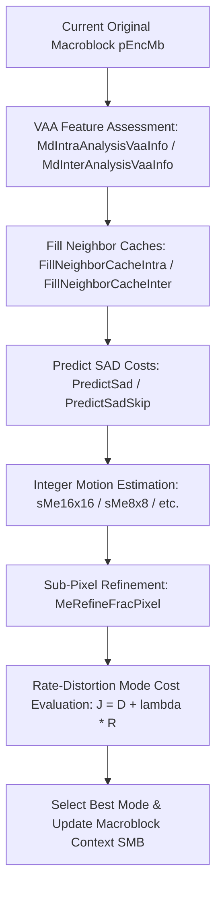
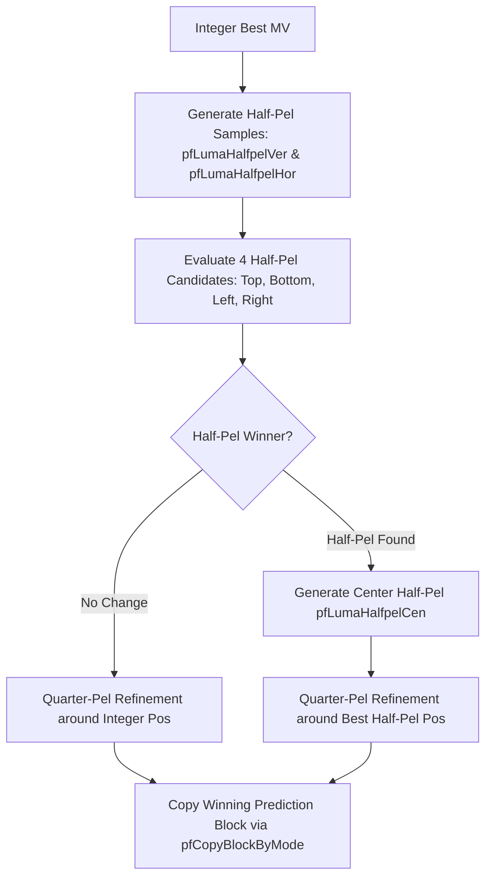
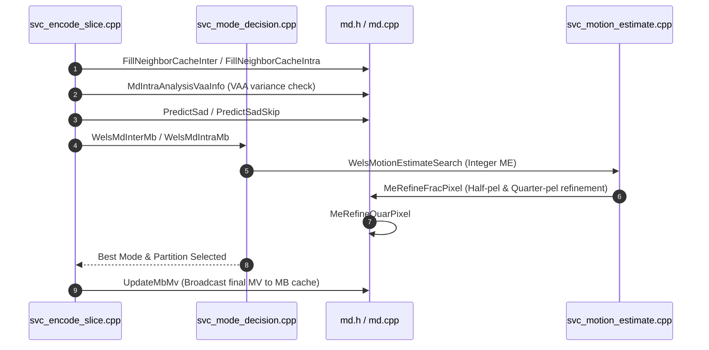

# Literate Programming Documentation: `md.h` (Encoder Macroblock Mode Decision & Sub-Pixel Refinement)

## Table of Contents
1. [Architectural Overview & Module Purpose](#1-architectural-overview--module-purpose)
2. [Header Dependencies & File Inclusions](#2-header-dependencies--file-inclusions)
3. [Constants and Preprocessor Definitions](#3-constants-and-preprocessor-definitions)
   - [3.1 Fractional-Pixel Refinement Buffer Geometry](#31-fractional-pixel-refinement-buffer-geometry)
   - [3.2 Half-Pel & Quarter-Pel Directional Offsets](#32-half-pel--quarter-pel-directional-offsets)
   - [3.3 Video Analysis Assessment (VAA) Texture Signatures](#33-video-analysis-assessment-vaa-texture-signatures)
4. [Global Look-Up Tables](#4-global-look-up-tables)
5. [Data Structures Deep Dive](#5-data-structures-deep-dive)
   - [5.1 `SWelsMD` (`TagWelsMD`)](#51-swelsmd-tagwelsmd)
   - [5.2 `SMeRefinePointer` (`TagMeRefinePointer`)](#52-smerefinepointer-tagmerefinepointer)
6. [Mathematical Foundations & Rate-Distortion Theory](#6-mathematical-foundations--rate-distortion-theory)
   - [6.1 Rate-Distortion Optimization (RDO) Formulation](#61-rate-distortion-optimization-rdo-formulation)
   - [6.2 MVD Bit-Cost Estimation Formulation](#62-mvd-bit-cost-estimation-formulation)
   - [6.3 Median SAD Cost Prediction & Attenuation](#63-median-sad-cost-prediction--attenuation)
   - [6.4 VAA Intra/Inter Complexity & Variance Metric](#64-vaa-intrainter-complexity--variance-metric)
7. [Function & Algorithm Deep Dive](#7-function--algorithm-deep-dive)
   - [7.1 Neighbor Cache Population (`FillNeighborCacheIntra`, `FillNeighborCacheInterWithoutBGD`, `FillNeighborCacheInterWithBGD`)](#71-neighbor-cache-population)
   - [7.2 Inter Cache Function Initialization (`InitFillNeighborCacheInterFunc`)](#72-inter-cache-function-initialization)
   - [7.3 Motion Vector Difference Cost Table Initialization (`MvdCostInit`)](#73-motion-vector-difference-cost-table-initialization)
   - [7.4 SAD Cost Prediction Functions (`PredictSad`, `PredictSadSkip`)](#74-sad-cost-prediction-functions)
   - [7.5 Video Analysis Assessment Functions (`InitIntraAnalysisVaaInfo`, `MdIntraAnalysisVaaInfo`, `MdInterAnalysisVaaInfo_c`)](#75-video-analysis-assessment-functions)
   - [7.6 Fractional-Pixel Refinement Engine (`InitMeRefinePointer`, `MeRefineFracPixel`, `MeRefineQuarPixel`)](#76-fractional-pixel-refinement-engine)
   - [7.7 Block Geometry & Motion Vector Broadcast Helpers (`InitBlkStrideWithRef`, `UpdateMbMv_c`)](#77-block-geometry--motion-vector-broadcast-helpers)
8. [SIMD & Assembly Optimization Path](#8-simd--assembly-optimization-path)
9. [Interaction & Call Graph Diagram](#9-interaction--call-graph-diagram)

---

## 1. Architectural Overview & Module Purpose

The header file [`md.h`](openh264/codec/encoder/core/inc/md.h) defines the data structures, operational constants, lookup tables, and function interfaces for the **Macroblock Mode Decision (MD)** and **Fractional-Pixel Motion Refinement** subsystems within the OpenH264 encoder core.

In H.264 / AVC video coding, the mode decision stage is computationally demanding. For every $16 \times 16$ macroblock (MB), the encoder evaluates multiple candidate partitioning modes:
* **Inter Prediction Modes**: `P_SKIP`, `P_16x16`, `P_16x8`, `P_8x16`, and `P_8x8` (with sub-partitions `P_8x4`, `P_4x8`, and `P_4x4`).
* **Intra Prediction Modes**: `I_16x16` (4 spatial prediction modes), `I_4x4` (9 spatial prediction modes), and Intra Chroma $8 \times 8$ (4 spatial prediction modes).



[`md.h`](openh264/codec/encoder/core/inc/md.h) and its companion implementation [`md.cpp`](openh264/codec/encoder/core/src/md.cpp) provide:
1. **Per-Macroblock Mode Decision Context (`SWelsMD`)**: Aggregates the Lagrange multiplier $\lambda$, MVD bit-cost table pointers, predicted and candidate SAD/SATD costs, and motion estimation scratch structures (`SWelsME`) for all partition sizes.
2. **Sub-Pixel Motion Refinement State (`SMeRefinePointer`)**: Orchestrates half-pixel 6-tap FIR filtering and quarter-pel bilinear interpolation scratch buffers.
3. **Neighbor Availability & Context Caching**: Populates 2D neighbor caches (`SMbCache`) for spatial motion vectors, reference indices, non-zero coefficient counts, and intra prediction modes across slice boundaries.
4. **Fast Early-Termination Heuristics**: Leverages Video Analysis Assessment (VAA) variance calculations and spatial/temporal neighbor SAD predictions to prune unpromising modes early.

---

## 2. Header Dependencies & File Inclusions

The header begins with include guards and dependencies:

```cpp
#ifndef WELS_MACROBLOCK_MODE_DECISION_H__
#define WELS_MACROBLOCK_MODE_DECISION_H__

#include "svc_motion_estimate.h"
#include "svc_enc_macroblock.h"
#include "encode_mb_aux.h"
#include "wels_func_ptr_def.h"

namespace WelsEnc {
```

### Dependency Roles
* [`svc_motion_estimate.h`](openh264/codec/encoder/core/inc/svc_motion_estimate.h): Defines [`SWelsME`](openh264/codec/encoder/core/inc/svc_motion_estimate.h#L72-L97), which encapsulates motion search coordinates, search windows, candidate motion vectors ([`SMVUnitXY`](openh264/codec/common/inc/wels_common_basis.h)), and cost accumulators (`uiSadCost`, `uiSatdCost`).
* [`svc_enc_macroblock.h`](openh264/codec/encoder/core/inc/svc_enc_macroblock.h): Declares the macroblock container structure [`SMB`](openh264/codec/encoder/core/inc/svc_enc_macroblock.h#L49-L78) and macroblock partitioning type enumerations ([`Mb_Type`](openh264/codec/common/inc/wels_common_basis.h)).
* [`encode_mb_aux.h`](openh264/codec/encoder/core/inc/encode_mb_aux.h): Provides auxiliary pixel and transform buffer definitions used during forward DCT and quantization.
* [`wels_func_ptr_def.h`](openh264/codec/encoder/core/inc/wels_func_ptr_def.h): Declares the function pointer dispatch table [`SWelsFuncPtrList`](openh264/codec/encoder/core/inc/wels_func_ptr_def.h#L198-L230) dynamically populated with C reference routines or SIMD assembly kernels (SSE2, SSSE3, SSE4.1, AVX2, NEON).

---

## 3. Constants and Preprocessor Definitions

### 3.1 Fractional-Pixel Refinement Buffer Geometry

Fractional-pixel motion compensation requires scratch buffer strides wide enough to accommodate half-pixel Wiener-filtered and quarter-pixel interpolated sample blocks without memory overlap.

```cpp
#define ME_REFINE_BUF_STRIDE       32
#define ME_REFINE_BUF_WIDTH_BLK4   8
#define ME_REFINE_BUF_WIDTH_BLK8   16
#define ME_REFINE_BUF_STRIDE_BLK4  160
#define ME_REFINE_BUF_STRIDE_BLK8  320
```

| Macro Name | Value | Meaning & Architectural Usage |
| :--- | :---: | :--- |
| `ME_REFINE_BUF_STRIDE` | `32` | Line stride in bytes for sub-pixel interpolation scratch buffers (`pBufferInterPredMe`). Ensures 32-byte SIMD alignment for AVX/SSE loads and stores. |
| `ME_REFINE_BUF_WIDTH_BLK4` | `8` | Padded block width allocated when refining $4 \times 4$ sub-blocks. |
| `ME_REFINE_BUF_WIDTH_BLK8` | `16` | Padded block width allocated when refining $8 \times 8$ partitions. |
| `ME_REFINE_BUF_STRIDE_BLK4`| `160`| Total buffer plane stride allocated for $4 \times 4$ sub-pixel refinement ($32 \times 5$ lines). |
| `ME_REFINE_BUF_STRIDE_BLK8`| `320`| Total buffer plane stride allocated for $8 \times 8$ sub-pixel refinement ($32 \times 10$ lines). |

---

### 3.2 Half-Pel & Quarter-Pel Directional Offsets

During sub-pixel refinement, candidate displacements around the best integer motion vector are indexed using compact integer constants:

```cpp
#define REFINE_ME_NO_BEST_HALF_PIXEL 0 // ( 0,  0)
#define REFINE_ME_HALF_PIXEL_TOP     1 // ( 0, -2) in 1/4-pel units = -0.5 pel
#define REFINE_ME_HALF_PIXEL_BOTTOM  2 // ( 0,  2) in 1/4-pel units = +0.5 pel
#define REFINE_ME_HALF_PIXEL_LEFT    3 // (-2,  0) in 1/4-pel units = -0.5 pel
#define REFINE_ME_HALF_PIXEL_RIGHT   4 // ( 2,  0) in 1/4-pel units = +0.5 pel

#define ME_NO_BEST_QUAR_PIXEL 1 // ( 0,  0) or best half pixel
#define ME_QUAR_PIXEL_LEFT    2 // (-1,  0) in 1/4-pel units = -0.25 pel
#define ME_QUAR_PIXEL_RIGHT   3 // ( 1,  0) in 1/4-pel units = +0.25 pel
#define ME_QUAR_PIXEL_TOP     4 // ( 0, -1) in 1/4-pel units = -0.25 pel
#define ME_QUAR_PIXEL_BOTTOM  5 // ( 0,  1) in 1/4-pel units = +0.25 pel

#define NO_BEST_FRAC_PIX   1 // REFINE_ME_NO_BEST_HALF_PIXEL + ME_NO_BEST_QUAR_PIXEL
```

> [!NOTE]
> In H.264, motion vector coordinates in [`SMVUnitXY`](openh264/codec/common/inc/wels_common_basis.h) are represented in **quarter-pixel units** ($1\text{ pel} = 4\text{ units}$).
> * A half-pel step corresponds to $\pm 2$ units in integer coordinates.
> * A quarter-pel step corresponds to $\pm 1$ unit in integer coordinates.
> * `NO_BEST_FRAC_PIX` ($0 + 1 = 1$) indicates that neither half-pel nor quarter-pel searches improved upon the integer-pel motion vector, allowing the encoder to copy integer reference samples directly.

---

### 3.3 Video Analysis Assessment (VAA) Texture Signatures

The Video Analysis Assessment (VAA) module analyzes macroblock texture complexity and directional gradients. The bitmasks below represent directional signatures formed by comparing the four $8 \times 8$ sub-block SAD values against the average macroblock SAD:

```cpp
#define MBVAASIGN_FLAT       15 // 00001111b: All 4 sub-blocks have uniform SAD
#define MBVAASIGN_HOR1      3  // 00000011b: Top two 8x8 sub-blocks above average
#define MBVAASIGN_HOR2      12 // 00001100b: Bottom two 8x8 sub-blocks above average
#define MBVAASIGN_VER1       5  // 00000101b: Left two 8x8 sub-blocks above average
#define MBVAASIGN_VER2       10 // 00001010b: Right two 8x8 sub-blocks above average
#define MBVAASIGN_CMPX1    6  // 00000110b: Diagonal gradient type 1
#define MBVAASIGN_CMPX2    9  // 00001001b: Diagonal gradient type 2
```

---

## 4. Global Look-Up Tables

The header declares three read-only global lookup tables used throughout mode decision:

```cpp
extern const int32_t g_kiQpCostTable[52];
extern const int8_t g_kiMapModeI16x16[7];
extern const int8_t g_kiMapModeIntraChroma[7];
```

### Table Specifications

#### 1. `g_kiQpCostTable[52]`
Maps the H.264 Quantization Parameter $\text{QP} \in [0, 51]$ to the encoder Lagrange multiplier $\lambda$:
$$\lambda(\text{QP}) \approx 0.85 \cdot 2^{(\text{QP} - 12)/3}$$
In fixed-point integer scaling within OpenH264, this multiplier converts bit costs (such as Exp-Golomb bit lengths for MVDs and syntax elements) into the SAD/SATD distortion domain.

#### 2. `g_kiMapModeI16x16[7]`
Maps internal intra $16 \times 16$ candidate mode evaluation indices to standard H.264 Intra $16 \times 16$ prediction mode identifiers:
* `0`: `I16_PRED_V` (Vertical prediction)
* `1`: `I16_PRED_H` (Horizontal prediction)
* `2`: `I16_PRED_DC` (DC average prediction)
* `3`: `I16_PRED_P` (Plane gradient prediction)

#### 3. `g_kiMapModeIntraChroma[7]`
Maps internal chroma intra candidate evaluation indices to H.264 Intra Chroma $8 \times 8$ prediction modes:
* `0`: `C_PRED_DC` (DC prediction)
* `1`: `C_PRED_H` (Horizontal prediction)
* `2`: `C_PRED_V` (Vertical prediction)
* `3`: `C_PRED_P` (Plane prediction)

---

## 5. Data Structures Deep Dive

### 5.1 `SWelsMD` (`TagWelsMD`)

The [`SWelsMD`](openh264/codec/encoder/core/inc/md.h#L86-L118) structure stores the full operational context and rate-distortion state for a single macroblock's mode decision process.

```cpp
typedef struct TagWelsMD {
  int32_t         iLambda;
  uint16_t*       pMvdCost;

  int32_t         iCostLuma;
  int32_t         iCostChroma;
  int32_t         iSadPredMb;

  uint8_t         uiRef;
  bool            bMdUsingSad;
  uint16_t        uiReserved;

  int32_t         iCostSkipMb;
  int32_t         iSadPredSkip;

  int32_t         iMbPixX;
  int32_t         iMbPixY;
  int32_t         iBlock8x8StaticIdc[4];

  struct {
    SWelsME       sMe16x16;
    SWelsME       sMe8x8[4];
    SWelsME       sMe16x8[2];
    SWelsME       sMe8x16[2];
    SWelsME       sMe4x4[4][4];
    SWelsME       sMe8x4[4][2];
    SWelsME       sMe4x8[4][2];
  } sMe;
} SWelsMD;
```

#### Detailed Member Breakdown

| Member Field | Type | Alignment / Size | Description & Lifecycle |
| :--- | :--- | :---: | :--- |
| `iLambda` | `int32_t` | 4 bytes | Current rate-distortion Lagrange multiplier $\lambda = \text{g\_kiQpCostTable}[\text{QP}]$. Balances residual distortion against bit-rate overhead. |
| `pMvdCost` | `uint16_t*` | 8 bytes (ptr) | Pointer to the pre-computed MVD bit cost lookup table for the current QP. Indexed by motion vector difference components $(dx, dy)$. |
| `iCostLuma` | `int32_t` | 4 bytes | Accumulated best rate-distortion cost ($J_{\text{luma}} = D + \lambda R$) for luma prediction candidates. |
| `iCostChroma` | `int32_t` | 4 bytes | Accumulated best rate-distortion cost ($J_{\text{chroma}} = \text{SATD} + \lambda R$) for chroma prediction candidates. |
| `iSadPredMb` | `int32_t` | 4 bytes | Predicted SAD cost for the entire macroblock derived from spatial/temporal neighbors. Used as a dynamic early-termination threshold. |
| `uiRef` | `uint8_t` | 1 byte | Target reference picture list index appointed by the encoder for motion search and compensation. |
| `bMdUsingSad` | `bool` | 1 byte | Metric flag: `true` indicates SAD is currently used for distortion; `false` indicates SATD (Hadamard-transformed SAD) is used. |
| `uiReserved` | `uint16_t` | 2 bytes | Padding to maintain 4-byte/8-byte field alignment. |
| `iCostSkipMb` | `int32_t` | 4 bytes | Rate-distortion cost evaluated for the `P_SKIP` candidate mode. |
| `iSadPredSkip` | `int32_t` | 4 bytes | Predicted SAD cost specific to skip mode candidate evaluation. |
| `iMbPixX` | `int32_t` | 4 bytes | Macroblock horizontal pixel offset within the frame ($iMbX \times 16$). |
| `iMbPixY` | `int32_t` | 4 bytes | Macroblock vertical pixel offset within the frame ($iMbY \times 16$). |
| `iBlock8x8StaticIdc[4]` | `int32_t[4]` | 16 bytes | Background/static scene activity classification indicators for each of the four $8 \times 8$ quadrants. |
| `sMe` | `struct` | ~2.5 KB | Embedded container holding [`SWelsME`](openh264/codec/encoder/core/inc/svc_motion_estimate.h#L72-L97) search structures for all partition permutations. |
| `sMe.sMe16x16` | `SWelsME` | Struct | Motion estimation state for the full $16 \times 16$ macroblock mode. |
| `sMe.sMe8x8[4]` | `SWelsME[4]` | Struct Array | Motion estimation states for the four $8 \times 8$ partitions. |
| `sMe.sMe16x8[2]` | `SWelsME[2]` | Struct Array | Motion estimation states for the two $16 \times 8$ partitions (top and bottom). |
| `sMe.sMe8x16[2]` | `SWelsME[2]` | Struct Array | Motion estimation states for the two $8 \times 16$ partitions (left and right). |
| `sMe.sMe4x4[4][4]` | `SWelsME[4][4]`| Struct Array | Motion estimation states for sixteen $4 \times 4$ sub-blocks. |
| `sMe.sMe8x4[4][2]` | `SWelsME[4][2]`| Struct Array | Motion estimation states for eight $8 \times 4$ sub-blocks. |
| `sMe.sMe4x8[4][2]` | `SWelsME[4][2]`| Struct Array | Motion estimation states for eight $4 \times 8$ sub-blocks. |

---

### 5.2 `SMeRefinePointer` (`TagMeRefinePointer`)

The [`SMeRefinePointer`](openh264/codec/encoder/core/inc/md.h#L120-L129) structure encapsulates scratch pointers and function pointers for sub-pixel motion refinement.

```cpp
typedef struct TagMeRefinePointer {
  uint8_t* pHalfPixH;
  uint8_t* pHalfPixV;
  uint8_t* pHalfPixHV;

  uint8_t* pQuarPixBest;
  uint8_t* pQuarPixTmp;

  PCopyFunc pfCopyBlockByMode;
} SMeRefinePointer;
```

#### Member Fields & Purpose

* `pHalfPixH`: Points to the scratch buffer storing horizontally filtered half-pixel samples ($h$-pel) generated by a 6-tap FIR Wiener filter with weights $\frac{1}{32}(1, -5, 20, 20, -5, 1)$.
* `pHalfPixV`: Points to the scratch buffer storing vertically filtered half-pixel samples ($v$-pel).
* `pHalfPixHV`: Points to the scratch buffer storing central diagonal half-pixel samples ($j$-pel or $hv$-pel), obtained by filtering $h$-pel samples vertically.
* `pQuarPixBest`: Points to the scratch memory holding the winning quarter-pixel reconstructed prediction block.
* `pQuarPixTmp`: Points to the scratch memory used during quarter-pixel candidate bilinear averaging.
* `pfCopyBlockByMode`: Function pointer (`PCopyFunc`) referencing an optimized SIMD block copy routine that transfers the winning prediction block into the reconstructed macroblock buffer `pMemPredInterMb`.

---

## 6. Mathematical Foundations & Rate-Distortion Theory

### 6.1 Rate-Distortion Optimization (RDO) Formulation

Mode decision selects the partition and prediction mode $m^*$ that minimizes the Lagrangian cost function $J(m)$:

$$m^* = \arg\min_{m \in \mathcal{M}} J(m)$$

where:
$$J(m) = D(m) + \lambda_{\text{MODE}} \cdot R(m)$$

* $D(m)$: Distortion between original macroblock pixels $S(x, y)$ and predicted/reconstructed pixels $P_m(x, y)$.
  * When `bMdUsingSad == true`: $D(m) = \text{SAD}(m) = \sum_{x,y} |S(x,y) - P_m(x,y)|$
  * When `bMdUsingSad == false`: $D(m) = \text{SATD}(m) = \frac{1}{2} \sum_{i,j} |\mathcal{H}(S_{i,j} - P_{m,i,j})|$ (where $\mathcal{H}$ is the $4 \times 4$ Hadamard transform).
* $R(m)$: Estimated bit consumption required to encode mode header syntax, prediction modes, and motion vector differences (MVD).
* $\lambda_{\text{MODE}}$: Lagrange multiplier from `g_kiQpCostTable[QP]`.

---

### 6.2 MVD Bit-Cost Estimation Formulation

For motion estimation and inter-mode decision, the motion cost combines prediction residual distortion with motion vector difference (MVD) signaling cost:

$$J_{\text{ME}}(\mathbf{MV}) = \text{SAD}(\mathbf{MV}) + \lambda \cdot \left[ R(\text{MVD}_x) + R(\text{MVD}_y) \right]$$

where:
$$\mathbf{MVD} = \mathbf{MV} - \mathbf{MVP} = (MV_x - MVP_x, MV_y - MVP_y)$$

OpenH264 precomputes $R(\text{MVD}) \cdot \lambda$ in [`MvdCostInit()`](#73-motion-vector-difference-cost-table-initialization) using the signed Exp-Golomb bit length function $\text{BsSizeSE}(v)$:

$$\text{BitCost}(v) = \text{BsSizeSE}(v) = 2 \cdot \lfloor \log_2(2|v| + [v \le 0]) \rfloor + 1$$

The total MVD cost lookup macro used throughout mode decision is:
```cpp
#define COST_MVD(pMvdCost, iMvdX, iMvdY) (pMvdCost[iMvdX] + pMvdCost[iMvdY])
```

---

### 6.3 Median SAD Cost Prediction & Attenuation

To accelerate mode decision, the encoder predicts the macroblock SAD cost from neighboring macroblocks (Left $A$, Top $B$, Top-Right $C$):

$$\text{SAD}_{\text{cand}} = \begin{cases}
\text{SAD}_A, & \text{if only } A \text{ matches reference } \text{uiRef} \\
\text{SAD}_B, & \text{if only } B \text{ matches reference } \text{uiRef} \\
\text{SAD}_C, & \text{if only } C \text{ matches reference } \text{uiRef} \\
\text{median}(\text{SAD}_A, \text{SAD}_B, \text{SAD}_C), & \text{otherwise}
\end{cases}$$

OpenH264 applies an empirical attenuation factor $\alpha \approx 0.90625 = \frac{29}{32}$ using fixed-point integer arithmetic to prevent over-optimistic thresholds:

$$\text{SAD}_{\text{pred}} = \frac{1}{64} \left( \left\lfloor 64 \cdot \text{SAD}_{\text{cand}} \cdot 0.90625 \right\rfloor + 32 \right)$$

In C integer bit-shifts (from [`md.cpp`](openh264/codec/encoder/core/src/md.cpp#L863-L866)):
$$\text{REPLACE\_SAD\_MULTIPLY}(x) = x - (x \gg 3) + (x \gg 5) = x \left( 1 - \frac{1}{8} + \frac{1}{32} \right) = \frac{29}{32} x = 0.90625 x$$

---

### 6.4 VAA Intra/Inter Complexity & Variance Metric

The VAA module analyzes spatial variance across $4 \times 4$ sub-blocks to determine whether a macroblock has complex texture requiring full Intra mode search.

For each $4 \times 4$ sub-block $k \in [0, 15]$:
$$B_k = \frac{1}{16} \sum_{i=0}^3 \sum_{j=0}^3 S(4y_k + j, 4x_k + i)$$

The macroblock variance is then computed as:
$$\text{Var}_{\text{MB}} = \sum_{k=0}^{15} B_k^2 - \frac{1}{16} \left( \sum_{k=0}^{15} B_k \right)^2$$

* If $\text{Var}_{\text{MB}} \ge \text{INTRA\_VARIANCE\_SAD\_THRESHOLD}$ ($150$), [`MdIntraAnalysisVaaInfo()`](#75-video-analysis-assessment-functions) returns `true`, triggering exhaustive intra-mode search.

---

## 7. Function & Algorithm Deep Dive

### 7.1 Neighbor Cache Population

#### `FillNeighborCacheIntra`
```cpp
void FillNeighborCacheIntra(SMbCache* pMbCache, SMB* pCurMb, int32_t iMbWidth);
```
* **Location**: [`md.cpp:51-130`](openh264/codec/encoder/core/src/md.cpp#L51-L130)
* **Purpose**: Populates the intra prediction context in [`SMbCache`](openh264/codec/encoder/core/inc/mb_cache.h#L72-L137) before Intra mode decision.
* **Algorithm**:
  1. Checks `pCurMb->uiNeighborAvail` bitmasks for `LEFT_MB_POS`, `TOP_MB_POS`, `TOPLEFT_MB_POS`, and `TOPRIGHT_MB_POS`.
  2. If Left MB is available:
     - Extracts non-zero transform coefficient counts from left boundary $4 \times 4$ sub-blocks into `pMbCache->iNonZeroCoeffCount[8, 16, 24, 32, 13, 21, 37, 45]`.
     - Extracts intra $4 \times 4$ prediction modes from `pLeftMb->pIntra4x4PredMode` into `pMbCache->iIntraPredMode[8, 16, 24, 32]`. If Left MB is Intra $16 \times 16$ or Inter, sets these cache entries to `2` (`DC_PRED`).
  3. If Top MB is available:
     - Copies top boundary non-zero coefficient counts into `pMbCache->iNonZeroCoeffCount[1..4, 6..7, 30..31]` using 32-bit (`ST32`) and 16-bit (`ST16`) stores.
     - Copies top intra $4 \times 4$ prediction modes into `pMbCache->iIntraPredMode[1..4]`.
  4. Sets unavailable neighbor positions to `-1` (or `0xFFFFFFFF`).

---

#### `FillNeighborCacheInterWithoutBGD` & `FillNeighborCacheInterWithBGD`
```cpp
void FillNeighborCacheInterWithoutBGD(SMbCache* pMbCache, SMB* pCurMb, int32_t iMbWidth, int8_t* pVaaBgMbFlag);
void FillNeighborCacheInterWithBGD(SMbCache* pMbCache, SMB* pCurMb, int32_t iMbWidth, int8_t* pVaaBgMbFlag);
```
* **Location**: [`md.cpp:132-251`](openh264/codec/encoder/core/src/md.cpp#L132-L251) and [`md.cpp:253-372`](openh264/codec/encoder/core/src/md.cpp#L253-L372)
* **Purpose**: Populates the motion vector cache (`sMotionVectorCache`), reference index cache (`iRefIndexCache`), neighbor SAD costs (`iSadCost`), and skip flags (`bMbTypeSkip`) in `pMbCache`.
* **Distinction**:
  * `FillNeighborCacheInterWithoutBGD`: Standard cache population without Background Detection (BGD) filtering.
  * `FillNeighborCacheInterWithBGD`: Verifies that `pVaaBgMbFlag[neighbor_offset] == 0` before allowing a neighbor's `P_SKIP` flag and SAD cost to propagate into the skip prediction cache.

---

### 7.2 Inter Cache Function Initialization

#### `InitFillNeighborCacheInterFunc`
```cpp
void InitFillNeighborCacheInterFunc(SWelsFuncPtrList* pFuncList, const int32_t kiFlag);
```
* **Location**: [`md.cpp:374-376`](openh264/codec/encoder/core/src/md.cpp#L374-L376)
* **Logic**:
  ```cpp
  pFuncList->pfFillInterNeighborCache = kiFlag ? FillNeighborCacheInterWithBGD : FillNeighborCacheInterWithoutBGD;
  ```

---

### 7.3 Motion Vector Difference Cost Table Initialization

#### `MvdCostInit`
```cpp
void MvdCostInit(uint16_t* pMvdCostInter, const int32_t kiMvdSz);
```
* **Location**: [`md.cpp:797-824`](openh264/codec/encoder/core/src/md.cpp#L797-L824)
* **Purpose**: Populates a 2D lookup table of size $52 \times \text{kiMvdSz}$ containing pre-multiplied bit costs:
  $$\text{pMvdCostInter}[\text{QP}][\text{mvd}] = \lambda(\text{QP}) \cdot \text{BsSizeSE}(\text{mvd})$$
* **Implementation Details**:
  Iterates across all 52 QP levels, computing costs for negative offsets $-\frac{\text{kiMvdSz}}{2} \dots 0$ and positive offsets $1 \dots \frac{\text{kiMvdSz}}{2}$ in unrolled loops of 4 elements.

---

### 7.4 SAD Cost Prediction Functions

#### `PredictSad` & `PredictSadSkip`
```cpp
void PredictSad(int8_t* pRefIndexCache, int32_t* pSadCostCache, int32_t uiRef, int32_t* pSadPred);
void PredictSadSkip(int8_t* pRefIndexCache, bool* pMbSkipCache, int32_t* pSadCostCache, int32_t uiRef, int32_t* iSadPredSkip);
```
* **Location**: [`md.cpp:826-867`](openh264/codec/encoder/core/src/md.cpp#L826-L867) and [`md.cpp:870-909`](openh264/codec/encoder/core/src/md.cpp#L870-L909)
* **Operation**:
  1. Retrieves reference indices ($Ref_A, Ref_B, Ref_C$) and SAD costs ($SAD_A, SAD_B, SAD_C$) from left, top, and top-right cache slots.
  2. Falls back to top-left neighbor $D$ if top-right $C$ is unavailable (`REF_NOT_AVAIL`).
  3. Evaluates reference matching conditions. If multiple neighbors match `uiRef`, computes `WelsMedian(SAD_A, SAD_B, SAD_C)`.
  4. Applies the fixed-point attenuation formula $0.90625 \times SAD$ to compute the final threshold.

---

### 7.5 Video Analysis Assessment Functions

#### `InitIntraAnalysisVaaInfo`
```cpp
void InitIntraAnalysisVaaInfo(SWelsFuncPtrList* pFuncList, const uint32_t kuiCpuFlag);
```
* **Location**: [`md.cpp:477-495`](openh264/codec/encoder/core/src/md.cpp#L477-L495)
* **Purpose**: Assigns C or SIMD function pointers for VAA analysis based on CPU feature flags:
  * `pfGetVarianceFromIntraVaa`: Defaults to `AnalysisVaaInfoIntra_c`. Upgraded to `AnalysisVaaInfoIntra_sse2` or `AnalysisVaaInfoIntra_ssse3` when supported.
  * `pfGetMbSignFromInterVaa`: Defaults to `MdInterAnalysisVaaInfo_c`. Upgraded to `MdInterAnalysisVaaInfo_sse2` or `MdInterAnalysisVaaInfo_sse41`.
  * `pfUpdateMbMv`: Defaults to `UpdateMbMv_c`. Upgraded to `UpdateMbMv_sse2`.

---

#### `MdIntraAnalysisVaaInfo`
```cpp
bool MdIntraAnalysisVaaInfo(sWelsEncCtx* pEncCtx, uint8_t* pEncMb);
```
* **Location**: [`md.cpp:497-503`](openh264/codec/encoder/core/src/md.cpp#L497-L503)
* **Returns**: `true` if macroblock spatial variance $\ge 150$, indicating complex texture that warrants full intra candidate evaluation.

---

#### `MdInterAnalysisVaaInfo_c`
```cpp
uint8_t MdInterAnalysisVaaInfo_c(int32_t* pSad8x8);
```
* **Location**: [`md.cpp:389-433`](openh264/codec/encoder/core/src/md.cpp#L389-L433)
* **Purpose**: Analyzes variance across the four $8 \times 8$ partition SAD values:
  1. Computes mean SAD: $\mu = \frac{1}{4} \sum_{i=0}^3 SAD_i$.
  2. Computes variance: $\sigma^2 = \sum_{i=0}^3 \left( \frac{SAD_i}{64} - \frac{\mu}{64} \right)^2$.
  3. If $\sigma^2 < 20$, returns `MBVAASIGN_FLAT` (`15`).
  4. Otherwise, sets 4-bit signature flags where bit $i = 1$ if $SAD_i > \mu$.

---

### 7.6 Fractional-Pixel Refinement Engine

#### `InitMeRefinePointer`
```cpp
void InitMeRefinePointer(SMeRefinePointer* pMeRefine, SMbCache* pMbCache, int32_t iStride);
```
* **Location**: [`md.cpp:505-511`](openh264/codec/encoder/core/src/md.cpp#L505-L511)
* **Buffer Partitioning**:
  Configures scratch pointers within `pMbCache->pBufferInterPredMe` for half-pel and quarter-pel filtering:
  * `pHalfPixH` $\leftarrow$ offset $0 + \text{iStride}$
  * `pHalfPixV` $\leftarrow$ offset $640 + \text{iStride}$
  * `pQuarPixBest` $\leftarrow$ offset $1280 + \text{iStride}$
  * `pQuarPixTmp` $\leftarrow$ offset $1920 + \text{iStride}$

---

#### `MeRefineFracPixel`
```cpp
void MeRefineFracPixel(sWelsEncCtx* pEncCtx, uint8_t* pMemPredInterMb, SWelsME* pMe,
                       SMeRefinePointer* pMeRefine, int32_t iWidth, int32_t iHeight);
```
* **Location**: [`md.cpp:575-769`](openh264/codec/encoder/core/src/md.cpp#L575-L769)
* **Two-Stage Sub-Pixel Refinement Algorithm**:



1. **Stage 1: Half-Pixel Refinement**:
   * Evaluates the integer-pel baseline cost $J_0 = \text{Cost}(\mathbf{MV}_{\text{int}}) + \text{Cost}_{\text{MVD}}(\mathbf{MV}_{\text{int}} - \mathbf{MVP})$.
   * Applies vertical 6-tap filter `pfLumaHalfpelVer` to generate top $(0, -2)$ and bottom $(0, 2)$ half-pel samples in `pHalfPixV`.
   * Applies horizontal 6-tap filter `pfLumaHalfpelHor` to generate left $(-2, 0)$ and right $(2, 0)$ half-pel samples in `pHalfPixH`.
   * Computes costs for all 4 half-pel candidates and records the winning half-pixel displacement `iBestHalfPix`.

2. **Stage 2: Quarter-Pixel Refinement (`MeRefineQuarPixel`)**:
   * If no half-pel candidate improved the cost (`REFINE_ME_NO_BEST_HALF_PIXEL`), bilinear quarter-pel candidates are generated by averaging integer samples with adjacent half-pel samples.
   * If a half-pel candidate won, the central diagonal half-pel block (`pHalfPixHV`) is computed using `pfLumaHalfpelCen`, and quarter-pel candidates around the winning half-pel position are tested.
   * Updates `pMe->sMv` with final quarter-pel coordinates $(MV_x, MV_y)$ and `pMe->uiSatdCost` with the minimal cost.
   * Invokes `pMeRefine->pfCopyBlockByMode` to copy the final prediction block to `pMemPredInterMb`.

---

### 7.7 Block Geometry & Motion Vector Broadcast Helpers

#### `InitBlkStrideWithRef`
```cpp
void InitBlkStrideWithRef(int32_t* pBlkStride, const int32_t kiStrideRef);
```
* **Location**: [`md.cpp:771-792`](openh264/codec/encoder/core/src/md.cpp#L771-L792)
* **Formula**: Computes 1D byte offsets for all sixteen $4 \times 4$ sub-blocks within a reference frame of line stride `kiStrideRef`:
  $$pBlkStride[i] = X_i \times 4 + Y_i \times 4 \times \text{kiStrideRef}, \quad i \in [0, 15]$$

---

#### `UpdateMbMv_c`
```cpp
void UpdateMbMv_c(SMVUnitXY* pMvBuffer, const SMVUnitXY ksMv);
```
* **Location**: [`md.cpp:378-386`](openh264/codec/encoder/core/src/md.cpp#L378-L386)
* **Operation**: Broadcasts a single $16 \times 16$ macroblock motion vector `ksMv` across all 16 entries in `pMvBuffer[0..15]`.

---

## 8. SIMD & Assembly Optimization Path

For x86 and x86_64 architectures, [`md.h`](openh264/codec/encoder/core/inc/md.h#L164-L174) declares assembly kernels optimized with SSE2, SSSE3, and SSE4.1 instructions:

```cpp
#if defined(X86_ASM)
extern "C" {
  int32_t  AnalysisVaaInfoIntra_sse2 (uint8_t* pDataY, const int32_t kiLineSize);
  int32_t  AnalysisVaaInfoIntra_ssse3(uint8_t* pDataY, const int32_t kiLineSize);
  uint8_t  MdInterAnalysisVaaInfo_sse2 (int32_t* pSad8x8);
  uint8_t  MdInterAnalysisVaaInfo_sse41(int32_t* pSad8x8);
  void     UpdateMbMv_sse2(SMVUnitXY* pMvBuffer, const SMVUnitXY ksMv);
}
#endif
```

### SIMD Acceleration Details

| Function | SIMD ISA | Vector Operations & Optimization Rationale |
| :--- | :---: | :--- |
| `AnalysisVaaInfoIntra_sse2` | SSE2 | Uses `pavgb` and `pmaddwd` to compute 16-pixel horizontal/vertical averages and squared sums across four $4 \times 4$ rows in parallel. |
| `AnalysisVaaInfoIntra_ssse3`| SSSE3 | Uses `phaddw` / `phaddd` (horizontal add) and byte shuffling (`pshufb`) for faster reduction of sums of squares. |
| `MdInterAnalysisVaaInfo_sse2` | SSE2 | Loads four 32-bit $8 \times 8$ SAD values into a 128-bit XMM register, computes average with vector shifts, and generates the comparison bitmask using `pcmpgtd` and `pmovmskb`. |
| `MdInterAnalysisVaaInfo_sse41`| SSE4.1 | Employs `pmaxsd` / `pminsd` and blend instructions (`pblendw`) for faster threshold comparisons. |
| `UpdateMbMv_sse2` | SSE2 | Broadcasts the 32-bit motion vector `ksMv` ($16\text{-bit } MV_x + 16\text{-bit } MV_y$) into all four dwords of an XMM register with `pshufd`, writing four MV entries per 128-bit store (`movdqa`). Fills all 16 entries in 4 vector store instructions. |

---

## 9. Interaction & Call Graph Diagram

The diagram below illustrates how [`md.h`](openh264/codec/encoder/core/inc/md.h) functions interface with the encoder pipeline during macroblock compression:


