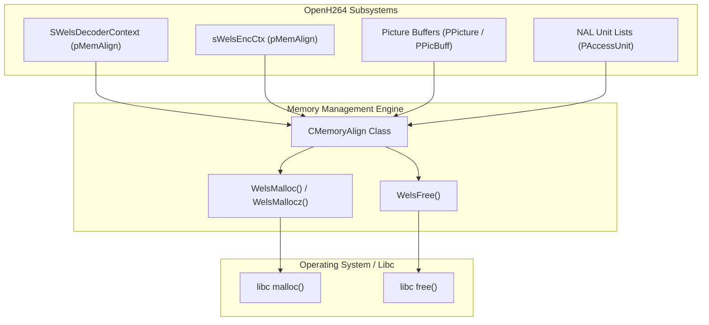

# OpenH264 Memory Alignment Subsystem: `memory_align.cpp`

This document provides a comprehensive, literate-programming breakdown of the aligned memory allocation and tracking engine in OpenH264, implemented in [`codec/common/src/memory_align.cpp`](openh264/codec/common/src/memory_align.cpp) and declared in [`codec/common/inc/memory_align.h`](openh264/codec/common/inc/memory_align.h).

---

## 1. High-Level Architectural Role & Purpose

Modern video codecs rely heavily on SIMD vector extensions (such as x86 SSE2/SSSE3/AVX2 and ARM NEON) to perform high-throughput block operations (motion compensation, discrete cosine transform, quantization, intra prediction, and deblocking). SIMD instructions operate on 128-bit (16-byte) or 256-bit (32-byte) vector registers. Attempting to execute aligned SIMD loads/stores (e.g., `movdqa`, `vmovdqa`, or `vld1q_u8`) on unaligned memory addresses causes hardware alignment exceptions or severe memory pipeline stall penalties.

The [CMemoryAlign](openh264/codec/common/inc/memory_align.h#L54-L76) class and its companion global memory primitives in `namespace WelsCommon` serve three core functions in OpenH264:

1. **Hardware-Aligned Buffer Allocation**: Guarantees that returned payload buffers are aligned to cache-line or SIMD register boundaries (typically 16-byte or 32-byte aligned), regardless of the alignment returned by standard C runtime `malloc`.
2. **Opaque Pointer & Metadata Recovery**: Embeds essential bookkeeping metadata (original raw heap pointer for `free()` and payload allocation size) directly in a hidden prefix preceding the aligned payload pointer. This avoids external hash tables or allocation registries.
3. **Memory Usage Tracking & Leak Diagnostics**: Provides real-time byte-level memory tracking via `MEMORY_MONITOR` and file-based diagnostic allocation logging via `MEMORY_CHECK`.



---

## 2. Memory Layout & Pointer Arithmetic

### 2.1 Buffer Memory Layout

When a caller requests a memory block of size $S = \text{kuiSize}$ with an alignment requirement $A = \text{kiAlign}$ (where $A$ must be a power of 2, typically $16$ or $32$), `WelsMalloc` allocates an oversized chunk from `malloc` and positions the returned aligned pointer inside that chunk.

The total raw allocation requested from the system heap is:

$$S_{\text{raw}} = S_{\text{payload}} + (A - 1) + \text{sizeof}(\text{void}^{**}) + \text{sizeof}(\text{int32\_t})$$

The raw buffer `pBuf` is laid out in memory as follows:

```
+-------------------+--------------------+------------------------+---------------------------------------+
|  Padding Offset   | Payload Size (int) | Original Pointer (raw) |       Aligned Payload Buffer          |
|  (0 to A-1 bytes) |   sizeof(int32_t)  |   sizeof(void**)       |         kuiSize bytes                 |
+-------------------+--------------------+------------------------+---------------------------------------+
^                   ^                    ^                        ^
|                   |                    |                        +-- pAlignedBuffer (Returned to caller)
|                   |                    +-- (pAlignedBuffer - sizeof(void**))
|                   +-- (pAlignedBuffer - sizeof(void**) - sizeof(int32_t))
+-- pBuf (Returned by libc malloc)
```

### 2.2 Mathematical Alignment Derivation

Let $P_{\text{raw}}$ be the address returned by libc `malloc`.

1. **Trial Offset**:
   $$P_{\text{trial}} = P_{\text{raw}} + (A - 1) + \text{sizeof}(\text{void}^{**}) + \text{sizeof}(\text{int32\_t})$$

2. **Alignment Masking**:
   Bitwise masking clears the lower $\log_2(A)$ bits:
   $$P_{\text{aligned}} = P_{\text{trial}} - (P_{\text{trial}} \pmod A) = P_{\text{trial}} - (P_{\text{trial}} \ \& \ (A - 1))$$

3. **Metadata Prefix Storage**:
   Immediately preceding $P_{\text{aligned}}$ in memory:
   $$\text{Address of Original Pointer Storage} = P_{\text{aligned}} - \text{sizeof}(\text{void}^{**})$$
   $$\text{Address of Payload Size Storage} = P_{\text{aligned}} - \text{sizeof}(\text{void}^{**}) - \text{sizeof}(\text{int32\_t})$$

4. **Correctness Invariant**:
   Since $(P_{\text{trial}} \ \& \ (A - 1)) \le A - 1$, subtracting the modulo satisfies:
   $$P_{\text{aligned}} - \text{sizeof}(\text{void}^{**}) - \text{sizeof}(\text{int32\_t}) \ge P_{\text{raw}}$$
   This guarantees that the prefix metadata never writes before $P_{\text{raw}}$, and $P_{\text{aligned}} + S \le P_{\text{raw}} + S_{\text{raw}}$, ensuring no heap corruption or out-of-bounds access occurs.

---

## 3. Compile-Time Macros & Diagnostic Flags

Declared in [`codec/common/inc/memory_align.h`](openh264/codec/common/inc/memory_align.h#L38-L50):

| Macro Flag | Default State | Description & Behavior |
| :--- | :--- | :--- |
| `MEMORY_MONITOR` | **Defined** | Enables tracking of aggregate allocated heap memory via `m_nMemoryUsageInBytes`. Under debug builds, the destructor asserts that all memory allocated via `CMemoryAlign` has been freed (`m_nMemoryUsageInBytes == 0`). |
| `MEMORY_CHECK` | *Commented Out* | Activates verbose file logging for memory allocations and deallocations to `./enc_mem_check_point.txt`. Automatically enforces `MEMORY_MONITOR`. |

### Diagnostic Global Variables (`#ifdef MEMORY_CHECK`)

Implemented in [`codec/common/src/memory_align.cpp`](openh264/codec/common/src/memory_align.cpp#L40-L45):

```cpp
#ifdef MEMORY_CHECK
static FILE*    fpMemChkPoint;       // File handle to ./enc_mem_check_point.txt
static uint32_t nCountRequestNum;    // Monotonically increasing allocation counter
static int32_t  g_iMemoryLength;     // Last computed buffer allocation length
#endif
```

---

## 4. Class & Struct Definitions

### [CMemoryAlign](openh264/codec/common/inc/memory_align.h#L54-L76)

`CMemoryAlign` encapsulates cache-line aligned memory allocation and memory consumption monitoring.

```cpp
namespace WelsCommon {

class CMemoryAlign {
 public:
  CMemoryAlign (const uint32_t kuiCacheLineSize);
  virtual ~CMemoryAlign();

  void* WelsMallocz (const uint32_t kuiSize, const char* kpTag);
  void* WelsMalloc  (const uint32_t kuiSize, const char* kpTag);
  void  WelsFree    (void* pPointer, const char* kpTag);
  const uint32_t WelsGetCacheLineSize() const;
  const uint32_t WelsGetMemoryUsage() const;

 private:
  // Disallow copy construction and copy assignment
  CMemoryAlign (const CMemoryAlign& kcMa);
  CMemoryAlign& operator= (const CMemoryAlign& kcMa);

 protected:
  uint32_t m_nCacheLineSize;

#ifdef MEMORY_MONITOR
  uint32_t m_nMemoryUsageInBytes;
#endif
};

} // namespace WelsCommon
```

#### Member Variables

| Variable | Type | Scope | Description |
| :--- | :--- | :--- | :--- |
| `m_nCacheLineSize` | `uint32_t` | `protected` | Required memory alignment in bytes. Defaults to `16` (`0x10`) if unaligned or 0. |
| `m_nMemoryUsageInBytes` | `uint32_t` | `protected` | Cumulative number of active allocated bytes managed by this instance (guarded by `MEMORY_MONITOR`). |

---

## 5. Method & Function Deep Dive

### 5.1 [CMemoryAlign::CMemoryAlign](openh264/codec/common/src/memory_align.cpp#L47-L56)

```cpp
CMemoryAlign::CMemoryAlign (const uint32_t kuiCacheLineSize)
#ifdef MEMORY_MONITOR
  : m_nMemoryUsageInBytes (0)
#endif
{
  if ((kuiCacheLineSize == 0) || (kuiCacheLineSize & 0x0f))
    m_nCacheLineSize = 0x10;
  else
    m_nCacheLineSize = kuiCacheLineSize;
}
```

* **Parameters**:
  * `kuiCacheLineSize` (`const uint32_t`): Target cache-line size in bytes.
* **Logic**:
  * Initializes `m_nMemoryUsageInBytes` to 0.
  * Validates `kuiCacheLineSize`: If `kuiCacheLineSize == 0` or if `(kuiCacheLineSize & 0x0f) != 0` (i.e. not a multiple of 16 bytes), `m_nCacheLineSize` falls back to `0x10` (16 bytes). Otherwise, assigns `m_nCacheLineSize = kuiCacheLineSize`.

---

### 5.2 [CMemoryAlign::~CMemoryAlign](openh264/codec/common/src/memory_align.cpp#L58-L62)

```cpp
CMemoryAlign::~CMemoryAlign() {
#ifdef MEMORY_MONITOR
  assert (m_nMemoryUsageInBytes == 0);
#endif
}
```

* **Logic**:
  * When `MEMORY_MONITOR` is enabled, triggers an assertion failure `assert(m_nMemoryUsageInBytes == 0)` if any buffers allocated through this instance were not freed before destruction, providing immediate leak detection.

---

### 5.3 [WelsCommon::WelsMalloc](openh264/codec/common/src/memory_align.cpp#L64-L99) (Global Function)

```cpp
void* WelsMalloc (const uint32_t kuiSize, const char* kpTag, const uint32_t kiAlign)
```

* **Parameters**:
  * `kuiSize` (`const uint32_t`): Requested payload size in bytes.
  * `kpTag` (`const char*`): Debug tag identifier for the memory block (used in `MEMORY_CHECK` logs).
  * `kiAlign` (`const uint32_t`): Alignment requirement in bytes (must be a power of two $\ge 1$).
* **Return Value**:
  * `void*`: Pointer to the aligned payload buffer, or `NULL` if `malloc` fails.
* **Detailed Execution Flow**:
  1. Computes `kiTrialRequestedSize = kuiSize + (kiAlign - 1) + sizeof(void**) + sizeof(int32_t)`.
  2. Allocates raw buffer `pBuf = (uint8_t*) malloc(kiTrialRequestedSize)`.
  3. If `pBuf == NULL`, returns `NULL`.
  4. Under `MEMORY_CHECK`, opens `./enc_mem_check_point.txt` if not already opened and logs allocation index, pointers, size, and tag.
  5. Computes aligned pointer:
     ```cpp
     pAlignedBuffer = pBuf + kiAlignedBytes + kiSizeOfVoidPointer + kiSizeOfInt;
     pAlignedBuffer -= ((uintptr_t) pAlignedBuffer & kiAlignedBytes);
     ```
  6. Writes metadata header preceding `pAlignedBuffer`:
     ```cpp
     * ((void**) (pAlignedBuffer - kiSizeOfVoidPointer)) = pBuf;
     * ((int32_t*) (pAlignedBuffer - (kiSizeOfVoidPointer + kiSizeOfInt))) = kiPayloadSize;
     ```
  7. Returns `pAlignedBuffer`.

---

### 5.4 [WelsCommon::WelsFree](openh264/codec/common/src/memory_align.cpp#L101-L115) (Global Function)

```cpp
void WelsFree (void* pPointer, const char* kpTag)
```

* **Parameters**:
  * `pPointer` (`void*`): Aligned pointer previously returned by `WelsMalloc`. Safe to pass `NULL`.
  * `kpTag` (`const char*`): Debug tag string for logging under `MEMORY_CHECK`.
* **Detailed Execution Flow**:
  1. If `pPointer` is non-NULL:
  2. Retrieves original unaligned pointer: `pRawBuf = *(((void**) pPointer) - 1)`.
  3. Under `MEMORY_CHECK`, logs the deallocation event to `fpMemChkPoint`.
  4. Invokes libc `free(pRawBuf)`.

---

### 5.5 [CMemoryAlign::WelsMalloc](openh264/codec/common/src/memory_align.cpp#L128-L141) (Member Method)

```cpp
void* CMemoryAlign::WelsMalloc (const uint32_t kuiSize, const char* kpTag) {
  void* pPointer = WelsCommon::WelsMalloc (kuiSize, kpTag, m_nCacheLineSize);
#ifdef MEMORY_MONITOR
  if (pPointer != NULL) {
    const int32_t kiMemoryLength = * ((int32_t*) ((uint8_t*)pPointer - sizeof (void**) - sizeof (
                                        int32_t))) + m_nCacheLineSize - 1 + sizeof (void**) + sizeof (int32_t);
    m_nMemoryUsageInBytes += kiMemoryLength;
#ifdef MEMORY_CHECK
    g_iMemoryLength = kiMemoryLength;
#endif
  }
#endif
  return pPointer;
}
```

* **Parameters**:
  * `kuiSize` (`const uint32_t`): Requested payload size in bytes.
  * `kpTag` (`const char*`): Debug identifier tag.
* **Return Value**:
  * `void*`: Aligned memory block pointer with alignment `m_nCacheLineSize`.
* **Accounting Logic**:
  * Delegates allocation to `WelsCommon::WelsMalloc` using instance alignment `m_nCacheLineSize`.
  * Under `MEMORY_MONITOR`, extracts stored payload size from header and computes total memory block footprint:
    $$\text{kiMemoryLength} = S_{\text{payload}} + m\_nCacheLineSize - 1 + \text{sizeof}(\text{void}^{**}) + \text{sizeof}(\text{int32\_t})$$
  * Increments `m_nMemoryUsageInBytes += kiMemoryLength`.

---

### 5.6 [CMemoryAlign::WelsMallocz](openh264/codec/common/src/memory_align.cpp#L117-L126) (Member Method)

```cpp
void* CMemoryAlign::WelsMallocz (const uint32_t kuiSize, const char* kpTag) {
  void* pPointer = WelsMalloc (kuiSize, kpTag);
  if (NULL == pPointer) {
    return NULL;
  }
  memset (pPointer, 0, kuiSize);
  return pPointer;
}
```

* **Parameters**:
  * `kuiSize` (`const uint32_t`): Size in bytes.
  * `kpTag` (`const char*`): Debug tag.
* **Return Value**:
  * `void*`: Zero-initialized aligned memory pointer.

---

### 5.7 [CMemoryAlign::WelsFree](openh264/codec/common/src/memory_align.cpp#L143-L155) (Member Method)

```cpp
void CMemoryAlign::WelsFree (void* pPointer, const char* kpTag) {
#ifdef MEMORY_MONITOR
  if (pPointer) {
    const int32_t kiMemoryLength = * ((int32_t*) ((uint8_t*)pPointer - sizeof (void**) - sizeof (
                                        int32_t))) + m_nCacheLineSize - 1 + sizeof (void**) + sizeof (int32_t);
    m_nMemoryUsageInBytes -= kiMemoryLength;
#ifdef MEMORY_CHECK
    g_iMemoryLength = kiMemoryLength;
#endif
  }
#endif
  WelsCommon::WelsFree (pPointer, kpTag);
}
```

* **Accounting Logic**:
  * If `pPointer` is non-NULL and `MEMORY_MONITOR` is active, reads the stored payload size, calculates `kiMemoryLength`, and decrements `m_nMemoryUsageInBytes -= kiMemoryLength`.
  * Forwards deallocation to `WelsCommon::WelsFree(pPointer, kpTag)`.

---

### 5.8 [WelsCommon::WelsMallocz](openh264/codec/common/src/memory_align.cpp#L157-L164) (Global Function)

```cpp
void* WelsMallocz (const uint32_t kuiSize, const char* kpTag) {
  void* pPointer = WelsMalloc (kuiSize, kpTag, 16);
  if (NULL == pPointer) {
    return NULL;
  }
  memset (pPointer, 0, kuiSize);
  return pPointer;
}
```

* **Logic**:
  * Standalone convenience function allocating 16-byte aligned memory and clearing it to zero via `memset`.

---

### 5.9 Accessor Methods

#### [CMemoryAlign::WelsGetCacheLineSize](openh264/codec/common/src/memory_align.cpp#L166-L168)
```cpp
const uint32_t CMemoryAlign::WelsGetCacheLineSize() const {
  return m_nCacheLineSize;
}
```
Returns the active alignment constraint in bytes.

#### [CMemoryAlign::WelsGetMemoryUsage](openh264/codec/common/src/memory_align.cpp#L170-L172)
```cpp
const uint32_t CMemoryAlign::WelsGetMemoryUsage() const {
  return m_nMemoryUsageInBytes;
}
```
Returns the current active memory footprint in bytes tracked by `m_nMemoryUsageInBytes`.

---

## 6. Helper Macros in `memory_align.h`

Defined in [`codec/common/inc/memory_align.h`](openh264/codec/common/inc/memory_align.h#L105-L113):

```cpp
#define WELS_SAFE_FREE(pPtr, pTag) \
  if (pPtr) { WelsFree(pPtr, pTag); pPtr = NULL; }

#define WELS_NEW_OP(object, type) \
  (type*)(new object);

#define WELS_DELETE_OP(p) \
  if (p) delete p;        \
  p = NULL;
```

* `WELS_SAFE_FREE`: Frees memory allocated through `WelsFree` and guarantees the pointer is reset to `NULL` to avoid dangling pointers.
* `WELS_NEW_OP`: Macro wrapping C++ `new` operator.
* `WELS_DELETE_OP`: Safely deletes a C++ heap object and resets the pointer to `NULL`.

---

## 7. Cross-Codebase Usages & Lifecycle

`CMemoryAlign` instances are instantiated at the root of the decoder and encoder contexts:

* **Decoder Context**: In [`welsDecoderExt.cpp`](openh264/codec/decoder/plus/src/welsDecoderExt.cpp#L412), `pCtx->pMemAlign` is initialized with the cache-line size and passed to picture buffer allocation ([`pic_queue.cpp`](openh264/codec/decoder/core/src/pic_queue.cpp)), NAL unit list pools ([`memmgr_nal_unit.cpp`](openh264/codec/decoder/core/src/memmgr_nal_unit.cpp)), and FMO map memory management ([`fmo.cpp`](openh264/codec/decoder/core/src/fmo.cpp)).
* **Encoder Context**: Stored in [`sWelsEncCtx::pMemAlign`](openh264/codec/encoder/core/inc/encoder_context.h#L215). Manages frame buffers, spatial layer structures, bitstream NAL buffers, and pre-processing working memory.
