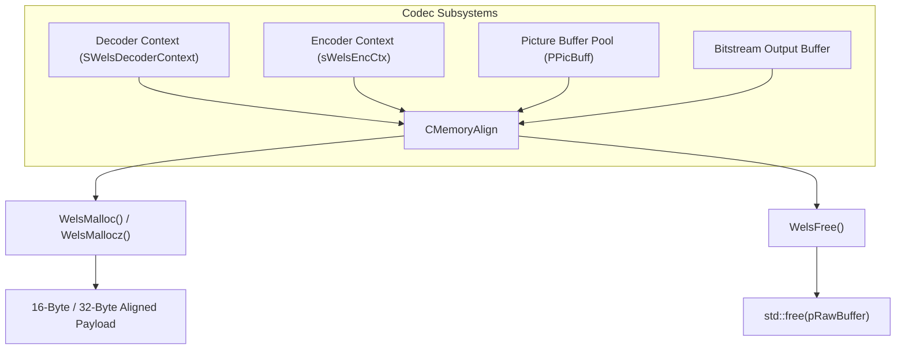
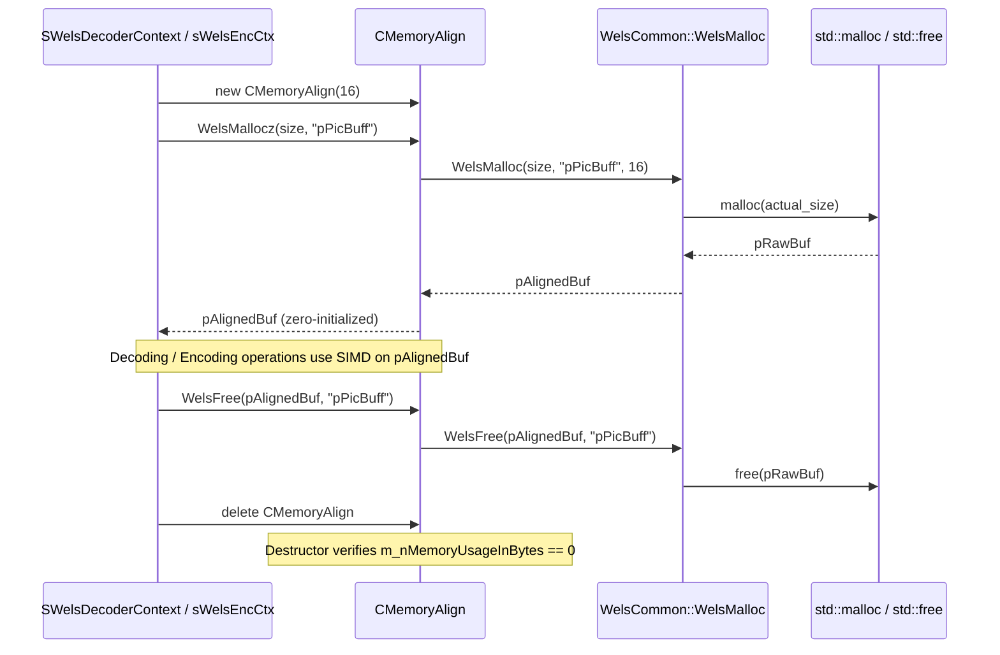

# SIMD-Aligned Memory Allocator: `memory_align.h`

This document provides a comprehensive, literate-programming-style breakdown of [memory_align.h](openh264/codec/common/inc/memory_align.h) and its companion implementation [memory_align.cpp](openh264/codec/common/src/memory_align.cpp). It covers the architectural motivation, memory layout mechanics, pointer recovery math, debug monitoring, and lifecycle management of aligned memory across OpenH264.

---

## Table of Contents
1. [Architectural Role & Purpose](#1-architectural-role--purpose)
2. [Header Configuration & Preprocessor Macros](#2-header-configuration--preprocessor-macros)
3. [Memory Layout & Alignment Mathematics](#3-memory-layout--alignment-mathematics)
4. [Class Definition: `CMemoryAlign`](#4-class-definition-cmemoryalign)
5. [Standalone Functions & Utilities](#5-standalone-functions--utilities)
6. [Call Graph & Subsystem Interactions](#6-call-graph--subsystem-interactions)

---

## 1. Architectural Role & Purpose

Modern video codecs rely heavily on SIMD vector extensions (such as x86 **SSE2**, **SSSE3**, **AVX2** and ARM **NEON** / **AArch64**) to perform high-throughput pixel filtering, motion estimation/compensation, discrete cosine transforms (DCT/IDCT), and deblocking. SIMD instructions (e.g., `movdqa` on x86) mandate strict memory address alignment—typically 16 bytes for 128-bit vector registers or 32 bytes for 256-bit vector registers.

Accessing unaligned memory addresses with aligned SIMD vector load/store instructions causes hardware exceptions (e.g., general protection faults `#GP` on x86) or significant CPU performance degradation caused by split-cache-line memory bus transactions.



The [CMemoryAlign](openh264/codec/common/inc/memory_align.h#L54-L76) class and its auxiliary functions solve these challenges by:
1. **Enforcing Arbitrary Power-of-Two Alignments**: Dynamically calculating padding so that the returned payload pointer is aligned to $N$ bytes (defaulting to 16 bytes).
2. **Metadata Preservation**: Embedding the original `malloc()` pointer and payload byte size into a hidden header prefix immediately preceding the aligned payload.
3. **Leak Detection & Monitoring**: Tracking active heap allocations via `m_nMemoryUsageInBytes` and asserting zero memory usage upon allocator destruction when `MEMORY_MONITOR` is enabled.
4. **Debug Traceability**: Optionally writing allocation timestamps, tags, and sizes to disk (`enc_mem_check_point.txt`) when `MEMORY_CHECK` is compiled in.

---

## 2. Header Configuration & Preprocessor Macros

[memory_align.h](openh264/codec/common/inc/memory_align.h#L33-L116) declares several compile-time flags and memory lifecycle macros:

```cpp
#if !defined(WELS_COMMON_MEMORY_ALIGN_H__)
#define WELS_COMMON_MEMORY_ALIGN_H__

#include "typedefs.h"

//#define MEMORY_CHECK
#define MEMORY_MONITOR
#ifdef MEMORY_CHECK
#ifndef MEMORY_MONITOR
#define MEMORY_MONITOR
#endif//MEMORY_MONITOR
#endif//MEMORY_CHECK
```

### Preprocessor Flags

| Macro | Default State | Description |
| :--- | :--- | :--- |
| `MEMORY_MONITOR` | Defined (`#define`) | Enables runtime byte-level tracking of active memory via `m_nMemoryUsageInBytes`. Adds assertion checks in [CMemoryAlign::~CMemoryAlign()](openh264/codec/common/inc/memory_align.h#L57). |
| `MEMORY_CHECK` | Commented out | Activates file-based debug logging (`./enc_mem_check_point.txt`). Automatically enables `MEMORY_MONITOR` if active. |

### Memory Utility Macros

```cpp
#define WELS_SAFE_FREE(pPtr, pTag)  if (pPtr) { WelsFree(pPtr, pTag); pPtr = NULL; }

#define WELS_NEW_OP(object, type)   (type*)(new object);

#define WELS_DELETE_OP(p)           if(p) delete p; p = NULL;
```

* **`WELS_SAFE_FREE(pPtr, pTag)`**: Checks for a non-null pointer, invokes [WelsFree](openh264/codec/common/inc/memory_align.h#L103), and resets the pointer to `NULL` to eliminate dangling pointer references.
* **`WELS_NEW_OP(object, type)`**: Instantiates an object with `new` and explicitly casts to `(type*)`.
* **`WELS_DELETE_OP(p)`**: Deletes a C++ object if non-null and resets `p = NULL`.

---

## 3. Memory Layout & Alignment Mathematics

When a caller requests a memory block of size $S_{\text{payload}}$ (`kuiSize`) with alignment $A$ (`kiAlign`), standard `malloc()` returns an unaligned pointer $p_{\text{raw}}$. To guarantee both alignment and metadata recovery on `free()`, [WelsMalloc](openh264/codec/common/src/memory_align.cpp#L64-L99) allocates extra slack.

### Allocation Size Formula

The total size requested from the operating system's heap is:

$$S_{\text{actual}} = S_{\text{payload}} + (A - 1) + \text{sizeof}(\text{void}^{**}) + \text{sizeof}(\text{int32\_t})$$

Where:
* $S_{\text{payload}} = \text{kuiSize}$ (requested payload size).
* $A = \text{kiAlign}$ (alignment requirement; must be a power of 2, typically 16 or 32).
* $A - 1 = \text{kiAlignedBytes}$ (alignment padding slack).
* $\text{sizeof}(\text{void}^{**})$: Pointer storage for the raw `pBuf` pointer (8 bytes on 64-bit platforms, 4 bytes on 32-bit platforms).
* $\text{sizeof}(\text{int32\_t})$: 4 bytes storing the requested payload size `kiPayloadSize`.

### Aligned Address Calculation & Metadata Storage

```
+---------------------+-----------------------+---------------------+-----------------------------------+
|  Alignment Padding  |  int32_t PayloadSize  |  void* pBuf (orig)  |    Aligned User Payload Data      |
|    (0 to A-1 bytes) |       (4 bytes)       |   (4 or 8 bytes)    |         (kuiSize bytes)           |
+---------------------+-----------------------+---------------------+-----------------------------------+
^                                             ^                     ^
pBuf (raw malloc)                             pAlignedBuffer - ptr  pAlignedBuffer (returned to caller)
```

1. **Initial Forward Shift**:
   $$p_{\text{trial}} = p_{\text{buf}} + (A - 1) + \text{sizeof}(\text{void}^{**}) + \text{sizeof}(\text{int32\_t})$$
2. **Alignment Masking (Bitwise Truncation)**:
   $$p_{\text{aligned}} = p_{\text{trial}} - (\text{uintptr\_t}(p_{\text{trial}}) \ \& \ (A - 1))$$
   Because $A$ is a power of 2, $(p_{\text{trial}} \ \& \ (A - 1))$ computes $p_{\text{trial}} \pmod A$. Subtracting this remainder rounds down to the nearest multiple of $A$, guaranteeing that $p_{\text{aligned}} \pmod A = 0$.
3. **Header Metadata Injection**:
   * **Original Buffer Pointer**: Written at $(p_{\text{aligned}} - \text{sizeof}(\text{void}^{**}))$:
     $$*(\text{void}^{**})(p_{\text{aligned}} - \text{sizeof}(\text{void}^{**})) = p_{\text{buf}}$$
   * **Payload Size**: Written at $(p_{\text{aligned}} - \text{sizeof}(\text{void}^{**}) - \text{sizeof}(\text{int32\_t}))$:
     $$*(\text{int32\_t}^{*})(p_{\text{aligned}} - \text{sizeof}(\text{void}^{**}) - \text{sizeof}(\text{int32\_t})) = S_{\text{payload}}$$

---

## 4. Class Definition: `CMemoryAlign`

Declared in [memory_align.h:L54-L76](openh264/codec/common/inc/memory_align.h#L54-L76) inside namespace `WelsCommon`:

```cpp
namespace WelsCommon {

class CMemoryAlign {
 public:
  CMemoryAlign (const uint32_t kuiCacheLineSize);
  virtual ~CMemoryAlign();

  void* WelsMallocz (const uint32_t kuiSize, const char* kpTag);
  void* WelsMalloc (const uint32_t kuiSize, const char* kpTag);
  void WelsFree (void* pPointer, const char* kpTag);
  const uint32_t WelsGetCacheLineSize() const;
  const uint32_t WelsGetMemoryUsage() const;

 private:
  CMemoryAlign (const CMemoryAlign& kcMa);
  CMemoryAlign& operator= (const CMemoryAlign& kcMa);

 protected:
  uint32_t        m_nCacheLineSize;

#ifdef MEMORY_MONITOR
  uint32_t        m_nMemoryUsageInBytes;
#endif//MEMORY_MONITOR
};
```

### Member Fields

| Field Name | Type | Guard | Purpose |
| :--- | :--- | :--- | :--- |
| `m_nCacheLineSize` | `uint32_t` | None | Target alignment boundary in bytes (e.g. `16` or `32`). Clamped to `0x10` (16 bytes) if the input is 0 or not a multiple of 16. |
| `m_nMemoryUsageInBytes` | `uint32_t` | `MEMORY_MONITOR` | Running accumulator of total active memory (in bytes) allocated through this `CMemoryAlign` instance. |

### Lifecycle & Methods

#### 1. Constructor: [CMemoryAlign](openh264/codec/common/src/memory_align.cpp#L47-L56)
```cpp
CMemoryAlign::CMemoryAlign (const uint32_t kuiCacheLineSize)
#ifdef MEMORY_MONITOR
  : m_nMemoryUsageInBytes (0)
#endif
{
  if ((kuiCacheLineSize == 0) || (kuiCacheLineSize & 0x0f))
    m_nCacheLineSize = 0x10;
  else
    m_nCacheLineSize = kuiCacheLineSize;
}
```
* **Validation**: Validates that `kuiCacheLineSize` is non-zero and divisible by 16 (`kuiCacheLineSize & 0x0f == 0`). If invalid, safely falls back to 16-byte alignment (`0x10`).

#### 2. Destructor: [~CMemoryAlign](openh264/codec/common/src/memory_align.cpp#L58-L62)
```cpp
CMemoryAlign::~CMemoryAlign() {
#ifdef MEMORY_MONITOR
  assert (m_nMemoryUsageInBytes == 0);
#endif
}
```
* **Leak Verification**: In debug/monitored builds, asserts that all allocated buffers have been freed before the instance is destroyed.

#### 3. [WelsMalloc](openh264/codec/common/src/memory_align.cpp#L128-L141)
```cpp
void* CMemoryAlign::WelsMalloc (const uint32_t kuiSize, const char* kpTag)
```
* Delegates to `WelsCommon::WelsMalloc(kuiSize, kpTag, m_nCacheLineSize)`.
* Updates memory monitor statistics:
  $$L_{\text{tracked}} = S_{\text{payload}} + m\_nCacheLineSize - 1 + \text{sizeof}(\text{void}^{**}) + \text{sizeof}(\text{int32\_t})$$
  $$\text{m\_nMemoryUsageInBytes} \mathrel{+}= L_{\text{tracked}}$$

#### 4. [WelsMallocz](openh264/codec/common/src/memory_align.cpp#L117-L126)
```cpp
void* CMemoryAlign::WelsMallocz (const uint32_t kuiSize, const char* kpTag)
```
* Calls `this->WelsMalloc(kuiSize, kpTag)` and zeroes the entire payload via `memset(pPointer, 0, kuiSize)`.

#### 5. [WelsFree](openh264/codec/common/src/memory_align.cpp#L143-L155)
```cpp
void CMemoryAlign::WelsFree (void* pPointer, const char* kpTag)
```
* Reads the payload size from the metadata prefix:
  $$S_{\text{payload}} = *((\text{int32\_t}^{*})(p_{\text{Pointer}} - \text{sizeof}(\text{void}^{**}) - \text{sizeof}(\text{int32\_t})))$$
* Decrements `m_nMemoryUsageInBytes` by $L_{\text{tracked}}$.
* Calls `WelsCommon::WelsFree(pPointer, kpTag)`.

#### 6. Accessor Methods
* [WelsGetCacheLineSize()](openh264/codec/common/inc/memory_align.h#L62): Returns `m_nCacheLineSize`.
* [WelsGetMemoryUsage()](openh264/codec/common/inc/memory_align.h#L63): Returns `m_nMemoryUsageInBytes`.

---

## 5. Standalone Functions & Utilities

In addition to class methods, the `WelsCommon` namespace exposes global helper functions:

### Global [WelsMalloc](openh264/codec/common/src/memory_align.cpp#L64-L99)
```cpp
void* WelsMalloc (const uint32_t kuiSize, const char* kpTag, const uint32_t kiAlign);
```
* **Parameters**:
  * `kuiSize`: Number of payload bytes requested.
  * `kpTag`: Debug identification string (e.g. `"pCtx->pDecPic"`).
  * `kiAlign`: Required byte alignment (e.g., 16 or 32).
* **Return Value**: Aligned pointer to user data, or `NULL` if allocation fails.

### Global [WelsFree](openh264/codec/common/src/memory_align.cpp#L101-L115)
```cpp
void WelsFree (void* pPointer, const char* kpTag);
```
* **Pointer Recovery**: Recovers the original `pBuf` via:
  $$p_{\text{raw}} = *((\text{void}^{**})p_{\text{Pointer}} - 1)$$
* **Deallocation**: Invokes standard C library `free(p_raw)`.

### Global [WelsMallocz](openh264/codec/common/src/memory_align.cpp#L157-L164)
```cpp
void* WelsMallocz (const uint32_t kuiSize, const char* kpTag);
```
* Convenience wrapper allocating 16-byte aligned zero-filled memory directly without requiring a `CMemoryAlign` instance.

---

## 6. Call Graph & Subsystem Interactions

`CMemoryAlign` is instantiated and owned per-context across OpenH264:

| Subsystem | Owner Structure | Field Pointer | Typical Allocations Managed |
| :--- | :--- | :--- | :--- |
| **Decoder** | `SWelsDecoderContext` | `pCtx->pMemAlign` | Picture queues (`PPicBuff`), DPB frames (`PPicture`), NAL unit lists (`PAccessUnit`), FMO maps |
| **Encoder** | `sWelsEncCtx` | `pEncCtx->pMemAlign` | Bitstream output buffers (`AllocateBsOutputBuffer`), spatial layer contexts (`SDqLayer`), VAA pre-processing buffers |


