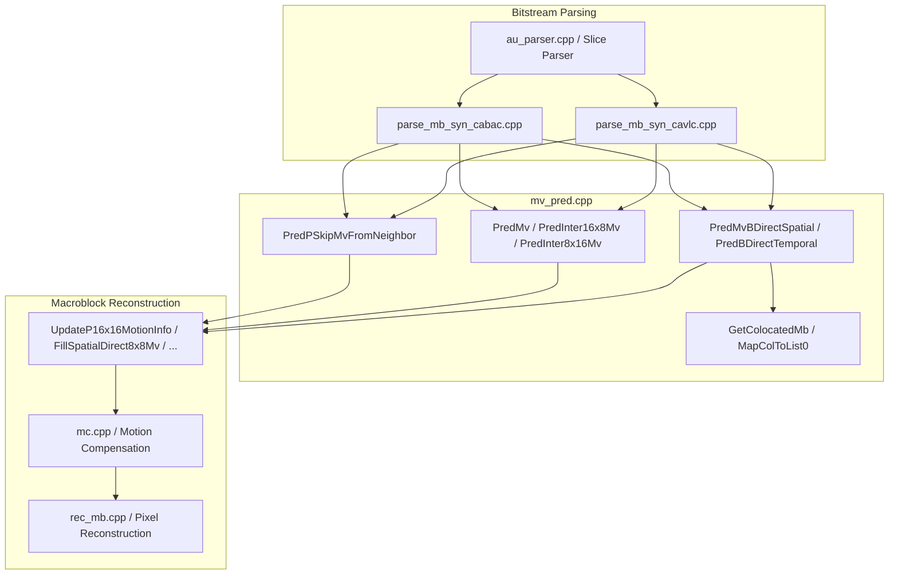
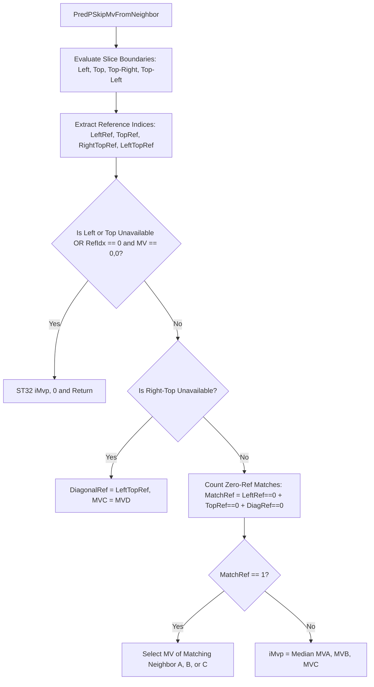
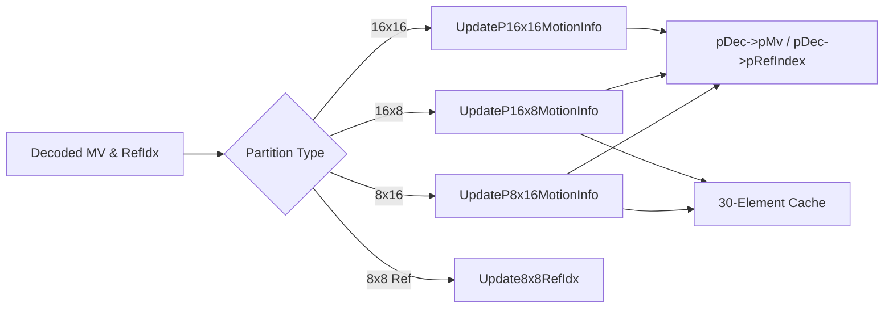

# Literate Documentation: `mv_pred.cpp` (Motion Vector Prediction & Cache Management)

This document provides a literate-programming technical breakdown of [mv_pred.cpp](openh264/codec/decoder/core/src/mv_pred.cpp) and its associated header [mv_pred.h](openh264/codec/decoder/core/inc/mv_pred.h) within the OpenH264 H.264/AVC / SVC decoder core (`codec/decoder/core/`).

---

## Table of Contents
1. [Module Overview & Architectural Role](#1-module-overview--architectural-role)
2. [Data Structures, Coordinate Systems & Cache Grids](#2-data-structures-coordinate-systems--cache-grids)
   - [2.1 The 30-Element Neighbor Cache Layout](#21-the-30-element-neighbor-cache-layout)
   - [2.2 4x4 Scan Indices & Fast Memory Access Primitives](#22-4x4-scan-indices--fast-memory-access-primitives)
   - [2.3 Reference Index Sentinels & Constants](#23-reference-index-sentinels--constants)
3. [Memory & Block Manipulation Primitives](#3-memory--block-manipulation-primitives)
   - [`SetRectBlock`](#setrectblock)
   - [`CopyRectBlock4Cols`](#copyrectblock4cols)
4. [P-Slice Motion Vector Prediction](#4-p-slice-motion-vector-prediction)
   - [`PredPSkipMvFromNeighbor`](#predpskipmvfromneighbor)
5. [Inter Partition Motion Vector Prediction](#5-inter-partition-motion-vector-prediction)
   - [`PredMv`](#predmv)
   - [`PredInter8x16Mv`](#predinter8x16mv)
   - [`PredInter16x8Mv`](#predinter16x8mv)
6. [B-Slice Direct & Skip Mode Derivation](#6-b-slice-direct--skip-mode-derivation)
   - [`GetColocatedMb`](#getcolocatedmb)
   - [`PredMvBDirectSpatial`](#predmvbdirectspatial)
   - [`PredBDirectTemporal`](#predbdirecttemporal)
   - [`FillSpatialDirect8x8Mv`](#fillspatialdirect8x8mv)
   - [`FillTemporalDirect8x8Mv`](#filltemporaldirect8x8mv)
   - [`MapColToList0`](#mapcoltolist0)
7. [Macroblock Cache & Decoded Picture Synchronization](#7-macroblock-cache--decoded-picture-synchronization)
   - [`UpdateP16x16MotionInfo`](#updatep16x16motioninfo)
   - [`UpdateP16x16RefIdx`](#updatep16x16refidx)
   - [`UpdateP16x16MotionOnly`](#updatep16x16motiononly)
   - [`UpdateP16x8MotionInfo`](#updatep16x8motioninfo)
   - [`UpdateP8x16MotionInfo`](#updatep8x16motioninfo)
   - [`Update8x8RefIdx`](#update8x8refidx)
   - [`GetMbType`](#getmbtype)
8. [Mathematical Models & Algorithmic Summary](#8-mathematical-models--algorithmic-summary)
9. [Call Graph & Cross-Module Interactions](#9-call-graph--cross-module-interactions)

---

## 1. Module Overview & Architectural Role

In H.264 / AVC video decoding, inter-coded macroblocks and sub-partitions do not transmit absolute motion vectors in the bitstream. Instead, they transmit **Motion Vector Differences (MVD)** relative to a **Predicted Motion Vector (MVP)** derived from spatially or temporally neighboring blocks:

$$\vec{MV} = \vec{MVP} + \vec{MVD}$$

The implementation in [mv_pred.cpp](openh264/codec/decoder/core/src/mv_pred.cpp) performs all motion vector prediction, neighbor availability checking, directional selection, component-wise median calculation, B-slice direct mode derivation (both spatial direct and temporal direct), and motion cache synchronization.



### Primary Responsibilities:
1. **P-Skip Motion Vector Prediction**: Derives $(0,0)$ or median predicted vectors for P-skip macroblocks according to ITU-T H.264 Section 8.4.1.3.
2. **Standard Inter MVP**: Derives predicted motion vectors for $16\times16, 16\times8, 8\times16, 8\times8, 8\times4, 4\times8,$ and $4\times4$ partitions using median or directional rules (H.264 Section 8.4.1.3).
3. **B-Slice Direct Modes**: Implements both **Spatial Direct** (Section 8.4.1.2.2) and **Temporal Direct** (Section 8.4.1.2.3) prediction, including collocated picture extraction, multi-threaded synchronization, POC reference list remapping, and temporal distance scaling.
4. **Motion Cache Propagation**: Fast replication of $16$-bit reference indices and $32$-bit motion vector pairs into the spatial dependency layer buffer (`PDqLayer`) and reconstructed picture buffer (`PPicture`).

---

## 2. Data Structures, Coordinate Systems & Cache Grids

### 2.1 The 30-Element Neighbor Cache Layout

During macroblock decoding, motion vectors and reference indices of the current macroblock and its immediate boundary neighbors are organized in a contiguous $6 \times 5 = 30$ element array (`int16_t iMotionVector[LIST_A][30][MV_A]` and `int8_t iRefIndex[LIST_A][30]`).

```
                Column 0   Column 1   Column 2   Column 3   Column 4   Column 5
              +----------+----------+----------+----------+----------+----------+
  Row 0       | Top-Left |  Top 0   |  Top 1   |  Top 2   |  Top 3   |Top-Right |
  (Indices)   |  idx 0   |  idx 1   |  idx 2   |  idx 3   |  idx 4   |  idx 5   |
              +----------+----------+----------+----------+----------+----------+
  Row 1       |  Left 0  |  MB 4x4  |  MB 4x4  |  MB 4x4  |  MB 4x4  |          |
  (Indices)   |  idx 6   |  idx 7   |  idx 8   |  idx 9   |  idx 10  |  idx 11  |
              +----------+----------+----------+----------+----------+----------+
  Row 2       |  Left 1  |  MB 4x4  |  MB 4x4  |  MB 4x4  |  MB 4x4  |          |
  (Indices)   |  idx 12  |  idx 13  |  idx 14  |  idx 15  |  idx 16  |  idx 17  |
              +----------+----------+----------+----------+----------+----------+
  Row 3       |  Left 2  |  MB 4x4  |  MB 4x4  |  MB 4x4  |  MB 4x4  |          |
  (Indices)   |  idx 18  |  idx 19  |  idx 20  |  idx 21  |  idx 22  |  idx 23  |
              +----------+----------+----------+----------+----------+----------+
  Row 4       |  Left 3  |  MB 4x4  |  MB 4x4  |  MB 4x4  |  MB 4x4  |          |
  (Indices)   |  idx 24  |  idx 25  |  idx 26  |  idx 27  |  idx 28  |  idx 29  |
              +----------+----------+----------+----------+----------+----------+
```

Mapping from a partition's $4\times4$ index $i \in [0, 15]$ to the cache grid is performed via the lookup table `g_kuiCache30ScanIdx`:

$$\text{CacheIdx} = \text{g\_kuiCache30ScanIdx}[i]$$

Relative neighbor addresses within the 30-element cache are:
* **Left Neighbor ($A$)**: $\text{kuiLeftIdx} = \text{CacheIdx} - 1$
* **Top Neighbor ($B$)**: $\text{kuiTopIdx} = \text{CacheIdx} - 6$
* **Top-Right Neighbor ($C$)**: $\text{kuiRightTopIdx} = \text{kuiTopIdx} + \text{iPartWidth}$
* **Top-Left Neighbor ($D$)**: $\text{kuiLeftTopIdx} = \text{kuiTopIdx} - 1$

### 2.2 4x4 Scan Indices & Fast Memory Access Primitives

Macroblock sub-blocks are scanned in $4\times4$ raster order using `g_kuiScan4`:

```
g_kuiScan4 = { 0, 1, 4, 5,  2, 3, 6, 7,  8, 9, 12, 13,  10, 11, 14, 15 }
```

To eliminate memory alignment stalls and redundant scalar stores, the codebase relies on low-level memory primitives defined in `ls_defines.h`:

| Macro | Description | Data Type / Size |
| :--- | :--- | :--- |
| `LD32(ptr)` | Unaligned 32-bit load | Loads 2 $\times$ `int16_t` MV components $(MV_x, MV_y)$ as single `uint32_t` |
| `ST16(ptr, val)` | Unaligned 16-bit store | Writes 2 $\times$ `int8_t` reference indices or a 16-bit scalar |
| `ST32(ptr, val)` | Unaligned 32-bit store | Writes a full $(MV_x, MV_y)$ pair into memory |
| `LD64(ptr)` | Unaligned 64-bit load | Loads two $(MV_x, MV_y)$ pairs simultaneously |
| `ST64(ptr, val)` | Unaligned 64-bit store | Writes two $(MV_x, MV_y)$ pairs in a single CPU cycle |

### 2.3 Reference Index Sentinels & Constants

* `REF_NOT_AVAIL` (`-12`): Indicates that the neighbor partition is unavailable (outside the slice boundary, picture frame, or unconstructed).
* `REF_NOT_IN_LIST` (`-1`): Indicates that the partition is available but coded as Intra, or does not use the reference list in question.
* `LIST_0` (`0`): Forward prediction reference picture list.
* `LIST_1` (`1`): Backward / B-slice reference picture list.
* `LIST_A` (`2`): Total number of reference lists ($L_0$ and $L_1$).
* `MV_A` (`2`): Number of vector components per motion vector ($MV_x, MV_y$).

---

## 3. Memory & Block Manipulation Primitives

### `SetRectBlock`
[mv_pred.cpp:L48-L130](openh264/codec/decoder/core/src/mv_pred.cpp#L48-L130)

```cpp
static inline void SetRectBlock (void* vp, int32_t w, const int32_t h, int32_t stride, 
                                 const uint32_t val, const int32_t size);
```

#### Purpose
Fills a 2D rectangular block in memory of dimension $w \times h$ elements (each of size `size` bytes) with a constant scalar value `val`. 

#### Implementation Strategy
Specialized conditional branches unroll the memory writes based on the total row byte-width $W_{\text{bytes}} = w \cdot \text{size}$:
* $W_{\text{bytes}} = 1, h = 4$: Stores 4 individual `uint8_t` values across `stride` rows.
* $W_{\text{bytes}} = 2, h \in \{2, 4\}$: Stores `uint16_t` values. If `size != 4`, replicates `val` into 16-bit pattern `val * 0x0101U`.
* $W_{\text{bytes}} = 4, h \in \{2, 4\}$: Stores 32-bit words (`uint32_t`). If `size != 4`, broadcasts byte `val` to all 4 bytes `val * 0x01010101UL`.
* $W_{\text{bytes}} = 8, h \in \{1, 2, 4\}$: Stores 2 consecutive `uint32_t` values per row.
* $W_{\text{bytes}} = 16, h \in \{2, 3, 4\}$: Stores 4 consecutive `uint32_t` values per row (16 bytes per row).

---

### `CopyRectBlock4Cols`
[mv_pred.cpp:L131-L157](openh264/codec/decoder/core/src/mv_pred.cpp#L131-L157)

```cpp
void CopyRectBlock4Cols (void* vdst, void* vsrc, const int32_t stride_dst, 
                         const int32_t stride_src, int32_t w, const int32_t size);
```

#### Purpose
Copies a 4-row 2D rectangular block from `vsrc` to `vdst` with differing source and destination memory strides.

#### Implementation Details
Switches on $W_{\text{bytes}} = w \cdot \text{size}$:
* $W_{\text{bytes}} = 1$: Byte-by-byte copy across 4 rows.
* $W_{\text{bytes}} = 2$: `uint16_t*` cast copy across 4 rows.
* $W_{\text{bytes}} = 4$: `uint32_t*` cast copy across 4 rows.
* $W_{\text{bytes}} = 16$: Uses `memcpy(..., 16)` for each of the 4 rows.

---

## 4. P-Slice Motion Vector Prediction

### `PredPSkipMvFromNeighbor`
[mv_pred.cpp:L158-L308](openh264/codec/decoder/core/src/mv_pred.cpp#L158-L308)

```cpp
void PredPSkipMvFromNeighbor (PDqLayer pCurDqLayer, int16_t iMvp[2]);
```

#### Description
Derives the motion vector predictor `iMvp` for `P_SKIP` macroblocks according to H.264 Section 8.4.1.3.



#### Algorithmic Breakdown:
1. **Neighbor Availability & Boundary Validation**:
   - Compares slice IDs (`pSliceIdc`) of adjacent macroblocks against `iCurSliceIdc`.
   - Neighbor $A$ (Left): Available if $iCurX \ne 0$ and $iLeftSliceIdc == iCurSliceIdc$.
   - Neighbor $B$ (Top): Available if $iCurY \ne 0$ and $iTopSliceIdc == iCurSliceIdc$.
   - Neighbor $C$ (Top-Right): Available if Top is available and $iCurX \ne \text{iMbWidth} - 1$ and $iRightTopSliceIdc == iCurSliceIdc$.
   - Neighbor $D$ (Top-Left): Available if Top is available, $iCurX \ne 0$, and $iLeftTopSliceIdc == iCurSliceIdc$.

2. **Special P-Skip Zero-MV Condition**:
   Per H.264 specification 8.4.1.3: If either neighbor $A$ or $B$ is not available, OR if either neighbor has $\text{ref\_idx} = 0$ and $\vec{MV} = (0,0)$, the predicted motion vector is immediately forced to zero:
   ```cpp
   if (REF_NOT_AVAIL == iLeftRef || (0 == iLeftRef && 0 == *(int32_t*)iMvA)) {
     ST32 (iMvp, 0);
     return;
   }
   if (REF_NOT_AVAIL == iTopRef || (0 == iTopRef && 0 == *(int32_t*)iMvB)) {
     ST32 (iMvp, 0);
     return;
   }
   ```

3. **Diagonal Neighbor Fallback**:
   If neighbor $C$ (Top-Right) is unavailable (`REF_NOT_AVAIL`), neighbor $D$ (Top-Left) replaces it:
   ```cpp
   if (REF_NOT_AVAIL == iDiagonalRef) {
     iDiagonalRef = iLeftTopRef;
     *(int32_t*)iMvC = *(int32_t*)iMvD;
   }
   ```

4. **Directional Match vs. Median Calculation**:
   - If only one of the three neighbors ($A, B, C$) references list 0 index 0 (`iMatchRef == 1`), the predicted motion vector equals that neighbor's motion vector.
   - Otherwise, component-wise median is computed:
     $$\text{iMvp}[0] = \text{WelsMedian}(iMvA[0], iMvB[0], iMvC[0])$$
     $$\text{iMvp}[1] = \text{WelsMedian}(iMvA[1], iMvB[1], iMvC[1])$$

---

## 5. Inter Partition Motion Vector Prediction

### `PredMv`
[mv_pred.cpp:L706-L752](openh264/codec/decoder/core/src/mv_pred.cpp#L706-L752)

```cpp
void PredMv (int16_t iMotionVector[LIST_A][30][MV_A], int8_t iRefIndex[LIST_A][30],
             int32_t listIdx, int32_t iPartIdx, int32_t iPartWidth, int8_t iRef, int16_t iMVP[2]);
```

#### Description
General-purpose motion vector predictor for arbitrary block partitions ($4\times4, 8\times4, 4\times8, 8\times8, 16\times16$) using the 30-element macroblock cache grid.

#### Parameters:
* `iMotionVector`: $2 \times 30 \times 2$ cache of neighbor motion vectors.
* `iRefIndex`: $2 \times 30$ cache of neighbor reference frame indices.
* `listIdx`: Active reference picture list (`LIST_0` or `LIST_1`).
* `iPartIdx`: Index of the target sub-partition ($0 \le iPartIdx < 16$).
* `iPartWidth`: Width of partition in $4\times4$ units ($1, 2,$ or $4$).
* `iRef`: Target reference index for which MVP is being computed.
* `iMVP`: Output array of length 2 storing $[\text{MVP}_x, \text{MVP}_y]$.

#### Mathematical Logic:
1. Extract neighbor indices:
   $$\text{Left} = \text{g\_kuiCache30ScanIdx}[iPartIdx] - 1$$
   $$\text{Top} = \text{g\_kuiCache30ScanIdx}[iPartIdx] - 6$$
   $$\text{RightTop} = \text{Top} + iPartWidth$$
   $$\text{LeftTop} = \text{Top} - 1$$

2. Check diagonal availability: If $\text{RightTopRef} == \text{REF\_NOT\_AVAIL}$, set $\text{DiagonalRef} = \text{LeftTopRef}$ and $\vec{MV}_C = \vec{MV}_D$.

3. Special single-neighbor rule: If Top and Diagonal are unavailable, but Left is available (`kiLeftRef >= REF_NOT_IN_LIST`), $\vec{MVP} = \vec{MV}_A$.

4. Directional vs Median Selection:
   $$\text{iMatchRef} = (iRef == kiLeftRef) + (iRef == kiTopRef) + (iRef == iDiagonalRef)$$
   * If $\text{iMatchRef} == 1$: assign the motion vector of the single matching neighbor.
   * Otherwise:
     $$\text{MVP}_x = \text{median}(MV_{A,x}, MV_{B,x}, MV_{C,x})$$
     $$\text{MVP}_y = \text{median}(MV_{A,y}, MV_{B,y}, MV_{C,y})$$

---

### `PredInter8x16Mv`
[mv_pred.cpp:L753-L775](openh264/codec/decoder/core/src/mv_pred.cpp#L753-L775)

```cpp
void PredInter8x16Mv (int16_t iMotionVector[LIST_A][30][MV_A], int8_t iRefIndex[LIST_A][30],
                      int32_t listIdx, int32_t iPartIdx, int8_t iRef, int16_t iMVP[2]);
```

#### Description
Specialized directional prediction for $8\times16$ macroblock partitions (H.264 Section 8.4.1.3.1):
* **Partition 0 ($iPartIdx = 0$, Left $8\times16$)**: If Left neighbor (cache index 6) has $\text{ref} == iRef$, then $\vec{MVP} = \vec{MV}_{\text{Left}}$.
* **Partition 1 ($iPartIdx = 1$, Right $8\times16$)**: Checks Top-Right neighbor (cache index 5). If unavailable, checks Top-Left (cache index 2). If matching $\text{ref} == iRef$, then $\vec{MVP} = \vec{MV}_{\text{Diagonal}}$.
* **Fallback**: Calls `PredMv(..., iPartWidth = 2)`.

---

### `PredInter16x8Mv`
[mv_pred.cpp:L776-L794](openh264/codec/decoder/core/src/mv_pred.cpp#L776-L794)

```cpp
void PredInter16x8Mv (int16_t iMotionVector[LIST_A][30][MV_A], int8_t iRefIndex[LIST_A][30],
                      int32_t listIdx, int32_t iPartIdx, int8_t iRef, int16_t iMVP[2]);
```

#### Description
Specialized directional prediction for $16\times8$ macroblock partitions (H.264 Section 8.4.1.3.2):
* **Partition 0 ($iPartIdx = 0$, Top $16\times8$)**: If Top neighbor (cache index 1) has $\text{ref} == iRef$, then $\vec{MVP} = \vec{MV}_{\text{Top}}$.
* **Partition 1 ($iPartIdx = 8$, Bottom $16\times8$)**: If Left neighbor (cache index 18) has $\text{ref} == iRef$, then $\vec{MVP} = \vec{MV}_{\text{Left}}$.
* **Fallback**: Calls `PredMv(..., iPartWidth = 4)`.

---

## 6. B-Slice Direct & Skip Mode Derivation

### `GetColocatedMb`
[mv_pred.cpp:L310-L390](openh264/codec/decoder/core/src/mv_pred.cpp#L310-L390)

```cpp
int32_t GetColocatedMb (PWelsDecoderContext pCtx, MbType& mbType, SubMbType& subMbType);
```

#### Description
Extracts the collocated macroblock structure from the first backward reference picture (`pCtx->sRefPic.pRefList[LIST_1][0]`).

#### Features & Control Flow:
1. **Multi-Thread Synchronization**: If multi-threaded decoding is active (`GetThreadCount(pCtx) > 1`), waits on the row ready event `colocPic->pReadyEvent[pCurDqLayer->iMbY]` to ensure reference macroblocks have been reconstructed before reading.
2. **Error Resiliency**: If `colocPic == NULL`, logs an error and returns `ERR_INFO_REFERENCE_PIC_LOST`.
3. **Collocated Intra Handling**: If the collocated macroblock is Intra (`IS_INTRA(coloc_mbType)`), marks `pCurDqLayer->iColocIntra` with 1 via `SetRectBlock`.
4. **Buffer Population**:
   - Copies collocated List 0 and List 1 motion vectors (`pMv`) and reference indices (`pRefIndex`) into `pCurDqLayer->iColocMv` and `pCurDqLayer->iColocRefIndex`.
   - Handles `bDirect8x8InferenceFlag` from the Sequence Parameter Set (`SSps`).

---

### `PredMvBDirectSpatial`
[mv_pred.cpp:L392-L611](openh264/codec/decoder/core/src/mv_pred.cpp#L392-L611)

```cpp
int32_t PredMvBDirectSpatial (PWelsDecoderContext pCtx, int16_t iMvp[LIST_A][2], 
                              int8_t ref[LIST_A], SubMbType& subMbType);
```

#### Description
Calculates motion vector predictors and reference frame indices for B-slice Direct / Skip mode using **Spatial Direct Mode** (H.264 Section 8.4.1.2.2).

#### Derivation Algorithm:
1. For each list $L \in \{\text{LIST\_0}, \text{LIST\_1}\}$:
   - Evaluates reference indices of neighbors $A, B, C/D$.
   - Determines the minimum positive reference index:
     $$\text{ref}[L] = \min_{r \ge 0} (\text{ref}_A[L], \text{ref}_B[L], \text{ref}_C[L])$$
   - If no neighbor references list $L$, sets $\text{ref}[L] = \text{REF\_NOT\_IN\_LIST}$.
2. Evaluates directional match or median prediction for each list where $\text{ref}[L] \ge 0$.
3. **Collocated Zero Motion Vector Rule**:
   If the collocated block is not Intra, is not a Long-Term reference, references List 0 index 0, and its motion vector components satisfy:
   $$|MV_{\text{coloc}, x}| \le 1 \quad \text{and} \quad |MV_{\text{coloc}, y}| \le 1$$
   Then for any list $L$ where $\text{ref}[L] == 0$, the predicted motion vector $\vec{MVP}[L]$ is forced to $(0,0)$.

---

### `PredBDirectTemporal`
[mv_pred.cpp:L613-L703](openh264/codec/decoder/core/src/mv_pred.cpp#L613-L703)

```cpp
int32_t PredBDirectTemporal (PWelsDecoderContext pCtx, int16_t iMvp[LIST_A][2], 
                             int8_t ref[LIST_A], SubMbType& subMbType);
```

#### Description
Calculates motion vector predictors for B-slice Direct / Skip mode using **Temporal Direct Mode** (H.264 Section 8.4.1.2.3).

#### Mathematical Formulation:
Reference index derivation:
$$\text{ref}[\text{LIST\_0}] = \text{MapColToList0}(pCtx, \text{colocRefIndexL0}, \text{ref0Count})$$
$$\text{ref}[\text{LIST\_1}] = 0$$

Motion vector temporal scaling:
$$\vec{MVP}[\text{LIST\_0}] = \frac{\text{iMvScale}[\text{LIST\_0}][\text{ref}_0] \cdot \vec{MV}_{\text{coloc}} + 128}{256}$$
$$\vec{MVP}[\text{LIST\_1}] = \vec{MVP}[\text{LIST\_0}] - \vec{MV}_{\text{coloc}}$$

where $\text{iMvScale}$ is precomputed from picture POC differences:
$$\text{iMvScale} = \text{clip3}\left(-1024, 1023, \frac{\text{POC}_{\text{curr}} - \text{POC}_{L0}}{\text{POC}_{L1} - \text{POC}_{L0}} \cdot 256\right)$$

---

### `FillSpatialDirect8x8Mv`
[mv_pred.cpp:L950-L1075](openh264/codec/decoder/core/src/mv_pred.cpp#L950-L1075)

```cpp
void FillSpatialDirect8x8Mv (PDqLayer pCurDqLayer, const int16_t& iIdx8, const int8_t& iPartCount,
                             const int8_t& iPartW, const SubMbType& subMbType, const bool& bIsLongRef,
                             int16_t pMvDirect[LIST_A][2], int8_t iRef[LIST_A],
                             int16_t pMotionVector[LIST_A][30][MV_A], int16_t pMvdCache[LIST_A][30][MV_A]);
```

#### Description
Populates the destination picture motion vector buffer (`pDec->pMv`), resets MVDs (`pCurDqLayer->pMvd`), and updates neighbor caches for $8\times8$ and $4\times4$ spatial direct sub-partitions.

---

### `FillTemporalDirect8x8Mv`
[mv_pred.cpp:L1077-L1157](openh264/codec/decoder/core/src/mv_pred.cpp#L1077-L1157)

```cpp
void FillTemporalDirect8x8Mv (PDqLayer pCurDqLayer, const int16_t& iIdx8, const int8_t& iPartCount,
                              const int8_t& iPartW, const SubMbType& subMbType, int8_t iRef[LIST_A],
                              int16_t (*mvColoc)[2], int16_t pMotionVector[LIST_A][30][MV_A],
                              int16_t pMvdCache[LIST_A][30][MV_A]);
```

#### Description
Calculates temporally scaled motion vectors per $8\times8$ or $4\times4$ sub-partition and writes them into `pDec->pMv` and active 30-element motion caches.

---

### `MapColToList0`
[mv_pred.cpp:L1158-L1174](openh264/codec/decoder/core/src/mv_pred.cpp#L1158-L1174)

```cpp
int8_t MapColToList0 (PWelsDecoderContext& pCtx, const int8_t& colocRefIndexL0, 
                      const int32_t& ref0Count);
```

#### Description
Maps the collocated picture's List 0 reference index `colocRefIndexL0` to the current picture's List 0 reference list by matching Picture Order Count (`iFramePoc`), implementing ISO/IEC 14496-10:2009 Equation 8-193.

---

## 7. Macroblock Cache & Decoded Picture Synchronization

The following functions replicate decoded motion parameters across all $4\times4$ sub-blocks of a macroblock in both the active layer context (`PDqLayer`) and the target decoded picture buffer (`PPicture`):



### `UpdateP16x16MotionInfo`
[mv_pred.cpp:L797-L825](openh264/codec/decoder/core/src/mv_pred.cpp#L797-L825)
* **Signature**: `void UpdateP16x16MotionInfo (PDqLayer pCurDqLayer, int32_t listIdx, int8_t iRef, int16_t iMVs[2]);`
* Replicates reference index `iRef` and motion vector `iMVs` across all 16 $4\times4$ sub-blocks of the macroblock. Uses unaligned 16-bit stores (`ST16`) for reference indices and 32-bit stores (`ST32`) for motion vectors.

### `UpdateP16x16RefIdx`
[mv_pred.cpp:L829-L842](openh264/codec/decoder/core/src/mv_pred.cpp#L829-L842)
* **Signature**: `void UpdateP16x16RefIdx (PDqLayer pCurDqLayer, int32_t listIdx, int8_t iRef);`
* Updates only the reference indices across all 16 $4\times4$ blocks in `pCurDqLayer->pDec->pRefIndex`.

### `UpdateP16x16MotionOnly`
[mv_pred.cpp:L846-L867](openh264/codec/decoder/core/src/mv_pred.cpp#L846-L867)
* **Signature**: `void UpdateP16x16MotionOnly (PDqLayer pCurDqLayer, int32_t listIdx, int16_t iMVs[2]);`
* Updates only the motion vectors across all 16 $4\times4$ blocks in `pCurDqLayer->pDec->pMv`.

### `UpdateP16x8MotionInfo`
[mv_pred.cpp:L871-L908](openh264/codec/decoder/core/src/mv_pred.cpp#L871-L908)
* **Signature**: `void UpdateP16x8MotionInfo (PDqLayer pCurDqLayer, int16_t iMotionVector[LIST_A][30][MV_A], int8_t iRefIndex[LIST_A][30], int32_t listIdx, int32_t iPartIdx, int8_t iRef, int16_t iMVs[2]);`
* Updates an $8\times4$ sub-block pair within a $16\times8$ partition in both `pDec` and the 30-element neighbor cache (`iMotionVector` / `iRefIndex`).

### `UpdateP8x16MotionInfo`
[mv_pred.cpp:L910-L948](openh264/codec/decoder/core/src/mv_pred.cpp#L910-L948)
* **Signature**: `void UpdateP8x16MotionInfo (PDqLayer pCurDqLayer, int16_t iMotionVector[LIST_A][30][MV_A], int8_t iRefIndex[LIST_A][30], int32_t listIdx, int32_t iPartIdx, int8_t iRef, int16_t iMVs[2]);`
* Updates a $4\times8$ sub-block pair within an $8\times16$ partition in both `pDec` and the 30-element neighbor cache (`iMotionVector` / `iRefIndex`).

### `Update8x8RefIdx`
[mv_pred.cpp:L1175-L1182](openh264/codec/decoder/core/src/mv_pred.cpp#L1175-L1182)
* **Signature**: `void Update8x8RefIdx (PDqLayer& pCurDqLayer, const int16_t& iPartIdx, const int32_t& listIdx, const int8_t& iRef);`
* Sets the reference index for the four $4\times4$ sub-blocks belonging to an $8\times8$ partition.

### `GetMbType`
[mv_pred.h:L185-L191](openh264/codec/decoder/core/inc/mv_pred.h#L185-L191)

```cpp
inline uint32_t* GetMbType (PDqLayer& pCurDqLayer) {
  if (pCurDqLayer->pDec != NULL) {
    return pCurDqLayer->pDec->pMbType;
  } else {
    return pCurDqLayer->pMbType;
  }
}
```
* Returns a pointer to the macroblock type array, dynamically selecting between reconstructed frame storage (`pDec->pMbType`) and layer context storage (`pCurDqLayer->pMbType`).

---

## 8. Mathematical Models & Algorithmic Summary

### Component-Wise Median Formulation
For three candidate motion vector components $a, b, c \in \mathbb{Z}$:

$$\text{median}(a, b, c) = a + b + c - \min(a, \min(b, c)) - \max(a, \max(b, c))$$

Implemented in OpenH264 via `WelsMedian`:
```cpp
#define WelsMedian(a, b, c) ((a)+ (b) + (c) - WELS_MIN(WELS_MIN(a, b), c) - WELS_MAX(WELS_MAX(a, b), c))
```

### Minimum Positive Reference Index Formulation
Implemented via `WELS_MIN_POSITIVE`:
```cpp
#define WELS_MIN_POSITIVE(a, b) (((a) < 0) ? (b) : (((b) < 0) ? (a) : WELS_MIN((a), (b))))
```

$$\text{WELS\_MIN\_POSITIVE}(a, b) = \begin{cases} b & \text{if } a < 0 \\ a & \text{if } b < 0 \\ \min(a, b) & \text{otherwise} \end{cases}$$

---

## 9. Call Graph & Cross-Module Interactions

| Calling Module | Function in `mv_pred.cpp` | Purpose / Interaction |
| :--- | :--- | :--- |
| [parse_mb_syn_cavlc.cpp](openh264/codec/decoder/core/src/parse_mb_syn_cavlc.cpp) | [PredMv](openh264/codec/decoder/core/src/mv_pred.cpp#L706-L752), [PredPSkipMvFromNeighbor](openh264/codec/decoder/core/src/mv_pred.cpp#L158-L308) | Derives MV predictors during CAVLC entropy parsing of inter macroblocks |
| [parse_mb_syn_cabac.cpp](openh264/codec/decoder/core/src/parse_mb_syn_cabac.cpp) | [PredMvBDirectSpatial](openh264/codec/decoder/core/src/mv_pred.cpp#L392-L611), [PredBDirectTemporal](openh264/codec/decoder/core/src/mv_pred.cpp#L613-L703) | Computes direct / skip motion vectors during CABAC syntax decoding |
| [decode_slice.cpp](openh264/codec/decoder/core/src/decode_slice.cpp) | [UpdateP16x16MotionInfo](openh264/codec/decoder/core/src/mv_pred.cpp#L797-L825), [UpdateP16x8MotionInfo](openh264/codec/decoder/core/src/mv_pred.cpp#L871-L908), [UpdateP8x16MotionInfo](openh264/codec/decoder/core/src/mv_pred.cpp#L910-L948) | Synchronizes decoded motion vectors into `pDec` prior to motion compensation |
| [rec_mb.cpp](openh264/codec/decoder/core/src/rec_mb.cpp) | [GetMbType](openh264/codec/decoder/core/inc/mv_pred.h#L185-L191) | Retrieves macroblock partition types during pixel sample reconstruction |
