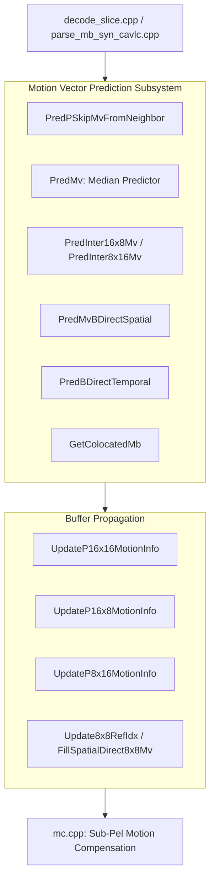
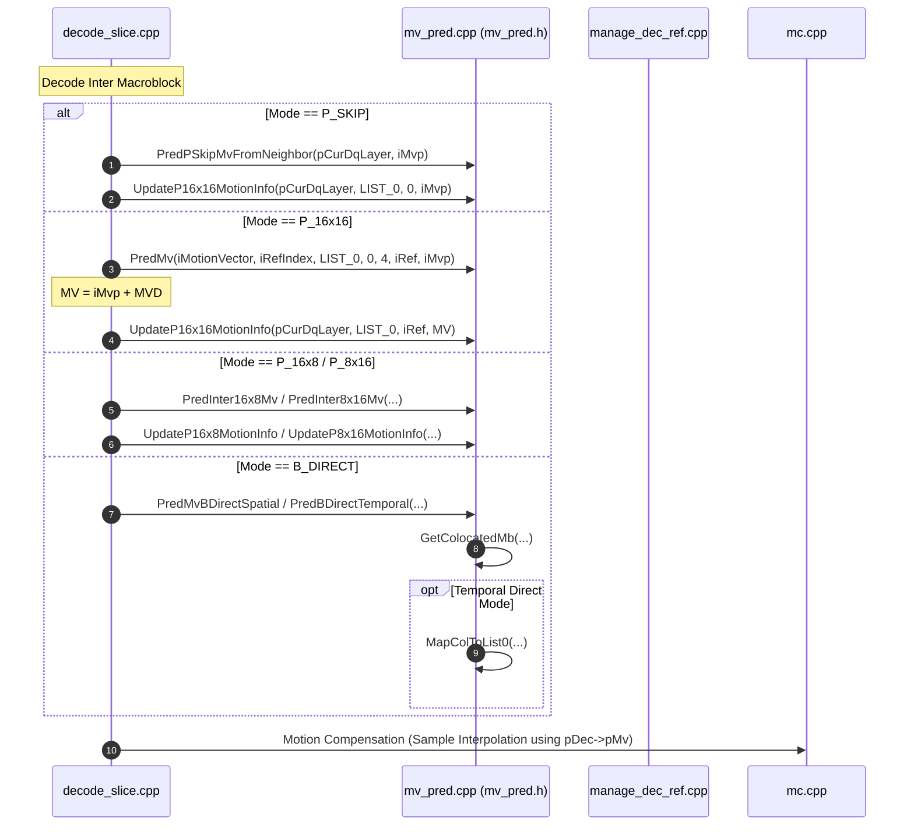

# OpenH264 Decoder: Motion Vector Prediction and Motion Info Caching (`mv_pred.h`)

This document provides a comprehensive, literate-programming-style technical specification of the motion vector prediction (MVP) and macroblock motion caching subsystem declared in [`codec/decoder/core/inc/mv_pred.h`](openh264/codec/decoder/core/inc/mv_pred.h) and implemented in [`codec/decoder/core/src/mv_pred.cpp`](openh264/codec/decoder/core/src/mv_pred.cpp).

---

## Table of Contents
1. [Module Overview & Architectural Purpose](#1-module-overview--architectural-purpose)
2. [H.264 Standard Reference & Algorithmic Background](#2-h264-standard-reference--algorithmic-background)
3. [Memory Layout, Cache Architecture & Indexing Schemes](#3-memory-layout-cache-architecture--indexing-schemes)
4. [Constants, Types, and Macros](#4-constants-types-and-macros)
5. [Deep Dive: Function & Method Reference](#5-deep-dive-function--method-reference)
   - [5.1 Inline Macroblock Type Accessor](#51-inline-macroblock-type-accessor)
   - [5.2 P-Frame Motion Vector Prediction (P_Skip, 16x16, 16x8, 8x16, 8x8, 4x4)](#52-p-frame-motion-vector-prediction)
   - [5.3 B-Frame Direct Mode Prediction (Spatial & Temporal Direct)](#53-b-frame-direct-mode-prediction)
   - [5.4 Macroblock Motion Cache & Buffer Update Routines](#54-macroblock-motion-cache--buffer-update-routines)
6. [Call Graph & Subsystem Interactions](#6-call-graph--subsystem-interactions)

---

## 1. Module Overview & Architectural Purpose

In the H.264 / AVC video decoding pipeline (described in [`overview.md`](openh264/rust/docs/overview.md#25-inter-frame-prediction--motion-compensation)), inter-frame prediction reconstructs macroblock sample blocks using reference picture samples displaced by motion vectors ($MV$). To minimize bitstream overhead, the encoder transmits only Motion Vector Differences ($MVD$), defined as:

$$MVD = MV - MVP$$

The decoder must reconstruct the identical Predicted Motion Vector ($MVP$) using spatial and temporal neighboring partitions before computing the final motion vector:

$$MV = MVP + MVD$$

[`codec/decoder/core/inc/mv_pred.h`](openh264/codec/decoder/core/inc/mv_pred.h) defines the core interfaces for:
1. **Spatial Motion Vector Prediction**: Deriving median and directional $MVP$ values across neighboring partitions ($A$: Left, $B$: Top, $C$: Top-Right / $D$: Top-Left).
2. **Specialized Mode Derivations**: Handling `P_SKIP`, `B_SKIP`, `B_DIRECT_SPATIAL`, and `B_DIRECT_TEMPORAL` prediction modes.
3. **Motion Vector & Reference Index Cache Updates**: Propagating decoded motion vectors ($MV$), motion vector differences ($MVD$), and reference picture indices ($RefIdx$) across macroblock cache buffers (`sMb`) and destination picture buffers (`pDec`).



---

## 2. H.264 Standard Reference & Algorithmic Background

The routines in [`mv_pred.h`](openh264/codec/decoder/core/inc/mv_pred.h) implement the normative decoding processes defined in **ISO/IEC 14496-10 (ITU-T H.264)**:

### 2.1 Median Motion Vector Prediction (H.264 §8.4.1.3.1)
For standard inter blocks, the predictor $MVP = (MVP_x, MVP_y)$ is derived component-wise from three candidate blocks:
* **$A$ (Left)**: Candidate block to the left of the current partition.
* **$B$ (Top)**: Candidate block above the current partition.
* **$C$ (Top-Right)**: Candidate block above-right of the current partition. If $C$ is unavailable (out of picture or out of slice bounds), candidate **$D$ (Top-Left)** replaces $C$.

$$MVP_x = \text{median}(MV_{A,x}, MV_{B,x}, MV_{C,x})$$
$$MVP_y = \text{median}(MV_{A,y}, MV_{B,y}, MV_{C,y})$$

$$\text{median}(x, y, z) = x + y + z - \min(x, \min(y, z)) - \max(x, \max(y, z))$$

#### Directional Match Override:
If only **one** candidate among $\{A, B, C\}$ references the identical reference index as the current partition ($Ref == Ref_X$), the median is bypassed and $MVP = MV_X$.

### 2.2 Directional 16x8 and 8x16 Partitions (H.264 §8.4.1.3)
To capture directional motion efficiently:
* **16x8 Partition 0 (Top)**: Evaluates neighbor $B$ (Top). If $Ref_B == Ref$, $MVP = MV_B$; otherwise median $MVP$.
* **16x8 Partition 1 (Bottom)**: Evaluates neighbor $A$ (Left). If $Ref_A == Ref$, $MVP = MV_A$; otherwise median $MVP$.
* **8x16 Partition 0 (Left)**: Evaluates neighbor $A$ (Left). If $Ref_A == Ref$, $MVP = MV_A$; otherwise median $MVP$.
* **8x16 Partition 1 (Right)**: Evaluates neighbor $C$ (Top-Right, or $D$ Top-Left). If $Ref_C == Ref$, $MVP = MV_C$; otherwise median $MVP$.

### 2.3 P_Skip Macroblocks (H.264 §8.4.1.3.2)
In `P_SKIP` mode, no residual or MVD is transmitted. The motion vector is predicted with the following rules:
1. If neighbor $A$ or neighbor $B$ is unavailable, **or** if either has $Ref == 0$ and $MV == (0, 0)$, $MVP$ is immediately forced to $(0, 0)$:
   $$(A \text{ unavail} \lor (Ref_A == 0 \land MV_A == (0, 0))) \lor (B \text{ unavail} \lor (Ref_B == 0 \land MV_B == (0, 0))) \implies MVP = (0, 0)$$
2. Otherwise, standard median/directional rule is applied with $Ref = 0$.

### 2.4 B-Slice Direct Prediction (H.264 §8.4.1.2)
* **Spatial Direct**: Derives the reference index as the minimum non-negative reference index across available neighbors:
  $$Ref_{L0} = \min^+(Ref_{A,L0}, Ref_{B,L0}, Ref_{C,L0}), \quad Ref_{L1} = \min^+(Ref_{A,L1}, Ref_{B,L1}, Ref_{C,L1})$$
  Includes a co-located zero-MV check: if the co-located partition in `LIST_1[0]` has $Ref_{L0} == 0$ and $|MV_{x}| \le 1, |MV_{y}| \le 1$, $MVP_{LX}$ is forced to $(0,0)$.
* **Temporal Direct**: Scales the co-located motion vector $MV_{\text{col}}$ based on Picture Order Count ($POC$) temporal distances:
  $$MV_{L0} = \frac{\text{DistScaleFactor} \cdot MV_{\text{col}} + 128}{256} = \frac{iMvScale[LIST\_0][Ref_{L0}] \cdot MV_{\text{col}} + 128}{256}$$
  $$MV_{L1} = MV_{L0} - MV_{\text{col}}$$

---

## 3. Memory Layout, Cache Architecture & Indexing Schemes

To achieve high-performance decoding without repeatedly querying neighbor slice boundaries or picture buffers, OpenH264 utilizes two primary scanning arrays defined in [`codec/decoder/core/src/decoder_data_tables.cpp`](openh264/codec/decoder/core/src/decoder_data_tables.cpp) and [`codec/common/src/common_tables.cpp`](openh264/codec/common/src/common_tables.cpp).

### 3.1 4x4 Sub-Block Raster Scan (`g_kuiScan4`)
A 16x16 macroblock consists of 16 4x4 sub-blocks. `g_kuiScan4[16]` maps the partition sub-block index into the 4x4 block scan order used within the macroblock arrays (`pMv`, `pRefIndex`, `pMvd`):

```cpp
const uint8_t g_kuiScan4[16] = {
   0,  1,  4,  5,
   2,  3,  6,  7,
   8,  9, 12, 13,
  10, 11, 14, 15
};
```

Visual Layout of `g_kuiScan4`:
```
+-------+-------+-------+-------+
|   0   |   1   |   4   |   5   |  <- Sub-macroblock 0 (Top-Left)  & Sub-macroblock 1 (Top-Right)
+-------+-------+-------+-------+
|   2   |   3   |   6   |   7   |
+-------+-------+-------+-------+
|   8   |   9   |  12   |  13   |  <- Sub-macroblock 2 (Btm-Left)  & Sub-macroblock 3 (Btm-Right)
+-------+-------+-------+-------+
|  10   |  11   |  14   |  15   |
+-------+-------+-------+-------+
```

### 3.2 30-Element Macroblock Motion Cache (`g_kuiCache30ScanIdx`)
During slice decoding, macroblock-local motion vectors and reference indices are loaded into a 30-element cache (`iMotionVector[LIST_A][30][MV_A]` and `iRefIndex[LIST_A][30]`). This cache encapsulates both the internal 4x4 sub-blocks and the external top/left boundary neighbors:

```cpp
const uint8_t g_kuiCache30ScanIdx[16] = {
   7,  8, 13, 14,
   9, 10, 15, 16,
  19, 20, 25, 26,
  21, 22, 27, 28
};
```

30-Element Cache Coordinate Mapping:
```
Index:   0    1    2    3    4    5
Row 0: [TL] [T0] [T1] [T2] [T3] [TR]   <- Top Neighbors (indices 1..4), Top-Left (0), Top-Right (5)
Row 1: [L0] [ 7] [ 8] [13] [14] [ .]   <- L0 is Left neighbor index 6
Row 2: [L1] [ 9] [10] [15] [16] [ .]   <- L1 is Left neighbor index 12
Row 3: [L2] [19] [20] [25] [26] [ .]   <- L2 is Left neighbor index 18
Row 4: [L3] [21] [22] [27] [28] [ .]   <- L3 is Left neighbor index 24
```

Relative Neighbor Offsets in Cache:
* **Left Neighbor ($A$)**: $\text{CacheIdx} - 1$
* **Top Neighbor ($B$)**: $\text{CacheIdx} - 6$
* **Top-Right Neighbor ($C$)**: $\text{TopIdx} + \text{PartWidth}$
* **Top-Left Neighbor ($D$)**: $\text{TopIdx} - 1$

---

## 4. Constants, Types, and Macros

### 4.1 Constants
Defined in [`codec/decoder/core/inc/mb_cache.h`](openh264/codec/decoder/core/inc/mb_cache.h):

| Constant | Value | Description |
| :--- | :--- | :--- |
| `REF_NOT_AVAIL` | `-2` | Neighboring block is out of picture or slice bounds, or unavailable. |
| `REF_NOT_IN_LIST` | `-1` | Neighboring block is Intra-coded; thus no reference index exists in the reference list. |
| `LIST_0` | `0` | Reference picture List 0 (forward / past prediction). |
| `LIST_1` | `1` | Reference picture List 1 (backward / future prediction in display order). |
| `LIST_A` | `2` | Total number of reference picture lists ($2$). |
| `MV_A` | `2` | Motion vector components ($x = 0$, $y = 1$). |

### 4.2 Error Checking Macro
Defined in [`codec/decoder/core/inc/mv_pred.h`](openh264/codec/decoder/core/inc/mv_pred.h#L47-L50):

```cpp
#define RETURN_ERR_IF_NULL(pRefPic0) \
if ( pRefPic0 == NULL) \
  return GENERATE_ERROR_NO(ERR_LEVEL_MB_DATA, ERR_INFO_INVALID_REF_INDEX)
```
Validates that reference picture pointers retrieved from the DPB are non-null prior to direct motion vector derivation.

---

## 5. Deep Dive: Function & Method Reference

All functions reside within the `WelsDec` namespace.

```
┌────────────────────────────────────────────────────────────────────────┐
│                               WelsDec                                  │
├──────────────────────────────────┬─────────────────────────────────────┤
│ Macroblock Type Accessor         │ GetMbType                           │
├──────────────────────────────────┼─────────────────────────────────────┤
│ Motion Vector Predictors         │ PredPSkipMvFromNeighbor             │
│                                  │ PredMv                              │
│                                  │ PredInter16x8Mv                     │
│                                  │ PredInter8x16Mv                     │
├──────────────────────────────────┼─────────────────────────────────────┤
│ B-Slice Direct Mode Engine       │ GetColocatedMb                      │
│                                  │ PredMvBDirectSpatial                │
│                                  │ PredBDirectTemporal                 │
│                                  │ MapColToList0                       │
├──────────────────────────────────┼─────────────────────────────────────┤
│ Motion Cache & Buffer Updaters   │ UpdateP16x16MotionInfo              │
│                                  │ UpdateP16x16RefIdx                  │
│                                  │ UpdateP16x16MotionOnly              │
│                                  │ UpdateP16x8MotionInfo               │
│                                  │ UpdateP8x16MotionInfo               │
│                                  │ Update8x8RefIdx                     │
│                                  │ FillSpatialDirect8x8Mv              │
│                                  │ FillTemporalDirect8x8Mv             │
└──────────────────────────────────┴─────────────────────────────────────┘
```

---

### 5.1 Inline Macroblock Type Accessor

#### `GetMbType`
[mv_pred.h:L185-L191](openh264/codec/decoder/core/inc/mv_pred.h#L185-L191)

```cpp
inline uint32_t* GetMbType (PDqLayer& pCurDqLayer) {
  if (pCurDqLayer->pDec != NULL) {
    return pCurDqLayer->pDec->pMbType;
  } else {
    return pCurDqLayer->pMbType;
  }
}
```

* **Purpose**: Returns the active pointer to the 32-bit macroblock type array (`pMbType`).
* **Parameters**:
  * `pCurDqLayer` (`PDqLayer&`): Reference to the current spatial dependency layer context ([SDqLayer](openh264/codec/decoder/core/inc/decoder_core.h)).
* **Return Value**: `uint32_t*` pointer to the macroblock types array.
* **Logic**: If the current reconstructed picture structure `pCurDqLayer->pDec` is allocated, it returns `pDec->pMbType`; otherwise it returns the layer's scratch buffer `pCurDqLayer->pMbType`.

---

### 5.2 P-Frame Motion Vector Prediction

#### `PredPSkipMvFromNeighbor`
[mv_pred.h:L98](openh264/codec/decoder/core/inc/mv_pred.h#L98) / [mv_pred.cpp:L158-L308](openh264/codec/decoder/core/src/mv_pred.cpp#L158-L308)

```cpp
void PredPSkipMvFromNeighbor (PDqLayer pCurDqLayer, int16_t iMvp[2]);
```

* **Purpose**: Computes the predicted motion vector $MVP = (MVP_x, MVP_y)$ for a `P_SKIP` macroblock in List 0 according to H.264 §8.4.1.3.2.
* **Parameters**:
  * `pCurDqLayer` (`PDqLayer`): Spatial dependency layer context containing slice IDCs, MB types, reference indices, and motion vector arrays.
  * `iMvp` (`int16_t[2]`): Output array where $(MVP_x, MVP_y)$ is written.
* **Algorithmic Flow**:
  1. **Neighbor Boundary Analysis**: Evaluates whether Left ($A$), Top ($B$), Top-Right ($C$), and Top-Left ($D$) macroblocks belong to the identical slice (`pSliceIdc[iNeighborXy] == pSliceIdc[iCurXy]`).
  2. **Inter / Intra Inspection**:
     * If a neighbor is unavailable: $Ref = \text{REF\_NOT\_AVAIL} (-2)$, $MV = (0, 0)$.
     * If a neighbor is Intra: $Ref = \text{REF\_NOT\_IN\_LIST} (-1)$, $MV = (0, 0)$.
     * If a neighbor is Inter: reads candidate MV and RefIdx from sub-block corners (Left uses block 3, Top uses block 12, Top-Right uses block 12, Top-Left uses block 15).
  3. **Zero-MV Early Termination Rule**:
     $$\text{If } (Ref_A == \text{REF\_NOT\_AVAIL} \lor (Ref_A == 0 \land MV_A == (0,0))) \lor (Ref_B == \text{REF\_NOT\_AVAIL} \lor (Ref_B == 0 \land MV_B == (0,0)))$$
     $$\implies \text{Store } (0, 0) \text{ into } iMvp \text{ and return immediately.}$$
  4. **Single-Match vs Median Fallback**:
     * Count matches where $Ref_X == 0$.
     * If `match_count == 1`, $MVP$ takes the matching neighbor's motion vector.
     * Otherwise, $MVP = (\text{WelsMedian}(MV_{A,x}, MV_{B,x}, MV_{C,x}), \text{WelsMedian}(MV_{A,y}, MV_{B,y}, MV_{C,y}))$.

---

#### `PredMv`
[mv_pred.h:L132-L133](openh264/codec/decoder/core/inc/mv_pred.h#L132-L133) / [mv_pred.cpp:L706-L752](openh264/codec/decoder/core/src/mv_pred.cpp#L706-L752)

```cpp
void PredMv (int16_t iMotionVector[LIST_A][30][MV_A], int8_t iRefIndex[LIST_A][30],
             int32_t listIdx, int32_t iPartIdx, int32_t iPartWidth, int8_t iRef, int16_t iMVP[2]);
```

* **Purpose**: General median motion vector prediction kernel for 4x4, 8x8, or 16x16 block partitions using the 30-element motion cache.
* **Parameters**:
  * `iMotionVector` (`int16_t[LIST_A][30][MV_A]`): 30-element cache of motion vectors.
  * `iRefIndex` (`int8_t[LIST_A][30]`): 30-element cache of reference picture indices.
  * `listIdx` (`int32_t`): Reference picture list index (`LIST_0` or `LIST_1`).
  * `iPartIdx` (`int32_t`): Partition index within the macroblock ($0 \dots 15$).
  * `iPartWidth` (`int32_t`): Partition width in 4x4 units ($4$ for 16-pixel width, $2$ for 8-pixel width, $1$ for 4-pixel width).
  * `iRef` (`int8_t`): Target reference picture index for the current partition.
  * `iMVP` (`int16_t[2]`): Output buffer for predicted motion vector $(MVP_x, MVP_y)$.
* **Mathematical Operations**:
  * Locates cache indices:
    $$kuiLeftIdx = \text{g\_kuiCache30ScanIdx}[iPartIdx] - 1$$
    $$kuiTopIdx = \text{g\_kuiCache30ScanIdx}[iPartIdx] - 6$$
    $$kuiRightTopIdx = kuiTopIdx + iPartWidth$$
    $$kuiLeftTopIdx = kuiTopIdx - 1$$
  * If $Ref_{C} == \text{REF\_NOT\_AVAIL}$, substitutes Top-Left neighbor $D$ for $C$.
  * If only Left is valid and Top & Diagonal are unavailable: returns $MV_A$.
  * Counts matches where candidate reference index equals `iRef`.
    * If exactly 1 match: copies that candidate's MV.
    * Otherwise: computes median via `WelsMedian`.

---

#### `PredInter16x8Mv` and `PredInter8x16Mv`
[mv_pred.h:L140-L149](openh264/codec/decoder/core/inc/mv_pred.h#L140-L149) / [mv_pred.cpp:L753-L793](openh264/codec/decoder/core/src/mv_pred.cpp#L753-L793)

```cpp
void PredInter16x8Mv (int16_t iMotionVector[LIST_A][30][MV_A], int8_t iRefIndex[LIST_A][30],
                      int32_t listIdx, int32_t iPartIdx, int8_t iRef, int16_t iMVP[2]);

void PredInter8x16Mv (int16_t iMotionVector[LIST_A][30][MV_A], int8_t iRefIndex[LIST_A][30],
                      int32_t listIdx, int32_t iPartIdx, int8_t iRef, int16_t iMVP[2]);
```

* **Purpose**: Specialized directional motion predictors for 16x8 and 8x16 macroblock partitions (H.264 §8.4.1.3).
* **Partition Rules**:
  * **`PredInter16x8Mv`**:
    * If `iPartIdx == 0` (Top partition): checks Top neighbor at cache index 1. If $Ref_B == iRef \implies MVP = MV_B$.
    * If `iPartIdx == 8` (Bottom partition): checks Left neighbor at cache index 18. If $Ref_A == iRef \implies MVP = MV_A$.
    * Fallback: calls `PredMv(..., iPartWidth = 4, ...)`.
  * **`PredInter8x16Mv`**:
    * If `iPartIdx == 0` (Left partition): checks Left neighbor at cache index 6. If $Ref_A == iRef \implies MVP = MV_A$.
    * If `iPartIdx == 1` (Right partition): checks Top-Right neighbor at cache index 5 (or Top-Left at index 2 if unavailable). If matching $\implies MVP = MV_C$.
    * Fallback: calls `PredMv(..., iPartWidth = 2, ...)`.

---

### 5.3 B-Frame Direct Mode Prediction

#### `GetColocatedMb`
[mv_pred.h:L113](openh264/codec/decoder/core/inc/mv_pred.h#L113) / [mv_pred.cpp:L310-L390](openh264/codec/decoder/core/src/mv_pred.cpp#L310-L390)

```cpp
int32_t GetColocatedMb (PWelsDecoderContext pCtx, MbType& mbType, SubMbType& subMbType);
```

* **Purpose**: Retrieves the co-located macroblock from the forward reference picture (`pCtx->sRefPic.pRefList[LIST_1][0]`) and populates the co-located motion fields (`iColocIntra`, `iColocMv`, `iColocRefIndex`) in `pCurDqLayer`.
* **Multi-Threading Synchronization**:
  When multi-threaded slice decoding is active (`GetThreadCount(pCtx) > 1`), it inspects the row progress of the co-located picture. If the co-located row is not yet decoded, it synchronizes execution via:
  ```cpp
  WAIT_EVENT (&colocPic->pReadyEvent[pCurDqLayer->iMbY], WELS_DEC_THREAD_WAIT_INFINITE);
  ```
* **Error Handling**:
  If `colocPic == NULL`, logs an error and returns `GENERATE_ERROR_NO(ERR_LEVEL_SLICE_DATA, ERR_INFO_REFERENCE_PIC_LOST)`.
* **Direct 8x8 Inference Handling**:
  Depending on `pSps->bDirect8x8InferenceFlag`, sub-block motion vectors are either copied directly (4x4 granularity) or subsampled/broadcasted from 8x8 corner samples using `SetRectBlock` or `CopyRectBlock4Cols`.

---

#### `PredMvBDirectSpatial`
[mv_pred.h:L105-L106](openh264/codec/decoder/core/inc/mv_pred.h#L105-L106) / [mv_pred.cpp:L392-L611](openh264/codec/decoder/core/src/mv_pred.cpp#L392-L611)

```cpp
int32_t PredMvBDirectSpatial (PWelsDecoderContext pCtx, int16_t iMvp[LIST_A][2], int8_t ref[LIST_A],
                              SubMbType& subMbType);
```

* **Purpose**: Calculates spatial direct motion vectors and reference indices for B slices (H.264 §8.4.1.2.2).
* **Return Value**: `ERR_NONE` on success, or an error code if `GetColocatedMb` fails.
* **Algorithmic Flow**:
  1. Invokes `GetColocatedMb` to extract co-located motion properties.
  2. Extracts neighbor reference indices ($Ref_A, Ref_B, Ref_C$) for both `LIST_0` and `LIST_1`.
  3. Derives the active reference index for each list as the minimum non-negative neighbor reference index:
     $$ref[listIdx] = \text{WELS\_MIN\_POSITIVE}(Ref_A, \text{WELS\_MIN\_POSITIVE}(Ref_B, Ref_{\text{diag}}))$$
  4. Derives $iMvp[listIdx]$ via median or single-match predictor across matching neighbors.
  5. **Co-located Zero-MV Clamping Rule**:
     If co-located picture is not a long-term reference (`!bIsLongRef`), co-located partition is Inter (`!iColocIntra`), and co-located motion vector satisfies:
     $$Ref_{\text{coloc}} == 0 \quad \text{and} \quad |MV_{\text{coloc}, x}| \le 1 \quad \text{and} \quad |MV_{\text{coloc}, y}| \le 1$$
     then if $ref[listIdx] == 0$, $iMvp[listIdx]$ is clamped to $(0,0)$.
  6. Updates CABAC context and macroblock buffers (`UpdateP16x16MotionInfo` or `FillSpatialDirect8x8Mv`).

---

#### `PredBDirectTemporal`
[mv_pred.h:L118-L119](openh264/codec/decoder/core/inc/mv_pred.h#L118-L119) / [mv_pred.cpp:L613-L703](openh264/codec/decoder/core/src/mv_pred.cpp#L613-L703)

```cpp
int32_t PredBDirectTemporal (PWelsDecoderContext pCtx, int16_t iMvp[LIST_A][2], int8_t ref[LIST_A],
                             SubMbType& subMbType);
```

* **Purpose**: Calculates temporal direct motion vectors for B slices (H.264 §8.4.1.2.3) using POC scaling factors.
* **Return Value**: `ERR_NONE` on success, or an error code.
* **Algorithmic Flow**:
  1. Sets reference indices: $ref[LIST\_0] = 0$ (or mapped via `MapColToList0`), $ref[LIST\_1] = 0$.
  2. If co-located block is Intra: sets $iMvp[LIST\_0] = (0,0)$ and $iMvp[LIST\_1] = (0,0)$.
  3. If co-located block is Inter: reads co-located motion vector $mv = (mv_x, mv_y)$ and scales:
     $$iMvp[LIST\_0][0] = (iMvScale[LIST\_0][ref[LIST\_0]] \cdot mv[0] + 128) \gg 8$$
     $$iMvp[LIST\_0][1] = (iMvScale[LIST\_0][ref[LIST\_0]] \cdot mv[1] + 128) \gg 8$$
     $$iMvp[LIST\_1][0] = iMvp[LIST\_0][0] - mv[0]$$
     $$iMvp[LIST\_1][1] = iMvp[LIST\_0][1] - mv[1]$$
  4. Broadcasts motion vectors to slice buffers (`UpdateP16x16MotionOnly` or `FillTemporalDirect8x8Mv`).

---

#### `MapColToList0`
[mv_pred.h:L175-L176](openh264/codec/decoder/core/inc/mv_pred.h#L175-L176) / [mv_pred.cpp:L1158-L1174](openh264/codec/decoder/core/src/mv_pred.cpp#L1158-L1174)

```cpp
int8_t MapColToList0 (PWelsDecoderContext& pCtx, const int8_t& colocRefIndexL0,
                      const int32_t& ref0Count);
```

* **Purpose**: Implements H.264 Equation 8-193. Maps the co-located picture's List 0 reference index into the current picture's List 0 reference list by matching Picture Order Count ($POC$).
* **Logic**:
  1. Checks if reference pictures were lost (`(pCtx->iErrorCode & dsRefLost) == dsRefLost`); returns 0 if true.
  2. Retrieves the target reference picture POC:
     $$iFramePoc = pic1\text{->}pRefPic[LIST\_0][colocRefIndexL0]\text{->}iFramePoc$$
  3. Scans current List 0 reference frames ($i = 0 \dots ref0Count-1$). When `pRefList[LIST_0][i]->iFramePoc == iFramePoc`, returns `i`.
  4. Defaults to `0` if no matching POC is found.

---

### 5.4 Macroblock Motion Cache & Buffer Update Routines

To accelerate macroblock updates, OpenH264 avoids individual byte-by-byte assignments by utilizing 16-bit, 32-bit, and 64-bit packed stores defined in [`codec/common/inc/ls_defines.h`](openh264/codec/common/inc/ls_defines.h):
* `ST16(ptr, val)`: Stores 2 reference indices simultaneously as a 16-bit integer (`kiRef2 = (iRef << 8) | iRef`).
* `ST32(ptr, val)`: Stores a 32-bit packed motion vector $(MV_x, MV_y)$ containing both 16-bit components.
* `ST64(ptr, val)`: Stores two 32-bit motion vectors (or four 16-bit integers) in a single 64-bit store operation.

#### Summary of Buffer Update Functions

| Function | Partition Target | Buffers Updated | Store Optimizations |
| :--- | :--- | :--- | :--- |
| `UpdateP16x16MotionInfo` | 16x16 (Full MB) | `pDec->pRefIndex`, `pDec->pMv` | `ST16` (Ref), `ST32` (MV) across all 16 sub-blocks |
| `UpdateP16x16RefIdx` | 16x16 (Full MB) | `pDec->pRefIndex` | `ST16` (Ref) broadcast across 16 sub-blocks |
| `UpdateP16x16MotionOnly` | 16x16 (Full MB) | `pDec->pMv` | `ST32` (MV) broadcast across 16 sub-blocks |
| `UpdateP16x8MotionInfo` | 16x8 Partition | `pDec->pRefIndex`, `pDec->pMv`, `iRefIndex`, `iMotionVector` | Dual update of MB picture buffer + 30-element cache |
| `UpdateP8x16MotionInfo` | 8x16 Partition | `pDec->pRefIndex`, `pDec->pMv`, `iRefIndex`, `iMotionVector` | Dual update of MB picture buffer + 30-element cache |
| `Update8x8RefIdx` | 8x8 Partition | `pDec->pRefIndex` | Updates 4 sub-blocks at indices `iScan4Idx + {0, 1, 4, 5}` |
| `FillSpatialDirect8x8Mv` | 8x8 / 4x4 Direct | `pDec->pMv`, `pMvd`, `pMotionVector`, `pMvdCache` | Fills direct spatial MVs and zeroes out MVD cache |
| `FillTemporalDirect8x8Mv`| 8x8 / 4x4 Direct | `pDec->pMv`, `pMvd`, `pMotionVector`, `pMvdCache` | Scales and fills direct temporal MVs, zeroes MVD |

---

## 6. Call Graph & Subsystem Interactions

The following diagram illustrates how the functions declared in [`mv_pred.h`](openh264/codec/decoder/core/inc/mv_pred.h) integrate into the top-level slice decoding and macroblock reconstruction loops:



---

## 7. Source Code File Reference

* Primary Header: [`codec/decoder/core/inc/mv_pred.h`](openh264/codec/decoder/core/inc/mv_pred.h)
* Implementation Source: [`codec/decoder/core/src/mv_pred.cpp`](openh264/codec/decoder/core/src/mv_pred.cpp)
* Macroblock Cache Definitions: [`codec/decoder/core/inc/mb_cache.h`](openh264/codec/decoder/core/inc/mb_cache.h)
* Fast Load/Store Packed Operations: [`codec/common/inc/ls_defines.h`](openh264/codec/common/inc/ls_defines.h)
* Data Scanning Tables: [`codec/decoder/core/src/decoder_data_tables.cpp`](openh264/codec/decoder/core/src/decoder_data_tables.cpp) and [`codec/common/src/common_tables.cpp`](openh264/codec/common/src/common_tables.cpp)
