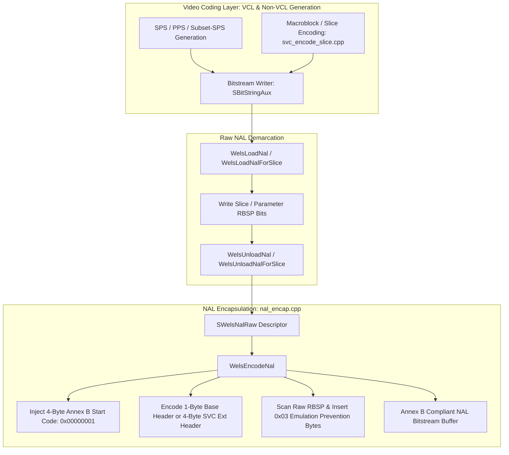
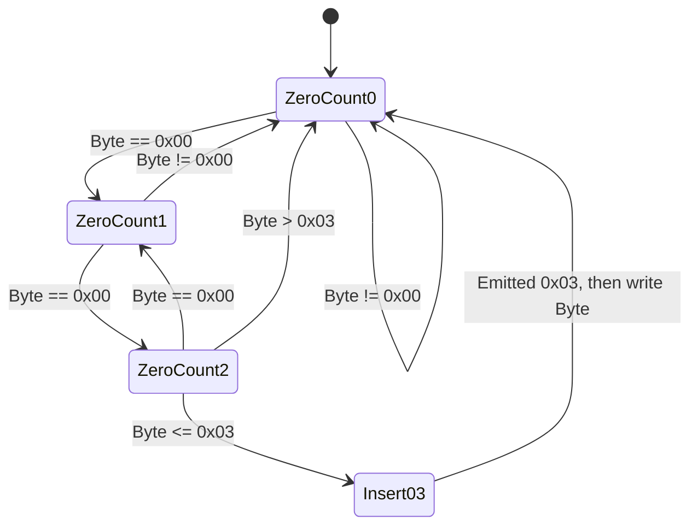
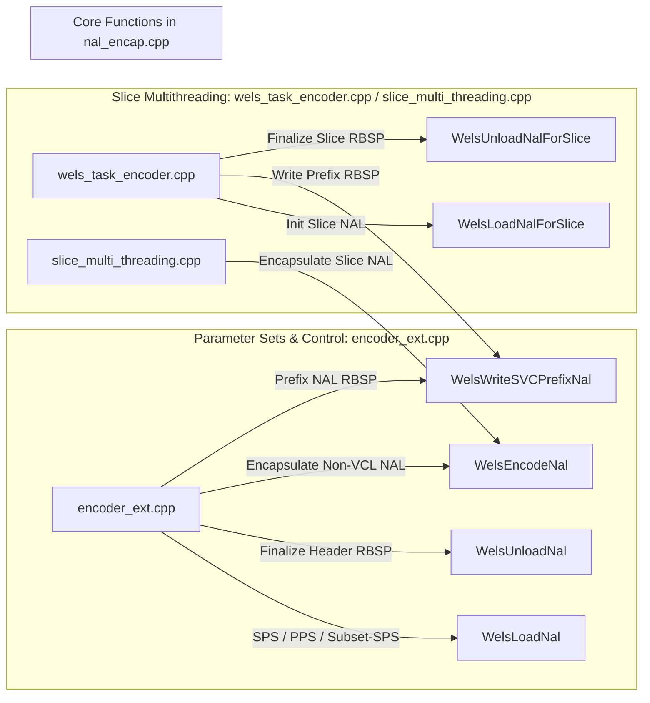

# OpenH264 Encoder: NAL Unit Encapsulation Engine (`nal_encap.cpp`)

This document provides a comprehensive, literate-programming-style technical analysis of [codec/encoder/core/src/nal_encap.cpp](openh264/codec/encoder/core/src/nal_encap.cpp) and its companion header [codec/encoder/core/inc/nal_encap.h](openh264/codec/encoder/core/inc/nal_encap.h). It details the Network Abstraction Layer (NAL) unit packetization and encapsulation pipeline, covering start code prefix insertion, standard AVC and SVC extension NAL header construction, emulation prevention three-byte escape processing (`0x000003`), buffer capacity bounds verification, and slice-level vs. frame-level bitstream container synchronization.

---

## Table of Contents
1. [Module Architecture & Pipeline Role](#1-module-architecture--pipeline-role)
2. [Data Structures, Types, and Constants](#2-data-structures-types-and-constants)
   - [2.1 `SWelsNalRaw` (`TagWelsNalRaw`)](#21-swelsnalraw-tagwelsnalraw)
   - [2.2 `SWelsEncoderOutput` (`TagWelsEncoderOutput`)](#22-swelsencoderoutput-tagwelsencoderoutput)
   - [2.3 `SWelsSliceBs` (`TagWelsSliceBs`)](#23-swelsslicebs-tagwelsslicebs)
   - [2.4 `SNalUnitHeader` (`TagNalUnitHeader`)](#24-snalunitheader-tagnalunitheader)
   - [2.5 `SNalUnitHeaderExt` (`TagNalUnitHeaderExt`)](#25-snalunitheaderext-tagnalunitheaderext)
   - [2.6 Constants, Bitmasks, and Error Codes](#26-constants-bitmasks-and-error-codes)
3. [Deep-Dive Function Analysis](#3-deep-dive-function-analysis)
   - [3.1 `WelsLoadNal`](#31-welsloadnal)
   - [3.2 `WelsUnloadNal`](#32-welsunloadnal)
   - [3.3 `WelsLoadNalForSlice`](#33-welsloadnalforslice)
   - [3.4 `WelsUnloadNalForSlice`](#34-welsunloadnalforslice)
   - [3.5 `WelsEncodeNal`](#35-welsencodenal)
   - [3.6 `WelsWriteSVCPrefixNal`](#36-welswritesvcprefixnal)
4. [Algorithmic Foundations & Bitstream Mechanics](#4-algorithmic-foundations--bitstream-mechanics)
   - [4.1 RBSP to EBSP / NAL Transformation](#41-rbsp-to-ebsp--nal-transformation)
   - [4.2 Emulation Prevention State Machine](#42-emulation-prevention-state-machine)
   - [4.3 Buffer Allocation & Worst-Case Expansion Analysis](#43-buffer-allocation--worst-case-expansion-analysis)
5. [Call Graph & Subsystem Interactions](#5-call-graph--subsystem-interactions)

---

## 1. Module Architecture & Pipeline Role

In the ITU-T H.264 / AVC and Annex G (SVC) video coding specifications, the video coding layer (VCL) produces raw macroblock syntax elements, transform coefficients, and headers, which are packed into a Raw Byte Sequence Payload (RBSP). The role of the **NAL Encapsulation Engine** in [nal_encap.cpp](openh264/codec/encoder/core/src/nal_encap.cpp) is to transform these raw RBSP bitstreams into standard-compliant Encapsulated Byte Sequence Payloads (EBSP) packaged inside Network Abstraction Layer (NAL) units.



### Key Responsibilities
1. **Raw NAL Tracking (`WelsLoadNal` / `WelsLoadNalForSlice`)**: Records the starting byte position in the underlying bitstream buffer (`pBsBuffer`) and initializes the NAL header metadata (`eNalUnitType`, `uiNalRefIdc`, and `uiForbiddenZeroBit`).
2. **Raw NAL Finalization (`WelsUnloadNal` / `WelsUnloadNalForSlice`)**: Queries the current bit writer offset (`BsGetBitsPos`), calculates the exact unescaped payload byte count (`iPayloadSize`), and increments the active NAL index.
3. **Annex B Start Code Generation**: Prepend the 4-byte start code prefix `0x00 0x00 0x00 0x01` using optimized 32-bit memory store macros (`ST32`).
4. **Header Synthesis**: Encodes the 1-byte standard AVC NAL unit header or the 4-byte SVC extended NAL header (`NAL_UNIT_PREFIX` or `NAL_UNIT_CODED_SLICE_EXT`).
5. **Emulation Prevention Escaping**: Inspects the RBSP byte sequence. Whenever two consecutive zero bytes (`0x00 0x00`) are followed by a byte less than or equal to `0x03` (`0x00`, `0x01`, `0x02`, or `0x03`), it injects an emulation prevention byte `0x03` to prevent downstream demuxers from misidentifying payload data as an Annex B start code prefix.
6. **SVC Prefix NAL Construction (`WelsWriteSVCPrefixNal`)**: Encodes the RBSP syntax for SVC Prefix NAL units (`NAL_UNIT_PREFIX`), enabling single-layer decoders to ignore SVC extensions while signaling base-layer reference picture properties.

---

## 2. Data Structures, Types, and Constants

### 2.1 `SWelsNalRaw` (`TagWelsNalRaw`)

Defined in [nal_encap.h:L56-L63](openh264/codec/encoder/core/inc/nal_encap.h#L56-L63), `SWelsNalRaw` serves as the primary descriptor for an individual un-escaped NAL unit payload before encapsulation.

```cpp
typedef struct TagWelsNalRaw {
  uint8_t*          pRawData;     // Pointer to raw RBSP payload in the bitstream buffer
  int32_t           iPayloadSize; // Byte size of unescaped raw RBSP payload
  SNalUnitHeaderExt sNalExt;      // Base NAL header and SVC extension header metadata
  int32_t           iStartPos;    // Byte offset in the bitstream buffer where this NAL started
} SWelsNalRaw;
```

#### Field Details
| Field | Type | Description |
| :--- | :--- | :--- |
| `pRawData` | `uint8_t*` | Direct pointer into `pBsBuffer` pointing to the first byte of unescaped RBSP payload data. |
| `iPayloadSize` | `int32_t` | Total length (in bytes) of the raw RBSP payload for this NAL unit ($iPayloadSize = \text{EndPos} - \text{StartPos}$). |
| `sNalExt` | [SNalUnitHeaderExt](openh264/codec/common/inc/wels_common_defs.h#L253-L272) | Contains base NAL header parameters (`uiForbiddenZeroBit`, `uiNalRefIdc`, `eNalUnitType`) and SVC extension flags (`bIdrFlag`, `uiDependencyId`, `uiTemporalId`, `bDiscardableFlag`, etc.). |
| `iStartPos` | `int32_t` | Byte offset within the container's bitstream allocation (`pBsBuffer`) corresponding to the start of this NAL's raw payload. |

---

### 2.2 `SWelsEncoderOutput` (`TagWelsEncoderOutput`)

Defined in [nal_encap.h:L68-L82](openh264/codec/encoder/core/inc/nal_encap.h#L68-L82), `SWelsEncoderOutput` manages the frame-level bitstream buffer allocation and the sequence of NAL units generated for an entire coded picture.

```cpp
typedef struct TagWelsEncoderOutput {
  uint8_t*        pBsBuffer;      // Bitstream buffer allocation for coded picture
  uint32_t        uiSize;         // Allocated capacity of pBsBuffer in bytes
  SBitStringAux   sBsWrite;       // Frame-level bitstream writer state machine
  SWelsNalRaw*    sNalList;       // Array of raw NAL descriptors for the current picture
  int32_t*        pNalLen;        // Output array storing encapsulated byte lengths of each NAL
  int32_t         iCountNals;     // Total number of allocated NAL descriptors in sNalList
  int32_t         iNalIndex;      // Index of the NAL currently being written / processed (0-based)
  int32_t         iLayerBsIndex;  // Dependency layer index for SFrameBsInfo mapping
} SWelsEncoderOutput;
```

#### Field Details
| Field | Type | Description |
| :--- | :--- | :--- |
| `pBsBuffer` | `uint8_t*` | Continuous heap memory buffer where raw RBSP bits for all non-VCL and VCL NALs of a frame are written. |
| `uiSize` | `uint32_t` | Total allocated byte capacity of `pBsBuffer`. |
| `sBsWrite` | [SBitStringAux](openh264/codec/common/inc/wels_common_defs.h#L235-L242) | Bit writer tracking current byte pointer `pCurBuf`, buffer start `pStartBuf`, buffer end `pEndBuf`, current bit accumulator `uiCurBits`, and remaining bits `iLeftBits`. |
| `sNalList` | `SWelsNalRaw*` | Dynamic or static array of [SWelsNalRaw](openh264/codec/encoder/core/inc/nal_encap.h#L56-L63) structures holding descriptor state for each NAL in the frame. |
| `pNalLen` | `int32_t*` | Array populated with the final byte lengths of each encapsulated NAL unit after `WelsEncodeNal`. |
| `iCountNals` | `int32_t` | Maximum capacity of NAL units that can be stored in `sNalList`. |
| `iNalIndex` | `int32_t` | Monotonically increasing index tracking the current NAL slot being loaded, written, or unloaded. |
| `iLayerBsIndex` | `int32_t` | Layer index used when assembling layer-specific bitstream descriptors in `SFrameBsInfo`. |

---

### 2.3 `SWelsSliceBs` (`TagWelsSliceBs`)

Defined in [nal_encap.h:L86-L104](openh264/codec/encoder/core/inc/nal_encap.h#L86-L104), `SWelsSliceBs` encapsulates slice-level bitstream generation. It is specifically used in multi-threaded slice encoding tasks where worker threads independently encode slices in parallel.

```cpp
typedef struct TagWelsSliceBs {
  uint8_t*        pBs;            // Output destination bitstream buffer
  uint32_t        uiBsSize;       // Capacity of pBs buffer in bytes
  uint32_t        uiBsPos;        // Current write offset position in pBs
  uint8_t*        pBsBuffer;      // Local raw bitstream buffer allocation for coded slice
  uint32_t        uiSize;         // Allocated capacity of pBsBuffer in bytes
  SBitStringAux   sBsWrite;       // Slice-level bitstream writer state machine
  SWelsNalRaw     sNalList[2];    // Fixed array of 2 NAL slots: [0] Prefix NAL, [1] Slice NAL
  int32_t         iNalLen[2];     // Encapsulated byte lengths of Prefix NAL and Slice NAL
  int32_t         iNalIndex;      // Active NAL index (0 or 1)
} SWelsSliceBs;
```

#### Multi-Threaded Slice Layout
In slice multi-threading, each slice worker is allocated an `SWelsSliceBs`. Because an SVC slice may optionally require a Prefix NAL unit (`NAL_UNIT_PREFIX`) immediately preceding the slice VCL NAL unit (`NAL_UNIT_CODED_SLICE` or `NAL_UNIT_CODED_SLICE_EXT`), `sNalList` is fixed to an array of size 2:
- `sNalList[0]`: Optional SVC Prefix NAL unit.
- `sNalList[1]`: Slice VCL NAL unit.

---

### 2.4 `SNalUnitHeader` (`TagNalUnitHeader`)

Defined in [codec/common/inc/wels_common_defs.h:L245-L250](openh264/codec/common/inc/wels_common_defs.h#L245-L250), `SNalUnitHeader` represents the standard 1-byte AVC NAL header.

```cpp
typedef struct TagNalUnitHeader {
  uint8_t          uiForbiddenZeroBit; // 1 bit: forbidden_zero_bit (must always be 0)
  uint8_t          uiNalRefIdc;        // 2 bits: nal_ref_idc (reference picture priority)
  EWelsNalUnitType eNalUnitType;       // 5 bits: nal_unit_type
  uint8_t          uiReservedOneByte;  // Padding byte for 32-bit struct alignment
} SNalUnitHeader, *PNalUnitHeader;
```

#### Bit Layout of 1-Byte Base NAL Header
$$\begin{array}{|c|c|c|}
\hline
\text{Bit 7} & \text{Bits 6..5} & \text{Bits 4..0} \\
\hline
\text{forbidden\_zero\_bit (0)} & \text{nal\_ref\_idc (0..3)} & \text{nal\_unit\_type (1..31)} \\
\hline
\end{array}$$

Packed representation:
$$\text{HeaderByte} = (\text{uiForbiddenZeroBit} \ll 7) \mid (\text{uiNalRefIdc} \ll 5) \mid (\text{eNalUnitType} \ \& \ 0\text{x}1\text{F})$$

---

### 2.5 `SNalUnitHeaderExt` (`TagNalUnitHeaderExt`)

Defined in [codec/common/inc/wels_common_defs.h:L253-L272](openh264/codec/common/inc/wels_common_defs.h#L253-L272), `SNalUnitHeaderExt` specifies the 3-byte extension header defined in H.264 Annex G for SVC NAL unit types (`NAL_UNIT_PREFIX` = 14 and `NAL_UNIT_CODED_SLICE_EXT` = 20).

```cpp
typedef struct TagNalUnitHeaderExt {
  SNalUnitHeader sNalUnitHeader;        // Base 1-byte NAL header structure
  bool           bIdrFlag;              // 1 bit: idr_flag (indicates IDR picture in layer)
  uint8_t        uiPriorityId;          // 6 bits: priority_id
  int8_t         iNoInterLayerPredFlag; // 1 bit: no_inter_layer_pred_flag
  uint8_t        uiDependencyId;        // 3 bits: dependency_id (spatial layer index)
  uint8_t        uiQualityId;           // 4 bits: quality_id (quality layer index)
  uint8_t        uiTemporalId;          // 3 bits: temporal_id (temporal layer index)
  bool           bUseRefBasePicFlag;    // 1 bit: use_ref_base_pic_flag
  bool           bDiscardableFlag;      // 1 bit: discardable_flag
  bool           bOutputFlag;           // 1 bit: output_flag
  uint8_t        uiReservedThree2Bits;  // 2 bits: reserved_three_2bits (must equal 3 = 11b)
  uint8_t        uiLayerDqId;           // Derived: (uiDependencyId << 4) | uiQualityId
  bool           bNalExtFlag;           // Flag indicating presence of extension header
} SNalUnitHeaderExt, *PNalUnitHeaderExt;
```

#### Bit Layout of 3-Byte SVC Extension Header
$$\begin{array}{|l|c|l|}
\hline
\textbf{Byte} & \textbf{Bit Range} & \textbf{Syntax Element / Value} \\
\hline
\text{Ext Byte 1} & \text{Bit 7} & \text{reserved\_one\_bit (1b)} \\
& \text{Bit 6} & \text{idr\_flag} \\
& \text{Bits 5..0} & \text{priority\_id (default 0)} \\
\hline
\text{Ext Byte 2} & \text{Bit 7} & \text{no\_inter\_layer\_pred\_flag (1b)} \\
& \text{Bits 6..4} & \text{dependency\_id} \\
& \text{Bits 3..0} & \text{quality\_id (default 0)} \\
\hline
\text{Ext Byte 3} & \text{Bits 7..5} & \text{temporal\_id} \\
& \text{Bit 4} & \text{use\_ref\_base\_pic\_flag (default 0)} \\
& \text{Bit 3} & \text{discardable\_flag} \\
& \text{Bit 2} & \text{output\_flag (default 1)} \\
& \text{Bits 1..0} & \text{reserved\_three\_2bits (11b)} \\
\hline
\end{array}$$

---

### 2.6 Constants, Bitmasks, and Error Codes

| Constant / Macro | Value | Location / Purpose |
| :--- | :--- | :--- |
| `NAL_HEADER_SIZE` | `4` | [nal_encap.h:L52](openh264/codec/encoder/core/inc/nal_encap.h#L52). Byte size of 4-byte Annex B start code prefix (`0x00 00 00 01`). |
| `ENC_RETURN_SUCCESS` | `0` (`0x00000000`) | Defined in [typedefs.h](openh264/codec/api/wels/typedefs.h). Indicates successful NAL encapsulation. |
| `ENC_RETURN_UNEXPECTED` | `-1` | Returned when invalid or non-positive assumed NAL length is detected (`iAssumedNeededLength <= 0`). |
| `ENC_RETURN_MEMALLOCERR` | `-1` / non-zero | Returned when destination buffer capacity `kiDstBufferLen` is smaller than worst-case escaped NAL requirement. |
| `NAL_UNIT_PREFIX` | `14` | SVC Prefix NAL unit type. Triggers 4-byte extended NAL header encoding. |
| `NAL_UNIT_CODED_SLICE_EXT` | `20` | SVC Coded Slice Extension NAL unit type. Triggers 4-byte extended NAL header encoding. |
| `NAL_UNIT_CODED_SLICE` | `1` | Standard non-IDR slice NAL unit type. |
| `NAL_UNIT_CODED_SLICE_IDR`| `5` | Standard IDR slice NAL unit type. |
| `NAL_UNIT_SEI` | `6` | Supplemental Enhancement Information NAL unit type. |
| `NAL_UNIT_SPS` | `7` | Sequence Parameter Set NAL unit type. |
| `NAL_UNIT_PPS` | `8` | Picture Parameter Set NAL unit type. |
| `NAL_UNIT_SUBSET_SPS` | `15` | Subset Sequence Parameter Set NAL unit type. |
| `NRI_PRI_HIGHEST` | `3` (`11b`) | Highest reference priority (used for SPS, PPS, IDR slices). |
| `NRI_PRI_HIGH` | `2` (`10b`) | High reference priority (used for reference frames / temporal base). |
| `NRI_PRI_LOW` | `1` (`01b`) | Low reference priority. |
| `NRI_PRI_LOWEST` | `0` (`00b`) | Non-reference picture / disposable NAL unit. |

---

## 3. Deep-Dive Function Analysis

### 3.1 `WelsLoadNal`

[nal_encap.cpp:L46-L60](openh264/codec/encoder/core/src/nal_encap.cpp#L46-L60)

```cpp
void WelsLoadNal (SWelsEncoderOutput* pEncoderOuput, 
                  const int32_t kiType,
                  const int32_t kiNalRefIdc);
```

#### Architectural Purpose
Initializes a new raw NAL unit entry at index `pEncoderOuput->iNalIndex` in the frame-level output container. It binds the raw data payload pointer to the current byte write cursor in `pEncoderOuput->pBsBuffer` and initializes the base NAL header fields.

#### Input Parameters
- `pEncoderOuput`: Pointer to the frame-level [SWelsEncoderOutput](openh264/codec/encoder/core/inc/nal_encap.h#L68-L82) structure.
- `kiType`: Integer cast of `EWelsNalUnitType` specifying the NAL unit type (e.g. `NAL_UNIT_SPS`, `NAL_UNIT_PPS`, `NAL_UNIT_CODED_SLICE`).
- `kiNalRefIdc`: Integer cast of `EWelsNalRefIdc` specifying the NAL reference priority (`0..3`).

#### Algorithmic Workflow
1. Selects the target raw NAL descriptor:
   ```cpp
   SWelsNalRaw* pRawNal = &pWelsEncoderOuput->sNalList[ pWelsEncoderOuput->iNalIndex ];
   SNalUnitHeader* sNalUnitHeader = &pRawNal->sNalExt.sNalUnitHeader;
   ```
2. Computes the starting byte offset from the bitstream writer:
   $$\text{kiStartPos} = \text{BsGetBitsPos}(\&pWelsEncoderOuput\to\text{sBsWrite}) \gg 3$$
3. Configures the NAL unit header:
   - `sNalUnitHeader->eNalUnitType = (EWelsNalUnitType)kiType`
   - `sNalUnitHeader->uiNalRefIdc = (EWelsNalRefIdc)kiNalRefIdc`
   - `sNalUnitHeader->uiForbiddenZeroBit = 0`
4. Initializes raw payload pointers and counters:
   - `pRawNal->pRawData = &pWelsEncoderOuput->pBsBuffer[kiStartPos]`
   - `pRawNal->iStartPos = kiStartPos`
   - `pRawNal->iPayloadSize = 0`

---

### 3.2 `WelsUnloadNal`

[nal_encap.cpp:L65-L75](openh264/codec/encoder/core/src/nal_encap.cpp#L65-L75)

```cpp
void WelsUnloadNal (SWelsEncoderOutput* pEncoderOuput);
```

#### Architectural Purpose
Finalizes the raw NAL unit currently being written in `pEncoderOuput`. It computes the total unescaped payload size written by the bitstream writer since `WelsLoadNal` was invoked and advances the NAL index.

#### Input Parameters
- `pEncoderOuput`: Pointer to the active [SWelsEncoderOutput](openh264/codec/encoder/core/inc/nal_encap.h#L68-L82) structure.

#### Mathematical Calculation
1. Queries the end byte position:
   $$\text{kiEndPos} = \text{BsGetBitsPos}(\&pWelsEncoderOuput\to\text{sBsWrite}) \gg 3$$
2. Calculates the payload size:
   $$\text{pRawNal}\to\text{iPayloadSize} = \text{kiEndPos} - \text{pRawNal}\to\text{iStartPos}$$
3. Increments `pWelsEncoderOuput->iNalIndex` by 1 to prepare for the subsequent NAL unit.

---

### 3.3 `WelsLoadNalForSlice`

[nal_encap.cpp:L80-L94](openh264/codec/encoder/core/src/nal_encap.cpp#L80-L94)

```cpp
void WelsLoadNalForSlice (SWelsSliceBs* pSliceBs, 
                          const int32_t kiType,
                          const int32_t kiNalRefIdc);
```

#### Architectural Purpose
Slice-level counterpart to `WelsLoadNal`. Initializes an entry within `pSliceBs->sNalList[pSliceBs->iNalIndex]` (used in slice multithreading or independent slice encoding).

#### Input Parameters
- `pSliceBs`: Pointer to the [SWelsSliceBs](openh264/codec/encoder/core/inc/nal_encap.h#L86-L104) slice bitstream context.
- `kiType`: NAL unit type.
- `kiNalRefIdc`: NAL reference priority IDC.

#### Algorithmic Logic
```cpp
SWelsNalRaw* pRawNal           = &pSliceBs->sNalList[ pSliceBs->iNalIndex ];
SNalUnitHeader* sNalUnitHeader = &pRawNal->sNalExt.sNalUnitHeader;
SBitStringAux* pBitStringAux   = &pSliceBs->sBsWrite;
const int32_t kiStartPos       = (BsGetBitsPos (pBitStringAux) >> 3);

sNalUnitHeader->eNalUnitType       = (EWelsNalUnitType)kiType;
sNalUnitHeader->uiNalRefIdc        = (EWelsNalRefIdc)kiNalRefIdc;
sNalUnitHeader->uiForbiddenZeroBit = 0;

pRawNal->pRawData     = &pSliceBs->pBsBuffer[kiStartPos];
pRawNal->iStartPos    = kiStartPos;
pRawNal->iPayloadSize = 0;
```

---

### 3.4 `WelsUnloadNalForSlice`

[nal_encap.cpp:L99-L108](openh264/codec/encoder/core/src/nal_encap.cpp#L99-L108)

```cpp
void WelsUnloadNalForSlice (SWelsSliceBs* pSliceBs);
```

#### Architectural Purpose
Slice-level counterpart to `WelsUnloadNal`. Finalizes the payload size for `pSliceBs->sNalList[pSliceBs->iNalIndex]` and increments `pSliceBs->iNalIndex`.

#### Code Flow
```cpp
int32_t* pIdx                 = &pSliceBs->iNalIndex;
SWelsNalRaw* pRawNal          = &pSliceBs->sNalList[ *pIdx ];
SBitStringAux* pBitStringAux  = &pSliceBs->sBsWrite;
const int32_t kiEndPos        = (BsGetBitsPos (pBitStringAux) >> 3);

pRawNal->iPayloadSize = kiEndPos - pRawNal->iStartPos;
++ (*pIdx);
```

---

### 3.5 `WelsEncodeNal`

[nal_encap.cpp:L120-L183](openh264/codec/encoder/core/src/nal_encap.cpp#L120-L183)

```cpp
int32_t WelsEncodeNal (SWelsNalRaw* pRawNal, 
                       void* pNalHeaderExt, 
                       const int32_t kiDstBufferLen, 
                       void* pDst,
                       int32_t* pDstLen);
```

#### Architectural Purpose
Encapsulates an unescaped raw NAL payload into an Annex B compliant byte stream. It writes the 4-byte start code prefix, packs either the 1-byte standard NAL header or 4-byte SVC extension header, and performs emulation prevention 3-byte escape insertion (`0x000003`) over the raw byte sequence.

#### Input / Output Parameters
| Parameter | Direction | Type | Description |
| :--- | :--- | :--- | :--- |
| `pRawNal` | Input | `SWelsNalRaw*` | Pointer to raw NAL descriptor containing unescaped buffer `pRawData`, payload size `iPayloadSize`, and header metadata. |
| `pNalHeaderExt` | Input | `void*` | Pointer to `SNalUnitHeaderExt` containing SVC extension parameters. Used when `kbNALExt` is `true`. |
| `kiDstBufferLen` | Input | `const int32_t` | Capacity in bytes of the output buffer `pDst`. |
| `pDst` | Output | `void*` | Destination buffer pointer where the encapsulated NAL unit is written. |
| `pDstLen` | Output | `int32_t*` | Output pointer receiving the total byte length of the encapsulated NAL unit. |

#### Return Codes
- `ENC_RETURN_SUCCESS` (`0`): NAL successfully encapsulated.
- `ENC_RETURN_UNEXPECTED` (`-1`): If assumed needed length `iAssumedNeededLength <= 0`.
- `ENC_RETURN_MEMALLOCERR` (`-1`): If destination buffer capacity `kiDstBufferLen` is insufficient for the worst-case escaped payload.

#### Step-by-Step Execution & Bitfield Manipulations

```mermaid
flowchart TD
    Start[WelsEncodeNal Called] --> CheckExt{eNalUnitType == PREFIX or CODED_SLICE_EXT?}
    CheckExt -->|Yes| ExtTrue[kbNALExt = true, Extra Header = 3 Bytes]
    CheckExt -->|No| ExtFalse[kbNALExt = false, Extra Header = 0 Bytes]
    
    ExtTrue --> CalcLen[iAssumedNeededLength = 4 + 3 + iPayloadSize + 1]
    ExtFalse --> CalcLen2[iAssumedNeededLength = 4 + 0 + iPayloadSize + 1]
    
    CalcLen --> CheckCap{kiDstBufferLen < Len + Len >> 1?}
    CalcLen2 --> CheckCap
    
    CheckCap -->|True| ErrMem[Return ENC_RETURN_MEMALLOCERR]
    CheckCap -->|False| WriteStartCode[Write 4-Byte Start Code: 0x00000001 via ST32]
    
    WriteStartCode --> WriteBaseHeader[Write 1-Byte Base NAL Header: NRI << 5 | Type & 0x1F]
    WriteBaseHeader --> CheckExtHeader{kbNALExt == true?}
    
    CheckExtHeader -->|Yes| WriteExtHeader[Write 3 Extension Bytes: IDR, DependencyId, TemporalId, Discardable]
    CheckExtHeader -->|No| LoopEscape[Emulation Prevention Escaping Loop]
    WriteExtHeader --> LoopEscape
    
    LoopEscape --> ScanBytes{pSrcPointer < pSrcEnd?}
    ScanBytes -->|Yes| CheckZero{iZeroCount == 2 and *pSrcPointer <= 3?}
    CheckZero -->|Yes| Insert03[Write 0x03 Emulation Byte, Reset iZeroCount = 0]
    CheckZero -->|No| TrackZero{Current Byte == 0x00?}
    Insert03 --> TrackZero
    TrackZero -->|Yes| IncZero[iZeroCount++]
    TrackZero -->|No| ResetZero[iZeroCount = 0]
    IncZero --> WriteByte[Write Source Byte to pDstPointer++]
    ResetZero --> WriteByte
    WriteByte --> ScanBytes
    
    ScanBytes -->|No| Finish[pDstLen = pDstPointer - pDstStart, Return ENC_RETURN_SUCCESS]
```

##### 1. Extension Header Detection & Upper Bound Length Check
```cpp
const bool kbNALExt = pRawNal->sNalExt.sNalUnitHeader.eNalUnitType == NAL_UNIT_PREFIX
                      || pRawNal->sNalExt.sNalUnitHeader.eNalUnitType == NAL_UNIT_CODED_SLICE_EXT;
int32_t iAssumedNeededLength = NAL_HEADER_SIZE + (kbNALExt ? 3 : 0) + pRawNal->iPayloadSize + 1;
WELS_VERIFY_RETURN_IF (ENC_RETURN_UNEXPECTED, (iAssumedNeededLength <= 0))
```

##### 2. Buffer Capacity Verification
In the theoretical worst-case bitstream where every pair of `0x00 0x00` requires an emulation prevention byte `0x03`, the buffer expansion is at most $+50\%$. The engine verifies:
$$\text{kiDstBufferLen} \ge \text{iAssumedNeededLength} + (\text{iAssumedNeededLength} \gg 1)$$
If `kiDstBufferLen` is smaller, it aborts with `ENC_RETURN_MEMALLOCERR`.

##### 3. Annex B Start Code Prefix Injection
Fast 32-bit word store using `ST32` and `LD32`:
```cpp
static const uint8_t kuiStartCodePrefix[NAL_HEADER_SIZE] = { 0, 0, 0, 1 };
ST32 (pDstPointer, LD32 (&kuiStartCodePrefix[0]));
pDstPointer += 4;
```

##### 4. NAL Unit Header Encoding
- **Base NAL Header (1 Byte)**:
  ```cpp
  *pDstPointer++ = (pRawNal->sNalExt.sNalUnitHeader.uiNalRefIdc << 5) | 
                   (pRawNal->sNalExt.sNalUnitHeader.eNalUnitType & 0x1f);
  ```
- **SVC Extension Header (3 Additional Bytes)**:
  When `kbNALExt` is `true`:
  ```cpp
  SNalUnitHeaderExt* sNalExt = (SNalUnitHeaderExt*)pNalHeaderExt;

  // Extension Byte 1: reserved_one_bit (0x80) | idr_flag (bit 6)
  *pDstPointer++ = (0x80) | (sNalExt->bIdrFlag << 6);

  // Extension Byte 2: no_inter_layer_pred_flag (0x80) | dependency_id (bits 6..4)
  *pDstPointer++ = (0x80) | (sNalExt->uiDependencyId << 4);

  // Extension Byte 3: temporal_id (bits 7..5) | discardable_flag (bit 3) | reserved_three_2bits (0x07)
  *pDstPointer++ = (sNalExt->uiTemporalId << 5) |
                   (sNalExt->bDiscardableFlag << 3) |
                   (0x07);
  ```

##### 5. Emulation Prevention Escaping Loop
Traverses the raw payload bytes from `pSrcPointer` to `pSrcEnd`:
```cpp
while (pSrcPointer < pSrcEnd) {
  if (iZeroCount == 2 && *pSrcPointer <= 3) {
    *pDstPointer++ = 3;  // Inject emulation prevention byte 0x03
    iZeroCount = 0;
  }
  if (*pSrcPointer == 0) {
    ++ iZeroCount;
  } else {
    iZeroCount = 0;
  }
  *pDstPointer++ = *pSrcPointer++;
}
```

---

### 3.6 `WelsWriteSVCPrefixNal`

[nal_encap.cpp:L188-L196](openh264/codec/encoder/core/src/nal_encap.cpp#L188-L196)

```cpp
int32_t WelsWriteSVCPrefixNal (SBitStringAux* pBitStringAux, 
                               const int32_t kiNalRefIdc,
                               const bool kbIdrFlag);
```

#### Architectural Purpose
Writes the RBSP syntax elements for an SVC Prefix NAL unit (`NAL_UNIT_PREFIX` = 14). A Prefix NAL precedes base layer AVC slices in SVC bitstreams to carry NAL unit header extension information for single-layer decoders.

#### Syntax Generation
When `kiNalRefIdc > 0`:
1. `BsWriteOneBit(pBitStringAux, false)`: Writes `store_ref_base_pic_flag = 0`.
2. `BsWriteOneBit(pBitStringAux, false)`: Writes additional flag bit (`0`).
3. `BsRbspTrailingBits(pBitStringAux)`: Writes RBSP stop bit `1` followed by zero-padding bits to align to the next byte boundary.

---

## 4. Algorithmic Foundations & Bitstream Mechanics

### 4.1 RBSP to EBSP / NAL Transformation

The relationship between the bitstream layers in H.264 is defined as follows:

$$\text{SODB (String of Data Bits)} \xrightarrow{+ \text{stop bit } 1 + \text{alignment zeroes}} \text{RBSP (Raw Byte Sequence Payload)}$$

$$\text{RBSP} \xrightarrow{\text{insert } 0\text{x}03 \text{ after } 0\text{x}0000 \text{ if next byte } \le 0\text{x}03} \text{EBSP (Encapsulated Byte Sequence Payload)}$$

$$\text{NAL Unit} = \text{Start Code Prefix (} 0\text{x}00000001 \text{)} + \text{NAL Header} + \text{EBSP}$$

```
+-----------------------------------------------------------------------------------+
| 0x00 | 0x00 | 0x00 | 0x01 | NAL Header (1 or 4 bytes) | EBSP (Escaped RBSP Data) |
+-----------------------------------------------------------------------------------+
|<--- NAL_HEADER_SIZE ---->|
```

### 4.2 Emulation Prevention State Machine

Without emulation prevention escaping, raw video data could randomly contain the sequence `0x00 0x00 0x01`, which decoders would misinterpret as an Annex B start code prefix.

The emulation prevention state machine in `WelsEncodeNal` operates as a deterministic finite automaton:



The transformation replaces forbidden byte triplets:
- `0x00 00 00` $\longrightarrow$ `0x00 00 03 00`
- `0x00 00 01` $\longrightarrow$ `0x00 00 03 01` (Start code emulation prevention)
- `0x00 00 02` $\longrightarrow$ `0x00 00 03 02`
- `0x00 00 03` $\longrightarrow$ `0x00 00 03 03` (Escape byte collision prevention)

### 4.3 Buffer Allocation & Worst-Case Expansion Analysis

Let $L_{\text{RBSP}}$ be the unescaped raw payload size in bytes. In the worst-case data pattern consisting entirely of zero bytes `0x00 00 00 00 ...`, an emulation byte `0x03` must be inserted after every 2 zero bytes:

$$L_{\text{EBSP, worst}} = L_{\text{RBSP}} + \left\lfloor \frac{L_{\text{RBSP}}}{2} \right\rfloor = L_{\text{RBSP}} + (L_{\text{RBSP}} \gg 1)$$

Including the 4-byte start code prefix and NAL header bytes $H \in \{1, 4\}$:

$$L_{\text{Total, worst}} = \text{iAssumedNeededLength} + (\text{iAssumedNeededLength} \gg 1)$$

This upper bound guarantees that no buffer overrun can occur during the execution of `WelsEncodeNal`.

---

## 5. Call Graph & Subsystem Interactions



### Module Callers
1. [encoder_ext.cpp](openh264/codec/encoder/core/src/encoder_ext.cpp):
   - Invokes `WelsLoadNal`, `WelsUnloadNal`, and `WelsEncodeNal` when generating Non-VCL NAL units (SPS, PPS, Subset SPS, SEI, Filler Data).
   - Calls `WelsWriteSVCPrefixNal` when prefix NAL headers are required for AVC base layer compatibility.
2. [wels_task_encoder.cpp](openh264/codec/encoder/core/src/wels_task_encoder.cpp):
   - Invokes `WelsLoadNalForSlice`, `WelsUnloadNalForSlice`, and `WelsWriteSVCPrefixNal` across parallel slice encoding worker threads.
3. [slice_multi_threading.cpp](openh264/codec/encoder/core/src/slice_multi_threading.cpp):
   - Calls `WelsEncodeNal` to encapsulate completed thread slice bitstream outputs into the primary frame bitstream.
