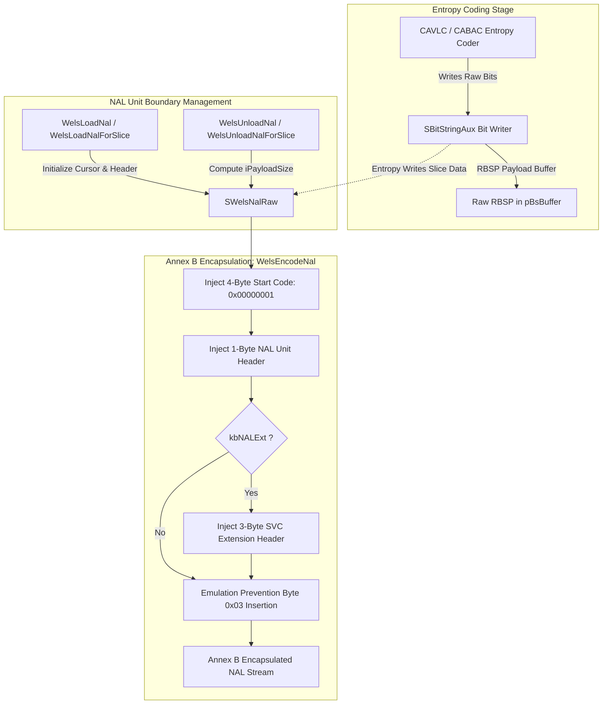
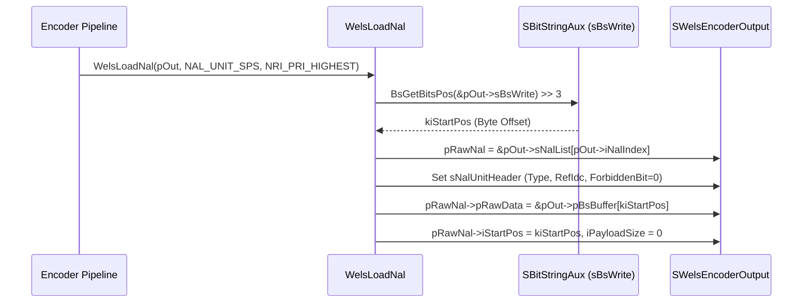
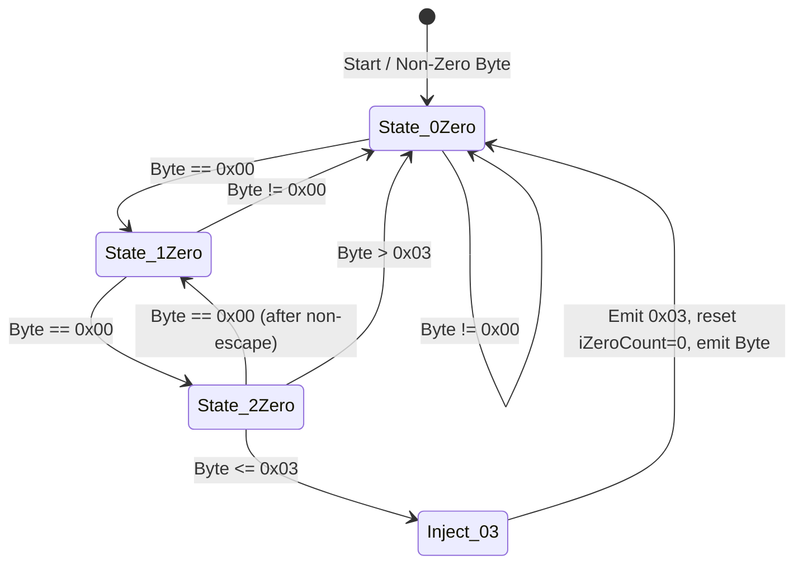
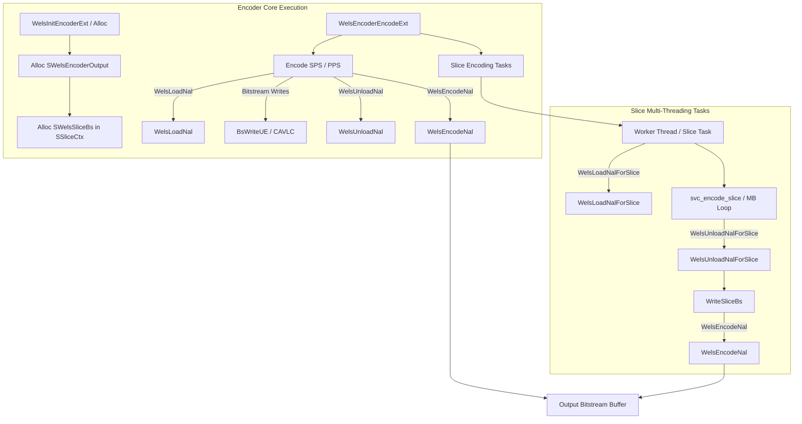

# OpenH264 Architecture & Source Documentation: `nal_encap.h`

This document provides a comprehensive, literate-programming-style technical breakdown of [`codec/encoder/core/inc/nal_encap.h`](openh264/codec/encoder/core/inc/nal_encap.h) and its companion implementation in [`codec/encoder/core/src/nal_encap.cpp`](openh264/codec/encoder/core/src/nal_encap.cpp).

---

## 1. Architectural Role & Module Purpose

In the H.264 / AVC and SVC video coding pipeline, encoded data is generated at the **Video Coding Layer (VCL)** as Raw Byte Sequence Payloads (RBSP) representing slice headers, macroblock syntax elements, transform coefficients, and non-VCL parameter sets (SPS, PPS, Subset SPS, Prefix NALs).

The **Network Abstraction Layer (NAL) Encapsulation Subsystem** is responsible for transforming raw entropy-coded bitstreams (RBSP) into fully encapsulated, standard-compliant byte streams (EBSP - Encapsulated Byte Sequence Payload) following **ITU-T H.264 Annex B Byte Stream Format**.



### Core Responsibilities
1. **NAL Lifecycle Management**: Synchronizes the bitstream writing cursor (`SBitStringAux`) with NAL unit boundaries before and after encoding slice headers or picture parameter sets via [`WelsLoadNal`](openh264/codec/encoder/core/inc/nal_encap.h#L109-L110) and [`WelsUnloadNal`](openh264/codec/encoder/core/inc/nal_encap.h#L115).
2. **Slice Multithreading Support**: Provides thread-local NAL tracking abstractions via [`SWelsSliceBs`](openh264/codec/encoder/core/inc/nal_encap.h#L86-L104), [`WelsLoadNalForSlice`](openh264/codec/encoder/core/inc/nal_encap.h#L120-L121), and [`WelsUnloadNalForSlice`](openh264/codec/encoder/core/inc/nal_encap.h#L126) so worker threads can encode slices in parallel without bitstream lock contention.
3. **Annex B Framing**: Prepends the 4-byte start code prefix (`0x00 0x00 0x00 0x01`).
4. **Header Serialization**: Packs the 1-byte AVC NAL header (`forbidden_zero_bit`, `nal_ref_idc`, `nal_unit_type`) and conditional 3-byte SVC extension headers (`idr_flag`, `dependency_id`, `temporal_id`, `discardable_flag`).
5. **Emulation Prevention Insertion**: Scans the raw payload byte stream and injects escape bytes (`0x03`) to prevent accidental start-code emulation (`0x000000`, `0x000001`, `0x000002`, `0x000003`).
6. **SVC Prefix NAL Generation**: Implements [`WelsWriteSVCPrefixNal`](openh264/codec/encoder/core/inc/nal_encap.h#L142) to output baseline-compatible prefix NAL units (NAL type 14).

---

## 2. Header Inclusions, Namespaces, & Constants

### Include Dependencies
* [`typedefs.h`](openh264/codec/common/inc/typedefs.h): Standard integer types (`uint8_t`, `int32_t`, `uint32_t`, etc.).
* [`wels_common_defs.h`](openh264/codec/common/inc/wels_common_defs.h): Core codec data types, including [`SNalUnitHeader`](openh264/codec/common/inc/wels_common_defs.h#L245-L250), [`SNalUnitHeaderExt`](openh264/codec/common/inc/wels_common_defs.h#L253-L272), [`EWelsNalUnitType`](openh264/codec/common/inc/wels_common_defs.h), and [`SBitStringAux`](openh264/codec/common/inc/wels_common_defs.h#L236-L242).
* [`wels_const.h`](openh264/codec/common/inc/wels_const.h): Common codec enumerations and limits (`MAX_DEPENDENCY_LAYER`, `MAX_QUALITY_LEVEL`).

### Namespace
All symbols reside inside namespace `WelsEnc`, referencing shared definitions from `WelsCommon`.

### Constants & Preprocessor Macros

| Macro / Constant | Value | Purpose |
| :--- | :--- | :--- |
| `NAL_HEADER_SIZE` | `(4)` | Size in bytes of the Annex B 4-byte start code prefix (`0x00 0x00 0x00 0x01`). |
| `MT_DEBUG_BS_WR` | `0` | Multi-threading bitstream write debugging toggle. When enabled (`1`), includes `bSliceCodedFlag` in [`SWelsSliceBs`](openh264/codec/encoder/core/inc/nal_encap.h#L86-L104). |

---

## 3. Data Structures Breakdown

### 3.1 [`SWelsNalRaw`](openh264/codec/encoder/core/inc/nal_encap.h#L56-L63) (`TagWelsNalRaw`)

Represents a single un-encapsulated raw NAL unit containing its raw RBSP slice/syntax payload and associated header metadata.

```cpp
typedef struct TagWelsNalRaw {
  uint8_t*                pRawData;       // Pointer to raw RBSP payload inside bitstream buffer
  int32_t                 iPayloadSize;   // Size in bytes of raw RBSP payload
  SNalUnitHeaderExt       sNalExt;        // NAL unit header and SVC extension parameters
  int32_t                 iStartPos;      // Byte start position in the underlying bitstream buffer
} SWelsNalRaw;
```

#### Field Specifications

| Field | Type | Alignment / Lifetime | Description |
| :--- | :--- | :--- | :--- |
| `pRawData` | `uint8_t*` | Byte-aligned | Pointer to the beginning of the raw RBSP payload inside the encoder's bitstream buffer `pBsBuffer`. Set during `WelsLoadNal` / `WelsLoadNalForSlice`. |
| `iPayloadSize` | `int32_t` | 32-bit integer | Length of the un-encapsulated RBSP payload in bytes. Calculated during `WelsUnloadNal` / `WelsUnloadNalForSlice` as `iEndPos - iStartPos`. |
| `sNalExt` | [`SNalUnitHeaderExt`](openh264/codec/common/inc/wels_common_defs.h#L253-L272) | Structure | Contains standard [`SNalUnitHeader`](openh264/codec/common/inc/wels_common_defs.h#L245-L250) (`eNalUnitType`, `uiNalRefIdc`, `uiForbiddenZeroBit`) and SVC scalability metadata (`bIdrFlag`, `uiDependencyId`, `uiTemporalId`, `bDiscardableFlag`). |
| `iStartPos` | `int32_t` | 32-bit integer | Starting byte offset of this NAL's raw RBSP data relative to the start of the bitstream buffer (`BsGetBitsPos() >> 3`). |

---

### 3.2 [`SWelsEncoderOutput`](openh264/codec/encoder/core/inc/nal_encap.h#L68-L82) (`TagWelsEncoderOutput`)

Encapsulates the top-level picture bitstream output buffer and list of NAL unit descriptors for the primary encoder pipeline context ([`sWelsEncCtx->pOut`](openh264/codec/encoder/core/inc/encoder_context.h#L193)).

```cpp
typedef struct TagWelsEncoderOutput {
  uint8_t*        pBsBuffer;      // Bitstream buffer allocation for coded picture
  uint32_t        uiSize;         // Allocated size in bytes of pBsBuffer
  SBitStringAux   sBsWrite;       // Entropy bitstream writer auxiliary state
  SWelsNalRaw*    sNalList;       // Array of raw NAL unit descriptors
  int32_t*        pNalLen;        // Array of encapsulated output NAL byte lengths
  int32_t         iCountNals;     // Total number of allocated NAL descriptors in sNalList
  int32_t         iNalIndex;      // Index of NAL currently being coded (0-based)
  int32_t         iLayerBsIndex;  // Spatial layer index for SFrameBsInfo
} SWelsEncoderOutput;
```

#### Field Specifications

| Field | Type | Description |
| :--- | :--- | :--- |
| `pBsBuffer` | `uint8_t*` | Continuous heap buffer holding all raw RBSP and parameter set data for the current picture. Recycled across frames to avoid runtime reallocation. |
| `uiSize` | `uint32_t` | Total byte capacity of `pBsBuffer`. |
| `sBsWrite` | [`SBitStringAux`](openh264/codec/common/inc/wels_common_defs.h#L236-L242) | Bitstream writing state object containing current bit accumulator (`uiCurBits`), remaining bit budget (`iLeftBits`), and buffer write pointers (`pStartBuf`, `pEndBuf`, `pCurBuf`). |
| `sNalList` | [`SWelsNalRaw*`](openh264/codec/encoder/core/inc/nal_encap.h#L56-L63) | Dynamic array of [`SWelsNalRaw`](openh264/codec/encoder/core/inc/nal_encap.h#L56-L63) entries sized to accommodate SPS, PPS, Subset SPS, and all slice NALs across dependency layers. |
| `pNalLen` | `int32_t*` | Integer array storing the final encapsulated Annex B byte lengths for each entry in `sNalList`. |
| `iCountNals` | `int32_t` | Total capacity of the `sNalList` array. |
| `iNalIndex` | `int32_t` | 0-based cursor tracking the NAL descriptor currently being populated or encapsulated. |
| `iLayerBsIndex` | `int32_t` | Target spatial layer index within the frame bitstream info output structure (`SFrameBsInfo`). |

---

### 3.3 [`SWelsSliceBs`](openh264/codec/encoder/core/inc/nal_encap.h#L86-L104) (`TagWelsSliceBs`)

Thread-local bitstream state allocated per slice ([`SSliceCtx->sSliceBs`](openh264/codec/encoder/core/inc/slice.h#L176)) enabling concurrent, lock-free entropy coding across multiple worker threads.

```cpp
typedef struct TagWelsSliceBs {
  uint8_t*        pBs;            // Output bitstream destination buffer
  uint32_t        uiBsSize;       // Capacity of pBs buffer
  uint32_t        uiBsPos;        // Current write position in pBs
  uint8_t*        pBsBuffer;      // Slice-local RBSP allocation buffer
  uint32_t        uiSize;         // Capacity of pBsBuffer
  SBitStringAux   sBsWrite;       // Slice-local bitstream writer auxiliary state
  SWelsNalRaw     sNalList[2];    // Fixed NAL list: [0] = Prefix NAL (optional), [1] = Slice NAL
  int32_t         iNalLen[2];     // Encapsulated byte length for each NAL in sNalList
  int32_t         iNalIndex;      // Index of NAL currently being coded (0 or 1)
#if MT_DEBUG_BS_WR
  bool            bSliceCodedFlag;
#endif
} SWelsSliceBs;
```

#### Multi-Threading Architecture Note
In multithreaded slice encoding (`SM_FIXEDSLCNUM_SLICE`, `SM_RASTER_SLICE`, or `SM_SIZELIMITED_SLICE`), each slice worker operates on its own dedicated [`SWelsSliceBs`](openh264/codec/encoder/core/inc/nal_encap.h#L86-L104). The fixed array `sNalList[2]` provides exactly two NAL slots:
1. `sNalList[0]`: Optional SVC Prefix NAL (`NAL_UNIT_PREFIX`, type 14).
2. `sNalList[1]`: Slice Data NAL (`NAL_UNIT_CODED_SLICE`, type 1 or `NAL_UNIT_CODED_SLICE_IDR`, type 5, or `NAL_UNIT_CODED_SLICE_EXT`, type 20).

---

## 4. Deep Dive: Functions & Algorithms

### 4.1 `WelsLoadNal`

```cpp
void WelsLoadNal (SWelsEncoderOutput* pEncoderOuput,
                  const int32_t/*EWelsNalUnitType*/ kiType,
                  const int32_t/*EWelsNalRefIdc*/ kiNalRefIdc);
```

#### Purpose & Control Flow
Initializes a new NAL unit descriptor in the global encoder output context prior to writing NAL payload data (such as SPS, PPS, or non-multithreaded slices).



#### Step-by-Step Execution
1. **Bitstream Cursor Query**: Computes the starting byte offset from the bitstream writer:
   $$\text{kiStartPos} = \text{BsGetBitsPos}(\&pEncoderOuput\to sBsWrite) \gg 3$$
2. **Header Assignment**: Populates the [`SNalUnitHeader`](openh264/codec/common/inc/wels_common_defs.h#L245-L250) embedded in `sNalList[iNalIndex].sNalExt`:
   - `eNalUnitType = (EWelsNalUnitType)kiType`
   - `uiNalRefIdc = (EWelsNalRefIdc)kiNalRefIdc`
   - `uiForbiddenZeroBit = 0`
3. **Payload Pointer Anchoring**: Sets `pRawData = &pEncoderOuput->pBsBuffer[kiStartPos]`, `iStartPos = kiStartPos`, and initializes `iPayloadSize = 0`.

---

### 4.2 `WelsUnloadNal`

```cpp
void WelsUnloadNal (SWelsEncoderOutput* pEncoderOuput);
```

#### Purpose & Control Flow
Finalizes the raw NAL unit currently being written in the global encoder output context.

#### Mathematical Calculation
Computes the exact un-encapsulated raw payload length:
$$\text{kiEndPos} = \text{BsGetBitsPos}(\&pEncoderOuput\to sBsWrite) \gg 3$$
$$\text{pRawNal}\to\text{iPayloadSize} = \text{kiEndPos} - \text{pRawNal}\to\text{iStartPos}$$
After recording `iPayloadSize`, it increments the active NAL index:
$$\text{pEncoderOuput}\to\text{iNalIndex} \leftarrow \text{pEncoderOuput}\to\text{iNalIndex} + 1$$

---

### 4.3 `WelsLoadNalForSlice` & `WelsUnloadNalForSlice`

```cpp
void WelsLoadNalForSlice (SWelsSliceBs* pSliceBs,
                          const int32_t/*EWelsNalUnitType*/ kiType,
                          const int32_t/*EWelsNalRefIdc*/ kiNalRefIdc);

void WelsUnloadNalForSlice (SWelsSliceBs* pSliceBs);
```

#### Purpose & Thread-Safety
These functions are the slice-thread-local equivalents of `WelsLoadNal` and `WelsUnloadNal`. They operate strictly on the caller thread's [`SWelsSliceBs`](openh264/codec/encoder/core/inc/nal_encap.h#L86-L104) instance:
- `WelsLoadNalForSlice` indexes into `pSliceBs->sNalList[pSliceBs->iNalIndex]`, synchronizes with `pSliceBs->sBsWrite`, sets `pRawData = &pSliceBs->pBsBuffer[kiStartPos]`, and zeros `iPayloadSize`.
- `WelsUnloadNalForSlice` evaluates the byte delta in `pSliceBs->sBsWrite`, stores `iPayloadSize`, and increments `pSliceBs->iNalIndex`.

Because each slice worker thread possesses its own distinct `SWelsSliceBs` instance, no mutex or atomic synchronization is required.

---

### 4.4 `WelsEncodeNal` (Annex B Encapsulation Engine)

```cpp
int32_t WelsEncodeNal (SWelsNalRaw* pRawNal,
                       void* pNalHeaderExt,
                       const int32_t kiDstBufferLen,
                       void* pDst,
                       int32_t* pDstLen);
```

[`WelsEncodeNal`](openh264/codec/encoder/core/src/nal_encap.cpp#L120-L183) is the core serialization kernel that converts un-escaped RBSP payloads into standard Annex B compliant byte streams (EBSP).

#### Input Parameters & Output
* `pRawNal`: Pointer to the source [`SWelsNalRaw`](openh264/codec/encoder/core/inc/nal_encap.h#L56-L63) descriptor containing raw data pointer `pRawData` and size `iPayloadSize`.
* `pNalHeaderExt`: Pointer to [`SNalUnitHeaderExt`](openh264/codec/common/inc/wels_common_defs.h#L253-L272) (required when `eNalUnitType` is `NAL_UNIT_PREFIX` or `NAL_UNIT_CODED_SLICE_EXT`).
* `kiDstBufferLen`: Available byte capacity of the destination buffer `pDst`.
* `pDst`: Pointer to destination output memory.
* `pDstLen`: Output pointer returning the total byte length of the encapsulated Annex B NAL unit.

#### Return Codes
* `ENC_RETURN_SUCCESS` (`0`): Successful encapsulation.
* `ENC_RETURN_MEMALLOCERR` (`-1` / non-zero): Destination buffer `kiDstBufferLen` is insufficient to safely accommodate worst-case emulation prevention expansion.
* `ENC_RETURN_UNEXPECTED`: Input payload size validation failure ($iAssumedNeededLength \le 0$).

---

#### Detailed Algorithmic Breakdown of `WelsEncodeNal`

#### Step 1: Worst-Case Destination Buffer Bounds Verification
The function first checks whether the NAL unit is an SVC extension NAL:
$$kbNALExt = (\text{eNalUnitType} == \text{NAL\_UNIT\_PREFIX} \lor \text{eNalUnitType} == \text{NAL\_UNIT\_CODED\_SLICE\_EXT})$$

The base assumed length is:
$$L_{\text{base}} = \text{NAL\_HEADER\_SIZE} (4) + (kbNALExt \,?\, 3 : 0) + \text{iPayloadSize} + 1$$

In the theoretical worst-case bitstream where every two bytes are `0x00 0x00`, an emulation prevention byte `0x03` must be inserted after every pair. This expands the payload size by up to $50\%$. The safety check computes:
$$L_{\text{max\_worst\_case}} = L_{\text{base}} + \lfloor L_{\text{base}} / 2 \rfloor = L_{\text{base}} + (L_{\text{base}} \gg 1)$$

If `kiDstBufferLen < L_{\text{max\_worst\_case}}`, the function safely rejects encoding and returns `ENC_RETURN_MEMALLOCERR`.

---

#### Step 2: Annex B Start Code Prefix Injection
Writes the 4-byte Annex B start code prefix (`0x00000001`) into the destination buffer using fast 32-bit unaligned store macros:
```cpp
static const uint8_t kuiStartCodePrefix[NAL_HEADER_SIZE] = { 0, 0, 0, 1 };
ST32 (pDstPointer, LD32 (&kuiStartCodePrefix[0]));
pDstPointer += 4;
```

---

#### Step 3: Standard 1-Byte AVC NAL Header Packing
Constructs the standard 1-byte H.264 NAL header per ITU-T H.264 Section 7.3.1:

$$\text{Header Byte} = (\text{uiNalRefIdc} \ll 5) \mid (\text{eNalUnitType} \ \& \ \text{0x1F})$$

```
Bit:   7       6   5       4   3   2   1   0
     +---+---+-------+---+-------------------+
     | 0 | uiNalRefIdc |   eNalUnitType      |
     +---+---+-------+---+-------------------+
```
* Bit 7: `forbidden_zero_bit` (always `0`).
* Bits 6..5: `nal_ref_idc` (2 bits indicating reference priority).
* Bits 4..0: `nal_unit_type` (5 bits).

---

#### Step 4: Optional 3-Byte SVC Extension Header Packing
If `kbNALExt` is true, unpacks `SNalUnitHeaderExt* sNalExt` and formats the 3 extension bytes per Annex G (SVC):

```
Extension Byte 1 (0x80 | bIdrFlag << 6):
Bit:   7       6       5   4   3   2   1   0
     +---+-----------+-----------------------+
     | 1 |  bIdrFlag |   reserved_zero_6bits |
     +---+-----------+-----------------------+

Extension Byte 2 (0x80 | uiDependencyId << 4):
Bit:   7       6   5   4       3   2   1   0
     +---+---------------+-------------------+
     | 1 | uiDependencyId|  quality_id (0)   |
     +---+---------------+-------------------+

Extension Byte 3 ((uiTemporalId << 5) | (bDiscardableFlag << 3) | 0x07):
Bit:   7   6   5       4       3       2       1   0
     +-----------+-----------+---+-----------+-------+
     | uiTempId  | use_ref(0)|dis| output(1) | 1   1 |
     +-----------+-----------+---+-----------+-------+
```

Specifically:
* **Byte 1**: `0x80 | (sNalExt->bIdrFlag << 6)` (`reserved_one_bit` = 1).
* **Byte 2**: `0x80 | (sNalExt->uiDependencyId << 4)` (`no_inter_layer_pred_flag` = 1).
* **Byte 3**: `(sNalExt->uiTemporalId << 5) | (sNalExt->bDiscardableFlag << 3) | 0x07` (`output_flag` = 1, `reserved_three_2bits` = 3).

---

#### Step 5: Emulation Prevention Byte (`0x03`) Insertion State Machine
To guarantee that the raw payload data does not unintentionally form any of the following reserved 3-byte / 4-byte start sequences:
* `0x00 0x00 0x00` (Start code prefix collision)
* `0x00 0x00 0x01` (Start code prefix collision)
* `0x00 0x00 0x02` (Reserved)
* `0x00 0x00 0x03` (Emulation prevention collision)

The encapsulation loop maintains a zero-byte state counter `iZeroCount`:

```cpp
while (pSrcPointer < pSrcEnd) {
  if (iZeroCount == 2 && *pSrcPointer <= 3) {
    *pDstPointer++ = 3;  // Inject emulation_prevention_three_byte
    iZeroCount = 0;
  }
  if (*pSrcPointer == 0) {
    ++iZeroCount;
  } else {
    iZeroCount = 0;
  }
  *pDstPointer++ = *pSrcPointer++;
}
```



---

#### Step 6: Total Length Calculation
Computes the final byte count written:
$$iNalLength = (\text{int32\_t})(pDstPointer - pDstStart)$$
Assigns `*pDstLen = iNalLength` and returns `ENC_RETURN_SUCCESS`.

---

### 4.5 `WelsWriteSVCPrefixNal`

```cpp
int32_t WelsWriteSVCPrefixNal (SBitStringAux* pBitStringAux,
                               const int32_t kiNalRefIdc,
                               const bool kbIdrFlag);
```

#### Purpose & Syntax Serialization
Generates the RBSP payload for an SVC Prefix NAL unit (NAL unit type 14) per ITU-T H.264 Annex G Section G.7.3.2.12.

When `kiNalRefIdc > 0`:
1. `BsWriteOneBit(pBitStringAux, false)`: Writes `store_ref_base_pic_flag = 0`.
2. `BsWriteOneBit(pBitStringAux, false)`: Writes `additional_prefix_nal_unit_extension_flag = 0`.
3. `BsRbspTrailingBits(pBitStringAux)`: Writes standard RBSP trailing bits:
   - A single stop bit `1` (`rbsp_stop_one_bit`).
   - Zero bits to align the bitstream cursor to the next full byte boundary (`rbsp_alignment_zero_bit`).

---

## 5. Call Graph & Encoder Subsystem Interactions



### Key Interaction Points in Codebase
* [`codec/encoder/core/src/encoder_ext.cpp`](openh264/codec/encoder/core/src/encoder_ext.cpp#L2833-L3035): Calls `WelsLoadNal`, `WelsUnloadNal`, and `WelsEncodeNal` to encapsulate SPS, PPS, Subset SPS, Prefix NALs, and Filler Data NALs.
* [`codec/encoder/core/src/wels_task_encoder.cpp`](openh264/codec/encoder/core/src/wels_task_encoder.cpp#L156-L284): Calls `WelsLoadNalForSlice` and `WelsUnloadNalForSlice` during parallel slice execution.
* [`codec/encoder/core/src/slice_multi_threading.cpp`](openh264/codec/encoder/core/src/slice_multi_threading.cpp#L492-L512): Calls `WelsEncodeNal` in [`WriteSliceBs`](openh264/codec/encoder/core/src/slice_multi_threading.cpp#L492) to write encapsulated slice NALs into the target bitstream packet buffer.

---

## 6. Summary Reference Table

| Function / Structure | File | Primary Responsibility |
| :--- | :--- | :--- |
| [`SWelsNalRaw`](openh264/codec/encoder/core/inc/nal_encap.h#L56-L63) | [`nal_encap.h`](openh264/codec/encoder/core/inc/nal_encap.h) | Descriptor for raw un-encapsulated RBSP payload, header metadata, and buffer offsets. |
| [`SWelsEncoderOutput`](openh264/codec/encoder/core/inc/nal_encap.h#L68-L82) | [`nal_encap.h`](openh264/codec/encoder/core/inc/nal_encap.h) | Top-level frame bitstream buffer container and NAL descriptor list manager. |
| [`SWelsSliceBs`](openh264/codec/encoder/core/inc/nal_encap.h#L86-L104) | [`nal_encap.h`](openh264/codec/encoder/core/inc/nal_encap.h) | Slice-thread-local bitstream state object for lock-free parallel slice encoding. |
| [`WelsLoadNal`](openh264/codec/encoder/core/inc/nal_encap.h#L109-L110) | [`nal_encap.cpp`](openh264/codec/encoder/core/src/nal_encap.cpp#L46-L60) | Initializes NAL entry and binds starting payload pointer in `SWelsEncoderOutput`. |
| [`WelsUnloadNal`](openh264/codec/encoder/core/inc/nal_encap.h#L115) | [`nal_encap.cpp`](openh264/codec/encoder/core/src/nal_encap.cpp#L65-L76) | Calculates raw payload byte length and increments active NAL index. |
| [`WelsLoadNalForSlice`](openh264/codec/encoder/core/inc/nal_encap.h#L120-L121) | [`nal_encap.cpp`](openh264/codec/encoder/core/src/nal_encap.cpp#L80-L95) | Thread-local slice NAL initialization in `SWelsSliceBs`. |
| [`WelsUnloadNalForSlice`](openh264/codec/encoder/core/inc/nal_encap.h#L126) | [`nal_encap.cpp`](openh264/codec/encoder/core/src/nal_encap.cpp#L99-L108) | Finalizes slice-local raw payload length and advances slice NAL index. |
| [`WelsEncodeNal`](openh264/codec/encoder/core/inc/nal_encap.h#L136-L137) | [`nal_encap.cpp`](openh264/codec/encoder/core/src/nal_encap.cpp#L120-L183) | Converts RBSP to EBSP: prepends Annex B start code, packs headers, inserts `0x03` emulation prevention bytes. |
| [`WelsWriteSVCPrefixNal`](openh264/codec/encoder/core/inc/nal_encap.h#L142) | [`nal_encap.cpp`](openh264/codec/encoder/core/src/nal_encap.cpp#L188-L196) | Writes syntax for SVC Prefix NAL (Type 14) with RBSP trailing bits. |
