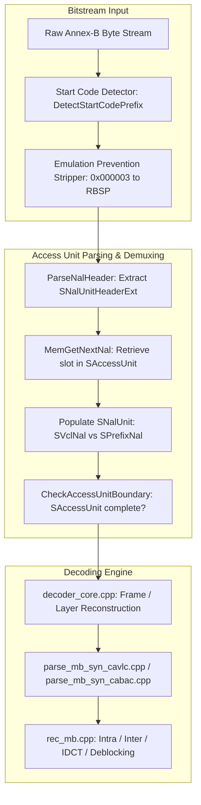

# Literate Programming Documentation: `nalu.h`

**File:** [`codec/decoder/core/inc/nalu.h`](openh264/codec/decoder/core/inc/nalu.h)  
**Namespace:** `WelsDec`  
**Subsystem:** H.264 / SVC Video Decoder Core Engine  

---

## Table of Contents
1. [Architectural Overview](#1-architectural-overview)
2. [Header Dependencies & Context](#2-header-dependencies--context)
3. [Data Structure Breakdown](#3-data-structure-breakdown)
   - [3.1 `TagNalUnit` / `SNalUnit` / `PNalUnit`](#31-tagnalunit--snalunit--pnalunit)
   - [3.2 Anonymous Union `sNalData` & `struct SVclNal`](#32-anonymous-union-snaldata--struct-svclnal)
   - [3.3 `TagAccessUnits` / `SAccessUnit` / `PAccessUnit`](#33-tagaccessunits--saccessunit--paccessunit)
4. [Memory Layout & Allocation Architecture](#4-memory-layout--allocation-architecture)
   - [4.1 Single-Block Contiguous Allocation (`MemInitNalList`)](#41-single-block-contiguous-allocation-meminitnallist)
   - [4.2 Dynamic Capacity Expansion (`ExpandNalUnitList` & `MemGetNextNal`)](#42-dynamic-capacity-expansion-expandnalunitlist--memgetnextnal)
5. [NAL Unit & Access Unit Processing Lifecycle](#5-nal-unit--access-unit-processing-lifecycle)
   - [5.1 Demuxing & Boundary Detection Pipeline](#51-demuxing--boundary-detection-pipeline)
   - [5.2 Decoder Core Consumption Loop](#52-decoder-core-consumption-loop)
6. [Call Graph & Code Map](#6-call-graph--code-map)

---

## 1. Architectural Overview

In the H.264 / MPEG-4 AVC and Scalable Video Coding (SVC) specifications (ITU-T Rec. H.264 / ISO/IEC 14496-10), video streams are serialized into discrete packets called **Network Abstraction Layer (NAL) Units**. A sequence of NAL units corresponding to a single decoded picture or time instant forms an **Access Unit (AU)**.

[`nalu.h`](openh264/codec/decoder/core/inc/nalu.h) is the core header file in the OpenH264 decoder subsystem that defines the in-memory representation for both **individual NAL units** ([`SNalUnit`](openh264/codec/decoder/core/inc/nalu.h#L47-L61)) and **Access Units** ([`SAccessUnit`](openh264/codec/decoder/core/inc/nalu.h#L66-L75)).



### Key Responsibilities:
1. **Decoupled Bitstream Buffering**: Encapsulates parsed NAL unit metadata (`sNalHeaderExt`), slice headers (`sSliceHeaderExt`), and bitstream reader context (`sSliceBitsRead`) without requiring reallocation for each new slice.
2. **Discriminated Payload Polymorphism**: Employs a C union (`sNalData`) to handle both Video Coding Layer (VCL) slice NALs (`sVclNal`) and non-VCL Prefix NAL units (`sPrefixNal`) in a shared memory footprint.
3. **Contiguous Cache-Optimized AU Storage**: Hosts the list of active NAL units (`pNalUnitsList`) within [`SAccessUnit`](openh264/codec/decoder/core/inc/nalu.h#L66-L75), providing dynamic geometric growth while preserving contiguous CPU cache locality.

---

## 2. Header Dependencies & Context

The header file [`nalu.h`](openh264/codec/decoder/core/inc/nalu.h) includes the following core definitions:

```cpp
#include "typedefs.h"
#include "wels_common_basis.h"
#include "nal_prefix.h"
#include "bit_stream.h"
```

* [`typedefs.h`](openh264/codec/common/inc/typedefs.h): Standardized primitive types (`int32_t`, `uint32_t`, `uint8_t`, `bool`).
* [`wels_common_basis.h`](openh264/codec/common/inc/wels_common_basis.h): NAL unit header definitions ([`SNalUnitHeader`](openh264/codec/common/inc/wels_common_basis.h) and [`SNalUnitHeaderExt`](openh264/codec/common/inc/wels_common_basis.h)).
* [`nal_prefix.h`](openh264/codec/decoder/core/inc/nal_prefix.h): Prefix NAL unit syntax structures ([`SPrefixNalUnit`](openh264/codec/decoder/core/inc/nal_prefix.h#L46-L52)).
* [`bit_stream.h`](openh264/codec/decoder/core/inc/bit_stream.h): Bitstream reading auxiliary context ([`SBitStringAux`](openh264/codec/decoder/core/inc/bit_stream.h)).

All symbols in [`nalu.h`](openh264/codec/decoder/core/inc/nalu.h) reside within the C++ namespace `WelsDec`.

---

## 3. Data Structure Breakdown

### 3.1 `TagNalUnit` / `SNalUnit` / `PNalUnit`

The primary structure representing a single parsed NAL unit.

```cpp
/* NAL Unit Structure */
typedef struct TagNalUnit {
  SNalUnitHeaderExt       sNalHeaderExt;

  union {
    struct SVclNal {
      SSliceHeaderExt     sSliceHeaderExt;
      SBitStringAux       sSliceBitsRead;
      uint8_t*            pNalPos;         // save the address of slice nal for GPU function
      int32_t             iNalLength;   // save the nal length for GPU function
      bool                bSliceHeaderExtFlag;
    } sVclNal;
    SPrefixNalUnit        sPrefixNal;
  } sNalData;
  unsigned long long uiTimeStamp;
} SNalUnit, *PNalUnit;
```

#### Field Specifications:

| Member Name | Data Type | Description |
| :--- | :--- | :--- |
| `sNalHeaderExt` | [`SNalUnitHeaderExt`](openh264/codec/common/inc/wels_common_basis.h) | Extended NAL unit header containing both standard AVC fields (`uiForbiddenZeroBit`, `uiNalRefIdc`, `eNalUnitType`) and SVC extension fields (`bIdrFlag`, `uiPriorityId`, `uiDependencyId`, `uiQualityId`, `uiTemporalId`, etc.). |
| `sNalData` | `union` | Discriminated union holding either a Video Coding Layer (VCL) slice payload (`sVclNal`) or a Prefix NAL payload (`sPrefixNal`). |
| `uiTimeStamp` | `unsigned long long` (64-bit unsigned) | Presentation / decoding timestamp (in microseconds/milliseconds) mapped to this NAL unit, preserved across the parsing pipeline for A/V synchronization. |

---

### 3.2 Anonymous Union `sNalData` & `struct SVclNal`

The anonymous union inside [`SNalUnit`](openh264/codec/decoder/core/inc/nalu.h#L47-L61) contains two mutually exclusive payloads:

#### 1. `struct SVclNal` (Video Coding Layer NAL)
Used when `eNalUnitType` is a VCL slice type (`NAL_UNIT_CODED_SLICE`, `NAL_UNIT_CODED_SLICE_IDR`, or `NAL_UNIT_CODED_SLICE_EXT`):

* **`sSliceHeaderExt`** ([`SSliceHeaderExt`](openh264/codec/decoder/core/inc/slice.h)):  
  Contains the fully parsed slice header (`sSliceHeader`), slice type (`eSliceType`: I, P, or B slice), first macroblock address (`iFirstMbInSlice`), frame number (`iFrameNum`), slice QP delta (`iSliceQpDelta`), reference picture list reordering commands, and SVC-specific extension parameters (`bStoreRefBasePicFlag`, `bAdaptiveBaseModeFlag`).
* **`sSliceBitsRead`** ([`SBitStringAux`](openh264/codec/decoder/core/inc/bit_stream.h)):  
  The auxiliary bitstream reader structure initialized to point to the first bit of the slice data payload (immediately following the slice header). It maintains the read pointers (`pStartBuf`, `pEndBuf`, `pCurBuf`), current accumulator value, and consumed bit count (`uiBitPos`).
* **`pNalPos`** (`uint8_t*`):  
  Pointer to the beginning of the slice NAL payload in the raw bitstream buffer. Stored to allow direct memory transfers to hardware accelerators or external GPU decoders.
* **`iNalLength`** (`int32_t`):  
  The byte size of the slice NAL unit.
* **`bSliceHeaderExtFlag`** (`bool`):  
  Flag indicating whether the slice header contains SVC extension syntax elements (`true` for `NAL_UNIT_CODED_SLICE_EXT`, `false` for standard AVC slices).

#### 2. `sPrefixNal` ([`SPrefixNalUnit`](openh264/codec/decoder/core/inc/nal_prefix.h#L46-L52))
Used when `eNalUnitType` is `NAL_UNIT_PREFIX` (NAL type 14). Prefix NAL units precede base layer slices in SVC streams to provide base representation reference picture marking commands (`sRefPicBaseMarking`) and store flags (`bStoreRefBasePicFlag`).

---

### 3.3 `TagAccessUnits` / `SAccessUnit` / `PAccessUnit`

The [`SAccessUnit`](openh264/codec/decoder/core/inc/nalu.h#L66-L75) structure encapsulates all NAL units belonging to a single Access Unit (AU).

```cpp
/* Access Unit structure */
typedef struct TagAccessUnits {
  PNalUnit*               pNalUnitsList;  // list of NAL Units pointer in this AU
  uint32_t                uiAvailUnitsNum;   // Number of NAL Units available in each AU list based current bitstream,
  uint32_t                uiActualUnitsNum;       // actual number of NAL units belong to current au
// While available number exceeds count size below, need realloc extra NAL Units for list space.
  uint32_t                uiCountUnitsNum;        // Count size number of malloced NAL Units in each AU list
  uint32_t                uiStartPos;
  uint32_t                uiEndPos;
  bool                    bCompletedAuFlag;       // Indicate whether it is a completed AU
} SAccessUnit, *PAccessUnit;
```

#### Field Specifications:

| Member Name | Data Type | Description |
| :--- | :--- | :--- |
| `pNalUnitsList` | `PNalUnit*` | Dynamically allocated array of pointers (`SNalUnit**`), where each element points to an allocated [`SNalUnit`](openh264/codec/decoder/core/inc/nalu.h#L47-L61) instance. |
| `uiAvailUnitsNum` | `uint32_t` | The current number of populated / parsed NAL units available in `pNalUnitsList`. |
| `uiActualUnitsNum` | `uint32_t` | The count of NAL units that strictly belong to the current active Access Unit. |
| `uiCountUnitsNum` | `uint32_t` | The total capacity (allocated slot count) of `pNalUnitsList`. When `uiAvailUnitsNum >= uiCountUnitsNum`, the list is dynamically expanded. |
| `uiStartPos` | `uint32_t` | Index of the first NAL unit in `pNalUnitsList` to be decoded for the current picture reconstruction pass. |
| `uiEndPos` | `uint32_t` | Index of the last NAL unit in `pNalUnitsList` belonging to the current picture reconstruction pass. |
| `bCompletedAuFlag` | `bool` | Set to `true` when the bitstream parser detects an Access Unit boundary or end of stream, signifying that the AU is ready for decoding. |

---

## 4. Memory Layout & Allocation Architecture

### 4.1 Single-Block Contiguous Allocation (`MemInitNalList`)

To avoid heap fragmentation and maximize CPU cache line hits, OpenH264 allocates the entire Access Unit control block, pointer array, and all [`SNalUnit`](openh264/codec/decoder/core/inc/nalu.h#L47-L61) structures in a **single contiguous memory chunk** via [`MemInitNalList`](openh264/codec/decoder/core/src/memmgr_nal_unit.cpp#L47-L84).

Given initial capacity $K$ (`kuiSize`, default `MAX_NAL_UNIT_NUM_IN_AU = 32`):

$$\text{TotalBytes} = \text{sizeof}(\text{SAccessUnit}) + K \cdot \text{sizeof}(\text{PNalUnit}) + K \cdot \text{sizeof}(\text{SNalUnit})$$

```
+---------------------------------------------------------------------------------------+
| SAccessUnit (Header) | PNalUnit* [0..K-1] (Pointers) | SNalUnit [0..K-1] (Payloads)   |
+---------------------------------------------------------------------------------------+
  ^                      ^                              ^
  *ppAu                  pNalUnitsList                  pNalUnitsList[0] ... [K-1]
```

```cpp
// memmgr_nal_unit.cpp
int32_t MemInitNalList (PAccessUnit* ppAu, const uint32_t kuiSize, CMemoryAlign* pMa) {
  const uint32_t kuiSizeAu = sizeof (SAccessUnit);
  const uint32_t kuiSizeNalUnitPtr = kuiSize * sizeof (PNalUnit);
  const uint32_t kuiSizeNalUnit = sizeof (SNalUnit);
  const uint32_t kuiCountSize = (kuiSizeAu + kuiSizeNalUnitPtr + kuiSize * kuiSizeNalUnit);

  uint8_t* pBase = (uint8_t*)pMa->WelsMallocz (kuiCountSize, "Access Unit");
  if (pBase == NULL) return ERR_INFO_OUT_OF_MEMORY;

  *ppAu = (PAccessUnit)pBase;
  uint8_t* pPtr = pBase + kuiSizeAu;
  (*ppAu)->pNalUnitsList = (PNalUnit*)pPtr;
  pPtr += kuiSizeNalUnitPtr;

  for (uint32_t uiIdx = 0; uiIdx < kuiSize; ++uiIdx) {
    (*ppAu)->pNalUnitsList[uiIdx] = (PNalUnit)pPtr;
    pPtr += kuiSizeNalUnit;
  }
  (*ppAu)->uiCountUnitsNum = kuiSize;
  ...
}
```

---

### 4.2 Dynamic Capacity Expansion (`ExpandNalUnitList` & `MemGetNextNal`)

When a high-density stream exceeds `uiCountUnitsNum` (e.g. video streams with many slices per frame), [`MemGetNextNal`](openh264/codec/decoder/core/src/memmgr_nal_unit.cpp#L130-L146) triggers [`ExpandNalUnitList`](openh264/codec/decoder/core/src/memmgr_nal_unit.cpp#L98-L123):

$$K_{\text{new}} = K_{\text{current}} + \left(\text{MAX\_NAL\_UNIT\_NUM\_IN\_AU} \gg 1\right) = K_{\text{current}} + 16$$

1. Allocates a new contiguous block with capacity $K_{\text{new}}$.
2. Copies existing parsed [`SNalUnit`](openh264/codec/decoder/core/inc/nalu.h#L47-L61) structs via `memcpy`.
3. Copies AU state markers (`uiAvailUnitsNum`, `uiActualUnitsNum`, `uiEndPos`, `bCompletedAuFlag`).
4. Frees the old contiguous block using [`MemFreeNalList`](openh264/codec/decoder/core/src/memmgr_nal_unit.cpp#L86-L95).
5. Zero-initializes the newly assigned [`SNalUnit`](openh264/codec/decoder/core/inc/nalu.h#L47-L61) with `memset` to ensure clean state and cache flushing.

---

## 5. NAL Unit & Access Unit Processing Lifecycle

### 5.1 Demuxing & Boundary Detection Pipeline

During Annex-B bitstream parsing in [`au_parser.cpp`](openh264/codec/decoder/core/src/au_parser.cpp):

1. **Start Code Prefix Detection**: [`DetectStartCodePrefix`](openh264/codec/decoder/core/src/au_parser.cpp#L65) locates `0x000001` or `0x00000001`.
2. **RBSP Un-escaping**: Emulation prevention bytes (`0x03` in `0x000003`) are stripped.
3. **NAL Header Parsing**: [`ParseNalHeader`](openh264/codec/decoder/core/src/au_parser.cpp#L108) populates `sNalHeaderExt`.
4. **Unit Allocation**: [`MemGetNextNal`](openh264/codec/decoder/core/src/memmgr_nal_unit.cpp#L130) obtains the next [`PNalUnit`](openh264/codec/decoder/core/inc/nalu.h#L61) in `pAccessUnitList`.
5. **AU Boundary Checking**: [`CheckAccessUnitBoundary`](openh264/codec/decoder/core/src/au_parser.cpp#L1233) evaluates if `kpCurNal` starts a new picture by comparing:
   - `frame_num` differences.
   - `pic_order_cnt_lsb` or `delta_pic_order_cnt` differences.
   - `nal_ref_idc` differences when one is 0.
   - IDR picture flags (`bIdrFlag` / `idr_pic_id`).
   - `nal_unit_type` transitions (e.g. SPS/PPS/SEI preceding new VCL slices).

If a boundary is reached, `bCompletedAuFlag` is set to `true`, and `uiEndPos = uiAvailUnitsNum - 1`.

---

### 5.2 Decoder Core Consumption Loop

In [`decoder_core.cpp`](openh264/codec/decoder/core/src/decoder_core.cpp), the decoder iterates over the populated NAL units:

```cpp
// decoder_core.cpp: ConstructAccessUnitPassThrough / DecodeCurrentAccessUnit
PAccessUnit pCurAu = pCtx->pAccessUnitList;
for (uint32_t i = pCurAu->uiStartPos; i <= pCurAu->uiEndPos; ++i) {
  PNalUnit pNalUnit = pCurAu->pNalUnitsList[i];
  if (pNalUnit->sNalHeaderExt.sNalUnitHeader.eNalUnitType == NAL_UNIT_CODED_SLICE ||
      pNalUnit->sNalHeaderExt.sNalUnitHeader.eNalUnitType == NAL_UNIT_CODED_SLICE_IDR ||
      pNalUnit->sNalHeaderExt.sNalUnitHeader.eNalUnitType == NAL_UNIT_CODED_SLICE_EXT) {
    // Decode VCL Slice using sNalData.sVclNal
    WelsDecodeSlice (pCtx, pNalUnit);
  }
}
```

Once the Access Unit decoding completes, the AU state indices are reset:
```cpp
pCtx->pAccessUnitList->uiAvailUnitsNum  = 0;
pCtx->pAccessUnitList->uiActualUnitsNum = 0;
pCtx->pAccessUnitList->uiStartPos       = 0;
pCtx->pAccessUnitList->uiEndPos         = 0;
pCtx->pAccessUnitList->bCompletedAuFlag = false;
```

---

## 6. Call Graph & Code Map

### Related Code Files & Symbol References

| Symbol / Structure | Location | Role |
| :--- | :--- | :--- |
| [`SNalUnit`](openh264/codec/decoder/core/inc/nalu.h#L47-L61) | [`nalu.h:47`](openh264/codec/decoder/core/inc/nalu.h#L47) | In-memory representation of an individual NAL Unit |
| [`SAccessUnit`](openh264/codec/decoder/core/inc/nalu.h#L66-L75) | [`nalu.h:66`](openh264/codec/decoder/core/inc/nalu.h#L66) | Container structure for an entire Access Unit |
| [`SNalUnitHeaderExt`](openh264/codec/common/inc/wels_common_basis.h) | [`wels_common_basis.h`](openh264/codec/common/inc/wels_common_basis.h) | Standard & SVC extended NAL header |
| [`SPrefixNalUnit`](openh264/codec/decoder/core/inc/nal_prefix.h#L46-L52) | [`nal_prefix.h:46`](openh264/codec/decoder/core/inc/nal_prefix.h#L46) | Prefix NAL unit syntax elements |
| [`SSliceHeaderExt`](openh264/codec/decoder/core/inc/slice.h) | [`slice.h`](openh264/codec/decoder/core/inc/slice.h) | Slice header & SVC extension parameters |
| [`SBitStringAux`](openh264/codec/decoder/core/inc/bit_stream.h) | [`bit_stream.h`](openh264/codec/decoder/core/inc/bit_stream.h) | Auxiliary bitstream reader |
| [`MemInitNalList`](openh264/codec/decoder/core/src/memmgr_nal_unit.cpp#L47-L84) | [`memmgr_nal_unit.cpp:47`](openh264/codec/decoder/core/src/memmgr_nal_unit.cpp#L47) | Contiguous memory allocation for AU & NAL units |
| [`MemGetNextNal`](openh264/codec/decoder/core/src/memmgr_nal_unit.cpp#L130-L146) | [`memmgr_nal_unit.cpp:130`](openh264/codec/decoder/core/src/memmgr_nal_unit.cpp#L130) | Dynamic NAL slot acquisition & expansion |
| [`CheckAccessUnitBoundary`](openh264/codec/decoder/core/src/au_parser.cpp#L1233) | [`au_parser.cpp:1233`](openh264/codec/decoder/core/src/au_parser.cpp#L1233) | AU boundary detection algorithm |
| [`SWelsDecoderContext`](openh264/codec/decoder/core/inc/decoder_context.h#L306-L455) | [`decoder_context.h:306`](openh264/codec/decoder/core/inc/decoder_context.h#L306) | Global decoder context holding `pAccessUnitList` |
