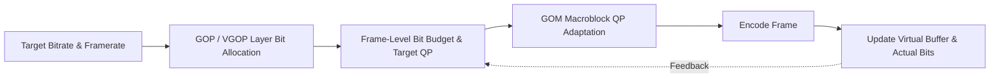

# OpenH264: Deep-Dive Architecture, Data Structures, and Algorithms

This document provides a comprehensive technical breakdown of the OpenH264 codebase (Cisco OpenH264), detailing the internal architectures, primary data structures, algorithmic implementations, and processing pipelines for both the **H.264 / AVC Video Decoder** and **Video Encoder**.

---

## Table of Contents
1. [High-Level System Architecture](#1-high-level-system-architecture)
2. [H.264 Video Decoder](#2-h264-video-decoder)
   - [2.1 Decoder Core Data Structures](#21-decoder-core-data-structures)
   - [2.2 Bitstream Parsing & NAL Unit Extraction](#22-bitstream-parsing--nal-unit-extraction)
   - [2.3 Entropy Decoding (CAVLC and CABAC)](#23-entropy-decoding-cavlc-and-cabac)
   - [2.4 Intra-Frame Prediction](#24-intra-frame-prediction)
   - [2.5 Inter-Frame Prediction & Motion Compensation](#25-inter-frame-prediction--motion-compensation)
   - [2.6 Inverse Quantization & Inverse Transform (IDCT)](#26-inverse-quantization--inverse-transform-idct)
   - [2.7 Macroblock Reconstruction Loop](#27-macroblock-reconstruction-loop)
   - [2.8 In-Loop Deblocking Filter](#28-in-loop-deblocking-filter)
   - [2.9 Decoded Picture Buffer (DPB) & Reference Management](#29-decoded-picture-buffer-dpb--reference-management)
   - [2.10 Error Concealment & Flexible Macroblock Ordering (FMO)](#210-error-concealment--flexible-macroblock-ordering-fmo)
3. [H.264 Video Encoder](#3-h264-video-encoder)
   - [3.1 Encoder Core Data Structures](#31-encoder-core-data-structures)
   - [3.2 Video Pre-Processing & Assessment (VAA)](#32-video-pre-processing--assessment-vaa)
   - [3.3 Rate Control Engine](#33-rate-control-engine)
   - [3.4 Motion Estimation (ME)](#34-motion-estimation-me)
   - [3.5 Mode Decision (MD) & Rate-Distortion Optimization](#35-mode-decision-md--rate-distortion-optimization)
   - [3.6 Forward Transform & Quantization](#36-forward-transform--quantization)
   - [3.7 Macroblock & Slice Encoding Loop](#37-macroblock--slice-encoding-loop)
   - [3.8 Entropy Encoding & NAL Encapsulation](#38-entropy-encoding--nal-encapsulation)
   - [3.9 Slice Multithreading & Scalability Management (SVC / LTR)](#39-slice-multithreading--scalability-management-svc--ltr)
4. [Shared Subsystems & SIMD Optimization](#4-shared-subsystems--simd-optimization)
5. [Complete Source File Reference & Code Map](#5-complete-source-file-reference--code-map)

---

## 1. High-Level System Architecture

OpenH264 is structured into a clean separation between public C++ interface wrappers (in `codec/api/wels/` and `codec/*/plus/`) and high-performance core C/C++ engines (in `codec/decoder/core/` and `codec/encoder/core/`).

```mermaid
flowchart TB
    subgraph Decoder Architecture
        DecAPI[ISVCDecoder / CWelsDecoder] --> DecCtx[SWelsDecoderContext]
        DecCtx --> NALParse[NAL Demux & Annex B Un-escaping]
        NALParse --> EntropyDec[Entropy Decoder: CAVLC / CABAC]
        EntropyDec --> RecLoopDec[MB Reconstruction: Intra / Inter / IDCT]
        RecLoopDec --> DeblockDec[Deblocking Filter]
        DeblockDec --> DPB[Decoded Picture Buffer & Output Frame]
    end

    subgraph Encoder Architecture
        EncAPI[ISVCEncoder / CWelsH264SVCEncoder] --> EncCtx[sWelsEncCtx]
        EncCtx --> VAA[Pre-processing & VAA Analysis]
        VAA --> RC[Hierarchical Rate Control]
        RC --> ME[Motion Estimation: Diamond / Cross / Sub-pel]
        ME --> MD[Mode Decision: Inter vs Intra RDO]
        MD --> DCTQ[Forward DCT & Quantization]
        DCTQ --> EntropyEnc[Entropy Encoder: CAVLC / CABAC]
        DCTQ --> RecLoopEnc[Local Reconstruction & Deblocking]
        RecLoopEnc --> RefList[Reference Picture Management / LTR]
        EntropyEnc --> NALPack[NAL Encapsulation & Annex-B RBSP]
    end
```



### Key Architectural Tenets
1. **SVC-Centric Core Engine**: Even when operating in single-layer AVC mode (Constrained Baseline Profile), the underlying data structures treat the stream as a Scalable Video Coding hierarchy with 1 spatial Dependency Layer (`iDid = 0`) and multiple Temporal Layers (`uiTemporalId`).
2. **Hardware Acceleration Abstraction**: Low-level compute-intensive kernels (motion compensation, SAD/SATD calculation, transforms, intra predictors, deblocking) are abstracted via function pointer tables (`SWelsFuncPtrList` / `SDeblockingFunc`) dynamically populated at runtime with SSE/AVX (x86/x64) or NEON (ARM) assembly routines, falling back to C/C++ implementations.
3. **Cache-Aligned Memory Management**: To ensure SIMD efficiency and prevent false sharing across threads, pixel buffers and coefficient matrices are allocated with 16-byte or 32-byte alignment via `CMemoryAlign`.

---

## 2. H.264 Video Decoder

### 2.1 Decoder Core Data Structures

The decoder's runtime state is heavily centralized to avoid re-allocations and simplify state-passing across modules.

* **[SWelsDecoderContext](openh264/codec/decoder/core/inc/decoder_context.h)** (`pCtx`):
  * `sRawData`, `sSavedData`: Input bitstream data buffers.
  * `sBs`: Auxiliary bitstream reader ([SBitStringAux](openh264/codec/decoder/core/inc/bit_stream.h)).
  * `sSpsPpsCtx`: Global storage for active and buffered Sequence Parameter Sets (`SSps`) and Picture Parameter Sets (`SPps`).
  * `pPicBuff`: Reconstructed picture buffer pool managed dynamically.
  * `sRefPic`: Active reference picture lists (`pRefList`, `pShortRefList`, `pLongRefList`).
  * `sMb`: Multi-layer macroblock level parameters (types, motion vectors, reference indices, transform coefficients, intra prediction modes).

* **[SPicture](openh264/codec/decoder/core/inc/picture.h)**:
  * Central entity representing a reconstructed or reference picture.
  * `pData[4]` and `iLinesize[4]`: Pointers to allocated cache-aligned Y, U, and V planar buffers and their corresponding strides.
  * `bUsedAsRef`, `bIsLongRef`: Boolean flags used by the DPB to determine lifecycle state.
  * `iFrameNum`, `iFramePoc`: Identifiers for frame ordering and motion vector scaling.

* **[SDqLayer](openh264/codec/decoder/core/inc/decoder_core.h)**:
  * Spatial layer representation. Contains slice configurations and active parameter sets parsed for the current Dependency/Quality layer slice.

---

### 2.2 Bitstream Parsing & NAL Unit Extraction

Bitstream processing in [au_parser.cpp](openh264/codec/decoder/core/src/au_parser.cpp) follows the Annex B byte stream standard. Algorithm workflow:

1. **Start Code Prefix Detection**: Scans the input stream for `0x000001` (3-byte) or `0x00000001` (4-byte) start codes to delineate NAL boundaries.
2. **Emulation Prevention Stripping**: H.264 inserts `0x03` bytes after two consecutive `0x00` bytes to prevent false start code generation (`0x000003`). The decoder strips these out in-place or into a contiguous Raw Byte Sequence Payload (RBSP) buffer.
3. **NAL Unit Header Parsing**:
   * Evaluates `forbidden_zero_bit`, `nal_ref_idc` (reference priority), and `nal_unit_type` (e.g., SPS: 7, PPS: 8, IDR Slice: 5, Non-IDR Slice: 1).
4. **Parameter Sets (SPS/PPS) Caching**: SPS and PPS NALs are intercepted, parsed, and cached globally in `sSpsPpsCtx`. When a slice references a specific `pic_parameter_set_id`, the active sets are retrieved from this cache.

---

### 2.3 Entropy Decoding (CAVLC and CABAC)

OpenH264 supports both standard H.264 entropy decoding schemes, selected via the `entropy_coding_mode_flag` in the PPS:

#### A. CAVLC (Context-Adaptive Variable-Length Coding)
* Implemented in [parse_mb_syn_cavlc.cpp](openh264/codec/decoder/core/src/parse_mb_syn_cavlc.cpp).
* **Algorithm Workflow for Residuals**:
  1. `coeff_token`: Decodes total non-zero coefficients (`TotalCoeff`) and trailing $\pm 1$ coefficients (`TrailingOnes`). Context is determined adaptively by neighboring blocks' non-zero coefficient counts $nC = (nA + nB + 1) \gg 1$.
  2. Sign of trailing ones are read as single bits.
  3. Levels (magnitudes & signs) of remaining non-zero coefficients are parsed via Exp-Golomb.
  4. `total_zeros`: Total zero coefficients before the last non-zero coefficient are decoded.
  5. `run_before`: Consecutive zero runs preceding each non-zero coefficient are mapped.

#### B. CABAC (Context-Based Adaptive Binary Arithmetic Coding)
* Implemented in [parse_mb_syn_cabac.cpp](openh264/codec/decoder/core/src/parse_mb_syn_cabac.cpp) and [cabac_decoder.h](openh264/codec/decoder/core/inc/cabac_decoder.h).
* **Arithmetic Engine** ([SWelsCabacDecEngine](openh264/codec/decoder/core/inc/decoder_context.h)):
  * Maintains state registers: `uiRange` ($R$) and `uiOffset` ($V$). Interval subdivision occurs iteratively, and bit buffers are refilled when `uiRange` drops below 8 bits (renormalization step).
* **Context State Modeling** ([SWelsCabacCtx](openh264/codec/decoder/core/inc/decoder_context.h)):
  * Context models maintain a 6-bit probability state index (`uiState`) and Most Probable Symbol (`uiMPS`).
  * As symbols are decoded, the engine updates `uiState` using standard H.264 transition tables to adapt to local data probability variations.

---

### 2.4 Intra-Frame Prediction

Intra reconstruction operates in the spatial pixel domain before deblocking, interpolating missing pixels from adjacent previously decoded blocks. Implemented in [get_intra_predictor.cpp](openh264/codec/decoder/core/src/get_intra_predictor.cpp):

* **Intra 4x4 Luma** (9 prediction modes):
  * **Mode 0**: Vertical (`WelsI4x4LumaPredV_c`)
  * **Mode 1**: Horizontal (`WelsI4x4LumaPredH_c`)
  * **Mode 2**: DC (`WelsI4x4LumaPredDc_c`) - averages available neighbors.
  * **Modes 3-8**: Directional modes like Diagonal Down-Left (`WelsI4x4LumaPredDDL_c`).
* **Intra 16x16 Luma** (4 prediction modes):
  * Vertical, Horizontal, DC, and Plane (linear spatial gradient interpolation `WelsI16x16LumaPredPlane_c`).
* **Neighbor Availability**: Masks are heavily utilized to check `Top`, `Left`, `Top-Left`, `Top-Right` boundary constraints, preventing reads across slice borders.

---

### 2.5 Inter-Frame Prediction & Motion Compensation

Inter prediction derives pixel blocks from previously decoded reference frames stored in the DPB:

1. **Motion Vector Prediction (MVP)** ([mv_pred.cpp](openh264/codec/decoder/core/src/mv_pred.cpp)):
   * Generates predicted motion vectors ($\text{MVP}_x, \text{MVP}_y$) via component-wise median of Left ($A$), Top ($B$), and Top-Right ($C$) neighbor blocks:
     $$\text{MVP} = \text{median}(MV_A, MV_B, MV_C)$$
2. **Sub-Pixel Luma Motion Compensation** ([mc.cpp](openh264/codec/common/src/mc.cpp)):
   * **Half-Pixel Interpolation**: Applied using a 6-tap symmetric FIR Wiener filter horizontally and vertically. The H.264 standard filter weights are $\frac{1}{32}(1, -5, 20, 20, -5, 1)$, reflected exactly in the OpenH264 codebase (e.g., via operations like `iPix05 - iPix14*5 + iPix23*20`).
   * **Quarter-Pixel Interpolation**: Achieved by bilinear averaging between integer-pel and half-pel samples.

---

### 2.6 Inverse Quantization & Inverse Transform (IDCT)

Implemented in [decode_mb_aux.cpp](openh264/codec/decoder/core/src/decode_mb_aux.cpp):

1. **Inverse Quantization**:
   Scales parsed coefficient levels back to transform levels. 
   $$W'_{ij} = (W_{ij} \cdot V_{ij}(QP \pmod 6)) \ll (QP / 6)$$
2. **4x4 Core Inverse Integer DCT**:
   Computes the 2D transform via separable 1D horizontal and vertical butterflies in a highly SIMD-friendly layout.
3. **Hadamard Transforms**:
   Applied specifically for DC coefficients in Intra 16x16 luma blocks (4x4 Hadamard) and chroma blocks (2x2 Hadamard) to extract remaining redundancy across blocks.

---

### 2.7 Macroblock Reconstruction Loop

Implemented in [rec_mb.cpp](openh264/codec/decoder/core/src/rec_mb.cpp):
* Functions combine the chosen spatial intra predictor or motion-compensated inter predictor blocks with the IDCT residual coefficients (e.g., `IdctResAddPred_c`).
* The final sums are clamped to the $[0, 255]$ pixel range to prevent overflow and written to the `SPicture` frame destination buffers.

---

### 2.8 In-Loop Deblocking Filter

Implemented in [deblocking.cpp](openh264/codec/decoder/core/src/deblocking.cpp):

* **Boundary Strength ($bS$) Calculation**:
  Determines the intensity of the filter per edge:
  * $bS = 4$: Macroblock boundary where either block is Intra-coded.
  * $bS = 3$: Non-macroblock boundary where either block is Intra-coded.
  * $bS = 2$: Inter-coded block containing non-zero transform coefficients (Calculated rapidly via bitwise OR on the NNZ map and evaluated via `SMB_EDGE_MV`).
  * $bS = 1$: Inter-coded block with different reference frames or $|MV_{x1}-MV_{x2}| \ge 4$ quarter-pels.
  * $bS = 0$: No filtering required.
* **Edge Filtering & Thresholds**:
  Filters boundary pixels ($p_1, p_0 | q_0, q_1$) only if signal activity indicates blockiness rather than natural edges:
  $$|p_0 - q_0| < \alpha \quad \text{and} \quad |p_1 - p_0| < \beta \quad \text{and} \quad |q_1 - q_0| < \beta$$
  The $\alpha$ and $\beta$ values are fetched via `GET_ALPHA_BETA_FROM_QP` using the slice QP.

---

### 2.9 Decoded Picture Buffer (DPB) & Reference Management

Reference frame management in [manage_dec_ref.cpp](openh264/codec/decoder/core/src/manage_dec_ref.cpp) handles memory lifecycle:

* **Short-Term Reference List**: Frames retained by default, organized by descending Picture Order Count (POC) or Frame Number.
* **Long-Term Reference List**: Indexed by `LongTermFrameIdx` to ensure immunity from sliding-window eviction, providing deep error recovery resilience.
* **Marking Operations**:
  * **Sliding Window**: Default FIFO replacement when `max_num_ref_frames` limit is hit.
  * **MMCO (Memory Management Control Operations)**: Interprets slice header commands to explicitly mark short-term frames as long-term, unmark references, or completely reset DPB state (`MMCO = 5`).

---

### 2.10 Error Concealment & Flexible Macroblock Ordering (FMO)

* **Error Concealment** ([error_concealment.cpp](openh264/codec/decoder/core/src/error_concealment.cpp)):
  Detects gaps in `frame_num` or missing slices. 
  * **Temporal Concealment**: Copies collocated macroblocks and motion vectors from the most recent valid reference frame in the DPB to prevent visual tearing during packet loss.
* **FMO** ([fmo.cpp](openh264/codec/decoder/core/src/fmo.cpp)):
  Resolves Flexible Macroblock Ordering where slices do not follow raster scan order. Populates `SFmo` contexts and evaluates the MBAmap (Macroblock Allocation Map) to map block coordinates to specific slice groups based on FMO Types (e.g., Type 1 Scattered, Type 2 Foreground/Background).

---

## 3. H.264 Video Encoder

### 3.1 Encoder Core Data Structures

The encoder state is encapsulated heavily in [sWelsEncCtx](openh264/codec/encoder/core/inc/encoder_context.h):

* **[sWelsEncCtx](openh264/codec/encoder/core/inc/encoder_context.h)** (`pEncCtx`):
  * `pSvcParam`: Global user configuration mapping ([SWelsSvcCodingParam](openh264/codec/encoder/core/inc/param_svc.h)).
  * `pEncPic`, `pDecPic`, `pRefPic`: Source input frame, current local reconstruction, and reference DPB buffers.
  * `pWelsSvcRc`: Rate control state machine context.
  * `pVaa`: Video pre-processing and complexity analysis objects.
  * `pLtr`: Long-Term Reference state machine ([SLTRState](openh264/codec/encoder/core/inc/encoder_context.h)), which tracks LTR marking feedback and delays.

* **[SWelsME](openh264/codec/encoder/core/inc/svc_motion_estimate.h)** (Motion Estimation Structure):
  * Contains localized tracking variables for the current macroblock's search: predicted motion vector `sMvp`, best current search position `sMv`, cost accumulators `uiSadCost`, `uiSatdCost`, and penalty lookup tables `pMvdCost`.

---

### 3.2 Video Pre-Processing & Assessment (VAA)

Handled by [wels_preprocess.cpp](openh264/codec/encoder/core/src/wels_preprocess.cpp):

* **Color Space Conversion**: Converts raw incoming RGB24, BGR24, RGBA, NV12, or YUY2 payloads to planar YUV 4:2:0 format for compression.
* **Spatial Downsampling**: High-quality polyphase or bilinear downsampling filters generate lower-resolution layers dynamically for simulcast or Spatial SVC.
* **Frame Complexity Analysis (VAA)**:
  * Pre-computes frame-level Sum of Absolute Differences (SAD) and frame variances on downsampled pixels.
  * Detects scene changes and static backgrounds to assist Rate Control (allocating more bits to active scenes) and Mode Decision (early skip classification).

---

### 3.3 Rate Control Engine

Implemented in [ratectl.cpp](openh264/codec/encoder/core/src/ratectl.cpp), the Rate Control ensures bits don't exceed network constraints while minimizing visual fluctuation.



**Algorithm Details**:
1. **Virtual GOP (VGOP) Allocation**:
   Distributes the bit budget across hierarchical temporal layers ($T_0, T_1, T_2, T_3$). $T_0$ base frames are assigned higher bit budgets and lower QPs to serve as high-quality persistent references.
2. **Linear Complexity Bit Rate Model**:
   * While generalized mathematical rate control literature often cites quadratic $R-D$ models, **OpenH264 actively prioritizes CPU efficiency by utilizing a highly responsive Linear Complexity Model**.
   * It asserts that complexity is a linear product of consumed bits and step size:
     $$\text{iLinearCmplx} = \text{iFrameDqBits} \times Q_{\text{step}}$$
   * For subsequent frames, the engine estimates the necessary Target $Q_{\text{step}}$ linearly proportional to the complexity of prior similar frames divided by the target budget:
     $$Q_{\text{step}} = \frac{\text{iLinearCmplx} \times \text{ComplexityRatio}}{\text{TargetBits}}$$
3. **Group of Macroblocks (GOM) Rate Control**:
   Adjusts macroblock QPs dynamically within a frame (across GOM rows) to avoid buffer overflow/underflow on heavily active sections of a frame.
4. **Frame Skipping**:
   Drops frames implicitly via buffer thresholds when the channel cannot sustain the configured target bitrate, safeguarding latency.

---

### 3.4 Motion Estimation (ME)

Implemented in [svc_motion_estimate.cpp](openh264/codec/encoder/core/src/svc_motion_estimate.cpp), ME finds the best matching block in a reference frame to reduce residual energy.

* **Cost Function**:
  Evaluates matches minimizing:
  $$\text{Cost} = \text{SAD}(MV) + \lambda_{\text{MOTION}} \cdot R(MV - \text{MVP})$$
  where $R$ estimates bit penalty for encoding the Motion Vector Difference, scaled by $\lambda$ tied to QP.
* **Search Algorithm**:
  1. **Predictor Checking**: Initially evaluates cost at $(0,0)$, the spatial MVP, and collocated temporal reference MV.
  2. **Fast Integer Search**:
     * **Little Diamond Search** (`ME_DIA` = `0x01`): A small 4-point cross pattern tested. If the center yields the best cost, search halts (assuming minor motion).
     * **Cross / Large Diamond Search** (`ME_CROSS`): Iterative, expansive search pattern for handling high-motion scenarios.
  3. **Sub-Pixel Fractional Refinement (`ME_FME`)**:
     * Performs Half-pel SAD evaluations immediately adjacent to the best integer-pel candidate using interpolated samples.
     * Completes with Quarter-pel refinements to maximize match precision.

---

### 3.5 Mode Decision (MD) & Rate-Distortion Optimization

Implemented in [svc_mode_decision.cpp](openh264/codec/encoder/core/src/svc_mode_decision.cpp):

* **Rate-Distortion Evaluation ($J$)**:
  Selects the final block partition type by minimizing the Lagrangian cost equation:
  $$J = D + \lambda_{\text{MODE}} \cdot R$$
  where $D$ represents block distortion (often utilizing SATD: Sum of Absolute Transformed Differences to better correlate with perceptual quality post-transform).
* **Inter Modes**: Evaluates combinations of `Inter_16x16`, `Inter_16x8`, `Inter_8x16`, and `Inter_8x8` partitions.
* **Intra Modes**: Evaluates spatial predictors `Intra_4x4` (9 modes) and `Intra_16x16` (4 modes).
* **Fast Early Termination**:
  If a `SKIP` mode or `Inter_16x16` match yields an SATD/SAD cost lower than an adaptive dynamic threshold, the encoder instantly bypasses all Intra-mode and sub-partition evaluations, drastically improving encoding speed.

---

### 3.6 Forward Transform & Quantization

Implemented in [encode_mb_aux.cpp](openh264/codec/encoder/core/src/encode_mb_aux.cpp):

1. **4x4 Forward Core Transform**:
   Computes the H.264 integer approximation of the DCT:
   $$W = C_f \cdot (X_{\text{orig}} - X_{\text{pred}}) \cdot C_f^T$$
   $$C_f = \begin{pmatrix} 1 & 1 & 1 & 1 \\ 2 & 1 & -1 & -2 \\ 1 & -1 & -1 & 1 \\ 1 & -2 & 2 & -1 \end{pmatrix}$$
2. **Quantization with Dead-Zone Rounding**:
   The `WELS_NEW_QUANT` macro executes the standard formulation incorporating dynamic rounding offset $f$:
   $$Z_{ij} = \text{sign}(W_{ij}) \cdot \left( (|W_{ij}| \cdot M_{ij}(QP \pmod 6) + f) \gg (15 + QP/6) \right)$$
   Where $f$ effectively creates a larger "dead-zone" near zero for Inter blocks ($\approx \frac{1}{6}$) to aggressively suppress noise, and a smaller one for Intra blocks ($\approx \frac{1}{3}$) to preserve detail.

---

### 3.7 Macroblock & Slice Encoding Loop

Coordinated in [svc_encode_slice.cpp](openh264/codec/encoder/core/src/svc_encode_slice.cpp) and [svc_encode_mb.cpp](openh264/codec/encoder/core/src/svc_encode_mb.cpp).
This sequence drives the core raster-scan processing loop: it aggregates MD, forward DCT, Quantization, constructs the final syntax variables, initiates entropy encoding, and ultimately performs local frame reconstruction (IDCT) so that the encoder DPB accurately mirrors the decoder's reality.

---

### 3.8 Entropy Encoding & NAL Encapsulation

* **CAVLC Encoding** ([vlc_encoder.cpp](openh264/codec/encoder/core/src/vlc_encoder.cpp)):
  Encodes macroblock headers, MVDs, and packs residual coefficients using structured VLC tables.
* **CABAC Encoding** ([set_mb_syn_cabac.cpp](openh264/codec/encoder/core/src/set_mb_syn_cabac.cpp)):
  Feeds syntax elements into a binary arithmetic coding engine maintaining active probability contexts.
* **NAL Encapsulation** ([nal_encap.cpp](openh264/codec/encoder/core/src/nal_encap.cpp)):
  Converts the Raw Byte Sequence Payload (RBSP) from the slice encoders into a safe byte-stream by injecting emulation prevention bytes (`0x03`) everywhere `0x000000` to `0x000003` sequences natively form, and appending Annex-B start codes.

---

### 3.9 Slice Multithreading & Scalability Management (SVC / LTR)

* **Slicing Modes** (configured via `codec_app_def.h`):
  * `SM_SINGLE_SLICE`: Standard solitary slice per frame.
  * `SM_FIXEDSLCNUM_SLICE`: Fixed $N$ slices mapped concurrently to thread pools.
  * `SM_RASTER_SLICE`: Fixed macroblock count per slice.
  * `SM_SIZELIMITED_SLICE`: Dynamic slice boundary splitting evaluating accumulating bit totals against maximum MTU thresholds, preventing UDP fragmentation.
* **Long-Term Reference (LTR) & Temporal Scalability**:
  * Regulated by [ref_list_mgr_svc.cpp](openh264/codec/encoder/core/src/ref_list_mgr_svc.cpp).
  * If the transmitter receives feedback that a packet carrying $T_1$ data was lost, it can issue an explicit MMCO instruction to the decoder referencing the last safely received LTR base frame ($T_0$), bypassing the heavy bandwidth cost of generating a full IDR keyframe to recover stream decodability.

---

## 4. Shared Subsystems & SIMD Optimization

OpenH264 achieves real-time performance through comprehensive assembly optimization across multiple architectures. Runtime detection (`uiCpuFlag`) dynamically patches `SWelsFuncPtrList` matrices.

```
codec/common/
├── inc/
│   ├── mc.h              # Motion compensation declarations
│   ├── deblocking_common.h # Deblocking filter shared helpers
│   ├── intra_pred_common.h # Intra prediction prototypes
│   ├── sad_common.h      # SAD & SATD cost primitives
│   └── memory_align.h    # Aligned allocation helpers
└── src/
    ├── x86/ / x86_64/    # MMX, SSE2, SSSE3, SSE4.1, AVX2 NASM files
    ├── arm/ / arm64/     # ARMv7 NEON and AArch64 assembly files
    └── mc.cpp            # C/C++ reference fallback implementations
```

### SIMD Acceleration Targets
1. **Motion Compensation**: 16x16, 16x8, 8x16, 8x8 block half-pel filtering utilizing shuffle and pack/unpack SSE2/NEON vector instructions.
2. **SAD / SATD Kernels**: Parallel vector difference and accumulation combined with 4x4 Hadamard transform butterflies executed natively in 128-bit vector lanes.
3. **DCT & IDCT Transforms**: 16-bit integer matrix multiplications processing four 4x4 blocks concurrently.

---

## 5. Complete Source File Reference & Code Map

The following table comprehensively maps every essential C/C++ source and header file across the decoding and encoding engines of OpenH264:

| Subsystem | Module / Area | Primary Header Files | Key Implementation Files |
| :--- | :--- | :--- | :--- |
| **Decoder** | Public C++ Facade | [codec_api.h](openh264/codec/api/wels/codec_api.h), [welsDecoderExt.h](openh264/codec/decoder/plus/inc/welsDecoderExt.h) | [welsDecoderExt.cpp](openh264/codec/decoder/plus/src/welsDecoderExt.cpp) |
| **Decoder** | Context & Control | [decoder_context.h](openh264/codec/decoder/core/inc/decoder_context.h), [decoder_core.h](openh264/codec/decoder/core/inc/decoder_core.h) | [decoder.cpp](openh264/codec/decoder/core/src/decoder.cpp), [decoder_core.cpp](openh264/codec/decoder/core/src/decoder_core.cpp) |
| **Decoder** | NAL Demux & Bitstream | [nalu.h](openh264/codec/decoder/core/inc/nalu.h), [parameter_sets.h](openh264/codec/decoder/core/inc/parameter_sets.h), [bit_stream.h](openh264/codec/decoder/core/inc/bit_stream.h) | [au_parser.cpp](openh264/codec/decoder/core/src/au_parser.cpp), [bit_stream.cpp](openh264/codec/decoder/core/src/bit_stream.cpp) |
| **Decoder** | Entropy Parsing (CAVLC / CABAC) | [dec_golomb.h](openh264/codec/decoder/core/inc/dec_golomb.h), [cabac_decoder.h](openh264/codec/decoder/core/inc/cabac_decoder.h) | [parse_mb_syn_cavlc.cpp](openh264/codec/decoder/core/src/parse_mb_syn_cavlc.cpp), [parse_mb_syn_cabac.cpp](openh264/codec/decoder/core/src/parse_mb_syn_cabac.cpp), [cabac_decoder.cpp](openh264/codec/decoder/core/src/cabac_decoder.cpp) |
| **Decoder** | Slice & MB Decoding | [decode_slice.h](openh264/codec/decoder/core/inc/decode_slice.h), [slice.h](openh264/codec/decoder/core/inc/slice.h) | [decode_slice.cpp](openh264/codec/decoder/core/src/decode_slice.cpp), [rec_mb.cpp](openh264/codec/decoder/core/src/rec_mb.cpp) |
| **Decoder** | Spatial Intra Predictors | [get_intra_predictor.h](openh264/codec/decoder/core/inc/get_intra_predictor.h) | [get_intra_predictor.cpp](openh264/codec/decoder/core/src/get_intra_predictor.cpp) |
| **Decoder** | Motion Vector Prediction | [mv_pred.h](openh264/codec/decoder/core/inc/mv_pred.h) | [mv_pred.cpp](openh264/codec/decoder/core/src/mv_pred.cpp) |
| **Decoder** | IDCT & Residual Transforms | [decode_mb_aux.h](openh264/codec/decoder/core/inc/decode_mb_aux.h) | [decode_mb_aux.cpp](openh264/codec/decoder/core/src/decode_mb_aux.cpp) |
| **Decoder** | Deblocking Filter | [deblocking.h](openh264/codec/decoder/core/inc/deblocking.h) | [deblocking.cpp](openh264/codec/decoder/core/src/deblocking.cpp) |
| **Decoder** | DPB & Reference Frame Lists | [manage_dec_ref.h](openh264/codec/decoder/core/inc/manage_dec_ref.h), [pic_queue.h](openh264/codec/decoder/core/inc/pic_queue.h) | [manage_dec_ref.cpp](openh264/codec/decoder/core/src/manage_dec_ref.cpp), [pic_queue.cpp](openh264/codec/decoder/core/src/pic_queue.cpp) |
| **Decoder** | Error Concealment & FMO | [error_concealment.h](openh264/codec/decoder/core/inc/error_concealment.h), [fmo.h](openh264/codec/decoder/core/inc/fmo.h) | [error_concealment.cpp](openh264/codec/decoder/core/src/error_concealment.cpp), [fmo.cpp](openh264/codec/decoder/core/src/fmo.cpp) |
| **Encoder** | Public C++ Facade | [codec_api.h](openh264/codec/api/wels/codec_api.h), [welsEncoderExt.h](openh264/codec/encoder/plus/inc/welsEncoderExt.h) | [welsEncoderExt.cpp](openh264/codec/encoder/plus/src/welsEncoderExt.cpp) |
| **Encoder** | Context & Control | [encoder_context.h](openh264/codec/encoder/core/inc/encoder_context.h), [param_svc.h](openh264/codec/encoder/core/inc/param_svc.h) | [encoder.cpp](openh264/codec/encoder/core/src/encoder.cpp), [encoder_ext.cpp](openh264/codec/encoder/core/src/encoder_ext.cpp) |
| **Encoder** | Video Preprocessing (VAA) | [wels_preprocess.h](openh264/codec/encoder/core/inc/wels_preprocess.h) | [wels_preprocess.cpp](openh264/codec/encoder/core/src/wels_preprocess.cpp) |
| **Encoder** | Rate Control Engine | [rc.h](openh264/codec/encoder/core/inc/rc.h) | [ratectl.cpp](openh264/codec/encoder/core/src/ratectl.cpp) |
| **Encoder** | Motion Estimation (ME) | [svc_motion_estimate.h](openh264/codec/encoder/core/inc/svc_motion_estimate.h) | [svc_motion_estimate.cpp](openh264/codec/encoder/core/src/svc_motion_estimate.cpp) |
| **Encoder** | Mode Decision (MD) & RDO | [svc_mode_decision.h](openh264/codec/encoder/core/inc/svc_mode_decision.h), [md.h](openh264/codec/encoder/core/inc/md.h) | [svc_mode_decision.cpp](openh264/codec/encoder/core/src/svc_mode_decision.cpp), [md.cpp](openh264/codec/encoder/core/src/md.cpp) |
| **Encoder** | Slice & MB Encoding Loops | [svc_encode_slice.h](openh264/codec/encoder/core/inc/svc_encode_slice.h), [svc_encode_mb.h](openh264/codec/encoder/core/inc/svc_encode_mb.h) | [svc_encode_slice.cpp](openh264/codec/encoder/core/src/svc_encode_slice.cpp), [svc_encode_mb.cpp](openh264/codec/encoder/core/src/svc_encode_mb.cpp) |
| **Encoder** | Forward DCT & Quantization | [encode_mb_aux.h](openh264/codec/encoder/core/inc/encode_mb_aux.h) | [encode_mb_aux.cpp](openh264/codec/encoder/core/src/encode_mb_aux.cpp) |
| **Encoder** | Deblocking Filter | [deblocking.h](openh264/codec/encoder/core/inc/deblocking.h) | [deblocking.cpp](openh264/codec/encoder/core/src/deblocking.cpp) |
| **Encoder** | Entropy Encoding | [vlc_encoder.h](openh264/codec/encoder/core/inc/vlc_encoder.h), [set_mb_syn_cabac.h](openh264/codec/encoder/core/inc/set_mb_syn_cabac.h) | [vlc_encoder.cpp](openh264/codec/encoder/core/src/vlc_encoder.cpp), [svc_set_mb_syn_cavlc.cpp](openh264/codec/encoder/core/src/svc_set_mb_syn_cavlc.cpp), [set_mb_syn_cabac.cpp](openh264/codec/encoder/core/src/set_mb_syn_cabac.cpp), [svc_set_mb_syn_cabac.cpp](openh264/codec/encoder/core/src/svc_set_mb_syn_cabac.cpp) |
| **Encoder** | NAL Encapsulation | [nal_encap.h](openh264/codec/encoder/core/inc/nal_encap.h) | [nal_encap.cpp](openh264/codec/encoder/core/src/nal_encap.cpp) |
| **Encoder** | Reference Management & LTR | [ref_list_mgr_svc.h](openh264/codec/encoder/core/inc/ref_list_mgr_svc.h) | [ref_list_mgr_svc.cpp](openh264/codec/encoder/core/src/ref_list_mgr_svc.cpp) |
| **Encoder** | Multi-Threading & Task Mgmt | [slice_multi_threading.h](openh264/codec/encoder/core/inc/slice_multi_threading.h), [wels_task_management.h](openh264/codec/encoder/core/inc/wels_task_management.h) | [slice_multi_threading.cpp](openh264/codec/encoder/core/src/slice_multi_threading.cpp), [wels_task_management.cpp](openh264/codec/encoder/core/src/wels_task_management.cpp) |
| **Common** | Motion Compensation & Math | [mc.h](openh264/codec/common/inc/mc.h), [sad_common.h](openh264/codec/common/inc/sad_common.h) | [mc.cpp](openh264/codec/common/src/mc.cpp), [sad_common.cpp](openh264/codec/common/src/sad_common.cpp) |
| **Common** | Threading & Memory Align | [WelsThreadPool.h](openh264/codec/common/inc/WelsThreadPool.h), [memory_align.h](openh264/codec/common/inc/memory_align.h) | [WelsThreadPool.cpp](openh264/codec/common/src/WelsThreadPool.cpp), [memory_align.cpp](openh264/codec/common/src/memory_align.cpp) |
