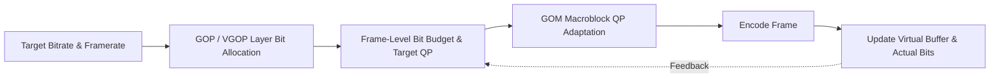

# OpenH264: Deep-Dive Architecture, Data Structures, and Algorithms

This document provides a comprehensive technical breakdown of the OpenH264 codebase (Cisco OpenH264), detailing the internal architectures, primary data structures, algorithmic implementations, and processing pipelines for both the **H.264 / AVC Video Decoder** and **Video Encoder**.

---

## Table of Contents
1. [High-Level System Architecture](#1-high-level-system-architecture)
2. [H.264 Video Decoder](#2-h264-video-decoder)
   - [2.1 Decoder Core Data Structures](#21-decoder-core-data-structures)
   - [2.2 Bitstream Parsing & NAL Unit Extraction](#22-bitstream-parsing--nal-unit-extraction)
   - [2.3 Entropy Decoding (CAVLC and CABAC)](#23-entropy-decoding-cavlc-and-cabac)
   - [2.4 Intra-Frame Prediction](#24-intra-frame-prediction)
   - [2.5 Inter-Frame Prediction & Motion Compensation](#25-inter-frame-prediction--motion-compensation)
   - [2.6 Inverse Quantization & Inverse Transform (IDCT)](#26-inverse-quantization--inverse-transform-idct)
   - [2.7 Macroblock Reconstruction Loop](#27-macroblock-reconstruction-loop)
   - [2.8 In-Loop Deblocking Filter](#28-in-loop-deblocking-filter)
   - [2.9 Decoded Picture Buffer (DPB) & Reference Management](#29-decoded-picture-buffer-dpb--reference-management)
   - [2.10 Error Concealment & Flexible Macroblock Ordering (FMO)](#210-error-concealment--flexible-macroblock-ordering-fmo)
3. [H.264 Video Encoder](#3-h264-video-encoder)
   - [3.1 Encoder Core Data Structures](#31-encoder-core-data-structures)
   - [3.2 Video Pre-Processing & Assessment (VAA)](#32-video-pre-processing--assessment-vaa)
   - [3.3 Rate Control Engine](#33-rate-control-engine)
   - [3.4 Motion Estimation (ME)](#34-motion-estimation-me)
   - [3.5 Mode Decision (MD) & Rate-Distortion Optimization](#35-mode-decision-md--rate-distortion-optimization)
   - [3.6 Forward Transform & Quantization](#36-forward-transform--quantization)
   - [3.7 Macroblock & Slice Encoding Loop](#37-macroblock--slice-encoding-loop)
   - [3.8 Entropy Encoding & NAL Encapsulation](#38-entropy-encoding--nal-encapsulation)
   - [3.9 Slice Multithreading & Scalability Management (SVC / LTR)](#39-slice-multithreading--scalability-management-svc--ltr)
4. [Shared Subsystems & SIMD Optimization](#4-shared-subsystems--simd-optimization)
5. [Complete Source File Reference & Code Map](#5-complete-source-file-reference--code-map)

---

## 1. High-Level System Architecture

OpenH264 is structured into a clean separation between public C++ interface wrappers (in `codec/api/wels/` and `codec/*/plus/`) and high-performance core C/C++ engines (in `codec/decoder/core/` and `codec/encoder/core/`).

```mermaid
flowchart TB
    subgraph Decoder Architecture
        DecAPI[ISVCDecoder / CWelsDecoder] --> DecCtx[SWelsDecoderContext]
        DecCtx --> NALParse[NAL Demux & Annex B Un-escaping]
        NALParse --> EntropyDec[Entropy Decoder: CAVLC / CABAC]
        EntropyDec --> RecLoopDec[MB Reconstruction: Intra / Inter / IDCT]
        RecLoopDec --> DeblockDec[Deblocking Filter]
        DeblockDec --> DPB[Decoded Picture Buffer & Output Frame]
    end

    subgraph Encoder Architecture
        EncAPI[ISVCEncoder / CWelsH264SVCEncoder] --> EncCtx[sWelsEncCtx]
        EncCtx --> VAA[Pre-processing & VAA Analysis]
        VAA --> RC[Hierarchical Rate Control]
        RC --> ME[Motion Estimation: Diamond / Cross / Sub-pel]
        ME --> MD[Mode Decision: Inter vs Intra RDO]
        MD --> DCTQ[Forward DCT & Quantization]
        DCTQ --> EntropyEnc[Entropy Encoder: CAVLC / CABAC]
        DCTQ --> RecLoopEnc[Local Reconstruction & Deblocking]
        RecLoopEnc --> RefList[Reference Picture Management / LTR]
        EntropyEnc --> NALPack[NAL Encapsulation & Annex-B RBSP]
    end
```



### Key Architectural Tenets
1. **SVC-Centric Core Engine**: Even when operating in single-layer AVC mode (Constrained Baseline Profile), the underlying data structures treat the stream as a Scalable Video Coding hierarchy with 1 spatial Dependency Layer (`iDid = 0`) and multiple Temporal Layers (`uiTemporalId`).
2. **Hardware Acceleration Abstraction**: Low-level compute-intensive kernels (motion compensation, SAD/SATD calculation, transforms, intra predictors, deblocking) are abstracted via function pointer tables (`SWelsFuncPtrList` / `SDeblockingFunc`) dynamically populated at runtime with SSE/AVX (x86/x64) or NEON (ARM) assembly routines, falling back to C/C++ implementations.
3. **Cache-Aligned Memory Management**: To ensure SIMD efficiency and prevent false sharing across threads, pixel buffers and coefficient matrices are allocated with 16-byte or 32-byte alignment via `CMemoryAlign`.

---

## 2. H.264 Video Decoder

### 2.1 Decoder Core Data Structures

The decoder's runtime state is heavily centralized to avoid re-allocations and simplify state-passing across modules.

* **[SWelsDecoderContext](openh264/codec/decoder/core/inc/decoder_context.h)** (`pCtx`):
  * `sRawData`, `sSavedData`: Input bitstream data buffers.
  * `sBs`: Auxiliary bitstream reader ([SBitStringAux](openh264/codec/decoder/core/inc/bit_stream.h)).
  * `sSpsPpsCtx`: Global storage for active and buffered Sequence Parameter Sets (`SSps`), Picture Parameter Sets (`SPps`), and Subset SPS (`SSubsetSps`).
  * `pPicBuff`: Reconstructed picture buffer pool managed dynamically.
  * `sRefPic`: Active reference picture lists (`pRefList`, `pShortRefList`, `pLongRefList`).
  * `sMb`: Multi-layer macroblock level parameters (types, motion vectors, reference indices, transform coefficients, intra prediction modes).
  * `sDeblockingFunc`: Function pointer dispatch table for optimized deblocking kernels.

* **[SPicture](openh264/codec/decoder/core/inc/picture.h)**:
  * Central entity representing a reconstructed or reference picture.
  * `pData[4]` and `iLinesize[4]`: Pointers to allocated cache-aligned Y, U, and V planar buffers and their corresponding strides.
  * `bUsedAsRef`, `bIsLongRef`: Boolean flags used by the DPB to determine lifecycle state.
  * `iFrameNum`, `iFramePoc`: Identifiers for frame ordering and motion vector scaling.

* **[SDqLayer](openh264/codec/decoder/core/inc/decoder_core.h)**:
  * Spatial layer representation. Contains slice configurations, macroblock metadata maps (`pMbType`, `pMv`, `pRefIndex`, `pLumaNzc`, `pChromaNzc`), and active parameter sets parsed for the current Dependency/Quality layer slice.

* **[SBitStringAux](openh264/codec/decoder/core/inc/bit_stream.h)**:
  * Bitstream reader tracking `pStartBuf`, `pEndBuf`, `pCurBuf`, `uiBitsLeft`, and current 32-bit register `uiValue` for fast bitwise extraction.

* **[SAccessUnit](openh264/codec/decoder/core/inc/asymmetric_mul.h)** / **PAccessUnitList**:
  * Demuxing queue maintaining ordered NAL unit payloads for an Access Unit before frame assembly.

* **[SWelsCabacDecEngine](openh264/codec/decoder/core/inc/decoder_context.h)** & **[SWelsCabacCtx](openh264/codec/decoder/core/inc/decoder_context.h)**:
  * CABAC arithmetic decoding state tracking Range ($R$), Offset ($V$), and 6-bit probability model states (`uiState`, `uiMPS`).

* **[SFmo](openh264/codec/decoder/core/inc/fmo.h)** & **PMbaMap**:
  * Flexible Macroblock Ordering allocation maps storing block coordinate-to-slice group translations.

#### Summary of Decoder Core Algorithms & Data Structures Matrix

| Algorithmic Subsystem | Primary C++ Class / Struct | Core Mathematical / Algorithmic Principle |
| :--- | :--- | :--- |
| **Annex-B Demuxing** | `SBitStringAux`, `SAccessUnit` | Start code detection (`0x000001`/`0x00000001`), emulation prevention stripping (`0x000003` $\to$ `0x0000`). |
| **Exp-Golomb Parsing** | `SBitStringAux` | Variable-length parsing for unsigned (`ue`), signed (`se`), and truncated (`te`) syntax elements. |
| **CAVLC Decoding** | `SDqLayer`, `SWelsDecoderContext` | Adaptive context $nC = \frac{nA + nB + 1}{2}$, `CoeffToken`, `TotalZeros`, `RunBefore` mapping. |
| **CABAC Decoding** | `SWelsCabacDecEngine`, `SWelsCabacCtx` | Range $R$ / Offset $V$ interval subdivision, 6-bit state transition tables, MPS/LPS renormalization. |
| **Intra Prediction** | `SWelsDecoderContext` | Spatial interpolation: 4x4 Luma (9 modes), 16x16 Luma (4 modes incl. Plane), Chroma 8x8 (DC, H, V, Plane). |
| **Motion Prediction** | `SDqLayer`, `SMB` | Component-wise median MVP $= \text{median}(MV_A, MV_B, MV_C)$ with directional fallback rules. |
| **Motion Compensation** | `SPicture`, `SWelsFuncPtrList` | 6-tap Wiener filter $\frac{1}{32}(1, -5, 20, 20, -5, 1)$ for 1/2-pel luma, bilinear for 1/4-pel luma & 1/8-pel chroma. |
| **IQ & IDCT** | `SDqLayer` | Scale $W'_{ij} = (W_{ij} \cdot V_{ij}(QP \pmod 6)) \ll (QP / 6)$, 4x4 core IDCT butterfly, 4x4/2x2 Hadamard DC. |
| **Deblocking Filter** | `SDeblockingFunc`, `SPicture` | Boundary strength $bS \in [0..4]$ computation, $\alpha(QP)/\beta(QP)$ boundary thresholds, $t_{C0}$ clipping. |
| **DPB Management** | `SRefList`, `SPicture` | FIFO sliding-window eviction, Memory Management Control Operations (MMCO commands 1–6). |
| **Error Concealment** | `SWelsDecoderContext`, `SPicture` | Temporal motion vector & macroblock copy/interpolation from collocated reference frames. |
| **FMO Processing** | `SFmo`, `PMbaMap` | Macroblock Allocation Map (MBAmap) mapping coordinates to slice groups (Interleaved, Scattered, Foreground). |


---

### 2.2 Bitstream Parsing & NAL Unit Extraction

Bitstream processing in [au_parser.cpp](openh264/codec/decoder/core/src/au_parser.cpp) and [bit_stream.cpp](openh264/codec/decoder/core/src/bit_stream.cpp) follows the Annex B byte stream standard.

#### Implementation & Algorithm Workflow:
1. **Start Code Prefix Detection**:
   * Scans the input stream for `0x000001` (3-byte) or `0x00000001` (4-byte) start codes to delineate NAL boundaries using optimized 32-bit register reads.
2. **Emulation Prevention Stripping (`0x03`)**:
   * H.264 inserts `0x03` bytes after two consecutive `0x00` bytes to prevent false start code generation (`0x000003`). 
   * `SBitStringAux` strips `0x03` bytes into a contiguous Raw Byte Sequence Payload (RBSP) buffer while tracking buffer boundaries (`pStartBuf`, `pEndBuf`, `pCurBuf`).
3. **Exp-Golomb Variable Length Parsing**:
   * Implemented in [dec_golomb.h](openh264/codec/decoder/core/inc/dec_golomb.h).
   * **Unsigned Exp-Golomb (`ue`)**:
     1. Counts $M$ leading zero bits using bit-scan instructions or 32-bit register masking.
     2. Reads the next $M$ info bits using `BsGetBits(sBs, M)`.
     3. Computes value: $\text{code\_num} = 2^M - 1 + \text{info\_bits}$.
   * **Signed Exp-Golomb (`se`)**:
     * Parses $\text{code\_num}$ via `ue`, then maps: $val = (-1)^{\text{code\_num}+1} \cdot \left\lceil \frac{\text{code\_num}}{2} \right\rceil$.
   * **Truncated Exp-Golomb (`te`)**:
     * Evaluates range $x$. If $x > 1$, parses as `ue`; if $x = 1$, reads 1 inverted bit.
4. **NAL Unit Header Parsing**:
   * Extracts `forbidden_zero_bit`, `nal_ref_idc` (reference priority), and `nal_unit_type` (e.g., SPS: 7, PPS: 8, IDR Slice: 5, Non-IDR Slice: 1).
5. **Parameter Sets (SPS/PPS) Caching**:
   * SPS and PPS NALs are parsed into `SSps` and `SPps` structures and cached globally in `sSpsPpsCtx`. Active sets are fetched dynamically per slice header.

---

### 2.3 Entropy Decoding (CAVLC and CABAC)

Selected via `entropy_coding_mode_flag` in the active PPS:

#### A. CAVLC (Context-Adaptive Variable-Length Coding)
* Implemented in [parse_mb_syn_cavlc.cpp](openh264/codec/decoder/core/src/parse_mb_syn_cavlc.cpp).
* **Algorithm Implementation**:
  1. **`coeff_token` & Context $nC$**:
     * Calculates context index $nC$ using neighboring non-zero coefficient counts ($nA$ Left, $nB$ Top):
       $$nC = \begin{cases} nA & \text{if Left available only} \\ nB & \text{if Top available only} \\ \left\lfloor \frac{nA + nB + 1}{2} \right\rfloor & \text{if both available} \\ 0 & \text{if neither available} \end{cases}$$
     * Looks up VLC tables based on $nC$: $nC \in [0..1]$ (Table 1), $nC \in [2..3]$ (Table 2), $nC \in [4..7]$ (Table 3), $nC \ge 8$ (Table 4) to decode `TotalCoeff` ($0 \dots 16$) and `TrailingOnes` ($0 \dots 3$).
  2. **Trailing Ones Signs**: Reads 1 bit per trailing $\pm 1$ coefficient.
  3. **Non-Zero Coefficients (Levels)**: Reads level prefix (unary zero run) and suffix bits via Exp-Golomb.
  4. **`TotalZeros`**: Uses VLC tables indexed by `TotalCoeff` to parse total zeros preceding the last non-zero level.
  5. **`RunBefore`**: Iteratively decodes zero runs before each non-zero level until remaining zeros reach zero.

#### B. CABAC (Context-Based Adaptive Binary Arithmetic Coding)
* Implemented in [parse_mb_syn_cabac.cpp](openh264/codec/decoder/core/src/parse_mb_syn_cabac.cpp) and [cabac_decoder.h](openh264/codec/decoder/core/inc/cabac_decoder.h).
* **Arithmetic Engine Implementation** (`SWelsCabacDecEngine`):
  * Maintains 9-bit Range ($R$) and 32-bit Offset ($V$) registers.
  * **Interval Division**:
    $$R_{\text{LPS}} = \text{rangeTabLPS}[pState][(R \gg 6) \ \& \ 3]$$
    $$R = R - R_{\text{LPS}}$$
  * **Bit Decoding & Renormalization**:
    * If $V \ge (R \ll 8)$, symbol is Least Probable Symbol (LPS):
      $$V = V - (R \ll 8), \quad R = R_{\text{LPS}}$$
      $$pState = \text{transTableLPS}[pState]$$
    * Else symbol is Most Probable Symbol (MPS):
      $$pState = \text{transTableMPS}[pState]$$
    * Renormalization shifts $R$ and refills $V$ from the bitstream whenever $R < 256$.

---

### 2.4 Intra-Frame Prediction

Implemented in [get_intra_predictor.cpp](openh264/codec/decoder/core/src/get_intra_predictor.cpp):

* **Intra 4x4 Luma Implementation** (9 Modes):
  * **Mode 0 (Vertical)**: Copies top neighbor pixels down: $P[x, y] = p[x, -1]$.
  * **Mode 1 (Horizontal)**: Copies left neighbor pixels right: $P[x, y] = p[-1, y]$.
  * **Mode 2 (DC)**: Averages top and left neighbors: $P[x, y] = \left( \sum p[x, -1] + \sum p[-1, y] + 4 \right) \gg 3$.
  * **Mode 3 (Diagonal Down-Left)**: Interpolates diagonal top-right boundary pixels.
  * **Mode 4 (Diagonal Down-Right)**: Interpolates top-left corner diagonal pixels.
  * **Modes 5–8 (VR, HD, VL, HU)**: Directional angular interpolations combining weighted averages of adjacent pixels.
* **Intra 16x16 Luma & Chroma 8x8 Plane Mode**:
  * Evaluates linear spatial gradient equation across boundary pixels:
    $$a = 16 \cdot (p[-1, 15] + p[15, -1])$$
    $$b = \frac{17 \cdot H + 16}{32}, \quad c = \frac{17 \cdot V + 16}{32}$$
    $$P[x, y] = \text{Clip1}_Y\left( \frac{a + b \cdot (x - 7) + c \cdot (y - 7) + 16}{32} \right)$$
* **Neighbor Availability Masking**: Evaluates slice boundary bitmasks (`TOP_MB`, `LEFT_MB`, `TOPLEFT_MB`, `TOPRIGHT_MB`) to prevent reading across un-decoded or cross-slice boundary pixels.

---

### 2.5 Inter-Frame Prediction & Motion Compensation

Implemented in [mv_pred.cpp](openh264/codec/decoder/core/src/mv_pred.cpp) and [mc.cpp](openh264/codec/common/src/mc.cpp):

1. **Motion Vector Prediction (MVP)**:
   * Calculates component-wise median of Left ($A$), Top ($B$), and Top-Right ($C$) neighbor blocks:
     $$\text{MVP}_x = \text{median}(MV_{A,x}, MV_{B,x}, MV_{C,x}), \quad \text{MVP}_y = \text{median}(MV_{A,y}, MV_{B,y}, MV_{C,y})$$
   * Directional fallback rules handle non-square partitions ($16 \times 8$ uses Top/Left, $8 \times 16$ uses Left/Top-Right).
2. **Sub-Pixel Motion Compensation Kernels**:
   * **Half-Pixel Luma (6-tap Wiener Filter)**:
     Computes half-pel samples horizontally and vertically using symmetric filter weights $\frac{1}{32}(1, -5, 20, 20, -5, 1)$:
     $$E = \text{Clip1}_Y\left( \frac{A - 5B + 20C + 20D - 5E + F + 16}{32} \right)$$
   * **Quarter-Pixel Luma**: Bilinear averaging between integer and half-pel samples:
     $$P_{1/4} = \left( P_{\text{integer}} + P_{\text{half}} + 1 \right) \gg 1$$
   * **Chroma Sub-Pel (1/8-pel Bilinear)**: Interpolates 2D chroma samples:
     $$P(x,y) = \left( (8-dx)(8-dy)A + dx(8-dy)B + (8-dx)dy C + dx\,dy\,D + 32 \right) \gg 6$$

---

### 2.6 Inverse Quantization & Inverse Transform (IDCT)

Implemented in [decode_mb_aux.cpp](openh264/codec/decoder/core/src/decode_mb_aux.cpp):

1. **Inverse Quantization**:
   * Scales transform levels using scaling matrix $V_{ij}(QP \pmod 6)$:
     $$W'_{ij} = (W_{ij} \cdot V_{ij}(QP \pmod 6)) \ll \lfloor QP / 6 \rfloor$$
2. **4x4 Core Inverse Integer DCT**:
   * Executed via 2D separable horizontal and vertical butterfly transforms:
     $$f_0 = x_0 + x_2, \quad f_1 = x_0 - x_2, \quad f_2 = (x_1 \gg 1) - x_3, \quad f_3 = x_1 + (x_3 \gg 1)$$
     $$y_0 = f_0 + f_3, \quad y_1 = f_1 + f_2, \quad y_2 = f_1 - f_2, \quad y_3 = f_0 - f_3$$
3. **Hadamard Transforms**:
   * 4x4 inverse Hadamard for Intra 16x16 DC coefficients: $Y = H \cdot DC \cdot H^T$.
   * 2x2 inverse Hadamard for Chroma DC coefficients.

---

### 2.7 Macroblock Reconstruction Loop

Implemented in [rec_mb.cpp](openh264/codec/decoder/core/src/rec_mb.cpp):
* Integrates residual IDCT blocks with spatial intra or inter motion-compensated predictors.
* Performs pixel clamping: $\text{Pixel} = \min(255, \max(0, \text{Predictor} + \text{Residual}))$.
* Writes planar output to `SPicture` frame buffers (`pData[0..2]`).

---

### 2.8 In-Loop Deblocking Filter

Implemented in [deblocking.cpp](openh264/codec/decoder/core/src/deblocking.cpp):

1. **Boundary Strength ($bS$) Evaluation**:
   * $bS = 4$: Macroblock boundary where either block is Intra-coded.
   * $bS = 3$: Non-macroblock boundary where either block is Intra-coded.
   * $bS = 2$: Inter block with non-zero transform coefficients ($NNZ > 0$).
   * $bS = 1$: Inter block with different reference frames or $|MV_{x1} - MV_{x2}| \ge 4$ quarter-pels.
   * $bS = 0$: No filtering.
2. **Edge Filtering & Thresholding**:
   * Evaluates boundary condition: $|p_0 - q_0| < \alpha(QP) \ \land \ |p_1 - p_0| < \beta(QP) \ \land \ |q_1 - q_0| < \beta(QP)$.
   * Applies $t_{C0}$ clipping offset to limit maximum pixel modification:
     $$\Delta = \text{Clip3}(-t_{C0}, t_{C0}, (((q_0 - p_0) \ll 2) + (p_1 - q_1) + 4) \gg 3)$$
     $$p'_0 = \text{Clip1}_Y(p_0 + \Delta), \quad q'_0 = \text{Clip1}_Y(q_0 - \Delta)$$

---

### 2.9 Decoded Picture Buffer (DPB) & Reference Management

Implemented in [manage_dec_ref.cpp](openh264/codec/decoder/core/src/manage_dec_ref.cpp):

* **Sliding-Window Eviction**: Automatically unmarks oldest short-term reference frame when total references exceed `max_num_ref_frames`.
* **MMCO (Memory Management Control Operations)**:
  * **MMCO 1**: Mark short-term frame as unused for reference.
  * **MMCO 2**: Mark long-term frame as unused for reference.
  * **MMCO 3**: Assign `long_term_frame_idx` to a short-term frame.
  * **MMCO 4**: Specify maximum `long_term_frame_idx`.
  * **MMCO 5**: Clear all reference frames and reset POC/FrameNum to 0.
  * **MMCO 6**: Assign `long_term_frame_idx` to current frame.

---

### 2.10 Error Concealment & Flexible Macroblock Ordering (FMO)

* **Error Concealment** ([error_concealment.cpp](openh264/codec/decoder/core/src/error_concealment.cpp)):
  * **Temporal Concealment**: Detects missing slices/frames via gaps in `frame_num`. Copies collocated macroblocks, motion vectors, and reference indices from the most recent valid reference frame in DPB to conceal lost slices.
* **FMO** ([fmo.cpp](openh264/codec/decoder/core/src/fmo.cpp)):
  * Resolves non-raster macroblock allocation maps (MBAmap):
    * **Type 0 (Interleaved)**: Alternating run-length slice groups.
    * **Type 1 (Dispersed)**: Checkerboard macroblock distribution ($i \mapsto (i \pmod N)$).
    * **Type 2 (Foreground/Background)**: Rectangular region slice groups.
    * **Type 6 (Explicit)**: Explicit slice group mapping per macroblock.

---

## 3. H.264 Video Encoder

### 3.1 Encoder Core Data Structures

The encoder state is encapsulated heavily in [sWelsEncCtx](openh264/codec/encoder/core/inc/encoder_context.h):

* **[sWelsEncCtx](openh264/codec/encoder/core/inc/encoder_context.h)** (`pEncCtx`):
  * `pSvcParam`: Global user configuration mapping ([SWelsSvcCodingParam](openh264/codec/encoder/core/inc/param_svc.h)).
  * `pEncPic`, `pDecPic`, `pRefPic`: Source input frame, current local reconstruction, and reference DPB buffers.
  * `pWelsSvcRc`: Rate control state machine context ([SWelsSvcRc](openh264/codec/encoder/core/inc/rc.h)).
  * `pVaa`: Video pre-processing and complexity analysis objects ([SVAAFrameInfo](openh264/codec/encoder/core/inc/wels_preprocess.h)).
  * `pLtr`: Long-Term Reference state machine ([SLTRState](openh264/codec/encoder/core/inc/encoder_context.h)), which tracks LTR marking feedback and delays.
  * `pFuncList`: Function pointer table dynamically initialized with SIMD optimized compute routines.

* **[SWelsSvcCodingParam](openh264/codec/encoder/core/inc/param_svc.h)** / **SEncParamExt**:
  * Comprehensive encoder configuration containing spatial layer profiles, temporal layer frame rates, target bitrates, slice partitioning modes (`uiSliceMode`), rate control parameters, and LTR flags.

* **[SWelsME](openh264/codec/encoder/core/inc/svc_motion_estimate.h)** (Motion Estimation Structure):
  * Contains localized tracking variables for the current macroblock's search: predicted motion vector `sMvp`, best current search position `sMv`, cost accumulators `uiSadCost`, `uiSatdCost`, and penalty lookup tables `pMvdCost`.

* **[SSliceCtx](openh264/codec/encoder/core/inc/slice_multi_threading.h)** / **SSlice**:
  * Multi-threaded slice partitioning structures tracking MB start/end indices, bit limits for size-limited MTU slicing (`SM_SIZELIMITED_SLICE`), and active slice headers.

* **[SVAAFrameInfo](openh264/codec/encoder/core/inc/wels_preprocess.h)**:
  * Frame pre-processing analysis container holding Sum of Absolute Differences (SAD), frame variance statistics, background detection maps, and downsampled spatial resolution pyramids.

* **[SWelsSvcRc](openh264/codec/encoder/core/inc/rc.h)** & **SRcGom**:
  * Rate Control state tracking GOP bit allocation, virtual frame buffer occupancy, target $Q_{\text{step}}$ computation, and Group of Macroblocks (GOM) row-level QP adjustment maps.

* **[SLTRState](openh264/codec/encoder/core/inc/encoder_context.h)**:
  * LTR feedback control machine tracking long-term reference frame marking, confirmation acknowledgments, and recovery reference selection.

* **[CWelsTaskManage](openh264/codec/encoder/core/inc/wels_task_management.h)** & **CWelsThreadPool**:
  * Multi-threaded task manager and thread pool dispatching slice encoding tasks (`IWelsTask`) concurrently across CPU cores.

#### Summary of Encoder Core Algorithms & Data Structures Matrix

| Algorithmic Subsystem | Primary C++ Class / Struct | Core Mathematical / Algorithmic Principle |
| :--- | :--- | :--- |
| **VAA Preprocessing** | `SVAAFrameInfo`, `CWelsPreProcess` | Frame variance & SAD pre-computation, scene change detection, polyphase/bilinear downsampling. |
| **Rate Control (RC)** | `SWelsSvcRc`, `SRcGom` | Linear Complexity Model $Q_{\text{step}} = \frac{\text{iLinearCmplx} \times \text{ComplexityRatio}}{\text{TargetBits}}$, VGOP allocation, GOM QP adaptation. |
| **Motion Estimation** | `SWelsME`, `sWelsEncCtx` | Fast Integer Search (Little Diamond `ME_DIA`, Cross `ME_CROSS`), Half/Quarter-pel SAD refinement, MVP cost. |
| **Mode Decision (MD)** | `sWelsEncCtx`, `SWelsME` | Lagrangian cost $J = D + \lambda R$ using SATD (4x4 Hadamard transform distortion), early skip termination. |
| **Forward DCT & Quant** | `sWelsEncCtx` | Forward 4x4 DCT ($W = C_f X C_f^T$), Dead-Zone Quantization with dynamic offset $f$ ($f \approx 1/6$ Inter vs $1/3$ Intra). |
| **Entropy Encoding** | `SWelsCabacCtx`, `SCabacBitString` | CAVLC (CoeffToken, TotalZeros, RunBefore) and CABAC binary arithmetic encoding engine. |
| **NAL Encapsulation** | `sWelsEncCtx` | Annex-B start codes, NAL header synthesis, emulation prevention byte insertion (`0x03`). |
| **Multi-thread Slicing** | `SSliceCtx`, `CWelsTaskManage` | Dynamic size-limited MTU slicing (`SM_SIZELIMITED_SLICE`), lock-free task queue slice dispatching. |
| **LTR & Scalability** | `SLTRState`, `SPicture` | Feedback-driven LTR frame marking & reference recovery bypassing keyframes during loss. |


---

### 3.2 Video Pre-Processing & Assessment (VAA)

Handled by [wels_preprocess.cpp](openh264/codec/encoder/core/src/wels_preprocess.cpp):

#### Implementation & Algorithm Workflow:
1. **Color Space Conversion**:
   * Converts incoming RGB24, BGR24, RGBA, NV12, or YUY2 payloads to planar YUV 4:2:0 using SIMD-optimized integer conversion matrices:
     $$Y = ((66 \cdot R + 129 \cdot G + 25 \cdot B + 128) \gg 8) + 16$$
     $$U = ((-38 \cdot R - 74 \cdot G + 112 \cdot B + 128) \gg 8) + 128$$
     $$V = ((112 \cdot R - 94 \cdot G - 18 \cdot B + 128) \gg 8) + 128$$
2. **Spatial Downsampling**:
   * Generates spatial layer pyramids dynamically using SIMD polyphase or bilinear downsampling filters.
3. **Frame Complexity & Scene Change Analysis (VAA)** (`SVAAFrameInfo`):
   * **Frame Variance**: Computes block variance $V = \sum x^2 - \frac{(\sum x)^2}{N}$ to measure spatial activity.
   * **Sum of Absolute Differences (SAD)**: Calculates frame-level SAD between current and reference downsampled planes.
   * **Scene Change Detection**: Flags a scene change if $\text{SAD}_{\text{current}} > 2.5 \times \text{SAD}_{\text{average}}$. When triggered, forces an IDR frame or resets Rate Control bit budgets.

---

### 3.3 Rate Control Engine

Implemented in [ratectl.cpp](openh264/codec/encoder/core/src/ratectl.cpp):



#### Detailed Algorithm Implementation:
1. **Virtual GOP (VGOP) Allocation**:
   * Allocates bit target budgets hierarchically across temporal layers ($T_0, T_1, T_2, T_3$). Base layer frames ($T_0$) receive a higher proportion of bits and lower QPs.
2. **Linear Complexity Bit Rate Model**:
   * OpenH264 avoids heavy quadratic $R-D$ roots by using a fast Linear Complexity Model:
     $$\text{iLinearCmplx} = \text{iFrameDqBits} \times Q_{\text{step}}$$
   * Calculates target $Q_{\text{step}}$ for incoming frames:
     $$Q_{\text{step}} = \frac{\text{iLinearCmplx} \times \text{ComplexityRatio}}{\text{TargetBits}}$$
   * Converts $Q_{\text{step}}$ to H.264 QP via log table lookup: $\text{QP} = 6 \cdot \log_2(Q_{\text{step}}) + 12$.
3. **Group of Macroblocks (GOM) Rate Control**:
   * Dynamically adjusts macroblock row QPs within a frame to prevent local buffer overruns:
     $$\Delta \text{QP}_{\text{GOM}} = \text{Clip3}\left(-3, 3, \left\lfloor \frac{\text{Bits}_{\text{GOM\_Actual}} - \text{Bits}_{\text{GOM\_Target}}}{\text{BitThreshold}} \right\rfloor \right)$$
4. **Leaky-Bucket Virtual Buffer & Frame Skipping**:
   * Maintains virtual buffer occupancy register $B_v$. If $B_v > 0.5 \times \text{MaxBufferCapacity}$, triggers frame skipping to prevent latency spikes.

---

### 3.4 Motion Estimation (ME)

Implemented in [svc_motion_estimate.cpp](openh264/codec/encoder/core/src/svc_motion_estimate.cpp):

#### Implementation & Algorithm Workflow:
1. **MVP Candidate Initialization**:
   * Evaluates spatial MVP candidate, zero MV $(0,0)$, and collocated temporal reference MV.
2. **Lagrangian Motion Cost**:
   * Minimizes cost equation:
     $$\text{Cost} = \text{SAD}(MV) + \lambda_{\text{MOTION}} \cdot R(MV - \text{MVP})$$
     where $\lambda_{\text{MOTION}} = \sqrt{0.85 \cdot 2^{(QP-12)/3}}$, and $R(MVD)$ evaluates Exp-Golomb bit cost for the MVD vector.
3. **Fast Integer Search Modes**:
   * **Little Diamond Search (`ME_DIA`)**: Evaluates 4 adjacent cross points. If center is minimal, search halts instantly.
   * **Cross / Large Diamond Search (`ME_CROSS`)**: Expands search radius iteratively for high-motion macroblocks.
4. **Sub-Pixel Refinement (`ME_FME`)**:
   * Tests 8 half-pel neighbor locations surrounding the best integer candidate using interpolated reference pixels.
   * Tests 8 quarter-pel neighbor locations surrounding the best half-pel position.

---

### 3.5 Mode Decision (MD) & Rate-Distortion Optimization

Implemented in [svc_mode_decision.cpp](openh264/codec/encoder/core/src/svc_mode_decision.cpp):

#### Implementation & Algorithm Workflow:
1. **Rate-Distortion Optimization (RDO)**:
   * Selects macroblock partition mode by minimizing Lagrangian cost:
     $$J = D_{\text{SATD}} + \lambda_{\text{MODE}} \cdot R_{\text{bits}}$$
     where distortion $D_{\text{SATD}}$ is calculated via a 4x4 Hadamard transform of the spatial residual $(X - \text{Pred})$ to reflect frequency-domain perceptual distortion.
2. **Partition Mode Evaluation**:
   * Tests Inter modes (`Inter_16x16`, `Inter_16x8`, `Inter_8x16`, `Inter_8x8`).
   * Tests Intra modes (`Intra_4x4` 9 modes, `Intra_16x16` 4 modes).
3. **Fast Skip / Early Termination**:
   * If `SKIP` mode or `Inter_16x16` yields an SATD cost below an adaptive threshold ($\text{SATD} < \text{Threshold}_{\text{early}}$), the encoder instantly skips all sub-partition and Intra mode evaluations, achieving massive speedups.

---

### 3.6 Forward Transform & Quantization

Implemented in [encode_mb_aux.cpp](openh264/codec/encoder/core/src/encode_mb_aux.cpp):

1. **4x4 Forward Core Transform**:
   * Computes integer 2D DCT approximation:
     $$W = C_f \cdot (X_{\text{orig}} - X_{\text{pred}}) \cdot C_f^T, \quad C_f = \begin{pmatrix} 1 & 1 & 1 & 1 \\ 2 & 1 & -1 & -2 \\ 1 & -1 & -1 & 1 \\ 1 & -2 & 2 & -1 \end{pmatrix}$$
2. **Quantization with Dynamic Dead-Zone Offset ($f$)**:
   * Implemented via `WELS_NEW_QUANT` macro:
     $$Z_{ij} = \text{sign}(W_{ij}) \cdot \left\lfloor \frac{|W_{ij}| \cdot M_{ij}(QP \pmod 6) + f}{2^{15 + \lfloor QP/6 \rfloor}} \right\rfloor$$
   * Dead-zone offset $f$: $f = \frac{5}{6} \cdot 2^{15 + \lfloor QP/6 \rfloor}$ for Inter blocks (suppresses high-frequency noise) vs $f = \frac{5}{3} \cdot 2^{15 + \lfloor QP/6 \rfloor}$ for Intra blocks (preserves edge detail).
3. **Forward Hadamard DC Transforms**:
   * Applies 4x4 forward Hadamard transform to DC coefficients of Intra 16x16 blocks, and 2x2 forward Hadamard to Chroma DC coefficients.

---

### 3.7 Macroblock & Slice Encoding Loop

Coordinated in [svc_encode_slice.cpp](openh264/codec/encoder/core/src/svc_encode_slice.cpp) and [svc_encode_mb.cpp](openh264/codec/encoder/core/src/svc_encode_mb.cpp):
* Iterates raster-scan macroblocks across each slice.
* Executes Mode Decision, Forward Transform, Quantization, Inverse Transform, and Local Reconstruction (clamped $0 \dots 255$).
* Updates local encoder DPB picture buffers so reference pictures match decoder state.

---

### 3.8 Entropy Encoding & NAL Encapsulation

Implemented in [vlc_encoder.cpp](openh264/codec/encoder/core/src/vlc_encoder.cpp), [set_mb_syn_cabac.cpp](openh264/codec/encoder/core/src/set_mb_syn_cabac.cpp), and [nal_encap.cpp](openh264/codec/encoder/core/src/nal_encap.cpp):

1. **CAVLC Encoding**:
   * Writes `CoeffToken`, level prefix/suffix bits, `TotalZeros`, and `RunBefore` using pre-computed Exp-Golomb bitstream packing routines (`BsWriteBits`).
2. **CABAC Encoding**:
   * Packs syntax bins into the binary arithmetic engine, updating 6-bit context state tables after each bin.
3. **NAL Encapsulation & Emulation Prevention**:
   * Prepends 3-byte (`0x000001`) or 4-byte (`0x00000001`) Annex-B start codes.
   * Inserts emulation prevention byte `0x03` whenever two consecutive zero bytes (`0x0000`) are followed by bytes `0x00`, `0x01`, `0x02`, or `0x03`.

---

### 3.9 Slice Multithreading & Scalability Management (SVC / LTR)

Implemented in [slice_multi_threading.cpp](openh264/codec/encoder/core/src/slice_multi_threading.cpp), [wels_task_management.cpp](openh264/codec/encoder/core/src/wels_task_management.cpp), and [ref_list_mgr_svc.cpp](openh264/codec/encoder/core/src/ref_list_mgr_svc.cpp):

* **Slicing Modes (`uiSliceMode`)**:
  * `SM_SINGLE_SLICE`: Solitary slice per frame.
  * `SM_FIXEDSLCNUM_SLICE`: Fixed $N$ slices mapped to thread pools (`CWelsThreadPool`).
  * `SM_SIZELIMITED_SLICE`: Dynamic slice splitting based on MTU byte limits. Evaluates accumulated slice payload bits per macroblock and terminates slice boundary before exceeding MTU size (e.g. 1400 bytes).
* **LTR Feedback & Recovery**:
  * `SLTRState` manages long-term reference frame marking.
  * When an LTR frame is acknowledged by receiver feedback, the encoder issues an MMCO command marking it as a long-term reference.
  * In case of packet loss on non-base frames, the encoder references the acknowledged LTR base frame for inter prediction, instantly restoring video decodability without generating an expensive IDR keyframe.

---

## 4. Shared Subsystems & SIMD Optimization

OpenH264 achieves real-time performance through comprehensive assembly optimization across multiple architectures. Runtime detection (`uiCpuFlag`) dynamically patches `SWelsFuncPtrList` matrices.

```
codec/common/
├── inc/
│   ├── mc.h              # Motion compensation declarations
│   ├── deblocking_common.h # Deblocking filter shared helpers
│   ├── intra_pred_common.h # Intra prediction prototypes
│   ├── sad_common.h      # SAD & SATD cost primitives
│   └── memory_align.h    # Aligned allocation helpers
└── src/
    ├── x86/ / x86_64/    # MMX, SSE2, SSSE3, SSE4.1, AVX2 NASM files
    ├── arm/ / arm64/     # ARMv7 NEON and AArch64 assembly files
    └── mc.cpp            # C/C++ reference fallback implementations
```

### SIMD Acceleration Targets
1. **Motion Compensation**: 16x16, 16x8, 8x16, 8x8 block half-pel filtering utilizing shuffle and pack/unpack SSE2/NEON vector instructions.
2. **SAD / SATD Kernels**: Parallel vector difference and accumulation combined with 4x4 Hadamard transform butterflies executed natively in 128-bit vector lanes.
3. **DCT & IDCT Transforms**: 16-bit integer matrix multiplications processing four 4x4 blocks concurrently.

---

## 5. Complete Source File Reference & Code Map

The following table comprehensively maps every essential C/C++ source and header file across the decoding and encoding engines of OpenH264:

| Subsystem | Module / Area | Primary Header Files | Key Implementation Files |
| :--- | :--- | :--- | :--- |
| **Decoder** | Public C++ Facade | [codec_api.h](openh264/codec/api/wels/codec_api.h), [welsDecoderExt.h](openh264/codec/decoder/plus/inc/welsDecoderExt.h) | [welsDecoderExt.cpp](openh264/codec/decoder/plus/src/welsDecoderExt.cpp) |
| **Decoder** | Context & Control | [decoder_context.h](openh264/codec/decoder/core/inc/decoder_context.h), [decoder_core.h](openh264/codec/decoder/core/inc/decoder_core.h) | [decoder.cpp](openh264/codec/decoder/core/src/decoder.cpp), [decoder_core.cpp](openh264/codec/decoder/core/src/decoder_core.cpp) |
| **Decoder** | NAL Demux & Bitstream | [nalu.h](openh264/codec/decoder/core/inc/nalu.h), [parameter_sets.h](openh264/codec/decoder/core/inc/parameter_sets.h), [bit_stream.h](openh264/codec/decoder/core/inc/bit_stream.h) | [au_parser.cpp](openh264/codec/decoder/core/src/au_parser.cpp), [bit_stream.cpp](openh264/codec/decoder/core/src/bit_stream.cpp) |
| **Decoder** | Entropy Parsing (CAVLC / CABAC) | [dec_golomb.h](openh264/codec/decoder/core/inc/dec_golomb.h), [cabac_decoder.h](openh264/codec/decoder/core/inc/cabac_decoder.h) | [parse_mb_syn_cavlc.cpp](openh264/codec/decoder/core/src/parse_mb_syn_cavlc.cpp), [parse_mb_syn_cabac.cpp](openh264/codec/decoder/core/src/parse_mb_syn_cabac.cpp), [cabac_decoder.cpp](openh264/codec/decoder/core/src/cabac_decoder.cpp) |
| **Decoder** | Slice & MB Decoding | [decode_slice.h](openh264/codec/decoder/core/inc/decode_slice.h), [slice.h](openh264/codec/decoder/core/inc/slice.h) | [decode_slice.cpp](openh264/codec/decoder/core/src/decode_slice.cpp), [rec_mb.cpp](openh264/codec/decoder/core/src/rec_mb.cpp) |
| **Decoder** | Spatial Intra Predictors | [get_intra_predictor.h](openh264/codec/decoder/core/inc/get_intra_predictor.h) | [get_intra_predictor.cpp](openh264/codec/decoder/core/src/get_intra_predictor.cpp) |
| **Decoder** | Motion Vector Prediction | [mv_pred.h](openh264/codec/decoder/core/inc/mv_pred.h) | [mv_pred.cpp](openh264/codec/decoder/core/src/mv_pred.cpp) |
| **Decoder** | IDCT & Residual Transforms | [decode_mb_aux.h](openh264/codec/decoder/core/inc/decode_mb_aux.h) | [decode_mb_aux.cpp](openh264/codec/decoder/core/src/decode_mb_aux.cpp) |
| **Decoder** | Deblocking Filter | [deblocking.h](openh264/codec/decoder/core/inc/deblocking.h) | [deblocking.cpp](openh264/codec/decoder/core/src/deblocking.cpp) |
| **Decoder** | DPB & Reference Frame Lists | [manage_dec_ref.h](openh264/codec/decoder/core/inc/manage_dec_ref.h), [pic_queue.h](openh264/codec/decoder/core/inc/pic_queue.h) | [manage_dec_ref.cpp](openh264/codec/decoder/core/src/manage_dec_ref.cpp), [pic_queue.cpp](openh264/codec/decoder/core/src/pic_queue.cpp) |
| **Decoder** | Error Concealment & FMO | [error_concealment.h](openh264/codec/decoder/core/inc/error_concealment.h), [fmo.h](openh264/codec/decoder/core/inc/fmo.h) | [error_concealment.cpp](openh264/codec/decoder/core/src/error_concealment.cpp), [fmo.cpp](openh264/codec/decoder/core/src/fmo.cpp) |
| **Encoder** | Public C++ Facade | [codec_api.h](openh264/codec/api/wels/codec_api.h), [welsEncoderExt.h](openh264/codec/encoder/plus/inc/welsEncoderExt.h) | [welsEncoderExt.cpp](openh264/codec/encoder/plus/src/welsEncoderExt.cpp) |
| **Encoder** | Context & Control | [encoder_context.h](openh264/codec/encoder/core/inc/encoder_context.h), [param_svc.h](openh264/codec/encoder/core/inc/param_svc.h) | [encoder.cpp](openh264/codec/encoder/core/src/encoder.cpp), [encoder_ext.cpp](openh264/codec/encoder/core/src/encoder_ext.cpp) |
| **Encoder** | Video Preprocessing (VAA) | [wels_preprocess.h](openh264/codec/encoder/core/inc/wels_preprocess.h) | [wels_preprocess.cpp](openh264/codec/encoder/core/src/wels_preprocess.cpp) |
| **Encoder** | Rate Control Engine | [rc.h](openh264/codec/encoder/core/inc/rc.h) | [ratectl.cpp](openh264/codec/encoder/core/src/ratectl.cpp) |
| **Encoder** | Motion Estimation (ME) | [svc_motion_estimate.h](openh264/codec/encoder/core/inc/svc_motion_estimate.h) | [svc_motion_estimate.cpp](openh264/codec/encoder/core/src/svc_motion_estimate.cpp) |
| **Encoder** | Mode Decision (MD) & RDO | [svc_mode_decision.h](openh264/codec/encoder/core/inc/svc_mode_decision.h), [md.h](openh264/codec/encoder/core/inc/md.h) | [svc_mode_decision.cpp](openh264/codec/encoder/core/src/svc_mode_decision.cpp), [md.cpp](openh264/codec/encoder/core/src/md.cpp) |
| **Encoder** | Slice & MB Encoding Loops | [svc_encode_slice.h](openh264/codec/encoder/core/inc/svc_encode_slice.h), [svc_encode_mb.h](openh264/codec/encoder/core/inc/svc_encode_mb.h) | [svc_encode_slice.cpp](openh264/codec/encoder/core/src/svc_encode_slice.cpp), [svc_encode_mb.cpp](openh264/codec/encoder/core/src/svc_encode_mb.cpp) |
| **Encoder** | Forward DCT & Quantization | [encode_mb_aux.h](openh264/codec/encoder/core/inc/encode_mb_aux.h) | [encode_mb_aux.cpp](openh264/codec/encoder/core/src/encode_mb_aux.cpp) |
| **Encoder** | Deblocking Filter | [deblocking.h](openh264/codec/encoder/core/inc/deblocking.h) | [deblocking.cpp](openh264/codec/encoder/core/src/deblocking.cpp) |
| **Encoder** | Entropy Encoding | [vlc_encoder.h](openh264/codec/encoder/core/inc/vlc_encoder.h), [set_mb_syn_cabac.h](openh264/codec/encoder/core/inc/set_mb_syn_cabac.h) | [vlc_encoder.cpp](openh264/codec/encoder/core/src/vlc_encoder.cpp), [svc_set_mb_syn_cavlc.cpp](openh264/codec/encoder/core/src/svc_set_mb_syn_cavlc.cpp), [set_mb_syn_cabac.cpp](openh264/codec/encoder/core/src/set_mb_syn_cabac.cpp), [svc_set_mb_syn_cabac.cpp](openh264/codec/encoder/core/src/svc_set_mb_syn_cabac.cpp) |
| **Encoder** | NAL Encapsulation | [nal_encap.h](openh264/codec/encoder/core/inc/nal_encap.h) | [nal_encap.cpp](openh264/codec/encoder/core/src/nal_encap.cpp) |
| **Encoder** | Reference Management & LTR | [ref_list_mgr_svc.h](openh264/codec/encoder/core/inc/ref_list_mgr_svc.h) | [ref_list_mgr_svc.cpp](openh264/codec/encoder/core/src/ref_list_mgr_svc.cpp) |
| **Encoder** | Multi-Threading & Task Mgmt | [slice_multi_threading.h](openh264/codec/encoder/core/inc/slice_multi_threading.h), [wels_task_management.h](openh264/codec/encoder/core/inc/wels_task_management.h) | [slice_multi_threading.cpp](openh264/codec/encoder/core/src/slice_multi_threading.cpp), [wels_task_management.cpp](openh264/codec/encoder/core/src/wels_task_management.cpp) |
| **Common** | Motion Compensation & Math | [mc.h](openh264/codec/common/inc/mc.h), [sad_common.h](openh264/codec/common/inc/sad_common.h) | [mc.cpp](openh264/codec/common/src/mc.cpp), [sad_common.cpp](openh264/codec/common/src/sad_common.cpp) |
| **Common** | Threading & Memory Align | [WelsThreadPool.h](openh264/codec/common/inc/WelsThreadPool.h), [memory_align.h](openh264/codec/common/inc/memory_align.h) | [WelsThreadPool.cpp](openh264/codec/common/src/WelsThreadPool.cpp), [memory_align.cpp](openh264/codec/common/src/memory_align.cpp) |
